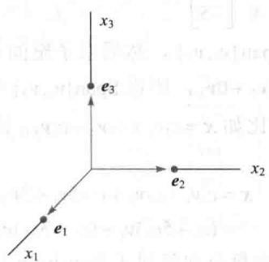
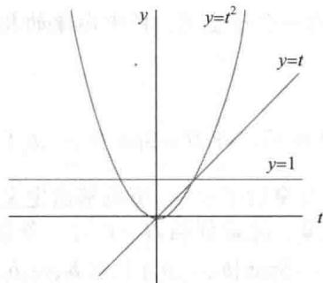
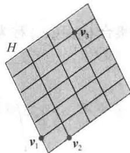
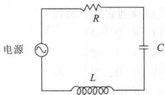

import Knowledge from '@/components/Knowledge.astro';
import Example from '@/components/Example.astro';
import Note from '@/components/Note.astro';
import Solution from '@/components/Solution.astro';
import Block from '@/components/Block.astro';

本节我们确认并研究尽可能“有效地”生成一个向量空间 $V$ 或一个子空间 $H$ 的子集. 关键是线性无关，这与定义在 $\mathbb{R}^n$ 中的一样.

V 中向量的一个指标集 $\{v_{1},\cdots,v_{p}\}$ 称为是线性无关的，如果向量方程

$$

c _ {1} \boldsymbol {v} _ {1} + c _ {2} \boldsymbol {v} _ {2} + \dots + c _ {p} \boldsymbol {v} _ {p} = \mathbf {0}\tag{1}

$$

只有平凡解，即 $c_{1}=0,\cdots,c_{p}=0.$

集合 $\{v_{1},\cdots,v_{p}\}$ 称为线性相关，如果（1）有一个非平凡的解，即存在某些权 $c_{1},\cdots,c_{p}$ 不全为零，使得（1）式成立．此时（1）式称为 $v_{1},\cdots,v_{p}$ 之间的一个线性相关关系．

与 $\mathbb{R}^n$ 中一样，一个仅含一个向量 $\pmb{\nu}$ 的集合是线性无关的当且仅当 $\pmb{\nu} \neq \pmb{0}$ ；一个仅含两个向量的集合是线性相关的当且仅当其中一个向量是另一个的倍数；任何含有零向量的集合是线性相关的。下列定理与1.7节中定理7的证法相同。

<Knowledge title="定理 4">
两个或多个向量组成的有编号的向量集合 $\{v_{1},\cdots,v_{p}\}$ （如果 $v_{1}\neq0$ ）是线性相关的，当且仅当某 $v_{j}(j>1)$ 是其前面向量 $v_{1},\cdots,v_{j-1}$ 的线性组合.

一般向量空间中的线性相关与 $\mathbb{R}^n$ 中的线性相关的主要不同点在于当向量不是 $n$ 元组时，齐次方程（1）通常不能被写作一个 $n$ 元线性方程组。换句话说，为了研究方程 $Ax = 0$ ，向量不能从一个矩阵 $A$ 的列中得到，取而代之的是我们必须要依靠线性相关的定义和定理4.
</Knowledge>

<Example title="例 1">
令 $p_{1}(t)=1, p_{2}(t)=t, p_{3}(t)=4-t$ ，则由于 $p_{3}=4p_{1}-p_{2}$ ，从而 $\{p_{1},p_{2},p_{3}\}$ 是线性相关的.
</Example>

<Example title="例 2">
集合 $\{\sin t, \cos t\}$ 在 $C[0,1]$ 中是线性无关的，这是因为作为 $C[0,1]$ 中的向量， $\sin t$ 和 $\cos t$ 中任一个均不是另一个的倍数。即不存在数 $c$ 使得 $\cos t = c \cdot \sin t$ 对任意 $t \in [0,1]$ 成立（见 $\sin t$ 和 $\cos t$ 的图像）。然而， $\{\sin t \cos t, \sin 2t\}$ 是线性相关的，这是因为 $\sin 2t = 2\sin t \cos t$ 对任意 $t \in [0,1]$ 均成立。

定义 令 H 是向量空间 V 的一个子空间. V 中向量的指标集 $B=\{b_{1},\cdots,b_{p}\}$ 称为 H 的一个基, 如果

(i) B 是一线性无关集.

(ii) 由 B 生成的子空间与 H 相同，即 $H = \text{Span}\{\boldsymbol{b}_{1}, \cdots, \boldsymbol{b}_{p}\}$ .

因为任一个向量空间都是其自身的子空间，所以基的定义也可用在 H=V 的情形，因而 V 的一个基是生成 V 的一个线性无关集。注意到当 $H \neq V$ 时，条件（ii）蕴涵 $b_{1}, \cdots, b_{p}$ 中每个向量都属于 H，因为正如 4.1 节中所见， $\operatorname{Span}\{\boldsymbol{b}_{1}, \cdots, \boldsymbol{b}_{p}\}$ 包含 $b_{1}, \cdots, b_{p}$ 。
</Example>

<Example title="例 3">
令 A 是一个可逆的 $n \times n$ 矩阵，比如 $A = [a_{1} \cdots a_{n}]$ ，则由可逆矩阵定理，A 的列组成 $R^{n}$ 的一个基，这是因为它们是线性无关的且它们可以生成 $R^{n}$ .
</Example>

<Example title="例 4">
令 $e_{1},\cdots,e_{n}$ 是 $n\times n$ 单位矩阵 $I_{n}$ 的列，即

$$

\boldsymbol {e} _ {1} = \left[ \begin{array}{l} 1 \\ 0 \\ \vdots \\ 0 \end{array} \right], \boldsymbol {e} _ {2} = \left[ \begin{array}{l} 0 \\ 1 \\ \vdots \\ 0 \end{array} \right], \dots , \boldsymbol {e} _ {n} = \left[ \begin{array}{l} 0 \\ \vdots \\ 0 \\ 1 \end{array} \right]

$$

集合 $\{e_{1},\cdots,e_{n}\}$ 称为 $R^{n}$ 的标准基（图4-13）.

  

图 4-13 $R^{3}$ 的标准基

$$

\sqrt {C} + \sqrt {C}

$$
</Example>

<Example title="例 5">
令 $\pmb{v}_{1} = \begin{bmatrix} 3 \\ 0 \\ -6 \end{bmatrix}, \pmb{v}_{2} = \begin{bmatrix} -4 \\ 1 \\ 7 \end{bmatrix}, \pmb{v}_{3} = \begin{bmatrix} -2 \\ 1 \\ 5 \end{bmatrix}$ ，判断 $\{\pmb{v}_{1}, \pmb{v}_{2}, \pmb{v}_{3}\}$ 是否是 $\mathbb{R}^3$ 的一个基.

<Solution title="解">
因 $v_{1}, v_{2}, v_{3}$ 恰是 $R^{3}$ 中的 3 个向量，所以可以用几种方法判定矩阵 $A = [v_{1}, v_{2}, v_{3}]$ 是否可逆. 比如通过简单计算得 $\det A = 6 \neq 0$ ，从而 A 可逆. 如例 3 中所示，A 的列是 $R^{3}$ 的一个基.
</Solution>
</Example>

<Example title="例 6">
令 $S=\{1,t,t^{2},\cdots,t^{n}\}$ ，证明 S 是 $P_{n}$ 的一个基，此基称为 $P_{n}$ 的标准基.

<Solution title="解">
显然 S 生成 $P_{n}$ 。为证 S 是线性无关的，假设 $c_{0},\cdots,c_{n}$ 满足

$$

c _ {0} \cdot 1 + c _ {1} t + c _ {2} t ^ {2} + \dots + c _ {n} t ^ {n} = \mathbf {0} (t)\tag{2}

$$

此式表明左边的多项式与右边的零多项式具有相同的值。由代数的基本定理知， $P_{n}$ 中的多项式若有多于n个的根则此多项式一定为零多项式，即对任意t，只有当 $c_{0}=\cdots=c_{n}=0$ 时（2）成立，于是证明S是线性无关的且是 $P_{n}$ 的一个基，见图4-14.

  

图4-14 $\mathbb{P}_2$ 的标准基

涉及 $P_{n}$ 中线性无关和生成的问题用 4.4 节中讨论的技巧处理最合适.
</Solution>
</Example>

## 生成集定理

正如将要看到的，一个基是一个不包含不必要向量的“高效率”的生成集。事实上，一个基可以通过由一个生成集中去掉不需要的向量构造出来。

<Example title="例 7">
令 $\pmb{v}_{1} = \begin{bmatrix} 0 \\ 2 \\ -1 \end{bmatrix}, \pmb{v}_{2} = \begin{bmatrix} 2 \\ 2 \\ 0 \end{bmatrix}, \pmb{v}_{3} = \begin{bmatrix} 6 \\ 16 \\ -5 \end{bmatrix}, H = \mathrm{Span}\{\pmb{v}_{1}, \pmb{v}_{2}, \pmb{v}_{3}\}$ . 注意到 $\pmb{v}_{3} =$

$5\pmb{v}_{1} + 3\pmb{v}_{2}$ ，证明 $\operatorname {Span}\{\pmb{v}_1,\pmb{v}_2,\pmb{v}_3\} = \operatorname {Span}\{\pmb{v}_1,\pmb{v}_2\}$ ，然后求子空间 $H$ 的一个基.

<Solution title="解">
因为 $c_{1}\pmb{v}_{1} + c_{2}\pmb{v}_{2} = c_{1}\pmb{v}_{1} + c_{2}\pmb{v}_{2} + 0\pmb{v}_{3}$ ，所以 $\operatorname{Span}\{\pmb{v}_1, \pmb{v}_2\}$ 中每个向量都在 $H$ 中。现令 $\pmb{x}$ 为 $H$ 中任一向量，比如 $\pmb{x} = c_{1}\pmb{v}_{1} + c_{2}\pmb{v}_{2} + c_{3}\pmb{v}_{3}$ 。因 $\pmb{v}_{3} = 5\pmb{v}_{1} + 3\pmb{v}_{2}$ ，代入得

$$

\begin{array}{r l} \boldsymbol {x} & = c _ {1} \boldsymbol {v} _ {1} + c _ {2} \boldsymbol {v} _ {2} + c _ {3} (5 \boldsymbol {v} _ {1} + 3 \boldsymbol {v} _ {2}) \\ & = (c _ {1} + 5 c _ {3}) \boldsymbol {v} _ {1} + (c _ {2} + 3 c _ {3}) \boldsymbol {v} _ {2} \end{array}

$$

于是 x 在 $Span\{v_{1}, v_{2}\}$ 中，从而 H 中每个向量属于 $Span\{v_{1}, v_{2}\}$ ，于是 H 与 $Span\{v_{1}, v_{2}\}$ 相同。又由于 $\{v_{1}, v_{2}\}$ 显然是线性无关的，所以 $\{v_{1}, v_{2}\}$ 是 H 的一个基。

下一个定理推广了例7.
</Solution>
</Example>

<Knowledge title="定理 5">
（生成集定理）

令 $S=\{\pmb{v}_{1},\cdots,\pmb{v}_{p}\}$ 是 V 中的向量集， $H=\operatorname{Span}\{\pmb{v}_{1},\cdots,\pmb{v}_{p}\}$ .

a. 若 S 中某一个向量（比如说 $v_{k}$ ）是 S 中其余向量的线性组合，则 S 中去掉 $v_{k}$ 后形成的集合仍然可以生成 H.

b. 若 $H \neq \{\mathbf{0}\}$ ，则 $S$ 的某一子集是 $H$ 的一个基.

<Solution title="证明">
a. 若必要的话，可以重排 S 中向量的顺序，这样可以假设 $v_{p}$ 是 $v_{1}, \cdots, v_{p-1}$ 的线性组合，即

$$

\boldsymbol {v} _ {p} = a _ {1} \boldsymbol {v} _ {1} + \dots + a _ {p - 1} \boldsymbol {v} _ {p - 1}\tag{3}

$$

任给 H 中向量 x，取适当的数 $c_{1}, \cdots, c_{p}$ ，x 可写成

$$

\boldsymbol {x} = c _ {1} \boldsymbol {v} _ {1} + \dots + c _ {p - 1} \boldsymbol {v} _ {p - 1} + c _ {p} \boldsymbol {v} _ {p}\tag{4}

$$

将（3）中 $v_{p}$ 的表达式代入（4）式，易见 x 是 $v_{1}, \cdots, v_{p-1}$ 的线性组合。由于 x 是 H 中任一元素，所以 $\{v_{1}, \cdots, v_{p-1}\}$ 生成 H。

b. 若原来的生成集 $S$ 是线性无关的，则它已经是 $H$ 的一个基。若不然， $S$ 中某一个向量可表示成其余向量的线性组合，且由（a）该向量可去掉。这样生成集中只要还有两个或更多的向量，我们就可以重复上述过程，直到这个生成集是线性无关的，从而是 $H$ 的一个基。假如生成集最终被缩减到一个向量，则该向量是非零向量（从而是线性无关的），这是因为 $H \neq \{\mathbf{0}\}$ 。
</Solution>
</Knowledge>

## NulA 和 ColA 的基

我们已经知道如何求能够生成一个矩阵 $A$ 的零空间的向量了. 4.2 节中的讨论指出当 $\operatorname{Nul} A$ 包含非零向量时, 我们的方法总可以产生一个线性无关集, 从而由该方法可以得到 $\operatorname{Nul} A$ 的一个基. 下面两个例子给出对列空间求基的简单算法.

<Example title="例 8">
求 $\operatorname{Col} B$ 的一个基，其中

$$

B = \left[ \begin{array}{l l l l} \boldsymbol {b} _ {1} & \boldsymbol {b} _ {2} & \dots & \boldsymbol {b} _ {5} \end{array} \right] = \left[ \begin{array}{c c c c c} 1 & 4 & 0 & 2 & 0 \\ 0 & 0 & 1 & - 1 & 0 \\ 0 & 0 & 0 & 0 & 1 \\ 0 & 0 & 0 & 0 & 0 \end{array} \right]

$$

<Solution title="解">
$B$ 的每个非主元列是主元列的线性组合，事实上， $\pmb{b}_2 = 4\pmb{b}_1, \pmb{b}_4 = 2\pmb{b}_1 - \pmb{b}_3$ 。由生成集定理，可以去掉 $\pmb{b}_2$ 和 $\pmb{b}_4$ ， $\{\pmb{b}_1, \pmb{b}_3, \pmb{b}_5\}$ 仍可以生成 $\operatorname{Col} B$ 。令

$$

S = \left\{\boldsymbol {b} _ {1}, \boldsymbol {b} _ {3}, \boldsymbol {b} _ {5} \right\} = \left\{\left[ \begin{array}{l} 1 \\ 0 \\ 0 \\ 0 \end{array} \right], \left[ \begin{array}{l} 0 \\ 1 \\ 0 \\ 0 \end{array} \right], \left[ \begin{array}{l} 0 \\ 0 \\ 1 \\ 0 \end{array} \right] \right\}

$$

因为 $b_{1} \neq 0$ ，同时 S 中的向量都不是其前面向量的线性组合，所以 S 是线性无关的（定理 4），从而 S 是 Col B 的一个基.

一个矩阵 A 若不是简化阶梯形将如何？回顾 A 的列中任何线性相关关系都可以用 Ax=0 的形式刻画，其中 x 是一个加权的列。（若某些列没有被包括在一特殊的相关关系中，则它们的权为零。）当 A 被行化简成矩阵 B 时，B 的列通常与 A 的列完全不同，然而，方程 Ax=0 与 Bx=0 有完全相同的解集。若 $A=[a_{1}\cdots a_{n}]$ 和 $B=[b_{1}\cdots b_{n}]$ ，则向量方程 $x_{1}a_{1}+\cdots+x_{n}a_{n}=0$ 和 $x_{1}b_{1}+\cdots+x_{n}b_{n}=0$ 也有相同的解集。即 A 的列与 B 的列具有完全相同的线性相关关系。
</Solution>
</Example>

<Example title="例 9">
可以证明矩阵

$$

A = \left[ \begin{array}{l l l l} \boldsymbol {a} _ {1} & \boldsymbol {a} _ {2} & \dots & \boldsymbol {a} _ {5} \end{array} \right] = \left[ \begin{array}{c c c c c} 1 & 4 & 0 & 2 & - 1 \\ 3 & 1 2 & 1 & 5 & 5 \\ 2 & 8 & 1 & 3 & 2 \\ 5 & 2 0 & 2 & 8 & 8 \end{array} \right]

$$

行等价于例8中的矩阵 $B$ ，求 $\operatorname{Col}A$ 的一个基.

<Solution title="解">
在例8中，易见

$$

\boldsymbol {b} _ {2} = 4 \boldsymbol {b} _ {1}, \boldsymbol {b} _ {4} = 2 \boldsymbol {b} _ {1} - \boldsymbol {b} _ {3}

$$

所以可以得到

$$

\boldsymbol {a} _ {2} = 4 \boldsymbol {a} _ {1}, \quad \boldsymbol {a} _ {4} = 2 \boldsymbol {a} _ {1} - \boldsymbol {a} _ {3}

$$

经检验，这是对的，从而在挑选 $\operatorname{Col} A$ 的最小生成集时，可以去掉 $a_2$ 和 $a_4$ 。事实上， $\{a_1, a_3, a_5\}$ 一定是线性无关的，这是因为 $a_1, a_3, a_5$ 之间的任何线性相关关系都蕴涵 $b_1, b_3, b_5$ 之间的一个线性相关关系。但我们已知 $\{b_1, b_3, b_5\}$ 是一个线性无关集，于是 $\{a_1, a_3, a_5\}$ 是 $\operatorname{Col} A$ 的一个基，此基中我们选取的列是 $A$ 的主元列。

例 8 和例 9 说明了下列有用的事实.
</Solution>
</Example>

<Knowledge title="定理 6">
矩阵 $A$ 的主元列构成 $\operatorname{Col} A$ 的一个基.

<Solution title="证明">
一般的证明用到上面讨论的论证. 令 $B$ 是 $A$ 的简化阶梯形, 由于 $B$ 的主元列中的任一个向量都不是其前面主元列的线性组合, 故 $B$ 中的主元列是线性无关的. 又由 $A$ 行等价于 $B$ , $A$ 中列的任何线性相关关系对应于 $B$ 中列的线性相关关系, 所以 $A$ 中的主元列也是线性无关的. 同理, $A$ 中每个非主元列是 $A$ 中主元列的线性组合, 由生成集定理, $A$ 中非主元列可以从 $\operatorname{Col} A$ 的生成集中去掉, 剩下的 $A$ 的主元列是 $\operatorname{Col} A$ 的一个基.
</Solution>
</Knowledge>

<Note>
当矩阵 $A$ 仅被化简为简化阶梯形时， $A$ 的主元列是明显的。对 $\operatorname{Col} A$ 的基，要慎重使用 $A$ 本身的主元列。行变换可以改变矩阵的列空间。阶梯形 $B$ 的主元列通常不在 $A$ 的列空间中，比如，例8中 $B$ 的列最后一个元素均为零，所以它们不能生成例9中 $A$ 的列空间。
</Note>

## 关于基的两点观察

使用生成集定理时，从生成集中删除向量在集合变成线性无关时必须停止。如果再多删一个向量，该向量将不是剩下向量的线性组合，从而这个较小的集合将不再生成 $V$ ，所以基是一个尽可能小的生成集。

基还是尽可能大的线性无关集. 若 $S$ 是 $V$ 的一个基, 在 $S$ 中再添加进一个新的向量, 比如是从 $V$ 中取的一个 $\pmb{w}$ , 则新的集合不再是线性无关了, 这是因为 $S$ 生成 $V$ , 因此 $\pmb{w}$ 是 $S$ 中元素的线性组合.

<Example title="例 10">
下列 $\mathbb{R}^3$ 中的三个集合说明一个线性无关集如何被扩充为一个基，同时进一步的扩充如何破坏这个集合的线性无关性。再者，一个生成集可以收缩成一个基，但进一步的收缩就破坏了生成性。

$$

\left\{\left[ \begin{array}{l} 1 \\ 0 \\ 0 \end{array} \right], \left[ \begin{array}{l} 2 \\ 3 \\ 0 \end{array} \right] \right\}

$$

$$

\left\{\left[ \begin{array}{l} 1 \\ 0 \\ 0 \end{array} \right], \left[ \begin{array}{l} 2 \\ 3 \\ 0 \end{array} \right], \left[ \begin{array}{l} 4 \\ 5 \\ 6 \end{array} \right] \right\}

$$

$$

\left\{\left[ \begin{array}{l} 1 \\ 0 \\ 0 \end{array} \right], \left[ \begin{array}{l} 2 \\ 3 \\ 0 \end{array} \right], \left[ \begin{array}{l} 4 \\ 5 \\ 6 \end{array} \right], \left[ \begin{array}{l} 7 \\ 8 \\ 9 \end{array} \right] \right\}

$$

线性无关，但不能生成 $\mathbb{R}^3$ $\mathbb{R}^3$ 的一个基

生成 $R^{3}$ ，但线性相关
</Example>

<Block title="练习题">

1. 令 $\pmb{v}_1 = \begin{bmatrix} 1 \\ -2 \\ 3 \end{bmatrix}$ , $\pmb{v}_2 = \begin{bmatrix} -2 \\ 7 \\ -9 \end{bmatrix}$ , 判断 $\{\pmb{v}_1, \pmb{v}_2\}$ 是否是 $\mathbb{R}^3$ 的一个基, $\{\pmb{v}_1, \pmb{v}_2\}$ 是否是 $\mathbb{R}^2$ 的一个基.

2. 令 $\pmb{v}_{1} = \begin{bmatrix} 1 \\ -3 \\ 4 \end{bmatrix}$ , $\pmb{v}_{2} = \begin{bmatrix} 6 \\ 2 \\ -1 \end{bmatrix}$ , $\pmb{v}_{3} = \begin{bmatrix} 2 \\ -2 \\ 3 \end{bmatrix}$ , $\pmb{v}_{4} = \begin{bmatrix} -4 \\ -8 \\ 9 \end{bmatrix}$ , 求由 $\{\pmb{v}_{1},\pmb{v}_{2},\pmb{v}_{3},\pmb{v}_{4}\}$ 生成的子空间 $W$ 的一个基.

3. 令 $\pmb{v}_1 = \begin{bmatrix} 1 \\ 0 \\ 0 \end{bmatrix}$ , $\pmb{v}_2 = \begin{bmatrix} 0 \\ 1 \\ 0 \end{bmatrix}$ , $H = \left\{\begin{bmatrix} s \\ s \\ 0 \end{bmatrix}: s \in \mathbb{R}\right\}$ . 因为 $\begin{bmatrix} s \\ s \\ 0 \end{bmatrix} = s \begin{bmatrix} 1 \\ 0 \\ 0 \end{bmatrix} + s \begin{bmatrix} 0 \\ 1 \\ 0 \end{bmatrix}$ , 故 $H$ 中每一个向量都是 $\pmb{v}_1$ 和 $\pmb{v}_2$ 的线性

组合. 问 $\{\pmb{v}_1, \pmb{v}_2\}$ 是 $H$ 的一个基吗？

4. 设 V 和 W 是向量空间，且 $T: V \rightarrow W$ ， $U: V \rightarrow W$ 是线性变换。令 $\{v_{1}, \cdots, v_{p}\}$ 是 V 的一个基。如果 $T(\boldsymbol{v}_{j}) = U(\boldsymbol{v}_{j})$ ， $j \in [1, p]$ ，证明 $T(\boldsymbol{x}) = U(\boldsymbol{x})$ ， $x \in V$ 。

</Block>

<Block title="习题4.3">

判断习题 1\~8 中哪一个集合是 $R^{3}$ 的基. 在不是基的集合中, 判断哪一个是线性无关的, 哪一个能生成 $R^{3}$ , 证明你的答案.

1.

$$

\left[ \begin{array}{l} 1 \\ 0 \\ 0 \end{array} \right], \left[ \begin{array}{l} 1 \\ 1 \\ 0 \end{array} \right], \left[ \begin{array}{l} 1 \\ 1 \\ 1 \end{array} \right]

$$

2.

$$

\left[ \begin{array}{l} 1 \\ 0 \\ 1 \end{array} \right], \left[ \begin{array}{l} 0 \\ 0 \\ 0 \end{array} \right], \left[ \begin{array}{l} 0 \\ 1 \\ 0 \end{array} \right]

$$

3.

$$

\left[ \begin{array}{c} 1 \\ 0 \\ - 2 \end{array} \right], \left[ \begin{array}{c} 3 \\ 2 \\ - 4 \end{array} \right], \left[ \begin{array}{c} - 3 \\ - 5 \\ 1 \end{array} \right]

$$

4.

$$

\left[ \begin{array}{c} 2 \\ - 2 \\ 1 \end{array} \right], \left[ \begin{array}{c} 1 \\ - 3 \\ 2 \end{array} \right], \left[ \begin{array}{c} - 7 \\ 5 \\ 4 \end{array} \right]

$$

5.

$$

\left[ \begin{array}{c} 1 \\ - 3 \\ 0 \end{array} \right], \left[ \begin{array}{c} - 2 \\ 9 \\ 0 \end{array} \right], \left[ \begin{array}{c} 0 \\ 0 \\ 0 \end{array} \right], \left[ \begin{array}{c} 0 \\ - 3 \\ 5 \end{array} \right]

$$

6.

$$

\left[ \begin{array}{c} 1 \\ 2 \\ - 3 \end{array} \right], \left[ \begin{array}{c} - 4 \\ - 5 \\ 6 \end{array} \right]

$$

7.

$$

\left[ \begin{array}{c} - 2 \\ 3 \\ 0 \end{array} \right], \left[ \begin{array}{c} 6 \\ - 1 \\ 5 \end{array} \right]

$$

8.

$$

\left[ \begin{array}{c} 1 \\ - 4 \\ 3 \end{array} \right], \left[ \begin{array}{c} 0 \\ 3 \\ - 1 \end{array} \right], \left[ \begin{array}{c} 3 \\ - 5 \\ 4 \end{array} \right], \left[ \begin{array}{c} 0 \\ 2 \\ - 2 \end{array} \right]

$$

对习题 9\~10 中的矩阵，求其零空间的基，参考 4.2 节中例 3 下面的讨论.

9.

$$

\left[ \begin{array}{c c c c} 1 & 0 & - 3 & - 2 \\ 0 & 1 & - 5 & 4 \\ 3 & - 2 & 1 & - 2 \end{array} \right]

$$

10.

$$

\left[ \begin{array}{r r r r r} 1 & 0 & - 5 & 1 & 5 \\ - 2 & 1 & 6 & - 2 & - 2 \\ 0 & 2 & - 8 & 1 & 9 \end{array} \right]

$$

11. 求 $R^{3}$ 中平面 $x + 2y + z = 0$ 中向量的集合的一个基。（提示：将该方程视为一个齐次线性方程组。）

12. 求 $R^{2}$ 中直线 y=5x 上向量的集合的一个基.

在习题 13\~14 中, 假设 A 行等价于 B, 求 Nul A 和 Col A 的基.

$$

1 3. A = \left[ \begin{array}{r r r r} - 2 & 4 & - 2 & - 4 \\ 2 & - 6 & - 3 & 1 \\ - 3 & 8 & 2 & - 3 \end{array} \right], B = \left[ \begin{array}{r r r r} 1 & 0 & 6 & 5 \\ 0 & 2 & 5 & 3 \\ 0 & 0 & 0 & 0 \end{array} \right]

$$

$$

1 4. A = \left[ \begin{array}{c c c c c} 1 & 2 & - 5 & 1 1 & - 3 \\ 2 & 4 & - 5 & 1 5 & 2 \\ 1 & 2 & 0 & 4 & 5 \\ 3 & 6 & - 5 & 1 9 & - 2 \end{array} \right], B = \left[ \begin{array}{c c c c c} 1 & 2 & 0 & 4 & 5 \\ 0 & 0 & 5 & - 7 & 8 \\ 0 & 0 & 0 & 0 & - 9 \\ 0 & 0 & 0 & 0 & 0 \end{array} \right]

$$

在习题 15\~18 中，求由给定向量 $v_{1}, \cdots, v_{5}$ 生成的空间的一个基.

15.

$$

\left[ \begin{array}{r} 1 \\ 0 \\ - 3 \\ 2 \end{array} \right], \left[ \begin{array}{r} 0 \\ 1 \\ 2 \\ - 3 \end{array} \right], \left[ \begin{array}{r} - 3 \\ - 4 \\ 1 \\ 6 \end{array} \right], \left[ \begin{array}{r} 1 \\ - 3 \\ - 8 \\ 7 \end{array} \right], \left[ \begin{array}{r} 2 \\ 1 \\ - 6 \\ 9 \end{array} \right]

$$

16.

$$

\left[ \begin{array}{c} 1 \\ 0 \\ 0 \\ 1 \end{array} \right], \left[ \begin{array}{c} - 2 \\ 1 \\ - 1 \\ 1 \end{array} \right], \left[ \begin{array}{c} 6 \\ - 1 \\ 2 \\ - 1 \end{array} \right], \left[ \begin{array}{c} 5 \\ - 3 \\ 3 \\ - 4 \end{array} \right], \left[ \begin{array}{c} 0 \\ 3 \\ - 1 \\ 1 \end{array} \right]

$$

$$

1 7. [ \mathrm{M} ] \left[ \begin{array}{c} 8 \\ 9 \\ - 3 \\ - 6 \\ 0 \end{array} \right], \left[ \begin{array}{c} 4 \\ 5 \\ 1 \\ - 4 \\ 4 \end{array} \right], \left[ \begin{array}{c} - 1 \\ - 4 \\ - 9 \\ 6 \\ - 7 \end{array} \right], \left[ \begin{array}{c} 6 \\ 8 \\ 4 \\ - 7 \\ 1 0 \end{array} \right], \left[ \begin{array}{c} - 1 \\ 4 \\ 1 1 \\ - 8 \\ - 7 \end{array} \right]

$$

$$

1 8. [ \mathrm{M} ] \left[ \begin{array}{c} - 8 \\ 7 \\ 6 \\ 5 \\ - 7 \end{array} \right], \left[ \begin{array}{c} 8 \\ - 7 \\ - 9 \\ - 5 \\ 7 \end{array} \right], \left[ \begin{array}{c} - 8 \\ 7 \\ 4 \\ 5 \\ - 7 \end{array} \right], \left[ \begin{array}{c} 1 \\ 4 \\ 9 \\ 6 \\ - 7 \end{array} \right], \left[ \begin{array}{c} - 9 \\ 3 \\ - 4 \\ - 1 \\ 0 \end{array} \right]

$$

19. 令 $\pmb{v}_{1} = \begin{bmatrix} 4 \\ -3 \\ 7 \end{bmatrix}$ , $\pmb{v}_{2} = \begin{bmatrix} 1 \\ 9 \\ -2 \end{bmatrix}$ , $\pmb{v}_{3} = \begin{bmatrix} 7 \\ 11 \\ 6 \end{bmatrix}$ , $H =$ Span $\{\pmb{v}_{1},\pmb{v}_{2},\pmb{v}_{3}\}$ . 可以证明 $4\pmb{v}_{1} + 5\pmb{v}_{2} - 3\pmb{v}_{3} = \mathbf{0}$ . 利用这个信息求 $H$ 的一个基, 答案不唯一.

20. 令 $\pmb{v}_{1} = \begin{bmatrix} 7 \\ 4 \\ -9 \\ -5 \end{bmatrix}$ , $\pmb{v}_{2} = \begin{bmatrix} 4 \\ -7 \\ 2 \\ 5 \end{bmatrix}$ , $\pmb{v}_{3} = \begin{bmatrix} 1 \\ -5 \\ 3 \\ 4 \end{bmatrix}$ , 可以证明 $\pmb{v}_{1}-3\pmb{v}_{2}+5\pmb{v}_{3}=\mathbf{0}$ , 利用此信息求 $H=\text{Span}\{\pmb{v}_{1}, \pmb{v}_{2}, \pmb{v}_{3}\}$ 的一个基.

在习题21和习题22中，标出每个命题的真假，给出理由.

21. a. 单独一个向量是线性相关的.

b. 若 $H = \text{Span}\{\boldsymbol{b}_{1}, \cdots, \boldsymbol{b}_{p}\}$ ，则 $\{\boldsymbol{b}_{1}, \cdots, \boldsymbol{b}_{p}\}$ 是 H 的一个基.

c. 一个 $n \times n$ 可逆矩阵的列构成 $\mathbb{R}^n$ 的一个基.  

d. 基是一个尽可能大的生成集.

e. 在某些情形，矩阵列之间的线性相关关系受某种初等行变换的影响.

22. a. 子空间 H 中一个线性无关集是 H 的一个基.

b. 若非零向量的一个有限集合 S 生成一个向量空间 V，则 S 的某子集是 V 的一个基.

c. 基是一个尽可能大的线性无关集.

d. 4.2 节中描述的对 Nul A 产生一个生成集的标准方法有时对产生 Nul A 的基不起作用.

e. 若 $B$ 是矩阵 $A$ 的阶梯形，则 $B$ 的主元列构成 $\operatorname{Col} A$ 的一个基.

23. 设 $R^{4} = \operatorname{Span}\{\nu_{1}, \cdots, \nu_{4}\}$ ，解释为什么 $\{\nu_{1}, \cdots, \nu_{4}\}$ 是 $R^{4}$ 的一个基.

24. 令 $B=\{v_{1},\cdots,v_{n}\}$ 是 $R^{n}$ 中的一个线性无关集，解释为什么 $\{v_{1},\cdots,v_{n}\}$ 是 $R^{n}$ 的一个基.

25. 令 $\pmb{v}_{1} = \begin{bmatrix} 1 \\ 0 \\ 1 \end{bmatrix}$ , $\pmb{v}_{2} = \begin{bmatrix} 0 \\ 1 \\ 1 \end{bmatrix}$ , $\pmb{v}_{3} = \begin{bmatrix} 0 \\ 1 \\ 0 \end{bmatrix}$ , 令 $H$ 是 $\mathbb{R}^{3}$ 中第二和第三个元素相同的向量的集合。由于 $\begin{bmatrix} s \\ t \\ t \end{bmatrix} = s\begin{bmatrix} 1 \\ 0 \\ 1 \end{bmatrix} + (t - s)\begin{bmatrix} 0 \\ 1 \\ 1 \end{bmatrix} + s\begin{bmatrix} 0 \\ 1 \\ 0 \end{bmatrix}$ 对任意 $s$ 和 $t$ 均成立，故 $H$ 中每个向量有由 $\pmb{v}_{1}, \pmb{v}_{2}, \pmb{v}_{3}$ 线性组合而成的唯一的一个表达式。问 $\{\pmb{v}_{1}, \pmb{v}_{2}, \pmb{v}_{3}\}$ 是 $H$ 的基吗？为什么是或为什么不是？

26. 在所有实值函数的向量空间中，求由 $\{\sin t, \sin 2t, \sin t \cos t\}$ 生成的子空间的一个基.

27. 令 V 是刻画物体-弹簧系统振动的函数的向量空间（参考 4.1 节中习题 19），求 V 的一个基.

28. （RLC 电路）下图中的电路由一个电阻器[R，欧姆]、一个电感[L，亨]、一个电容器[C，法拉]和一个初始电源组成。令 $b = R / (2L)$ ，同时假设R，L，C已经选好使得b也等于 $1 / \sqrt{LC}$ 。（这是可以做到的，比如，在一个伏特计中使用该电路时。）令 $v(t)$ 表示时间t时的电压（伏特），它由电容器的两端测得。可以证明v在将 $v(t)$ 映到 $Lv''(t) + Rv'(t) + (1/C)v(t)$ 的线性变换的零空间H中，H由所有形如 $v(t) = e^{-bt}(c_1 + c_2t)$ 的函数构成。求H的一个基。

习题 29\~30 表明 $R^{n}$ 中每一个基一定恰好由 n 个向量构成.

29. 令 $S = \{\nu_{1}, \cdots, \nu_{k}\}$ 是 $\mathbb{R}^{n}$ 中 $k$ 个向量的集合， $k < n$ 。利用 1.4 节中的一个定理解释为什么 $S$ 不能是 $\mathbb{R}^{n}$ 的一个基。

30. 令 $S = \{\nu_1, \dots, \nu_k\}$ 是 $\mathbb{R}^n$ 中 $k$ 个向量的集合， $k > n$ 。利用第1章中的一个定理解释为什么 $S$ 不能是 $\mathbb{R}^n$ 的一个基。

习题31和习题32表明线性无关和线性变换之间的一个重要联系，同时提供了使用线性相关定义的练习。令 $V$ 和 $W$ 是向量空间， $T: V \to W$ 是一个线性变换， $\{\pmb{v}_1, \dots, \pmb{v}_p\}$ 是 $V$ 的一个子集。

31. 证明：若 $\{\pmb{v}_1, \dots, \pmb{v}_p\}$ 在 $V$ 中是线性相关的，则其像集 $\{T(\pmb{v}_1), \dots, T(\pmb{v}_p)\}$ 在 $W$ 中也是线性相关的。这个事实表明如果一个线性变换将集 $\{\pmb{v}_1, \dots, \pmb{v}_p\}$ 映上到线性无关集 $\{T(\pmb{v}_1), \dots, T(\pmb{v}_p)\}$ ，则原来的集合也是线性无关的。（因为它不能是线性相关的。）

32. 假设 T 是一个一对一的变换，使得方程 $T(\boldsymbol{u}) = T(\boldsymbol{v})$ 总是蕴涵 u = v 。证明：如果像集 $\{T(\boldsymbol{v}_{1}), \cdots, T(\boldsymbol{v}_{p})\}$ 是线性相关的，则 $\{\boldsymbol{v}_{1}, \cdots, \boldsymbol{v}_{p}\}$ 也线性相关。这个事实表明一个一对一的线性变换将线性无关集映上到一个线性无关集。（因为在此种情形下，像集合不能是线性相关的。）

33. 考虑多项式 $p_1(t) = 1 + t^2$ ， $p_2(t) = 1 - t^2$ ： $\{p_1, p_2\}$

</Block>

<Block title="练习题答案">

1. 令 $A = [\nu_{1}, \nu_{2}]$ ，行变换表明

$$

A = \left[ \begin{array}{c c} 1 & - 2 \\ - 2 & 7 \\ 3 & - 9 \end{array} \right] \sim \left[ \begin{array}{c c} 1 & - 2 \\ 0 & 3 \\ 0 & 0 \end{array} \right]

$$

是 $\mathbb{P}_3$ 中的线性无关集吗？为什么？

34. 考虑多项式 $\boldsymbol{p}_{1}(t)=1+t,\boldsymbol{p}_{2}(t)=1-t,\boldsymbol{p}_{3}(t)=2$ （对所有的 t）．检查 $p_{1},p_{2},p_{3}$ 之间的线性相关关系，然后求 Span $\{p_{1},p_{2},p_{3}\}$ 的一个基.

35. 设 V 是一个包含线性无关向量集 $\{u_{1}, u_{2}, u_{3}, u_{4}\}$ 的向量空间，说明如何构造 V 中的一个向量集 $\{v_{1}, v_{2}, v_{3}, v_{4}\}$ 使得 $\{v_{1}, v_{3}\}$ 是 Span $\{v_{1}, v_{2}, v_{3}, v_{4}\}$ 的一组基.

36. [M] 设 $H = \operatorname{Span}\{\pmb{u}_{1}, \pmb{u}_{2}, \pmb{u}_{3}\}$ , $K = \operatorname{Span}\{\pmb{v}_{1}, \pmb{v}_{2}, \pmb{v}_{3}\}$ ，其中

$$

\boldsymbol {u} _ {1} = \left[ \begin{array}{c} 1 \\ 2 \\ 0 \\ - 1 \end{array} \right], \quad \boldsymbol {u} _ {2} = \left[ \begin{array}{c} 0 \\ 2 \\ - 1 \\ 1 \end{array} \right], \quad \boldsymbol {u} _ {3} = \left[ \begin{array}{c} 3 \\ 4 \\ 1 \\ - 4 \end{array} \right],

$$

$$

\boldsymbol {v} _ {1} = \left[ \begin{array}{c} - 2 \\ - 2 \\ - 1 \\ 3 \end{array} \right], \boldsymbol {v} _ {2} = \left[ \begin{array}{c} 2 \\ 3 \\ 2 \\ - 6 \end{array} \right], \boldsymbol {v} _ {3} = \left[ \begin{array}{c} - 1 \\ 4 \\ 6 \\ - 2 \end{array} \right]

$$

求 $H, K$ 和 $H + K$ 的基。（参见4.1节的习题33和习题34.）

37. [M] 证明： $\{t, \sin t, \cos 2t, \sin t \cos t\}$ 是定义在 R 上的函数的一个线性无关集。开始先假设

$$

c _ {1} \cdot t + c _ {2} \cdot \sin t + c _ {3} \cdot \cos 2 t + c _ {4} \cdot \sin t \cos t = 0\tag{5}

$$

$A$ 中并不是每一行都含有一个主元位置，因而由1.4节中的定理4， $A$ 的列不能生成 $\mathbb{R}^3$ ，从而 $\{\pmb{v}_1,\pmb{v}_2\}$ 不是 $\mathbb{R}^3$ 的一个基．由于 $\pmb{v}_{1}$ 和 $\pmb{v}_{2}$ 不在 $\mathbb{R}^2$ 中，故它们不可能是 $\mathbb{R}^2$ 的一个基．然而，由于 $\pmb{v}_{1}$ 和 $\pmb{v}_{2}$ 显然是线性无关的，故它们是 $\mathbb{R}^3$ 的子空间Span $\{\pmb{v}_1,\pmb{v}_2\}$ 的一个基.

方程（5）对所有实数 t 一定成立，选几个特殊的 t 值（比如 t=0,0.1,0.2）直到得到由足够多的方程构成的方程组以便确定所有 $c_{j}$ 一定为零.

38. [M] 证明: $\{1, \cos t, \cos^2 t, \cdots, \cos^6 t\}$ 是定义在 $\mathbb{R}$ 上的函数的一个线性无关集. 利用 37 题中的方法. (此结果在 4.5 节中的习题 34 中用到.)

2. 构造矩阵 $A$ ，使它的列空间由 $\{\pmb{v}_1, \pmb{v}_2, \pmb{v}_3, \pmb{v}_4\}$ 生成，然后行化简 $A$ 从而找到它的主元列.

$$

A = \left[ \begin{array}{r r r r} 1 & 6 & 2 & - 4 \\ - 3 & 2 & - 2 & - 8 \\ 4 & - 1 & 3 & 9 \end{array} \right] \sim \left[ \begin{array}{r r r r} 1 & 6 & 2 & - 4 \\ 0 & 2 0 & 4 & - 2 0 \\ 0 & - 2 5 & - 5 & 2 5 \end{array} \right] \sim \left[ \begin{array}{r r r r} 1 & 6 & 2 & - 4 \\ 0 & 5 & 1 & - 5 \\ 0 & 0 & 0 & 0 \end{array} \right]

$$

$A$ 的前两列是主元列，因而构成 $\operatorname{Col} A = W$ 的一个基，从而 $\{\pmb{v}_1, \pmb{v}_2\}$ 是 $W$ 的一个基.

注意：为了确定主元列，不需要将 A 化成简化阶梯形.

3. $\pmb{v}_{1}$ 和 $\pmb{v}_{2}$ 均不在 $H$ 中，所以 $\{\pmb{v}_{1},\pmb{v}_{2}\}$ 不能是 $H$ 的一个基。事实上， $\{\pmb{v}_{1},\pmb{v}_{2}\}$ 是所有形如 $(c_{1}, c_{2}, 0)$ 的向量构成的平面的一个基，而 $H$ 仅仅是一条直线。

4. 由于 $\{\pmb{v}_1, \dots, \pmb{v}_p\}$ 是 $V$ 的一个基，对任一向量 $\pmb{x} \in V$ ，存在标量 $c_1, \dots, c_p$ ，使得 $\pmb{x} = c_1 \pmb{v}_1 + c_2 \pmb{v}_2 + \dots + c_p \pmb{v}_p$ 。则因 $T$ 和 $U$ 是线性变换，故

$$

T (\boldsymbol {x}) = T \left(c _ {1} \boldsymbol {v} _ {1} + \dots + c _ {p} \boldsymbol {v} _ {p}\right) = c _ {1} T \left(\boldsymbol {v} _ {1}\right) + \dots + c _ {p} T \left(\boldsymbol {v} _ {p}\right) = c _ {1} U \left(\boldsymbol {v} _ {1}\right) + \dots + c _ {p} U \left(\boldsymbol {v} _ {p}\right) = U \left(c _ {1} \boldsymbol {v} _ {1} + \dots c _ {p} \boldsymbol {v} _ {p}\right) = U (\boldsymbol {x})

$$

</Block>
