import Guide from '@/components/Guide.astro';
import Knowledge from '@/components/Knowledge.astro';
import Example from '@/components/Example.astro';
import Analysis from '@/components/Analysis.astro';
import Solution from '@/components/Solution.astro';
import Variant from '@/components/Variant.astro';
import Note from '@/components/Note.astro';
import Block from '@/components/Block.astro';
import Method from '@/components/Method.astro';
import Exercise from '@/components/Exercise.astro';

对一个向量空间 $V$ ，明确指定一个基 $\mathcal{B}$ 的一个重要原因是在 $V$ 上强加一个“坐标系”。本节将证明如果 $\mathcal{B}$ 包含 $n$ 个向量，则坐标系将使 $V$ 像 $\mathbb{R}^n$ 一样便于操作。若 $V$ 就是 $\mathbb{R}^n$ 本身，则 $\mathcal{B}$ 将确定一个坐标系，它给 $V$ 以一个新的“视角”。

坐标系的存在性依靠下列基本结果.

<Knowledge title="定理 7 唯一表示定理">
令 $B=\{b_{1},\cdots,b_{n}\}$ 是向量空间 V 的一个基，则对 V 中每个向量 x，存在唯一的一组数 $c_{1},\cdots,c_{n}$ 使得

$$
\boldsymbol {x} = c _ {1} \boldsymbol {b} _ {1} + \dots + c _ {n} \boldsymbol {b} _ {n}\tag{1}
$$

<Solution title="证明">
由于 B 生成 V，故存在一组数 $c_{1}, \cdots, c_{n}$ 使得（1）式成立，假设 x 还有其他表示：

$$
\boldsymbol {x} = d _ {1} \boldsymbol {b} _ {1} + \dots + d _ {n} \boldsymbol {b} _ {n}
$$

$d_{1},\cdots,d_{n}$ 为数，则二式相减有

$$
\mathbf {0} = \boldsymbol {x} - \boldsymbol {x} = (c _ {1} - d _ {1}) \boldsymbol {b} _ {1} + \dots + (c _ {n} - d _ {n}) \boldsymbol {b} _ {n}\tag{2}
$$

由于 B 是线性无关的，故（2）中的权一定为零，即 $c_{j}=d_{j}$ 对 $1 \leqslant j \leqslant n$ 成立.

定义 假设 $B=\{b_{1},\cdots,b_{n}\}$ 是 V 的一个基，x 在 V 中，x 相对于基 B 的坐标（或 x 的 B-坐标）是使得 $x=c_{1}b_{1}+\cdots+c_{n}b_{n}$ 的权 $c_{1},\cdots,c_{n}$ .

若 $c_{1},\cdots,c_{n}$ 是 x 的 B-坐标，则 $R^{n}$ 中的向量

$$
[ \boldsymbol {x} ] _ {B} = \left[ \begin{array}{c} c _ {1} \\ \vdots \\ c _ {n} \end{array} \right]
$$

是 x （相对于 B ）的坐标向量或 x 的 B-坐标向量，映射 $x \mapsto [x]_{B}$ 称为（由 B 确定的）坐标映射.
</Solution>
</Knowledge>

<Example title="例 1">
考虑 $\mathbb{R}^2$ 的一个基 $\mathcal{B} = \{\pmb{b}_1, \pmb{b}_2\}$ ，其中 $\pmb{b}_1 = \begin{bmatrix} 1 \\ 0 \end{bmatrix}, \pmb{b}_2 = \begin{bmatrix} 1 \\ 2 \end{bmatrix}$ ，假设 $\mathbb{R}^2$ 中一向量 $\pmb{x}$ 具有坐标向量 $[\pmb{x}]_B = \begin{bmatrix} -2 \\ 3 \end{bmatrix}$ ，求 $\pmb{x}$ .

<Solution title="解">
x 的 B-坐标揭示如何由 B 中的向量求 x，即 $\boldsymbol{x}=(-2)\boldsymbol{b}_{1}+3\boldsymbol{b}_{2}=(-2)\begin{bmatrix}1\\0\end{bmatrix}+3\begin{bmatrix}1\\2\end{bmatrix}=\begin{bmatrix}1\\6\end{bmatrix}$ .
</Solution>
</Example>

<Example title="例 2">
向量 $x=\begin{bmatrix}1\\6\end{bmatrix}$ 中的元素是 x 相对于标准基 $E=\{e_{1},e_{2}\}$ 的坐标，这是由于

$$
\left[ \begin{array}{l} 1 \\ 6 \end{array} \right] = 1 \cdot \left[ \begin{array}{l} 1 \\ 0 \end{array} \right] + 6 \cdot \left[ \begin{array}{l} 0 \\ 1 \end{array} \right] = 1 \cdot \boldsymbol {e} _ {1} + 6 \cdot \boldsymbol {e} _ {2}
$$

若 $E=\{e_{1},e_{2}\}$ ，则 $[x]_{\varepsilon}=x$ .
</Example>

## 坐标的几何意义

一个集合上的坐标系由此集合中点到 $\mathbb{R}^n$ 中的一一映射组成。例如，当选取垂直的轴同时在每个轴上取一个相同的度量单位时，通常的图纸给出了平面上的一个坐标系。图4-15展示了标准基 $\{\pmb{e}_1, \pmb{e}_2\}$ 、例1中的向量 $b_1 (= e_1)$ 和 $b_2$ 以及向量 $x = \begin{bmatrix} 1 \\ 6 \end{bmatrix}$ 。坐标1和6给出 $x$ 相对于标准基的位置：在 $e_1$ 方向上有1个单位，在 $e_2$ 方向上有6个单位。

图 4-16 展示了来自图 4-15 的向量 $b_{1}, b_{2}$ 和 x。（从几何上看，这三个向量在这两个图中均位于一条垂线上。）然而，标准坐标的格子被去掉同时被特别适合例 1 中的坐标 B 的格子所取代。坐标向量 $[x]_{B} = \begin{bmatrix} -2 \\ 3 \end{bmatrix}$ 给出 x 在新的坐标系中的位置：在 $b_{1}$ 方向上有 -2 个单位，在 $b_{2}$ 方向上有 3 个单位。

<figure class="vp-figure">
  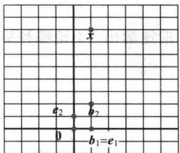
  <figcaption>图4-15 标准图纸</figcaption>
</figure>

<figure class="vp-figure">
  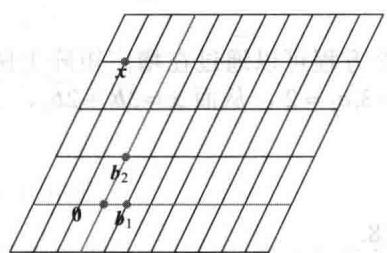
  <figcaption>图4-16 $\mathcal{B}$ -图纸</figcaption>
</figure>

<Example title="例 3">
在结晶学中，晶体格的刻画可由选取 $R^{3}$ 中的一个基 $\{u,v,w\}$ 而得到帮助，这个基对应于晶体的“单位方格”的三个相邻的棱。一个完整的格子框架可以通过将许多个单位方格的复制品堆积在一起而构造。有 14 种类型的单位方格，图 4-17 中展示了其中的 3 种。

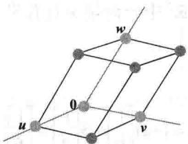  
a）简单的单斜晶格

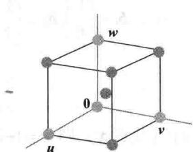  
b）主体居中的立方晶格

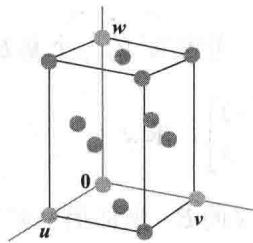  
c）表面居中的正交晶格  
图 4-17 单位方格的例子

相对于晶体格的基，可以给出晶体中原子的坐标.例如 $\left[ \begin{array}{l}1 / 2\\ 1 / 2\\ 1 \end{array} \right]$ 标识图4-17c中最上面的中心原子.
</Example>

## $\mathbb{R}^n$ 中的坐标

当 $\mathbb{R}^n$ 中的一组基 $\mathcal{B}$ 固定时，容易求出任一指定的向量 $\pmb{x}$ 的 $\mathcal{B}-$ 坐标向量，如下面例子所示.例4令 $\pmb{b}_1 = \begin{bmatrix} 2 \\ 1 \end{bmatrix}, \pmb{b}_2 = \begin{bmatrix} -1 \\ 1 \end{bmatrix}, \pmb{x} = \begin{bmatrix} 4 \\ 5 \end{bmatrix}, \mathcal{B} = \{\pmb{b}_1, \pmb{b}_2\}$ ，求出 $\pmb{x}$ 相对于 $\mathcal{B}$ 的坐标向量 $[\pmb{x}]_{\mathcal{B}}$ .

<Solution title="解">
x 的 B-坐标 $c_{1}, c_{2}$ 满足

$$
c _ {1} \left[ \begin{array}{l} 2 \\ 1 \end{array} \right] + c _ {2} \left[ \begin{array}{l} - 1 \\ 1 \end{array} \right] = \left[ \begin{array}{l} 4 \\ 5 \end{array} \right]
$$

或

$$
\begin{array}{c c c} \boldsymbol {b} _ {1} & \boldsymbol {b} _ {2} & \boldsymbol {x} \\ {\left[ \begin{array}{l l} 2 & - 1 \\ 1 & 1 \end{array} \right] \left[ \begin{array}{l} c _ {1} \\ c _ {2} \end{array} \right]} = {\left[ \begin{array}{l} 4 \\ 5 \end{array} \right]} \\ \boldsymbol {b} _ {1} & \boldsymbol {b} _ {2} & \boldsymbol {x} \end{array}\tag{3}
$$

这个方程可以通过在增广矩阵上做行变换或利用左边矩阵的逆解出．不论哪种解法，其解均为 $c_{1} = 3, c_{2} = 2$ ，从而 $\pmb{x} = 3\pmb{b}_{1} + 2\pmb{b}_{2}$ ，于是有

$$
[ \pmb {x} ] _ {\mathcal {B}} = \left[ \begin{array}{l} c _ {1} \\ c _ {2} \end{array} \right] = \left[ \begin{array}{l} 3 \\ 2 \end{array} \right]
$$

见图 4-18.

<figure class="vp-figure">
  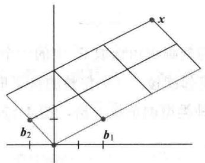
  <figcaption>图 4-18 x 的 B-坐标向量为（3,2）</figcaption>
</figure>

（3）式中的矩阵将向量 x 的 B-坐标变为 x 的标准坐标。对 $R^{n}$ 中的一个基 $B=\{b_{1},\cdots,b_{n}\}$ ，可以实施类似的坐标变换。令

$$
P _ {B} = \left[ \begin{array}{l l l l} \boldsymbol {b} _ {1} & \boldsymbol {b} _ {2} & \dots & \boldsymbol {b} _ {n} \end{array} \right]
$$

则向量方程

$$
\boldsymbol {x} = c _ {1} \boldsymbol {b} _ {1} + c _ {2} \boldsymbol {b} _ {2} + \dots + c _ {n} \boldsymbol {b} _ {n}
$$

等价于

$$
\boxed {\boldsymbol {x} = P _ {\mathcal {B}} [ \boldsymbol {x} ] _ {\mathcal {B}}}\tag{4}
$$

我们称 $P_{B}$ 为从 $\mathcal{B}$ 到 $\mathbb{R}^n$ 中标准基的坐标变换矩阵。通过左乘 $P_{B}$ 将坐标向量 $[\pmb{x}]_{B}$ 变换到 $\pmb{x}$ 。坐标变换方程（4）是重要的，它将在第5章和第7章的多个地方用到。

由于 $P_{\mathcal{B}}$ 的列构成 $\mathbb{R}^n$ 的一个基，故 $P_{\mathcal{B}}$ 是可逆的（由可逆矩阵定理）。通过左乘 $P_{\mathcal{B}}^{-1}$ 可将 $\pmb{x}$ 变回 $\mathcal{B}-$ 坐标向量：

$$
P _ {\mathcal {B}} ^ {- 1} \boldsymbol {x} = [ \boldsymbol {x} ] _ {\mathcal {B}}
$$

这里由 $P_{B}^{-1}$ 产生的映射 $\pmb{x} \mapsto [\pmb{x}]_{B}$ 是前面提到的坐标映射。因为 $P_{B}^{-1}$ 是可逆矩阵，故由可逆矩阵定理（也可参见1.9节定理12），此坐标映射是一个由 $\mathbb{R}^n$ 到 $\mathbb{R}^n$ 上的一对一的线性变换。我们将会看到，坐标映射的这个性质对具有一个基的一般向量空间也成立。
</Solution>

## 坐标映射

对向量空间 V 选定一个基 $B = \{b_{1}, \cdots, b_{n}\}$ ，它引出 V 中一个坐标系。坐标映射 $x \mapsto [x]_{B}$ 将可能不熟悉的空间 V 与熟悉的空间 $R^{n}$ 联系了起来，见图 4-19。V 中的点现在可以由它们的新“名字”来确定。

<figure class="vp-figure">
  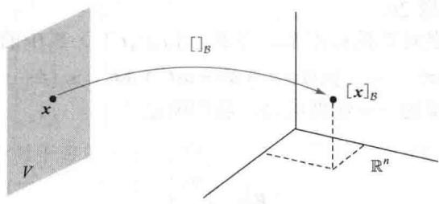
  <figcaption>图4-19 由 $V$ 映上到 $\mathbb{R}^n$ 的坐标映射</figcaption>
</figure>

<Knowledge title="定理 8">
令 $B=\{b_{1},\cdots,b_{n}\}$ 是向量空间 V 的一个基，则坐标映射 $x\mapsto[x]_{B}$ 是一个由 V 映上到 $R^{n}$ 的一对一的线性变换.

<Solution title="证明">
取 $V$ 中两个典型的向量，比如

$$
\begin{array}{r l} \boldsymbol {u} & = c _ {1} \boldsymbol {b} _ {1} + \dots + c _ {n} \boldsymbol {b} _ {n} \\ \boldsymbol {w} & = d _ {1} \boldsymbol {b} _ {1} + \dots + d _ {n} \boldsymbol {b} _ {n} \end{array}
$$

利用向量运算，

$$
\boldsymbol {u} + \boldsymbol {w} = (c _ {1} + d _ {1}) \boldsymbol {b} _ {1} + \dots + (c _ {n} + d _ {n}) \boldsymbol {b} _ {n}
$$

于是

$$
\left[ \boldsymbol {u} + \boldsymbol {w} \right] _ {B} = \left[ \begin{array}{c} c _ {1} + d _ {1} \\ \vdots \\ c _ {n} + d _ {n} \end{array} \right] = \left[ \begin{array}{c} c _ {1} \\ \vdots \\ c _ {n} \end{array} \right] + \left[ \begin{array}{c} d _ {1} \\ \vdots \\ d _ {n} \end{array} \right] = [ \boldsymbol {u} ] _ {B} + [ \boldsymbol {w} ] _ {B}
$$

从而坐标映射保持加法封闭. 若 $r$ 是任一数, 则

$$
r \boldsymbol {u} = r \left(c _ {1} \boldsymbol {b} _ {1} + \dots + c _ {n} \boldsymbol {b} _ {n}\right) = \left(r c _ {1}\right) \boldsymbol {b} _ {1} + \dots + \left(r c _ {n}\right) \boldsymbol {b} _ {n}
$$

于是

$$
\left[ r \pmb {u} \right] _ {B} = \left[ \begin{array}{c} r c _ {1} \\ \vdots \\ r c _ {n} \end{array} \right] = r \left[ \begin{array}{c} c _ {1} \\ \vdots \\ c _ {n} \end{array} \right] = r \left[ \pmb {u} \right] _ {B}
$$

从而坐标映射也保持标量乘法封闭，于是坐标映射是一个线性变换。坐标映射是一对一的以及它将 $V$ 映上到 $\mathbb{R}^n$ 的证明分别留作习题23和24。

正如 1.8 节那样，坐标映射的线性性可推广到线性组合。若 $u_{1}, \cdots, u_{p}$ 在 V 中， $c_{1}, \cdots, c_{p}$ 是数，则

$$
\left[ c _ {1} \boldsymbol {u} _ {1} + \dots + c _ {p} \boldsymbol {u} _ {p} \right] _ {\mathcal {B}} = c _ {1} \left[ \boldsymbol {u} _ {1} \right] _ {\mathcal {B}} + \dots + c _ {p} \left[ \boldsymbol {u} _ {p} \right] _ {\mathcal {B}}\tag{5}
$$

换句话说，（5）说明 $u_{1},\cdots,u_{p}$ 的一个线性组合的 B-坐标向量等于它们坐标向量的相同的线性组合.

定理8中的坐标映射是一个由 $V$ 到 $\mathbb{R}^n$ 上同构的重要例子。一般而言，从一个向量空间 $V$ 映上到另一个向量空间 $W$ 的一对一线性变换称为从 $V$ 和 $W$ 上的一个同构（isomorphism）。（在希腊语中iso表示相同，morph表示形状或结构。） $V$ 和 $W$ 的记号和术语可能不同，但这两个空间作为向量空间则不加以区分。每一个在 $V$ 中的向量空间的计算可以完全相同地出现在 $W$ 中，反之亦然。见习题25和习题26。
</Solution>
</Knowledge>

<Example title="例 5">
令 $\mathcal{B}$ 是多项式空间 $\mathbb{P}_3$ 的标准基，即 $\mathcal{B} = \{1, t, t^2, t^3\}$ 。 $\mathbb{P}_3$ 中的一个典型元素 $p$ 具有形式

$$
\boldsymbol {p} (t) = a _ {0} + a _ {1} t + a _ {2} t ^ {2} + a _ {3} t ^ {3}
$$

因 $p$ 已经给出了标准基向量的一个线性组合，我们断定

$$
[ \pmb {p} ] _ {\mathcal {B}} = \left[ \begin{array}{l} a _ {0} \\ a _ {1} \\ a _ {2} \\ a _ {3} \end{array} \right]
$$

于是坐标映射 $p \mapsto [p]_{B}$ 是一个 $P_{3}$ 到 $R^{4}$ 上的同构. $P_{3}$ 中所有向量空间运算都对应着 $R^{4}$ 中的运算.

如果我们考虑将 $\mathbb{P}_3$ 和 $\mathbb{R}^4$ 分别展现在两个计算机的显示屏上，两个显示屏由坐标变换相联系，则一个显示屏中 $\mathbb{P}_3$ 的每一个向量空间的运算被正确地复制到另一个显示屏中 $\mathbb{R}^4$ 的一个对应的向量运算。 $\mathbb{P}_3$ 显示屏上的向量看起来与 $\mathbb{R}^4$ 显示屏上的向量不同，但它们作为向量的“作用”是完全相同的，见图4-20.

<figure class="vp-figure">
  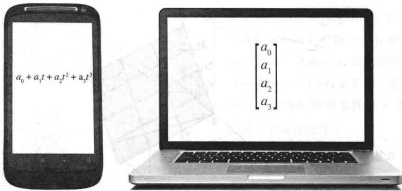
  <figcaption>图4-20 空间 $\mathbb{P}_3$ 与 $\mathbb{R}^4$ 同构</figcaption>
</figure>
</Example>

<Example title="例 6">
利用坐标向量证明在 $P_{2}$ 中多项式 $1+2t^{2},4+t+5t^{2},3+2t$ 是线性相关的.

<Solution title="解">
由例5中的坐标映射可分别产生坐标向量（1,0,2），（4,1,5），（3,2,0）。将这些向量写成一个矩阵 $A$ 的列，可以通过行化简 $Ax = 0$ 的增广矩阵来断定它们的线性相关性：

$$
\left[ \begin{array}{c c c c} 1 & 4 & 3 & 0 \\ 0 & 1 & 2 & 0 \\ 2 & 5 & 0 & 0 \end{array} \right] \sim \left[ \begin{array}{c c c c} 1 & 4 & 3 & 0 \\ 0 & 1 & 2 & 0 \\ 0 & 0 & 0 & 0 \end{array} \right]
$$

$A$ 的列是线性相关的，所以对应的多项式也是线性相关的。事实上，容易检查 $A$ 的第3列是2倍的第2列减去5倍的第1列。多项式的对应关系是

$$
3 + 2 t = 2 (4 + t + 5 t ^ {2}) - 5 (1 + 2 t ^ {2})
$$

最后一个例子是关于 $\mathbb{R}^3$ 中一个与 $\mathbb{R}^2$ 同构的平面.
</Solution>
</Example>

<Example title="例 7">
令 $\pmb{v}_{1} = \begin{bmatrix} 3 \\ 6 \\ 2 \end{bmatrix}, \pmb{v}_{2} = \begin{bmatrix} -1 \\ 0 \\ 1 \end{bmatrix}, \pmb{x} = \begin{bmatrix} 3 \\ 12 \\ 7 \end{bmatrix}, \mathcal{B} = \{\pmb{v}_{1}, \pmb{v}_{2}\}$ ，则 $\mathcal{B}$ 是 $H = \operatorname{Span}\{\pmb{v}_{1}, \pmb{v}_{2}\}$ 的一个基。判定 $\pmb{x}$ 是否在 $H$ 中，若在，求 $\pmb{x}$ 相对于 $\mathcal{B}$ 的坐标向量。

<Solution title="解">
若 x 在 H 中，则下列向量方程是相容的：

$$
c _ {1} \left[ \begin{array}{l} 3 \\ 6 \\ 2 \end{array} \right] + c _ {2} \left[ \begin{array}{c} - 1 \\ 0 \\ 1 \end{array} \right] = \left[ \begin{array}{l} 3 \\ 1 2 \\ 7 \end{array} \right]
$$

数 $c_{1}, c_{2}$ 若存在的话，它们就是 $\pmb{x}$ 的 $\mathcal{B}-$ 坐标。利用行变换，得到

$$
\left[ \begin{array}{c c c} 3 & - 1 & 3 \\ 6 & 0 & 1 2 \\ 2 & 1 & 7 \end{array} \right] \sim \left[ \begin{array}{c c c} 1 & 0 & 2 \\ 0 & 1 & 3 \\ 0 & 0 & 0 \end{array} \right] =
$$

于是 $c_{1} = 2, c_{2} = 3, [\pmb{x}]_{B} = \begin{bmatrix} 2 \\ 3 \end{bmatrix}$ ，由 $\mathcal{B}$ 确定的 $H$ 上的坐标系如图4-21所示.

<figure class="vp-figure">
  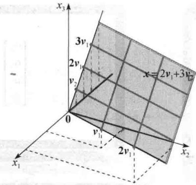
  <figcaption>图 4-21 $R^{3}$ 中平面 H 上的坐标系</figcaption>
</figure>

若 $H$ 选一个不同的基，那么相应的坐标系也使 $H$ 与 $\mathbb{R}^2$ 同构吗？这一定是正确的，下节中我们将证明这一结论.
</Solution>
</Example>

<Block title="练习题">
1. 令 $\pmb{b}_{1} = \begin{bmatrix} 1 \\ 0 \\ 0 \end{bmatrix}, \pmb{b}_{2} = \begin{bmatrix} -3 \\ 4 \\ 0 \end{bmatrix}, \pmb{b}_{3} = \begin{bmatrix} 3 \\ -6 \\ 3 \end{bmatrix}, \pmb{x} = \begin{bmatrix} -8 \\ 2 \\ 3 \end{bmatrix}$ .

a. 证明集合 $\mathcal{B} = \{\pmb{b}_1, \pmb{b}_2, \pmb{b}_3\}$ 是 $\mathbb{R}^3$ 的一个基.

b. 求由 B 到标准基的坐标变换矩阵.

c. 写出 $R^{3}$ 中 x 与 $[x]_{B}$ 相关联的方程.

d. 对上面给出的 x，求 $[x]_{B}$

2. 集合 $\mathcal{B} = \{1 + t, 1 + t^2, t + t^2\}$ 是 $\mathbb{P}_2$ 的一个基. 求 $p(t) = 6 + 3t - t^2$ 关于 $\mathcal{B}$ 的坐标向量.
</Block>

<Block title="习题4.4">
在习题 1\~4 中，已知基 B 和坐标向量 $[x]_{B}$ ，求向量 x.

$$
\boldsymbol {b} _ {1} = \left[ \begin{array}{c} 1 \\ - 3 \end{array} \right], \boldsymbol {b} _ {2} = \left[ \begin{array}{c} 2 \\ - 5 \end{array} \right], \boldsymbol {x} = \left[ \begin{array}{c} - 2 \\ 1 \end{array} \right]
$$

$$
\mathcal {B} = \left\{\left[ \begin{array}{c} 3 \\ - 5 \end{array} \right], \left[ \begin{array}{c} - 4 \\ - 6 \end{array} \right] \right\}, [ \boldsymbol {x} ] _ {\mathcal {B}} = \left[ \begin{array}{c} 5 \\ 3 \end{array} \right]
$$

$$
\boldsymbol {b} _ {1} = \left[ \begin{array}{c} 1 \\ - 2 \end{array} \right], \boldsymbol {b} _ {2} = \left[ \begin{array}{c} 5 \\ - 6 \end{array} \right], \boldsymbol {x} = \left[ \begin{array}{c} 4 \\ 0 \end{array} \right]
$$

2. $B=\left\{\begin{bmatrix}4\\ 5\end{bmatrix},\begin{bmatrix}6\\ 7\end{bmatrix}\right\},[x]_{B}=\begin{bmatrix}8\\ -5\end{bmatrix}$

$$
\boldsymbol {b} _ {1} = \left[ \begin{array}{c} 1 \\ - 1 \\ - 3 \end{array} \right], \boldsymbol {b} _ {2} = \left[ \begin{array}{c} - 3 \\ 4 \\ 9 \end{array} \right], \boldsymbol {b} _ {3} = \left[ \begin{array}{c} 2 \\ - 2 \\ 4 \end{array} \right], \boldsymbol {x} = \left[ \begin{array}{c} 8 \\ - 9 \\ 6 \end{array} \right]
$$

$$
\mathcal {B} = \left\{\left[ \begin{array}{c} 1 \\ - 4 \\ 3 \end{array} \right], \left[ \begin{array}{c} 5 \\ 2 \\ - 2 \end{array} \right], \left[ \begin{array}{c} 4 \\ - 7 \\ 0 \end{array} \right] \right\}, [ \boldsymbol {x} ] _ {\mathcal {B}} = \left[ \begin{array}{c} 3 \\ 0 \\ - 1 \end{array} \right]
$$

$$
\mathcal {B} = \left\{\left[ \begin{array}{c} - 1 \\ 2 \\ 0 \end{array} \right], \left[ \begin{array}{c} 3 \\ - 5 \\ 2 \end{array} \right], \left[ \begin{array}{c} 4 \\ - 7 \\ 3 \end{array} \right] \right\}, [ \boldsymbol {x} ] _ {\mathcal {B}} = \left[ \begin{array}{c} - 4 \\ 8 \\ - 7 \end{array} \right]
$$

$$
\boldsymbol {b} _ {1} = \left[ \begin{array}{l} 1 \\ 0 \\ 3 \end{array} \right], \boldsymbol {b} _ {2} = \left[ \begin{array}{l} 2 \\ 1 \\ 8 \end{array} \right], \boldsymbol {b} _ {3} = \left[ \begin{array}{l} 1 \\ - 1 \\ 2 \end{array} \right], \boldsymbol {x} = \left[ \begin{array}{l} 3 \\ - 5 \\ 4 \end{array} \right]
$$

在习题 9\~10 中，求由 B 到 $R^{n}$ 中标准基的坐标变换矩阵.

在习题 5\~8 中，求 x 关于给定基 $B=\{b_{1},\cdots,b_{n}\}$ 的坐标向量 $[x]_{B}$ .

$$
9. \mathcal {B} = \left\{\left[ \begin{array}{c} 2 \\ - 9 \end{array} \right], \left[ \begin{array}{l} 1 \\ 8 \end{array} \right] \right\}
$$

10. $B=\left\{\begin{bmatrix}3\\ -1\\ 4\end{bmatrix},\begin{bmatrix}2\\ 0\\ -5\end{bmatrix},\begin{bmatrix}8\\ -2\\ 7\end{bmatrix}\right\}$

在习题 11\~12 中，对给出的 x 和 B，利用逆矩阵求 $[x]_{B}$ .

11. $\mathcal{B}=\left\{\begin{bmatrix}3\\ -5\end{bmatrix},\begin{bmatrix}-4\\ 6\end{bmatrix}\right\},x=\begin{bmatrix}2\\ -6\end{bmatrix}$

12. $B=\left\{\begin{bmatrix}4\\ 5\end{bmatrix},\begin{bmatrix}6\\ 7\end{bmatrix}\right\},x=\begin{bmatrix}2\\ 0\end{bmatrix}$

13. 集 $\mathcal{B} = \{1 + t^2, t + t^2, 1 + 2t + t^2\}$ 是 $\mathbb{P}_2$ 的一个基，求 $p(t) = 1 + 4t + 7t^2$ 关于 $\mathcal{B}$ 的坐标向量.

14. 集 $\mathcal{B} = \{1 - t^2, t - t^2, 2 - 2t + t^2\}$ 是 $\mathbb{P}_2$ 的一个基，求 $p(t) = 3 + t - 6t^2$ 关于 $\mathcal{B}$ 的坐标向量.

在习题15和习题16中，标出每个命题的真假，验证每个答案。除非另外说明， $\pmb{B}$ 均指向量空间 $V$ 的一个基。

15. a. 若 x 在 V 中且 B 包含 n 个向量，则 x 的 B-坐标向量在 $R^{n}$ 中.
b. 若 $P_{B}$ 是坐标变换矩阵，则 $[x]_{B}=P_{B}x,x\in V$ .
c. 向量空间 $P_{3}$ 和 $R^{3}$ 是同构的.

16. a. 若 $\mathcal{B}$ 是 $\mathbb{R}^n$ 的标准基，则 $\mathbb{R}^n$ 中 $x$ 的 $\mathcal{B}-$ 坐标向量是 $x$ 本身.
b. 对应 $[x]_{\mathcal{B}} \mapsto x$ 称为坐标映射.
c. 在某种情形下， $\mathbb{R}^3$ 中的平面可以与 $\mathbb{R}^2$ 同构.

17. 向量 $v_{1}=\begin{bmatrix}1\\ -3\end{bmatrix},v_{2}=\begin{bmatrix}2\\ -8\end{bmatrix},v_{3}=\begin{bmatrix}-3\\ 7\end{bmatrix}$ 生成 $R^{2}$ 但不构成一个基，用两种不同的方法将 $\begin{bmatrix}1\\ 1\end{bmatrix}$ 表为 $v_{1},v_{2},v_{3}$ 的线性组合.

18. 令 $B=\{b_{1},\cdots,b_{n}\}$ 是向量空间 V 的一个基，解释为什么 $b_{1},\cdots,b_{n}$ 的 B-坐标向量是 $n\times n$ 单位矩阵的列 $e_{1},\cdots,e_{n}$ .

19. 令 $S$ 是向量空间 $V$ 中的有限集，具有如下性质： $V$ 中每个 $\pmb{x}$ 均可表示为 $S$ 中元素的唯一线性组合。证明 $S$ 是 $V$ 的一个基。

20. 假设 $\{v_{1},\cdots,v_{4}\}$ 是向量空间 V 的一个线性相关生成集，证明 V 中每一个 w 都可用多于一种的方式表示成 $v_{1},\cdots,v_{4}$ 的线性组合。（提示：令 $w=k_{1}v_{1}+\cdots+k_{4}v_{4}$ 是 V 中一任意向量，利用 $\{v_{1},\cdots,v_{4}\}$ 的线性相关性将 w 表示为 $v_{1},\cdots,v_{4}$ 的另一个线性组合。）

21. 令 $\mathcal{B} = \left\{\left[ \begin{array}{c}1\\ -4 \end{array} \right],\left[ \begin{array}{c} - 2\\ 9 \end{array} \right]\right\}$ . 因为由 $\mathcal{B}$ 确定的坐标映射是一个从 $\mathbb{R}^2$ 映射到 $\mathbb{R}^2$ 的线性变换, 故此映射一定可由某 $2\times 2$ 矩阵 $A$ 来实现, 求出 $A$ . (提示: 用 $A$ 去乘可使向量 $\pmb{x}$ 变换到它的坐标向量 $[\pmb{x}]_{B}$ .)

22. 令 $\mathcal{B} = \{\pmb{b}_1, \dots, \pmb{b}_n\}$ 是 $\mathbb{R}^n$ 的一个基，作出一个 $n \times n$ 矩阵 $A$ 的描述，它使得坐标映射 $\pmb{x} \mapsto [\pmb{x}]_B$ 得以实现。（见习题21.）习题23\~26涉及一个向量空间 $V$ 、一个基 $\mathcal{B} = \{\pmb{b}_1, \dots, \pmb{b}_n\}$ 和坐标映射 $\pmb{x} \mapsto [\pmb{x}]_B$

23. 证明: 坐标映射是一对一的. (提示: 假设对 $V$ 中某向量 $\pmb{u}$ 和 $\pmb{w}$ , 满足 $[\pmb{u}]_B = [\pmb{w}]_B$ , 证明 $\pmb{u} = \pmb{w}$ .)

24. 证明：坐标映射是映上到 $\mathbb{R}^n$ 的，即任给 $\mathbb{R}^n$ 中向量 $y$ ，具有元素 $y_1, \dots, y_n$ ，存在 $V$ 中的向量 $u$ ，使得 $[u]_S = y$ .

25. 证明： $V$ 中子集 $\{\pmb{u}_1, \dots, \pmb{u}_p\}$ 是线性无关的，当且仅当坐标向量 $\{[\pmb{u}_1]_B, \dots, [\pmb{u}_p]_B\}$ 在 $\mathbb{R}^n$ 中也是线性无关的。[提示：因为坐标映射是一对一的，下列方程具有相同的解 $c_1, \dots, c_p$ ]。 $c_1\pmb{u}_1 + \dots + c_p\pmb{u}_p = \mathbf{0}$ $V$ 中的零向量 $[c_1\pmb{u}_1 + \dots + c_p\pmb{u}_p]_B = [\mathbf{0}]_B$ $\mathbb{R}^n$ 中的零向量

26. 给定 V 中向量 $u_{1}, \cdots, u_{p}$ 和 w，证明：w 是 $u_{1}, \cdots, u_{p}$ 的线性组合，当且仅当 $[w]_{B}$ 是坐标向量 $[u_{1}]_{B}, \cdots, [u_{p}]_{B}$ 的线性组合.
在习题 27\~30 中，利用坐标向量检验多项式集合的线性无关性.

27. $1 + 2t^{3}, 2 + t - 3t^{2}, -t + 2t^{2} - t^{3}$

28. $1 - 2t^{2} - t^{3}, t + 2t^{3}, 1 + t - 2t^{2}$

29. $(1 - t)^{2}, t - 2t^{2} + t^{3}, (1 - t)^{3}$

30. $(2 - t)^{3}, (3 - t)^{2}, 1 + 6t - 5t^{2} + t^{3}$

31. 利用坐标向量检验下面的多项式集合是否生成 $P_{2}$ ，验证你的结论.
a. $1-3t+5t^{2},-3+5t-7t^{2},-4+5t-6t^{2},1-t^{2}$ b. $5t + t^{2}, 1 - 8t - 2t^{2}, -3 + 4t + 2t^{2}, 2 - 3t$

32. 设 $\boldsymbol{p}_{1}(t)=1+t^{2}$ , $\boldsymbol{p}_{2}(t)=t-3t^{2}$ , $\boldsymbol{p}_{3}(t)=1+t-3t^{2}$ .
a. 利用坐标向量说明这些多项式集合是 $P_{2}$ 的一组基.
b. 考虑 $P_{2}$ 的一组基 $B=\{p_{1},p_{2},p_{3}\}$ . 给定 $[q]_{B}=\begin{bmatrix}-1\\1\\2\end{bmatrix}$ ，求 $P_{2}$ 中的 q.

在习题 33\~34 中, 利用坐标向量检验下面的多项式集合是否构成 $P_{3}$ 的一组基, 验证你的结论.

33. [M] $3 + 7t, 5 + t - 2t^3, t - 2t^2, 1 + 16t - 6t^2 + 2t^3$

34. [M] $5 - 3t + 4t^{2} + 2t^{3}, 9 + t + 8t^{2} - 6t^{3}, 6 - 2t + 5t^{2}, t^{3}$

35. [M] 令 $H = \operatorname{Span}\{\pmb{v}_1, \pmb{v}_2\}, \mathcal{B} = \{\pmb{v}_1, \pmb{v}_2\}$ ，证明 $\pmb{x}$ 在 $H$ 中并求 $\pmb{x}$ 的 $\mathcal{B}$ -坐标向量，其中

$$
\boldsymbol {v} _ {1} = \left[ \begin{array}{l} 1 1 \\ - 5 \\ 1 0 \\ 7 \end{array} \right], \boldsymbol {v} _ {2} = \left[ \begin{array}{l} 1 4 \\ - 8 \\ 1 3 \\ 1 0 \end{array} \right], \boldsymbol {x} = \left[ \begin{array}{l} 1 9 \\ - 1 3 \\ 1 8 \\ 1 5 \end{array} \right]
$$

36. [M] 令 $H = \operatorname{Span}\{\nu_1, \nu_2, \nu_3\}, \mathcal{B} = \{\nu_1, \nu_2, \nu_3\}$ , 证明: $\mathcal{B}$ 是 $H$ 的一个基并且 $\pmb{x}$ 在 $H$ 中, 再求 $\pmb{x}$ 的 $\mathcal{B}-$ 坐标向量, 其中

$$
\boldsymbol {v} _ {1} = \left[ \begin{array}{c} - 6 \\ 4 \\ - 9 \\ 4 \end{array} \right], \boldsymbol {v} _ {2} = \left[ \begin{array}{c} 8 \\ - 3 \\ 7 \\ - 3 \end{array} \right], \boldsymbol {v} _ {3} = \left[ \begin{array}{c} - 9 \\ 5 \\ - 8 \\ 3 \end{array} \right], \boldsymbol {x} = \left[ \begin{array}{c} 4 \\ 7 \\ - 8 \\ 3 \end{array} \right]
$$

[M]习题37和习题38涉及钛的晶体格，它具有六边形结构，见图4-22左图． $\mathbb{R}^3$ 中向量 $\left[ \begin{array}{c}2.6\\ -1.5\\ 0 \end{array} \right],\left[ \begin{array}{c}0\\ 3\\ 0 \end{array} \right],\left[ \begin{array}{c}0\\ 0\\ 4.8 \end{array} \right]$ 对展示在右图中的单位方格构成一组基．这里的数字是以埃（1埃 $= 10^{-8}$ 厘米）为单位的．在钛合金中，一些添加的原子可能在“八面体的”和“四面体的”位置的单位方格内．（这样命名是由于这些位置的原子所形成的几何对象.)

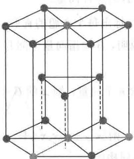

<figure class="vp-figure">
  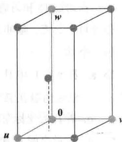
  <figcaption>图 4-22 六边形的封装晶格和它的单位方格</figcaption>
</figure>

37. 相对于格的基，八面体中一个位置为 $\begin{bmatrix} 1/2 \\ 1/4 \\ 1/6 \end{bmatrix}$ . 相对于 $\mathbb{R}^3$ 的标准基，确定这个位置的坐标.

b. 由（a）知，坐标变换矩阵为 $P_{B} = \begin{bmatrix} 1 & -3 & 3 \\ 0 & 4 & -6 \\ 0 & 0 & 3 \end{bmatrix}$ .

38. 四面体中一个点的位置为 $\begin{bmatrix} 1/2 \\ 1/2 \\ 1/3 \end{bmatrix}$ . 相对于 $\mathbb{R}^3$ 的标准基，确定这个位置的坐标.
</Block>

<Block title="练习题答案">
1. a. 矩阵 $P_{B} = [b_{1}, b_{2}, b_{3}]$ 行等价于单位矩阵是明显的。由可逆矩阵定理， $P_{B}$ 是可逆的，且它的列构成 $\mathbb{R}^3$ 的一个基。

c. $x = P_{B}[x]_{B}$

d. 为解（c）中方程，行化简增广矩阵而不计算 $P_{B}^{-1}$ 可能更容易一些：

$$
\left[ \begin{array}{r r r r} 1 & - 3 & 3 & - 8 \\ 0 & 4 & - 6 & 2 \\ 0 & 0 & 3 & 3 \end{array} \right] \sim \left[ \begin{array}{r r r r} 1 & 0 & 0 & - 5 \\ 0 & 1 & 0 & 2 \\ 0 & 0 & 1 & 1 \end{array} \right]
$$

从而

$$
[ \boldsymbol {x} ] _ {B} = \left[ \begin{array}{c} - 5 \\ 2 \\ 1 \end{array} \right]
$$

2. $p(t) = 6 + 3t - t^2$ 相对于 $\mathcal{B}$ 的坐标满足 $c_{1}(1 + t) + c_{2}(1 + t^{2}) + c_{3}(t + t^{2}) = 6 + 3t - t^{2}$ . 对比 $t$ 的同次幂项的系数有

$$
\begin{array}{r l} c _ {1} + c _ {2} & = 6 \\ c _ {1} + c _ {3} & = 3 \\ c _ {2} + c _ {3} & = - 1 \end{array}
$$

解之，得 $c_{1}=5, c_{2}=1, c_{3}=-2$ ，从而 $[p]_{B}=\begin{bmatrix}5\\ 1\\ -2\end{bmatrix}$ .
</Block>
