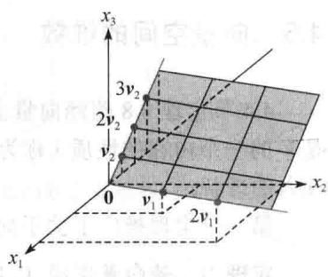
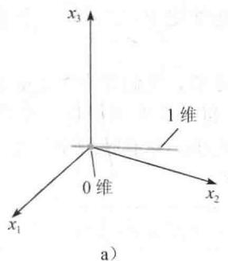
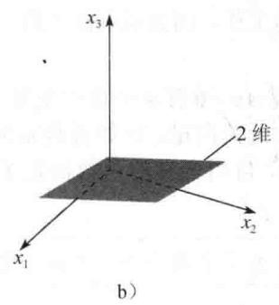
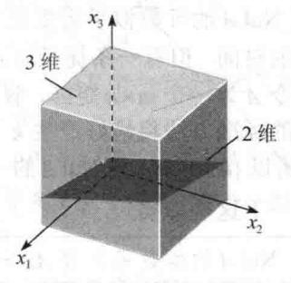

import Guide from '@/components/Guide.astro';
import Knowledge from '@/components/Knowledge.astro';
import Example from '@/components/Example.astro';
import Analysis from '@/components/Analysis.astro';
import Solution from '@/components/Solution.astro';
import Variant from '@/components/Variant.astro';
import Note from '@/components/Note.astro';
import Block from '@/components/Block.astro';
import Method from '@/components/Method.astro';
import Exercise from '@/components/Exercise.astro';

4.4节定理8.8蕴涵向量空间 $V$ 的基 $\mathcal{B}$ 若含有 $n$ 个向量，则 $V$ 与 $\mathbb{R}^n$ 同构。本节我们证明数 $n$ 是 $V$ 的一个内在的性质（称为维数），它不依赖基的选择。维数的讨论将使我们对基的性质有更深入的理解。

第一个定理推广了关于向量空间 $\mathbb{R}^n$ 的一个著名的结果.

<Knowledge title="定理 9">
若向量空间 V 具有一组基 $B=\{b_{1},\cdots,b_{n}\}$ ，则 V 中任意包含多于 n 个向量的集合一定线性相关.

<Solution title="证明">
令 $\{\pmb{u}_1, \dots, \pmb{u}_p\}$ 是 $V$ 中一个含有多于 $n$ 个向量的集合。因为坐标向量 $[\pmb{u}_1]_B, \dots, [\pmb{u}_p]_B$ 的个数（ $p$ ）多于每个向量中元素的个数（ $n$ ），所以 $[\pmb{u}_1]_B, \dots, [\pmb{u}_p]_B$ 线性相关。于是存在数 $c_1, \dots, c_p$ 不全为 0，使得

$$
c _ {1} [ \pmb {u} _ {1} ] _ {B} + \dots + c _ {p} [ \pmb {u} _ {p} ] _ {B} = {\left[ \begin{array}{l} {0} \\ {\vdots} \\ {0} \end{array} \right]} \qquad \mathbb {R} ^ {n} \text {中的零向量}
$$

因为坐标映射是线性变换，故

$$
\left[ c _ {1} \boldsymbol {u} _ {1} + \dots + c _ {p} \boldsymbol {u} _ {p} \right] _ {B} = \left[ \begin{array}{l} 0 \\ \vdots \\ 0 \end{array} \right]
$$

上式右边的零向量展示了从 B 中的基向量构建向量 $c_{1}u_{1}+\cdots+c_{p}u_{p}$ 所需的 n 个权，即

$c_{1}u_{1}+\cdots+c_{p}u_{p}=0\cdot b_{1}+\cdots+0\cdot b_{n}=0$ ．因为 $c_{i}$ 不全为零，所以 $\{u_{1},\cdots,u_{p}\}$ 是线性相关的.

由定理 9 可推出如果一向量空间 V 有一组基 $B=\left\{b_{1},\cdots,b_{n}\right\}$ ，则 V 的每个线性无关集由多于 n 个的向量所组成.
</Solution>
</Knowledge>

<Knowledge title="定理 10">
若向量空间 V 有一组基含有 n 个向量，则 V 的每一组基一定恰好含有 n 个向量.

<Solution title="证明">
令 $\mathcal{B}_1$ 是一个含 $n$ 个向量的基， $\mathcal{B}_2$ 是 $V$ 的任一另外的基。因为 $\mathcal{B}_1$ 是一个基， $\mathcal{B}_2$ 是线性无关的，故由定理9， $\mathcal{B}_2$ 不能含有多于 $n$ 个向量。同理由于 $\mathcal{B}_2$ 是一个基， $\mathcal{B}_1$ 线性无关，故 $\mathcal{B}_2$ 至少含有 $n$ 个向量，于是 $\mathcal{B}_2$ 恰好含有 $n$ 个向量。

如果一个非零向量空间 $V$ 由有限集 $S$ 生成，则由生成集定理， $S$ 的一个子集是 $V$ 的一个基。由此，定理10保证下列定义有意义。

定义 若 $V$ 由一个有限集生成，则 $V$ 称为有限维的， $V$ 的维数写成 $\dim V$ ，是 $V$ 的基中向量的个数。零向量空间 $\{\mathbf{0}\}$ 的维数定义为零。如果 $V$ 不是由一有限集生成，则 $V$ 称为无穷维的。
</Solution>
</Knowledge>

<Example title="例 1">
$R^{n}$ 的标准基含有 n 个向量，所以 $\dim R^{n}=n$ 。标准的多项式基 $\{1,t,t^{2}\}$ 表明 $\dim P_{2}=3$ 。一般而言， $\dim P_{n}=n+1$ 。所有多项式的空间 P 是无穷维的（见习题 27）。
</Example>

<Example title="例 2">
令 $H = \operatorname{Span}\{\pmb{v}_1, \pmb{v}_2\}$ ，其中 $\pmb{v}_1 = \begin{bmatrix} 3 \\ 6 \\ 2 \end{bmatrix}, \pmb{v}_2 = \begin{bmatrix} -1 \\ 0 \\ 1 \end{bmatrix}$ ，则 $H$ 是

4.4节的例7中研究过的平面． $H$ 的一个基为 $\{\pmb{v}_1,\pmb{v}_2\}$ ，这是由于 $\pmb {v}_{1}$ 和 $\pmb{v}_{2}$ 不是倍数关系从而线性无关，于是 $\dim H = 2$
</Example>

<Example title="例 3">
求下列子空间的维数：

$$
H = \left\{\left[ \begin{array}{c} a - 3 b + 6 c \\ 5 a + 4 d \\ b - 2 c - d \\ 5 d \end{array} \right]: a, b, c, d \in \mathbb {R} \right\}
$$

<Solution title="解">
易见 H 为下列向量的所有线性组合的集合:

$$
\boldsymbol {v} _ {1} = \left[ \begin{array}{l} 1 \\ 5 \\ 0 \\ 0 \end{array} \right], \boldsymbol {v} _ {2} = \left[ \begin{array}{c} - 3 \\ 0 \\ 1 \\ 0 \end{array} \right], \boldsymbol {v} _ {3} = \left[ \begin{array}{c} 6 \\ 0 \\ - 2 \\ 0 \end{array} \right], \boldsymbol {v} _ {4} = \left[ \begin{array}{l} 0 \\ 4 \\ - 1 \\ 5 \end{array} \right]
$$

显然 $v_{1} \neq 0$ ， $v_{2}$ 不是 $v_{1}$ 的倍数，但 $v_{3}$ 是 $v_{2}$ 的倍数。由生成集定理，去掉 $v_{3}$ 仍可生成 H。最后由于 $v_{4}$ 不是 $v_{1}$ 和 $v_{2}$ 的线性组合，所以 $\{v_{1}, v_{2}, v_{4}\}$ 是线性无关的（由 4.3 节中定理 4），进而是 H 的一个基，于是 $\dim H = 3$ 。
</Solution>
</Example>

<Example title="例 4">
$R^{3}$ 的子空间可用维数分类，见图 4-23.

零维子空间. 只有零子空间是零维子空间.

一维子空间. 任一由单一非零向量生成的子空间, 这样的子空间是经过原点的直线.

二维子空间. 任一由两个线性无关向量生成的子空间, 这样的子空间是通过原点的平面.

三维子空间．只有 $\mathbb{R}^3$ 本身是三维子空间．由可逆矩阵定理， $\mathbb{R}^3$ 中任意3个线性无关向量生成整个 $\mathbb{R}^3$

  
图4-23 $\mathbb{R}^3$ 的子空间样本
</Example>

## 有限维空间的子空间

下一个定理是生成集定理的一个自然配对.

<Knowledge title="定理 11">
令 $H$ 是有限维向量空间 $V$ 的子空间，若有必要的话， $H$ 中任一个线性无关集均可以扩充成为 $H$ 的一个基。 $H$ 也是有限维的并且

$$
\dim H \leqslant \dim V
$$

<Solution title="证明">
若 $H=\{0\}$ ，必然有 $\dim H=0\leqslant\dim V$ 。否则，令 $S=\{u_{1},\cdots,u_{k}\}$ 是 H 中任一线性无关集。若 S 生成 H，则 S 是 H 的一个基。否则，存在 H 中某向量 $u_{k+1}$ 不在 Span S 中。但 $\{u_{1},\cdots,u_{k},u_{k+1}\}$ 将会是线性无关的，这是因为此集中没有一个向量可以表示为其前面向量的线性组合（由定理 4）。

只要这个新集合不能生成 H，我们就可以继续这个扩充 S 到 H 中一个更大的线性无关集的过程。但由定理 9，S 的线性无关扩充中向量的个数永远不能超过 V 的维数，所以 S 的扩充最终会生成 H 而且将成为 H 的一个基，同时 $\dim H \leqslant \dim V$ 。

当一个线性空间或子空间的维数知道后，通过下一个定理，求一个基就简单了。即如果一个集合有适当个数的元素，则我们仅需要证明或者这个集合是线性无关的或者它生成这个空间。这个定理在许多应用问题（例如微分方程或差分方程）中均具有非常重要的意义，其中线性无关性比生成性更容易验证。
</Solution>
</Knowledge>

<Knowledge title="定理 12 基定理">
令 V 是一个 p 维向量空间， $p \geqslant 1$ ，V 中任意含有 p 个元素的线性无关集必然是 V 的一个基。任意含有 p 个元素且生成 V 的集合自然是 V 的一个基。

<Solution title="证明">
由定理11，含 $p$ 个元素的线性无关集 $S$ 可以扩充为 $V$ 的一个基。但由于 $\dim V = p$ ，因此基必须恰好包含 $p$ 个向量。所以 $S$ 已经是 $V$ 的一个基。现假设 $S$ 含有 $p$ 个元素且生成 $V$ 。因为 $V$ 是非零的，故生成集定理蕴涵 $S$ 的一个子集 $S'$ 是 $V$ 的一个基。因为 $\dim V = p$ ，故 $S'$ 一定包含 $p$ 个向量，从而 $S = S'$ 。
</Solution>
</Knowledge>

## Nul A 和 Col A 的维数

由于矩阵 $A$ 的主元列构成 $\operatorname{Col} A$ 的一个基，因此我们一旦知道主元列，就知道了 $\operatorname{Col} A$ 的维数。对 $\operatorname{Nul} A$ 的维数似乎需要做更多的工作，因为求 $\operatorname{Nul} A$ 的一个基通常比求 $\operatorname{Col} A$ 的一个基需要更多的时间。但有一条捷径可走！

令 A 为一个 $m \times n$ 矩阵，假设方程 Ax = 0 有 k 个自由变量。由 4.2 节，我们知道求 Nul A 的生成集的标准方法将恰好产生 k 个线性无关向量，比如说是 $u_{1}, \cdots, u_{k}$ ，每一个向量对应一个自由变量。所以 $\{u_{1}, \cdots, u_{k}\}$ 是 Nul A 的一个基，自由变量的个数决定了基的大小。为了后面的参考，我们总结一下这些事实。

Nul A 的维数是方程 Ax = 0 中自由变量的个数，Col A 的维数是 A 中主元列的个数.

<Example title="例 5">
求 A 的零空间和列空间的维数.

$$
A = \left[ \begin{array}{r r r r r} - 3 & 6 & - 1 & 1 & - 7 \\ 1 & - 2 & 2 & 3 & - 1 \\ 2 & - 4 & 5 & 8 & - 4 \end{array} \right]
$$

<Solution title="解">
将增广矩阵[A 0]行化简成阶梯形得

$$
\left[ \begin{array}{c c c c c c} 1 & - 2 & 2 & 3 & - 1 & 0 \\ 0 & 0 & 1 & 2 & - 2 & 0 \\ 0 & 0 & 0 & 0 & 0 & 0 \end{array} \right]
$$

有 3 个自由变量—— $x_{2}, x_{4}$ 和 $x_{5}$ ，于是 Nul A 的维数是 3。由于 A 有两个主元列，所以 dimCol A = 2。
</Solution>
</Example>

<Block title="练习题">
1. 判定下列每个命题的真假，对每个答案给出理由。这里 $V$ 是一个非零有限维向量空间。

a. 若 $\dim V = p, S$ 是 $V$ 的一个线性相关的子集，则 $S$ 包含多于 $p$ 个向量.

b. 若 $S$ 生成 $V$ ， $T$ 是 $V$ 的一个子集且含有的向量个数多于 $S$ 中的向量个数，则 $T$ 是线性相关的。

2. 设 $H$ 和 $K$ 是向量空间 $V$ 的子空间. 在4.1节习题32中说明了 $H \cap K$ 也是 $V$ 的子空间. 证明 $\dim (H \cap K) \leqslant \dim H$ .
</Block>

<Block title="习题4.5">
对习题 1\~8 中的子空间，（a）求一个基，（b）说出维数.

$$
1. \left\{\left[ \begin{array}{c} s - 2 t \\ s + t \\ 3 t \end{array} \right]: s, t \in \mathbb {R} \right\} \quad 2. \left\{\left[ \begin{array}{c} 4 s \\ - 3 s \\ - t \end{array} \right]: s, t \in \mathbb {R} \right\}\tag{3.}
$$

$$
\left\{\left[ \begin{array}{c} 2 c \\ a - b \\ b - 3 c \\ a + 2 b \end{array} \right]: a, b, c \in \mathbb {R} \right\} \quad 4. \quad \left\{\left[ \begin{array}{c} a + b \\ 2 a \\ 3 a - b \\ - b \end{array} \right]: a, b \in \mathbb {R} \right\}
$$

5.

6.

$$
\left\{ \begin{array}{l} {\left[ \begin{array}{c} a - 4 b - 2 c \\ 2 a + 5 b - 4 c \\ - a + 2 c \\ - 3 a + 7 b + 6 c \end{array} \right]: a, b, c \in \mathbb {R}} \\ {\left\{\left[ \begin{array}{c} 3 a + 6 b - c \\ 6 a - 2 b - 2 c \\ - 9 a + 5 b + 3 c \\ - 3 a + b + c \end{array} \right]: a, b, c \in \mathbb {R} \right.} \end{array} \right.
$$

7. $\{(a,b,c):a-3b+c=0,b-2c=0,2b-c=0\}$

8. $\{(a,b,c,d):a-3b+c=0\}$

9. 求 $\mathbb{R}^3$ 中所有第一个和第三个元素相等的全体向量生成的子空间的维数.

10. 求 $R^{2}$ 中由 $\begin{bmatrix} 2 \\ -5 \end{bmatrix}$ , $\begin{bmatrix} -4 \\ 10 \end{bmatrix}$ , $\begin{bmatrix} -3 \\ 6 \end{bmatrix}$ 生成的子空间 H 的维数.

在习题 11 和习题 12 中, 求由给定向量生成的子空间的维数.

$$
\left[ \begin{array}{l} 1 \\ 0 \\ 2 \end{array} \right], \quad \left[ \begin{array}{l} 3 \\ 1 \\ 1 \end{array} \right], \quad \left[ \begin{array}{r} 9 \\ 4 \\ - 2 \end{array} \right], \quad \left[ \begin{array}{l} - 7 \\ - 3 \\ 1 \end{array} \right]
$$

12.

$$
\left[ \begin{array}{c} 1 \\ - 2 \\ 0 \end{array} \right], \quad \left[ \begin{array}{c} - 3 \\ 4 \\ 1 \end{array} \right], \quad \left[ \begin{array}{c} - 8 \\ 6 \\ 5 \end{array} \right], \quad \left[ \begin{array}{c} - 3 \\ 0 \\ 7 \end{array} \right]
$$

确定习题 13\~18 中给出的矩阵的 Nul A 和 Col A 的维数.

13.

$$
A = \left[ \begin{array}{c c c c c} 1 & - 6 & 9 & 0 & - 2 \\ 0 & 1 & 2 & - 4 & 5 \\ 0 & 0 & 0 & 5 & 1 \\ 0 & 0 & 0 & 0 & 0 \end{array} \right]
$$

14.

$$
A = \left[ \begin{array}{c c c c c c} 1 & 3 & - 4 & 2 & - 1 & 6 \\ 0 & 0 & 1 & - 3 & 7 & 0 \\ 0 & 0 & 0 & 1 & 4 & - 3 \\ 0 & 0 & 0 & 0 & 0 & 0 \end{array} \right]
$$

15. $A = \begin{bmatrix} 1 & 0 & 9 & 5\\ 0 & 0 & 1 & -4 \end{bmatrix}$

$$
1 6. A = \left[ \begin{array}{c c} 3 & 4 \\ - 6 & 1 0 \end{array} \right]
$$

$$
A = \left[ \begin{array}{c c c} 1 & - 1 & 0 \\ 0 & 4 & 7 \\ 0 & 0 & 5 \end{array} \right]
$$

$$
1 8. A = \left[ \begin{array}{c c c} 1 & 4 & - 1 \\ 0 & 7 & 0 \\ 0 & 0 & 0 \end{array} \right]
$$

在习题 19 和习题 20 中，V 是一个向量空间，标出每个命题的真假，给出理由.

19. a. 矩阵的主元列的个数等于列空间的维数.
b. $R^{3}$ 中的平面是 $R^{3}$ 的二维子空间.
c. 向量空间 $P_{4}$ 的维数为 4.
d. 若 $\dim V = n$ ，S 是 V 中一个线性无关集，则 S 是 V 的一个基.
e. 若集合 $\{v_{1},\cdots,v_{p}\}$ 生成一个有限维向量空间 V，T 是 V 中多于 p 个向量的集合，则 T 是线性相关的.

20. a. $\mathbb{R}^2$ 是 $\mathbb{R}^3$ 的一个二维子空间. b. 方程 $Ax = 0$ 中变量个数等于Nul $A$ 的维数. c. 一个向量空间是无穷维的，如果它由一个无限集生成. d. 若 $\dim V = n$ ， $S$ 生成 $V$ ，则 $S$ 是 $V$ 的一个基. e. $\mathbb{R}^3$ 只有一个三维子空间即 $\mathbb{R}^3$ 本身.

21. 前 4 个埃尔米特（Hermite）多项式为 $1,2t, -2 + 4t^2$ 和 $-12t + 8t^3$ ，这些多项式是在研究数学物理中的某种重要的微分方程时产生的。证明：这前 4 个埃尔米特多项式构成 $\mathbb{P}_3$ 的一个基。

22. 前 4 个拉盖尔（Laguerre）多项式为 $1,1 - t$ ， $2 - 4t + t^2$ 和 $6 - 18t + 9t^2 - t^3$ 。证明：这些多项式构成 $\mathbb{P}_3$ 的一个基。

23. 令 $\mathcal{B}$ 是 $\mathbb{P}_3$ 的一个基，它由习题21中埃尔米特多项式组成，令 $p(t) = 7 - 12t - 8t^2 + 12t^3$ ，求 $\pmb{p}$ 相对于 $\mathcal{B}$ 的坐标向量.

24. 令 $\mathcal{B}$ 是 $\mathbb{P}_2$ 的一个基，它由习题22中前3个拉盖尔多项式组成，令 $p(t) = 7 - 8t + 3t^2$ ，求 $p$ 相对于 $\mathcal{B}$ 的坐标向量.

25. 令 $S$ 是 $n$ 维向量空间 $V$ 的一个子集，设 $S$ 包含

少于 n 个向量，解释为什么 S 不能生成 V.

26. 令 H 是 n 维向量空间 V 的一个 n 维子空间，证明 H = V.

27. 解释为什么所有多项式的空间 $\mathbb{P}$ 是一个无穷维空间.

28. 证明：定义在实数直线上的全体连续函数的空间 $C(\mathbb{R})$ 是一个无穷维空间.

在习题 29 和习题 30 中，V 是一个非零有限维向量空间，列出的向量在 V 中。标出每个命题的真假，给出理由。（这些问题比习题 19 和习题 20 难些。）

29. a. 若存在集合 $\{v_{1},\cdots,v_{p}\}$ 生成 V，则 $\dim V \leqslant p$ .
b. 若 V 中存在一个线性无关集 $\{v_{1},\cdots,v_{p}\}$ ，则 $\dim V \geqslant p$ .

c. 若 $\dim V = p$ ，则 $V$ 中存在一个 $p + 1$ 个向量的生成集.

30. a. 若 V 中存在一线性相关集 $\{v_{1},\cdots,v_{p}\}$ ，则 $\dim V \leqslant p$ .

b. 若 V 中任意由 p 个元素组成的集合均不能生成 V，则 $\dim V > p$ .

c. 若 $p \geqslant 2$ ， $\dim V = p$ ，则每个由 $p - 1$ 个非零向量构成的集合是线性无关的。

在习题 31 和习题 32 中, 涉及有限维向量空间 V 和 W 以及线性变换 $T: V \rightarrow W$ .

31. 令 $H$ 是 $V$ 的非零子空间， $T(H)$ 为 $H$ 中向量的像集，则由4.2节中习题35， $T(H)$ 是 $W$ 的子空间。证明 $\dim T(H) \leqslant \dim H$ 。

32. 令 H 是 V 的非零子空间，T 是一个由 V 到 W 内的一一（线性）映射，证明 $\dim T(H) = \dim H$ .
</Block>

<Block title="练习题答案">
1. a. 错，考虑集合 $\{0\}$ .

若 T 是一个由 V 到 W 上的一一映射，则 $\dim V = \dim W$ 。同构的有限维向量空间具有相同的维数。

33. [M] 按照定理 11， $R^{n}$ 中一线性无关集 $\{v_{1},\cdots,v_{k}\}$ 可以扩充为 $R^{n}$ 的一个基。一个方法是构造矩阵 $A=[v_{1}\cdots v_{k}\ e_{1}\cdots e_{n}]$ ，其中 $e_{1},\cdots,e_{n}$ 是单位矩阵的列，A 的主元列构成 $R^{n}$ 的一个基。

a. 利用这个方法将下列向量扩充为 $\mathbb{R}^5$ 的一个基.

$$
\boldsymbol {v} _ {1} = \left[ \begin{array}{c} - 9 \\ - 7 \\ 8 \\ - 5 \\ 7 \end{array} \right], \boldsymbol {v} _ {2} = \left[ \begin{array}{c} 9 \\ 4 \\ 1 \\ 6 \\ - 7 \end{array} \right], \boldsymbol {v} _ {3} = \left[ \begin{array}{c} 6 \\ 7 \\ - 8 \\ 5 \\ - 7 \end{array} \right]
$$

b. 解释下列问题：为什么原来的向量 $v_{1}, \cdots, v_{k}$ 包含在 Col A 的基中？为什么 Col A = R^\{n\}？

34. [M] 令 $B=\{1,\cos t,\cos^{2}t,\cdots,\cos^{6}t\},C=\{1,\cos t,\cos 2t,\cdots,\cos 6t\}$ ，假设有下列三角恒等式（见4.1节习题37）：

$$
\begin{array}{l} \cos 2 t = - 1 + 2 \cos^ {2} t \\ \cos 3 t = - 3 \cos t + 4 \cos^ {3} t \\ \cos 4 t = 1 - 8 \cos^ {2} t + 8 \cos^ {4} t \\ \cos 5 t = 5 \cos t - 2 0 \cos^ {3} t + 1 6 \cos^ {5} t \\ \cos 6 t = - 1 + 1 8 \cos^ {2} t - 4 8 \cos^ {4} t + 3 2 \cos^ {6} t \end{array}
$$

令 H 为 B 中函数生成的子空间，则由 4.3 节中习题 38，B 是 H 的一个基.

a. 写出 $\mathcal{C}$ 中向量的 $\mathcal{B}-$ 坐标向量, 利用它们证明 $\mathcal{C}$ 在 $H$ 中是线性无关集.

b. 解释为什么 $\mathcal{C}$ 是 $H$ 的一个基.

b. 对，由生成集定理，S 包含 V 的一个基，称这个基为 $S'$ 。从而 T 包含比 $S'$ 更多的向量。由定理 9，T 是线性相关的。

2. 设 $\{v_{1},\cdots,v_{p}\}$ 是 $H\cap K$ 的一组基，则 $\{v_{1},\cdots,v_{p}\}$ 是 H 的线性无关子集，因此由定理 11， $\{v_{1},\cdots,v_{p}\}$ 能被扩充为 H 的一组基。由于子空间的维数等于基的向量数，故 $\dim(H\cap K)=p\leqslant\dim H$ 。
</Block>
