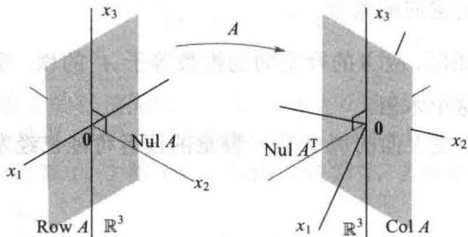

import Guide from '@/components/Guide.astro';
import Knowledge from '@/components/Knowledge.astro';
import Example from '@/components/Example.astro';
import Analysis from '@/components/Analysis.astro';
import Solution from '@/components/Solution.astro';
import Variant from '@/components/Variant.astro';
import Note from '@/components/Note.astro';
import Block from '@/components/Block.astro';
import Method from '@/components/Method.astro';
import Exercise from '@/components/Exercise.astro';

借助于向量空间的概念，本节我们观察矩阵的内部，揭示几个有趣且有用的隐藏在行和列之中的关系.

例如，设想在一个 $40 \times 50$ 矩阵 $A$ 中放置2000个随机数，然后确定 $A$ 中线性无关列的最大个数和 $A^{\mathrm{T}}$ 中线性无关列的最大个数（即 $A$ 中线性无关行的最大个数）。值得注意的是，这两个数是相同的。我们将要看到，这个公共值是矩阵 $A$ 的秩。为了解释这个现象，需要检查由 $A$ 的行生成的子空间。

## 行空间

若 $A$ 是一个 $m \times n$ 矩阵， $A$ 的每一行具有 $n$ 个元素，即可以视为 $\mathbb{R}^n$ 中一个向量。其行向量的所有线性组合的集合称为 $A$ 的行空间，记为 $\operatorname{Row} A$ 。由于每一行具有 $n$ 个元素，所以 $\operatorname{Row} A$ 是 $\mathbb{R}^n$ 的一个子空间。因为 $A$ 的行与 $A^{\mathrm{T}}$ 的列相同，我们也可用 $\operatorname{Col} A^{\mathrm{T}}$ 代替 $\operatorname{Row} A$ 。

<Example title="例 1">
令

$$
A = \left[ \begin{array}{c c c c c} - 2 & - 5 & 8 & 0 & - 1 7 \\ 1 & 3 & - 5 & 1 & 5 \\ 3 & 1 1 & - 1 9 & 7 & 1 \\ 1 & 7 & - 1 3 & 5 & - 3 \end{array} \right] \quad \begin{array}{l} r _ {1} = (- 2, - 5, 8, 0, - 1 7) \\ r _ {2} = (1, 3, - 5, 1, 5) \\ r _ {3} = (3, 1 1, - 1 9, 7, 1) \\ r _ {4} = (1, 7, - 1 3, 5, - 3) \end{array}
$$

A 的行空间是 $R^{5}$ 的子空间，它由 $\{r_{1}, r_{2}, r_{3}, r_{4}\}$ 生成，即 Row $A = \text{Span}(r_{1}, r_{2}, r_{3}, r_{4})$ 。将行向量横着写是很自然的，然而，有时为了方便，它们也可以写成列向量。

在例1中，如果知道一些关于矩阵 $A$ 的行之间的线性相关关系，那么可以利用生成集定理将这个生成集缩小到一个基。不幸的是，在 $A$ 上进行行变换对我们没有帮助，因为行变换改变了行的相关关系。但行化简 $A$ 当然是有价值的，正如下一个定理展示的那样！
</Example>

<Knowledge title="定理 13">
若两个矩阵 A 和 B 行等价，则它们的行空间相同。若 B 是阶梯形矩阵，则 B 的非零行构成 A 的行空间的一个基同时也是 B 的行空间的一个基。

<Solution title="证明">
若 $B$ 是由 $A$ 经行变换得到的，则 $B$ 的行是 $A$ 的行的线性组合，于是 $B$ 的行的任意线性组合自然是 $A$ 的行的线性组合，从而 $B$ 的行空间包含于 $A$ 的行空间。因为行变换可逆，同理知 $A$ 的行空间是 $B$ 的行空间的子集，从而这两个空间相同。若 $B$ 是一个阶梯形，则其非零行是线性无关的，这是因为任何一个非零行均不为它下面的非零行的线性组合。（将定理4按相反顺序应用于 $B$ 的非零行，即第一行放最后。）于是 $B$ 的非零行构成 $B$ 的行空间的一个基，当然也是 $A$ 的行空间的一个基。

本节的主要结论涉及三个空间：Row A, Col A 和 Nul A. 下面的例子为这个结论做准备，同时展示如何通过对 A 进行一系列行变换得到三个空间的基.
</Solution>
</Knowledge>

<Example title="例 2">
分别求矩阵 A 的行空间、列空间和零空间的基.

$$
A = \left[ \begin{array}{c c c c c} - 2 & - 5 & 8 & 0 & - 1 7 \\ 1 & 3 & - 5 & 1 & 5 \\ 3 & 1 1 & - 1 9 & 7 & 1 \\ 1 & 7 & - 1 3 & 5 & - 3 \end{array} \right]
$$
</Example>

<Example title="例 6.4">
<Solution title="解">
为了求行空间和列空间的基，行化简 $A$ 成阶梯形：

$$
A \sim B = \left[ \begin{array}{c c c c c} 1 & 3 & - 5 & 1 & 5 \\ 0 & 1 & - 2 & 2 & - 7 \\ 0 & 0 & 0 & - 4 & 2 0 \\ 0 & 0 & 0 & 0 & 0 \end{array} \right]
$$

由定理 13，B 的前 3 行构成 A 的行空间的一个基（也是 B 的行空间的基），从而 Row A 的基： $\{(1,3,-5,1,5),(0,1,-2,2,-7),(0,0,0,-4,20)\}$

对列空间，观察 B，主元列在第 1，2 和 4 列，从而 A 的第 1，2 和 4 列（不是 B 的）构成 Col A 的一个基.

Col $A$ 的基：

$$
\left\{\left[ \begin{array}{c} - 2 \\ 1 \\ 3 \\ 1 \end{array} \right], \left[ \begin{array}{c} - 5 \\ 3 \\ 1 1 \\ 7 \end{array} \right], \left[ \begin{array}{c} 0 \\ 1 \\ 7 \\ 5 \end{array} \right] \right\}
$$
</Solution>
</Example>

意到 $A$ 的任何阶梯形提供（在它的非零行）Row $A$ 的一个基，同时对Col $A$ 确定了 $A$ 的主元列．然而对Nul $A$ ，需要简化阶梯形．对 $B$ 进一步作行变换得

$$
A \sim B \sim C = \left[ \begin{array}{c c c c c} 1 & 0 & 1 & 0 & 1 \\ 0 & 1 & - 2 & 0 & 3 \\ 0 & 0 & 0 & 1 & - 5 \\ 0 & 0 & 0 & 0 & 0 \end{array} \right]
$$

方程 Ax=0 等价于 Cx=0，即

$$
\begin{array}{r l} & x _ {1} + x _ {3} + x _ {5} = 0 \\ & x _ {2} - 2 x _ {3} + 3 x _ {5} = 0 \\ & x _ {4} - 5 x _ {5} = 0 \end{array}
$$

所以 $x_{1} = -x_{3} - x_{5}, x_{2} = 2x_{3} - 3x_{5}, x_{4} = 5x_{5}, x_{3}$ 和 $x_{5}$ 为自由变量. 通常的计算（在4.2节中讨论过）表明

Nul A 的基: $\left\{\begin{bmatrix}-1\\2\\1\\0\\0\end{bmatrix},\begin{bmatrix}-1\\-3\\0\\5\\1\end{bmatrix}\right\}$

通过观察可见，与 Col A 的基不同，Row A 和 Nul A 的基与 A 中的元素没有简单的联系.

在例 2 中，尽管 B 的前 3 行是线性无关的，但由此推断说 A 的前 3 行是线性无关则是错误的（事实上 A 的第 3 行等于 2 倍的第 1 行加上 7 倍的第 2 行），行变换对矩阵的行不保持线性相关关系.

## 秩定理

下一定理描述 Col A，Row A 和 Nul A 的维数之间的基本关系.

定义 $A$ 的秩即 $A$ 的列空间的维数.

由于Row $A$ 与 $\operatorname{Col} A^{\mathrm{T}}$ 相同，故 $A$ 的行空间的维数等于 $A^{\mathrm{T}}$ 的秩。零空间的维数有时被称为 $A$ 的零维，尽管我们不使用这个术语。

做过 4.5 节的习题或读完上面的例 2 后，警觉的读者可能已经发现下一个定理的部分或全部结论.

<Knowledge title="定理 14 秩定理">
$m \times n$ 矩阵 $A$ 的列空间和行空间的维数相等，这个公共的维数（即 $A$ 的秩）还等于 $A$ 的主元位置的个数且满足方程

$$
\operatorname{rank} A + \dim \operatorname{Nul} A = n
$$

<Solution title="证明">
由4.3节定理6，rank $A$ 是 $A$ 中主元列的个数。等价地，rank $A$ 是 $A$ 的阶梯形 $B$ 中主元位置的个数。进一步，因为 $B$ 对每个主元有一个非零行，同时这些行对 $A$ 的行空间而言构成一个基，所以 $A$ 的秩也等于 $A$ 的行空间的维数。

由4.5节，Nul $A$ 的维数等于方程 $Ax = 0$ 中自由变量的个数。换句话说，Nul $A$ 的维数是 $A$ 中非主元列的个数。显然有

$$
\{\text {主元列个数} \} + \{\text {非主元列个数} \} = \{\text {列的个数} \}
$$

这就完成了证明.

定理14后面的思想在例2中的计算中可以看到. 阶梯形 $B$ 的三个主元位置确定了基本变量，同时也确定了Col $A$ 和Row $A$ 的基向量.
</Solution>
</Knowledge>

<Example title="例 3">
a. 若 $A$ 是一个 $7 \times 9$ 矩阵，具有二维零空间， $A$ 的秩是多少？

b. 一个 $6 \times 9$ 矩阵能有二维零空间吗？

<Solution title="解">
a. 由 A 有 9 列，故 $(\text{rank } A) + 2 = 9$ ，从而 rank A = 7.

b. 不能. 若 $B$ 为一个 $6 \times 9$ 矩阵, 具有二维零空间, 则它的秩一定等于 7 (由秩定理). 但 $B$ 的列是 $\mathbb{R}^6$ 中的向量, 从而 $\operatorname{Col} B$ 的维数不能超过 6, 即 $\operatorname{rank} B$ 不能超过 6.

下一个例子为我们一直在研究的子空间直观化提供了一个好的方法。在第6章中，我们将学习到Row $A$ 和Nul $A$ 的公共向量只有零向量，并且事实上二者是相互“垂直”的。对Row $A^{\mathrm{T}}(= \mathrm{Col}A)$ 和Nul $A^{\mathrm{T}}$ 有同样的结果。所以例4中的图4-24对一般情形建立了一个良好的理解图像。（ $A^{\mathrm{T}}$ 和 $A$ 在一起研究的价值见习题29。）
</Solution>
</Example>

<Example title="例 4">
令 $A=\begin{bmatrix}3&0&-1\\ 3&0&-1\\ 4&0&5\end{bmatrix}$ ，容易检验 Nul A 是 $x_{2}$ 轴，Row A 是 $x_{1}x_{3}$ 平面，Col A 是方程为 $x_{1}-x_{2}=0$ 的平面，Nul $A^{T}$ 是所有 $(1,1,0)$ 的倍数构成的集合。图 4-24 展示出在线性变换 $x\mapsto Ax$ 的定义域中的 Nul A 和 Row A；这个映射的值域 Col A 连同 Nul $A^{T}$ 一起，被表现为 $R^{3}$ 的一个分离的拷贝。

<figure class="vp-figure">
  
  <figcaption>图4-24 由矩阵 $A$ 确定的子空间</figcaption>
</figure>
</Example>

## 应用到方程组

秩定理是处理线性方程组的信息的一个有力工具．下一个例子模拟一个利用线性方程的现实问题，可能前面陈述过，例中没有直接用到线性代数的术语（如矩阵、子空间、维数等）.

<Example title="例 5">
一个科学家对一个40个方程42个变量的齐次方程组已经求出了两个解，这两个解不是倍数关系，而且其他所有解均能表示为这两个解的适当倍数之和。这个科学家能确定一个相应的非齐次方程组（与此齐次方程组有相同的系数）有解吗？

<Solution title="解">
有解．令 A 是这个方程组的 $40 \times 42$ 系数矩阵，已给的条件蕴涵这两个解是线性无关的且能生成 Nul A，所以 dim Nul A = 2．由秩定理，dim Col A = 42 - 2 = 40．由于 $R^{40}$ 是 $R^{40}$ 唯一的维数是 40 的子空间，故 Col A 一定等于 $R^{40}$ ，这表明每个非齐次方程 Ax = b 有一个解．
</Solution>
</Example>

## 秩和可逆矩阵定理

与矩阵相关的各种线性空间的概念对可逆矩阵定理提供了更多的一些命题，这里仅列出新的命题，但我们把它们接在2.3节中原来的可逆矩阵定理的后面.

## 定理（可逆矩阵定理（续））

令 $A$ 是一个 $n \times n$ 矩阵, 则下列命题中的每一个均等价于 $A$ 是可逆矩阵:

m. A 的列构成 $R^{n}$ 的一个基.
n. $Col A = R^{n}$ .
o. dim Col A = n.
p. rank A = n.
q. Nul A = \{0\}.
r. dim Nul A = 0.

<Solution title="证明">
从线性无关和生成的角度看，命题（m）与命题（e）和（h）是逻辑上等价的。至于上面其他五个命题，可由下列常见的蕴涵关系将它们与这个定理早期的一个命题链接起来：

$$
(g) \Rightarrow (n) \Rightarrow (o) \Rightarrow (p) \Rightarrow (r) \Rightarrow (q) \Rightarrow (d)
$$

命题（g）称对 $\mathbb{R}^n$ 中的每个 $b$ ，方程 $Ax = b$ 至少有一个解，由此可以推出（n），因为 Col $A$ 实际上就是使方程 $Ax = b$ 相容的所有 $b$ 的集合。蕴涵式 $(\mathrm{n}) \Rightarrow (\mathrm{o}) \Rightarrow (\mathrm{p})$ 由维数和秩的定义可以推出。如果 $A$ 的秩等于 $n$ ，即等于 $A$ 的列的个数，则由秩定理有 dim Nul $A = 0$ ，也就是 Nul $A = \{\mathbf{0}\}$ 。于是 $(\mathrm{p}) \Rightarrow (\mathrm{r}) \Rightarrow (\mathrm{q})$ 。而且由 (q) 可以推出方程 $Ax = 0$ 只有平凡解，即命题 (d)。因为已经知道命题 (d) 和 (g) 与 $A$ 是可逆的命题是等价的，于是定理证毕。

我们没有将关于 A 的行空间的命题添加到可逆矩阵定理中, 这是因为行空间是 $A^{T}$ 的列空间. 回顾可逆矩阵定理的(1), 即 A 可逆当且仅当 $A^{T}$ 可逆, 从而可逆矩阵定理的每个命题也适合 $A^{T}$ , 这样做将定理的长度加倍, 从而产生一串超过 30 个的命题!

数值计算的注解 本课程中讨论的许多算法对理解概念和进行简单的手工运算是有用的。然而，这些算法通常不适合大规模的现实问题。

秩的确定是一个很好的例子. 将矩阵简化为阶梯形然后再数主元个数似乎很容易, 但是除非在一个元素被明确指定的矩阵上执行精确的算法, 否则行变换可能改变一个矩阵表面上的秩. 比如, 若矩阵 $\begin{bmatrix} 5 & 7 \\ 5 & x \end{bmatrix}$ 中的 $x$ 值没有被当作 7 精确地存储在计算机中, 那么秩可能是 1 或 2, 这依赖于计算机是否将 $x - 7$ 当作零处理.

在实际应用中，矩阵 A 的有效秩常由 A 的奇异值分解来确定，这将在 7.4 节中讨论。通过这种分解还可以可靠地求出 Col A, Row A, Nul A 和 $Nul A^{T}$ 的基。
</Solution>

<Block title="练习题">
下列矩阵是行等价的.

$$
A = \left[ \begin{array}{r r r r r} 2 & - 1 & 1 & - 6 & 8 \\ 1 & - 2 & - 4 & 3 & - 2 \\ - 7 & 8 & 1 0 & 3 & - 1 0 \\ 4 & - 5 & - 7 & 0 & 4 \end{array} \right] \quad B = \left[ \begin{array}{r r r r r} 1 & - 2 & - 4 & 3 & - 2 \\ 0 & 3 & 9 & - 1 2 & 1 2 \\ 0 & 0 & 0 & 0 & 0 \\ 0 & 0 & 0 & 0 & 0 \end{array} \right]
$$

1. 求 rank A 和 dimNul A.

2. 求 Col A 和 Row A 的基.

3. 如果想要求 Nul A 的一个基，下一步要做什么？

4. $A^{\mathrm{T}}$ 的行阶梯形中有多少个主元列？
</Block>

<Block title="习题4.6">
在习题 1\~4 中，假设 A 行等价于 B，不用计算，写出 rank A 和 dim Nul A，再求 Col A，Row A，Nul A 的基.

$$
A = \left[ \begin{array}{r r r r} 1 & - 4 & 9 & - 7 \\ - 1 & 2 & - 4 & 1 \\ 5 & - 6 & 1 0 & 7 \end{array} \right], B = \left[ \begin{array}{r r r r} 1 & 0 & - 1 & 5 \\ 0 & - 2 & 5 & - 6 \\ 0 & 0 & 0 & 0 \end{array} \right]
$$

2. $A=\begin{bmatrix}1&-3&4&-1&9\\ -2&6&-6&-1&-10\\ -3&9&-6&-6&-3\\ 3&-9&4&9&0\end{bmatrix},$ $B=\begin{bmatrix}1&-3&0&5&-7\\ 0&0&2&-3&8\\ 0&0&0&0&5\\ 0&0&0&0&0\end{bmatrix}$

3. $A=\begin{bmatrix}2&-3&6&2&5\\ -2&3&-3&-3&-4\\ 4&-6&9&5&9\\ -2&3&3&-4&1\end{bmatrix},$

$$
B = \left[ \begin{array}{c c c c c} 2 & - 3 & 6 & 2 & 5 \\ 0 & 0 & 3 & - 1 & 1 \\ 0 & 0 & 0 & 1 & 3 \\ 0 & 0 & 0 & 0 & 0 \end{array} \right]
$$

$$
A = \left[ \begin{array}{r r r r r r} 1 & 1 & - 3 & 7 & 9 & - 9 \\ 1 & 2 & - 4 & 1 0 & 1 3 & - 1 2 \\ 1 & - 1 & - 1 & 1 & 1 & - 3 \\ 1 & - 3 & 1 & - 5 & - 7 & 3 \\ 1 & - 2 & 0 & 0 & - 5 & - 4 \end{array} \right],
$$

$$
B = \left[ \begin{array}{c c c c c c} 1 & 1 & - 3 & 7 & 9 & - 9 \\ 0 & 1 & - 1 & 3 & 4 & - 3 \\ 0 & 0 & 0 & 1 & - 1 & - 2 \\ 0 & 0 & 0 & 0 & 0 & 0 \\ 0 & 0 & 0 & 0 & 0 & 0 \end{array} \right]
$$

5. 若一个 $3 \times 8$ 矩阵 $A$ 秩为 3，求 $\dim \operatorname{Nul} A$ ， $\dim \operatorname{Row} A$ 和 $\operatorname{rank} A^{\mathrm{T}}$ .

6. 若一个 $6 \times 3$ 矩阵 $A$ 秩为 3，求 $\dim \operatorname{Nul} A$ ， $\dim \operatorname{Row} A$ 和 $\operatorname{rank} A^{\mathrm{T}}$ .

7. 假设 $4 \times 7$ 矩阵 $A$ 有 4 个主元列， $\operatorname{Col} A = \mathbb{R}^4$ 成立吗？ $\operatorname{Nul} A = \mathbb{R}^3$ 成立吗？解释你的答案.

8. 假设 $5 \times 6$ 矩阵 $A$ 有4个主元列， $\dim \operatorname{Nul} A$ 是多少？ $\operatorname{Col} A = \mathbb{R}^4$ 成立吗？解释你的答案.

9. 若 $5 \times 6$ 矩阵 A 的零空间是四维的，A 的列空间的维数是多少？

10. 若 $7 \times 6$ 矩阵 $A$ 的零空间是五维的， $A$ 的列空间的维数是多少？

11. 若 $8 \times 5$ 矩阵 $A$ 的零空间是二维的， $A$ 的行空间

的维数是多少？

12. 若 $5 \times 6$ 矩阵 A 的零空间是四维的，A 的行空间的维数是多少？

13. 若 A 是 $7 \times 5$ 矩阵，A 的秩最大可能为多少？若 A 是 $5 \times 7$ 矩阵，A 的秩最大可能为多少？解释你的回答.

14. 若 A 是 $4 \times 3$ 矩阵，A 的行空间的维数最大可能为多少？如果 A 是 $3 \times 4$ 矩阵，A 的行空间的维数最大可能为多少？解释你的回答.

15. 若 $A$ 为一个 $6 \times 8$ 矩阵， $\operatorname{Nul} A$ 的最小可能的维数是多少？

16. 若 A 是一个 $6 \times 4$ 矩阵，Nul A 的最小可能的维数是多少？

在习题 17 和习题 18 中，A 是一个 $m \times n$ 矩阵，标出每个命题的真假，检验每个答案.

17. a. A 的行空间与 $A^{T}$ 的列空间相同.
b. 若 B 是 A 的任一个阶梯形，B 有 3 个非零行，则 A 的前三行构成 Row A 的一个基.
c. 矩阵 A 的行空间与列空间具有相同的维数，即使 A 不是方阵，此结论也成立.
d. A 的行空间的维数与零空间的维数之和等于 A 的行数.
e. 在计算机上，行变换可能改变一个矩阵的表面上的秩.

18. a. 若 B 是 A 的任一阶梯形，则 B 的主元列构成 A 的列空间的一个基.
b. 行变换保持 A 的行之间的线性相关关系.
c. A 的零空间维数等于 A 的非主元列个数.
d. $A^{T}$ 的行空间与 A 的列空间相同.
e. 若 A 与 B 行等价，则它们的行空间相同.

19. 假设一个含有5个线性方程6个未知数的齐次方程组的解都是一个非零解的倍数，对方程右边每个可能选取的常数，此方程组将必然会有一个解吗？解释之.

20. 假设一个含有6个线性方程8个未知数的非齐次方程组有一个解，具有两个自由变量，若改变方程右边某常数，使新的方程组不相容可能吗？解释之.

21. 假设一个含有 9 个线性方程 10 个未知数的非齐次方程组对右边所有可能的常数均有解，相应的齐次方程组可以找到两个不成倍数的非零解吗？讨论之.

22. 一个含有 10 个方程 12 个未知数的齐次方程组的所有解为一个确定的非零解的倍数，这个结论成立吗？讨论之.

23. 一个含有 12 个线性方程 8 个未知数的齐次方程组有两个固定的没有倍数关系的解，同时所有其他解均是此二解的线性组合，那么所有解的集合可以由少于 12 个齐次线性方程的方程组刻画吗？若可以，有多少个方程？讨论之。

24. 一个含有7个方程6个未知数的非齐次方程组对右边某些常数有唯一解可能吗？对右边任一组常数，该方程组有唯一解可能吗？解释之.

25. 一个科学家解一个含有10个线性方程12个未知数的非齐次方程组，发现未知数中有3个是自由变量。该科学家是否可断定，若方程右边改变，则新的非齐次方程组将有一个解？讨论之。

26. 在统计理论中，通常需要一个矩阵是满秩的，即矩阵的秩取到尽可能大。对一个 $m \times n$ 矩阵，其中行数大于列数，解释为什么该矩阵满秩当且仅当它的列是线性无关的。在习题27\~29中，涉及一个 $m \times n$ 矩阵 $A$ 和通常被称为由 $A$ 确定的基本子空间。

27. Row A, Col A, Nul A, Row $A^{T}$ , Col $A^{T}$ 和 Nul $A^{T}$ 中哪一个子空间在 $R^{m}$ 中，哪一个在 $R^{n}$ 中？其中有多少不同的子空间？

28. 验证以下等式：
a. dimRow $A + \dim Nul A = n$ A 的列数
b. dimCol $A + \dim Nul A^{T} = m$ A 的行数

29. 利用习题 28 解释为什么方程 Ax=b 对任意 $b \in R^{m}$ 有解当且仅当方程 $A^{T}x=0$ 仅有平凡解.

30. 假设 $A$ 是 $m \times n$ 矩阵， $b$ 在 $\mathbb{R}^m$ 中，为使方程 $Ax = b$ 相容，关于两个数 $\operatorname{rank}[A, b]$ 和 $\operatorname{rank} A$ 一定有什么关系？

秩为 1 的矩阵在某些计算机算术以及本书的几处上下文的理论处理中都是重要的，其中包括第 7 章中的奇异值分解。可以证明 $m \times n$ 矩阵 A 的秩为 1 当且仅当它是一个外积，即对某 $u \in R^{m}$ 和 $v \in R^{n}$ ，有 $A = uv^{T}$ 。习题 31\~33 暗示为什么这个性质是正确的。

31. 验证：如果 $\pmb{u} = \begin{bmatrix} 2 \\ -3 \\ 5 \end{bmatrix}, \pmb{v} = \begin{bmatrix} a \\ b \\ c \end{bmatrix}$ ，则 $\operatorname{rank} \pmb{u} \pmb{v}^{\mathrm{T}} \leqslant 1$ .

32. 令 $\pmb{u} = \begin{bmatrix} 1 \\ 2 \end{bmatrix}$ , 求 $\mathbb{R}^3$ 中向量 $\pmb{v}$ , 使得 $\begin{bmatrix} 1 & -3 & 4 \\ 2 & -6 & 8 \end{bmatrix} = \pmb{u}\pmb{v}^{\mathrm{T}}$ .

33. 令 $A$ 为任意一个 $\operatorname{rank} A = 1$ 的 $2 \times 3$ 矩阵，令 $\pmb{u}$ 为 $A$ 的第一列，且 $\pmb{u} \neq \pmb{0}$ ，解释为什么存在一个 $\mathbb{R}^3$ 中的向量 $\pmb{v}$ 使得 $A = \pmb{u}\pmb{v}^{\mathrm{T}}$ 。若 $A$ 的第一列为零，这个结论如何修改？

34. 令 $A$ 为一个秩为 $r > 0$ 的 $m \times n$ 矩阵，令 $U$ 为 $A$ 的一个阶梯形，解释为何存在一个可逆矩阵 $E$ 使得 $A = EU$ ，利用这个因式分解将 $A$ 写成 $r$ 个秩为1的矩阵之和。（提示：参考2.4节定理10.)

35. [M] 令 $A = \begin{bmatrix} 7 & -9 & -4 & 5 & 3 & -3 & -7 \\ -4 & 6 & 7 & -2 & -6 & -5 & 5 \\ 5 & -7 & -6 & 5 & -6 & 2 & 8 \\ -3 & 5 & 8 & -1 & -7 & -4 & 8 \\ 6 & -8 & -5 & 4 & 4 & 9 & 3 \end{bmatrix}$

a. 构造矩阵 C 和 N，它们的列分别为 Col A 和 Nul A 的基，再构造矩阵 R，它的行构成 Row A 的一个基.

b. 构造矩阵 $M$ ，它的列构成 $\operatorname{Nul} A^{\mathrm{T}}$ 的一个基，构造矩阵 $S = [R^{\mathrm{T}} N]$ ， $T = [C M]$ ，解释为什么 $S$ 和 $T$ 应为方阵，验证 $S$ 和 $T$ 均为可逆的。

36. [M] 随机取一个 $6 \times 7$ 整数值矩阵 $A$ ，并且它的秩最大为4，重复习题35.生成 $A$ 的一个方法是：随机建立一个 $6\times 4$ 整数值矩阵 $J$ 和一个 $4\times 7$ 整数值矩阵 $K$ ，令 $A = JK$ .（见本章后面的补充习题12；阅读“学习指导”中关于矩阵生成程序的说明.)

R，使它的行是 A 的简化阶梯形的非零行。计算 CR 并讨论你得到的结果。

37. [M] 令 $A$ 是习题 35 中的矩阵，构造一个矩阵 $C$ ，使它的列是 $A$ 的主元列，再构造一个矩阵

38. [M] 对三个随机取的 $5 \times 7$ 整数值矩阵 $A$ ，秩分别为 5, 4 和 3，重复习题 37。对任意矩阵 $A$ ，作关于 $CR$ 与 $A$ 有何关系的一个猜想，证明你的猜想。
</Block>

<Block title="练习题答案">
1. A 有两个主元列，所以 rank A = 2，又由于 A 共有 5 列，所以 dim Nul A = 5 - 2 = 3。

2. $A$ 的主元列是前两列，所以 $\operatorname{Col} A$ 的一个基为

$$
\left\{\boldsymbol {a} _ {1}, \boldsymbol {a} _ {2} \right\} = \left\{\left[ \begin{array}{c} 2 \\ 1 \\ - 7 \\ 4 \end{array} \right], \left[ \begin{array}{c} - 1 \\ - 2 \\ 8 \\ - 5 \end{array} \right] \right\}
$$

$B$ 的非零行构成Row $A$ 的一个基，即 $\{(1, -2, -4, 3, -2), (0, 3, 9, -12, 12)\}$ 。在此特殊例子中， $A$ 的任意两行构成行空间的一个基，这是因为行空间是二维的，且 $A$ 中任一行均不是另一行的倍数。一般而言， $A$ 的阶梯形的非零行通常可作为Row $A$ 的一个基， $A$ 本身的行则不行。

3. 对 Nul A，下一步是对 B 进行行变换得到 A 的简化阶梯形.

4. 由秩定理，因 $\operatorname{Col} A^{\mathrm{T}} = \operatorname{Row} A$ ，所以 $\operatorname{rank} A^{\mathrm{T}} = \operatorname{rank} A$ ，从而 $A^{\mathrm{T}}$ 有两个主元位置。
</Block>
