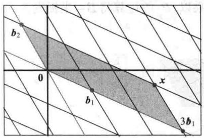
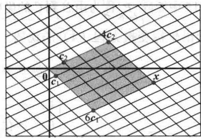
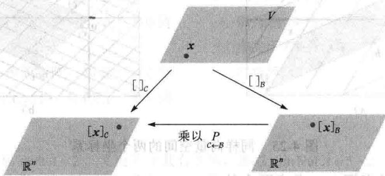

import Guide from '@/components/Guide.astro';
import Knowledge from '@/components/Knowledge.astro';
import Example from '@/components/Example.astro';
import Analysis from '@/components/Analysis.astro';
import Solution from '@/components/Solution.astro';
import Variant from '@/components/Variant.astro';
import Note from '@/components/Note.astro';
import Block from '@/components/Block.astro';
import Method from '@/components/Method.astro';
import Exercise from '@/components/Exercise.astro';

对一个 n 维向量空间 V，当一个基 B 取定后，与之相关的映上到 $R^{n}$ 的坐标映射对 V 提供了一个坐标系。V 中每个向量 x 由它的 B-坐标向量 $[x]_{B}$ 唯一确定。

在某些应用中，一个问题开始是用一个基 $\mathcal{B}$ 描述，但问题的解可通过将 $\mathcal{B}$ 变为一个新的基 $\mathcal{C}$ 得到帮助（例子将在第5章和第7章中给出）。每个向量被确定为一个新的 $\mathcal{C}-$ 坐标向量。在本节中，我们研究对每个 $x \in V$ ， $[x]_{\mathcal{C}}$ 与 $[x]_{\mathcal{B}}$ 如何联系起来。

为使问题直观化，考虑图4-25中的两个坐标系。在图4-25a中， $x=3b_{1}+b_{2}$ ，而在图4-25b中，同样的x表示为 $x=6c_{1}+4c_{2}$ ，即

$$
[ \boldsymbol {x} ] _ {\mathcal {B}} = \left[ \begin{array}{l} 3 \\ 1 \end{array} \right], [ \boldsymbol {x} ] _ {\mathcal {C}} = \left[ \begin{array}{l} 6 \\ 4 \end{array} \right]
$$

我们的问题是找到这两个坐标向量之间的联系. 例1表明如何做到这一点会使我们知道如何由 $c_{1}$ 和 $c_{2}$ 得到 $\pmb{b}_{1}$ 和 $\pmb{b}_{2}$ .

<figure class="vp-figure">
  

    

      
      a)
    

    

      
      b)
    

  

  <figcaption>图 4-25 同样向量空间的两个坐标系</figcaption>
</figure>

<Example title="例 1">
对一个向量空间 $V$ ，考虑两个基 $\mathcal{B} = \{\pmb{b}_1,\pmb{b}_2\}$ 和 $\mathcal{C} = \{\pmb{c}_1,\pmb{c}_2\}$ ，满足

$$
\boldsymbol {b} _ {1} = 4 \boldsymbol {c} _ {1} + \boldsymbol {c} _ {2}, \boldsymbol {b} _ {2} = - 6 \boldsymbol {c} _ {1} + \boldsymbol {c} _ {2}\tag{1}
$$

假设

$$
\boldsymbol {x} = 3 \boldsymbol {b} _ {1} + \boldsymbol {b} _ {2}\tag{2}
$$

即假设 $[\pmb{x}]_B = \begin{bmatrix} 3 \\ 1 \end{bmatrix}$ ，求 $[\pmb{x}]_C$ 。

<Solution title="解">
对（2）中 x 应用由 C 确定的坐标映射。因为坐标映射是一个线性变换，

$$
\begin{array}{r l} {[ \boldsymbol {x} ] _ {\mathcal {C}}} & = {[ 3 \boldsymbol {b} _ {1} + \boldsymbol {b} _ {2} ] _ {\mathcal {C}}} \\ & = {3 [ \boldsymbol {b} _ {1} ] _ {\mathcal {C}} + [ \boldsymbol {b} _ {2} ] _ {\mathcal {C}}} \end{array}
$$

利用将线性组合中的向量作为矩阵的列，我们可以将这个向量方程写成一个矩阵方程：

$$
[ \boldsymbol {x} ] _ {\mathcal {C}} = [ [ \boldsymbol {b} _ {1} ] _ {\mathcal {C}} [ \boldsymbol {b} _ {2} ] _ {\mathcal {C}} ] \left[ \begin{array}{l} 3 \\ 1 \end{array} \right]\tag{3}
$$

只要知道该矩阵的列，这个公式就给出了 $[\pmb{x}]_c$ 由（1），

$$
[ \boldsymbol {b} _ {1} ] _ {\mathcal {C}} = \left[ \begin{array}{l} 4 \\ 1 \end{array} \right], [ \boldsymbol {b} _ {2} ] _ {\mathcal {C}} = \left[ \begin{array}{c} - 6 \\ 1 \end{array} \right]
$$

于是（3）给出了解：

$$
[ \boldsymbol {x} ] _ {c} = \left[ \begin{array}{l l} 4 & - 6 \\ 1 & 1 \end{array} \right] \left[ \begin{array}{l} 3 \\ 1 \end{array} \right] = \left[ \begin{array}{l} 6 \\ 4 \end{array} \right]
$$

即与图 4-25 中 x 相匹配的 x 的 C-坐标.

可以将推导出公式（3）的论证推广从而产生下列结果。（见习题15和习题16.）
</Solution>
</Example>

<Knowledge title="定理 15">
设 $B=\{b_{1},\cdots,b_{n}\}$ 和 $C=\{c_{1},\cdots,c_{n}\}$ 是向量空间 V 的基，则存在一个 $n\times n$ 矩阵 $P_{C\leftarrow B}$ 使得

$$
[ \boldsymbol {x} ] _ {\mathcal {C}} = P _ {\mathcal {C} \leftarrow \mathcal {B}} [ \boldsymbol {x} ] _ {\mathcal {B}}\tag{4}
$$

$P_{C\leftarrow B}$ 的列是基 $\mathcal{B}$ 中向量的 $C-$ 坐标向量，即

$$
P _ {c \leftarrow B} = [ [ \boldsymbol {b} _ {1} ] _ {c c} [ \boldsymbol {b} _ {2} ] _ {c c} \dots [ \boldsymbol {b} _ {n} ] _ {c c} ]\tag{5}
$$

定理 15 中矩阵 $P_{C \leftarrow B}$ 称为由 B 到 C 的坐标变换矩阵. 乘以 $P_{C \leftarrow B}$ 的运算将 B-坐标变为 C-坐标, 图 4-26 给出坐标变换方程（4）的说明.

<figure class="vp-figure">
  
  <figcaption>图4-26 $V$ 的两个坐标系</figcaption>
</figure>

$P_{\mathcal{C}\leftarrow \mathcal{B}}$ 的列是线性无关的，这是因为它们是线性无关集 $\mathcal{B}$ 的坐标向量（见4.4节习题25）。因为 $P_{\mathcal{C}\leftarrow \mathcal{B}}$ 是方阵，所以由可逆矩阵定理， $P_{\mathcal{C}\leftarrow \mathcal{B}}$ 必是可逆的。将（4）两边左乘以 $\left(P_{\mathcal{C}\leftarrow \mathcal{B}}\right)^{-1}$ ，得

$$
\left(P _ {c \leftarrow B}\right) ^ {- 1} [ x ] _ {c} = [ x ] _ {B}
$$

于是 $\binom{P}{\mathcal{C}\leftarrow \mathcal{B}}^{-1}$ 是将 $\mathcal{C}$ -坐标变为 $\mathcal{B}$ -坐标的矩阵，即

$$
\binom {P} {\mathcal {C} \leftarrow \mathcal {B}} ^ {- 1} = P _ {\mathcal {B} \leftarrow \mathcal {C}}\tag{6}
$$

$\mathbb{R}^n$ 中基的变换

若 $B=\{b_{1},\cdots,b_{n}\}$ ，E 是 $R^{n}$ 中的标准基 $\{e_{1},\cdots,e_{n}\}$ ，则 $[b_{1}]_{E}=b_{1}$ ，B 中其他向量也类似。在此情形下， $P_{E\leftarrow B}$ 与 4.4 节中引入的坐标变换矩阵 $P_{B}$ 相同，即

$$
P _ {B} = \left[ \begin{array}{l l l l} \boldsymbol {b} _ {1} & \boldsymbol {b} _ {2} & \dots & \boldsymbol {b} _ {n} \end{array} \right]
$$

为了在 $\mathbb{R}^n$ 中两个非标准基之间变换坐标，我们需要定理15. 定理15表明为解决基变换问题，需要原来的基关于新的基的坐标向量.
</Knowledge>

<Example title="例 2">
设 $\pmb{b}_1 = \begin{bmatrix} -9 \\ 1 \end{bmatrix}, \pmb{b}_2 = \begin{bmatrix} -5 \\ -1 \end{bmatrix}, \pmb{c}_1 = \begin{bmatrix} 1 \\ -4 \end{bmatrix}, \pmb{c}_2 = \begin{bmatrix} 3 \\ -5 \end{bmatrix}$ ，考虑 $\mathbb{R}^2$ 中的基 $\mathcal{B} = \{\pmb{b}_1, \pmb{b}_2\}$ ， $\mathcal{C} = \{\pmb{c}_1, \pmb{c}_2\}$ ，求由 $\mathcal{B}$ 到 $\mathcal{C}$ 的坐标变换矩阵。

<Solution title="解">
矩阵 $P_{\mathcal{C}\leftarrow \mathcal{B}}$ 涉及 $\pmb{b}_1$ 和 $\pmb{b}_2$ 的 $\mathcal{C}-$ 坐标向量. 设 $[\pmb{b}_1]_{\mathcal{C}} = \begin{bmatrix} x_1 \\ x_2 \end{bmatrix}, [\pmb{b}_2]_{\mathcal{C}} = \begin{bmatrix} y_1 \\ y_2 \end{bmatrix}$ , 于是由定义,

$$
\left[ \begin{array}{l l} \boldsymbol {c} _ {1} & \boldsymbol {c} _ {2} \end{array} \right] \left[ \begin{array}{l} x _ {1} \\ x _ {2} \end{array} \right] = \boldsymbol {b} _ {1}, \left[ \begin{array}{l l} \boldsymbol {c} _ {1} & \boldsymbol {c} _ {2} \end{array} \right] \left[ \begin{array}{l} y _ {1} \\ y _ {2} \end{array} \right] = \boldsymbol {b} _ {2}
$$

(7)

为了同步解出这两个方程组，将 $b_{1}$ 和 $b_{2}$ 扩大到系数矩阵中并进行行化简：

$$
\left[ \begin{array}{l l l l l} \boldsymbol {c} _ {1} & \boldsymbol {c} _ {2} & \vdots & \boldsymbol {b} _ {1} & \boldsymbol {b} _ {2} \end{array} \right] = \left[ \begin{array}{c c c c c} 1 & 3 & - 9 & - 5 \\ - 4 & - 5 & 1 & - 1 \end{array} \right] \sim \left[ \begin{array}{c c c c c} 1 & 0 & 6 & 4 \\ 0 & 1 & - 5 & - 3 \end{array} \right]
$$

于是 $[\pmb{b}_1]_C = \begin{bmatrix} 6 \\ -5 \end{bmatrix}, [\pmb{b}_2]_C = \begin{bmatrix} 4 \\ -3 \end{bmatrix}$ . 因此所要求的坐标变换矩阵是

$$
P _ {c \leftarrow B} = \left[ \left[ \boldsymbol {b} _ {1} \right] _ {c} \quad \left[ \boldsymbol {b} _ {2} \right] _ {c} \right] = \left[ \begin{array}{l l} 6 & 4 \\ - 5 & - 3 \end{array} \right]
$$

观察例 2 中的矩阵 $P_{C \leftarrow B}$ ，它已经出现在（7）中，这并不会令人感到意外，因为 $P_{C \leftarrow B}$ 的第 1 列是行化简 $[c_{1}, c_{2}; b_{1}]$ 到 $[I; [b_{1}]_{C}]$ 的结果，对 $P_{C \leftarrow B}$ 的第 2 列也是类似的，于是

$$
\left[ \begin{array}{l l l l} \boldsymbol {c} _ {1} & \boldsymbol {c} _ {2} & \boldsymbol {b} _ {1} & \boldsymbol {b} _ {2} \end{array} \right] \sim \left[ \begin{array}{l l} I & P \\ & C \leftarrow B \end{array} \right]
$$

求 $\mathbb{R}^n$ 中的任意两个基之间的坐标变换矩阵具有类似的步骤.
</Solution>
</Example>

<Example title="例 3">
设 $\pmb{b}_1 = \begin{bmatrix} 1 \\ -3 \end{bmatrix}, \pmb{b}_2 = \begin{bmatrix} -2 \\ 4 \end{bmatrix}, \pmb{c}_1 = \begin{bmatrix} -7 \\ 9 \end{bmatrix}, \pmb{c}_2 = \begin{bmatrix} -5 \\ 7 \end{bmatrix}$ ，考虑 $\mathbb{R}^2$ 中的基 $\mathcal{B} = \{\pmb{b}_1, \pmb{b}_2\}, \mathcal{C} = \{\pmb{c}_1, \pmb{c}_2\}$ .

a. 求由 C 到 B 的坐标变换矩阵.

b. 求由 B 到 C 的坐标变换矩阵.

<Solution title="解">
a. 注意到求 $P_{B \leftarrow C}$ 比求 $P_{C \leftarrow B}$ 更方便，计算

$$
\left[ \begin{array}{l l l l} \boldsymbol {b} _ {1} & \boldsymbol {b} _ {2} & c _ {1} & \boldsymbol {c} _ {2} \end{array} \right] = \left[ \begin{array}{c c c c} 1 & - 2 & - 7 & - 5 \\ - 3 & 4 & 9 & 7 \end{array} \right] \sim \left[ \begin{array}{c c c c} 1 & 0 & 5 & 3 \\ 0 & 1 & 6 & 4 \end{array} \right]
$$

所以

$$
P _ {\mathcal {B} \leftarrow \mathcal {C}} = \left[ \begin{array}{l l} 5 & 3 \\ 6 & 4 \end{array} \right]
$$

b. 由（a）和上面的性质（6）式（将 B 和 C 互换）

$$
P _ {c \leftarrow B} = \left(P _ {B \leftarrow C}\right) ^ {- 1} = \frac {1}{2} \left[ \begin{array}{l l} 4 & - 3 \\ - 6 & 5 \end{array} \right] = \left[ \begin{array}{l l} 2 & - 3 / 2 \\ - 3 & 5 / 2 \end{array} \right]
$$

另一个关于坐标变换矩阵 $P_{\mathcal{C} \leftarrow \mathcal{B}}$ 的描述是使用坐标变换矩阵 $P_{\mathcal{B}}$ 和 $P_{\mathcal{C}}$ 分别将 $\mathcal{B}$ -坐标和 $\mathcal{C}$ -坐标转换成为标准坐标. 回忆对 $\mathbb{R}^n$ 中的每个 $x$ ，有

$$
P _ {B} [ \boldsymbol {x} ] _ {B} = \boldsymbol {x}, P _ {C} [ \boldsymbol {x} ] _ {C} = \boldsymbol {x}, [ \boldsymbol {x} ] _ {C} = P _ {C} ^ {- 1} \boldsymbol {x}
$$

于是

$$
[ \boldsymbol {x} ] _ {\mathcal {C}} = P _ {\mathcal {C}} ^ {- 1} \boldsymbol {x} = P _ {\mathcal {C}} ^ {- 1} P _ {\mathcal {B}} [ \boldsymbol {x} ] _ {\mathcal {B}}
$$

在 $\mathbb{R}^n$ 中，坐标变换矩阵 $P_{C\leftarrow B}$ 可以用 $P_{C}^{-1}P_{B}$ 来计算。事实上，对于比 $2\times 2$ 更大的矩阵，一个类似于例3的算法比先计算 $P_{C}^{-1}$ 再计算 $P_{C}^{-1}P_{B}$ 的方法更快，见2.2节习题12。
</Solution>
</Example>

<Block title="练习题">
1. 设 $F=\{f_{1},f_{2}\},G=\{g_{1},g_{2}\}$ 为向量空间 V 的两个基，P 为一个矩阵，它的列是 $[f_{1}]_{G}$ 和 $[f_{2}]_{G}$ . 对所有 $v\in V,P$ 满足下列哪一个方程？

$$
\left(\mathrm{i}\right) [ \boldsymbol {v} ] _ {\mathcal {F}} = P [ \boldsymbol {v} ] _ {\mathcal {G}} \quad \left(\mathrm{ii}\right) [ \boldsymbol {v} ] _ {\mathcal {G}} = P [ \boldsymbol {v} ] _ {\mathcal {F}}
$$

2. 设 B 和 C 如例 1 所示，利用例 1 的结果求由 C 到 B 的坐标变换矩阵.
</Block>

<Block title="习题4.7">
1. 设 $\mathcal{B} = \{\pmb{b}_1, \pmb{b}_2\}$ 和 $C = \{\pmb{c}_1, \pmb{c}_2\}$ 是向量空间 $V$ 的两个基，设

$$
\boldsymbol {b} _ {1} = 6 \boldsymbol {c} _ {1} - 2 \boldsymbol {c} _ {2}, \boldsymbol {b} _ {2} = 9 \boldsymbol {c} _ {1} - 4 \boldsymbol {c} _ {2}
$$

a. 求由 B 到 C 的坐标变换矩阵.
b. 利用（a），对 $x = -3b_{1} + 2b_{2}$ ，求 $[x]_{C}$ .

2. 设 $B=\{b_{1},b_{2}\}$ 和 $C=\{c_{1},c_{2}\}$ 是向量空间 V 的两个基，设 $b_{1}=-c_{1}+4c_{2},\quad b_{2}=5c_{1}-3c_{2}$ a. 求由 B 到 C 的坐标变换矩阵.
b. 对 $x=5b_{1}+3b_{2}$ ，求 $[x]_{C}$ .

3. 设 $U = \{u_{1}, u_{2}\}$ 和 $W = \{w_{1}, w_{2}\}$ 是 V 的两个基，P 为一个矩阵，它的列为 $[u_{1}]_{w}$ 和 $[u_{2}]_{w}$ . 对所有 $x \in V, P$ 满足以下哪一个方程？
(i) $[x]_{u}=P[x]_{w}$ (ii) $[x]_{w}=P[x]_{u}$

4. 设 $A=\{a_{1},a_{2},a_{3}\}$ 和 $D=\{d_{1},d_{2},d_{3}\}$ 是 V 的两个基， $P=\left[\left[d_{1}\right]_{A}\left[d_{2}\right]_{A}\left[d_{3}\right]_{A}\right]$ . 对所有 $x\in V$ ，P 满足以下哪一个方程？
(i) $[x]_{A}=P[x]_{D}$ (ii) $[x]_{D}=P[x]_{A}$

5. 设 $A=\{a_{1},a_{2},a_{3}\}$ 和 $B=\{b_{1},b_{2},b_{3}\}$ 是向量空间 V 的两个基，设 $a_{1}=4b_{1}-b_{2}$ ， $a_{2}=-b_{1}+b_{2}+b_{3}$ ， $a_{3}=b_{2}-2b_{3}$ .
a. 求由 A 到 B 的坐标变换矩阵.
b. 对 $x=3a_{1}+4a_{2}+a_{3}$ ，求 $[x]_{B}$ .

6. 设 $D=\{d_{1},d_{2},d_{3}\}$ 和 $F=\{f_{1},f_{2},f_{3}\}$ 是向量空间 V 的两个基，设 $f_{1}=2d_{1}-d_{2}+d_{3}$ ， $f_{2}=3d_{2}+d_{3}$ ， $f_{3}=-3d_{1}+2d_{3}$ .
a. 求由 F 到 D 的坐标变换矩阵.
b. 对 $x = f_{1} - 2f_{2} + 2f_{3}$ ，求 $[x]_{D}$ .

在习题 7\~10 中，设 $B=\{b_{1},b_{2}\}$ 和 $C=\{c_{1},c_{2}\}$ 是 $R^{2}$ 的两个基，求由 B 到 C 的坐标变换矩阵和由 C 到 B 的坐标变换矩阵.

7. $b_{1}=\begin{bmatrix}7\\ 5\end{bmatrix},b_{2}=\begin{bmatrix}-3\\ -1\end{bmatrix},c_{1}=\begin{bmatrix}1\\ -5\end{bmatrix},c_{2}=\begin{bmatrix}-2\\ 2\end{bmatrix}$

8. $b_{1}=\begin{bmatrix}-1\\8\end{bmatrix},b_{2}=\begin{bmatrix}1\\-5\end{bmatrix},c_{1}=\begin{bmatrix}1\\4\end{bmatrix},c_{2}=\begin{bmatrix}1\\1\end{bmatrix}$

$$
\boldsymbol {b} _ {1} = \left[ \begin{array}{c} - 6 \\ - 1 \end{array} \right], \boldsymbol {b} _ {2} = \left[ \begin{array}{c} 2 \\ 0 \end{array} \right], \boldsymbol {c} _ {1} = \left[ \begin{array}{c} 2 \\ - 1 \end{array} \right], \boldsymbol {c} _ {2} = \left[ \begin{array}{c} 6 \\ - 2 \end{array} \right]
$$

10. $b_{1}=\begin{bmatrix}7\\ -2\end{bmatrix},b_{2}=\begin{bmatrix}2\\ -1\end{bmatrix},c_{1}=\begin{bmatrix}4\\ 1\end{bmatrix},c_{2}=\begin{bmatrix}5\\ 2\end{bmatrix}$

在习题11和习题12中， $\mathcal{B}$ 和 $\mathcal{C}$ 是向量空间 $V$ 的两个基，标出每个命题的真假，给出理由.  
11. a. 坐标变换矩阵 $\underset{\mathcal{C} \leftarrow \mathcal{B}}{P}$ 的列是 $\mathcal{C}$ 中向量的 $\mathcal{B}-$ 坐标向量.  
b. 若 $V = \mathbb{R}^n$ ， $\mathcal{C}$ 为 $V$ 的标准基，则 $\underset{\mathcal{C} \leftarrow \mathcal{B}}{P}$ 与4.4节中引入的坐标变换矩阵 $P_{\mathcal{B}}$ 相同.

12. a. $P_{\mathcal{C} \leftarrow \mathcal{B}}$ 的列是线性无关的.
b. 若 $V = \mathbb{R}^2, \mathcal{B} = \{\pmb{b}_1, \pmb{b}_2\}$ , $\mathcal{C} = \{\pmb{c}_1, \pmb{c}_2\}$ , 则将 $[\pmb{c}_1, \pmb{c}_2, \pmb{b}_1, \pmb{b}_2]$ 行化简为 [I P] 时产生一矩阵 P，满足对任意 $\pmb{x} \in V$ ，均有 $[\pmb{x}]_{\mathcal{B}} = P[\pmb{x}]_{\mathcal{C}}$ .

13. 在 $\mathbb{P}_2$ 中，求由基 $\mathcal{B} = \{1 - 2t + t^2, 3 - 5t + 4t^2, 2t + 3t^2\}$ 到标准基 $\mathcal{C} = \{1, t, t^2\}$ 的坐标变换矩阵，再求 $-1 + 2t$ 的 $\mathcal{B}$ -坐标向量.

14. 在 $\mathbb{P}_2$ 中，求由基 $B = \{1 - 3t^2, 2 + t - 5t^2, 1 + 2t\}$ 到标准基的坐标变换矩阵，再将 $t^2$ 写成 $B$ 中多项式的线性组合。在习题15和习题16中，通过填写正确的理由完成定理15的证明。

15. 给定 $v \in V$ ，则对某些数 $x_{1}, \cdots, x_{n}$ 有

$$
\boldsymbol {v} = x _ {1} \boldsymbol {b} _ {1} + x _ {2} \boldsymbol {b} _ {2} + \dots + x _ {n} \boldsymbol {b} _ {n}
$$

这是因为 (a). 应用由基 $\mathcal{C}$ 确定的坐标映射，有

$$
[ \boldsymbol {v} ] _ {\mathcal {C}} = x _ {1} [ \boldsymbol {b} _ {1} ] _ {\mathcal {C}} + x _ {2} [ \boldsymbol {b} _ {2} ] _ {\mathcal {C}} + \dots + x _ {n} [ \boldsymbol {b} _ {n} ] _ {\mathcal {C}}
$$

这是因为\_\_\_\_(b)\_\_\_\_。由定义\_\_\_\_(c)，我们可以将这个方程写成以下形式：

$$
[ \boldsymbol {v} ] _ {\mathcal {C}} = [ [ \boldsymbol {b} _ {1} ] _ {\mathcal {C}} [ \boldsymbol {b} _ {2} ] _ {\mathcal {C}} \dots [ \boldsymbol {b} _ {n} ] _ {\mathcal {C}} ] \left[ \begin{array}{c} x _ {1} \\ \vdots \\ x _ {n} \end{array} \right]\tag{8}
$$

因为（8）式右边的向量是\_\_\_\_(d)，这就证明了对于 $v \in V$ ，（5）中的矩阵 $P_{C \leftarrow B}$ 满足 $[v]_{C} = P_{C \leftarrow B}[v]_{B}$ .

16. 设 $Q$ 是任意矩阵，使得

$$
[ \boldsymbol {v} ] _ {c} = Q [ \boldsymbol {v} ] _ {B}, \quad \boldsymbol {v} \in V\tag{9}
$$

在（9）中，设 $v = b_{1}$ ，则（9）表明 $[b_{1}]_{c}$ 是 Q 的第一列，这是因为 \_\_\_\_ (a) \_\_\_\_。类似地，对 $k = 2, \cdots, n$ ，Q 的第 k 列是 \_\_\_\_ (b) \_\_\_\_ 这是因为，\_\_\_\_ (c) \_\_\_\_。这表明由定理 15 中的（5）定义的矩阵 $P_{c \leftarrow B}$ 是满足条件（4）的唯一矩阵。

17. [M] 设 $B = \{x_{0}, \cdots, x_{6}\}$ ， $C = \{y_{0}, \cdots, y_{6}\}$ ，其中 $x_{k}$ 是函数 $\cos^{k} t$ ， $y_{k}$ 是函数 $\cos kt$ ，4.5 节习题 34

证明 B 和 C 都是向量空间 $H = \text{Span}\{x_{0}, \cdots, x_{6}\}$ 的基.

a. 设 $P = [[y_{0}]_{B} \cdots [y_{6}]_{B}]$ ，计算 $P^{-1}$ .

b. 解释为什么 $P^{-1}$ 的列是 $x_{0},\cdots,x_{6}$ 的 C-坐标向量，然后利用这些坐标向量写出表示 C 中函数 cost 的幂的三角恒等式.

18. [M]（需要微积分的知识） ① 回顾微积分中如下积分：

$$
\int (5 \cos^ {3} t - 6 \cos^ {4} t + 5 \cos^ {5} t - 1 2 \cos^ {6} t) d t\tag{10}
$$

其计算过程是烦琐的。（通常的方法是重复利用分部积分法和半角公式。）使用习题17的矩阵 $P$ 或 $P^{-1}$ 变换（10）式，再计算这个积分.

19. [M] 设 $P = \begin{bmatrix} 1 & 2 & -1 \\ -3 & -5 & 0 \\ 4 & 6 & 1 \end{bmatrix}$ ， $v_{1} = \begin{bmatrix} -2 \\ 2 \\ 3 \end{bmatrix}$ ， $v_{2} = \begin{bmatrix} -8 \\ 5 \\ 2 \end{bmatrix}$ ， $v_{3}=\begin{bmatrix}-7\\ 2\\ 6\end{bmatrix}$

a. 求 $R^{3}$ 中的一个基 $\{u_{1}, u_{2}, u_{3}\}$ ，使得 P 是由基 $\{u_{1}, u_{2}, u_{3}\}$ 到 $\{v_{1}, v_{2}, v_{3}\}$ 的坐标变换矩阵。（提示：P 的列代表什么？）

b. 求 $R^{3}$ 的一个基 $\{w_{1}, w_{2}, w_{3}\}$ ，使得 P 是由基 $\{v_{1}, v_{2}, v_{3}\}$ 到基 $\{w_{1}, w_{2}, w_{3}\}$ 的坐标变换矩阵.

20. 设 $\mathcal{B} = \{\pmb{b}_1, \pmb{b}_2\}$ , $\mathcal{C} = \{\pmb{c}_1, \pmb{c}_2\}$ 和 $\mathcal{D} = \{\pmb{d}_1, \pmb{d}_2\}$ 是一个二维向量空间的基.

a. 写出一个将 $P_{C \leftarrow B}, P_{D \leftarrow C}$ 和 $P_{D \leftarrow B}$ 联系起来的方程，验证你的结果.

b. [M]针对 $\mathbb{R}^2$ 中的3个基（见习题7\~10），利用一个矩阵程序帮你找到这个方程或者检验你写出的方程.
</Block>

<Block title="练习题答案">
1. 由于 P 的列是 G-坐标向量，因此形如 Px 的向量一定是 G-坐标向量，从而 P 满足方程（ii）.

从而

2. 例1中求得的坐标向量表明

$$
P _ {C \leftarrow B} = \left[ \left[ \boldsymbol {b} _ {1} \right] _ {C} \quad \left[ \boldsymbol {b} _ {2} \right] _ {C} \right] = \left[ \begin{array}{c c} 4 & - 6 \\ 1 & 1 \end{array} \right]
$$

$$
P _ {\mathcal {B} \leftarrow \mathcal {C}} = \left(P _ {\mathcal {C} \leftarrow \mathcal {B}}\right) ^ {- 1} = \frac {1}{1 0} \left[ \begin{array}{l l} 1 & 6 \\ - 1 & 4 \end{array} \right] = \left[ \begin{array}{l l} 0. 1 & 0. 6 \\ - 0. 1 & \overline {{0 . 4}} \end{array} \right]
$$
</Block>
