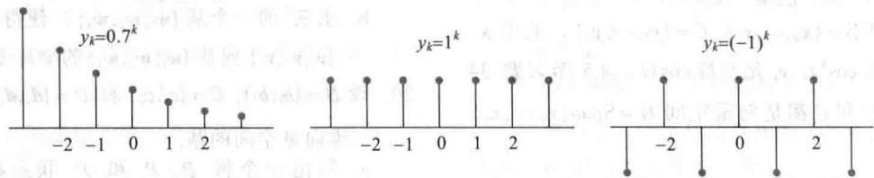
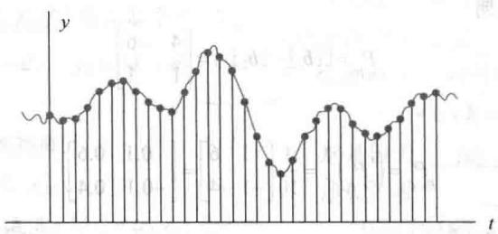
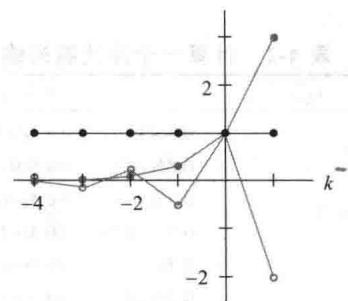
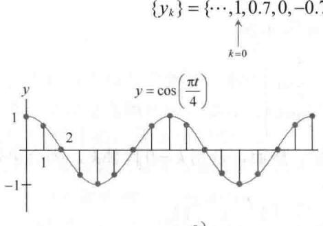
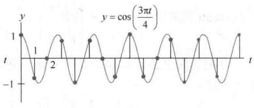
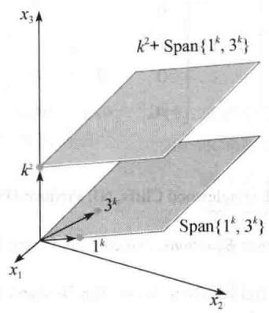
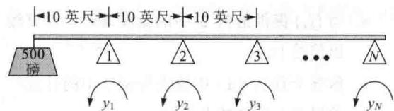
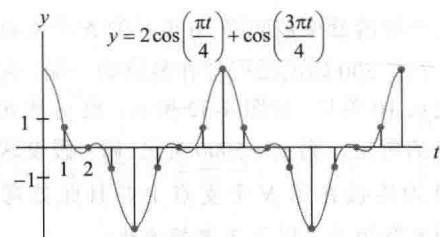

import Guide from '@/components/Guide.astro';
import Knowledge from '@/components/Knowledge.astro';
import Example from '@/components/Example.astro';
import Analysis from '@/components/Analysis.astro';
import Solution from '@/components/Solution.astro';
import Variant from '@/components/Variant.astro';
import Note from '@/components/Note.astro';
import Block from '@/components/Block.astro';
import Method from '@/components/Method.astro';
import Exercise from '@/components/Exercise.astro';

现在，功能强大的计算机被广泛地应用在各个领域，越来越多的科学上和工程上的问题在某种意义上讲用离散的或数字化的数据来处理胜过用连续的数据来处理。差分方程往往是分析这样的数据的合适工具，甚至当使用微分方程对连续过程建模时，其数值解也常常由一个相关的差分方程得到。

本节中强调一些线性差分方程的基本性质，它们可通过线性代数得到很好的解释.

## 离散时间信号

离散时间信号的向量空间 $\mathbb{S}$ 在4.1节中引入． $\mathbb{S}$ 中一个信号是一个只定义在整数上的函数，同时可用一个数列将其直观化，即 $\{y_k\}$ ．图4-27中展示出三个典型的信号，它们的通项分别是 $(0.7)^k,1^k$ 和 $(-1)^k$

  
图4-27 S中三个信号

数字信号显然来自电学和控制系统工程学，但离散数据序列也来自生物学、物理学、经济学、人口统计学以及其他任何需要在离散时间区间测量或抽样的过程的领域。如果一个过程从一个指定的时间开始，那么用形如 $(y_{0},y_{1},y_{2},\cdots)$ 的序列去描述一个信号有时是方便的。对于k&lt;0的 $y_{k}$ 项，可以假设取值为0或者予以忽略。

<Example title="例 1">
光盘唱机中发出的清晰的声音是以每秒 44100 次的速度从音乐中抽样而成的，见图 4-28. 在每次测量时，音乐信号的振幅用一个数字的形式记录下来，比如 $y_{k}$ . 最初的音乐是由各种频率的不同声音合成的，然而序列 $\{y_{k}\}$ 包含足够多的信息用来复制声音中的所有频率，最高达到大约每秒 20000 个周期，这超出了人耳所能感觉到的范围.

  
图4-28 音乐信号的抽样数据
</Example>

## 信号空间 S 中的线性无关性

为了简化记号，我们考虑一个仅包含三个信号 $\{u_k\}, \{v_k\}$ 和 $\{w_k\}$ 的集合 $\mathbb{S}$ ，当方程

$$
c _ {1} u _ {k} + c _ {2} v _ {k} + c _ {3} w _ {k} = 0 \qquad {\text {对所有}} k {\text {成立}}\tag{1}
$$

蕴涵 $c_{1} = c_{2} = c_{3} = 0$ 时， $\{u_k\}, \{v_k\}, \{w_k\}$ 恰好是线性无关的。这里说“对所有 $k$ 成立”指对所有整数——正整数、负整数和0均成立。我们也可考虑从 $k = 0$ 开始的信号，例如，这时“对所有 $k$ 成立”将表示对所有 $k \geqslant 0$ 的整数成立。

假设 $c_{1}, c_{2}, c_{3}$ 满足（1）式，那么方程（1）对任意三个相邻的值 $k, k + 1$ 和 $k + 2$ 成立，这样（1）蕴涵

$$
\begin{array}{l l} {c _ {1} u _ {k + 1} + c _ {2} v _ {k + 1} + c _ {3} w _ {k + 1} = 0} & {\text {对所有} k \text {成立}} \\ {c _ {1} u _ {k + 2} + c _ {2} v _ {k + 2} + c _ {3} w _ {k + 2} = 0} & {\text {对所有} k \text {成立}} \end{array}
$$

从而 $c_{1}, c_{2}, c_{3}$ 满足

$$
\left[ \begin{array}{c c c} {u _ {k}} & {v _ {k}} & {w _ {k}} \\ {u _ {k + 1}} & {v _ {k + 1}} & {w _ {k + 1}} \\ {u _ {k + 2}} & {v _ {k + 2}} & {w _ {k + 2}} \end{array} \right] \left[ \begin{array}{c} {c _ {1}} \\ {c _ {2}} \\ {c _ {3}} \end{array} \right] = \left[ \begin{array}{c} {0} \\ {0} \\ {0} \end{array} \right] \quad \text {对所有} k \text {成立}\tag{2}
$$

这个方程组的系矩阵称为信号的 Casorati 矩阵，这个矩阵的行列式称为 $\{u_{k}\},\{v_{k}\},\{w_{k}\}$ 的 Casorati 行列式。如果对至少一个 k 值 Casorati 矩阵可逆，则（2）将蕴涵 $c_{1}=c_{2}=c_{3}=0$ ，这就证明这三个信号是线性无关的。

<Example title="例 2">
证明 $1^{k}, (-2)^{k}$ 和 $3^{k}$ 是线性无关的信号. 见图 4-29.

<Solution title="解">
Casorati 矩阵是

$$
\left[ \begin{array}{l l l} 1 ^ {k} & (- 2) ^ {k} & 3 ^ {k} \\ 1 ^ {k + 1} & (- 2) ^ {k + 1} & 3 ^ {k + 1} \\ 1 ^ {k + 2} & (- 2) ^ {k + 2} & 3 ^ {k + 2} \end{array} \right]
$$

通过行变换可相当简单地证明这个矩阵总是可逆的. 然而, 若用 $k = 0$ 代替 $k$ , 则会更快地行化简这个数值矩阵:

$$
\left[ \begin{array}{r r r} 1 & 1 & 1 \\ 1 & - 2 & 3 \\ 1 & 4 & 9 \end{array} \right] \sim \left[ \begin{array}{r r r} 1 & 1 & 1 \\ 0 & - 3 & 2 \\ 0 & 3 & 8 \end{array} \right] \sim \left[ \begin{array}{r r r} 1 & 1 & 1 \\ 0 & - 3 & 2 \\ 0 & 0 & 1 0 \end{array} \right]
$$

这个 Casorati 矩阵对 k=0 可逆，所以 $1^{k},(-2)^{k}$ 和 $3^{k}$ 是线性无关的.

  
图 4-29 信号 $1^{k}$ ， $(-2)^{k}$ 和 $3^{k}$

b)

若 Casorati 矩阵不可逆，则相应的信号通过检测可能线性相关也可能不是线性相关（见习题 33）。但是可以证明，如果这些信号是同一个齐次差分方程（将在下面描述）的所有解，则 Casorati 矩阵对所有 k 是可逆的且这些信号是线性无关的，否则 Casorati 矩阵对所有 k 都不可逆且这些信号是线性相关的。一个用线性变换方法的较好的证明可在“学习指导”中找到。
</Solution>
</Example>

## 线性差分方程

给定数 $a_0, \cdots, a_n, a_0$ 和 $a_n$ 不为零，给定一个信号 $\{z_k\}$ ，方程

$$
a _ {0} y _ {k + n} + a _ {1} y _ {k + n - 1} + \dots + a _ {n - 1} y _ {k + 1} + a _ {n} y _ {k} = z _ {k} \quad \text {对所有} k \text {成立}\tag{3}
$$

称为一个 $n$ 阶线性差分方程（或线性递归关系）．为了简化， $a_0$ 通常取为1．若 $\{z_k\}$ 是零序列，则方程是齐次的；否则，方程为非齐次的.

<Example title="例 3">
在数字信号处理中，像上面（3）那样的差分方程用来描述一个线性滤波器， $a_{0},\cdots,a_{n}$ 称为滤波器系数。若将 $\{y_{k}\}$ 看作输入， $\{z_{k}\}$ 看作输出，则对应的齐次方程的解是过滤掉的信号，并被变换成零信号。我们向如下滤波器输入两个不同的信号：

$$
0. 3 5 y _ {k + 2} + 0. 5 y _ {k + 1} + 0. 3 5 y _ {k} = z _ {k}
$$

这里 0.35 是 $\sqrt{2}/4$ 的简写。第一个信号是由连续信号 $y = \cos(\pi t/4)$ 在整数值 t 抽样而生成，如图 4-30a 所示。离散信号是 $\{y_{k}\} = \{\cdots, \cos(0), \cos(\pi/4), \cos(2\pi/4), \cos(3\pi/4), \cdots\}$ 。

为了简单，用 $\pm 0.7$ 代替 $\pm \sqrt{2} / 2$ ，从而

$$
\{y _ {k} \} = \{\dots , 1, 0. 7, 0, - 0. 7, - 1, - 0. 7, 0, 0. 7, 1, 0. 7, 0, \dots \}
$$

  
图 4-30 具有不同频率的离散信号

表 4-2 展示了输出序列 $\{z_{k}\}$ 的一个计算，其中 0.35(0.7) 是 $(\sqrt{2}/4)(\sqrt{2}/2)=0.25$ 的简写。将 $\{z_{k}\}$ 移动一项，输出就成为 $\{y_{k}\}$ 。

表 4-2 计算一个滤波器的输出

<table><tr><td>k</td><td colspan="2"> $y_k$ </td><td> $y_{k+1}$ </td><td> $y_{k+2}$ </td><td> $0.35y_k$ </td><td> $+0.5y_{k+1}$ </td><td> $+0.35y_{k+2}$ </td><td>=</td><td> $z_k$ </td></tr><tr><td>0</td><td>1</td><td>0.7</td><td>0</td><td></td><td>0.35(1)</td><td>+0.5(0.7)</td><td>+0.35(0)</td><td>=</td><td>0.7</td></tr><tr><td>1</td><td>0.7</td><td>0</td><td>-0.7</td><td></td><td>0.35(0.7)</td><td>+0.5(0)</td><td>+0.35(-0.7)</td><td>=</td><td>0</td></tr><tr><td>2</td><td>0</td><td>-0.7</td><td>-1</td><td></td><td>0.35(0)</td><td>+0.5(-0.7)</td><td>+0.35(-1)</td><td>=</td><td>-0.7</td></tr><tr><td>3</td><td>-0.7</td><td>-1</td><td>-0.7</td><td></td><td>0.35(-0.7)</td><td>+0.5(-1)</td><td>+0.35(-0.7)</td><td>=</td><td>-1</td></tr><tr><td>4</td><td>-1</td><td>-0.7</td><td>0</td><td></td><td>0.35(-1)</td><td>+0.5(-0.7)</td><td>+0.35(0)</td><td>=</td><td>-0.7</td></tr><tr><td>5</td><td>-0.7</td><td>0</td><td>0.7</td><td></td><td>0.35(-0.7)</td><td>+0.5(0)</td><td>+0.35(0.7)</td><td>=</td><td>0</td></tr><tr><td> $\vdots$ </td><td> $\vdots$ </td><td></td><td></td><td></td><td></td><td></td><td></td><td></td><td> $\vdots$ </td></tr></table>

于是一个不同的输入信号由更高的频率信号 $y = \cos(3\pi t / 4)$ 生成，见图 4-30b. 用与前面相同的抽样率去抽样，我们得到一个新的输入序列：

$$
\{w _ {k} \} = \{\dots , 1, - 0. 7, 0, 0. 7, - 1, 0. 7, 0, - 0. 7, 1, - 0. 7, 0, \dots \}
$$

当将 $\{w_k\}$ 输入给滤波器，则输出是零序列。若一个滤波器使 $\{y_k\}$ 能够通过，但将高频的 $\{w_k\}$ 截掉，则称该滤波器为低通滤波器。

在许多应用中，序列 $\{z_k\}$ 由差分方程（3）的右端确定，满足（3）的一个 $\{y_k\}$ 称为这个方程的一个解．下一个例子表明对一个齐次方程如何求解.
</Example>

<Example title="例 4">
齐次差分方程的解通常具有形式 $y_{k}=r^{k}$ 对某 r 成立，求下列方程的解.

$$
y _ {k + 3} - 2 y _ {k + 2} - 5 y _ {k + 1} + 6 y _ {k} = 0 \qquad \text { 对所有 } k \text { 成立 }\tag{4}
$$

<Solution title="解">
用 $r^{k}$ 代替方程中的 $y_{k}$ ，并将左边分解因子.

$$
r ^ {k + 3} - 2 r ^ {k + 2} - 5 r ^ {k + 1} + 6 r ^ {k} = 0\tag{5}
$$

$$
r ^ {k} (r ^ {3} - 2 r ^ {2} - 5 r + 6) = 0
$$

$$
r ^ {k} (r - 1) (r + 2) (r - 3) = 0\tag{6}
$$

由于（5）等价于（6），故 $r^{k}$ 满足差分方程（4）当且仅当r满足（6）。于是 $1^{k},(-2)^{k}$ 和 $3^{k}$ 都是（4）的解。比如，为验证 $3^{k}$ 是（4）的一个解，计算

$$
3 ^ {k + 3} - 2 \cdot 3 ^ {k + 2} - 5 \cdot 3 ^ {k + 1} + 6 \cdot 3 ^ {k} = 3 ^ {k} (2 7 - 1 8 - 1 5 + 6) = 0 \quad \text { 对所有 } k \text { 成立 }
$$

一般而言，一个非零信号 $r^k$ 满足齐次差分方程

$$
y _ {k + n} + a _ {1} y _ {k + n - 1} + \dots + a _ {n - 1} y _ {k + 1} + a _ {n} y _ {k} = 0 \quad \text {对所有} k \text {成立}
$$

当且仅当 $r$ 是辅助方程

$$
r ^ {n} + a _ {1} r ^ {n - 1} + \dots + a _ {n - 1} r + a _ {n} = 0
$$

的一个根，我们将不考虑当 $r$ 是辅助方程的重根的情形。当这个辅助方程有复根时，差分方程具有形如 $s^k \cos k\omega$ 和 $s^k \sin k\omega$ 的解，其中 $s$ 和 $\omega$ 是常数，这在例3中已出现过。

线性差分方程的解集

给定 $a_1, \dots, a_n$ ，考虑映射 $T: \mathbb{S} \to \mathbb{S}$ 将信号 $\{y_k\}$ 变换到信号 $\{w_k\}$ ，这由下式给出：

$$
w _ {k} = y _ {k + n} + a _ {1} y _ {k + n - 1} + \dots + a _ {n - 1} y _ {k + 1} + a _ {n} y _ {k}
$$

容易验证 T 是一个线性变换. 这蕴涵齐次方程

$$
y _ {k + n} + a _ {1} y _ {k + n - 1} + \dots + a _ {n - 1} y _ {k + 1} + a _ {n} y _ {k} = 0 \quad \text {对所有} k \text {成立}
$$

的解集是 $T$ 的核（经 $T$ 映射到零信号的信号的集合），进而这个解集是 $\mathbb{S}$ 的一个子空间。任何解的线性组合仍然是解。

下一个定理是一个简单但基本的结论，它将引导出关于差分方程组解集的更多信息.
</Solution>
</Example>

<Knowledge title="定理 16">
若 $a_{n} \neq 0$ 且 $\{z_{k}\}$ 给定，只要 $y_{0}, \cdots, y_{n-1}$ 给定，方程

$$
y _ {k + n} + a _ {1} y _ {k + n - 1} + \dots + a _ {n - 1} y _ {k + 1} + a _ {n} y _ {k} = z _ {k} \quad \text { 对所有 } k \text { 成立 }\tag{7}
$$

有唯一解.

<Solution title="证明">
若 $y_{0},\cdots,y_{n-1}$ 给定，则利用（7）定义

$$
y _ {n} = z _ {0} - \left[ a _ {1} y _ {n - 1} + \dots + a _ {n - 1} y _ {1} + a _ {n} y _ {0} \right]
$$

现在 $y_{1},\cdots,y_{n}$ 明确了，再利用（7）定义 $y_{n+1}$ 。一般地，利用递归关系

$$
y _ {n + k} = z _ {k} - \left[ a _ {1} y _ {k + n - 1} + \dots + a _ {n} y _ {k} \right]\tag{8}
$$

对 $k \geqslant 0$ 定义 $y_{n + k}$ 。对 $k < 0$ ，为了定义 $y_{k}$ ，利用递归关系

$$
y _ {k} = \frac {1}{a _ {n}} z _ {k} - \frac {1}{a _ {n}} \left[ y _ {k + n} + a _ {1} y _ {k + n - 1} + \dots + a _ {n - 1} y _ {k + 1} \right]\tag{9}
$$

这样生成了一个满足（7）式的信号。反之，对任何 $k$ ，满足（7）式的任何信号一定满足（8）和（9），所以（7）的解是唯一的。
</Solution>
</Knowledge>

<Knowledge title="定理 17">
$n$ 阶齐次线性差分方程

$$
y _ {k + n} + a _ {1} y _ {k + n - 1} + \dots + a _ {n - 1} y _ {k + 1} + a _ {n} y _ {k} = 0 \quad \text {对所有} k \text {成立}\tag{10}
$$

的解集 H 是一个 n 维向量空间.

<Solution title="证明">
我们早已解释过，H 是 S 的一个子空间，这是因为 H 是一个线性变换的核。对 H 中的 $\{y_{k}\}$ ，设 $F\{y_{k}\}$ 是 $R^{n}$ 中的向量 $(y_{0}, y_{1}, \cdots, y_{n-1})$ 。容易证明 $F: H \to R^{n}$ 是一个线性变换。任给 $R^{n}$ 中向量 $(y_{0}, y_{1}, \cdots, y_{n-1})$ ，由定理 16 知存在 H 中唯一一个信号 $\{y_{k}\}$ 使得

$$
F \{y _ {k} \} = (y _ {0}, y _ {1}, \dots , y _ {n - 1})
$$

这说明 F 是由 H 到 $R^{n}$ 上的一对一线性变换，即 F 是一个同构，从而 $\dim H = \dim R^{n} = n$ 。（见 4.5 节习题 32）.
</Solution>
</Knowledge>

<Example title="例 5">
对差分方程

$$
y _ {k + 3} - 2 y _ {k + 2} - 5 y _ {k + 1} + 6 y _ {k} = 0, \text { 对   所   有 } k \text { 成   立 }
$$

求其解集的一个基.

<Solution title="解">
我们在线性代数中的工作现在真的要给我们回报了!从例2和例4知道 $1^{k},(-2)^{k}$ 和 $3^{k}$ 是线性无关解.一般地,直接证明一个信号的集合生成差分方程的解空间可能是困难的,但在这里因为有两个关键定理——定理17和4.5节中的基定理,所以使得我们的工作很容易完成.由定理17知,本例中方程的解空间恰好是三维的,再由4.5节中基定理知,n维空间中含n个向量的线性无关集必然是一个基,所以 $1^{k},(-2)^{k}$ 和 $3^{k}$ 构成解空间的一个基.

描述（10）式的“通解”的标准方法是对所有解构成的子空间给出它的一个基，这样的基称为（10）的基础解系。实际上，如果我们能找到 $n$ 个线性无关的信号满足（10），那么它们必然生成这个 $n$ 维解空间，就像例5中那样。

非齐次方程

非齐次差分方程

$$
y _ {k + n} + a _ {1} y _ {k + n - 1} + \dots + a _ {n - 1} y _ {k + 1} + a _ {n} y _ {k} = z _ {k} \quad \text {对所有} k \text {成立}\tag{11}
$$

的通解能写成（11）的一个特解加上对应的齐次差分方程（10）的一个基础解系的任意线性组合．这个结果类似于1.5节中关于 $Ax = b$ 和 $Ax = 0$ 的解集的关系，二者是类似的.这两个结果有相同的意义：映射 $x \mapsto Ax$ 是线性的，(11) 中将信号 $\{y_{k}\}$ 变换成信号 $\{z_{k}\}$ 的映射也是线性的。见习题 35.
</Solution>
</Example>

<Example title="例 6">
证明：信号 $y_{k} = k^{2}$ 满足差分方程

$$
y _ {k + 2} - 4 y _ {k + 1} + 3 y _ {k} = - 4 k, \text { 对所有 } k \text { 成立 }\tag{12}
$$

然后给出这个方程所有解的一个刻画.

<Solution title="解">
将（12）左端中的 $y_{k}$ 用 $k^{2}$ 代替：

$$
\begin{array}{r l} (k + 2) ^ {2} - 4 (k + 1) ^ {2} + 3 k ^ {2} & \\ = (k ^ {2} + 4 k + 4) - 4 (k ^ {2} + 2 k + 1) + 3 k ^ {2} & \\ = - 4 k \end{array}
$$

所以 $k^2$ 的确是（12）的一个解．下一步是解齐次方程

$$
y _ {k + 2} - 4 y _ {k + 1} + 3 y _ {k} = 0\tag{13}
$$

辅助方程为

$$
r ^ {2} - 4 r + 3 = (r - 1) (r - 3) = 0
$$

根为 $r = 1,3$ ，所以齐次差分方程的两个解为 $1^{k}$ 和 $3^{k}$ ，显然它们彼此不是倍数关系，所以它们是线性无关信号．由定理17，此解空间是二维的，所以 $3^{k}$ 和 $1^{k}$ 构成（13）的解集的一个基．将该解集用非齐次差分方程（12）的特解形式写出来，得到（12）的通解：

$$
k ^ {2} + c _ {1} 1 ^ {k} + c _ {2} 3 ^ {k} \text {或} k ^ {2} + c _ {1} + c _ {2} 3 ^ {k}
$$

图 4-31 给出两个解集的几何直观解释，图中每个点对应于 S 中的一个信号.

  
图 4-31 差分方程（12）和（13）的解集
</Solution>
</Example>

## 化简成一阶方程组

研究 n 阶齐次线性差分方程的现代方法是用等价的一阶差分方程组代替它，其中一阶差分方程写成如下形式：

$$
\pmb {x} _ {k + 1} = A \pmb {x} _ {k}, \text { 对所有 } k \text { 成立 }
$$

其中向量 $x_{k}$ 在 $R^{n}$ 中，A 是一个 $n \times n$ 矩阵.

这样的（向量值）差分方程的简单例子在1.10节中已经研究过.进一步的例子将在4.9节

和 5.6 节中给出.

<Example title="例 7">
将下列差分方程写成一个一阶方程组：

$y_{k+3}-2y_{k+2}-5y_{k+1}+6y_{k}=0$ ，对所有k成立

<Solution title="解">
对每个 $k$ ，设

$$
\boldsymbol {x} _ {k} = \left[ \begin{array}{l} y _ {k} \\ y _ {k + 1} \\ y _ {k + 2} \end{array} \right]
$$

由差分方程得 $y_{k + 3} = -6y_{k} + 5y_{k + 1} + 2y_{k + 2}$ ，所以

$$
\boldsymbol {x} _ {k + 1} = \left[ \begin{array}{l} y _ {k + 1} \\ y _ {k + 2} \\ y _ {k + 3} \end{array} \right] = \left[ \begin{array}{c c c} 0 & + & y _ {k + 1} + 0 \\ 0 & + 0 & + y _ {k + 2} \\ - 6 y _ {k} + 5 y _ {k + 1} + 2 y _ {k + 2} \end{array} \right] = \left[ \begin{array}{c c c} 0 & 1 & 0 \\ 0 & 0 & 1 \\ - 6 & 5 & 2 \end{array} \right] \left[ \begin{array}{l} y _ {k} \\ y _ {k + 1} \\ y _ {k + 2} \end{array} \right]
$$

即 $x_{k+1}=Ax_{k}$ 对所有 k 成立，其中 $A=\begin{bmatrix}0&1&0\\ 0&0&1\\ -6&5&2\end{bmatrix}$ .

一般而言，方程

$y_{k+n}+a_{1}y_{k+n-1}+\cdots+a_{n-1}y_{k+1}+a_{n}y_{k}=0$ ，对所有 k 成立可重写成 $x_{k+1}=Ax_{k}$ ，对所有 k 成立，其中

$$
\boldsymbol {x} _ {k} = \left[ \begin{array}{c} y _ {k} \\ y _ {k + 1} \\ \vdots \\ y _ {k + n - 1} \end{array} \right], A = \left[ \begin{array}{c c c c c} 0 & 1 & 0 & \dots & 0 \\ 0 & 0 & 1 & & 0 \\ \vdots & & & \ddots & \vdots \\ 0 & 0 & 0 & & 1 \\ - a _ {n} & - a _ {n - 1} & - a _ {n - 2} & \dots & - a _ {1} \end{array} \right]
$$
</Solution>
</Example>

## 进一步阅读

Hamming, R. W., Digital Filters, 2nd ed. (Englewood Cliffs, NJ: Prentice-Hall, 1989), pp. 1–37.

Kelly, W. G., and A. C. Peterson, Difference Equations, 2nd ed. (San Diego: Harcourt-Academic Press, 2001).

Mickens, R. E., Difference Equations, 2nd ed. (New York: Van Nostrand Reinhold, 1990), pp. 88–141.

Oppenheim, A. V., and A. S. Willsky, Signals and Systems, 2nd ed. (Upper Saddle River, NJ: Prentice-Hall, 1997), pp. 1–14, 21–30, 38–43.

<Block title="练习题">
可以证明信号 $2^{k}, 3^{k} \sin \frac{k\pi}{2}$ 和 $3^{k} \cos \frac{k\pi}{2}$ 是

$$
y _ {k + 3} - 2 y _ {k + 2} + 9 y _ {k + 1} - 1 8 y _ {k} = 0
$$

的解，证明这些信号构成这个差分方程所有解集的一个基.
</Block>

<Block title="习题4.8">
验证习题1和习题2中的信号是相应差分方程的解.

1. $2^{k},(-4)^{k};y_{k+2}+2y_{k+1}-8y_{k}=0$

2. $3^{k},(-3)^{k};y_{k + 2} - 9y_{k} = 0$

证明习题 3\~6 中的信号分别构成相应差分方程解集的一个基.

3. 习题1中的信号和方程.

4. 习题2中的信号和方程.

5. $(-3)^{k}, k(-3)^{k}; y_{k+2} + 6y_{k+1} + 9y_{k} = 0$

$$
5 ^ {k} \cos \frac {k \pi}{2}, 5 ^ {k} \sin \frac {k \pi}{2}; y _ {k + 2} + 2 5 y _ {k} = 0
$$

在习题 7\~12 中，假设列出的信号是给出的差分方程的解，确定这些信号是否构成相应方程解空间的基。用适当定理验证你的结论。

7. $1^{k}, 2^{k}, (-2)^{k}; y_{k+3} - y_{k+2} - 4y_{k+1} + 4y_{k} = 0$

8. $2^{k}, 4^{k}, (-5)^{k}; y_{k+3} - y_{k+2} - 22y_{k+1} + 40y_{k} = 0$

9. $1^{k}, 3^{k} \cos \frac{k\pi}{2}, 3^{k} \sin \frac{k\pi}{2}; y_{k+3} - y_{k+2} + 9y_{k+1} - 9y_{k} = 0$

10. $(-1)^{k}, k(-1)^{k}, 5^{k}; y_{k+3} - 3y_{k+2} - 9y_{k+1} - 5y_{k} = 0$

11. $(-1)^{k}, 3^{k}; y_{k+3} + y_{k+2} - 9y_{k+1} - 9y_{k} = 0$

12. $1^{k},(-1)^{k};y_{k + 4} - 2y_{k + 2} + y_{k} = 0$

在习题 13\~16 中，分别求差分方程解空间的一个基。证明你求出的解生成解集。

13. $y_{k+2}-y_{k+1}+\frac{2}{9}y_{k}=0$

14. $y_{k + 2} - 7y_{k + 1} + 12y_k = 0$

15. $y_{k + 2} - 25y_k = 0$

16. $16y_{k + 2} + 8y_{k + 1} - 3y_k = 0$

在习题 17 和习题 18 中, 涉及国民经济的一个简单模型, 用下列差分方程描述:

$$
Y _ {k + 2} - a (1 + b) Y _ {k + 1} + a b Y _ {k} = 1\tag{14}
$$

这里 $Y_{k}$ 是第 $k$ 年国民收入总和， $a$ 为一个小于1的常数，称为边际消费倾向， $b$ 是一个正的调节常数,用来刻画消费性开支对一年的私人投资率的影响如何变化. ①

17. 当 $a = 0.9, b = \frac{4}{9}$ 时，求（14）的通解。当 $k$ 增加时， $Y_{k}$ 如何变化？（提示：先求形如 $Y_{k} = T$ 的特解，其中 $T$ 是一个常数，称为国民收入的平均水平。）

18. 当 $a = 0.9, b = 0.5$ 时，求（14）的通解.

一个轻的悬梁被间隔10英尺的 $N$ 个支点支撑着，一个重500磅的法码挂在悬梁的一端，它距第一个支点10英尺，如图4-32所示.设 $y_{k}$ 表示第 $k$ 个支点的弯矩，则 $y_{1} = 5000$ 英尺-磅.假设这个悬梁刚性地连接在第 $N$ 个支点上并且此处弯矩为零，则各弯矩满足以下3-弯矩方程：

$y_{k+2}+4y_{k+1}+y_{k}=0$ 对 $k=1,2,\cdots,N-2$ 成立 (15)

  
图 4-32 悬梁上的弯矩

19. 求差分方程（15）的通解. 验证你的答案.

20. 求满足边界条件 $y_{1}=5000, y_{N}=0$ 的（15）的特解（答案涉及 N）.

21. 当一个信号通过在一个过程中（化学反应、通过管子的热流、活动机械手等）的一系列测量生成时，这个信号通常包括由测量误差造成的随机噪声。预处理这些数据以便减少噪声的标准方法是将这个数据打磨，或叫过滤。一个简单的过滤法是用两个相邻值的平均数代替每个 $y_{k}$ 的移动平均数：

$\frac{1}{3}y_{k+1}+\frac{1}{3}y_{k}+\frac{1}{3}y_{k-1}=z_{k}$ 对 $k=1,2,\cdots$ 均成立

假设对 $k=0,\cdots,14$ ，一个信号 $y_{k}$ 是：

9,5,7,3,2,4,6,5,7,6,8,10,9,5,7

利用过滤法计算 $z_{1},\cdots,z_{13}$ 。作一个原始信号和打磨过的信号的双重折线图。

22. 设 $\{y_{k}\}$ 是由连续信号 $2\cos\frac{\pi t}{4}+\cos\frac{3\pi t}{4}$ 在 $t=0,1,2,\cdots$ 处抽样生成的，如图 4-33 所示。从 k=0 开始 $y_{k}$ 值为 3, 0.7, 0, -0.7, -3, -0.7, 0, 0.7, 3, 0.7, 0, …，其中 0.7 是 $\sqrt{2}/2$ 的简写。

  
图4-33 由 $2\cos \frac{\pi t}{4} +\cos \frac{3\pi t}{4}$ 得到的抽样数据

a. 当 $\{y_{k}\}$ 提供给例 3 中的滤波器时，计算输出信号 $\{z_{k}\}$ .

b. 解释为什么（a）中输出与例3中的计算相关以及有怎样的关系.

在习题23和24中，对适当的常数 $a$ 和 $b$ ，涉及一个形如 $y_{k + 1} - ay_k = b$ 的差分方程.

23. 10 000 美元的贷款每月有 1% 的利息和 450 美元的月供。在 k=0 时办理贷款，一个月之后在 k=1 时办理第一次付款。对 $k=0,1,2,\cdots$ ，设 $y_{k}$ 是第 k 次月度付款刚办理后贷款的未付余额，则

$$
y _ {1} = 1 0 0 0 0 + (0. 0 1) 1 0 0 0 0 - 4 5 0
$$

新余额 还贷额 附加利息 月供
a. 写出 $\{y_{k}\}$ 满足的差分方程.
b. [M] 做一张表展示月份 k 时 k 与余额 $y_{k}$ ，列出你做这张表的程序和按键.

c. [M] 当完成最后的付款时，k 为多少？最后一次的付款额是多少？借款者共支付多少钱？

24. 在时间 $k = 0$ ，办理了一个1000美元的最初存款的储蓄账户。这个储蓄账户每年付6%的利息（每月利率为0.005），这个利息按每月复利计算。在最初存款之后，每月将200美元存到账户里。对 $k=0,1,2\cdots$ ，设 $y_{k}$ 表示在时间k刚办理完存款后账户里的存款金额。

a. 写出 $\{y_{k}\}$ 满足的差分方程.

b. [M] 做一张表，展示 k 与在月份 k 时账户里的总金额，k 取 k=0 到 60。列出你做这张表的程序和按键。

c. [M]两年（即24个月）之后，账户里有多少存款？4年和5年之后呢？5年的总利息是多少？

在习题 25\~28 中, 证明给出的信号是相应差分方程的解, 然后求差分方程的通解.

25. $y_{k} = k^{2};y_{k + 2} + 3y_{k + 1} - 4y_{k} = 7 + 10k$

26. $y_{k} = 1 + k; y_{k + 2} - 8y_{k + 1} + 15y_{k} = 2 + 8k$

27. $y_{k} = 2 - 2k;y_{k + 2} - \frac{9}{2} y_{k + 1} + 2y_{k} = 2 + 3k$

28. $y_{k} = 2k - 4;y_{k + 2} + \frac{3}{2} y_{k + 1} - y_k = 1 + 3k$

将习题29和习题30中的差分方程用一阶方程组 $x_{k+1}=Ax_{k}$ （对任意k成立）的形式写出来.

29. $y_{k + 4} - 6y_{k + 3} + 8y_{k + 2} + 6y_{k + 1} - 9y_k = 0$

30. $y_{k + 3} - \frac{3}{4} y_{k + 2} + \frac{1}{16} y_k = 0$

31. 下列差分方程是 3 阶的吗？解释之。

$$
y _ {k + 3} + 5 y _ {k + 2} + 6 y _ {k + 1} = 0
$$

32. 下列差分方程的阶是多少？解释你的答案。

$$
y _ {k + 3} + a _ {1} y _ {k + 2} + a _ {2} y _ {k + 1} + a _ {3} y _ {k} = 0
$$

33. 设 $y_{k} = k^{2}, z_{k} = 2k \mid k \mid$ ，信号 $\{y_{k}\}$ 和 $\{z_{k}\}$ 线性无关吗？对 $k = 0, k = -1$ 和 $k = -2$ ，求相应的Casorati矩阵 $C(k)$ ，并讨论你的结果.

34. 设 $f, g, h$ 是定义在全体实数上的线性无关函数，通过对整数上的函数值抽样构造3个信号：

$$
u _ {k} = f (k), v _ {k} = g (k), w _ {k} = h (k)
$$

在 $\mathbb{S}$ 上这些信号一定是线性无关的吗？讨论之.

35. 设 $a$ 和 $b$ 是非零数，定义映射 $T\{y_k\} = \{w_k\}$ ，其中 $w_k = y_{k+2} + ay_{k+1} + by_k$ ，证明： $T$ 是一个由 $\mathbb{S}$

到 S 中的线性变换.

36. 设 V 是一个向量空间， $T: V \rightarrow V$ 是一个线性变换。给定 $z \in V$ ，假设 $x_{p} \in V$ 满足 $T(x_{p}) = z$ ，设 u 是 T 的核中的任一向量，证明： $u + x_{p}$ 满足非齐次方程 $T(x) = z$ 。

37. 设 $\mathbb{S}_0$ 是所有形如 $(y_0, y_1, y_2, \ldots)$ 的序列的向量空间，定义从 $\mathbb{S}_0$ 到 $\mathbb{S}_0$ 的线性变换 $T$ 和 $D$ 如下：

$$
\begin{array}{l} {T (y _ {0}, y _ {1}, y _ {2}, \ldots) = (y _ {1}, y _ {2}, y _ {3}, \ldots)} \\ {D (y _ {0}, y _ {1}, y _ {2}, \ldots) = (0, y _ {0}, y _ {1}, y _ {2}, \ldots)} \end{array}
$$

证明 $TD = I$ （ $I$ 是 $\mathbb{S}_0$ 上的恒等变换）但 $DT \neq I$
</Block>

<Block title="练习题答案">
检查 Casorati 矩阵：

$$
C (k) = \left[ \begin{array}{c c c} 2 ^ {k} & 3 ^ {k} \sin \frac {k \pi}{2} & 3 ^ {k} \cos \frac {k \pi}{2} \\ 2 ^ {k + 1} & 3 ^ {k + 1} \sin \frac {(k + 1) \pi}{2} & 3 ^ {k + 1} \cos \frac {(k + 1) \pi}{2} \\ 2 ^ {k + 2} & 3 ^ {k + 2} \sin \frac {(k + 2) \pi}{2} & 3 ^ {k + 2} \cos \frac {(k + 2) \pi}{2} \end{array} \right]
$$

设 k=0，将矩阵进行行化简，证明它有 3 个主元位置，从而矩阵可逆：

$$
C (0) = \left[ \begin{array}{l l l} 1 & 0 & 1 \\ 2 & 3 & 0 \\ 4 & 0 & - 9 \end{array} \right] \sim \left[ \begin{array}{l l l} 1 & 0 & 1 \\ 0 & 3 & - 2 \\ 0 & 0 & - 1 3 \end{array} \right]
$$

当 $k = 0$ 时，Casorati矩阵是可逆的，所以这些信号是线性无关的。因为有3个信号，故差分方程的解空间 $H$ 是三维的（定理17），由基定理知，这3个信号构成 $H$ 的一个基。
</Block>
