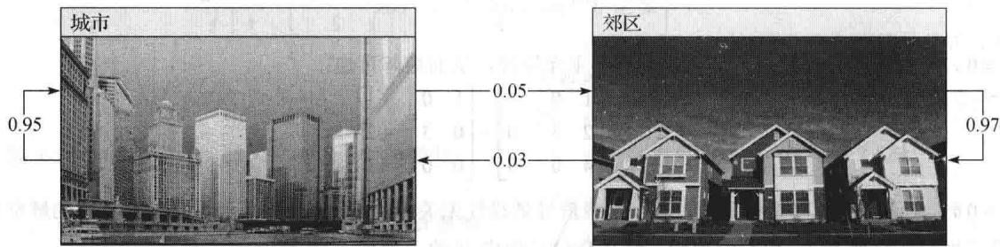
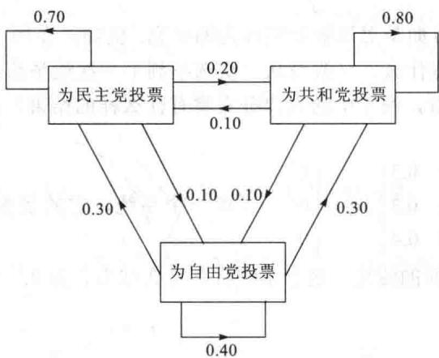
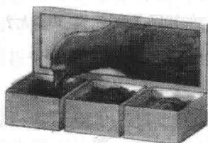

import Guide from '@/components/Guide.astro';
import Knowledge from '@/components/Knowledge.astro';
import Example from '@/components/Example.astro';
import Analysis from '@/components/Analysis.astro';
import Solution from '@/components/Solution.astro';
import Variant from '@/components/Variant.astro';
import Note from '@/components/Note.astro';
import Block from '@/components/Block.astro';
import Method from '@/components/Method.astro';
import Exercise from '@/components/Exercise.astro';

本节中描述的马尔可夫链在许多学科如生物学、商业、化学、工程学及物理学等领域中被用来做数学模型。在每种情形中，该模型习惯上用来描述用同一种方法进行多次的实验或测量，实验中每次测试的结果属于几个指定的可能结果之一，每次测试结果仅依赖于最接近的前一次测试。

例如，若每年要统计一个城市及其郊区的人口，那么像

$$
\boldsymbol {x} _ {0} = \left[ \begin{array}{l} 0. 6 0 \\ 0. 4 0 \end{array} \right]\tag{1}
$$

这样的向量可以显示 $60\%$ 的人口住在城市中， $40\%$ 的人口住在郊区。 $x_0$ 中的小数加起来等于 1 是因为它们说明这个地区的总人口。在此对我们的目的而言，用百分数表示比用人口总数表示更方便。

一个具有非负元素且各元素的数值相加等于 1 的向量称为概率向量。随机矩阵是各列向量均为概率向量的方阵。马尔可夫链是一个概率向量序列 $x_0, x_1, x_2, \cdots$ 和一个随机矩阵 $P$ ，满足

$$
\boldsymbol {x} _ {1} = P \boldsymbol {x} _ {0}, \boldsymbol {x} _ {2} = P \boldsymbol {x} _ {1}, \boldsymbol {x} _ {3} = P \boldsymbol {x} _ {2}, \dots
$$

于是马尔可夫链可用一阶差分方程来刻画：

$$
\boldsymbol {x} _ {k + 1} = P \boldsymbol {x} _ {k}, k = 0, 1, 2, \dots
$$

当向量在 $\mathbb{R}^n$ 中的一个马尔可夫链描述一个系统或实验的序列时， $\pmb{x}_k$ 中的元素分别列出系统在 $n$ 个可能状态中的概率，或实验结果是 $n$ 个可能结果之一的概率。因此， $\pmb{x}_k$ 通常称为状态向量。

<Example title="例 1">
在 1.10 节中，我们研究过一个人口在城市与郊区之间移动的模型，见图 4-34. 在大城市地区的这两个部分之间，每年的移民由移民矩阵 M 控制：

$$
M = \left[ \begin{array}{l l} 0. 9 5 & 0. 0 3 \\ 0. 0 5 & 0. 9 7 \end{array} \right] \text { 城市 } \quad \text { 去 } \quad \text { 郊区 }
$$

即每年有 $5\%$ 的城市人口流动到郊区，有 $3\%$ 的郊区人口流动到城市。 $M$ 的列是概率向量，所以 $M$ 是一个随机矩阵。假设在2014年这个地区的城市人口为600000，郊区人口为400000，则这个地区原来的人口分布由上面（1）中的 $\pmb{x}_0$ 给出。2015年人口的分布是什么？2016年呢？

<figure class="vp-figure">
  
  <figcaption>图 4-34 每年城市与郊区之间移民的百分比</figcaption>
</figure>

<Solution title="解">
在 1.10 节的例 3 中，我们看到 1 年之后，人口向量 $\begin{bmatrix} 600\ 000 \\ 400\ 000 \end{bmatrix}$ 变为

$$
\left[ \begin{array}{l l} 0. 9 5 & 0. 0 3 \\ 0. 0 5 & 0. 9 7 \end{array} \right] \left[ \begin{array}{l l} 6 0 0 & 0 0 0 \\ 4 0 0 & 0 0 0 \end{array} \right] = \left[ \begin{array}{l l} 5 8 2 & 0 0 0 \\ 4 1 8 & 0 0 0 \end{array} \right]
$$

如果用总人口 100 万除以方程两边，再利用事实 $kMx = M(kx)$ ，可得

$$
\left[ \begin{array}{l l} 0. 9 5 & 0. 0 3 \\ 0. 0 5 & 0. 9 7 \end{array} \right] \left[ \begin{array}{l} 0. 6 0 0 \\ 0. 4 0 0 \end{array} \right] = \left[ \begin{array}{l} 0. 5 8 2 \\ 0. 4 1 8 \end{array} \right]
$$

向量 $x_{1}=\begin{bmatrix}0.582\\0.418\end{bmatrix}$ 给出 2015 年的人口分布，即该地区 58.2% 的人口住在城市，41.8% 的人口住在郊区．类似地，2016 年的人口分布由 $x_{2}$ 给出，其中

$$
\boldsymbol {x} _ {2} = M \boldsymbol {x} _ {1} = \left[ \begin{array}{l l} 0. 9 5 & 0. 0 3 \\ 0. 0 5 & 0. 9 7 \end{array} \right] \left[ \begin{array}{l} 0. 5 8 2 \\ 0. 4 1 8 \end{array} \right] = \left[ \begin{array}{l} 0. 5 6 5 \\ 0. 4 3 5 \end{array} \right]
$$
</Solution>
</Example>

<Example title="例 2">
假设在某一固定选区美国国会选举的投票结果用 $\mathbb{R}^3$ 中的向量 $x$ 表示为

$$
\boldsymbol {x} = \left[ \begin{array}{l} \text {民主党得票率} (D) \\ \text {共和党得票率} (R) \\ \text {自由党得票率} (L) \end{array} \right]
$$

假设我们用这种类型的向量每两年记录一次美国国会选举的结果，同时每次选举的结果仅依赖于前一次选举的结果，则刻画每两年选举的向量构成的序列是一个马尔可夫链。对此链，作为一个随机矩阵的例子，取

$$
P = \left[ \begin{array}{l l l} 0. 7 0 & 0. 1 0 & 0. 3 0 \\ 0. 2 0 & 0. 8 0 & 0. 3 0 \\ 0. 1 0 & 0. 1 0 & 0. 4 0 \end{array} \right] \begin{array}{c} D \\ R \\ L \end{array}
$$

标志为“D”的第一列中的数值刻画在一次选举中为民主党投票的人在下一次选举中将如何投票的百分比。这里我们已经假设70%的人在下一次选举中再一次投“D”的票，20%的人将投“R”的票，10%的人将投“L”的票。对P的其他两列有类似的解释，图4-35给出这个矩阵的一个图表。

<figure class="vp-figure">
  
  <figcaption>图 4-35 从一次选举到下一次选举投票的变化情况</figcaption>
</figure>

如果这些“转换”百分比从一次选举到下一次选举多年保持为常数，则那些给出投票结果的向量的序列构成一个马尔可夫链。假设在一次选举中，结果为

$$
\boldsymbol {x} _ {0} = \left[ \begin{array}{l} 0. 5 5 \\ 0. 4 0 \\ 0. 0 5 \end{array} \right]
$$

确定下一次可能的结果和再下一次可能的结果.

<Solution title="解">
下一次选举的结果由状态向量 $x_{1}$ 描述，再下一次选举的结果由 $x_{2}$ 描述，其中

$$
\pmb {x} _ {1} = P \pmb {x} _ {0} = \left[ \begin{array}{l l l} 0. 7 0 & 0. 1 0 & 0. 3 0 \\ 0. 2 0 & 0. 8 0 & 0. 3 0 \\ 0. 1 0 & 0. 1 0 & 0. 4 0 \end{array} \right] \left[ \begin{array}{l} 0. 5 5 \\ 0. 4 0 \\ 0. 0 5 \end{array} \right] = \left[ \begin{array}{l} 0. 4 4 0 \\ 0. 4 4 5 \\ 0. 1 1 5 \end{array} \right] \begin{array}{l} 4 4 \% \text {将投} D \text {的票} \\ 4 4. 5 \% \text {将投} R \text {的票} \\ 1 1. 5 \% \text {将投} L \text {的票} \end{array}
$$

$$
\pmb {x} _ {2} = P \pmb {x} _ {1} = \left[ \begin{array}{l l l} 0. 7 0 & 0. 1 0 & 0. 3 0 \\ 0. 2 0 & 0. 8 0 & 0. 3 0 \\ 0. 1 0 & 0. 1 0 & 0. 4 0 \end{array} \right] \left[ \begin{array}{l} 0. 4 4 0 \\ 0. 4 4 5 \\ 0. 1 1 5 \end{array} \right] = \left[ \begin{array}{l} 0. 3 8 7 0 \\ 0. 4 7 8 5 \\ 0. 1 3 4 5 \end{array} \right] \begin{array}{l} 3 8. 7 \% \text {将投} D \text {的票} \\ 4 7. 8 \% \text {将投} R \text {的票} \\ 1 3. 5 \% \text {将投} L \text {的票} \end{array}
$$

为了搞清楚为什么 $x_{1}$ 事实上给出了下一次选举的结果，假设1000个人在“第一次”选举中投票，550人投 $D$ 的票，400人投 $R$ 的票，50人投 $L$ 的票（见 $x_{0}$ 中的百分比）。在下一次选举中，550人中的 $70\%$ 将再一次投 $D$ 的票，400人中的 $10\%$ 将从 $R$ 转投 $D$ ，50人中的 $30\%$ 将从 $L$ 转投 $D$ ，于是 $D$ 的总得票数为

$$
0. 7 0 (5 5 0) + 0. 1 0 (4 0 0) + 0. 3 0 (5 0) = 3 8 5 + 4 0 + 1 5 = 4 4 0\tag{2}
$$

于是下一次 $D$ 候选人将得 $44\%$ 的选票。（2）中的计算本质上与计算 $\pmb{x}_{1}$ 中第一个元素是相同的，对 $\pmb{x}_{1}$ 中其他元素以及 $\pmb{x}_{2}$ 中的元素等可以作类似的计算.
</Solution>
</Example>

## 预言遥远的未来

马尔可夫链最有趣的方面是对该链长期行为的研究。例如，在例2中经过多次选举以后，关于投票的情况我们能说些什么？（假设从一次选举到下一次选举给定的随机矩阵连续描述转换百分比。）另外，从长远看，例1中的人口分布将有什么样的结果？在回答这些问题之前，我们先讨论一个数值的例子。

<Example title="例 3">
令 $P=\begin{bmatrix}0.5&0.2&0.3\\ 0.3&0.8&0.3\\ 0.2&0&0.4\end{bmatrix},x_{0}=\begin{bmatrix}1\\ 0\\ 0\end{bmatrix}$ ，考虑一个系统，它的状态由马尔可夫链 $x_{k+1}=Px_{k}$ $(k=0,1,\cdots)$ 描述．随着时间的流逝，这个系统将有什么结果？为此，计算状态向量 $x_{1},\cdots,x_{15}$ 来寻找结果.

<Solution title="解">
$$
\boldsymbol {x} _ {1} = P \boldsymbol {x} _ {0} = \left[ \begin{array}{l l l} 0. 5 & 0. 2 & 0. 3 \\ 0. 3 & 0. 8 & 0. 3 \\ 0. 2 & 0 & 0. 4 \end{array} \right] \left[ \begin{array}{l} 1 \\ 0 \\ 0 \end{array} \right] = \left[ \begin{array}{l} 0. 5 \\ 0. 3 \\ 0. 2 \end{array} \right]
$$

$$
\boldsymbol {x} _ {2} = P \boldsymbol {x} _ {1} = \left[ \begin{array}{l l l} 0. 5 & 0. 2 & 0. 3 \\ 0. 3 & 0. 8 & 0. 3 \\ 0. 2 & 0 & 0. 4 \end{array} \right] \left[ \begin{array}{l} 0. 5 \\ 0. 3 \\ 0. 2 \end{array} \right] = \left[ \begin{array}{l} 0. 3 7 \\ 0. 4 5 \\ 0. 1 8 \end{array} \right]
$$

$$
\boldsymbol {x} _ {3} = P \boldsymbol {x} _ {2} = \left[ \begin{array}{l l l} 0. 5 & 0. 2 & 0. 3 \\ 0. 3 & 0. 8 & 0. 3 \\ 0. 2 & 0 & 0. 4 \end{array} \right] \left[ \begin{array}{l} 0. 3 7 \\ 0. 4 5 \\ 0. 1 8 \end{array} \right] = \left[ \begin{array}{l} 0. 3 2 9 \\ 0. 5 2 5 \\ 0. 1 4 6 \end{array} \right]
$$

后续计算的结果如下所示，向量中的元素保留4位或5位有效数字.

$$
\boldsymbol {x} _ {4} = \left[ \begin{array}{l l l} 0. 3 1 3 & 3 \\ 0. 5 6 2 & 5 \\ 0. 1 2 4 & 2 \end{array} \right], \boldsymbol {x} _ {5} = \left[ \begin{array}{l l l} 0. 3 0 6 & 4 \\ 0. 5 8 1 & 3 \\ 0. 1 1 2 & 3 \end{array} \right], \boldsymbol {x} _ {6} = \left[ \begin{array}{l l l} 0. 3 0 3 & 2 \\ 0. 5 9 0 & 6 \\ 0. 1 0 6 & 2 \end{array} \right], \boldsymbol {x} _ {7} = \left[ \begin{array}{l l l} 0. 3 0 1 & 6 \\ 0. 5 9 5 & 3 \\ 0. 1 0 3 & 1 \end{array} \right]
$$

$$
\boldsymbol {x} _ {8} = \left[ \begin{array}{l l l} 0. 3 0 0 & 8 \\ 0. 5 9 7 & 7 \\ 0. 1 0 1 & 6 \end{array} \right], \boldsymbol {x} _ {9} = \left[ \begin{array}{l l l} 0. 3 0 0 & 4 \\ 0. 5 9 8 & 8 \\ 0. 1 0 0 & 8 \end{array} \right], \boldsymbol {x} _ {1 0} = \left[ \begin{array}{l l l} 0. 3 0 0 & 2 \\ 0. 5 9 9 & 4 \\ 0. 1 0 0 & 4 \end{array} \right], \boldsymbol {x} _ {1 1} = \left[ \begin{array}{l l l} 0. 3 0 0 & 1 \\ 0. 5 9 9 & 7 \\ 0. 1 0 0 & 2 \end{array} \right]
$$

$$
\boldsymbol {x} _ {1 2} = \left[ \begin{array}{l l l} 0. 3 0 0 & 0 5 \\ 0. 5 9 9 & 8 5 \\ 0. 1 0 0 & 1 0 \end{array} \right], \boldsymbol {x} _ {1 3} = \left[ \begin{array}{l l l} 0. 3 0 0 & 0 2 \\ 0. 5 9 9 & 9 3 \\ 0. 1 0 0 & 0 5 \end{array} \right], \boldsymbol {x} _ {1 4} = \left[ \begin{array}{l l l} 0. 3 0 0 & 0 1 \\ 0. 5 9 9 & 9 6 \\ 0. 1 0 0 & 0 2 \end{array} \right], \boldsymbol {x} _ {1 5} = \left[ \begin{array}{l l l} 0. 3 0 0 & 0 1 \\ 0. 5 9 9 & 9 8 \\ 0. 1 0 0 & 0 1 \end{array} \right]
$$

这些向量似乎是逼近 $q=\begin{bmatrix}0.3\\ 0.6\\ 0.1\end{bmatrix}$ 的．这些概率由 k 的一个值到下一个值几乎不改变．注意到下列计算是精确的（没有舍入误差）：

$$
P \boldsymbol {q} = \left[ \begin{array}{l l l} 0. 5 & 0. 2 & 0. 3 \\ 0. 3 & 0. 8 & 0. 3 \\ 0. 2 & 0 & 0. 4 \end{array} \right] \left[ \begin{array}{l} 0. 3 \\ 0. 6 \\ 0. 1 \end{array} \right] = \left[ \begin{array}{l} 0. 1 5 + 0. 1 2 + 0. 0 3 \\ 0. 0 9 + 0. 4 8 + 0. 0 3 \\ 0. 0 6 + 0 + 0. 0 4 \end{array} \right] = \left[ \begin{array}{l} 0. 3 0 \\ 0. 6 0 \\ 0. 1 0 \end{array} \right] = \boldsymbol {q}
$$

若系统处于状态 q，则从一次测量到下一次测量，系统没有变化.

稳态向量

若 $P$ 是一个随机矩阵，则相对于 $P$ 的稳态向量（或平衡向量）是一个满足

$$
P \boldsymbol {q} = \boldsymbol {q}
$$

的概率向量 q. 可以证明每一个随机矩阵有一个稳态向量. 上面的例 3 中, q 是 P 的一个稳态向量.
</Solution>
</Example>

<Example title="例 4">
在例1中，概率向量 $\pmb{q} = \begin{bmatrix} 0.375 \\ 0.625 \end{bmatrix}$ 是人口迁移矩阵 $M$ 的一个稳态向量，这是因为 $M\pmb{q} = \begin{bmatrix} 0.95 & 0.03 \\ 0.05 & 0.97 \end{bmatrix} \cdot \begin{bmatrix} 0.375 \\ 0.625 \end{bmatrix} = \begin{bmatrix} 0.35625 + 0.01875 \\ 0.01875 + 0.60625 \end{bmatrix} = \begin{bmatrix} 0.375 \\ 0.625 \end{bmatrix} = \pmb{q}$

在例 1 中，若大城市地区的总人口是 100 万，则由例 4，q 将对应有 375 000 人在城市，有 625 000 人在郊区。在一年的年底，从城市迁出的人口是 $(0.05)(375\ 000)=18\ 750$ ，从郊区迁进城市的人口是 $(0.03)(625\ 000)=18\ 750$ 。结果是，城市里的人口保持不变。类似地，郊区里的人口也是稳定的。

下一个例子说明如何求稳态向量.
</Example>

<Example title="例 5">
令 $P = \begin{bmatrix} 0.6 & 0.3 \\ 0.4 & 0.7 \end{bmatrix}$ ，求 $P$ 的稳态向量.

<Solution title="解">
首先，解方程 $Px = x$

$$
\begin{array}{l} {P \pmb {x} - \pmb {x} = \pmb {0}} \\ {P \pmb {x} - I \pmb {x} = \pmb {0} \quad \text {回顾1.4节有} I \pmb {x} = \pmb {x}} \\ {(P - I) \pmb {x} = \pmb {0}} \end{array}
$$

对上面的 P,

$$
P - I = \left[ \begin{array}{l l} 0. 6 & 0. 3 \\ 0. 4 & 0. 7 \end{array} \right] - \left[ \begin{array}{l l} 1 & 0 \\ 0 & 1 \end{array} \right] = \left[ \begin{array}{c c} - 0. 4 & 0. 3 \\ 0. 4 & - 0. 3 \end{array} \right]
$$

为求 $(P - I)x = 0$ 的所有解，将增广矩阵作行化简：

$$
\left[ \begin{array}{c c c} - 0. 4 & 0. 3 & 0 \\ 0. 4 & - 0. 3 & 0 \end{array} \right] \sim \left[ \begin{array}{c c c} - 0. 4 & 0. 3 & 0 \\ 0 & 0 & 0 \end{array} \right] \sim \left[ \begin{array}{c c c} 1 & - 3 / 4 & 0 \\ 0 & 0 & 0 \end{array} \right]
$$

于是 $x_{1}=\frac{3}{4}x_{2}, x_{2}$ 为自由变量，通解为 $x_{2}\begin{bmatrix}3/4\\ 1\end{bmatrix}$ .

其次，对此解空间选一个简单的基。一个显然的选择是 $\begin{bmatrix} 3 / 4 \\ 1 \end{bmatrix}$ ，但一个更好的没有分数的选择是 $w = \begin{bmatrix} 3 \\ 4 \end{bmatrix}$ （对应于 $x_{2} = 4$ ）。

最后，在 $Px = x$ 的全体解的集合中求一个概率向量。这是简单的，因为每个解均为上面 $w$ 的一个倍数。将 $\pmb{w}$ 除以其元素之和得

$$
\boldsymbol {q} = \left[ \begin{array}{l} 3 / 7 \\ 4 / 7 \end{array} \right]
$$

检验之，计算

$$
P \boldsymbol {q} = \left[ \begin{array}{l l} 6 / 1 0 & 3 / 1 0 \\ 4 / 1 0 & 7 / 1 0 \end{array} \right] \left[ \begin{array}{l} 3 / 7 \\ 4 / 7 \end{array} \right] = \left[ \begin{array}{l} 1 8 / 7 0 + 1 2 / 7 0 \\ 1 2 / 7 0 + 2 8 / 7 0 \end{array} \right] = \left[ \begin{array}{l} 3 0 / 7 0 \\ 4 0 / 7 0 \end{array} \right] = \boldsymbol {q}
$$

下一个定理将证明，例3中产生的结果是许多随机矩阵的一个典型代表。我们说一个随机矩阵是正则的，如果矩阵的某次幂 $P^k$ 仅包含严格正的元素。对例3中的 $P$ ，有

$$
P ^ {2} = \left[ \begin{array}{l l l} 0. 3 7 & 0. 2 6 & 0. 3 3 \\ 0. 4 5 & 0. 7 0 & 0. 4 5 \\ 0. 1 8 & 0. 0 4 & 0. 2 2 \end{array} \right]
$$

由于 $P^{2}$ 中每个元素是严格正的，故 P 是一个正则随机矩阵.

另外，我们说一个向量序列 $\{x_{k}: k=1,2,\cdots\}$ 当 $k \to \infty$ 时收敛到一个向量 q，如果当 k 充分大时， $x_{k}$ 中的元素无限接近 q 中对应的元素.
</Solution>
</Example>

<Knowledge title="定理 18">
若 P 是一个 $n \times n$ 的正则随机矩阵，则 P 具有唯一的稳态向量 q。进一步，若 $x_{0}$ 是任一个初始状态，且 $x_{k+1} = P x_{k}, k = 0, 1, 2, \cdots$ ，则当 $k \to \infty$ 时，马尔可夫链 $\{x_{k}\}$ 收敛到 q。

这个定理的证明可在有关马尔可夫链的标准教科书中找到。这个定理的奇妙之处在于初始状态对马尔可夫链的长期行为没有影响。稍后（在5.2节）你将看到为什么这种情况对这里研究的多个随机矩阵是真实的。
</Knowledge>

<Example title="例 6">
在例2中，假设选举结果构成一个马尔可夫链。问从现在开始经过多年若干次的选举之后，投票者可能为共和党候选人投票的百分比是多少？

<Solution title="解">
若用手工计算，错误方法是选某初始向量 $x_{0}$ ，再对充分大的 k 计算 $x_{1}, \cdots, x_{k}$ 。这样没办法知道要计算多少向量，并且你不能把握 $x_{k}$ 中元素的极限值。

正确方法是先计算稳态向量，再借助定理18.给定例2中的矩阵 $P$ ，通过对角线上每个元素减去1得到 $P - I$ ，再将增广矩阵进行行化简：

$$
[ (P - I) \quad \mathbf {0} ] = \left[ \begin{array}{c c c c} - 0. 3 & 0. 1 & 0. 3 & 0 \\ 0. 2 & - 0. 2 & 0. 3 & 0 \\ 0. 1 & 0. 1 & - 0. 6 & 0 \end{array} \right]
$$

回顾前面的工作，通过每一行乘以10，可以使运算简化.

$$
\left[ \begin{array}{r r r r} - 3 & 1 & 3 & 0 \\ 2 & - 2 & 3 & 0 \\ 1 & 1 & - 6 & 0 \end{array} \right] \sim \left[ \begin{array}{r r r r} 1 & 0 & - 9 / 4 & 0 \\ 0 & 1 & - 1 5 / 4 & 0 \\ 0 & 0 & 0 & 0 \end{array} \right]
$$

$(P - I)x = 0$ 的通解为 $x_{1} = \frac{9}{4} x_{3}, x_{2} = \frac{15}{4} x_{3}, x_{3}$ 是自由变量. 选 $x_{3} = 4$ ，得到解空间的一组基，它的每个元素是整数，由此容易求得隐态向量，它的元素之和为1：

$$
\boldsymbol {w} = \left[ \begin{array}{l} 9 \\ 1 5 \\ 4 \end{array} \right], \boldsymbol {q} = \left[ \begin{array}{l} 9 / 2 8 \\ 1 5 / 2 8 \\ 4 / 2 8 \end{array} \right] \approx \left[ \begin{array}{l} 0. 3 2 \\ 0. 5 4 \\ 0. 1 4 \end{array} \right]
$$

$q$ 中的元素刻画由现在开始多年之后进行的一次选举中得票数的分布（假设这个随机矩阵连续描述从一次选举到下一次选举的变化情况）．这样，最终大约 $54\%$ 的选票被共和党候选人得到.

数值计算的注解 你可能已注意到若 $x_{k+1}=Px_{k}, k=0,1,2,\cdots$ ，则

$$
\boldsymbol {x} _ {2} = P \boldsymbol {x} _ {1} = P (P \boldsymbol {x} _ {0}) = P ^ {2} \boldsymbol {x} _ {0}
$$

一般地，

$$
\boldsymbol {x} _ {k} = P ^ {k} \boldsymbol {x} _ {0}, k = 0, 1, 2, \dots
$$

为了计算一个向量，比如 $x_{3}$ ，将 $x_{1}, x_{2}$ 先算出来再计算 $x_{3}$ 也只需要很少的算术运算，而先计算 $P^{3}$ 和 $P^{3}x_{0}$ 则不然。然而，若 $P$ 很小——比如是 $30 \times 30$ 的矩阵，则对这两种方法，机器计算 $x_{3}$ 的时间没有什么区别，计算 $P^{3}x_{0}$ 的指令可以作为首选，因为它需要较少的键击次数。
</Solution>
</Example>

<Block title="练习题">
1. 假设一个城市地区的居民按照例 1 中移民矩阵的概率进行迁移，且某个居民“随机”选择去向。则一确定年度的状态向量可以理解为给出了当时这个人是城市居民还是郊区居民的概率。

a. 假设现在这个人是城市居民，从而 $x_{0}=\begin{bmatrix}1\\ 0\end{bmatrix}$ ，这个人下一年住在郊区的可能性有多大？

b. 这个人两年后住在郊区的可能性有多大？

2. 令 $P = \begin{bmatrix} 0.6 & 0.2 \\ 0.4 & 0.8 \end{bmatrix}$ , $\pmb{q} = \begin{bmatrix} 0.3 \\ 0.7 \end{bmatrix}$ , 向量 $\pmb{q}$ 是否为 $P$ 的稳态向量?

3. 例 1 中多年之后住在郊区的人口的百分比是多少？
</Block>

<Block title="习题4.9">
1. 一个偏僻的小村子从两个广播站接收无线电广播，其中一个是新闻广播站，另一个是音乐广播站。在广播站每半小时一次的休息后，接收新闻广播的听众中，有 $70\%$ 的人还将保持收听新闻，有 $30\%$ 的人在广播站休息时换成接收音乐广播。接收音乐广播的听众中，当广播站休息时，有 $60\%$ 的人将换成收听新闻广播，有 $40\%$ 的人还将保持听音乐。假设在上午8：15每个人都正在收听新闻。
a. 给出描述无线电听众在每个广播站休息时趋向变换广播站的随机矩阵，将行、列做标记。
b. 给出初始状态向量。
c. 听众在上午9：25收听音乐广播的百分率是多少？（在上午8：30和9：00广播站休息之后。）

2. 一个实验室的动物每天可以吃三种食物中的任一种。实验室记录表明，在一次测试中，如果这个动物选择一种食物，则在下一次测试中它选择同样食物的概率是 $50\%$ ，下一次测试中它选择其他两种食物的概率均为 $25\%$ 。  
a. 对此情形，随机矩阵是怎样的？  
b. 若这个动物在一次初始测试中选1号食物，在初始测试后的第二次测试中，它选2号食物的概率是多少？

3. 在任意给定的一天，一个学生要么健康，要么生病. 在所有今天健康的学生中, 有 $95\%$ 的人明天仍然健康, 在所有今天在生病的学生中, 有 $55\%$ 的人明天仍然生病.  
a. 对此情形, 随机矩阵是什么?  
b. 假设在星期一有 $20\%$ 的学生是生病的, 在星期二, 学生中可能生病人数的百分比是多少? 星期三呢?  
c. 如果一个学生今天是健康的, 问该学生从现在开始两天后仍然健康的概率是多大?

4. 对任意给定的一天，哥伦布地区的天气要么是好，要么是中等，要么是差。若今天天气好，则明天的天气有 $60\%$ 的可能是好的，有 $30\%$ 的可能是中等的，有 $10\%$ 的可能是差的。若今天的天气是中等的，则明天的天气有 $40\%$ 的可能是好的，有 $30\%$ 的可能是中等的。最后，若今天天气差，则明天的天气有 $40\%$ 的可能是好的，有 $50\%$ 的可能是中等的。
a. 对此情形，随机矩阵是怎样的？
b. 假设今天是好天气的可能性为 $50\%$ ，是中等天气的可能性为 $50\%$ ，明天是差天气的可能性是多少？
c. 假设对星期一的天气预报是 $40\%$ 为中等天气， $60\%$ 为差天气，在星期三是好天气的可能性是多少？
在习题 5\~8 中，求稳态向量。

5. $\begin{bmatrix} 0.1 & 0.6 \\ 0.9 & 0.4 \end{bmatrix}$ 6. $\begin{bmatrix} 0.8 & 0.5 \\ 0.2 & 0.5 \end{bmatrix}$ 7. $\begin{bmatrix} 0.7 & 0.1 & 0.1 \\ 0.2 & 0.8 & 0.2 \\ 0.1 & 0.1 & 0.7 \end{bmatrix}$ 8. $\begin{bmatrix} 0.7 & 0.2 & 0.2 \\ 0 & 0.2 & 0.4 \\ 0.3 & 0.6 & 0.4 \end{bmatrix}$

9. 确定 $P = \begin{bmatrix} 0.2 & 1 \\ 0.8 & 0 \end{bmatrix}$ 是否是一个正则的随机矩阵？

10. 确定 $P = \begin{bmatrix} 1 & 0.2 \\ 0 & 0.8 \end{bmatrix}$ 是否是一个正则的随机矩阵？

11. a. 对习题 1 中的马尔可夫链，求其稳态向量.
b. 经过很长时间之后，听众中收听新闻的比例是多少？

12. 参考习题 2，多次测试后，这个动物更喜欢哪一种食物？

13. a. 对习题 3 中的马尔可夫链，求其稳态向量.
b. 对某个确定的人，经过许多天之后，生病的概率是多少？若今天这个人正在生病，对这个结果有影响吗？

14. 参考习题 4，从长远看，对任给的一天，哥伦布地区的天气是好天气的可能性有多大？

15. [M]加州财政部的人口研究部门为下列移民矩阵提供了数据, 这个矩阵刻画了2012年间美国人口的流动情况. 在2012年, 大约总人口的12.5%居住在加州. 如果给出的移民概率多年保持不变, 问总人口中最终居住在加州的百分比是多少?

由 加州 美国其他地区 到 $\begin{bmatrix}0.9871 & 0.0027 \\ 0.0129 & 0.9973\end{bmatrix}$ 加州
美国其他地区

16. [M] 在底特律，Hertz 出租车公司大约有 2000 辆小汽车，租出和返回位置的模式由下表中分数给出。在一天中，由市中心位置大约有多少辆小汽车将被租出或准备租出？
汽车租出：

<table><tr><td>由 City机场</td><td>市中心</td><td>Metro机场</td><td>回到</td></tr><tr><td rowspan="3" colspan="3"> $\begin{bmatrix}0.90 & 0.01 & 0.09 \\ 0.01 & 0.90 & 0.01 \\ 0.09 & 0.09 & 0.90\end{bmatrix}$ </td><td>City机场</td></tr><tr><td>市中心</td></tr><tr><td>Metro机场</td></tr></table>

17. 令 $P$ 是一个 $n \times n$ 随机矩阵，下列论证表明方程 $Px = x$ 有一个非平凡解。（事实上，存在一个具有非负元素的稳态解，其证明在一些高等教材中给出。）证明下列每个论断。（注意适当时候用一个定理。）a. 若 $P - I$ 的其余行均加到最下一行，则结果

为零行.  
b. $P - I$ 的行线性相关.  
c. $P - I$ 的行空间的维数小于 $n$ .  
d. $P - I$ 有一个非平凡的零空间.

18. 证明: 每一个 $2 \times 2$ 随机矩阵至少有一个稳态向量. 任意这样的矩阵均能写成形如 $P = \begin{bmatrix} 1 - \alpha & \beta \\ \alpha & 1 - \beta \end{bmatrix}$ 的形式, 其中 $\alpha$ 与 $\beta$ 是 0 到 1 之间的常数. (若 $\alpha = \beta = 0$ , 则存在两个线性无关的稳态向量, 否则只有一个稳态向量.)

19. 令 S 是一个 $1 \times n$ 行矩阵，每列中只有一个 1. $S=\left[1\ 1\ \cdots1\right]$ a. 解释为什么 $R^{n}$ 中的向量 x 是概率向量当且仅当它的元素非负且 Sx=1。（像 Sx 这样的 $1 \times 1$ 矩阵通常不写矩阵括号符号。）
b. 令 P 是一个 $n \times n$ 随机矩阵，解释为什么 SP = S.
c. 令 P 是一个 $n \times n$ 随机矩阵，x 是一个概率向量，证明：Px 也是一个概率向量.

20. 利用习题 19 证明: 若 P 是一个 $n \times n$ 随机矩阵, 则 $P^{2}$ 也是.

21. [M] 检验正则随机矩阵的幂.
a. 计算 $P^{k}, k=2,3,4,5$ ,

$$
P = \left[ \begin{array}{l l l l} 0. 3 3 5 5 & 0. 3 6 8 2 & 0. 3 0 6 7 & 0. 0 3 8 9 \\ 0. 2 6 6 3 & 0. 2 7 2 3 & 0. 3 2 7 7 & 0. 5 4 5 1 \\ 0. 1 9 3 5 & 0. 1 5 0 2 & 0. 1 5 8 9 & 0. 2 3 9 5 \\ 0. 2 0 4 7 & 0. 2 0 9 3 & 0. 2 0 6 7 & 0. 1 7 6 5 \end{array} \right]
$$

计算结果保留 4 位小数. 当 k 增加时, $P^{k}$ 的列将有什么结果? 计算 P 的稳态向量.
b. 计算 $Q^{k}, k=10,20,\cdots,80$ ,

$$
Q = \left[ \begin{array}{l l l} 0. 9 7 & 0. 0 5 & 0. 1 0 \\ 0 & 0. 9 0 & 0. 0 5 \\ 0. 0 3 & 0. 0 5 & 0. 8 5 \end{array} \right]
$$

（使 $Q^{k}$ 的稳定性达到 4 位小数可能需要 k=116 或更大。）计算 Q 的稳态向量。对任意正则的随机矩阵，猜想什么结果可能是正确的。
c. 利用定理 18 解释在（a）和（b）中你所发

现的结果.

22. [M]对比求正则随机矩阵 P 的稳态向量 q 的两种方法：

（1）像例5中那样计算 $\pmb{q}$

（2）对某较大的数 k，计算 $P^{k}$ ，再利用 $P^{k}$ 的一列当作 q 的近似.

（学习指导中描述了一个程序 nulbasis，它几乎使方法（1）自动化.）

利用 k=100 或更大的数，在你的矩阵程序允许的范围内，对一个随意给定的最大的随机矩阵做实验。对每一种方法，给出你开始按键和运行程序所需要的时间。（MATLAB 的某些版本可用命令 flops 和 tic…toc 来记录浮点运算的次数和使用 MATLAB 计算总的消耗时间。）对比每个方法的优势并说出你倾向于使用哪一种方法。
</Block>

<Block title="练习题答案">
1. a. 因为在一年之内有 $5\%$ 的城市居民将迁移到郊区，故每个人有 $5\%$ 的这样的选择的可能性。关于这个人没有更进一步的说明，所以我们说这个人去郊区的可能性是 $5\%$ 。这个事实蕴涵在状态向量 $\pmb{x}_{1}$ 的第二个元素中，其中

$$
\boldsymbol {x} _ {1} = M \boldsymbol {x} _ {0} = \left[ \begin{array}{l l} 0. 9 5 & 0. 0 3 \\ 0. 0 5 & 0. 9 7 \end{array} \right] \left[ \begin{array}{l} 1 \\ 0 \end{array} \right] = \left[ \begin{array}{l} 0. 9 5 \\ 0. 0 5 \end{array} \right]
$$

b. 两年之后这个人住在郊区的可能性是 $9.6\%$ ，这是因为

$$
\boldsymbol {x} _ {2} = M \boldsymbol {x} _ {1} = \left[ \begin{array}{l l} 0. 9 5 & 0. 0 3 \\ 0. 0 5 & 0. 9 7 \end{array} \right] \left[ \begin{array}{l} 0. 9 5 \\ 0. 0 5 \end{array} \right] = \left[ \begin{array}{l} 0. 9 0 4 \\ 0. 0 9 6 \end{array} \right]
$$

2. 稳态向量满足 $Px = x$ ，因为

$$
P \pmb {q} = \left[ \begin{array}{l l} 0. 6 & 0. 2 \\ 0. 4 & 0. 8 \end{array} \right] \left[ \begin{array}{l} 0. 3 \\ 0. 7 \end{array} \right] = \left[ \begin{array}{l} 0. 3 2 \\ 0. 6 8 \end{array} \right] \neq \pmb {q}
$$

所以我们断定 q 不是 P 的稳态向量.

3. 例1中的 $M$ 是一个正则的随机矩阵，这是因为它的元素全是严格正的。所以可以使用定理18。由例4我们已经知道其稳态向量，所以人口分布向量 $\pmb{x}_k$ 趋向

$$
\boldsymbol {q} = \left[ \begin{array}{l} 0. 3 7 5 \\ 0. 6 2 5 \end{array} \right]
$$

最终有 62.5% 的人口将住在郊区.
</Block>
