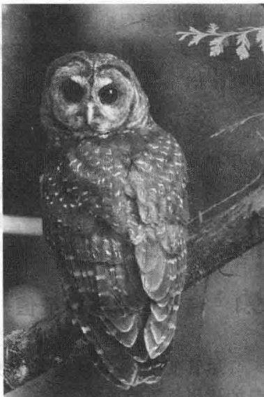

import Knowledge from '@/components/Knowledge.astro';
import Example from '@/components/Example.astro';
import Note from '@/components/Note.astro';
import Solution from '@/components/Solution.astro';
import Block from '@/components/Block.astro';

1990年，在利用或滥用太平洋西北部大面积森林问题上，北方的斑点猫头鹰成为一个争论的焦点。环境保护学家试图说服联邦政府，如果采伐原始森林（长有200年以上的树木）的行为得不到制止，猫头鹰将濒临灭绝，因为猫头鹰喜好在那里居住。而木材行业却争辩说猫头鹰不应被划为“濒临灭绝动物”，并引用一些已发表的科学报告来支持其论点。对木材行业来说，如果政府出台新的伐木限制，预计将失去30000至100000个工作岗位。

数学生态学家处于争论双方的中间，由于争论的双方都想游说数学生态学家，数学生态学家加快了他们对斑点猫头鹰种群的动力学研究。猫头鹰的生命周期自然分为三个阶段：幼年期（1岁以前）、半成年期（1\~2岁）、成年期（2岁以后）。猫头鹰在半成年和成年期交配，开始生育繁殖，可活到20岁左右。每一对猫头鹰需要约1000公顷（4平方英里）的土地作为自己的栖息地。生命周期的关键期是当幼年猫头鹰离开巢的时候。为生存和进入半成年期，一只幼年猫头鹰必须成功地找到一个新的栖息地安家（通常还带有一个配偶）。

研究种群动力学的第1步是建立以每年的种群量为区间的种群模型，时间为 $k=0,1,2,\cdots$ .通常可以假设在每一个生命阶段雄性和雌性的比例为1:1，而且只计算雌性猫头鹰，第k年的种群量可以用向量 $x_{k}=(j_{k},s_{k},a_{k})$ 表示，其中 $j_{k},s_{k}$ 和 $a_{k}$ 分别代表雌性猫头鹰在幼年期、半成年期和成年期的数量.

利用人口统计研究的实际现场数据，R. Lamberson 及其同事设计了下面的“阶段矩阵模型”(stage-matrix model) ② :

$$

\left[ \begin{array}{l} j _ {k + 1} \\ s _ {k + 1} \\ a _ {k + 1} \end{array} \right] = \left[ \begin{array}{l l l} 0 & 0 & 0. 3 3 \\ 0. 1 8 & 0 & 0 \\ 0 & 0. 7 1 & 0. 9 4 \end{array} \right] \left[ \begin{array}{l} j _ {k} \\ s _ {k} \\ a _ {k} \end{array} \right]

$$

在这里新的幼年雌性猫头鹰在 $k + 1$ 年中的数量是成年雌性猫头鹰在 $k$ 年里数量的0.33倍（根据每一对猫头鹰的平均生殖率而定）。此外， $18\%$ 的幼年雌性猫头鹰得以生存进入半成年期， $71\%$ 的半成年雌性猫头鹰和 94% 的成年雌性猫头鹰生存下来被计为成年猫头鹰.

阶段矩阵模型是形式为 $x_{k+1}=Ax_{k}$ 的差分方程，这种方程被称为动力系统（或离散线性动力系统），因为它描述的是系统随时间推移的变化.

Lamberson 阶段矩阵中，18%的幼年猫头鹰生存率是受原始森林中猫头鹰数目影响最大的项目。事实上，60%的幼年猫头鹰通常生存下来后就会离开自己的巢，但是在 Lamberson 和他的同事们作研究的加州 Willow Creek 地区，只有 30% 的幼年猫鹰在弃巢后能找到新的栖息地，其他的在寻找新家园过程中失踪了。

猫头鹰不能找到新栖息地的一个重要原因是对原始森林分散区域的砍伐加剧了原始森林的分割。当猫头鹰离开森林保护区并穿过一块滥伐地时，被捕食动物袭击的危险大增。5.6节将会展示前面讨论的模型如何预测斑点猫头鹰的最终灭绝，但如果 $50\%$ 的幼年猫头鹰弃巢后能找到新的栖息地，猫头鹰种群将会兴旺起来。

本章的目的是剖析线性变换 $x \mapsto Ax$ 的作用，把它分解为容易理解的元素。除了 5.4 节，整章中出现的矩阵都是方阵。虽然这里讨论的主要应用是离散动力系统（包括上面的斑点猫头鹰），但有关特征值和特征向量的基本概念对纯数学和应用数学都很有用，它们出现的背景要比我们这里考虑的要广泛得多。同样，特征值还被用来研究微分方程和连续动力系统，为工程设计提供关键知识，自然地，也出现在物理和化学等领域里。
