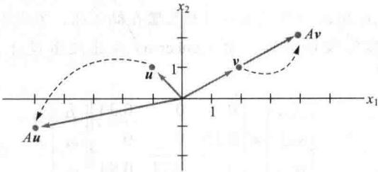
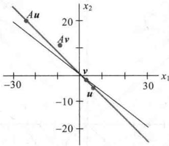
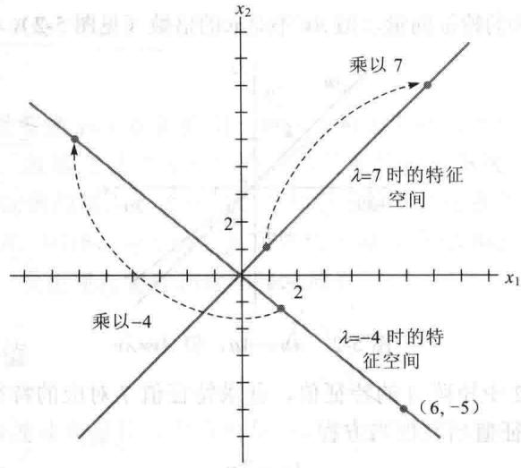
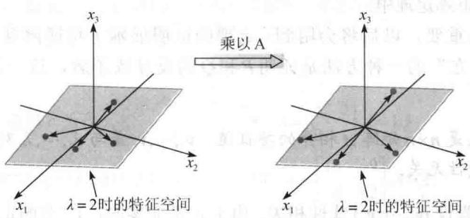
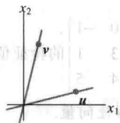

import Knowledge from '@/components/Knowledge.astro';
import Example from '@/components/Example.astro';
import Note from '@/components/Note.astro';
import Solution from '@/components/Solution.astro';
import Block from '@/components/Block.astro';

尽管变换 $x \mapsto Ax$ 有可能使向量往各个方向移动，但通常会有某些特殊向量， $A$ 对这些向量的作用是很简单的.

<Example title="例 1">
设 $A=\begin{bmatrix}3 & -2 \\ 1 & 0\end{bmatrix}, u=\begin{bmatrix}-1 \\ 1\end{bmatrix}, v=\begin{bmatrix}2 \\ 1\end{bmatrix}$ . 图 5-1 显示 u 和 v 乘以 A 后的图像. 事实上, Av 正好是 2v, 因此, A 仅仅是“拉伸了”v.

  

图5-1 乘以 $A$ 的作用

作为另一个例子，4.9节的读者应该能回忆起，假如 $A$ 是随机矩阵，那么 $A$ 的稳态向量 $\pmb{q}$ 满足方程 $Ax = x$ ，即 $A\pmb {q} = 1\cdot \pmb{q}$ ：

这一节，我们将研究形如 $Ax = 2x$ 或 $Ax = -4x$ 的方程，并且去寻找那些被 $A$ 变换成自身一个数量倍的向量.

定义 A 为 $n \times n$ 矩阵，x 为非零向量，若存在数 $\lambda$ 使 $Ax = \lambda x$ 有非平凡解 x，则称 $\lambda$ 为 A 的特征值，x 称为对应于 $\lambda$ 的特征向量.

容易验证给定的向量是否是矩阵的特征向量，也容易判断给出的数是否是特征值.
</Example>

<Example title="例 2">
设 $A = \begin{bmatrix} 1 & 6 \\ 5 & 2 \end{bmatrix}$ , $\pmb{u} = \begin{bmatrix} 6 \\ -5 \end{bmatrix}$ 和 $\pmb{v} = \begin{bmatrix} 3 \\ -2 \end{bmatrix}$ , $\pmb{u}$ 和 $\pmb{v}$ 是否是 $A$ 的特征向量？

<Solution title="解">
$$

A \boldsymbol {u} = \left[ \begin{array}{l l} 1 & 6 \\ 5 & 2 \end{array} \right] \left[ \begin{array}{l} 6 \\ - 5 \end{array} \right] = \left[ \begin{array}{l} - 2 4 \\ 2 0 \end{array} \right] = - 4 \left[ \begin{array}{l} 6 \\ - 5 \end{array} \right] = - 4 \boldsymbol {u}

$$

$$

A \boldsymbol {v} = \left[ \begin{array}{l l} 1 & 6 \\ 5 & 2 \end{array} \right] \left[ \begin{array}{c} 3 \\ - 2 \end{array} \right] = \left[ \begin{array}{c} - 9 \\ 1 1 \end{array} \right] \neq \lambda \left[ \begin{array}{c} 3 \\ - 2 \end{array} \right]

$$

因此，u 是特征值-4 对应的特征向量，但 Av 不是 v 的倍数（见图 5-2），故 v 不是 A 的特征向量.

  

图5-2 $Au = -4u$ ，但 $Av\neq \lambda v$
</Solution>
</Example>

<Example title="例 3">
证明 7 是例 2 中矩阵 A 的特征值，并求特征值 7 对应的特征向量.

<Solution title="解">
数 7 是 A 的特征值当且仅当方程

$$

A \boldsymbol {x} = 7 \boldsymbol {x}\tag{1}

$$

有非平凡解，（1）等价于 $Ax - 7x = 0$ ，或

$$

(A - 7 I) \boldsymbol {x} = \boldsymbol {0}\tag{2}

$$

为解该齐次方程，计算

$$

A - 7 I = \left[ \begin{array}{l l} 1 & 6 \\ 5 & 2 \end{array} \right] - \left[ \begin{array}{l l} 7 & 0 \\ 0 & 7 \end{array} \right] = \left[ \begin{array}{c c} - 6 & 6 \\ 5 & - 5 \end{array} \right]

$$

A-7I 的列显然是线性相关的，故（2）有非平凡解，因此 7 是 A 的特征值。为求其对应的特征向量，用行变换化简矩阵：

$$

\left[ \begin{array}{c c c} - 6 & 6 & 0 \\ 5 & - 5 & 0 \end{array} \right] \sim \left[ \begin{array}{c c c} 1 & - 1 & 0 \\ 0 & 0 & 0 \end{array} \right]

$$

故通解为 $x_{2}\left[ \begin{array}{l}1\\ 1 \end{array} \right]$ .凡是具有此种形式且 $x_{2}\neq 0$ 的向量都是 $\lambda = 7$ 对应的特征向量.
</Solution>
</Example>

<Note>
虽然在例 3 中使用了行化简来求特征向量, 但不能用行化简求特征值. 矩阵 A 的阶梯形通常不显示出 A 的特征值.

方程（1）和（2）的等价性对任何 $\lambda = 7$ 以外的 $\lambda$ 显然都是成立的。故 $\lambda$ 是 $A$ 的特征值当且仅当方程

$$

(A - \lambda I) \boldsymbol {x} = \mathbf {0}\tag{3}

$$

有非平凡解. 方程（3）的所有解的集合就是矩阵 $A - \lambda I$ 的零空间. 因此, 该集合是 $\mathbb{R}^n$ 的子空间, 称为 $A$ 的对应于 $\lambda$ 的特征空间. 特征空间由零向量和所有对应于 $\lambda$ 的特征向量组成.

从例 3 看出，例 2 中矩阵 A 对应 $\lambda = 7$ 的特征空间由（1, 1）的所有倍数组成，因此，特征空间是过（1, 1）和原点的直线。在例 2，也可以验证对应 $\lambda = -4$ 的特征空间是经过（6, -5）和原点的直线。图 5-3 显示了这些特征空间、特征向量（1, 1）和（3/2, -5/4）及变换 $x \mapsto Ax$ 对每个特征空间的几何意义。

  

图5-3 对应 $\lambda = -4$ 和 $\lambda = 7$ 的特征空间
</Note>

<Example title="例 4">
设 $A = \begin{bmatrix} 4 & -1 & 6 \\ 2 & 1 & 6 \\ 2 & -1 & 8 \end{bmatrix}$ ， $A$ 的一个特征值是2，求对应的特征空间的一个基.

<Solution title="解">
计算

$$

A - 2 I = \left[ \begin{array}{c c c} 4 & - 1 & 6 \\ 2 & 1 & 6 \\ 2 & - 1 & 8 \end{array} \right] - \left[ \begin{array}{c c c} 2 & 0 & 0 \\ 0 & 2 & 0 \\ 0 & 0 & 2 \end{array} \right] = \left[ \begin{array}{c c c} 2 & - 1 & 6 \\ 2 & - 1 & 6 \\ 2 & - 1 & 6 \end{array} \right]

$$

用行变换化简 $(A-2I)x=0$ 的增广矩阵：

$$

\left[ \begin{array}{c c c c} 2 & - 1 & 6 & 0 \\ 2 & - 1 & 6 & 0 \\ 2 & - 1 & 6 & 0 \end{array} \right] \sim \left[ \begin{array}{c c c c} 2 & - 1 & 6 & 0 \\ 0 & 0 & 0 & 0 \\ 0 & 0 & 0 & 0 \end{array} \right]

$$

因为方程 $(A - 2I)x = 0$ 有自由变量，故2是 $A$ 的特征值.通解是

$$

\left[ \begin{array}{l} {x _ {1}} \\ {x _ {2}} \\ {x _ {3}} \end{array} \right] = x _ {2} \left[ \begin{array}{l} {1 / 2} \\ {1} \\ {0} \end{array} \right] + x _ {3} \left[ \begin{array}{l} {- 3} \\ {0} \\ {1} \end{array} \right],   x _ {2} \text {和} x _ {3} \text {为任意值}

$$

图 5-4 显示出特征空间是 $R^{3}$ 的二维子空间，其中的一个基是

$$

\left\{\left[ \begin{array}{l} 1 \\ 2 \\ 0 \end{array} \right], \left[ \begin{array}{c} - 3 \\ 0 \\ 1 \end{array} \right] \right\}

$$

  

图 5-4 A 对特征空间的扩张作用

数值计算的注解 在已知特征值的条件下，例4提供了手工计算特征向量的方法。虽然也可以利用矩阵程序和行化简来找出特征空间，但这不完全可靠。舍入误差有时会使简化的阶梯形矩阵出现错误的主元素。如果矩阵不是很大，最好的计算机程序可按要求的精度同时算出特征值和特征向量的近似值。随着计算能力和软件的改善，能被分析的矩阵规模也逐年增大。

下列定理描述了特征值能被准确求出的几种特例之一. 有关特征值的计算将在 5.2 节讨论.
</Solution>
</Example>

<Knowledge title="定理 1">
三角矩阵的主对角线的元素是其特征值.

<Solution title="证明">
为简单起见，考虑 $3 \times 3$ 的情形. 假设 $A$ 是上三角矩阵，那么 $A - \lambda I$ 是：

$$

\begin{array}{r l} A - \lambda I & = \left[ \begin{array}{c c c} a _ {1 1} & a _ {1 2} & a _ {1 3} \\ 0 & a _ {2 2} & a _ {2 3} \\ 0 & 0 & a _ {3 3} \end{array} \right] - \left[ \begin{array}{c c c} \lambda & 0 & 0 \\ 0 & \lambda & 0 \\ 0 & 0 & \lambda \end{array} \right] \\ & = \left[ \begin{array}{c c c} a _ {1 1} - \lambda & a _ {1 2} & a _ {1 3} \\ 0 & a _ {2 2} - \lambda & a _ {2 3} \\ 0 & 0 & a _ {3 3} - \lambda \end{array} \right] \end{array}

$$

数 $\lambda$ 是 $A$ 的特征值当且仅当方程 $(A - \lambda I)x = 0$ 有非平凡解，即方程有自由变量。由 $A - \lambda I$ 容易看出， $(A - \lambda I)x = 0$ 有自由变量当且仅当 $A - \lambda I$ 的对角线上的元素至少有一个为零，而当 $\lambda$ 取 $a_{11}, a_{22}, a_{33}$ 之一的时候出现这种情况。故 $A$ 的特征值是 $a_{11}, a_{22}, a_{33}$ 。若 $A$ 是下三角矩阵，见习题28。
</Solution>
</Knowledge>

<Example title="例 5">
设 $A = \begin{bmatrix} 3 & 6 & -8 \\ 0 & 0 & 6 \\ 0 & 0 & 2 \end{bmatrix}, B = \begin{bmatrix} 4 & 0 & 0 \\ -2 & 1 & 0 \\ 5 & 3 & 4 \end{bmatrix}$ ， $A$ 的特征值是 $3, 0$ 和 $2$ . $B$ 的特征值是 $4$ 和 $1$ .

例 5 中的矩阵 A 有零特征值，因此方程

$$

A \boldsymbol {x} = 0 \boldsymbol {x}\tag{4}

$$

有非平凡解. 但 (4) 等价于 $Ax = 0$ , 而 $Ax = 0$ 有非平凡解的充要条件是 $A$ 是不可逆的. 因此, $A$ 有零特征值的充要条件是 $A$ 不可逆. 由此, $0$ 是 $A$ 的特征值当且仅当 $A$ 不可逆. 这一性质可以添加到 5.2 节的可逆矩阵定理中.

接下来的定理很重要，以后将会用到。定理的证明展示了特征向量的典型计算。证明命题“若 $P$ 成立则 $Q$ 成立”的一种方法是证明 $P$ 和 $Q$ 的反导致矛盾，这一策略用在下面的定理证明中。
</Example>

<Knowledge title="定理 2">
$\lambda_{1},\cdots,\lambda_{r}$ 是 $n\times n$ 矩阵 A 相异的特征值， $v_{1},\cdots,v_{r}$ 是与 $\lambda_{1},\cdots,\lambda_{r}$ 对应的特征向量，那么向量集合 $\{v_{1},\cdots,v_{r}\}$ 线性无关.

<Solution title="证明">
用反证法. 假设 $\{\pmb{v}_1, \dots, \pmb{v}_r\}$ 线性相关. 由于 $\pmb{v}_1$ 是非零的, 1.7节的定理7说集合中的向量之一是前面向量的线性组合. 令 $p$ 是最小的下标, 使得 $\nu_{p+1}$ 是前面向量 (这些向量线性无关) 的线性组合, 即存在数 $c_1, \dots, c_p$ , 使得

$$

c _ {1} \pmb {\nu} _ {1} + \dots + c _ {p} \pmb {\nu} _ {p} = \pmb {\nu} _ {p + 1}\tag{5}

$$

式（5）两边乘 A，并将 $A\boldsymbol{v}_{k}=\lambda_{k}\boldsymbol{v}_{k}(k=1,\cdots,p+1)$ 代入，得

$$

c _ {1} A \pmb {\nu} _ {1} + \dots + c _ {p} A \pmb {\nu} _ {p} = A \pmb {\nu} _ {p + 1}

$$

$$

c _ {1} \lambda_ {1} \boldsymbol {v} _ {1} + \dots + c _ {p} \lambda_ {p} \boldsymbol {v} _ {p} = \lambda_ {p + 1} \boldsymbol {v} _ {p + 1}\tag{6}

$$

式（5）两边乘 $\lambda_{p + 1}$ ，并与式（6）相减，得

$$

c _ {1} \left(\lambda_ {1} - \lambda_ {p + 1}\right) \boldsymbol {v} _ {1} + \dots + c _ {p} \left(\lambda_ {p} - \lambda_ {p + 1}\right) \boldsymbol {v} _ {p} = \mathbf {0}\tag{7}

$$

因为 $\left\{v_{1},\cdots,v_{p}\right\}$ 线性无关，所以式（7）的系数全为零。但由于 $\lambda_{i}-\lambda_{p+1},\cdots,\lambda_{p}-\lambda_{p+1}$ 全不为零，因此 $c_{i}=0,i=1,\cdots,p$ 。由式（5）得 $v_{p+1}=0$ ，矛盾。故 $\left\{v_{1},\cdots,v_{r}\right\}$ 必是线性无关的。
</Solution>
</Knowledge>

## 特征向量与差分方程

我们通过构造一阶差分方程

$$

\boldsymbol {x} _ {k + 1} = A \boldsymbol {x} _ {k} (k = 0, 1, 2, \dots)\tag{8}

$$

的解来结束本节.

若 $A$ 是 $n \times n$ 矩阵，那么方程（8）是 $\mathbb{R}^n$ 的序列 $\{\pmb{x}_k\}$ 的递归表示。方程（8）的解是描述序列 $\{\pmb{x}_k\}$ 的每个 $\pmb{x}_k$ 的显式公式，公式不直接依赖于 $A$ 和序列前面的项，而是依赖于初始项 $\pmb{x}_0$ 。

构造方程（8）的解的最简单方法是取 A 的一个特征向量 $x_{0}$ 和它对应的特征值 $\lambda$ ，然后令

$$

\boldsymbol {x} _ {k} = \lambda^ {k} \boldsymbol {x} _ {0} (k = 1, 2, \dots)\tag{9}

$$

这就是方程（8）的解，因为

$$

A \boldsymbol {x} _ {k} = A (\lambda^ {k} \boldsymbol {x} _ {0}) = \lambda^ {k} (A \boldsymbol {x} _ {0}) = \lambda^ {k} (\lambda \boldsymbol {x} _ {0}) = \lambda^ {k + 1} \boldsymbol {x} _ {0} = \boldsymbol {x} _ {k + 1}

$$

此外，形如（9）的解的线性组合仍然是（9）的解，见习题33.

<Block title="练习题">

1. $A=\begin{bmatrix}6&-3&1\\ 3&0&5\\ 2&2&6\end{bmatrix},5$ 是 A 的特征值吗？

2. 若 x 是 A 对应于 $\lambda$ 的特征向量，求 $A^{3}x$ .

3. 假设 $b_{1}$ 和 $b_{2}$ 分别是对应于不同的特征值 $\lambda_{1}$ 和 $\lambda_{2}$ 的特征向量， $b_{3}$ 和 $b_{4}$ 是对应于第三个不同的特征值 $\lambda_{3}$ 的线性无关特征向量。 $\{b_{1}, b_{2}, b_{3}, b_{4}\}$ 一定是线性无关集吗？（提示：考虑方程 $c_{1}b_{1}+c_{2}b_{2}+(c_{3}b_{3}+c_{4}b_{4})=0$ ）

4. 如果 A 是 $n \times n$ 矩阵， $\lambda$ 是 A 的特征值，证明 $2\lambda$ 是 2A 的特征值.

</Block>

<Block title="习题5.1">

1. $\lambda = 2$ 是 $\left[ \begin{array}{ll}3 & 2\\ 3 & 8 \end{array} \right]$ 的特征值吗？为什么？

2. $\lambda = -2$ 是 $\left[ \begin{array}{cc}7 & 3\\ 3 & -1 \end{array} \right]$ 的特征值吗？为什么？

9. $A=\begin{bmatrix}5 & 0 \\ 2 & 1\end{bmatrix}, \lambda=1,5$

3. $\begin{bmatrix} 1 \\ 4 \end{bmatrix}$ 是 $\begin{bmatrix} -3 & 1 \\ -3 & 8 \end{bmatrix}$ 的特征向量吗？如果是，求对应的特征值.

4. $\begin{bmatrix} -1 + \sqrt{2}\\ 1 \end{bmatrix}$ 是 $\begin{bmatrix} 2 & 1\\ 1 & 4 \end{bmatrix}$ 的特征向量吗？如果是，求对应的特征值.

10. $A=\begin{bmatrix}10 & -9 \\ 4 & -2\end{bmatrix},\lambda=4$

5. $\begin{bmatrix} 4 \\ -3 \\ 1 \end{bmatrix}$ 是 $\begin{bmatrix} 3 & 7 & 9 \\ -4 & -5 & 1 \\ 2 & 4 & 4 \end{bmatrix}$ 的特征向量吗？如果是，求对应的特征值.

6. $\begin{bmatrix} 1 \\ -2 \\ 1 \end{bmatrix}$ 是 $\begin{bmatrix} 3 & 6 & 7 \\ 3 & 3 & 7 \\ 5 & 6 & 5 \end{bmatrix}$ 的特征向量吗？如果是，求对应的特征值.

7. $\lambda=4$ 是 $\begin{bmatrix}3&0&-1\\ 2&3&1\\ -3&4&5\end{bmatrix}$ 的特征值吗？如果是，求 $\lambda$ 对应的一个特征向量.

8. $\lambda = 3$ 是 $\left[ \begin{array}{rrr}1 & 2 & 2\\ 3 & -2 & 1\\ 0 & 1 & 1 \end{array} \right]$ 的特征值吗？如果是，求

$\lambda$ 对应的一个特征向量.

在习题 9\~16 中，求所给特征值对应的特征空间的一个基.

11. $A=\begin{bmatrix}4 & -2 \\ -3 & 9\end{bmatrix}, \lambda=10$

12. $A=\begin{bmatrix}7 & 4 \\ -3 & -1\end{bmatrix}, \lambda=1,5$

13. $A=\begin{bmatrix}4&0&1\\ -2&1&0\\ -2&0&1\end{bmatrix},\lambda=1,2,3$

14. $A=\begin{bmatrix}1&0&-1\\ 1&-3&0\\ 4&-13&1\end{bmatrix},\lambda=-2$

15. $A=\begin{bmatrix}4&2&3\\ -1&1&-3\\ 2&4&9\end{bmatrix},\lambda=3$

16. $A=\begin{bmatrix}3&0&2&0\\ 1&3&1&0\\ 0&1&1&0\\ 0&0&0&4\end{bmatrix},\lambda=4$

求习题 17 和习题 18 中矩阵的特征值.

17. $\begin{bmatrix} 0 & 0 & -0 \\ 0 & 2 & 5 \\ 0 & 0 & -1 \end{bmatrix}$

18. $\left[ \begin{array}{ccc}4 & 0 & 0\\ 0 & 0 & 0\\ 1 & 0 & -3 \end{array} \right]$

19. 不用计算，求 $A=\begin{bmatrix}1&2&3\\ 1&2&3\\ 1&2&3\end{bmatrix}$ 的一个特征值，验证你的结果.

20. 不用计算，求 $A=\begin{bmatrix}5 & 5 & 5 \\ 5 & 5 & 5 \\ 5 & 5 & 5\end{bmatrix}$ 的一个特征值和两个线性无关的特征向量，验证你的结果.

在习题21和习题22中，A是 $n\times n$ 矩阵。标出每个命题的真假，给出理由。

21. a. 若对某个向量 x 有 $Ax = \lambda x$ ，则 $\lambda$ 是 A 的特征值.

b. 矩阵 A 不可逆的充要条件是 0 是 A 的特征值.

c. 数 c 是 A 的特征值的充要条件是 $(A - cI)x = 0$ 有非平凡解.

d. 求 A 的特征向量可能是困难的，但验证一个给定的向量是否是特征向量却是容易的.

e. 为求 A 的特征值，可将 A 化简为阶梯形矩阵.

22. a. 若存在数 $\lambda$ 使 $Ax = \lambda x$ 成立，那么 $x$ 是 $A$ 的特征向量. b. 若 $\nu_{1}$ 和 $\nu_{2}$ 是线性无关的特征向量，则它们是对应于不同特征值的特征向量. c. 随机矩阵的稳态向量就是其特征向量. d. 矩阵的特征值是在其主对角线上的元素. e. 矩阵 $A$ 的特征空间是某矩阵的零空间.

23. 为什么 $2 \times 2$ 矩阵最多只能有2个相异的特征值？为什么 $n \times n$ 矩阵最多只能有 $n$ 个相异的特征值？

24. 举一个只有一个特征值的 $2 \times 2$ 矩阵的例子.

25. 设 $\lambda$ 是可逆矩阵 $A$ 的特征值, 证明 $\lambda^{-1}$ 是 $A^{-1}$ 的特征值. (提示: 假设非零向量 $x$ 满足 $Ax = \lambda x$ .)

26. 证明：若 $A^2$ 是零矩阵，则 $A$ 只有零特征值.

27. 证明： $\lambda$ 是矩阵 $A$ 的特征值当且仅当 $\lambda$ 是 $A^{\mathrm{T}}$ 的特征值。（提示：找出 $A - \lambda I$ 和 $A^{\mathrm{T}} - \lambda I$ 的关系。）

28. 若 A 是下三角矩阵，利用习题 27 来证明定理 1.

29. 设 $n \times n$ 矩阵 $A$ 的每行元素之和都等于 $s$ ，证明 $s$ 是 $A$ 的特征值。（提示：找一个特征向量。）

30. 设 $n \times n$ 矩阵 $A$ 的每列元素之和都等于 $s$ ，证明 $s$ 是 $A$ 的特征值。（提示：利用习题27和29。）在习题31和习题32中，设 $A$ 是线性变换 $T$ 的矩阵，不写出 $A$ ，求 $A$ 的特征值和特征空间。

31. 设 $T$ 是 $\mathbb{R}^2$ 的相对过原点的某条直线的反射变换.

32. 设 $T$ 是 $\mathbb{R}^3$ 的相对过原点的某条直线的旋转变换.

33. 设 u 和 v 是矩阵 A 的特征值 $\lambda$ 和 $\mu$ 对应的特征向量， $c_{1}$ 和 $c_{2}$ 是数，定义 $\boldsymbol{x}_{k}=c_{1}\lambda^{k}\boldsymbol{u}+c_{2}\mu^{k}\boldsymbol{v}(k=0,1,2,\cdots)$ a. 根据定义求 $x_{k+1}$ .

b. 用 $x_{k}$ 的公式计算 $Ax_{k}$ ，并验证 $Ax_{k}=x_{k+1}$ .

这就证明了上面定义的序列 $\left\{x_{k}\right\}$ 满足差分方程 $\boldsymbol{x}_{k+1}=Ax_{k}(k=0,1,2,\cdots)$ .

34. 如果给出的初始向量 $x_{0}$ 不是 A 的特征向量，你是否能找出解差分方程 $\boldsymbol{x}_{k+1}=Ax_{k}(k=0,1,2,\cdots)$ 的方法？（提示：能否把 $x_{0}$ 与 A 的特征向量相联系？）

35. 设 u 和 v 是下图中的向量，并设 u 和 v 是一个 $2 \times 2$ 矩阵 A 的分别对应于特征值 2 和 3 的特征向量。设 $T: R^{2} \rightarrow R^{2}$ 是线性变换，对 $R^{2}$ 中的每一 x 有 $T(x) = Ax$ ，记 $w = u + v$ 。在下图中，仔细画出向量 $T(u)$ ， $T(v)$ 和 $T(w)$ 。

36. 设 u 和 v 是一个 $2 \times 2$ 矩阵 A 分别对应特征值为 -1 和 3 的特征向量，重做 35 题.

[M]在习题37\~40中，利用矩阵程序求矩阵的特征值.然后用例4的行化简方法找出每一特征空

间的基.

37.

$$

\left[ \begin{array}{r r r} 8 & - 1 0 & - 5 \\ 2 & 1 7 & 2 \\ - 9 & - 1 8 & 4 \end{array} \right]

$$

39.

38.

$$

\left[ \begin{array}{r r r r} 9 & - 4 & - 2 & - 4 \\ - 5 6 & 3 2 & - 2 8 & 4 4 \\ - 1 4 & - 1 4 & 6 & - 1 4 \\ 4 2 & - 3 3 & 2 1 & - 4 5 \end{array} \right]

$$

$$

\left[ \begin{array}{r r r r r} 4 & - 9 & - 7 & 8 & 2 \\ - 7 & - 9 & 0 & 7 & 1 4 \\ 5 & 1 0 & 5 & - 5 & - 1 0 \\ - 2 & 3 & 7 & 0 & 4 \\ - 3 & - 1 3 & - 7 & 1 0 & 1 1 \end{array} \right]

$$

40.

$$

\left[ \begin{array}{c c c c c} - 4 & - 4 & 2 0 & - 8 & - 1 \\ 1 4 & 1 2 & 4 6 & 1 8 & 2 \\ 6 & 4 & - 1 8 & 8 & 1 \\ 1 1 & 7 & - 3 7 & 1 7 & 2 \\ 1 8 & 1 2 & - 6 0 & 2 4 & 5 \end{array} \right]

$$

</Block>

<Block title="练习题答案">

1. 5 是 A 的特征值的充要条件是方程 $(A-5I)x=0$ 有非平凡解. 计算

$$

A - 5 I = \left[ \begin{array}{c c c} 6 & - 3 & 1 \\ 3 & 0 & 5 \\ 2 & 2 & 6 \end{array} \right] - \left[ \begin{array}{c c c} 5 & 0 & 0 \\ 0 & 5 & 0 \\ 0 & 0 & 5 \end{array} \right] = \left[ \begin{array}{c c c} 1 & - 3 & 1 \\ 3 & - 5 & 5 \\ 2 & 2 & 1 \end{array} \right]

$$

将增广矩阵行化简：

$$

\left[ \begin{array}{r r r r} 1 & - 3 & 1 & 0 \\ 3 & - 5 & 5 & 0 \\ 2 & 2 & 1 & 0 \end{array} \right] \sim \left[ \begin{array}{r r r r} 1 & - 3 & 1 & 0 \\ 0 & 4 & 2 & 0 \\ 0 & 8 & - 1 & 0 \end{array} \right] \sim \left[ \begin{array}{r r r r} 1 & - 3 & 1 & 0 \\ 0 & 4 & 2 & 0 \\ 0 & 0 & - 5 & 0 \end{array} \right]

$$

显然，齐次方程组无自由变量，故 A-5I 是可逆矩阵，即 5 不是 A 的特征值.

2. 如果 x 是 A 对应于 $\lambda$ 的特征向量，则有 $Ax = \lambda x$ ，故 $A^{2}x = A(\lambda x) = \lambda Ax = \lambda^{2}x$ .

同理， $A^3\pmb {x} = A(A^2\pmb {x}) = A(\lambda^2\pmb {x}) = \lambda^2 A\pmb {x} = \lambda^3\pmb{x}$ .对一般的 $k$ ，有 $A^{k}\pmb {x} = \lambda^{k}\pmb{x}$

3. 是．假设 $c_{1}b_{1}+c_{2}b_{2}+(c_{3}b_{3}+c_{4}b_{4})=0$ ，因为对应于相同特征值的特征向量的任意线性组合仍是该特征值的一个特征向量，因此 $c_{3}b_{3}+c_{4}b_{4}$ 要么为 0，要么是 $\lambda_{3}$ 的特征向量．若 $c_{3}b_{3}+c_{4}b_{4}$ 是 $\lambda_{3}$ 的特征向量，则根据定理 2， $\{b_{1}, b_{2}, c_{3}b_{3}+c_{4}b_{4}\}$ 将是一组线性无关向量集，所以 $c_{1}=c_{2}=0, c_{3}b_{3}+c_{4}b_{4}=0$ ，这与 $c_{3}b_{3}+c_{4}b_{4}$ 是特征向量矛盾．于是 $c_{3}b_{3}+c_{4}b_{4}$ 必为 0，蕴涵着 $c_{1}b_{1}+c_{2}b_{2}=0$ ．根据定理 2， $\{b_{1}, b_{2}\}$ 是线性无关集，因此 $c_{1}=c_{2}=0$ ．此外， $\{b_{3}, b_{4}\}$ 是线性无关集，因此 $c_{3}=c_{4}=0$ ．由于所有系数 $c_{1}, c_{2}, c_{3}$ 和 $c_{4}$ 都必为 0，可以推出 $\{b_{1}, b_{2}, b_{3}, b_{4}\}$ 是一组线性无关向量集．

4. 由于 $\lambda$ 是 $A$ 的特征值，所以 $\mathbb{R}^n$ 中有一个非零向量 $x$ ，使得 $Ax = \lambda x$ 。方程的两边同乘以2得到 $2(Ax) = 2(\lambda x)$ 。于是 $(2A)x = (2\lambda)x$ ，从而 $2\lambda$ 是 $2A$ 的特征值。

</Block>
