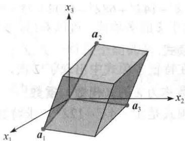

import Knowledge from '@/components/Knowledge.astro';
import Example from '@/components/Example.astro';
import Note from '@/components/Note.astro';
import Solution from '@/components/Solution.astro';
import Block from '@/components/Block.astro';

方阵 $A$ 的特征方程是一个数量方程，其中包含了有关特征值的有用信息。我们先从一个简单的例子开始，然后讨论一般情形。

<Example title="例 1">
求 $A = \begin{bmatrix} 2 & 3 \\ 3 & -6 \end{bmatrix}$ 的特征值.

<Solution title="解">
我们必须找出所有这样的数 $\lambda$ ，使得矩阵方程

$$

(A - \lambda I) \boldsymbol {x} = \mathbf {0}

$$

有非平凡解. 由逆矩阵定理, 这个问题等价于要求出所有的 $\lambda$ , 使得矩阵 $A - \lambda I$ 为不可逆矩阵, 这里

$$

A - \lambda I = \left[ \begin{array}{c c} 2 & 3 \\ 3 & - 6 \end{array} \right] - \left[ \begin{array}{c c} \lambda & 0 \\ 0 & \lambda \end{array} \right] = \left[ \begin{array}{c c} 2 - \lambda & 3 \\ 3 & - 6 - \lambda \end{array} \right]

$$

由2.2节的定理4，该矩阵当它的行列式值为零时是不可逆的．因此 $A$ 的特征值是下列方程的解：

$$

\det \left(A - \lambda I\right) = \det \left[ \begin{array}{c c} 2 - \lambda & 3 \\ 3 & - 6 - \lambda \end{array} \right] = 0

$$

我们知道

$$

\det \left[ \begin{array}{l l} a & b \\ c & d \end{array} \right] = a d - b c

$$

故

$$

\begin{array}{r l} \det (A - \lambda I) & = (2 - \lambda) (- 6 - \lambda) - (3) (3) \\ & = - 1 2 + 6 \lambda - 2 \lambda + \lambda^ {2} - 9 \\ & = \lambda^ {2} + 4 \lambda - 2 1 = (\lambda - 3) (\lambda + 7) \end{array}

$$

若 $\det(A-\lambda I)=0$ ，则 $\lambda=3$ 或 $\lambda=-7$ ，故 A 的特征值是 3 和 -7.

例 1 的行列式把包含 2 个未知数（ $\lambda$ 和 x）的矩阵方程 $(A - \lambda I)x = 0$ 转化为只含一个未知数的数值方程 $\lambda^{2} + 4\lambda - 21 = 0$ ，这种思想对 $n \times n$ 矩阵仍然适用。但在讨论更大的矩阵之前，我们先给出研究特征值要用到的行列式的性质。

行列式

设 A 是 $n \times n$ 矩阵，U 是对 A 作行替换和行交换（不作行倍乘）所得到的任一阶梯形矩阵，r 是行交换的次数，那么 A 的行列式 $\det A = (-1)^{r} u_{11} \cdots u_{nn}$ 。如果 A 可逆，那么 $u_{11}, \cdots, u_{nn}$ 都是主元（因为 $A \sim I_{n}$ 且 $u_{ii}$ 没有归一化）。否则，至少有 $u_{nn}$ 为零，从而乘积 $u_{11} \cdots u_{nn}$ 为零。因此

$$

\det A = \left\{ \begin{array}{l l} (- 1) ^ {r} u _ {1 1} \dots u _ {n n} & \text {当} A \text {可逆} \\ 0 & \text {当} A \text {不可逆} \end{array} \right.\tag{1}

$$
</Solution>
</Example>

<Example title="例 2">
计算 $A = \begin{bmatrix} 1 & 5 & 0 \\ 2 & 4 & -1 \\ 0 & -2 & 0 \end{bmatrix}$ 的行列式 $\operatorname{det} A$ .

<Solution title="解">
下面的行化简使用了一次行交换：

$$

A \sim \left[ \begin{array}{c c c} 1 & 5 & 0 \\ 0 & - 6 & - 1 \\ 0 & - 2 & 0 \end{array} \right] \sim \left[ \begin{array}{c c c} 1 & 5 & 0 \\ 0 & - 2 & 0 \\ 0 & - 6 & - 1 \end{array} \right] \sim \left[ \begin{array}{c c c} 1 & 5 & 0 \\ 0 & - 2 & 0 \\ 0 & 0 & - 1 \end{array} \right] = U _ {1}

$$

故 $\operatorname{det} A = (-1)^1(1)(-2)(-1) = -2$ 。下面选择的行化简没有用到行交换，得到了另一个不同的阶梯形

矩阵. 最后一步是用 -1/3 乘第 2 行加到第 3 行上:

$$

A \sim \left[ \begin{array}{c c c} 1 & 5 & 0 \\ 0 & - 6 & - 1 \\ 0 & - 2 & 0 \end{array} \right] \sim \left[ \begin{array}{c c c} 1 & 5 & 0 \\ 0 & - 6 & - 1 \\ 0 & 0 & 1 / 3 \end{array} \right] = U _ {2}

$$

此时， $\operatorname{det} A = (-1)^0(1)(-6)(1/3) = -2$ ，与前面的计算结果相同.

计算行列式的公式（1）说明 $A$ 是可逆的当且仅当 $\operatorname{det} A$ 非零。这个事实以及5.1节中例5后面的可逆性的性质可以添加到可逆矩阵定理当中。

定理（可逆矩阵定理（续））

设 $A$ 是 $n \times n$ 矩阵，则 $A$ 是可逆的当且仅当

s. 0 不是 A 的特征值.

t. A 的行列式不等于零.

如果 A 是 $3 \times 3$ 矩阵，那么 $\left|\det A\right|$ 是由 A 的列向量 $a_{1}, a_{2}, a_{3}$ 生成的平行六面体的体积，见图 5-5（细节见 3.3 节）。平行六面体的体积不等于零当且仅当向量 $a_{1}, a_{2}, a_{3}$ 线性无关，即矩阵 A 是可逆的。（如果向量非零且线性相关，则它们位于同一个平面或一条直线上。）

  

图 5-5
</Solution>
</Example>

<Knowledge title="定理 3">
列出了由 3.1 节和 3.2 节导出的结论，这里将（a）部分也包含进来以便参考.
</Knowledge>

<Knowledge title="定理 3">
（行列式的性质）

设 A 和 B 是 $n \times n$ 矩阵.

a. A 可逆的充要条件是 $\det A \neq 0$

b. $\det AB = (\det A)(\det B)$ .

c. $\det A^{T} = \det A$ .

d. 若 A 是三角形矩阵，那么 $\det A$ 是 A 主对角线元素的乘积.

e. 对 A 作行替换不改变其行列式值. 作一次行交换, 行列式值符号改变一次. 数乘一行后, 行列式值等于用此数乘原来的行列式值.

特征方程

利用定理3（a），我们可以通过行列式来判断矩阵 $A - \lambda I$ 是否可逆．数值方程 $\operatorname{det}(A - \lambda I) = 0$ 称为 $A$ 的特征方程，例1验证了以下结论.

数 $\lambda$ 是 $n \times n$ 矩阵 A 的特征值的充要条件是 $\lambda$ 是特征方程 $\det(A - \lambda I) = 0$ 的根.
</Knowledge>

<Example title="例 3">
求 $A = \begin{bmatrix} 5 & -2 & 6 & -1 \\ 0 & 3 & -8 & 0 \\ 0 & 0 & 5 & 4 \\ 0 & 0 & 0 & 1 \end{bmatrix}$ 的特征方程.

<Solution title="解">
写出 $A - \lambda I$ 并利用定理3（d）：

$$

\begin{array}{r l} \det (A - \lambda I) & = \det \left[ \begin{array}{c c c c} 5 - \lambda & - 2 & 6 & - 1 \\ 0 & 3 - \lambda & - 8 & 0 \\ 0 & 0 & 5 - \lambda & 4 \\ 0 & 0 & 0 & 1 - \lambda \end{array} \right] \\ & = (5 - \lambda) (3 - \lambda) (5 - \lambda) (1 - \lambda) \end{array}

$$

特征方程是

$$

(5 - \lambda) ^ {2} (3 - \lambda) (1 - \lambda) = 0

$$

或

$$

(\lambda - 5) ^ {2} (\lambda - 3) (\lambda - 1) = 0

$$

展开乘积，特征方程也可以写为

$$

\lambda^ {4} - 1 4 \lambda^ {3} + 6 8 \lambda^ {2} - 1 3 0 \lambda + 7 5 = 0

$$

例 1 和例 3 的 $\det(A-\lambda I)$ 是关于 $\lambda$ 的多项式. 可以看出, 如果 A 是 $n \times n$ 矩阵, 那么 $\det(A-\lambda I)$ 是 n 次多项式, 称为 A 的特征多项式.

在例 3 中，由于因子 $(\lambda-5)$ 在特征多项式中出现了 2 次，故称特征值 5 有重数 2. 一般地，把特征值 $\lambda$ 作为特征方程根的重数称为 $\lambda$ 的（代数）重数.
</Solution>
</Example>

<Example title="例 4">
某 $6 \times 6$ 矩阵的特征多项式是 $\lambda^{6} - 4\lambda^{5} - 12\lambda^{4}$ ，求特征值及重数.

<Solution title="解">
把多项式分解因式

$$

\lambda^ {6} - 4 \lambda^ {5} - 1 2 \lambda^ {4} = \lambda^ {4} (\lambda^ {2} - 4 \lambda - 1 2) = \lambda^ {4} (\lambda - 6) (\lambda + 2)

$$

特征值是0（重数为4），6（重数为1）和-2（重数为1）.

我们同样可以说例 4 所给矩阵的特征值是 0, 0, 0, 0, 6 和 -2，特征值按其重数重复计数.

因为 $n \times n$ 矩阵的特征方程包含有一个 $n$ 次多项式，所以如果算上重根，并允许有复根，则特征方程恰好有 $n$ 个根。复根称为复特征值，将在5.5节讨论它。目前，我们只考虑实特征值。

特征方程具有十分重要的理论意义. 但在实际计算时, 任何大于 $2 \times 2$ 矩阵的特征值都应该用计算机去求, 除非矩阵是三角形的或有其他特殊性质. 虽然 $3 \times 3$ 矩阵的特征多项式容易用手工算出, 但对其进行因式分解却并不容易 (除非是精心选择的矩阵). 见本节末的数值计算注解.
</Solution>
</Example>

## 相似性

下列定理说明了特征多项式的一个用途，并为某些近似计算特征值的迭代方法提供了理论基础。假如 $A$ 和 $B$ 是 $n \times n$ 矩阵，如果存在可逆矩阵 $P$ ，使得 $P^{-1}AP = B$ ，或等价地 $A = PBP^{-1}$ ，则称 $A$ 相似于 $B$ 。记 $Q = P^{-1}$ ，则有 $Q^{-1}BQ = A$ ，即 $B$ 也相似于 $A$ ，故我们简单说 $A$ 和 $B$ 是相似的。把 $A$ 变成 $P^{-1}AP$ 的变换称为相似变换。

<Knowledge title="定理 4">
若 $n \times n$ 矩阵 A 和 B 是相似的，那么它们有相同的特征多项式，从而有相同的特征值（和相同的重数）.

<Solution title="证明">
由 $A$ 与 $B$ 相似，有 $B = P^{-1}AP$ ，那么

$$

B - \lambda I = P ^ {- 1} A P - \lambda P ^ {- 1} P = P ^ {- 1} (A P - \lambda P) = P ^ {- 1} (A - \lambda I) P

$$

利用定理3的性质（b），有

$$

\begin{array}{r l} \det (B - \lambda I) & = \det [ P ^ {- 1} (A - \lambda I) P ] \\ & = \det (P ^ {- 1}) \cdot \det (A - \lambda I) \cdot \det (P) \end{array}\tag{2}

$$

因为 $\det(P^{-1})\cdot\det(P)=\det(P^{-1}P)=\det I=1$ ，由（2）得 $\det(B-\lambda I)=\det(A-\lambda I)$
</Solution>
</Knowledge>

<Note>
1. 矩阵 $\begin{bmatrix}2&1\\ 0&2\end{bmatrix}$ 和 $\begin{bmatrix}1&0\\ 0&2\end{bmatrix}$ 即使有相同的特征值也不相似.

2. 相似性与行等价不是一回事。（假如 $A$ 行等价于 $B$ ，则存在可逆矩阵 $E$ ，使得 $B = EA$ .）对矩阵作行变换通常会改变矩阵的特征值.
</Note>

## 应用到动力系统

如本章引例中提到的，特征值与特征向量是我们剖析动力系统的离散演变的关键点.

<Example title="例 5">
设 $A=\begin{bmatrix}0.95 & 0.03 \\ 0.05 & 0.97\end{bmatrix}$ ，分析由 $\boldsymbol{x}_{k+1}=Ax_{k}(k=0,1,2,\cdots)$ ， $x_{0}=\begin{bmatrix}0.6 \\ 0.4\end{bmatrix}$ 所确定的动力系统的长期发展趋势.

<Solution title="解">
第1步求 $A$ 的特征值，并找出每个特征空间的基。 $A$ 的特征方程是

$$

\begin{array}{r l} 0 & = \det \left[ \begin{array}{c c} 0. 9 5 - \lambda & 0. 0 3 \\ 0. 0 5 & 0. 9 7 - \lambda \end{array} \right] = (0. 9 5 - \lambda) (0. 9 7 - \lambda) - (0. 0 3) (0. 0 5) \\ & = \lambda^ {2} - 1. 9 2 \lambda + 0. 9 2 \end{array}

$$

由二次方程的求根公式

$$

\begin{array}{r l} \lambda & = \frac {1 . 9 2 \pm \sqrt {(1 . 9 2) ^ {2} - 4 (0 . 9 2)}}{2} = \frac {1 . 9 2 \pm \sqrt {0 . 0 0 6 4}}{2} \\ & = \frac {1 . 9 2 \pm 0 . 0 8}{2} = 1 \text {   或   } 0. 9 2 \end{array}

$$

容易验证对应于 $\lambda=1$ 和 $\lambda=0.92$ 的特征向量分别是 $v_{1}=\begin{bmatrix}3\\ 5\end{bmatrix}$ 和 $v_{2}=\begin{bmatrix}1\\ -1\end{bmatrix}$ 的倍数.

下一步把给定的 $x_{0}$ 表示为 $v_{1}$ 和 $v_{2}$ 的线性组合，显然 $\{v_{1}, v_{2}\}$ 是 $R^{2}$ 的基，因此存在系数 $c_{1}$ 和 $c_{2}$ ，使得

$$

\boldsymbol {x} _ {0} = c _ {1} \boldsymbol {v} _ {1} + c _ {2} \boldsymbol {v} _ {2} = \left[ \begin{array}{l l} \boldsymbol {v} _ {1} & \boldsymbol {v} _ {2} \end{array} \right] \left[ \begin{array}{l} c _ {1} \\ c _ {2} \end{array} \right]\tag{3}

$$

事实上

$$

\left[ \begin{array}{l} c _ {1} \\ c _ {2} \end{array} \right] = \left[ \begin{array}{l l} \boldsymbol {v} _ {1} & \boldsymbol {v} _ {2} \end{array} \right] ^ {- 1} \boldsymbol {x} _ {0} = \left[ \begin{array}{c c} 3 & 1 \\ 5 & - 1 \end{array} \right] ^ {- 1} \left[ \begin{array}{l} 0. 6 0 \\ 0. 4 0 \end{array} \right]\tag{Se 网区}

$$

$$

= \frac {1}{- 8} \left[ \begin{array}{c c} - 1 & - 1 \\ - 5 & 3 \end{array} \right] \left[ \begin{array}{l} 0. 6 0 \\ 0. 4 0 \end{array} \right] = \left[ \begin{array}{l} 0. 1 2 5 \\ 0. 2 2 5 \end{array} \right]\tag{4}

$$

因为式（3）的 $v_{1}$ 和 $v_{2}$ 是 A 的特征向量，且 $Av_{1}=v_{1}, Av_{2}=(0.92)v_{2}$ ，故容易算出每个 $x_{k}$ ：

$$

\nu_ {2}

$$

$$

\begin{array}{r l} \boldsymbol {x} _ {2} & = A \boldsymbol {x} _ {1} = c _ {1} A \boldsymbol {v} _ {1} + c _ {2} (0. 9 2) A \boldsymbol {v} _ {2} \\ & = c _ {1} \boldsymbol {v} _ {1} + c _ {2} (0. 9 2) ^ {2} \boldsymbol {v} _ {2} \end{array}

$$

继续下去，有

$$

\boldsymbol {x} _ {k} = c _ {1} \boldsymbol {v} _ {1} + c _ {2} (0. 9 2) ^ {k} \boldsymbol {v} _ {2} (k = 0, 1, 2, \dots)

$$

把式（4）的 $c_{1}$ 和 $c_{2}$ 代入上式，得

$$

\boldsymbol {x} _ {k} = 0. 1 2 5 \left[ \begin{array}{l} 3 \\ 5 \end{array} \right] + 0. 2 2 5 (0. 9 2) ^ {k} \left[ \begin{array}{c} 1 \\ - 1 \end{array} \right] (k = 0, 1, 2, \dots)\tag{5}

$$

$x_{k}$ 的显式公式（5）就是差分方程 $x_{k+1}=Ax_{k}$ 的解.

$$

\text { 当 } k \to \infty \text { 时 }, (0. 9 2) ^ {k} \to 0, x _ {k} \to \left[ \begin{array}{l} 0. 3 7 5 \\ 0. 6 2 5 \end{array} \right] = 0. 1 2 5 v _ {1}.

$$

把例 5 的计算结果应用于 4.9 节的马尔可夫链很有意思. 读过 4.9 节的读者可能注意到上面例 5 的矩阵 A 就是 4.9 节的移民矩阵 M, $x_{0}$ 是城市和郊区的初始人口分布, $x_{k}$ 表示 k 年后的人口分布.

4.9 节的定理 18 说明, 对于 A 这样的矩阵, 序列 $x_{k}$ 趋向于一个稳态向量. 现在我们知道了原因所在, 至少对移民矩阵是成立的. 这里稳态向量是 $0.125v_{1}$ , 是特征向量 $v_{1}$ 的倍数, 计算 $x_{k}$ 的公式 (5) 正好显示了为什么 $x_{k} \rightarrow 0.125v_{1}$ .
</Solution>
</Example>

## 数值计算的注解

1. 像 Mathematica 和 Maple 这样的计算机软件能利用符号计算求出一个中等规模矩阵的特征多项式. 但对于 $n \geqslant 5$ 的一般 $n \times n$ 矩阵, 没有公式或有限算法来求解其特征方程.

2. 最佳的求特征值的数值方法完全避开特征多项式. 事实上, MATLAB 通过先求出矩阵 $A$ 的特征值 $\lambda_1, \cdots, \lambda_n$ , 然后通过展开乘积 $(\lambda - \lambda_1)(\lambda - \lambda_2) \cdots (\lambda - \lambda_n)$ 来得到 $A$ 的特征多项式.

3. 有几个基于定理4的估计矩阵 $A$ 特征值的常用算法. 非常有效的QR算法将在习题中讨论. 当 $A = A^{\mathrm{T}}$ 时, 可使用称为雅可比方法的另一种方法来计算形如

$$

A _ {1} = A \text {和} A _ {k + 1} = P _ {k} ^ {- 1} A _ {k} P _ {k} (k = 1, 2, \dots)

$$

的矩阵序列.序列中的每个矩阵都相似于 A，因此有与 A 相同的特征值.当 k 增大时， $A_{k+1}$ 的非对角线元素趋于零，而主对角线上的元素近似于 A 的特征值.

4. 其他估计特征值的方法在 5.8 节讨论.

<Block title="练习题">

求 $A = \begin{bmatrix} 1 & -4 \\ 4 & 2 \end{bmatrix}$ 的特征方程和特征值.

</Block>

<Block title="习题5.2">

求习题 1\~8 矩阵的特征多项式和特征值.

$$

\left[ \begin{array}{c c} 2 & 7 \\ 7 & 2 \end{array} \right]

$$

$$

\left[ \begin{array}{c c} 5 & 3 \\ 3 & 5 \end{array} \right]

$$

$$

\left[ \begin{array}{c c} 3 & - 2 \\ 1 & - 1 \end{array} \right]

$$

$$

\left[ \begin{array}{c c} 2 & 1 \\ - 1 & 4 \end{array} \right]

$$

$$

\left[ \begin{array}{c c} 3 & - 4 \\ 4 & 8 \end{array} \right]

$$

$$

\left[ \begin{array}{c c} 5 & - 3 \\ - 4 & 3 \end{array} \right]

$$

$$

\left[ \begin{array}{c c} 5 & 3 \\ - 4 & 4 \end{array} \right]

$$

$$

\left[ \begin{array}{c c} 7 & - 2 \\ 2 & 3 \end{array} \right]

$$

习题 9\~14 要用到 3.1 节的方法. 利用余子式展开或在 3.1 节习题 15\~18 前给出的 $3 \times 3$ 行列式的特殊公式求矩阵的特征多项式. (提示: 只用行变换求 $3 \times 3$ 矩阵的特征多项式不简便, 因为涉及变量 $\lambda$ .)

9.

$$

\left[ \begin{array}{c c c} 1 & 0 & - 1 \\ 2 & 3 & - 1 \\ 0 & 6 & 0 \end{array} \right]

$$

10.

$$

\left[ \begin{array}{c c c} 0 & 3 & 1 \\ 3 & 0 & 2 \\ 1 & 2 & 0 \end{array} \right]

$$

11.

$$

\left[ \begin{array}{c c c} 4 & 0 & 0 \\ 5 & 3 & 2 \\ - 2 & 0 & 2 \end{array} \right]

$$

12.

$$

\left[ \begin{array}{c c c} - 1 & 0 & 1 \\ - 3 & 4 & 1 \\ 0 & 0 & 2 \end{array} \right]

$$

13.

$$

\left[ \begin{array}{r r r} 6 & - 2 & 0 \\ - 2 & 9 & 0 \\ 5 & 8 & 3 \end{array} \right]

$$

14.

$$

\left[ \begin{array}{c c c} 5 & - 2 & 3 \\ 0 & 1 & 0 \\ 6 & 7 & - 2 \end{array} \right]

$$

写出习题 15\~17 中矩阵的特征值, 特征值按其重数重复写出.

15.

$$

\left[ \begin{array}{c c c c} 4 & - 7 & 0 & 2 \\ 0 & 3 & - 4 & 6 \\ 0 & 0 & 3 & - 8 \\ 0 & 0 & 0 & 1 \end{array} \right]

$$

16.

$$

\left[ \begin{array}{r r r r} 5 & 0 & 0 & 0 \\ 8 & - 4 & 0 & 0 \\ 0 & 7 & 1 & 0 \\ 1 & - 5 & 2 & 1 \end{array} \right]

$$

17.

$$

\left[ \begin{array}{c c c c c} 3 & 0 & 0 & 0 & 0 \\ - 5 & 1 & 0 & 0 & 0 \\ 3 & 8 & 0 & 0 & 0 \\ 0 & - 7 & 2 & 1 & 0 \\ - 4 & 1 & 9 & - 2 & 3 \end{array} \right]

$$

18. 能够证明特征值 $\lambda$ 的代数重数大于或等于其特征空间的维数. 求下面矩阵 A 中的 h，使 $\lambda=4$ 的特征空间是二维的.

$$

A = \left[ \begin{array}{c c c c} 5 & - 2 & 6 & - 1 \\ 0 & 3 & h & 0 \\ 0 & 0 & 5 & 4 \\ 0 & 0 & 0 & 1 \end{array} \right]

$$

19. 设 A 是 $n \times n$ 矩阵，并假设 A 有 n 个实特征值 $\lambda_{1}, \cdots, \lambda_{n}$ ，特征值按其重数重复，因此

$$

\det (A - \lambda I) = (\lambda_ {1} - \lambda) (\lambda_ {2} - \lambda) \dots (\lambda_ {n} - \lambda)

$$

请解释为什么 $\det(A)=\lambda_{1}\cdot\lambda_{2}\cdots\lambda_{n}$ （此结果对有复特征值的方阵仍然成立）.

20. 利用行列式的性质证明 A 和 $A^{T}$ 有相同的特征多项式.

在习题 21 和习题 22 中，A 和 B 是 $n \times n$ 矩阵，判断每一命题的真假，并验证答案.

21. a. $A$ 的行列式值等于其对角线上元素的乘积. b. 对 $A$ 作初等行变换不会改变 $A$ 的行列式值. c. $(\det A)(\det B) = \det AB$ . d. 若 $\lambda + 5$ 是 $A$ 的特征多项式的因子，则 5 是 $A$ 的特征值.

22. a. A 为 $3 \times 3$ 矩阵，其列为 $a_{1}, a_{2}, a_{3}$ ，则 det A 等于由 $a_{1}, a_{2}, a_{3}$ 生成的平行六面体的体积.

$$

\det A ^ {\mathrm{T}} = (- 1) \det A

$$

c. A 的特征方程的根 r 的重数称为特征值 r 的代数重数.

d. 对 A 作行变换不会改变其特征值.

一个广泛用来估计一般矩阵 A 的特征值的方法是 QR 算法。在适当的条件下，该算法产生一个矩阵序列，序列中的矩阵全部相似于 A，矩阵几乎是上三角的，并且主对角线上的元素近似于 A 的特征值。主要思想是把 A（或另一个相似于 A 的矩阵）分解为 $A = Q_{1} R_{1}$ ，其中 $Q_{1}^{T} = Q_{1}^{-1}$ ，而 $R_{1}$ 是上三角矩阵。将 $Q_{1}$ 与 $R_{1}$ 交换后形成 $A_{1} = R_{1} Q_{1}$ ， $A_{1}$ 又被分解为 $A_{1} = Q_{2} R_{2}$ ，然后令 $A_{2} = R_{2} Q_{2}$ ，一直做下去。由习题 23 的结论知， $A, A_{1}, \cdots$ 是相似的。

23. 证明：假如 A=QR，Q 可逆，则 A 相似于 $A_{1}=RQ$ .

24. 证明：若 A 和 B 相似，则 $\det A = \det B$ .

25. 设 $A=\begin{bmatrix}0.6 & 0.3 \\ 0.4 & 0.7\end{bmatrix}, v_{1}=\begin{bmatrix}3/7 \\ 4/7\end{bmatrix}, x_{0}=\begin{bmatrix}0.5 \\ 0.5\end{bmatrix}$ （注意：

A 是 4.9 节例 5 中研究的随机矩阵）.

a. 求 $R^{2}$ 的一个基，基由 $v_{1}$ 和 A 的另一个特征向量 $v_{2}$ 组成.

b. 证明 $x_{0}$ 可以写成 $x_{0}=v_{1}+cv_{2}$ .

c. 定义 $x_{k}=A^{k}x_{0}, k=1,2,\cdots$ ，计算 $x_{1}$ 和 $x_{2}$ ，并写出 $x_{k}$ 的公式。证明当 k 增大时， $x_{k}\rightarrow v_{1}$

26. 设 $A = \begin{bmatrix} a & b \\ c & d \end{bmatrix}$ ，用本节给出的计算行列式的公式（1）证明 $\operatorname{det} A = ad - bc$ ，考虑 $a \neq 0$ 和 $a = 0$

两种情况.

27. 设 $A = \begin{bmatrix} 0.5 & 0.2 & 0.3 \\ 0.3 & 0.8 & 0.3 \\ 0.2 & 0 & 0.4 \end{bmatrix}, \pmb{v}_1 = \begin{bmatrix} 0.3 \\ 0.6 \\ 0.1 \end{bmatrix}, \pmb{v}_2 = \begin{bmatrix} 1 \\ -3 \\ 2 \end{bmatrix},$ $\pmb{v}_3 = \begin{bmatrix} -1 \\ 0 \\ 1 \end{bmatrix}, \pmb{w} = \begin{bmatrix} 1 \\ 1 \\ 1 \end{bmatrix}$ .

a. 证明 $\pmb{v}_{1},\pmb{v}_{2},\pmb{v}_{3}$ 是 $A$ 的特征向量。（注意： $A$ 是4.9节例3中的随机矩阵。）

b. 设 $x_{0}$ 是 $R^{3}$ 中的任一向量，其所有分量非负，且分量和为 1（在 4.9 节， $x_{0}$ 被称为概率向量）。解释为什么存在常数 $c_{1}, c_{2}, c_{3}$ 使得 $x_{0} = c_{1}v_{1} + c_{2}v_{2} + c_{3}v_{3}$ 。计算 $w^{T}x_{0}$ ，并推断 $c_{1} = 1$ 。

c. 对（b）中的 $x_{0}$ ，定义 $x_{k}=A^{k}x_{0}, k=1,2,\cdots$ ，证明当 k 增大时， $x_{k}\rightarrow v_{1}$ .

28. [M] 构造一个随机的 $4 \times 4$ 整数值矩阵 $A$ ，并验证 $A$ 和 $A^{\mathrm{T}}$ 有相同的特征多项式（相同的特征值和相同的特征值重数）。 $A$ 和 $A^{\mathrm{T}}$ 有相同的特征向量吗？对 $5 \times 5$ 矩阵作同样的分析，写出矩阵和计算结果。

</Block>

<Block title="练习题答案">

特征方程是

29. [M] 构造一个随机 $4 \times 4$ 整数值矩阵 $A$ .

a. 不用行倍乘将 $A$ 化简为阶梯形矩阵 $U$ ，用（例2前的）（1）式中的 $U$ 计算 $\operatorname{det} A$ 。（假如 $A$ 是奇异的，重新构造一个随机矩阵再做。）

b. 计算 $A$ 的特征值和特征值的乘积（尽可能精确）.

c. 写出矩阵 $A$ ，精确到四位小数，写出 $U$ 的主元和 $A$ 的特征值，用矩阵程序计算 $\operatorname{det} A$ ，并将结果与（a）和（b）得到的乘积进行比较.

30. [M] 设 $A = \begin{bmatrix} -6 & 28 & 21 \\ 4 & -15 & -12 \\ -8 & a & 25 \end{bmatrix}$ , 对 $a$ 取集合 \{32, 31.9, 31.8, 32.1, 32.2\} 中的每一个值, 计算 $A$ 的特征多项式和特征值, 并画出相应的特征多项式 $p(t) = \det(A - tI)$ 在 $0 \leqslant t \leqslant 3$ 的图. 有可能的话, 在同一个坐标系中画出所有的图形, 能否从图中看出特征值怎样随 $a$ 的变化而变化?

$$

\begin{array}{r l} 0 & = \det (A - \lambda I) = \det \left[ \begin{array}{c c} 1 - \lambda & - 4 \\ 4 & 2 - \lambda \end{array} \right] \\ & = (1 - \lambda) (2 - \lambda) - (- 4) (4) = \lambda^ {2} - 3 \lambda + 1 8 \end{array}

$$

解方程，求得

$$

\lambda = \frac {3 \pm \sqrt {(- 3) ^ {2} - 4 (1 8)}}{2} = \frac {3 \pm \sqrt {- 6 3}}{2}

$$

很明显，特征方程没有实数解，故 $A$ 没有实的特征值。这样 $A$ 就不存在 $\mathbb{R}^2$ 的非零向量 $\pmb{\nu}$ 和实数 $\lambda$ 使得 $A\pmb{\nu} = \lambda \pmb{\nu}$ 成立。

</Block>
