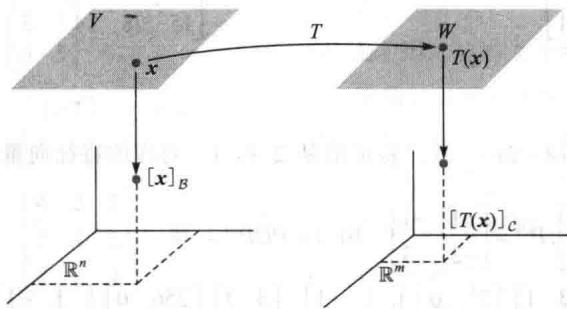
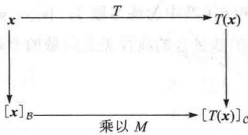
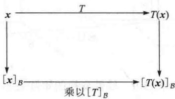
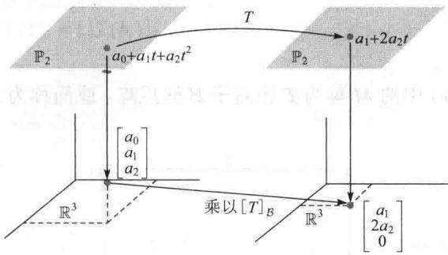
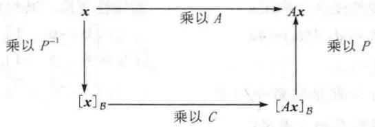

import Knowledge from '@/components/Knowledge.astro';
import Example from '@/components/Example.astro';
import Note from '@/components/Note.astro';
import Solution from '@/components/Solution.astro';
import Block from '@/components/Block.astro';

在本节，我们将矩阵分解 $A = PDP^{-1}$ 理解为线性变换。我们还将看到变换 $\pmb{x} \mapsto A\pmb{x}$ 实质上是简单的映射 $\pmb{u} \mapsto D\pmb{u}$ 。即使 $D$ 不是对角矩阵时，对矩阵 $A$ 和 $D$ 仍有相似的解释。

在 1.9 节曾讲到，任意一个从 $R^{n}$ 到 $R^{m}$ 的线性变换 T 可通过左乘矩阵 A 来实现，矩阵 A 称为 T 的标准矩阵。现在，我们对两个有限维向量空间之间的线性变换也作同样的描述。

## 线性变换的矩阵

设 V 是 n 维向量空间，W 是 m 维向量空间，T 是 V 到 W 的线性变换。为了把 T 与矩阵相联系，我们指定 B 和 C 分别是 V 和 W 的基。

若 $x \in V$ ，坐标向量 $[x]_{B} \in R^{n}$ ，x 的像 $T(x)$ 的坐标向量 $[T(x)]_{C} \in \mathbb{R}^{m}$ ，见图 5-6.

容易找出 $\left[x\right]_{B}$ 和 $\left[T(x)\right]_{C}$ 之间的关系. 设V的基B是 $\{b_{1},\cdots,b_{n}\}$ . 若 $x=r_{1}b_{1}+\cdots+r_{n}b_{n}$ ，则

$$

[ \boldsymbol {x} ] _ {B} = \left[ \begin{array}{c} r _ {1} \\ \vdots \\ r _ {n} \end{array} \right]

$$

因为 $T$ 是线性的，故

$$

T (\boldsymbol {x}) = T \left(r _ {1} \boldsymbol {b} _ {1} + \dots + r _ {n} \boldsymbol {b} _ {n}\right) = r _ {1} T \left(\boldsymbol {b} _ {1}\right) + \dots + r _ {n} T \left(\boldsymbol {b} _ {n}\right)\tag{1}

$$

因为从 W 到 $R^{m}$ 的坐标映射是线性的（4.4 节定理 8），故等式（1）可推出

$$

[ T (\boldsymbol {x}) ] _ {\mathcal {C}} = r _ {1} [ T (\boldsymbol {b} _ {1}) ] _ {\mathcal {C}} + \dots + r _ {n} [ T (\boldsymbol {b} _ {n}) ] _ {\mathcal {C}}\tag{2}

$$

  

图5-6 $V$ 到 $W$ 的线性变换

因为这些C-坐标向量都属于 $R^{m}$ ，故向量等式（2）可以写为矩阵等式

$$

[ T (\boldsymbol {x}) ] _ {\mathcal {C}} = M [ \boldsymbol {x} ] _ {\mathcal {B}}\tag{3}

$$

其中

$$

M = \left[ \left[ T (\boldsymbol {b} _ {1}) \right] _ {\mathcal {C}} \quad \left[ T (\boldsymbol {b} _ {2}) \right] _ {\mathcal {C}} \quad \dots \quad \left[ T (\boldsymbol {b} _ {n}) \right] _ {\mathcal {C}} \right]\tag{4}

$$

矩阵 M 是 T 的矩阵表示，称为 T 相对于基 B 和 C 的矩阵。见图 5-7.

  

图 5-7

等式（3）表明，就坐标向量而言，T 对 x 的作用相当于用矩阵 M 左乘 x.

<Example title="例 1">
设 $\mathcal{B} = \{\pmb{b}_1, \pmb{b}_2\}$ 是 $V$ 的基， $\mathcal{C} = \{\pmb{c}_1, \pmb{c}_2, \pmb{c}_3\}$ 是 $W$ 的基。 $T$ 是 $V \to W$ 的线性变换，满足性质：

$$

T (\boldsymbol {b} _ {1}) = 3 \boldsymbol {c} _ {1} - 2 \boldsymbol {c} _ {2} + 5 \boldsymbol {c} _ {3}, T (\boldsymbol {b} _ {2}) = 4 \boldsymbol {c} _ {1} + 7 \boldsymbol {c} _ {2} - \boldsymbol {c} _ {3}

$$

求 T 相对于基 B 和 C 的矩阵 M.

<Solution title="解">
$\pmb{b}_{1}$ 和 $\pmb{b}_{2}$ 的像的C-坐标向量是

$$

[ T (\pmb {b} _ {1}) ] _ {\mathcal {C}} = \left[ \begin{array}{c} 3 \\ - 2 \\ 5 \end{array} \right], \qquad [ T (\pmb {b} _ {2}) ] _ {\mathcal {C}} = \left[ \begin{array}{c} 4 \\ 7 \\ - 1 \end{array} \right]

$$

因此

$$

M = \left[ \begin{array}{c c} 3 & 4 \\ - 2 & 7 \\ 5 & - 1 \end{array} \right]

$$

如果B和C是同一空间V的基，T是恒等变换 $T(x)=x,x\in V$ ，那么（4）中的矩阵M正好是坐标变换矩阵（见4.7节）.
</Solution>
</Example>

## V 到 V 的线性变换

当 $W = V, \mathcal{C} = \mathcal{B}$ 时，（4）中的 $M$ 称为 $\pmb{T}$ 相对于 $\pmb{\mathcal{B}}$ 的矩阵，或简称为 $\pmb{T}$ 的 $\pmb{\mathcal{B}}$ -矩阵，记为 $[T]_{\mathcal{B}}$ 见图5-8.

  

图 5-8

$V \rightarrow V$ 的线性变换 T 的 B-矩阵对所有 V 中的 x，有

$$

[ T (\boldsymbol {x}) ] _ {\mathcal {B}} = [ T ] _ {\mathcal {B}} [ \boldsymbol {x} ] _ {\mathcal {B}}\tag{5}

$$

<Example title="例 2">
$P_{2} \rightarrow P_{2}$ 的映射 T: $T(a_{0} + a_{1}t + a_{2}t^{2}) = a_{1} + 2a_{2}t$ 是线性变换. （学过微积分的学生知道 T 是微分算子.）

a. 当基 $B=\{1,t,t^{2}\}$ 时，求 T 的 B-矩阵.

b. 对 $P_{2}$ 中的每个 p，验证 $[T(\boldsymbol{p})]_{B} = [T]_{B}[\boldsymbol{p}]_{B}$ .

<Solution title="解">
a. 计算基向量的像:

$$

\begin{array}{r l r} { T (1) = 0} & {} & {\text {零多项式}} \\ { T (t) = 1} & {} & {\text {值恒为} 1 \text {的多项式}} \\ { T (t ^ {2}) = 2 t} & {} & \end{array}

$$

然后写出 $T(1), T(t), T(t^{2})$ 的 B-坐标（本例通过观察可以得到），把它们放在一起组成 T 的 B-矩阵：

$$

\begin{array}{r l} & {\left[ T (1) \right] _ {B} = \left[ \begin{array}{l} 0 \\ 0 \\ 0 \end{array} \right], \left[ T (t) \right] _ {B} = \left[ \begin{array}{l} 1 \\ 0 \\ 0 \end{array} \right], \left[ T (t ^ {2}) \right] _ {B} = \left[ \begin{array}{l} 0 \\ 2 \\ 0 \end{array} \right]} \\ & {\quad \quad \quad \quad \quad \quad \quad \quad \quad \quad \quad \quad \quad \quad \quad \quad \quad [ T ] _ {B} = \left[ \begin{array}{l l l} 0 & 1 & 0 \\ 0 & 0 & 2 \\ 0 & 0 & 0 \end{array} \right]} \end{array}

$$

b. 对一般的多项式 $p(t) = a_0 + a_1t + a_2t^2$ ，我们有

$$

\begin{array}{r l} {[ T (\pmb {p}) ] _ {B}} & = [ a _ {1} + 2 a _ {2} t ] _ {B} = \left[ \begin{array}{l} a _ {1} \\ 2 a _ {2} \\ 0 \end{array} \right] \\ & = \left[ \begin{array}{l l l} 0 & 1 & 0 \\ 0 & 0 & 2 \\ 0 & 0 & 0 \end{array} \right] \left[ \begin{array}{l} a _ {0} \\ a _ {1} \\ a _ {2} \end{array} \right] = [ T ] _ {B} [ \pmb {p} ] _ {B} \end{array}

$$

见图 5-9.

  

图 5-9 线性变换的矩阵表示

$\mathbb{R}^n$ 上的线性变换

在涉及 $\mathbb{R}^n$ 的应用问题中，线性变换首先表现为一个矩阵变换 $x \mapsto Ax$ 。假设 $A$ 是可对角化的，那么存在由 $A$ 的特征向量组成的 $\mathbb{R}^n$ 的基 $\mathcal{B}$ 。此时，下面的定理8表明 $T$ 的 $\mathcal{B}$ -矩阵是对角矩阵，这样，把 $A$ 对角化相当于找到变换 $x \mapsto Ax$ 的对角矩阵表示。
</Solution>
</Example>

<Knowledge title="定理 8">
（对角矩阵表示）

设 $A=PDP^{-1}$ ，其中 D 为 $n \times n$ 对角矩阵，若 $R^{n}$ 的基 B 由 P 的列向量组成，那么 D 是变换 $x \mapsto Ax$ 的 B-矩阵.

<Solution title="证明">
记 P 的列向量为 $b_{1}, \cdots, b_{n}$ ，则有 $B = \{b_{1}, \cdots, b_{n}\}, P = [b_{1} \cdots b_{n}]$ 。此时，P 是 4.4 节中讨论过的坐标变换矩阵 $P_{B}$ ，其中

$$

P [ \pmb {x} ] _ {\mathcal {B}} = \pmb {x}, \quad [ \pmb {x} ] _ {\mathcal {B}} = P ^ {- 1} \pmb {x}

$$

若 $x \in R^{n}, T(x) = Ax$ ，则

$$

\begin{array}{r l r} {[ T ] _ {B}} & {= [   [ T (\pmb {b} _ {1}) ] _ {B} \dots [ T (\pmb {b} _ {n}) ] _ {B} ]} & {\text {由} [ T ] _ {B} \text {的定义}} \\ & {= [   [ A \pmb {b} _ {1} ] _ {B} \dots [ A \pmb {b} _ {n} ] _ {B} ]} & {\text {由} T (\pmb {x}) = A \pmb {x}} \\ & {= [ P ^ {- 1} A \pmb {b} _ {1} \dots P ^ {- 1} A \pmb {b} _ {n} ]} & {\text {坐标变换}} \\ & {= P ^ {- 1} A [ \pmb {b} _ {1} \dots \pmb {b} _ {n} ]} & {\text {矩阵乘法}} \\ & {= P ^ {- 1} A P} \end{array}\tag{6}

$$

由于 $A = PDP^{-1}$ ，我们有 $[T]_{B} = P^{-1}AP = D$ 。
</Solution>
</Knowledge>

<Example title="例 3">
设 $A=\begin{bmatrix}7&2\\ -4&1\end{bmatrix},R^{2}\rightarrow R^{2}$ 的变换 $T:T(x)=Ax$ 。求 $R^{2}$ 的一个基 B ，使得 T 的 B-矩阵是对角矩阵.

<Solution title="解">
由5.3节的例2，我们知道 $A = PDP^{-1}$ ，其中

$$

P = \left[ \begin{array}{c c} 1 & 1 \\ - 1 & - 2 \end{array} \right], D = \left[ \begin{array}{c c} 5 & 0 \\ 0 & 3 \end{array} \right]

$$

P 的列向量记为 $b_{1}$ 和 $b_{2}$ ，是 A 的特征向量，由定理 8，若取 $B = \{b_{1}, b_{2}\}$ ，则 D 是 T 的 B-矩阵。映射 $x \mapsto Ax$ 和 $u \mapsto Du$ 描述的是相对于不同基的同一个线性变换。
</Solution>
</Example>

## 矩阵表示的相似性

定理8的证明并没有用到 $D$ 是对角矩阵这一事实. 因此, 若 $A$ 相似于 $C$ , 即有 $A = PCP^{-1}$ , 且 $\mathcal{B}$ 由 $P$ 的列向量组成, 则 $C$ 是变换 $x \mapsto Ax$ 的 $\mathcal{B}-$ 矩阵. 分解 $A = PCP^{-1}$ 如图5-10所示.

  

图5-10 两个矩阵表示的相似性： $A = PCP^{-1}$

反之，若 $\mathbb{R}^n\to \mathbb{R}^n$ 的变换 $T:T(x) = Ax$ ，而 $\mathcal{B}$ 是 $\mathbb{R}^n$ 的任意一个基，那么 $T$ 的 $\mathcal{B}-$ 矩阵相似于 $A$ 其实，在定理8的证明的计算中已经证明若 $P$ 是以 $\mathcal{B}$ 的向量作为列构成的矩阵，那么 $[T]_{\mathcal{B}} = P^{-1}AP.$ 因此，所有相似于 $A$ 的矩阵的集合与变换 $x\mapsto Ax$ 的所有矩阵表示的集合是同一集合.

<Example title="例 4">
设 $A = \begin{bmatrix} 4 & -9 \\ 4 & -8 \end{bmatrix}$ , $\pmb{b}_1 = \begin{bmatrix} 3 \\ 2 \end{bmatrix}$ , $\pmb{b}_2 = \begin{bmatrix} 2 \\ 1 \end{bmatrix}$ , $A$ 的特征多项式是 $(\lambda + 2)^2$ , 但特征值-2的特征空间只是一维的, 因此 $A$ 是不可以对角化的. 但是, 有一组基 $\mathcal{B} = \{\pmb{b}_1, \pmb{b}_2\}$ 能够使得变换 $x \to Ax$ 的 $\mathcal{B}$ -矩阵是三角矩阵, 称为 $A$ 的若尔当型. 求这个 $\mathcal{B}$ -矩阵.

<Solution title="解">
如果 $P = [b_{1} - b_{2}]$ ，则 $\mathcal{B}$ -矩阵是 $P^{-1}AP$ ，计算

$$

A P = \left[ \begin{array}{l l} 4 & - 9 \\ 4 & - 8 \end{array} \right] \left[ \begin{array}{l l} 3 & 2 \\ 2 & 1 \end{array} \right] = \left[ \begin{array}{l l} - 6 & - 1 \\ - 4 & 0 \end{array} \right]

$$

$$

P ^ {- 1} A P = \left[ \begin{array}{c c} - 1 & 2 \\ 2 & - 3 \end{array} \right] \left[ \begin{array}{c c} - 6 & - 1 \\ - 4 & 0 \end{array} \right] = \left[ \begin{array}{c c} - 2 & 1 \\ 0 & - 2 \end{array} \right]

$$
</Solution>
</Example>

<Note>
A 的特征值在对角线上.

数值计算的注解 计算 $\mathcal{B}-$ 矩阵 $P^{-1}AP$ 的一种有效方法是先计算 $AP$ ，然后用行变换将增广矩阵 $[P\quad AP]$ 化为 $[I\quad P^{-1}AP]$ ，这样就不需要单独计算 $P^{-1}$ 了，见2.2节的习题12.
</Note>

<Block title="练习题">

1. 假设 $T$ 是 $\mathbb{P}_2$ 到 $\mathbb{P}_2$ 的线性变换，相对于基 $\mathcal{B} = \{1, t, t^2\}$ 的矩阵是 $[T]_{\mathcal{B}} = \begin{bmatrix} 3 & 4 & 0 \\ 0 & 5 & -1 \\ 1 & -2 & 7 \end{bmatrix}$ ，求 $T(a_0 + a_1 t + a_2 t^2)$ .

2. 设 $A, B, C$ 是 $n \times n$ 矩阵，我们已经知道若 $A$ 相似于 $B$ ，那么 $B$ 亦相似于 $A$ ，这个性质和下面的结论说明

“相似”是等价关系。（行等价是等价关系的另一个例子。）证明（a）和（b）

a. $A$ 相似于 $A$ .

b. 若 A 相似于 B，B 相似于 C，那么 A 相似于 C。

</Block>

<Block title="习题5.4">

1. 设 $B=\{b_{1},b_{2},b_{3}\}$ 和 $D=\{d_{1},d_{2}\}$ 分别是向量空间 V 和 W 的基， $T:V\to W$ 是线性变换，满足： $T(b_{1})=3d_{1}-5d_{2},T(b_{2})=-d_{1}+6d_{2},T(b_{3})=4d_{2}$ 求 T 相对于 B 和 D 的矩阵.

2. 设 $D=\{d_{1},d_{2}\}$ 和 $B=\{b_{1},b_{2}\}$ 分别是向量空间 V 和 W 的基， $T:V\to W$ 是线性变换，满足： $T(d_{1})=2b_{1}-3b_{2}, T(d_{2})=-4b_{1}+5b_{2}$ 求 T 相对于 D 和 B 的矩阵.

3. 设 $E=\{e_{1},e_{2},e_{3}\}$ 是 $R^{3}$ 的标准基， $B=\{b_{1},b_{2},b_{3}\}$ 是向量空间 V 的基， $T:\mathbb{R}^{3}\rightarrow V$ 是线性变换， $T(x_{1},x_{2},x_{3})=(x_{3}-x_{2})b_{1}-(x_{1}+x_{3})b_{2}+(x_{1}-x_{2})b_{3}$ a. 计算 $T(e_{1}), T(e_{2}), T(e_{3})$ .

b. 计算 $[T(e_{1})]_{B}, [T(e_{2})]_{B}, [T(e_{3})]_{B}$ .

c. 求 T 相对于 E 和 B 的矩阵.

4. 设 $B=\{b_{1},b_{2},b_{3}\}$ 是向量空间 V 的基， $T:V\to R^{2}$ 是线性变换，满足： $T(x_{1}b_{1}+x_{2}b_{2}+x_{3}b_{3})=\begin{bmatrix}2x_{1}-4x_{2}+5x_{3}\\ -x_{2}+3x_{3}\end{bmatrix}$ 求 T 相对于 B 和 $R^{2}$ 的标准基的矩阵.

5. 设 $T: \mathbb{P}_2 \to \mathbb{P}_3$ 是将多项式 $\pmb{p}(t)$ 映射为多项式 $(t + 5)\pmb{p}(t)$ 的变换.  

a. 求 $\pmb{p}(t) = 2 - t + t^2$ 的像.  

b. 证明 $T$ 是线性变换.  

c. 求 $T$ 相对于基 $\{1, t, t^2\}$ 和 $\{1, t, t^2, t^3\}$ 的矩阵.

6. 设 $T: \mathbb{P}_2 \to \mathbb{P}_4$ 是将多项式 $\pmb{p}(t)$ 映射为 $\pmb{p}(t) + t^2\pmb{p}(t)$ 的变换.  

a. 求 $\pmb{p}(t) = 2 - t + t^2$ 的像.  

b. 证明 $T$ 是线性变换.  

c. 求 $T$ 相对于基 $\{1, t, t^2\}$ 和 $\{1, t, t^2, t^3, t^4\}$ 的矩阵.

7. 假设映射 $T: \mathbb{P}_2 \to \mathbb{P}_2$ 定义为 $T(a_0 + a_1t + a_2t^2) = 3a_0 + (5a_0 - 2a_1)t + (4a_1 + a_2)t^2$ 并且是线性的，求 $T$ 相对于基 $\mathcal{B} = \{1, t, t^2\}$ 的矩阵.

8. 设 $B=\{b_{1},b_{2},b_{3}\}$ 是向量空间 V 的基，T 是 $V\to V$ 的线性变换，其相对于 B 的矩阵是 $[T]_{B}=\begin{bmatrix}0&-6&1\\ 0&5&-1\\ 1&-2&7\end{bmatrix}$ ，求 $T(3b_{1}-4b_{2})$ .

9. 定义 $P_{2} \rightarrow R^{3}$ 的变换 T 为 $T(\boldsymbol{p})=\begin{bmatrix}\boldsymbol{p}(-1)\\\boldsymbol{p}(0)\\\boldsymbol{p}(1)\end{bmatrix}$ .

a. 求 $p(t)=5+3t$ 在变换 T 下的像.

b. 证明 T 是线性变换.

c. 求 T 相对于 $P_{2}$ 的基 $\{1, t, t^{2}\}$ 和 $R^{3}$ 标准基的矩阵.

10. 定义 $\mathbb{P}_3 \to \mathbb{R}^4$ 的变换 $T$ 为 $T(\pmb{p}) = \begin{bmatrix} \pmb{p}(-3) \\ \pmb{p}(-1) \\ \pmb{p}(1) \\ \pmb{p}(3) \end{bmatrix}$ .

$$

\mathbb {P} _ {3}

$$

$$

\{1, t, t ^ {2}, t ^ {3} \}

$$

$$

\mathbb {R} ^ {4}

$$

在习题 11 和习题 12 中， $B=\{b_{1},b_{2}\}$ ，求变换 $x\mapsto Ax$ 的 B-矩阵.

$$

A = \left[ \begin{array}{c c} 3 & 4 \\ - 1 & - 1 \end{array} \right], \quad \boldsymbol {b} _ {1} = \left[ \begin{array}{c} 2 \\ - 1 \end{array} \right], \quad \boldsymbol {b} _ {2} = \left[ \begin{array}{c} 1 \\ 2 \end{array} \right]

$$

12. $A = \begin{bmatrix} -1 & 4\\ -2 & 3 \end{bmatrix},\quad \boldsymbol {b}_{1} = \begin{bmatrix} 3\\ 2 \end{bmatrix},\quad \boldsymbol {b}_{2} = \begin{bmatrix} -1\\ 1 \end{bmatrix}$

在习题 13\~16 中，定义 $R^{2} \rightarrow R^{2}$ 的变换 T 为 $T(x) = Ax$ ，求 $R^{2}$ 的基 B，使得 $[T]_{B}$ 为对角矩阵.

13. $A=\begin{bmatrix}0 & 1 \\ -3 & 4\end{bmatrix}$ 14. $A=\begin{bmatrix}5 & -3 \\ -7 & 1\end{bmatrix}$ 15. $A=\begin{bmatrix}4 & -2 \\ -1 & 3\end{bmatrix}$ 16. $A=\begin{bmatrix}2 & -6 \\ -1 & 3\end{bmatrix}$

17. 设 $A = \begin{bmatrix} 1 & 1 \\ -1 & 3 \end{bmatrix}$ 和 $\mathcal{B} = \{\pmb{b}_1, \pmb{b}_2\}, \pmb{b}_1 = \begin{bmatrix} 1 \\ 1 \end{bmatrix}, \quad \pmb{b}_2 = \begin{bmatrix} 5 \\ 4 \end{bmatrix}$ .

定义 $T:\mathbb{R}^2\to \mathbb{R}^2$ 为 $T(\pmb {x}) = Ax$ ：

a. 证明 $b_{1}$ 是 A 的特征向量，但 A 不可对角化.

b. 求 T 的 B-矩阵.

18. 定义 $T: \mathbb{R}^3 \to \mathbb{R}^3$ 为 $T(x) = Ax$ ，其中 $A$ 为 $3 \times 3$ 矩阵，特征值是 5 和 -2。是否存在 $\mathbb{R}^3$ 的基 $\mathcal{B}$ ，使得 $T$ 的 $\mathcal{B}-$ 矩阵是对角矩阵？试做讨论。证明习题 19\~24 的命题，题中矩阵为方阵。

19. 若 A 可逆且相似于 B，则 B 可逆且 $A^{-1}$ 相似于 $B^{-1}$ . （提示：存在可逆矩阵 P，使得 $P^{-1}AP = B$ ，解释 B 为什么可逆，然后找一个可逆矩阵 Q，使得 $Q^{-1}A^{-1}Q = B^{-1}$ .）

20. 若 $A$ 相似于 $B$ ，则 $A^2$ 相似于 $B^2$ .

21. 若 B 相似于 A，C 相似于 A，则 B 相似于 C.

22. 若 A 可对角化，B 相似于 A，则 B 亦可对角化.

23. 若 $B = P^{-1}AP, x$ 是 $A$ 对应于特征值 $\lambda$ 的特征向量，则 $P^{-1}x$ 是 $B$ 对应于 $\lambda$ 的特征向量.

24. 若 A 与 B 是相似的，则它们有相同的秩。（提示：参考第 4 章补充习题 13 和 14.）

25. 方阵 A 主对角线元素之和称为 A 的轨迹，记为 tr A. 可以证明对任意的两个 $n \times n$ 矩阵 F 和 G，有 $\operatorname{tr}(FG) = \operatorname{tr}(GF)$ . 证明：若 A 与 B 相似，则 tr A = tr B.

26. 能够证明矩阵 $A$ 的轨迹等于 $A$ 的特征值之和，在 $A$ 可对角化时验证这个结论.

27. 设 $V = R^{n}, B = \{b_{1}, \cdots, b_{n}\}$ 为 V 的基， $W = R^{n}, E$ 为 W 的标准基. $I: I(x) = x$ 是 $V \to W$ 的恒等变换，求 I 相对于 B 和 E 的矩阵，这个矩阵在 4.4

节被称为什么矩阵？

28. 设 V 和 W 是同一向量空间，其基分别是 $B = \{b_{1}, \cdots, b_{n}\}$ 和 $C = \{c_{1}, \cdots, c_{n}\}$ ，I 是 $V \to W$ 的恒等变换，求 I 相对于 B 和 C 的矩阵。这个矩阵在 4.7 节被称为什么矩阵？

29. 设 V 是向量空间，基为 $B=\{b_{1},\cdots,b_{n}\}$ ，求 $V\to V$ 的恒等变换 I 的 B-矩阵.

[M]对习题30和习题31，求变换 $x \mapsto Ax$ 相对于基 $\mathcal{B} = \{\pmb{b}_1, \pmb{b}_2, \pmb{b}_3\}$ 的 $\mathcal{B}$ -矩阵.

$$

3 0. \quad A = \left[ \begin{array}{c c c} - 1 4 & 4 & - 1 4 \\ - 3 3 & 9 & - 3 1 \\ 1 1 & - 4 & 1 1 \end{array} \right], \boldsymbol {b} _ {1} = \left[ \begin{array}{c} - 1 \\ - 2 \\ 1 \end{array} \right], \boldsymbol {b} _ {2} = \left[ \begin{array}{c} - 1 \\ - 1 \\ 1 \end{array} \right],

$$

$$

\boldsymbol {b} _ {3} = \left[ \begin{array}{c} - 1 \\ - 2 \\ 0 \end{array} \right]

$$

$$

3 1. \quad A = \left[ \begin{array}{c c c} - 7 & - 4 8 & - 1 6 \\ 1 & 1 4 & 6 \\ - 3 & - 4 5 & - 1 9 \end{array} \right], \boldsymbol {b} _ {1} = \left[ \begin{array}{c} - 3 \\ 1 \\ - 3 \end{array} \right], \boldsymbol {b} _ {2} = \left[ \begin{array}{c} - 2 \\ 1 \\ - 3 \end{array} \right],

$$

$$

\boldsymbol {b} _ {3} = \left[ \begin{array}{c} 3 \\ - 1 \\ 0 \end{array} \right]

$$

32. [M]变换 $T$ 的标准矩阵为 $A$ ，求 $\mathbb{R}^4$ 的一个基 $\mathcal{B}$ ，使得 $[T]_{\mathcal{B}}$ 为对角矩阵.

$$

A = \left[ \begin{array}{c c c c} 1 5 & - 6 6 & - 4 4 & - 3 3 \\ 0 & 1 3 & 2 1 & - 1 5 \\ 1 & - 1 5 & - 2 1 & 1 2 \\ 2 & - 1 8 & - 2 2 & 8 \end{array} \right]

$$

</Block>

<Block title="练习题答案">

1. 设 $p(t) = a_0 + a_1t + a_2t^2$ ，计算得

$$

[ T (\boldsymbol {p}) ] _ {B} = [ T ] _ {B} [ \boldsymbol {p} ] _ {B} = \left[ \begin{array}{c c c} 3 & 4 & 0 \\ 0 & 5 & - 1 \\ 1 & - 2 & 7 \end{array} \right] \left[ \begin{array}{l} a _ {0} \\ a _ {1} \\ a _ {2} \end{array} \right] = \left[ \begin{array}{c} 3 a _ {0} + 4 a _ {1} \\ 5 a _ {1} - a _ {2} \\ a _ {0} - 2 a _ {1} + 7 a _ {2} \end{array} \right]

$$

故 $T(\pmb {p}) = (3a_0 + 4a_1) + (5a_1 - a_2)t + (a_0 - 2a_1 + 7a_2)t^2.$

2. a. $A=(I)^{-1}AI$ ，所以 A 相似于 A。

b. 由假设，存在可逆矩阵 P 和 Q，使得 $B = P^{-1}AP$ 和 $C = Q^{-1}BQ$ ，代入并利用逆运算性质，有 $C = Q^{-1}BQ = Q^{-1}(P^{-1}AP)Q = (PQ)^{-1}A(PQ)$ ，这一等式表明 A 相似于 C.

</Block>
