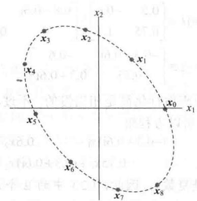
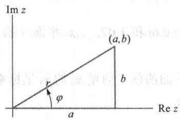
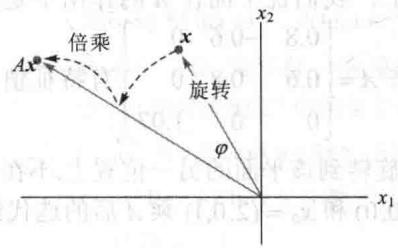
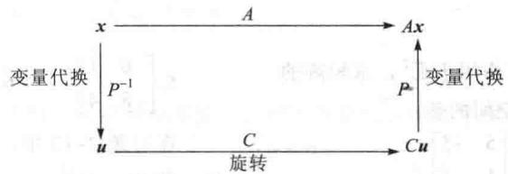
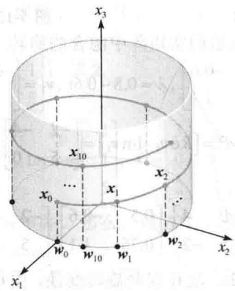

import Guide from '@/components/Guide.astro';
import Knowledge from '@/components/Knowledge.astro';
import Example from '@/components/Example.astro';
import Analysis from '@/components/Analysis.astro';
import Solution from '@/components/Solution.astro';
import Variant from '@/components/Variant.astro';
import Note from '@/components/Note.astro';
import Block from '@/components/Block.astro';
import Method from '@/components/Method.astro';
import Exercise from '@/components/Exercise.astro';

$n \times n$ 矩阵的特征方程含有 $n$ 次多项式，如果考虑复根，方程恰好有 $n$ 个根（重根重复计算）。本节将看到假如实矩阵 $A$ 的特征方程有复根，那么这些复根将给我们提供有关 $A$ 的关键信息。关键的问题是让 $A$ 作用于 $n$ 维复空间 $\mathbb{C}^n$ 中的 $n$ 元复数。

我们对 $\mathbb{C}^n$ 感兴趣并不是为了把前几章的结果推广，尽管这可以开辟线性代数应用的新领域。然而，对复特征值的研究能使我们揭示各种实际生活问题中出现的某些实矩阵中“隐藏”的信息。这些问题包括很多蕴涵周期运动的实动力系统、振动或空间的某种旋转。

建立在 $\mathbb{R}^n$ 基础上的矩阵特征值-特征向量理论同样可以很好地应用到 $\mathbb{C}^n$ 。因此，一个复数 $\lambda$ 满足 $\det(A - \lambda I) = 0$ 当且仅当在 $\mathbb{C}^n$ 中存在一个非零向量 $x$ ，使得 $Ax = \lambda x$ 。我们称这样的 $\lambda$ 是（复）特征值， $x$ 是对应于 $\lambda$ 的（复）特征向量。

<Example title="例 1">
假设 $A = \begin{bmatrix} 0 & -1 \\ 1 & 0 \end{bmatrix}$ ，那么 $\mathbb{R}^2$ 上的线性变换 $x \mapsto Ax$ 将平面逆时针旋转 1/4 圈。 $A$ 的作用是周期性的，因为在旋转 4 次 1/4 圈后，向量又回到了它的初始位置，很明显没有非零向量被映射成自身的数倍，所以 $A$ 在 $\mathbb{R}^2$ 中没有特征向量，因此也没有实的特征值。实际上， $A$ 的特征方程是

$$
\lambda^ {2} + 1 = 0
$$

只有复根 $\lambda = \mathrm{i}$ 和 $\lambda = -\mathrm{i}$ 但是，如果我们让 $A$ 作用在 $\mathbb{C}^2$ 上，那么

$$
\left[ \begin{array}{c c} 0 & - 1 \\ 1 & 0 \end{array} \right] \left[ \begin{array}{c} 1 \\ - \mathrm{i} \end{array} \right] = \left[ \begin{array}{c} \mathrm{i} \\ 1 \end{array} \right] = \mathrm{i} \left[ \begin{array}{c} 1 \\ - \mathrm{i} \end{array} \right]
$$

$$
\left[ \begin{array}{c c} 0 & - 1 \\ 1 & 0 \end{array} \right] \left[ \begin{array}{l} 1 \\ \mathrm{i} \end{array} \right] = \left[ \begin{array}{c} - \mathrm{i} \\ 1 \end{array} \right] = - \mathrm{i} \left[ \begin{array}{l} 1 \\ \mathrm{i} \end{array} \right]
$$

因此i和-i是特征值， $\begin{bmatrix}1\\ -i\end{bmatrix}$ 和 $\begin{bmatrix}1\\ i\end{bmatrix}$ 是对应的特征向量（在例2中讨论求复特征向量的方法）.

下一个例子中的矩阵是本节的主要焦点所在.
</Example>

<Example title="例 2">
设 $A = \begin{bmatrix} 0.5 & -0.6 \\ 0.75 & 1.1 \end{bmatrix}$ ，求 $A$ 的特征值及每个特征空间的基.

<Solution title="解">
$A$ 的特征方程是

$$
0 = \det \left[ \begin{array}{c c} 0. 5 - \lambda & - 0. 6 \\ 0. 7 5 & 1. 1 - \lambda \end{array} \right] = (0. 5 - \lambda) (1. 1 - \lambda) - (- 0. 6) (0. 7 5) = \lambda^ {2} - 1. 6 \lambda + 1
$$

依求根公式，得 $\lambda=\frac{1}{2}\left[1.6\pm\sqrt{(-1.6)^{2}-4}\right]=0.8\pm0.6i$ 。对特征值 $\lambda=0.8-0.6i$ ，构造

$$
\begin{array}{r l} A - (0. 8 - 0. 6 \mathrm{i}) I & = \left[ \begin{array}{c c} 0. 5 & - 0. 6 \\ 0. 7 5 & 1. 1 \end{array} \right] - \left[ \begin{array}{c c} 0. 8 - 0. 6 \mathrm{i} & 0 \\ 0 & 0. 8 - 0. 6 \mathrm{i} \end{array} \right] \\ & = \left[ \begin{array}{c c} - 0. 3 + 0. 6 \mathrm{i} & - 0. 6 \\ 0. 7 5 & 0. 3 + 0. 6 \mathrm{i} \end{array} \right] \end{array}\tag{1}
$$

由于有复数运算，手工对增广矩阵做行化简是相当慢的。不过，细心观察就能找到简化问题的方法：因为0.8-0.6i是特征值，所以方程组

$$
\begin{array}{r l} (- 0. 3 + 0. 6 \mathrm{i}) x _ {1} - & 0. 6 x _ {2} = 0 \\ 0. 7 5 x _ {1} + (0. 3 + 0. 6 \mathrm{i}) x _ {2} = 0 \end{array}\tag{2}
$$

有非零解（这里的 $x_{1}$ 和 $x_{2}$ 可能是复数），因此，（2）中的2个方程确定的 $x_{1}$ 与 $x_{2}$ 之间的关系是同一关系，这样就可以通过其中的一个方程将某个变量用另一个来表示.

由（2）的第2个方程得

$$
\begin{array}{r l} 0. 7 5 x _ {1} & = (- 0. 3 - 0. 6 \mathrm{i}) x _ {2} \\ x _ {1} & = (- 0. 4 - 0. 8 \mathrm{i}) x _ {2} \end{array}
$$

为去掉小数，取 $x_{2} = 5$ ，有 $x_{1} = -2 - 4\mathrm{i}$ 。对应于 $\lambda = 0.8 - 0.6\mathrm{i}$ 的特征空间的基是

$$
\nu_ {1} = \left[ \begin{array}{c} - 2 - 4 \mathrm{i} \\ 5 \end{array} \right]
$$

对 $\lambda = 0.8 + 0.6\mathrm{i}$ 做同样的计算，可求出特征向量

$$
\boldsymbol {v} _ {2} = \left[ \begin{array}{c} - 2 + 4 \mathrm{i} \\ 5 \end{array} \right]
$$

为验证结果是否正确，可以计算

$$
A \pmb {v} _ {2} = \left[ \begin{array}{c c} 0. 5 & - 0. 6 \\ 0. 7 5 & 1. 1 \end{array} \right] \left[ \begin{array}{c} - 2 + 4 \mathrm{i} \\ 5 \end{array} \right] = \left[ \begin{array}{c} - 4 + 2 \mathrm{i} \\ 4 + 3 \mathrm{i} \end{array} \right] = (0. 8 + 0. 6 \mathrm{i}) \pmb {v} _ {2}
$$

例 2 的矩阵 A 确定的变换 $x \mapsto Ax$ 实质上是一个旋转变换，画出一些适当的点后，这一事实会变得更明显.

例3 与例2中的矩阵 $A$ 相乘会影响点，通过以下方法可以看到这种影响。先画出一个随机的初始点（如 $x_0 = (2,0)$ ），然后画出重复乘 $A$ 后该点的后续图像。即，画出

$$
\begin{array}{l} \boldsymbol {x} _ {1} = A \boldsymbol {x} _ {0} = \left[ \begin{array}{c c} 0. 5 & - 0. 6 \\ 0. 7 5 & 1. 1 \end{array} \right] \left[ \begin{array}{c} 2 \\ 0 \end{array} \right] = \left[ \begin{array}{c} 1. 0 \\ 1. 5 \end{array} \right] \\ \boldsymbol {x} _ {2} = A \boldsymbol {x} _ {1} = \left[ \begin{array}{c c} 0. 5 & - 0. 6 \\ 0. 7 5 & 1. 1 \end{array} \right] \left[ \begin{array}{c} 1. 0 \\ 1. 5 \end{array} \right] = \left[ \begin{array}{c} - 0. 4 \\ 2. 4 \end{array} \right] \\ \boldsymbol {x} _ {3} = A \boldsymbol {x} _ {2} \\ \dots \end{array}
$$

在图 5-11 中，用粗点显示 $x_{0}, \cdots, x_{8}$ ，用细点显示 $x_{9}, \cdots, x_{100}$ ，序列分布在椭圆形的轨道上.

<figure class="vp-figure">
  
  <figcaption>图5-11 点 $x_0$ 在有复特征值的矩阵的作用下的迭代</figcaption>
</figure>

当然，图 5-11 没有解释为什么会发生旋转，旋转的秘密隐藏在复特征向量的实部和虚部。向量的实部和虚部

$\mathbb{C}^n$ 中复向量 $x$ 的共轭向量 $\overline{x}$ 也是 $\mathbb{C}^n$ 中的向量，它的分量是 $x$ 中对应分量的共轭复数，向量 $\operatorname{Re} x$ 和 $\operatorname{Im} x$ 称为复向量 $x$ 的实部和虚部，分别由 $x$ 的分量的实部和虚部组成.
</Solution>
</Example>

<Example title="例 4">
假如 $x = \begin{bmatrix} 3 - \mathrm{i}\\ \mathrm{i}\\ 2 + 5\mathrm{i} \end{bmatrix} = \begin{bmatrix} 3\\ 0\\ 2 \end{bmatrix} +\mathrm{i}\begin{bmatrix} -1\\ 1\\ 5 \end{bmatrix}$ ，那么

$$
\operatorname{Re} \boldsymbol {x} = \left[ \begin{array}{l} 3 \\ 0 \\ 2 \end{array} \right], \operatorname{Im} \boldsymbol {x} = \left[ \begin{array}{c} - 1 \\ 1 \\ 5 \end{array} \right], \overline {{\boldsymbol {x}}} = \left[ \begin{array}{l} 3 \\ 0 \\ 2 \end{array} \right] - \mathrm{i} \left[ \begin{array}{c} - 1 \\ 1 \\ 5 \end{array} \right] = \left[ \begin{array}{c} 3 + \mathrm{i} \\ - \mathrm{i} \\ 2 - 5 \mathrm{i} \end{array} \right]
$$

假设 B 是可能有复元素的 $m \times n$ 矩阵，那么，以 B 的元素的共轭复数为元素的矩阵记为 $\overline{B}$ . 复数的共轭运算性质对复矩阵代数亦成立：

$$
\overline {{r x}} = \overline {{r}} \overline {{x}}, \overline {{B x}} = \overline {{B}} \overline {{x}}, \overline {{B C}} = \overline {{B}} \overline {{C}}, \overline {{r B}} = \overline {{r}} \overline {{B}}
$$

作用于 $\mathbb{C}^n$ 上的实矩阵的特征值和特征向量

设 A 为 $n \times n$ 的实矩阵，那么 $\overline{Ax} = \overline{A}\overline{x} = A\overline{x}$ ，假如 $\lambda$ 是 A 的特征值，x 是对应于 $\lambda$ 的特征向量，那么

$$
\overline {{A x}} = \overline {{A x}} = \overline {{\lambda x}} = \overline {{\lambda}} \overline {{x}}
$$

故 $\bar{\lambda}$ 同样是 A 的特征值，而 $\bar{x}$ 是对应的特征向量。这表明，当 A 是实矩阵时，它的复特征值以共轭复数对出现（在这里或别的地方，我们用术语复特征值来表示形如 $\lambda = a + bi (b \neq 0)$ 的特征值）。
</Example>

<Example title="例 5">
例2的实矩阵的特征值是共轭复数对 $0.8 - 0.6\mathrm{i}$ 和 $0.8 + 0.6\mathrm{i}$ ，对应的特征向量同样是共轭复向量：

$$
\pmb {v} _ {1} = \left[ \begin{array}{c} {- 2 - 4 \mathrm{i}} \\ {5} \end{array} \right] \text {和} \pmb {v} _ {2} = \left[ \begin{array}{c} {- 2 + 4 \mathrm{i}} \\ {5} \end{array} \right] = \overline {{\pmb {v}}} _ {1}
$$
</Example>

<Example title="例 6">
为计算有复特征值的 $2 \times 2$ 实矩阵提供了基本模式.
</Example>

<Example title="例 6">
设 $C = \begin{bmatrix} a & -b \\ b & a \end{bmatrix}$ ，其中 $a, b$ 为实数且不都等于零。那么 $C$ 的特征值是 $\lambda = a \pm bi$ 。（见本节末尾的练习题。）同样，假如 $r = |\lambda| = \sqrt{a^2 + b^2}$ ，那么

$$
C = r \left[ \begin{array}{l l} a / r & - b / r \\ b / r & a / r \end{array} \right] = \left[ \begin{array}{l l} r & 0 \\ 0 & r \end{array} \right] \left[ \begin{array}{l l} \cos \varphi & - \sin \varphi \\ \sin \varphi & \cos \varphi \end{array} \right]
$$

这里的 $\varphi$ 是正 $x$ 轴与 $(0,0)$ 到 $(a,b)$ 射线的夹角. 参看图5-12和附录B，角 $\varphi$ 称为 $\lambda = a\pm bi$ 的辐角．因此变换 $x\mapsto Cx$ 可看作由旋转 $\varphi$ 角度和倍乘 $|\lambda |$ 变换复合而成（见图5-13）.

<figure class="vp-figure">
  
  <figcaption>图 5-12</figcaption>
</figure>

<figure class="vp-figure">
  
  <figcaption>图 5-13 旋转后倍乘</figcaption>
</figure>

最后，我们准备讨论有复特征值的实矩阵中隐含的旋转.

例7 与例2一样， $A = \begin{bmatrix} 0.5 & -0.6\\ 0.75 & 1.1 \end{bmatrix},\lambda = 0.8 - 0.6\mathrm{i},\nu_{1} = \begin{bmatrix} -2 - 4\mathrm{i}\\ 5 \end{bmatrix}$ 同时，设 $P$ 是 $2\times 2$ 实矩阵，

$$
P = \left[ \operatorname{Re} \boldsymbol {v} _ {1} \quad \operatorname{Im} \boldsymbol {v} _ {1} \right] = \left[ \begin{array}{c c} - 2 & - 4 \\ 5 & 0 \end{array} \right]
$$

并令

$$
C = P ^ {- 1} A P = \frac {1}{2 0} \left[ \begin{array}{l l} 0 & 4 \\ - 5 & - 2 \end{array} \right] \left[ \begin{array}{l l} 0. 5 & - 0. 6 \\ 0. 7 5 & 1. 1 \end{array} \right] \left[ \begin{array}{l l} - 2 & - 4 \\ 5 & 0 \end{array} \right] = \left[ \begin{array}{l l} 0. 8 & - 0. 6 \\ 0. 6 & 0. 8 \end{array} \right]
$$

由例6，因为 $\left|\lambda \right|^2 = (0.8)^2 +(0.6)^2 = 1$ ，故 $C$ 仅是旋转变换．由 $C = P^{-1}AP$ ，得

$$
A = P C P ^ {- 1} = P \left[ \begin{array}{c c} 0. 8 & - 0. 6 \\ 0. 6 & 0. 8 \end{array} \right] P ^ {- 1}
$$

A “含有”旋转！矩阵 P 提供变量代换，如 x = Pu 。 A 的作用相当于将 x 代换为 u ，再经过旋转，然后又代换回初始变量，见图 5-14。旋转产生一个椭圆，如图 5-11 所示，而不是圆，因为由 P 的列确定的坐标系不是长方形的，在两个轴上没有相等的单位长。

<figure class="vp-figure">
  
  <figcaption>图 5-14 由复特征值引起的旋转</figcaption>
</figure>

三、备忘录

下列定理表明例 7 的计算适用于任意有复特征值 $\lambda$ 的 $2 \times 2$ 实矩阵. 证明利用了如下结论:

若 $A$ 是实矩阵，则 $A(\operatorname{Re} x) = \operatorname{Re} A x$ 和 $A(\operatorname{Im} x) = \operatorname{Im} A x$ ，若 $x$ 是对应于复特征值的特征向量，则 $\operatorname{Re} x$ 和 $\operatorname{Im} x$ 是线性无关的。（见习题25和26.）这里省略细节。
</Example>

<Knowledge title="定理 9">
设 A 是 $2 \times 2$ 实矩阵，有复特征值 $\lambda = a - bi (b \neq 0)$ 及对应的 $C^{2}$ 中的复特征向量 v，那么

$A = PCP^{-1}$ ，其中 $P = \left[Rev \, Imv\right]$ , $C = \begin{bmatrix} a & -b \\ b & a \end{bmatrix}$

在更高维矩阵中亦存在例7中所示的现象. 例如, 若 $A$ 是有复特征值的 $3 \times 3$ 矩阵, 那么在 $\mathbb{R}^3$ 中存在某个平面, $A$ 对平面的作用是旋转 (可能还结合倍乘), 平面中的每个向量被旋转到该平面的另一点上, 我们说平面在 $A$ 的作用下是不变的.
</Knowledge>

<Example title="例 8">
矩阵 $A = \begin{bmatrix} 0.8 & -0.6 & 0 \\ 0.6 & 0.8 & 0 \\ 0 & 0 & 1.07 \end{bmatrix}$ 有特征值 $0.8 \pm 0.6\mathrm{i}$ 和1.07. $x_{1}x_{2}$ 平面（第3坐标为0）的任一向量 $\pmb{w}_{0}$ 被 $A$ 旋转到该平面的另一位置上.不在该平面的任一向量 $\pmb{x}_{0}$ 的 $x_{3}$ 坐标乘1.07，图5-15显示了点 $\pmb{w}_{0} = (2,0,0)$ 和 $\pmb{x}_{0} = (2,0,1)$ 乘 $A$ 后的迭代结果.

<figure class="vp-figure">
  
  <figcaption>图 5-15 点 $w_{0}$ 和 $x_{0}$ 在有复特征值的 $3 \times 3$ 矩阵作用下的迭代</figcaption>
</figure>
</Example>

<Block title="练习题">
证明：若 $a$ 和 $b$ 是实数，则 $A = \begin{bmatrix} a & -b \\ b & a \end{bmatrix}$ 的特征值是 $a \pm bi$ ，对应的特征向量是 $\begin{bmatrix} 1 \\ -i \end{bmatrix}$ 和 $\begin{bmatrix} 1 \\ i \end{bmatrix}$ .
</Block>

<Block title="习题5.5">
让习题 1\~6 的每个矩阵作用于 $C^{2}$ ，求矩阵的特征值及对应于 $C^{2}$ 中特征空间的基.

$$
\left[ \begin{array}{c c} 1 & - 2 \\ 1 & 3 \end{array} \right]
$$

$$
\left[ \begin{array}{c c} 1 & 5 \\ - 2 & 3 \end{array} \right]
$$

$$
\left[ \begin{array}{c c} 5 & - 5 \\ 1 & 1 \end{array} \right]
$$

$$
\left[ \begin{array}{c c} 5 & - 2 \\ 1 & 3 \end{array} \right]
$$

$$
5. \left[ \begin{array}{c c} 0 & 1 \\ - 8 & 4 \end{array} \right]
$$

$$
\left[ \begin{array}{c c} 4 & 3 \\ - 3 & 4 \end{array} \right]
$$

在习题 7\~12 中，用例 6 写出 A 的特征值。在每一例中，变换 $x \mapsto Ax$ 由旋转加倍乘复合而成。求旋转的角度 $\varphi (-\pi < \varphi \leqslant \pi)$ 和倍乘因子 r。

7. $\left[ \begin{array}{cc} \sqrt{3} & -1 \\ 1 & \sqrt{3} \end{array} \right]$ 8. $\left[ \begin{array}{cc} \sqrt{3} & 3 \\ -3 & \sqrt{3} \end{array} \right]$ 9. $\left[ \begin{array}{cc} -\sqrt{3} / 2 & 1 / 2 \\ -1 / 2 & -\sqrt{3} / 2 \end{array} \right]$ 10. $\left[ \begin{array}{cc} -5 & -5 \\ 5 & -5 \end{array} \right]$ 11. $\left[ \begin{array}{cc} 0.1 & 0.1 \\ -0.1 & 0.1 \end{array} \right]$ 12. $\left[ \begin{array}{cc} 0 & 0.3 \\ -0.3 & 0 \end{array} \right]$

在习题 13\~20 中，求可逆矩阵 P 和形如 $\begin{bmatrix} a & -b \\ b & a \end{bmatrix}$ 的矩阵 C，把所给的矩阵表示为 $A = PCP^{-1}$ 的形式。对于习题 13～16，使用习题 1～4 中的信息。
13. $\begin{bmatrix}1 & -2 \\ 1 & 3\end{bmatrix}$ 14. $\begin{bmatrix}5 & -5 \\ 1 & 1\end{bmatrix}$ 15. $\begin{bmatrix}1 & 5 \\ -2 & 3\end{bmatrix}$ 16. $\begin{bmatrix}5 & -2 \\ 1 & 3\end{bmatrix}$ 17. $\begin{bmatrix}-1 & -0.8 \\ 4 & -2.2\end{bmatrix}$ 18. $\begin{bmatrix}1 & -1 \\ 0.4 & 0.6\end{bmatrix}$ 19. $\begin{bmatrix}1.52 & -0.7 \\ 0.56 & 0.4\end{bmatrix}$ 20. $\begin{bmatrix}-1.64 & -2.4 \\ 1.92 & 2.2\end{bmatrix}$

21. 在例 2 中，解（2）中的第 1 个方程，用 $x_{1}$ 表示 $x_{2}$ ，并由此求得 A 的特征向量 $y=\begin{bmatrix}2\\ -1+2i\end{bmatrix}$ .
证明 y 是例 2 中 $v_{1}$ 的（复）数倍.

22. 设 A 是 $n \times n$ 的复（或实）矩阵，x 是复特征值对应于 $C^{n}$ 中的特征值 $\lambda$ 的复特征向量。证明：对任意非零的复数 $\mu$ ，向量 $\mu x$ 是 A 的特征向量。

第 7 章将把重点放在具有性质 $A^{T} = A$ 的矩阵 A 上，习题 23 和 24 证明了这种矩阵的特征值必定是实数。

23. 设 $n \times n$ 实矩阵 $A$ 有性质 $A^{\mathrm{T}} = A, x$ 是 $\mathbb{C}^{n}$ 中的向
</Block>

<Block title="练习题答案">
量，令 $q = \overline{x}^{T} A x$ 。下面的等式通过验证 $\overline{q} = q$ 证明了 q 是实数。给出每一步的理由。 $\overline{q}=\overline{\overline{x}^{\mathrm{T}}A\overline{x}}=\overline{x^{\mathrm{T}}A\overline{x}}=\overline{x^{\mathrm{T}}A\overline{x}}=(x^{\mathrm{T}}A\overline{x})^{\mathrm{T}}=\overline{x}^{\mathrm{T}}A^{\mathrm{T}}x=q$

24. 设 $n \times n$ 实矩阵 $A$ 有性质 $A^{\mathrm{T}} = A$ 。证明，若对 $\pmb{x} \in \mathbb{C}^{n}$ 有 $Ax = \lambda x$ ，则 $\lambda$ 是实数，而 $\pmb{x}$ 的实部是 $A$ 的特征向量。（提示：计算 $\overline{\pmb{x}}^{\mathrm{T}} Ax$ 和利用习题23的结果，并检查 $Ax$ 的实部和虚部。）

25. 设 A 是 $n \times n$ 实矩阵， $x \in C^{n}$ ，证明 $\operatorname{Re}(Ax) = A(\operatorname{Re}x)$ 和 $\operatorname{Im}(Ax) = A(\operatorname{Im}x)$ .

26. 设 A 是 $2 \times 2$ 实矩阵，有复特征值 $\lambda = a - bi$ $(b \neq 0)$ 和对应的 $C^{2}$ 中的复特征向量 v，
a. 证明 $A(\text{Rev}) = a\text{Rev} + b\text{Imv}$ 和 $A(\text{Imv}) = -b\text{Rev} + a\text{Imv}$ . （提示: 记 $v = Rev + iImv$ ，计算 Av.）
b. 假设 P 和 C 是定理 9 给出的矩阵，证明 AP = PC.

[M]在习题27和习题28中，求所给矩阵 $A$ 的分解式 $A = PCP^{-1}$ ，其中 $C$ 是由形如例6矩阵的 $2 \times 2$ 子矩阵组成的分块对角矩阵。（对每一对共轭复特征值，利用属于 $\mathbb{C}^4$ 的特征向量的实部和虚部来产生 $P$ 的两列。）

$$
A = \left[ \begin{array}{r r r r} 0. 7 & 1. 1 & 2. 0 & 1. 7 \\ - 2. 0 & - 4. 0 & - 8. 6 & - 7. 4 \\ 0 & - 0. 5 & - 1. 0 & - 1. 0 \\ 1. 0 & 2. 8 & 6. 0 & 5. 3 \end{array} \right]
$$

$$
A = \left[ \begin{array}{c c c c} - 1. 4 & - 2. 0 & - 2. 0 & - 2. 0 \\ - 1. 3 & - 0. 8 & - 0. 1 & - 0. 6 \\ 0. 3 & - 1. 9 & - 1. 6 & - 1. 4 \\ 2. 0 & 3. 3 & 2. 3 & 2. 6 \end{array} \right]
$$

记住，要验证向量是否为特征向量是很容易的，并不需要检验特征方程. 计算

$$
A \boldsymbol {x} = \left[ \begin{array}{c c} a & - b \\ b & a \end{array} \right] \left[ \begin{array}{l} 1 \\ - \mathrm{i} \end{array} \right] = \left[ \begin{array}{l} a + b \mathrm{i} \\ b - a \mathrm{i} \end{array} \right] = (a + b \mathrm{i}) \left[ \begin{array}{l} 1 \\ - \mathrm{i} \end{array} \right]
$$

因此， $\begin{bmatrix}1\\ -i\end{bmatrix}$ 是对应于 $\lambda=a+b\mathrm{i}$ 的特征向量，从本节讨论的内容知道， $\begin{bmatrix}1\\ i\end{bmatrix}$ 一定是对应于 $\overline{\lambda}=a-b\mathrm{i}$ 的特征向量.
</Block>
