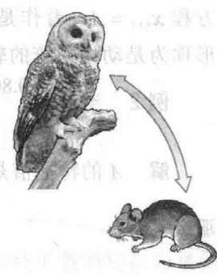
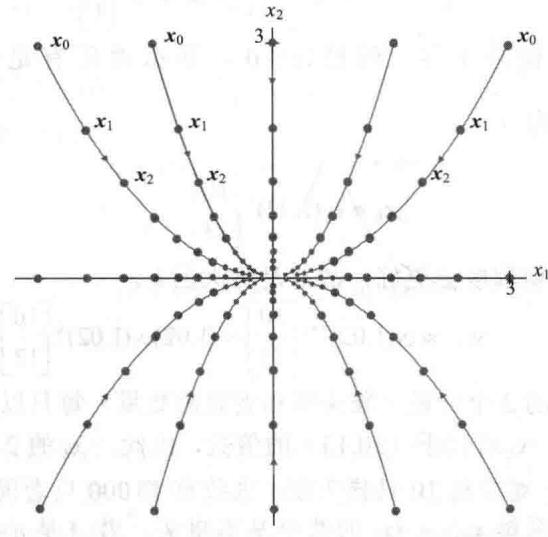
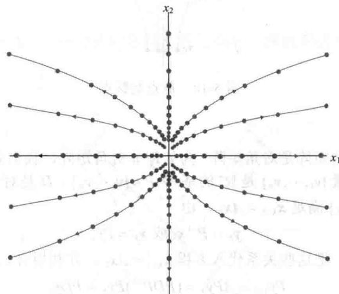
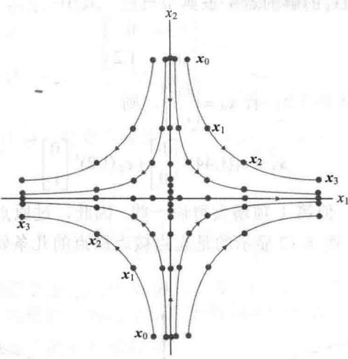
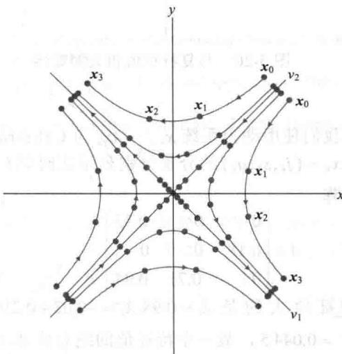
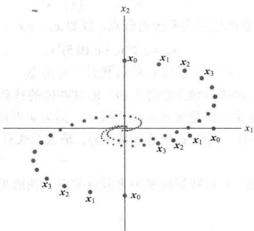

import Guide from '@/components/Guide.astro';
import Knowledge from '@/components/Knowledge.astro';
import Example from '@/components/Example.astro';
import Analysis from '@/components/Analysis.astro';
import Solution from '@/components/Solution.astro';
import Variant from '@/components/Variant.astro';
import Note from '@/components/Note.astro';
import Block from '@/components/Block.astro';
import Method from '@/components/Method.astro';
import Exercise from '@/components/Exercise.astro';

特征值和特征向量提供了如下线索，使我们理解由差分方程 $x_{k + 1} = Ax_k$ 描述的动力系统的长期行为或进化。这种方程可用来建立人口动态变化的数学模型，如1.10节的人口变化模型、4.9节的各种马尔可夫链及本章介绍性的斑点猫头鹰数学模型。向量 $\pmb{x}_k$ 给出系统随时间推移（记为 $k$ ）的相关信息。例如，在斑点猫头鹰例子里， $\pmb{x}_k$ 表示在时间 $k$ 的三个年龄段的猫头鹰的数目。

由于生态问题要比物理或工程上的问题容易描述和解释，因此本节的应用焦点放在生态问题上.但很多的科学领域存在动力系统．例如控制系统的标准大学课程对动力系统的某些方面进行了讨论.这些课程中的现代状态空间设计方法主要依赖于矩阵代数 ① ．控制系统中的稳态响应在工程上等价于我们在这里所说的动力系统 $x_{k+1}=Ax_{k}$ 的“长期行为”.

一直到例6，我们都假设 $A$ 可对角化，有 $n$ 个线性无关的特征向量 $\pmb{v}_1, \dots, \pmb{v}_n$ 和对应的特征值 $\lambda_1, \dots, \lambda_n$ 。为方便起见，假设特征向量已按 $|\lambda_1| \geqslant |\lambda_2| \geqslant \dots \geqslant |\lambda_n|$ 的顺序排列好。因为 $\{\pmb{v}_1, \dots, \pmb{v}_n\}$ 是 $\mathbb{R}^n$ 的基，故任一初始向量 $\pmb{x}_0$ 可以唯一表示为

$$
\boldsymbol {x} _ {0} = \boldsymbol {c} _ {1} \boldsymbol {v} _ {1} + \dots + c _ {n} \boldsymbol {v} _ {n}\tag{1}
$$

$x_{0}$ 的这种特征向量分解确定了序列 $\{x_{k}\}$ 所发生的情况. 下一步的计算将 5.2 节例 5 的简单情况一般化. 因为 $v_{i}$ 是特征向量, 所以

$$
\begin{array}{r l} \boldsymbol {x} _ {1} & = A \boldsymbol {x} _ {0} = c _ {1} A \boldsymbol {v} _ {1} + \dots + c _ {n} A \boldsymbol {v} _ {n} \\ & = c _ {1} \lambda_ {1} \boldsymbol {v} _ {1} + \dots + c _ {n} \lambda_ {n} \boldsymbol {v} _ {n} \end{array}
$$

一般有

$$
\boldsymbol {x} _ {k} = c _ {1} \left(\lambda_ {1}\right) ^ {k} \boldsymbol {v} _ {1} + \dots + c _ {n} \left(\lambda_ {n}\right) ^ {k} \boldsymbol {v} _ {n} (k = 0, 1, 2, \dots)\tag{2}
$$

下列例子说明当 $k \to \infty$ 时，（2）会出现什么结果.

## 捕食者-食饵系统

在加利福尼亚州的红木森林深处，作为老鼠的主要捕食者，斑点猫头鹰的食物有 $80\%$ 是老鼠。例1利用线性动力系统来建立猫头鹰和老鼠的自然系统模型。（实事求是地讲，这个模型在某些方面与现实不符，但它能够为环境科学家们所用的更复杂的非线性模型的研究提供一个起点。）

<Example title="例 1">
用 $x_{k}=\begin{bmatrix}O_{k}\\ R_{k}\end{bmatrix}$ 表示在时间 k （k 的单位是月）猫头鹰和老鼠的数量， $O_{k}$ 是在研究区域猫头鹰的数量， $R_{k}$ 是老鼠的数量（单位是千只）。设

$$
\begin{array}{l} O _ {k + 1} = (0. 5) O _ {k} + (0. 4) R _ {k} \\ R _ {k + 1} = - p \cdot O _ {k} + (1. 1) R _ {k} \end{array}\tag{3}
$$

其中 $p$ 是被指定的正参数. 第1个方程中的 $(0.5)O_{k}$ 表示, 如果没有老鼠为食物, 每月仅有一半的猫头鹰存活下来, 而第2个方程的 $(1.1)R_{k}$ 表明如果没有猫头鹰捕食老鼠, 那么老鼠的数量每月增长 $10\%$ . 假如有足够多的老鼠, $(0.4)R_{k}$ 表示猫头鹰增长的数量, 而负项 $-p \cdot O_{k}$ 表示由于猫头鹰的捕食所引起的老鼠的死亡数量. (事实上, 一只猫头鹰每月平均吃掉 $1000p$ 只老鼠.) 当 $p = 0.104$ 时, 预测该系统的发展趋势.

<Solution title="解">
当 p=0.104 时，算出方程组（3）的系数矩阵 A 的特征值是 $\lambda_{1}=1.02$ 和 $\lambda_{2}=0.58$ 。对应的特征向量是

$$
\pmb {v} _ {1} = \left[ \begin{array}{l} 1 0 \\ 1 3 \end{array} \right], \pmb {v} _ {2} = \left[ \begin{array}{l} 5 \\ 1 \end{array} \right]
$$

初始向量 $x_{0}$ 可表示为 $x_{0}=c_{1}v_{1}+c_{2}v_{2}$ ，那么对 $k\geqslant0$ ，

$$
\begin{array}{r l} \boldsymbol {x} _ {k} & = c _ {1} (1. 0 2) ^ {k} \boldsymbol {v} _ {1} + c _ {2} (0. 5 8) ^ {k} \boldsymbol {v} _ {2} \\ & = c _ {1} (1. 0 2) ^ {k} \left[ \begin{array}{l} 1 0 \\ 1 3 \end{array} \right] + c _ {2} (0. 5 8) ^ {k} \left[ \begin{array}{l} 5 \\ 1 \end{array} \right] \end{array}
$$

当 $k \to \infty$ 时， $(0.58)^k$ 很快趋于零。假设 $c_1 > 0$ ，那么对所有足够大的 $k$ ， $x_k$ 近似等于 $c_1(1.02)^k \begin{bmatrix} 10 \\ 13 \end{bmatrix} v_1$ ，我们记为

$$
\boldsymbol {x} _ {k} \approx c _ {1} (1. 0 2) ^ {k} \left[ \begin{array}{l} 1 0 \\ 1 3 \end{array} \right]\tag{4}
$$

随着 k 的增大，（4）的近似程度会更好，故对足够大的 k，

$$
\boldsymbol {x} _ {k + 1} \approx c _ {1} (1. 0 2) ^ {k + 1} \left[ \begin{array}{l} 1 0 \\ 1 3 \end{array} \right] = (1. 0 2) c _ {1} (1. 0 2) ^ {k} \left[ \begin{array}{l} 1 0 \\ 1 3 \end{array} \right] \approx 1. 0 2 \boldsymbol {x} _ {k}\tag{5}
$$

近似式（5）表明最终 $x_{k}$ 的2个分量（猫头鹰和老鼠的数量）每月以大约1.02的倍数增长，即月增长率为2%。由（4）， $x_{k}$ 近似于（10,13）的倍数，因此， $x_{k}$ 的2个分量之比率也近似于10与13的比率，也就是说，对应每10只猫头鹰，大致有13000只老鼠。

例 1 说明了有关动力系统 $x_{k+1}=Ax_{k}$ 的两个基本事实，若 A 是 $n\times n$ 矩阵，它的特征值满足 $\left|\lambda_{1}\right|\geqslant1$ 和 $1>\left|\lambda_{j}\right|$ , $j=2,\cdots,n$ , $v_{1}$ 是 $\lambda_{1}$ 对应的特征向量，假如 $x_{0}$ 由式（1）给出且 $c_{1}\neq0$ ，那么对足够大的 k，

$$
\boldsymbol {x} _ {k + 1} \approx \lambda_ {1} \boldsymbol {x} _ {k}\tag{6}
$$

和

$$
\boldsymbol {x} _ {k} \approx c _ {1} (\lambda_ {1}) ^ {k} \boldsymbol {v} _ {1}\tag{7}
$$

式（6）和（7）的近似精度可根据需要通过取足够大的 $k$ 来得到．由式（6）， $\pmb{x}_k$ 每时段最终以近似 $\lambda_{1}$ 的倍数增长，因此， $\lambda_{1}$ 确定了系统的最终增长率．同样由式（7），对足够大的 $k$ ， $\pmb{x}_k$ 的2个分量之比近似等于 $\nu_{1}$ 对应分量之比.5.2节的例5是 $\lambda_{1} = 1$ 的实例.

解的几何意义

当 A 为 $2 \times 2$ 矩阵时，可以通过系统发展趋势的几何描述来补充解释代数计算。我们可以把方程 $x_{k+1}=Ax_{k}$ 看作是 $R^{2}$ 中的初始点 $x_{0}$ 被映射 $x\mapsto Ax$ 重复变换的描述. 由 $x_{0},x_{1},\cdots$ 组成的图形称为是动力系统的轨迹.
</Solution>
</Example>

<Example title="例 2">
当 $A = \begin{bmatrix} 0.80 & 0 \\ 0 & 0.64 \end{bmatrix}$ 时，画出动力系统 $\pmb{x}_{k + 1} = A\pmb{x}_k$ 的若干条轨迹.

<Solution title="解">
$A$ 的特征值是0.8和0.64，对应的特征向量是 $\pmb{v}_1 = \begin{bmatrix} 1 \\ 0 \end{bmatrix}$ 和 $\pmb{v}_2 = \begin{bmatrix} 0 \\ 1 \end{bmatrix}$ . 假如 $x_0 = c_1 v_1 + c_2 v_2$ 那么

$$
\boldsymbol {x} _ {k} = c _ {1} (0. 8) ^ {k} \left[ \begin{array}{l} 1 \\ 0 \end{array} \right] + c _ {2} (0. 6 4) ^ {k} \left[ \begin{array}{l} 0 \\ 1 \end{array} \right]
$$

当 $k \to \infty$ 时， $(0.8)^k$ 和 $(0.64)^k$ 都趋于零，当然 $x_k$ 也趋于零。但 $x_k$ 趋于零的方式是有趣的。图5-16显示了几条轨迹的开头几项，这些轨迹的起点在四个角点的坐标为 $(\pm 3, \pm 3)$ 的矩形的边界上。为使轨迹容易看清，用细线把轨迹上的点连接起来。

<figure class="vp-figure">
  
  <figcaption>图5-16 原点是吸引子</figcaption>
</figure>

在例 2 中，因为所有的轨迹都趋于原点，所以原点被称作动力系统的吸引子。当两个特征值的绝对值都小于 1 的时候出现这种情况。过原点和有最小绝对值的特征值的特征向量 $v_{2}$ 的直线的方向是最大吸引方向。

在下一个例子中，A 的两个特征值的绝对值都大于 1，此时的原点称为动力系统的排斥子。除了（常数）零解， $x_{k+1}=Ax_{k}$ 的所有解是无界的，离原点而去。 ①
</Solution>
</Example>

<Example title="例 3">
画出方程 $x_{k+1}=Ax_{k}$ 的解的若干条典型轨迹，其中

$$
A = \left[ \begin{array}{l l} 1. 4 4 & 0 \\ 0 & 1. 2 \end{array} \right]
$$

<Solution title="解">
$A$ 的特征值是1.44和1.2，若 $\pmb{x_0} = \begin{bmatrix} c_1 \\ c_2 \end{bmatrix}$ ，则

$$
\boldsymbol {x} _ {k} = c _ {1} (1. 4 4) ^ {k} \left[ \begin{array}{l} 1 \\ 0 \end{array} \right] + c _ {2} (1. 2) ^ {k} \left[ \begin{array}{l} 0 \\ 1 \end{array} \right]
$$

两项的值随 $k$ 增大而增大，但第1项增大得快一些。因此，过原点和较大特征值的特征向量的直线方向是最大排斥方向。图5-17显示的是起点接近原点的几条轨迹。

<figure class="vp-figure">
  
  <figcaption>图5-17 原点是排斥子</figcaption>
</figure>

在下一个例子中，原点称为鞍点，因为原点在某些方向吸引解，而在其他方向又排斥解。当一个特征值的绝对值大于1而另一个特征值的绝对值小于1的时候出现这种情况。最大的吸引方向是由绝对值较小的特征值的特征向量决定的。最大的排斥方向是由绝对值较大的特征值的特征向量决定的。
</Solution>
</Example>

<Example title="例 4">
画出方程 $\mathbf{y}_{k + 1} = D\mathbf{y}_k$ 的若干典型解的轨迹，其中

$$
D = \left[ \begin{array}{l l} 2. 0 & 0 \\ 0 & 0. 5 \end{array} \right]
$$

（我们这里用 $D$ 和 $\pmb{y}$ 代替 $A$ 和 $\pmb{x}$ 是因为后面要用到该例.）若解 $\{\pmb{y}_k\}$ 的初始点不在 $x_{2}$ 轴上，则解 $\{\pmb{y}_k\}$ 无界.

<Solution title="解">
$D$ 的特征值是2和0.5.若 $\pmb {y}_0 = \left[ \begin{array}{c}c_1\\ c_2 \end{array} \right]$ ，那么

$$
\mathbf {y} _ {k} = c _ {1} 2 ^ {k} \left[ \begin{array}{l} 1 \\ 0 \end{array} \right] + c _ {2} (0. 5) ^ {k} \left[ \begin{array}{l} 0 \\ 1 \end{array} \right]\tag{8}
$$

假如 $y_{0}$ 在 $x_{2}$ 轴，那么 $c_{1}=0$ ，因此当 $k\to\infty$ 时， $y_{k}\to0$ 。但当 $y_{0}$ 不在 $x_{2}$ 轴时，计算 $y_{k}$ 的和式中的第 1 项变得任意大，因此 $\{y_{k}\}$ 是无界的。图 5-18 显示起点靠近或在 $x_{2}$ 轴上的 10 条轨迹。

<figure class="vp-figure">
  
  <figcaption>图5-18 原点是鞍点</figcaption>
</figure>
</Solution>
</Example>

## 变量代换

前面 3 个例子讨论的矩阵是对角矩阵。为处理非对角矩阵，我们先暂时回到 A 为 $n \times n$ 矩阵的情形，设 A 的特征向量 $\{v_{1}, \cdots, v_{n}\}$ 是 $R^{n}$ 的基。令 $P = [v_{1} \cdots v_{n}]$ ，D 是对角线上元素为对应特征值的对角矩阵。给出序列 $\{x_{k}\}$ 满足 $x_{k+1} = Ax_{k}$ ，由

$$
\pmb {y} _ {k} = P ^ {- 1} \pmb {x} _ {k} \text {或} \pmb {x} _ {k} = P \pmb {y} _ {k}
$$

定义一个新的序列 $\{\pmb{y}_k\}$ ，把这些关系代入方程 $x_{k + 1} = Ax_k$ ，并利用 $A = PDP^{-1}$ ，我们求得

$$
P \mathbf {y} _ {k + 1} = A P \mathbf {y} _ {k} = (P D P ^ {- 1}) P \mathbf {y} _ {k} = P D \mathbf {y} _ {k}
$$

两边乘 $P^{-1}$ ，得

$$
\mathbf {y} _ {k + 1} = D \mathbf {y} _ {k}
$$

假如我们记 $y_{k}$ 为 $y(k)$ ，用 $y_{1}(k),\cdots,y_{n}(k)$ 表示 $y(k)$ 的分量，那么

$$
\left[ \begin{array}{c} y _ {1} (k + 1) \\ y _ {2} (k + 1) \\ \vdots \\ y _ {n} (k + 1) \end{array} \right] = \left[ \begin{array}{c c c c} \lambda_ {1} & 0 & \dots & 0 \\ 0 & \lambda_ {2} & & \vdots \\ \vdots & & \ddots & 0 \\ 0 & \dots & 0 & \lambda_ {n} \end{array} \right] \left[ \begin{array}{c} y _ {1} (k) \\ y _ {2} (k) \\ \vdots \\ y _ {n} (k) \end{array} \right]
$$

从 $x_{k}$ 到 $y_{k}$ 的变量代换解耦了差分方程系统. 例如, $y_{1}(k)$ 的变化不受 $y_{2}(k), \cdots, y_{n}(k)$ 的影响, 因为对每一个 $k, y_{1}(k+1) = \lambda_{1}y_{1}(k)$ .

等式 $x_{k}=Py_{k}$ 表明 $y_{k}$ 是 $x_{k}$ 在向量基 $\{v_{1},\cdots,v_{n}\}$ 下的坐标向量。这样我们就可以通过在新的特征向量坐标系中进行计算来解耦系统 $x_{k+1}=Ax_{k}$ 。当 n=2 时，相当于用两个特征向量作为坐标轴。

<Example title="例 5">
证明：原点是方程 $x_{k + 1} = Ax_k$ 解的鞍点，其中

$$
A = \left[ \begin{array}{c c} 1. 2 5 & - 0. 7 5 \\ - 0. 7 5 & 1. 2 5 \end{array} \right]
$$

并求最大的吸引方向和排斥方向.

<Solution title="解">
用通常方法，可以求得 $A$ 有特征值2和0.5，对应的特征向量分别是

$$
\pmb {v} _ {1} = \left[ \begin{array}{c} {{1}} \\ {{- 1}} \end{array} \right] \text {和} \pmb {v} _ {2} = \left[ \begin{array}{c} {{1}} \\ {{1}} \end{array} \right]
$$

由于 $|2|>1$ 和 $|0.5|<1$ ，因此原点是动力系统的鞍点．假如 $x_{0}=c_{1}v_{1}+c_{2}v_{2}$ ，那么

$$
\boldsymbol {x} _ {k} = c _ {1} 2 ^ {k} \boldsymbol {v} _ {1} + c _ {2} (0. 5) ^ {k} \boldsymbol {v} _ {2}\tag{9}
$$

这个等式看起来像例 4 的式（8），只是用 $v_{1}$ 和 $v_{2}$ 代替了标准基.

在方格纸上，过 $v_{1}$ 和 $v_{2}$ 画坐标轴。看图 5-19，沿这些轴的移动相当于例 3 的沿标准轴的移动。在图 5-19 中，最大的排斥方向是在过 $v_{1}$ 的直线上，因为 $v_{1}$ 对应的特征值大于 1。若 $x_{0}$ 在这条直线上，则（9）中的 $c_{2}=0$ ，因此 $x_{k}$ 快速远离原点。最大的吸引方向由特征向量 $v_{2}$ 确定， $v_{2}$ 对应的特征值小于 1。

图 5-19 显示了一些轨迹. 若按特征向量轴来看这些图, 图的形状与例 3 的一样.

<figure class="vp-figure">
  
  <figcaption>图5-19 原点是鞍点</figcaption>
</figure>
</Solution>
</Example>

## 复特征值

若 $A$ 为有复特征值的 $2 \times 2$ 矩阵, 则 $A$ 不可对角化 (当 $A$ 作用在 $\mathbb{R}^n$ 时), 但动力系统 $\pmb{x}_{k+1} = A\pmb{x}_k$ 还是容易描述. 5.5节的例3给出了这样的例子, 此时, 特征值的绝对值为1. 点 $\pmb{x}_0$ 的迭代绕原点沿椭圆型轨道作螺旋运动.

假如 $A$ 有两个绝对值都大于1的复特征值，那么原点是排斥子， $\pmb{x_0}$ 的迭代绕原点向外作螺旋线旋转．假如复特征值的绝对值都小于1，则原点是吸引子， $\pmb{x_0}$ 的迭代绕原点向内作螺旋线旋转．见下例.

<Example title="例 6">
可以验证矩阵

$$
A = \left[ \begin{array}{c c} 0. 8 & 0. 5 \\ - 0. 1 & 1. 0 \end{array} \right]
$$

有特征值 $0.9 \pm 0.2\mathrm{i}$ ，对应的特征向量是 $\begin{bmatrix} 1 \mp 2\mathrm{i} \\ 1 \end{bmatrix}$ 。图5-20显示了初始向量为 $\begin{bmatrix} 0 \\ 2.5 \end{bmatrix}, \begin{bmatrix} 3 \\ 0 \end{bmatrix}$ 和 $\begin{bmatrix} 0 \\ -2.5 \end{bmatrix}$ 时动力系统 $x_{k+1} = Ax_k$ 的3条轨迹。

<figure class="vp-figure">
  
  <figcaption>图 5-20 与复特征值相关的旋转</figcaption>
</figure>
</Example>

## 斑点猫头鹰的生存

回顾本章介绍性实例，我们使用动力系统 $x_{k + 1} = Ax_k$ 为California Willow Creek的猫头鹰建立种群模型。在该模型中， $x_{k} = (j_{k},s_{k},a_{k})$ 的分量分别表示在时间 $k$ 时幼年、半成年和成年雌性猫头型的数量， $A$ 为阶段矩阵

$$
A = \left[ \begin{array}{l l l} 0 & 0 & 0. 3 3 \\ 0. 1 8 & 0 & 0 \\ 0 & 0. 7 1 & 0. 9 4 \end{array} \right]\tag{10}
$$

由 MATLAB 算出 A 的特征值大约是 $\lambda_{1}=0.98, \lambda_{2}=-0.02+0.21i$ 和 $\lambda_{3}=-0.02-0.21i$ 。因为 $\left|\lambda_{2}\right|^{2}=\left|\lambda_{3}\right|^{2}=(-0.02)^{2}+(0.21)^{2}=0.0445$ ，故三个特征值的绝对值都小于 1。

现在，让 $A$ 作用在复向量空间 $\mathbb{C}^3$ 。因为 $A$ 有3个相异的特征值，故对应的3个特征向量是线性无关的，它们形成 $\mathbb{C}^3$ 的一个基。记这些特征向量为 $\pmb{v}_1, \pmb{v}_2$ 和 $\pmb{v}_3$ 。那么 $\pmb{x}_{k+1} = A\pmb{x}_k$ 的通解（用 $\mathbb{C}^3$ 的向量表示）的形式是

$$
\boldsymbol {x} _ {k} = c _ {1} \left(\lambda_ {1}\right) ^ {k} \boldsymbol {v} _ {1} + c _ {2} \left(\lambda_ {2}\right) ^ {k} \boldsymbol {v} _ {2} + c _ {3} \left(\lambda_ {3}\right) ^ {k} \boldsymbol {v} _ {3}\tag{11}
$$

若初始向量 $x_0$ 是实向量，由于 $A$ 是实矩阵，故 $x_1 = Ax_0$ 也是实向量。同样，方程 $x_{k+1} = Ax_k$ 表明式（11）左边的 $x_k$ 也是实向量，尽管它表示为复向量的和。但由于所有特征值都小于1，所以式（11）右边的每一项都趋于零向量。因此，实序列 $\{x_k\}$ 也趋于零向量。很不幸，该模型预测斑点猫头鹰最终会全部灭亡。

猫头鹰还有希望吗？回顾本章介绍性实例，在（10）的矩阵 A 中的元素 18% 源于如下事实：尽管有 60% 的幼年猫头鹰能够活下来并离巢去寻找新的栖息地，但在这 60% 的幼年猫头鹰中，仅有 30% 的猫头鹰能活下来找到新的栖息地。森林中裸露地域的数量使得搜寻工作变得更困难和更危险，这严重影响了寻找栖息地过程中的猫头鹰的存活率。

Sandefur, James T. Discrete Dynamical Systems—Theory and Applications. Oxford: Oxford University Press, 1990.

有相当数量的猫头鹰生活在没有或有很少裸露地域的地方，这使得有更大百分比的幼年猫头鹰能够找到新的栖息地存活下来。当然，猫头鹰的问题比我们这里描述的还要复杂，但最后一个例子将会给你一个满意的结果。

<Example title="例 7">
设幼年猫头鹰的搜寻存活率是 50%，因此（10）式中的矩阵 A 的（2,1）元素是 0.3 而不是 0.18，用这样的阶段矩阵模型预测猫头鹰数量的发展趋势.

<Solution title="解">
现在 $A$ 的特征值是 $\lambda_{1} = 1.01, \lambda_{2} = -0.03 + 0.26\mathrm{i}$ 和 $\lambda_{3} = -0.03 - 0.26\mathrm{i}$ ，对应于 $\lambda_{1}$ 的特征向量为 $\nu_{1} = (10,3,31)$ ，并设 $\nu_{2}$ 和 $\nu_{3}$ 是对应于 $\lambda_{2}$ 和 $\lambda_{3}$ 的（复）特征向量。此时，等式（11）变为

$$
\boldsymbol {x} _ {k} = c _ {1} (1. 0 1) ^ {k} \boldsymbol {v} _ {1} + c _ {2} (- 0. 0 3 + 0. 2 6 \mathrm{i}) ^ {k} \boldsymbol {v} _ {2} + c _ {3} (- 0. 0 3 - 0. 2 6 \mathrm{i}) ^ {k} \boldsymbol {v} _ {3}
$$

当 $k \to \infty$ 时，向量 $\nu_{2}, \nu_{3}$ 趋于零，因此 $x_{k}$ 越来越接近（实）向量 $c_{1}(1.01)^{k} \nu_{1}$ . 例1中式（6）和（7）中的近似值在这里仍适用. 而且，可以证明在 $x_{0}$ 的初始分解中的常量 $c_{1}$ 在 $x_{0}$ 的元素非负时是正的，因此，猫头鹰数量的长期增长率是1.01，即猫头鹰的数量会缓慢增长. 特征向量 $\nu_{1}$ 描述了猫头鹰在3个年龄段数量的最终分布：每31只成年猫头鹰对应大约10只幼年猫头鹰和3只半成年猫头鹰.
</Solution>
</Example>

## 进一步阅读

Franklin, G. F., J. D. Powell, and M. L. Workman. Digital Control of Dynamic Systems, 3rd ed. Reading, MA: Addison-Wesley, 1998.

<Block title="练习题">
1. 下面矩阵 A 的特征值是 1, 2/3 和 1/3，对应的特征向量分别为 $v_{1}, v_{2}, v_{3}$ :

$$
A = \frac {1}{9} \left[ \begin{array}{r r r} 7 & - 2 & 0 \\ - 2 & 6 & 2 \\ 0 & 2 & 5 \end{array} \right], \boldsymbol {v} _ {1} = \left[ \begin{array}{l} - 2 \\ 2 \\ 1 \end{array} \right], \boldsymbol {v} _ {2} = \left[ \begin{array}{l} 2 \\ 1 \\ 2 \end{array} \right], \boldsymbol {v} _ {3} = \left[ \begin{array}{l} 1 \\ 2 \\ - 2 \end{array} \right]
$$

若 $x_{0}=\begin{bmatrix}1\\ 11\\ -2\end{bmatrix}$ ，求方程 $x_{k+1}=Ax_{k}$ 的通解.

2. 在练习题1中，当 $k \to \infty$ 时，序列 $\{\pmb{x}_k\}$ 是什么？习题5.6

1. 设 $2 \times 2$ 矩阵 $A$ 的特征值是3和 $1/3$ , 对应的特征向量为 $\pmb{v}_{1} = \begin{bmatrix} 1 \\ 1 \end{bmatrix}$ 和 $\pmb{v}_{2} = \begin{bmatrix} -1 \\ 1 \end{bmatrix}$ . 令 $\{\pmb{x}_{k}\}$ 是差分方程 $\pmb{x}_{k+1} = A\pmb{x}_{k}$ 的解, $\pmb{x}_{0} = \begin{bmatrix} 9 \\ 1 \end{bmatrix}$ . a. 计算 $\pmb{x}_{1} = A\pmb{x}_{0}$ . (提示: 你不需要知道 $A$ 本身.) b. 求 $\pmb{x}_{k}$ 包含 $k$ 和特征向量 $\pmb{v}_{1}$ 及 $\pmb{v}_{2}$ 的公式.

2. 假设 $3 \times 3$ 矩阵 A 的特征值是 3, 4/5, 3/5，对应的特征向量为 $\begin{bmatrix} 1 \\ 0 \\ -3 \end{bmatrix}, \begin{bmatrix} 2 \\ 1 \\ -5 \end{bmatrix}, \begin{bmatrix} -3 \\ -3 \\ 7 \end{bmatrix}$ . 设 $x_{0} = \begin{bmatrix} -2 \\ -5 \\ 3 \end{bmatrix}$ ，对给定的 $x_{0}$ 求方程 $x_{k+1} = Ax_{k}$ 的解，并描述当 $k \to \infty$ 时有何结果.
在习题 $3 \sim 6$ 中，假设任意初始向量 $x_{0}$ 有一个满足本节式（1）中系数 $c_{1}$ 为正的特征向量分解.

3. 在例 1 的动力系统中，若方程组（3）的捕食参数 p=0.2，预测动力系统的发展趋势（给出 $x_{k}$ 的公式）。猫头鹰的数量是增长还是下降呢？老鼠的情况又怎样？

4. 在例1的动力系统中，若捕食参数 $p = 0.125$ ，预测动力系统的发展趋势（给出 $x_{k}$ 的公式）。随着时间的推移，猫头鹰和老鼠的数量会发生什么变化？这种系统趋势有时称为不稳定平衡。如果这个模型的某些方面（如出生率或捕食率）稍微发生改变，这个系统会怎样？

5. 在古老的 Douglas 冷杉森林中，斑点猫头鹰主要以鼯鼠为食。设这两个种群的捕食者-食饵矩阵 $A=\begin{bmatrix}0.4 & 0.3 \\ -p & 1.2\end{bmatrix}$ ，证明：若捕食参数 p 为 0.325，则两个种群的数量都是增长的。预测长期增长率及猫头鹰与鼯鼠的最终比率。

6. 若习题 5 的捕食参数 p 为 0.5，证明猫头鹰和鼯鼠最终都会灭亡。p 取何值时，两者的数量保持稳定？此时，两者的数量关系是什么？

7. 设 A 具有习题 1 描述的性质.
a. 原点是动力系统 $x_{k+1}=Ax_{k}$ 的吸引子、排斥子还是鞍点？
b. 求该动力系统的最大吸引方向或排斥方向.
c. 作该系统的几何描述，显示最大吸引方向或排斥方向，包括若干典型轨迹的草图（不用计算具体的点）.

8. 若 A 具有习题 2 描述的性质，原点是该动力系统 $x_{k+1} = Ax_{k}$ 的吸引子、排斥子还是鞍点？求最大的吸引方向或排斥方向.

在习题 9\~14 中，把原点归类为动力系统 $x_{k+1}=Ax_{k}$ 的吸引子、排斥子或鞍点，并求最大的吸引方向或排斥方向.

9. $A = \left[ \begin{array}{ll}1.7 & -0.3\\ -1.2 & 0.8 \end{array} \right]$ 10. $A = \left[ \begin{array}{ll}0.3 & 0.4\\ -0.3 & 1.1 \end{array} \right]$

11. $A = \left[ \begin{array}{ll}0.4 & 0.5\\ -0.4 & 1.3 \end{array} \right]$ 12. $A = \left[ \begin{array}{ll}0.5 & 0.6\\ -0.3 & 1.4 \end{array} \right]$ 13. $A = \left[ \begin{array}{ll}0.8 & 0.3\\ -0.4 & 1.5 \end{array} \right]$ 14. $A = \left[ \begin{array}{ll}1.7 & 0.6\\ -0.4 & 0.7 \end{array} \right]$

15. 设 $A = \begin{bmatrix} 0.4 & 0 & 0.2 \\ 0.3 & 0.8 & 0.3 \\ 0.3 & 0.2 & 0.5 \end{bmatrix}$ , 向量 $\pmb{v}_1 = \begin{bmatrix} 0.1 \\ 0.6 \\ 0.3 \end{bmatrix}$ 是 $A$ 的特征向量, $A$ 的两个特征值是 0.5 和 0.2, 求动力系统 $\pmb{x}_{k+1} = A\pmb{x}_k$ 满足 $\pmb{x}_0 = (0,0.3,0.7)$ 的解. 当 $k \to \infty$ 时, $\pmb{x}_k$ 会如何?

16. [M] A 为 4.9 节习题 16 中 Hertz 租车模型的随机矩阵，求动力系统 $x_{k+1} = Ax_{k}$ 的通解.

17. 为某动物种类建立阶段矩阵模型. 该动物的生命周期分两个阶段: 幼年期 (1 岁以前) 和成年期. 假设每只成年雌性一年平均生下 1.6 只幼年雌性. 每年有 $30\%$ 的幼年存活下来进入成年和 $80\%$ 的成年仍然存活. 对 $k \geqslant 0$ , 设 $x_{k} = (j_{k}, a_{k})$ , 其中 $x_{k}$ 的分量表示在 $k$ 年幼年和成年的数量.

a. 构造阶段矩阵 $A$ , 使得 $k \geqslant 0$ 时, 有 $x_{k+1} = Ax_{k}$ .

b. 证明动物的数量是增长的, 并计算最终增长率和幼年与成年的最终比率.

c. [M]假设种群最初有 15 只幼年和 10 只成年. 画 4 个图显示在未来 8 年种群数量的变化情况: (a) 幼年的数量, (b) 成年数量, (c) 总数量, (d) 幼年与成年的比率 (每年). 什么时候 (d) 中的比率会达到稳定? 要求列出产生 (c) 图和 (d) 图的程序或命令.

18. 可以用类似斑点猫头鹰的阶段矩阵为美国野牛群建立模型. 雌性野牛被分为: 小牛 (1 岁以前)、半成年野牛 (1\~2 岁) 和成年野牛. 假设每100头成年雌性野牛每年平均生下42头雌性小牛（只有成年雌性野牛能够产崽）。每年大约有 $60\%$ 的小牛、 $75\%$ 的半成年野牛和 $95\%$ 的成年野牛存活。对 $k \geqslant 0$ ，令 $\pmb{x}_k = (c_k, y_k, a_k)$ ， $\pmb{x}_k$ 的分量表示在 $k$ 年三个年龄段雌性野牛的数量。

a. 构造野牛群的阶段矩阵 A，使得对 $k \geqslant 0, x_{k+1} = Ax_k$ .

b. [M] 证明野牛群的数量是增长的，预测若干年后的增长率和每 100 头成年野牛对应的小牛和半成年野牛的数量.
</Block>

<Block title="练习题答案">
1. 第1步将 $x_0$ 表示为 $v_1, v_2, v_3$ 的线性组合. 把 $[v_1, v_2, v_3, x_0]$ 进行行化简，求出系数 $c_1 = 2, c_2 = 1, c_3 = 3$ ，因此 $x_0 = 2v_1 + 1v_2 + 3v_3$

由于特征值是 $1, \frac{2}{3}$ 和 $\frac{1}{3}$ ，故通解是

$$
\boldsymbol {x} _ {k} = 2 \cdot 1 ^ {k} \boldsymbol {v} _ {1} + 1 \cdot \left(\frac {2}{3}\right) ^ {k} \boldsymbol {v} _ {2} + 3 \cdot \left(\frac {1}{3}\right) ^ {k} \boldsymbol {v} _ {3} = 2 \left[ \begin{array}{c} - 2 \\ 2 \\ 1 \end{array} \right] + \left(\frac {2}{3}\right) ^ {k} \left[ \begin{array}{l} 2 \\ 1 \\ 2 \end{array} \right] + 3 \cdot \left(\frac {1}{3}\right) ^ {k} \left[ \begin{array}{c} 1 \\ 2 \\ - 2 \end{array} \right]\tag{12}
$$

2. 当 $k \to \infty$ 时，（12）中的第2和第3项趋于零向量，故

$$
\boldsymbol {x} _ {k} = 2 \boldsymbol {v} _ {1} + \left(\frac {2}{3}\right) ^ {k} \boldsymbol {v} _ {2} + 3 \left(\frac {1}{3}\right) ^ {k} \boldsymbol {v} _ {3} \rightarrow 2 \boldsymbol {v} _ {1} = \left[\begin{array}{c}- 4\\4\\2\end{array}\right]
$$
</Block>
