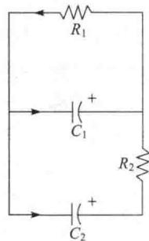
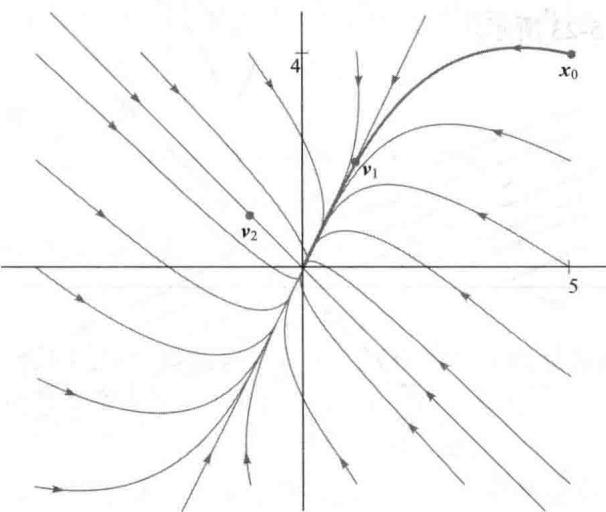
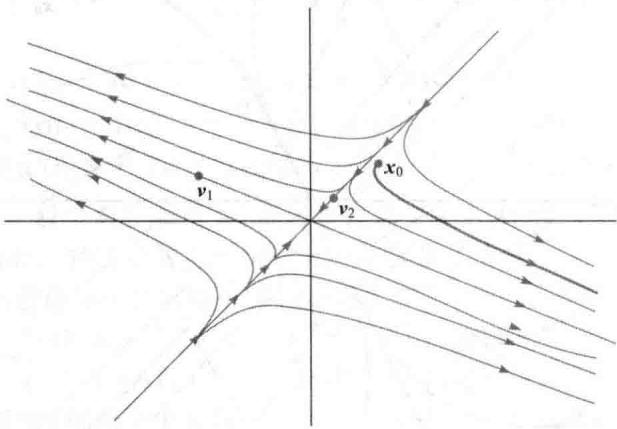
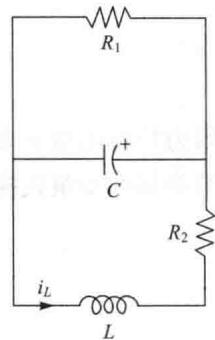
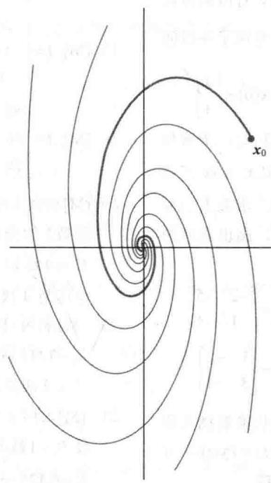
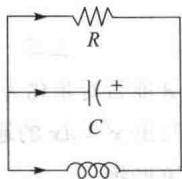

import Guide from '@/components/Guide.astro';
import Knowledge from '@/components/Knowledge.astro';
import Example from '@/components/Example.astro';
import Analysis from '@/components/Analysis.astro';
import Solution from '@/components/Solution.astro';
import Variant from '@/components/Variant.astro';
import Note from '@/components/Note.astro';
import Block from '@/components/Block.astro';
import Method from '@/components/Method.astro';
import Exercise from '@/components/Exercise.astro';

本节讲述在 5.6 节研究的差分方程的连续型类推. 在很多的应用问题中, 有些量随时间连续变化, 它们与下面的微分方程组有关:

$$
\begin{array}{l} x _ {1} ^ {\prime} = a _ {1 1} x _ {1} + \dots + a _ {1 n} x _ {n} \\ x _ {2} ^ {\prime} = a _ {2 1} x _ {1} + \dots + a _ {2 n} x _ {n} \\ \vdots \\ x _ {n} ^ {\prime} = a _ {n 1} x _ {1} + \dots + a _ {n n} x _ {n} \end{array}
$$

这里 $x_{1},\cdots,x_{n}$ 是关于 t 的可导函数，导数分别是 $x_{1}^{\prime},\cdots,x_{n}^{\prime},a_{ij}$ 是常数。该方程组最主要的特征是线性性质。为了便于理解，我们把方程组写成矩阵微分方程

$$
\boldsymbol {x} ^ {\prime} (t) = A \boldsymbol {x} (t)\tag{1}
$$

其中

$$
\boldsymbol {x} (t) = \left[ \begin{array}{c} x _ {1} (t) \\ \vdots \\ x _ {n} (t) \end{array} \right], \boldsymbol {x} ^ {\prime} (t) = \left[ \begin{array}{c} x _ {1} ^ {\prime} (t) \\ \vdots \\ x _ {n} ^ {\prime} (t) \end{array} \right], A = \left[ \begin{array}{c c c} a _ {1 1} & \dots & a _ {1 n} \\ \vdots & & \vdots \\ a _ {n 1} & \dots & a _ {n n} \end{array} \right]
$$

方程（1）的解是向量值函数，该函数定义在某实数区间，比如 $t \geqslant 0$ ，且满足方程（1）.

由于函数求导以及向量与矩阵相乘都是线性变换，故方程（1）是线性的。因此，若 $\pmb{u}$ 和 $\pmb{v}$ 是 $x' = Ax$ 的解，则 $cu + dv$ 同样也是 $x' = Ax$ 的解，因为

$$
(c \boldsymbol {u} + d \boldsymbol {v}) ^ {\prime} = c \boldsymbol {u} ^ {\prime} + d \boldsymbol {v} ^ {\prime} = c A \boldsymbol {u} + d A \boldsymbol {v} = A (c \boldsymbol {u} + d \boldsymbol {v})
$$

（工程师们将这个性质称为解的叠加）同样，恒等于零的函数也是方程（1）的（平凡）解。用第4章的术语，方程（1）的所有解的集合是值属于 $\mathbb{R}^n$ 的所有连续函数组成的集合的子空间。

有关微分方程的标准教材证明了方程（1）一定存在基础解系。假如 $A$ 是 $n \times n$ 矩阵，那么在基础解系中存在 $n$ 个线性无关的函数，使得方程（1）的每一个解可以唯一表示为这 $n$ 个函数的线性组合。即基础解系是方程（1）的所有解的集合的基，且解集是函数的 $n$ 维向量空间。若给定向量 $x_0$ ，那么初值问题就是构造一个（唯一）函数 $x$ ，满足 $x' = Ax$ 和 $x(0) = x_0$ 。

当 A 是对角矩阵时，可以用初等微积分求出（1）的解。例如考虑

$$
\left[ \begin{array}{l} x _ {1} ^ {\prime} (t) \\ x _ {2} ^ {\prime} (t) \end{array} \right] = \left[ \begin{array}{c c} 3 & 0 \\ 0 & - 5 \end{array} \right] \left[ \begin{array}{l} x _ {1} (t) \\ x _ {2} (t) \end{array} \right]\tag{2}
$$

即有

$$
\begin{array}{l} x _ {1} ^ {\prime} (t) = 3 x _ {1} (t) \\ x _ {2} ^ {\prime} (t) = - 5 x _ {2} (t) \end{array}\tag{3}
$$

因为每个函数的导数仅依赖于函数自身，而不是 $x_{1}(t)$ 和 $x_{2}(t)$ 的组合或“结合”，所以称方程组（2）是解耦的。由微积分，（3）的解是 $x_{1}(t) = c_{1}\mathrm{e}^{3t}$ 和 $x_{2}(t) = c_{2}\mathrm{e}^{-5t}$ ， $c_{1}$ 和 $c_{2}$ 为任意常数。（2）的每一个解都可以写成下列形式：

$$
\left[ \begin{array}{l} x _ {1} (t) \\ x _ {2} (t) \end{array} \right] = \left[ \begin{array}{l} c _ {1} \mathrm{e} ^ {3 t} \\ c _ {2} \mathrm{e} ^ {- 5 t} \end{array} \right] = c _ {1} \left[ \begin{array}{l} 1 \\ 0 \end{array} \right] \mathrm{e} ^ {3 t} + c _ {2} \left[ \begin{array}{l} 0 \\ 1 \end{array} \right] \mathrm{e} ^ {- 5 t}
$$

这个例子提示我们，对于一般的方程 $x' = Ax$ ，它的解可能是形如

$$
\boldsymbol {x} (t) = \boldsymbol {v} \mathrm{e} ^ {\lambda t}\tag{4}
$$

的函数的线性组合，其中 $\lambda$ 为数，v 为非零向量。（若 v=0，则函数 $x(t)$ 恒为零，且满足 $x'=Ax$ ）注意到

$$
\begin{array}{l l} {{x ^ {\prime} (t) = \lambda v \mathrm{e} ^ {\lambda t}}} & {{\text { 对 } x (t) \text { 求导，其中 } v \text { 是常向量 }}} \\ {{A x (t) = A v \mathrm{e} ^ {\lambda t}}} & {{\text { 式（4）两边同乘 } A}} \end{array}
$$

因为 $e^{\lambda t}$ 不可能为零，故 $x'(t)$ 等于 $Ax(t)$ 当且仅当 $\lambda v = Av$ ，即当且仅当 $\lambda$ 是 A 的特征值，而 v 是对应的特征向量。因此，每一对特征值-特征向量提供了 $x' = Ax$ 的一个解（4），这种解有时被称为微分方程的特征函数。特征函数为求解微分方程提供了方法。

<Example title="例 1">
图 5-21 显示的电路可以用微分方程描述:

$$
\left[ \begin{array}{l} x _ {1} ^ {\prime} (t) \\ x _ {2} ^ {\prime} (t) \end{array} \right] = \left[ \begin{array}{c c} - (1 / R _ {1} + 1 / R _ {2}) / C _ {1} & 1 / (R _ {2} C _ {1}) \\ 1 / (R _ {2} C _ {2}) & - 1 / (R _ {2} C _ {2}) \end{array} \right] \left[ \begin{array}{l} x _ {1} (t) \\ x _ {2} (t) \end{array} \right]
$$

其中 $x_{1}(t)$ 和 $x_{2}(t)$ 是在时间 $t$ 的两个电容器的电压。设电阻 $R_{1}$ 为1欧姆， $R_{2}$ 为2欧姆，电容器 $C_1$ 为1法拉， $C_2$ 为0.5法拉，并假设电容器 $C_1$ 的初始电压为5伏， $C_2$ 为4伏。求描述电压随时间变化的公式 $x_{1}(t)$ 和 $x_{2}(t)$ 。

<Solution title="解">
由给出的数据，令 $A = \begin{bmatrix} -1.5 & 0.5 \\ 1 & -1 \end{bmatrix}$ ， $\boldsymbol{x}(t) = \begin{bmatrix} x_1(t) \\ x_2(t) \end{bmatrix}$ ， $\boldsymbol{x}(0) = \begin{bmatrix} 5 \\ 4 \end{bmatrix}$ ，我们可以求得 $A$ 的特征值是 $\lambda_1 = -0.5$ 和 $\lambda_2 = -2$ ，对应的特征向量是

图 5-21

$$
\pmb {\nu} _ {1} = \left[ \begin{array}{c} 1 \\ 2 \end{array} \right], \quad \pmb {\nu} _ {2} = \left[ \begin{array}{c} - 1 \\ 1 \end{array} \right]
$$

特征函数 $\boldsymbol{x}_{1}(t)=\boldsymbol{v}_{1}\mathrm{e}^{\lambda_{1}t}$ 和 $\boldsymbol{x}_{2}(t)=\boldsymbol{v}_{2}\mathrm{e}^{\lambda_{2}t}$ 都满足 $x^{\prime}=Ax$ ， $x_{1}$ 和 $x_{2}$ 的任意线性组合亦同样满足 $x^{\prime}=Ax$ 令

$$
\boldsymbol {x} (t) = c _ {1} \boldsymbol {v} _ {1} \mathrm{e} ^ {\lambda_ {1} t} + c _ {2} \boldsymbol {v} _ {2} \mathrm{e} ^ {\lambda_ {2} t} = c _ {1} \left[ \begin{array}{l} 1 \\ 2 \end{array} \right] \mathrm{e} ^ {- 0. 5 t} + c _ {2} \left[ \begin{array}{l} - 1 \\ 1 \end{array} \right] \mathrm{e} ^ {- 2 t}
$$

记 $x(0) = c_{1}v_{1} + c_{2}v_{2}$ ，显然 $\pmb{v}_{1}$ 和 $\pmb{v}_{2}$ 是线性无关的，故 $\pmb{v}_{1}$ 和 $\pmb{v}_{2}$ 可生成 $\mathbb{R}^2$ ，令 $x(0) = x_0$ ，可求出 $c_{1}$ 和 $c_{2}$ 。事实上，由方程

$$
\begin{array}{c} c _ {1} \left[ \begin{array}{l} 1 \\ 2 \end{array} \right] + c _ {2} \left[ \begin{array}{c} - 1 \\ 1 \end{array} \right] = \left[ \begin{array}{l} 5 \\ 4 \end{array} \right] \\ \uparrow & \uparrow & \uparrow \\ v _ {1} & v _ {2} & x _ {0} \end{array}
$$

容易解出 $c_{1} = 3$ 和 $c_{2} = -2$ ，因此，微分方程 $\pmb{x}' = A\pmb{x}$ 的解是

$$
\boldsymbol {x} (t) = 3 \left[ \begin{array}{l} 1 \\ 2 \end{array} \right] \mathrm{e} ^ {- 0. 5 t} - 2 \left[ \begin{array}{c} - 1 \\ 1 \end{array} \right] \mathrm{e} ^ {- 2 t}
$$

或

$$
\left[ \begin{array}{l} x _ {1} (t) \\ x _ {2} (t) \end{array} \right] = \left[ \begin{array}{l} 3 \mathrm{e} ^ {- 0. 5 t} + 2 \mathrm{e} ^ {- 2 t} \\ 6 \mathrm{e} ^ {- 0. 5 t} - 2 \mathrm{e} ^ {- 2 t} \end{array} \right]
$$

图 5-22 显示了 $\boldsymbol{x}(t)$ 在 $t \geqslant 0$ 的图像或轨迹，一起显示的还有其他初始点的轨迹。两个特征函数 $x_{1}$ 和 $x_{2}$ 的轨迹包含在 A 的特征空间里。

<figure class="vp-figure">
  
  <figcaption>图5-22 原点是吸引子</figcaption>
</figure>

当 $t \to \infty$ 时，函数 $x_{1}$ 和 $x_{2}$ 都衰减为零，但 $x_{2}$ 的值要衰减得更快一些，因为它的指数要小一些。对应的特征向量 $\pmb{v}_{2}$ 的分量表明，若两个初始电压大小相等但符号相反，两个电容器的电压将会很快衰退为零。

在图 5-22 中，因为所有轨迹都趋近于原点，所以把原点称为动力系统的吸引子或汇。最大的吸引方向是在较小的特征值 $\lambda = -2$ 对应的特征函数 $x_{2}$ 的轨迹上（沿着过原点和 $v_{2}$ 的直线）。起点不在此直线的轨迹渐渐逼近过原点和 $v_{1}$ 的直线，因为它们在 $v_{2}$ 方向的分量衰减得很快。

如果例1的特征值是正数，则相应的轨迹形状相同，但轨迹背离原点.此时，称原点为动

力系统的排斥子或源，最大的排斥方向是在包含较大特征值对应的特征函数的轨迹的直线上.
</Solution>
</Example>

<Example title="例 2">
假设粒子在平面力场中运动，它的位置向量 $\pmb{x}$ 满足 $x^{\prime} = Ax$ 和 $x(0) = x_0$ ，其中

$$
A = \left[ \begin{array}{c c} 4 & - 5 \\ - 2 & 1 \end{array} \right], x _ {0} = \left[ \begin{array}{l} 2. 9 \\ 2. 6 \end{array} \right]
$$

求解初值问题并画出在 $t \geqslant 0$ 时粒子的轨迹.

<Solution title="解">
求出 A 的特征值为 $\lambda_{1}=6$ 和 $\lambda_{2}=-1$ ，相应的特征向量是

$$
\pmb {v} _ {1} = (- 5, 2) \text {和} \pmb {v} _ {2} = (1, 1)
$$

对任意的常数 $c_{1}$ 和 $c_{2}$ ，函数

$$
\pmb {x} (t) = c _ {1} \pmb {v} _ {1} \mathrm{e} ^ {\lambda_ {1} t} + c _ {2} \pmb {v} _ {2} \mathrm{e} ^ {\lambda_ {2} t} = c _ {1} \left[ \begin{array}{c} - 5 \\ 2 \end{array} \right] \mathrm{e} ^ {6 t} + c _ {2} \left[ \begin{array}{c} 1 \\ 1 \end{array} \right] \mathrm{e} ^ {- t}
$$

是 $x' = Ax$ 的解，我们要求 $c_{1}$ 和 $c_{2}$ 满足 $x(0) = x_{0}$ ，即

$$
c _ {1} \left[ \begin{array}{c} {- 5} \\ {2} \end{array} \right] + c _ {2} \left[ \begin{array}{c} {1} \\ {1} \end{array} \right] = \left[ \begin{array}{c} {2. 9} \\ {2. 6} \end{array} \right] \text {或} \left[ \begin{array}{c c} {- 5} & {1} \\ {2} & {1} \end{array} \right] \left[ \begin{array}{c} {c _ {1}} \\ {c _ {2}} \end{array} \right] = \left[ \begin{array}{c} {2. 9} \\ {2. 6} \end{array} \right]
$$

求得 $c_{1} = -3 / 70$ 和 $c_{2} = 188 / 70$ ，所求的函数是

$$
\boldsymbol {x} (t) = \frac {- 3}{7 0} \left[ \begin{array}{c} - 5 \\ 2 \end{array} \right] \mathrm{e} ^ {6 t} + \frac {1 8 8}{7 0} \left[ \begin{array}{l} 1 \\ 1 \end{array} \right] \mathrm{e} ^ {- t}
$$

x 和其他解的轨迹如图 5-23 所示.

<figure class="vp-figure">
  
  <figcaption>图5-23 原点是鞍点</figcaption>
</figure>

在图 5-23 中，原点称为动力系统的鞍点，因为有些轨迹开始时趋近原点，然后又改变方向远离原点而去。当矩阵 A 既有正的特征值，又有负的特征值时，就会出现鞍点。最大排斥方向在过原点和 $v_{1}$ 的直线上，对应于正的特征值，最大的吸引方向在过原点和 $v_{2}$ 的直线上，对应于负的特征值。
</Solution>
</Example>

## 解耦动力系统

在下面的讨论中将看到，当 $n \times n$ 矩阵 $A$ 有 $n$ 个线性无关的特征向量，即 $A$ 可对角化时，例1和例2所用的方法能够用来产生由 $x' = Ax$ 所描述的动力系统的基础解系.

设 $A$ 的特征函数是

$$
\boldsymbol {v} _ {1} \mathrm{e} ^ {\lambda_ {1} t}, \dots , \boldsymbol {v} _ {n} \mathrm{e} ^ {\lambda_ {n} t}
$$

$v_{1},\cdots,v_{n}$ 是线性无关的特征向量. 令 $P=\left[v_{1}\quad\cdots\quad v_{n}\right]$ , D 是主对角线元素为 $\lambda_{1},\cdots,\lambda_{n}$ 的对角矩阵, 因此有 $A=PDP^{-1}$ . 现做变量代换, 由

$$
\pmb {y} (t) = P ^ {- 1} \pmb {x} (t) \text {或} \pmb {x} (t) = P \pmb {y} (t)
$$

定义一个新的函数 y. 方程 $x(t)=Py(t)$ 表明 $y(t)$ 是 $x(t)$ 关于特征向量基的坐标向量. 代入 $x'=Ax$ ，有

$$
\frac {\mathrm{d}}{\mathrm{d} t} (P \mathbf {y}) = A (P \mathbf {y}) = (P D P ^ {- 1}) P \mathbf {y} = P D \mathbf {y}\tag{5}
$$

由于 P 是常数矩阵，（5）的左边是 $Py'$ 。在（5）的两边左乘 $P^{-1}$ ，得 $y' = Dy$ 或

$$
\left[ \begin{array}{c} y _ {1} ^ {\prime} (t) \\ y _ {2} ^ {\prime} (t) \\ \vdots \\ y _ {n} ^ {\prime} (t) \end{array} \right] = \left[ \begin{array}{c c c c} \lambda_ {1} & 0 & \dots & 0 \\ 0 & \lambda_ {2} & \dots & \vdots \\ \vdots & & \ddots & 0 \\ 0 & \dots & 0 & \lambda_ {n} \end{array} \right] \left[ \begin{array}{c} y _ {1} (t) \\ y _ {2} (t) \\ \vdots \\ y _ {n} (t) \end{array} \right]
$$

因为数值函数 $y_{k}$ 的导数 $y_{n}^{\prime}(t)$ 仅依赖于 $y_{k}$ ，故从 x 到 y 的变量代换解耦了微分方程组。（回忆 5.6 节类似的变量代换。）由 $y_{1}^{\prime} = \lambda_{1}y_{1}$ ，有 $y_{1}(t) = c_{1}\mathrm{e}^{\lambda_{1}t}$ ，对 $y_{2}, \cdots, y_{n}$ 也有类似的公式。因此

$$
\pmb {y} (t) = \left[ \begin{array}{c} {{c _ {1} \mathbf {e} ^ {\lambda_ {1} t}}} \\ {{\vdots}} \\ {{c _ {n} \mathbf {e} ^ {\lambda_ {n} t}}} \end{array} \right], \text {其中} \left[ \begin{array}{c} {{c _ {1}}} \\ {{\vdots}} \\ {{c _ {n}}} \end{array} \right] = \pmb {y} (0) = P ^ {- 1} \pmb {x} (0) = P ^ {- 1} \pmb {x} _ {0}
$$

为了得到原方程组的通解 x，计算

$$
\begin{array}{r l} \boldsymbol {x} (t) & = P \boldsymbol {y} (t) = [ \boldsymbol {v} _ {1} \dots \boldsymbol {v} _ {n} ] \boldsymbol {y} (t) \\ & = c _ {1} \boldsymbol {v} _ {1} \mathrm{e} ^ {\lambda_ {1} t} + \dots + c _ {n} \boldsymbol {v} _ {n} \mathrm{e} ^ {\lambda_ {n} t} \end{array}
$$

这就是在例1求得的特征函数的扩展.

## 复特征值

在例 3 中，实矩阵 A 有共轭复特征值 $\lambda$ 和 $\overline{\lambda}$ ，对应的特征向量为 v 和 $\overline{v}$ （回顾 5.5 节，实矩阵的复特征值和特征向量共轭出现）。因此 $x' = Ax$ 的两个解是

$$
\pmb {x} _ {1} (t) = \pmb {v} \mathrm{e} ^ {\lambda t} \quad \text {和} \quad \pmb {x} _ {2} (t) = \overline {{{{\pmb {v}}}}} \mathrm{e} ^ {\overline {{{{\lambda}}}} t}\tag{6}
$$

通过用复指数函数的幂级数表示可以证明 $\boldsymbol{x}_{2}(t)=\overline{\boldsymbol{x}_{1}(t)}$ 。虽然这些复特征函数对某些计算（尤其是电子工程）是方便的，但对多数的实际应用而言，实函数要更合适一些。所幸的是， $x_{1}$ 的实部和虚部是 $x^{\prime}=Ax$ 的（实数）解，因为它们是形如（6）的解的线性组合：

$$
\operatorname{Re} \left(\nu \mathrm{e} ^ {\lambda t}\right) = \frac {1}{2} \left[ x _ {1} (t) + \overline {{x _ {1} (t)}} \right], \quad \operatorname{Im} \left(\nu \mathrm{e} ^ {\lambda t}\right) = \frac {1}{2 \mathrm{i}} \left[ x _ {1} (t) - \overline {{x _ {1} (t)}} \right]
$$

为理解 $\mathrm{Re}(\nu e^{\lambda t})$ 的本质，回忆在微积分中，对任意的数 $x$ ，指数函数 $\mathbf{e}^x$ 可以通过幂级数计算：

$$
\mathrm{e} ^ {x} = 1 + x + \frac {1}{2 !} x ^ {2} + \dots + \frac {1}{n !} x ^ {n} + \dots
$$

当 $\lambda$ 为复数时，可利用该级数定义 $e^{\lambda t}$ :

$$
\mathrm{e} ^ {\lambda t} = 1 + (\lambda t) + \frac {1}{2 !} (\lambda t) ^ {2} + \dots + \frac {1}{n !} (\lambda t) ^ {n} + \dots
$$

记 $\lambda = a + bi$ （a 和 b 是实数），对余弦和正弦函数利用相似的幂级数，可以证明

$$
\mathrm{e} ^ {(a + b \mathrm{i}) t} = \mathrm{e} ^ {a t} \cdot \mathrm{e} ^ {\mathrm{i} b t} = \mathrm{e} ^ {a t} (\cos b t + \mathrm{i} \sin b t)\tag{7}
$$

因此

$$
\begin{array}{r l} \boldsymbol {v} \mathrm{e} ^ {\lambda t} & = (\operatorname{Re} \boldsymbol {v} + \mathrm{i} \operatorname{Im} \boldsymbol {v}) \cdot \mathrm{e} ^ {a t} (\cos b t + \mathrm{i} \sin b t) \\ & = [ (\operatorname{Re} \boldsymbol {v}) \cos b t - (\operatorname{Im} \boldsymbol {v}) \sin b t ] \mathrm{e} ^ {a t} \\ & + \mathrm{i} [ (\operatorname{Re} \boldsymbol {v}) \sin b t + (\operatorname{Im} \boldsymbol {v}) \cos b t ] \mathrm{e} ^ {a t} \end{array}
$$

故 $x' = Ax$ 的两个实解是

$$
\begin{array}{l} \mathbf {y} _ {1} (t) = \operatorname{Re} \mathbf {x} _ {1} (t) = [ (\operatorname{Re} \nu) \cos b t - (\operatorname{Im} \nu) \sin b t ] \mathrm{e} ^ {a t} \\ \mathbf {y} _ {2} (t) = \operatorname{Im} \mathbf {x} _ {1} (t) = [ (\operatorname{Re} \nu) \sin b t + (\operatorname{Im} \nu) \cos b t ] \mathrm{e} ^ {a t} \end{array}
$$

可以证明，函数 $y_{1}$ 和 $y_{2}$ 是线性无关的函数（当 $b \neq 0$ 时）.

<Example title="例 3">
图 5-24 的电路可以用下面的方程描述:

$$
\left[ \begin{array}{l} i _ {L} ^ {\prime} \\ v _ {C} ^ {\prime} \end{array} \right] = \left[ \begin{array}{c c} - R _ {2} / L & - 1 / L \\ 1 / C & - 1 / (R _ {1} C) \end{array} \right] \left[ \begin{array}{l} i _ {L} \\ v _ {C} \end{array} \right]
$$

其中 $i_{L}$ 是通过电感 $L$ 的电流， $v_{C}$ 是电容器 $C$ 的电压。设 $R_{1}$ 为5欧姆， $R_{2}$ 为0.8欧姆， $C$ 为0.1法拉， $L$ 为0.4亨利，若通过电感的初始电流为3安培， $C$ 的初始电压为3伏，求计算 $i_{L}$ 和 $v_{C}$ 的公式。

<Solution title="解">
由所给的数据，得 $A = \begin{bmatrix} -2 & -2.5 \\ 10 & -2 \end{bmatrix}$ 和 $x_0 = \begin{bmatrix} 3 \\ 3 \end{bmatrix}$ . 用5.5节的方法求得特征值 $\lambda = -2 + 5\mathrm{i}$ 及对应的特征向量 $\pmb{v}_1 = \begin{bmatrix} \mathrm{i} \\ 2 \end{bmatrix}$ . $x' = Ax$ 的复数解是

图 5-24

$$
\pmb {x} _ {1} (t) = \left[ \begin{array}{l} {\mathbf {i}} \\ {2} \end{array} \right] \mathbf {e} ^ {(- 2 + 5 \mathrm{i}) t} \text {和} \pmb {x} _ {2} (t) = \left[ \begin{array}{l} {- \mathbf {i}} \\ {2} \end{array} \right] \mathbf {e} ^ {(- 2 - 5 \mathrm{i}) t}
$$

的复线性组合. 利用（7）式得

$$
\boldsymbol {x} _ {1} (t) = \left[ \begin{array}{l} \mathrm{i} \\ 2 \end{array} \right] \mathrm{e} ^ {- 2 t} (\cos 5 t + \mathrm{i} \sin 5 t)
$$

取 $x_{1}(t)$ 的实部和虚部，可以得到实数解：

$$
\mathbf {y} _ {1} (t) = \left[ \begin{array}{l} - \sin 5 t \\ 2 \cos 5 t \end{array} \right] \mathrm{e} ^ {- 2 t}, \mathbf {y} _ {2} (t) = \left[ \begin{array}{l} \cos 5 t \\ 2 \sin 5 t \end{array} \right] \mathrm{e} ^ {- 2 t}
$$

因为 $y_{1}$ 和 $y_{2}$ 是线性无关的函数，故它们形成 $x' = Ax$ 的二维实解向量空间的基。因此，通解是

$$
\boldsymbol {x} (t) = c _ {1} \left[ \begin{array}{l} - \sin 5 t \\ 2 \cos 5 t \end{array} \right] \mathrm{e} ^ {- 2 t} + c _ {2} \left[ \begin{array}{l} \cos 5 t \\ 2 \sin 5 t \end{array} \right] \mathrm{e} ^ {- 2 t}
$$

为满足 $\boldsymbol{x}(0)=\begin{bmatrix}3\\ 3\end{bmatrix}$ ，要求 $c_{1}\begin{bmatrix}0\\ 2\end{bmatrix}+c_{2}\begin{bmatrix}1\\ 0\end{bmatrix}=\begin{bmatrix}3\\ 3\end{bmatrix}$ ，解得 $c_{1}=1.5$ 和 $c_{2}=3$ 。因此

$$
\boldsymbol {x} (t) = 1. 5 \left[ \begin{array}{l} - \sin 5 t \\ 2 \cos 5 t \end{array} \right] \mathrm{e} ^ {- 2 t} + 3 \left[ \begin{array}{l} \cos 5 t \\ 2 \sin 5 t \end{array} \right] \mathrm{e} ^ {- 2 t}
$$

或者

$$
\left[ \begin{array}{c} i _ {L} (t) \\ v _ {C} (t) \end{array} \right] = \left[ \begin{array}{c} - 1. 5 \sin 5 t + 3 \cos 5 t \\ 3 \cos 5 t + 6 \sin 5 t \end{array} \right] e ^ {- 2 t}
$$

见图 5-25.

<figure class="vp-figure">
  
  <figcaption>图5-25 原点是螺线极点</figcaption>
</figure>

在图 5-25 中，原点称为动力系统的螺线极点．旋转是由复特征值产生的正弦和余弦函数产生的．因为系数 $e^{-2t}$ 趋于零，故轨迹往里旋转．注意，-2 是例 3 中的特征值的实部．当 A 的复特征值的实部为正数时，轨迹往外旋转．当特征值的实部为零时，轨迹形成绕原点的椭圆．
</Solution>
</Example>

<Block title="练习题">
$3 \times 3$ 实矩阵 $A$ 有特征值 $-0.5, 0.2 + 0.3\mathrm{i}$ 和 $0.2 - 0.3\mathrm{i}$ ，对应的特征向量为

$$
\boldsymbol {v} _ {1} = \left[ \begin{array}{c} 1 \\ - 2 \\ 1 \end{array} \right], \boldsymbol {v} _ {2} ^ {\prime} = \left[ \begin{array}{c} 1 + 2 \mathrm{i} \\ 4 \mathrm{i} \\ 2 \end{array} \right], \quad \boldsymbol {v} _ {3} = \left[ \begin{array}{c} 1 - 2 \mathrm{i} \\ - 4 \mathrm{i} \\ \tilde {2} \end{array} \right]
$$

1. 利用复矩阵，A 能否对角化为 D，即 $A = PDP^{-1}$ .

2. 用复特征函数写出 $x' = Ax$ 的通解，然后再求出实的通解.

3. 描述典型的轨迹形状.
</Block>

<Block title="习题5.7">
1. 在平面力场运动的粒子的位置向量 x 满足 $x' = Ax \cdot 2 \times 2$ 矩阵 A 有特征值 4 和 2，对应的特征向量为 $v_{1} = \begin{bmatrix} -3 \\ 1 \end{bmatrix}, v_{2} = \begin{bmatrix} -1 \\ 1 \end{bmatrix}$ . 假设 $\boldsymbol{x}(0) = \begin{bmatrix} -6 \\ 1 \end{bmatrix}$ ，求粒子在时刻 t 的位置.

2. 设 $2 \times 2$ 矩阵 A 的特征值为 -3 和 -1，对应的特征向量为 $v_{1} = \begin{bmatrix} -1 \\ 1 \end{bmatrix}$ ， $v_{2} = \begin{bmatrix} 1 \\ 1 \end{bmatrix}$ ， $x(t)$ 是粒子在时间 t 的位置。求初值问题 $x' = Ax$ ， $x(0) = \begin{bmatrix} 2 \\ 3 \end{bmatrix}$ 。在习题 3\~6 中，对 $t \geqslant 0, x(0) = (3, 2)$ ，求解初值问题 $x'(t) = Ax(t)$ 。把原点分类为由 $x' = Ax$ 描述的动力系统的吸引子、排斥子或鞍点。求最大的吸引方向或排斥方向。当原点是鞍点时，画出典型的轨迹。
3. $A=\begin{bmatrix}2 & 3 \\ -1 & -2\end{bmatrix}$ 4. $A=\begin{bmatrix}-2 & -5 \\ 1 & 4\end{bmatrix}$ 5. $A=\begin{bmatrix}7 & -1 \\ 3 & 3\end{bmatrix}$ 6. $A=\begin{bmatrix}1 & -2 \\ 3 & -4\end{bmatrix}$

在习题 7 和习题 8 中，做变量代换解耦方程 $x' = Ax$ 。求出 P 和 D ，写出方程 $x(t) = Py(t)$ ，并写出得到分离系统 $y' = Dy$ 的计算过程。

7. 习题 5 的矩阵 A.

8. 习题6的矩阵 $A$ .

在习题 9\~18 中，求 $x' = Ax$ 的包含复特征函数的通解，然后求得实通解，并描述典型轨迹的形状.
9. $A=\begin{bmatrix}-3 & 2 \\ -1 & -1\end{bmatrix}$ 10. $A=\begin{bmatrix}3 & 1 \\ -2 & 1\end{bmatrix}$ 11. $A=\begin{bmatrix}-3 & -9 \\ 2 & 3\end{bmatrix}$ 12. $A=\begin{bmatrix}-7 & 10 \\ -4 & 5\end{bmatrix}$ 13. $A=\begin{bmatrix}4 & -3 \\ 6 & -2\end{bmatrix}$ 14. $A=\begin{bmatrix}-2 & 1 \\ -8 & 2\end{bmatrix}$

15. [M] $A = \begin{bmatrix} -8 & -12 & -6 \\ 2 & 1 & 2 \\ 7 & 12 & 5 \end{bmatrix}$

16. [M] $A = \begin{bmatrix} -6 & -11 & 16 \\ 2 & 5 & -4 \\ -4 & -5 & 10 \end{bmatrix}$

17. [M] $A = \begin{bmatrix} 30 & 64 & 23 \\ -11 & -23 & -9 \\ 6 & 15 & 4 \end{bmatrix}$

18. [M] $A = \begin{bmatrix} 53 & -30 & -2 \\ 90 & -52 & -3 \\ 20 & -10 & 2 \end{bmatrix}$

19. [M]求例 1 中电路的电压 $v_{1}$ 和 $v_{2}$ （作为时间 t 的函数）的公式，设 $R_{1}=1/5$ 欧姆， $R_{2}=1/3$ 欧姆， $C_{1}=4$ 法拉， $C_{2}=3$ 法拉，每个电容器的初始电压为 4 伏.

20. [M] 求例 1 中电路的电压 $v_{1}$ 和 $v_{2}$ 的公式，设 $R_{1}=1/15$ 欧姆， $R_{2}=1/3$ 欧姆， $C_{1}=9$ 法拉， $C_{2}=2$ 法拉，每个电容器的初始电压为 3 伏.

21. [M]求例3中电路的电流 $i_{L}$ 和电压 $v_{C}$ 的公式，设 $R_{1}=1$ 欧姆， $R_{2}=0.125$ 欧姆，C=0.2法拉，L=0.125亨利，初始电流为0安培，初始电压为15伏.

22.[M]下图的电路由下列方程描述： $\left[\begin{matrix}i_{L}^{\prime}\\ v_{C}^{\prime}\end{matrix}\right]=\left[\begin{matrix}0&1/L\\ -1/C&-1/(RC)\end{matrix}\right]\left[\begin{matrix}i_{L}\\ v_{C}\end{matrix}\right]$ 其中， $i_{L}$ 是通过电感 L 的电流， $v_{C}$ 是电容器 C 的电压。设 R=0.5 欧姆，C=2.5 法拉，L=0.5 亨利，初始电流为 0 安培，初始电压为 12 伏，求计算 $i_{L}$ 和 $v_{C}$ 的公式。

  
L
</Block>

<Block title="练习题答案">
1. $A$ 可对角化，因为 $A$ 有三个不同的特征值。当使用复数时，5.1节的定理2以及5.3节的定理5仍然有效（证明基本上与实数相同）。

2. 通解具有以下形式：

$$
\boldsymbol {x} (t) = c _ {1} \left[ \begin{array}{l} 1 \\ - 2 \\ 1 \end{array} \right] \mathrm{e} ^ {- 0. 5 t} + c _ {2} \left[ \begin{array}{l} 1 + 2 \mathrm{i} \\ 4 \mathrm{i} \\ 2 \end{array} \right] \mathrm{e} ^ {(0. 2 + 0. 3 \mathrm{i}) t} + c _ {3} \left[ \begin{array}{l} 1 - 2 \mathrm{i} \\ - 4 \mathrm{i} \\ 2 \end{array} \right] \mathrm{e} ^ {(0. 2 - 0 3 \mathrm{i}) t}
$$

其中 $c_{1}, c_{2}, c_{3}$ 为任意复数。 $\pmb{x}(t)$ 的第一项是实的，其他两个实解可以用 $\pmb{x}(t)$ 的第二项

$$
\left[ \begin{array}{c} 1 + 2 \mathrm{i} \\ 4 \mathrm{i} \\ 2 \end{array} \right] \mathrm{e} ^ {0. 2 t} (\cos 0. 3 t + \mathrm{i} \sin 0. 3 t)
$$

的实部和虚部来产生. 实通解为

$$
c _ {1} \left[ \begin{array}{l} 1 \\ - 2 \\ 1 \end{array} \right] e ^ {- 0. 5 t} + c _ {2} \left[ \begin{array}{c} \cos 0. 3 t - 2 \sin 0. 3 t \\ - 4 \sin 0. 3 t \\ 2 \cos 0. 3 t \end{array} \right] e ^ {0. 2 t} + c _ {3} \left[ \begin{array}{c} \sin 0. 3 t + 2 \cos 0. 3 t \\ 4 \cos 0. 3 t \\ 2 \sin 0. 3 t \end{array} \right] e ^ {0. 2 t}
$$

其中 $c_{1}, c_{2}, c_{3}$ 为实数.

3. 因为有负的指数因子，故当 $c_{2} = c_{3} = 0$ 时的任一解逼近原点，其他的解有无界的分量，轨迹朝外旋转。小心不要将这个问题错当成5.6节的问题。在5.6节中，逼近原点的条件是特征值的绝对值小于1，使得 $\left|\lambda\right|^k \to 0$ 。这里的条件是特征值的实部必须是负的，使得 $\mathrm{e}^{\lambda t} \to 0$ 。
</Block>
