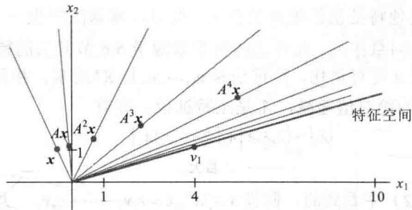
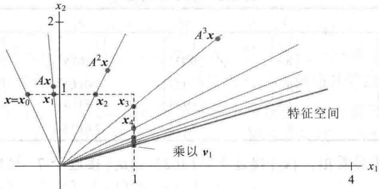

import Guide from '@/components/Guide.astro';
import Knowledge from '@/components/Knowledge.astro';
import Example from '@/components/Example.astro';
import Analysis from '@/components/Analysis.astro';
import Solution from '@/components/Solution.astro';
import Variant from '@/components/Variant.astro';
import Note from '@/components/Note.astro';
import Block from '@/components/Block.astro';
import Method from '@/components/Method.astro';
import Exercise from '@/components/Exercise.astro';

在线性代数的科学应用中，很少能精确知道特征值。所幸的是，一个较精确的数值近似通常能达到令人满意的效果。实际上，某些应用只需要粗略估计最大特征值。下面介绍的第1个算法很适合这种情况。同样，它为快速估计其他特征值的更有效的方法提供了基础。

## 幂算法

幂算法适用于 $n \times n$ 矩阵 $A$ 有严格占优特征值（亦称主特征值） $\lambda_1$ 的情况。 $\lambda_1$ 为主特征值的意思是 $\lambda_1$ 的绝对值比其他特征值的绝对值都大。此时，幂算法产生一个近似 $\lambda_1$ 的数列和一个近似对应的主特征向量的向量序列。此方法的背景来源于5.6节开头的特征向量分解。

为简单起见，假设 A 可对角化，特征向量 $v_{1}, \cdots, v_{n}$ 是 $R^{n}$ 的基，并且 $v_{1}, \cdots, v_{n}$ 已经过排列，使对应的特征值 $\lambda_{1}, \cdots, \lambda_{n}$ 的绝对值递减， $\lambda_{1}$ 是主特征值，即有

$$
\begin{array}{c} {\left| \lambda_ {1} \right| > \left| \lambda_ {2} \right| \geqslant \left| \lambda_ {3} \right| \geqslant \dots \geqslant \left| \lambda_ {n} \right|} \\ {\uparrow} \\ {\text {严格大}} \end{array}\tag{1}
$$

就像我们在 5.6 节式（2）中看到的，假设 $x \in R^{n}, x = c_{1}v_{1} + \cdots + c_{n}v_{n}$ ，那么

$$
A ^ {k} \boldsymbol {x} = c _ {1} \left(\lambda_ {1}\right) ^ {k} \boldsymbol {v} _ {1} + c _ {2} \left(\lambda_ {2}\right) ^ {k} \boldsymbol {v} _ {2} + \dots + c _ {n} \left(\lambda_ {n}\right) ^ {k} \boldsymbol {v} _ {n} (k = 1, 2, \dots)
$$

假设 $c_{1} \neq 0$ ，等式除于 $(\lambda_{1})^{k}$

$$
\frac {1}{(\lambda_ {1}) ^ {k}} A ^ {k} \boldsymbol {x} = c _ {1} \boldsymbol {v} _ {1} + c _ {2} \left(\frac {\lambda_ {2}}{\lambda_ {1}}\right) ^ {k} \boldsymbol {v} _ {2} + \dots + c _ {n} \left(\frac {\lambda_ {n}}{\lambda_ {1}}\right) ^ {k} \boldsymbol {v} _ {n} (k = 1, 2, \dots)\tag{2}
$$

由（1），所有分数 $\lambda_{2}/\lambda_{1},\cdots,\lambda_{n}/\lambda_{1}$ 的值都小于 1，因此，它们的幂趋于零。故

$$
k \to \infty
$$

$$
\left(\lambda_ {1}\right) ^ {- k} A ^ {k} \boldsymbol {x} \rightarrow c _ {1} \boldsymbol {v} _ {1}\tag{3}
$$

因此对足够大的 $k$ ， $A^{k}\pmb{x}$ 的数量倍的方向几乎与特征向量 $c_{1}\pmb{v}_{1}$ 的方向相同．由于正的数量倍不会改变向量的方向，因此若给定 $c_{1} \neq 0$ ，则 $A^{k}\pmb{x}$ 的方向几乎与 $\pmb{v}_{1}$ 或 $-\pmb{v}_{1}$ 一致.

<Example title="例 1">
设 $A=\begin{bmatrix}1.8&0.8\\ 0.2&1.2\end{bmatrix},v_{1}=\begin{bmatrix}4\\ 1\end{bmatrix},x=\begin{bmatrix}-0.5\\ 1\end{bmatrix}$ ，那么 A 的特征值是 2 和 1， $\lambda_{1}=2$ 的特征空间是过原点和 $v_{1}$ 的直线。对 $k=0,\cdots,8$ ，计算 $A^{k}x$ 并画出过原点和 $A^{k}x$ 的直线。当 k 增大时会出现什么情况？

<Solution title="解">
开头三项的计算是

$$
A \boldsymbol {x} = \left[ \begin{array}{l l} 1. 8 & 0. 8 \\ 0. 2 & 1. 2 \end{array} \right] \left[ \begin{array}{c} - 0. 5 \\ 1 \end{array} \right] = \left[ \begin{array}{c} - 0. 1 \\ 1. 1 \end{array} \right]
$$

$$
A ^ {2} \boldsymbol {x} = A (A \boldsymbol {x}) = \left[ \begin{array}{l l} 1. 8 & 0. 8 \\ 0. 2 & 1. 2 \end{array} \right] \left[ \begin{array}{c} - 0. 1 \\ 1. 1 \end{array} \right] = \left[ \begin{array}{l} 0. 7 \\ 1. 3 \end{array} \right]
$$

$$
A ^ {3} \boldsymbol {x} = A (A ^ {2} \boldsymbol {x}) = \left[ \begin{array}{l l} 1. 8 & 0. 8 \\ 0. 2 & 1. 2 \end{array} \right] \left[ \begin{array}{l} 0. 7 \\ 1. 3 \end{array} \right] = \left[ \begin{array}{l} 2. 3 \\ 1. 7 \end{array} \right]
$$

其他项的计算在表 5-1 中给出.

表 5-1 向量的迭代

<table><tr><td>k</td><td>0</td><td>1</td><td>2</td><td>3</td><td>4</td><td>5</td><td>6</td><td>7</td><td>8</td></tr><tr><td> $A^{k}x$ </td><td> $\begin{bmatrix}-0.5 \\ 1\end{bmatrix}$ </td><td> $\begin{bmatrix}-0.1 \\ 1.1\end{bmatrix}$ </td><td> $\begin{bmatrix}0.7 \\ 1.3\end{bmatrix}$ </td><td> $\begin{bmatrix}2.3 \\ 1.7\end{bmatrix}$ </td><td> $\begin{bmatrix}5.5 \\ 2.5\end{bmatrix}$ </td><td> $\begin{bmatrix}11.9 \\ 4.1\end{bmatrix}$ </td><td> $\begin{bmatrix}24.7 \\ 7.3\end{bmatrix}$ </td><td> $\begin{bmatrix}50.3 \\ 13.7\end{bmatrix}$ </td><td> $\begin{bmatrix}101.5 \\ 26.5\end{bmatrix}$ </td></tr></table>

图 5-26 显示了向量 x, Ax, $A^{2}x$ , $A^{3}x$ , $A^{4}x$ . 其余向量太长难于显示, 但画出的线段显示出这些向量的方向. 事实上, 我们真正想看到的是向量的方向而不是向量本身. 这些直线看起来是逼近表示 $v_{1}$ 生成的特征空间的直线. 更确切地说, 由 $A^{k}x$ 确定的直线（子空间）与由 $v_{1}$ 确定的直线（特征空间）之间的夹角（当 $k \to \infty$ 时）趋于零.

<figure class="vp-figure">
  
  <figcaption>图 5-26 由 x, Ax, $A^{2}x, \cdots, A^{7}x$ 确定的方向</figcaption>
</figure>

当 $c_{1} \neq 0$ 时，我们可以对（3）中的向量 $(\lambda_{1})^{-k} A^{k} x$ 倍乘，使它们收敛于 $c_{1} v_{1}$ ，但不能对 $A^{k} x$ 作这种倍乘，因为我们并不知道 $\lambda_{1}$ 。不过可以倍乘 $A^{k} x$ ，使它的最大分量为 1。这样，所得序列 $\{x_{k}\}$ 将收敛于 $v_{1}$ 的倍数， $v_{1}$ 的倍数的最大分量也是 1。图 5-27 显示了例 1 的倍乘序列。我们还可以通过序列 $\{x_{k}\}$ 来估计特征值 $\lambda_{1}$ 。当 $x_{k}$ 接近于 $\lambda_{1}$ 的特征向量时，向量 $Ax_{k}$ 也接近于 $\lambda_{1} x_{k}$ ，即 $Ax_{k}$ 的每一分量接近于 $\lambda_{1}$ 与 $x_{k}$ 相应分量的乘积。因为 $x_{k}$ 的最大分量是 1，故 $Ax_{k}$ 的最大分量接近于 $\lambda_{1}$ 。（这些结论的证明省略了。）

<figure class="vp-figure">
  
  <figcaption>图 5-27 x, Ax, $A^{2}x$ , $\cdots$ , $A^{7}x$ 的倍乘</figcaption>
</figure>
</Solution>
</Example>

## 估计严格占优特征值的幂算法

1. 选择一个最大分量为 1 的初始向量 $x_{0}$

2. 对 $k=0,1,\cdots,$ a. 计算 $Ax_{k}$ .
b. 设 $\mu_{k}$ 是 $Ax_{k}$ 中绝对值最大的一个分量.
c. 计算 $\boldsymbol{x}_{k+1}=(1/\mu_{k})\boldsymbol{A}\boldsymbol{x}_{k}$ .

3. 几乎对所有选择的 $x_{0}$ ，序列 $\{\mu_{k}\}$ 近似于主特征值，而序列 $\{x_{k}\}$ 近似于对应的特征向量.

<Example title="例 2">
设 $A = \begin{bmatrix} 6 & 5 \\ 1 & 2 \end{bmatrix}, x_0 = \begin{bmatrix} 0 \\ 1 \end{bmatrix}$ . 应用幂算法求 $A$ 的主特征值和对应的特征向量的近似值，计算到 $k = 5$ .

<Solution title="解">
本例及下一个例子的计算用 MATLAB 完成，虽然这里看到的有效数字较少，但计算精确到 16 位。先计算 $Ax_0$ ，然后将 $Ax_0$ 的最大分量 $\mu_0$ 单位化：

$$
A \pmb {x} _ {0} = \left[ \begin{array}{l l} 6 & 5 \\ 1 & 2 \end{array} \right] \left[ \begin{array}{l} 0 \\ 1 \end{array} \right] = \left[ \begin{array}{l} 5 \\ 2 \end{array} \right], \mu_ {0} = 5
$$

用 $1 / \mu_0$ 倍乘 $Ax_{0}$ 得到 $\pmb{x}_{1}$ ，计算 $Ax_{1}$ ，并将 $Ax_{1}$ 的最大分量单位化：

$$
\boldsymbol {x} _ {1} = \frac {1}{\mu_ {0}} A \boldsymbol {x} _ {0} = \frac {1}{5} \left[ \begin{array}{l} 5 \\ 2 \end{array} \right] = \left[ \begin{array}{l} 1 \\ 0. 4 \end{array} \right]
$$

$$
A \pmb {x} _ {1} = \left[ \begin{array}{l l} 6 & 5 \\ 1 & 2 \end{array} \right] \left[ \begin{array}{l} 1 \\ 0. 4 \end{array} \right] = \left[ \begin{array}{l} 8 \\ 1. 8 \end{array} \right], \mu_ {1} = 8
$$

用 $1 / \mu_{1}$ 倍乘 $Ax_{1}$ 得到 $\pmb{x}_{2}$ ，计算 $Ax_{2}$ ，将 $Ax_{2}$ 的最大分量单位化：

$$
\boldsymbol {x} _ {2} = \frac {1}{\mu_ {1}} A \boldsymbol {x} _ {1} = \frac {1}{8} \left[ \begin{array}{l} 8 \\ 1. 8 \end{array} \right] = \left[ \begin{array}{l} 1 \\ 0. 2 2 5 \end{array} \right]
$$

$$
A \pmb {x} _ {2} = \left[ \begin{array}{l l} 6 & 5 \\ 1 & 2 \end{array} \right] \left[ \begin{array}{l} 1 \\ 0. 2 2 5 \end{array} \right] = \left[ \begin{array}{l} 7. 1 2 5 \\ 1. 4 5 0 \end{array} \right], \mu_ {2} = 7. 1 2 5
$$

用 $1 / \mu_{2}$ 倍乘 $Ax_{2}$ 得到 $x_{3}$ ，一直重复做下去，用MATLAB计算的前5次迭代结果列在表5-2中.

表 5-2 例 2 的幂算法

<table><tr><td>k</td><td>0</td><td>1</td><td>2</td><td>3</td><td>4</td><td>5</td></tr><tr><td> $x_{k}$ </td><td> $\begin{bmatrix} 0 \\ 1 \end{bmatrix}$ </td><td> $\begin{bmatrix} 1 \\ 0.4 \end{bmatrix}$ </td><td> $\begin{bmatrix} 1 \\ 0.225 \end{bmatrix}$ </td><td> $\begin{bmatrix} 1 \\ 0.2035 \end{bmatrix}$ </td><td> $\begin{bmatrix} 1 \\ 0.2005 \end{bmatrix}$ </td><td> $\begin{bmatrix} 1 \\ 0.20007 \end{bmatrix}$ </td></tr><tr><td> $A{x}_{k}$ </td><td> $\begin{bmatrix} 5 \\ 2 \end{bmatrix}$ </td><td> $\begin{bmatrix} 8 \\ 1.8 \end{bmatrix}$ </td><td> $\begin{bmatrix} 7.125 \\ 1.450 \end{bmatrix}$ </td><td> $\begin{bmatrix} 7.0175 \\ 1.4070 \end{bmatrix}$ </td><td> $\begin{bmatrix} 7.0025 \\ 1.4010 \end{bmatrix}$ </td><td> $\begin{bmatrix} 7.00036 \\ 1.40014 \end{bmatrix}$ </td></tr><tr><td> $\mu_{k}$ </td><td>5</td><td>8</td><td>7.125</td><td>7.0175</td><td>7.0025</td><td>7.00036</td></tr></table>

从表 5-2 的数据明显看出， $\{x_{k}\}$ 接近于 $(1,0.2)$ ， $\{\mu_{k}\}$ 接近于 7。这样， $(1,0.2)$ 就是特征向量，7 是主特征值。容易通过计算来验证 $A\begin{bmatrix}1\\ 0.2\end{bmatrix}=\begin{bmatrix}6&5\\ 1&2\end{bmatrix}\begin{bmatrix}1\\ 0.2\end{bmatrix}=\begin{bmatrix}7\\ 1.4\end{bmatrix}=7\begin{bmatrix}1\\ 0.2\end{bmatrix}$ 。

例 2 的序列 $\{\mu_{k}\}$ 很快收敛于 $\lambda_{1}=7$ 是因为 A 的第 2 个特征值 $\lambda_{2}$ 要比 $\lambda_{1}$ 小得多（事实上， $\lambda_{2}=1$ ）。通常收敛的快慢取决于比率 $\left|\lambda_{2}/\lambda_{1}\right|$ ，因为用 $A^{k}x$ 的倍数来估值 $c_{1}v_{1}$ 时，主要误差来源于（2）中的向量 $c_{2}(\lambda_{2}/\lambda_{1})^{k}v_{2}$ （其他的分数 $\lambda_{j}/\lambda_{1}$ 可能更小）。若 $\left|\lambda_{2}/\lambda_{1}\right|$ 接近于 1，则 $\{\mu_{k}\}$ 和 $\{x_{k}\}$ 会收敛得很慢，此时，可能需要选择其他近似的方法。

不过幂算法还存在这样的很小可能性, 即随机选择的初始向量 x 在 $v_{1}$ 的方向上没有分量 (当 $c_{1}=0$ 时), 但计算机在计算 $x_{k}$ 时所产生的舍入误差有可能产生一个向量, 该向量在 $v_{1}$ 的方向上至少有一个小分量. 如果这样的话, $x_{k}$ 将收敛于 $v_{1}$ 的倍数.
</Solution>
</Example>

## 逆幂法

在知道特征值 $\lambda$ 的一个较好的初始估值 $\alpha$ 后，逆幂法可用来对任一特征值作近似估值。此时，我们令 $B = (A - \alpha I)^{-1}$ ，并对 B 应用幂算法。可以证明，若 $\lambda_{1}, \cdots, \lambda_{n}$ 是 A 的特征值，则 B 的特征值是

$$
\frac {1}{\lambda_ {1} - \alpha}, \frac {1}{\lambda_ {2} - \alpha}, \dots , \frac {1}{\lambda_ {n} - \alpha}
$$

而且 A 的对应于 $\lambda_{1},\cdots,\lambda_{n}$ 的特征向量是 B 的对应于上面这些特征值的特征向量。(见习题 15 和 16.)例如，假设 $\alpha$ 更接近 $\lambda_{2}$ 而不是 A 的其他特征值，那么 $1/(\lambda_{2}-\alpha)$ 将是 B 的严格主特征值。假如 $\alpha$ 确实接近于 $\lambda_{2}$ ，那么 $1/(\lambda_{2}-\alpha)$ 比 B 的其他特征值要 “大” 得多。几乎对所有选择的 $x_{0}$ ，逆幂法会快速逼近 $\lambda_{2}$ ，下列算法给出了详细步骤。

## 估计 $A$ 的特征值 $\lambda$ 的逆幂法

1. 选择一个非常接近于 $\lambda$ 的初始估值 $\alpha$ .

2. 选择一个最大分量为 1 的初始向量 $x_{0}$ .

3. 对 $k=0,1,\cdots,$

a. 从 $(A - \alpha I)\mathbf{y}_k = \mathbf{x}_k$ 解出 $\mathbf{y}_k$

b. 设 $\mu_{k}$ 是 $y_{k}$ 中绝对值最大的分量.

c. 计算 $v_{k} = \alpha + (1 / \mu_{k})$ .

d. 计算 $x_{k+1}=(1/\mu_{k})y_{k}$ .

4. 几乎对所有选择的 $x_{0}$ ，序列 $\{v_{k}\}$ 趋向于 A 的特征值 $\lambda$ ，而序列 $\{x_{k}\}$ 趋向于对应的特征向量.

$B$ 或者是 $(A - \alpha I)^{-1}$ 并没有出现在算法中．在求序列的下一个向量时并没有计算 $(A - \alpha I)^{-1}\pmb{x}_k$ ，而是通过解方程 $(A - \alpha I)\pmb{y}_k = \pmb{x}_k$ 来得到 $\pmb{y}_{k}$ 的（然后用倍乘 $\pmb{y}_k$ 来产生 $\pmb{x}_{k + 1}$ ）．因为对每个 $k$ 一定可以从该方程解出 $\pmb{y}_k$ ，故 $A - \alpha I$ 的LU分解式将加快计算过程.

<Example title="例 3">
在某些应用中，通常需要知道矩阵 $A$ 的最小特征值，也需要对该特征值作粗略的估计。设21，3.3和1.9是下列矩阵 $A$ 的特征值的估值。求最小特征值，小数位精确到6位。

$$
A = \left[ \begin{array}{c c c} 1 0 & - 8 & - 4 \\ - 8 & 1 3 & 4 \\ - 4 & 5 & 4 \end{array} \right]
$$

<Solution title="解">
两个最小特征值看起来很接近，因此我们对 A-1.9I 应用逆幂法. MATLAB 的计算结果列在表 5-3 中．这里的 $x_{0}$ 随机选取， $y_{k}=(A-1.9I)^{-1}x_{k},\mu_{k}$ 是 $y_{k}$ 的最大分量， $v_{k}=1.9+1/\mu_{k},x_{k+1}=(1/\mu_{k})y_{k}$ ．可以看到，初始的特征值估计得非常好，逆幂法产生的序列收敛很快．最小的特征值正好是 2.

表 5-3 逆幂法

<table><tr><td>k</td><td>0</td><td>1</td><td>2</td><td>3</td><td>4</td></tr><tr><td> $x_{k}$ </td><td> $\begin{bmatrix} 1 \\ 1 \\ 1 \end{bmatrix}$ </td><td> $\begin{bmatrix} 0.5736 \\ 0.0646 \\ 1 \end{bmatrix}$ </td><td> $\begin{bmatrix} 0.5054 \\ 0.0045 \\ 1 \end{bmatrix}$ </td><td> $\begin{bmatrix} 0.5004 \\ 0.0003 \\ 1 \end{bmatrix}$ </td><td> $\begin{bmatrix} 0.50003 \\ 0.00002 \\ 1 \end{bmatrix}$ </td></tr><tr><td> $y_{k}$ </td><td> $\begin{bmatrix} 4.45 \\ 0.50 \\ 7.76 \end{bmatrix}$ </td><td> $\begin{bmatrix} 5.0131 \\ 0.0442 \\ 9.9197 \end{bmatrix}$ </td><td> $\begin{bmatrix} 5.0012 \\ 0.0031 \\ 9.9949 \end{bmatrix}$ </td><td> $\begin{bmatrix} 5.0001 \\ 0.0002 \\ 9.9996 \end{bmatrix}$ </td><td> $\begin{bmatrix} 5.000006 \\ 0.000015 \\ 9.999975 \end{bmatrix}$ </td></tr><tr><td> $\mu_{k}$ </td><td>7.76</td><td>9.9197</td><td>9.9949</td><td>9.9996</td><td>9.999975</td></tr><tr><td> $v_{k}$ </td><td>2.03</td><td>2.0008</td><td>2.00005</td><td>2.000004</td><td>2.0000002</td></tr></table>

假如没有矩阵最小特征值的估值，则可以简单取 $\alpha = 0$ 来使用逆幂法。假如最小特征值更接近于零而不是其他的特征值，那么这种取值是合理的。

对很多简单的情况，本节给出的两个算法是实用的，它们为特征值估值问题提供了入门知识。另一个更全面和广泛使用的迭代算法是QR算法。比如，MATLAB的命令 $\mathrm{eig(A)}$ 的核心是QR算法，这个命令能快速计算出 $A$ 的特征值和特征向量。在5.2节的习题中对QR算法有过简短的描述，进一步的细节参见有关现代数值分析的教材。
</Solution>
</Example>

<Block title="练习题">
你怎样断定给出的向量 x 是矩阵 A 的某个特征向量的好的近似值？如果是，又怎样估计相应的特征值？用下面给出的矩阵 A 和 x 做练习.

和

$$
A = \left[ \begin{array}{c c c} 5 & 8 & 4 \\ 8 & 3 & - 1 \\ 4 & - 1 & 2 \end{array} \right]
$$
</Block>

<Block title="习题5.8">
在习题 1\~4 中，给出矩阵 A 和由幂算法产生的序列 $\{x_{k}\}$ 。利用这些数据对 A 的最大特征值进行估计，并求出对应的特征向量。

$$
\begin{array}{r l} 1. A = & \left[ \begin{array}{l l} 4 & 3 \\ 1 & 2 \end{array} \right]; \left[ \begin{array}{l} 1 \\ 0 \end{array} \right], \left[ \begin{array}{l} 1 \\ 0. 2 5 \end{array} \right], \left[ \begin{array}{l} 1 \\ 0. 3 1 5 8 \end{array} \right], \left[ \begin{array}{l} 1 \\ 0. 3 2 9 8 \end{array} \right], \\ & \left[ \begin{array}{l} 1 \\ 0. 3 3 2 6 \end{array} \right] \end{array}
$$

$$
\begin{array}{r l} 2. \quad A & = \left[ \begin{array}{c c} 1. 8 & - 0. 8 \\ - 3. 2 & 4. 2 \end{array} \right]; \left[ \begin{array}{c} 1 \\ 0 \end{array} \right], \left[ \begin{array}{c} - 0. 5 6 2 5 \\ 1 \end{array} \right], \left[ \begin{array}{c} - 0. 3 0 2 1 \\ 1 \end{array} \right], \\ & \left[ \begin{array}{c} - 0. 2 6 0 1 \\ 1 \end{array} \right], \left[ \begin{array}{c} - 0. 2 5 2 0 \\ 1 \end{array} \right] \end{array}
$$

$$
\begin{array}{r l} 3. \quad A & = \left[ \begin{array}{l l} 0. 5 & 0. 2 \\ 0. 4 & 0. 7 \end{array} \right]; \left[ \begin{array}{l} 1 \\ 0 \end{array} \right], \left[ \begin{array}{l} 1 \\ 0. 8 \end{array} \right], \left[ \begin{array}{l} 0. 6 8 7 5 \\ 1 \end{array} \right], \left[ \begin{array}{l} 0. 5 5 7 7 \\ 1 \end{array} \right], \\ & \left[ \begin{array}{l} 0. 5 1 8 8 \\ 1 \end{array} \right] \end{array}
$$

$$
\begin{array}{r l} 4. \quad A & = \left[ \begin{array}{l l} 4. 1 & - 6 \\ 3 & - 4. 4 \end{array} \right]; \left[ \begin{array}{l} 1 \\ 1 \end{array} \right], \left[ \begin{array}{l} 1 \\ 0. 7 3 6   8 \end{array} \right], \left[ \begin{array}{l} 1 \\ 0. 7 5 4   1 \end{array} \right], \\ & \left[ \begin{array}{l} 1 \\ 0. 7 4 9   0 \end{array} \right], \left[ \begin{array}{l} 1 \\ 0. 7 5 0   2 \end{array} \right] \end{array}
$$

5. 设 $A=\begin{bmatrix}15&16\\ -20&-21\end{bmatrix}$ ，向量 $x,\cdots,A^{5}x$ 分别是重做习题 5.

$$
\left[ \begin{array}{l} 1 \\ 1 \end{array} \right], \left[ \begin{array}{l} 3 1 \\ - 4 1 \end{array} \right], \left[ \begin{array}{l} - 1 9 1 \\ 2 4 1 \end{array} \right], \left[ \begin{array}{l} 9 9 1 \\ - 1 2 4 1 \end{array} \right], \left[ \begin{array}{l} - 4 9 9 1 \\ 6 2 4 1 \end{array} \right], \left[ \begin{array}{l} 2 4 9 9 1 \\ - 3 1 2 4 1 \end{array} \right]
$$

寻找一个第2个分量为1且接近于 $A$ 的一个特征向量的向量，保留4位小数．验证你的估值，并对 $A$ 的主特征值进行估计.

6. 设 $A=\begin{bmatrix}-2 & -3 \\ 6 & 7\end{bmatrix}$ . 利用下列序列 $x, Ax, \cdots, A^{5}x$ 重做习题 5.

$$
\boldsymbol {x} = \left[ \begin{array}{c} 1. 0 \\ - 4. 3 \\ 8. 1 \end{array} \right]
$$

$$
\left[ \begin{array}{l} 1 \\ 1 \end{array} \right], \left[ \begin{array}{l} - 5 \\ 1 3 \end{array} \right], \left[ \begin{array}{l} - 2 9 \\ 6 1 \end{array} \right], \left[ \begin{array}{l} - 1 2 5 \\ 2 5 3 \end{array} \right], \left[ \begin{array}{l} - 5 0 9 \\ 1 0 2 1 \end{array} \right], \left[ \begin{array}{l} - 2 0 4 5 \\ 4 0 9 3 \end{array} \right]
$$

[M]习题7\~12需要用到MATLAB或其他辅助的计算工具. 在习题7和8中，利用幂算法及给出的 $x_{0}$ ，对 $k=1,\cdots,5$ ，算出 $\{x_{k}\}$ 和 $\{\mu_{k}\}$ . 在习题9和10中，算出 $\mu_{5}$ 和 $\mu_{6}$ .

$$
A = \left[ \begin{array}{l l} 6 & 7 \\ 8 & 5 \end{array} \right], \quad \boldsymbol {x} _ {0} = \left[ \begin{array}{l} 1 \\ 0 \end{array} \right]
$$

$$
A = \left[ \begin{array}{l l} 2 & 1 \\ 4 & 5 \end{array} \right], \quad \boldsymbol {x} _ {0} = \left[ \begin{array}{l} 1 \\ 0 \end{array} \right]
$$

$$
A = \left[ \begin{array}{c c c} 8 & 0 & 1 2 \\ 1 & - 2 & 1 \\ 0 & 3 & 0 \end{array} \right], \quad \boldsymbol {x} _ {0} = \left[ \begin{array}{l} 1 \\ 0 \\ 0 \end{array} \right]
$$

$$
A = \left[ \begin{array}{c c c} 1 & 2 & - 2 \\ 1 & 1 & 9 \\ 0 & 1 & 9 \end{array} \right], \quad \boldsymbol {x} _ {0} = \left[ \begin{array}{c} 1 \\ 0 \\ 0 \end{array} \right]
$$

如果知道某个特征向量的近似值，就可以对特征值作另一估值。若 $Ax = \lambda x$ ，则 $\boldsymbol{x}^{\mathrm{T}}Ax = \boldsymbol{x}^{\mathrm{T}}(\lambda\boldsymbol{x}) = \lambda(\boldsymbol{x}^{\mathrm{T}}\boldsymbol{x})$ ，瑞利商 $R(\boldsymbol{x}) = \frac{\boldsymbol{x}^{\mathrm{T}}Ax}{\boldsymbol{x}^{\mathrm{T}}\boldsymbol{x}}$ 等于 $\lambda$ 。假如 x 接近于 $\lambda$ 对应的特征向量，那么瑞利商就接近于 $\lambda$ 。当 A 为对称矩阵时 $(A^{\mathrm{T}} = A)$ ，瑞利商 $R(\boldsymbol{x}_{k}) = (\boldsymbol{x}_{k}^{\mathrm{T}}Ax_{k}) / (\boldsymbol{x}_{k}^{\mathrm{T}}\boldsymbol{x}_{k})$ 的精确数字大致是幂算法产生的倍乘因子 $\mu_{k}$ 的 2 倍，在习题 11 和 12 中通过计算 $\mu_{k}$ 和 $R(\boldsymbol{x}_{k})(k = 1, \cdots, 4)$ 来验证增加的精确度。

$$
A = \left[ \begin{array}{l l} 5 & 2 \\ 2 & 2 \end{array} \right], \quad \boldsymbol {x} _ {0} = \left[ \begin{array}{l} 1 \\ 0 \end{array} \right]
$$

$$
A = \left[ \begin{array}{c c} - 3 & 2 \\ 2 & 0 \end{array} \right], x _ {0} = \left[ \begin{array}{c} 1 \\ 0 \end{array} \right]
$$

习题 13 和 14 应用于一个 $3 \times 3$ 矩阵 A，其特征

值被估计为 4，-4 和 3.

13. 对接近于 4 和 -4 但绝对值不同的特征值，幂算法还有效吗？

14. 对接近于 4 和 -4 但绝对值相同的特征值，描述怎样才能得到估计接近于 4 的特征值的序列.

15. 假设 $Ax = \lambda x, x \neq 0$ , 数 $\alpha$ 不是 $A$ 的特征值, 令 $B = (A - \alpha I)^{-1}$ , 在等式 $Ax = \lambda x$ 的两边减去 $\alpha x$ , 用代数方法证明 $1 / (\lambda - \alpha)$ 是 $B$ 的特征值, $x$ 是其对应的特征向量.

16. 设 $\mu$ 是习题 15 中矩阵 $B$ 的特征值， $x$ 是对应的特征向量，即有 $(A - \alpha I)^{-1} x = \mu x$ ，利用这个等式求 $A$ 的用 $\mu$ 和 $\alpha$ 表示的特征值。（注意：因为 $B$ 可逆，故 $\mu \neq 0$ 。）

17. [M] 设 $x_{0}=(1,0,0)$ ，利用逆幂法对例 3 中的矩阵 A 的中间特征值进行估值，计算精确到 4 位小数.

18. [M] 设 A 为习题 9 给出的矩阵， $x_{0}=(1,0,0)$ ，利用逆幂法对 A 接近于 $\alpha=-1.4$ 的特征值进行估值，计算精确到 4 位小数.

[M]在习题19和习题20中，求（a）最大特征值，（b）接近于零的特征值.设 $x_0 = (1,0,0,0,0)$ ，在求特征值时，要求近似序列的计算精确到4位小数，还包括近似特征向量的计算.

19.

$$
A = \left[ \begin{array}{c c c c} 1 0 & 7 & 8 & 7 \\ 7 & 5 & 6 & 5 \\ 8 & 6 & 1 0 & 9 \\ 7 & 5 & 9 & 1 0 \end{array} \right]
$$

20. $A=\begin{bmatrix}1&2&3&2\\ 2&12&13&11\\ -2&3&0&2\\ 4&5&7&2\end{bmatrix}$

21. 一个常见的误解是：假如 A 有严格主特征值，那么对足够大的 k 值，向量 $A^{k}x$ 近似于 A 的某个特征向量。对下面给出的三个矩阵，当 $x=(0.5,0.5)$ 时，计算并研究 $A^{k}x$ ，并试图得到一般结论（对 $2\times2$ 矩阵）。
a. $A=\begin{bmatrix}0.8 & 0 \\ 0 & 0.2\end{bmatrix}$ b. $A=\begin{bmatrix}1 & 0 \\ 0 & 0.8\end{bmatrix}$ c. $A=\begin{bmatrix}8 & 0 \\ 0 & 2\end{bmatrix}$
</Block>

<Block title="练习题答案">
对给出的 A 和 x，

$$
A \boldsymbol {x} = \left[ \begin{array}{r r r} 5 & 8 & 4 \\ 8 & 3 & - 1 \\ 4 & - 1 & 2 \end{array} \right] \left[ \begin{array}{c} 1. 0 0 \\ - 4. 3 0 \\ 8. 1 0 \end{array} \right] = \left[ \begin{array}{c} 3. 0 0 \\ - 1 3. 0 0 \\ 2 4. 5 0 \end{array} \right]
$$

如果 Ax 近似于 x 的数倍，那么两个向量相应分量的比率也应该近似于某个常量，故计算：

$$
\begin{array}{r l} {\{A x \text {的元素} \} \div \{x \text {的元素} \} = \{\text {比率} \}} \\ {3. 0 0} & {1. 0 0 \quad 3. 0 0 0} \\ {- 1 3. 0 0} & {- 4. 3 0 \quad 3. 0 2 3} \\ {2 4. 5 0} & {8. 1 0 \quad 3. 0 2 5} \end{array}
$$

Ax 的每一个分量大约是 x 对应分量的 3 倍，故 x 接近于 A 的特征向量，上面比率的任何一个都是特征值的近似值。（若精确到 5 位小数，特征值是 3.02409.）
</Block>
