import Guide from '@/components/Guide.astro';
import Knowledge from '@/components/Knowledge.astro';
import Example from '@/components/Example.astro';
import Analysis from '@/components/Analysis.astro';
import Solution from '@/components/Solution.astro';
import Variant from '@/components/Variant.astro';
import Note from '@/components/Note.astro';
import Block from '@/components/Block.astro';
import Method from '@/components/Method.astro';
import Exercise from '@/components/Exercise.astro';

大家已经熟悉了二维和三维空间中的长度、距离和垂直等几何概念，本节引入 $\mathbb{R}^n$ 空间中类似的定义，这些概念为解决许多实际问题（如上面提到的最小二乘问题）提供了有力的几何工具。而 $\mathbb{R}^n$ 中的三个新概念都建立在两个向量的内积基础之上。

如果 $\pmb{u}$ 和 $\pmb{v}$ 是 $\mathbb{R}^n$ 中的向量，则可以将 $\pmb{u}$ 和 $\pmb{v}$ 作为 $n\times 1$ 矩阵。转置矩阵 $\pmb{u}^{\mathrm{T}}$ 是 $1\times n$ 矩阵，且矩阵乘积 $\pmb{u}^{\mathrm{T}}\pmb{v}$ 是一个 $1\times 1$ 矩阵，我们将其记为一个不加括号的实数（标量）。数 $\pmb{u}^{\mathrm{T}}\pmb{v}$ 称为 $\pmb{u}$ 和 $\pmb{v}$ 的内积，通常记作 $\pmb{u}\cdot \pmb{v}$ 。这里的内积曾在习题2.1中提到过，也称为点积。如果

$$
\pmb {u} = \left[ \begin{array}{c} u _ {1} \\ u _ {2} \\ \vdots \\ u _ {n} \end{array} \right], \quad \pmb {v} = \left[ \begin{array}{c} v _ {1} \\ v _ {2} \\ \vdots \\ v _ {n} \end{array} \right]
$$

那么 $\pmb{u}$ 和 $\pmb{\nu}$ 的内积定义为

$$
\left[ \begin{array}{l l l l} u _ {1} & u _ {2} & \dots & u _ {n} \end{array} \right] \left[ \begin{array}{c} v _ {1} \\ v _ {2} \\ \vdots \\ v _ {n} \end{array} \right] = u _ {1} v _ {1} + u _ {2} v _ {2} + \dots + u _ {n} v _ {n}
$$

<Example title="例 1">
如果 $\pmb{u} = \begin{bmatrix} 2 \\ -5 \\ -1 \end{bmatrix}$ , $\pmb{v} = \begin{bmatrix} 3 \\ 2 \\ -3 \end{bmatrix}$ , 计算 $\pmb{u} \cdot \pmb{v}$ 和 $\pmb{v} \cdot \pmb{u}$ .

<Solution title="解">
$$
\begin{array}{r l} & \boldsymbol {u} \cdot \boldsymbol {v} = \boldsymbol {u} ^ {\mathrm{T}} \boldsymbol {v} = [ 2 - 5 - 1 ] \left[ \begin{array}{c} 3 \\ 2 \\ - 3 \end{array} \right] = (2) (3) + (- 5) (2) + (- 1) (- 3) = - 1 \\ & \boldsymbol {v} \cdot \boldsymbol {u} = \boldsymbol {v} ^ {\mathrm{T}} \boldsymbol {u} = [ 3 - 2 - 3 ] \left[ \begin{array}{c} 2 \\ - 5 \\ - 1 \end{array} \right] = (3) (2) + (2) (- 5) + (- 3) (- 1) = - 1 \end{array}
$$

从例 1 中的计算明显看出， $u \cdot v = v \cdot u$ 。一般情形下，内积的交换律成立。下面关于内积的性质可以很容易用 2.1 节中矩阵转置运算的性质来推导（见本节末习题 21 和 22）。
</Solution>
</Example>

<Knowledge title="定理 1">
设 $\pmb{v},\pmb{u}$ 和 $\pmb{w}$ 是 $\mathbb{R}^n$ 中的向量， $c$ 是一个数，那么

a. $u \cdot v = v \cdot u$ .

b. $(\boldsymbol{u}+\boldsymbol{v})\cdot\boldsymbol{w}=\boldsymbol{u}\cdot\boldsymbol{w}+\boldsymbol{v}\cdot\boldsymbol{w}$

c. $(cu)\cdot v=c(u\cdot v)=u\cdot(cv)$ .

d. $u \cdot u \geqslant 0$ ，并且 $u \cdot u = 0$ 成立的充分必要条件是 u = 0。

性质（b）和（c）可以合并为以下法则：

$$
\left(c _ {1} \boldsymbol {u} _ {1} + \dots + c _ {p} \boldsymbol {u} _ {p}\right) \cdot \boldsymbol {w} = c _ {1} (\boldsymbol {u} _ {1} \cdot \boldsymbol {w}) + \dots + c _ {p} (\boldsymbol {u} _ {p} \cdot \boldsymbol {w})
$$

向量的长度

如果 v 是属于 $R^{n}$ 的向量，其元素为 $v_{1}, \cdots, v_{n}$ ，则因为 $v \cdot v$ 是非负数，所以 $v \cdot v$ 的平方根有意义.
定义 向量 v 的长度（或范数）是非负数 $\|v\|$ ，定义为

$$
\left\| \pmb {v} \right\| = \sqrt {\pmb {v} \cdot \pmb {v}} = \sqrt {v _ {1} ^ {2} + v _ {2} ^ {2} + \cdots + v _ {n} ^ {2}} \text {且} \left\| \pmb {v} \right\| ^ {2} = \pmb {v} \cdot \pmb {v}
$$

假若 $\pmb{v}$ 是 $\mathbb{R}^2$ 中的向量，比如 $\pmb{v} = \begin{bmatrix} a \\ b \end{bmatrix}$ . 如果我们将 $\pmb{v}$ 与平面上的几何点 $(a, b)$ 相对应，那么 $\| \pmb{v}\|$ 和平面内原点到 $\pmb{v}$ 的线段长度一致，这个结论可以从三角形的勾股定理得到，例如图6-1中的三角形.

类似长方体的对角线计算, 三维空间中向量 v 的长度和通常意义下的长度概念是一致的.

对任意数 $c$ ，向量 $\pmb{cv}$ 的长度等于 $|c|$ 乘 $\pmb{\nu}$ 的长度，即

$$
\left\| c \boldsymbol {v} \right\| = | c | \quad \left\| \boldsymbol {v} \right\|
$$

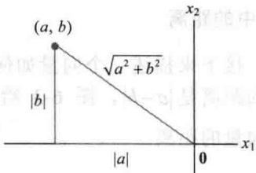

（为验证上式，计算 $\| cv\|^2 = (cv)\cdot (cv) = c^2\pmb {v}\cdot \pmb {v} = c^2\| \pmb {v}\|^2$ 然后作开方运算就可以得到以上结论.）

图 6-1 $\|v\|$ 作为长度的几何意义

除以其自身的长度，即乘 $\frac{1}{\|v\|}$ ，就可以得到一个单位向量，即 $u = \frac{v}{\|v\|}$ ，因为 $u$ 的长度是 $\left(\frac{1}{\|v\|}\right)\|v\|$ 。这种把向量 $v$ 化成单位向量 $u$ 的过程，称为向量 $v$ 的单位化，此时 $u$ 和 $v$ 方向一致。

下面几个例子使用（列）向量的简约形式.
</Knowledge>

<Example title="例 2">
令 $\boldsymbol{v}=(1,-2,2,0)$ ，找出和 v 方向一致的单位向量 u.

<Solution title="解">
首先计算向量 $\pmb{\nu}$ 的长度：

$$
\left\| \boldsymbol {v} \right\| ^ {2} = \boldsymbol {v} \cdot \boldsymbol {v} = (\tilde {1}) ^ {2} + (- 2) ^ {2} + (2) ^ {2} + (0) ^ {2} = 9, \quad \left\| \boldsymbol {v} \right\| = \sqrt {9} = 3
$$

将 $\pmb{\nu}$ 乘以 $\frac{1}{\|\pmb{\nu}\|}$ 得到

$$
\boldsymbol {u} = \frac {1}{\| \boldsymbol {v} \|} \boldsymbol {v} = \frac {1}{3} \boldsymbol {v} = \frac {1}{3} \left[ \begin{array}{c} 1 \\ - 2 \\ 2 \\ 0 \end{array} \right] = \left[ \begin{array}{c} 1 / 3 \\ - 2 / 3 \\ 2 / 3 \\ 0 \end{array} \right]
$$

为验证 $\left\|u\right\|=1$ ，只需验证 $\left\|u\right\|^{2}=1$ 。

$$
\left\| \boldsymbol {u} \right\| ^ {2} = \boldsymbol {u} \cdot \boldsymbol {u} = (\frac {1}{3}) ^ {2} + (- \frac {2}{3}) ^ {2} + (\frac {2}{3}) ^ {2} + (0) ^ {2} = \frac {1}{9} + \frac {4}{9} + \frac {4}{9} + 0 = 1
$$

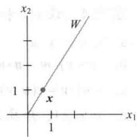
</Solution>
</Example>

<Example title="例 3">
设 $W$ 是 $\mathbb{R}^n$ 的子空间且由向量 $x = (\frac{2}{3}, 1)$ 生成，求出一个单位向量 $z$ 且 $z$ 构成 $W$ 的一个基.

<Solution title="解">
空间 W 包含所有 x 数倍的向量，如图 6-2a 所示。W 中的任意非零向量都是 W 的基。为简化计算，重新“标度” x 以消去分数，即向量 x 乘 3 得到 $y=\begin{bmatrix}2\\ 3\end{bmatrix}$ 。现在计算 $\left\|y\right\|^{2}=2^{2}+3^{2}=13$ ， $\left\|y\right\|=\sqrt{13}$ ，把向量 y 单位化可得

$$
z = \frac {1}{\sqrt {1 3}} \left[ \begin{array}{l} 2 \\ 3 \end{array} \right] = \left[ \begin{array}{l} \frac {2}{\sqrt {1 3}} \\ \frac {3}{\sqrt {1 3}} \end{array} \right]
$$

<figure class="vp-figure">
  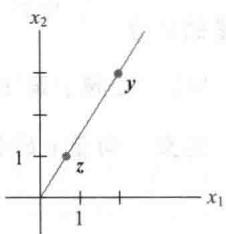
  <figcaption>图6-2 把一个向量单位化，得到一个单位向量</figcaption>
</figure>

见图 6-2b. 另外一个单位向量是 $(-2/\sqrt{13}, -3/\sqrt{13})$ .
</Solution>
</Example>

## $\mathbb{R}^n$ 中的距离

接下来描述一个向量如何逼近另一个向量.注意，如果 $a$ 和 $b$ 是实数，则在数轴上 $a$ 与 $b$ 之间的距离是 $\left|a - b\right|$ ，图6-3给出了两个实例．用类似于 $\mathbb{R}$ 中两个数之间的距离定义 $\mathbb{R}^n$ 空间中两个向量的距离.

<figure class="vp-figure">
  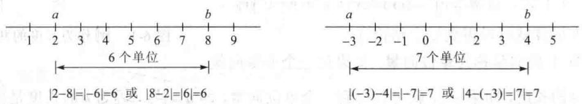
  <figcaption>图6-3 $\mathbb{R}$ 中两个数的距离</figcaption>
</figure>

定义 $\mathbb{R}^n$ 中向量 $\pmb{u}$ 和 $\pmb{v}$ 之间的距离记作 $\mathrm{dist}(\pmb{u},\pmb{v})$ ，表示向量 $\pmb{u} - \pmb{v}$ 的长度，即

$$
\operatorname{dist} (\boldsymbol {u}, \boldsymbol {v}) = \| \boldsymbol {u} - \boldsymbol {v} \|
$$

在 $\mathbb{R}^2$ 和 $\mathbb{R}^3$ 中，如例4和例5所示，距离的定义和欧几里得空间中两点的距离公式一致.例4 计算向量 $u = (7,1)$ 和 $v = (3,2)$ 之间的距离.

<Solution title="解">
先计算 $u-v=\begin{bmatrix}7\\ 1\end{bmatrix}-\begin{bmatrix}3\\ 2\end{bmatrix}=\begin{bmatrix}4\\ -1\end{bmatrix}$ ，则有 $\left\|\boldsymbol{u}-\boldsymbol{v}\right\|=\sqrt{4^{2}+(-1)^{2}}=\sqrt{17}$ .

向量 u，v 和 u-v 如图 6-4 所示，向量 u-v 加上向量 v 的结果是向量 u。注意到图 6-4 中的平行四边形表明，从向量 u 到 v 的距离与从向量 u-v 到 0 的距离相等。

<figure class="vp-figure">
  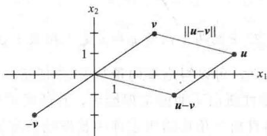
  <figcaption>图6-4 向量 $\pmb{u}$ 和 $\pmb{v}$ 的距离等于 $u - v$ 的长度</figcaption>
</figure>
</Solution>

<Example title="例 5">
如果 $\pmb{u} = (u_{1}, u_{2}, u_{3})$ 和 $\pmb{v} = (v_{1}, v_{2}, v_{3})$ ，那么

$$
\operatorname{dist} (\boldsymbol {u}, \boldsymbol {v}) = \| \boldsymbol {u} - \boldsymbol {v} \| = \sqrt {(\boldsymbol {u} - \boldsymbol {v}) \cdot (\boldsymbol {u} - \boldsymbol {v})} = \sqrt {\left(u _ {1} - v _ {1}\right) ^ {2} + \left(u _ {2} - v _ {2}\right) ^ {2} + \left(u _ {3} - v _ {3}\right) ^ {2}}
$$
</Example>

## 正交向量

本章以下内容阐述这样的事实，即欧几里得空间中的直线垂直概念可以推广到 $\mathbb{R}^n$ 中.

考虑 $R^{2}$ 或 $R^{3}$ 中通过原点且由向量 u 和向量 v 确定的两条直线，两条直线（见图 6-5）几何上垂直当且仅当从 u 到 v 的距离与从 u 到 -v 的距离相等，这等同于要求它们距离的平方要相等.

<figure class="vp-figure">
  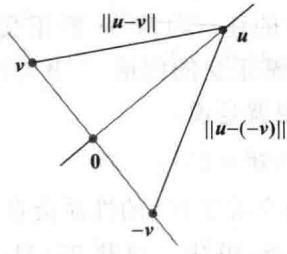
  <figcaption>图6-5</figcaption>
</figure>

现在计算

$$
\begin{array}{r l} {[ \mathrm{dist} (\pmb {u}, - \pmb {v}) ] ^ {2}} & {= \left\| \pmb {u} - (- \pmb {v}) \right\| ^ {2} = \left\| \pmb {u} + \pmb {v} \right\| ^ {2}} \\ & {= (\pmb {u} + \pmb {v}) \cdot (\pmb {u} + \pmb {v})} \\ & {= \pmb {u} \cdot (\pmb {u} + \pmb {v}) + \pmb {v} \cdot (\pmb {u} + \pmb {v}) \qquad \text {定理1(b)}} \end{array}
$$

$$
\begin{array}{r l r} & = \pmb {u} \cdot \pmb {u} + \pmb {u} \cdot \pmb {v} + \pmb {v} \cdot \pmb {u} + \pmb {v} \cdot \pmb {v} & \text {定理1(a)、(b)} \\ & = \left\| \pmb {u} \right\| ^ {2} + \left\| \pmb {v} \right\| ^ {2} + 2 \pmb {u} \cdot \pmb {v} & \text {定理1(a)} \end{array}\tag{1}
$$

同样将 $-\pmb{v}$ 和 $\pmb{v}$ 互换的计算如下：

$$
\begin{array}{r l} \left[ \mathrm{dist} (\boldsymbol {u}, \boldsymbol {v}) \right] ^ {2} & = \left\| \boldsymbol {u} \right\| ^ {2} + \left\| - \boldsymbol {v} \right\| ^ {2} + 2 \boldsymbol {u} \cdot (- \boldsymbol {v}) \\ & = \left\| \boldsymbol {u} \right\| ^ {2} + \left\| \boldsymbol {v} \right\| ^ {2} - 2 \boldsymbol {u} \cdot \boldsymbol {v} \end{array}
$$

两个距离平方相等的充分必要条件是： $2u \cdot v = -2u \cdot v$ 或 $u \cdot v = 0$ .

这里的计算表明，当向量 $\pmb{u}$ 和向量 $\pmb{v}$ 看作几何点时，通过这些点和原点的两条直线相互垂直的充分必要条件是 $u \cdot v = 0$ 。下面给出 $\mathbb{R}^n$ 中两个向量互相垂直的一般定义（或正交，这是线性代数中的一个通用术语）。

定义 如果 $u \cdot v = 0$ ，则 $R^{n}$ 中的两个向量 u 和 v 是（相互）正交的.

由 $0^{T} \cdot v = 0$ 对任意 v 都成立，可以得出零向量与 $R^{n}$ 中任意向量正交.

关于向量正交的一个重要性质由下面的定理给出，其证明可以从上面正交性定义和（1）中的计算立刻推出。图6-6中的直角三角形给出定理中长度的直观描述。

<Knowledge title="定理 2 毕达哥拉斯（勾股">
定理）

两个向量 $\pmb{u}$ 和 $\pmb{v}$ 正交的充分必要条件是 $\left\| \pmb {u} + \pmb {v}\right\| ^2 = \left\| \pmb {u}\right\| ^2 +\left\| \pmb {v}\right\| ^2.$
</Knowledge>

## 正交补

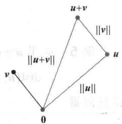

为了提供运用内积的相关练习，我们引入一个在6.3节和其余章节中都需要的概念。如果向量 $z$ 与 $\mathbb{R}^n$ 的子空间 $W$ 中的任意向量都正交，则称 $z$ 正交于 $W$ 。与子空间 $W$ 正交的向量 $z$ 的全体组成的集合称为 $W$ 的正交补，并记作 $W^{\perp}$ （ $W^{\perp}$ 读作 $W$ 正交补）。

图 6-6

<Example title="例 6">
设 $W$ 是 $\mathbb{R}^3$ 中通过原点的平面， $L$ 是通过原点且与 $W$ 正交的直线。如果 $z$ 和 $w$ 都非零， $z$ 在直线 $L$ 上且 $w$ 在 $W$ 内，那么从 0 到 $z$ 的线段正交于从 0 到 $w$ 的线段，即 $z \cdot w = 0$ ，见图

6-7. 从而 $L$ 上的每个向量与 $W$ 中的任一向量 $\pmb{w}$ 都正交。事实上， $L$ 包含所有与 $W$ 中的向量 $\pmb{w}$ 都正交的向量， $W$ 包含所有与 $L$ 中的向量 $\pmb{z}$ 都正交的向量，也就是说，

$$
L = W ^ {\perp} \text {且} W = L ^ {\perp}
$$

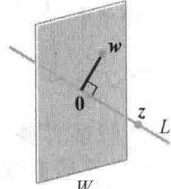

若 $W$ 是 $\mathbb{R}^n$ 的子空间，下面两个关于 $W^{\perp}$ 的性质会在以后的章节用到。证明放在习题29和习题30中，习题27\~31将给出几个运用内积性质的练习。

图6-7 一个作为正交补空间的平面和通过原点的直线

1. 向量 x 属于 $W^{\perp}$ 的充分必要条件是向量 x 与生成空间 W 的任一向量都正交.
2. $W^{\perp}$ 是 $R^{n}$ 的一个子空间.

下面的定理和习题 31 验证了 4.6 节关于子空间的论断，见图 6-8（也可参考 4.6 节的习题 28）.

<figure class="vp-figure">
  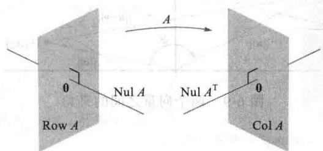
  <figcaption>图6-8 一个由 $m \times n$ 矩阵 $A$ 确定的基本子空间</figcaption>
</figure>
</Example>

证明两个集合（比如 $s$ 和 $T$ ）相等的常用方法是证明 $s$ 是 $T$ 的子集且 $T$ 是 $s$ 的子集。下个定理的证明（即 $\mathrm{Nul} A = (\mathrm{Row} A)^{\perp}$ ）可通过证明 $\mathrm{Nul} A$ 是 $(\mathrm{Row} A)^{\perp}$ 的子集且 $(\mathrm{Row} A)^{\perp}$ 是 $\mathrm{Nul} A$ 的子集来完成，即证明 $\mathrm{Nul} A$ 中的任一元素 $\pmb{x}$ 在 $(\mathrm{Row} A)^{\perp}$ 中，而 $(\mathrm{Row} A)^{\perp}$ 中的任一元素 $\pmb{x}$ 也在 $\mathrm{Nul} A$ 中。

<Knowledge title="定理 3">
假设 $A$ 是 $m \times n$ 矩阵，那么 $A$ 的行空间的正交补是 $A$ 的零空间，且 $A$ 的列空间的正交补是 $A^{\mathrm{T}}$ 的零空间：

$$
(\mathrm{Row} A) ^ {\perp} = \mathrm{Nul} A \quad \text {且} \quad (\mathrm{Col} A) ^ {\perp} = \mathrm{Nul} A ^ {\mathrm{T}}
$$

<Solution title="证明">
计算 $Ax$ 的行列法则表明，如果 $x$ 是 $\operatorname{Nul} A$ 中的向量，那么向量 $x$ 与 $A$ 的每一行（将行作为 $\mathbb{R}^n$ 中的向量）正交。由于 $A$ 的行生成行空间，故向量 $x$ 与 $\operatorname{Row} A$ 正交。反之，如果 $x$ 与 $\operatorname{Row} A$ 正交，那么 $x$ 当然与 $A$ 的每一行正交，因此 $Ax = 0$ ，从而证明了定理的第一个结论。因为该结论对任一矩阵成立，因此对 $A^{\mathrm{T}}$ 成立，即 $A^{\mathrm{T}}$ 的行空间的正交补是 $A^{\mathrm{T}}$ 的零空间。由于 $\operatorname{Row} A^{\mathrm{T}} = \operatorname{Col} A$ ，这就证明了第二个结论。

$\mathbb{R}^2$ 和 $\mathbb{R}^3$ 中的角度（可选内容）

如果 $\pmb{u}$ 和 $\pmb{v}$ 是 $\mathbb{R}^2$ 或 $\mathbb{R}^3$ 中的非零向量，那么可以将它们的内积与从原点到点 $\pmb{u}$ 和原点到点 $\pmb{v}$ 的两个线段之间的夹角 $\vartheta$ 联系起来，对应的公式是：

$$
\boldsymbol {u} \cdot \boldsymbol {v} = \| \boldsymbol {u} \| \| \boldsymbol {v} \| \cos \vartheta\tag{2}
$$

为了验证 $\mathbb{R}^2$ 中的向量公式，考虑图6-9所示的三角形，其边长分别是 $\| u\|$ ， $\| v\|$ 和 $\| u - v\|$ ．由余弦定理可知

$$
\left\| \boldsymbol {u} - \boldsymbol {v} \right\| ^ {2} = \left\| \boldsymbol {u} \right\| ^ {2} + \left\| \boldsymbol {v} \right\| ^ {2} - 2 \left\| \boldsymbol {u} \right\| \left\| \boldsymbol {v} \right\| \cos \vartheta
$$

可以重新组合上面的内积表达式：

$$
\begin{array}{r l} \left\| \boldsymbol {u} \right\| & \left\| \boldsymbol {v} \right\| \cos \vartheta = \frac {1}{2} \Big [ \left\| \boldsymbol {u} \right\| ^ {2} + \left\| \boldsymbol {v} \right\| ^ {2} - \left\| \boldsymbol {u} - \boldsymbol {v} \right\| ^ {2} \Big ] \\ & = \frac {1}{2} \big [ u _ {1} ^ {2} + u _ {2} ^ {2} + v _ {1} ^ {2} + v _ {2} ^ {2} - (u _ {1} - v _ {1}) ^ {2} - (u _ {2} - v _ {2}) ^ {2} \big ] \\ & = u _ {1} v _ {1} + u _ {2} v _ {2} \\ & = \boldsymbol {u} \cdot \boldsymbol {v} \end{array}
$$

$\mathbb{R}^3$ 的情形可类似验证. 当 $n > 3$ 时, 公式 (2) 可用于定义 $\mathbb{R}^n$ 中两个向量之间的夹角. 例如, 在统计学中, (2) 式中对向量 $\pmb{u}$ 和 $\pmb{v}$ 定义的 $\cos \vartheta$ 的值就是统计学家所称的相关系数.

<figure class="vp-figure">
  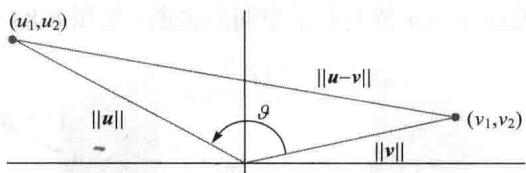
  <figcaption>图6-9 两个向量之间的夹角</figcaption>
</figure>
</Solution>
</Knowledge>

<Block title="练习题">
1. 令 $a=\begin{bmatrix}-2\\1\end{bmatrix}$ ， $b=\begin{bmatrix}-3\\1\end{bmatrix}$ ，计算 $\frac{a\cdot b}{a\cdot a}$ 和 $\left(\frac{a\cdot b}{a\cdot a}\right)a$ .

2. 令 $c=\begin{bmatrix}\frac{4}{3}\\ -1\\ \frac{2}{3}\end{bmatrix}$ ， $d=\begin{bmatrix}5\\ 6\\ -1\end{bmatrix}$ .

a. 计算向量 c 方向的单位向量 u.

b. 证明向量 d 和向量 c 正交.

c. 利用（a）和（b）的结果，解释为什么 d 一定正交于单位向量 u.

3. 设 $W$ 是 $\mathbb{R}^n$ 的子空间. 习题30证明了 $W^{\perp}$ 也是 $\mathbb{R}^n$ 的子空间, 证明 $\dim W + \dim W^{\perp} = n$ .
</Block>

<Block title="习题6.1">
在习题 1\~8 中，利用下列向量计算数值：

$$
\boldsymbol {u} = \left[ \begin{array}{c} - 1 \\ 2 \end{array} \right]
$$

$$
\boldsymbol {v} = \left[ \begin{array}{c} 4 \\ 6 \end{array} \right]
$$

$$
\boldsymbol {w} = \left[ \begin{array}{c} 3 \\ - 1 \\ - 5 \end{array} \right]
$$

$$
\boldsymbol {x} = \left[ \begin{array}{c} 6 \\ - 2 \\ 3 \end{array} \right]
$$

1. $u \cdot u, v \cdot u$ 和 $\frac{v \cdot u}{u \cdot u}$ 2. $w \cdot w, x \cdot w$ 和 $\frac{x \cdot w}{w \cdot w}$ 3. $\frac{1}{w \cdot w} w$ 4. $\frac{1}{u \cdot u} u$ 5. $\left(\frac{u \cdot v}{v \cdot v}\right) v$ 6. $\left(\frac{x \cdot w}{x \cdot x}\right) x$ 7. $\|w\|$ 8. $\|x\|$

在习题9\~12中，计算给定向量方向的单位向量.  
9. $\left[ \begin{array}{c} -30\\ 40 \end{array} \right]$ 10. $\left[ \begin{array}{c} -6\\ 4\\ -3 \end{array} \right]$ 11. $\left[ \begin{array}{c}7 / 4\\ 1 / 2\\ 1 \end{array} \right]$ 12. $\left[ \begin{array}{c}8 / 3\\ 2 \end{array} \right]$

13. 计算向量 $x=\begin{bmatrix}10\\ -3\end{bmatrix}$ 与向量 $y=\begin{bmatrix}-1\\ -5\end{bmatrix}$ 之间的距离.

14. 计算向量 $u=\begin{bmatrix}0\\ -5\\ 2\end{bmatrix}$ 与向量 $z=\begin{bmatrix}-4\\ -1\\ 8\end{bmatrix}$ 之间的距离.

在习题 15\~18 中，确定哪一对向量相互正交.

15. $a=\begin{bmatrix}8\\ -5\end{bmatrix},\quad b=\begin{bmatrix}-2\\ -3\end{bmatrix}$

$$
\boldsymbol {u} = \left[ \begin{array}{c} 1 2 \\ 3 \\ - 5 \end{array} \right]
$$

$$
\boldsymbol {v} = \left[ \begin{array}{c} 2 \\ - 3 \\ 3 \end{array} \right]
$$

17. $u=\begin{bmatrix}3\\ 2\\ -5\\ 0\end{bmatrix},\quad v=\begin{bmatrix}-4\\ 1\\ -2\\ 6\end{bmatrix}$

$$
\mathbf {y} = \left[ \begin{array}{c} - 3 \\ 7 \\ 4 \\ 0 \end{array} \right]
$$

$$
z = \left[ \begin{array}{r} 1 \\ - 8 \\ 1 5 \\ - 7 \end{array} \right]
$$

在习题 19\~20 中，所有向量在 $R^{n}$ 中，说明每个命题的真假，并验证你的答案.

19. a. $\boldsymbol{v} \cdot \boldsymbol{v} = \left\|\boldsymbol{v}\right\|^{2}$ .

b. 对任意数 $c$ ， $\pmb {u}\cdot (c\pmb {v}) = c(\pmb {u}\cdot \pmb{v})$

c. 如果向量 u 到向量 v 的距离等于向量 u 到向量 -v 的距离，那么 u 和 v 是正交的.

d. 对于一个方阵 A，Col A 中的向量与 Nul A 中的向量正交.

e. 如果向量 $v_{1}, \cdots, v_{p}$ 生成子空间 W，且向量 x 与每一个 $v_{j} (j=1,\cdots,p)$ 正交，那么向量 x 属于 $W^{\perp}$ .

20. a. $u \cdot v - v \cdot u = 0$ .
b. 对任意数 c， $\|cv\| = c\|v\|$ .
c. 如果 x 与子空间 W 中的任一向量正交，那么 x 是 $W^{\perp}$ 中的向量.
d. 如果 $\left\|\boldsymbol{u}\right\|^{2}+\left\|\boldsymbol{v}\right\|^{2}=\left\|\boldsymbol{u}+\boldsymbol{v}\right\|^{2}$ ，那么 u 和 v 相互正交.
e. 对任意 $m \times n$ 矩阵 A, A 的零空间中的向量与 A 的行空间中的向量正交.

21. 利用内积的转置定义，验证定理 1 中的（b）和（c），注意第 2 章的一些内容.

22. 若 $\boldsymbol{u}=(u_{1},u_{2},u_{3})$ ，解释为什么 $u\cdot u\geqslant0$ 。什么条件下 $u\cdot u=0$ ?

23. 若 $u=\begin{bmatrix}2\\ -5\\ -1\end{bmatrix}, v=\begin{bmatrix}-7\\ -4\\ 6\end{bmatrix}$ ，计算和比较 $u \cdot v, \|u\|^{2}$ , $\|v\|^{2}$ 和 $\|u+v\|^{2}$ . 不能使用勾股定理.

24. 证明 $\mathbb{R}^n$ 中向量 $\pmb{u}$ 和 $\pmb{v}$ 的平行四边形法则： $\left\| \pmb{u} + \pmb{v} \right\|^2 + \left\| \pmb{u} - \pmb{v} \right\|^2 = 2 \left\| \pmb{u} \right\|^2 + 2 \left\| \pmb{v} \right\|^2$

25. 假设 $v=\begin{bmatrix}a\\ b\end{bmatrix}$ ，描述与 v 正交的向量 $\begin{bmatrix}x\\ y\end{bmatrix}$ 的集合 H。（提示：考虑 v=0 和 $v\neq0$ 两种情形。）

26. 假设 $u=\begin{bmatrix}5\\ -6\\ 7\end{bmatrix}$ ，且 W 是 $R^{3}$ 中满足 $u \cdot x = 0$ 的全体向量 x 的集合，第4章中的什么定理可以说明 W 是 $R^{3}$ 的子空间？用几何语言描述空间 W。

27. 假若一个向量 y 与向量 u 和 v 都正交，证明 y 与向量 $u + v$ 正交.

28. 假若 y 与向量 u 和 v 都正交，证明 y 与 Span\{u,v\} 中的任一向量 w 正交。（提示：Span\{u,v\} 中的向量 w 具有形式 $w = c_{1}u + c_{2}v$ 证明 y 与向量 w 正交。）

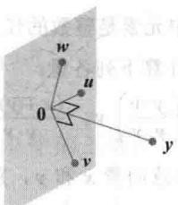  
Span $\{u, v\}$

29. 令 $W = \operatorname{Span}\{\pmb{v}_1, \dots, \pmb{v}_p\}$ ，证明：如果 $\pmb{x}$ 和每个 $\pmb{v}_j$ （ $1 \leqslant j \leqslant p$ ）正交，那么 $\pmb{x}$ 与 $W$ 中任一向量正交。

30. 令 W 是 $R^{n}$ 的子空间，且 $W^{\perp}$ 是所有与 W 正交的向量集合，利用下列步骤说明 $W^{\perp}$ 是 $R^{n}$ 的子空间.
a. 选取 $W^{\perp}$ 中的 z，令 u 表示 W 中的任意元素，那么 $z \cdot u = 0$ 。取任意数 c，然后证明 cz 与向量 u 正交（由于 u 是 W 中的任意向量，这说明 cz 在 $W^{\perp}$ 中）.
b. 选取 $W^{\perp}$ 中的 $z_{1}$ 和 $z_{2}$ ，令 u 是 W 中任意元素，证明向量 $z_{1} + z_{2}$ 与 u 正交。可从 $z_{1} + z_{2}$ 中得出什么结论？为什么？
c. 最后证明 $W^{\perp}$ 是 $R^{n}$ 的子空间.

31. 证明：如果 x 是属于空间 W 和 $W^{\perp}$ 的向量，那么 x=0.

32. [M] 构造 $\mathbb{R}^4$ 中任意一对向量 $\pmb{u}$ 和 $\pmb{v}$ ，令

$$
A = \left[ \begin{array}{c c c c} 0. 5 & 0. 5 & 0. 5 & 0. 5 \\ 0. 5 & 0. 5 & - 0. 5 & - 0. 5 \\ 0. 5 & - 0. 5 & 0. 5 & - 0. 5 \\ 0. 5 & - 0. 5 & - 0. 5 & 0. 5 \end{array} \right]
$$

a. 记 A 的列向量为 $a_{1}, \cdots, a_{4}$ ，计算每一列的长度和 $a_{1} \cdot a_{2}$ ， $a_{1} \cdot a_{3}$ ， $a_{1} \cdot a_{4}$ ， $a_{2} \cdot a_{3}$ ， $a_{2} \cdot a_{4}$ ， $a_{3} \cdot a_{4}$ .

b. 计算并比较 u，Au，v 和 Av 的长度.

c. 利用本节中方程（2）计算向量 u 和 v 之间夹角的余弦值，并将此值和向量 Au 和 Av 之间夹角的余弦值相比较.

d. 对任意两个向量，重复（b）和（c），从 A 对任意向量的作用可以得出什么猜想？

33.[M] 对 $R^{4}$ 中元素是整数的任意向量 x, y 和 v ( $v \neq 0$ ), 计算下列各量:

$$
\left(\frac {x \cdot v}{v \cdot v}\right) v, \left(\frac {y \cdot v}{v \cdot v}\right) v, \frac {(x + y) \cdot v}{v \cdot v} v, \frac {(1 0 x) \cdot v}{v \cdot v} v
$$

选取新的任意向量 x 和 y，重复上面计算。从映射 $x \mapsto T(x) = \left(\frac{x \cdot v}{v \cdot v}\right)v$ （对 $v \neq 0$ ）可得出什么猜想？用代数证明你的猜想。

34. [M] 设 $A = \begin{bmatrix} -6 & 3 & -27 & -33 & -13 \\ 6 & -5 & 25 & 28 & 14 \\ 8 & -6 & 34 & 38 & 18 \\ 12 & -10 & 50 & 41 & 23 \\ 14 & -21 & 49 & 29 & 33 \end{bmatrix}$ , 构造

矩阵 N 使其列是 Nul A 的一组基，构造矩阵 R 使其行是 Row A 的一组基（详见 4.6 节）。用 N 和 R 执行矩阵计算来说明定理 3 的结论。
</Block>

<Block title="练习题答案">
1. $a \cdot b = 7$ , $a \cdot a = 5$ ，因此， $\frac{a \cdot b}{a \cdot a} = \frac{7}{5}$ ，且 $\left(\frac{a \cdot b}{a \cdot a}\right)a = \frac{7}{5}a = \begin{bmatrix} -14/5 \\ 7/5 \end{bmatrix}$ .

2. a. 先倍乘 c，乘 3 得到 $y=\begin{bmatrix}4\\ -3\\ 2\end{bmatrix}$ ，计算 $\|y\|^{2}=29$ 和 $\|y\|=\sqrt{29}$ ．与向量 c 和 y 方向一致的单位向量是：

$$
\boldsymbol {u} = \frac {1}{\| \boldsymbol {y} \|} \boldsymbol {y} = \left[ \begin{array}{c} 4 / \sqrt {2 9} \\ - 3 / \sqrt {2 9} \\ 2 / \sqrt {2 9} \end{array} \right]
$$

b. $d$ 与 $\pmb{c}$ 正交，这是因为

$$
\boldsymbol {d} \cdot \boldsymbol {c} = \left[ \begin{array}{l} 5 \\ 6 \\ - 1 \end{array} \right] \cdot \left[ \begin{array}{l} 4 / 3 \\ - 1 \\ 2 / 3 \end{array} \right] = \frac {2 0}{3} - 6 - \frac {2}{3} = 0
$$

c. d 与 u 正交，这是因为对任意 k，向量 u 具有形式 kc，且

$$
\boldsymbol {d} \cdot \boldsymbol {u} = \boldsymbol {d} \cdot (k c) = k (\boldsymbol {d} \cdot \boldsymbol {c}) = k (0) = 0
$$

3. 若 $w \neq \{0\}$ ，设 $\{b_{1}, \cdots, b_{p}\}$ 是 W 的一个基， $1 \leqslant p \leqslant n$ 。设 A 是以 $b_{1}^{T}, \cdots, b_{p}^{T}$ 为行向量的 $p \times n$ 矩阵，从而 W 是 A 的行空间。由定理 3 可知 $W^{\perp} = (\text{Row } A)^{\perp} = \text{Nul } A$ ，从而 $\dim W^{\perp} = \dim \text{Nul } A$ 。因此，由秩定理可得， $\dim W + \dim W^{\perp} = \dim \text{Row } A + \dim \text{Nul } A = \text{rank } A + \dim \text{Nul } A = n$ 。若 $W = \{0\}$ ，则 $W^{\perp} = R^{n}$ ，结论成立。
</Block>
