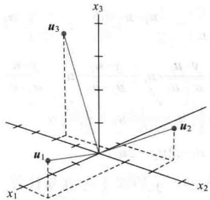
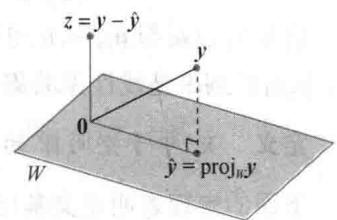
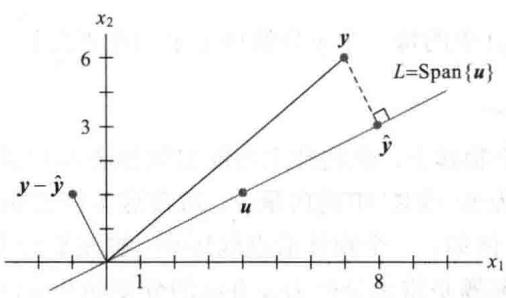
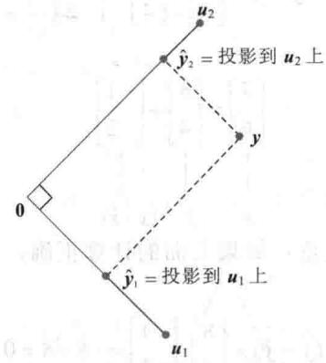
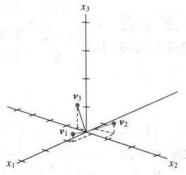
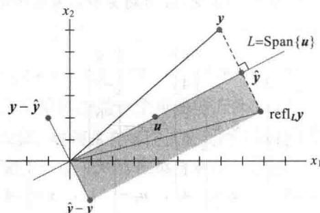

import Guide from '@/components/Guide.astro';
import Knowledge from '@/components/Knowledge.astro';
import Example from '@/components/Example.astro';
import Analysis from '@/components/Analysis.astro';
import Solution from '@/components/Solution.astro';
import Variant from '@/components/Variant.astro';
import Note from '@/components/Note.astro';
import Block from '@/components/Block.astro';
import Method from '@/components/Method.astro';
import Exercise from '@/components/Exercise.astro';

$R^{n}$ 中的向量集合 $\{u_{1},\cdots,u_{p}\}$ 称为正交集，如果集合中的任意两个不同向量都正交，即当 $i\neq j$ 时， $u_{i}\cdot u_{j}=0$ .

<Example title="例 1">
证明 $\{\pmb{u}_1, \pmb{u}_2, \pmb{u}_3\}$ 是一个正交集，其中

$$
\pmb {u} _ {1} = \left[ \begin{array}{l} 3 \\ 1 \\ 1 \end{array} \right], \quad \pmb {u} _ {2} = \left[ \begin{array}{l} - 1 \\ 2 \\ 1 \end{array} \right], \quad \pmb {u} _ {3} = \left[ \begin{array}{l} - 1 / 2 \\ - 2 \\ 7 / 2 \end{array} \right]
$$

<Solution title="解">
考察三种可能的不同向量对，即 $\{u_{1}, u_{2}\}, \{u_{1}, u_{3}\}$ 和 $\{u_{2}, u_{3}\}$ .

$$
\begin{array}{r l} & \boldsymbol {u} _ {1} \cdot \boldsymbol {u} _ {2} = 3 (- 1) + 1 (2) + 1 (1) = 0 \\ & \boldsymbol {u} _ {1} \cdot \boldsymbol {u} _ {3} = 3 (- 1 / 2) + 1 (- 2) + 1 (7 / 2) = 0 \\ & \boldsymbol {u} _ {2} \cdot \boldsymbol {u} _ {3} = - 1 (- 1 / 2) + 2 (- 2) + 1 (7 / 2) = 0 \end{array}
$$

每对不同的向量是垂直的，所以 $\{\pmb{u}_1, \pmb{u}_2, \pmb{u}_3\}$ 是正交集。如图6-10中的三条线段，它们之间相互垂直。

  
图6-10
</Solution>
</Example>

<Knowledge title="定理 4">
如果 $S=\{u_{1},\cdots,u_{p}\}$ 是由 $R^{n}$ 中非零向量构成的正交集，那么 S 是线性无关集，因此构成 S 所生成的子空间的一组基.

<Solution title="证明">
如果 $0 = c_{1}u_{1} + \cdots + c_{p}u_{p}$ 对任意数 $c_{1}, \cdots, c_{p}$ 成立，那么

$$
\begin{array}{r l} 0 & = \mathbf {0} \cdot \mathbf {u} _ {1} = (c _ {1} \mathbf {u} _ {1} + c _ {2} \mathbf {u} _ {2} + \dots + c _ {p} \mathbf {u} _ {p}) \cdot \mathbf {u} _ {1} \\ & = (c _ {1} \mathbf {u} _ {1}) \cdot \mathbf {u} _ {1} + (c _ {2} \mathbf {u} _ {2}) \cdot \mathbf {u} _ {1} + \dots + (c _ {p} \mathbf {u} _ {p}) \cdot \mathbf {u} _ {1} \\ & = c _ {1} (\mathbf {u} _ {1} \cdot \mathbf {u} _ {1}) + c _ {2} (\mathbf {u} _ {2} \cdot \mathbf {u} _ {1}) + \dots + c _ {p} (\mathbf {u} _ {p} \cdot \mathbf {u} _ {1}) \\ & = c _ {1} (\mathbf {u} _ {1} \cdot \mathbf {u} _ {1}) \end{array}
$$

这是因为 $u_{1}$ 与 $u_{2},\cdots,u_{p}$ 正交．由 $u_{1}$ 非零，故 $u_{1}\cdot u_{1}$ 非零，从而 $c_{1}=0$ ．类似可得 $c_{2},\cdots,c_{p}$ 必为零，从而得到 S 是线性无关集.

定义 $\mathbb{R}^n$ 中子空间 $W$ 的一个正交基是 $W$ 的一个基，也是正交集.

下面的定理表明正交基比其他基优越，线性组合中的权较易计算.
</Solution>
</Knowledge>

<Knowledge title="定理 5">
假设 $\{u_{1},\cdots,u_{p}\}$ 是 $R^{n}$ 中子空间 W 的正交基，对 W 中的每个向量 y，线性组合 $y=c_{1}u_{1}+\cdots+c_{p}u_{p}$ 中的权可以由 $c_{j}=\frac{y\cdot u_{j}}{u_{j}\cdot u_{j}}\quad(j=1,\cdots,p)$ 计算.

<Solution title="证明">
像前面的证明一样，正交集 $\{u_{1},\cdots,u_{p}\}$ 表明

$$
\boldsymbol {y} \cdot \boldsymbol {u} _ {1} = \left(c _ {1} \boldsymbol {u} _ {1} + c _ {2} \boldsymbol {u} _ {2} + \dots + c _ {p} \boldsymbol {u} _ {p}\right) \cdot \boldsymbol {u} _ {1} = c _ {1} \left(\boldsymbol {u} _ {1} \cdot \boldsymbol {u} _ {1}\right)
$$

由于 $u_{1} \cdot u_{1}$ 非零，从上面方程中可以解出系数 $c_{1}$ 。为求出系数 $c_{j}$ ，可计算 $y \cdot u_{j} (j = 2, \cdots, p)$
</Solution>
</Knowledge>

<Example title="例 2">
例1中的集合 $S = \{\pmb{u}_1, \pmb{u}_2, \pmb{u}_3\}$ 是 $\mathbb{R}^3$ 中的一个正交基，将向量 $\mathbf{y} = \begin{bmatrix} 6 \\ 1 \\ -8 \end{bmatrix}$ 表示成 $S$ 中向量的线性组合.

<Solution title="解">
计算

$$
\begin{array}{r l r l r} {\pmb {y} \cdot \pmb {u} _ {1} = 1 1} & & {\pmb {y} \cdot \pmb {u} _ {2} = - 1 2} & & {\pmb {y} \cdot \pmb {u} _ {3} = - 3 3} \\ {\pmb {u} _ {1} \cdot \pmb {u} _ {1} = 1 1} & & {\pmb {u} _ {2} \cdot \pmb {u} _ {2} = 6} & & {\pmb {u} _ {3} \cdot \pmb {u} _ {3} = 3 3 / 2} \end{array}
$$
</Solution>
</Example>

由定理5得

$$
\begin{array}{r l} \mathbf {y} & = \frac {\mathbf {y} \cdot \mathbf {u} _ {1}}{\mathbf {u} _ {1} \cdot \mathbf {u} _ {1}} \cdot \mathbf {u} _ {1} + \frac {\mathbf {y} \cdot \mathbf {u} _ {2}}{\mathbf {u} _ {2} \cdot \mathbf {u} _ {2}} \cdot \mathbf {u} _ {2} + \frac {\mathbf {y} \cdot \mathbf {u} _ {3}}{\mathbf {u} _ {3} \cdot \mathbf {u} _ {3}} \cdot \mathbf {u} _ {3} \\ & = \frac {1 1}{1 1} \mathbf {u} _ {1} + \frac {- 1 2}{6} \mathbf {u} _ {2} + \frac {- 3 3}{3 3 / 2} \mathbf {u} _ {3} \\ & = \mathbf {u} _ {1} - 2 \mathbf {u} _ {2} - 2 \mathbf {u} _ {3} \end{array}
$$

<Note>
由正交基构成的线性表示，y 的权十分容易计算。如果基不是正交的，则必须类似于第 1 章解线性方程组才能得到。

下面我们构造一个非常重要的步骤，涉及许多包含正交计算的问题，而且它会对定理5给出一个几何解释.
</Note>

## 正交投影

对 $\mathbb{R}^n$ 中给出的非零向量 $\pmb{u}$ ，考虑 $\mathbb{R}^n$ 中一个向量 $\pmb{y}$ 分解为两个向量之和的问题，一个向量是向量 $\pmb{u}$ 的倍数，另一个向量与 $\pmb{u}$ 正交。我们期望写成

$$
\mathbf {y} = \hat {\mathbf {y}} + z\tag{1}
$$

其中 $\hat{y} = \alpha u$ ， $\alpha$ 是一个数， $z$ 是一个垂直于 $u$ 的向量，见图6-11.对给定数 $\alpha$ ，记 $z = y - \alpha u$ ，则方程（1）可以满足．那么 $y - \hat{y}$ 和 $u$ 正交的充分必要条件是

$$
0 = (\mathbf {y} - \alpha \mathbf {u}) \cdot \mathbf {u} = \mathbf {y} \cdot \mathbf {u} - (\alpha \mathbf {u}) \cdot \mathbf {u} = \mathbf {y} \cdot \mathbf {u} - \alpha (\mathbf {u} \cdot \mathbf {u})
$$

也就是满足方程(1)且 z 与 u 正交的充分必要条件是 $\alpha=\frac{y\cdot u}{u\cdot u}$ 和 $\hat{y}=\frac{y\cdot u}{u\cdot u}\cdot u$ 。向量 $\hat{y}$ 称为 y 在 u 上的正交投影，向量 z 称为 y 与 u 正交的分量。

  
图6-11 求 $\alpha$ 使 $y - \hat{y}$ 正交于 $\pmb{u}$

如果 $c$ 是非零数，且在 $\hat{y}$ 的定义中用 $cu$ 代替 $\pmb{u}$ ，那么 $\pmb{y}$ 在 $cu$ 上的正交投影和 $\pmb{y}$ 在 $\pmb{u}$ 上的正交投影完全一致（习题31），因此这个投影可由 $\pmb{u}$ 向量生成的子空间 $L$ （经过 $\pmb{u}$ 和原点的直线）所确定。有时用 $\mathrm{proj}_L\pmb{y}$ 来表示 $\hat{\pmb{y}}$ ，并称之为 $\pmb{y}$ 在 $\pmb{u}$ 上的正交投影，即

$$
\hat {y} = \operatorname{proj} _ {L} y = \frac {\mathbf {y} \cdot \mathbf {u}}{\mathbf {u} \cdot \mathbf {u}} \cdot \mathbf {u}\tag{2}
$$

<Example title="例 3">
假设 $\pmb{y} = \begin{bmatrix} 7 \\ 6 \end{bmatrix}$ 和 $\pmb{u} = \begin{bmatrix} 4 \\ 2 \end{bmatrix}$ ，找出 $\pmb{y}$ 在 $\pmb{u}$ 上的正交投影，然后将 $\pmb{y}$ 写成两个正交向量之和，

一个在 $\operatorname{Span}\{\pmb{u}\}$ 中，另一个与 $\pmb{u}$ 正交.

[Unreadable due to severe distortion and noise]

<Solution title="解">
计算

$$
\mathbf {y} \cdot \mathbf {u} = {\left[ \begin{array}{l} {7} \\ {6} \end{array} \right]} \cdot {\left[ \begin{array}{l} {4} \\ {2} \end{array} \right]} = 4 0
$$

$$
\pmb {u} \cdot \pmb {u} = \left[ \begin{array}{c} 4 \\ 2 \end{array} \right] \cdot \left[ \begin{array}{c} 4 \\ 2 \end{array} \right] = 2 0
$$

y 在 u 上的正交投影是:

$$
\hat {\boldsymbol {y}} = \frac {\boldsymbol {y} \cdot \boldsymbol {u}}{\boldsymbol {u} \cdot \boldsymbol {u}} \cdot \boldsymbol {u} = \frac {4 0}{2 0} \boldsymbol {u} = 2 \left[ \begin{array}{l} 4 \\ 2 \end{array} \right] = \left[ \begin{array}{l} 8 \\ 4 \end{array} \right]
$$

y 与 u 正交的分量是:

$$
\boldsymbol {y} - \hat {\boldsymbol {y}} = \left[ \begin{array}{l} 7 \\ 6 \end{array} \right] - \left[ \begin{array}{l} 8 \\ 4 \end{array} \right] = \left[ \begin{array}{l} - 1 \\ 2 \end{array} \right]
$$

两个向量之和为 $y$ ，即

$$
\left[ \begin{array}{l} 7 \\ 6 \end{array} \right] = \left[ \begin{array}{l} 8 \\ 4 \end{array} \right] + \left[ \begin{array}{c} - 1 \\ 2 \end{array} \right]
$$

$$
\begin{array}{c c c} \uparrow & \uparrow & \uparrow \\ y & \hat {y} & (y - \hat {y}) \end{array}
$$

向量 y 的分解可表示为图 6-12. 注意：如果上面的计算正确，那么 $\{\hat{y}, y - \hat{y}\}$ 是正交集. 作为检验，计算

$$
\hat {\mathbf {y}} \cdot (\mathbf {y} - \hat {\mathbf {y}}) = \left[ \begin{array}{l} 8 \\ 4 \end{array} \right] \cdot \left[ \begin{array}{l} - 1 \\ 2 \end{array} \right] = - 8 + 8 = 0
$$

  
图 6-12 y 在通过原点的直线 L 上的正交投影

由于图 6-12 中连接 y 与 $\hat{y}$ 的线段垂直于 L，故由 $\hat{y}$ 的构造可知，标记为 $\hat{y}$ 的点是 L 的距离 y 最近的点。（这可用几何方法证明，这里我们假设 $R^{2}$ 中成立，在 6.3 节给出 $R^{n}$ 情形的证明。）
</Solution>
</Example>

<Example title="例 4">
计算图 6-12 中从 y 到 L 的距离.

<Solution title="解">
从 y 到 L 的距离是从 y 到正交投影 $\hat{y}$ 的垂直线段的长度，这个长度等于 $y - \hat{y}$ 的长度，从而距离为

$$
\left\| \mathbf {y} - \hat {\mathbf {y}} \right\| = \sqrt {(- 1) ^ {2} + 2 ^ {2}} = \sqrt {5}
$$
</Solution>
</Example>

## 定理 5 的几何解释

（2）式中正交投影 $\hat{y}$ 的公式和定理 5 中每一项的形式一致，这样，定理 5 将向量 y 分解为一维子空间上正交投影之和.

对于 $W = \mathbb{R}^2 = \mathrm{Span}\{\pmb{u}_1,\pmb{u}_2\}$ 且 $\pmb{u}_{1}$ 和 $\pmb{u}_{2}$ 相互正交的情形，很容易看到分解式．任意 $\mathbb{R}^2$ 中的向量 $\pmb{y}$ 可以写成

$$
\mathbf {y} = \frac {\mathbf {y} \cdot \mathbf {u} _ {1}}{\mathbf {u} _ {1} \cdot \mathbf {u} _ {1}} \mathbf {u} _ {1} + \frac {\mathbf {y} \cdot \mathbf {u} _ {2}}{\mathbf {u} _ {2} \cdot \mathbf {u} _ {2}} \mathbf {u} _ {2}\tag{3}
$$

（3）中的第一项是 y 在由 $u_{1}$ 生成的子空间 Span $\{u_{1}\}$ 上的投影（通过原点和 $u_{1}$ 的直线），第二项是 y 在由 $u_{2}$ 生成的子空间 Span $\{u_{2}\}$ 上的投影，（3）式将 y 表示为由 $u_{1}$ 和 $u_{2}$ 确定的（正交）轴上的投影之和，见图 6-13.

  
图6-13 一个向量分解为两个投影之和

<Knowledge title="定理 5">
将 $Span\{u_{1},\cdots,u_{p}\}$ 中的每一个 y 分解成 p 个相互正交的一维子空间上的投影之和.
</Knowledge>

## 一个力分解为力的分量

如果某一力施加到一个物体上，在物理上可能出现如图6-13所示的分解。通过选取合适的坐标系，一个力可以表示为 $\mathbb{R}^2$ 或 $\mathbb{R}^3$ 中的向量 $y$ 。常常这类问题包含某些特别感兴趣的方向，即可表示为另一个向量 $u$ 。例如，一个物体沿直线运动，被施加外力后，用向量 $u$ 表示移动的方向，见图6-14。一个关键问题是将力分解为 $u$ 方向的分量和与 $u$ 正交方向的分量，具体计算类似于上面已完成的例3。

  
图 6-14

## 单位正交集

集合 $\{u_{1},\cdots,u_{p}\}$ 是一个单位正交集，如果它是由单位向量构成的正交集。如果 W 是一个由单位正交集合生成的子空间，那么 $\{u_{1},\cdots,u_{p}\}$ 是 W 的单位正交基，这是因为这类集合自然线性无关，见定理 4.

最简单的单位正交集合是 $R^{n}$ 中的标准基 $\{e_{1},\cdots,e_{n}\}$ 。集合 $\{e_{1},\cdots,e_{n}\}$ 的任一非空子集也是单位正交的，下面是一个更复杂的例子。

<Example title="例 5">
证明 $\{\pmb{v}_1, \pmb{v}_2, \pmb{v}_3\}$ 是 $\mathbb{R}^3$ 的一个单位正交基，其中

$$
\boldsymbol {v} _ {1} = \left[ \begin{array}{l} 3 / \sqrt {1 1} \\ 1 / \sqrt {1 1} \\ 1 / \sqrt {1 1} \end{array} \right] \quad \boldsymbol {v} _ {2} = \left[ \begin{array}{c} - 1 / \sqrt {6} \\ 2 / \sqrt {6} \\ 1 / \sqrt {6} \end{array} \right] \quad \boldsymbol {v} _ {3} = \left[ \begin{array}{l} - 1 / \sqrt {6 6} \\ - 4 / \sqrt {6 6} \\ 7 / \sqrt {6 6} \end{array} \right]
$$

<Solution title="解">
计算

$$
\begin{array}{r l} & {\pmb {v} _ {1} \cdot \pmb {v} _ {2} = - 3 / \sqrt {6 6} + 2 / \sqrt {6 6} + 1 / \sqrt {6 6} = 0} \\ & {\pmb {v} _ {1} \cdot \pmb {v} _ {3} = - 3 / \sqrt {7 2 6} - 4 / \sqrt {7 2 6} + 7 / \sqrt {7 2 6} = 0} \\ & {\pmb {v} _ {2} \cdot \pmb {v} _ {3} = 1 / \sqrt {3 9 6} - 8 / \sqrt {3 9 6} + 7 / \sqrt {3 9 6} = 0} \end{array}
$$

从而 $\{\pmb{v}_1, \pmb{v}_2, \pmb{v}_3\}$ 是一个正交基. 另外

$$
\begin{array}{r l} & {\pmb {v} _ {1} \cdot \pmb {v} _ {1} = 9 / 1 1 + 1 / 1 1 + 1 / 1 1 = 1} \\ & {\pmb {v} _ {2} \cdot \pmb {v} _ {2} = 1 / 6 + 4 / 6 + 1 / 6 = 1} \\ & {\pmb {v} _ {3} \cdot \pmb {v} _ {3} = 1 / 6 6 + 1 6 / 6 6 + 4 9 / 6 6 = 1} \end{array}
$$

这表明 $v_{1}, v_{2}$ 和 $v_{3}$ 是单位向量，即 $\{v_{1}, v_{2}, v_{3}\}$ 是一个单位正交集。由于集合线性无关，故它的三个向量构成 $R^{3}$ 的一个基，见图 6-15。

  
图 6-15

当一个正交集中的向量被“单位化”而具有单位长度后，这些新向量仍然保持正交性，因此新的集合成为单位正交集，见习题32. 非常容易检查图6-15中的向量（例5）是图6-10（例1）中向量各个方向的单位向量.

各列形成单位正交集的矩阵在应用和用矩阵计算的计算机算法中都非常重要，它们的主要性质由下面的定理6和定理7给出.
</Solution>
</Example>

<Knowledge title="定理 6">
一个 $m \times n$ 矩阵 U 具有单位正交列向量的充分必要条件是 $U^{T}U = I$ .

<Solution title="证明">
为简化记号，我们假设 $U$ 仅有三列，每列都是 $\mathbb{R}^m$ 中的一个向量，一般情形的证明本质上完全一致。设 $U = [u_1, u_2, u_3]$ ，计算

$$
U ^ {\mathrm{T}} U = \left[ \begin{array}{l} \overline {{\boldsymbol {u}}} _ {1} ^ {\mathrm{T}} \\ \boldsymbol {u} _ {2} ^ {\mathrm{T}} \\ \boldsymbol {u} _ {3} ^ {\mathrm{T}} \end{array} \right] \left[ \begin{array}{l l l} \boldsymbol {u} _ {1} & \boldsymbol {u} _ {2} & \boldsymbol {u} _ {3} \end{array} \right] = \left[ \begin{array}{l l l} \boldsymbol {u} _ {1} ^ {\mathrm{T}} \boldsymbol {u} _ {1} & \boldsymbol {u} _ {1} ^ {\mathrm{T}} \boldsymbol {u} _ {2} & \boldsymbol {u} _ {1} ^ {\mathrm{T}} \boldsymbol {u} _ {3} \\ \boldsymbol {u} _ {2} ^ {\mathrm{T}} \boldsymbol {u} _ {1} & \boldsymbol {u} _ {2} ^ {\mathrm{T}} \boldsymbol {u} _ {2} & \boldsymbol {u} _ {2} ^ {\mathrm{T}} \boldsymbol {u} _ {3} \\ \boldsymbol {u} _ {3} ^ {\mathrm{T}} \boldsymbol {u} _ {1} & \boldsymbol {u} _ {3} ^ {\mathrm{T}} \boldsymbol {u} _ {2} & \boldsymbol {u} _ {3} ^ {\mathrm{T}} \boldsymbol {u} _ {3} \end{array} \right]\tag{4}
$$

右边矩阵中的元素是利用转置T表示的内积，U的列向量是正交的充分必要条件是

$$
\boldsymbol {u} _ {1} ^ {\mathrm{T}} \boldsymbol {u} _ {2} = \boldsymbol {u} _ {2} ^ {\mathrm{T}} \boldsymbol {u} _ {1} = 0, \quad \boldsymbol {u} _ {1} ^ {\mathrm{T}} \boldsymbol {u} _ {3} = \boldsymbol {u} _ {3} ^ {\mathrm{T}} \boldsymbol {u} _ {1} = 0, \quad \boldsymbol {u} _ {2} ^ {\mathrm{T}} \boldsymbol {u} _ {3} = \boldsymbol {u} _ {3} ^ {\mathrm{T}} \boldsymbol {u} _ {2} = 0\tag{5}
$$

U 的列向量是单位长度的充分必要条件是

$$
\boldsymbol {u} _ {1} ^ {\mathrm{T}} \boldsymbol {u} _ {1} = 1, \quad \boldsymbol {u} _ {2} ^ {\mathrm{T}} \boldsymbol {u} _ {2} = 1, \quad \boldsymbol {u} _ {3} ^ {\mathrm{T}} \boldsymbol {u} _ {3} = 1\tag{6}
$$

定理可以从（4）～（6）立刻得出.
</Solution>
</Knowledge>

<Knowledge title="定理 7">
假设 U 是一个具有单位正交列的 $m \times n$ 矩阵，且 x 和 y 是 $R^{n}$ 中的向量，那么

a. $\|Ux\|=\|x\|$ .

b. $(Ux) \cdot (Uy) = x \cdot y$ .

c. $(Ux)\cdot(Uy)=0$ 的充分必要条件是 $x\cdot y=0$ .

性质（a）和（c）表明，线性映射 $x \mapsto Ux$ 保持长度和正交性，这个性质对很多计算机算法非常重要，定理 7 的具体证明见习题 25.
</Knowledge>

<Example title="例 6">
若 $U = \begin{bmatrix} 1 / \sqrt{2} & 2 / 3 \\ 1 / \sqrt{2} & -2 / 3 \\ 0 & 1 / 3 \end{bmatrix}$ 和 $\pmb{x} = \begin{bmatrix} \sqrt{2} \\ 3 \end{bmatrix}$ ，注意 $U$ 具有单位正交列，并且

$$
U ^ {\mathrm{T}} U = \left[ \begin{array}{c c c} 1 / \sqrt {2} & 1 / \sqrt {2} & 0 \\ 2 / 3 & - 2 / 3 & 1 / 3 \end{array} \right] \left[ \begin{array}{c c} 1 / \sqrt {2} & 2 / 3 \\ 1 / \sqrt {2} & - 2 / 3 \\ 0 & 1 / 3 \end{array} \right] = \left[ \begin{array}{c c} 1 & 0 \\ 0 & 1 \end{array} \right]
$$

验证 $\left\|Ux\right\|=\left\|x\right\|$ .

<Solution title="解">
$$
\begin{array}{r l} & U \boldsymbol {x} = \left[ \begin{array}{c c} 1 / \sqrt {2} & 2 / 3 \\ 1 / \sqrt {2} & - 2 / 3 \\ 0 & 1 / 3 \end{array} \right] \left[ \begin{array}{c} \sqrt {2} \\ 3 \end{array} \right] = \left[ \begin{array}{c} 3 \\ - 1 \\ 1 \end{array} \right] \\ & \| U \boldsymbol {x} \| = \sqrt {9 + 1 + 1} = \sqrt {1 1}, \quad \| \boldsymbol {x} \| = \sqrt {2 + 9} = \sqrt {1 1} \end{array}
$$

当矩阵是方阵时，定理6和定理7非常有用。一个正交矩阵就是一个可逆的方阵 $U$ ，且满足 $U^{-1} = U^{\mathrm{T}}$ 。由定理6，这样的矩阵具有单位正交列。很容易验证，任何具有单位正交列的方阵是正交矩阵，恰巧，这类矩阵同样具有单位正交行，见习题27和习题28。正交矩阵在第7章有广泛的应用。
</Solution>
</Example>

<Example title="例 7">
矩阵

$$
U = \left[ \begin{array}{c c c} 3 / \sqrt {1 1} & - 1 / \sqrt {6} & - 1 / \sqrt {6 6} \\ 1 / \sqrt {1 1} & 2 / \sqrt {6} & - 4 / \sqrt {6 6} \\ 1 / \sqrt {1 1} & 1 / \sqrt {6} & 7 / \sqrt {6 6} \end{array} \right]
$$

是单位正交矩阵，因为它是方阵且它的列是单位正交的，见例 5. 事实上，它的行也是单位正交的. ■ 练习题

1. 设 $u_{1}=\begin{bmatrix}-1/\sqrt{5}\\2/\sqrt{5}\end{bmatrix}$ ， $u_{2}=\begin{bmatrix}2/\sqrt{5}\\1/\sqrt{5}\end{bmatrix}$ ，说明 $\left\{u_{1},u_{2}\right\}$ 是 $R^{2}$ 的单位正交基.

2. 设 y 和 L 如例 3 和图 6-12，计算 y 在 L 上的正交投影 $\hat{y}$ ，用 $u=\begin{bmatrix}2\\ 1\end{bmatrix}$ 替换例 3 中的 u.

3. 设 U 和 x 如例 6，令 $y=\begin{bmatrix}-3\sqrt{2}\\6\end{bmatrix}$ . 验证 $Ux\cdot Uy=x\cdot y$ .

4. 设 U 是一个 $n \times n$ 的具有单位正交列的矩阵. 证明 $\det U = \pm 1$ .
</Example>

<Block title="习题6.2">
在习题 1\~6 中，判断哪一个向量的集合是正交的.

$$
\left[ \begin{array}{c} - 1 \\ 4 \\ - 3 \end{array} \right], \quad \left[ \begin{array}{c} 5 \\ 2 \\ 1 \end{array} \right], \quad \left[ \begin{array}{c} 3 \\ - 4 \\ - 7 \end{array} \right]
$$

$$
\left[ \begin{array}{c} 1 \\ - 2 \\ 1 \end{array} \right], \quad \left[ \begin{array}{c} 0 \\ 1 \\ 2 \end{array} \right], \quad \left[ \begin{array}{c} - 5 \\ - 2 \\ 1 \end{array} \right]
$$

$$
\left[ \begin{array}{c} 2 \\ - 7 \\ - 1 \end{array} \right], \quad \left[ \begin{array}{c} - 6 \\ - 3 \\ 9 \end{array} \right], \quad \left[ \begin{array}{c} 3 \\ 1 \\ - 1 \end{array} \right]
$$

$$
\left[ \begin{array}{c} 2 \\ - 5 \\ - 3 \end{array} \right], \quad \left[ \begin{array}{c} 0 \\ 0 \\ 0 \end{array} \right], \quad \left[ \begin{array}{c} 4 \\ - 2 \\ 6 \end{array} \right]
$$

$$
\left[ \begin{array}{r} 3 \\ - 2 \\ 1 \\ 3 \end{array} \right], \quad \left[ \begin{array}{r} - 1 \\ 3 \\ - 3 \\ 4 \end{array} \right], \quad \left[ \begin{array}{r} 3 \\ 8 \\ 7 \\ 0 \end{array} \right]
$$

$$
\left[ \begin{array}{r} 5 \\ - 4 \\ 0 \\ 3 \end{array} \right], \quad \left[ \begin{array}{r} - 4 \\ 1 \\ - 3 \\ 8 \end{array} \right], \quad \left[ \begin{array}{r} 3 \\ 3 \\ 5 \\ - 1 \end{array} \right]
$$

在习题 7\~10 中，证明 $\{u_{1}, u_{2}\}$ 或者 $\{u_{1}, u_{2}, u_{3}\}$ 分别是 $R^{2}$ 和 $R^{3}$ 的正交基，并将 x 表示为这些 u 的线性组合.

$$
\boldsymbol {u} _ {1} = \left[ \begin{array}{c} 2 \\ - 3 \end{array} \right], \quad \boldsymbol {u} _ {2} = \left[ \begin{array}{c} 6 \\ 4 \end{array} \right], \quad \boldsymbol {x} = \left[ \begin{array}{c} 9 \\ - 7 \end{array} \right]
$$

$$
\boldsymbol {u} _ {1} = \left[ \begin{array}{l} 3 \\ 1 \end{array} \right], \quad \boldsymbol {u} _ {2} = \left[ \begin{array}{c} - 2 \\ 6 \end{array} \right], \quad \boldsymbol {x} = \left[ \begin{array}{l} - 6 \\ 3 \end{array} \right]
$$

$$
9. \quad \boldsymbol {u} _ {1} = \left[ \begin{array}{l} 1 \\ 0 \\ 1 \end{array} \right], \quad \boldsymbol {u} _ {2} = \left[ \begin{array}{c} - 1 \\ 4 \\ 1 \end{array} \right], \quad \boldsymbol {u} _ {3} = \left[ \begin{array}{c} 2 \\ 1 \\ - 2 \end{array} \right], \quad \boldsymbol {x} = \left[ \begin{array}{l} 8 \\ - 4 \\ - 3 \end{array} \right]
$$

10. $u_{1}=\begin{bmatrix}3\\ -3\\ 0\end{bmatrix},\quad u_{2}=\begin{bmatrix}2\\ 2\\ -1\end{bmatrix},\quad u_{3}=\begin{bmatrix}1\\ 1\\ 4\end{bmatrix},\quad x=\begin{bmatrix}5\\ -3\\ 1\end{bmatrix}$

11. 计算向量 $\begin{bmatrix} 1 \\ 7 \end{bmatrix}$ 在通过 $\begin{bmatrix} -4 \\ 2 \end{bmatrix}$ 和原点的直线上的正交投影.

12. 计算向量 $\begin{bmatrix} 1 \\ -1 \end{bmatrix}$ 在通过 $\begin{bmatrix} -1 \\ 3 \end{bmatrix}$ 和原点的直线上的正交投影.

13. 若 $y=\begin{bmatrix}2\\ 3\end{bmatrix}$ 和 $u=\begin{bmatrix}4\\ -7\end{bmatrix}$ ，将 y 写成两个正交向量之和，一个属于 Span $\{u\}$ ，另一个与 u 正交.

14. 若 $y=\begin{bmatrix}2\\ 6\end{bmatrix}$ 和 $u=\begin{bmatrix}7\\ 1\end{bmatrix}$ ，将 y 写成两个正交向量之和，一个属于 Span $\{u\}$ ，另一个与 u 正交.

15. 若 $y=\begin{bmatrix}3\\ 1\end{bmatrix}$ 和 $u=\begin{bmatrix}8\\ 6\end{bmatrix}$ ，计算向量 y 与通过 u 和原点的直线之间的距离.

16. 若 $y=\begin{bmatrix}-3\\9\end{bmatrix}$ 和 $u=\begin{bmatrix}1\\2\end{bmatrix}$ ，计算向量 y 与通过 u 和原点的直线之间的距离.

在习题 17\~22 中, 确定哪一个向量集合是正交的. 如果集合只是正交的, 将向量单位化产生一个单位正交集.

17.

$$
\left[ \begin{array}{c} 1 / 3 \\ 1 / 3 \\ 1 / 3 \end{array} \right], \quad \left[ \begin{array}{c} - 1 / 2 \\ 0 \\ 1 / 2 \end{array} \right]
$$

18.

$$
\left[ \begin{array}{l} 0 \\ 1 \\ 0 \end{array} \right], \quad \left[ \begin{array}{c} 0 \\ - 1 \\ 0 \end{array} \right]
$$

19.

$$
\left[ \begin{array}{c} - 0. 6 \\ 0. 8 \end{array} \right], \quad \left[ \begin{array}{c} 0. 8 \\ 0. 6 \end{array} \right]
$$

$$
2 0. \left[ \begin{array}{c} - 2 / 3 \\ 1 / 3 \\ 2 / 3 \end{array} \right], \quad \left[ \begin{array}{c} 1 / 3 \\ 2 / 3 \\ 0 \end{array} \right]
$$

21.

$$
\left[ \begin{array}{l} 1 / \sqrt {1 0} \\ 3 / \sqrt {2 0} \\ 3 / \sqrt {2 0} \end{array} \right], \quad \left[ \begin{array}{l} 3 / \sqrt {1 0} \\ - 1 / \sqrt {2 0} \\ - 1 / \sqrt {2 0} \end{array} \right], \quad \left[ \begin{array}{l} 0 \\ - 1 / \sqrt {2} \\ 1 / \sqrt {2} \end{array} \right]
$$

22.

$$
\left[ \begin{array}{c} 1 / \sqrt {1 8} \\ 4 / \sqrt {1 8} \\ 1 / \sqrt {1 8} \end{array} \right], \quad \left[ \begin{array}{c} 1 / \sqrt {2} \\ 0 \\ - 1 / \sqrt {2} \end{array} \right], \quad \left[ \begin{array}{c} - 2 / 3 \\ 1 / 3 \\ - 2 / 3 \end{array} \right]
$$

在习题 23\~24 中，所有向量属于 $R^{n}$ 。判断下述论断的正误，验证每一个结论。

23. a. $\mathbb{R}^n$ 中的每一个线性无关集并非都是正交集. b. 如果 $y$ 是正交集中非零向量的线性组合，那么线性组合的权可不用矩阵的行变换求得.

c. 如果非零向量构成的正交集中的向量被单位化，那么，其中一些新向量可能不正交.

d. 一个具有单位正交列的矩阵是正交矩阵.

e. 如果 L 是通过原点的直线，并且 $\hat{y}$ 是 y 在 L 上的正交投影，那么 $\|\hat{y}\|$ 表示 y 到 L 的距离.

24. a. $R^{n}$ 中的每一个正交集并非都是线性无关的.
b. 如果集合 $S=\{u_{1},\cdots,u_{p}\}$ 具有性质：当 $i\neq j$ 时， $u_{i}\cdot u_{j}=0$ ，那么S是单位正交集.

c. 如果 $m \times n$ 矩阵 A 的列是单位正交，那么线性映射 $x \mapsto Ax$ 保持长度.

d. 向量 y 在 v 上的正交投影和 y 在 cv ( $c \neq 0$ ) 上的正交投影一致.

e. 正交矩阵是可逆的.

25. 证明定理7（提示：对（a），计算 $\| Ux\|^2$ 或首先证明（b））.

26. 若 W 是 $R^{n}$ 中由 n 个非零正交向量张成的子空间，试说明 $W = R^{n}$ .

27. 若 $U$ 是具有单位正交列的方阵，说明 $U$ 为什么可逆。（注意证明中的定理。）

28. 若 $U$ 是 $n \times n$ 正交矩阵，证明 $U$ 的行向量构成 $\mathbb{R}^n$ 的单位正交基.

29. 若 U 和 V 是 $n \times n$ 正交矩阵，说明为什么 UV 也是正交矩阵（即说明为什么 UV 可逆且它的逆为 $(UV)^{\mathrm{T}}$ ）.

30. 若 U 是正交矩阵且矩阵 V 是交换 U 中某些列得到的矩阵，说明为什么 V 是正交矩阵.

31. 证明：向量 y 在 $R^{2}$ 中通过原点的直线 L 上的正交投影 $\hat{y}$ 的公式，不依赖于 L 中非零向量 u 的选择。为验证结论，可假设 y 和 u 是给定的，且 $\hat{y}$ 用公式（2）计算。将公式中的 u 用 cu 代替，其中 c 是任意非零数，证明新公式给出同样的 $\hat{y}$ 。

32. 设 $\{\pmb{v}_1, \pmb{v}_2\}$ 是非零向量的正交集， $c_1$ 和 $c_2$ 是任意非零数，证明 $\{c_1\pmb{v}_1, c_2\pmb{v}_2\}$ 也是正交集。由于集合的正交性可由成对向量确定，这说明如果正交集中的向量被单位化，则新的向量集合仍然是正交的。

33. 设 $\mathbb{R}^n$ 中 $u \neq 0$ ， $L = \operatorname{Span}\{u\}$ 。证明映射 $x \to \operatorname{proj}_L x$ 是一个线性变换。

34. 设 $\mathbb{R}^n$ 中 $u \neq 0$ , $L = \operatorname{Span}\{\pmb{u}\}$ . 对 $\mathbb{R}^n$ 中的 $y$ , $y$ 在 $L$ 上的反射是点 $\operatorname{refl}_L y$ , 定义为 $\operatorname{refl}_L y = 2 \cdot \operatorname{proj}_L y - y$ . 见图 6-16, 其中 $\operatorname{refl}_L y$ 是 $\hat{y} = \operatorname{proj}_L y$ 与 $\hat{y} - y$ 的和. 证明映射 $y \mapsto \operatorname{refl}_L y$ 是一个线性变换.

  
图 6-16

35. [M]证明矩阵 $A$ 的列的正交性可由适当的矩阵运算来完成，说明你的计算过程，其中矩阵 $A$ 是

$$
A = \left[ \begin{array}{r r r r} - 6 & - 3 & 6 & 1 \\ - 1 & 2 & 1 & - 6 \\ 3 & 6 & 3 & - 2 \\ 6 & - 3 & 6 & - 1 \\ 2 & - 1 & 2 & 3 \\ - 3 & 6 & 3 & 2 \\ - 2 & - 1 & 2 & - 3 \\ 1 & 2 & 1 & 6 \end{array} \right]
$$

36. [M] 假若 $U$ 是由习题 35 中矩阵 $A$ 的每一列单位化得到:
a. 计算 $U^{\mathrm{T}}U$ 和 $UU^{\mathrm{T}}$ , 它们的不同在哪里?
b. 任意产生一个 $\mathbb{R}^{8}$ 中的向量 $y$ , 并且计算 $p = UU^{\mathrm{T}}y$ 和 $z = y - p$ , 解释为什么 $p$ 属于 Col A, 验证 $z$ 和 $p$ 正交.
c. 验证 $z$ 与 $U$ 中每一列正交.
d. 注意 $y = p + z$ , $p$ 属于 Col A, 解释为什么 $z$ 属于 $(\operatorname{Col} A)^{\perp}$ ( $y$ 的这个分解的特点将在下一节解释).
</Block>

<Block title="练习题答案">
1. 向量相互正交，因为 $u_{1} \cdot u_{2} = -2/5 + 2/5 = 0$ .

它们是单位向量，因为

$$
\begin{array}{r l} & {\left\| \boldsymbol {u} _ {1} \right\| ^ {2} = (- 1 / \sqrt {5}) ^ {2} + (2 / \sqrt {5}) ^ {2} = 1 / 5 + 4 / 5 = 1} \\ & {\left\| \boldsymbol {u} _ {2} \right\| ^ {2} = (2 / \sqrt {5}) ^ {2} + (1 / \sqrt {5}) ^ {2} = 4 / 5 + 1 / 5 = 1} \end{array}
$$

特别地，集合 $\{\pmb{u}_1, \pmb{u}_2\}$ 线性无关，由于集合包含两个向量，因此构成 $\mathbb{R}^2$ 的一个基.

2. 当 $y=\begin{bmatrix}7\\ 6\end{bmatrix}$ 和 $u=\begin{bmatrix}2\\ 1\end{bmatrix}$ 时，有 $\hat{y}=\frac{y\cdot u}{u\cdot u}u=\frac{20}{5}\begin{bmatrix}2\\ 1\end{bmatrix}=4\begin{bmatrix}2\\ 1\end{bmatrix}=\begin{bmatrix}8\\ 4\end{bmatrix}$ .

这和例3中的 $\hat{y}$ 一致，正交投影似乎不依赖于直线上向量 $\pmb{u}$ 的选取，见习题31.

3. $Uy=\begin{bmatrix}1/\sqrt{2}&2/3\\ 1/\sqrt{2}&-2/3\\ 0&1/3\end{bmatrix}\begin{bmatrix}-3\sqrt{2}\\ 6\end{bmatrix}=\begin{bmatrix}1\\ -7\\ 2\end{bmatrix}.$

同样，由例6， $x = \left[ \begin{array}{c}\sqrt{2}\\ 3 \end{array} \right]$ 和 $Ux = \left[ \begin{array}{c}3\\ -1\\ 1 \end{array} \right].$ 因此， $Ux\cdot Uy = 3 + 7 + 2 = 12$ 且 $x\cdot y = -6 + 18 = 12$

4. 由于 $U$ 是一个 $n \times n$ 的具有单位正交列的矩阵。由定理6，有 $U^{\mathrm{T}} U = I$ 。取等式左边的行列式，运用3.2节的定理5和定理6，可以得出 $\det U^{\mathrm{T}} U = (\det U^{\mathrm{T}})(\det U) = (\det U)(\det U) = (\det U)^{2}$ 。回顾 $\det I = 1$ 。由等式两边的结果可得 $(\det U)^{2} = 1$ ，因此 $\det U = \pm 1$ 。
</Block>
