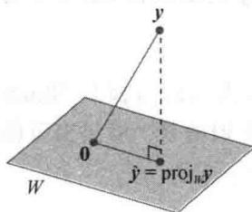
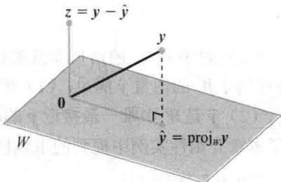
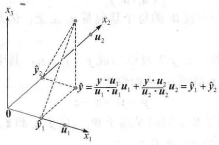
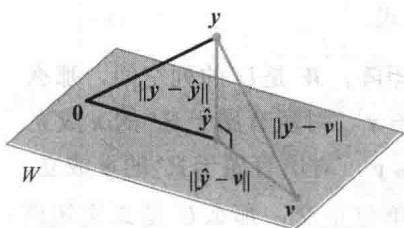

import Knowledge from '@/components/Knowledge.astro';
import Example from '@/components/Example.astro';
import Note from '@/components/Note.astro';
import Solution from '@/components/Solution.astro';
import Block from '@/components/Block.astro';

$\mathbb{R}^2$ 中点在通过原点的直线上的正交投影和 $\mathbb{R}^n$ 的情形非常类似. 对给定向量 $y$ 和 $\mathbb{R}^n$ 中子空间 $W$ ，存在属于 $W$ 的向量 $\hat{y}$ 满足：（1） $W$ 中有唯一向量 $\hat{y}$ ，使得 $y - \hat{y}$ 与 $W$ 正交，（2） $\hat{y}$ 是 $W$ 中唯一最接近 $y$ 的向量，见图6-17. $\hat{y}$ 的这两个性质提供了本章介绍性实例中提到的求线性方程组的最小二乘解的方法，完整的内容在6.5节中学习.

  

图6-17

为准备第一个定理，我们注意到，当 y 表示成 $R^{n}$ 空间中向量 $u_{1}, \cdots, u_{n}$ 的线性组合时，y 的和中的各项可分为两部分，使得 y 可写成

$$

\mathbf {y} = \mathbf {z} _ {1} + \mathbf {z} _ {2}

$$

其中， $z_{1}$ 是其中一些 $u_{i}$ 的线性组合， $z_{2}$ 是其余 $u_{i}$ 的线性组合。当 $\{u_{1},\cdots,u_{n}\}$ 是正交基时，这个思路特别有用。回忆在6.1节， $W^{\perp}$ 表示所有与W正交的向量集合。

<Example title="例 1">
假若 $\{u_{1},\cdots,u_{5}\}$ 是 $R^{5}$ 中的正交基，且

$$

\boldsymbol {y} = c _ {1} \boldsymbol {u} _ {1} + \dots + c _ {5} \boldsymbol {u} _ {5}

$$

考虑子空间 $W = \operatorname{Span}\{\boldsymbol{u}_{1}, \boldsymbol{u}_{2}\}$ ，并将 y 写成 W 中向量 $z_{1}$ 与 $W^{\perp}$ 中向量 $z_{2}$ 的和.

<Solution title="解">
$$

\mathbf {y} = \underbrace {c _ {1} \mathbf {u} _ {1} + c _ {2} \mathbf {u} _ {2}} _ {\mathbf {z} _ {1}} + \underbrace {c _ {3} \mathbf {u} _ {3} + c _ {4} \mathbf {u} _ {4} + c _ {5} \mathbf {u} _ {5}} _ {\mathbf {z} _ {2}}

$$

其中

$$

\begin{array}{r l} & {\pmb {z} _ {1} = c _ {1} \pmb {u} _ {1} + c _ {2} \pmb {u} _ {2} \text {属于} \mathrm{Span} \{\pmb {u} _ {1}, \pmb {u} _ {2} \}} \\ & {\pmb {z} _ {2} = c _ {3} \pmb {u} _ {3} + c _ {4} \pmb {u} _ {4} + c _ {5} \pmb {u} _ {5} \text {属于} \mathrm{Span} \{\pmb {u} _ {3}, \pmb {u} _ {4}, \pmb {u} _ {5} \}} \end{array}

$$

为证明 $z_{2}$ 属于 $W^{\perp}$ ，只需证明 $z_{2}$ 与以 $\{u_{1}, u_{2}\}$ 为基的空间 W 中的向量正交（见 6.1 节）。利用内积的性质计算

$$

\begin{array}{r l} \mathbf {z} _ {2} \cdot \mathbf {u} _ {1} & = (c _ {3} \mathbf {u} _ {3} + c _ {4} \mathbf {u} _ {4} + c _ {5} \mathbf {u} _ {5}) \cdot \mathbf {u} _ {1} \\ & = c _ {3} \mathbf {u} _ {3} \cdot \mathbf {u} _ {1} + c _ {4} \mathbf {u} _ {4} \cdot \mathbf {u} _ {1} + c _ {5} \mathbf {u} _ {5} \cdot \mathbf {u} _ {1} \\ & = 0 \end{array}

$$

上式中利用了 $u_{1}$ 与 $u_{3}$ ， $u_{4}$ 和 $u_{5}$ 的正交性。同样的计算可以证明 $z_{2} \cdot u_{2} = 0$ ，从而说明 $z_{2}$ 属于 $W^{\perp}$ 。下面的定理表明，在没有 $R^{n}$ 中的正交基时，对例 1 中的分解 $y = z_{1} + z_{2}$ 同样可以计算，只需 W 中有一个正交基即可。
</Solution>
</Example>

<Knowledge title="定理 8">
（正交分解定理）

若 W 是 $R^{n}$ 的一个子空间，那么 $R^{n}$ 中每一个向量 y 可以唯一表示为

$$

\mathbf {y} = \hat {\mathbf {y}} + z\tag{1}

$$

其中 $\hat{y}$ 属于 W 而 z 属于 $W^{\perp}$ . 实际上，如果 $\{u_{1},\cdots,u_{p}\}$ 是 W 的任意正交基，那么

$$

\hat {\mathbf {y}} = \frac {\mathbf {y} \cdot \mathbf {u} _ {1}}{\mathbf {u} _ {1} \cdot \mathbf {u} _ {1}} \mathbf {u} _ {1} + \dots + \frac {\mathbf {y} \cdot \mathbf {u} _ {p}}{\mathbf {u} _ {p} \cdot \mathbf {u} _ {p}} \mathbf {u} _ {p}\tag{2}

$$

且 $z = y - \hat{y}$

（1）式中的 $\hat{y}$ 称为 y 在 W 上的正交投影，常记作 $proj_{w}y$ 。见图 6-18。当 W 是一维子空间时， $\hat{y}$ 的公式和 6.2 节中的公式一致。

  

图 6-18 y 在 W 上的正交投影

<Solution title="证明">
若 $\{u_{1},\cdots,u_{p}\}$ 是 W 的正交基，且 $\hat{y}$ 用（2）式定义。 $^{\circledR}$ 由于 $\hat{y}$ 是基 $u_{1},\cdots,u_{p}$ 的线性组合，所以 $\hat{y}$ 属于 W。令 $z=y-\hat{y}$ ，由于 $u_{1}$ 正交于 $u_{2},\cdots,u_{p}$ ，因此从（2）式可以得出

$$

\mathbf {z} \cdot \mathbf {u} _ {1} = (\mathbf {y} - \hat {\mathbf {y}}) \cdot \mathbf {u} _ {1} = \mathbf {y} \cdot \mathbf {u} _ {1} - \left(\frac {\mathbf {y} \cdot \mathbf {u} _ {1}}{\mathbf {u} _ {1} \cdot \mathbf {u} _ {1}}\right) \mathbf {u} _ {1} \cdot \mathbf {u} _ {1} - 0 - \dots - 0 = \mathbf {y} \cdot \mathbf {u} _ {1} - \mathbf {y} \cdot \mathbf {u} _ {1} = 0

$$

从而 z 与 $u_{1}$ 正交. 类似地，z 与空间 W 的每个基向量 $u_{j}$ 正交，因此 z 与 W 中任何向量正交，即 z 属于 $W^{\perp}$ .

为证明分解（1）是唯一的，设 y 也可以写成 $y = \hat{y}_{1} + z_{1}$ ，其中 $\hat{y}_{1}$ 属于 W 而 $z_{1}$ 属于 $W^{\perp}$ ，那么 $\hat{y} + z = \hat{y}_{1} + z_{1}$ （由于两边的 y 相同），从而得出

$$

\hat {\boldsymbol {y}} - \hat {\boldsymbol {y}} _ {1} = \boldsymbol {z} _ {1} - \boldsymbol {z}

$$

这个等式表明向量 $v = \hat{y} - \hat{y}_{1}$ 属于 W，同时又属于 $W^{\perp}$ （由于 $z_{1}$ 和 z 属于 $W^{\perp}$ 且 $W^{\perp}$ 是子空间）。因此 $v \cdot v = 0$ ，这说明 v = 0，即证明 $\hat{y} = \hat{y}_{1}$ 且 $z_{1} = z$ 。

分解式（1）的唯一性表明，正交投影 $\hat{y}$ 仅依赖于 W，而不依赖于（2）中使用的特殊基.
</Solution>
</Knowledge>

<Example title="例 2">
假设 $\pmb{u}_1 = \begin{bmatrix} 2 \\ 5 \\ -1 \end{bmatrix}, \pmb{u}_2 = \begin{bmatrix} -2 \\ 1 \\ 1 \end{bmatrix}$ 和 $\pmb{y} = \begin{bmatrix} 1 \\ 2 \\ 3 \end{bmatrix}$ . 注意到 $\{\pmb{u}_1, \pmb{u}_2\}$ 是 $W = \operatorname{Span}\{\pmb{u}_1, \pmb{u}_2\}$ 的正交基，将 $\pmb{y}$ 写成属于 $W$ 的向量与正交于 $W$ 的向量之和.

<Solution title="解">
y 在 W 上的正交投影是

$$

\begin{array}{r l} \hat {\mathbf {y}} & = \frac {\mathbf {y} \cdot \mathbf {u} _ {1}}{\mathbf {u} _ {1} \cdot \mathbf {u} _ {1}} \mathbf {u} _ {1} + \frac {\mathbf {y} \cdot \mathbf {u} _ {2}}{\mathbf {u} _ {2} \cdot \mathbf {u} _ {2}} \mathbf {u} _ {2} \\ & = \frac {9}{3 0} \left[ \begin{array}{l} 2 \\ 5 \\ - 1 \end{array} \right] + \frac {3}{6} \left[ \begin{array}{l} - 2 \\ 1 \\ 1 \end{array} \right] = \frac {9}{3 0} \left[ \begin{array}{l} 2 \\ 5 \\ - 1 \end{array} \right] + \frac {1 5}{3 0} \left[ \begin{array}{l} - 2 \\ 1 \\ 1 \end{array} \right] = \left[ \begin{array}{l} - 2 / 5 \\ 2 \\ 1 / 5 \end{array} \right] \end{array}

$$

且

$$

\mathbf {y} - \hat {\mathbf {y}} = \left[ \begin{array}{c} 1 \\ 2 \\ 3 \end{array} \right] - \left[ \begin{array}{c} - 2 / 5 \\ 2 \\ 1 / 5 \end{array} \right] = \left[ \begin{array}{c} 7 / 5 \\ 0 \\ 1 4 / 5 \end{array} \right]

$$
</Solution>
</Example>

<Knowledge title="定理 8">
保证 $y - \hat{y}$ 属于 $W^{\perp}$ 。为检验计算，一个好的方法是验证 $y - \hat{y}$ 正交于 $u_{1}$ 和 $u_{2}$ ，因而正交于 W 。所期望的 y 的分解式是

$$

\mathbf {y} = \left[ \begin{array}{l} 1 \\ 2 \\ 3 \end{array} \right] = \left[ \begin{array}{c} - 2 / 5 \\ 2 \\ 1 / 5 \end{array} \right] + \left[ \begin{array}{c} 7 / 5 \\ 0 \\ 1 4 / 5 \end{array} \right]

$$

正交投影的几何解释

当 W 是一维子空间时，公式（2）的 $proj_{W}y$ 仅包含一项。这样，当 $\dim W > 1$ 时，（2）式中的每一项都是自身，即向量 y 在由 W 的一个基 u 所生成的一维子空间上的正交投影。图 6-19 表示当 W 是 $R^{3}$ 中由 $u_{1}$ 和 $u_{2}$ 所生成的子空间的情形。 $\hat{y}_{1}$ 和 $\hat{y}_{2}$ 分别表示 y 在由 $u_{1}$ 和 $u_{2}$ 所生成的直线上的投影，向量 y 在 W 上的正交投影 $\hat{y}$ 是 y 在两个相互正交的一维子空间上各自投影之和。图 6-19 中的向量 $\hat{y}$ 对应于 6.2 节图 6-13 中的向量 y，其原因是现在 $\hat{y}$ 属于 W。

  

图6-19 向量 $y$ 的正交投影等于它在相互正交的一维子空间上的投影之和
</Knowledge>

## 正交投影的性质

如果 $\{u_{1},\cdots,u_{p}\}$ 是 W 的正交基，且若 y 正好属于 W，那么 $proj_{w}y$ 的公式和 6.2 节中定理 5 里 y 的表达式完全一致。这种情形下， $proj_{w}y=y$ 。

如果 y 属于 $W = \text{Span}\{\boldsymbol{u}_{1}, \cdots, \boldsymbol{u}_{p}\}$ ，那么 $proj_{w} y = y$

这个结论可以从下列定理得出.

<Knowledge title="定理 9">
（最佳逼近定理）

假设 W 是 $R^{n}$ 的一个子空间，y 是 $R^{n}$ 中的任意向量， $\hat{y}$ 是 y 在 W 上的正交投影，那么 $\hat{y}$ 是 W 中最接近 y 的点，也就是

$$

\left\| \mathbf {y} - \hat {\mathbf {y}} \right\| <   \left\| \mathbf {y} - \mathbf {v} \right\|\tag{3}

$$

对所有属于W又异于 $\hat{y}$ 的v成立.

定理 9 中的向量 $\hat{y}$ 称为 W 中元素对 y 的最佳逼近. 在后面章节中, 我们会研究这样的问题, 即对给定的元素 y, 可以被某个给定子空间 W 中的向量 v 代替或 “逼近”. 用 $\|y-v\|$ 表示的从 y 到 v 的距离可以认为是用 v 代替 y 的 “误差”. 定理 9 说明误差在 $v=\hat{y}$ 处取得最小值.

方程（3）给出了一个新的证明，即 $\hat{y}$ 的计算不依赖于特定正交基。如果 W 的一个不同的正交基被用于构造 y 的正交投影，那么这个投影就是 W 中离 y 最近的点，记为 $\hat{y}$ 。

<Solution title="证明">
取 W 中的 v （不同于 $\hat{y}$ ），见图 6-20，则 $\hat{y}-v$ 是 W 中的向量。由正交分解定理， $y-\hat{y}$ 正交于 W，特别地， $y-\hat{y}$ 正交于 $\hat{y}-v$ 。由于

$$

\boldsymbol {y} - \boldsymbol {v} = (\boldsymbol {y} - \hat {\boldsymbol {y}}) + (\hat {\boldsymbol {y}} - \boldsymbol {v})

$$

故由勾股定理可知

$$

\left\| \mathbf {y} - \mathbf {v} \right\| ^ {2} = \left\| \mathbf {y} - \hat {\mathbf {y}} \right\| ^ {2} + \left\| \hat {\mathbf {y}} - \mathbf {v} \right\| ^ {2}

$$

（见图6-20中右边的直角三角形.每个边的长度均已标出.)因为 $\hat{\mathbf{y}} -\mathbf{v}\neq 0$ ，所以 $\| \hat{\mathbf{y}} -\mathbf{v}\| ^2 >0$ ，从而不等式（3）立刻推出.

  

图6-20 $y$ 在 $W$ 上的正交投影是 $W$ 中离 $y$ 最近的点
</Solution>
</Knowledge>

<Example title="例 3">
如果 $\pmb{u}_1 = \begin{bmatrix} 2 \\ 5 \\ -1 \end{bmatrix}, \pmb{u}_2 = \begin{bmatrix} -2 \\ 1 \\ 1 \end{bmatrix}, \pmb{y} = \begin{bmatrix} 1 \\ 2 \\ 3 \end{bmatrix}$ 和 $W = \operatorname{Span}\{\pmb{u}_1, \pmb{u}_2\}$ ，类似例2，则 $W$ 中离 $\pmb{y}$ 最近的点是

$$

\hat {\mathbf {y}} = \frac {\mathbf {y} \cdot \mathbf {u} _ {1}}{\mathbf {u} _ {1} \cdot \mathbf {u} _ {1}} \mathbf {u} _ {1} + \frac {\mathbf {y} \cdot \mathbf {u} _ {2}}{\mathbf {u} _ {2} \cdot \mathbf {u} _ {2}} \mathbf {u} _ {2} = \left[ \begin{array}{c} - 2 / 5 \\ 2 \\ 1 / 5 \end{array} \right]

$$
</Example>

<Example title="例 4">
$\mathbb{R}^n$ 中的一个点 $y$ 到一个子空间 $W$ 的距离定义为从 $y$ 到空间 $W$ 中最近点的距离，求出 $y$ 到 $W = \operatorname{Span}\{\pmb{u}_1, \pmb{u}_2\}$ 的距离，其中

$$

\mathbf {y} = \left[ \begin{array}{l} - 1 \\ - 5 \\ 1 0 \end{array} \right], \quad \mathbf {u} _ {1} = \left[ \begin{array}{l} 5 \\ - 2 \\ 1 \end{array} \right], \quad \mathbf {u} _ {2} = \left[ \begin{array}{l} 1 \\ 2 \\ - 1 \end{array} \right]

$$

<Solution title="解">
由最佳逼近定理，从 y 到 W 的距离是 $\left\|y-\hat{y}\right\|$ ，其中 $\hat{y}=\operatorname{proj}_{W}y$ 。由于 $\{u_{1},u_{2}\}$ 是 W 的正交基，我们得到

$$

\hat {\mathbf {y}} = \frac {1 5}{3 0} \mathbf {u} _ {1} + \frac {- 2 1}{6} \mathbf {u} _ {2} = \frac {1}{2} \left[ \begin{array}{c} 5 \\ - 2 \\ 1 \end{array} \right] - \frac {7}{2} \left[ \begin{array}{c} 1 \\ 2 \\ - 1 \end{array} \right] = \left[ \begin{array}{c} - 1 \\ - 8 \\ 4 \end{array} \right]

$$

$$

\mathbf {y} - \hat {\mathbf {y}} = \left[ \begin{array}{c} - 1 \\ - 5 \\ 1 0 \end{array} \right] - \left[ \begin{array}{c} - 1 \\ - 8 \\ 4 \end{array} \right] = \left[ \begin{array}{c} 0 \\ 3 \\ 6 \end{array} \right]

$$

$$

\left\| \mathbf {y} - \hat {\mathbf {y}} \right\| ^ {2} = 3 ^ {2} + 6 ^ {2} = 4 5

$$

从 y 到 W 的距离是 $\sqrt{45} = 3\sqrt{5}$ .

本节最后的定理说明，关于 $proj_{w}y$ 的公式（2）当 W 的基是单位正交集时如何被简化.
</Solution>
</Example>

<Knowledge title="定理 10">
如果 $\{u_{1},\cdots,u_{p}\}$ 是 $R^{n}$ 中子空间 W 的单位正交基，那么

$$

\operatorname{proj} _ {W} \boldsymbol {y} = (\boldsymbol {y} \cdot \boldsymbol {u} _ {1}) \boldsymbol {u} _ {1} + (\boldsymbol {y} \cdot \boldsymbol {u} _ {2}) \boldsymbol {u} _ {2} + \dots + (\boldsymbol {y} \cdot \boldsymbol {u} _ {p}) \boldsymbol {u} _ {p}\tag{4}

$$

如果 $U = [u_{1} \quad u_{2} \quad \cdots \quad u_{p}]$ ，则

$$

\mathrm{proj} _ {w} \pmb {y} = U U ^ {\mathrm{T}} \pmb {y}, \text {对所有} \pmb {y} \in \mathbb {R} ^ {n} \text {成立}\tag{5}

$$

<Solution title="证明">
公式（4）可由定理8中（2）式立刻推出，而且，（4）式说明 $proj_{w}y$ 是 U 的列的线性组合，对应权分别为 $y \cdot u_{1}, y \cdot u_{2}, \cdots, y \cdot u_{p}$ 。这些权同样可写成 $u_{1}^{T}y, u_{2}^{T}y, \cdots, u_{p}^{T}y$ 。表明它们是

$U^{T}y$ 中的元素，从而证明了(5)式.

若 U 是列单位正交的 $n \times p$ 矩阵，W 是 U 的列空间，那么

$U^{\mathrm{T}}U\pmb{x} = I_{p}\pmb{x} = \pmb{x}$ ，对所有属于 $\mathbb{R}^p$ 的 $\pmb{x}$ 成立 定理6

$UU^{\mathrm{T}}\pmb {y} = \mathrm{proj}_{W}\pmb{y}$ ，对所有属于 $\mathbb{R}^n$ 的 $\pmb{y}$ 成立 定理10

如果 U 是 $n \times n$ （方）阵，且列单位正交，那么 U 是正交矩阵，列空间 W 是全部 $R^{n}$ 空间，且 $UU^{T}y = Iy = y$ ，对所有 $y \in R^{n}$ 成立.

尽管公式（4）在理论上十分重要，实际上，它常包含数字的平方根运算（在 $u_{i}$ 的元素中），用手工运算时我们推荐使用公式（2）.
</Solution>
</Knowledge>

<Block title="练习题">

1. 令 $\pmb{u}_{1} = \begin{bmatrix} -7\\ 1\\ 4 \end{bmatrix}$ ， $\pmb{u}_2 = \begin{bmatrix} -1\\ 1\\ -2 \end{bmatrix}$ ， $\pmb {y} = \begin{bmatrix} -9\\ 1\\ 6 \end{bmatrix}$ ，且 $W = \mathrm{Span}\{\pmb{u}_1,\pmb{u}_2\}$ ，利用 $\pmb{u}_{1}$ 和 $\pmb{u}_{2}$ 正交计算projw y.

2. 设 W 是 $R^{n}$ 的子空间，x 和 y 是 $R^{n}$ 中的向量，且 $z = x + y$ 。如果 u 是 x 在 W 上的投影，v 是 y 在 W 上的投影。证明 $u + v$ 是 z 在 W 上的投影。

</Block>

<Block title="习题6.3">

在习题 1 和习题 2 中，我们假设 $\{u_{1},\cdots,u_{4}\}$ 是 $R^{4}$ 中的正交基.

$$

1. \quad \boldsymbol {u} _ {1} = \left[ \begin{array}{c} 0 \\ 1 \\ - 4 \\ - 1 \end{array} \right], \quad \boldsymbol {u} _ {2} = \left[ \begin{array}{c} 3 \\ 5 \\ 1 \\ 1 \end{array} \right], \quad \boldsymbol {u} _ {3} = \left[ \begin{array}{c} 1 \\ 0 \\ 1 \\ - 4 \end{array} \right], \quad \boldsymbol {u} _ {4} = \left[ \begin{array}{c} 5 \\ - 3 \\ - 1 \\ 1 \end{array} \right],

$$

$x=\begin{bmatrix}10\\-8\\2\\0\end{bmatrix}$ . 将 $\dot{x}$ 写成两个向量之和，一个属于

Span $\{u_{1},u_{2},u_{3}\}$ ，另一个属于Span $\{u_{4}\}$ .

$$

2. \quad \boldsymbol {u} _ {1} = \left[ \begin{array}{l} 1 \\ 2 \\ 1 \\ 1 \end{array} \right], \quad \boldsymbol {u} _ {2} = \left[ \begin{array}{c} - 2 \\ 1 \\ - 1 \\ 1 \end{array} \right], \quad \boldsymbol {u} _ {3} = \left[ \begin{array}{c} 1 \\ 1 \\ - 2 \\ - 1 \end{array} \right], \quad \boldsymbol {u} _ {4} = \left[ \begin{array}{c} - 1 \\ 1 \\ 1 \\ - 2 \end{array} \right]

$$

$v=\begin{bmatrix}4\\ 5\\ -3\\ 3\end{bmatrix}$ . 将 v 写成两个向量之和，一个属于

$$

\boldsymbol {y} = \left[ \begin{array}{c} - 1 \\ 4 \\ 3 \end{array} \right], \quad \boldsymbol {u} _ {1} = \left[ \begin{array}{c} 1 \\ 1 \\ 0 \end{array} \right], \quad \boldsymbol {u} _ {2} = \left[ \begin{array}{c} - 1 \\ 1 \\ 0 \end{array} \right]

$$

Span $\{u_{1}\}$ ，另一个属于 Span $\{u_{2}, u_{3}, u_{4}\}$ .

并找出 y 在 $\operatorname{Span}\{u_{1}, u_{2}\}$ 上的正交投影.

在习题 3\~6 中，验证 $\{u_{1}, u_{2}\}$ 是一个正交集，

$$

\boldsymbol {y} = \left[ \begin{array}{c} 6 \\ 3 \\ - 2 \end{array} \right], \quad \boldsymbol {u} _ {1} = \left[ \begin{array}{c} 3 \\ 4 \\ 0 \end{array} \right], \quad \boldsymbol {u} _ {2} = \left[ \begin{array}{c} - 4 \\ 3 \\ 0 \end{array} \right]

$$

$$

\mathbf {y} = \left[ \begin{array}{c} - 1 \\ 2 \\ 6 \end{array} \right], \quad \mathbf {u} _ {1} = \left[ \begin{array}{c} 3 \\ - 1 \\ 2 \end{array} \right], \quad \mathbf {u} _ {2} = \left[ \begin{array}{c} 1 \\ - 1 \\ - 2 \end{array} \right]

$$

$$

\mathbf {y} = \left[ \begin{array}{l} 6 \\ 4 \\ 1 \end{array} \right], \quad \mathbf {u} _ {1} = \left[ \begin{array}{l} - 4 \\ - 1 \\ 1 \end{array} \right], \quad \mathbf {u} _ {2} = \left[ \begin{array}{l} 0 \\ 1 \\ 1 \end{array} \right]

$$

在习题 7\~10 中，设 W 是由 u 生成的子空间，将 y 写成 W 中的向量与正交于 W 的向量之和.

$$

\mathbf {y} = \left[ \begin{array}{l} 1 \\ 3 \\ 5 \end{array} \right], \quad \mathbf {u} _ {1} = \left[ \begin{array}{c} 1 \\ 3 \\ - 2 \end{array} \right], \quad \mathbf {u} _ {2} = \left[ \begin{array}{l} 5 \\ 1 \\ 4 \end{array} \right]

$$

8.

$$

\boldsymbol {y} = \left[ \begin{array}{c} - 1 \\ 4 \\ 3 \end{array} \right], \quad \boldsymbol {u} _ {1} = \left[ \begin{array}{c} 1 \\ 1 \\ 1 \end{array} \right], \quad \boldsymbol {u} _ {2} = \left[ \begin{array}{c} - 1 \\ 3 \\ - 2 \end{array} \right]

$$

$$

9. \quad \mathbf {y} = \left[ \begin{array}{c} 4 \\ 3 \\ 3 \\ - 1 \end{array} \right], \quad \mathbf {u} _ {1} = \left[ \begin{array}{c} 1 \\ 1 \\ 0 \\ 1 \end{array} \right], \quad \mathbf {u} _ {2} = \left[ \begin{array}{c} - 1 \\ 3 \\ 1 \\ - 2 \end{array} \right], \quad \mathbf {u} _ {3} = \left[ \begin{array}{c} - 1 \\ 0 \\ 1 \\ 1 \end{array} \right]

$$

$$

1 0. \quad \mathbf {y} = \left[ \begin{array}{l} 3 \\ 4 \\ 5 \\ 6 \end{array} \right], \quad \mathbf {u} _ {1} = \left[ \begin{array}{c} 1 \\ 1 \\ 0 \\ - 1 \end{array} \right], \quad \mathbf {u} _ {2} = \left[ \begin{array}{l} 1 \\ 0 \\ 1 \\ 1 \end{array} \right], \quad \mathbf {u} _ {3} = \left[ \begin{array}{l} 0 \\ - 1 \\ 1 \\ - 1 \end{array} \right]

$$

在习题 11 和习题 12 中，在 $v_{1}$ 和 $v_{2}$ 所生成的子空间 W 中，找出距离 y 最近的点.

$$

1 1. \quad \mathbf {y} = \left[ \begin{array}{l} 3 \\ 1 \\ 5 \\ 1 \end{array} \right], \quad \mathbf {v} _ {1} = \left[ \begin{array}{c} 3 \\ 1 \\ - 1 \\ 1 \end{array} \right], \quad \mathbf {v} _ {2} = \left[ \begin{array}{l} 1 \\ - 1 \\ 1 \\ - 1 \end{array} \right]

$$

$$

1 2. \quad \boldsymbol {y} = \left[ \begin{array}{r} 3 \\ - 1 \\ 1 \\ 1 3 \end{array} \right], \quad \boldsymbol {v} _ {1} = \left[ \begin{array}{r} 1 \\ - 2 \\ - 1 \\ 2 \end{array} \right], \quad \boldsymbol {v} _ {2} = \left[ \begin{array}{r} - 4 \\ 1 \\ 0 \\ 3 \end{array} \right]

$$

在习题 13 和习题 14 中，在形如 $c_{1}v_{1} + c_{2}v_{2}$ 的向量中找出最接近 z 的向量.

$$

\mathbf {z} = \left[ \begin{array}{c} 3 \\ - 7 \\ 2 \\ 3 \end{array} \right], \quad \mathbf {v} _ {1} = \left[ \begin{array}{c} 2 \\ - 1 \\ - 3 \\ 1 \end{array} \right], \quad \mathbf {v} _ {2} = \left[ \begin{array}{c} 1 \\ 1 \\ 0 \\ - 1 \end{array} \right]

$$

$$

1 4. \quad z = \left[ \begin{array}{c} 2 \\ 4 \\ 0 \\ - 1 \end{array} \right], \quad v _ {1} = \left[ \begin{array}{c} 2 \\ 0 \\ - 1 \\ - 3 \end{array} \right], \quad v _ {2} = \left[ \begin{array}{c} 5 \\ - 2 \\ 4 \\ 2 \end{array} \right]

$$

15. 假设 $y=\begin{bmatrix}5\\ -9\\ 5\end{bmatrix}$ ， $u_{1}=\begin{bmatrix}-3\\ -5\\ 1\end{bmatrix}$ ， $u_{2}=\begin{bmatrix}-3\\ 2\\ 1\end{bmatrix}$ ，找出向

$$

\mathbb {R} ^ {3}

$$

$$

\boldsymbol {u} _ {1}

$$

$$

\boldsymbol {u} _ {2}

$$

16. 若 y, $v_{1}$ 和 $v_{2}$ 如习题 12 中所示，找出 y 到 $R^{4}$ 中由 $v_{1}$ 和 $v_{2}$ 所生成的子空间的距离.

17. 设 $y=\begin{bmatrix}4\\ 8\\ 1\end{bmatrix}$ ， $u_{1}=\begin{bmatrix}2/3\\ 1/3\\ 2/3\end{bmatrix}$ ， $u_{2}=\begin{bmatrix}-2/3\\ 2/3\\ 1/3\end{bmatrix}$ ，且 $W = \text{Span}\{\boldsymbol{u}_{1}, \boldsymbol{u}_{2}\}$ .

a. 若 $U = [u_{1} \quad u_{2}]$ ，计算 $U^{T}U$ 和 $UU^{T}$ .

b. 计算 $proj_{w}y$ 和 $(UU^{\mathrm{T}})y$ .

18. 设 $y=\begin{bmatrix}7\\ 9\end{bmatrix}, u_{1}=\begin{bmatrix}1/\sqrt{10}\\ -3/\sqrt{10}\end{bmatrix}$ 和 $W=\operatorname{Span}\{\pmb{u}_{1}\}$ .

a. 若 U 是 $2 \times 1$ 矩阵，其列向量为 $u_{1}$ ，计算 $U^{T}U$ 和 $UU^{T}$ .

b. 计算 $proj_{w}y$ 和 $(UU^{\mathrm{T}})y$ .

19. 假设 $u_{1}=\begin{bmatrix}1\\ 1\\ -2\end{bmatrix},u_{2}=\begin{bmatrix}5\\ -1\\ 2\end{bmatrix}$ 和 $u_{3}=\begin{bmatrix}0\\ 0\\ 1\end{bmatrix}$ ，注意 $u_{1}$ 和 $u_{2}$ 正交，但 $u_{3}$ 和 $u_{1}$ 或 $u_{2}$ 不正交，可以证明 $u_{3}$ 不属于 $u_{1}$ 和 $u_{2}$ 所生成的子空间。利用这个事实，构造 $R^{3}$ 中与 $u_{1}$ 和 $u_{2}$ 正交的非零向量 v。

20. 设 $u_{1}$ 和 $u_{2}$ 如习题 19 所示，且 $u_{4}=\begin{bmatrix}0\\ 1\\ 0\end{bmatrix}$ ，可以证明 $u_{4}$ 不属于 $u_{1}$ 和 $u_{2}$ 所生成的子空间 W．利用这个结论构造 $R^{3}$ 中与 $u_{1}$ 和 $u_{2}$ 正交的非零向量 v.

在习题 21\~22 中，所有向量和子空间均属于 $R^{n}$ ，判断下列结论的正误，验证每个结论.

21. a. 如果 $z$ 与 $\pmb{u}_1$ 和 $\pmb{u}_2$ 正交，且 $W = \operatorname{Span}\{\pmb{u}_1, \pmb{u}_2\}$ ，那么 $z$ 一定属于 $W^\perp$ .

b. 对任一向量 y 和任一子空间 W，向量 $y - proj_{w}y$ 正交于 W.

c. y 在子空间 W 上的正交投影 $\hat{y}$ 的计算有时可能依赖于 W 正交基的选取.

d. 如果 y 属于子空间 W，那么 y 在 W 上的正交投影是 y 本身.

e. 如果 $n \times p$ 矩阵 $U$ 的列是单位正交的，那么 $UU^{\mathrm{T}}y$ 是 $y$ 在 $U$ 的列空间上的正交投影.

22. a. 如果 W 是 $R^{n}$ 的子空间，且 v 属于 W 和 $W^{\perp}$ ，那么 v 一定是零向量.

b. 在正交分解定理中，公式（2）中 $\hat{y}$ 的每一项在 W 的子空间上的正交投影是它本身.

c. 如果 $y = z_{1} + z_{2}$ ，其中 $z_{1}$ 属于子空间 W 且 $z_{2}$ 属于子空间 $W^{\perp}$ ，那么 $z_{1}$ 一定是 y 在 W 上的正交投影.

d. 子空间 W 中的元素对向量 y 的最佳逼近是向量 $y - proj_{w}y$ .

e. 如果一个 $n \times p$ 矩阵 $U$ 有单位正交列，那么

$UU^{\mathrm{T}}\pmb {x} = \pmb{x}$ 对所有 $\pmb {x}\in \mathbb{R}^n$ 成立.

23. 若 $A$ 是 $m \times n$ 矩阵，证明 $\mathbb{R}^n$ 中任一向量 $x$ 可以写成 $x = p + u$ 的形式，其中 $p$ 属于Row $A$ 且 $u$ 属于Nul $A$ 。同样可以证明：如果方程 $Ax = b$ 是相容的，那么存在唯一向量 $p$ 属于Row $A$ ，使得 $Ap = b$ 。

24. 假若 W 是 $R^{n}$ 的一个子空间且 $\{w_{1},\cdots,w_{p}\}$ 是 W 的一个正交基， $\{v_{1},\cdots,v_{q}\}$ 是 $W^{\perp}$ 的正交基.

a. 说明为什么 $\{\pmb{w}_1, \dots, \pmb{w}_p, \pmb{v}_1, \dots, \pmb{v}_q\}$ 是正交集.  

b. 说明为什么（a）中的集合可以生成 $\mathbb{R}^n$ .  

c. 证明 $\dim W + \dim W^\perp = n$ .

25. [M] 若 $U$ 是6.2节中习题36中的 $8 \times 4$ 矩阵，在Col $U$ 中找出最接近 $y = (1,1,1,1,1,1,1,1,1)$ 的点，写出你解决该问题所使用的键击内容或命令.

26. [M] 假设 $U$ 是习题 25 中的矩阵，求出从 $\pmb{b} = (1,1,1,1,-1,-1,-1,-1)$ 到 $\operatorname{Col} U$ 的距离.

</Block>

<Block title="练习题答案">

1. 计算

$$

\operatorname{proj} _ {W} \mathbf {y} = \frac {\mathbf {y} \cdot \mathbf {u} _ {1}}{\mathbf {u} _ {1} \cdot \mathbf {u} _ {1}} \mathbf {u} _ {1} + \frac {\mathbf {y} \cdot \mathbf {u} _ {2}}{\mathbf {u} _ {2} \cdot \mathbf {u} _ {2}} \mathbf {u} _ {2} = \frac {8 8}{6 6} \mathbf {u} _ {1} + \frac {- 2}{6} \mathbf {u} _ {2} = \frac {4}{3} \left[ \begin{array}{c} - 7 \\ 1 \\ 4 \end{array} \right] - \frac {1}{3} \left[ \begin{array}{c} - 1 \\ 1 \\ - 2 \end{array} \right] = \left[ \begin{array}{c} - 9 \\ 1 \\ 6 \end{array} \right] = \mathbf {y}

$$

在这种情形下，y恰好是 $u_{1}$ 和 $u_{2}$ 的线性组合，从而y属于W，即W中最接近y的点是y本身.

2. 利用定理10，设 $U$ 是一个矩阵，它的列向量构成 $W$ 的一组标准正交基. 则

$$

\operatorname{proj} _ {w} \mathbf {z} = U U ^ {\mathrm{T}} \mathbf {z} = U U ^ {\mathrm{T}} (\mathbf {x} + \mathbf {y}) = U U ^ {\mathrm{T}} \mathbf {x} + U U ^ {\mathrm{T}} \mathbf {y} = \operatorname{proj} _ {w} \mathbf {x} + \operatorname{proj} _ {w} \mathbf {y} = \mathbf {u} + \mathbf {v}

$$

</Block>
