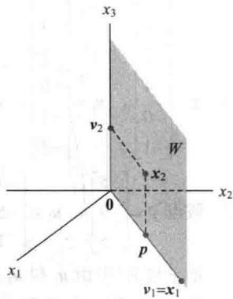
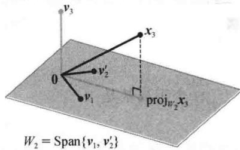

import Guide from '@/components/Guide.astro';
import Knowledge from '@/components/Knowledge.astro';
import Example from '@/components/Example.astro';
import Analysis from '@/components/Analysis.astro';
import Solution from '@/components/Solution.astro';
import Variant from '@/components/Variant.astro';
import Note from '@/components/Note.astro';
import Block from '@/components/Block.astro';
import Method from '@/components/Method.astro';
import Exercise from '@/components/Exercise.astro';

格拉姆-施密特方法是对 $\mathbb{R}^n$ 中任何非零子空间构造正交基或标准正交基的简单算法，本节前面两个例题顺便给出计算步骤.

<Example title="例 1">
假设 $W = \text{Span}\{\boldsymbol{x}_{1}, \boldsymbol{x}_{2}\}$ ，其中 $x_{1} = \begin{bmatrix} 3 \\ 6 \\ 0 \end{bmatrix}$ ， $x_{2} = \begin{bmatrix} 1 \\ 2 \\ 2 \end{bmatrix}$ 。构造 $W = \text{Span}\{\boldsymbol{x}_{1}, \boldsymbol{x}_{2}\}$ 的一个正交基。

<Solution title="解">
子空间 W 如图 6-21 所示，沿着 $x_{1}$ ， $x_{2}$ 和 $x_{2}$ 在 $x_{1}$ 上的投影 p。与 $x_{1}$ 正交的 $x_{2}$ 的分量是 $x_{2}-p$ ，它属于 W，其原因是它由 $x_{2}$ 和 $x_{1}$ 的倍数相加得到。取 $v_{1}=x_{1}$ ，可得

$$
\boldsymbol {v} _ {2} = \boldsymbol {x} _ {2} - \boldsymbol {p} = \boldsymbol {x} _ {2} - \frac {\boldsymbol {x} _ {2} \cdot \boldsymbol {x} _ {1}}{\boldsymbol {x} _ {1} \cdot \boldsymbol {x} _ {1}} \cdot \boldsymbol {x} _ {1} = \left[ \begin{array}{l} 1 \\ 2 \\ 2 \end{array} \right] - \frac {1 5}{4 5} \left[ \begin{array}{l} 3 \\ 6 \\ 0 \end{array} \right] = \left[ \begin{array}{l} 0 \\ 0 \\ 2 \end{array} \right]
$$

<figure class="vp-figure">
  
  <figcaption>图6-21 正交基 $\{\pmb{v}_1,\pmb{v}_2\}$ 的构造</figcaption>
</figure>

那么 $\{\pmb{v}_1, \pmb{v}_2\}$ 是空间 $W$ 的非零向量构成的正交集. 由于 $\dim W = 2$ ，可知集 $\{\pmb{v}_1, \pmb{v}_2\}$ 构成 $W$ 的一个基. 下面的例子详细说明了格拉姆-施密特方法，请仔细学习.
</Solution>
</Example>

<Example title="例 2">
设 $x_{1} = \begin{bmatrix} 1 \\ 1 \\ 1 \\ 1 \end{bmatrix}$ , $x_{2} = \begin{bmatrix} 0 \\ 1 \\ 1 \\ 1 \end{bmatrix}$ , $x_{3} = \begin{bmatrix} 0 \\ 0 \\ 1 \\ 1 \end{bmatrix}$ . 那么 $\{x_{1}, x_{2}, x_{3}\}$ 显然线性无关，且构成 $\mathbb{R}^{4}$ 的子空间

W 的一个基. 试构造 W 的一个正交基.

<Solution title="解">
步骤 1. 取 $v_{1}=x_{1}$ 和 $W_{1}=Span\{x_{1}\}=Span\{v_{1}\}$ .

步骤2. 取 $\pmb{v}_{2}$ 是 $x_{2}$ 减去它在子空间 $W_{1}$ 上的投影所得到的向量，即

$$
\begin{array}{r l} & {\pmb {v} _ {2} = \pmb {x} _ {2} - \mathrm{proj} _ {W _ {1}} \pmb {x} _ {2}} \\ & {\qquad = \pmb {x} _ {2} - \frac {\pmb {x} _ {2} \cdot \pmb {v} _ {1}}{\pmb {v} _ {1} \cdot \pmb {v} _ {1}} \pmb {v} _ {1} (\text {因为} \pmb {v} _ {1} = \pmb {x} _ {1})} \end{array}
$$

$$
= \left[ \begin{array}{l} 0 \\ 1 \\ 1 \\ 1 \end{array} \right] - \frac {3}{4} \left[ \begin{array}{l} 1 \\ 1 \\ 1 \\ 1 \end{array} \right] = \left[ \begin{array}{c} - 3 / 4 \\ 1 / 4 \\ 1 / 4 \\ 1 / 4 \end{array} \right]
$$

像例 1 一样， $v_{2}$ 是 $x_{2}$ 正交于 $x_{1}$ 的分量，且 $\{v_{1}, v_{2}\}$ 是由 $x_{1}$ 和 $x_{2}$ 所生成的子空间 $W_{2}$ 的一个正交基。步骤 2'（可选的）。如果合适，缩放 $v_{2}$ 以简化后面的计算。由于 $v_{2}$ 具有分数元素，很方便用因子 4 重新度量向量 $v_{2}$ ，用下面两个正交基代替 $\{v_{1}, v_{2}\}$ ：

$$
\boldsymbol {v} _ {1} = \left[ \begin{array}{l} 1 \\ 1 \\ 1 \\ 1 \end{array} \right], \boldsymbol {v} _ {2} ^ {\prime} = \left[ \begin{array}{c} - 3 \\ 1 \\ 1 \\ 1 \end{array} \right]
$$

步骤3. 取 $\pmb{v}_{3}$ 是 $\pmb{x}_{3}$ 减去它在子空间 $W_{2}$ 上的投影所得到的向量. 先利用正交基 $\{\pmb{v}_{1},\pmb{v}_{2}^{\prime}\}$ 计算 $\pmb{x}_{3}$ 在 $W_{2}$ 上的投影:

$$
\begin{array}{r l} & {\mathbf {x} _ {3} \text {在} \nu_ {1} \text {上}} \\ & {\quad \text {的投影}} \\ & {\quad \downarrow} \\ & {\mathrm{proj} _ {W _ {2}} \mathbf {x} _ {3} = \frac {\mathbf {x} _ {3} \cdot \mathbf {v} _ {1}}{\mathbf {v} _ {1} \cdot \mathbf {v} _ {1}} \mathbf {v} _ {1} + \frac {\mathbf {x} _ {3} \cdot \mathbf {v} _ {2} ^ {\prime}}{\mathbf {v} _ {2} ^ {\prime} \cdot \mathbf {v} _ {2} ^ {\prime}} \mathbf {v} _ {2} ^ {\prime}} \\ & {\qquad = \frac {2}{4} \left[ \begin{array}{l} 1 \\ 1 \\ 1 \\ 1 \end{array} \right] + \frac {2}{1 2} \left[ \begin{array}{l} - 3 \\ 1 \\ 1 \\ 1 \end{array} \right] = \left[ \begin{array}{l} 0 \\ 2 / 3 \\ 2 / 3 \\ 2 / 3 \end{array} \right]} \end{array}
$$

那么 $v_{3}$ 是 $x_{3}$ 正交于 $W_{2}$ 的分量，具体为

$$
\boldsymbol {v} _ {3} = \boldsymbol {x} _ {3} - \operatorname{proj} _ {W _ {2}} \boldsymbol {x} _ {3} = \left[ \begin{array}{l} 0 \\ 0 \\ 1 \\ 1 \end{array} \right] - \left[ \begin{array}{l} 0 \\ 2 / 3 \\ 2 / 3 \\ 2 / 3 \end{array} \right] = \left[ \begin{array}{l} 0 \\ - 2 / 3 \\ 1 / 3 \\ 1 / 3 \end{array} \right]
$$

从图 6-22 可以看到构造的图解. 观察可得 $v_{3}$ 属于 W，原因是 $x_{3}$ 和 $proj_{w_{2}}x_{3}$ 都属于 W. 从而 $\{v_{1},v_{2}^{\prime},v_{3}\}$ 是 W 中非零向量构成的正交集（因而是线性无关集）. W 是三维空间，这是因为它的基又包含三个向量，所以由 4.5 节的基定理可知， $\{v_{1},v_{2}^{\prime},v_{3}\}$ 是 W 的正交基.

<figure class="vp-figure">
  
  <figcaption>图 6-22 从 $x_{3}$ 和 $W_{2}$ 构造出 $v_{3}$</figcaption>
</figure>

下面定理的证明说明这种方法确实有效. 向量缩放的步骤没有涉及, 原因是缩放只对手工计算作简化.
</Solution>
</Example>

<Knowledge title="定理 11 格拉姆-施密特方法">
对 $R^{n}$ 的子空间 W 的一个基 $\{x_{1},\cdots,x_{p}\}$ ，定义

$$
\begin{array}{l} \boldsymbol {v} _ {1} = \boldsymbol {x} _ {1} \\ \boldsymbol {v} _ {2} = \boldsymbol {x} _ {2} - \frac {\boldsymbol {x} _ {2} \cdot \boldsymbol {v} _ {1}}{\boldsymbol {v} _ {1} \cdot \boldsymbol {v} _ {1}} \boldsymbol {v} _ {1} \\ \boldsymbol {v} _ {3} = \boldsymbol {x} _ {3} - \frac {\boldsymbol {x} _ {3} \cdot \boldsymbol {v} _ {1}}{\boldsymbol {v} _ {1} \cdot \boldsymbol {v} _ {1}} \boldsymbol {v} _ {1} - \frac {\boldsymbol {x} _ {3} \cdot \boldsymbol {v} _ {2}}{\boldsymbol {v} _ {2} \cdot \boldsymbol {v} _ {2}} \boldsymbol {v} _ {2} \\ \vdots \\ \boldsymbol {v} _ {p} = \boldsymbol {x} _ {p} - \frac {\boldsymbol {x} _ {p} \cdot \boldsymbol {v} _ {1}}{\boldsymbol {v} _ {1} \cdot \boldsymbol {v} _ {1}} \boldsymbol {v} _ {1} - \frac {\boldsymbol {x} _ {p} \cdot \boldsymbol {v} _ {2}}{\boldsymbol {v} _ {2} \cdot \boldsymbol {v} _ {2}} \boldsymbol {v} _ {2} - \dots - \frac {\boldsymbol {x} _ {p} \cdot \boldsymbol {v} _ {p - 1}}{\boldsymbol {v} _ {p - 1} \cdot \boldsymbol {v} _ {p - 1}} \boldsymbol {v} _ {p - 1} \end{array}
$$

那么 $\{v_{1},\cdots,v_{p}\}$ 是 W 的一个正交基. 此外,

$$
\mathrm{Span} \{\pmb {v} _ {1}, \dots , \pmb {v} _ {k} \} = \mathrm{Span} \{\pmb {x} _ {1}, \dots , \pmb {x} _ {k} \}, \text {其中} 1 \leqslant k \leqslant p\tag{1}
$$

<Solution title="证明">
对 $1 \leqslant k \leqslant p$ ，取 $W_{k} = \text{Span}\{\boldsymbol{x}_{1}, \cdots, \boldsymbol{x}_{k}\}$ 。令 $\boldsymbol{v}_{1} = \boldsymbol{x}_{1}$ ，则有 $\text{Span}\{\boldsymbol{v}_{1}\} = \text{Span}\{\boldsymbol{x}_{1}\}$ 。假若对 $k < p$ ，我们已经构造 $\boldsymbol{v}_{1}, \cdots, \boldsymbol{v}_{k}$ ，使得 $\{\boldsymbol{v}_{1}, \cdots, \boldsymbol{v}_{k}\}$ 是 $W_{k}$ 的一个正交基。定义

$$
\boldsymbol {v} _ {k + 1} = \boldsymbol {x} _ {k + 1} - \operatorname{proj} _ {W _ {k}} \boldsymbol {x} _ {k + 1}\tag{2}
$$

由正交分解定理知， $v_{k+1}$ 正交于 $W_{k}$ 。注意向量 $proj_{W_{k}}x_{k+1}$ 属于 $W_{k}$ ，因而也属于 $W_{k+1}$ 。由于 $x_{k+1}$ 属于 $W_{k+1}$ ，从而 $v_{k+1}$ 也属于 $W_{k+1}$ （因为 $W_{k+1}$ 是子空间，且减法封闭）。更进一步，由于 $x_{k+1}$ 不属于 $W_{k}=\operatorname{Span}\{x_{1},\cdots,x_{k}\}$ ，故 $v_{k+1}\neq0$ 。因而 $\{v_{1},\cdots,v_{k+1}\}$ 是 $(k+1)$ 维空间 $W_{k+1}$ 中非零向量形成的正交集。由 4.5 节的基定理可知，这个集合是 $W_{k+1}$ 的正交基。从而 $W_{k+1}=\operatorname{Span}\{v_{1},\cdots,v_{k+1}\}$ ，当 k+1=p 时成立，归纳证明过程结束。
</Solution>
</Knowledge>

定理 11 说明任何 $R^{n}$ 中的非零子空间 W 有一个正交基，这是因为普通的基 $\{x_{1},\cdots,x_{p}\}$ 总是存在的（由 4.5 节中定理 11），而格拉姆-施密特方法仅依赖于在有正交基的子空间 W 上的正交投影的存在性.

## 标准正交基

一个标准正交基很容易从一个正交基 $\{v_{1},\cdots,v_{p}\}$ 得到：只需单位化所有 $v_{k}$ 。当问题用手工计算时，它比一开始找到 $v_{k}$ 就将其单位化更容易（因为可避免不必要的平方根运算）。

<Example title="例 3">
在例1中，我们构造正交集

$$
\boldsymbol {v} _ {1} = \left[ \begin{array}{l} 3 \\ 6 \\ 0 \end{array} \right], \boldsymbol {v} _ {2} = \left[ \begin{array}{l} 0 \\ 0 \\ 2 \end{array} \right]
$$

一个正交基是

$$
\boldsymbol {u} _ {1} = \frac {1}{\left\| \boldsymbol {v} _ {1} \right\|} \boldsymbol {v} _ {1} = \frac {1}{\sqrt {4 5}} \left[ \begin{array}{l} 3 \\ 6 \\ 0 \end{array} \right] = \left[ \begin{array}{c} 1 / \sqrt {5} \\ 2 / \sqrt {5} \\ 0 \end{array} \right]
$$

$$
\pmb {u} _ {2} = \frac {1}{\| \pmb {v} _ {2} \|} \pmb {v} _ {2} = \left[ \begin{array}{l} 0 \\ 0 \\ 1 \end{array} \right]
$$
</Example>

## 矩阵的QR分解

如果 $m \times n$ 矩阵 A 的列 $x_{1}, \cdots, x_{n}$ 线性无关，那么应用格拉姆-施密特方法（包含单位化）于 $x_{1}, \cdots, x_{n}$ 等同于按下面定理描述的方法分解 A。这种分解方法广泛应用在各种计算机算法中，如解方程（6.5 节讨论）和求特征值（5.2 节的习题中提到）。

<Knowledge title="定理 12 QR分解">
如果 $m \times n$ 矩阵 $A$ 的列线性无关, 那么 $A$ 可以分解为 $A = QR$ , 其中 $Q$ 是一个 $m \times n$ 矩阵, 其列形成 $\operatorname{Col} A$ 的一个标准正交基, $R$ 是一个 $n \times n$ 上三角可逆矩阵且在对角线上的元素为正数.

<Solution title="证明">
A 的列向量形成 $\operatorname{Col} A$ 的一个基 $\{x_{1},\cdots,x_{n}\}$ 。构造 W=Col A 的一个标准正交基 $\{u_{1},\cdots,u_{n}\}$ ，且具有定理 11 中的性质（1）。这个基的构造可由格拉姆-施密特方法或其他方法完成。取

$$
Q = \left[ \begin{array}{l l l l} \boldsymbol {u} _ {1} & \boldsymbol {u} _ {2} & \dots & \boldsymbol {u} _ {n} \end{array} \right]
$$

对 $k=1,\cdots,n$ ， $x_{k}$ 属于 $\operatorname{Span}\{x_{1},\cdots,x_{k}\}=\operatorname{Span}\{u_{1},\cdots,u_{k}\}$ 。所以存在常数 $r_{1k},\cdots,r_{kk}$ ，使得

$$
\boldsymbol {x} _ {k} = r _ {1 k} \boldsymbol {u} _ {1} + \dots + r _ {k k} \boldsymbol {u} _ {k} + 0 \cdot \boldsymbol {u} _ {k + 1} + \dots + 0 \cdot \boldsymbol {u} _ {n}
$$

我们可以假设 $r_{kk} \geqslant 0$ （如果 $r_{kk} < 0$ ，对 $r_{kk}$ 和 $\pmb{u}_k$ 都乘-1），这表明 $\pmb{x}_k$ 是 $Q$ 的列的线性组合，且权是下面向量中的元素：

$$
\boldsymbol {r} _ {k} = \left[ \begin{array}{c} r _ {1 k} \\ \vdots \\ r _ {k k} \\ 0 \\ \vdots \\ 0 \end{array} \right]
$$

即 $x_{k}=Qr_{k}$ ，其中 $k=1,\cdots,n$ 。取 $R=[r_{1}\cdots r_{n}]$ 。那么

$$
A = \left[ \boldsymbol {x} _ {1} \dots \boldsymbol {x} _ {n} \right] = \left[ Q \boldsymbol {r} _ {1} \dots Q \boldsymbol {r} _ {n} \right] = Q R
$$

R 可逆的结论可从下面 Col A 线性无关的事实立刻得到（习题 19）。因为 R 是上三角形矩阵，故它的非负对角元素必为正值。
</Solution>
</Knowledge>

<Example title="例 4">
求 $A = \begin{bmatrix} 1 & 0 & 0\\ 1 & 1 & 0\\ 1 & 1 & 1\\ 1 & 1 & 1 \end{bmatrix}$ 的一个QR分解.

<Solution title="解">
$A$ 的列向量为例2中的 $\pmb{x}_1, \pmb{x}_2, \pmb{x}_3$ ， $\operatorname{Col} A = \operatorname{Span}\{\pmb{x}_1, \pmb{x}_2, \pmb{x}_3\}$ 的一个正交基在例2中得到：

$$
\boldsymbol {v} _ {1} = \left[ \begin{array}{l} 1 \\ 1 \\ 1 \\ 1 \end{array} \right], \quad \boldsymbol {v} _ {2} ^ {\prime} = \left[ \begin{array}{c} - 3 \\ 1 \\ 1 \\ 1 \end{array} \right], \quad \boldsymbol {v} _ {3} = \left[ \begin{array}{c} 0 \\ - 2 / 3 \\ 1 / 3 \\ 1 / 3 \end{array} \right]
$$

重新度量 $v_{3}$ ，取 $v_{3}^{\prime}=3v_{3}$ ，那么将 $v_{1},v_{2},v_{3}$ 三个向量单位化得到 $u_{1},u_{2},u_{3}$ ，且用这些向量组成 Q 的列.

$$
Q = \left[ \begin{array}{c c c} 1 / 2 & - 3 / \sqrt {1 2} & 0 \\ 1 / 2 & 1 / \sqrt {1 2} & - 2 / \sqrt {6} \\ 1 / 2 & 1 / \sqrt {1 2} & 1 / \sqrt {6} \\ 1 / 2 & 1 / \sqrt {1 2} & 1 / \sqrt {6} \end{array} \right]
$$

由 Q 的构造可知，Q 的前 k 列是 $\operatorname{Span}\{x_{1},\cdots,x_{k}\}$ 的一个标准正交基。从定理 12 的证明可知，对某些 R 有 A=QR。为找到 R，注意到 $Q^{T}Q=I$ ，这是因为 Q 的列是单位正交向量。所以

$$
Q ^ {\mathrm{T}} A = Q ^ {\mathrm{T}} (Q R) = I R = R
$$

且

$$
R = \left[ \begin{array}{c c c c} 1 / 2 & 1 / 2 & 1 / 2 & 1 / 2 \\ - 3 / \sqrt {1 2} & 1 / \sqrt {1 2} & 1 / \sqrt {1 2} & 1 / \sqrt {1 2} \\ 0 & - 2 / \sqrt {6} & 1 / \sqrt {6} & 1 / \sqrt {6} \end{array} \right] \left[ \begin{array}{l l l} 1 & 0 & 0 \\ 1 & 1 & 0 \\ 1 & 1 & 1 \\ 1 & 1 & 1 \end{array} \right] = \left[ \begin{array}{c c c} 2 & 3 / 2 & 1 \\ 0 & 3 / \sqrt {1 2} & 2 / \sqrt {1 2} \\ 0 & 0 & 2 / \sqrt {6} \end{array} \right]
$$
</Solution>
</Example>

## 数值计算的注解

1. 当格拉姆-施密特方法用计算机实现时，在 $u_k$ 的计算中，每个向量由四舍五入引起的误差逐渐增大。对较大但不相等的 $j$ 和 $k$ ，内积 $u_j^T u_k$ 可能不充分接近于零。通过重新安排计算的阶，这类正交性的损失可以大量减少。然而，基于计算机的 QR 分解常指这类标准化的格拉姆-施密特方法，这是因为它会产生更精确的标准正交基，即使分解需要双倍的算术计算。

2. 为了得到一个矩阵 $A$ 的QR分解, 计算机程序常常对 $A$ 左乘一系列正交矩阵使结果变成一个上三角形矩阵. 这个构造过程类似于 $A$ 左乘一系列初等矩阵, 最后得到 $A$ 的LU分解.

<Block title="练习题">
1. 设 $W = \operatorname{Span}\{\pmb{x}_1, \pmb{x}_2\}$ ，其中 $\pmb{x}_1 = \begin{bmatrix} 1 \\ 1 \\ 1 \end{bmatrix}$ 和 $\pmb{x}_2 = \begin{bmatrix} 1/3 \\ 1/3 \\ -2/3 \end{bmatrix}$ ，构造 $W$ 的一个标准正交基.

2. 假定 $A = QR$ ，其中 $Q$ 是一个具有正交列向量的 $m \times n$ 矩阵， $R$ 是 $n \times n$ 矩阵。证明：如果 $A$ 的列向量是线性相关的，则 $R$ 不是可逆矩阵。
</Block>

<Block title="习题6.4">
在习题 1\~6 中，给出的集合是子空间 W 的一个基，利用格拉姆-施密特方法构造 W 的正交基.

1.

$$
\left[ \begin{array}{c} 3 \\ 0 \\ - 1 \end{array} \right], \left[ \begin{array}{c} 8 \\ 5 \\ - 6 \end{array} \right]
$$

2.

$$
\left[ \begin{array}{c} 0 \\ 4 \\ 2 \end{array} \right], \left[ \begin{array}{c} 5 \\ 6 \\ - 7 \end{array} \right]
$$

3.

$$
\left[ \begin{array}{c} 2 \\ - 5 \\ 1 \end{array} \right], \left[ \begin{array}{c} 4 \\ - 1 \\ 2 \end{array} \right]
$$

4.

$$
\left[ \begin{array}{c} 3 \\ - 4 \\ 5 \end{array} \right], \left[ \begin{array}{c} - 3 \\ 1 4 \\ - 7 \end{array} \right]
$$

5.

$$
\left[ \begin{array}{c} 1 \\ - 4 \\ 0 \\ 1 \end{array} \right], \left[ \begin{array}{c} 7 \\ - 7 \\ - 4 \\ 1 \end{array} \right]
$$

6.

$$
\left[ \begin{array}{r} 3 \\ - 1 \\ 2 \\ - 1 \end{array} \right], \left[ \begin{array}{r} - 5 \\ 9 \\ - 9 \\ 3 \end{array} \right]
$$

7. 求习题 3 中向量所生成的子空间的一个标准正交基.

8. 求习题 4 中向量所生成的子空间的一个标准正交基.

在习题 9\~12 中，求每个矩阵列空间的正交基.

9.

$$
\left[ \begin{array}{r r r} 3 & - 5 & 1 \\ 1 & 1 & 1 \\ - 1 & 5 & - 2 \\ 3 & - 7 & 8 \end{array} \right]
$$

10.

$$
\left[ \begin{array}{r r r} - 1 & 6 & 6 \\ 3 & - 8 & 3 \\ 1 & - 2 & 6 \\ 1 & - 4 & - 3 \end{array} \right]
$$

11.

$$
\left[ \begin{array}{r r r} 1 & 2 & 5 \\ - 1 & 1 & - 4 \\ - 1 & 4 & - 3 \\ 1 & - 4 & 7 \\ 1 & 2 & 1 \end{array} \right]
$$

12.

$$
\left[ \begin{array}{r r r} 1 & 3 & 5 \\ - 1 & - 3 & 1 \\ 0 & 2 & 3 \\ 1 & 5 & 2 \\ 1 & 5 & 8 \end{array} \right]
$$

在习题 13\~14 中，矩阵 Q 的列是格拉姆-施密特方法应用于矩阵 A 的列而得到的，求上三角形矩阵 R，使得 A=QR，并检查你的结果.

13.

$$
A = \left[ \begin{array}{c c} 5 & 9 \\ 1 & 7 \\ - 3 & - 5 \\ 1 & 5 \end{array} \right]
$$

$$
Q = \left[ \begin{array}{c c} 5 / 6 & - 1 / 6 \\ 1 / 6 & 5 / 6 \\ - 3 / 6 & 1 / 6 \\ 1 / 6 & 3 / 6 \end{array} \right]
$$

14.

$$
A = \left[ \begin{array}{c c} - 2 & 3 \\ 5 & 7 \\ 2 & - 2 \\ 4 & 6 \end{array} \right]
$$

$$
Q = \left[ \begin{array}{c c} - 2 / 7 & 5 / 7 \\ 5 / 7 & 2 / 7 \\ 2 / 7 & - 4 / 7 \\ 4 / 7 & 2 / 7 \end{array} \right]
$$

15. 求习题 11 中矩阵的 QR 分解.

16. 求习题 12 中矩阵的 QR 分解.

习题 17\~18 中的所有向量和子空间都属于 $R^{n}$ ，判断每一个结论是正确还是错误，验证你的结论.

17. a. 如果 $\{\pmb{v}_1, \pmb{v}_2, \pmb{v}_3\}$ 是 $W$ 的正交基，那么用因子 $c$ 去乘 $\pmb{v}_3$ 可得一个新的正交基 $\{\pmb{v}_1, \pmb{v}_2, c\pmb{v}_3\}$ .

b. 格拉姆-施密特方法将一个线性无关的集合 $\{x_{1},\cdots,x_{p}\}$ 转化为一个正交集 $\{v_{1},\cdots,v_{p}\}$ ，且具有如下性质：对每一个 k，向量 $v_{1},\cdots,v_{k}$ 生成的子空间与向量 $x_{1},\cdots,x_{k}$ 生成的子空间一致.

c. 如果 A=QR，其中 Q 具有单位正交列，那么 $R=Q^{T}A$ .

18. a. 如果 $W = \text{Span}\{\boldsymbol{x}_{1}, \boldsymbol{x}_{2}, \boldsymbol{x}_{3}\}$ ，且 $\{\boldsymbol{x}_{1}, \boldsymbol{x}_{2}, \boldsymbol{x}_{3}\}$ 线性无关，如果 $\{\nu_{1}, \nu_{2}, \nu_{3}\}$ 是 W 的一个正交集，那么 $\{\nu_{1}, \nu_{2}, \nu_{3}\}$ 是 W 的一个基.

b. 如果 x 不属于子空间 W，那么 $x - proj_{w}x$ 不是零向量.

c. 在一个 QR 分解中，例如 A=QR（A 有线性无关列），Q 的列构成 A 的列子空间的标准正交基.

19. 假设 A = QR，其中 Q 是 $m \times n$ 矩阵，R 是 $n \times n$ 矩阵。证明：如果 A 的列线性无关，那么 R 一定可逆（提示：研究方程 Rx = 0 且利用 A = QR 的事实）。

20. 假设 $A = QR$ ，其中 $R$ 是一个可逆矩阵，证明 $A$ 和 $Q$ 具有相同的列空间。（提示：给定属于 $\operatorname{Col} A$ 的 $y$ ，存在 $x$ 使得 $y = Qx$ 。此外，对给定的 $y \in \operatorname{Col} Q$ ，存在 $x$ 使得 $y = Ax$ 。）

21. 如定理 12 中 A=QR，描述如何找到一个正交 $m \times m$ （方）矩阵 $Q_{1}$ 和一个可逆 $n \times n$ 上三角形矩阵 R，使得

$$
A = Q _ {1} \left[ \begin{array}{c} R \\ 0 \end{array} \right]
$$

当 rank A = n 时, MATLAB 中的 qr 命令给出一个 “完全” QR 分解.

22. 设 $u_{1}, \cdots, u_{p}$ 是 $R^{n}$ 的子空间 W 的一个正交基，

$T:\mathbb{R}^{n}\rightarrow\mathbb{R}^{n}$ 定义为 $T(\boldsymbol{x})=\operatorname{proj}_{W}\boldsymbol{x}$ ，证明 T 是一个线性变换.

23. 设 $A = QR$ 是 $m \times n$ 矩阵 $A$ （含有线性无关列）的一个QR分解。把 $A$ 划分成 $[A_1, A_2]$ ，其中 $A_1$ 有 $p$ 列。说明如何获得 $A_1$ 的一个QR分解，并解释为什么这样的分解具有如此性质。

24. [M]像例 2 那样利用格拉姆-施密特方法构造下面矩阵 A 的列空间的正交基.

$$
A = \left[ \begin{array}{r r r r} - 1 0 & 1 3 & 7 & - 1 1 \\ 2 & 1 & - 5 & 3 \\ - 6 & 3 & 1 3 & - 3 \\ 1 6 & - 1 6 & - 2 & 5 \\ 2 & 1 & - 5 & - 7 \end{array} \right]
$$

25. [M]利用本节中的方法给出习题 24 中矩阵 $A$

的一个 QR 分解.

26. [M]对矩阵程序, 格拉姆-施密特方法比单位正交向量更有效. 从定理 11 中的 $x_{1}, \cdots, x_{P}$ 开始, 取 $A = [x_{1} \cdots x_{p}]$ . 若 $n \times k$ 矩阵 $Q$ 的列构成矩阵 $A$ 的前 $k$ 列所生成的子空间 $W_{k}$ 的一个标准正交基, 那么对于 $\mathbb{R}^{n}$ 中的向量 $x$ , $QQ^{\mathrm{T}}x$ 是 $x$ 在 $W_{k}$ 上的正交投影 (6.3 节定理 10). 如果 $x_{k+1}$ 是 $A$ 的下一列, 则定理 11 证明中的方程 (2) 变成

$$
\boldsymbol {v} _ {k + 1} = \boldsymbol {x} _ {k + 1} - Q (\boldsymbol {Q} ^ {\mathrm{T}} \boldsymbol {x} _ {k + 1})
$$

（上面的括号可以减少算术运算.）取 $u_{k+1} = v_{k+1} / \|v_{k+1}\|$ ，下一个步骤中的新 Q 是 $[Q u_{k+1}]$ 。利用这个步骤，计算习题 24 中矩阵的 QR 分解，写出你所用的键击内容或命令。
</Block>

<Block title="练习题答案">
1. 设 $v_{1}=x_{1}=\begin{bmatrix}1\\ 1\\ 1\end{bmatrix}$ 和 $v_{2}=x_{2}-\frac{x_{2}\cdot v_{1}}{v_{1}\cdot v_{1}}v_{1}=x_{2}-0\cdot v_{1}=x_{2}$ ，这样 $\{x_{1},x_{2}\}$ 是正交向量，接下来需要将向量单位化。设

$$
\boldsymbol {u} _ {1} = \frac {1}{\left\| \boldsymbol {v} _ {1} \right\|} \boldsymbol {v} _ {1} = \frac {1}{\sqrt {3}} \left[ \begin{array}{l} 1 \\ 1 \\ 1 \end{array} \right] = \left[ \begin{array}{l} 1 / \sqrt {3} \\ 1 / \sqrt {3} \\ 1 / \sqrt {3} \end{array} \right]
$$

单位化 $v_{2}^{\prime}=3v_{2}$ 代替直接单位化 $v_{2}$ :

$$
\boldsymbol {u} _ {2} = \frac {1}{\left\| \boldsymbol {v} _ {2} ^ {\prime} \right\|} \boldsymbol {v} _ {2} ^ {\prime} = \frac {1}{\sqrt {1 ^ {2} + 1 ^ {2} + (- 2) ^ {2}}} \left[ \begin{array}{l} 1 \\ 1 \\ - 2 \end{array} \right] = \left[ \begin{array}{l} 1 / \sqrt {6} \\ 1 / \sqrt {6} \\ - 2 / \sqrt {6} \end{array} \right]
$$

这样 $\{u_{1}, u_{2}\}$ 就是 W 的标准正交基.

2. 由于 $A$ 的列向量是线性相关的，故存在一个非平凡向量 $\pmb{x}$ ，使得 $Ax = 0$ ，从而 $QRx = 0$ 。运用6.2节的定理7，有 $\|Rx\| = \|QRx\| = \|0\|$ 。但 $\|Rx\| = 0$ 蕴涵 $Rx = 0$ ，这可由6.1节的定理1得到。因此存在一个非平凡向量 $\pmb{x}$ ，使得 $Rx = 0$ ，于是由可逆矩阵定理知 $R$ 不是可逆的。
</Block>
