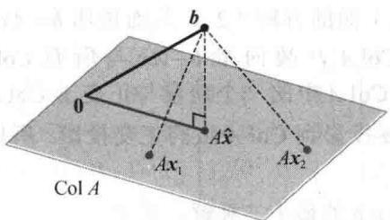
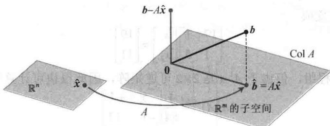
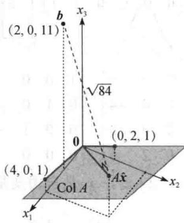

import Guide from '@/components/Guide.astro';
import Knowledge from '@/components/Knowledge.astro';
import Example from '@/components/Example.astro';
import Analysis from '@/components/Analysis.astro';
import Solution from '@/components/Solution.astro';
import Variant from '@/components/Variant.astro';
import Note from '@/components/Note.astro';
import Block from '@/components/Block.astro';
import Method from '@/components/Method.astro';
import Exercise from '@/components/Exercise.astro';

本章的介绍性实例中描述了一个解不存在的巨型方程组 Ax=b，实际应用中常出现这类不相容问题，尽管不会出现如此巨大的系数矩阵。当方程组的解不存在但又需要求解时，最好的方法是寻找 x，使得 Ax 尽可能接近 b。

考虑 Ax 作为 b 的一个近似. b 和 Ax 之间的距离越小, $\|b-Ax\|$ 近似程度越好. 一般的最小二乘问题就是找出使 $\|b-Ax\|$ 尽量小的 x, 术语 “最小二乘” 来源于这样的事实, 即 $\|b-Ax\|$ 是平方和的平方根.

定义 如果 $m \times n$ 矩阵 $A$ 和向量 $\pmb{b}$ 属于 $\mathbb{R}^m$ ，则 $Ax = b$ 的最小二乘解是 $\mathbb{R}^n$ 中的 $\hat{x}$ ，使得

$$
\left\| \boldsymbol {b} - A \hat {\boldsymbol {x}} \right\| \leqslant \left\| \boldsymbol {b} - A \boldsymbol {x} \right\|
$$

对所有 $x \in R^{n}$ 成立.

最小二乘问题最重要的特征是无论怎么选取 x，向量 Ax 必然属于列空间 Col A。因此我们寻求 x，使得 Ax 是 Col A 中最接近 b 的点，见图 6-23（当然，如果 b 恰好在 Col A 中，那么对于某个 x，b 等于 Ax，且这样的 x 是一个“最小二乘解”）。

<figure class="vp-figure">
  
  <figcaption>图 6-23 对 x, b 与 $A\hat{x}$ 的距离小于与 Ax 的距离</figcaption>
</figure>

## 一般最小二乘问题的解

对上面给定的 A 和 b，应用 6.3 节的最佳逼近定理于子空间 Col A．取

$$
\hat {\boldsymbol {b}} = \operatorname{proj} _ {\mathrm{Col} A} \boldsymbol {b}
$$

由于 $\hat{\pmb{b}}$ 属于 $A$ 的列空间，故方程 $Ax = \hat{b}$ 是相容的且存在一个属于 $\mathbb{R}^n$ 的 $\hat{x}$ 使得

$$
A \hat {\boldsymbol {x}} = \hat {\boldsymbol {b}}\tag{1}
$$

由于 $\hat{\pmb{b}}$ 是Col $A$ 中最接近 $\pmb{b}$ 的点，因此一个向量 $\hat{\pmb{x}}$ 是 $Ax = \pmb{b}$ 的一个最小二乘解的充分必要条件是 $\hat{\pmb{x}}$ 满足（1）．这个属于 $\mathbb{R}^n$ 的 $\hat{\pmb{x}}$ 是一系列由 $A$ 的列构造的 $\hat{\pmb{b}}$ 的权，见图6-24（如果方程（1）有自由变量，则方程（1）会有多个解）.

<figure class="vp-figure">
  
  <figcaption>图 6-24 $R^{n}$ 中的最小二乘解 $\hat{x}$</figcaption>
</figure>

若 $\hat{\pmb{x}}$ 满足 $A\hat{\pmb{x}} = \hat{\pmb{b}}$ ，则由6.3节的正交分解定理，投影 $\hat{\pmb{b}}$ 具有性质 $\pmb {b} - \hat{\pmb{b}}$ 与Col $A$ 正交，即 $\pmb {b} - A\hat{\pmb{x}}$ 正交于 $A$ 的每一列．如果 $\pmb{a}_j$ 是 $A$ 的任意列，那么 $\pmb{a}_j\cdot (\pmb {b} - A\hat{\pmb{x}}) = 0$ 且 $\pmb{a}_j^{\mathrm{T}}\cdot (\pmb {b} - A\hat{\pmb{x}}) = 0$ ．由于每一个 $\pmb{a}_j^{\mathrm{T}}$ 是 $A^{\mathrm{T}}$ 的行，因此

$$
A ^ {\mathrm{T}} (\boldsymbol {b} - A \hat {\boldsymbol {x}}) = \mathbf {0}\tag{2}
$$

（方程（2）也可由6.1节中的定理3推出。）故有

$$
A ^ {\mathrm{T}} \boldsymbol {b} - A ^ {\mathrm{T}} A \hat {\boldsymbol {x}} = \mathbf {0}
$$

$$
A ^ {\mathrm{T}} A \hat {\boldsymbol {x}} = A ^ {\mathrm{T}} \boldsymbol {b}
$$

此计算表明 $Ax = b$ 的每个最小二乘解满足方程

$$
A ^ {\mathrm{T}} A \boldsymbol {x} = A ^ {\mathrm{T}} \boldsymbol {b}\tag{3}
$$

矩阵方程（3）表示的线性方程组常称为 Ax=b 的法方程，（3）的解通常用 $\hat{x}$ 表示.

<Knowledge title="定理 13">
方程 $Ax = b$ 的最小二乘解集和法方程 $A^{\mathrm{T}}Ax = A^{\mathrm{T}}b$ 的非空解集一致.

<Solution title="证明">
如上所述，最小二乘解集是非空的，且每个最小二乘解 $\hat{x}$ 满足法方程。相反，假若 $\hat{x}$ 满足 $A^{\mathrm{T}}A\hat{x} = A^{\mathrm{T}}b$ ，那么 $\hat{x}$ 满足上面的方程（2），从而说明 $\pmb {b} - A\hat{\pmb{x}}$ 与 $A^{\mathrm{T}}$ 的行正交，因此与 $A$ 的列正交。因为 $A$ 的列生成Col $A$ ，故向量 $\pmb {b} - A\hat{\pmb{x}}$ 与所有Col $A$ 的向量正交，因此方程 $\pmb {b} = A\hat{\pmb{x}} +(\pmb {b} - A\hat{\pmb{x}})$ 是将 $\pmb{b}$ 分解成Col $A$ 中的一个向量与正交于Col $A$ 的一个向量之和。根据正交分解的唯一性， $A\hat{x}$ 必须是将 $\pmb{b}$ 投影到Col $A$ 上的正交投影。所以， $A\hat{x} = b$ 成立，且 $\hat{x}$ 是一个最小二乘解。
</Solution>
</Knowledge>

<Example title="例 1">
求不相容方程组 $Ax = b$ 的最小二乘解，其中

$$
A = \left[ \begin{array}{l l} 4 & 0 \\ 0 & 2 \\ 1 & 1 \end{array} \right], \quad \boldsymbol {b} = \left[ \begin{array}{l} 2 \\ 0 \\ 1 1 \end{array} \right]
$$

<Solution title="解">
利用法方程（3）计算

$$
A ^ {\mathrm{T}} A = \left[ \begin{array}{l l l} 4 & 0 & 1 \\ 0 & 2 & 1 \end{array} \right] \left[ \begin{array}{l l} 4 & 0 \\ 0 & 2 \\ 1 & 1 \end{array} \right] = \left[ \begin{array}{l l} 1 7 & 1 \\ 1 & 5 \end{array} \right]
$$

$$
A ^ {\mathrm{T}} \boldsymbol {b} = \left[ \begin{array}{l l l} 4 & 0 & 1 \\ 0 & 2 & 1 \end{array} \right] \left[ \begin{array}{c} 2 \\ 0 \\ 1 1 \end{array} \right] = \left[ \begin{array}{l} 1 9 \\ 1 1 \end{array} \right]
$$

那么方程 $A^{\mathrm{T}}Ax = A^{\mathrm{T}}b$ 变成

$$
\left[ \begin{array}{l l} 1 7 & 1 \\ 1 & 5 \end{array} \right] \left[ \begin{array}{l} x _ {1} \\ x _ {2} \end{array} \right] = \left[ \begin{array}{l} 1 9 \\ 1 1 \end{array} \right]
$$

行变换可用于解此方程组，但由于 $A^{\mathrm{T}}A$ 是 $2\times 2$ 可逆矩阵，因此很快可计算出

$$
\left(A ^ {\mathrm{T}} A\right) ^ {- 1} = \frac {1}{8 4} \left[ \begin{array}{c c} 5 & - 1 \\ - 1 & 1 7 \end{array} \right]
$$

那么可解 $A^{\mathrm{T}}Ax = A^{\mathrm{T}}b$ 如下：

$$
\begin{array}{r l} \hat {\boldsymbol {x}} & = (A ^ {\mathrm{T}} A) ^ {- 1} A ^ {\mathrm{T}} \boldsymbol {b} \\ & = \frac {1}{8 4} \left[ \begin{array}{l l} 5 & - 1 \\ - 1 & 1 7 \end{array} \right] \left[ \begin{array}{l} 1 9 \\ 1 1 \end{array} \right] = \frac {1}{8 4} \left[ \begin{array}{l} 8 4 \\ 1 6 8 \end{array} \right] = \left[ \begin{array}{l} 1 \\ 2 \end{array} \right] \end{array}
$$

在许多计算中， $A^{\mathrm{T}}A$ 是可逆的，但并不总是这样．下面例子中的矩阵出现于统计学中的方差分析问题中.
</Solution>
</Example>

<Example title="例 2">
求 $Ax = b$ 的最小二乘解，其中

$$
A = \left[ \begin{array}{c c c c} 1 & 1 & 0 & 0 \\ 1 & 1 & 0 & 0 \\ 1 & 0 & 1 & 0 \\ 1 & 0 & 1 & 0 \\ 1 & 0 & 0 & 1 \\ 1 & 0 & 0 & 1 \end{array} \right], \quad \boldsymbol {b} = \left[ \begin{array}{c} - 3 \\ - 1 \\ 0 \\ 2 \\ 5 \\ 1 \end{array} \right]
$$

<Solution title="解">
计算

$$
A ^ {\mathrm{T}} A = \left[ \begin{array}{c c c c c c} 1 & 1 & 1 & 1 & 1 & 1 \\ 1 & 1 & 0 & 0 & 0 & 0 \\ 0 & 0 & 1 & 1 & 0 & 0 \\ 0 & 0 & 0 & 0 & 1 & 1 \end{array} \right] \left[ \begin{array}{c c c c} 1 & 1 & 0 & 0 \\ 1 & 1 & 0 & 0 \\ 1 & 0 & 1 & 0 \\ 1 & 0 & 1 & 0 \\ 1 & 0 & 0 & 1 \\ 1 & 0 & 0 & 1 \end{array} \right] = \left[ \begin{array}{c c c c} 6 & 2 & 2 & 2 \\ 2 & 2 & 0 & 0 \\ 2 & 0 & 2 & 0 \\ 2 & 0 & 0 & 2 \end{array} \right]
$$

$$
A ^ {\mathrm{T}} \boldsymbol {b} = \left[ \begin{array}{c c c c c c} 1 & 1 & 1 & 1 & 1 & 1 \\ 1 & 1 & 0 & 0 & 0 & 0 \\ 0 & 0 & 1 & 1 & 0 & 0 \\ 0 & 0 & 0 & 0 & 1 & 1 \end{array} \right] \left[ \begin{array}{c} - 3 \\ - 1 \\ 0 \\ 2 \\ 5 \\ 1 \end{array} \right] = \left[ \begin{array}{c} 4 \\ - 4 \\ 2 \\ 6 \end{array} \right]
$$

矩阵方程 $A^{T}Ax = A^{T}b$ 的增广矩阵是

$$
\left[ \begin{array}{c c c c c} 6 & 2 & 2 & 2 & 4 \\ 2 & 2 & 0 & 0 & - 4 \\ 2 & 0 & 2 & 0 & 2 \\ 2 & 0 & 0 & 2 & 6 \end{array} \right] \sim \left[ \begin{array}{c c c c c} 1 & 0 & 0 & 1 & 3 \\ 0 & 1 & 0 & - 1 & - 5 \\ 0 & 0 & 1 & - 1 & - 2 \\ 0 & 0 & 0 & 0 & 0 \end{array} \right]
$$

通解是 $x_{1}=3-x_{4}$ ， $x_{2}=-5+x_{4}$ ， $x_{3}=-2+x_{4}$ ， $x_{4}$ 是自由变量。所以，Ax=b 的最小二乘通解具有下面形式：

$$
\hat {\boldsymbol {x}} = \left[ \begin{array}{c} 3 \\ - 5 \\ - 2 \\ 0 \end{array} \right] + x _ {4} \left[ \begin{array}{c} - 1 \\ 1 \\ 1 \\ 1 \end{array} \right]
$$

下面的定理给出判定准则：在什么条件下，方程 Ax=b 的最小二乘解是唯一的。（当然，正交投影 $\hat{b}$ 总是唯一的。）
</Solution>
</Example>

<Knowledge title="定理 14">
设 A 是 $m \times n$ 矩阵. 下面的条件是逻辑等价的:

a）对于 $\mathbb{R}^m$ 中的每个 $b$ ，方程 $Ax = b$ 有唯一最小二乘解.

b）A 的列是线性无关的.

c）矩阵 $A^{\mathrm{T}}A$ 是可逆的.

当这些条件成立时，最小二乘解 $\hat{x}$ 有下面的表示：

$$
\hat {\boldsymbol {x}} = (A ^ {\mathrm{T}} A) ^ {- 1} A ^ {\mathrm{T}} \boldsymbol {b}\tag{4}
$$

定理 14 证明的主要部分在习题 19\~21 中给出，证明的同时也复习了第 4 章的概念。用公式（4）计算 $\hat{x}$ 的方法主要具有理论意义，当 $A^{T}A$ 是 $2 \times 2$ 可逆矩阵时可用手工计算。

当最小二乘解 $\hat{x}$ 用于产生 $b$ 的近似 $A\hat{x}$ 时，从 $b$ 到 $A\hat{x}$ 的距离称为这个近似的最小二乘误差.例3如例1给出的 $A$ 和 $b$ ，确定 $Ax = b$ 最小二乘解的最小二乘误差

<Solution title="解">
从例1可知，

$$
\boldsymbol {b} = \left[ \begin{array}{l} 2 \\ 0 \\ 1 1 \end{array} \right], \quad A \hat {\boldsymbol {x}} = \left[ \begin{array}{l l} 4 & 0 \\ 0 & 2 \\ 1 & 1 \end{array} \right] \left[ \begin{array}{l} 1 \\ 2 \end{array} \right] = \left[ \begin{array}{l} 4 \\ 4 \\ 3 \end{array} \right]
$$

因此

$$
\boldsymbol {b} - A \hat {\boldsymbol {x}} = \left[ \begin{array}{l} 2 \\ 0 \\ 1 1 \end{array} \right] - \left[ \begin{array}{l} 4 \\ 4 \\ 3 \end{array} \right] = \left[ \begin{array}{l} - 2 \\ - 4 \\ 8 \end{array} \right]
$$

$$
\left\| \boldsymbol {b} - A \hat {\boldsymbol {x}} \right\| = \sqrt {(- 2) ^ {2} + (- 4) ^ {2} + 8 ^ {2}} = \sqrt {8 4}
$$

最小二乘误差是 $\sqrt{84}$ 。对任意属于 $\mathbb{R}^2$ 的 $x$ ，从 $b$ 到向量 $Ax$ 的最小距离是 $\sqrt{84}$ ，见图6-25。注意最小二乘解 $\hat{x}$ 自身并没有在图中出现。

<figure class="vp-figure">
  
  <figcaption>图 6-25</figcaption>
</figure>
</Solution>
</Knowledge>

## 最小二乘解的另一个计算

下面的例子表明，当 $A$ 的列向量正交时，如何求出 $Ax = b$ 的最小二乘解。这类矩阵常出现在下节要讨论的线性回归问题中。

<Example title="例 4">
求出 $Ax = b$ 的最小二乘解，其中

$$
A = \left[ \begin{array}{c c} 1 & - 6 \\ 1 & - 2 \\ 1 & 1 \\ 1 & 7 \end{array} \right], \quad \boldsymbol {b} = \left[ \begin{array}{c} - 1 \\ 2 \\ 1 \\ 6 \end{array} \right]
$$

<Solution title="解">
由于 A 的列 $a_{1}$ 和 $a_{2}$ 相互正交，因此 b 在 Col A 上的正交投影如下：

$$
\hat {\pmb {b}} = \frac {\pmb {b} \cdot \pmb {a} _ {1}}{\pmb {a} _ {1} \cdot \pmb {a} _ {1}} \cdot \pmb {a} _ {1} + \frac {\pmb {b} \cdot \pmb {a} _ {2}}{\pmb {a} _ {2} \cdot \pmb {a} _ {2}} \cdot \pmb {a} _ {2} = \frac {8}{4} \pmb {a} _ {1} + \frac {4 5}{9 0} \pmb {a} _ {2}\tag{5}
$$

$$
= \left[ \begin{array}{l} 2 \\ 2 \\ 2 \\ 2 \end{array} \right] + \left[ \begin{array}{l} - 3 \\ - 1 \\ 1 / 2 \\ 7 / 2 \end{array} \right] = \left[ \begin{array}{c} - 1 \\ 1 \\ 5 / 2 \\ 1 1 / 2 \end{array} \right]
$$

既然 $\hat{\pmb{b}}$ 已知，我们可以解 $A\hat{\pmb{x}} = \hat{\pmb{b}}$ 。这个很容易，因为我们已经知道 $\hat{\pmb{b}}$ 用 $A$ 的列线性表示时的权。从（5）立刻得到

$$
\hat {\boldsymbol {x}} = \left[ \begin{array}{l} 8 / 4 \\ 4 5 / 9 0 \end{array} \right] = \left[ \begin{array}{l} 2 \\ 1 / 2 \end{array} \right]
$$

某些时候，最小二乘解问题的法方程可能是病态的，也就是 $A^{\mathrm{T}}A$ 的元素在计算中出现的小误差有时可导致解 $\hat{x}$ 中出现较大的误差。如果 $A$ 的列线性无关，则最小二乘解常常可通过 $A$ 的QR分解更可靠地求出（见6.4节的描述）。
</Solution>
</Example>

<Knowledge title="定理 15">
给定一个 $m \times n$ 矩阵 A，它具有线性无关的列，取 A = QR 是 A 类似定理 12 的 QR 分解，那么对每一个属于 $R^{m}$ 的 b，方程 Ax = b 有唯一的最小二乘解，其解为

$$
\hat {\boldsymbol {x}} = R ^ {- 1} Q ^ {\mathrm{T}} \boldsymbol {b}\tag{6}
$$

<Solution title="证明">
取 $\hat{\pmb{x}} = R^{-1}Q^{\mathrm{T}}\pmb{b}$ ，那么 $A\hat{\pmb{x}} = QR\hat{\pmb{x}} = QRR^{-1}Q^{\mathrm{T}}\pmb{b} = QQ^{\mathrm{T}}\pmb{b}$

由定理 12，Q 的列形成 Col A 的标准正交基，因此，由定理 10， $QQ^{T}b$ 是 b 在 Col A 上的正交投影 $\hat{b}$ ，那么 $A\hat{x} = \hat{b}$ 说明 $\hat{x}$ 是 Ax = b 的最小二乘解。 $\hat{x}$ 的唯一性可从定理 14 得出。

数值计算的注解 由于定理15中的 $R$ 是上三角形矩阵，故 $\hat{x}$ 可从方程

$$
R \boldsymbol {x} = Q ^ {\mathrm{T}} \boldsymbol {b}\tag{7}
$$

计算得到. 求解方程（7）时，通过回代过程或行变换比利用（6）计算 $R^{-1}$ 更快.
</Solution>
</Knowledge>

<Example title="例 5">
求出 $Ax = b$ 的最小二乘解，其中

$$
A = \left[ \begin{array}{l l l} 1 & 3 & 5 \\ 1 & 1 & 0 \\ 1 & 1 & 2 \\ 1 & 3 & 3 \end{array} \right], \quad \boldsymbol {b} = \left[ \begin{array}{c} 3 \\ 5 \\ 7 \\ - 3 \end{array} \right]
$$

<Solution title="解">
利用 6.4 节可得 A 的 QR 分解.

$$
A = Q R = \left[ \begin{array}{c c c} 1 / 2 & 1 / 2 & 1 / 2 \\ 1 / 2 & - 1 / 2 & - 1 / 2 \\ 1 / 2 & - 1 / 2 & 1 / 2 \\ 1 / 2 & 1 / 2 & - 1 / 2 \end{array} \right] \left[ \begin{array}{c c c} 2 & 4 & 5 \\ 0 & 2 & 3 \\ 0 & 0 & 2 \end{array} \right]
$$

那么

$$
Q ^ {\mathrm{T}} \pmb {b} = \left[ \begin{array}{c c c c} 1 / 2 & 1 / 2 & 1 / 2 & 1 / 2 \\ 1 / 2 & - 1 / 2 & - 1 / 2 & 1 / 2 \\ 1 / 2 & - 1 / 2 & 1 / 2 & - 1 / 2 \end{array} \right] \left[ \begin{array}{c} 3 \\ 5 \\ 7 \\ - 3 \end{array} \right] = \left[ \begin{array}{c} 6 \\ - 6 \\ 4 \end{array} \right]
$$

满足 $Rx = Q^{T}b$ 的最小二乘解是 $\hat{x}$ ，也就是说，

$$
\left[ \begin{array}{l l l} 2 & 4 & 5 \\ 0 & 2 & 3 \\ 0 & 0 & 2 \end{array} \right] \left[ \begin{array}{l} x _ {1} \\ x _ {2} \\ x _ {3} \end{array} \right] = \left[ \begin{array}{c} 6 \\ - 6 \\ 4 \end{array} \right]
$$

这个方程很容易解出，得 $\hat{x}=\begin{bmatrix}10\\ -6\\ 2\end{bmatrix}$
</Solution>
</Example>

<Block title="练习题">
1. 令 $A = \begin{bmatrix} 1 & -3 & -3 \\ 1 & 5 & 1 \\ 1 & 7 & 2 \end{bmatrix}$ 和 $\pmb{b} = \begin{bmatrix} 5 \\ -3 \\ -5 \end{bmatrix}$ ，求 $Ax = b$ 的一个最小二乘解，并且计算最小二乘解的误差.

2. 当 b 与 A 的列正交时，对 Ax=b 的最小二乘解，你可得出什么结论？
</Block>

<Block title="习题6.5">
在习题 1\~4 中，求 Ax=b 的最小二乘解.
(a) 通过构造法方程求 $\hat{x}$ ，(b) 直接解 $\hat{x}$ .

$$
A = \left[ \begin{array}{c c} - 1 & 2 \\ 2 & - 3 \\ - 1 & 3 \end{array} \right], \quad \boldsymbol {b} = \left[ \begin{array}{l} 4 \\ 1 \\ 2 \end{array} \right]
$$

$$
A = \left[ \begin{array}{l l l} 1 & 1 & 0 \\ 1 & 1 & 0 \\ 1 & 0 & 1 \\ 1 & 0 & 1 \end{array} \right], \quad \boldsymbol {b} = \left[ \begin{array}{l} 1 \\ 3 \\ 8 \\ 2 \end{array} \right]
$$

$$
A = \left[ \begin{array}{c c} 2 & 1 \\ - 2 & 0 \\ 2 & 3 \end{array} \right], \quad \boldsymbol {b} = \left[ \begin{array}{c} - 5 \\ 8 \\ 1 \end{array} \right]
$$

$$
A = \left[ \begin{array}{l l l} 1 & 1 & 0 \\ 1 & 1 & 0 \\ 1 & 1 & 0 \\ 1 & 0 & 1 \\ 1 & 0 & 1 \\ 1 & 0 & 1 \end{array} \right], \quad \boldsymbol {b} = \left[ \begin{array}{l} 7 \\ 2 \\ 3 \\ 6 \\ 5 \\ 4 \end{array} \right]
$$

$$
3. \quad A = \left[ \begin{array}{c c} 1 & - 2 \\ - 1 & 2 \\ 0 & 3 \\ 2 & 5 \end{array} \right], \quad \boldsymbol {b} = \left[ \begin{array}{c} 3 \\ 1 \\ - 4 \\ 2 \end{array} \right]
$$

$$
A = \left[ \begin{array}{c c} 1 & 3 \\ 1 & - 1 \\ 1 & 1 \end{array} \right], \quad \boldsymbol {b} = \left[ \begin{array}{c} 5 \\ 1 \\ 0 \end{array} \right]
$$

7. 计算习题 3 中与最小二乘解相关的最小二乘误差.

在习题 5\~6 中，求方程 Ax=b 的所有最小二乘解.

8. 计算习题 4 中与最小二乘解相关的最小二乘误差.

在习题 9\~12 中，求：（a）b 在 Col A 上的正交投影，（b）Ax = b 的最小二乘解.

9. $A=\begin{bmatrix}1 & 5 \\ 3 & 1 \\ -2 & 4\end{bmatrix}, \quad b=\begin{bmatrix}4 \\ -2 \\ -3\end{bmatrix}$

10. $A=\begin{bmatrix}1&2\\ -1&4\\ 1&2\end{bmatrix},\quad b=\begin{bmatrix}3\\ -1\\ 5\end{bmatrix}$

11. $A=\begin{bmatrix}4&0&1\\ 1&-5&1\\ 6&1&0\\ 1&-1&-5\end{bmatrix},\quad b=\begin{bmatrix}9\\ 0\\ 0\\ 0\end{bmatrix}$

12. $A=\begin{bmatrix}1&1&0\\ 1&0&-1\\ 0&1&1\\ -1&1&-1\end{bmatrix},\quad b=\begin{bmatrix}2\\ 5\\ 6\\ 6\end{bmatrix}$

13. 令 $A = \begin{bmatrix} 3 & 4 \\ -2 & 1 \\ 3 & 4 \end{bmatrix}$ , $\pmb{b} = \begin{bmatrix} 11 \\ -9 \\ 5 \end{bmatrix}$ , $\pmb{u} = \begin{bmatrix} 5 \\ -1 \end{bmatrix}$ 和 $\pmb{v} = \begin{bmatrix} 5 \\ -2 \end{bmatrix}$ , 计算 $Au$ 和 $Av$ , 并与 $b$ 相比较. $u$ 是否为 $Ax = b$ 的最小二乘解? (不用计算最小二乘解回答这个问题.)

14. 令 $A = \begin{bmatrix} 2 & 1 \\ -3 & -4 \\ 3 & 2 \end{bmatrix}$ , $\pmb{b} = \begin{bmatrix} 5 \\ 4 \\ 4 \end{bmatrix}$ , $\pmb{u} = \begin{bmatrix} 4 \\ -5 \end{bmatrix}$ 和 $\pmb{v} = \begin{bmatrix} 6 \\ -5 \end{bmatrix}$ , 计算 $Au$ 和 $Av$ , 并与 $b$ 相比较. 是否有可能至少有一个 $u$ 或 $v$ 是 $Ax = b$ 的最小二乘解？（不用计算最小二乘解回答这个问题。）

在习题 15\~16 中，利用分解 A=QR 求 Ax=b 的最小二乘解.

15. $A=\begin{bmatrix}2&3\\ 2&4\\ 1&1\end{bmatrix}=\begin{bmatrix}2/3&-1/3\\ 2/3&2/3\\ 1/3&-2/3\end{bmatrix}\begin{bmatrix}3&5\\ 0&1\end{bmatrix},\quad b=\begin{bmatrix}7\\ 3\\ 1\end{bmatrix}$

$$
A = \left[ \begin{array}{l l} 1 & - 1 \\ 1 & 4 \\ 1 & - 1 \\ 1 & 4 \end{array} \right] = \left[ \begin{array}{l l} 1 / 2 & - 1 / 2 \\ 1 / 2 & 1 / 2 \\ 1 / 2 & - 1 / 2 \\ 1 / 2 & 1 / 2 \end{array} \right] \left[ \begin{array}{l l} 2 & 3 \\ 0 & 5 \end{array} \right], \quad \boldsymbol {b} = \left[ \begin{array}{l} - 1 \\ 6 \\ 5 \\ 7 \end{array} \right]
$$

在习题 17\~18 中，A 是 $m \times n$ 矩阵且 b 属于 $R^{m}$ ，判断下列命题正确或错误，验证每一个答案.

17. a. 一般最小二乘问题是求出 x 使得 Ax 尽可能接近 b.
b. 方程 Ax = b 的最小二乘解是满足方程 $A\hat{x} = \hat{b}$ 的向量 $\hat{x}$ ，其中 $\hat{b}$ 是 b 在 Col A 上的正交投影.
c. 方程 Ax = b 的最小二乘解是向量 $\hat{x}$ ，对所有属于 $R^{n}$ 的 x 满足 $\|b-Ax\|\leqslant\|b-A\hat{x}\|$

d. 方程 $A^{\mathrm{T}}Ax = A^{\mathrm{T}}b$ 的任意解是方程 $Ax = b$ 的最小二乘解.

e. 如果 $A$ 的列线性无关，那么方程 $Ax = b$ 只有一个最小二乘解.

18. a. 如果 b 属于 A 的列空间，那么方程 Ax=b 的每个解都是最小二乘解.
b. 方程 Ax=b 的最小二乘解是 A 的列空间中最接近 b 的点.
c. 方程 Ax=b 的最小二乘解是一系列的权，当它们作用在 A 的列时，产生 b 在 Col A 上的正交投影.
d. 如果 $\hat{x}$ 是 Ax=b 的一个最小二乘解, 那么 $\hat{x} = (A^{\mathrm{T}}A)^{-1}A^{\mathrm{T}}\hat{b}$ .
e. 法方程计算最小二乘解的方法总是可靠的.
f. 如果 A 有一个 QR 分解，如 A=QR，那么求 Ax=b 最小二乘解的最好方法是计算 $\hat{x}=R^{-1}Q^{T}b$ .

19. 设 A 是一个 $m \times n$ 矩阵，利用下面的步骤说明，向量 x 属于 $R^{n}$ 且满足 Ax = 0 的充分必要条件是 $A^{T}Ax = 0$ 。这将证明 Nul A = Nul $A^{T}A$ 。
a. 证明：如果 Ax = 0 ，那么 $A^{T}Ax = 0$ 。
b. 假若 $A^{T}Ax = 0$ ，解释为什么 $x^{T}A^{T}Ax = 0$ 并利用此式证明 Ax = 0。

20. 设 $A$ 是一个 $m \times n$ 矩阵且 $A^{\mathrm{T}}A$ 是可逆的，证明

A 的列线性无关.（注意：不能假设 A 可逆，且更不一定是方阵.）

21. 设 A 是 $m \times n$ 矩阵且列向量线性无关（注意：A 不一定是方阵）.
a. 利用习题 19 证明 $A^{T}A$ 是可逆矩阵.
b. 解释为什么 A 具有至少与行一样多的列.
c. 确定 A 的秩.

22. 利用习题 19 证明 rank $A^{T}A = \text{rank } A$ . （提示： $A^{T}A$ 有多少列？如何与 $A^{T}A$ 的秩联系起来？）

23. 假设 $A$ 是 $m \times n$ 矩阵且有线性无关的列， $b$ 属于 $\mathbb{R}^m$ ，利用法方程给出一个计算 $\hat{b}$ 的公式， $\hat{b}$ 是 $b$ 在 $\operatorname{Col} A$ 上的投影。（提示：首先求出 $\hat{x}$ ，这个公式不需要 $\operatorname{Col} A$ 的正交基。）

24. 当 A 的列是单位正交时，找出方程 Ax=b 最小二乘解的一个公式.

25. 列出下列方程组的所有最小二乘解：

$$
\begin{array}{l} x + y = 2 \\ x + y = 4 \end{array}
$$

26. [M] 4.8 节的例 3 显示了一个低通线性滤波器，将信号 $\{y_{k}\}$ 过滤为 $\{y_{k+1}\}$ ，并将高频信号 $\{w_{k}\}$ 过滤为零信号，其中 $y_{k} = \cos(\pi k / 4)$ ， $w_{k} = \cos(3\pi k / 4)$ 。下面的计算将设计一个滤波器近似满足此特性。滤波器方程为

$a_{0}y_{k+2}+a_{1}y_{k+1}+a_{2}y_{k}=z_{k}$ ，对所有k成立（8）因为信号是周期性的，且周期为8，故对方程（8）只需研究 $k=0,\cdots,7$ 即可．滤波器的作用是将上面描述的两个信号转化为两个8
</Block>

<Block title="练习题答案">
个方程的集合.

$$
y _ {k + 2} \quad y _ {k + 1} \quad y _ {k} \quad y _ {k + 1}
$$

$$
\begin{array}{l l} k = 0 & \left[ \begin{array}{c c c} 0 & 0. 7 & 1 \\ - 0. 7 & 0 & 0. 7 \\ - 1 & - 0. 7 & 0 \\ - 0. 7 & - 1 & - 0. 7 \\ 0 & - 0. 7 & - 1 \\ 0. 7 & 0 & - 0. 7 \\ 1 & 0. 7 & 0 \\ 0. 7 & 1 & 0. 7 \end{array} \right] \left[ \begin{array}{l} a _ {0} \\ a _ {1} \\ a _ {2} \end{array} \right] = \left[ \begin{array}{l} 0. 7 \\ 0 \\ - 0. 7 \\ - 1 \\ - 0. 7 \\ 0 \\ 0. 7 \\ 1 \end{array} \right] \\ k = 7 & \end{array}
$$

$$
\begin{array}{l l} & w _ {k + 2} \quad w _ {k + 1} \quad w _ {k} \\ k = 0 & \left[ \begin{array}{c c c} 0 & - 0. 7 & 1 \\ 0. 7 & 0 & - 0. 7 \\ - 1 & 0. 7 & 0 \\ 0. 7 & - 1 & 0. 7 \\ 0 & 0. 7 & - 1 \\ - 0. 7 & 0 & 0. 7 \\ 1 & - 0. 7 & 0 \\ - 0. 7 & 1 & - 0. 7 \end{array} \right] \left[ \begin{array}{c} a _ {0} \\ a _ {1} \\ a _ {2} \end{array} \right] = \left[ \begin{array}{c} 0 \\ 0 \\ 0 \\ 0 \\ 0 \\ 0 \\ 0 \\ 0 \end{array} \right] \\ k = 7 & \end{array}
$$

写出一个方程 Ax=b，其中 A 是一个 $16 \times 3$ 矩阵，由上面两个系数矩阵组成，b 属于 $R^{16}$ ，由上面两个方程右边的向量组成。求由 Ax=b 的最小二乘解确定的 $a_{0}, a_{1}, a_{2}$ （上面数据中的 0.7 是 $\sqrt{2}/2$ 的一个近似值，用以说明典型的实际问题中如何进行计算。如果用 0.707 代替，所得过滤系数与精确的算术计算结果 $\sqrt{2}/4, 1/2, \sqrt{2}/4$ 相比至少有 7 位相同的十进制位数）。

1. 首先计算

$$
A ^ {\mathrm{T}} A = \left[ \begin{array}{l l l} 1 & 1 & 1 \\ - 3 & 5 & 7 \\ - 3 & 1 & 2 \end{array} \right] \left[ \begin{array}{l l l} 1 & - 3 & - 3 \\ 1 & 5 & 1 \\ 1 & 7 & 2 \end{array} \right] = \left[ \begin{array}{l l l} 3 & 9 & 0 \\ 9 & 8 3 & 2 8 \\ 0 & 2 8 & 1 4 \end{array} \right]
$$

$$
A ^ {\mathrm{T}} \boldsymbol {b} = \left[ \begin{array}{r r r} 1 & 1 & 1 \\ - 3 & 5 & 7 \\ - 3 & 1 & 2 \end{array} \right] \left[ \begin{array}{l} 5 \\ - 3 \\ - 5 \end{array} \right] = \left[ \begin{array}{l} - 3 \\ - 6 5 \\ - 2 8 \end{array} \right]
$$

下一步，行化简法方程 $A^{T}Ax = A^{T}b$ 的增广矩阵：

$$
\left[ \begin{array}{c c c c} 3 & 9 & 0 & - 3 \\ 9 & 8 3 & 2 8 & - 6 5 \\ 0 & 2 8 & 1 4 & - 2 8 \end{array} \right] \sim \left[ \begin{array}{c c c c} 1 & 3 & 0 & - 1 \\ 0 & 5 6 & 2 8 & - 5 6 \\ 0 & 2 8 & 1 4 & - 2 8 \end{array} \right] \sim \dots \sim \left[ \begin{array}{c c c c} 1 & 0 & - 3 / 2 & 2 \\ 0 & 1 & - 1 / 2 & - 1 \\ 0 & 0 & 0 & 0 \end{array} \right]
$$

一般最小二乘解是 $x_{1} = 2 + \frac{3}{2} x_{3}$ ， $x_{2} = -1 - \frac{1}{2} x_{3}$ ， $x_{3}$ 是自由变量．对一个特解，例如取 $x_{3} = 0$ ，可得

$$
\hat {\boldsymbol {x}} = \left[ \begin{array}{c} 2 \\ - 1 \\ 0 \end{array} \right]
$$

为得到最小二乘误差，计算

$$
\hat {\boldsymbol {b}} = A \hat {\boldsymbol {x}} = \left[ \begin{array}{c c c} 1 & - 3 & - 3 \\ 1 & 5 & 1 \\ 1 & 7 & 2 \end{array} \right] \left[ \begin{array}{c} 2 \\ - 1 \\ 0 \end{array} \right] = \left[ \begin{array}{c} 5 \\ - 3 \\ - 5 \end{array} \right]
$$

结果出现 $\hat{\pmb{b}} = \pmb{b}$ ，所以 $\| \pmb {b} - \hat{\pmb{b}}\| = 0$ ．由于 $\pmb{b}$ 恰好属于Col $A$ ，因此最小二乘误差为零.

2. 如果 b 与 A 的列正交，那么 b 在 A 的列空间上的投影是 0。在这种情形下，Ax=b 的最小二乘解 $\hat{x}$ 满足 $A\hat{x}=0$ 。
</Block>
