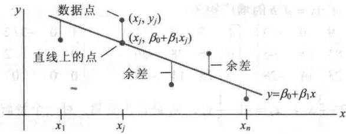
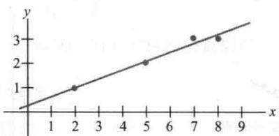
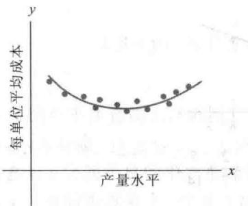
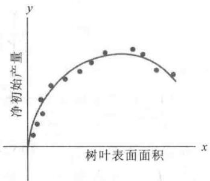
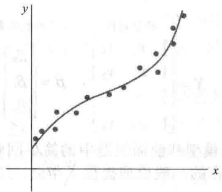
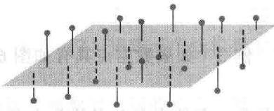
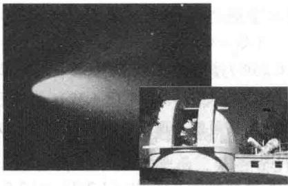
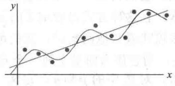

import Guide from '@/components/Guide.astro';
import Knowledge from '@/components/Knowledge.astro';
import Example from '@/components/Example.astro';
import Analysis from '@/components/Analysis.astro';
import Solution from '@/components/Solution.astro';
import Variant from '@/components/Variant.astro';
import Note from '@/components/Note.astro';
import Block from '@/components/Block.astro';
import Method from '@/components/Method.astro';
import Exercise from '@/components/Exercise.astro';

科学和工程中的一项任务就是分析或理解几个变化量之间的联系。本节描述各种情形下数据被用作构造或验证一个公式，该公式可预测一个变量作为其他变量的函数。在每种情形下，问题会等同于求解一个最小二乘问题。

为了更容易应用所讨论的实际问题，如读者以后就业中遇到的相关问题，我们选取科学和工程数据中常见的统计分析记号。将 $Ax = b$ 写成 $X\beta = y$ ，且称 $X$ 为设计矩阵， $\beta$ 为参数向量， $y$ 为观测向量。

## 最小二乘直线

变量 x 和 y 之间最简单的关系是线性方程 $y = \beta_{0} + \beta_{1}x$ . 实验数据常常给出点 $(x_{1}, y_{1}), \cdots, (x_{n}, y_{n})$ ，它们的图形近似接近于直线。我们希望确定参数 $\beta_{0}$ 和 $\beta_{1}$ ，使得直线尽可能“接近”这些点。

假设 $\beta_0$ 和 $\beta_{1}$ 固定，考虑图6-26中的直线 $y = \beta_0 + \beta_1x$ ，对应每一个数据点 $(x_{j},y_{j})$ ，有一个在直线上的点 $(x_{j},\beta_{0} + \beta_{1}x_{j})$ 具有同样的 $x$ 坐标．我们称 $y_{j}$ 为 $y$ 的观测值，而 $\beta_0 + \beta_1x_j$ 为 $y$ 的预测值（由直线确定）．观测 $y$ 值和预测 $y$ 值之间的差称为余差.

  
图 6-26 实验数据的直线拟合

有几种方法来度量直线如何“接近”数据，最常见的选择是余差平方之和（主要原因是数学计算简单）。最小二乘直线 $y = \beta_0 + \beta_1 x$ 是余差平方之和最小的，这条直线也称为 $y$ 对 $x$ 的回归直线，这是因为假设数据中的任何误差只出现在 $y$ 坐标。直线的系数 $\beta_0, \beta_1$ 被称为（线性）回归系数。

如果数据点在直线上，则参数 $\beta_0$ 和 $\beta_{1}$ 满足方程

$$
\begin{array}{r l r} {\text {预测的}} & {} & {\text {观测的}} \\ {\pmb {y} \text {值}} & {} & {\pmb {y} \text {值}} \\ {\beta_ {0} + \beta_ {1} x _ {1}} & {=} & {y _ {1}} \\ {\beta_ {0} + \beta_ {1} x _ {2}} & {=} & {y _ {2}} \\ {\vdots} & {} & \\ {\beta_ {0} + \beta_ {1} x _ {n}} & {=} & {y _ {n}} \end{array}
$$

我们可将这个方程组写成

$X\pmb{\beta} = \pmb{y}$ ，其中 $X = \begin{bmatrix} 1 & x_1 \\ 1 & x_2 \\ \vdots & \vdots \\ 1 & x_n \end{bmatrix}$ ， $\pmb {\beta} = \begin{bmatrix} \beta_0 \\ \beta_1 \end{bmatrix}$ ， $\pmb {y} = \begin{bmatrix} y_1 \\ y_2 \\ \vdots \\ y_n \end{bmatrix}$

(1)

当然，如果数据点不在直线上，就没有参数 $\beta_0, \beta_1$ 使得 $X\pmb{\beta}$ 中的预测 $y$ 值与 $y$ 中的观测 $y$ 值相等，且 $X\pmb{\beta} = y$ 没有解。这就是 $Ax = b$ 的最小二乘解问题，只是记法不同！

向量 $X\beta$ 与 $\pmb{y}$ 之间距离的平方精确表达为余差的平方之和，于是，使平方和最小的 $\beta$ 同样使得 $X\beta$ 与 $\pmb{y}$ 之间的距离最小。计算 $X\beta = y$ 的最小二乘问题等价于找出 $\beta$ ，它确定图6-26中的最小二乘直线。

<Example title="例 1">
求最小二乘直线的方程 $y = \beta_{0} + \beta_{1}x$ ，最佳拟合数据点为（2,1），（5,2），（7,3），（8,3）.

<Solution title="解">
利用数据的 x 坐标构造（1）中的矩阵 X 和 y 坐标构造向量 y：

$$
X = \left[ \begin{array}{l l} 1 & 2 \\ 1 & 5 \\ 1 & 7 \\ 1 & 8 \end{array} \right], \quad y = \left[ \begin{array}{l} 1 \\ 2 \\ 3 \\ 3 \end{array} \right]
$$

对 $X\beta = y$ 的最小二乘解，得到法方程（用新记号）：

也就是说，计算

$$
X ^ {\mathrm{T}} X \boldsymbol {\beta} = X ^ {\mathrm{T}} \mathbf {y}
$$

$$
X ^ {\mathrm{T}} X = \left[ \begin{array}{l l l l} 1 & 1 & 1 & 1 \\ 2 & 5 & 7 & 8 \end{array} \right] \left[ \begin{array}{l l} 1 & 2 \\ 1 & 5 \\ 1 & 7 \\ 1 & 8 \end{array} \right] = \left[ \begin{array}{l l} 4 & 2 2 \\ 2 2 & 1 4 2 \end{array} \right]
$$

$$
X ^ {\mathrm{T}} \pmb {y} = \left[ \begin{array}{l l l l} 1 & 1 & 1 & 1 \\ 2 & 5 & 7 & 8 \end{array} \right] \left[ \begin{array}{l} 1 \\ 2 \\ 3 \\ 3 \end{array} \right] = \left[ \begin{array}{l} 9 \\ 5 7 \end{array} \right]
$$

法方程是

$$
\left[ \begin{array}{l l} 4 & 2 2 \\ 2 2 & 1 4 2 \end{array} \right] \left[ \begin{array}{l} \beta_ {0} \\ \beta_ {1} \end{array} \right] = \left[ \begin{array}{l} 9 \\ 5 7 \end{array} \right]
$$

因此

$$
\left[ \begin{array}{l} \beta_ {0} \\ \beta_ {1} \end{array} \right] = \left[ \begin{array}{l l} 4 & 2 2 \\ 2 2 & 1 4 2 \end{array} \right] ^ {- 1} \left[ \begin{array}{l} 9 \\ 5 7 \end{array} \right] = \frac {1}{8 4} \left[ \begin{array}{l l} 1 4 2 & - 2 2 \\ - 2 2 & 4 \end{array} \right] \left[ \begin{array}{l} 9 \\ 5 7 \end{array} \right] = \frac {1}{8 4} \left[ \begin{array}{l} 2 4 \\ 3 0 \end{array} \right] = \left[ \begin{array}{l} 2 / 7 \\ 5 / 1 4 \end{array} \right]
$$

这样，最小二乘直线的方程为 $y=\frac{2}{7}+\frac{5}{14}x$ ，见图 6-27.

  
图6-27 最小二乘直线 $y = \frac{2}{7} + \frac{5}{14} x$

在计算最小二乘直线之前，常见的练习是计算原来 $x$ 值的平均 $\overline{x}$ ，并形成一个新变量 $x^{*} = x - \overline{x}$ 。新的 $x$ 数据被称为平均偏差形式。在这种情形下，设计矩阵的两列是正交的。像6.5节的例4，法方程的解是简化的，见习题17和习题18。
</Solution>
</Example>

## 一般线性模型

在一些应用中，必须将数据点拟合为非直线形式。在下面的例子中，矩阵方程仍然是 $X\beta = y$ ，但特定形式的 $X$ 会从一个问题变到下一个。统计学家常引入余差向量 $\varepsilon$ ，定义为 $\varepsilon = y - X\beta$ ，并且记作

$$
\boldsymbol {y} = X \boldsymbol {\beta} + \varepsilon
$$

任何具有这种形式的方程称为线性模型. 一旦 $X$ 和 $\pmb{y}$ 被确定, 使 $\varepsilon$ 长度达到最小化相当于找出 $X\pmb{\beta} = \pmb{y}$ 的最小二乘解. 在每种情形下, 最小二乘解 $\hat{\pmb{\beta}}$ 是下面法方程的解:

$$
X ^ {\mathrm{T}} X \boldsymbol {\beta} = X ^ {\mathrm{T}} \mathbf {y}
$$

## 其他曲线的最小二乘拟合

当 “分散画出” 的数据点 $(x_{1}, y_{1}), \cdots, (x_{n}, y_{n})$ 不接近任何直线时，一个合适的假定是 x 和 y 具有其他函数关系.

下面三个例子说明如何将数据拟合为如下一般形式的曲线：

$$
y = \beta_ {0} f _ {0} (x) + \beta_ {1} f _ {1} (x) + \dots + \beta_ {k} f _ {k} (x)\tag{2}
$$

其中 $f_{0},\cdots,f_{k}$ 是已知函数， $\beta_{0},\cdots,\beta_{k}$ 是待定参数。下面将看到，方程（2）描述一个线性模型，因为它是未知参数的线性模型。

对特殊的 x 值，（2）式给出 y 的预测或 “拟合” 值。观测值与预测值之间的差为余差，参数 $\beta_{0}, \cdots, \beta_{k}$ 的确定需满足余差平方之和最小。

<Example title="例 2">
若数据点 $(x_{1},y_{1}),\cdots,(x_{n},y_{n})$ 明显位于某条抛物线之上，而不是一条直线上。例如，如果 x 坐标表示某公司的产量水平，而 y 坐标表示生产水平为每天 x 单位时的平均费用，那么一个典型的平均成本曲线看起来像开口向上的抛物线（见图 6-28）。在生态系统中，一个开口向下的抛物线常用于对一种植物中营养成分的净初始产量的建模，它是树叶表面面积的函数（见图 6-29）。假设我们用下列形式的方程逼近数据：

$$
y = \beta_ {0} + \beta_ {1} x + \beta_ {2} x ^ {2}\tag{3}
$$

方程（3）给出产生数据的“最小二乘拟合”的线性模型.

  
图 6-28 平均成本曲线

  
图 6-29 营养成分的产量

<Solution title="解">
理想的关系用方程（3）描述. 若实际的参数值为 $\beta_0, \beta_1, \beta_2$ ，那么第一个数据点的坐标 $(x_1, y_1)$ 满足下列形式的方程：

$$
y _ {1} = \beta_ {0} + \beta_ {1} x _ {1} + \beta_ {2} x _ {1} ^ {2} + \varepsilon_ {1}
$$

其中 $\varepsilon_{1}$ 是观测值 $y_{1}$ 和预测值 $y$ 值 $\beta_0 + \beta_1x_1 + \beta_2x_1^2$ 间的余差．对每一个数据点，可写出类似的方程：

$$
\begin{array}{l} y _ {1} = \beta_ {0} + \beta_ {1} x _ {1} + \beta_ {2} x _ {1} ^ {2} + \varepsilon_ {1} \\ y _ {2} = \beta_ {0} + \beta_ {1} x _ {2} + \beta_ {2} x _ {2} ^ {2} + \varepsilon_ {2} \\ \vdots \\ y _ {n} = \beta_ {0} + \beta_ {1} x _ {n} + \beta_ {2} x _ {n} ^ {2} + \varepsilon_ {n} \end{array}
$$

可将上述方程组简单描述为 $y = X \beta + \varepsilon$ 的形式. 通过检查方程组的前面几行和观察数据形状, 我们可以求出 X.

$$
\begin{array}{r l} \left[ \begin{array}{c} y _ {1} \\ y _ {2} \\ \vdots \\ y _ {n} \end{array} \right] & = \left[ \begin{array}{c c c} 1 & x _ {1} & x _ {1} ^ {2} \\ 1 & x _ {2} & x _ {2} ^ {2} \\ \vdots & \vdots & \vdots \\ 1 & x _ {n} & x _ {n} ^ {2} \end{array} \right] \left[ \begin{array}{c} \beta_ {0} \\ \beta_ {1} \\ \beta_ {2} \end{array} \right] + \left[ \begin{array}{c} \varepsilon_ {1} \\ \varepsilon_ {2} \\ \vdots \\ \varepsilon_ {n} \end{array} \right] \\ \mathbf {y} & = X \quad \boldsymbol {\beta} + \boldsymbol {\varepsilon} \end{array}
$$
</Solution>
</Example>

<Example title="例 3">
如果数据点具有如图6-30的模式，那么一个合适的模型是下面形式的方程：

$$
y = \beta_ {0} + \beta_ {1} x + \beta_ {2} x ^ {2} + \beta_ {3} x ^ {3}
$$

这类数据可能来自公司的总成本，描述的是一个关于产量水平的函数。求线性模型并用最小二乘拟合这类数据 $(x_{1},y_{1}),\cdots,(x_{n},y_{n})$ 。

  
图 6-30 沿立方曲线的数据点

<Solution title="解">
类似例 2 的分析，我们得到

观测向量

设计矩阵

$$
\mathbf {y} = \left[ \begin{array}{c} y _ {1} \\ y _ {2} \\ \vdots \\ y _ {n} \end{array} \right], \quad X = \left[ \begin{array}{c c c c} 1 & x _ {1} & x _ {1} ^ {2} & x _ {1} ^ {3} \\ 1 & x _ {2} & x _ {2} ^ {2} & x _ {2} ^ {3} \\ \vdots & \vdots & \vdots & \vdots \\ 1 & x _ {n} & x _ {n} ^ {2} & x _ {n} ^ {3} \end{array} \right], \quad \boldsymbol {\beta} = \left[ \begin{array}{c} \beta_ {0} \\ \beta_ {1} \\ \beta_ {2} \\ \beta_ {3} \end{array} \right], \quad \boldsymbol {\varepsilon} = \left[ \begin{array}{c} \varepsilon_ {1} \\ \varepsilon_ {2} \\ \vdots \\ \varepsilon_ {n} \end{array} \right]
$$
</Solution>
</Example>

## 多重回归

假若一个实验包含两个独立变量（例如 $u$ 和 $v$ ）和一个相关变量（例如 $y$ ）。一个简单的通过 $u$ 和 $v$ 来预测 $y$ 的方程有如下形式：

$$
\mathbf {y} = \beta_ {0} + \beta_ {1} u + \beta_ {2} v\tag{4}
$$

更一般的预测方程具有下面的形式：

$$
y = \beta_ {0} + \beta_ {1} u + \beta_ {2} v + \beta_ {3} u ^ {2} + \beta_ {4} u v + \beta_ {5} v ^ {2}\tag{5}
$$

这个方程常用于地质学，例如，模拟地面侵蚀、冰川、土壤酸碱性以及其他数据。这种情形的最小二乘拟合称为趋势曲面。

方程（4）和（5）都可以推出一个线性模型，因为它们是未知参数的线性关系（尽管 $u$ 和

v 是乘法）. 一般地，一个线性模型是指 y 可由下面方程来预测：

$$
y = \beta_ {0} f _ {0} (u, v) + \beta_ {1} f _ {1} (u, v) + \dots + \beta_ {k} f _ {k} (u, v)
$$

其中， $f_{0},\cdots,f_{k}$ 是某类已知函数， $\beta_{0},\cdots,\beta_{k}$ 是未知权.

<Example title="例 4">
在地理学中，局部地形模型由数据 $(u_{1}, v_{1}, y_{1}), \cdots, (u_{n}, v_{n}, y_{n})$ 来构造，其中 $u_{j}, v_{j}, y_{j}$ 分别是地形的纬度、经度和海拔高度。描述基于方程（4）的线性模型且给出这些数据的最小二乘拟合，该解称为最小二乘平面。见图 6-31。

<Solution title="解">
我们希望数据满足下列方程：

$$
\begin{array}{r l} & y _ {1} = \beta_ {0} + \beta_ {1} u _ {1} + \beta_ {2} v _ {1} + \varepsilon_ {1} \\ & y _ {2} = \beta_ {0} + \beta_ {1} u _ {2} + \beta_ {2} v _ {2} + \varepsilon_ {2} \\ & \vdots \quad \quad \quad \quad \quad \quad \vdots \\ & y _ {n} = \beta_ {0} + \beta_ {1} u _ {n} + \beta_ {2} v _ {n} + \varepsilon_ {n} \end{array}
$$

  
图6-31 最小二乘平面

这个方程组的矩阵形式是 $y = X \beta + \varepsilon$ ，其中

$$
\pmb {y} = \left[ \begin{array}{c} y _ {1} \\ y _ {2} \\ \vdots \\ y _ {n} \end{array} \right], \quad X = \left[ \begin{array}{c c c} 1 & u _ {1} & v _ {1} \\ 1 & u _ {2} & v _ {2} \\ \vdots & \vdots & \vdots \\ 1 & u _ {n} & v _ {n} \end{array} \right], \quad \pmb {\beta} = \left[ \begin{array}{c} \beta_ {0} \\ \beta_ {1} \\ \beta_ {2} \end{array} \right], \quad \pmb {\varepsilon} = \left[ \begin{array}{c} \varepsilon_ {1} \\ \varepsilon_ {2} \\ \vdots \\ \varepsilon_ {n} \end{array} \right]
$$

例4表明，多重回归的线性模型和前面例题中的简单回归模型具有同样的抽象形式。线性代数为我们理解所有线性模型内在的一般原理提供了帮助。只要 $X$ 的定义适当，关于 $\pmb{\beta}$ 的法方程就具有相同的矩阵形式，不管包含多少变量。这样，对 $X^{\mathrm{T}}X$ 可逆的任何线性模型，最小二乘 $\hat{\pmb{\beta}}$ 总可由 $(X^{\mathrm{T}}X)^{-1}X^{\mathrm{T}}y$ 计算得到。
</Solution>
</Example>

## 进一步阅读

Ferguson, J., Introduction to Linear Algebra in Geology (New York: Chapman & Hall, 1994).

Krumbein, W. C., and F. A. Graybill, An Introduction to Statistical Models in Geology (New York: McGraw-Hill, 1965).

Legendre, P., and L. Legendre, Numerical Ecology (Amsterdam: Elsevier, 1998).

Unwin, David J., An Introduction to Trend Surface Analysis, Concepts and Techniques in Modern Geography, No. 5 (Norwich, England: Geo Books, 1975).

<Block title="练习题">
某产品的月销售额受季节波动影响，近似销售数据的曲线具有以下形式：

$$
y = \beta_ {0} + \beta_ {1} x + \beta_ {2} \sin (2 \pi x / 1 2)
$$

其中 x 是按月统计的时间。 $\beta_{0}+\beta_{1}x$ 给出基本销售趋势，其中的正弦项反映季节对销售的影响。给出导致上面最小二乘拟合的方程的线性模型的设计矩阵和参数向量，假设数据是 $(x_{1},y_{1}),\cdots,(x_{n},y_{n})$ 。
</Block>

<Block title="习题6.6">
在习题 1\~4 中，求出最小二乘直线方程 $y = \beta_{0} + \beta_{1}x$ ，其为给定数据点的最佳拟合.

1. (0,1), (1,1), (2,2), (3,2)

2. (1,0), (2,1), (4,2), (5,3)

3. $(-1,0)$ , $(0,1)$ , $(1,2)$ , $(2,4)$

4. (2,3), (3,2), (5,1), (6,0)

5. 假设 X 是用最小二乘直线拟合数据 $(x_{1}, y_{1}), \cdots, (x_{n}, y_{n})$ 对应得到的设计矩阵，利用 6.5 节的定理证明，法方程具有唯一解的充分必要条件是：数据中至少有两个数据点具有不同的 x 坐标.

6. 若 X 是例 2 中最小二乘拟合抛物线数据点 $(x_{1}, y_{1}), \cdots, (x_{n}, y_{n})$ 对应的一个设计矩阵，若 $x_{1}, x_{2}, x_{3}$ 不同，解释在最小二乘意义下为什么只有一个最佳抛物线拟合数据（见习题 5）.

7. 一个实验产生的数据为(1,1.8),(2,2.7),(3,3.4),(4,3.8)和(5,3.9)，描述用下列形式的函数生成的这些点的最小二乘拟合模型：

$$
y = \beta_ {1} x + \beta_ {2} x ^ {2}
$$

这种函数会出现在这样的情形下，例如，当销售的总量影响产品的价格设定时，销售 x 单位产品的收益计算中.

a. 给出设计矩阵、观测向量和未知参数向量.
b.[M]找出数据对应的最小二乘曲线.

8. 一个简单描述某公司花费变量的模型曲线，作为销售水平 x 的函数，有如下形式：

$$
y = \beta_ {1} x + \beta_ {2} x ^ {2} + \beta_ {3} x ^ {3}
$$

由于不包含固定花费，所以没有常数项.

a. 对于数据 $(x_{1},y_{1}),\cdots,(x_{n},y_{n})$ ，给出线性模型的最小二乘拟合方程对应的设计矩阵和参数向量.

b.[M]求出最小二乘曲线拟合数据：（4,1.58），(6,2.08)，(8,2.5)，(10,2.8)，(12,3.1)，(14,3.4)，(16,3.8)，(18,4.32)，有数千个数据。如果可能，画图说明数据点和立方近似的图形。

9. 某一实验得到的数据为（1,7.9），（2,5.4）和（3,-0.9），描述由下列形式的函数拟合这些数据产生的最小二乘模型：

$$
y = A \cos x + B \sin x
$$

10. 若放射性物质 A 和 B 分别具有衰变常数 0.02 和 0.07，如果一个含这两种物质的混合物在时刻 t=0 时包含 A 物质 $M_{A}$ 克和 B 物质 $M_{B}$ 克，那么在时刻 t 混合物中总量 y 的模型是：

$$
y = M _ {\mathrm{A}} \mathrm{e} ^ {- 0. 0 2 t} + M _ {\mathrm{B}} \mathrm{e} ^ {- 0. 0 7 t}\tag{6}
$$

若初始含量 $M_{A}$ 和 $M_{B}$ 未知，但在几个时刻，科学家可以测得总含量并记录下列点 $(t_{i}, y_{i})$ ：（10, 21.34），（11, 20.68），（12, 20.05），（14, 18.87）和（15, 18.30）.

a. 描述可用于估计 $M_{A}$ 和 $M_{B}$ 的线性模型.
b.[M]找出基于方程（6）的最小二乘曲线.

11.[M]根据开普勒第一定律,一个彗星(见图6-32)应该有椭圆、抛物线和双曲轨道(当行星的引力可以忽略时).对合适的极坐标,一个彗星的位置 $(r,\theta)$ 满足下面形式的方程:

$$
r = \beta + e (r. \cos \vartheta)
$$

其中 $\beta$ 是常数，e 是轨道的离心率，当 $0 \leqslant e < 1$ 时对应椭圆，e = 1 时对应抛物线，e > 1 时对应双曲线。若新观测发现的彗星有下列数据，确定轨道的类型并预测当 9 = 4.6（弧度）时彗星的位置。

<table><tr><td>9</td><td>0.88</td><td>1.10</td><td>1.42</td><td>1.77</td><td>2.14</td></tr><tr><td>r</td><td>3.00</td><td>2.30</td><td>1.65</td><td>1.25</td><td>1.01</td></tr></table>

  
图 6-32 上一次出现于 1986 年的哈雷彗星，它将再次出现于 2061 年  
12.[M]健康儿童的心脏收缩压 p（毫米水银柱）和体重 w（磅）之间的近似关系满足方程

$$
\beta_ {0} + \beta_ {1} \ln w = p
$$

利用下面的实验数据估计健康儿童体重为 100 磅时的心脏收缩压.

<table><tr><td>w</td><td>44</td><td>61</td><td>81</td><td>113</td><td>131</td></tr><tr><td>ln w</td><td>3.78</td><td>4.11</td><td>4.41</td><td>4.73</td><td>4.88</td></tr><tr><td>p</td><td>91</td><td>98</td><td>103</td><td>110</td><td>112</td></tr></table>

13. [M]为测量飞机起飞性能，飞机的水平位置从t=0到t=12每秒测量一次，具体位置（英尺）是：0, 8.8, 29.9, 62.0, 104.7, 159.1, 222.0, 294.5, 380.4, 471.1, 571.7, 686.8, 809.2.

a. 求出这些数据的最小二乘立方曲线 $y=\beta_{0}+\beta_{1}t+\beta_{2}t^{2}+\beta_{3}t^{3}$

b. 利用（a）的结果估计当 t=4.5 秒时飞机的水平速度.

14. 令 $\overline{x} = \frac{1}{n} (x_1 + \dots + x_n)$ 和 $\overline{y} = \frac{1}{n} (y_1 + \dots + y_n)$ ，证明：数据 $(x_1, y_1), \dots, (x_n, y_n)$ 的最小二乘直线必通过 $(\overline{x}, \overline{y})$ ，也就是证明 $\overline{x}$ 和 $\overline{y}$ 满足线性方程 $\overline{y} = \hat{\beta}_0 + \hat{\beta}_1\overline{x}$ 。（提示：从向量方程 $y = X\hat{\beta} + \varepsilon$ 导出这个方程，将 $X$ 的第一列表示为 1，利用余差向量 $\varepsilon$ 与 $X$ 的列空间正交的事实得到它正交于 1。）给定数据的最小二乘问题， $(x_1, y_1), \dots, (x_n, y_n)$ ，下列缩写符号很有用：

$$
\begin{array}{l l} \sum x = \sum_ {i = 1} ^ {n} x _ {i} & \sum x ^ {2} = \sum_ {i = 1} ^ {n} x _ {i} ^ {2} \\ \sum y = \sum_ {i = 1} ^ {n} y _ {i} & \sum x y = \sum_ {i = 1} ^ {n} x _ {i} y _ {i} \end{array}
$$

最小二乘直线 $y = \hat{\beta}_0 + \hat{\beta}_1x$ 的法方程可以写成

$$
\begin{array}{r l} & n \hat {\beta} _ {0} + \hat {\beta} _ {1} \sum x = \sum y \\ & \hat {\beta} _ {0} \sum x + \hat {\beta} _ {1} \sum x ^ {2} = \sum x y \end{array}\tag{7}
$$

15. 从本节给定的矩阵形式导出对应的法方程（7）

16. 利用矩阵的逆求解方程组（7），然后确定许多统计课本中出现的计算 $\hat{\beta}_{0}$ 和 $\hat{\beta}_{1}$ 的公式.

17. a. 用新 $x$ 坐标的平均偏差形式，重写例1中的数据。设 $X$ 是对应的设计矩阵，说明为什么 $X$ 的列是正交的。b. 写出（a）部分中数据的法方程，并求解得到最小二乘直线 $v = \beta_0 + \beta_1 x^*$ ，其中 $x^* = x - 5.5$ 。

18. 设数据 $(x_{1}, y_{1}), \cdots, (x_{n}, y_{n})$ 的 x 坐标是平均偏差形式，从而 $\sum x_{i} = 0$ ，证明：如果 X 是这种情形下最小二乘直线的设计矩阵，那么 $X^{T}X$ 是正交矩阵.

习题 19 和 20 包含具有 2 列或更多列的设计矩阵 X， $\hat{\beta}$ 是 y = X $\beta$ 的最小二乘解，考虑下列数：

(i) $\left\|X\hat{\beta}\right\|^{2}$ —— “回归项”的平方和，记该数为 $SS(R)$ .

(ii) $\left\|y-X\hat{\beta}\right\|^{2}$ ——误差项的平方和，记该数为 $SS(E)$ .

(iii) $\|y\|^{2}$ ——坐标 y 平方之和的 “总和”，记该数为 $SS(T)$ .

每一讨论回归和线性模型 $y = X \beta + \varepsilon$ 的统计课本都引入这些数，尽管术语和记号会有变化。为简单起见，假设 y 的平均值是零，在这种情形下， $SS(T)$ 与被称为 y 值集合的方差成正比。

19. 验证方程 $SS(T) = SS(R) + SS(E)$ （提示：利用一个定理并解释为什么定理的假设成立）。这个方程在统计学中的回归理论和方差分析中非常重要。

20. 证明： $\left\| X \hat{\beta} \right\|^2 = \hat{\beta}^{\mathrm{T}} X^{\mathrm{T}} y$ 。（提示：重写方程左边并且利用 $\hat{\beta}$ 满足法方程的事实。）关于 $SS(R)$ 的这个公式被用在统计学上，从这个结论和习题19可得 $SS(E)$ 的标准公式：

$$
S S (E) = \mathbf {y} ^ {\mathrm{T}} \mathbf {y} - \hat {\boldsymbol {\beta}} ^ {\mathrm{T}} X ^ {\mathrm{T}} \mathbf {y}
$$
</Block>

<Block title="练习题答案">
构造 X 和 $\beta$ ，使得 $X\beta$ 的第 k 行是对应于数据 $(x_{k}, y_{k})$ 的预测 y 值，记为

$$
\beta_ {0} + \beta_ {1} x _ {k} + \beta_ {2} \sin (2 \pi x _ {k} / 1 2)
$$

显然有

$$
X = \left[ \begin{array}{c c c} 1 & x _ {1} & \sin (2 \pi x _ {1} / 1 2) \\ \vdots & \vdots & \vdots \\ 1 & x _ {n} & \sin (2 \pi x _ {n} / 1 2) \end{array} \right], \quad \boldsymbol {\beta} = \left[ \begin{array}{l} \beta_ {0} \\ \beta_ {1} \\ \beta_ {2} \end{array} \right]
$$

见图6-33.

  
图 6-33 具有季节性波动的销售趋势
</Block>
