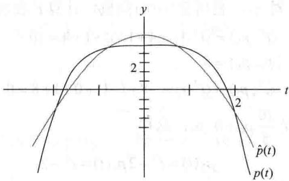
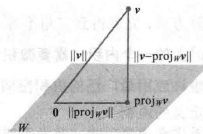
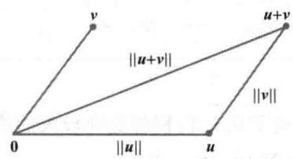
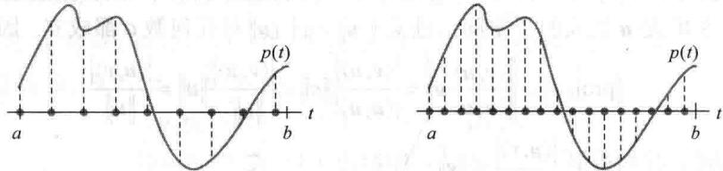
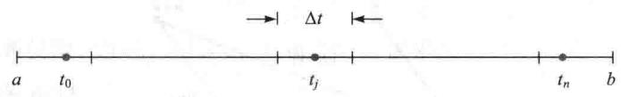

import Knowledge from '@/components/Knowledge.astro';
import Example from '@/components/Example.astro';
import Note from '@/components/Note.astro';
import Solution from '@/components/Solution.astro';
import Block from '@/components/Block.astro';

长度、距离和正交性的概念在向量空间中有非常重要的应用，对 $\mathbb{R}^n$ ，这些概念基于6.1节定理1中列出的内积性质．对其他空间，我们需要类似的内积和同样的性质．定理1中的结论成为下面定义中的公理.

定义 向量空间 V 上的内积是一个函数, 对每一对属于 V 的向量 u 和 v, 存在一个实数 $\langle u, v \rangle$ 满足下面公理, 其中 u, v, w 属于 V, c 为所有数:

1. $\langle u,v\rangle=\langle v,u\rangle$

2. $\langle u+v,w\rangle=\langle u,w\rangle+\langle v,w\rangle$

3. $\langle c\boldsymbol{u},\boldsymbol{v}\rangle=c\langle\boldsymbol{u},\boldsymbol{v}\rangle$

4. $\langle u, u \rangle \geqslant 0$ 且 $\langle u, u \rangle = 0$ 的充分必要条件是 $u = 0$

一个赋予上面内积的向量空间称为内积空间.

具有标准内积的向量空间 $\mathbb{R}^n$ 是一个内积空间，而且本章几乎所有 $\mathbb{R}^n$ 空间上的讨论都在内积空间上。本节和6.8节的例子给出许多基础应用实例，涉及工程、物理、数学和统计等课程。

<Example title="例 1">
给定两个正数（例如4和5）及 $\mathbb{R}^2$ 中向量 $u = (u_{1}, u_{2})$ 和 $v = (v_{1}, v_{2})$ ，规定

$$

\langle \boldsymbol {u}, \boldsymbol {v} \rangle = 4 u _ {1} v _ {1} + 5 u _ {2} v _ {2}\tag{1}

$$

说明（1）定义了一个内积.

无法识别

<Solution title="解">
公理1当然满足，这是因为

$$

\langle \boldsymbol {u}, \boldsymbol {v} \rangle = 4 u _ {1} v _ {1} + 5 u _ {2} v _ {2} = 4 v _ {1} u _ {1} + 5 v _ {2} u _ {2} = \langle \boldsymbol {v}, \boldsymbol {u} \rangle

$$

如果 $w = (w_{1}, w_{2})$ ，那么

$$

\begin{array}{r l} \langle \boldsymbol {u} + \boldsymbol {v}, \boldsymbol {w} \rangle & = 4 (u _ {1} + v _ {1}) w _ {1} + 5 (u _ {2} + v _ {2}) w _ {2} \\ & = 4 u _ {1} w _ {1} + 5 u _ {2} w _ {2} + 4 v _ {1} w _ {1} + 5 v _ {2} w _ {2} \\ & = \langle \boldsymbol {u}, \boldsymbol {w} \rangle + \langle \boldsymbol {v}, \boldsymbol {w} \rangle \end{array}

$$

这就验证了公理2.对公理3，计算

$$

\begin{array}{r l} \langle c \pmb {u}, \pmb {v} \rangle & = 4 (c u _ {1}) v _ {1} + 5 (c u _ {2}) v _ {2} \\ & = c (4 u _ {1} v _ {1} + 5 u _ {2} v _ {2}) = c \langle \pmb {u}, \pmb {v} \rangle \end{array}

$$

对公理4，注意 $\langle u, u \rangle = 4u_1^2 + 5u_2^2 \geqslant 0$ 且 $4u_1^2 + 5u_2^2 = 0$ 当且仅当 $u_1 = u_2 = 0$ 时成立，即 $u = 0$ 。此外， $\langle 0, 0 \rangle = 0$ 。所以（1）定义了 $\mathbb{R}^2$ 上的内积。

类似（1）可在 $\mathbb{R}^n$ 上定义内积，它们自然和“带权值的最小二乘”问题联系起来。此时，权值可赋给内积中和式的各个元素，且这种方式对较重要的元素给予更可靠的测量。

从现在起，当内积空间包含多项式或其他函数时，我们可用熟悉的方式写出函数，而不用黑体表示向量。然而，必须要记住，当它作为向量空间一个元素时每个函数表示的是一个向量。例2 设 $t_0, \cdots, t_n$ 是不同的实数，对 $\mathbb{P}_n$ 中的 $p$ 和 $q$ ，定义

$$

\langle p, q \rangle = p (t _ {0}) q (t _ {0}) + p (t _ {1}) q (t _ {1}) + \dots + p (t _ {n}) q (t _ {n})\tag{2}

$$

很容易验证内积公理的 1\~3. 对公理 4，注意

$$

\langle p, p \rangle = [ p (t _ {0}) ] ^ {2} + [ p (t _ {1}) ] ^ {2} + \dots + [ p (t _ {n}) ] ^ {2} \geqslant 0

$$

也有 $\langle0,0\rangle=0$ .（我们仍用黑体0表示零多项式，它是 $P_{n}$ 中的零向量.）如果 $\langle p,p\rangle=0$ ，那么p一定在 $n+1$ 个点 $t_{0},\cdots,t_{n}$ 处为零，这时p只能是零多项式，因为p的次数小于 $n+1$ ，从而（2）定义了 $P_{n}$ 上的一个内积.
</Solution>
</Example>

<Example title="例 3">
设 $V$ 属于 $\mathbb{P}_2$ ，且 $V$ 具有例2中的内积，其中 $t_0 = 0, t_1 = \frac{1}{2}$ 和 $t_2 = 1$ 。设 $p(t) = 12t^2$ 和 $q(t) = 2t - 1$ 。计算 $\langle p, q \rangle$ 和 $\langle q, q \rangle$ 。

<Solution title="解">
$$

\begin{array}{r l} \langle p \cdot q \rangle & = p (0) q (0) + p \left(\frac {1}{2}\right) q \left(\frac {1}{2}\right) + p (1) q (1) \\ & = (0) (- 1) + (3) (0) + (1 2) (1) = 1 2 \end{array}

$$

$$

\begin{array}{r l} \langle q \cdot q \rangle & = [ q (0) ] ^ {2} + \left[ q \left(\frac {1}{2}\right) \right] ^ {2} + [ q (1) ] ^ {2} \\ & = (- 1) ^ {2} + (0) ^ {2} + (1) ^ {2} = 2 \end{array}

$$
</Solution>
</Example>

## 长度、距离和正交性

设 $V$ 是一个内积空间，其内积记作 $\langle u, v \rangle$ 。像 $\mathbb{R}^n$ 中一样，我们定义一个向量 $v$ 的长度或范数是数

$$

\left\| \boldsymbol {v} \right\| = \sqrt {\langle \boldsymbol {v} , \boldsymbol {v} \rangle}

$$

即 $\| \pmb{v}\|^2 = \langle \pmb{v},\pmb{v}\rangle$ （这个定义有意义，因为 $\langle \pmb {v},\pmb {v}\rangle \geqslant 0$ ，但这个定义并不是说 $\langle \pmb {v},\pmb {v}\rangle$ 是一个“平方之和”，因为 $\pmb{v}$ 不必是 $\mathbb{R}^n$ 中的元素）.

一个单位向量是长度为1的向量，向量 $\pmb{u}$ 和 $\pmb{v}$ 之间的距离是 $\| u - v\|$ 。向量 $\pmb{u}$ 和向量 $\pmb{v}$ 正交，如果 $\langle u, v \rangle = 0$ 成立。

<Example title="例 4">
若 $P_{2}$ 具有例 3 中的形式（2）的内积，计算向量 $p(t)=12t^{2}$ 和 $q(t)=2t-1$ 的长度. 解

$$

\begin{array}{r l} & {\| p \| ^ {2} = \langle p, p \rangle = [ p (0) ] ^ {2} + \left[ p \left(\frac {1}{2}\right) \right] ^ {2} + [ p (1) ] ^ {2} = 0 + [ 3 ] ^ {2} + [ 1 2 ] ^ {2} = 1 5 3} \\ & {\| p \| = \sqrt {1 5 3}} \end{array}

$$

在例3中，我们知道 $\langle q, q \rangle = 2$ ，因此 $\|q\| = \sqrt{2}$
</Example>

## 格拉姆-施密特方法

内积空间中有限维子空间的正交基的存在性可由格拉姆-施密特方法确定，像 $\mathbb{R}^n$ 空间一样.应用中经常出现的一些正交基可用这个方法构造.

一个向量在一个具有正交基的子空间 W 上的正交投影可像平常一样构造。投影不依赖于正交基的选取，并且它们有正交分解定理和最佳逼近定理中所描述的性质。

<Example title="例 5">
若 $V$ 是具有例2中内积的 $\mathbb{P}_4$ ，包含多项式在-2，-1，0，1和2处的值，且 $\mathbb{P}_2$ 作为 $V$ 的一个子空间。应用格拉姆-施密特方法于多项式1， $t$ 和 $t^2$ ，构造 $\mathbb{P}_2$ 的一个正交基。

<Solution title="解">
内积仅依赖于多项式在-2，-1，0，1和2处的值，所以我们列出每个多项式作为 $\mathbb{R}^5$ 中的向量，写在多项式的下面：

$$

\begin{array}{r l} & {\text {多项式:} \quad 1} \\ & {\text {向量值:} \left[ \begin{array}{l} {1} \\ {1} \\ {1} \\ {1} \\ {1} \end{array} \right] \qquad \left[ \begin{array}{l} {- 2} \\ {- 1} \\ {0} \\ {1} \\ {2} \end{array} \right] \qquad \left[ \begin{array}{l} {t ^ {2}} \\ {4} \\ {1} \\ {0} \\ {1} \\ {4} \end{array} \right]} \end{array}

$$

$V$ 中两个多项式的内积等于它们对应向量在 $\mathbb{R}^5$ 空间的（标准）内积. 注意 $t$ 与常数函数1正交. 所以取 $p_0(t) = 1$ 和 $p_1(t) = t$ . 对 $p_2$ ，利用 $\mathbb{R}^5$ 中的向量，计算 $t^2$ 在 $\operatorname{Span}\{p_0, p_1\}$ 上的投影：

$$

\begin{array}{l} \langle t ^ {2}, p _ {0} \rangle = \langle t ^ {2}, 1 \rangle = 4 + 1 + 0 + 1 + 4 = 1 0 \\ \langle p _ {0}, p _ {0} \rangle = 5 \\ \langle t ^ {2}, p _ {1} \rangle = \langle t ^ {2}, t \rangle = - 8 + (- 1) + 0 + 1 + 8 = 0 \end{array}

$$

$t^2$ 在 $\operatorname{Span}\{1, t\}$ 上的正交投影是 $\frac{10}{5} p_0 + 0 \cdot p_1$ ，这样

$$

p _ {2} (t) = t ^ {2} - 2 p _ {0} (t) = t ^ {2} - 2

$$

$V$ 的子空间 $\mathbb{P}_2$ 的一个正交基是：

$$

\begin{array}{r l r} & {\text {多项式:} p _ {0}} \\ & {\text {向量值:} \left[ \begin{array}{l} {1} \\ {1} \\ {1} \\ {1} \\ {1} \end{array} \right]} & {\left[ \begin{array}{l} {- 2} \\ {- 1} \\ {0} \\ {1} \\ {2} \end{array} \right] \quad \left[ \begin{array}{l} {2} \\ {- 1} \\ {- 2} \\ {- 1} \\ {2} \end{array} \right]} \end{array}\tag{3}

$$
</Solution>
</Example>

## 内积空间的最佳逼近

应用数学中最常见的问题涉及元素是函数的向量空间，主要是在 $V$ 的特定子空间 $W$ 中选取函数 $g$ 来逼近 $V$ 中的函数 $f$ 。对 $f$ 的“逼近”程度依赖于 $\| f - g\|$ 定义的方式，我们仅考虑 $f$ 和 $g$ 的距离用内积定义确定的情形。在此情形下， $f$ 由 $W$ 中函数的最佳逼近是指 $f$ 在子空间 $W$ 上的正交投影。

<Example title="例 6">
设 $V$ 是 $\mathbb{P}_4$ ，且具有例5中定义的内积， $p_0, p_1$ 和 $p_2$ 是例5中的子空间 $\mathbb{P}_2$ 的正交基，求出 $\mathbb{P}_2$ 中的多项式对 $p(t) = 5 - \frac{1}{2} t^4$ 的最佳逼近.

<Solution title="解">
$p_0, p_1$ 和 $p_2$ 对应 $t$ 为 $-2, -1, 0, 1$ 和 $2$ 的值以 $\mathbb{R}^5$ 中向量的形式在上面（3）中已经给出， $p$ 的相应值是 $-3, 9/2, 5, 9/2$ 和 $-3$ . 计算

$$

\begin{array}{l l} {\langle p, p _ {0} \rangle = 8,} & {\langle p, p _ {1} \rangle = 0, \quad \langle p, p _ {2} \rangle = - 3 1} \\ {\langle p _ {0}, p _ {0} \rangle = 5,} & {\langle p _ {2}, p _ {2} \rangle = 1 4} \end{array}

$$

所以， $P_{2}$ 中的多项式对V中p的最佳逼近是

$$

\begin{array}{r l} \hat {p} = \mathrm{proj} _ {\mathbb {P} _ {2}} p & = \frac {\langle p , p _ {0} \rangle}{\langle p _ {0} , p _ {0} \rangle} p _ {0} + \frac {\langle p , p _ {1} \rangle}{\langle p _ {1} , p _ {1} \rangle} p _ {1} + \frac {\langle p , p _ {2} \rangle}{\langle p _ {2} , p _ {2} \rangle} p _ {2} \\ & = \frac {8}{5} p _ {0} + \frac {- 3 1}{1 4} p _ {2} = \frac {8}{5} - \frac {3 1}{1 4} (t ^ {2} - 2) \end{array}

$$

当多项式之间的距离仅用 $t$ 为-2，-1，0，1和2时的值来度量时，这是 $\mathbb{P}_2$ 的所有多项式中离 $p$ 最近的多项式，见图6-34.

  

图 6-34

例 5 和例 6 中的多项式 $p_{0}, p_{1}$ 和 $p_{2}$ 属于一类多项式，在统计学上称为正交多项式。 ① 正交性是指例 2 中描述的内积类型。
</Solution>
</Example>

## 两个不等式

给定内积空间 V 中的向量 v 和有限维子空间 W，我们将勾股定理应用到 v 关于 W 的正交分解中，可以得到

$$

\left\| \boldsymbol {v} \right\| ^ {2} = \left\| \operatorname{proj} _ {W} \boldsymbol {v} \right\| ^ {2} + \left\| \boldsymbol {v} - \operatorname{proj} _ {W} \boldsymbol {v} \right\| ^ {2}

$$

见图 6-35. 特别地，这表明 v 到 W 上投影的范数不超过 v 自身的范数，这个简单事实可推出下面重要的不等式.

<Knowledge title="定理 16">
（柯西-施瓦茨不等式）

图6-35 直角三角形的斜边是最长边

对 $V$ 中任意向量 $\pmb{u}$ 和 $\pmb{v}$ ，有

$$

\left| \langle \boldsymbol {u}, \boldsymbol {v} \rangle \right| \leqslant \| \boldsymbol {u} \| \| \boldsymbol {v} \|\tag{4}

$$

<Solution title="证明">
如果 u=0，则方程（4）的两边都是零，因此这种情形下（4）式成立（见练习题1）。如果 $u \neq 0$ ，则令 W 是 u 生成的子空间，注意 $\|cu\| = |c|\|u\|$ 对任何数 c 都成立。因此

$$

\left\| \operatorname{proj} _ {w} \boldsymbol {v} \right\| = \left\| \frac {\langle \boldsymbol {v} , \boldsymbol {u} \rangle}{\langle \boldsymbol {u} , \boldsymbol {u} \rangle} \boldsymbol {u} \right\| = \frac {| \langle \boldsymbol {v} , \boldsymbol {u} \rangle |}{| \langle \boldsymbol {u} , \boldsymbol {u} \rangle |} \| \boldsymbol {u} \| = \frac {| \langle \boldsymbol {v} , \boldsymbol {u} \rangle |}{\| \boldsymbol {u} \| ^ {2}} \| \boldsymbol {u} \| = \frac {| \langle \boldsymbol {u} , \boldsymbol {v} \rangle |}{\| \boldsymbol {u} \|}

$$

由于 $\| \mathrm{proj}_W\nu \| \leqslant \| \nu \|$ ，我们得到 $\frac{|\langle\boldsymbol{u},\boldsymbol{v}\rangle|}{\|\boldsymbol{u}\|} \leqslant \| \nu \|$ ，即给出（4）式.

柯西-施瓦茨不等式在很多数学分支都很有用，习题中有几个简单应用。这里我们主要利用它证明另一个包含向量范数的基本不等式。见图6-36.

  

图 6-36 三角形边的长度
</Solution>
</Knowledge>

<Knowledge title="定理 17">
（三角不等式）

对属于 $V$ 的所有向量 $\pmb{u},\pmb{v}$ ，有

$$

\left\| \boldsymbol {u} + \boldsymbol {v} \right\| \leqslant \left\| \boldsymbol {u} \right\| + \left\| \boldsymbol {v} \right\|

$$

<Solution title="证明">
$$

\begin{array}{r l} {\left\| \pmb {u} + \pmb {v} \right\| ^ {2}} & {= \langle \pmb {u} + \pmb {v}, \pmb {u} + \pmb {v} \rangle = \langle \pmb {u}, \pmb {u} \rangle + 2 \langle \pmb {u}, \pmb {v} \rangle + \langle \pmb {v}, \pmb {v} \rangle} \\ & {\leqslant \left\| \pmb {u} \right\| ^ {2} + 2 \left| \langle \pmb {u}, \pmb {v} \rangle \right| + \left\| \pmb {v} \right\| ^ {2}} \\ & {\leqslant \left\| \pmb {u} \right\| ^ {2} + 2 \left\| \pmb {u} \right\| \left\| \pmb {v} \right\| + \left\| \pmb {v} \right\| ^ {2}} \\ & {= (\left\| \pmb {u} \right\| + \left\| \pmb {v} \right\|) ^ {2}} \end{array} \text {柯西-施瓦茨不等式}

$$

两边开方后，立刻得到三角不等式.

$C[a,b]$ 上的一个内积（需要微积分知识）

也许应用最广泛的内积空间是区间 $a \leqslant t \leqslant b$ 上所有连续函数构成的向量空间 $C[a, b]$ ，具有下面定义的内积.

首先考虑多项式 $p$ 及大于或等于 $p$ 的阶数的任何整数 $n$ ，则有 $p$ 属于 $\mathbb{P}_n$ ，我们可以利用例2中的内积计算 $p$ 的“长度”，注意 $p$ 包含 $[a, b]$ 中 $(n+1)$ 个点。然而， $p$ 的这个长度仅保留这 $(n+1)$ 个点的特性。由于对所有大的 $n$ 有 $p$ 属于 $\mathbb{P}_n$ ，故我们可以利用更大的 $n$ 和更多的点“计算”对应的内积。见图6-37。

  

图6-37 利用 $[a,b]$ 内不同数目的求值点计算 $\| p\|^2$

我们将 $[a,b]$ 分割为 $(n+1)$ 个长度为 $\Delta t=(b-a)/(n+1)$ 的子区间，并且使 $t_{0},\cdots,t_{n}$ 是这些子区间中的任意点.

如果 n 很大，则由 $t_{0}, \cdots, t_{n}$ 确定的关于 $P_{n}$ 的内积将趋向较大的值 $\langle p, p \rangle$ ，所以需要重新度量，将内积除以 $(n+1)$ 。注意到 $1/(n+1) = \Delta t / (b - a)$ ，定义

$$

\langle p, q \rangle = \frac {1}{n + 1} \sum_ {j = 0} ^ {n} p (t _ {j}) q (t _ {j}) = \frac {1}{b - a} \left[ \sum_ {j = 0} ^ {n} p (t _ {j}) q (t _ {j}) \Delta t \right]

$$

现在，让 $n$ 无限制增加。由于多项式 $p, q$ 是连续函数，故括号内的表达式是一个黎曼和且趋向一个定积分，考虑 $p(t)q(t)$ 在 $[a, b]$ 上的平均值：

$$

\frac {1}{b - a} \int_ {a} ^ {b} p (t) q (t) \mathrm{d} t

$$

这个数值对任意阶多项式都有定义（事实上是对所有连续函数），且它具有像下面例题所说的全部内积性质。前面的缩放因子 $1 / (b - a)$ 不是必需的，为简化下面的计算常省略。
</Solution>
</Knowledge>

<Example title="例 7">
对 $C[a,b]$ 中的 $f,g$ ，取

$$

\langle f, g \rangle = \int_ {a} ^ {b} f (t) g (t) \mathrm{d} t\tag{5}

$$

这表明（5）定义了 $C[a,b]$ 上的内积.

<Solution title="解">
内积公理 1\~3 可由定积分的基本性质得出. 对公理 4, 注意到

$$

\langle f, f \rangle = \int_ {a} ^ {b} [ f (t) ] ^ {2} \mathrm{d} t \geqslant 0

$$

函数 $[f(t)]^2$ 在 $[a, b]$ 上连续且非负。如果 $[f(t)]^2$ 的定积分为零，那么由高等微积分的定理可知， $[f(t)]^2$ 在 $[a, b]$ 上必须恒等于零，从而 $f$ 是一个零函数。 $\langle f, f \rangle = 0$ 意味着 $f$ 是 $[a, b]$ 上的零函数。因此（5）定义了一个 $C[a, b]$ 上的内积。
</Solution>
</Example>

<Example title="例 8">
设 $V$ 表示具有例7中内积的空间 $C[0,1]$ , $W$ 是由多项式 $p_1(t) = 1$ , $p_2(t) = 2t - 1$ 和 $p_3(t) = 12t^2$ 所生成的子空间, 利用格拉姆-施密特方法, 求 $W$ 的一个正交基.

<Solution title="解">
取 $q_{1} = p_{1}$ ，并且计算

$$

\langle p _ {2}, q _ {1} \rangle = \int_ {0} ^ {1} (2 t - 1) (1) \mathrm{d} t = (t ^ {2} - t) \Big | _ {0} ^ {1} = 0

$$

因而 $p_2$ 已经与 $q_{1}$ 正交，所以可取 $q_{2} = p_{2}$ 。对 $p_3$ 在 $W_{2} = \mathrm{Span}\{q_{1}, q_{2}\}$ 上的投影，计算

$$

\langle p _ {3}, q _ {1} \rangle = \int_ {0} ^ {1} 1 2 t ^ {2} \cdot 1 \mathrm{d} t = 4 t ^ {3} \Big | _ {0} ^ {1} = 4

$$

$$

\langle q _ {1}, q _ {1} \rangle = \int_ {0} ^ {1} 1. 1 \dot {\mathrm{d}} t = t \Big | _ {0} ^ {1} = 1

$$

$$

\langle p _ {3}, q _ {2} \rangle = \int_ {0} ^ {1} 1 2 t ^ {2} (2 t - 1) \mathrm{d} t = \int_ {0} ^ {1} (2 4 t ^ {3} - 1 2 t ^ {2}) \mathrm{d} t = 2

$$

$$

\langle q _ {2}, q _ {2} \rangle = \int_ {0} ^ {1} (2 t - 1) ^ {2} \mathrm{d} t = \frac {1}{6} (2 t - 1) ^ {3} \Big | _ {0} ^ {1} = \frac {1}{3}

$$

那么

$$

\mathrm{proj} _ {w _ {2}} p _ {3} = \frac {\langle p _ {3} , q _ {1} \rangle}{\langle q _ {1} , q _ {1} \rangle} q _ {1} + \frac {\langle p _ {3} , q _ {2} \rangle}{\langle q _ {2} , q _ {2} \rangle} q _ {2} = \frac {4}{1} q _ {1} + \frac {2}{1 / 3} q _ {2} = 4 q _ {1} + 6 q _ {2}

$$

且

$$

q _ {3} = p _ {3} - \operatorname{proj} _ {w _ {2}} p _ {3} = p _ {3} - 4 q _ {1} - 6 q _ {2}

$$

作为一个函数， $q_{3}(t) = 12t^{2} - 4 - 6(2t - 1) = 12t^{2} - 12t + 2$ ，子空间 $W$ 的正交基是 $\{q_1,q_2,q_3\}$
</Solution>
</Example>

<Block title="练习题">

利用内积公理验证下列论断.

1. $\langle \pmb {v},\pmb {0}\rangle = \langle \pmb {0},\pmb {v}\rangle = 0$

2. $\langle u, v + w \rangle = \langle u, v \rangle + \langle u, w \rangle$

</Block>

<Block title="习题6.7">

1. 在 $R^{2}$ 中取例 1 定义的内积，令 $x=(1,1)$ ， $y=(5,-1)$ .

研究 $|\langle x,y\rangle |^2 .)$

a. 计算 $\|x\|$ , $\|y\|$ 和 $\left|\langle x,y\rangle\right|^{2}$ .

b. 描述所有与 y 正交的向量 $(z_{1}, z_{2})$ .

习题 3\~8 中的多项式属于 $P_{2}$ 且计算内积时 t 取值为 -1, 0 和 1. （见例 2.）

3. 计算 $\langle p, q \rangle$ ，其中 $p(t) = 4 + t, q(t) = 5 - 4t^2$ .

2. 在 $\mathbb{R}^2$ 中取例1定义的内积，证明柯西-施瓦茨不等式对 $x = (3, -2)$ 和 $y = (-2, 1)$ 成立。（建议：

4. 计算 $\langle p, q \rangle$ ，其中 $p(t) = 3t - t^2, q(t) = 3 + 2t^2$

5. 计算 $\| p\|$ 和 $\| q\|$ ，其中 $p, q$ 如习题3.

6. 计算 $\| p\|$ 和 $\| q\|$ ，其中 $p, q$ 如习题4.

7. 计算 q 在 p 所生成的子空间上的正交投影，其中 p, q 如习题 3.

8. 计算 q 在 p 所生成的子空间上的正交投影，其中 p, q 如习题 4.

9. 设 $P_{3}$ 计算内积时 t 取值为 -3, -1, 1 和 3，令 $p_{0}(t)=1$ , $p_{1}(t)=t$ 和 $p_{2}(t)=t^{2}$ .

a. 计算 $p_{2}$ 在 $p_{0}$ 和 $p_{1}$ 生成的子空间上的正交投影.

b. 求一个与 $p_{0}$ 和 $p_{1}$ 都正交的多项式 q，使得 $\{p_{0}, p_{1}, q\}$ 是 Span $\{p_{0}, p_{1}, p_{2}\}$ 的一个正交基。重新度量多项式 q，使得它在 $(-3, -1, 1, 3)$ 处的向量值是 $(1, -1, -1, 1)$ .

10. 若 $\mathbb{P}_3$ 具有习题9中定义的内积，且多项式 $p_0,p_1,q$ 也如习题9所描述，求 $\operatorname {Span}\{p_0,p_1,q\}$ 中由多项式对 $p(t) = t^3$ 的最佳逼近.

11. 若 $p_0, p_1$ 和 $p_2$ 是例5中给出的正交多项式，且计算 $\mathbb{P}_4$ 的内积时 $t$ 取值为-2,-1,0,1和2. 求 $t^3$ 在 $\operatorname{Span}\{p_0, p_1, p_2\}$ 上的正交投影.

12. 求一个多项式 $p_3$ ，使得 $\{p_0, p_1, p_2, p_3\}$ （见习题11）是 $\mathbb{P}_4$ 中子空间 $\mathbb{P}_3$ 的正交基。重新度量多项式 $p_3$ ，使得它的向量值是 $(-1, 2, 0, -2, 1)$ 。

13. 设 $A$ 是任一 $n \times n$ 可逆矩阵，证明对 $\mathbb{R}^n$ 中 $\pmb{u}$ 和 $\pmb{v}$ ，公式 $\langle \pmb{u}, \pmb{v} \rangle = (A\pmb{u}) \cdot (A\pmb{v}) = (A\pmb{u})^\mathrm{T} \cdot (A\pmb{v})$ 定义了一个 $\mathbb{R}^n$ 上的内积.

14. 若 $T$ 是从向量空间 $V$ 到 $\mathbb{R}^n$ 的一对一线性变换，证明对 $V$ 中的 $\pmb{u}$ 和 $\pmb{v}$ ，公式 $\langle \pmb{u},\pmb{v}\rangle = T(\pmb{u})\cdot T(\pmb{v})$ 定义了 $V$ 上的一个内积.

利用本节内积公理和其他结果去验证习题15\~18的命题.

15. $\langle u, cv \rangle = c\langle u, v \rangle$ 对所有数 $c$ 都成立.

16. 如果 $\{\pmb{u},\pmb{v}\}$ 是 $V$ 中的单位正交集，那么 $\| \pmb {u} - \pmb {v}\| = \sqrt{2}$

</Block>

<Block title="练习题答案">

17. $\langle \pmb {u},\pmb {v}\rangle = \frac{1}{4}\| \pmb {u} + \pmb {v}\| ^2 -\frac{1}{4}\| \pmb {u} - \pmb {v}\| ^2.$

18. $\left\| \pmb {u} + \pmb {v}\right\| ^2 +\left\| \pmb {u} - \pmb {v}\right\| ^2 = 2\left\| \pmb {u}\right\| ^2 +2\left\| \pmb {v}\right\| ^2.$

19. 给定 $a \geqslant 0$ 和 $b \geqslant 0$ ，设 $\pmb{u} = \begin{bmatrix} \sqrt{a} \\ \sqrt{b} \end{bmatrix}$ ， $\pmb{v} = \begin{bmatrix} \sqrt{b} \\ \sqrt{a} \end{bmatrix}$ ，利用柯西-施瓦茨不等式比较几何平均值 $\sqrt{ab}$ 和算术平均值 $(a + b)/2$ 。

20. 设 $u=\begin{bmatrix}a\\ b\end{bmatrix}$ 和 $v=\begin{bmatrix}1\\ 1\end{bmatrix}$ ，利用柯西-施瓦茨不等式证明 $\left(\frac{a+b}{2}\right)^{2}\leqslant\frac{a^{2}+b^{2}}{2}$ .

习题 21\~24 的空间指的是 V = C[0,1]，其内积如例 7 所示用一个积分给出.

21. 计算 $\langle f, g \rangle$ ，其中 $f(t) = 1 - 3t^2$ ， $g(t) = t - t^3$ .

22. 计算 $\langle f, g \rangle$ ，其中 $f(t) = 5t - 3$ ， $g(t) = t^{3} - t^{2}$ .

23. 计算习题 21 中 f 的 $\|f\|$ .

24. 计算习题 22 中 g 的 $\|g\|$ .

25. 设 $V$ 是具有例7中定义的内积的空间 $C[-1,1]$ ，求由多项式1， $t$ 和 $t^2$ 所生成的子空间的正交基。这个基中的多项式称为勒让德多项式。

26. 设 V 是具有例 7 中定义的内积的空间 C[-2,2]，求由多项式 1, t 和 $t^{2}$ 所生成的子空间的一个正交基.

27. [M]设 $P_{4}$ 具有例 5 中定义的内积，且 $p_{0}, p_{1}, p_{2}$ 是该例中的正交多项式，利用矩阵程序，将格拉姆-施密特方法应用于集合 $\{p_{0}, p_{1}, p_{2}, t^{3}, t^{4}\}$ ，以构造 $P_{4}$ 的一个正交基.

28. [M]设 $V$ 是具有例7中定义的内积的空间 $C[0,2\pi ]$ ，利用格拉姆-施密特方法构造由 $\{1,\cos t,\cos^2 t,\cos^3 t\}$ 所生成的子空间的一个正交基．利用矩阵程序或计算程序来计算相应的定积分.

1. 由公理 1， $\langle v,0\rangle=\langle0,v\rangle$ ，那么 $\langle0,v\rangle=\langle0v,v\rangle=0\langle v,v\rangle$ ，由公理 3，得到 $\langle0,v\rangle=0$ 。

2. 由公理1和2，再由公理1，得 $\langle u, v + w \rangle = \langle v + w, u \rangle = \langle v, u \rangle + \langle w, u \rangle = \langle u, v \rangle + \langle u, w \rangle$

</Block>
