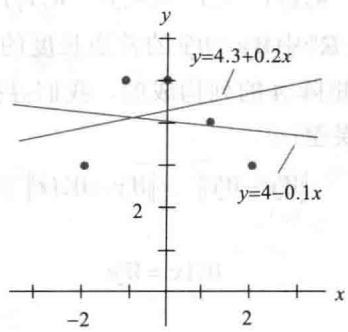
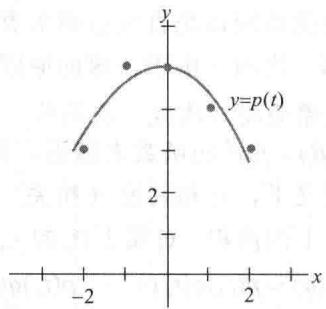
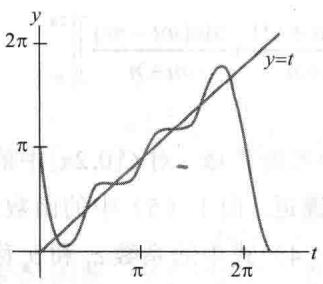
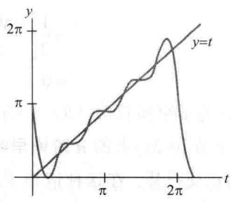
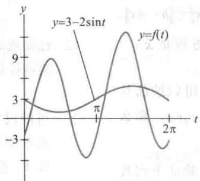

import Guide from '@/components/Guide.astro';
import Knowledge from '@/components/Knowledge.astro';
import Example from '@/components/Example.astro';
import Analysis from '@/components/Analysis.astro';
import Solution from '@/components/Solution.astro';
import Variant from '@/components/Variant.astro';
import Note from '@/components/Note.astro';
import Block from '@/components/Block.astro';
import Method from '@/components/Method.astro';
import Exercise from '@/components/Exercise.astro';

本节的例题说明 6.7 节定义的内积空间如何应用在实际问题中。第一个例子是本章的介绍性实例中所描述的，它是调整北美地质数据问题中出现的巨型最小二乘问题。

## 加权最小二乘法

设向量 y 的 n 次观测值为 $y_{1}, \cdots, y_{n}$ ，且假设我们希望用属于 $R^{n}$ 的特定子空间的一个向量 $\hat{y}$ 逼近 y（在 6.5 节， $\hat{y}$ 被写成 Ax，所以 $\hat{y}$ 属于 A 的列空间）。记 $\hat{y}$ 的元素为 $\hat{y}_{1}, \cdots, \hat{y}_{n}$ ，那么误差的平方和或 $SS(E)$ 用 $\hat{y}$ 逼近 y 后为

$$
S S (E) = \left(y _ {1} - \hat {y} _ {1}\right) ^ {2} + \dots + \left(y _ {n} - \hat {y} _ {n}\right) ^ {2}\tag{1}
$$

利用 $R^{n}$ 的标准长度的写法，上式可简记为 $\left\|y-\hat{y}\right\|^{2}$ .

现在，假设测量时 y 的各个元素的可靠性不同（这是北美地质资料的一个特点，因为测量的数据是 140 年前的，作为另一个例子，y 的元素的计算来自各种样本的测量和不同样本的大小），那么可靠性就变成（1）式中平方误差的适当权值，较可靠的测量应赋予更重要的作用。 ① 如果权值记为 $w_{1}^{2},\cdots,w_{n}^{2}$ ，那么加权的误差平方和是

$$
\mathrm{加权} S S (E) = w _ {1} ^ {2} (y - \hat {y} _ {1}) ^ {2} + \dots + w _ {n} ^ {2} (y _ {n} - \hat {y} _ {n}) ^ {2}\tag{2}
$$

这是 $(y - \hat{y})$ 长度的平方，其中的长度类似6.7节例1中定义的内积，即

$$
\langle \boldsymbol {x}, \boldsymbol {y} \rangle = w _ {1} ^ {2} x _ {1} y _ {1} + \dots + w _ {n} ^ {2} x _ {n} y _ {n}
$$

有时，可以非常方便地将这种加权最小二乘问题变换为等价的普通最小二乘问题。设 W 是对角线上是正数 $w_{1}, \cdots, w_{n}$ 的对角矩阵，可得

$$
W \mathbf {y} = \left[ \begin{array}{c c c c} w _ {1} & 0 & \dots & 0 \\ 0 & w _ {2} & \dots & \\ \vdots & & \ddots & \vdots \\ 0 & & \dots & w _ {n} \end{array} \right] \left[ \begin{array}{l} y _ {1} \\ y _ {2} \\ \vdots \\ y _ {n} \end{array} \right] = \left[ \begin{array}{c} w _ {1} y _ {1} \\ w _ {2} y _ {2} \\ \vdots \\ w _ {n} y _ {n} \end{array} \right]
$$

$\hat{w}$ 有类似的表达式. 可以看到（2）式的第 $j$ 项可写成

$$
w _ {j} ^ {2} \left(y _ {j} - \hat {y} _ {j}\right) ^ {2} = \left(w _ {j} y _ {j} - w _ {j} \hat {y} _ {j}\right) ^ {2}
$$

从而（2）式中加权的 $SS(E)$ 就是 $R^{n}$ 中 $Wy - W\hat{y}$ 的普通长度的平方，它可以写成 $\|Wy - W\hat{y}\|^{2}$ .

现在假设向量 $\hat{y}$ 的逼近是由矩阵 A 的列构成的，我们寻找一个 $\hat{x}$ ，使得 $A\hat{x} = \hat{y}$ 尽可能接近 y．然而，逼近的度量是加权的误差：

这样 $\hat{\pmb{x}}$ 是方程

$$
\begin{array}{r l} & {\left\| W \mathbf {y} - W \hat {\mathbf {y}} \right\| ^ {2} = \left\| W \mathbf {y} - W A \hat {\mathbf {x}} \right\| ^ {2}} \\ & {\qquad \qquad \qquad \qquad \qquad \qquad \qquad \qquad \qquad \qquad \qquad \qquad \qquad \qquad \qquad \qquad \qquad \qquad \qquad \qquad \qquad \qquad \qquad \qquad \qquad \qquad \qquad \qquad \qquad \qquad \qquad \qquad \qquad \qquad \mathrm{WAX} = W \mathbf {y}} \end{array}
$$

的（普通）最小二乘解，此最小二乘解的法方程是

$$
(W A) ^ {T} W A \boldsymbol {x} = (W A) ^ {T} W \boldsymbol {y}
$$

<Example title="例 1">
求最小二乘直线 $y = \beta_{0} + \beta_{1}x$ ，最佳拟合数据为 $(-2,3), (-1,5), (0,5), (1,4), (2,3)$ 。假设后面两组数据中，y 值测量的误差比其余数据的误差大，这些数据的权值只有其余数据权值的一半。

<Solution title="解">
如 6.6 节所示，写出矩阵 A 对应的 X 和向量 x 对应的 $\beta$ ，我们得到

$$
X = \left[ \begin{array}{c c} 1 & - 2 \\ 1 & - 1 \\ 1 & 0 \\ 1 & 1 \\ 1 & 2 \end{array} \right], \quad \boldsymbol {\beta} = \left[ \begin{array}{c} \beta_ {0} \\ \beta_ {1} \end{array} \right], \quad \mathbf {y} = \left[ \begin{array}{c} 3 \\ 5 \\ 5 \\ 4 \\ 3 \end{array} \right]
$$

对权矩阵，选取 W 的对角线元素为 2, 2, 2, 1 和 1. 对 X 的行和 y 分别左乘 W，得到

$$
W X = \left[ \begin{array}{c c} 2 & - 4 \\ 2 & - 2 \\ 2 & 0 \\ 1 & 1 \\ 1 & 2 \end{array} \right], \quad W \mathbf {y} = \left[ \begin{array}{c} 6 \\ 1 0 \\ 1 0 \\ 4 \\ 3 \end{array} \right]
$$

对于法方程，计算

$$
(W X) ^ {\mathrm{T}} W X = \left[ \begin{array}{c c} {1 4} & {- 9} \\ {- 9} & {2 5} \end{array} \right] \text {和} (W X) ^ {\mathrm{T}} W y = \left[ \begin{array}{c} {5 9} \\ {- 3 4} \end{array} \right]
$$

并且求解

$$
\left[ \begin{array}{l l} 1 4 & - 9 \\ - 9 & 2 5 \end{array} \right] \left[ \begin{array}{l} \beta_ {0} \\ \beta_ {1} \end{array} \right] = \left[ \begin{array}{l} 5 9 \\ - 3 4 \end{array} \right]
$$

法方程的解（精确到2位有效数字）是 $\beta_0 = 4.3$ 和 $\beta_{1} = 0.20$ ，期望的直线是 $y = 4.3 + 0.20x$ 相反，这些数据的普通最小二乘直线是 $y = 4.0 - 0.10x$ 两条直线都显示在图6-38中.

  
图 6-38 加权和普通的最小二乘直线
</Solution>
</Example>

## 数据趋势分析

设特定函数 f 仅知道在点 $t_{0}, \cdots, t_{n}$ 处的值（也许是近似值），如果数据 $f(t_{0}), \cdots, f(t_{n})$ 中有一个“线性趋势”，那么我们期望用形如 $\beta_{0} + \beta_{1}t$ 的函数得到 f 的近似值。如果数据有一个“二次趋势”，那么我们会尝试用形如 $\beta_{0} + \beta_{1}t + \beta_{2}t^{2}$ 的函数。这就是不同的观点下在 6.6 节已讨论过的函数。

在某些统计问题中，将线性趋势从二次趋势（也许是三次或高阶趋势）中分离出来非常重要。例如，工程师正在分析新车的性能，而 $f(t)$ 表示 $t$ 时刻汽车和一些参照点之间的距离。如果汽车以常速连续行驶，那么 $f(t)$ 的图像应该是直线且斜率表示速度。如果突然踩下油门，那么 $f(t)$ 的图像将改变为包含二次项和三次项（由于加速的原因）。又例如，当分析一辆汽车超过另一辆汽车的能力时，工程师就会希望将二次或三次项从一次项中分离出来。

如果一个函数由形如 $y = \beta_0 + \beta_1 t + \beta_2 t^2$ 的函数来逼近，那么系数 $\beta_2$ 也许不能给出期望的二次趋势的数据，原因是在统计学意义下，它和其他 $\beta_i$ 相关。为进行所谓的数据的趋势分析，类似6.7节的例2，我们引入空间 $\mathbb{P}_n$ 上的内积。对属于 $\mathbb{P}_n$ 的 $p, q$ ，定义：

$$
\langle p, q \rangle = p (t _ {0}) q (t _ {0}) + \dots + p (t _ {n}) q (t _ {n})
$$

实际上，统计学家很少需要考虑阶数高于三次或四次的趋势。所以，假设 $p_0, p_1, p_2, p_3$ 表示 $\mathbb{P}_n$ 的子空间 $\mathbb{P}_3$ 的正交基，它可以将多项式 $1, t, t^2$ 和 $t^3$ 应用格拉姆-施密特方法得到。由第2章的补充习题11，存在一个属于 $\mathbb{P}_n$ 的多项式 $g$ ，它在 $t_0, \cdots, t_n$ 的值与未知函数 $f$ 的值一致。令 $\hat{g}$ 是 $g$ 在 $\mathbb{P}_3$ 上的正交投影（关于给定的内积），比如

$$
\hat {g} = c _ {0} p _ {0} + c _ {1} p _ {1} + c _ {2} p _ {2} + c _ {3} p _ {3}
$$

那么 $\hat{g}$ 称为数据的立方趋势函数， $c_{0},\cdots,c_{3}$ 称为数据的趋势系数。其中系数 $c_{1}$ 表示线性趋势， $c_{2}$ 表示二次趋势， $c_{3}$ 表示立方趋势。结果是如果数据具有某些性质，则这些系数相互独立。

由于 $p_{0},\cdots,p_{3}$ 是正交的（注意 $c_{i}=\langle g,p_{i}\rangle/\langle p_{i},p_{i}\rangle$ ），故趋势系数可逐次计算且相互独立。如果我们仅需要二次趋势，则可以忽略 $p_{3}$ 和 $c_{3}$ 。例如，如果我们需要确定四次趋势，则仅需要计算 $\langle g,p_{4}\rangle/\langle p_{4},p_{4}\rangle$ ，找到一个与 $P_{3}$ 正交且属于 $P_{4}$ 的多项式 $p_{4}$ （通过格拉姆-施密特方法）。

<Example title="例 2">
最简单且最重要的趋势分析是点 $t_{0}, \cdots, t_{n}$ 被调整后，它们均匀分布且总和为零。用二次趋势函数拟合数据 $(-2, 3), (-1, 5), (0, 5), (1, 4), (2, 3)$ .

<Solution title="解">
对 6.7 节中例 5 中的正交多项式的 t 坐标重新度量，可得

$$
\text { 多项式: } p _ {0} \quad p _ {1} \quad p _ {2} \quad \text { 数据: } g
$$

$$
\text {向量值:} \left[ \begin{array}{l} 1 \\ 1 \\ 1 \\ 1 \\ 1 \end{array} \right], \quad \left[ \begin{array}{l} - 2 \\ - 1 \\ 0 \\ 1 \\ 2 \end{array} \right], \quad \left[ \begin{array}{l} 2 \\ - 1 \\ - 2 \\ - 1 \\ 2 \end{array} \right], \quad \left[ \begin{array}{l} 3 \\ 5 \\ 5 \\ 4 \\ 3 \end{array} \right]
$$

计算仅包含这些向量，没有涉及特别的正交多项式公式。在 $\mathbb{P}_2$ 中，用多项式对数据的最佳逼近是下面给出的正交投影：

$$
\begin{array}{r l} \hat {p} & = \frac {\langle g , p _ {0} \rangle}{\langle p _ {0} , p _ {0} \rangle} p _ {0} + \frac {\langle g , p _ {1} \rangle}{\langle p _ {1} , p _ {1} \rangle} p _ {1} + \frac {\langle g , p _ {2} \rangle}{\langle p _ {2} , p _ {2} \rangle} p _ {2} \\ & = \frac {2 0}{5} p _ {0} - \frac {1}{1 0} p _ {1} - \frac {7}{1 4} p _ {2} \end{array}
$$

$$
\hat {p} (t) = 4 - 0. 1 t - 0. 5 \left(t ^ {2} - 2\right)\tag{3}
$$

由于 $p_{2}$ 的系数不是足够小, 因此一个合理的结果是趋势至少是二次. 这个结论可从图 6-39 得到验证.

  
图 6-39 用二次趋势函数逼近
</Solution>
</Example>

## 傅里叶级数（需要微积分知识）

连续函数常用正弦和余弦函数的线性组合来逼近. 例如, 一个连续函数可以表示一个声波、某类电信号或力学振动系统的运动等.

为简单起见，我们考虑 $0 \leqslant t \leqslant 2\pi$ 上的函数，结果是任何 $C[0,2\pi]$ 上的函数可以由下列形式的函数任意逼近：

$$
\frac {a _ {0}}{2} + a _ {1} \cos t + \dots + a _ {n} \cos n t + b _ {1} \sin t + \dots + b _ {n} \sin n t\tag{4}
$$

如果自然数 $n$ 足够大.（4）中的函数称为三角多项式. 如果 $a_{n}$ 和 $b_{n}$ 不同时为零，则多项式称为是 $n$ 阶的. 三角多项式和 $C[0,2\pi]$ 上的其他函数之间的联系依赖于下列事实：对任何 $n \geqslant 1$ ，集合

$$
\{1, \cos t, \cos 2 t, \dots , \cos n t, \sin t, \sin 2 t, \dots , \sin n t \}\tag{5}
$$

关于如下定义的内积是正交的：

$$
\langle f, g \rangle = \int_ {0} ^ {2 \pi} f (t) g (t) \mathrm{d} t\tag{6}
$$

这个正交性可从下面的例题和习题5及习题6得到验证.

<Example title="例 3">
空间 $C[0,2\pi]$ 具有形如(6)的内积，并且 m 和 n 是不相等的正整数。证明 cos mt 和 cos nt 正交。

<Solution title="解">
利用三角恒等式. 如果 $m \neq n$ ，则

$$
\begin{array}{r l} \left\langle \cos m t, \cos n t \right\rangle & = \int_ {0} ^ {2 \pi} \cos m t \cos n t \mathrm{d} t \\ & = \frac {1}{2} \int_ {0} ^ {2 \pi} [ \cos (m t + n t) + \cos (m t - n t) ] \mathrm{d} t \end{array}
$$
$$
\begin{array}{l} = \frac {1}{2} \left[ \frac {\sin (m t + n t)}{m + n} + \frac {\sin (m t - n t)}{m - n} \right] \Bigg | _ {0} ^ {2 \pi} \\ = 0 \end{array}
$$

设 W 是 $C[0,2\pi]$ 中的子空间且由（5）中的函数所生成。对 $C[0,2\pi]$ 中的函数 f, W 中用函数对 f 的最佳逼近称为 f 在 $[0,2\pi]$ 上的 n 阶傅里叶逼近。由于（5）中的函数是正交的，因此给出的最佳逼近是 W 上的正交投影。在这种情形下，（4）式中的系数 $a_{k}$ 和 $b_{k}$ 称为 f 的傅里叶系数。标准的正交投影公式表明

$$
a _ {k} = \frac {\langle f , \cos k t \rangle}{\langle \cos k t , \cos k t \rangle}, b _ {k} = \frac {\langle f , \sin k t \rangle}{\langle \sin k t , \sin k t \rangle}, k \geqslant 1
$$

习题7要求证明 $\langle \cos kt, \cos kt \rangle = \pi$ 和 $\langle \sin kt, \sin kt \rangle = \pi$ 。因此

$$
a _ {k} = \frac {1}{\pi} \int_ {0} ^ {2 \pi} f (t) \cos k t \mathrm{d} t, b _ {k} = \frac {1}{\pi} \int_ {0} ^ {2 \pi} f (t) \sin k t \mathrm{d} t
$$

正交投影中的（常数）函数1的系数是

$$
\frac {\langle f , 1 \rangle}{\langle 1 , 1 \rangle} = \frac {1}{2 \pi} \int_ {0} ^ {2 \pi} f (t) \cdot 1 \mathrm{d} t = \frac {1}{2} \left[ \frac {1}{\pi} \int_ {0} ^ {2 \pi} f (t) \cos (0 \cdot t) \mathrm{d} t \right] = \frac {a _ {0}}{2}
$$

其中 $a_0$ 是（7）式中 $k = 0$ 的情形，这就解释了（4）中的常数项为什么写成 $a_0 / 2$
</Solution>
</Example>

<Example title="例 4">
求函数 $f(t)=t$ 在区间 $[0,2\pi]$ 上的 n 阶傅里叶逼近.

<Solution title="解">
计算

$$
\frac {a _ {0}}{2} = \frac {1}{2} \cdot \frac {1}{\pi} \int_ {0} ^ {2 \pi} t \mathrm{d} t = \frac {1}{2 \pi} \left[ \frac {1}{2} t ^ {2} \Bigg | _ {0} ^ {2 \pi} \right] = \pi
$$

当 $k > 0$ 时，利用分部积分，

$$
a _ {k} = \frac {1}{\pi} \int_ {0} ^ {2 \pi} t \cos k t \mathrm{d} t = \frac {1}{\pi} \left[ \frac {1}{k ^ {2}} \cos k t + \frac {t}{k} \sin k t \right] _ {0} ^ {2 \pi} = 0
$$

$$
b _ {k} = \frac {1}{\pi} \int_ {0} ^ {2 \pi} t \sin k t \mathrm{d} t = \frac {1}{\pi} \left[ \frac {1}{k ^ {2}} \sin k t - \frac {t}{k} \cos k t \right] _ {0} ^ {2 \pi} = - \frac {2}{k}
$$

这样， $f(t) = t$ 的 $n$ 阶傅里叶逼近是

$$
\pi - 2 \sin t - \sin 2 t - \frac {2}{3} \sin 3 t - \dots - \frac {2}{n} \sin n t
$$

图 6-40 显示了 f 的 3 阶和 4 阶傅里叶逼近.

函数 f 与傅里叶逼近之差的范数称为逼近的均方误差。（术语“均”是相对于积分定义中的范数而言的。）可以证明，当傅里叶级数的阶数增加时，均方误差趋于零。由于这个原因，它常常写成

$$
f (t) = \frac {a _ {0}}{2} + \sum_ {m = 1} ^ {\infty} \left(a _ {m} \cos m t + b _ {m} \sin m t\right)
$$

$f(t)$ 的这个表达式称为 $f$ 在 $[0,2\pi]$ 上的傅里叶级数. 例如, 项 $a_{m} \cos mt$ 是 $f$ 在由 $\cos mt$ 生成的一维子空间上的投影.

  
a) 3 阶逼近

  
b) 4 阶逼近  
图6-40 函数 $f(t) = t$ 的傅里叶逼近
</Solution>
</Example>

<Block title="练习题">
1. 设 $q_{1}(t) = 1, q_{2}(t) = t$ 和 $q_{3}(t) = 3t^{2} - 4$ ，验证 $\{q_{1}, q_{2}, q_{3}\}$ 是 $C[-2, 2]$ 上的正交集，内积具有6.7节例7的形式（从-2到2的积分）.

2. 求下列函数的 1 阶和 3 阶傅里叶逼近：

$$
f (t) = 3 - 2 \sin t + 5 \sin 2 t - 6 \cos 2 t
$$
</Block>

<Block title="习题6.8">
1. 求最小二乘直线 $y = \beta_0 + \beta_1 x$ ，使其最佳拟合数据 $(-2, 0), (-1, 0), (0, 2), (1, 4)$ 和 $(2, 4)$ ，假定第一个和最后一个数据具有较小的可靠性，权值取中间三个数据的一半。

2. 假设加权最小二乘问题中 25 个数据里有 5 个数据具有 y 度量且比其他数据的可靠性小，这些数据的权值被赋予其他 20 个数据权值的一半。其中一个方法是 20 个数据的权值为 1，其余 5 个数据的权值为 $\frac{1}{2}$ ；另一个方法是 20 个数据权值为 2，其余 5 个数据的权值为 1。这两种方法结果一致吗？试解释之。

3. 用三次趋势函数拟合例 2 中的数据. 三次正交多项式是 $p_3(t) = \frac{5}{6} t^3 - \frac{17}{6} t$ .

4. 为给出6个等分数据点的趋势分析，可以用 $t = -5, -3, -1, 1, 3$ 和5的点的观测值的正交多项式.

a. 证明前三个正交多项式是

$$
p _ {0} (t) = 1, p _ {1} (t) = t, p _ {2} (t) = \frac {3}{8} t ^ {2} - \frac {3 5}{8}
$$

（多项式 $p_2$ 已被重新度量，使得它在观测点

处的值是小整数.）

b. 利用二次趋势函数拟合数据 $(-5,1),(-3,1)$ , $(-1,4),(1,4),(3,6),(5,8)$ .

在习题 5\~14 中，空间 $C[0,2\pi]$ 具有（6）式的内积.

5. 证明：当 $m \neq n$ 时， $\sin mt$ 和 $\sin nt$ 正交.

6. 证明：对所有正整数 $m$ 和 $n, \sin mt$ 和 $\cos nt$ 正交.

7. 证明：对 $k > 0, \left\| \cos kt \right\|^2 = \pi, \left\| \sin kt \right\|^2 = \pi$

8. 求函数 $f(t) = t - 1$ 的3阶傅里叶逼近.

9. 求函数 $f(t)=2\pi-t$ 的 3 阶傅里叶逼近.

10. 求方波函数 $f(t) = \begin{cases} 1 & 0 \leqslant t < \pi \\ -1 & \pi \leqslant t < 2\pi \end{cases}$ 的3阶傅里叶逼近.

11. 求 $\sin^{2}t$ 的 3 阶傅里叶逼近，不要使用任何积分运算.

12. 求 $\cos^{3}t$ 的 3 阶傅里叶逼近，不要使用任何积分运算.

13. 解释为什么两个函数之和的傅里叶系数是两个函数的傅里叶系数之和.

14. 假设 $C[0,2\pi]$ 中一些函数 $f$ 的前几个傅里叶系数是 $a_0, a_1, a_2$ 和 $b_1, b_2, b_3$ 。下面哪一个三角多项式更接近 $f$ ？解释你的答案。

$$
g (t) = \frac {a _ {0}}{2} + a _ {1} \cos t + a _ {2} \cos 2 t + b _ {1} \sin t
$$

$$
h (t) = \frac {a _ {0}}{2} + a _ {1} \cos t + a _ {2} \cos 2 t + b _ {1} \sin t + b _ {2} \sin 2 t
$$

15. [M] 6.6 节习题 13 中的数据涉及一个飞机的起飞性能. 假设随着飞机速度的增加, 测量的可能误差变得更大, 令 $W$ 是加权对角矩阵且对角线的元素是1,1,1,0.9,0.9,0.8,0.7,0.6,0.5,0.4,0.3,0.2和0.1，求一个立方曲线，使得拟合数据具有最小的加权最小二乘误差，并利用结论估计飞机在 $t = 4.5$ 秒时的速度.

16. [M] 对习题 10 中属于空间 $C[0,2\pi]$ 的方波函数，设 $f_{4}$ 和 $f_{5}$ 分别表示其 4 阶和 5 阶傅里叶逼近。分别画出 $f_{4}$ 和 $f_{5}$ 在区间 $[0,2\pi]$ 上的图形和 $f_{5}$ 在区间 $[-2\pi, 2\pi]$ 上的图形。
</Block>

<Block title="练习题答案">
1. 计算

$$
\langle q _ {1}, q _ {2} \rangle = \int_ {- 2} ^ {2} 1 \cdot t \mathrm{d} t = \frac {1}{2} t ^ {2} \Bigg | _ {- 2} ^ {2} = 0
$$

$$
\langle q _ {1}, q _ {3} \rangle = \int_ {- 2} ^ {2} 1 \cdot (3 t ^ {2} - 4) \mathrm{d} t = (t ^ {3} - 4 t) \Bigg | _ {- 2} ^ {2} = 0
$$

$$
\langle q _ {2}, q _ {3} \rangle = \int_ {- 2} ^ {2} t \cdot (3 t ^ {2} - 4) \mathrm{d} t = \left(\frac {3}{4} t ^ {4} - 2 t ^ {2}\right) \Bigg | _ {- 2} ^ {2} = 0
$$

2. $f$ 的3阶傅里叶逼近是 $C[0,2\pi]$ 中 $f$ 的最佳逼近，它是由1, $\cos t, \cos 2t, \cos 3t, \sin t, \sin 2t$ 和 $\sin 3t$ 生成的子空间中的（向量）函数。显然 $f$ 属于这个子空间，所以 $f$ 是自身的最佳逼近：

$$
f (t) = 3 - 2 \sin t + 5 \sin 2 t - 6 \cos 2 t
$$

对 1 阶逼近，子空间 $W = \operatorname{Span}\{1, \cos t, \sin t\}$ 中最接近 f 的函数是 $3 - 2 \sin t$ ， $f(t)$ 公式中的另外两项与 W 中的函数正交，所以，它们没有增加傅里叶系数中 1 阶逼近的积分计算.
见图 6-41.

  
图6-41 $f(t)$ 的1阶和3阶逼近

$$
S = 0
$$
</Block>
