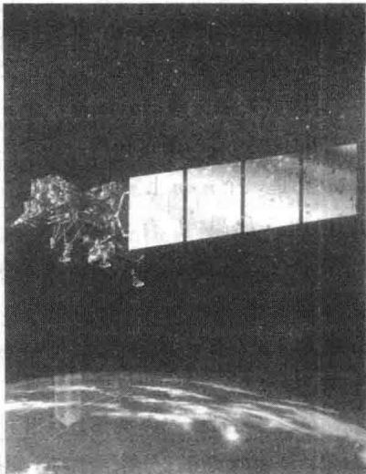
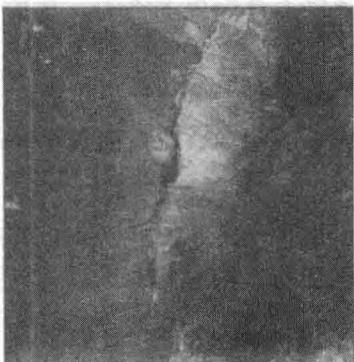
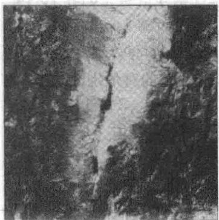
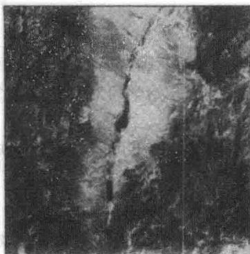
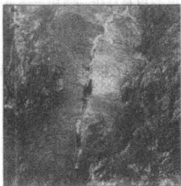
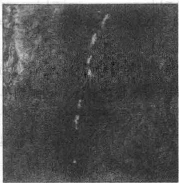
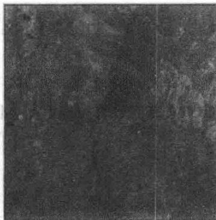

import Guide from '@/components/Guide.astro';
import Knowledge from '@/components/Knowledge.astro';
import Example from '@/components/Example.astro';
import Analysis from '@/components/Analysis.astro';
import Solution from '@/components/Solution.astro';
import Variant from '@/components/Variant.astro';
import Note from '@/components/Note.astro';
import Block from '@/components/Block.astro';
import Method from '@/components/Method.astro';
import Exercise from '@/components/Exercise.astro';

在地球上，经过80分钟稍微多一点，两颗地球资源探测卫星静静地沿靠近极地的轨道飞越天空，以185公里宽的幅度记录地形和海岸线的图像。每颗卫星每隔16天会扫遍地球的几乎每一平方公里，以致任何地方在8天内可被监测到。

地球资源探测卫星所拍摄到的图像有很多用途. 研究人员和城市规划人员利用它们研究城市发展速度和方向、工业发展和土地使用的变化. 在乡村可用于分析土壤湿度, 对偏远地区植被进行分类, 确定内陆的湖泊和河流的位置. 政府部门可检测和评估自然灾害的破坏程度, 如森林火灾、火山熔岩的流动、洪水和飓风等. 环保部门可以确定来自烟囱的污染, 测量水力发电站附近的湖泊和河流的温度.

为了用于研究，卫星上的传感器可同步取得地球上任何地区的七种图像。传感器通过不同的波段来记录能量，包括三种可见光谱和四种红外光谱。每幅图像都被数字化且存储为矩阵，每一个数表示图像

上对应点（或像素）的信号强度. 这七幅图像当中的每一幅都是多波段或多光谱图像的一个波段的影像.

一个固定区域的七幅地球资源探测卫星图像通常包含大量冗余的信息，原因是一些特性会表现在几幅图像中。然而其他特性由于它们的颜色或温度会反射出只被一个或两个传感器记录的光线。多波段图像处理的一个目标是，用一种比研究每幅图像更好的方式来提取信息去观察数据。

主成分分析是一种从原始数据中消除冗余信息从而只需要一幅或两幅合成图像就可以提供大部分信息的有效方法。粗略地说，其目的是找出一个特殊的图像线性组合，即给七种像素中每一个赋予权值，然后再综合得到一个新的图像值。权值选取的方式使得合成图像中的光线强度的变化幅度或景象差异（称为第一主成分）比任何原始图像的都要大。更多成分图像也可用一定的准则来构造，7.5节会给出准则的解释。

主成分分析也可用取自内华达州铁路峡谷的图像（见图7-1）来解释。地球资源探测卫星三个波段拍摄到的图像是图a\~c。三个波段的所有信息被重新组合成三个主成分图像，如图d\~f所示。第一个成分d显示（或解释） $93.5\%$ 的原始数据中的景象差异。用这种方式，三个波段的原始数据被重新组合成一个波段的数据，在某种意义下的景象差异仅损失 $6.5\%$

马里兰州的罗克维尔地球卫星公司友好地提供了显示在这里的图片，他们正在对224种不同波段记录的图像进行合成图像的实验。面对如此大量的数据，使用主成分分析一般可以将数据减少到约15个有用的主成分。

  
a）光谱段1：可见蓝色

  
b）光谱段4：接近红外线

  
c）光谱段7：中间红外线

  
d）主成分1：93.5%

<figure class="vp-figure">
  

    

      
      e）主成分2：5.3%
    

    

      
      f）主成分3：1.2%
    

  

  <figcaption>图 7-1</figcaption>
</figure>

>>>

与其他主要类型的矩阵相比，对称矩阵更常出现在应用中，其理论完美，本质上依赖于第5章的对角化和第6章的正交性。7.1节叙述对称矩阵对角化，是7.2节和7.3节讨论二次型的基础，最后两节讨论的奇异值分解和介绍性实例中所描述的图像处理则需要7.3节的内容。在整章中，所有向量和矩阵的元素均为实数。
