import Guide from '@/components/Guide.astro';
import Knowledge from '@/components/Knowledge.astro';
import Example from '@/components/Example.astro';
import Analysis from '@/components/Analysis.astro';
import Solution from '@/components/Solution.astro';
import Variant from '@/components/Variant.astro';
import Note from '@/components/Note.astro';
import Block from '@/components/Block.astro';
import Method from '@/components/Method.astro';
import Exercise from '@/components/Exercise.astro';

到目前为止，本教材除了第6章计算 $x^{T}x$ 时所遇到的平方和外，我们所关注的主要是线性方程。这类平方和及更一般形式的表达式称为二次型，它常常出现在线性代数在工程（设计标准和优化）和信号处理（例如输出的噪声功率）的应用中。它们也常常出现在物理学（例如势能和动能）、微分几何（例如曲面的法曲率）、经济学（例如效用函数）和统计学（例如置信椭圆体）中，某些这类应用实例的数学背景很容易转化为对对称矩阵的研究。

$\mathbb{R}^n$ 上的一个二次型是一个定义在 $\mathbb{R}^n$ 上的函数，它在向量 $x$ 处的值可由表达式 $Q(x) = x^{\mathrm{T}}Ax$ 计算，其中 $A$ 是一个 $n\times n$ 对称矩阵. 矩阵 $A$ 称为关于二次型的矩阵.

最简单的非零二次型是 $Q(x) = x^{\mathrm{T}}Ix = \left\| x\right\|^{2}$ . 例1和例2说明了对称矩阵 $A$ 和二次型 $x^{\mathrm{T}}Ax$ 之间的关系.

<Example title="例 1">
令 $\pmb{x} = \begin{bmatrix} x_1 \\ x_2 \end{bmatrix}$ ，计算下列矩阵的 $x^{\mathrm{T}} A x$ .

a. $A = \begin{bmatrix} 4 & 0 \\ 0 & 3 \end{bmatrix}$ 

b. $A = \begin{bmatrix} 3 & -2 \\ -2 & 7 \end{bmatrix}$

<Solution title="解">
$$
\boldsymbol {x} ^ {\mathrm{T}} A \boldsymbol {x} = \left[ \begin{array}{l l} x _ {1} & x _ {2} \end{array} \right] \left[ \begin{array}{l l} 4 & 0 \\ 0 & 3 \end{array} \right] \left[ \begin{array}{l} x _ {1} \\ x _ {2} \end{array} \right] = \left[ \begin{array}{l l} x _ {1} & x _ {2} \end{array} \right] \left[ \begin{array}{l} 4 x _ {1} \\ 3 x _ {2} \end{array} \right] = 4 x _ {1} ^ {2} + 3 x _ {2} ^ {2}
$$
\n
b. 在 $A$ 中有两个值为-2的元素，注意观察矩阵 $A$ 中（1,2）元素如何出现在计算中，用粗体字给出.

$$
\begin{array}{r l} \boldsymbol {x} ^ {\mathrm{T}} A \boldsymbol {x} & = [ x _ {1} - x _ {2} ] \left[ \begin{array}{c c} 3 & - 2 \\ - 2 & 7 \end{array} \right] \left[ \begin{array}{l} x _ {1} \\ x _ {2} \end{array} \right] = [ x _ {1} - x _ {2} ] \left[ \begin{array}{c} 3 x _ {1} - 2 x _ {2} \\ - 2 x _ {1} + 7 x _ {2} \end{array} \right] \\ & = x _ {1} (3 x _ {1} - 2 x _ {2}) + x _ {2} (- 2 x _ {1} + 7 x _ {2}) \\ & = 3 x _ {1} ^ {2} - 2 x _ {1} x _ {2} - 2 x _ {2} x _ {1} + 7 x _ {2} ^ {2} \\ & = 3 x _ {1} ^ {2} - 4 x _ {1} x _ {2} + 7 x _ {2} ^ {2} \end{array}
$$
</Solution>
</Example>

例1 $b$ 中二次型中出现了项 $-4x_{1}x_{2}$ ，这是因为矩阵 A 对角线上出现了元素-2。相反，例 1（a）中涉及的对角矩阵 A 的二次型中没有 $x_{1}x_{2}$ 的交叉乘积项。
<Example title="例 2">
对属于 $\mathbb{R}^3$ 的 $x$ ，取 $Q(x) = 5x_1^2 + 3x_2^2 + 2x_3^2 - x_1x_2 + 8x_2x_3$ ，写出 $x^{\mathrm{T}}Ax$ 形式的二次型.

<Solution title="解">
$x_{1}^{2}, x_{2}^{2}, x_{3}^{2}$ 的系数仍在对角线上。为使 $A$ 对称，当 $i \neq j$ 时， $x_{i}x_{j}$ 的系数必须平均分配给矩阵 $A$ 中的 $(i, j)$ 元素和 $(j, i)$ 元素。 $x_{1}x_{3}$ 的系数是0，容易验证

$$
Q (\boldsymbol {x}) = \boldsymbol {x} ^ {\mathrm{T}} A \boldsymbol {x} = \left[ \begin{array}{l l l} x _ {1} & x _ {2} & x _ {3} \end{array} \right] \left[ \begin{array}{c c c} 5 & - 1 / 2 & 0 \\ - 1 / 2 & 3 & 4 \\ 0 & 4 & 2 \end{array} \right] \left[ \begin{array}{l} x _ {1} \\ x _ {2} \\ x _ {3} \end{array} \right]
$$
</Solution>
</Example>

<Example title="例 3">
令 $Q(\pmb {x}) = x_{1}^{2} - 8x_{1}x_{2} - 5x_{2}^{2}$ ，计算 $Q(\pmb {x})$ 在 $\pmb {x} = \begin{bmatrix} -3\\ 1 \end{bmatrix},\begin{bmatrix} 2\\ -2 \end{bmatrix}$ 和 $\begin{bmatrix} 1\\ -3 \end{bmatrix}$ 处的值.解

$$
\begin{array}{l} Q (- 3, 1) = (- 3) ^ {2} - 8 (- 3) (1) - 5 (1) ^ {2} = 2 8 \\ Q (2, - 2) = (2) ^ {2} - 8 (2) (- 2) - 5 (- 2) ^ {2} = 1 6 \\ Q (1, - 3) = (1) ^ {2} - 8 (1) (- 3) - 5 (- 3) ^ {2} = - 2 0 \end{array}
$$

在某些情况下，没有交叉乘积项的二次型会显得更容易使用，也就是说，二次型对应的矩阵是对角矩阵。幸运的是，交叉乘积项可以通过用适当的变量代换来消去。
</Example>

## 二次型的变量代换

如果 x 表示 $R^{n}$ 中的向量变量，那么变量代换是下面形式的等式：

$$
\pmb {x} = P \pmb {y} \text {或} \pmb {y} = P ^ {- 1} \pmb {x}\tag{1}
$$

其中 $P$ 是可逆矩阵且 $\pmb{y}$ 是 $\mathbb{R}^n$ 中的一个新的向量变量. 这里 $P$ 的列可确定 $\mathbb{R}^n$ 的一个基, $\pmb{y}$ 是相对于该基的向量 $\pmb{x}$ 的坐标向量. (见4.4节.)

如果用变量代换（1）处理二次型 $x^{T}Ax$ ，那么

$$
\boldsymbol {x} ^ {\mathrm{T}} \boldsymbol {A} \boldsymbol {x} = (P \boldsymbol {y}) ^ {\mathrm{T}} A (P \boldsymbol {y}) = \boldsymbol {y} ^ {\mathrm{T}} P ^ {\mathrm{T}} A P \boldsymbol {y} = \boldsymbol {y} ^ {\mathrm{T}} (P ^ {\mathrm{T}} A P) \boldsymbol {y}\tag{2}
$$

且新的二次型矩阵是 $P^{\mathrm{T}}AP$ 。因为 $A$ 是对称的，故由定理2，存在正交矩阵 $P$ ，使得 $P^{\mathrm{T}}AP$ 是对角矩阵 $D$ ，（2）中的二次型变为 $\mathbf{y}^{\mathrm{T}}D\mathbf{y}$ ，这就是下面例题的解题思路。

<Example title="例 4">
求一个变量代换将例 3 中的二次型变为一个没有交叉乘积项的二次型.

<Solution title="解">
例3中二次型对应的矩阵是

$$
A = \left[ \begin{array}{c c} 1 & - 4 \\ - 4 & - 5 \end{array} \right]
$$

第一步是将矩阵 $A$ 正交对角化． $A$ 的特征值是 $\lambda = 3$ 和 $\lambda = -7$ ，相应的单位特征向量是

$$
\lambda = 3: \left[ \begin{array}{c} 2 / \sqrt {5} \\ - 1 / \sqrt {5} \end{array} \right]; \quad \lambda = - 7: \left[ \begin{array}{c} 1 / \sqrt {5} \\ 2 / \sqrt {5} \end{array} \right]
$$

这些特征向量自动正交（因为它们属于不同的特征值）且构成 $\mathbb{R}^2$ 的一个单位正交基. 取

$$
P = \left[ \begin{array}{l l} 2 / \sqrt {5} & 1 / \sqrt {5} \\ - 1 / \sqrt {5} & 2 / \sqrt {5} \end{array} \right], D = \left[ \begin{array}{c c} 3 & 0 \\ 0 & - 7 \end{array} \right]
$$

那么 $A = PDP^{-1}$ ，且 $D = P^{-1}AP = P^{\mathrm{T}}AP$ ，像前面指出的那样。一个适当的变量代换是

x = Py，其中 $x = \begin{bmatrix} x_{1} \\ x_{2} \end{bmatrix}$ ， $y = \begin{bmatrix} y_{1} \\ y_{2} \end{bmatrix}$

那么

$$
\begin{array}{r l} x _ {1} ^ {2} - 8 x _ {1} x _ {2} - 5 x _ {2} ^ {2} & = \mathbf {x} ^ {\mathrm{T}} A \mathbf {x} \\ & = (P \mathbf {y}) ^ {\mathrm{T}} A (P \mathbf {y}) \\ & = \mathbf {y} ^ {\mathrm{T}} P ^ {\mathrm{T}} A P \mathbf {y} = \mathbf {y} ^ {\mathrm{T}} D \mathbf {y} \\ & = 3 y _ {1} ^ {2} - 7 y _ {2} ^ {2} \end{array}
$$

为了说明例 4 中二次型相等的意义，我们可以利用新二次型计算 $Q(x)$ 在 $x=(2,-2)$ 时的值。首先，由于 x=Py，故

$$
\boldsymbol {y} = P ^ {- 1} \boldsymbol {x} = P ^ {\mathrm{T}} \boldsymbol {x}
$$

从而

$$
\mathbf {y} = \left[ \begin{array}{l l} 2 / \sqrt {5} & - 1 / \sqrt {5} \\ 1 / \sqrt {5} & 2 / \sqrt {5} \end{array} \right] \left[ \begin{array}{l} 2 \\ - 2 \end{array} \right] = \left[ \begin{array}{l} 6 / \sqrt {5} \\ - 2 / \sqrt {5} \end{array} \right]
$$

因此

$$
\begin{array}{r l} 3 y _ {1} ^ {2} - 7 y _ {2} ^ {2} & = 3 (6 / \sqrt {5}) ^ {2} - 7 (- 2 / \sqrt {5}) ^ {2} = 3 (3 6 / 5) - 7 (4 / 5) \\ & = 8 0 / 5 = 1 6 \end{array}
$$

这就是例3中 $Q(x)$ 在 $x = (2, - 2)$ 时的值，见图7-2.

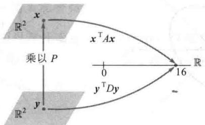  
图7-2 $x^{\mathrm{T}}Ax$ 中的变量代换

例 4 说明了以下定理，定理的证明在例 4 之前已基本上给出.

椭圆
</Solution>
</Example>

<Knowledge title="定理 4 主轴定理">
设 A 是一个 $n \times n$ 对称矩阵，那么存在一个正交变量代换 x = Py，它将二次型 $x^{T}Ax$ 变换为不含交叉乘积项的二次型 $y^{T}Dy$ .

定理中矩阵 P 的列称为二次型 $\tilde{x}^{T}Ax$ 的主轴，向量 y 是向量 x 在由这些主轴构造的 $R^{n}$ 空间的单位正交基下的坐标向量.
</Knowledge>

## 主轴的几何意义

设 $Q(\pmb {x}) = \pmb{x}^{\mathrm{T}}\pmb {A}\pmb{x}$ ，其中 $A$ 是一个 $2\times 2$ 可逆对称矩阵， $c$ 是一个常数.可以证明 $\mathbb{R}^2$ 中所有满足

$$
\boldsymbol {x} ^ {\mathrm{T}} \boldsymbol {A} \boldsymbol {x} = c\tag{3}
$$

的 $x$ 的集合对应于一个椭圆（或者圆）、双曲线、两条相交直线或单个点，或根本不含任意点。如果 $A$ 是一个对角矩阵，如图7-3所示，则如（3）这样的图像是标准位置。如果 $A$ 不是一个对角矩阵，如图7-4所示，则（3）的图形是标准位置的旋转。找到主轴（由 $A$ 的特征向量确定）等同于找到一个新的坐标系统，在该坐标系统下其图形是在标准位置下的图形。

图 7-4b 中的双曲线是方程 $x^{T}Ax=16$ 的图形表示，其中 A 是例 4 中的矩阵。图 7-4b 中 $y_{1}$ 轴的正向是例 4 中矩阵 P 第一列的方向， $y_{2}$ 轴的正向是矩阵 P 第二列的方向。

b) $x_{1}^{2}-8x_{1}x_{2}-5x_{2}^{2}=16$  
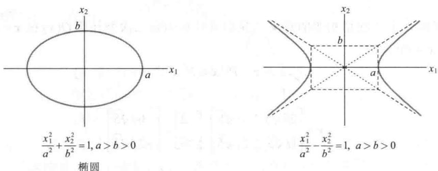  
图 7-3 标准位置上的椭圆和双曲线

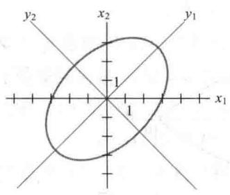  
a） $5x_{1}^{2} - 4x_{1}x_{2} + 5x_{2}^{2} = 48$

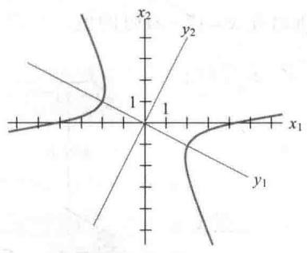  
图7-4 不在标准位置的椭圆和双曲线

<Example title="例 5">
图7-4a中，椭圆的方程为 $5x_{1}^{2} - 4x_{1}x_{2} + 5x_{2}^{2} = 48$ ，求一个变量代换，将方程中的交叉乘积项消去.

<Solution title="解">
二次型对应的矩阵为 $A = \begin{bmatrix} 5 & -2 \\ -2 & 5 \end{bmatrix}$ ， $A$ 的特征值是3和7，对应的单位特征向量为

$$
\boldsymbol {u} _ {1} = \left[ \begin{array}{l} 1 / \sqrt {2} \\ 1 / \sqrt {2} \end{array} \right], \boldsymbol {u} _ {2} = \left[ \begin{array}{c} - 1 / \sqrt {2} \\ 1 / \sqrt {2} \end{array} \right]
$$

令 $P = \left[ u_{1} \quad u_{2} \right] = \begin{bmatrix} 1/\sqrt{2} & -1/\sqrt{2} \\ 1/\sqrt{2} & 1/\sqrt{2} \end{bmatrix}$ ，那么 P 可将 A 正交对角化，所以变量代换 x = Py 得到的二次型为 $y^{T} D y = 3 y_{1}^{2} + 7 y_{2}^{2}$ ，变量代换的新坐标轴如图 7-4a 所示.
</Solution>
</Example>

## 二次型的分类

当 $A$ 是一个 $n \times n$ 矩阵时，二次型 $Q(x) = x^{\mathrm{T}}Ax$ 是一个定义域为 $\mathbb{R}^n$ 的实值函数。图7-5显示了定义域为 $\mathbb{R}^n$ 的四个二次型的图形。对二次型 $Q(x)$ 定义域中的每一个点 $x = (x_1, x_2)$ ，可画出点 $(x_1, x_2, z)$ ，其中 $z = Q(x)$ 。注意，除了 $x = 0$ 外，图7-5a中所有 $Q(x)$ 的值都是正的，图7-5d中所有 $Q(x)$ 的值都是负的。图7-5a和图7-5d中图形的水平截面是椭圆，而图7-5c的水平截面是双曲线。

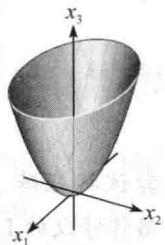  
a) $z = 3x_{1}^{2} + 7x_{2}^{2}$

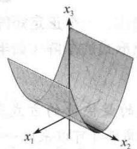

$$
z = 3 x _ {1} ^ {2}
$$

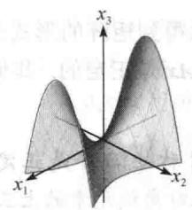

$$
z = 3 x _ {1} ^ {2} - 7 x _ {2} ^ {2}
$$

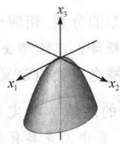  
d) $z = -3x_{1}^{2} - 7x_{2}^{2}$

图 7-5 二次型对应的图形

图 7-5 中简单的 $2 \times 2$ 例子说明下列定义.

定义 一个二次型 $Q$ 是：

a. 正定的，如果对所有 $x \neq 0$ ，有 $Q(x) > 0$ .

b. 负定的，如果对所有 $x \neq 0$ ，有 $Q(x) < 0$ 。

c. 不定的，如果 $Q(x)$ 既有正值又有负值.

此外，Q 被称为半正定的，如果对所有 x， $Q(x) \geqslant 0$ ；Q 被称为半负定的，如果对所有 x， $Q(x) \leqslant 0$ 。图 7-5 中 a 和 b 的二次型都是半正定的。但 a 最好描述为正定的。

<Knowledge title="定理 5">
根据特征值为二次型分类. 见图 7-6.
</Knowledge>

<Knowledge title="定理 5 二次型与特征值">
设 A 是 $n \times n$ 对称矩阵，那么一个二次型 $x^{T}Ax$ 是：

a. 正定的，当且仅当 $A$ 的所有特征值是正数.

b. 负定的，当且仅当 A 的所有特征值是负数.

c. 不定的，当且仅当 A 既有正特征值，又有负特征值.

<Solution title="证明">
由主轴定理，存在一个正交的变量代换 x = P y ，使得

$$
Q (\boldsymbol {x}) = \boldsymbol {x} ^ {\mathrm{T}} A \boldsymbol {x} = \boldsymbol {y} ^ {\mathrm{T}} D \boldsymbol {y} = \lambda_ {1} y _ {1} ^ {2} + \lambda_ {2} y _ {2} ^ {2} + \dots + \lambda_ {n} y _ {n} ^ {2}\tag{4}
$$

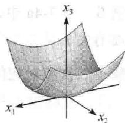

其中 $\lambda_{1}, \lambda_{2}, \cdots, \lambda_{n}$ 是 A 的特征值. 由于 P 是可逆的, 因此非零向量 x 和非零向量 y 之间存在一个一一对应, 这样, $x \neq 0$ 时, $Q(x)$ 的值与 (4) 右边表达式的值完全一致. 显然, 像定理所描述的三类方式一样, 它由特征值 $\lambda_{1}, \lambda_{2}, \cdots, \lambda_{n}$ 的符号所确定.
</Solution>
</Knowledge>

<Example title="例 6">
$Q(\pmb {x}) = 3x_{1}^{2} + 2x_{2}^{2} + x_{3}^{2} + 4x_{1}x_{2} + 4x_{2}x_{3}$ 是正定的吗？

<Solution title="解">
由于所有项的系数是正数，因此二次型表面上看是正定的.但二次型对应的矩阵为

正定的  
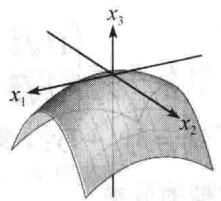

$$
A = \left[ \begin{array}{l l l} 3 & 2 & 0 \\ 2 & 2 & 2 \\ 0 & 2 & 1 \end{array} \right]
$$

且 A 的特征值是 5, 2 和 -1，所以 $Q(x)$ 是不定二次型，而不是正定二次型.

负定的  
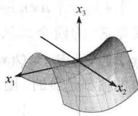

利用二次型的分类,相应地得到矩阵的形式分类.一个正定矩阵A是一个对称矩阵,二次型 $x^{T}Ax$ 是正定的.其他形式的矩阵(如半正定矩阵)的概念可类似定义.

不定的

图 7-6

数值计算的注解 确定对称矩阵 A 是正定的最快捷的方式是尝试将矩阵 A 分解为 $A = R^{T} R$ ，其中 R 是具有正对角线元素的上三角阵（可以采用一个略作修改的 LU 分解算

法）. 这样的楚列斯基分解算法可行的充分必要条件是 $A$ 是正定的. 见第7章补充习题7. 练习题

根据矩阵 A 的特征值，给出一个半正定矩阵 A.
</Solution>
</Example>

<Block title="习题7.2">
1. 计算二次型 $x^{T}Ax$ ，其中 $A=\begin{bmatrix}5&1/3\\ 1/3&1\end{bmatrix}$ a. $x=\begin{bmatrix}x_{1}\\ x_{2}\end{bmatrix}$ b. $x=\begin{bmatrix}6\\ 1\end{bmatrix}$ c. $x=\begin{bmatrix}1\\ 3\end{bmatrix}$

2. 计算二次型 $x^{T}Ax$ ，其中 $A=\begin{bmatrix}3&2&0\\ 2&2&1\\ 0&1&0\end{bmatrix}$ .
a. $x=\begin{bmatrix}x_{1}\\ x_{2}\\ x_{3}\end{bmatrix}$ b. $x=\begin{bmatrix}-2\\ -1\\ 5\end{bmatrix}$ c. $x=\begin{bmatrix}1/\sqrt{2}\\ 1/\sqrt{2}\\ 1/\sqrt{2}\end{bmatrix}$

3. 求二次型的矩阵，假设 x 属于 $R^{2}$ .
a. $3x_{1}^{2}-4x_{1}x_{2}+5x_{2}^{2}$ b. $3x_{1}^{2}+2x_{1}x_{2}$

4. 求二次型的矩阵，假设 x 属于 $R^{2}$ .
a. $5x_{1}^{2} + 16x_{1}x_{2} - 5x_{2}^{2}$ b. $2x_{1}x_{2}$

5. 求二次型的矩阵，假设 x 属于 $R^{3}$ .
a. $3x_{1}^{2} + 2x_{2}^{2} - 5x_{3}^{2} - 6x_{1}x_{2} + 8x_{1}x_{3} - 4x_{2}x_{3}$ b. $6x_{1}x_{2} + 4x_{1}x_{3} - 10x_{2}x_{3}$

6. 求二次型的矩阵，假设 x 属于 $R^{3}$ .
a. $3x_{1}^{2}-2x_{2}^{2}+5x_{3}^{2}+4x_{1}x_{2}-6x_{1}x_{3}$ b. $4x_{3}^{2}-2x_{1}x_{2}+4x_{2}x_{3}$

7. 求一个变量代换 x = Py，将二次型 $x_{1}^{2} + 10x_{1}x_{2} + x_{2}^{2}$ 变换为没有交叉乘积项的形式，给出 P 和新的二次型.

8. 设 A 是下列二次型的矩阵：

$$
9 x _ {1} ^ {2} + 7 x _ {2} ^ {2} + 1 1 x _ {3} ^ {2} - 8 x _ {1} x _ {2} + 8 x _ {1} x _ {3}
$$

可以证明 A 的特征值是 3, 9 和 15，求正交矩阵 P，使得变量代换 x = Py 将 $x^{T}Ax$ 变换为没有交叉乘积项的形式，给出 P 和新的二次型.

给出习题 9\~18 的二次型分类，然后求一个变量代换 x = Py，将二次型变换成没有交叉乘积项的形式，写出新的二次型。利用 7.1 节的方法构造 P。

9. $4x_{1}^{2}-4x_{1}x_{2}+4x_{2}^{2}$ 10. $2x_{1}^{2}+6x_{1}x_{2}-6x_{2}^{2}$ 11. $2x_{1}^{2}-4x_{1}x_{2}-x_{2}^{2}$ 12. $-x_{1}^{2}-2x_{1}x_{2}-x_{2}^{2}$ 13. $x_{1}^{2}-6x_{1}x_{2}+9x_{2}^{2}$ 14. $3x_{1}^{2}+4x_{1}x_{2}$

15. $[M]-3x_{1}^{2}-7x_{2}^{2}-10x_{3}^{2}-10x_{4}^{2}+4x_{1}x_{2}+4x_{1}x_{3}+4x_{1}x_{4}+6x_{3}x_{4}$

16. [M] $4x_{1}^{2} + 4x_{2}^{2} + 4x_{3}^{2} + 4x_{4}^{2} + 8x_{1}x_{2} + 8x_{3}x_{4} - 6x_{1}x_{4} + 6x_{2}x_{3}$

17. [M] $11x_{1}^{2}+11x_{2}^{2}+11x_{3}^{2}+11x_{4}^{2}+16x_{1}x_{2}-12x_{1}x_{4}+$ $12x_{2}x_{3}+16x_{3}x_{4}$

18. [M] $2x_{1}^{2} + 2x_{2}^{2} - 6x_{1}x_{2} - 6x_{1}x_{3} - 6x_{1}x_{4} - 6x_{2}x_{3} - 6x_{2}x_{4} - 2x_{3}x_{4}$

19. 如果 $\boldsymbol{x}=(x_{1},x_{2})$ 和 $x^{T}x=1$ ，即 $x_{1}^{2}+x_{2}^{2}=1$ ，那么二次型 $5x_{1}^{2}+8x_{2}^{2}$ 的最大值是什么？（用 x 的一些例子试试。）

20. 如果 $x^{T}x=1$ ，那么二次型 $5x_{1}^{2}-3x_{2}^{2}$ 的最大值是什么？习题 21\~22 中，矩阵是 $n\times n$ 方阵且向量属于 $R^{n}$ ，判断每个命题的真假，验证你的结论.

21. a. 二次型的矩阵是一个对称矩阵.
b. 一个二次型没有交叉乘积项的充分必要条件是二次型的矩阵是对角矩阵.
c. 二次型 $x^{T}Ax$ 的主轴是 A 的特征向量.
d. 一个正定二次型 Q 满足对所有 $x \in \mathbb{R}^{n}, Q(x) > 0$ .

e. 如果一个对称矩阵 A 的所有特征值是正的，那么二次型 $x^{T}Ax$ 是正定的.

f. 一个对称矩阵 A 的楚列斯基分解具有形式 A = $R^{T}R$ ，其中上三角阵 R 具有正的对角线元素.

22. a. 表达式 $\| x\|^2$ 不是一个二次型.
b. 如果 $A$ 对称且 $P$ 是正交矩阵, 那么变量代换 $x = Py$ 将 $x^{\mathrm{T}}Ax$ 变换为没有交叉乘积项的二次型.
c. 如果 $A$ 是一个 $2 \times 2$ 对称矩阵, 那么满足 $x^{\mathrm{T}}Ax = c$ （ $c$ 是常数）的 $x$ 的集合对应的几何图形是圆、椭圆或双曲线.
d. 一个不定二次型既不是半正定形式也不是半负定形式.
e. 如果 $A$ 对称且对 $x \neq 0$ , 二次型 $x^{\mathrm{T}}Ax$ 仅仅有负值, 那么 $A$ 的所有特征值是正的.
习题 23\~24 表明, 当 $A = \begin{bmatrix} a & b \\ b & d \end{bmatrix}$ 且 $\det A \neq 0$ 时, 不用求出 $A$ 的特征值就可将二次型 $Q(x) = x^{\mathrm{T}}Ax$ 分类.

23. 如果 $\lambda_{1}$ 和 $\lambda_{2}$ 是 $A$ 的特征值，那么 $A$ 的特征多项式可以用两种方式写出： $\det(A - \lambda I)$ 和 $(\lambda - \lambda_{1})(\lambda - \lambda_{2})$ 。利用这个结论说明 $\lambda_{1} + \lambda_{2} = a + d$ （ $a, d$ 是 $A$ 的对角线上的元素），且 $\lambda_{1}\lambda_{2} = \det A$ 。

24. 验证下列命题：
a. 如果 $\det A > 0$ 且 a > 0，则 Q 是正定的.
b. 如果 $\det A > 0$ 且 a &lt; 0，则 Q 是负定的.
c. 如果 $\det A < 0$ ，则 Q 是不定的.

25. 证明：如果 $B$ 是 $m \times n$ 矩阵，那么 $B^{\mathrm{T}}B$ 是半正定的；如果 $B$ 是 $n \times n$ 可逆矩阵，那么 $B^{\mathrm{T}}B$ 是正定的.

26. 证明：如果 $n \times n$ 矩阵 $A$ 是正定的，那么存在一个正定矩阵 $B$ ，使得 $A = B^{\mathrm{T}}B$ （提示：写出 $A = PDP^{\mathrm{T}}$ 且 $P^{\mathrm{T}} = P^{-1}$ ，构造一个对角矩阵 $C$ ，使得 $D = C^{\mathrm{T}}C$ ，且令 $B = PCP^{\mathrm{T}}$ ，说明 $B$ 满足条件。）

27. 令 A 和 B 是 $n \times n$ 对称矩阵且所有特征值都为正，证明 $A + B$ 的特征值也是正的。（提示：考虑二次型。）

28. 令 A 是 $n \times n$ 可逆对称矩阵，证明：如果二次型 $x^{T}Ax$ 是正定的，那么二次型 $x^{T}A^{-1}x$ 也是正定的。（提示：考虑特征值。）
</Block>

<Block title="练习题答案">
构造一个正交变量代换 $x = Py$ ，并且像（4）式一样写出

$$
\boldsymbol {x} ^ {\mathrm{T}} \boldsymbol {A} \boldsymbol {x} = \boldsymbol {y} ^ {\mathrm{T}} D \boldsymbol {y} = \lambda_ {1} y _ {1} ^ {2} + \lambda_ {2} y _ {2} ^ {2} + \dots + \lambda_ {n} y _ {n} ^ {2}
$$

如果一个特征值（例如 $\lambda_{i}$ ）是负数，那么对应于 $y = e_{i}$ （ $I_{n}$ 的第 $i$ 列）的 $x$ 取值使得 $x^{\mathrm{T}}Ax$ 是负数，所以，一个半正定的二次型的所有特征值一定非负。反之，如果所有特征值非负，那么上面的展开式说明 $x^{\mathrm{T}}Ax$ 一定是半正定的。见图7-7。

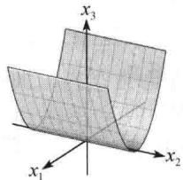  
图7-7 半正定
</Block>
