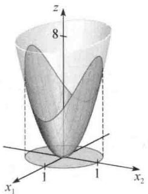
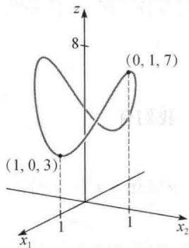
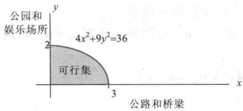
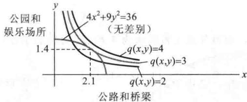
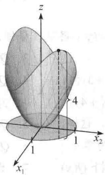

import Knowledge from '@/components/Knowledge.astro';
import Example from '@/components/Example.astro';
import Note from '@/components/Note.astro';
import Solution from '@/components/Solution.astro';
import Block from '@/components/Block.astro';

工程师、经济学家、科学家和数学家常常要寻找在一些特定集合内的 $x$ 值，使得二次型 $Q(x)$ 取最大值或最小值。具有代表性的是，这类问题可化为 $x$ 是在一组单位向量中的变量的优化问题。下面我们将看到，这类条件优化问题有一个有趣且精彩的解。例6及后面的7.5节将讨论如何从实际中引出这类问题。

$\mathbb{R}^n$ 中的一个单位向量 $\pmb{x}$ 可用以下几种等价形式来描述：

$$

\left\| \boldsymbol {x} \right\| = 1, \left\| \boldsymbol {x} \right\| ^ {2} = 1, \boldsymbol {x} ^ {\mathrm{T}} \boldsymbol {x} = 1

$$

和

$$

x _ {1} ^ {2} + x _ {2} ^ {2} + \dots + x _ {n} ^ {2} = 1\tag{1}

$$

在应用中经常使用 $x^{T}x=1$ 的展开式（1）.

当一个二次型没有交叉乘积项时，可以很容易得到在 $x^{T}x=1$ 的条件下 $Q(x)$ 的最大值和最小值.

<Example title="例 1">
求 $Q(x)=9x_{1}^{2}+4x_{2}^{2}+3x_{3}^{2}$ 在限制条件 $x^{T}x=1$ 下的最大值和最小值.

<Solution title="解">
由于 $x_{2}^{2}$ 和 $x_{3}^{2}$ 是非负的，因此

$$

4 x _ {2} ^ {2} \leqslant 9 x _ {2} ^ {2}, \quad 3 x _ {3} ^ {2} \leqslant 9 x _ {3} ^ {2}

$$

所以当 $x_{1}^{2} + x_{2}^{2} + x_{3}^{2} = 1$ 时，

$$

\begin{array}{r l} Q (\boldsymbol {x}) & = 9 x _ {1} ^ {2} + 4 x _ {2} ^ {2} + 3 x _ {3} ^ {2} \\ & \leqslant 9 x _ {1} ^ {2} + 9 x _ {2} ^ {2} + 9 x _ {3} ^ {2} \\ & = 9 (x _ {1} ^ {2} + x _ {2} ^ {2} + x _ {3} ^ {2}) \\ & = 9 \end{array}

$$

因此当 x 为单位向量时， $Q(x)$ 的最大值不超过 9. 更进一步，当 $x=(1,0,0)$ 时， $Q(x)=9$ . 从而 9 是 $Q(x)$ 在 $x^{T}x=1$ 条件下的最大值.

为求出 $Q(\pmb {x})$ 的最小值，注意到

$$

9 x _ {1} ^ {2} \geqslant 3 x _ {1} ^ {2}, 4 x _ {2} ^ {2} \geqslant 3 x _ {2} ^ {2}

$$

因此当 $x_{1}^{2} + x_{2}^{2} + x_{3}^{2} = 1$ 时，

$$

Q (\pmb {x}) \geqslant 3 x _ {1} ^ {2} + 3 x _ {2} ^ {2} + 3 x _ {3} ^ {2} = 3 (x _ {1} ^ {2} + x _ {2} ^ {2} + x _ {3} ^ {2}) = 3

$$

当 $x_{1} = 0, x_{2} = 0, x_{3} = 1$ 时， $Q(x) = 3$ ，从而3是 $Q(x)$ 在 $\pmb{x}^{\mathrm{T}}\pmb{x} = 1$ 条件下的最小值.

从例1可以看到，二次型的矩阵具有特征值9，4和3，且最大和最小特征值分别等于在限制条件下的 $Q(x)$ 的最大值和最小值．我们将会看到，此结论对任何二次型都是成立的.
</Solution>
</Example>

<Example title="例 2">
令 $A = \begin{bmatrix} 3 & 0 \\ 0 & 7 \end{bmatrix}$ ，当 $\pmb{x}$ 属于 $\mathbb{R}^2$ 时， $Q(\pmb{x}) = \pmb{x}^{\mathrm{T}}\pmb{A}\pmb{x}$ ，图7-8是 $Q$ 的图形表示。图7-9表示圆柱体内部的一部分，圆柱与曲面的截面是点集 $(x_{1}, x_{2}, z)$ ，表示在 $x_{1}^{2} + x_{2}^{2} = 1$ 情况下的 $z = Q(x_{1}, x_{2})$ 。这些点的“高度值”是 $Q(\pmb{x})$ 的约束值，从几何意义上看，条件优化问题确定的是截面曲线上最高点和最低点的位置。

曲线上的两个最高点在 $x_{1}x_{2}$ 平面之上7个单位，出现在点 $x_{1} = 0$ 和 $x_{2} = \pm 1$ 处，这些点对应于 $A$ 的特征值7和特征向量 $\pmb {x} = (0,1)$ 及 $-\pmb {x} = (0, - 1)$ .类似地，曲线上的两个最低点在 $x_{1}x_{2}$ 平面之上3个单位，它们对应于特征值3和特征向量(1,0)及（-1,0）.

  

图7-8 $z = 3x_{1}^{2} + 7x_{2}^{2}$

  

图 7-9 $z=3x_{1}^{2}+7x_{2}^{2}$ 和圆柱 $x_{1}^{2}+x_{2}^{2}=1$ 的交线

图 7-9 中交线上的每一点对应的 z 坐标在 3 和 7 之间，且对任何 3 和 7 之间的数 t，存在一个单位向量 x 使得 $Q(x)=t$ 。换言之，所有 $x^{T}Ax$ 的可能值在 $\|x\|=1$ 条件下的集合是闭区间 $3 \leqslant t \leqslant 7$ 。

可以证明，对任何对称矩阵 A，在 $\|x\|=1$ 条件下， $x^{T}Ax$ 所有可能值的集合是实轴上的闭区间（见习题 13）。分别用 m 和 M 表示区间的左端点和右端点，即取

$$

m = \min \left\{\boldsymbol {x} ^ {\mathrm{T}} A \boldsymbol {x}: \| \boldsymbol {x} \| = 1 \right\}, M = \max \left\{\boldsymbol {x} ^ {\mathrm{T}} A \boldsymbol {x}: \| \boldsymbol {x} \| = 1 \right\}\tag{2}

$$

习题12要求证明，如果 $\lambda$ 是 $A$ 的一个特征值，那么 $m \leqslant \lambda \leqslant M$ 。正像例2一样，下面的定理说明 $m$ 和 $M$ 自身也是 $A$ 的特征值。 ②
</Example>

<Knowledge title="定理 6">
设 $A$ 是对称矩阵，且 $m$ 和 $M$ 的定义如（2）式所示，那么 $M$ 是 $A$ 的最大特征值 $\lambda_{1}$ ， $m$ 是 $A$ 的最小特征值。如果 $\pmb{x}$ 是对应于 $M$ 的单位特征向量 $\pmb{u}_{1}$ ，那么 $\pmb{x}^{\mathrm{T}}\pmb{A}\pmb{x}$ 的值等于 $M$ 。如果 $\pmb{x}$ 是对应于 $m$ 的单位特征向量，那么 $\pmb{x}^{\mathrm{T}}\pmb{A}\pmb{x}$ 的值等于 $m$ 。

<Solution title="证明">
$A$ 的正交对角化是 $PDP^{-1}$ ，我们知道

$$

\text { 当 } \pmb {x} = P \pmb {y} \text { 时 }, \pmb {x} ^ {\mathrm{T}} A \pmb {x} = \pmb {y} ^ {\mathrm{T}} D \pmb {y}\tag{3}

$$

同样

$$

\text { 对所有 }   y  ,    \| x \| = \| P y \| = \| y \|

$$

这是因为 $P^{\mathrm{T}}P = I$ ，且 $\left\| Py\right\| ^2 = (Py)^{\mathrm{T}}Py = y^{\mathrm{T}}P^{\mathrm{T}}Py = y^{\mathrm{T}}y = \| y\| ^2$ .特别地， $\| y\| = 1$ 充分必要条件是 $\| x\| = 1$ .这样，如果 $\pmb{x}$ 和 $\pmb{y}$ 是任意单位向量，那么 $x^{\mathrm{T}}Ax$ 和 $y^{\mathrm{T}}Dy$ 可以认为是具有同样值的集合.为简化记号，假设 $A$ 是以 $a\geqslant b\geqslant c$ 为特征值的 $3\times 3$ 矩阵，重排 $P$ 的列（特征向量），使得 $P = [u_{1},u_{2},u_{3}]$ 和

$$

D = \left[ \begin{array}{c c c} a & 0 & 0 \\ 0 & b & 0 \\ 0 & 0 & c \end{array} \right]

$$

对给定 $\mathbb{R}^3$ 中的单位向量 $y$ ，其坐标为 $y_{1},y_{2},y_{3}$ ，注意到

$$

\begin{array}{l} a y _ {1} ^ {2} = a y _ {1} ^ {2} \\ b y _ {2} ^ {2} \leqslant a y _ {2} ^ {2} \\ c y _ {3} ^ {2} \leqslant a y _ {3} ^ {2} \end{array}

$$

将不等式相加，我们有

$$

\begin{array}{r l} \mathbf {y} ^ {\mathrm{T}} D \mathbf {y} & = a y _ {1} ^ {2} + b y _ {2} ^ {2} + c y _ {3} ^ {2} \\ & \leqslant a y _ {1} ^ {2} + a y _ {2} ^ {2} + a y _ {3} ^ {2} \\ & = a (y _ {1} ^ {2} + y _ {2} ^ {2} + y _ {3} ^ {2}) \\ & = a \| \mathbf {y} \| ^ {2} = a \end{array}

$$

这样由 $M$ 的定义可知， $M \leqslant a$ 。然而，当 $\mathbf{y} = \mathbf{e}_1 = (1,0,0)$ 时， $\mathbf{y}^{\mathrm{T}}D\mathbf{y} = a$ ，所以，事实上 $M = a$ 。由（3）可知，对应于 $\mathbf{y} = \mathbf{e}_1$ 的向量 $\mathbf{x}$ 是矩阵 $A$ 的特征向量 $\mathbf{u}_1$ ，其原因是

$$

\pmb {x} = P \pmb {e} _ {1} = [ \pmb {u} _ {1} \pmb {u} _ {2} \pmb {u} _ {3} ] \left[ \begin{array}{l} 1 \\ 0 \\ 0 \end{array} \right] = \pmb {u} _ {1}

$$

这样 $M = a = e_1^{\mathrm{T}}De_{1} = u_{1}^{\mathrm{T}}Au_{1}$ ，从而证明了关于 $M$ 的论断．同理可证明 $m$ 是最小特征值即 $c$ 值，且 $\pmb{x}^{\mathrm{T}}A\pmb{x}$ 的这个值当 $\pmb {x} = P\pmb{e}_3 = \pmb{u}_3$ 时可以取到.
</Solution>
</Knowledge>

<Example title="例 3">
令 $A = \begin{bmatrix} 3 & 2 & 1 \\ 2 & 3 & 1 \\ 1 & 1 & 4 \end{bmatrix}$ ，求二次型 $\pmb{x}^{\mathrm{T}}\pmb{A}\pmb{x}$ 在限制条件 $\pmb{x}^{\mathrm{T}}\pmb{x} = 1$ 下的最大值，并求一个可以取到

该最大值的单位向量.

<Solution title="解">
由定理6，只需求出 $A$ 的最大特征值，其特征多项式是

$$

0 = - \lambda^ {3} + 1 0 \lambda^ {2} - 2 7 \lambda + 1 8 = - (\lambda - 6) (\lambda - 3) (\lambda - 1)

$$

最大特征值为 6.

限制条件下 $x^{T}Ax$ 的最大值可以在特征值 $\lambda=6$ 对应的单位特征向量 x 处获得. 解 $(A-6I)x=0$ ，可得特征向量 $\begin{bmatrix}1\\ 1\\ 1\end{bmatrix}$ 和 $u_{1}=\begin{bmatrix}1/\sqrt{3}\\ 1/\sqrt{3}\\ 1/\sqrt{3}\end{bmatrix}$ .

在定理7和稍后的应用实例中，要计算 $x^{\mathrm{T}}Ax$ 的值，其中附加的限制条件是单位向量 $\pmb{x}$ 定理7设 $A, \lambda_{1}$ 和 $\pmb{u}_{1}$ 如定理6所示. 在如下条件限制下：

$$

\boldsymbol {x} ^ {\mathrm{T}} \boldsymbol {x} = 1, \boldsymbol {x} ^ {\mathrm{T}} \boldsymbol {u} _ {1} = 0

$$

$x^{T}Ax$ 的最大值是第二大特征值 $\lambda_{2}$ ，且这个最大值可以在 x 是对应于 $\lambda_{2}$ 的特征向量 $u_{2}$ 处达到.

定理7的证明和上面讨论的类似，即定理化为二次型的矩阵是对角矩阵的情形，下面的例子给出对角矩阵情形下证明的思路.
</Solution>
</Example>

<Example title="例 4">
求 $9x_{1}^{2} + 4x_{2}^{2} + 3x_{3}^{2}$ 的最大值，其限制条件是 $\pmb{x}^{\mathrm{T}}\pmb{x} = 1$ 和 $\pmb{x}^{\mathrm{T}}\pmb{u}_{1} = 0$ ，其中 $\pmb{u}_{1} = (1,0,0)$ 。注意到 $\pmb{u}_{1}$ 是二次型的矩阵的最大特征值 $\lambda = 9$ 对应的单位特征向量。

<Solution title="解">
如果 x 的坐标为 $x_{1}, x_{2}, x_{3}$ ，那么限制 $x^{T}u_{1}=0$ 简单意味着 $x_{1}=0$ 。对这样的一个单位向量， $x_{2}^{2}+x_{3}^{2}=1$ 且

$$

\begin{array}{r l} 9 x _ {1} ^ {2} + 4 x _ {2} ^ {2} + 3 x _ {3} ^ {2} & = 4 x _ {2} ^ {2} + 3 x _ {3} ^ {2} \\ & \leqslant 4 x _ {2} ^ {2} + 4 x _ {3} ^ {2} \\ & = 4 (x _ {2} ^ {2} + x _ {3} ^ {2}) \\ & = 4 \end{array}

$$

在这样的限制条件下，二次型的最大值不超过4，且这个最大值可在 $x=(0,1,0)$ 处达到，而这就是二次型的矩阵的第二大特征值对应的特征向量.
</Solution>
</Example>

<Example title="例 5">
令 A 表示例 3 中的矩阵，且 $u_{1}$ 是对应于矩阵 A 的最大特征值的特征向量，求 $x^{T}Ax$ 的最大值，其限制条件是

$$

\boldsymbol {x} ^ {\mathrm{T}} \boldsymbol {x} = 1, \quad \boldsymbol {x} ^ {\mathrm{T}} \boldsymbol {u} _ {1} = 0\tag{4}

$$

<Solution title="解">
由例3可知， $A$ 的第二大特征值是 $\lambda = 3$ 。解方程 $(A - 3I)x = 0$ 求出 $\lambda = 3$ 对应的特征向量，且单位化得到

$$

\boldsymbol {u} _ {2} = \left[ \begin{array}{c} 1 / \sqrt {6} \\ 1 / \sqrt {6} \\ - 2 / \sqrt {6} \end{array} \right]

$$

由于特征向量对应于不同的特征值，故向量 $u_{2}$ 和 $u_{1}$ 自然互相垂直。这样，在条件（4）的限制下， $x^{T}Ax$ 的最大值是 3，且在 $x = u_{2}$ 处可以达到。

下面的定理是定理7的推广，它和定理6一起给出矩阵 $A$ 所有特征值的有用特性。具体证明从略。
</Solution>
</Example>

<Knowledge title="定理 8">
设 A 是一个 $n \times n$ 对称矩阵，其正交对角化为 $A = PDP^{-1}$ ，将对角矩阵 D 上的元素重新排列，使得 $\lambda_{1} \geqslant \lambda_{2} \geqslant \cdots \geqslant \lambda_{n}$ ，且 P 的列是其对应的单位特征向量 $u_{1}, \cdots, u_{n}$ 。那么对 $k = 2, \cdots, n$ ，在以下限制条件下：

$$

\boldsymbol {x} ^ {\mathrm{T}} \boldsymbol {x} = 1, \boldsymbol {x} ^ {\mathrm{T}} \boldsymbol {u} _ {1} = 0, \dots , \boldsymbol {x} ^ {\mathrm{T}} \boldsymbol {u} _ {k - 1} = 0

$$

$x^{T}Ax$ 的最大值是特征值 $\lambda_{k}$ ，且这个最大值在 $x=u_{k}$ 处可以达到.
</Knowledge>

<Knowledge title="定理 8">
在 7.4 节中和 7.5 节中非常有用，下面的应用仅仅需要定理 6.
</Knowledge>

<Example title="例 6">
在下一年度，一个县政府计划修 $x$ 百英里的公路和桥梁，并且修整 $y$ 百英亩的公园和娱乐场所。政府部门必须确定在两个项目上如何分配它的资源（资金、设备和劳动等）。如果更划算的话，可以同时开始两个项目，而不是仅开始一个项目，那么 $x$ 和 $y$ 必须满足下面的限

制条件：

$$

4 x ^ {2} + 9 y ^ {2} \leqslant 3 6

$$

见图 7-10. 每个阴影可行集中的点 $(x,y)$ 表示一个可能的该年度的公共工作计划。在限制曲线 $4x^{2}+9y^{2}=36$ 上的点使资源利用达到最大可能。

  

图 7-10 公共工作计划

为选择它的公共工作计划，县政府需要考虑居民的意见。为度量居民分配各类工作计划 $(x, y)$ 的值或效用，经济学家有时利用下面的函数：

$$

q (x, y) = x y

$$

其中使 $q(x,y)$ 为常数的 $(x,y)$ 点的集合称为无差别曲线。从图 7-11 中可以看到三条这样的曲线，沿着无差别曲线的点对应的选择表示居民作为一个群体有相同的价值观 ① 。求公共工作计划，使得效用函数 q 最大。

<Solution title="解">
限制条件的方程 $4x^{2} + 9y^{2} = 36$ 并没有描述一个单位向量集，但变量代换可以修正这个问题. 重写限制条件为如下形式：

$$

\left(\frac {x}{3}\right) ^ {2} + \left(\frac {y}{2}\right) ^ {2} = 1

$$

定义

$x_{1} = \frac{x}{3}, x_{2} = \frac{y}{2}$ , 即 $x = 3x_{1}, y = 2x_{2}$

从而限制条件变成

$$

x _ {1} ^ {2} + x _ {2} ^ {2} = 1

$$

效用函数变成 $q(3x_{1},2x_{2}) = (3x_{1})(2x_{2}) = 6x_{1}x_{2}$ 。取 $\pmb{x} = \begin{bmatrix} x_1 \\ x_2 \end{bmatrix}$ ，那么原问题变为，在限制条件 $\pmb{x}^{\mathrm{T}}\pmb{x} = 1$ 下 $Q(\pmb{x}) = 6x_{1}x_{2}$ 的最大值。注意到 $Q(\pmb{x}) = \pmb{x}^{\mathrm{T}}A\pmb{x}$ ，其中

$$

A = \left[ \begin{array}{l l} 0 & 3 \\ 3 & 0 \end{array} \right]

$$

$A$ 的特征值是 $\pm 3$ ，对应于 $\lambda = 3$ 的特征向量是 $\left[ \begin{array}{l}1 / \sqrt{2}\\ 1 / \sqrt{2} \end{array} \right]$ ，对应于 $\lambda = -3$ 的特征向量是 $\left[ \begin{array}{l} - 1 / \sqrt{2}\\ 1 / \sqrt{2} \end{array} \right]$ 这样 $Q(x) = q(x_{1},x_{2})$ 的最大值是3，在 $x_{1} = 1 / \sqrt{2}$ 和 $x_{2} = 1 / \sqrt{2}$ 处可以达到.

根据原来的变量，最优的公共工作计划是修建 $x = 3x_{1} = 3 / \sqrt{2}\approx 2.1$ 百英里的公路和桥梁以及 $y = 2x_{2} = \sqrt{2}\approx 1.4$ 百英亩的公园和娱乐场所．最优公共工作计划是限制曲线和无差别曲线 $q(x,y) = 3$ 恰好相交的点，具有更大效用的点 $(x,y)$ 位于和限制曲线不相交的无差别曲线上，见图7-11.

  

图 7-11 最优公共工作计划是（2.1,1.4）
</Solution>
</Example>

<Block title="练习题">

1. 设 $Q(x)=3x_{1}^{2}+3x_{2}^{2}+2x_{1}x_{2}$ ，求一个变量代换，将 Q 变换成一个不含交叉乘积项的二次型，且给出新二次型.

2. 对练习题 1 中的 Q，求 $Q(x)$ 在限制条件 $x^{T}x=1$ 下的最大值，并求出达到最大值的单位向量.

</Block>

<Block title="习题7.3">

在习题 1 和习题 2 中，求变量代换 x = Py，将二次型 $x^{T}Ax$ 变换为对应的 $y^{T}Dy$ .

1. $5x_{1}^{2} + 6x_{2}^{2} + 7x_{3}^{2} + 4x_{1}x_{2} - 4x_{2}x_{3} = 9y_{1}^{2} + 6y_{2}^{2} + 3y_{3}^{2}$

2. $3x_{1}^{2} + 3x_{2}^{2} + 5x_{3}^{2} + 6x_{1}x_{2} + 2x_{1}x_{3} + 2x_{2}x_{3} = 7y_{1}^{2} + 4y_{2}^{2}$

（提示：x 和 y 必须有同样数目的坐标，这样，这里显示的二次型关于 $y_{3}^{2}$ 的系数一定为零。）

对习题 3\~6，求（a）在条件 $x^{T}x=1$ 限制下 $Q(x)$ 的最大值，（b）达到最大值的一个单位向量 u,(c) 在条件 $x^{T}x=1$ 和 $x^{T}u=0$ 限制下 $Q(x)$ 的最大值.

3. $Q(x)=5x_{1}^{2}+6x_{2}^{2}+7x_{3}^{2}+4x_{1}x_{2}-4x_{2}x_{3}$ （见习题1）

4. $Q(x)=3x_{1}^{2}+3x_{2}^{2}+5x_{3}^{2}+6x_{1}x_{2}+2x_{1}x_{3}+2x_{2}x_{3}$ （见习题2）

5. $Q(x)=x_{1}^{2}+x_{2}^{2}-10x_{1}x_{2}$

6. $Q(x)=3x_{1}^{2}+9x_{2}^{2}+8x_{1}x_{2}$

7. 设 $Q(x) = -2x_{1}^{2} - x_{2}^{2} + 4x_{1}x_{2} + 4x_{2}x_{3}$ ，在条件 $\pmb{x}^{\mathrm{T}}\pmb{x} = 1$ 的限制下，求出在 $\mathbb{R}^3$ 中的单位向量 $\pmb{x}$ 使 $Q(x)$ 取最大值。（提示：二次型 Q 的矩阵的特征值是 2，-1 和 -4.）

8. 设 $Q(x) = 7x_{1}^{2} + x_{2}^{2} + 7x_{3}^{2} - 8x_{1}x_{2} - 4x_{1}x_{3} - 8x_{2}x_{3}$ ，在条件 $\pmb{x}^{\mathrm{T}}\pmb{x} = 1$ 的限制下，求出 $\mathbb{R}^3$ 中的单位向量 $\pmb{x}$ ，使得 $Q(\pmb{x})$ 最大。（提示：二次型 $Q$ 的矩阵的特征值是9和-3。）

9. 在条件 $x_{1}^{2} + x_{2}^{2} = 1$ 的限制下，求出 $Q(x) = 7x_{1}^{2} + 3x_{2}^{2} - 2x_{1}x_{2}$ 的最大值。（不必求出达到最大值的向量。）

10. 在条件 $x_{1}^{2} + x_{2}^{2} = 1$ 的限制下，求出 $Q(x) = -3x_{1}^{2} + 5x_{2}^{2} - 2x_{1}x_{2}$ 的最大值。（不必求出达到最大值的向量。）

11. 若 $x$ 是矩阵 $A$ 对应于特征值 3 的一个单位特征向量， $x^{\mathrm{T}}Ax$ 的值是什么？

12. 设 $\lambda$ 是对称矩阵 $A$ 的一个特征值，验证本节的一个结论，即 $m \leqslant \lambda \leqslant M$ ，其中 $m$ 和 $M$ 的定义在（2）式中给出。（提示：求出 x 使得 $\lambda = x^{T}Ax$ .）

13. 设 A 是 $n \times n$ 对称矩阵，M 和 m 表示二次型 $x^{T}Ax$ 的最大值和最小值，其中 $x^{T}x = 1$ ，对应的单位特征向量是 $u_{1}$ 和 $u_{n}$ 。下面的计算表明，对任意给定的介于 M 和 m 之间的数 t，有一个单位向量 x，使得 $t = x^{T}Ax$ 。验证对 0 和 1 之间的数 $\alpha$ ，有 $t = (1 - \alpha)m + \alpha M$ ，然后令 $x = \sqrt{1 - \alpha}u_{n} + \sqrt{\alpha}u_{1}$ ，证明 $x^{T}x = 1$ 且 $x^{T}Ax = t$ 。[M]请依据习题 3\~6 给出的说明做习题 14\~17。

14. $3x_{1}x_{2} + 5x_{1}x_{3} + 7x_{1}x_{4} + 7x_{2}x_{3} + 5x_{2}x_{4} + 3x_{3}x_{4}$

15. $4x_{1}^{2} - 6x_{1}x_{2} - 10x_{1}x_{3} - 10x_{1}x_{4} - 6x_{2}x_{3} - 6x_{2}x_{4} - 2x_{3}x_{4}$

16. $-6x_{1}^{2}-10x_{2}^{2}-13x_{3}^{2}-13x_{4}^{2}-4x_{1}x_{2}-4x_{1}x_{3}-4x_{1}x_{4}+6x_{3}x_{4}$

17. $x_{1}x_{2} + 3x_{1}x_{3} + 30x_{1}x_{4} + 30x_{2}x_{3} + 3x_{2}x_{4} + x_{3}x_{4}$

</Block>

<Block title="练习题答案">

1. 二次型的矩阵是 $A = \begin{bmatrix} 3 & 1 \\ 1 & 3 \end{bmatrix}$ ，很容易求出特征值为4和2，对应的单位特征向量为 $\begin{bmatrix} 1 / \sqrt{2} \\ 1 / \sqrt{2} \end{bmatrix}$ 和 $\begin{bmatrix} -1 / \sqrt{2} \\ 1 / \sqrt{2} \end{bmatrix}$ ，所以期望的变量代换是 $x = Py$ ，其中 $P = \begin{bmatrix} 1 / \sqrt{2} & -1 / \sqrt{2} \\ 1 / \sqrt{2} & 1 / \sqrt{2} \end{bmatrix}$ 。（一个常见的错误是忘记将向量单位化。）新的二次型是 $y^{\mathrm{T}}Dy = 4y_{1}^{2} + 2y_{2}^{2}$ 。

2. 对单位向量 x, $Q(x)$ 的最大值是 4，且取得最大值时的单位向量是 $\begin{bmatrix}1/\sqrt{2}\\ 1/\sqrt{2}\end{bmatrix}$ （一个常见的错误答案是 $\begin{bmatrix}1\\ 0\end{bmatrix}$ ，这个向量使二次型 $y^{T}Dy$ 而不是 $Q(x)$ 达到最大值）。见图 7-12.

  

图7-12 $Q(\pmb {x})$ 在限制条件 $\pmb{x}^{\mathrm{T}}\pmb {x} = 1$ 下的最大值是4

</Block>
