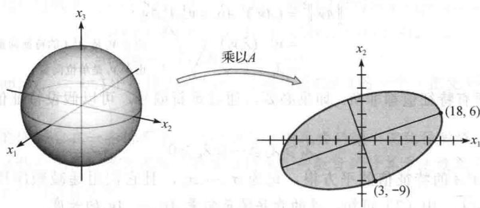
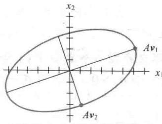
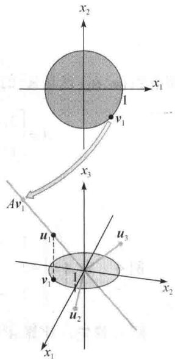
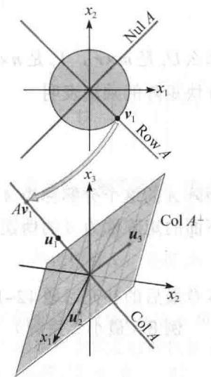
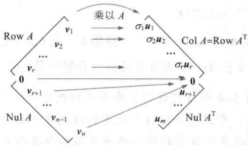

import Guide from '@/components/Guide.astro';
import Knowledge from '@/components/Knowledge.astro';
import Example from '@/components/Example.astro';
import Analysis from '@/components/Analysis.astro';
import Solution from '@/components/Solution.astro';
import Variant from '@/components/Variant.astro';
import Note from '@/components/Note.astro';
import Block from '@/components/Block.astro';
import Method from '@/components/Method.astro';
import Exercise from '@/components/Exercise.astro';

5.3节和7.1节的对角化定理在许多应用中均很重要，然而，如我们所知，不是所有矩阵都有分解式 $A = PDP^{-1}$ ，且 $D$ 是对角的。但分解 $A = QDP^{-1}$ 对任意 $m \times n$ 矩阵 $A$ 都有可能！这类特殊分解称为奇异值分解，是线性代数应用中最有用的矩阵分解。

奇异值分解基于一般的矩阵对角化性质，可以被长方形矩阵模仿：一个对称矩阵 A 的特征值的绝对值表示度量 A 拉长或压缩一个向量（特征向量）的程度。如果 $Ax = \lambda x$ ，且 $\|x\| = 1$ ，那么

$$
\left\| A \boldsymbol {x} \right\| = \left\| \lambda \boldsymbol {x} \right\| = | \lambda | \| \boldsymbol {x} \| = | \lambda |\tag{1}
$$

如果 $\lambda_{1}$ 是具有最大数值的特征值，那么对应的单位特征向量 $\pmb{v}_{1}$ 确定一个由 $A$ 的拉长影响最大的方向，也就是说，（1）式表示当 $\pmb{x} = \pmb{v}_{1}$ 时， $Ax$ 的长度最大化，且 $\| A\pmb{v}_{1}\| = |\lambda_{1}|$ 。这个对 $\pmb{v}_{1}$ 和 $|\lambda_{1}|$ 的描述对于长方形的矩阵来说也是类似的，这将导致奇异值分解。

<Example title="例 1">
如果 $A=\begin{bmatrix}4 & 11 & 14 \\ 8 & 7 & -2\end{bmatrix}$ ，那么线性变换 $x \mapsto Ax$ 将 $R^{3}$ 中的单位球 $\{x : \|x\| = 1\}$ 映上到 $R^{2}$ 中的椭圆，见图 7-13. 找出使得长度 $\|Ax\|$ 最大的一个单位向量 x，且计算这个最大长度.

<figure class="vp-figure">
  
  <figcaption>图7-13 从 $\mathbb{R}^3$ 到 $\mathbb{R}^2$ 的一个变换</figcaption>
</figure>

<Solution title="解">
使 $\| Ax\|^2$ 的值最大化的 $x$ 同样使 $\| Ax\|$ 的值最大化，但 $\| Ax\|^2$ 更容易计算。注意到

$$
\left\| A \boldsymbol {x} \right\| ^ {2} = (A \boldsymbol {x}) ^ {\mathrm{T}} (A \boldsymbol {x}) = \boldsymbol {x} ^ {\mathrm{T}} A ^ {\mathrm{T}} A \boldsymbol {x} = \boldsymbol {x} ^ {\mathrm{T}} (A ^ {\mathrm{T}} A) \boldsymbol {x}
$$

由于 $(A^{\mathrm{T}}A)^{\mathrm{T}} = A^{\mathrm{T}}A^{\mathrm{TT}} = A^{\mathrm{T}}A$ ，故 $A^{\mathrm{T}}A$ 也是一个对称矩阵．所以，现在的问题转化为在条件 $\| x\| = 1$ 的限制下二次型 $x^{\mathrm{T}}(A^{\mathrm{T}}A)x$ 的最大化．利用7.3节的定理6，最大值就是矩阵 $A^{\mathrm{T}}A$ 的最大特征值 $\lambda_{1}$ ，同样，最大值可以在 $A^{\mathrm{T}}A$ 的特征值 $\lambda_{1}$ 对应的单位特征向量处获得.

对本例中的矩阵 A，

$$
A ^ {\mathrm{T}} A = \left[ \begin{array}{l l} 4 & 8 \\ 1 1 & 7 \\ 1 4 & - 2 \end{array} \right] \left[ \begin{array}{l l l} 4 & 1 1 & 1 4 \\ 8 & 7 & - 2 \end{array} \right] = \left[ \begin{array}{l l l} 8 0 & 1 0 0 & 4 0 \\ 1 0 0 & 1 7 0 & 1 4 0 \\ 4 0 & 1 4 0 & 2 0 0 \end{array} \right]
$$

矩阵 $A^{T}A$ 的特征值是 $\lambda_{1}=360$ ， $\lambda_{2}=90$ 和 $\lambda_{3}=0$ ，对应的单位特征向量分别是

$$
\pmb {\nu} _ {1} = \left[ \begin{array}{l} 1 / 3 \\ 2 / 3 \\ 2 / 3 \end{array} \right], \pmb {\nu} _ {2} = \left[ \begin{array}{l} - 2 / 3 \\ - 1 / 3 \\ 2 / 3 \end{array} \right], \pmb {\nu} _ {3} = \left[ \begin{array}{l} 2 / 3 \\ - 2 / 3 \\ 1 / 3 \end{array} \right]
$$

$\| Ax\|^2$ 的最大值是360，且在 $\pmb{x}$ 为单位向量 $\pmb{v}_{1}$ 处获得．向量 $A\pmb{v}_{1}$ 是图7-13中椭圆上离原点最远的点，即

$$
A \pmb {v} _ {1} = \left[ \begin{array}{l l l} 4 & 1 1 & 1 4 \\ 8 & 7 - 2 \end{array} \right] \left[ \begin{array}{l} 1 / 3 \\ 2 / 3 \\ 2 / 3 \end{array} \right] = \left[ \begin{array}{l} 1 8 \\ 6 \end{array} \right]
$$

对 $\| x\| = 1$ ， $\| Ax\|$ 的最大值是 $\| Av_1\| = \sqrt{360} = 6\sqrt{10}$

例 1 说明，A 对 $R^{3}$ 中单位球面的影响与二次型 $\boldsymbol{x}^{\mathrm{T}}(\boldsymbol{A}^{\mathrm{T}}\boldsymbol{A})\boldsymbol{x}$ 有关。事实上，变换 $x \rightarrow Ax$ 的全部几何特性都可用二次型来说明，下面我们将说明这个问题。
</Solution>
</Example>

## 一个 $m \times n$ 矩阵的奇异值

令 A 是 $m \times n$ 矩阵，那么 $A^{T}A$ 是对称矩阵且可以正交对角化。令 $\{v_{1}, \cdots, v_{n}\}$ 是 $R^{n}$ 的单位正交基且构成 $A^{T}A$ 的特征向量， $\lambda_{1}, \cdots, \lambda_{n}$ 是 $A^{T}A$ 对应的特征值，那么对 $1 \leqslant i \leqslant n$ ，

$$
\begin{array}{r l r} {\left\| A \pmb {v} _ {i} \right\| ^ {2} = (A \pmb {v} _ {i}) ^ {\mathrm{T}} A \pmb {v} _ {i} = \pmb {v} _ {i} ^ {\mathrm{T}} A ^ {\mathrm{T}} A \pmb {v} _ {i}} \\ & {= \pmb {v} _ {i} ^ {\mathrm{T}} (\lambda_ {i} \pmb {v} _ {i})} & {\text {由于} \pmb {v} _ {i} \text {是} A ^ {\mathrm{T}} A \text {的特征向量}} \\ & {= \lambda_ {i}} & {\text {由于} \pmb {v} _ {i} \text {是单位向量}} \end{array}\tag{2}
$$

所以， $A^{\mathrm{T}}A$ 的所有特征值都非负．如果必要，通过重新编号，可以假设特征值的重新排列满足

$$
\lambda_ {1} \geqslant \lambda_ {2} \geqslant \dots \geqslant \lambda_ {n} \geqslant 0
$$

A 的奇异值是 $A^{T}A$ 的特征值的平方根，记为 $\sigma_{1},\cdots,\sigma_{n}$ ，且它们用递减顺序排列，也就是对 $1\leqslant i\leqslant n,\quad\sigma_{i}=\sqrt{\lambda_{i}}$ ．由（2）可知，A 的奇异值是向量 $Av_{1},\cdots,Av_{n}$ 的长度.

<Example title="例 2">
令 $A$ 是例1中的矩阵，由于 $A^{\mathrm{T}}A$ 的特征值是360，90和0，故 $A$ 的奇异值是

$$
\sigma_ {1} = \sqrt {3 6 0} = 6 \sqrt {1 0}, \sigma_ {2} = \sqrt {9 0} = 3 \sqrt {1 0}, \sigma_ {3} = 0
$$

从例1可知， $A$ 的第一个奇异值是 $\| Ax\|$ 在所有单位向量处的最大值，且最大值可以在单位向量 $\pmb{v}_{1}$ 处获得.7.3节的定理7表明， $A$ 的第二个奇异值是 $\| Ax\|$ 在所有与 $\pmb{v}_{1}$ 正交的单位向量上的最大值，且这个最大值可以在第二个单位特征向量 $\pmb{v}_{2}$ 处获得（习题22）．对例1中的 $\pmb{v}_{2}$ ，

$$
A \pmb {v} _ {2} = \left[ \begin{array}{c c c} 4 & 1 1 & 1 4 \\ 8 & 7 & - 2 \end{array} \right] \left[ \begin{array}{c} - 2 / 3 \\ - 1 / 3 \\ 2 / 3 \end{array} \right] = \left[ \begin{array}{c} 3 \\ - 9 \end{array} \right]
$$

这个点在图 7-13 中椭圆的短轴上，像 $A v_{1}$ 在长轴上一样（见图 7-14）。矩阵 A 的前两个奇异值是椭圆长半轴和短半轴的长度。

<figure class="vp-figure">
  
  <figcaption>图 7-14</figcaption>
</figure>

事实上，像下面定理所说，图7-14中的 $A\pmb{v}_1$ 和 $A\pmb{v}_2$ 正交不是偶然.
</Example>

<Knowledge title="定理 9">
假若 $\{v_{1},\cdots,v_{n}\}$ 是包含 $A^{T}A$ 的特征向量的 $R^{n}$ 上的单位正交基，重新整理使得对应的 $A^{T}A$ 的特征值满足 $\lambda_{1}\geqslant\cdots\geqslant\lambda_{n}$ . 假若 A 有 r 个非零奇异值，那么 $\{Av_{1},\cdots,Av_{r}\}$ 是 ColA 的一个正交基，且 rank A=r.

<Solution title="证明">
由于当 $i \neq j$ 时， $\pmb{v}_i$ 和 $\lambda_j \pmb{v}_j$ 正交，所以

$$
\left(A \boldsymbol {v} _ {i}\right) ^ {\mathrm{T}} \left(A \boldsymbol {v} _ {j}\right) = \boldsymbol {v} _ {i} ^ {\mathrm{T}} A ^ {\mathrm{T}} A \boldsymbol {v} _ {j} = \boldsymbol {v} _ {i} ^ {\mathrm{T}} \left(\lambda_ {j} \boldsymbol {v} _ {j}\right) = 0
$$

从而 $\{Av_{1},\cdots,Av_{n}\}$ 是一个正交基. 更进一步，由于向量 $Av_{1},\cdots,Av_{n}$ 的长度是 A 的奇异值，且因为有 r 个非零奇异值，因此 $Av_{i}\neq0$ 的充分必要条件是 $1\leqslant i\leqslant r$ . 所以 $Av_{1},\cdots,Av_{r}$ 是线性无关向量，且属于 ColA. 最后，对任意属于 ColA 的 y，比如 y=Ax，我们可以写出 $x=c_{1}v_{1}+\cdots+c_{n}v_{n}$ ，且

$$
\begin{array}{r l} \mathbf {y} & = A \mathbf {x} = c _ {1} A \mathbf {v} _ {1} + \dots + c _ {r} A \mathbf {v} _ {r} + c _ {r + 1} A \mathbf {v} _ {r + 1} + \dots + c _ {n} A \mathbf {v} _ {n} \\ & = c _ {1} A \mathbf {v} _ {1} + \dots + c _ {r} A \mathbf {v} _ {r} + 0 + \dots + 0 \end{array}
$$

这样，y 在 Span $\{Av_{1},\cdots,Av_{r}\}$ 中，这说明 $\{Av_{1},\cdots,Av_{r}\}$ 是 Col A 的一个（正交）基。因此 rank A = -dim Col A = r。

数值计算的注解 在一些情形下，A 的秩对 A 中元素的微小变化很敏感。如果用计算机对矩阵 A 作行化简，那么很明显矩阵 A 的主元列数目的计算方法效果不好，舍入误差常导致满秩的阶梯矩阵。

实际上，估计大矩阵 A 的秩时，最可靠的方法是计算非零奇异值的个数。在这种情形下，特别小的非零奇异值在实际计算中常假定为零，矩阵 A 的有效秩是剩余非零奇异值的数目。 ①
</Solution>
</Knowledge>

## 奇异值分解

矩阵 A 的分解涉及一个 $m \times n$ “对角” 矩阵 $\Sigma$ ，其形式是

$$
\Sigma = \left[ \begin{array}{l l} {D} & {0} \\ {0} & {0} \end{array} \right] \leftarrow m - r \text {行}   \uparrow_ {n - r \text {行}}\tag{3}
$$

其中，D 是一个 $r \times r$ 对角矩阵，且 r 不超过 m 和 n 中较小的那个（如果 r 等于 m 或 n，或都相等，

则 $M$ 中不会出现零矩阵）.

<Knowledge title="定理 10 奇异值分解">
设 A 是秩为 r 的 $m \times n$ 矩阵，那么存在一个类似（3）中的 $m \times n$ 矩阵 $\Sigma$ ，其中 D 的对角线元素是 A 的前 r 个奇异值， $\sigma_{1} \geqslant \sigma_{2} \geqslant \cdots \geqslant \sigma_{r} > 0$ ，并且存在一个 $m \times m$ 正交矩阵 U 和一个 $n \times n$ 正交矩阵 V 使得 $A = U \Sigma V^{T}$ .

任何分解 $A = U\Sigma V^{\mathrm{T}}$ 称为 $A$ 的一个奇异值分解（或SVD），其中 $U$ 和 $V$ 是正交矩阵， $\Sigma$ 形如（3）式， $D$ 具有正的对角线元素。矩阵 $U$ 和 $V$ 不是由 $A$ 惟一确定的，但 $\Sigma$ 的对角线元素必须是 $A$ 的奇异值，见习题19。这样的一个分解中 $U$ 的列称为 $A$ 的左奇异向量，而 $V$ 的列称为 $A$ 的右奇异向量。

<Solution title="证明">
假设 $\lambda_{i}$ 和 $v_{i}$ 如定理 9，使得 $\{Av_{1},\cdots,Av_{r}\}$ 是 Col A 的正交基。将每一个 $Av_{i}$ 单位化得到一个单位正交基 $\{u_{1},\cdots,u_{r}\}$ ，其中

$$
\boldsymbol {u} _ {i} = \frac {1}{\left\| A \boldsymbol {v} _ {i} \right\|} A \boldsymbol {v} _ {i} = \frac {1}{\sigma_ {i}} A \boldsymbol {v} _ {i}
$$

而且

$$
A \pmb {v} _ {i} = \sigma_ {i} \pmb {u} _ {i} (1 \leqslant i \leqslant r)\tag{4}
$$

现在将 $\{u_{1},\cdots,u_{r}\}$ 扩充为 $R^{m}$ 的单位正交基 $\{u_{1},\cdots,u_{m}\}$ ，并且取

$$
U = [ \pmb {u} _ {1} \quad \pmb {u} _ {2} \quad \dots \quad \pmb {u} _ {m} ] \quad \text {和} \quad V = [ \pmb {v} _ {1} \quad \pmb {v} _ {2} \quad \dots \quad \pmb {v} _ {n} ]
$$

由构造可知，U和V是正交矩阵，同样由（4）

$$
A V = \left[ A \boldsymbol {v} _ {1} \dots A \boldsymbol {v} _ {r} \quad \mathbf {0} \dots \mathbf {0} \right] = \left[ \sigma_ {1} \boldsymbol {u} _ {1} \dots \sigma_ {r} \boldsymbol {u} _ {r} \quad \mathbf {0} \dots \mathbf {0} \right]
$$

设 D 是对角线元素为 $\sigma_{1},\cdots,\sigma_{r}$ 的对角矩阵， $\Sigma$ 是上面（3）中的形式，那么

$$
\begin{array}{r l} U \Sigma & = [ \boldsymbol {u} _ {1} \boldsymbol {u} _ {2} \dots \boldsymbol {u} _ {m} ] \left[ \begin{array}{c c c c c} \sigma_ {1} & & & 0 & \\ & \sigma_ {2} & & & 0 \\ & & \ddots & & \\ 0 & & & \sigma_ {r} & \\ \hline & 0 & & & 0 \end{array} \right] \\ & = [ \sigma_ {1} \boldsymbol {u} _ {1} \dots \sigma_ {r} \boldsymbol {u} _ {r} \boldsymbol {0} \dots \boldsymbol {0} ] \\ & = A V \end{array}
$$

由于 V 是一个正交矩阵，因此 $U \Sigma V^{T} = A V V^{T} = A$ .

下面的两个例子侧重于讨论奇异值分解的内部结构。一个有效而数值稳定的分解算法会使用另外一种方法。参见本节末尾处的“数值计算的注解”。
</Solution>
</Knowledge>

<Example title="例 3">
使用例1和例2中的结果求 $A = \begin{bmatrix} 4 & 11 & 14 \\ 8 & 7 & -2 \end{bmatrix}$ 的一个奇异值分解.

<Solution title="解">
一个奇异值分解可分三步进行.

第一步. 将矩阵 $A^{\mathrm{T}} A$ 正交对角化. 即求矩阵 $A^{\mathrm{T}} A$ 的特征值及其对应的特征向量的单位正交集. 如果 $A$ 只有两列, 则其计算可以手算完成. 对规模较大的矩阵通常需要使用矩阵程序.

而对此处的矩阵 A，在例 1 中已经给出了 $A^{T}A$ 的特征值及其相应的特征向量.

第二步. 算出 $V$ 和 $\Sigma$ . 将 $A^{\mathrm{T}} A$ 的特征值按降序排列. 在例 1 中, 特征值已经按降序排列: 360, 90, 0. 它们对应的单位特征向量 $\pmb{v}_{1}, \pmb{v}_{2}, \pmb{v}_{3}$ 是 $A$ 的右奇异向量. 使用例 1 的结果, 构造

$$
V = \left[ \begin{array}{l l l} \boldsymbol {v} _ {1} & \boldsymbol {v} _ {2} & \boldsymbol {v} _ {3} \end{array} \right] = \left[ \begin{array}{c c c} 1 / 3 & - 2 / 3 & 2 / 3 \\ 2 / 3 & - 1 / 3 & - 2 / 3 \\ 2 / 3 & 2 / 3 & 1 / 3 \end{array} \right]
$$

特征值的平方根就是奇异值： $\sigma_{1} = \sqrt{360} = 6\sqrt{10},\sigma_{2} = \sqrt{90} = 3\sqrt{10},\sigma_{3} = 0$ ，其中的非零奇异值是矩阵 $D$ 的对角线元素.矩阵 $\Sigma$ 与矩阵 $A$ 的行列数相同，以矩阵 $D$ 为其左上角，其他元素为0.

$$
D = \left[ \begin{array}{c c} 6 \sqrt {1 0} & 0 \\ 0 & 3 \sqrt {1 0} \end{array} \right], \Sigma = [ D \quad 0 ] = \left[ \begin{array}{c c c} 6 \sqrt {1 0} & 0 & 0 \\ 0 & 3 \sqrt {1 0} & 0 \end{array} \right]
$$

第三步. 构造 $U$ . 当矩阵 $A$ 的秩为 $r$ 时, 矩阵 $U$ 的前 $r$ 列是从 $A \mathbf{v}_1 \cdots A \mathbf{v}_r$ 计算得到的单位向量. 此例中, $A$ 有两个非零奇异值, 因此 $\operatorname{rank} A = 2$ . 根据例 2 之前的内容和方程 (2), 有 $\| A \mathbf{v}_1 \| = \sigma_1$ , $\| A \mathbf{v}_2 \| = \sigma_2$ , 于是

$$
\boldsymbol {u} _ {1} = \frac {1}{\sigma_ {1}} A \boldsymbol {v} _ {1} = \frac {1}{6 \sqrt {1 0}} \left[ \begin{array}{l} 1 8 \\ 6 \end{array} \right] = \left[ \begin{array}{l} 3 / \sqrt {1 0} \\ 1 / \sqrt {1 0} \end{array} \right]
$$

$$
\boldsymbol {u} _ {2} = \frac {1}{\sigma_ {2}} A \boldsymbol {v} _ {2} = \frac {1}{3 \sqrt {1 0}} \left[ \begin{array}{l} 3 \\ - 9 \end{array} \right] = \left[ \begin{array}{l} 1 / \sqrt {1 0} \\ - 3 / \sqrt {1 0} \end{array} \right]
$$

留意到 $\{\pmb{u}_1, \pmb{u}_2\}$ 已是 $\mathbb{R}^2$ 的一个基，因此构造 $U$ 不需另外的向量， $U = [\pmb{u}_1 - \pmb{u}_2]$ . $A$ 的奇异值分解是

$$
A = \left[ \begin{array}{c c} 3 / \sqrt {1 0} & 1 / \sqrt {1 0} \\ 1 / \sqrt {1 0} & - 3 / \sqrt {1 0} \end{array} \right] \left[ \begin{array}{c c c} 6 \sqrt {1 0} & 0 & 0 \\ 0 & 3 \sqrt {1 0} & 0 \end{array} \right] \left[ \begin{array}{c c c} 1 / 3 & 2 / 3 & 2 / 3 \\ - 2 / 3 & - 1 / 3 & 2 / 3 \\ 2 / 3 & - 2 / 3 & 1 / 3 \end{array} \right]
$$
</Solution>
</Example>

<Example title="例 4">
求 $A = \begin{bmatrix} 1 & -1 \\ -2 & 2 \\ 2 & -2 \end{bmatrix}$ 的一个奇异值分解.

<Solution title="解">
首先，计算 $A^{T}A=\begin{bmatrix}9 & -9 \\ -9 & 9\end{bmatrix}$ . $A^{T}A$ 的特征值是 18 和 0，相应的单位特征向量是

$$
\pmb {v} _ {1} = \left[ \begin{array}{c} 1 / \sqrt {2} \\ - 1 / \sqrt {2} \end{array} \right], \pmb {v} _ {2} = \left[ \begin{array}{c} 1 / \sqrt {2} \\ 1 / \sqrt {2} \end{array} \right]
$$

这两个单位向量构成 $V$ 的列：

$$
V = \left[ \begin{array}{l l} \boldsymbol {v} _ {1} & \boldsymbol {v} _ {2} \end{array} \right] = \left[ \begin{array}{c c} 1 / \sqrt {2} & 1 / \sqrt {2} \\ - 1 / \sqrt {2} & 1 / \sqrt {2} \end{array} \right]
$$

矩阵的奇异值为 $\sigma_{1}=\sqrt{18}=3\sqrt{2},\sigma_{2}=0$ 。因为只有一个非零的奇异值，所以“矩阵”D可写成单个数值，即 $D=3\sqrt{2}$ 。矩阵Σ与矩阵A的行列数相同，以矩阵D为其左上角：

$$
\Sigma = \left[ \begin{array}{l l} D & 0 \\ 0 & 0 \\ 0 & 0 \end{array} \right] = \left[ \begin{array}{l l} 3 \sqrt {2} & 0 \\ 0 & 0 \\ 0 & 0 \end{array} \right]
$$

为构造 U，首先构造 $Av_{1}$ 和 $Av_{2}$ ：

$$
A \pmb {v} _ {1} = \left[ \begin{array}{c} 2 / \sqrt {2} \\ - 4 / \sqrt {2} \\ 4 / \sqrt {2} \end{array} \right], \quad A \pmb {v} _ {2} = \left[ \begin{array}{c} 0 \\ 0 \\ 0 \end{array} \right]
$$

为检查计算，验证 $\| A\pmb{v}_1\| = \sigma_1 = \sqrt{18} = 3\sqrt{2}$ 。当然， $A\pmb{v}_2 = 0$ ，因为 $\| A\pmb{v}_2\| = \sigma_2 = 0$ 。目前只找到 $U$ 的一列是

$$
\boldsymbol {u} _ {1} = \frac {1}{3 \sqrt {2}} A \boldsymbol {v} _ {1} = \left[ \begin{array}{c} 1 / 3 \\ - 2 / 3 \\ 2 / 3 \end{array} \right]
$$

$U$ 的其他列是将集合 $\{\pmb{u}_1\}$ 扩充为 $\mathbb{R}^3$ 的单位正交基而得到的. 此时, 我们需要两个单位正交向量 $\pmb{u}_2$ 和 $\pmb{u}_3$ 且都与 $\pmb{u}_1$ 正交. (见图7-15.)每个向量必须满足 $\pmb{u}_1^{\mathrm{T}}\pmb{x} = 0$ , 这等价于方程 $x_1 - 2x_2 + 2x_3 = 0$ , 该方程的解集构成的基是

$$
\boldsymbol {w} _ {1} = \left[ \begin{array}{l} 2 \\ 1 \\ 0 \end{array} \right], \boldsymbol {w} _ {2} = \left[ \begin{array}{c} - 2 \\ 0 \\ 1 \end{array} \right]
$$

（经检验 $w_{1}$ 和 $w_{2}$ 都与 $u_{1}$ 正交.）应用格拉姆-施密特方法（和标准化）于 $\{w_{1}, w_{2}\}$ ，可以得到

$$
\boldsymbol {u} _ {2} = \left[ \begin{array}{c} 2 / \sqrt {5} \\ 1 / \sqrt {5} \\ 0 \end{array} \right], \boldsymbol {u} _ {3} = \left[ \begin{array}{c} - 2 / \sqrt {4 5} \\ 4 / \sqrt {4 5} \\ 5 / \sqrt {4 5} \end{array} \right]
$$

最后，令 $U = [\pmb{u}_1\quad \pmb{u}_2\quad \pmb{u}_3]$ ，以及由上所得的 $V^{\mathrm{T}}$ 和 $\Sigma$ ，有

$$
A = \left[ \begin{array}{c c} 1 & - 1 \\ - 2 & 2 \\ 2 & - 2 \end{array} \right] = \left[ \begin{array}{c c c} 1 / 3 & 2 / \sqrt {5} & - 2 / \sqrt {4 5} \\ - 2 / 3 & 1 / \sqrt {5} & 4 / \sqrt {4 5} \\ 2 / 3 & 0 & 5 / \sqrt {4 5} \end{array} \right] \left[ \begin{array}{c c} 3 \sqrt {2} & 0 \\ 0 & 0 \\ 0 & 0 \end{array} \right] \left[ \begin{array}{c c} 1 / \sqrt {2} & - 1 / \sqrt {2} \\ 1 / \sqrt {2} & 1 / \sqrt {2} \end{array} \right]
$$

<figure class="vp-figure">
  
  <figcaption>图 7-15</figcaption>
</figure>
</Solution>
</Example>

## 奇异值分解的应用

如上所述，奇异值分解常用于估计矩阵的秩。下面简单叙述它在数值计算中的其他应用，7.5节给出一个奇异值分解在图像处理中的应用。

<Example title="例 5 条件数">
当应用矩阵 A 的奇异值分解时，多数涉及方程 Ax=b 的数值计算要尽可能地可靠。两个正交矩阵 U 和 V 不影响向量的长度和两个向量的夹角（6.2 节定理 7）。数值计算中的任何不稳定因素都与 $\Sigma$ 有关。如果 A 的奇异值非常大或非常小，则舍入误差几乎不可避免，此时，知道 $\Sigma$ 和V中的元素对分析误差特别有用.

如果 A 是一个 $n \times n$ 可逆矩阵，那么最大奇异值和最小奇异值的比率 $\sigma_{1} / \sigma_{n}$ 给出了矩阵 A 的条件数。2.3 节的习题 41\~43 表明条件数如何影响 Ax = b 的解对 A 的元素变化（或误差）的敏感程度（事实上，A 的“条件数”可用几种方式计算，但这里给出的定义可广泛用于 Ax = b 的研究）。
</Example>

<Example title="例 6 基本子空间的基">
给定 $m \times n$ 矩阵 A 的一个奇异值分解，取 $u_{1}, \cdots, u_{m}$ 是左奇异向量， $v_{1}, \cdots, v_{n}$ 是右奇异向量，且 $\sigma_{1}, \cdots, \sigma_{n}$ 是奇异值，r 为 A 的秩。由定理 9，

$$
\left\{\boldsymbol {u} _ {1}, \dots , \boldsymbol {u} _ {r} \right\}\tag{5}
$$

是 Col A 的一个单位正交基. 见图 7-16.

回忆6.1节的定理3， $(\mathrm{Col}A)^{\perp} = \mathrm{Nul}A^{\mathrm{T}}$ ，因此

$$
\left\{\boldsymbol {u} _ {r + 1}, \dots , \boldsymbol {u} _ {m} \right\}\tag{6}
$$

是 $\mathrm{Nul}A^{\mathrm{T}}$ 的一个单位正交基.

由于当 $1 \leqslant i \leqslant n$ 时 $\| A v_{i} \| = \sigma_{i}$ ，且 $\sigma_{i}$ 是零的充分必要条件是 $i > r$ ，因此向量 $v_{r+1}, \cdots, v_{n}$ 生成一个维数为 $n - r$ 的子空间 Nul A。由秩定理可知，dim Nul A = n - rank A，从而说明

$$
\left\{\boldsymbol {v} _ {r + 1}, \dots , \boldsymbol {v} _ {n} \right\}\tag{7}
$$

是Nul $A$ 的一个单位正交基，见4.5节的基定理.

从（5）和（6）可知，空间 $\mathrm{Nul}A^{\mathrm{T}}$ 的正交补是Col $A$ .将 $A$ 和 $A^{\mathrm{T}}$ 交换，我们有

$$
(\mathrm{Nul} A) ^ {\perp} = \mathrm{Col} A ^ {\mathrm{T}} = \mathrm{Row} A
$$

因此，从（7）得

$$
\left\{\nu_ {1}, \dots , \nu_ {r} \right\}\tag{8}
$$

是Row $A$ 的一个单位正交基.

图 7-17 给出（5）～（8）的总结，但说明的是 $\{\sigma_{1}u_{1},\cdots,\sigma_{r}u_{r}\}$ 为 Col A 的正交基，而不是标准基。注意到对 $1 \leqslant i \leqslant r$ ， $Av_{i} = \sigma_{i}u_{i}$ 。由 A 确定的四个基本子空间的单位正交基在某些计算中非常有用，特别是在条件优化问题中更是如此。

由 $A$ 确定的四个基本子空间的单位正交基在某些计算中非常有 图7-16 例6中的基本子空间用，特别是在条件优化问题中更是如此.

<figure class="vp-figure">
  
  <figcaption>图7-17 四个基本子空间和 $A$ 的作用</figcaption>
</figure>

四个基本子空间和奇异值的概念给可逆矩阵定理提供了最后的命题。（回忆为了避免几乎将可逆矩阵定理的命题数目翻倍，定理中已将与 $A^{\mathrm{T}}$ 有关的命题删除了。）可逆矩阵定理的其他命题在2.3节、2.9节、3.2节、4.6节和5.2节中已经给出。

定理（可逆矩阵定理（最后补充））

设 A 为 $n \times n$ 矩阵，那么下述命题中的每一个都与 A 是可逆矩阵的命题等价.

u. $(\text{Col } A)^{\perp} = \{\mathbf{0}\}$ .

v. $(\text{Nul } A)^{\perp} = \mathbb{R}^{n}$ .

w. $\operatorname{Row} A = \mathbb{R}^n$ .

x. A 有 n 个非零的奇异值.
</Example>

<Example title="例 7 奇异值分解的简化和 A 的伪逆">
当 $\Sigma$ 包含零元素的行或列时，矩阵 A 具有更简洁的分解．利用上面建立的符号，取 r = rank A，将 U 和 V 矩阵分块为第一块包含 r 列的子矩阵：

$$
\begin{array}{r l} & {U = [ U _ {r} \quad U _ {m - r} ], \quad \text {其中} U _ {r} = [ \pmb {u} _ {1} \quad \dots \quad \pmb {u} _ {r} ]} \\ & {V = [ V _ {r} \quad V _ {n - r} ], \quad \text {其中} V _ {r} = [ \pmb {v} _ {1} \quad \dots \quad \pmb {v} _ {r} ]} \end{array}
$$

那么 $U_{r}$ 是 $m \times r$ ， $V_{r}$ 是 $n \times r$ 。（为简化符号，我们考虑 $U_{m - r}$ 和 $V_{n - r}$ ，即使其中一个没有任何列。）分块矩阵的乘法表明

$$
A = \left[ \begin{array}{l l} U _ {r} & U _ {m - r} \end{array} \right] \left[ \begin{array}{l l} D & 0 \\ 0 & 0 \end{array} \right] \left[ \begin{array}{l} V _ {r} ^ {\mathrm{T}} \\ V _ {n - r} ^ {\mathrm{T}} \end{array} \right] = U _ {r} D V _ {r} ^ {\mathrm{T}}\tag{9}
$$

矩阵 A 的这个分解称为 A 的简化的奇异值分解. 由于 D 的对角线元素非零, 因此 D 是可逆矩阵. 下面的矩阵称为 A 的伪逆（也称穆尔-彭罗斯逆）:

$$
A ^ {+} = V _ {r} D ^ {- 1} U _ {r} ^ {\mathrm{T}}\tag{10}
$$

本章最后的补充习题 12\~14 研究了简化的奇异值分解和伪逆的一些性质.
</Example>

<Example title="例 8 最小二乘解">
给定方程 $Ax = b$ ，利用式（10）中给出的 $A$ 的伪逆，定义

$$
\hat {\boldsymbol {x}} = A ^ {+} \boldsymbol {b} = V _ {r} D ^ {- 1} U _ {r} ^ {\mathrm{T}} \boldsymbol {b}
$$

那么由（9）式中的奇异值分解得到

$$
\begin{array}{r l r} { A \hat {\pmb x} = (U _ {r} D V _ {r} ^ {\mathrm{T}}) (V _ {r} D ^ {- 1} U _ {r} ^ {\mathrm{T}} \pmb b)} \\ & {= U _ {r} D D ^ {- 1} U _ {r} ^ {\mathrm{T}} \pmb b} & {\text {由于} V _ {r} ^ {\mathrm{T}} V _ {r} = I _ {r}} \\ & {= U _ {r} U _ {r} ^ {\mathrm{T}} \pmb b} \end{array}
$$

从（5）式可知， $U_{r}U_{r}^{T}b$ 是 b 在 Col A 上的正交投影 $\hat{b}$ （见 6.3 节定理 10），因此 $\hat{x}$ 是 Ax=b 的最小二乘解。实际上，这个 $\hat{x}$ 在 Ax=b 的所有最小二乘解中具有最小长度，见补充习题 14。

数值计算的注解 例 1\~4 和习题说明了奇异值的概念并给出如何手工计算。实际上，应该避免 $A^{\mathrm{T}}A$ 的计算，原因是任何 $A$ 中元素的误差在 $A^{\mathrm{T}}A$ 中被平方。存在快速的迭代方法，可计算精确到很多位数的矩阵 $A$ 的奇异值和奇异向量。
</Example>

## 进一步阅读

Horn, Roger A., and Charles R. Johnson, Matrix Analysis $^{®}$ , vol. 1 (Cambridge: Cambridge University Press, 1985), pp. 414–445.

Long, Cliff, "Visualization of Matrix Singular Value Decomposition." Mathematics Magazine 56 (1983), pp. 161–167.

Moler, C. B., and D. Morrison, "Singular Value Analysis of Cryptograms." Amer. Math. Monthly 90 (1983), pp. 78–87.

Strang, Gilbert, Linear Algebra and Its Applications, 3rd ed. (San Diego: Harcourt Brace Jovanovich, 1988), pp. 442–452.

Watkins, David S., Fundamentals of Matrix Computations (New York: Wiley, 1991), pp. 390–398, 409–421.

<Block title="练习题">
1. 给定一个奇异值分解 $A = U\Sigma V^{\mathrm{T}}$ ，求 $A^{\mathrm{T}}$ 的一个奇异值分解。 $A$ 和 $A^{\mathrm{T}}$ 的奇异值之间有什么联系？

2. 对任意的 $n \times n$ 矩阵 $A$ ，利用奇异值分解证明存在一个 $n \times n$ 的正交阵 $Q$ ，使得 $A^{\mathrm{T}} A = Q^{\mathrm{T}} (A^{\mathrm{T}} A) Q$ 注：练习题2表明对任意的 $n \times n$ 矩阵 $A$ ，矩阵 $AA^{\mathrm{T}}$ 和 $A^{\mathrm{T}} A$ 的正交相似的。
</Block>

<Block title="习题7.4">
求习题 1\~4 中矩阵的奇异值分解.

1.

$$
\left[ \begin{array}{c c} 1 & 0 \\ 0 & - 3 \end{array} \right]
$$

2.

$$
\left[ \begin{array}{c c} - 3 & 0 \\ 0 & 0 \end{array} \right]
$$

11.

12.

$$
\left[ \begin{array}{c c} 2 & 3 \\ 0 & 2 \end{array} \right]
$$

4.

$$
\left[ \begin{array}{c c} 3 & 0 \\ 8 & 3 \end{array} \right]
$$

$$
\left[ \begin{array}{c c} 1 & 1 \\ 0 & 1 \\ - 1 & 1 \end{array} \right]
$$

求习题 5\~12 中每个矩阵的奇异值分解.（提示：在习题 11 中，U 的一个选择可以是 $\begin{bmatrix}-1/3&2/3&2/3\\2/3&-1/3&2/3\\2/3&2/3&-1/3\end{bmatrix}$ ，习题 12 中 U 的一个列可以
是 $\begin{bmatrix}1/\sqrt{6}\\-2/\sqrt{6}\\1/\sqrt{6}\end{bmatrix}$ .
5. $\begin{bmatrix}-2&0\\0&0\end{bmatrix}$ 6. $\begin{bmatrix}-3&0\\0&-2\end{bmatrix}$ 7. $\begin{bmatrix}2&-1\\2&2\end{bmatrix}$ 8. $\begin{bmatrix}4&6\\0&4\end{bmatrix}$ 9. $\begin{bmatrix}3&-3\\0&0\\1&1\end{bmatrix}$ 10. $\begin{bmatrix}7&1\\5&5\\0&0\end{bmatrix}$

$$
\left[ \begin{array}{c c} - 3 & 1 \\ 6 & - 2 \\ 6 & - 2 \end{array} \right]
$$

该书中文版已由机械工业出版社引进出版. ——编辑注

13. 求 $A=\begin{bmatrix}3&2&2\\ 2&3&-2\end{bmatrix}$ 的奇异值分解（提示：对 $A^{T}$ 进行分解）.

14. 在习题7中，求一个单位向量 $\pmb{x}$ ，使得 $Ax$ 具有最大长度.

15. 假设下面是矩阵 A 的奇异值分解, 其中 U 和 V 的元素是四舍五入精确到小数点后两位数字.

$$
\begin{array}{r l} A = & \left[ \begin{array}{c c c} 0. 4 0 & - 0. 7 8 & 0. 4 7 \\ 0. 3 7 & - 0. 3 3 & - 0. 8 7 \\ - 0. 8 4 & - 0. 5 2 & - 0. 1 6 \end{array} \right] \left[ \begin{array}{c c c} 7. 1 0 & 0 & 0 \\ 0 & 3. 1 0 & 0 \\ 0 & 0 & 0 \end{array} \right] \\ & \times \left[ \begin{array}{c c c} 0. 3 0 & - 0. 5 1 & - 0. 8 1 \\ 0. 7 6 & 0. 6 4 & - 0. 1 2 \\ 0. 5 8 & - 0. 5 8 & 0. 5 8 \end{array} \right] \end{array}
$$

a. A 的秩是多少?

b. 利用 A 的这个分解，不用计算，写出 ColA 的一个基和 NulA 的一个基。（提示：首先写出 V 的列。）

16. 对下列 $3 \times 4$ 矩阵 A 的奇异值分解, 重做习题 15.

$$
A = \left[ \begin{array}{c c c} - 0. 8 6 & - 0. 1 1 & - 0. 5 0 \\ 0. 3 1 & 0. 6 8 & - 0. 6 7 \\ 0. 4 1 & - 0. 7 3 & - 0. 5 5 \end{array} \right] \left[ \begin{array}{c c c c} 1 2. 4 8 & 0 & 0 & 0 \\ 0 & 6. 3 4 & 0 & 0 \\ 0 2. 4 8 & 0 & 0 & 0 \end{array} \right] \times \\ \left[ \begin{array}{c c c c} 0. 6 6 & - 0. 0 3 & - 0. 3 5 & 0. 6 6 \\ - 0. 1 3 & - 0. 9 0 & - 0. 3 9 & - 0. 1 3 \\ 0. 6 5 & 0. 0 8 & - 0. 1 6 & - 0. 7 3 \\ - 0. 3 4 & 0. 4 2 & - 0. 8 4 & - 0. 0 8 \end{array} \right]
$$

在习题 17\~24 中，A 是一个 $m \times n$ 矩阵，具有奇异值分解 $A = U \Sigma V^{T}$ ，其中 U 是一个 $m \times m$ 正交矩阵， $\Sigma$ 是一个“对角”矩阵，有 r 个正元素，没有负元素，V 是一个 $n \times n$ 正交矩阵。验证每一个答案。

17. 证明：如果 $A$ 是方阵，那么 $\left|\det A\right|$ 是 $A$ 的奇异值的乘积.

18. 若 A 是可逆方阵，求 $A^{-1}$ 的奇异值分解.

19. 证明：V 的列是 $A^{T}A$ 的特征向量，U 的列是 $AA^{T}$ 的特征向量，而 $\Sigma$ 对角线上的元素是 A 的奇异值。（提示：利用奇异值分解计算 $A^{T}A$ 和 $AA^{T}$ .）

20. 证明：如果 $P$ 是一个 $m \times m$ 正交矩阵，那么 $PA$ 与 $A$ 有同样的奇异值.

21. 验证例 2 中的论断，即当 x 变化范围属于所有正交于 $v_{1}$ 的单位向量时，矩阵 A 的第二个奇异值是 $\|Ax\|$ 的最大值，其中 $v_{1}$ 是对应于 A 的第一个奇异值的右奇异向量。（提示：利用 7.3 节的定理 7.）

22. 证明：如果 A 是 $n \times n$ 且正定的矩阵，那么 A 的正交对角化 $A = PDP^{T}$ 就是 A 的奇异值分解.

23. 设 $U = [u_{1} \cdots u_{m}]$ ， $V = [v_{1} \cdots v_{n}]$ ，其中 $u_{i}$ 和 $v_{i}$ 如定理 10 中所示，证明：

$$
A = \sigma_ {1} \boldsymbol {u} _ {1} \boldsymbol {v} _ {1} ^ {\mathrm{T}} + \sigma_ {2} \boldsymbol {u} _ {2} \boldsymbol {v} _ {2} ^ {\mathrm{T}} + \dots + \sigma_ {r} \boldsymbol {u} _ {r} \boldsymbol {v} _ {r} ^ {\mathrm{T}}
$$

24. 利用习题 23 的记号，说明对 $1 \leqslant j \leqslant r =$ rank $A, A^{\mathrm{T}}\pmb{u}_{j} = \sigma_{j}\pmb{v}_{j}$ 成立.

25. 令 $T: \mathbb{R}^n \to \mathbb{R}^m$ 是线性变换，描述如何求 $\mathbb{R}^n$ 的基 $\mathcal{B}$ 和 $\mathbb{R}^m$ 中的基 $\mathcal{C}$ ，使得矩阵 $T$ 相对于 $\mathcal{B}$ 和 $\mathcal{C}$ 是一个 $m \times n$ “对角”矩阵.

[M]计算习题26和习题27中每一个矩阵的奇异值分解，要求最后的矩阵元素精确到两位小数，利用例3和例4的方法.

$$
A = \left[ \begin{array}{r r r r} - 1 8 & 1 3 & - 4 & 4 \\ 2 & 1 9 & - 4 & 1 2 \\ - 1 4 & 1 1 & - 1 2 & 8 \\ - 2 & 2 1 & 4 & 8 \end{array} \right]
$$

$$
A = \left[ \begin{array}{r r r r r} 6 & - 8 & - 4 & 5 & - 4 \\ 2 & 7 & - 5 & - 6 & 4 \\ 0 & - 1 & - 8 & 2 & 2 \\ - 1 & - 2 & 4 & 4 & - 8 \end{array} \right]
$$

28.[M]计算2.3节习题9中 $4\times 4$ 矩阵的奇异值，并且计算条件数 $\sigma_{1} / \sigma_{4}$

29. [M]计算 2.3 节习题 10 中 $5 \times 5$ 矩阵的奇异值，并且计算条件数 $\sigma_{1}/\sigma_{5}$ .
</Block>

<Block title="练习题答案">
1. 如果 $A = U\Sigma V^{\mathrm{T}}$ ，其中 $\Sigma$ 是 $m\times n$ 矩阵，那么 $A^{\mathrm{T}} = (V^{\mathrm{T}})^{\mathrm{T}}\Sigma^{\mathrm{T}}U^{\mathrm{T}} = V\Sigma^{\mathrm{T}}U^{\mathrm{T}}$ .这是 $A^{\mathrm{T}}$ 的一个奇异值分解，原因是 $V$ 和 $U$ 是正交矩阵，且 $\Sigma^{\mathrm{T}}$ 是一个 $n\times m$ “对角”矩阵．由于 $\Sigma$ 和 $\Sigma^{\mathrm{T}}$ 具有同样的非零对角元素，因此 $A$ 和 $A^{\mathrm{T}}$ 具有同样的非零奇异值．（注意：如果 $A$ 是 $2\times n$ 矩阵，那么 $AA^{\mathrm{T}}$ 仅为 $2\times 2$ 矩阵，且它的特征值比 $A^{\mathrm{T}}A$ 的特征值更容易（手工）计算.）

2. 利用奇异值分解写出 $A = U \sum V^{\mathrm{T}}$ ，其中 $U$ 和 $V$ 是 $n \times n$ 正交矩阵， $\Sigma$ 是 $n \times n$ 对角矩阵，因此 $U^{\mathrm{T}} U = I = V^{\mathrm{T}} V$ ， $\Sigma^{\mathrm{T}} = \Sigma$ 。将 $A$ 代入 $A^{\mathrm{T}} A$ 和 $A A^{\mathrm{T}}$ 中，得到

$$
A A ^ {\mathrm{T}} = U \sum V ^ {\mathrm{T}} (U \sum V ^ {\mathrm{T}}) ^ {\mathrm{T}} = U \sum V ^ {\mathrm{T}} V \sum^ {\mathrm{T}} U ^ {\mathrm{T}} = U \sum \sum^ {\mathrm{T}} U ^ {\mathrm{T}} = U \sum^ {2} U ^ {\mathrm{T}},
$$

$$
A ^ {\mathrm{T}} A = (U \sum V ^ {\mathrm{T}}) ^ {\mathrm{T}} U \sum V ^ {\mathrm{T}} = V \sum^ {\mathrm{T}} U ^ {\mathrm{T}} U \sum V ^ {\mathrm{T}} = V \sum^ {\mathrm{T}} \sum V ^ {\mathrm{T}} = V \sum^ {2} V ^ {\mathrm{T}}
$$

令 $Q = VU^{\mathrm{T}}$ ，则

$$
Q ^ {\mathrm{T}} (A ^ {\mathrm{T}} A) Q = (V U ^ {\mathrm{T}}) ^ {\mathrm{T}} (V \sum^ {2} V ^ {\mathrm{T}}) (V U ^ {\mathrm{T}}) = U V ^ {\mathrm{T}} V \sum^ {2} V ^ {\mathrm{T}} V U ^ {\mathrm{T}} = U \sum^ {2} U ^ {\mathrm{T}} = A A ^ {\mathrm{T}}
$$
</Block>
