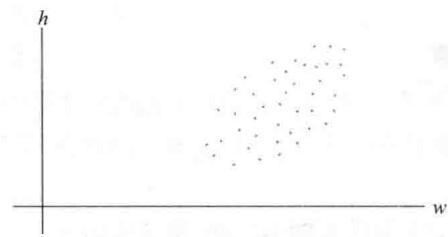
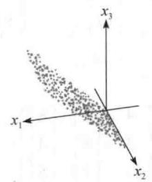
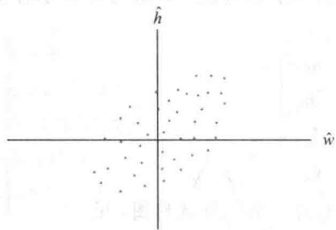
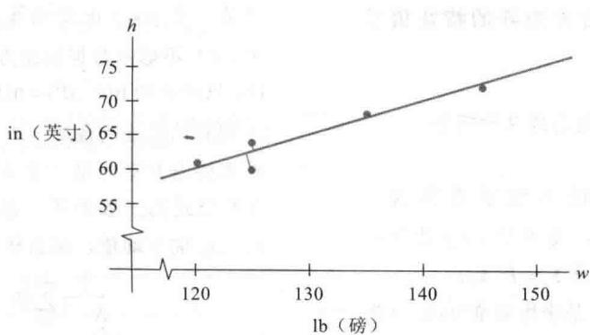

import Knowledge from '@/components/Knowledge.astro';
import Example from '@/components/Example.astro';
import Note from '@/components/Note.astro';
import Solution from '@/components/Solution.astro';
import Block from '@/components/Block.astro';

本章介绍性实例中的卫星图像问题给出一个多维或多变量数据的例子，组织数据后使得数据集合中的每组数据可看成是 $\mathbb{R}^n$ 的点（向量）。本节的主要目标是介绍主成分分析的方法，用于分析这类多维数据。计算将说明正交对角化和奇异值分解的应用方法。

主成分分析可用于任何数据，包括测量清单上采集的对象或个体。例如，研究生产塑料材料的化学过程时，为了监控生产过程，在材料生产过程中取得300个样本，且每一个样本经过8个一组的测试，如熔化点、密度、黏性、抗拉强度等。实验室的每一个样本报告是一个属于 $\mathbb{R}^8$ 的向量，这类向量集合形成一个 $8\times 300$ 的矩阵，称为观测矩阵。

粗略地讲，我们可以说控制过程的数据是八维的，下面两个例子中描述的数据可以用图形给出.

<Example title="例 1">
一个二维数据的例子是 N 个大学生关于体重和身高的一组数据. 令 $X_{j}$ 表示 $R^{2}$ 中的观测向量, 它列出第 j 个学生的体重和身高. 如果用 w 表示体重, h 表示身高, 那么观测矩阵的形式为

$$

\begin{array}{c c c c} \left[ \begin{array}{c c c c} w _ {1} & w _ {2} & \dots & w _ {N} \\ h _ {1} & h _ {2} & \dots & h _ {N} \end{array} \right] \\ \uparrow & \uparrow & & \uparrow \\ X _ {1} & X _ {2} & & X _ {N} \end{array}

$$

观测向量的集合可以形象地表示为一个二维散列图，见图 7-18.

  

图 7-18 观测向量 $X_{1}, \cdots, X_{N}$ 的散列图
</Example>

<Example title="例 2">
本章的介绍性实例中，关于美国内华达州铁路峡谷的前三幅图可以作为某区域的具有三个光谱分量的一个图像，原因是它们在三个独立的波长同时给出该区域的度量，每幅图给出同一自然区域的不同信息。例如，每幅图中位于左上角的第一像素对应地面的同一位置（大约30米 $\times 30$ 米）。每一个像素对应着 $\mathbb{R}^3$ 中的一个观测向量，它列出了该像素在三个光谱段中的信号强度。

典型的图像是 $2000 \times 2000$ 像素，使得图像有400万像素。图像的数据形成一个3行和400万列的矩阵（列可以调整为方便的次序）。在这种情形下，数据的“多维”特征是指3个光谱维数，而不是自然属于任一图形的二维空间维数。数据也许如图7-19所示，形象地表示为 $\mathbb{R}^3$ 中的400万个点。

  

图 7-19 一幅卫星图像中光谱数据的散列图
</Example>

## 均值和协方差

为准备主成分分析，令 $\left[X_{1}\cdots X_{N}\right]$ 是如上描述的一个 $p\times N$ 观测矩阵。观测向量 $X_{1},\cdots,X_{N}$ 的样本均值M由下式给出：

$$

\boldsymbol {M} = \frac {1}{N} (\boldsymbol {X} _ {1} + \dots + \boldsymbol {X} _ {N})

$$

对图 7-18 中的数据，样本均值是散列图的“中心”。对 $k=1,\cdots,N$ ，令

$$

\hat {\boldsymbol {X}} _ {k} = \boldsymbol {X} _ {k} - \boldsymbol {M}

$$

$p \times N$ 矩阵的列

$$

B = \left[ \hat {X} _ {1} \hat {X} _ {2} \dots \hat {X} _ {N} \right]

$$

具有零样本均值，这样的 B 称为平均偏差形式。当图 7-18 中的数据减去样本均值后，得到的散列图具有图 7-20 的形式。

  

图 7-20 平均偏差形式的体重-身高数据

（样本）协方差矩阵是一个 $p \times p$ 矩阵 $S$ ，其定义为

$$

S = \frac {1}{N - 1} B B ^ {\mathrm{T}}

$$

由于任何具有 $BB^{\mathrm{T}}$ 形式的矩阵是半正定的，所以 $S$ 也是半正定的。（见7.2节的习题25，互换 $B$ 和 $B^{\mathrm{T}}$ .）

<Example title="例 3">
从一个总体中随机取出 4 个样本个体作三次测量，每一个样本的观测向量为：

$$

\boldsymbol {X} _ {1} = \left[ \begin{array}{l} 1 \\ 2 \\ 1 \end{array} \right], \boldsymbol {X} _ {2} = \left[ \begin{array}{l} 4 \\ 2 \\ 1 3 \end{array} \right], \boldsymbol {X} _ {3} = \left[ \begin{array}{l} 7 \\ 8 \\ 1 \end{array} \right], \boldsymbol {X} _ {4} = \left[ \begin{array}{l} 8 \\ 4 \\ 5 \end{array} \right]

$$

计算样本均值和协方差矩阵.

<Solution title="解">
样本均值是

$$

\boldsymbol {M} = \frac {1}{4} \left(\left[ \begin{array}{l} 1 \\ 2 \\ 1 \end{array} \right] + \left[ \begin{array}{l} 4 \\ 2 \\ 1 3 \end{array} \right] + \left[ \begin{array}{l} 7 \\ 8 \\ 1 \end{array} \right] + \left[ \begin{array}{l} 8 \\ 4 \\ 5 \end{array} \right]\right) = \frac {1}{4} \left[ \begin{array}{l} 2 0 \\ 1 6 \\ 2 0 \end{array} \right] = \left[ \begin{array}{l} 5 \\ 4 \\ 5 \end{array} \right]

$$

从 $X_{1},\cdots,X_{4}$ 中减去样本均值，我们得到

$$

\hat {\boldsymbol {X}} _ {1} = \left[ \begin{array}{l} - 4 \\ - 2 \\ - 4 \end{array} \right], \hat {\boldsymbol {X}} _ {2} = \left[ \begin{array}{l} - 1 \\ - 2 \\ 8 \end{array} \right], \hat {\boldsymbol {X}} _ {3} = \left[ \begin{array}{l} 2 \\ 4 \\ - 4 \end{array} \right], \hat {\boldsymbol {X}} _ {4} = \left[ \begin{array}{l} 3 \\ 0 \\ 0 \end{array} \right]

$$

并且

$$

B = \left[ \begin{array}{c c c c} - 4 & - 1 & 2 & 3 \\ - 2 & - 2 & 4 & 0 \\ - 4 & 8 & - 4 & 0 \end{array} \right]

$$

样本协方差矩阵为

$$

S = \frac {1}{3} \left[ \begin{array}{r r r r} - 4 & - 1 & 2 & 3 \\ - 2 & - 2 & 4 & 0 \\ - 4 & 8 & - 4 & 0 \end{array} \right] \left[ \begin{array}{r r r} - 4 & - 2 & - 4 \\ - 1 & - 2 & 8 \\ 2 & 4 & - 4 \\ 3 & 0 & 0 \end{array} \right]

$$

$$

= \frac {1}{3} \left[ \begin{array}{c c c} 3 0 & 1 8 & 0 \\ 1 8 & 2 4 & - 2 4 \\ 0 & - 2 4 & 9 6 \end{array} \right] = \left[ \begin{array}{c c c} 1 0 & 6 & 0 \\ 6 & 8 & - 8 \\ 0 & - 8 & 3 2 \end{array} \right]

$$

为了讨论 $S = [s_{ij}]$ 中的元素，令 X 表示在观测向量集合中变化的向量，用 $x_{1}, \cdots, x_{p}$ 表示 X 的坐标，那么例如 $x_{1}$ 是一个在 $X_{1}, \cdots, X_{N}$ 集合中变化的第一个坐标的数值。对 $j = 1, \cdots, p, S$ 中的对角元素 $s_{jj}$ 称为 $x_{j}$ 的方差。

$x_{j}$ 的方差用来度量 $x_{j}$ 值的分散性（见习题 13）。在例 3 中， $x_{1}$ 的方差是 10， $x_{3}$ 的方差是 32，32 大于 10 的事实说明，对应向量中第三个元素的集合包含比第一个元素的集合更大的取值范围。

数据的总方差是指 $S$ 中对角线上方差的总和. 一般地, 一个方阵 $S$ 中对角线元素之和称为矩阵的迹, 记作 $\operatorname{tr}(S)$ . 这样

$$

\{\text { 总方差 } \} = \mathrm{tr} (S)

$$

S 中的元素 $s_{ij}$ （ $i \neq j$ ）称为 $x_{i}$ 和 $x_{j}$ 的协方差。观察例 3 中 $x_{1}$ 和 $x_{3}$ 之间的协方差是零，这是因为 S 中的 (1,3) 元素是零。统计学家称 $x_{1}$ 和 $x_{3}$ 是无关的。如果大部分或所有变量 $x_{1}, \cdots, x_{p}$ 是无关的，即当 $X_{1}, \cdots, X_{N}$ 的协方差矩阵是对角阵或几乎是对角阵时，则 $X_{1}, \cdots, X_{N}$ 中多变量数据的分析可以简化。
</Solution>
</Example>

## 主成分分析

为简单起见，假设矩阵 $[X_1 \cdots X_N]$ 已经是平均偏差形式。主成分分析的目标是找到一个 $p \times p$ 正交矩阵 $P = [u_1 \cdots u_p]$ ，确定一个变量代换 $X = PY$ ，或

$$

\left[ \begin{array}{c} x _ {1} \\ x _ {2} \\ \vdots \\ x _ {p} \end{array} \right] = \left[ \begin{array}{l l l} \boldsymbol {u} _ {1} & \boldsymbol {u} _ {2} & \dots \boldsymbol {u} _ {p} \end{array} \right] \left[ \begin{array}{c} y _ {1} \\ y _ {2} \\ \vdots \\ y _ {p} \end{array} \right]

$$

并具有新的变量 $y_{1}, \cdots, y_{p}$ 两两无关的性质，且整理后的方差具有递减顺序.

变量的正交变换 X = PY 说明，每一个观测向量 $X_{k}$ 得到一个“新名称” $Y_{k}$ ，使得 $X_{k} = PY_{k}$ 。注意到 $Y_{k}$ 是 $X_{k}$ 关于 P 的列的坐标向量，且对 $k = 1, \cdots, N$ 有 $Y_{k} = P^{-1}X_{k} = P^{T}X_{k}$ 。

不难验证，对任何正交矩阵 P， $Y_{1},\cdots,Y_{N}$ 的协方差是 $P^{T}SP$ （习题 11）。于是，期望的正交矩阵 P 是一矩阵使得 $P^{T}SP$ 为对角矩阵。设 D 是对角矩阵且 S 的特征值 $\lambda_{1},\cdots,\lambda_{p}$ 位于对角线上，重新整理使得 $\lambda_{1}\geqslant\lambda_{2}\geqslant\cdots\geqslant\lambda_{p}\geqslant0$ ，并令 P 是正交矩阵，它的列是对应的单位特征向量 $u_{1},\cdots,u_{p}$ ，那么 $S=PDP^{T}$ 且 $P^{T}SP=D$ 。

协方差矩阵 S 的单位特征向量 $u_{1}, \cdots, u_{p}$ 称为（观测矩阵中的）数据的主成分. 第一主成分是 S 中最大特征值对应的特征向量. 第二主成分是 S 中第二大特征值对应的特征向量，以此类推.

第一主成分 $u_{1}$ 可用下列方式确定新变量 $y_{1}$ 。设 $c_{1},\cdots,c_{p}$ 是 $u_{1}$ 中的元素，由于 $u_{1}^{T}$ 是 $P^{T}$ 的行，故方程 $Y=P^{T}X$ 表明

$$

y _ {1} = \boldsymbol {u} _ {1} ^ {\mathrm{T}} \boldsymbol {X} = c _ {1} x _ {1} + c _ {2} x _ {2} + \dots + c _ {p} x _ {p}

$$

于是 $y_{1}$ 是原变量 $x_{1},\cdots,x_{p}$ 的线性组合，并用特征向量 $u_{1}$ 中的元素作为权值。用同样的方式， $u_{2}$ 确定变量 $y_{2}$ ，以此类推。

<Example title="例 4">
铁路峡谷（例2）的多谱图像的初始数据包含 $\mathbb{R}^3$ 中400万个向量，其协方差矩阵是

$$

S = \left[ \begin{array}{l l l l} 2 & 3 8 2. 7 8 & 2 & 6 1 1. 8 4 \\ 2 & 6 1 1. 8 4 & 3 & 1 0 6. 4 7 \\ 2 & 1 3 6. 2 0 & 2 & 5 5 3. 9 0 \\ & & & 2 & 6 5 0. 7 1 \end{array} \right]

$$

求数据的主成分，并列出由第一主成分确定的新变量.

<Solution title="解">
$S$ 的特征值和相关的主成分（单位特征向量）是

$$

\lambda_ {1} = 7 6 1 4. 2 3 \lambda_ {2} = 4 2 7. 6 3 \lambda_ {3} = 9 8. 1 0

$$

$$

\boldsymbol {u} _ {1} = \left[ \begin{array}{l l} 0. 5 4 1 & 7 \\ 0. 6 2 9 & 5 \\ 0. 5 5 7 & 0 \end{array} \right] \quad \boldsymbol {u} _ {2} = \left[ \begin{array}{l l} - 0. 4 8 9 & 4 \\ - 0. 3 0 2 & 6 \\ 0. 8 1 7 & 9 \end{array} \right] \quad \boldsymbol {u} _ {3} = \left[ \begin{array}{l l} 0. 6 8 3 & 4 \\ - 0. 7 1 5 & 7 \\ 0. 1 4 4 & 1 \end{array} \right]

$$

为简单起见用小数点后两位小数，第一主成分的变量是

$$

y _ {1} = 0. 5 4 x _ {1} + 0. 6 3 x _ {2} + 0. 5 6 x _ {3}

$$

在本章介绍性实例中，这个方程用于生成图7-1d. 变量 $x_{1}, x_{2}, x_{3}$ 是三个光谱段中的信号强度。将 $x_{1}$ 的值转化为介于黑色和白色之间的灰度，生成图7-1a。类似地， $x_{2}$ 和 $x_{3}$ 的值分别生成图7-1b和图7-1c。对图7-1d中的每一个像素，用 $y_{1}$ 计算得到灰度值，即加权的 $x_{1}, x_{2}, x_{3}$ 的线性组合。在这个意义下，图7-1d“显示”数据的第一主成分。

在例 4 中，变换后数据的协方差矩阵用变量 $y_{1}, y_{2}, y_{3}$ 表示为

$$

D = \left[ \begin{array}{c c c} 7 & 6 1 4. 2 3 & 0 \\ & 0 & 4 2 7. 6 3 \\ & 0 & 0 \end{array} \right] \quad 9 8. 1 0

$$

尽管 $D$ 比原来的协方差矩阵 $S$ 明显简单，但构造新变量的优点仍然不明显。然而，变量 $y_{1}, y_{2}, y_{3}$ 的方差出现在对角矩阵 $D$ 的对角线上，并且明显看出 $D$ 中第一个方差比其余两个大得多。如我们将要看到的，这个事实允许将数据当作一维而不是三维的。
</Solution>
</Example>

## 多变量数据的降维

对大多数数据的变化或动态范围，当新变量 $y_{1}, \cdots, y_{p}$ 中的一些变量的变化较小时，主成分分析有潜在的应用价值.

可以证明变量的正交变换 X = PY 不改变数据的总方差。（粗略地讲，这个结论是真的，其原因是左乘 P 不改变向量的长度或它们之间的夹角，见习题 12.）这说明，如果 $S = PDP^{T}$ ，那么 $\{x_{1}, \cdots, x_{p}\text{ 的总方差 }\} = \{y_{1}, \cdots, y_{p}\text{ 的总方差 }\} = \operatorname{tr}(D) = \lambda_{1} + \cdots + \lambda_{p}$

$y_{j}$ 的方差是 $\lambda_{j}$ ，商 $\lambda_{j} / \mathrm{tr}(S)$ 度量总体方差成分中被 $y_{j}$ “说明”或“记录”的比例.

<Example title="例 5">
计算铁路峡谷例题中各种方差占总方差的百分比，显示主成分图形中的多光谱数据，这在本章介绍性实例的图 7-1d\~f 中已经画出.

<Solution title="解">
数据的总方差是

$$

\operatorname{tr} (D) = 7 6 1 4. 2 3 + 4 2 7. 6 3 + 9 8. 1 0 = 8 1 3 9. 9 6

$$

（可验证这个数等于 $\operatorname{tr}(S)$ ）主成分占总方差的百分比分别是

$$

\frac {7614.23}{8139.96} = 93.5\% \quad \frac {427.63}{8139.96} = 5.3\% \quad \frac {98.10}{8139.96} = 1.2\%

$$

其意义是，地球资源卫星关于铁路峡谷地区收集的 93.5% 的信息显示在图 7-1d 上，5.3% 显示在图 7-1e 上，而仅有剩余的 1.2% 显示在图 7-1f 中.

例 5 的计算表明，数据在第三个坐标上实际上没有变化， $y_{3}$ 的值几乎接近于零。从几何意义上看，数据点几乎位于平面 $y_{3}=0$ 上，且它们的位置可由已知的 $y_{1}, y_{2}$ 相当精确地确定。实际上， $y_{2}$ 的方差也相对很小，这说明点集几乎位于一条直线上，数据几乎是一维的。见图 7-19，其数据像一个冰棒棍。
</Solution>
</Example>

## 主成分变量的特征

如果 $y_{1},\cdots,y_{p}$ 是来自一个 $P\times N$ 观测矩阵的主成分分析，那么 $y_{1}$ 的方差在下列意义下可能尽量大：如果 u 是任意一个单位向量且 $y=u^{T}X$ ，那么当 X 在原来数据 $X_{1},\cdots,X_{N}$ 范围变化时，y 的方差值为 $u^{T}Su$ 。由 7.3 节的定理 8，对于所有单位向量 u， $u^{T}Su$ 的最大值就是 S 的最大特征值 $\lambda_{1}$ ，且这个方差可以在 u 等于对应的特征向量 $u_{1}$ 处达到。同样的方式，定理 8 表明 $y_{2}$ 的方差最大值可能出现在与 $y_{1}$ 无关的所有变量 $y=u^{T}X$ 中。同样， $y_{3}$ 的方差最大值可能出现在与 $y_{1}$ 和 $y_{2}$ 都无关的所有变量中，以此类推。

数值计算的注解 在实际应用中，奇异值分解是进行主成分分析的主要工具。如果 B 是一个具有平均偏差形式的 $p \times N$ 观测矩阵，且 $A = (1 / \sqrt{N - 1})B^{\mathrm{T}}$ ，那么 $A^{T}A$ 是协方差矩阵 S。A 的奇异值的平方是 S 的 p 个特征值，且 A 的右奇异向量是数据的主成分。

像7.4节所提到的， $A$ 的奇异值分解的迭代计算比 $S$ 的特征值分解更快更准确。在如本章介绍性实例中提到的超谱图像处理（ $p = 224$ ）中更是正确。在专业化的工作站

上，主成分分析可在数秒内完成.

## 进一步阅读材料

Lillesand, Thomas M., and Ralph W. Kiefer, Remote Sensing and Image Interpretation, 4th ed. (New York: John Wiley, 2000).

<Block title="练习题">

下表列出 5 个男孩子的体重和身高.

<table><tr><td>男孩</td><td>#1</td><td>#2</td><td>#3</td><td>#4</td><td>#5</td></tr><tr><td>体重( $lb^{1}$ )</td><td>120</td><td>125</td><td>125</td><td>135</td><td>145</td></tr><tr><td>身高( $in^{2}$ )</td><td>61</td><td>60</td><td>64</td><td>68</td><td>72</td></tr></table>

1. 求数据的协方差矩阵.

2. 给出数据的主成分分析，求一个数量指标来解释大多数数据中的变化.

</Block>

<Block title="习题7.5">

对习题 1 和习题 2，将观测矩阵变为平均偏差形式，并构造样本的协方差矩阵.

$$

\left[ \begin{array}{c c c c c c} 1 9 & 2 2 & 6 & 3 & 2 & 2 0 \\ 1 2 & 6 & 9 & 1 5 & 1 3 & 5 \end{array} \right]

$$

$$

\left[ \begin{array}{c c c c c c} 1 & 5 & 2 & 6 & 7 & 3 \\ 3 & 1 1 & 6 & 8 & 1 5 & 1 1 \end{array} \right]

$$

3. 求习题 1 中数据的主成分.

4. 求习题 2 中数据的主成分.

5. [M]一个地球资源卫星有三个光谱分量，由美国佛罗里达州 Homestead 空军基地（自从 1992 年该基地被安德鲁飓风袭击后）提供。数据的协方差矩阵显示在下面，求数据的第一主成分分量，并且计算这个成分在总体方差中的百分比。

$$

S = \left[ \begin{array}{c c c} 1 6 4. 1 2 & 3 2. 7 3 & 8 1. 0 4 \\ 3 2. 7 3 & 5 3 9. 4 4 & 2 4 9. 1 3 \\ 8 1. 0 4 & 2 4 9. 1 3 & 1 8 9. 1 1 \end{array} \right]

$$

6. [M]下面的协方差矩阵来自美国华盛顿哥伦比亚河地球资源卫星的图像,采用数据的三个光谱段. 令 $x_{1}, x_{2}, x_{3}$ 表示图像中每个像素的光谱成分, 求新的变量形式 $y_{1} = c_{1}x_{1} + c_{2}x_{2} + c_{3}x_{3}$ , 它具有最大可能的方差, 限制条件是 $c_{1}^{2} + c_{2}^{2} + c_{3}^{2} = 1$ .

$y_{1}$ 中的数据占总方差的百分比是多少？

$$

S = \left[ \begin{array}{l l l} 2 9. 6 4 & 1 8. 3 8 & 5. 0 0 \\ 1 8. 3 8 & 2 0. 8 2 & 1 4. 0 6 \\ 5. 0 0 & 1 4. 0 6 & 2 9. 2 1 \end{array} \right]

$$

7. 令 $x_{1}, x_{2}$ 表示习题1中二维数据变量，求一个形如 $y_{1} = c_{1}x_{1} + c_{2}x_{2}$ 的新变量 $y_{1}$ ，满足条件 $c_{1}^{2} + c_{2}^{2} = 1$ ，在给定数据下，使得 $y_{1}$ 的方差尽可能具有最大值。 $y_{1}$ 中的数据占总方差的百分比是多少？

8. 对习题 2 的数据重复习题 7 的问题.

9. 假设三个实验中大学生的随机样本已经掌握，设 $X_{1}, X_{2}, \cdots, X_{N}$ 是 $R^{3}$ 中的观测向量，列出了每个学生的三个分数，且对 j=1, 2, 3，令 $x_{j}$ 表示第 j 次考试中学生的分数。设数据的协方差矩阵是

$$

S = \left[ \begin{array}{l l l} 5 & 2 & 0 \\ 2 & 6 & 2 \\ 0 & 2 & 7 \end{array} \right]

$$

设 $y$ 表示学生表现的“指标”，且 $y = c_{1}x_{1} + c_{2}x_{2} + c_{3}x_{3}$ 和 $c_{1}^{2} + c_{2}^{2} + c_{3}^{3} = 1$ 。选取 $c_{1}, c_{2}, c_{3}$ ，使得 $y$ 在数据集变化时， $y$ 的方差尽可能大（提示：协方差矩阵的特征值是 $\lambda = 3,6$ 和9）.

10. [M] 对 $S = \begin{bmatrix} 5 & 4 & 2 \\ 4 & 11 & 4 \\ 2 & 4 & 5 \end{bmatrix}$ ，重复习题 9 的问题.

11. 给定平均偏差形式的多变量数据 $X_{1}, X_{2}, \cdots, X_{N}$ （属于 $R^{P}$ ），令 P 是 $p \times p$ 矩阵，且对 $k = 1, 2, \cdots, N$ ，定义 $Y_{k} = P^{T} X_{k}$ .

a. 证明： $Y_{1}, Y_{2}, \cdots, Y_{N}$ 是平均偏差形式。（提示：令 w 是 $R^{N}$ 中的向量且其每一个元素为 1，那么 $[X_{1} \cdots X_{N}]w = 0$ （ $R^{P}$ 中的零向量））

b. 证明：如果 $X_{1}, X_{2}, \cdots, X_{N}$ 的协方差矩阵是 S，那么 $Y_{1}, Y_{2}, \cdots, Y_{N}$ 的协方差矩阵是 $P^{T} SP$ .

12. 令 $X$ 表示一个 $p \times N$ 观测矩阵的一个列向量，

P 是一个 $p \times p$ 正交矩阵，证明：变量代换 X = PY 不影响数据的总方差。（提示：由习题 11，只需证明 $\mathrm{tr}(P^{\mathrm{T}}SP) = \mathrm{tr}(S)$ ，利用 5.4 节习题 25 提到的轨迹的性质。）

13. 样本协方差矩阵是一个 N 个测量数值的样本方差公式的一般形式，如 $t_{1}, \cdots, t_{N}$ 。如果 m 是 $t_{1}, \cdots, t_{N}$ 的平均值，那么样本方差由下式给出：

$$

\frac {1}{N - 1} \sum_ {k = 1} ^ {n} (t _ {k} - m) ^ {2}\tag{1}

$$

证明前面例3中定义的样本协方差矩阵 $S$ 可以写成类似（1）的形式。（提示：利用分块矩阵的乘法，将 $S$ 写成 $1 / (N - 1)$ 乘 $N$ 个 $p \times p$ 矩阵的和.对 $1 \leqslant k \leqslant N$ ，用 $\mathbf{X}_k - \mathbf{M}$ 代替 $\hat{\mathbf{X}}_k$ .）

</Block>

<Block title="练习题答案">

1. 首先将数据整理为平均偏差形式，容易看出样本的平均向量是 $M=\begin{bmatrix}130\\65\end{bmatrix}$ . 从观测向量（表中的列）中减去 M 可以得到

$$

B = \left[ \begin{array}{c c c c c} - 1 0 & - 5 & - 5 & 5 & 1 5 \\ - 4 & - 5 & - 1 & 3 & 7 \end{array} \right]

$$

那么样本协方差矩阵是

$$

S = \frac {1}{5 - 1} \left[ \begin{array}{l l l l l} - 1 0 & - 5 & - 5 & 5 & 1 5 \\ - 4 & - 5 & - 1 & 3 & 7 \end{array} \right] \left[ \begin{array}{l l} - 1 0 & - 4 \\ - 5 & - 5 \\ - 5 & - 1 \\ 5 & 3 \\ 1 5 & 7 \end{array} \right] = \frac {1}{4} \left[ \begin{array}{l l} 4 0 0 & 1 9 0 \\ 1 9 0 & 1 0 0 \end{array} \right] = \left[ \begin{array}{l l} 1 0 0. 0 & 4 7. 5 \\ 4 7. 5 & 2 5. 0 \end{array} \right]

$$

## 2. $S$ 的特征值是（精确到两位小数）

$$

\lambda_ {1} = 1 2 3. 0 2

$$

$$

\lambda_ {2} = 1. 9 8

$$

对应于 $\lambda_{1}$ 的单位特征向量是 $u=\begin{bmatrix}0.900\\0.436\end{bmatrix}$ .（由于 S 是 $2\times2$ 矩阵，因此如果没有矩阵程序，则可以手工计算。）为计算数量指标，取

$$

y = 0. 9 0 0 \hat {w} + 0. 4 3 6 \hat {h}

$$

其中 $\hat{w}$ 和 $\hat{h}$ 分别表示平均偏差形式的体重和身高. 在数据集合中该指标的方差是 123.02. 由于总方差是 $\operatorname{tr}(S) = 100 + 25 = 125$ ，因此数量指标解释了几乎所有（ $98.4\%$ ）的数据方差.

练习题1的原始数据和由第一主成分 $\pmb{u}$ 确定的直线都显示在图7-21中（用参数向量形式表示，直线是 $x = M + tu$ ）。在到直线的垂直距离的平方和最小的意义下，可以证明直线是数据的最佳逼近。事实上，主成分分析与术语正交回归是等同的，但正交回归属于另外的内容，以后我们会遇到。

  

图7-21 一个由数据的第一主成分确定的正交回归直线

</Block>

<Block title="脚注">
① 1 lb=0.453 592 37 kg. ——编辑注

② 1 in=0.0254 m.—编辑注
</Block>
