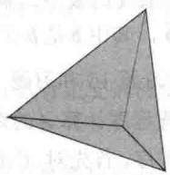
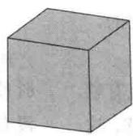
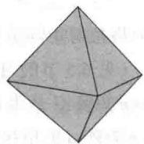
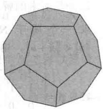
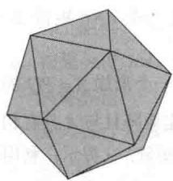

import Guide from '@/components/Guide.astro';
import Knowledge from '@/components/Knowledge.astro';
import Example from '@/components/Example.astro';
import Analysis from '@/components/Analysis.astro';
import Solution from '@/components/Solution.astro';
import Variant from '@/components/Variant.astro';
import Note from '@/components/Note.astro';
import Block from '@/components/Block.astro';
import Method from '@/components/Method.astro';
import Exercise from '@/components/Exercise.astro';

在公元前 387 年的雅典城，希腊哲学家柏拉图创建了世界上第一所大学。课程涉及天文学、生物学、政治学理论和哲学。这些学科中最受柏拉图重视的是几何学，这一事实可以从学院门上写的一句话得到验证，这句话是这样写的：“不要让不懂几何的人进入我的门。”

希腊人被几何形状深深地吸引了，如正多面体。如果一个多面体的面都是全等的正多边形，并且所有顶点处的角都是相等的，那么称这样的多面体为正多面体。在早于柏拉图的100年前，毕达哥拉斯知道至少三种正多面体：四面体（4个三角面）、立方体（6个方形面）和八面体（8个三角面）（见图8-1）。只有5种这样的多面体自然地出现在常见的矿物晶体中，另外两种多面体是十二面体（12个五角面）和二十面体（20个三角面）。

  
图 8-1

柏拉图在他的《蒂迈欧篇》（Timaeus）对话中讨论了这五种多面体的基础理论，从此，这些多面体就带有了他的名字：柏拉图多面体.

从那以后的几个世纪都无须想象超过三维的几何对象。但如今，数学家经常处理四维、五维甚至数百维向量空间中的对象。在高维空间中，我们对这些对象的几何性质却未必清楚。

例如，对于直线在二维空间中所具有的性质和平面在三维空间中所具有的性质，何种性质会在更高维的空间中有用？如何刻画这些对象？8.1节和8.4节给出了一些回答。8.4节中的超平面对理解线性规划问题在高维空间中的特性是十分重要的。

在高于三维的空间中，多面体看起来是什么样的？部分答案可以通过对四维对象做二维投影得到，这与三维对象在二维中的投影相似。8.5节给出了四维“立方体”和四维“单纯形”的概念。

高维几何理论的学习不仅提供了观察抽象的代数概念的新方法，而且提供了可应用于 $\mathbb{R}^3$ 的新工具。比如，8.2节和8.6节包含了在计算机图形方面的应用，8.5节叙述了 $\mathbb{R}^3$ 中只存在5种正多面体的证明思路（习题22）。

>>>

前几章中大多数的应用均涉及子空间的代数运算和向量的线性组合。这一章研究的是那些被视为几何体的向量集合，如直线段、多边形和实体对象。独立的向量被看作点。这里介绍的概念在计算机图形学、线性规划（第9章）和其他数学领域都很有用 ① 。

纵观整个章节，向量的集合被描述为线性组合，但在组合权值上给了一些限制。比如，在8.1节，权值的和是1，而在8.2节，权值都是正的，且和是1。概念的可视化当然是在 $\mathbb{R}^2$ 或 $\mathbb{R}^3$ 中实现，但这些概念也应用到 $\mathbb{R}^n$ 和其他向量空间中。
