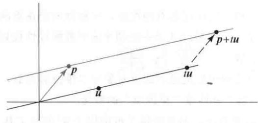
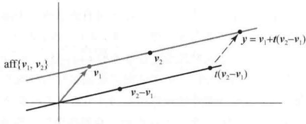
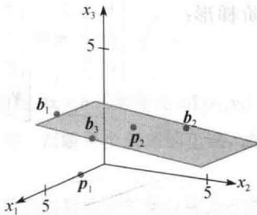
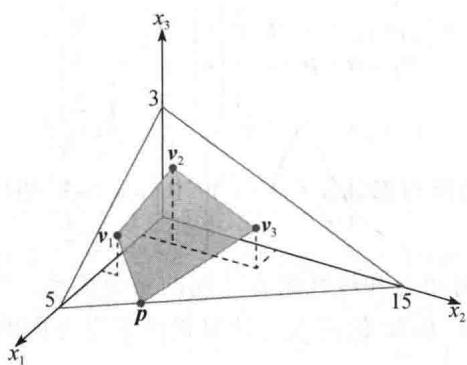
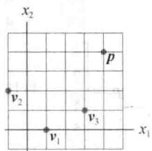

import Knowledge from '@/components/Knowledge.astro';
import Example from '@/components/Example.astro';
import Note from '@/components/Note.astro';
import Solution from '@/components/Solution.astro';
import Block from '@/components/Block.astro';

一个向量的仿射组合是线性组合的一种特殊形式. 给定 $R^{n}$ 中向量（或“点”） $v_{1}, v_{2}, \cdots, v_{p}$ 和标量 $c_{1}, \cdots, c_{p}$ ， $v_{1}, v_{2}, \cdots, v_{p}$ 的一个仿射组合是线性组合

$$

c _ {1} \boldsymbol {v} _ {1} + \dots + c _ {p} \boldsymbol {v} _ {p}

$$

其权值满足 $c_{1}+\cdots+c_{p}=1$ .

定义 集合 S 中点的所有仿射组合的集合称为 S 的仿射包（或仿射生成集），记为 aff S.

一个单点 $v_{1}$ 的仿射包是集合 $\{v_{1}\}$ ，因为它有 $c_{1}v_{1}$ 的形式，其中 $c_{1}=1$ 。两个不同点的仿射包通常被写成一种特殊的形式。假设 $y=c_{1}v_{1}+c_{2}v_{2}$ ， $c_{1}+c_{2}=1$ 。用 t 代替 $c_{2}$ ，从而 $c_{1}=1-c_{2}=1-t$ 。则 $\{v_{1},v_{2}\}$ 的仿射包是集合

$$

\boldsymbol {y} = (1 - t) \boldsymbol {v} _ {1} + t \boldsymbol {v} _ {2}, \quad t \in \mathbb {R}\tag{1}

$$

这个点集包括 $v_{1}$ （当 t=0 时）和 $v_{2}$ （当 t=1 时）。如果 $v_{2}=v_{1}$ ，那么（1）描述了一个点；否则，（1）描述了穿过 $v_{1}$ 和 $v_{2}$ 的直线。为了研究这一内容，把（1）重写为

$$

\boldsymbol {y} = \boldsymbol {v} _ {1} + t (\boldsymbol {v} _ {2} - \boldsymbol {v} _ {1}) = \boldsymbol {p} + t \boldsymbol {u}, \quad t \in \mathbb {R}

$$

其中 p 是 $v_{1}$ ，u 是 $v_{2}-v_{1}$ 。u 的所有倍数的集合是 Span $\{u\}$ ，是穿过 u 和原点的直线。把 p 加到这条直线上的每个点，相当于把穿过 u 和原点的直线平移得到一条穿过 p 并与穿过 u 和原点的直线平行的直线，见图 8-2。（比较这个图与 1.5 节中的图 1-25。）

图 8-3 用了原始点 $v_{1}$ 和 $v_{2}$ ，并显示了 aff $\{v_{1}, v_{2}\}$ 是穿过 $v_{1}$ 和 $v_{2}$ 的直线.

  

图 8-2

  

图 8-3

<Note>
图8-3中点 $\pmb{y}$ 是 $\pmb{v}_1$ 和 $\pmb{v}_2$ 的一个仿射组合，而点 $y - v_{1}$ 等于 $t(\pmb{v}_2 - \pmb{v}_1)$ ，它是 $\pmb{v}_2 - \pmb{v}_1$ 的一个线性组合（事实上，是倍乘）。 $y$ 和 $y - v_{1}$ 的这种关系对点的任何仿射组合均成立，如下面定理所述。
</Note>

<Knowledge title="定理 1">
$R^{n}$ 中一个点 y 是 $R^{n}$ 中 $v_{1},\cdots,v_{p}$ 的一个仿射组合，当且仅当 $y-v_{1}$ 是平移点 $v_{2}-v_{1},\cdots,v_{p}-v_{1}$ 的线性组合.

<Solution title="证明">
如果 $y-v_{1}$ 是 $v_{2}-v_{1},\cdots,v_{p}-v_{1}$ 的一个线性组合，存在权值 $c_{2},\cdots,c_{p}$ 使得

$$

\boldsymbol {y} - \boldsymbol {v} _ {1} = c _ {2} (\boldsymbol {v} _ {2} - \boldsymbol {v} _ {1}) + \dots + c _ {p} (\boldsymbol {v} _ {p} - \boldsymbol {v} _ {1})\tag{2}

$$

那么

$$

\boldsymbol {y} = \left(1 - c _ {2} - \dots - c _ {p}\right) \boldsymbol {v} _ {1} + c _ {2} \boldsymbol {v} _ {2} + \dots + c _ {p} \boldsymbol {v} _ {p}\tag{3}

$$

并且这个线性组合中的权值之和是1. 因此，y 是 $v_{1}, \cdots, v_{p}$ 的一个仿射组合. 相反，假定

$$

\boldsymbol {y} = c _ {1} \boldsymbol {v} _ {1} + c _ {2} \boldsymbol {v} _ {2} + \dots + c _ {p} \boldsymbol {v} _ {p}\tag{4}

$$

其中 $c_{1}+\cdots+c_{p}=1$ 。由于 $c_{1}=1-c_{2}-\cdots-c_{p}$ ，因此方程（4）可写成（3）的形式，并可导出（2），这就证明了 $y-v_{1}$ 是 $v_{2}-v_{1},\cdots,v_{p}-v_{1}$ 的一个线性组合。

在定理1的叙述中，点 $v_{1}$ 可以被 $v_{1},\cdots,v_{p}$ 中任何其他的点所取代。只要改变证明中的记号就行了。
</Solution>
</Knowledge>

<Example title="例 1">
令 $\pmb{v}_{1} = \begin{bmatrix} 1 \\ 2 \end{bmatrix}, \pmb{v}_{2} = \begin{bmatrix} 2 \\ 5 \end{bmatrix}, \pmb{v}_{3} = \begin{bmatrix} 1 \\ 3 \end{bmatrix}, \pmb{v}_{4} = \begin{bmatrix} -2 \\ 2 \end{bmatrix}, \pmb{y} = \begin{bmatrix} 4 \\ 1 \end{bmatrix}$ . 如果可能，把 $y$ 写成 $\pmb{v}_{1}, \pmb{v}_{2}, \pmb{v}_{3}, \pmb{v}_{4}$ 的仿射组合.

<Solution title="解">
计算平移点

$$

\boldsymbol {v} _ {2} - \boldsymbol {v} _ {1} = \left[ \begin{array}{l} 1 \\ 3 \end{array} \right], \quad \boldsymbol {v} _ {3} - \boldsymbol {v} _ {1} = \left[ \begin{array}{l} 0 \\ 1 \end{array} \right], \quad \boldsymbol {v} _ {4} - \boldsymbol {v} _ {1} = \left[ \begin{array}{c} - 3 \\ 0 \end{array} \right], \quad \boldsymbol {y} - \boldsymbol {v} _ {1} = \left[ \begin{array}{l} 3 \\ - 1 \end{array} \right]

$$

为求出标量 $c_{2}, c_{3}, c_{4}$ ，使得

$$

c _ {2} \left(\boldsymbol {v} _ {2} - \boldsymbol {v} _ {1}\right) + c _ {3} \left(\boldsymbol {v} _ {3} - \boldsymbol {v} _ {1}\right) + c _ {4} \left(\boldsymbol {v} _ {4} - \boldsymbol {v} _ {1}\right) = \boldsymbol {y} - \boldsymbol {v} _ {1}\tag{5}

$$

行化简增广矩阵得

$$

\left[ \begin{array}{c c c c} 1 & 0 & - 3 & 3 \\ 3 & 1 & 0 & - 1 \end{array} \right] \sim \left[ \begin{array}{c c c c} 1 & 0 & - 3 & 3 \\ 0 & 1 & 9 & - 1 0 \end{array} \right]

$$

这表明（5）是相容的，并且通解是 $c_{2} = 3c_{4} + 3, c_{3} = -9c_{4} - 10$ ， $c_{4}$ 是自由变量.当 $c_{4} = 0$ 时，

$$

\boldsymbol {y} - \boldsymbol {v} _ {1} = 3 (\boldsymbol {v} _ {2} - \boldsymbol {v} _ {1}) - 1 0 (\boldsymbol {v} _ {3} - \boldsymbol {v} _ {1}) + 0 (\boldsymbol {v} _ {4} - \boldsymbol {v} _ {1})

$$

即

$$

\boldsymbol {y} = 8 \boldsymbol {v} _ {1} + 3 \boldsymbol {v} _ {2} - 1 0 \boldsymbol {v} _ {3}

$$

如另选 $c_{4} = 1$ ，则 $c_{2} = 6$ 和 $c_{3} = -19$ ，因此，

$$

\mathbf {y} - \mathbf {v} _ {1} = 6 (\mathbf {v} _ {2} - \mathbf {v} _ {1}) - 1 9 (\mathbf {v} _ {3} - \mathbf {v} _ {1}) + 1 (\mathbf {v} _ {4} - \mathbf {v} _ {1})

$$

即

$$

\boldsymbol {y} = 1 3 \boldsymbol {v} _ {1} + 6 \boldsymbol {v} _ {2} - 1 9 \boldsymbol {v} _ {3} + \boldsymbol {v} _ {4}

$$

虽然例1中的步骤对 $\mathbb{R}^n$ 中任意点 $v_{1}, v_{2}, \cdots, v_{p}$ 都适用，但如果选择的点 $v_{i}$ 是 $\mathbb{R}^n$ 中的一个基就更容易一些了。例如，令 $\mathcal{B} = \{b_{1}, \cdots, b_{n}\}$ 是一个基。则 $\mathbb{R}^n$ 中任意 $y$ 是 $b_{1}, \cdots, b_{n}$ 的唯一的线性组合。当且仅当权值之和是1时，这个线性组合是这些 $b_{i}$ 的一个仿射组合。（组合的权值正好是 $y$ 在基 $\mathcal{B}$ 下的坐标，如4.4节。）
</Solution>
</Example>

<Example title="例 2">
令 $\pmb{b}_1 = \begin{bmatrix} 4 \\ 0 \\ 3 \end{bmatrix}, \pmb{b}_2 = \begin{bmatrix} 0 \\ 4 \\ 2 \end{bmatrix}, \pmb{b}_3 = \begin{bmatrix} 5 \\ 2 \\ 4 \end{bmatrix}, \pmb{p}_1 = \begin{bmatrix} 2 \\ 0 \\ 0 \end{bmatrix}, \pmb{p}_2 = \begin{bmatrix} 1 \\ 2 \\ 2 \end{bmatrix}$ . 集合 $\mathcal{B} = \{\pmb{b}_1, \pmb{b}_2, \pmb{b}_3\}$ 是 $\mathbb{R}^3$ 的一个基. 判断点 $\pmb{p}_1$ 和 $\pmb{p}_2$ 是否是 $\mathcal{B}$ 中点的仿射组合.

<Solution title="解">
求 $p_{1}$ 和 $p_{2}$ 的 B 坐标. 这两个计算可以通过对矩阵 $\left[b_{1}\quad b_{2}\quad b_{3}\quad p_{1}\quad p_{2}\right]$ 进行行化简实现，带有两个增广列：

$$

\left[ \begin{array}{c c c c c} 4 & 0 & 5 & 2 & 1 \\ 0 & 4 & 2 & 0 & 2 \\ 3 & 2 & 4 & 0 & 2 \end{array} \right] \sim \left[ \begin{array}{c c c c c} 1 & 0 & 0 & - 2 & \frac {2}{3} \\ 0 & 1 & 0 & - 1 & \frac {2}{3} \\ 0 & 0 & 1 & 2 & - \frac {1}{3} \end{array} \right]

$$

取第 4 列得到 $p_{1}$ ，取第 5 列得到 $p_{2}$ ：

$$

\boldsymbol {p} _ {1} = - 2 \boldsymbol {b} _ {1} - \boldsymbol {b} _ {2} + 2 \boldsymbol {b} _ {3}, \quad \boldsymbol {p} _ {2} = \frac {2}{3} \boldsymbol {b} _ {1} + \frac {2}{3} \boldsymbol {b} _ {2} - \frac {1}{3} \boldsymbol {b} _ {3}

$$

$p_{1}$ 中线性组合的权值之和是-1，不是1．因此， $p_{1}$ 不是各 $b_{i}$ 的一个仿射组合．然而，由于 $p_{2}$ 中权值之和是1，所以 $p_{2}$ 是各 $b_{i}$ 的一个仿射组合.

定义 如果对任意实数 $t$ ，由 $\pmb{p}, \pmb{q} \in S$ 得出 $(1 - t)\pmb{p} + t\pmb{q} \in S$ ，则集合 $S$ 是仿射的。

几何学上，如果两个点在集合中，则过这些点的直线在集合中，从而集合是仿射的。（如果 $S$ 只包含一个点 $\pmb{p}$ ，则通过 $\pmb{p}$ 的直线和 $\pmb{p}$ 只是一个点，一条“退化”的直线。）代数学上，若一个集合 $S$ 是仿射的，则需要 $S$ 中两点的每个仿射组合都属于 $S$ 。显然，这个定义和 $S$ 包含 $S$ 中任意数量的点的仿射组合是等价的。
</Solution>
</Example>

<Knowledge title="定理 2">
当且仅当 $S$ 中点的每一个仿射组合都属于 $S$ ，集合 $S$ 是仿射的．即当且仅当 $S = \mathrm{aff}S$ ， $S$ 是仿射的.
</Knowledge>

<Note>
参见第3章定理5前面关于数学归纳法的注释.
</Note>

<Solution title="证明">
假定 S 是仿射的，并对仿射组合中 S 的点的数目 m 使用归纳法。当 m 是 1 或 2 时，由仿射集合的定义，S 中 m 个点的仿射组合属于 S。现在，假设 S 中 k 个点或少于 k 个点的每一个仿射组合属于 S，考虑 $k+1$ 个点的组合。对 $i=1,\cdots,k+1$ ，取 S 中 $v_{i}$ ，并令 $y=c_{1}v_{1}+\cdots+c_{k}v_{k}+c_{k+1}v_{k+1}$ ，其中 $c_{1}+\cdots+c_{k+1}=1$ 。由于所有 $c_{i}$ 的和是 1，因此它们中至少有一个不等于 1。如果需要，对 $v_{i}$ 和 $c_{i}$ 重新标记，我们可以假定 $c_{k+1}\neq1$ 。令 $t=c_{1}+\cdots+c_{k}$ ，则 $t=1-c_{k+1}\neq0$ ，并且

$$

\mathbf {y} = (1 - c _ {k + 1}) \left(\frac {c _ {1}}{t} \mathbf {v} _ {1} + \dots + \frac {c _ {k}}{t} \mathbf {v} _ {k}\right) + c _ {k + 1} \mathbf {v} _ {k + 1}\tag{6}

$$

由归纳假设，由于系数和是1，故点 $z=(c_{1}/t)\nu_{1}+\cdots+(c_{k}/t)\nu_{k}$ 属于S．从而（6）显示了y作为S中两点的一个仿射组合是属于S的．由数学归纳法，这些点的每一个仿射组合属于S，即aff $S\subset S$ ．但反过来， $S\subset\operatorname{aff}S$ 总是成立的．因此，当S为仿射时，S=affS．相反，如果S=affS，则S中两点（或更多点）的仿射组合属于S，从而S是仿射的.

下面的定义提供了仿射集合的术语，它强调了其与 $\mathbb{R}^n$ 子空间的密切关系.

定义 $\mathbb{R}^n$ 中一个集合 $S$ 被向量 $\pmb{p}$ 平移后得到集合 $S + \pmb{p} = \{\pmb{s} + \pmb{p}:\pmb {s}\in S\} ^{\ominus}$ . $\mathbb{R}^n$ 中一个平面是 $\mathbb{R}^n$ 子空间的一个平移. 如果一个平面是另一个平面的平移, 则两个平面是平行的. 一个平面的维数是对应的平行子空间的维数. 一个集合 $S$ 的维数记为 $\dim S$ ，是包含 $S$ 的最小平面的维数. $\mathbb{R}^n$ 中一条直线是维数为1的平面， $\mathbb{R}^n$ 中一个超平面是维数为 $n - 1$ 的平面.

在 $\mathbb{R}^3$ 中，真子空间包含了原点0、穿过原点0的所有直线的集合和穿过原点0的所有平面的集合.因此， $\mathbb{R}^3$ 中的真子平面是点（零维）、直线（一维）和平面（二维），它们可能穿过原点，也可能不穿过原点.

下一个定理表明 $\mathbb{R}^3$ 中这些直线和平面的几何描述正好与前面代数描述中两个或三个点的仿射组合集合是一致的.
</Solution>

<Knowledge title="定理 3">
当且仅当 S 是一个平面时，一个非空集合 S 是仿射.的.
</Knowledge>

<Note>
注意本证明中的关键点．例如，第一部分假设 S 是仿射的，从而证明 S 是一个平面．由定义，一个平面是一个子空间的平移．通过选取 S 中的 p 和定义 $W = S + (-p)$ ，集合 S 被平移到原点且 $S = W + p$ ．剩下的是证明 W 是一个子空间，为此 S 将是一个子空间的平移，因此是一个平面．
</Note>

<Solution title="证明">
假定 $S$ 是仿射的，令 $\pmb{p}$ 是 $S$ 中任意固定点， $W = S + (-\pmb{p})$ ，从而 $S = W + \pmb{p}$ 。为了证明 $S$ 是一个平面，只需证明 $W$ 是 $\mathbb{R}^n$ 的一个子空间。由于 $\pmb{p}$ 在 $S$ 中，因此零向量在 $W$ 中。为了证明 $W$ 对向量的加法和标量乘法运算封闭，只需证明如果 $\pmb{u}_1$ 和 $\pmb{u}_2$ 是 $W$ 中的元素，那么对每一个实数 $t$ ， $\pmb{u}_1 + t\pmb{u}_2$ 属于 $W$ 。由于 $\pmb{u}_1$ 和 $\pmb{u}_2$ 属于 $W$ ，因此存在 $S$ 中的 $\pmb{s}_1$ 和 $\pmb{s}_2$ ，使得 $\pmb{u}_1 = \pmb{s}_1 - \pmb{p}$ 和 $\pmb{u}_2 = \pmb{s}_2 - \pmb{p}$ 。因此，对每一个实数 $t$ ，

$$

\boldsymbol {u} _ {1} + t \boldsymbol {u} _ {2} = (\boldsymbol {s} _ {1} - \boldsymbol {p}) + t (\boldsymbol {s} _ {2} - \boldsymbol {p}) = (1 - t) \boldsymbol {s} _ {1} + t (\boldsymbol {s} _ {1} + \boldsymbol {s} _ {2} - \boldsymbol {p}) - \boldsymbol {p}

$$

令 $y = s_{1} + s_{2} - p$ ，则 y 是 S 中点的一个仿射组合。由于 S 是仿射的，因此 y 在 S 中（由定理 2）。但 $(1 - t)s_{1} + ty$ 也在 S 中，所以 $u_{1} + tu_{2}$ 在 $-p + S = W$ 中。这就表明 W 是 $R^{n}$ 的一个子空间。从而由 $S = W + p$ ，S 是一个平面。

相反，假定 $S$ 是一个平面，即对某些 $\pmb{p} \in \mathbb{R}^n$ 和子空间 $W$ ，有 $S = W + p$ 。为了证明 $S$ 是仿射的，只需证明对 $S$ 中每一对 $s_1$ 和 $s_2$ ，穿过 $s_1$ 和 $s_2$ 的直线属于 $S$ 。由 $W$ 的定义，存在 $W$ 中 $\pmb{u}_1$ 和 $\pmb{u}_2$ 使得 $s_1 = \pmb{u}_1 + \pmb{p}$ 和 $s_2 = \pmb{u}_2 + \pmb{p}$ 。所以，对每一个实数 $t$ ，

$$

(1 - t) \mathbf {s} _ {1} + t \mathbf {s} _ {2} = (1 - t) (\mathbf {u} _ {1} + \mathbf {p}) + t (\mathbf {u} _ {2} + \mathbf {p}) = (1 - t) \mathbf {u} _ {1} + t \mathbf {u} _ {2} + \mathbf {p}

$$

由于 W 是一个子空间，因此 $(1-t)\boldsymbol{u}_{1}+t\boldsymbol{u}_{2}\in W$ ，从而 $(1-t)\boldsymbol{s}_{1}+ts_{2}\in W+\boldsymbol{p}=S$ 。因此，S 是仿射的。

定理3给出了一个集合的仿射包的几何解释：由一个集合中的点的所有仿射组合构成的点集是平面．比如，图8-4显示了例2中研究的点．虽然所有 $\pmb{b}_1,\pmb{b}_2$ 和 $\pmb{b}_3$ 的线性组合的集合是 $\mathbb{R}^3$ 但所有仿射组合的集合只是穿过 $b_{1},b_{2}$ 和 $b_{3}$ 的平面．注意 $\pmb{p}_{2}$ （由例2）在穿过 $\pmb{b}_1,\pmb{b}_2$ 和 $\pmb{b}_3$ 的平面中，而 $\pmb{p}_{1}$ 不在这个平面中．也可参见习题14.

下一个例题从新颖的角度来观察一个熟悉的集合——方程组 Ax=b 的所有解的集合.
</Solution>

<Example title="例 3">
假定一个方程 Ax=b 的解都是 $x=x_{3}u+p$ 的形式，其中 $u=\begin{bmatrix}2\\ -3\\ 1\end{bmatrix}$ 和 $p=\begin{bmatrix}4\\ 0\\ -3\end{bmatrix}$ . 回忆 1.5 节，这个集合平行于 Ax=0 的解集，该解集由形如 $x_{3}u$ 的点组成. 求点 $v_{1}$ 和 $v_{2}$ 使得 Ax=b 的解集是 aff $\{v_{1}, v_{2}\}$ .

  

图 8-4

<Solution title="解">
解集是沿着 $\pmb{u}$ 的方向穿过 $\pmb{p}$ 的直线，如图8-2所示．由于 $\operatorname {aff}\{\nu_1,\nu_2\}$ 是穿过 $\nu_{1}$ 和 $\nu_{2}$ 的直线，因此确定直线 $x = x_{3}u + p$ 上的两个点．当 $x_{3} = 0$ 和 $x_{3} = 1$ 时，可得两种简单的情况．即选择 $\pmb {v}_{1} = \pmb{p}$ 和 $\pmb {v}_2 = \pmb {u} + \pmb{p}$ ，从而

$$

\boldsymbol {v} _ {2} = \boldsymbol {u} + \boldsymbol {p} = \left[ \begin{array}{c} 2 \\ - 3 \\ 1 \end{array} \right] + \left[ \begin{array}{c} 4 \\ 0 \\ - 3 \end{array} \right] = \left[ \begin{array}{c} 6 \\ - 3 \\ - 2 \end{array} \right]

$$

在这种情况下，解集被描述为所有形如 $\boldsymbol{x}=(1-x_{3})\begin{bmatrix}4\\ 0\\ -3\end{bmatrix}+x_{3}\begin{bmatrix}6\\ -3\\ -2\end{bmatrix}$ 的仿射组合的集合.

前面的定理1描述了仿射组合和线性组合之间的重要关系. 下面的定理将提供另一个关于仿射组合的研究视角，其中 $\mathbb{R}^2$ 和 $\mathbb{R}^3$ 的情况与计算机图形学方面的应用密切相关，这将在下节中讨论（还有2.7节）.

定义 对 $\mathbb{R}^n$ 中的 $\pmb{\nu}$ ， $\pmb{\nu}$ 的标准齐次形式是 $\mathbb{R}^{n+1}$ 中的点 $\tilde{\pmb{\nu}} = \begin{bmatrix} \pmb{\nu} \\ 1 \end{bmatrix}$ .
</Solution>
</Example>

<Knowledge title="定理 4">
$R^{n}$ 中的一个点 y 是 $R^{n}$ 中 $v_{1},\cdots,v_{p}$ 的一个仿射组合当且仅当 y 的齐次形式在 Span $\{\tilde{v}_{1},\cdots,\tilde{v}_{p}\}$ 中，即 $y=c_{1}v_{1}+\cdots+c_{p}v_{p}$ 且 $c_{1}+\cdots+c_{p}=1$ ，当且仅当 $\tilde{y}=c_{1}\tilde{v}_{1}+\cdots+c_{p}\tilde{v}_{p}$ .

<Solution title="证明">
点 y 在 aff $\{v_{1},\cdots,v_{p}\}$ 中当且仅当存在权值 $c_{1},\cdots,c_{p}$ ，使得

$$

\left[ \begin{array}{l} \boldsymbol {y} \\ 1 \end{array} \right] = c _ {1} \left[ \begin{array}{l} \boldsymbol {v} _ {1} \\ 1 \end{array} \right] + c _ {2} \left[ \begin{array}{l} \boldsymbol {v} _ {2} \\ 1 \end{array} \right] + \dots + c _ {p} \left[ \begin{array}{l} \boldsymbol {v} _ {p} \\ 1 \end{array} \right]

$$

这种情况发生当且仅当 $\tilde{y}$ 在 Span $\{\tilde{v}_{1},\tilde{v}_{2},\cdots,\tilde{v}_{p}\}$ 中. 定理得到了证明.
</Solution>
</Knowledge>

<Example title="例 4">
令 $\pmb{v}_{1} = \begin{bmatrix} 3 \\ 1 \\ 1 \end{bmatrix}, \pmb{v}_{2} = \begin{bmatrix} 1 \\ 2 \\ 2 \end{bmatrix}, \pmb{v}_{3} = \begin{bmatrix} 1 \\ 7 \\ 1 \end{bmatrix}, \pmb{p} = \begin{bmatrix} 4 \\ 3 \\ 0 \end{bmatrix}$ . 如果可能，用定理4把 $p = \begin{bmatrix} 4 \\ 3 \\ 0 \end{bmatrix}$ 写成 $\pmb{v}_{1}, \pmb{v}_{2}, \pmb{v}_{3}$ 的仿射组合.

<Solution title="解">
对下面方程的增广矩阵进行行化简：

$$

x _ {1} \tilde {\boldsymbol {v}} _ {1} + x _ {2} \tilde {\boldsymbol {v}} _ {2} + x _ {3} \tilde {\boldsymbol {v}} _ {3} = \tilde {\boldsymbol {p}}

$$

为了简化算法，把由1组成的第四行移到第一行（等价于做三个行对换），然后把矩阵化为简化阶梯形：

$$

\left[ \begin{array}{l l l l} \tilde {\boldsymbol {v}} _ {1} & \tilde {\boldsymbol {v}} _ {2} & \tilde {\boldsymbol {v}} _ {3} & \tilde {\boldsymbol {p}} \end{array} \right] \sim \left[ \begin{array}{l l l l} 1 & 1 & 1 & 1 \\ 3 & 1 & 1 & 4 \\ 1 & 2 & 7 & 3 \\ 1 & 2 & 1 & 0 \end{array} \right] \sim \left[ \begin{array}{r r r r} 1 & 1 & 1 & 1 \\ 0 & - 2 & - 2 & 1 \\ 0 & 1 & 6 & 2 \\ 0 & 1 & 0 & - 1 \end{array} \right]

$$

$$

\sim \dots \sim \left[ \begin{array}{c c c c} 1 & 0 & 0 & 1. 5 \\ 0 & 1 & 0 & - 1 \\ 0 & 0 & 1 & 0. 5 \\ 0 & 0 & 0 & 0 \end{array} \right]

$$

由定理 4， $1.5v_{1}-v_{2}+0.5v_{3}=p$ ，见图 8-5，图中显示了含有 $v_{1}, v_{2}, v_{3}$ 和 p（以及坐标轴上的点）的平面.

  

图 8-5
</Solution>
</Example>

<Block title="练习题">

画出点 $v_{1}=\begin{bmatrix}1\\ 0\end{bmatrix},v_{2}=\begin{bmatrix}-1\\ 2\end{bmatrix},v_{3}=\begin{bmatrix}3\\ 1\end{bmatrix},p=\begin{bmatrix}4\\ 3\end{bmatrix}$ 的图形，并解释为什么 p 必是 $v_{1},v_{2},v_{3}$ 的仿射组合。然后求出 p 的仿射组合。（提示：aff $\{v_{1},v_{2},v_{3}\}$ 的维数是什么？）

</Block>

<Block title="习题8.1">

在习题 1\~4 中，如果可能，把 y 写成其他点的仿射组合.

1. $v_{1}=\begin{bmatrix}1\\ 2\end{bmatrix},v_{2}=\begin{bmatrix}-2\\ 2\end{bmatrix},v_{3}=\begin{bmatrix}0\\ 4\end{bmatrix},v_{4}=\begin{bmatrix}3\\ 7\end{bmatrix},y=\begin{bmatrix}5\\ 3\end{bmatrix}$

2. $v_{1}=\begin{bmatrix}1\\ 1\end{bmatrix},v_{2}=\begin{bmatrix}-1\\ 2\end{bmatrix},v_{3}=\begin{bmatrix}3\\ 2\end{bmatrix},y=\begin{bmatrix}5\\ 7\end{bmatrix}$

$$

\boldsymbol {v} _ {1} = \left[ \begin{array}{c} - 3 \\ 1 \\ 1 \end{array} \right], \boldsymbol {v} _ {2} = \left[ \begin{array}{c} 0 \\ 4 \\ - 2 \end{array} \right], \boldsymbol {v} _ {3} = \left[ \begin{array}{c} 4 \\ - 2 \\ 6 \end{array} \right], \boldsymbol {y} = \left[ \begin{array}{c} 1 7 \\ 1 \\ 5 \end{array} \right]

$$

$$

\boldsymbol {v} _ {1} = \left[ \begin{array}{l} 1 \\ 2 \\ 0 \end{array} \right], \boldsymbol {v} _ {2} = \left[ \begin{array}{c} 2 \\ - 6 \\ 7 \end{array} \right], \boldsymbol {v} _ {3} = \left[ \begin{array}{l} 4 \\ 3 \\ 1 \end{array} \right], \boldsymbol {y} = \left[ \begin{array}{c} - 3 \\ 4 \\ - 4 \end{array} \right]

$$

在习题 5 和 6 中，令 $b_{1}=\begin{bmatrix}2\\ 1\\ 1\end{bmatrix}, b_{2}=\begin{bmatrix}1\\ 0\\ -2\end{bmatrix}$ ， $b_{3}=\begin{bmatrix}2\\ -5\\ 1\end{bmatrix},\quad S=\{b_{1},b_{2},b_{3}\}$ ，注意S是 $R^{3}$ 的一个正交基。如果可能，把给定点写成集合S中点的仿射组合。（提示：使用6.2节的定理5而不是行化简来求权值。）

5. a. $p_{1}=\begin{bmatrix}3\\ 8\\ 4\end{bmatrix}$ b. $p_{2}=\begin{bmatrix}6\\ -3\\ 3\end{bmatrix}$ c. $p_{3}=\begin{bmatrix}0\\ -1\\ -5\end{bmatrix}$ 6. a. $p_{1}=\begin{bmatrix}0\\ -19\\ -5\end{bmatrix}$ b. $p_{2}=\begin{bmatrix}1.5\\ -1.3\\ -0.5\end{bmatrix}$ c. $p_{3}=\begin{bmatrix}5\\ -4\\ 0\end{bmatrix}$

7. 令 $\pmb{v}_{1} = \begin{bmatrix} 1 \\ 0 \\ 3 \\ 0 \end{bmatrix}, \pmb{v}_{2} = \begin{bmatrix} 2 \\ -1 \\ 0 \\ 4 \end{bmatrix}, \pmb{v}_{3} = \begin{bmatrix} -1 \\ 2 \\ 1 \\ 1 \end{bmatrix}, \quad \pmb{p}_{1} = \begin{bmatrix} 5 \\ -3 \\ 5 \\ 3 \end{bmatrix}, \pmb{p}_{2} = \begin{bmatrix} -9 \\ 10 \\ 9 \\ -13 \end{bmatrix}$ ,

$p_{3}=\begin{bmatrix}4\\ 2\\ 8\\ 5\end{bmatrix}$ ，并且 $S=\{\pmb{v}_{1},\pmb{v}_{2},\pmb{v}_{3}\}$ 。可以证明S是线

a. $p_1$ 属于Span $S$ 吗？ $p_1$ 属于aff $S$ 吗？b. $p_2$ 属于Span $S$ 吗？ $p_2$ 属于aff $S$ 吗？c. $p_3$ 属于Span $S$ 吗？ $p_3$ 属于aff $S$ 吗？

8. 根据下列已给向量仿照习题 7 重做.

$$

\boldsymbol {v} _ {1} = \left[ \begin{array}{c} 1 \\ 0 \\ 3 \\ - 2 \end{array} \right], \boldsymbol {v} _ {2} = \left[ \begin{array}{c} 2 \\ 1 \\ 6 \\ - 5 \end{array} \right], \boldsymbol {v} _ {3} = \left[ \begin{array}{c} 3 \\ 0 \\ 1 2 \\ - 6 \end{array} \right], \quad \boldsymbol {p} _ {1} = \left[ \begin{array}{c} 4 \\ - 1 \\ 1 5 \\ - 7 \end{array} \right], \boldsymbol {p} _ {2} = \left[ \begin{array}{c} - 5 \\ 3 \\ - 8 \\ 6 \end{array} \right],

$$

$$

\boldsymbol {p} _ {3} = \left[ \begin{array}{r} 1 \\ 6 \\ - 6 \\ - 8 \end{array} \right]

$$

9. 假定一个方程 $Ax = b$ 的解都是 $x = x_3u + p$ 的形式，其中 $\pmb{u} = \begin{bmatrix} 4 \\ -2 \end{bmatrix}$ 和 $\pmb{p} = \begin{bmatrix} -3 \\ 0 \end{bmatrix}$ . 求点 $\nu_1$ 和 $\nu_2$ 使得 Ax=b 的解集是 $\operatorname{aff}\{\nu_{1},\nu_{2}\}$ .

10. 假定一个方程 $Ax = b$ 的解都是 $x = x_{3}u + p$ 的形式，其中

$$

\boldsymbol {u} = \left[ \begin{array}{c} 5 \\ 1 \\ - 2 \end{array} \right]

$$

$$

\boldsymbol {p} = \left[ \begin{array}{c} 1 \\ - 3 \\ 4 \end{array} \right]

$$

求出点 $\pmb{v}_{1}$ 和 $\pmb{v}_{2}$ ，使得 $Ax = b$ 的解集是 $\operatorname{aff}\{\pmb{v}_1, \pmb{v}_2\}$

在习题 11 和 12 中，判断每个叙述的正误，并说明理由.

11. a. 集合 S 中点的所有仿射组合的集合称为 S 的仿射包.

b. 如果 $\{b_{1},\cdots,b_{k}\}$ 是 $R^{n}$ 的线性无关子集，并且 p 是 $b_{1},\cdots,b_{k}$ 的线性组合，那么 p 是 $b_{1},\cdots,b_{k}$ 的一个仿射组合.

c. 两个不同点的仿射包称为一条直线.

d. 一个平面是子空间.

e. $R^{3}$ 中一个平面是超平面.

12. a. 如果 $S = \{x\}$ ，那么 aff $S$ 是一个空集.

b. 当且仅当一个集合包含它的仿射包时，它是一个仿射集.

c. 一个一维的平面称为一条直线.

d. 一个二维的平面称为一个超平面.

e. 穿过原点的平面是子空间.

13. 假定 $\{\pmb{v}_1, \pmb{v}_2, \pmb{v}_3\}$ 是 $\mathbb{R}^3$ 的一个基．证明： $\operatorname{Span}\{\pmb{v}_2 - \pmb{v}_1, \pmb{v}_3 - \pmb{v}_1\}$ 是 $\mathbb{R}^3$ 中一个平面。（提示：当 $\operatorname{Span}\{\pmb{u}, \pmb{v}\}$ 是一个平面时，关于 $\pmb{u}$ 和 $\pmb{v}$ ，你能得出什么结论？）

14. 证明：如果 $\{\pmb{v}_1, \pmb{v}_2, \pmb{v}_3\}$ 是 $\mathbb{R}^3$ 的一个基，则 $\operatorname{aff}\{\pmb{v}_1, \pmb{v}_2, \pmb{v}_3\}$ 是穿过 $\pmb{v}_1, \pmb{v}_2$ 和 $\pmb{v}_3$ 的平面.

15. 令 A 是一个 $m \times n$ 矩阵，给定 $R^{m}$ 中 b，证明：Ax = b 的所有解的集合 S 是 $R^{n}$ 的一个仿射子集.

16. 令 $\pmb{v} \in \mathbb{R}^n$ 和 $k \in \mathbb{R}$ . 证明: $S = \{\pmb{x} \in \mathbb{R}^n : \pmb{x} \cdot \pmb{v} = k\}$ 是 $\mathbb{R}^n$ 的一个仿射子集.

17. 选择三个点的集合 $S$ ，使得 $\operatorname{aff} S$ 是 $\mathbb{R}^3$ 中的平面，它的方程是 $x_3 = 5$ 。给出证明。

18. 选择 $\mathbb{R}^3$ 中4个不同点的集合 $S$ ，使得aff $S$ 是

平面 $2x_{1} + x_{2} - 3x_{3} = 12$ 。给出证明。

19. 令 $S$ 是 $\mathbb{R}^n$ 的一个仿射子集，假定 $f: \mathbb{R}^n \to \mathbb{R}^m$ 是一个线性变换，并令 $f(S)$ 表示图形 $\{f(x): x \in S\}$ 的集合，证明： $f(S)$ 是 $\mathbb{R}^m$ 的一个仿射子集.

20. 令 $f: \mathbb{R}^n \to \mathbb{R}^m$ 是一个线性变换， $T$ 是 $\mathbb{R}^m$ 的一个仿射子集， $S = \{\pmb{x} \in \mathbb{R}^n : f(\pmb{x}) \in T\}$ 。证明： $S$ 是 $\mathbb{R}^n$ 的一个仿射子集。

在习题 21\~26 中, 证明给定的关于 $R^{n}$ 中子集 A 和 B 的陈述, 或者提供 $R^{2}$ 中所要求的例子. 证明可以用前面习题的结论（也可以用本书中已学过的定理）.

21. 如果 $A \subset B$ 且 B 是仿射的，那么 aff $A \subset B$ .

22. 如果 $A \subset B$ ，那么 $\operatorname{aff} A \subset \operatorname{aff} B$ .

23. $\left[(\mathrm{aff}A)\cup (\mathrm{aff}B)\right]\subset \mathrm{aff}(A\cup B).$ （提示：为了证明 $D\cup E\subset F$ ，可证明 $D\subset F$ 且 $E\subset F$ ）

24. 在 $\mathbb{R}^2$ 中寻找一个例子来证明习题23中的等式不成立。（提示：考虑集合 $A$ 和 $B$ ，其中每个集合仅包含一个或两个点。）

25. aff(A∩B)⊂(aff A∩aff B).

26. 在 $\mathbb{R}^2$ 中寻找一个例子来证明习题25中的等式不成立.

</Block>

<Block title="练习题答案">

由于点 $\pmb{v}_1, \pmb{v}_2$ 和 $\pmb{v}_3$ 不在同一条直线上，故 $\operatorname{aff}\{\pmb{v}_1, \pmb{v}_2, \pmb{v}_3\}$ 不是一维的。因此， $\operatorname{aff}\{\pmb{v}_1, \pmb{v}_2, \pmb{v}_3\}$ 必等于 $\mathbb{R}^2$ 。为了求出把 $p$ 表示成 $\pmb{v}_1, \pmb{v}_2$ 和 $\pmb{v}_3$ 的一个仿射组合的权值，首先计算

$$

\boldsymbol {v} _ {2} - \boldsymbol {v} _ {1} = \left[ \begin{array}{c} - 2 \\ 2 \end{array} \right], \quad \boldsymbol {v} _ {3} - \boldsymbol {v} _ {1} = \left[ \begin{array}{c} 2 \\ 1 \end{array} \right], \quad \boldsymbol {p} - \boldsymbol {v} _ {1} = \left[ \begin{array}{c} 3 \\ 3 \end{array} \right]

$$

为把 $p-v_{1}$ 写成 $v_{2}-v_{1}$ 和 $v_{3}-v_{1}$ 的线性组合，对矩阵进行行化简得到

$$

\left[ \begin{array}{c c c} - 2 & 2 & 3 \\ 2 & 1 & 3 \end{array} \right] \sim \left[ \begin{array}{c c c} 1 & 0 & \frac {1}{2} \\ 0 & 1 & 2 \end{array} \right]

$$

因此， $p - \nu_{1} = \frac{1}{2} (\nu_{2} - \nu_{1}) + 2(\nu_{3} - \nu_{1})$ ，这表明

$$

\boldsymbol {p} = (1 - \frac {1}{2} - 2) \boldsymbol {v} _ {1} + \frac {1}{2} \boldsymbol {v} _ {2} + 2 \boldsymbol {v} _ {3} = - \frac {3}{2} \boldsymbol {v} _ {1} + \frac {1}{2} \boldsymbol {v} _ {2} + 2 \boldsymbol {v} _ {3}

$$

由于系数和为1，故p可以表示成 $v_{1},v_{2},v_{3}$ 的仿射组合.

也可以用例3中的方法和行化简：

$$

\left[ \begin{array}{c c c c} \boldsymbol {v} _ {1} & \boldsymbol {v} _ {2} & \boldsymbol {v} _ {3} & \boldsymbol {p} \\ 1 & 1 & 1 & 1 \end{array} \right] \sim \left[ \begin{array}{c c c c} 1 & 1 & 1 & 1 \\ 1 & - 1 & 3 & 4 \\ 0 & 2 & 1 & 3 \end{array} \right] \sim \left[ \begin{array}{c c c c} 1 & 0 & 0 & - \frac {3}{2} \\ 0 & 1 & 0 & \frac {1}{2} \\ 0 & 0 & 1 & 2 \end{array} \right]

$$

这表明 $p = -\frac{3}{2}v_{1} + \frac{1}{2}v_{2} + 2v_{3}$

</Block>
