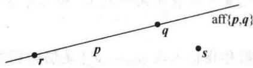
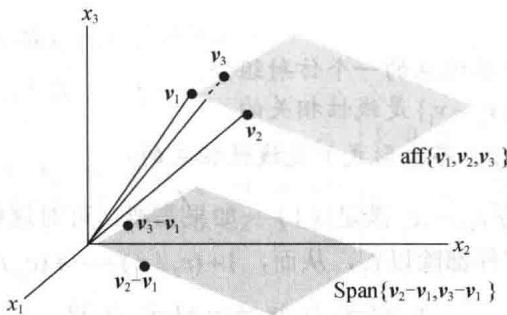
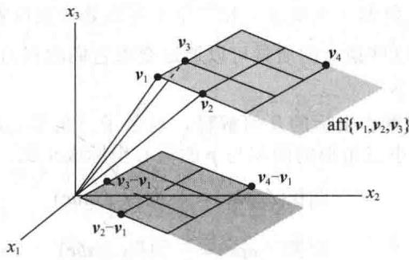
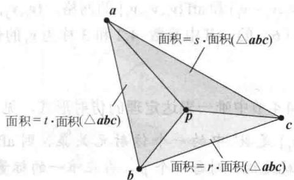
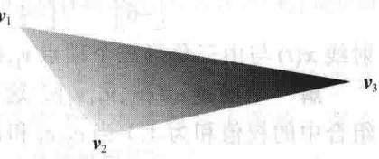
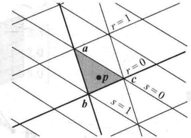
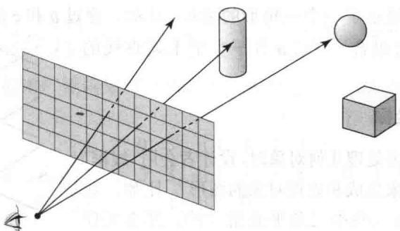
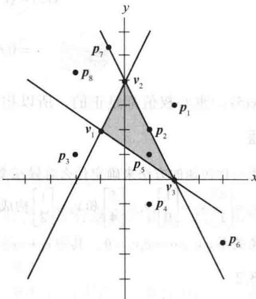

import Guide from '@/components/Guide.astro';
import Knowledge from '@/components/Knowledge.astro';
import Example from '@/components/Example.astro';
import Analysis from '@/components/Analysis.astro';
import Solution from '@/components/Solution.astro';
import Variant from '@/components/Variant.astro';
import Note from '@/components/Note.astro';
import Block from '@/components/Block.astro';
import Method from '@/components/Method.astro';
import Exercise from '@/components/Exercise.astro';

本节继续探讨线性概念和仿射概念之间的关系．考虑 $R^{3}$ 中三个向量的集合，记为 $S = \{v_{1}, v_{2}, v_{3}\}$ ．如果 S 是线性相关的，那么其中一个向量是其他两个向量的线性组合．当一个向量是其他两个向量的仿射组合时，又会怎么样呢？比如，假定对 R 中的某些 t，有

$$
\pmb {v} _ {3} = (1 - t) \pmb {v} _ {1} + t \pmb {v} _ {2}
$$

[Unreadable]

则

$$
(1 - t) \boldsymbol {v} _ {1} + t \boldsymbol {v} _ {2} - \boldsymbol {v} _ {3} = \mathbf {0}
$$

由于不是所有的权值都等于0，因此这是一个线性相关的关系。而且，线性相关关系中的权值之和为0：

$$
(1 - t) + t + (- 1) = 0
$$

这也是定义仿射相关的附加特性.

定义 设 $\{v_{1},\cdots,v_{p}\}$ 是 $R^{n}$ 中的一个指标点集（译者注：指标点集指的是集合中指标不同的元素可以表示同一点），如果存在不全为零的实数 $c_{1},\cdots,c_{p}$ ，使得

$$
c _ {1} + \dots + c _ {p} = 0, \quad c _ {1} \boldsymbol {v} _ {1} + \dots + c _ {p} \boldsymbol {v} _ {p} = \mathbf {0}\tag{1}
$$

则称指标点集 $\{v_{1},\cdots,v_{p}\}$ 是仿射相关的. 否则, 称该集合是仿射无关的.

仿射组合是线性组合的一种特殊情形，并且仿射相关是附带有一个限制条件的线性相关。因此，每一个仿射相关集都自动是线性相关的。

只有一个点（甚至是零向量）的集合 $\{\pmb{v}_1\}$ 必是仿射无关的，这是因为当只有一个系数时，所需系数 $c_{i}$ 的性质不能得到满足。事实上，对 $\{\pmb{v}_1\}$ 来说，（1）中的第一个方程正是 $c_{1} = 0$ ，另一方面又要求 $c_{1}$ 不为零。

习题13要求证明当且仅当 $\pmb{v}_{1} = \pmb{v}_{2}$ 时，指标集合 $\{\pmb{v}_1, \pmb{v}_2\}$ 是仿射相关的。下面的定理解决了一般的情形，并证明了仿射相关概念与线性相关概念的相似性。（c）和（d）给出了确定一个集合是否是仿射相关的有用方法。回忆8.1节，如果 $\pmb{v}$ 在 $\mathbb{R}^n$ 中，那么 $\mathbb{R}^{n+1}$ 中的向量 $\tilde{\nu}$ 表示 $\pmb{v}$ 的齐次形式。

<Knowledge title="定理 5">
给定 $R^{n}$ 中的一个指标集合 $S=\{v_{1},\cdots,v_{p}\}$ ， $p\geqslant2$ ，下面的叙述是逻辑等价的。也就是说，它们同真，或者同假。

a. S 是仿射相关的.

b. S 中有一个点是 S 中其他点的一个仿射组合.

c. $R^{n}$ 中集合 $\{v_{2}-v_{1},\cdots,v_{p}-v_{1}\}$ 是线性相关的.

d. $R^{n+1}$ 中集合 $\{\tilde{v}_{1},\cdots,\tilde{v}_{p}\}$ （齐次形式）是线性相关的.

<Solution title="证明">
假定（a）为真，令 $c_{1}, \cdots, c_{p}$ 满足（1）。如果需要，可对这些点重新命名，我们可以认为 $c_{1} \neq 0$ ，并将（1）中的方程都除以 $c_{1}$ ，从而， $1 + (c_{2} / c_{1}) + \cdots + (c_{p} / c_{1}) = 0$ ，并且

$$
\boldsymbol {v} _ {1} = \left(- c _ {2} / c _ {1}\right) \boldsymbol {v} _ {2} + \dots + \left(- c _ {p} / c _ {1}\right) \boldsymbol {v} _ {p}\tag{2}
$$
</Solution>
</Knowledge>

（2）中右边的系数和为1.因此由（a）得出（b）.现在，假定（b）为真，如果需要，对点重新命名，可以认为 $\pmb{v}_{1} = c_{2}\pmb{v}_{2} + \dots +c_{p}\pmb{v}_{p}$ ，其中 $c_{2} + \dots +c_{p} = 1$ .则

从而

(3)

$$
c _ {2} \left(\boldsymbol {v} _ {2} - \boldsymbol {v} _ {1}\right) + \dots + c _ {p} \left(\boldsymbol {v} _ {p} - \boldsymbol {v} _ {1}\right) = \mathbf {0}\tag{4}
$$

并不是所有的 $c_{2},\dots ,c_{p}$ 都是0，这是因为它们的和为1.因此，由（b）可得出（c）.

接下来，如果（c）为真，那么存在不全为零的权值 $c_{2},\cdots,c_{p}$ ，使得（4）成立。把（4）重写为（3）的形式，并令 $c_{1}=-(c_{2}+\cdots+c_{p})$ 。则 $c_{1}+\cdots+c_{p}=0$ 。因此，由（3）可证明（1）成立。所以由（c）得出（a），这就证明了（a）、（b）和（c）是逻辑等价的。最后，由于（1）中的两个方程等价于下面的包含S中点的齐次形式的方程，所以（d）等价于（a）：

$$
c _ {1} \left[ \begin{array}{l} \boldsymbol {v} _ {1} \\ 1 \end{array} \right] + \dots + c _ {p} \left[ \begin{array}{l} \boldsymbol {v} _ {p} \\ 1 \end{array} \right] = \left[ \begin{array}{l} \mathbf {0} \\ 0 \end{array} \right]
$$

在定理 5（c）中， $v_{1}$ 可以被 $v_{1},\cdots,v_{p}$ 中任何其他的点所取代。只需要改变证明中的标记。因此，为了检测一个集合是否是仿射相关的，可以从集合的其他点中减去一个点，并检验转化后的 p-1 个点的集是否是线性相关的。

<Example title="例 1">
两个不同点 p 和 q 的仿射包是一条直线. 如果第三个点 r 在直线上, 那么 $\{p,q,r\}$ 是一个仿射相关集. 如果一个点 s 不在穿过 p 和 q 的直线上, 那么这三点不在同一条直线上, 从而 $\{p,q,s\}$ 是仿射无关集, 见图 8-6.

<figure class="vp-figure">
  
  <figcaption>图 8-6 $\{p,q,r\}$ 是仿射相关的</figcaption>
</figure>
</Example>

<Example title="例 2">
令 $\pmb{v}_{1} = \begin{bmatrix} 1 \\ 3 \\ 7 \end{bmatrix}, \pmb{v}_{2} = \begin{bmatrix} 2 \\ 7 \\ 6.5 \end{bmatrix}, \pmb{v}_{3} = \begin{bmatrix} 0 \\ 4 \\ 7 \end{bmatrix}$ ， $S = \{\pmb{v}_{1}, \pmb{v}_{2}, \pmb{v}_{3}\}$ ，确定 $S$ 是否是仿射无关的。

<Solution title="解">
计算 $v_{2}-v_{1}=\begin{bmatrix}1\\ 4\\ -0.5\end{bmatrix}$ ， $v_{3}-v_{1}=\begin{bmatrix}-1\\ 1\\ 0\end{bmatrix}$ 。这两个点不成倍数，因此，它们构成了一个线性无关集 $S'$ 。从而定理 5 中的所有陈述都是错误的，并且 S 是仿射无关的。图 8-7 展示了 S 和平移集 $S'$ 。注意 Span $S'$ 是穿过原点的一个平面，aff S 是与之平行并通过 $v_{1}, v_{2}, v_{3}$ 的平面。（当然，这里仅显示了每个平面的一部分。）

<figure class="vp-figure">
  
  <figcaption>图 8-7 一个仿射无关集 $\{v_{1}, v_{2}, v_{3}\}$</figcaption>
</figure>
</Solution>
</Example>

<Example title="例 3">
令 $\pmb{v}_{1} = \begin{bmatrix} 1 \\ 3 \\ 7 \end{bmatrix}, \pmb{v}_{2} = \begin{bmatrix} 2 \\ 7 \\ 6.5 \end{bmatrix}, \pmb{v}_{3} = \begin{bmatrix} 0 \\ 0.4 \\ 7 \end{bmatrix}$ , $\pmb{v}_{4} = \begin{bmatrix} 0 \\ 14 \\ 6 \end{bmatrix}$ , 并令 $S = \{\pmb{v}_{1}, \dots, \pmb{v}_{4}\}$ . $S$ 是仿射相关的吗？解 计算 $\pmb{v}_{2} - \pmb{v}_{1} = \begin{bmatrix} 1 \\ 4 \\ -0.5 \end{bmatrix}, \pmb{v}_{3} - \pmb{v}_{1} = \begin{bmatrix} -1 \\ 1 \\ 0 \end{bmatrix}$ , $\pmb{v}_{4} - \pmb{v}_{1} = \begin{bmatrix} -1 \\ 11 \\ -1 \end{bmatrix}$ , 并对矩阵进行行化简：

$$
\left[ \begin{array}{c c c} 1 & - 1 & - 1 \\ 4 & 1 & 1 1 \\ - 0. 5 & 0 & - 1 \end{array} \right] \sim \left[ \begin{array}{c c c} 1 & - 1 & - 1 \\ 0 & 5 & 1 5 \\ 0 & - 0. 5 & - 1. 5 \end{array} \right] \sim \left[ \begin{array}{c c c} 1 & - 1 & - 1 \\ 0 & 5 & 1 5 \\ 0 & 0 & 0 \end{array} \right]
$$

回忆 4.6 节（或 2.8 节），由于并不是每一列都是一个主元列，因此这些列是线性相关的。所以， $v_{2}-v_{1}, v_{3}-v_{1}$ 和 $v_{4}-v_{1}$ 是线性相关的。由定理 5 中的（c）， $\{v_{1}, v_{2}, v_{3}, v_{4}\}$ 是仿射相关的。这个相关性也可以用定理 5 的（d）取代（c）而得到。

例 3 的计算表明 $v_{4}-v_{1}$ 是 $v_{2}-v_{1}$ 和 $v_{3}-v_{1}$ 的线性组合，这说明 $v_{4}-v_{1}$ 在 Span $\{v_{2}-v_{1},v_{3}-v_{1}\}$ 中。由 8.1 节定理 1， $v_{4}$ 在 aff $\{v_{1},v_{2},v_{3}\}$ 中。实际上，例 3 中矩阵进一步的行化简将表明

$$
\boldsymbol {v} _ {4} - \boldsymbol {v} _ {1} = 2 (\boldsymbol {v} _ {2} - \boldsymbol {v} _ {1}) + 3 (\boldsymbol {v} _ {3} - \boldsymbol {v} _ {1})\tag{5}
$$

$$
\pmb {\nu} _ {4} = - 4 \pmb {\nu} _ {1} + 2 \pmb {\nu} _ {2} + 3 \pmb {\nu} _ {3}\tag{6}
$$

见图 8-8.

<figure class="vp-figure">
  
  <figcaption>图8-8 $\pmb{v}_4$ 在平面 $\mathrm{aff}\{\pmb{v}_1,\pmb{v}_2,\pmb{v}_3\}$ 中</figcaption>
</figure>

图 8-8 显示了 $\mathrm{Span}(\nu_{2}-\nu_{1},\nu_{3}-\nu_{1})$ 和 $\mathrm{aff}\{\nu_{1},\nu_{2},\nu_{3}\}$ 的网格. $\{\nu_{1},\nu_{2},\nu_{3}\}$ 上的网格是基于（5）的. 另一个“坐标系统”是基于（6）的，其中系数 -4,2 和 3 称为 $\nu_{4}$ 的仿射或重心坐标.

重心坐标的定义是基于 4.4 节中唯一表达定理的仿射形式，见本节习题 17 中的证明.
</Example>

<Knowledge title="定理 6">
令 $S=\{\nu_{1},\cdots,\nu_{k}\}$ 是 $R^{n}$ 中的一个仿射无关集。则 aff S 中每一个 p 都有唯一的 $\nu_{1},\cdots,\nu_{k}$ 的仿射组合表示。也就是说，对每一个 p，存在唯一的标量集 $c_{1},\cdots,c_{k}$ ，使得

$$
\pmb {p} = c _ {1} \pmb {\nu} _ {1} + \dots + c _ {k} \pmb {\nu} _ {k}   \text {且}   c _ {1} + \dots + c _ {k} = 1\tag{7}
$$

定义 令 $S = \{\pmb{v}_1, \dots, \pmb{v}_k\}$ 是一个仿射无关集. 则对 aff $S$ 中每一个点 $\pmb{p}$ , $\pmb{p}$ 的唯一表达式 (7) 中的系数 $c_1, \dots, c_p$ 称为 $\pmb{p}$ 的重心坐标（或者称为仿射坐标）

观察（7）等价于单个方程

$$
\left[ \begin{array}{c} \boldsymbol {p} \\ 1 \end{array} \right] = c _ {1} \left[ \begin{array}{c} \boldsymbol {v} _ {1} \\ 1 \end{array} \right] + \dots + c _ {k} \left[ \begin{array}{c} \boldsymbol {v} _ {k} \\ 1 \end{array} \right]\tag{8}
$$

它包含所有点的齐次形式. 对（8）中的增广矩阵 $[\tilde{\nu}_1 \cdots \tilde{\nu}_k \tilde{p}]$ 做行化简可得到 $p$ 的重心坐标.
</Knowledge>

<Example title="例 4">
令 $\pmb{a} = \begin{bmatrix} 1 \\ 7 \end{bmatrix}, \pmb{b} = \begin{bmatrix} 3 \\ 0 \end{bmatrix}, \pmb{c} = \begin{bmatrix} 9 \\ 3 \end{bmatrix}, \pmb{p} = \begin{bmatrix} 5 \\ 3 \end{bmatrix}$ . 求由一个仿射无关集 $\{\pmb{a}, \pmb{b}, \pmb{c}\}$ 确定的 $\pmb{p}$ 的重心坐标.

<Solution title="解">
对点的齐次形式的增广矩阵做行化简运算，把最后一行移到第一行后简化运算：

$$
[ \tilde {a} \quad \tilde {b} \quad \tilde {c} \quad \tilde {p} ] = \left[ \begin{array}{l l l l} 1 & 3 & 9 & 5 \\ 7 & 0 & 3 & 3 \\ 1 & 1 & 1 & 1 \end{array} \right] \sim \left[ \begin{array}{l l l l} 1 & 1 & 1 & 1 \\ 1 & 3 & 9 & 5 \\ 7 & 0 & 3 & 3 \end{array} \right] \sim \left[ \begin{array}{l l l l} 1 & 0 & 0 & \frac {1}{4} \\ 0 & 1 & 0 & \frac {1}{3} \\ 0 & 0 & 1 & \frac {5}{1 2} \end{array} \right]
$$

坐标为 $\frac{1}{4}, \frac{1}{3}$ 和 $\frac{5}{12}$ ，从而 $p = \frac{1}{4} a + \frac{1}{3} b + \frac{5}{12} c$ 。

重心坐标有物理和几何学上的解释. 它最初由 A. F. Moebius 在 1827 年定义, 当时这个定义是对三个顶点为 $a, b$ 和 $c$ 的三角形中的一个点 $p$ 而言的. 他指出, $p$ 的重心坐标是三个非负的数 $m_a, m_b$ 和 $m_c$ , 使得 $p$ 是由三角形（无质量）和三角形顶点处分别放置质量为 $m_a, m_b$ 和 $m_c$ 的质点所构成的质量体系的质心. 这些质点的质量可以通过要求它们的和为 1 来唯一确定. 这个观点在物理中至今仍然很有用.

图 8-9 给出了例 4 中重心坐标的几何解释，显示了三角形 $\triangle abc$ 以及它的三个小三角形 $\triangle pbc, \triangle apc$ 和 $\triangle abp$ 。三个小三角形的面积与 p 的重心坐标成正比。实际上，

$$
\begin{array}{r l} & {\text {面积} (\triangle p b c) = \frac {1}{4} \cdot \text {面积} (\triangle a b c)} \\ & {\text {面积} (\triangle a p c) = \frac {1}{3} \cdot \text {面积} (\triangle a b c)} \\ & {\text {面积} (\triangle a b p) = \frac {5}{1 2} \cdot \text {面积} (\triangle a b c)} \end{array}\tag{9}
$$

(十)

图8-9 $p = ra + sb + tc$ ，其中 $r = \frac{1}{4}$ ， $s = \frac{1}{3}$ ， $t = \frac{5}{12}$

图 8-9 中的公式在习题 21\~23 中会给出验证. 当 p 是 $R^{3}$ 中一个四面体内的一点且对应的顶点是 a, b, c 和 d 时，类似的性质也成立.

当一个点不在三角形（或四面体）中时，重心的某些坐标值将是负的。对上述的顶点 $a, b, c$

和坐标值 $r, s, t$ ，图8-10显示了一个三角形的情形。比如，穿过 $\pmb{b}$ 和 $\pmb{c}$ 的直线上的点有 $r = 0$ ，因

为它们仅是 b 和 c 的仿射组合. 穿过 a 且平行于上述直线的直线上的点有 r=1.
</Solution>
</Example>

## 计算机图形学中的重心坐标

当用计算机图形程序来处理几何对象时,设计者会用“线框”逼近对象中的一些关键点来生成和处理对象的图形 ① .比如,如果物体的一部分表面是由一些小三角平面组成的,那么在仅仅知道这些三角面的顶点处的信息的情况下,图形程序就可

<figure class="vp-figure">
  
  <figcaption>图 8-10 aff $\{a,b,c\}$ 中点的重心坐标</figcaption>
</figure>

以很容易地对每一个小三角面进行加色、上光及着色。重心坐标提供了一个将顶点信息平滑地插入三角面内部点的工具。内部点的插值是顶点处参数值的一个简单的线性组合，组合的权值为该点的重心坐标。

计算机屏幕上的颜色通常可以由 RGB 坐标给出. 一个三元组 $(r, g, b)$ 表示各颜色（红、绿和蓝）的数量，参数变化范围从 0 到 1. 比如，纯红是 $(1, 0, 0)$ ，白色是 $(1, 1, 1)$ ，黑色是 $(0, 0, 0)$ .

<Example title="例 5">
令 $\pmb{v}_{1} = \begin{bmatrix} 3 \\ 1 \\ 5 \end{bmatrix}, \pmb{v}_{2} = \begin{bmatrix} 4 \\ 3 \\ 4 \end{bmatrix}, \pmb{v}_{3} = \begin{bmatrix} 1 \\ 5 \\ 1 \end{bmatrix}, \pmb{p} = \begin{bmatrix} 3 \\ 3 \\ 3.5 \end{bmatrix}$ . 在一个三

角形的顶点 $v_{1}, v_{2}$ 和 $v_{3}$ 处的颜色分别是品红 (1,0,1)、浅品红 (1,0.4,1) 和紫色 (0.6,0,1). 求出 p 点的插入颜色，见图 8-11.

图 8-11 插入颜色

<Solution title="解">
首先，求出 p 点的重心坐标，这里运用点的齐次形式，第一步先把第 4 行移到第 1 行：

$$
\left[ \begin{array}{c c c c} \tilde {\boldsymbol {v}} _ {1} & \tilde {\boldsymbol {v}} _ {2} & \tilde {\boldsymbol {v}} _ {3} & \tilde {\boldsymbol {p}} \end{array} \right] \sim \left[ \begin{array}{c c c c} 1 & 1 & 1 & 1 \\ 3 & 4 & 1 & 3 \\ 1 & 3 & 5 & 3 \\ 5 & 4 & 1 & 3. 5 \end{array} \right] \sim \left[ \begin{array}{c c c c} 1 & 0 & 0 & 0. 2 5 \\ 0 & 1 & 0 & 0. 5 0 \\ 0 & 0 & 1 & 0. 2 5 \\ 0 & 0 & 0 & 0 \end{array} \right]
$$

从而 $p=0.25v_{1}+0.5v_{2}+0.25v_{3}$ 。运用 p 的重心坐标对颜色数据进行线性组合。p 的 RGB 值是

$$
0. 2 5 {\left[ \begin{array}{l} {1} \\ {0} \\ {1} \end{array} \right]} + 0. 5 0 {\left[ \begin{array}{l} {1} \\ {0. 4} \\ {1} \end{array} \right]} + 0. 2 5 {\left[ \begin{array}{l} {0. 6} \\ {0} \\ {1} \end{array} \right]} = {\left[ \begin{array}{l} {0. 9} \\ {0. 2} \\ {1} \end{array} \right]} {\text {红}}
$$

把图形显示在计算机屏幕上的最后一步是消除“隐藏面”，这些隐藏面都不会在屏幕上看到。设想屏幕是由100万个像素的点组成，并考虑一条射线或“光线”是从一个观察者的眼睛通过一个像素点到达所要3D显示的物体上。屏幕上该像素的颜色和其他信息可以从与射线第一次相交的物体上得到，见图8-12。当图像中的物体由线框和三角面逼近时，隐藏面问题可运用重心坐标来解决。

<figure class="vp-figure">
  
  <figcaption>图 8-12 从眼睛通过屏幕到最近物体的射线</figcaption>
</figure>

射线-三角形相交的数学方法也可以很好地应用于对物体进行逼真的着色。这种光线跟踪着色法对实时渲染太慢，但现在硬件的迅速发展将改善这一状况。
</Solution>
</Example>

<Example title="例 6">
令 $\pmb{v}_{1} = \begin{bmatrix} 1 \\ 1 \\ -6 \end{bmatrix}, \pmb{v}_{2} = \begin{bmatrix} 8 \\ 1 \\ -4 \end{bmatrix}, \pmb{v}_{3} = \begin{bmatrix} 5 \\ 11 \\ -2 \end{bmatrix}, \pmb{a} = \begin{bmatrix} 0 \\ 0 \\ 10 \end{bmatrix}, \pmb{b} = \begin{bmatrix} 0.7 \\ 0.4 \\ -3 \end{bmatrix}$ ，并且对 $t \geqslant 0$ 有 $x(t) = a + t b$ ，求

射线 $\boldsymbol{x}(t)$ 与由三角形三个顶点 $v_{1}, v_{2}$ 和 $v_{3}$ 构成的平面相交的点. 这个点在三角形中吗?

<Solution title="解">
平面是 $\operatorname{aff}\{\pmb{v}_1, \pmb{v}_2, \pmb{v}_3\}$ 。这个平面中的一个通用点可写为 $(1 - c_2 - c_3)\pmb{v}_1 + c_2\pmb{v}_2 + c_3\pmb{v}_3$ 。（这个组合中的权值和为 1.）当 $c_2, c_3$ 和 $t$ 满足 $(1 - c_2 - c_3)\pmb{v}_1 + c_2\pmb{v}_2 + c_3\pmb{v}_3 = \pmb{a} + t\pmb{b}$ 时，射线 $\pmb{x}(t)$ 与平面相交。

重排得到 $c_{2}(\pmb{v}_{2} - \pmb{v}_{1}) + c_{3}(\pmb{v}_{3} - \pmb{v}_{1}) + t(-\pmb{b}) = \pmb{a} - \pmb{v}_{1}$ 矩阵形式为

$$
\left[ \begin{array}{l l l} \boldsymbol {v} _ {2} - \boldsymbol {v} _ {1} & \boldsymbol {v} _ {3} - \boldsymbol {v} _ {1} & - \boldsymbol {b} \end{array} \right] \left[ \begin{array}{l} c _ {2} \\ c _ {3} \\ t \end{array} \right] = \boldsymbol {a} - \boldsymbol {v} _ {1}
$$

对这里给出的具体点，

$$
\pmb {v} _ {2} - \pmb {v} _ {1} = \left[ \begin{array}{l} 7 \\ 0 \\ 2 \end{array} \right], \quad \pmb {v} _ {3} - \pmb {v} _ {1} = \left[ \begin{array}{l} 4 \\ 1 0 \\ 4 \end{array} \right], \quad \pmb {a} - \pmb {v} _ {1} = \left[ \begin{array}{l} - 1 \\ - 1 \\ 1 6 \end{array} \right]
$$

做增广矩阵行化简运算得

$$
\left[ \begin{array}{c c c c} 7 & 4 & - 0. 7 & - 1 \\ 0 & 1 0 & - 0. 4 & - 1 \\ 2 & 4 & 3 & 1 6 \end{array} \right] \sim \left[ \begin{array}{c c c c} 1 & 0 & 0 & 0. 3 \\ 0 & 1 & 0 & 0. 1 \\ 0 & 0 & 1 & 0. 5 \end{array} \right]
$$

因此， $c_{2} = 0.3,c_{3} = 0.1$ 和 $t = 5$ ，从而，相交点是

$$
\boldsymbol {x} (5) = \boldsymbol {a} + 5 \boldsymbol {b} = \left[ \begin{array}{l} 0 \\ 0 \\ 1 0 \end{array} \right] + 5 \left[ \begin{array}{l} 0. 7 \\ 0. 4 \\ - 3 \end{array} \right] = \left[ \begin{array}{l} 3. 5 \\ 2. 0 \\ - 5. 0 \end{array} \right]
$$

同样，

$$
\boldsymbol {x} (5) = (1 - 0. 3 - 0. 1) \boldsymbol {v} _ {1} + 0. 3 \boldsymbol {v} _ {2} + 0. 1 \boldsymbol {v} _ {3}
$$

$$
= 0. 6 \left[ \begin{array}{c} 1 \\ 1 \\ - 6 \end{array} \right] + 0. 3 \left[ \begin{array}{c} 8 \\ 1 \\ - 4 \end{array} \right] + 0. 1 \left[ \begin{array}{c} 5 \\ 1 1 \\ - 2 \end{array} \right] = \left[ \begin{array}{c} 3. 5 \\ 2. 0 \\ - 5. 0 \end{array} \right]
$$

由于 $x(5)$ 的重心权值都是正的，所以相交点位于三角形内部.
</Solution>
</Example>

<Block title="练习题">
1. 试用一种快速的方法来确定什么时候三个点是共线的.

2. 点 $v_{1}=\begin{bmatrix}4\\ 1\end{bmatrix},v_{2}=\begin{bmatrix}1\\ 0\end{bmatrix},v_{3}=\begin{bmatrix}5\\ 4\end{bmatrix}$ 和 $v_{4}=\begin{bmatrix}1\\ 2\end{bmatrix}$ 构成了一个仿射相关集，求出权值 $c_{1},\cdots,c_{4}$ ，它们构造出一个仿射相关关系 $c_{1}v_{1}+\cdots+c_{4}v_{4}=0$ ，其中 $c_{1}+\cdots+c_{4}=0$ ，并且 $c_{i}$ 不全为零。（提示：见定理 5 证明的结尾。）
</Block>

<Block title="习题8.2">
在习题 1\~6 中, 确定这些点的集合是否为仿射相关的（见练习题 2）. 如果是, 构造关于这些点的一个仿射相关关系.

1.

$$
\left[ \begin{array}{c} 3 \\ - 3 \end{array} \right], \left[ \begin{array}{c} 0 \\ 6 \end{array} \right], \left[ \begin{array}{c} 2 \\ 0 \end{array} \right]
$$

2.

$$
\left[ \begin{array}{l} 2 \\ 1 \end{array} \right], \left[ \begin{array}{l} 5 \\ 4 \end{array} \right], \left[ \begin{array}{l} - 3 \\ - 2 \end{array} \right]
$$

3.

$$
\left[ \begin{array}{c} 1 \\ 2 \\ - 1 \end{array} \right], \left[ \begin{array}{c} - 2 \\ - 4 \\ 8 \end{array} \right], \left[ \begin{array}{c} 2 \\ - 1 \\ 1 1 \end{array} \right], \left[ \begin{array}{c} 0 \\ 1 5 \\ - 9 \end{array} \right]
$$

4.

$$
\left[ \begin{array}{c} - 2 \\ 5 \\ 3 \end{array} \right], \left[ \begin{array}{c} 0 \\ - 3 \\ 7 \end{array} \right], \left[ \begin{array}{c} 1 \\ - 2 \\ - 6 \end{array} \right], \left[ \begin{array}{c} - 2 \\ 7 \\ - 3 \end{array} \right]
$$

5.

$$
\left[ \begin{array}{c} 1 \\ 0 \\ - 2 \end{array} \right], \left[ \begin{array}{c} 0 \\ 1 \\ 1 \end{array} \right], \left[ \begin{array}{c} - 1 \\ 5 \\ 1 \end{array} \right], \left[ \begin{array}{c} 0 \\ 5 \\ - 3 \end{array} \right]
$$

6.

$$
\left[ \begin{array}{l} 1 \\ 3 \\ 1 \end{array} \right], \left[ \begin{array}{c} 0 \\ - 1 \\ - 2 \end{array} \right], \left[ \begin{array}{l} 2 \\ 5 \\ 2 \end{array} \right], \left[ \begin{array}{l} 3 \\ 5 \\ 0 \end{array} \right]
$$

在习题 7 和 8 中, 求出 p 的相对于前面点的仿射无关集的重心坐标.

7.

$$
\left[ \begin{array}{r} 1 \\ - 1 \\ 2 \\ 1 \end{array} \right], \left[ \begin{array}{l} 2 \\ 1 \\ 0 \\ 1 \end{array} \right], \left[ \begin{array}{r} 1 \\ 2 \\ - 2 \\ 0 \end{array} \right], \boldsymbol {p} = \left[ \begin{array}{r} 5 \\ 4 \\ - 2 \\ 2 \end{array} \right]
$$

8.

$$
\left[ \begin{array}{c} 0 \\ 1 \\ - 2 \\ 1 \end{array} \right], \left[ \begin{array}{l} 1 \\ 1 \\ 0 \\ 2 \end{array} \right], \left[ \begin{array}{c} 1 \\ 4 \\ - 6 \\ 5 \end{array} \right], \boldsymbol {p} = \left[ \begin{array}{c} - 1 \\ 1 \\ - 4 \\ 0 \end{array} \right]
$$

在习题9和10中，判断每一个命题的真假，并说明理由.

9. a. 如果 $v_{1},\cdots,v_{p}$ 在 $R^{n}$ 中，集合 $\{v_{1}-v_{2},v_{3}-v_{2},\cdots,$ $\pmb{v}_{p}-\pmb{v}_{2}\}$ 是线性相关的，那么 $\{v_{1},\cdots,v_{p}\}$ 是仿射相关的.

b. 如果 $v_{1},\cdots,v_{p}$ 在 $R^{n}$ 中，集合的齐次形式 $\{\tilde{v}_{1},\cdots,\tilde{v}_{p}\}$ 在 $R^{n+1}$ 中是线性无关的，那么 $\{v_{1},\cdots,v_{p}\}$ 是仿射相关的.

c. 如果存在不全为零的实数 $c_{1}, \cdots, c_{k}$ ，使得 $c_{1} + \cdots + c_{k} = 1$ 且 $c_{1}v_{1} + \cdots + c_{k}v_{k} = 0$ ，那么点集 $\{v_{1}, \cdots, v_{k}\}$ 是仿射相关的.

d. 如果 $S = \{v_{1}, \cdots, v_{p}\}$ 是 $R^{n}$ 中的一个仿射无关集， $R^{n}$ 中 p 有由 S 确定的负的重心坐标，那么 p 不在 aff S 中.

e. 如果 $v_{1}, v_{2}, v_{3}, a$ 和 b 在 $R^{3}$ 中，对 $t \geqslant 0$ ， $a + tb$ 与顶点为 $v_{1}, v_{2}$ 和 $v_{3}$ 的三角形相交，那么相交点的重心坐标全都是非负的.

10. a. 如果 $\{\pmb{v}_{1},\cdots,\pmb{v}_{p}\}$ 是 $R^{n}$ 中的一个仿射相关集，那么齐次形式 $\{\tilde{\nu}_{1},\cdots,\tilde{\nu}_{p}\}$ 在 $R^{n+1}$ 中可能是线性无关的.

b. 如果 $v_{1}, v_{2}, v_{3}$ 和 $v_{4}$ 在 $R^{3}$ 中，集合 $\{v_{2} - v_{1}, v_{3} - v_{1}, v_{4} - v_{1}\}$ 是线性无关的，那么 $\{v_{1}, \cdots, v_{4}\}$ 是仿射无关的.

c. 给定 $R^{n}$ 中集合 $S=\{b_{1},\cdots,b_{k}\}$ ，aff S 中每个点 p 都有一个 $b_{1},\cdots,b_{k}$ 的仿射组合的唯一表示.

d. 如果 $R^{3}$ 中一个三角形的每一个顶点 $v_{1}, v_{2}, v_{3}$ 都给出了详细的颜色信息，那么可以运用 p 的重心坐标给出 $\operatorname{aff}\{\nu_{1}, \nu_{2}, \nu_{3}\}$ 中插入点 p 的颜色.

e. 如果 $R^{2}$ 中 T 是一个三角形，p 位于三角形的一个边，则 p 的重心坐标不全是正的.

11. 解释为什么 $\mathbb{R}^3$ 中5个或更多的点构成的集合必是仿射相关的.

12. 证明：当 $p \geqslant n + 2$ 时， $\mathbb{R}^n$ 中一个集合 $\{\pmb{v}_1, \dots, \pmb{v}_p\}$ 是仿射相关的.

13. 只用仿射相关的定义来证明：当且仅当 $v_{1}=v_{2}$ 时， $R^{n}$ 中一个指标集 $\{v_{1},v_{2}\}$ 是仿射相关的.

14. 仿射相关的条件比线性相关的条件更强，因此，一个仿射相关集自动是线性相关的。同样，一个线性无关集一定不是仿射相关的，从而必是仿射无关的。构造 $\mathbb{R}^2$ 中两个线性相关的指标集 $S_{1}$ 和 $S_{2}$ ，使得 $S_{1}$ 是仿射相关的， $S_{2}$ 是仿射无关的。在每一种情况下，集合包含 1 个、2 个或 3 个非零点。

15. 令 $\pmb{v}_1 = \begin{bmatrix} -1 \\ 2 \end{bmatrix}, \pmb{v}_2 = \begin{bmatrix} 0 \\ 4 \end{bmatrix}, \pmb{v}_3 = \begin{bmatrix} 2 \\ 0 \end{bmatrix}, S = \{\pmb{v}_1, \pmb{v}_2, \pmb{v}_3\}$ . a. 证明：集合 $S$ 是仿射无关的. b. 求点 $\pmb{p}_1 = \begin{bmatrix} 2 \\ 3 \end{bmatrix}, \pmb{p}_2 = \begin{bmatrix} 1 \\ 2 \end{bmatrix}, \pmb{p}_3 = \begin{bmatrix} -2 \\ 1 \end{bmatrix}, \pmb{p}_4 = \begin{bmatrix} 1 \\ -1 \end{bmatrix}$ 和 $\pmb{p}_5 = \begin{bmatrix} 1 \\ 1 \end{bmatrix}$ 关于 $S$ 的重心坐标.

c. 令 $T$ 是含有顶点 $\pmb{v}_1, \pmb{v}_2$ 和 $\pmb{v}_3$ 的三角形。当把 $T$ 的边延长后，直线把 $\mathbb{R}^2$ 分成7个区域，见图8-13。注意每一个区域中点的重心坐标的符号。例如， $\pmb{p}_5$ 在三角形 $T$ 中，它的所有重心坐标都是正的。点 $\pmb{p}_1$ 有坐标 $(-, +, +)$ 。由于 $\pmb{p}_1$ 在穿过 $\pmb{v}_1$ 和 $\pmb{v}_2$ 的直线的 $\pmb{v}_3$ 侧，所以它的第三坐标是正的。由于 $\pmb{p}_1$ 在穿过 $\pmb{v}_2$ 和 $\pmb{v}_3$ 的直线的 $\pmb{v}_1$ 对侧，因此它的第一坐标是负的。点 $\pmb{p}_2$ 在 $T$ 的 $\pmb{v}_2\pmb{v}_3$ 边上，它的坐标是 $(0, +, +)$ 。不需要计算实际值，确定图8-13所示的点 $\pmb{p}_6, \pmb{p}_7$ 和 $\pmb{p}_8$ 的重心坐

标的符号.

<figure class="vp-figure">
  
  <figcaption>图 8-13</figcaption>
</figure>

16. 令 $\pmb{v}_{1} = \begin{bmatrix} 0 \\ 1 \end{bmatrix}, \pmb{v}_{2} = \begin{bmatrix} 1 \\ 5 \end{bmatrix}, \pmb{v}_{3} = \begin{bmatrix} 4 \\ 3 \end{bmatrix}, \pmb{p}_{1} = \begin{bmatrix} 3 \\ 5 \end{bmatrix}, \pmb{p}_{2} = \begin{bmatrix} 5 \\ 1 \end{bmatrix}$ , $\pmb{p}_{3} = \begin{bmatrix} 2 \\ 3 \end{bmatrix}, \pmb{p}_{4} = \begin{bmatrix} -1 \\ 0 \end{bmatrix}, \pmb{p}_{5} = \begin{bmatrix} 0 \\ 4 \end{bmatrix}$ , $\pmb{p}_{6} = \begin{bmatrix} 1 \\ 2 \end{bmatrix}, \pmb{p}_{7} = \begin{bmatrix} 6 \\ 4 \end{bmatrix}$ , $S = \{\pmb{v}_{1}, \pmb{v}_{2}, \pmb{v}_{3}\}$ . a. 证明：集合 $S$ 是仿射无关的. b. 求 $\pmb{p}_{1}, \pmb{p}_{2}$ 和 $\pmb{p}_{3}$ 关于 $S$ 的重心坐标. c. 画出顶点为 $\pmb{v}_{1}, \pmb{v}_{2}$ 和 $\pmb{v}_{3}$ 的三角形 $T$ ，如图8-10一样延长它的边，并画出点 $\pmb{p}_{4}, \pmb{p}_{5}, \pmb{p}_{6}$ 和 $\pmb{p}_{7}$ ，不需要计算出实际的值，确定点 $\pmb{p}_{4}, \pmb{p}_{5}, \pmb{p}_{6}$ 和 $\pmb{p}_{7}$ 的重心坐标的符号.

17. 对 $R^{n}$ 中的一个仿射无关集合 $S = \{v_{1}, \cdots, v_{k}\}$ ，证明定理 6. （提示：一种方法是模仿 4.4 节中定理 7 的证明.）

18. 令 T 是位于 “标准” 位置的四面体，三条边沿着 $R^{3}$ 中的三个正向坐标轴，并假定顶点是 $ae_{1}, be_{2}, ce_{3}$ 和 0，其中 $[e_{1}, e_{2}, e_{3}] = I_{3}$ . 求 $R^{3}$ 中任意一点 p 的重心坐标的公式.

19. 令 $\{\pmb{p}_1, \pmb{p}_2, \pmb{p}_3\}$ 是 $\mathbb{R}^n$ 中一仿射相关点集，并令 $f: \mathbb{R}^n \to \mathbb{R}^m$ 是一个线性变换。证明： $\{f(\pmb{p}_1), f(\pmb{p}_2), f(\pmb{p}_3)\}$ 是 $\mathbb{R}^m$ 中仿射相关的点集。

20. 假定 $\{\pmb{p}_1, \pmb{p}_2, \pmb{p}_3\}$ 是 $\mathbb{R}^n$ 中一个仿射无关集， $\pmb{q}$ 是 $\mathbb{R}^n$ 中的任意点。证明：平移集 $\{\pmb{p}_1 + \pmb{q}, \pmb{p}_2 + \pmb{q}, \pmb{p}_3 + \pmb{q}\}$ 也是仿射无关的。

在习题21\~24中，a,b和c是 $R^{2}$ 中不共线的点，p是 $R^{2}$ 中任意其他点。令 $\triangle abc$ 表示由a,b和c确定的三角形的区域， $\triangle pbc$ 表示由p，b和c确定的区域。为了方便，假定a,b和c被重新安排使得 $\det[\tilde{a}\tilde{b}\tilde{c}]$ 是正的，其中 $\tilde{a},\tilde{b}$ 和 $\tilde{c}$ 是这些点的标准齐次形式。

21. 证明： $\triangle abc$ 的面积是 $\operatorname{det}[\tilde{a} \tilde{b} \tilde{c}] / 2$ 。（提示：查阅3.2节和3.3节，包括习题。）

22. 令 p 是穿过 a 和 b 的直线上的点，证明： $\det[\tilde{a}\quad\tilde{b}\quad\tilde{p}]=0.$

23. 令 p 是 $\triangle abc$ 内的任意点，重心坐标为 $(r, s, t)$ ，从而

$$
[ \tilde {\boldsymbol {a}} \quad \tilde {\boldsymbol {b}} \quad \tilde {\boldsymbol {c}} ] \left[ \begin{array}{l} r \\ s \\ t \end{array} \right] = \tilde {\boldsymbol {p}}
$$

运用习题 21 和关于行列式的一个事实（第 3 章）来证明：

$$
\begin{array}{r l} & r = (\triangle p b c \text {   的面积   }) / (\triangle a b c \text {   的面积   }) \\ & s = (\triangle a p c \text {   的面积   }) / (\triangle a b c \text {   的面积   }) \\ & t = (\triangle a b p \text {   的面积   }) / (\triangle a b c \text {   的面积   }) \end{array}
$$

24. 取 q 是从 b 到 c 的直线段上的点，并考虑穿过 q 和 a 的直线，它也可被写成 $p = (1 - x)q + xa$ ，x 为实数。证明：对每一个 x， $\det[\tilde{p} \quad \tilde{b} \quad \tilde{c}] = x \cdot \det[\tilde{a} \quad \tilde{b} \quad \tilde{c}]$ 。从这个结论和已有的结论可得出，参数 x 是 p 的第一个重心坐标。然而，由前面的构造可知，参数 x 也确定了 p 和 q 之间的沿着从 q 到 a 的直线段的相对距离。（当 x = 1 时，p = a。）当把这个事实运用到例 5 时，表明顶点 a 和点 q 的颜色可以确定一个光滑地插入沿着从 a 到 q 的直线运动的 p 点的颜色。

25. 设 $v_{1}=\begin{bmatrix}1\\ 3\\ -6\end{bmatrix},v_{2}=\begin{bmatrix}7\\ 3\\ -5\end{bmatrix},v_{3}=\begin{bmatrix}3\\ 9\\ -2\end{bmatrix},a=\begin{bmatrix}0\\ 0\\ 9\end{bmatrix},b=\begin{bmatrix}1.4\\ 1.5\\ -3.1\end{bmatrix}$ $x(t)=a+tb$ ，其中 t>0。求射线 $x(t)$ 与包含顶点为 $v_{1}$ ， $v_{2}$ 和 $v_{3}$ 的三角形的平面相交的点。这个点在三角形中吗？

26. 重复习题25，其中 $\pmb{v}_1 = \begin{bmatrix} 1 \\ 2 \\ -4 \end{bmatrix}, \pmb{v}_2 = \begin{bmatrix} 8 \\ 2 \\ -5 \end{bmatrix}, \pmb{v}_3 = \begin{bmatrix} 3 \\ 10 \\ -2 \end{bmatrix}$ ,

$$
\boldsymbol {a} = \left[ \begin{array}{l} 0 \\ 0 \\ 8 \end{array} \right], \boldsymbol {b} = \left[ \begin{array}{c} 0. 9 \\ 2. 0 \\ - 3. 7 \end{array} \right].
$$
</Block>

<Block title="练习题答案">
1. 从例1可知，问题就是确定这些点是否是仿射相关。运用例2中的方法，从两个点中减去另一点，如果所得到的两个新点中的一个是另一个的倍数，那么原来的三个点在同一条直线上。

2. 定理 5 的证明表明，点之间的仿射相关关系对应于这些点的齐次形式的线性相关关系，所用的权值相同。因此，行化简得

$$
\left[ \begin{array}{l l l l} \tilde {\nu} _ {1} & \tilde {\nu} _ {2} & \tilde {\nu} _ {3} & \tilde {\nu} _ {4} \end{array} \right] = \left[ \begin{array}{l l l l} 4 & 1 & 5 & 1 \\ 1 & 0 & 4 & 2 \\ 1 & 1 & 1 & 1 \end{array} \right] \sim \left[ \begin{array}{l l l l} 1 & 1 & 1 & 1 \\ 4 & 1 & 5 & 1 \\ 1 & 0 & 4 & 2 \end{array} \right] \sim \left[ \begin{array}{l l l l} 1 & 0 & 0 & - 1 \\ 0 & 1 & 0 & 1. 2 5 \\ 0 & 0 & 1 & 0. 7 5 \end{array} \right]
$$

把所得矩阵看作是含有4个变量的 $Ax = 0$ 的系数矩阵，则 $x_{4}$ 是自由变量， $x_{1} = x_{4}, x_{2} = -1.25x_{4}$ 和 $x_{3} = -0.75x_{4}$ . 一个解是 $x_{1} = x_{4} = 4, x_{2} = -5$ 和 $x_{3} = -3$ . 齐次形式之间的线性相关关系就是 $4\tilde{v}_{1} - 5\tilde{v}_{2} - 3\tilde{v}_{3} + 4\tilde{v}_{4} = 0$ . 从而 $4v_{1} - 5v_{2} - 3v_{3} + 4v_{4} = 0$ .

另一个求解的方法是把问题平移到原点处来处理，为此从其他点中都减去 $v_{1}$ ，求平移所得的这些新点之间的一个线性相关关系，然后重排表达式。这种方法的运算量与上面所用的方法大致相同。
</Block>
