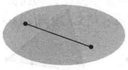
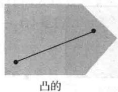
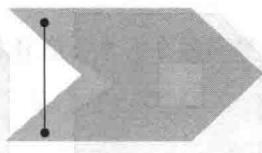
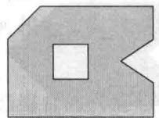
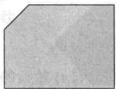
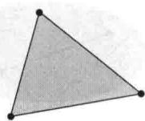
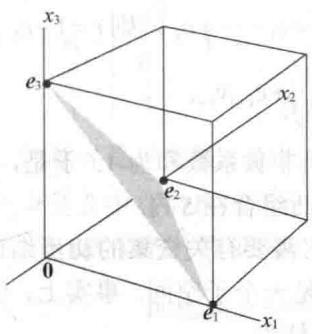
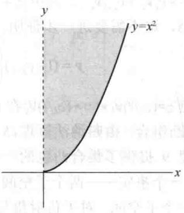
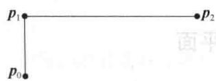

import Guide from '@/components/Guide.astro';
import Knowledge from '@/components/Knowledge.astro';
import Example from '@/components/Example.astro';
import Analysis from '@/components/Analysis.astro';
import Solution from '@/components/Solution.astro';
import Variant from '@/components/Variant.astro';
import Note from '@/components/Note.astro';
import Block from '@/components/Block.astro';
import Method from '@/components/Method.astro';
import Exercise from '@/components/Exercise.astro';

8.1节中考察了一个特殊的线性组合形式

$$
c _ {1} \pmb {\nu} _ {1} + c _ {2} \pmb {\nu} _ {2} + \dots + c _ {k} \pmb {\nu} _ {k}, \text {其中} c _ {1} + c _ {2} + \dots + c _ {k} = 1
$$

本节将限制这些权值为非负.

定义 $R^{n}$ 中点 $v_{1}, v_{2}, \cdots, v_{k}$ 的一个凸组合是如下形式的线性组合：

$$
c _ {1} \boldsymbol {v} _ {1} + c _ {2} \boldsymbol {v} _ {2} + \dots + c _ {k} \boldsymbol {v} _ {k}
$$

对于所有的 $i$ ，有 $c_{1} + c_{2} + \dots + c_{k} = 1$ 和 $c_{i} \geqslant 0$ 。一个集合 $S$ 中所有凸组合的集称为 $S$ 的凸包，记为 $\operatorname{conv} S$ 。

单点 $v_{1}$ 的凸包就是集合 $\{v_{1}\}$ ，与仿射包相同。在其他的情形下，凸包真包含在仿射包中。回忆不同点 $v_{1}$ 和 $v_{2}$ 的仿射包是直线

$$
\boldsymbol {y} = (1 - t) \boldsymbol {v} _ {1} + t \boldsymbol {v} _ {2}, \quad t \in \mathbb {R}
$$

由于一个凸组合的权值是非负的，故 $\{\pmb{v}_1, \pmb{v}_2\}$ 中的点可写为

$$
\mathbf {y} = (1 - t) \mathbf {v} _ {1} + t \mathbf {v} _ {2}, \quad 0 \leqslant t \leqslant 1
$$

这是在点 $v_{1}$ 和 $v_{2}$ 之间的线段，记为 $\overline{v_{1}v_{2}}$ .

如果一个集合 $S$ 是仿射无关的，且 $\pmb{p} \in \operatorname{aff} S$ ，那么当且仅当 $\pmb{p}$ 的重心坐标是非负时， $\pmb{p} \in \operatorname{conv} S$ 。例1证明了一个特殊的情形，其中 $S$ 是仿射无关的。

<Example title="例 1">
令

$$
\boldsymbol {v} _ {1} = \left[ \begin{array}{c} 3 \\ 0 \\ 6 \\ - 3 \end{array} \right], \quad \boldsymbol {v} _ {2} = \left[ \begin{array}{c} - 6 \\ 3 \\ 3 \\ 0 \end{array} \right], \quad \boldsymbol {v} _ {3} = \left[ \begin{array}{c} 3 \\ 6 \\ 0 \\ 3 \end{array} \right], \quad \boldsymbol {p} _ {1} = \left[ \begin{array}{c} 0 \\ 3 \\ 3 \\ 0 \end{array} \right], \quad \boldsymbol {p} _ {2} = \left[ \begin{array}{c} - 1 0 \\ 5 \\ 1 1 \\ - 4 \end{array} \right]
$$

且 $S = \{\pmb{v}_1, \pmb{v}_2, \pmb{v}_3\}$ . 注意 $S$ 是正交集. 确定 $\pmb{p}_1$ 是否在 $\operatorname{Span} S$ , $\operatorname{aff} S$ 及 $\operatorname{conv} S$ 中. 同样考虑 $\pmb{p}_2$ 的情况.

<Solution title="解">
若 $p_{1}$ 至少是 S 中点的线性组合，则由于 S 是正交集合，很容易求出权值。令 W 为 S 生成的子空间。类似于 6.3 节的计算证明了 $p_{1}$ 在 W 上的正交投影 $p_{1}$ 是其本身：

$$
\begin{array}{r l} \mathrm{proj} _ {W} \boldsymbol {p} _ {1} & = \frac {\boldsymbol {p} _ {1} \cdot \boldsymbol {v} _ {1}}{\boldsymbol {v} _ {1} \cdot \boldsymbol {v} _ {1}} \boldsymbol {v} _ {1} + \frac {\boldsymbol {p} _ {1} \cdot \boldsymbol {v} _ {2}}{\boldsymbol {v} _ {2} \cdot \boldsymbol {v} _ {2}} \boldsymbol {v} _ {2} + \frac {\boldsymbol {p} _ {3} \cdot \boldsymbol {v} _ {3}}{\boldsymbol {v} _ {3} \cdot \boldsymbol {v} _ {3}} \boldsymbol {v} _ {3} \\ & = \frac {1 8}{5 4} \boldsymbol {v} _ {1} + \frac {1 8}{5 4} \boldsymbol {v} _ {2} + \frac {1 8}{5 4} \boldsymbol {v} _ {3} \\ & = \frac {1}{3} \left[ \begin{array}{c} 3 \\ 0 \\ 6 \\ - 3 \end{array} \right] + \frac {1}{3} \left[ \begin{array}{c} - 6 \\ 3 \\ 3 \\ 0 \end{array} \right] + \frac {1}{3} \left[ \begin{array}{c} 3 \\ 0 \\ 6 \\ 3 \end{array} \right] = \frac {1}{3} \left[ \begin{array}{c} 0 \\ 3 \\ 3 \\ 0 \end{array} \right] = \boldsymbol {p} _ {1} \end{array}
$$

由此证明 $p_{1}$ 在 Span S 内. 同样由于系数和为 1, 因此 $p_{1}$ 在 aff S 内. 进一步, 由于系数是非负的, 故 $p_{1}$ 在 conv S 内.

对于 $p_{2}$ ，类似的计算证明 $proj_{W}p_{2} \neq p_{2}$ 。由于 $proj_{W}p_{2}$ 是 Span S 中到 $p_{2}$ 最近的点，所以，点 $p_{2}$ 不在 Span S 中。特别地， $p_{2}$ 不可能在 aff S 内或 conv S 内。

回忆一下，集合 $S$ 是仿射的，若 $S$ 内任意两点确定的直线都在 $S$ 中。而在凸集中，要考虑的是线段而不是直线。

定义 集合 $S$ 是凸的，若对于每个 $\pmb{p},\pmb{q}\in S$ ，线段 $\overline{\pmb{pq}}$ 在 $S$ 中.

直觉上，若集合 S 中的每两点都可以相互 “看到”，且视线不越出该集合，那么集合 S 是凸的。图 8-14 说明了这个思想。

  
凸的

<figure class="vp-figure">
  
  <figcaption>图 8-14</figcaption>
</figure>

  
不是凸的

下面的结论类似于仿射集的定理 2.
</Solution>
</Example>

<Knowledge title="定理 7">
集合 S 是凸集当且仅当 S 中的点的凸组合在 S 中, 即 S 是凸集当且仅当 $S = \text{conv } S$ .

<Solution title="证明">
讨论类似于定理 2 的证明，这里只给出归纳步骤中不同的部分。取 $k+1$ 个点的凸组合，考虑 $y=c_{1}v_{1}+\cdots+c_{k}v_{k}+c_{k+1}v_{k+1}$ ，其中 $c_{1}+c_{2}+\cdots+c_{k+1}=1$ ，且对所有的 i， $0\leqslant c_{i}\leqslant1$ 。若 $c_{k+1}=1$ ，则 $y=v_{k+1}$ 属于 S，这不需要进一步证明。若 $c_{k+1}<1$ ，令 $t=c_{1}+\cdots+c_{k}$ ，则 $t=1-c_{k+1}>0$ 且

$$
\boldsymbol {y} = \left(1 - c _ {k + 1}\right) \left(\frac {c _ {1}}{t} \boldsymbol {v} _ {1} + \dots + \frac {c _ {k}}{t} \boldsymbol {v} _ {k}\right) + c _ {k + 1} \boldsymbol {v} _ {k + 1}\tag{1}
$$

由归纳假设，点 $z=(c_{1}/t)\mathbf{v}_{1}+\cdots+(c_{k}/t)\mathbf{v}_{k}$ 在 S 内，这是由于非负系数和为 1. 于是，方程（1）表明 y 为 S 内两点的凸组合. 由归纳法原理，S 内的点的每个凸组合在 S 内.

下面的定理9提供了集合凸包的一个几何特征。它需要有关交集的初步结论。回顾4.1节（习题32）中的一个事实——两个子空间的交集本身仍是一个子空间。事实上，任一组子空间的交集本身仍是一个子空间。对于仿射集与凸集有相似的结论。
</Solution>
</Knowledge>

<Knowledge title="定理 8">
设 $\{S_{\alpha} : \alpha \in \mathcal{A}\}$ 是任一组凸集，则 $\cap_{\alpha \in \mathcal{A}} S_{\alpha}$ 是凸集。若 $\{T_{\beta} : \beta \in \mathcal{B}\}$ 是任一组仿射集，则 $\cap_{\beta \in \mathcal{B}} S_{\beta}$ 是仿射集。

<Solution title="证明">
若 $p, q \in \cap S_{\alpha}$ ，则 $p, q$ 在每个 $S_{\alpha}$ 中。由于每个 $S_{\alpha}$ 是凸集，因此对所有 $\alpha$ ，连接 $p, q$ 的线段在 $S_{\alpha}$ 中，从而线段属于 $\cap S_{\alpha}$ 。对于仿射集的证明与此类似。
</Solution>
</Knowledge>

<Knowledge title="定理 9">
对任何集合 S，S 的凸包是所有包含 S 的凸集的交集.

<Solution title="证明">
令 $T$ 为包含 $S$ 的所有凸集的交集. 由于 $\operatorname{conv} S$ 是包含 $S$ 的一个凸集, 故 $T \subset \operatorname{conv} S$ . 另一方面, 令 $C$ 是包含 $S$ 的任意一个凸集, 则 $C$ 包含 $C$ 中所有点构成的凸组合 (定理7), 因此也包含子集 $S$ 中所有点构成的凸组合, 即 $\operatorname{conv} S \subset C$ . 由于对包含 $S$ 的每个凸集 $C$ 都成立, 故对所有包含 $S$ 的凸集的交集同样成立, 即 $\operatorname{conv} S \subset T$ .

定理9证明了 $S$ 的凸包是包含 $S$ 的“最小”的凸集，这一点诠释了“凸包”的自然含义。例如，考虑平面 $\mathbb{R}^2$ 中可被某个大长方形包含的点集 $S$ ，想象环绕 $S$ 外边沿拉伸橡皮筋。由于橡皮筋限制于 $S$ ，因此它构架了 $S$ 凸包的边界。或者用另一个模拟， $S$ 的凸包填满 $S$ 内部所有的洞及 $S$ 边界中所有的凹陷。
</Solution>
</Knowledge>

<Example title="例 2">
a. $R^{2}$ 中集合 S, T 的凸包如下图所示.

  
S

  
conv S  
T

  
conv T

b. 令 $S$ 是三维空间 $\mathbb{R}^3$ 的标准基构成的集合， $S = \{\pmb{e}_1, \pmb{e}_2, \pmb{e}_3\}$ 。则 $\operatorname{conv} S$ 是 $\mathbb{R}^2$ 中顶点为 $\pmb{e}_1, \pmb{e}_2, \pmb{e}_3$ 的一个三角面。见图8-15。
</Example>

<Example title="例 3">
令 $S = \left\{\begin{bmatrix} x \\ y \end{bmatrix}: x \geqslant 0, y = x^2\right\}$ ，证明 $S$ 的凸包是原点和 $\left\{\begin{bmatrix} x \\ y \end{bmatrix}: x > 0, y \geqslant x^2\right\}$ 的并集。如图8-16所示。

<figure class="vp-figure">
  
  <figcaption>图 8-15</figcaption>
</figure>

<figure class="vp-figure">
  
  <figcaption>图 8-16</figcaption>
</figure>

<Solution title="解">
$S$ 的凸包中每个点都在连接 $S$ 中两点的线段上. 图8-16中的虚线表明, 除了原点外, $y$ 的正半轴不在 $S$ 的凸包中, 这是因为原点是 $S$ 在 $y$ 轴上唯一的点. 图8-16所示的 $S$ 的凸包似乎是合理的, 但是如何确定点 $(10^{-2}, 10^{4})$ 在连接原点与 $S$ 中另一点的线段上?

考虑图8-16阴影部分的任意点 $\pmb{p}$ ，令

$$
\pmb {p} = \left[ \begin{array}{l} {{a}} \\ {{b}} \end{array} \right], \quad a > 0   \text {且}   b \geqslant a ^ {2}
$$

经过 0 与 p 的直线满足方程 $y=(b/a)t$ ，t 为实数。直线与 S 的交点满足 $(b/a)t=t^{2}$ ，即 t=b/a。因此 p 在连接 0 与 $\begin{bmatrix}b/a\\ b^{2}/a^{2}\end{bmatrix}$ 的线段上。由此证明图 8-16 正确。

下面的定理是凸集学习中的基本定理，于1907年首次由Constantin Caratheodory证明.若 $\pmb{p}$ 在 $S$ 的凸包中，则按定义， $\pmb{p}$ 必是 $S$ 的点的一个凸组合.但定义没有规定需要 $S$ 中多少个点构成这个组合.Caratheodory的著名定理表明在 $n$ 维空间中，凸组合中 $S$ 的点的个数不必多于 $n + 1$
</Solution>
</Example>

<Knowledge title="定理 10 Caratheodory">
若 $S$ 是 $\mathbb{R}^n$ 中一非空子集，则 $S$ 的凸包中的每一点可以由 $S$ 中 $n + 1$ 个或更少的点的凸组合表示.

<Solution title="证明">
假定 p 在 S 的凸包中，则 $p = c_{1}v_{1} + \cdots + c_{k}v_{k}$ ，其中 $v_{i} \in S$ ， $c_{1} + \cdots + c_{k} = 1$ ，且 $c_{i} \geqslant 0, i = 1, \cdots, k$ 。我们的目的就是证明 p 存在这样的表达式且 $k \leqslant n + 1$ 。

若 $k > n + 1$ ，则由 8.2 节习题 12 知 $\{v_{1}, \cdots, v_{k}\}$ 是仿射相关的，因此存在不全为 0 的标量 $d_{1}, \cdots, d_{k}$ ，使得

$$
\sum_ {i = 1} ^ {k} d _ {i} \pmb {\nu} _ {i} = \pmb {0}   \text {且}   \sum_ {i = 1} ^ {k} d _ {i} = 0
$$

考虑如下两个方程：

$$
\begin{array}{l} c _ {1} \boldsymbol {v} _ {1} + \dots + c _ {k} \boldsymbol {v} _ {k} = \boldsymbol {p} \\ d _ {1} v _ {1} + \dots + d _ {k} \boldsymbol {v} _ {k} = \mathbf {0} \end{array}
$$

第一个方程减去第二个方程的适当倍数，可以消去一个 $v_{i}$ ，从而得到 S 的少于 k 个点构成的凸组合，该凸组合等于 p.

由于并非所有的系数 $d_{i}$ 都为0，因此可以假定（若需要则重新排下标） $d_{k} > 0$ 且对那些 $d_{i} > 0$ 的所有 $i$ 有 $c_{k} / d_{k} \leqslant c_{i} / d_{i}$ . 对 $i = 1, \dots, k$ ，令 $b_{i} = c_{i} - (c_{k} / d_{k})d_{i}$ . 则 $b_{k} = 0$ 且

$$
\sum_ {i = 1} ^ {k} b _ {i} = \sum_ {i = 1} ^ {k} c _ {i} - \frac {c _ {k}}{d _ {k}} \sum_ {i = 1} ^ {k} d _ {i} = 1 - 0 = 1
$$

进一步，每个 $b_{i} \geqslant 0$ 。事实上，若 $d_{i} \leqslant 0$ ，则 $b_{i} \geqslant c_{i} \geqslant 0$ 。若 $d_{i} > 0$ ，则 $b_{i} = d_{i}(c_{i} / d_{i} - c_{k} / d_{k}) \geqslant 0$ 。由构造，得

$$
\sum_ {i = 1} ^ {k - 1} b _ {i} \boldsymbol {v} _ {i} = \sum_ {i = 1} ^ {k} b _ {i} \boldsymbol {v} _ {i} = \sum_ {i = 1} ^ {k} \left(c _ {i} = \frac {c _ {k}}{d _ {k}} d _ {i}\right) \boldsymbol {v} _ {i} = \sum_ {i = 1} ^ {k} c _ {i} \boldsymbol {v} _ {i} - \frac {c _ {k}}{d _ {k}} \sum_ {i = 1} ^ {k} d _ {i} \boldsymbol {v} _ {i} = \sum_ {i = 1} ^ {k} c _ {i} \boldsymbol {v} _ {i} = \boldsymbol {p}
$$

因此 p 是 k-1 个点 $v_{1}, \cdots, v_{k-1}$ 的凸组合. 重复上述步骤到 p 是由 S 中 $n+1$ 个点构成的凸组合. 下面的例子说明了上述证明中的计算.
</Solution>
</Knowledge>

<Example title="例 4">
令

$$
\boldsymbol {v} _ {1} = \left[ \begin{array}{l} 1 \\ 0 \end{array} \right], \boldsymbol {v} _ {2} = \left[ \begin{array}{l} 2 \\ 3 \end{array} \right], \boldsymbol {v} _ {3} = \left[ \begin{array}{l} 5 \\ 4 \end{array} \right], \boldsymbol {v} _ {4} = \left[ \begin{array}{l} 3 \\ 0 \end{array} \right], \boldsymbol {p} = \left[ \begin{array}{l} \frac {1 0}{3} \\ \frac {5}{2} \end{array} \right]
$$

且 $S = \{\pmb{v}_1,\pmb{v}_2,\pmb{v}_3,\pmb{v}_4\}$ ，则

$$
\frac {1}{4} \boldsymbol {v} _ {1} + \frac {1}{6} \boldsymbol {v} _ {2} + \frac {1}{2} \boldsymbol {v} _ {3} + \frac {1}{1 2} \boldsymbol {v} _ {4} = \boldsymbol {p}\tag{2}
$$

使用 Caratheodory 定理的证明过程把 p 表示为 S 中三个点构成的凸组合.

<Solution title="解">
集合 $S$ 是仿射相关的. 使用8.2节中的方法得到一个仿射相关的关系式

$$
- 5 \boldsymbol {v} _ {1} + 4 \boldsymbol {v} _ {2} - 3 \boldsymbol {v} _ {3} + 4 \boldsymbol {v} _ {4} = \mathbf {0}\tag{3}
$$

接下来，选择（3）式中的点 $\pmb{v}_2, \pmb{v}_4$ ，它们的系数为正。对上述每个点，计算方程（2）与（3）中系数的比例。 $\pmb{v}_2$ 的系数比为 $\frac{1}{6} \div 4 = \frac{1}{24}$ ，而 $\pmb{v}_4$ 的为 $\frac{1}{12} \div 4 = \frac{1}{48}$ 。 $\pmb{v}_4$ 的比更小，因此从方程（2）减去方程（3）的 $\frac{1}{48}$ 来消去 $\pmb{v}_4$ ：

$$
\left(\frac {1}{4} + \frac {5}{4 8}\right) \boldsymbol {v} _ {1} + \left(\frac {1}{6} - \frac {4}{4 8}\right) \boldsymbol {v} _ {2} + \left(\frac {1}{2} + \frac {3}{4 8}\right) \boldsymbol {v} _ {3} + \left(\frac {1}{1 2} - \frac {4}{4 8}\right) \boldsymbol {v} _ {4} = \boldsymbol {p}
$$

$$
\frac {1 7}{4 8} \boldsymbol {v} _ {1} + \frac {4}{4 8} \boldsymbol {v} _ {2} + \frac {2 7}{4 8} \boldsymbol {v} _ {3} = \boldsymbol {p}
$$

一般而言，通过减少需要的点的个数并不能改善这个结果。事实上， $\mathbb{R}^2$ 中任意三个非共线的点构成的三角形的质心在这三个点的凸包中，而不是在任意两点的凸包中。
</Solution>
</Example>

<Block title="练习题">
1. 令 $\pmb{v}_1 = \begin{bmatrix} 6 \\ 2 \\ 2 \end{bmatrix}, \pmb{v}_2 = \begin{bmatrix} 7 \\ 1 \\ 5 \end{bmatrix}, \pmb{v}_3 = \begin{bmatrix} -2 \\ 4 \\ -1 \end{bmatrix}, \pmb{p}_1 = \begin{bmatrix} 1 \\ 3 \\ 1 \end{bmatrix}$ , 及 $\pmb{p}_2 = \begin{bmatrix} 3 \\ 2 \\ 1 \end{bmatrix}$ , 令 $S = \{\pmb{v}_1, \pmb{v}_2, \pmb{v}_3\}$ . 确定 $\pmb{p}_1$ 和 $\pmb{p}_2$ 是否在 conv $S$ 中.

2. 令 S 为曲线 $y=1/x(x>0)$ 上的点集，从几何上解释 S 的凸包由曲线 S 上及 S 上方的点构成.
</Block>

<Block title="习题8.3">
1. 在 $\mathbb{R}^2$ 中，令 $S = \left\{\begin{bmatrix} 0 \\ y \end{bmatrix}: 0 \leqslant y < 1 \right\} \cup \left\{\begin{bmatrix} 2 \\ 0 \end{bmatrix}\right\}$ . 描述 $S$ 的凸包.

2. 描述 $R^{2}$ 中点 $\begin{bmatrix} x \\ y \end{bmatrix}$ 构成的集合 S 满足如下给定条件的凸包. 证明你的结论. (证明 S 中任意一点 p 属于 S 的凸包.)  
a. y=1/x 且 $x \geqslant 1/2$ b. $y = \sin x$ c. $y = x^{1/2}$ 且 $x \geqslant 0$

3. 考虑 8.1 节习题 5 中的点. $p_{1}$ , $p_{2}$ 和 $p_{3}$ 哪个在 S 的凸包中?

4. 考虑 8.1 节习题 6 中的点. $p_{1}$ , $p_{2}$ 和 $p_{3}$ 哪个在 S 的凸包中?

5. 令 $\pmb{v}_{1} = \begin{bmatrix} -1\\ -3\\ 4 \end{bmatrix},\pmb{v}_{2} = \begin{bmatrix} 0\\ -3\\ 1 \end{bmatrix},\pmb{v}_{3} = \begin{bmatrix} 1\\ -1\\ 4 \end{bmatrix},\pmb{v}_{4} = \begin{bmatrix} 1\\ 1\\ -2 \end{bmatrix}$

$p_{1}=\begin{bmatrix}1\\-1\\2\end{bmatrix},\quad p_{2}=\begin{bmatrix}0\\-2\\2\end{bmatrix},\quad 且 \quad S=\{\nu_{1},\nu_{2},\nu_{3},\nu_{4}\}. 确定$

$p_{1}$ ， $p_{2}$ 是否在S的凸包中.

$$
\boldsymbol {v} _ {1} = \left[ \begin{array}{c} 2 \\ 0 \\ - 1 \\ 2 \end{array} \right], \boldsymbol {v} _ {2} = \left[ \begin{array}{c} 0 \\ - 2 \\ 2 \\ 1 \end{array} \right], \boldsymbol {v} _ {3} = \left[ \begin{array}{c} - 2 \\ 1 \\ 0 \\ 2 \end{array} \right], \boldsymbol {p} _ {1} = \left[ \begin{array}{c} - 1 \\ 2 \\ - \frac {3}{2} \\ \frac {5}{2} \end{array} \right],
$$

$p_{2}=\begin{bmatrix}-\frac{1}{2}\\0\\\frac{1}{4}\\\frac{7}{4}\end{bmatrix},p_{3}=\begin{bmatrix}6\\-4\\1\\-1\end{bmatrix},p_{4}=\begin{bmatrix}-1\\-2\\0\\4\end{bmatrix},$ 且 $S=\left\{\nu_{1},\nu_{2},\nu_{3}\right\}$

为正交集. 确定每一 $p_{i}$ 是否属于 Span S, aff S 或 conv S.

a. $p_1$ b. $p_2$ c. $p_3$ d. $p_4$

习题 7\~10 使用 8.2 节中的术语.

7. a. 令 $T = \left\{\begin{bmatrix} -1 \\ 0 \end{bmatrix}, \begin{bmatrix} 2 \\ 3 \end{bmatrix}, \begin{bmatrix} 4 \\ 1 \end{bmatrix}\right\}$ , $\pmb{p}_1 = \begin{bmatrix} 2 \\ 1 \end{bmatrix}, \pmb{p}_2 = \begin{bmatrix} 3 \\ 2 \end{bmatrix}$ , $\pmb{p}_3 = \begin{bmatrix} 2 \\ 0 \end{bmatrix}, \pmb{p}_4 = \begin{bmatrix} 0 \\ 2 \end{bmatrix}$ . 求出 $\pmb{p}_1, \pmb{p}_2, \pmb{p}_3, \pmb{p}_4$ 关于 $T$ 的重心坐标. b. 由（a）的答案确定 $\pmb{p}_1, \pmb{p}_2, \pmb{p}_3, \pmb{p}_4$ 在 $T$ 的凸包（即三角形区域）内部、外部还是边上.

8. 重复习题7的过程，其中 $T = \left\{\begin{bmatrix} 2 \\ 0 \end{bmatrix}, \begin{bmatrix} 0 \\ 5 \end{bmatrix}, \begin{bmatrix} -1 \\ 1 \end{bmatrix}\right\}$ ， $p_1 = \begin{bmatrix} 2 \\ 1 \end{bmatrix}, p_2 = \begin{bmatrix} 1 \\ 1 \end{bmatrix}, p_3 = \begin{bmatrix} 1 \\ \frac{1}{3} \end{bmatrix}, p_4 = \begin{bmatrix} 1 \\ 0 \end{bmatrix}$ .

9. 令 $S = \{\nu_{1}, \nu_{2}, \nu_{3}, \nu_{4}\}$ 是仿射不相关集，考虑点 $\pmb{p}_{1}, \dots, \pmb{p}_{5}$ 关于 $S$ 的重心坐标分别为 $(2,0,0,-1)$ ， $\left(0, \frac{1}{2}, \frac{1}{4}, \frac{1}{4}\right), \left(\frac{1}{2}, 0, \frac{3}{2}, -1\right), \left(\frac{1}{3}, \frac{1}{4}, \frac{1}{4}, \frac{1}{6}\right)$ 和 $\left(\frac{1}{3}, 0, \frac{2}{3}, 0\right)$ 确定每点 $\pmb{p}_{1}, \dots, \pmb{p}_{5}$ 是在凸包 $S$ （一个四面体）内部、外部还是表面。这5个点中有点在凸包 $S$ 的边上吗？

10. 重复习题 9 的过程，其中 $q_{1}, \cdots, q_{5}$ 关于 S 的重心坐标分别为 $\left(\frac{1}{8}, \frac{1}{4}, \frac{1}{8}, \frac{1}{2}\right)$ ， $\left(\frac{3}{4}, -\frac{1}{4}, 0, \frac{1}{2}\right)$ ， $\left(0, \frac{3}{4}, \frac{1}{4}, 0\right)$ ， $(0, -2, 0, 3)$ 和 $\left(\frac{1}{3}, \frac{1}{3}, \frac{1}{3}, 0\right)$ .

11. a. 若 $y = c_{1}v_{1} + c_{2}v_{2} + c_{3}v_{3}$ ，且 $c_{1} + c_{2} + c_{3} = 1$ ，则 y 是 $v_{1}, v_{2}, v_{3}$ 的凸组合.
b. 若 S 是非空集合，则 S 的凸包包含一些不属于 S 的点.
c. 若 S, T 都是凸集，则 $S \cup T$ 也是凸集.

12. a. 集合 S 是凸集，若 $x, y \in S$ ，则 x 和 y 间的线段在 S 内.
b. 若 S, T 都是凸集，则 $S \cap T$ 也是凸集.
c. 若 S 是 $R^{5}$ 中的非空集合，且 $y \in convS$ ，则存在 S 中不同的点 $v_{1}, \cdots, v_{6}$ ，使得 y 是 $v_{1}, \cdots, v_{6}$ 的凸组合.

13. 令 $S$ 是 $\mathbb{R}^n$ 中的凸子集, 假定 $f: \mathbb{R}^n \to \mathbb{R}^m$ 是一线性变换. 证明: 集合 $f(S) = \{f(x): x \in S\}$ 是 $\mathbb{R}^m$ 的凸子集.

14. 令 $f: \mathbb{R}^n \to \mathbb{R}^m$ 是一线性变换，且 $T$ 是 $\mathbb{R}^m$ 中的凸子集。证明：集合 $S = \{x \in \mathbb{R}^n : f(x) \in T\}$ 是 $\mathbb{R}^n$ 的凸子集。

15. 令 $\pmb{v}_{1} = \begin{bmatrix} 1 \\ 0 \end{bmatrix}, \pmb{v}_{2} = \begin{bmatrix} 1 \\ 2 \end{bmatrix}, \pmb{v}_{3} = \begin{bmatrix} 4 \\ 2 \end{bmatrix}, \pmb{v}_{4} = \begin{bmatrix} 4 \\ 0 \end{bmatrix}, \pmb{p} = \begin{bmatrix} 2 \\ 1 \end{bmatrix}$ . 证实 $p = \frac{1}{3} v_{1} + \frac{1}{3} v_{2} + \frac{1}{6} v_{3} + \frac{1}{6} v_{4}$ 且 $v_{1} - v_{2} + v_{3} - v_{4} = 0$ . 使用 Caratheodory 定理的证明过程把 $p$ 表示为 $v_{i}$ 中三个点构成的凸组合. 使用两种方法.

16. 重复习题 15 的过程，其中点 $\pmb{v}_{1} = \begin{bmatrix} -1\\ 0 \end{bmatrix},\pmb{v}_{2} =$ $\begin{bmatrix} 0\\ 3 \end{bmatrix},\pmb{v}_{3} = \begin{bmatrix} 3\\ 1 \end{bmatrix},\pmb{v}_{4} = \begin{bmatrix} 1\\ -1 \end{bmatrix},\pmb {p} = \begin{bmatrix} 1\\ 2 \end{bmatrix}$ ，且 $p = \frac{1}{121}\pmb {v}_1 + \frac{72}{121}\pmb {v}_2 + \frac{37}{121}\pmb {v}_3 + \frac{1}{11}\pmb {v}_4$ $10\nu_{1} - 6\nu_{2} + 7\nu_{3} - 11\nu_{4} = 0$

在习题 17\~20 中，证明关于 $R^{n}$ 中子集 A 与 B 的命题。证明中可能会使用前面习题中的结论。

17. 若 $A \subset B$ 且 $B$ 是凸集，则 $\operatorname{conv} A \subset B$ .

18. 若 $A \subset B$ ，则 $\operatorname{conv} A \subset \operatorname{conv} B$

19. a. $\left[\left(\text{conv } A\right) \cup \left(\text{conv } B\right)\right] \subset \text{conv } (A \cup B)$ .
b. 在 $R^{2}$ 中找一个例子，以证明（a）中等号未必成立.

20. a. $\operatorname{conv}(A \cap B) \subset [(\operatorname{conv} A) \cap (\operatorname{conv} B)]$ . b. 在 $\mathbb{R}^2$ 中找一个例子，以证明（a）中等号未必成立.

21. 令 $p_0, p_1, p_2$ 是 $\mathbb{R}^n$ 中的点，且定义 $f_0(t) = (1 - t)p_0 + tp_1$ ， $f_1(t) = (1 - t)p_1 + tp_2$ ， $g(t) = (1 - t)f_0(t) + tf_1(t)$ ， $0 \leqslant t \leqslant 1$ 。各点如图所示，画图说明 $f_0\left(\frac{1}{2}\right)$ ， $f_1\left(\frac{1}{2}\right)$ 和 $g\left(\frac{1}{2}\right)$ 。

22. 重复习题 21 的过程，画图说明 $f_{0}\left(\frac{3}{4}\right)$ ， $f_{1}\left(\frac{3}{4}\right)$ 和 $g\left(\frac{3}{4}\right)$ .

23. 令 $g(t)$ 为习题 21 中所定义，它的图像称为二次贝塞尔曲线，常运用于某些计算机图形设计.

$p_0, p_1, p_2$ 称为曲线的控制点．计算仅包含 $p_0, p_1, p_2$ 的公式 $\mathbf{g}(t)$ ．那么 $\mathbf{g}(t)$ 在 $\operatorname{conv}\{p_0, p_1, p_2\}$ 中， $0 \leqslant t \leqslant 1$

24. 给定 $\mathbb{R}^n$ 中的控制点 $p_0, p_1, p_2, p_3$ ，令 $g_1(t)$ 为习题23中 $p_0, p_1, p_2$ 确定的二次贝塞尔曲线， $0 \leqslant t \leqslant 1$ ，令 $g_2(t)$ 为 $p_1, p_2, p_3$ 确定的二次贝塞尔曲练习题答案

线．定义 $\boldsymbol{h}(t)=(1-t)\boldsymbol{g}_{1}(t)+tg_{2}(t)$ ， $0\leqslant t\leqslant1$ ．证明 $\boldsymbol{h}(t)$ 的图形在这四个控制点的凸包中．这条曲线称为三次贝塞尔曲线，它的定义基于构建贝塞尔曲线的算法。（在稍后8.6节讨论．）k维的贝塞尔曲线由 $k+1$ 个控制点确定，它的图形位于这些控制点的凸包中．

1. 点 $v_{1}, v_{2}, v_{3}$ 非正交，计算

$$
\boldsymbol {v} _ {2} - \boldsymbol {v} _ {1} = \left[ \begin{array}{c} 1 \\ - 1 \\ 3 \end{array} \right], \boldsymbol {v} _ {3} - \boldsymbol {v} _ {1} = \left[ \begin{array}{c} - 8 \\ 2 \\ - 3 \end{array} \right], \boldsymbol {p} _ {1} - \boldsymbol {v} _ {1} = \left[ \begin{array}{c} - 5 \\ 1 \\ - 1 \end{array} \right], \boldsymbol {p} _ {2} - \boldsymbol {v} _ {1} = \left[ \begin{array}{c} - 3 \\ 0 \\ - 1 \end{array} \right]
$$

把 $p_{1}-v_{1}$ 和 $p_{2}-v_{1}$ 加到矩阵 $[v_{2}-v_{1}, v_{3}-v_{1}]$ 中作行化简：

$$
\left[ \begin{array}{r r r r} 1 & - 8 & - 5 & - 3 \\ - 1 & 2 & 1 & 0 \\ 3 & - 3 & - 1 & - 1 \end{array} \right] \sim \left[ \begin{array}{r r r r} 1 & 0 & \frac {1}{3} & 1 \\ 0 & 1 & \frac {2}{3} & \frac {1}{2} \\ 0 & 0 & 0 & - \frac {5}{2} \end{array} \right]
$$

第三列说明 $p_1 - v_1 = \frac{1}{3} (v_2 - v_1) + \frac{2}{3} (v_3 - v_1)$ ，由此推出 $p_1 = 0v_1 + \frac{1}{3} v_2 + \frac{2}{3} v_3$ 。故 $p_1$ 在 $S$ 的凸包中。事实上， $p_1$ 在点集 $\{v_2, v_3\}$ 的凸包中。矩阵的最后一列说明 $p_2 - v_1$ 不是 $v_2 - v_1$ 与 $v_3 - v_1$ 的线性组合，所以 $p_2$ 不是 $v_1, v_2, v_3$ 的仿射组合，故 $p_2$ 不在 $S$ 的凸包中。

另一解法是把齐次形式的增广矩阵行化简为阶梯形矩阵：

$$
[ \widetilde {\boldsymbol {v}} _ {1} \quad \widetilde {\boldsymbol {v}} _ {2} \quad \widetilde {\boldsymbol {v}} _ {3} \quad \widetilde {\boldsymbol {p}} _ {1} \quad \widetilde {\boldsymbol {p}} _ {2} ] \sim \left[ \begin{array}{c c c c c} 1 & 0 & 0 & 0 & 0 \\ 0 & 1 & 0 & \frac {1}{3} & 0 \\ 0 & 0 & 1 & \frac {2}{3} & 0 \\ 0 & 0 & 0 & 0 & 1 \end{array} \right]
$$

2. 若 p 是曲线 S 上方一点，则经过点 p 斜率为 -1 的直线在到达 x, y 的正半轴前与 S 交于两点.
</Block>
