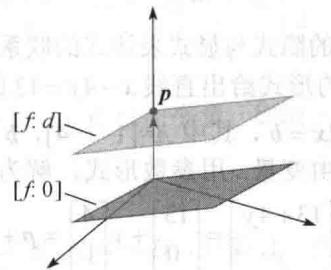
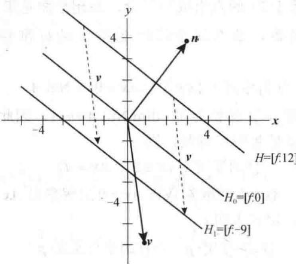
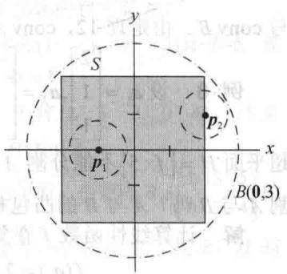
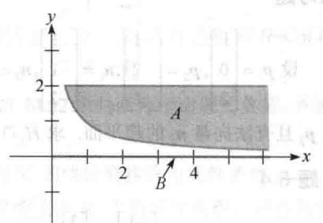

import Guide from '@/components/Guide.astro';
import Knowledge from '@/components/Knowledge.astro';
import Example from '@/components/Example.astro';
import Analysis from '@/components/Analysis.astro';
import Solution from '@/components/Solution.astro';
import Variant from '@/components/Variant.astro';
import Note from '@/components/Note.astro';
import Block from '@/components/Block.astro';
import Method from '@/components/Method.astro';
import Exercise from '@/components/Exercise.astro';

超平面在 $\mathbb{R}^n$ 空间中有着特别的作用，这是由于它们把空间分成两个不相交的部分，正如一个平面把 $\mathbb{R}^3$ 分成两部分以及一条直线切开 $\mathbb{R}^2$ 。探讨超平面的关键是对直线和平面启用简单的隐式表达，而不是像之前讨论仿射集时所用的显式表达，即参数形式表达。

$\mathbb{R}^2$ 中直线的隐式方程为 $ax + by = d$ ， $\mathbb{R}^3$ 中平面的隐式方程为 $ax + by + cz = d$ ．两方程把直线

或平面都描述为一个线性表示式（也叫线性函数）取得固定值 $d$ 时所有点的集合.

定义 $\mathbb{R}^n$ 上的一个线性函数是从 $\mathbb{R}^n$ 到 $\mathbb{R}$ 的一个线性变换 $f$ . 对 $\mathbb{R}$ 中的每个标量 $d$ , 符号 $[f:d]$ 表示 $\mathbb{R}^n$ 中使得 $f$ 的值为 $d$ 的所有 $x$ 的集合, 即

$$
[ f: d ] \text {是集合} \{\pmb {x} \in \mathbb {R} ^ {n}: f (\pmb {x}) = d \}
$$

零函数是对 $\mathbb{R}^n$ 中所有点 $x$ 都有 $f(x) = 0$ 的线性函数。 $\mathbb{R}^n$ 上所有其他的线性函数都称为非零函数。

<Example title="例 1">
在 $R^{2}$ 中，直线 x-4y=13 是 $R^{2}$ 中的超平面，它是所有使得线性函数 $f(x,y)=x-4y$ 的值等于 13 的点组成的集合，即直线是集合 [f:13].
</Example>

<Example title="例 2">
在 $\mathbb{R}^3$ 中，平面 $5x - 2y + 3z = 21$ 是 $\mathbb{R}^3$ 中的一个超平面，它是所有使得线性函数 $g(x,y,z) = 5x - 2y + 3z$ 的值等于21的点组成的集合，即超平面是集合[g:21].

若 f 是 $R^{n}$ 上的线性函数，那么这个线性变换 f 的标准矩阵是一个 $1 \times n$ 矩阵 A. 令 $A = [a_{1} a_{2} \cdots a_{n}]$ ，则

$$
[ f: 0 ] \text { 等同于 } \{\pmb {x} \in \mathbb {R} ^ {n}: A \pmb {x} = 0 \} = \mathrm{Nul} A\tag{1}
$$

若 $f$ 是非零函数，则由秩定理， $A$ 的秩为1， $\dim \operatorname{Nul} A = n - 1$ ，因此子空间 $[f:0]$ 是 $n - 1$ 维的，从而是一个超平面。同时，若 $d$ 是 $\mathbb{R}$ 中任意数，则

$$
[ f: d ] \text {等同于} \{\pmb {x} \in \mathbb {R} ^ {n}: A \pmb {x} = d \}\tag{2}
$$

回顾 1.5 节中的定理 6，Ax=b 的解集是将 Ax=0 的解集沿 Ax=b 的一特解 p 平移得到的。当 A 为变换 f 的标准矩阵时，定理表明

$$
[ f: d ] = [ f: 0 ] + p, \text {   对   } [ f: d ] \text {   中任意的   } p\tag{3}
$$

故集合[f:d]是平行于[f:0]的超平面．见图8-17.

  
图 8-17 平行超平面， $f(p)=d$

当 A 为 $1 \times n$ 矩阵时，方程 Ax = d 的左边可写成内积 $n \cdot x$ ， $n \in R^{n}$ 且它的元素与 A 的相同。故由（2），

$$
[ f: d ] \text {等同于} \{\pmb {x} \in \mathbb {R} ^ {n}: \pmb {n} \cdot \pmb {x} = d \}\tag{4}
$$

于是， $[f:0] = \{x \in \mathbb{R}^n : n \cdot x = 0\}$ ，此式表明 $[f:0]$ 是由 $n$ 生成的子空间的正交补。用 $\mathbb{R}^3$ 中微积分和几何术语， $n$ 称为 $[f:0]$ 的法向量。（这里“法向量”的含义并不要求它是单位向量。）同时 $n$ 正交于每个平行的超平面 $\left[f:d\right]$ ，即使当 $d\neq0$ 时 $n\cdot x$ 不为零.

$[f:d]$ 的另一个名称为 $f$ 的水平集，当对所有的 $\pmb{x}$ 有 $f(\pmb {x}) = \pmb {n}\cdot \pmb{x}$ 时， $\pmb{n}$ 有时称为 $f$ 的梯度.
</Example>

<Example title="例 3">
令 $\pmb{n} = \begin{bmatrix} 3 \\ 4 \end{bmatrix}, \pmb{v} = \begin{bmatrix} 1 \\ -6 \end{bmatrix}, H = \{\hat{\pmb{x}} : \pmb{n} \cdot \pmb{x} = 12\}$ ，从而 $H = [f:12]$ ，其中 $f(x,y) = 3x + 4y$ 。故 $H$ 为直线 $3x + 4y = 12$ 。求平行的超平面（直线） $H_1 = H + v$ 的隐式表达式。

<Solution title="解">
首先, 求出 $H_{1}$ 中的一点 p. 取 H 中一点, 把它加上 v. 例如 H 中点 $\begin{bmatrix}0\\ 3\end{bmatrix}$ , 故 $p=\begin{bmatrix}1\\ -6\end{bmatrix}+\begin{bmatrix}0\\ 3\end{bmatrix}=$ $\begin{bmatrix}1\\ -3\end{bmatrix}$ 在 $H_{1}$ 中. 现在计算 $n \cdot p = -9$ , 这表明 $H_{1}=[f:-9]$ , 见图 8-18, 该图也表明子空间 $H_{0}=\{x:n \cdot x=0\}$ .

  
图 8-18

接下来三个例子说明了超平面的隐式与显式表达式的联系. 例 4 以一个隐式开始.
</Solution>
</Example>

<Example title="例 4">
在 $R^{2}$ 中，以参数向量的形式给出直线 x-4y=13 的显式表达式.

<Solution title="解">
这等价于解非齐次方程 Ax=b，其中 $A=[1-4]$ ，b 的值为 13，A 和 b 均属于 R．改写等式 $x=13+4y$ ，其中 y 是一个自由变量．用参数形式，解为

$$
\boldsymbol {x} = \left[ \begin{array}{l} x \\ y \end{array} \right] = \left[ \begin{array}{c} 1 3 + 4 y \\ y \end{array} \right] = \left[ \begin{array}{l} 1 3 \\ 0 \end{array} \right] + y \left[ \begin{array}{l} 4 \\ 1 \end{array} \right] = \boldsymbol {p} + y \boldsymbol {q}, y \in \mathbb {R}.
$$

反过来，把直线的显式表达转换成隐式表达的过程要复杂一些。其基本思想是构造[f:0]，然后求出[f:d]的d。
</Solution>
</Example>

<Example title="例 5">
令 $v_{1}=\begin{bmatrix}1\\ 2\end{bmatrix},v_{2}=\begin{bmatrix}6\\ 0\end{bmatrix}$ ，且令 $L_{1}$ 是经过 $v_{1}$ ， $v_{2}$ 的直线。求线性函数 f 及常数 d，使得 $L_{1}=[f:d]$ 。

<Solution title="解">
直线 $L_{1}$ 平行于经过点 $\pmb{v}_{2} - \pmb{v}_{1}$ 及原点的直线 $L_{0}$ . 定义 $L_{0}$ 的方程如下:

$$
[ a b ] {\left[ \begin{array}{l} {x} \\ {y} \end{array} \right]} = 0   \text {或}   {\pmb n} \cdot {\pmb x} = 0,   \text {其中}   {\pmb n} = {\left[ \begin{array}{l} {a} \\ {b} \end{array} \right]}\tag{5}
$$

由于 n 与包含点 $v_{2}-v_{1}$ 的子空间 $L_{0}$ 正交，所以计算

$$
\boldsymbol {v} _ {2} - \boldsymbol {v} _ {1} = \left[ \begin{array}{l} 6 \\ 0 \end{array} \right] - \left[ \begin{array}{l} 1 \\ 2 \end{array} \right] = \left[ \begin{array}{l} 5 \\ - 2 \end{array} \right]
$$

并解

$$
[ a b ] \left[ \begin{array}{c} 5 \\ - 2 \end{array} \right] = 0
$$

通过观察，得一个解为 $[a\quad b] = [2\quad 5]$ .令 $f(x,y) = 2x + 5y$ .由（5）， $L_{0} = [f:0]$ 且对某个 $d$ 有 $L_{1} = [f:d]$ 由于 $\pmb{v}_{1}$ 在直线 $L_{1}$ 上，故 $d = f(\pmb {v}_1) = 2(1) + 5(2) = 12$ 因此 $L_{1}$ 的方程为 $2x + 5y = 12$ .作为检验，注意到 $f(\nu_{2}) = f(6,0) = 2(6) + 5(0) = 12$ ，所以 $\pmb{v}_{2}$ 也在直线 $L_{1}$ 上.
</Solution>
</Example>

<Example title="例 6">
令 $\pmb{v}_{1} = \begin{bmatrix} 1 \\ 1 \\ 1 \end{bmatrix}, \pmb{v}_{2} = \begin{bmatrix} 2 \\ -1 \\ 4 \end{bmatrix}, \pmb{v}_{3} = \begin{bmatrix} 3 \\ 1 \\ 2 \end{bmatrix}$ ，求过点 $\pmb{v}_{1}, \pmb{v}_{2}, \pmb{v}_{3}$ 的平面 $H_{1}$ 的隐式表达式 $[f:d]$ .

<Solution title="解">
$H_{1}$ 平行于平面 $H_0$ ， $H_0$ 过原点及平移点

$$
\pmb {v} _ {2} - \pmb {v} _ {1} = \left[ \begin{array}{c} {{1}} \\ {{- 2}} \\ {{3}} \end{array} \right] \text {及} \pmb {v} _ {3} - \pmb {v} _ {1} = \left[ \begin{array}{c} {{2}} \\ {{0}} \\ {{1}} \end{array} \right]
$$

由于这两点线性无关，因此 $H_0 = \mathrm{Span}\{\pmb{v}_2 - \pmb{v}_1, \pmb{v}_3 - \pmb{v}_1\}$ 。令 $\pmb{n} = \begin{bmatrix} a \\ b \\ c \end{bmatrix}$ 与 $H_0$ 正交。那么 $\pmb{v}_2 - \pmb{v}_1$ 和 $\pmb{v}_3 - \pmb{v}_1$ 分别与 $\pmb{n}$ 正交。也就是说， $(\pmb{v}_2 - \pmb{v}_1) \cdot \pmb{n} = 0, (\pmb{v}_3 - \pmb{v}_1) \cdot \pmb{n} = 0$ 。这两个方程构成的方程组的增广矩阵可进行行化简：

$$
[ 1 - 2 \quad 3 ] \left[ \begin{array}{l} a \\ b \\ c \end{array} \right] = 0, [ 2 \quad 0 \quad 1 ] \left[ \begin{array}{l} a \\ b \\ c \end{array} \right] = 0, \left[ \begin{array}{c c c c} 1 & - 2 & 3 & 0 \\ 2 & 0 & 1 & 0 \end{array} \right]
$$

进行行操作得到 $a=\left(-\frac{2}{4}\right)c$ ， $b=\left(\frac{5}{4}\right)c$ ，c 是自由变量。如取 c=4，那么 $n=\begin{bmatrix}-2\\5\\4\end{bmatrix}$ 且 $H_{0}=[f:0]$ ，
其中 $f(x)=-2x_{1}+5x_{2}+4x_{3}$

平行超平面 $H_{1}$ 就是 $[f:d]$ . 为了求 $d$ ，由 $\pmb{v}_{1} \in H_{1}$ ，计算 $d = f(\pmb{v}_{1}) = f(1,1,1) = -2(1) + 5(1) + 4(1) = 7$ . 作为检验，计算

$$
f (\nu_ {2}) = f (2, - 1, 4) = - 2 (2) + 5 (- 1) + 4 (4) = 7
$$

也有 $f(\boldsymbol{v}_{3})=7$ .

例 6 的过程可推广到高维空间，然而对于特殊情形 $R^{3}$ ，也可以使用叉积公式计算 n，并使用行列式记号作为辅助记忆工具：

$$
\begin{array}{r l} & \boldsymbol {n} = (\boldsymbol {v} _ {2} - \boldsymbol {v} _ {1}) \times (\boldsymbol {v} _ {3} - \boldsymbol {v} _ {1}) \\ & = \left| \begin{array}{c c c} 1 & 2 & \boldsymbol {i} \\ - 2 & 0 & \boldsymbol {j} \\ 3 & 1 & \boldsymbol {k} \end{array} \right| = \left| \begin{array}{c c} - 2 & 0 \\ 3 & 1 \end{array} \right| \boldsymbol {i} - \left| \begin{array}{c c} 1 & 2 \\ 3 & 1 \end{array} \right| \boldsymbol {j} + \left| \begin{array}{c c} 1 & 2 \\ - 2 & 0 \end{array} \right| \boldsymbol {k} \end{array}
$$

$$
= - 2 \boldsymbol {i} + 5 \boldsymbol {j} + 4 \boldsymbol {k} = \left[ \begin{array}{c} - 2 \\ 5 \\ 4 \end{array} \right]
$$

若只需要 $f$ 的计算公式，则又积的计算可写成一般的行列式形式：

$$
f \left(x _ {1}, x _ {2}, x _ {3}\right) = \left| \begin{array}{c c c} 1 & 2 & x _ {1} \\ - 2 & 0 & x _ {2} \\ 3 & 1 & x _ {3} \end{array} \right| = \left| \begin{array}{c c} - 2 & 0 \\ 3 & 1 \end{array} \right| x _ {1} - \left| \begin{array}{c c} 1 & 2 \\ 3 & 1 \end{array} \right| x _ {2} + \left| \begin{array}{c c} 1 & 2 \\ - 2 & 0 \end{array} \right| x _ {3} = - 2 x _ {1} + 5 x _ {2} + 4 x _ {3}
$$

目前为止，被考察的每个超平面可描述成 $[f:d]$ ， $f$ 为某个线性函数， $d$ 为 $\mathbb{R}$ 中某个数，或等价地描述为 $\{\pmb{x} \in \mathbb{R}^n : \pmb{n} \cdot \pmb{x} = d\}$ ， $\pmb{n}$ 属于 $\mathbb{R}$ 。下面的定理说明了每个超平面都有这些等价描述。
</Solution>
</Example>

<Knowledge title="定理 11">
$R^{n}$ 中的子集 H 是超平面当且仅当 $H = [f : d]$ ，f 为某个非零线性函数，d 为 R 中某个数。因而若 H 是超平面，则存在非零向量 n 与实数 d，使得 $H = \{x : n \cdot x = d\}$ 。

<Solution title="证明">
假定 $H$ 是超平面，取 $\pmb{p} \in H$ ，且令 $H_0 = H - \pmb{p}$ 。则 $H_0$ 是一个 $n - 1$ 维的子空间。接下来取 $\pmb{y} \notin H_0$ ，由6.3节中的正交分解定理，

$$
y = y _ {1} + n
$$

其中 $y_{1}$ 是 $H_{0}$ 中一个向量，n 与 $H_{0}$ 中每个向量正交。函数 f 定义为

$$
f (\boldsymbol {x}) = \boldsymbol {n} \cdot \boldsymbol {x}, \boldsymbol {x} \in \mathbb {R} ^ {n}
$$

由内积性质可知，这是一个线性函数。由 $\pmb{n}$ 的含义可知，[f:0]是包含 $H_0$ 的超平面。从而

$$
H _ {0} = [ f: 0 ]
$$

[讨论： $H_{0}$ 包含一个由 n-1 个向量构成的基 S，而由于 S 在 n-1 维子空间 [f:0] 中，因此根据基定理可知，S 也是 [f:0] 的一个基.] 最后，令 $d = f(\boldsymbol{p}) = \boldsymbol{n} \cdot \boldsymbol{p}$ ，则如前面的（3）式所示，

$$
[ f: d ] = [ f: 0 ] + \boldsymbol {p} = H _ {0} + \boldsymbol {p} = H
$$

反过来，若 $f$ 是一线性函数， $d$ 是一实数，则由上面的（1）和（3）可知， $[f:d]$ 是一个超平面.

超平面的许多重要应用依赖于超平面能够“分割”两个集合。直观上，这意味着其中一个集合在超平面的一面，而另一集合在另一面。下面的术语将更清晰地表达这一思想。
</Solution>
</Knowledge>

## $\mathbb{R}^n$ 中的拓扑：术语与事实

对 $\mathbb{R}^n$ 中任意点 $p$ 及任意实数 $\delta > 0$ ，以 $p$ 为心 $\delta$ 为半径的开球 $B(p, \delta)$ 表示为

$$
B (\boldsymbol {p}, \delta) = \{\boldsymbol {x}: | | \boldsymbol {x} - \boldsymbol {p} | | <   \delta \}
$$

设 $S$ 为 $\mathbb{R}^n$ 中的集合，点 $\pmb{p}$ 为 $S$ 的内点，若存在 $\delta > 0$ ，使得 $B(p, \delta) \subset S$ 。若以 $\pmb{p}$ 为心的每个开球既与 $S$ 相交又与 $S$ 的补集相交，则 $\pmb{p}$ 称为 $S$ 的边界点。若集合不包含边界点，则集合称为开集。（这等价于说 $S$ 中的所有点都为 $S$ 的内点。）若集合包含所有边界点，则称它为闭集。（若 $S$ 包含部分但不是所有边界点，则 $S$ 既非开集也非闭集。）若存在 $\delta > 0$ 使得 $S \subset B(0, \delta)$ ，则集合 $S$ 称为有界的。若 $\mathbb{R}^n$ 中的集合既是闭的又是有界的，则称为紧致的。

定理 开集的凸包是开集，紧致集的凸包是紧致的。（闭集的凸包不一定是闭的，见习题27.）

<Example title="例 7">
令 $S = \operatorname{conv}\left\{\begin{bmatrix} -2 \\ 2 \end{bmatrix}, \begin{bmatrix} -2 \\ -2 \end{bmatrix}, \begin{bmatrix} 2 \\ -2 \end{bmatrix}, \begin{bmatrix} 2 \\ 2 \end{bmatrix}\right\}$ , $\boldsymbol{p}_1 = \begin{bmatrix} -1 \\ 0 \end{bmatrix}$ , 及 $\boldsymbol{p}_2 = \begin{bmatrix} 2 \\ 1 \end{bmatrix}$ , 如图8-19所示. 则 $\boldsymbol{p}_1$ 是内点, 这是由于 $B\left(\boldsymbol{p}, \frac{3}{4}\right) \subset S$ . 点 $\boldsymbol{p}_2$ 是边界点, 这是由于以 $\boldsymbol{p}_2$ 为心的每一开球与 $S$ 和 $S$ 的补集都相交. 由于 $S$ 包含所有边界点, 故 $S$ 是闭集. 由于 $S \subset B(0,3)$ , 所以集合 $S$ 是有界的. 因此 $S$ 也是紧致的.
</Example>

<Note>
若 f 是线性函数，则 $f(A) \leqslant d$ 指的是 $f(x) \leqslant d, x \in A$ . 对于不等式是反向的或者严格的情况，也有相应的注释.

定义 超平面 $H = [f:d]$ 若满足下列条件之一：

(i) $f(A)\leqslant d$ 且 $f(B)\geqslant d$

(ii) $f(A)\geqslant d$ 且 $f(B)\leqslant d$

则该超平面被分割成两个集合 $A$ 与 $B$ 。若在以上条件中，所有的弱不等式变为严格不等式，则称 $H$ 严格分割集合 $A$ 与 $B$ 。

  
图 8-19 集合 S 是闭的和有界的
</Note>

<Note>
严格分割需要两集合不相交，而分割不需要这个条件。事实上，若平面上的两圆是外切的，则它们共同的切线分割它们（但不是严格分割）。

为了严格分割两集合，需要两集合不相交，即使对于闭凸集，此条件也是不充分的。例如，令

$$
A = \left\{\left[ \begin{array}{l} {x} \\ {y} \end{array} \right]: x \geqslant \frac {1}{2}, \frac {1}{x} \leqslant y \leqslant 2 \right\} \text {且} B = \left\{\left[ \begin{array}{l} {x} \\ {y} \end{array} \right]: x \geqslant 0, y = 0 \right\}
$$

那么 A 与 B 是不相交的闭凸集，但它们不能由超平面（ $R^{2}$ 中直线）严格分割。见图 8-20。超平面分割（或严格分割）两集合的问题比它刚出现时要复杂。

集合 A 与 B 上有许多有趣的条件，蕴涵超平面的存在性，而如下两个定理对本节来说已足够。第一个定理的证明需要相当多的基础知识 ① ，而第二个定理可由第一个简单地推出。

</Note>

<Knowledge title="定理 12">
设 $A$ 与 $B$ 是非空凸集，且 $A$ 是紧致的， $B$ 是闭的。那么存在超平面 $H$ 严格分割 $A$ 与 $B$ ，当且仅当 $A \cap B = \emptyset$ 。

图8-20 不相交闭凸集
</Knowledge>

<Knowledge title="定理 13">
设 A 与 B 是非空紧致集. 那么存在超平面严格分割 A 与 B, 当且仅当 $(\text{conv } A) \cap (\text{conv } B) = \varnothing$ .

<Solution title="证明">
设 $(\operatorname{conv} A) \cap (\operatorname{conv} B) = \varnothing$ 。由于紧致集的凸包是紧致的，故定理12保证了存在超平面 $H$ 严格分割 $\operatorname{conv} A$ 与 $\operatorname{conv} B$ 。显然， $H$ 严格分割更小的集合 $A$ 与 $B$ 。

反之，假定超平面 $H=\left[f:d\right]$ 严格分割 A 与 B．不失一般性，设 $f(A)<d$ 且 $f(B)>d$ ，令 $x=c_{1}x_{1}+\cdots+c_{k}x_{k}$ 是 A 元素的任一凸组合，则

$$
f (\boldsymbol {x}) = c _ {1} f \left(\boldsymbol {x} _ {1}\right) + \dots + c _ {k} f \left(\boldsymbol {x} _ {k}\right) <   c _ {1} d + \dots c _ {k} d = d
$$

这是由于 $c_{1}+\cdots+c_{k}=1$ 。从而 $f(\text{conv } A)<d$ 。同样 $f(\text{conv } B)>d$ ，故 $H=\left[f:d\right]$ 严格分割 conv A 与 conv B 。由定理 12，conv A 与 conv B 是不相交的。
</Solution>
</Knowledge>

<Example title="例 8">
设 $\pmb{a}_{1} = \begin{bmatrix} 2 \\ 1 \\ 1 \end{bmatrix}, \pmb{a}_{2} = \begin{bmatrix} -3 \\ 2 \\ 1 \end{bmatrix}, \pmb{a}_{3} = \begin{bmatrix} 3 \\ 4 \\ 0 \end{bmatrix}, \pmb{b}_{1} = \begin{bmatrix} 1 \\ 0 \\ 2 \end{bmatrix}, \pmb{b}_{2} = \begin{bmatrix} 2 \\ -1 \\ 5 \end{bmatrix}$ ，且设 $A\{\pmb{a}_1, \pmb{a}_2, \pmb{a}_3\}$ ， $B = \{\pmb{b}_1, \pmb{b}_2\}$ 。证明超平面 $H = [f:5]$ 不能分割 $A$ 与 $B$ ，其中 $f(x_1, x_2, x_3) = 2x_1 - 3x_2 + x_3$ 。存在平行于 $H$ 的超平面分割 $A$ 与 $B$ 吗？ $A$ 与 $B$ 的凸包相交吗？

<Solution title="解">
计算线性函数 $f$ 在集合 $A$ 与 $B$ 中每点的值：

$$
f (\boldsymbol {a} _ {1}) = 2, \quad f (\boldsymbol {a} _ {2}) = - 1 1, \quad f (\boldsymbol {a} _ {3}) = - 6, \quad f (\boldsymbol {b} _ {1}) = 4, \quad f (\boldsymbol {b} _ {2}) = 1 2
$$

由于 $f(\boldsymbol{b}_{1})=4$ 比 5 小， $f(\boldsymbol{b}_{2})=12$ 比 5 大，故 B 中的点位于集合 $H=\left[f:5\right]$ 的两侧，从而 H 不分割 A 与 B.

由于 $f(A) < 3$ 且 $f(B) > 3$ ，故平行超平面 $[f:3]$ 严格分割 $A$ 与 $B$ . 由定理13， $(\operatorname{conv} A) \cap (\operatorname{conv} B) = \varnothing$ .
</Solution>
</Example>

<Note>
若不存在平行于 H 的超平面严格分割 A 与 B，这并非蕴涵它们的凸包相交，可能存在不平行于 H 的超平面严格分割 A 与 B.
</Note>

<Block title="练习题">
设 $p_{1}=\begin{bmatrix}1\\ 0\\ 2\end{bmatrix},p_{2}=\begin{bmatrix}-1\\ 2\\ 1\end{bmatrix},n_{1}=\begin{bmatrix}1\\ 1\\ -2\end{bmatrix},n_{2}=\begin{bmatrix}-2\\ 1\\ 3\end{bmatrix}$ ，且设 $H_{1}$ 是 $R^{3}$ 中的超平面，过点 $p_{1}$ 且有法向量 $n_{1}$ ， $H_{2}$ 是过

点 $p_2$ 且有法向量 $\pmb{n}_2$ 的超平面. 求 $H_{1} \cap H_{2}$ 的显式表达式以说明如何产生 $H_{1} \cap H_{2}$ 中的所有点.
</Block>

<Block title="习题8.4">
1. 设 L 是 $R^{2}$ 中过点 $\begin{bmatrix}-1\\4\end{bmatrix}$ 和 $\begin{bmatrix}3\\1\end{bmatrix}$ 的一条直线. 求线性函数 f 及实数 d 满足 $L=[f:d]$ .

2. 设 L 是 $R^{2}$ 中过点 $\begin{bmatrix}1\\ 4\end{bmatrix}$ 和 $\begin{bmatrix}-2\\ -1\end{bmatrix}$ 的一条直线. 求线性函数 f 及实数 d 满足 $L=[f:d]$ .
在习题 3 和 4 中确定每个集合是开集还是闭集

或既非开集也非闭集.

3. a. $\left\{(x,y):y>0\right\}$ b. $\left\{(x,y):x=2,1\leqslant y\leqslant3\right\}$ c. $\left\{(x,y):x=2,1<y<3\right\}$ d. $\left\{(x,y):xy=1,x>0\right\}$ e. $\left\{(x,y):xy\geqslant1,x>0\right\}$

4. a. $\left\{(x,y):x^{2}+y^{2}=1\right\}$ b. $\left\{(x,y):x^{2}+y^{2}>1\right\}$ c. $\left\{(x,y):x^{2}+y^{2}\leqslant1,\ y>0\right\}$ d. $\left\{(x,y):y\geqslant x^{2}\right\}$ e. $\left\{(x,y):y<x^{2}\right\}$

在习题 5 和 6 中，确定每个集合是否是紧致的，是否为凸集合.

5. 考虑习题 3 中的集合.

6. 考虑习题 4 中的集合.

在习题 7\~10 中，设 H 是过下列点的超平面。(a) 求与超平面正交的向量 n.（b）求线性函数 f 及实数 d 满足 $H = [f : d]$ .

7.

$$
\left[ \begin{array}{l} 1 \\ 1 \\ 3 \end{array} \right], \left[ \begin{array}{l} 2 \\ 4 \\ 1 \end{array} \right], \left[ \begin{array}{c} - 1 \\ - 2 \\ 5 \end{array} \right]
$$

8.

$$
\left[ \begin{array}{c} 1 \\ - 2 \\ 1 \end{array} \right], \left[ \begin{array}{c} 4 \\ - 2 \\ 3 \end{array} \right], \left[ \begin{array}{c} 7 \\ - 4 \\ 4 \end{array} \right]
$$

9.

$$
\left[ \begin{array}{l} 1 \\ 0 \\ 1 \\ 0 \end{array} \right], \left[ \begin{array}{l} 2 \\ 3 \\ 1 \\ 0 \end{array} \right], \left[ \begin{array}{l} 1 \\ 2 \\ 2 \\ 0 \end{array} \right], \left[ \begin{array}{l} 1 \\ 1 \\ 1 \\ 1 \end{array} \right]
$$

10.

$$
\left[ \begin{array}{c} 1 \\ 2 \\ 0 \\ 0 \end{array} \right], \left[ \begin{array}{c} 2 \\ 2 \\ - 1 \\ - 3 \end{array} \right], \left[ \begin{array}{c} 1 \\ 3 \\ 2 \\ 7 \end{array} \right], \left[ \begin{array}{c} 3 \\ 2 \\ - 1 \\ - 1 \end{array} \right]
$$

11. 设 $p=\begin{bmatrix}1\\ -3\\ 1\\ 2\end{bmatrix},n=\begin{bmatrix}2\\ 1\\ 5\\ -1\end{bmatrix},v_{1}=\begin{bmatrix}0\\ 1\\ 1\\ 1\end{bmatrix},v_{2}=\begin{bmatrix}-2\\ 0\\ 1\\ 3\end{bmatrix},v_{3}=\begin{bmatrix}1\\ 4\\ 0\\ 4\end{bmatrix}$

且 H 是 $R^{4}$ 中过点 p 且与向量 n 正交的超平面. $v_{1}, v_{2}, v_{3}$ 中哪些点与原点在 H 的同一侧，哪些点不如此？

12. $a_{1}=\begin{bmatrix}2\\ -1\\ 5\end{bmatrix},a_{2}=\begin{bmatrix}3\\ 1\\ 3\end{bmatrix},a_{3}=\begin{bmatrix}-1\\ 6\\ 0\end{bmatrix},b_{1}=\begin{bmatrix}0\\ 5\\ -1\end{bmatrix},b_{2}=\begin{bmatrix}1\\ -3\\ -2\end{bmatrix},$ $b_{3}=\begin{bmatrix}2\\ 2\\ 1\end{bmatrix},n=\begin{bmatrix}3\\ 1\\ -2\end{bmatrix}$ ，且设 $A=\{a_{1},a_{2},a_{3}\}$ ， $B=\{b_{1},b_{2},b_{3}\}$ 。求与 n 正交且分割 A 与 B 的超平面 H。存在平行于 H 的超平面严格分割 A 与 B 吗？

13. 设 $p_{1}=\begin{bmatrix}2\\ -3\\ 1\\ 2\end{bmatrix},\quad p_{2}=\begin{bmatrix}1\\ 2\\ -1\\ 3\end{bmatrix},\quad n_{1}=\begin{bmatrix}1\\ 2\\ 4\\ 2\end{bmatrix},\quad n_{2}=\begin{bmatrix}2\\ 3\\ 1\\ 5\end{bmatrix}$ ，且设 $H_{1}$ 是 $\mathbb{R}^{4}$ 中的超平面，过点 $\pmb{p}_{1}$ 且与 $\pmb{n}_{2}$ 正交， $H_{2}$ 是过点 $\pmb{p}_{2}$ 且与 $\pmb{n}_{2}$ 正交的超平面。求 $H_{1} \cap H_{2}$ 的显式表达式。（提示：求 $H_{1} \cap H_{2}$ 中一点 $\pmb{p}$ 及两个线性无关向量 $\pmb{v}_{1}, \pmb{v}_{2}$ 生成的平行于二维平面 $H_{1} \cap H_{2}$ 的子空间。）

14. 设 $F_{1}, F_{2}$ 是 $\mathbb{R}^{6}$ 中的四维平面，假定 $F_{1} \cap F_{2} \neq \emptyset$ ， $F_{1} \cap F_{2}$ 可能是多少维的？

在习题 15\~20 中, 求线性函数 f 及特定的数 d, 使得 $[f:d]$ 是习题中所描述的超平面 H.

15. 设 A 是 $1 \times 4$ 矩阵 [1 -3 4 -2] 且 b = 5. 设 $H = \{x \in R^{4} : Ax = b\}$ .

16. 设 A 是 $1 \times 5$ 矩阵 [2 5 -3 0 6]，注意 $Nul A \in R^{5}$ . 令 H = Nul A.

17. 设 $H$ 是 $\mathbb{R}^3$ 中的平面，由矩阵 $B = \begin{bmatrix} 1 & 3 & 5 \\ 0 & 2 & 4 \end{bmatrix}$ 的行生成。也就是说， $H = \text{Row } B$ 。（提示： $H$ 与 $\text{Nul } B$ 有何关系？见6.1节。）

18. 设 $H$ 是 $\mathbb{R}^3$ 中的平面，由矩阵 $B = \begin{bmatrix} 1 & 4 & -5 \\ 0 & -2 & 8 \end{bmatrix}$ 的行生成，即 $H = \operatorname{Row} B$ .

19. 设 H 是矩阵 $B=\begin{bmatrix}1&0\\ 4&2\\ -7&-6\end{bmatrix}$ 的列空间，即 H=Col B.
（提示：Col B 与 Nul $B^{T}$ 有何关系？见 6.1 节。）

20. 设 H 是矩阵 $B = \begin{bmatrix} 1 & 0 \\ 5 & 2 \\ -4 & -4 \end{bmatrix}$ 的列空间，即 H = Col B.

在习题 21 和 22 中判断每个命题的真假, 并说明理由.

21. a. 从 $\mathbb{R}$ 到 $\mathbb{R}^n$ 的线性变换称为线性函数. b. 若 $f$ 是定义在 $\mathbb{R}^n$ 上的线性函数，则存在实数 $k$ ，使得对 $\mathbb{R}^n$ 中所有的 $x$ 有 $f(x) = kx$ . c. 若超平面严格分割 $A$ 与 $B$ ，则 $A \cap B = \emptyset$ . d. 若 $A$ 与 $B$ 是闭凸集，且 $A \cap B = \emptyset$ ，则存在超平面严格分割 $A$ 与 $B$ .

22. a. 设 $d$ 是实数且 $f$ 是 $\mathbb{R}^n$ 上的非零线性函数, 则 $[f: d]$ 是 $\mathbb{R}^n$ 上的超平面.

b. 给定任意向量 n 及任意实数 d，则集合 $[x:n \cdot x=d]$ 是超平面.

c. 设 A 与 B 是非空的不相交集，且 A 是紧致的，B 是闭的，则存在超平面严格分割 A 与 B.

d. 若存在超平面 $H$ 不严格分割 $A$ 与 $B$ , 则 $(\operatorname{conv} A) \cap (\operatorname{conv} B) \neq \emptyset$ .

23. 设 $v_{1}=\begin{bmatrix}1\\ 1\end{bmatrix},v_{2}=\begin{bmatrix}3\\ 0\end{bmatrix},v_{3}=\begin{bmatrix}5\\ 3\end{bmatrix},p=\begin{bmatrix}4\\ 1\end{bmatrix}$ ，求超平面 $[f:d]$ 严格分割 p 与 conv $\{v_{1},v_{2},v_{3}\}$ .

24. 重复习题 23，其中 $v_{1}=\begin{bmatrix}1\\ 2\end{bmatrix},v_{2}=\begin{bmatrix}5\\ 1\end{bmatrix},v_{3}=\begin{bmatrix}4\\ 4\end{bmatrix},$ $p=\begin{bmatrix}2\\ 3\end{bmatrix}.$

25. 设 $p=\begin{bmatrix}4\\ 1\end{bmatrix}$ . 求超平面 $[f:d]$ 严格分割 $B(\mathbf{0},3)$

与 $B(\pmb {p},1)$ .（提示：在求得 $f$ 后，证明 $\nu = (1 - 0.75)\mathbf{0} + 0.75\pmb{p}$ 既非在 $B(\mathbf{0},3)$ 也非在 $B(\pmb {p},1)$ 中.）

26. 设 $q=\begin{bmatrix}2\\ 3\end{bmatrix}, p=\begin{bmatrix}6\\ 1\end{bmatrix}$ . 求超平面 $[f:d]$ 严格分割 $B(q,3)$ 与 $B(p,1)$ .

27. 给出 $\mathbb{R}^2$ 中一个闭子集 $S$ 使得 conv $S$ 不是闭的.

28. 给出 $\mathbb{R}^2$ 中一个例子，满足 $A$ 是紧致的， $B$ 是闭的且 $(\operatorname{conv} A) \cap (\operatorname{conv} B) \neq \emptyset$ ，但 $A$ 与 $B$ 不能被超平面严格分割。

29. 证明：开球 $B(\pmb{p},\delta) = \{\pmb {x}:\| \pmb {x} - \pmb {p}\| <  \delta \}$ 是凸集.（提示：使用三角不等式.）

30. 证明：有界集的凸包是有界的.
</Block>

<Block title="练习题答案">
首先，计算 $n_1 \cdot p_1 = -3, n_2 \cdot p_2 = 7$ ，超平面 $H_1$ 是方程 $x_1 + x_2 - 2x_3 = -3$ 的解集， $H_2$ 是方程 $-2x_1 + x_2 + 3x_3 = 7$ 的解集。那么

$$
H _ {1} \cap H _ {2} = \{\boldsymbol {x}: x _ {1} + x _ {2} - 2 x _ {3} = - 3, - 2 x _ {1} + x _ {2} + 3 x _ {3} = 7 \}
$$

这是 $H_{1} \cap H_{2}$ 的隐式表达式. 为了求显式表达式, 通过行化简解方程组:

$$
\left[ \begin{array}{c c c c} 1 & 1 & - 2 & - 3 \\ - 2 & 1 & 3 & 7 \end{array} \right] \sim \left[ \begin{array}{c c c c} 1 & 0 & - \frac {5}{3} & - \frac {1 0}{3} \\ 0 & 1 & - \frac {1}{3} & \frac {1}{3} \end{array} \right]
$$

因此 $x_{1} = -\frac{10}{3} +\frac{5}{3} x_{3}$ ， $x_{2} = \frac{1}{3} +\frac{1}{3} x_{3},x_{3} = x_{3}$ .令 $\pmb {p} = \left[ \begin{array}{c} - \frac{10}{3}\\ \frac{1}{3}\\ 0 \end{array} \right],\nu = \left[ \begin{array}{c}\frac{5}{3}\\ \frac{1}{3}\\ 1 \end{array} \right]$ ，通解可写成 $\pmb {x} = \pmb {p} + x_3\pmb {\nu}$ .因此， $H_{1}\cap H_{2}$ 是过点 $\pmb{p}$ 以 $\pmb{\nu}$ 为方向的直线.注意 $\pmb{\nu}$ 与 $\pmb{n}_1$ 和 $\pmb{n}_2$ 正交.
</Block>
