import Guide from '@/components/Guide.astro';
import Knowledge from '@/components/Knowledge.astro';
import Example from '@/components/Example.astro';
import Analysis from '@/components/Analysis.astro';
import Solution from '@/components/Solution.astro';
import Variant from '@/components/Variant.astro';
import Note from '@/components/Note.astro';
import Block from '@/components/Block.astro';
import Method from '@/components/Method.astro';
import Exercise from '@/components/Exercise.astro';

本节学习一种重要的紧致凸集（即多面体）的几何性质. 这些集合产生于各类应用中，包括博弈论（9.1节）、线性规划（9.2\~9.4节）及更一般的优化问题，如工程系统中反馈控制的设计.

$\mathbb{R}^n$ 中的多面体是一个有限点集的凸包. $\mathbb{R}^2$ 中的多面体就是平面上的多边形, 而 $\mathbb{R}^3$ 中的多面体就是我们所知的多面体. $\mathbb{R}^3$ 中的多面体的重要特征是它的面、棱及顶点. 例如, 立方体有6个面、12条棱、8个顶点. 下面的定义为高维空间提供一些术语, 当然也适用于 $\mathbb{R}^2$ 和 $\mathbb{R}^3$ 空间.

回顾 $\mathbb{R}^n$ 中集合的维数，它是包含该集合的最小平面的维数。注意：多面体是特殊的紧致凸集，这是因为 $\mathbb{R}^n$ 中的有限集是紧致的且它的凸包也是紧致的，由8.4节中的拓扑知识可知。

定义 设 $S$ 是 $\mathbb{R}^n$ 中的紧致凸子集. $S$ 的非空子集 $F$ 称为 $S$ 的（真）面，如果 $F \neq S$ 且存在超平面 $H = [f:d]$ 使得 $F = S \cap H$ ，以及要么 $f(s) \geqslant d$ 要么 $f(s) \leqslant d$ 。超平面 $H$ 称为 $S$ 的支撑超平面。若 $F$ 的维数为 $k$ ，则 $F$ 称为 $S$ 的 $k$ 面。

若 P 是 k 维的多面体，则 P 称为 k 面体。P 的 0 面称为顶点，1 面称为棱，而 $(k-1)$ 维面称为 S 的面。

<Example title="例 1">
设 S 是 $R^{3}$ 中的立方体，当平面 H 在 $R^{3}$ 中平移只与立方体的表面接触而不穿过其内部时，基于 H 的方向， $H \cap S$ 存在三种可能（见图 8-21）：

$H \cap S$ 可能是立方体的二维正方形面.

$H \cap S$ 可能是立方体的一维棱.

$H \cap S$ 可能是立方体的零维顶点.

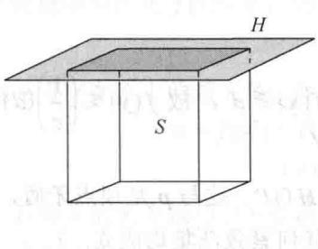  
$H \cap S$ 是二维的

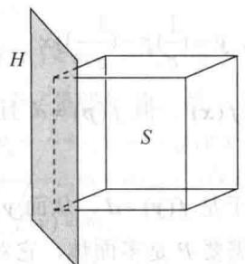  
$H \cap S$ 是一维的

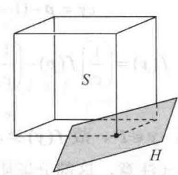  
图 8-21  
$H \cap S$ 是零维的

多面体的大部分应用与顶点有关，这是因为它们具有如下定义中所描述的特殊性质.

定义 设 S 是凸集，若点 p 不在 S 中任何线段的内部，则称点 p 为 S 的极端点。更为准确地，若 $x, y \in S$ ，且 $p \in \overline{xy}$ ，则 p = x 或 p = y。S 中所有极端点的集合称为 S 的轮廓。

任何紧致凸集 S 的顶点都必然是 S 的极端点. 此结论在如下定理 14 的证明中证实. 如果所考虑的多面体可表示为 $P = \text{conv}\{\nu_{1}, \cdots, \nu_{k}\}, \nu_{1}, \cdots, \nu_{k} \in \mathbb{R}^{n}$ ，则知道 $\nu_{1}, \cdots, \nu_{k}$ 是 P 的极端点通常是有益的，然而它们可能包含多余的点. 例如，某些向量 $\nu_{i}$ 可能是多面体的棱的中点. 当然，此时 $\nu_{i}$ 在构造凸包时并不真正需要用到. 下面的定义描述了顶点的性质，使得它们成为极端点.

定义 集合 $\{v_{1},\cdots,v_{k}\}$ 是多面体 P 的最小代表元，若 $P=\text{conv}\{v_{1},\cdots,v_{k}\}$ ，且对每个 $i=1,\cdots,k, v_{i} \notin \text{conv}\{v_{j}:j \neq i\}$ .

每个多面体都有一个最小代表元. 设 $P = \text{conv}\{\nu_{1}, \cdots, \nu_{k}\}$ ，若某个 $\nu_{i}$ 是其他点的凸组合，则 $\nu_{i}$ 可从点集中消去而不改变凸包. 重复这个过程，直到剩下最小代表元. 可以证明最小代表元是唯一的.

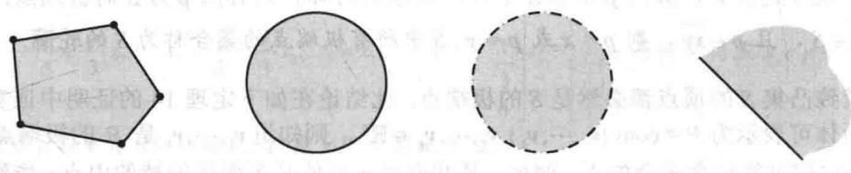  
图 8-22  
图 8-23
</Example>

<Knowledge title="定理 14">
$M=\{v_{1},\cdots,v_{k}\}$ 是多面体 P 的最小代表元，则下面三个命题是等价的：
a. $p \in M$ .
b. p 是 P 的顶点.
c. p 是 P 的极端点.

<Solution title="证明">
(a) $\Rightarrow$ (b). 设 $p \in M$ 且令 $Q = \text{conv}\{\nu: \nu \in M, \nu \neq p\}$ . 由 $M$ 的定义知, $p \notin Q$ , 又因为 $Q$ 是紧致的, 故由定理13知, 存在超平面 $H'$ 严格分割 $\{p\}$ 与 $Q$ . 设 $H$ 是过点 $p$ 且平行于 $H'$ 的超平面, 见图8-22.

那么 $Q$ 位于由 $H$ 界定的闭的半空间 $H^{+}$ 的一侧，从而 $P \subseteq H^{+}$ 。因而， $H$ 在点 $\pmb{p}$ 支撑 $P$ 。进而 $\pmb{p}$ 是 $P$ 中位于 $H$ 上的唯一点，故 $H \cap P = \{\pmb{p}\}$ ， $\pmb{p}$ 是 $P$ 的顶点。

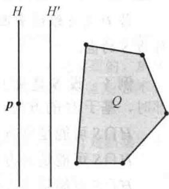

(b)⇒(c). 设 p 是 P 的顶点，则存在超平面 H=[f:d]，使得 $H \cap P = \{p\}$ 且 $f(P) \geqslant d$ . 若 p 不是极端点，则存在 P 上的点 x 和 y，使得 $p = (1 - c)x + c y$ ，0 &lt; c &lt; 1，即

$$
c \mathbf {y} = \mathbf {p} - (1 - c) \mathbf {x}, \mathbf {y} = (\frac {1}{c}) \mathbf {p} - (\frac {1}{c} - 1) \mathbf {x}
$$

于是满足 $f(\pmb {y}) = \left(\frac{1}{c}\right)f(\pmb {p}) - \left(\frac{1}{c} -1\right)f(\pmb {x})$ ．但 $f(\pmb {p}) = d$ 且 $f(x)\geqslant d$ ，故 $f(\pmb {y})\leqslant \left(\frac{1}{c}\right)(d) - \left(\frac{1}{c} -1\right)\times$ $(d) = d$ 另一方面， $\pmb {y}\in P$ ，故 $f(\pmb {y})\geqslant d$ ．于是 $f(\pmb {y}) = d$ ，从而 $\pmb {y}\in H\cap P$ ．这与 $\pmb{p}$ 是顶点矛盾，故 $\pmb{p}$ 一定是极端点.（注意，这部分证明不需要 $P$ 是多面体，它对任何紧致凸集均成立.）

(c)⇒(a). 显然 P 的任何极端点属于 M.
</Solution>
</Knowledge>

<Example title="例 2">
回顾集合 $S$ 的轮廓是 $S$ 的极端点的集合. 定理14证明了 $\mathbb{R}^2$ 中多边形的轮廓是顶点集.（见图8-23）．闭球的轮廓是它的边界．开集没有极端点，故它的轮廓是空集．闭的半空间没有极端点，故它的轮廓是空集.

习题18要求证明凸集 $S$ 中的点 $\pmb{p}$ 是 $S$ 的极端点当且仅当 $\pmb{p}$ 从 $S$ 中除去时剩下的点仍然构成一个凸集。由此导出若 $S^{*}$ 为 $S$ 的任一子集且使得 $\operatorname{conv} S^{*}$ 与 $S$ 相等，则 $S^{*}$ 一定包含 $S$ 的轮廓。例2中的集合表明通常 $S^{*}$ 可能要比 $S$ 的轮廓大些。然而，正如定理15要证明的，当 $S$ 是紧致凸集时，我们可以取 $S^{*}$ 只是 $S$ 的轮廓就够了。因而，在满足其凸包等于 $S$ 的条件下，每个非空紧致凸集 $S$ 有极端点，且所有极端点的集合就是 $S$ 的最小子集。
</Example>

<Knowledge title="定理 15">
设 S 为非空紧致凸集，则 S 是它的轮廓（S 的极端点的集合）的凸包.

<Solution title="证明">
对 S 的维数运用归纳法证明 ① .

定理 15 的一个重要应用是下面的定理，它是线性规划发展中关键的理论成果之一。线性函数是连续的，而连续函数在紧致集上总可以取得最大值和最小值。定理 16 的意义在于，对紧致凸集来说，最大值（最小值）实际上可以在 S 的极端点取得。
</Solution>
</Knowledge>

<Knowledge title="定理 16">
设 f 是定义在非空的紧致凸集 S 上的线性函数. 则存在 S 的极端点 $\hat{v}$ 和 $\hat{w}$ ，使得

$$
f (\hat {\pmb {v}}) = \max _ {\pmb {v} \in S} f (\pmb {v}) \text {且} f (\hat {\pmb {w}}) = \min _ {\pmb {v} \in S} f (\pmb {v})
$$

<Solution title="证明">
假定 f 在 S 的某点 $v'$ 达到 S 上的最大值 m，即 $f(v') = m$ 。我们希望证明 S 存在一个极端点具有相同的性质。由定理 15 知， $v'$ 是 S 的极端点和凸组合，即存在 S 中的极端点 $v_{1}, \cdots, v_{k}$ 及非负数 $c_{1}, \cdots, c_{k}$ ，使得

$$
\pmb {v} ^ {\prime} = c _ {1} \pmb {v} _ {1} + \dots + c _ {k} \pmb {v} _ {k} \text {且} c _ {1} + \dots + c _ {k} = 1
$$

若 $S$ 中没有极端点满足 $f(\pmb {v}) = m$ ，则

$$
f (\boldsymbol {v} _ {i}) <   m, i = 1, \dots , k
$$

这是因为 $m$ 是 $f$ 在 $S$ 上的最大值. 但由于 $f$ 是线性的, 故

$$
\begin{array}{r l} m & = f (\boldsymbol {v} ^ {\prime}) = f (c _ {1} \boldsymbol {v} _ {1} + \dots + c _ {k} \boldsymbol {v} _ {k}) = c _ {1} f (\boldsymbol {v} _ {1}) + \dots + c _ {k} f (\boldsymbol {v} _ {k}) \\ & <   c _ {1} m + \dots + c _ {k} m = m (c _ {1} + \dots + c _ {k}) = m \end{array}
$$

这个矛盾表明 S 的某个极端点 $\hat{v}$ 必满足 $f(\hat{v}) = m$ .

对于 $\hat{w}$ 的证明类似.
</Solution>
</Knowledge>

<Example title="例 3">
设 $\mathbb{R}^2$ 中的点 $p_1 = \begin{bmatrix} -1 \\ 0 \end{bmatrix}, p_2 = \begin{bmatrix} 3 \\ 1 \end{bmatrix}, p_3 = \begin{bmatrix} 1 \\ 2 \end{bmatrix}$ ，且 $S = \operatorname{conv}\{p_1, p_2, p_3\}$ 。对下面的每个线性函数 $f$ ，求 $f$ 在 $S$ 上的最大值 $m$ ，并求 $S$ 上所有满足 $f(x) = m$ 的点 $x$ 。

a. $f_1(x_1, x_2) = x_1 + x_2$ b. $f_2(x_1, x_2) = -3x_1 + x_2$ c. $f_3(x_1, x_2) = x_1 + 2x_2$

<Solution title="解">
由定理16，最大值在 $S$ 的某个极端点取得。故为了求得 $m$ ，需算出 $f$ 在每个极端点的值，并选出最大值。

a. $f_{1}(p_{1})=-1$ , $f_{1}(p_{2})=4$ , $f_{1}(p_{3})=3$ , 故 $m_{1}=4$ . 画出直线 $f_{1}(x_{1},x_{2})=m_{1}$ ，即 $x_{1}+x_{2}=4$ ，并注意到 $x=p_{2}$ 是 S 上唯一使得 $f_{1}(x)=4$ 的点. 见图 8-24a.

b. $f_{2}(p_{1})=3$ , $f_{2}(p_{2})=-8$ , $f_{2}(p_{3})=-1$ , 故 $m_{2}=3$ . 画出直线 $f_{2}(x_{1},x_{2})=m_{2}$ , 即 $-3x_{1}+x_{2}=3$ , 并注意到 x=p\_\{1\} 是 S 上唯一使得 $f_{2}(x)=3$ 的点. 见图 8-24b.

c. $f_{3}(\boldsymbol{p}_{1})=-1$ , $f_{3}(\boldsymbol{p}_{2})=5$ , $f_{3}(\boldsymbol{p}_{3})=5$ , 故 $m_{3}=5$ . 画出直线 $f_{3}(x_{1},x_{2})=m_{3}$ ，即 $x_{1}+2x_{2}=5$ . 这里 $f_{3}$ 在 $p_{2}, p_{3}$ 取得最大值，从而在 $p_{2}$ 和 $p_{3}$ 的凸包上的每一点取得最大值. 见图 8-24c.

例3中对于 $\mathbb{R}^2$ 空间说明的情形也适用于高维空间. 线性函数 $f$ 在多面体 $P$ 上的最大值在支撑超平面与 $P$ 的交点处取得. 这个交点要么是 $P$ 的单个极端点, 要么是 $P$ 的 2 个或更多极端点的凸包. 在每种情况下, 交集都是一个多面体, 且它的极端点构成了 $P$ 的极端点的子集.

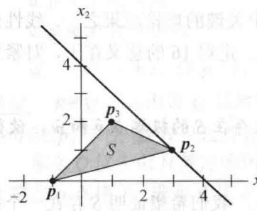  
a） $x_{1} + x_{2} = 4$

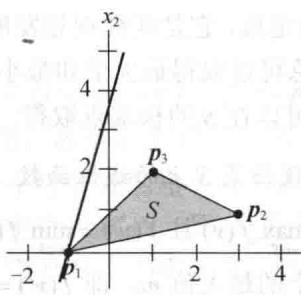  
b) $-3x_{1}+x_{2}=3$  
图 8-24

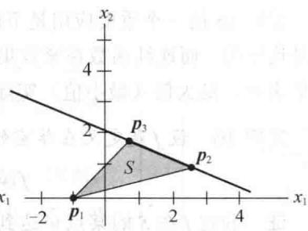  
c) $x_{1} + 2x_{2} = 5$

由定义，多面体是有限点集的凸包。这是多面体的显式表达式，因为它指定了集合中的所有点。多面体也可以隐式表示为有限个闭的半空间的交集。例4说明了 $\mathbb{R}^2$ 空间中的这个情形。
</Solution>
</Example>

<Example title="例 4">
设 $\mathbb{R}^2$ 中的点 $p_1 = \begin{bmatrix} 0\\ 1 \end{bmatrix},p_2 = \begin{bmatrix} 1\\ 0 \end{bmatrix},p_3 = \begin{bmatrix} 3\\ 2 \end{bmatrix}$ ，且 $S = \mathrm{conv}\left\{\pmb {p}_1,\pmb {p}_2,\pmb {p}_3\right\}$ .由简单的代数可知，过点 $p_1$ 和 $p_2$ 的直线为 $x_{1} + x_{2} = 1$ ，且 $S$ 在满足下列条件的直线的一侧：

$x_{1} + x_{2}\geqslant 1$ ，或等价地， $-x_{1} - x_{2}\leqslant -1$

类似地，过点 $p_2$ 和 $p_3$ 的直线为 $x_{1} - x_{2} = 1$ ，且 $S$ 在满足下面条件的直线的一侧：

$$
x _ {1} - x _ {2} \leqslant 1
$$

同样，过点 $p_3$ 和 $p_1$ 的直线为 $-x_1 + 3x_2 = 3$ ，且 $S$ 在满足下面条件的直线的一侧：

$$
- x _ {1} + 3 x _ {2} \leqslant 3
$$

见图8-25.于是 $S$ 可视为下面线性不等式组的解集：

$$
\begin{array}{l} - x _ {1} - x _ {2} \leqslant - 1 \\ x _ {1} - x _ {2} \leqslant 1 \\ - x _ {1} + 3 x _ {2} \leqslant 3 \end{array}
$$

这个线性不等式组可以写成 $Ax \leqslant b$ ，其中

$$
A = \left[ \begin{array}{c c} - 1 & - 1 \\ 1 & - 1 \\ - 1 & 3 \end{array} \right], \quad \boldsymbol {x} = \left[ \begin{array}{c} x _ {1} \\ x _ {2} \end{array} \right], \quad \boldsymbol {b} = \left[ \begin{array}{c} - 1 \\ 1 \\ 3 \end{array} \right]
$$
</Example>

<Note>
两个向量之间的不等号,例如 Ax 与 b 之间的不等号是用于两个向量每一个对应坐标之间的.

第9章中，有必要将多面体的隐式表达式用多面体的最小代表元所代替，它列出了多面体的所有极端点。在简单的情形中，图形法求解是可行的。下面的例子说明了当图形中的几个我们感兴趣的点靠得很近而无法确认时的处理方法。

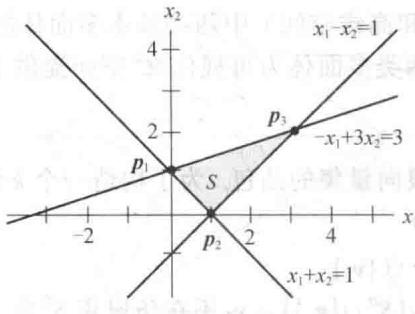  
图 8-25
</Note>

<Example title="例 5">
设 $P$ 是 $\mathbb{R}^2$ 中的点集且满足 $Ax\leqslant b$ ，其中

$$
A = \left[ \begin{array}{l l} 1 & 3 \\ 1 & 1 \\ 3 & 2 \end{array} \right], \quad b = \left[ \begin{array}{c} 1 8 \\ 8 \\ 2 1 \end{array} \right]
$$

且 $x \geqslant 0$ ，求 $P$ 的最小代表元.

<Solution title="解">
条件 $x \geqslant 0$ 说明 $P$ 在 $\mathbb{R}^2$ 中的第一象限，这是线性规划问题中的典型条件。 $Ax \leqslant b$ 中的三个不等式涉及三条边界线：

$$
x _ {1} + 3 x _ {2} = 1 8
$$

$$
x _ {1} + x _ {2} = 8
$$

$$
3 x _ {1} + 2 x _ {2} = 2 1
$$

三条直线的斜率都是负的，故 $P$ 的大体形状是很容易想象的。大体勾画出的三条直线将表明 $(0,0),(7,0)(0,6)$ 为多面体 $P$ 的顶点。

直线（1）、（2）和（3）的交点情况如何？有时候从图形中明显地知道有哪些交点。但如果不明显时，如下的代数过程会有作用：

当找到对应于两个不等式的交点时，在其他不等式中检验看此点是否在多面体中.

（1）和（2）的交点是 $p_{12} = (3,5)$ ，两个坐标都是非负的，故 $p_{12}$ 满足除第三个不等式的所有不等式。检验得，

$$
3 (3) + 2 (5) = 1 9 <   2 1
$$

交点满足不等式（3），故 $p_{12}$ 在多面体中.

（2）和（3）的交点是 $p_{23} = (5,3)$ 故 $p_{23}$ 满足除第一个不等式的所有不等式.检验得，

$$
1 (5) + 3 (3) = 1 4 <   1 8
$$

说明 $p_{23}$ 在多面体中.

最后（1）和（3）的交点是 $p_{13} = \left(\frac{27}{7},\frac{33}{7}\right)$ 。在不等式（2）中检验得

$$
1 \left(\frac {2 7}{7}\right) + 1 \left(\frac {3 3}{7}\right) = \frac {6 0}{7} \approx 8. 6 > 8
$$

因此 $p_{13}$ 不满足第二个不等式，这表明 $p_{13}$ 不在 $P$ 中.结论是多面体 $P$ 的最小代表元是

$$
\left\{\left[ \begin{array}{l} 0 \\ 0 \end{array} \right], \left[ \begin{array}{l} 7 \\ 0 \end{array} \right], \left[ \begin{array}{l} 3 \\ 5 \end{array} \right], \left[ \begin{array}{l} 5 \\ 3 \end{array} \right], \left[ \begin{array}{l} 0 \\ 6 \end{array} \right] \right\}
$$

本节其余部分将讨论 $\mathbb{R}^3$ （和高维空间）中两类基本多面体的构造。第一类出现在线性规划问题中，这是第9章的主题。两类多面体为可视化 $\mathbb{R}^4$ 空间提供了一种著名的方法。

单纯形是仿射不相关的有限向量集的凸包. 为了构造一个 $k$ 维的单纯形（或 $k$ -单纯形），过程如下：

0 维单纯形 $S^{0}$ ：单个点 $\{v_{1}\}$

1 维单纯形 $S^1$ ： $\operatorname{conv}\left(S^0 \cup \{\pmb{v}_2\}\right)$ ， $\pmb{v}_2$ 不在仿射集 $S^0$ 中

2 维单纯形 $S^2$ ： $\operatorname{conv}\left(S^1\cup \{\pmb {v}_3\}\right)$ ， $\pmb{v}_{3}$ 不在仿射集 $S^1$ 中

k 维单纯形 $S^{k}$ : $\mathrm{conv}\left(S^{k-1} \cup \{\boldsymbol{v}_{k+1}\}\right)$ , $v_{k+1}$ 不在仿射集 $S^{k-1}$ 中

单纯形 $S^1$ 是一线段. 三角形 $S^2$ 由 $S^1$ 及不在包含 $S^1$ 的直线上选取的一点 $\pmb{\nu}_3$ 一起构作凸包而得. （见图8-26.）四面体 $S^3$ 由 $S^2$ 及不在包含 $S^2$ 的平面上的一点 $\pmb{\nu}_4$ 一起构作凸包而得.

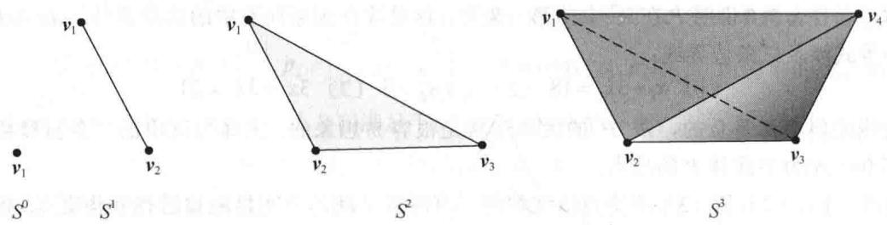  
图 8-26

在继续讲述之前，我们考察一下正在呈现的一些模式。三角形 $S^2$ 有三条边，每条边是一条线段，如 $S^1$ 。这三条线段是从哪里来呢？其中一条是 $S^1$ ，另外两条中的一条来自端点在 $\pmb{v}_2$ 与新点 $\pmb{v}_3$ 的连线，第三条来自另一端点 $\pmb{v}_1$ 与新点 $\pmb{v}_3$ 的连线。你也可以把这个形成过程说成是把 $S^1$ 的每个端点延伸（或拉伸）到 $S^2$ 中的一条线段。

图8-26中的四面体 $S^3$ 有4个三角形面．其中一个是原三角形面 $S^2$ ，而其他三个来自向外延伸 $S^2$ 的三条边至新点 $\pmb{v}_4$ ．也要注意 $S^2$ 的三个顶点同时被拉伸形成 $S^3$ 的三条棱，而 $S^3$ 的其他三条棱来自 $S^2$ 的边．这个观点启发我们如何去“可视化”四维单纯形 $S^4$

四维单纯形 $S^4$ （五边形）是由 $S^3$ 与 $S^3$ 所在的三维空间之外的一点 $\pmb{v}_5$ 构作凸包而得的。在三维空间中画出一个完整的图当然是不可能的，但图8-27是值得参考的： $S^4$ 有5个顶点，其中任何4个顶点确定形如四面体的一个面。例如，图中侧重显示了顶点分别为 $\pmb{v}_1, \pmb{v}_2, \pmb{v}_4, \pmb{v}_5$ 和 $\pmb{v}_2, \pmb{v}_3, \pmb{v}_4, \pmb{v}_5$ 的两个面。单纯形 $S^4$ 共有5个这样的面。图8-27给定了 $S^4$ 的10条棱，通过图中这些棱也“可视化”了 $S^4$ 的10个三角形面。

图 8-28 展示了四维单纯形 $S^{4}$ 的另一种表示，这次第 5 个顶点在四面体 $S^{3}$ 的 “里面”，高亮显示的四面体的面也在 $S^{3}$ 的 “里面”.

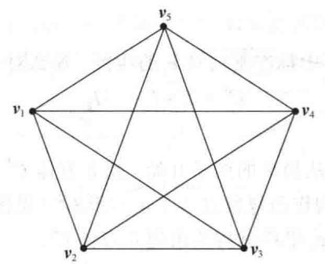

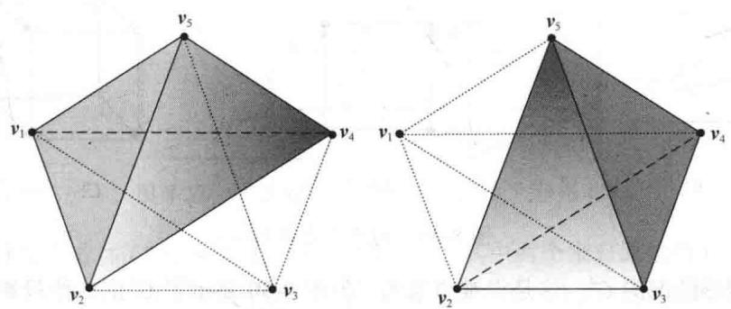  
图8-27 四维单纯形 $S^4$ 投影到 $\mathbb{R}^2$ 上，侧重显示四面体的两个面

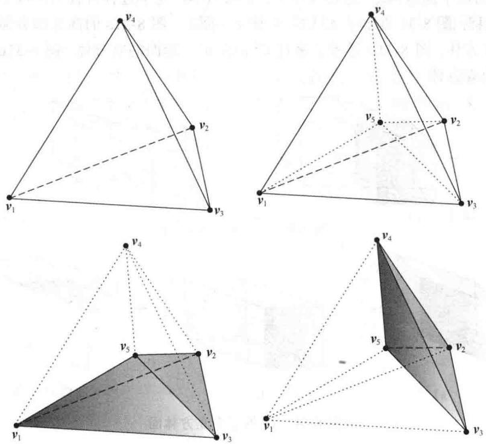  
图8-28 $S^4$ 的第5个顶点在 $S^3$ “里面”

$C^2$
</Solution>
</Example>

## 超立方体

设 $I_{i} = \overline{\mathbf{0e}_{i}}$ 是从原点0到 $\mathbb{R}^n$ 中标准基向量 $\pmb{e}_i$ 的线段.那么对于 $k(1\leqslant k\leqslant n)$ ，向量和

$$
C ^ {k} = I _ {1} + I _ {2} + \dots I _ {k}
$$

称为 k 维超立方体.

为了看见 $C^k$ 的构造，我们从简单的例子开始。超立方体 $C^1$ 就是线段 $I_1$ 。若 $C^1$ 沿 $\pmb{e}_2$ 平移，则由起始位置与最后位置一起构作凸包就描述了正方形 $C^2$ （见图8-29）。 $C^2$ 沿 $\pmb{e}_3$ 平移就构造出立方体 $C^3$ 。类似地， $C^3$ 沿向量 $\pmb{e}_4$ 平移就构造出超立方体 $C^4$ 。

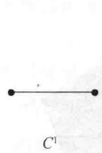

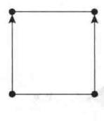

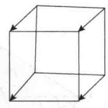  
图8-29 构造立方体 $C^3$  
$C^3$

同样，对四维情况的 $C^4$ ，这是很难想象的，但图8-30显示了 $C^4$ 的二维投影。拉伸 $C^3$ 的每一条棱进入 $C^4$ 的一个正方形面中，这个过程可视为形成 $C^4$ 的一个正方形面（2-面）的过程。类似地，拉伸 $C^3$ 的每个面进入 $C^4$ 的立方体面（3-面）中，这个过程可视为形成 $C^4$ 的一个立方体面（3-面）的过程。图8-31展示了 $C^4$ 的三个面（3-面）。图8-31a的高亮部分显示了来自 $C^3$ 左边正方形面的立方体。图8-31b显示了来自 $C^3$ 前面正方形面的立方体。图8-31c显示了来自 $C^3$ 顶部正方形面的立方体。

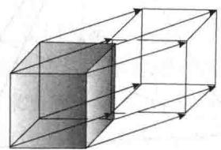

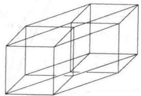  
图8-30 $C^4$ 投影到 $\mathbb{R}^2$ 上

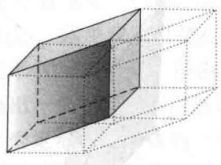  
a)

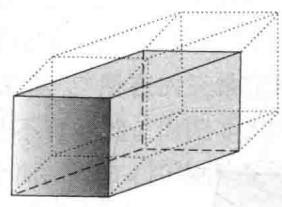  
b)

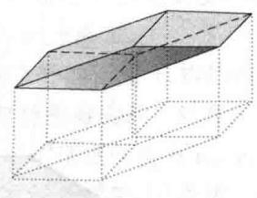  
图8-31 $C^4$ 的三个立方体面  
c)

图 8-32 展示了 $C^{4}$ 的另一种表示，在这里平移后的立方体位于 $C^{3}$ “里面”。这种方式比较容易 “看到” $C^{4}$ 的立方体面（3-面），因为没有干扰因素。

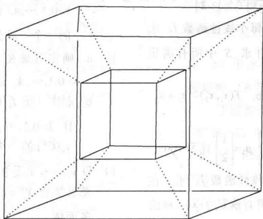  
图8-32 平移 $C^3$ 的图像到 $C^3$ “里面”获得 $C^4$

总之，四维超立方体 $C^4$ 有8个立方体面（3-面）。其中两个来自原始的 $C^3$ 及平移后的 $C^3$ 其他6个由 $C^3$ 的6个正方形面拉伸（缩）进入 $C^4$ 的立方体面（3-面）所形成。 $C^4$ 的2-面来自原始的 $C^3$ 的6个正方形面和平移后的 $C^3$ 的6个正方形面，以及原始的 $C^3$ 的12条棱拉伸（缩）进入 $C^4$ 的正方形面（2-面）所形成。因而有 $2 \times 6 + 12 = 24$ 个正方形面（2-面）。为了计算棱数，把 $C^3$ 的棱数乘以2再加上 $C^3$ 的顶点数。于是 $C^4$ 的棱数为 $2 \times 12 + 8 = 32$ 。 $C^4$ 中的顶点来自 $C^3$ 及其平移后的 $C^3$ 的顶点，故有 $2 \times 8 = 16$ 个顶点。

多面体研究中真正著名的结论之一是下面的公式，其首次证明由欧拉（Leonard Euler，1707—1783）给出。它为多面体中不同维数的面的个数建立了一个简单的关系。为了简化公式，用 $f_{k}(P)$ 表示n维多面体P中k维面的个数。 ① 那么有

$$
\mathrm{欧拉公式:} \sum_ {k = 0} ^ {n - 1} (- 1) ^ {k} f _ {k} (P) = 1 + (- 1) ^ {n - 1}
$$

特别地，当 n=3 时， $v-e+f=2$ ，其中 v，e 和 f 分别为 P 的顶点、棱和面的个数。

<Block title="练习题">
设多面体 $P$ 满足不等式 $Ax \leqslant b$ ，其中

$$
A = \left[ \begin{array}{l l} 1 & 3 \\ 1 & 2 \\ 2 & 1 \end{array} \right], \quad \boldsymbol {b} = \left[ \begin{array}{c} 1 2 \\ 9 \\ 1 2 \end{array} \right]
$$

且 $x \geqslant 0$ 。求 $P$ 的最小代表元.
</Block>

<Block title="习题8.5">
1. 给定 $\mathbb{R}^2$ 中的点 $p_1 = \begin{bmatrix} 1 \\ 0 \end{bmatrix}, p_2 = \begin{bmatrix} 2 \\ 3 \end{bmatrix}, p_3 = \begin{bmatrix} -1 \\ 2 \end{bmatrix}$ ，令 $S = \operatorname{conv}\{p_1, p_2, p_3\}$ 。对下面的每个线性函数 $f$ ，求 $f$ 在 $S$ 上的最大值 $m$ ，并求 $S$ 中所有满足 $f(x) = m$ 的点 $x$ .

a. $f(x_1, x_2) = x_1 - x_2$ b. $f(x_1, x_2) = x_1 + x_2$ c. $f(x_1, x_2) = -3x_1 + x_2$

2. 设 $R^{2}$ 中的点 $p_{1}=\begin{bmatrix}0\\ -1\end{bmatrix},p_{2}=\begin{bmatrix}2\\ 1\end{bmatrix},p_{3}=\begin{bmatrix}1\\ 2\end{bmatrix}$ 且 S=conv $\left\{p_{1},p_{2},p_{3}\right\}$ . 对下面的每个线性函数 f，求 f 在 S 上的最大值 m，并求 S 中所有满足 $f(x)=m$ 的点 x.
a. $f(x_{1},x_{2})=x_{1}+x_{2}$ b. $f(x_{1},x_{2})=x_{1}-x_{2}$ c. $f(x_{1},x_{2})=-2x_{1}+x_{2}$

3. 重复习题1，其中 $m$ 是 $f$ 在 $S$ 上的最小值.  
4. 重复习题2，其中 $m$ 是 $f$ 在 $S$ 上的最小值.  
在习题5\~8中，求由不等式 $Ax \leqslant b$ 且 $x \geqslant 0$ 定义的多面体的最小代表元.  
5. $A = \begin{bmatrix} 1 & 2 \\ 3 & 1 \end{bmatrix}, \quad b = \begin{bmatrix} 10 \\ 15 \end{bmatrix}$ 6. $A = \begin{bmatrix} 2 & 3 \\ 4 & 1 \end{bmatrix}, \quad b = \begin{bmatrix} 18 \\ 16 \end{bmatrix}$ 7. $A = \begin{bmatrix} 1 & 3 \\ 1 & 1 \\ 4 & 1 \end{bmatrix}, \quad b = \begin{bmatrix} 18 \\ 10 \\ 28 \end{bmatrix}$ 8. $A = \begin{bmatrix} 2 & 1 \\ 1 & 1 \\ 1 & 2 \end{bmatrix}, \quad b = \begin{bmatrix} 8 \\ 6 \\ 7 \end{bmatrix}$

9. 设 $S = \{(x, y): x^2 + (y - 1)^2 \leqslant 1\} \cup \{(3, 0)\}$ . 原点是凸包 $S$ 的极端点吗？原点是凸包 $S$ 的顶点吗？

10. 求 $\mathbb{R}^2$ 中闭凸集 $S$ ，使得它的轮廓 $P$ 是非空集但 $\operatorname{conv} P \neq S$ .

11. 求 $\mathbb{R}^2$ 中有界凸集 $S$ ，使得它的轮廓 $P$ 是非空集但 $\operatorname{conv} P \neq S$ .

12. a. 确定五维单纯形 $S^{5}$ 中 k-面的个数，其中 $k=0,1,\cdots,4$ . 证明你的答案满足欧拉公式.

b. 制作一张 $f_{k}(S^{n})$ 值的图表， $n=1,\cdots,5$ 且 $k=0,1,\cdots,4$ . 你能看出规律吗？猜测 $f_{k}(S^{n})$ 的一个一般公式.

13. a. 确定五维超立方体 $C^{5}$ 中 k-面的个数， $k=0,1,\cdots,4$ . 证明你的答案满足欧拉公式.
b. 制作一张 $f_{k}(C^{n})$ 值的图表，其中 $n=1,\cdots,5$ 且 $k=0,1,\cdots,4$ . 你能看出规律吗？猜测 $f_{k}(C^{n})$ 的一个一般公式.

14. 设 $v_{1}, \cdots, v_{k}$ 是 $R^{n}$ 中线性无关的向量 ( $1 \leqslant k \leqslant n$ ). 那么集合 $X^{k} = \text{conv}\left\{\pm v_{1}, \cdots, \pm v_{k}\right\}$ 称为 k 维交叉多面体.
a. 画出 $X^{1}$ , $X^{2}$ .
b. 确定三维交叉多面体 $X^{3}$ 中 k-面的个数，
k=0,1,2. $X^{3}$ 另外的名称是什么？
c. 确定四维交叉多面体 $X^{4}$ 中 k-面的个数，
k=0,1,2,3. 证明你的答案满足欧拉公式.
d. 求 $f_{k}(X^{n})$ 的公式—— $X^{n}$ 中 k-面的个数， $0 \leqslant k \leqslant n - 1$ .

15. k-金字塔 $P^{k}$ 是 k-1 维多面体 Q 与点 $x \notin \operatorname{aff} Q$ 的凸包. 求下列公式, 用 $f_{j}(Q) (j=0,\cdots,n-1)$ 表达.
a. $P^{n}$ 的顶点个数: $f_{0}(P^{n})$ .
b. $P^{n}$ 中 k-面的个数: $f_{k}(P^{n})$ , $1 \leqslant k \leqslant n-2$ .
c. $P^{n}$ 中 n-1 维面的个数: $f_{n-1}(P^{n})$ .
在习题 16 和 17 中判断正误，并证明你的答案.

16. a. 多面体是有限点集的凸包.
b. 设 p 是凸集 S 的极端点. 若 $u, v \in S$ , $p \in uv$ ,
且 $p \neq u$ ，那么 p = v.
c. 若 S 是 $R^{n}$ 上的非空凸子集，则 S 是其轮廓的凸包.
d. 四维单纯形 $S^{4}$ 有 5 个面，每个面是一个三维的四面体.

17. a. $\mathbb{R}^3$ 中的立方体有5个面. b. 点 $p$ 是多面体 $P$ 的极端点当且仅当它是 $P$ 的顶点.

c. 若 $S$ 是非空紧致凸集，且有线性函数在点 $\pmb{p}$ 达到最大值，则 $\pmb{p}$ 是 $S$ 的极端点.  
d. 二维多面体总是具有相同的顶点数及棱数

18. 设 $\pmb{\nu}$ 是凸集 $S$ 中的一元素. 证明: $\pmb{\nu}$ 是 $S$ 的极端点当且仅当集合 $\{x \in S : x \neq \nu\}$ 是凸集.

19. 若 $c \in \mathbb{R}$ 且 $S$ 是一集合，定义 $cS = \{\mathbf{cx} : \mathbf{x} \in S\}$ . 设 $S$ 是凸集且 $c > 0, d > 0$ . 证明： $cS + dS = (c + d)S$ .

20. 举例证明习题19中 $S$ 的凸性是必要的.  
21. 若 $A$ 和 $B$ 是凸集，证明 $A + B$ 是凸集.  
22. 多面体（三维的）称为正多面体，若它所有的面是全等正多边形且在顶点处的所有角都是相等的. 利用以下细节证明仅有5种正多面体.
</Block>

<Block title="练习题答案">
a. 设正多面体有 r 个面，每个面是 k 边正多边形，且 s 条棱在每个顶点相交。用 v 和 e 分别表示多面体的顶点数和棱数，证明 kr=2e, sv=2e.
b. 使用欧拉公式证明 $\frac{1}{s} + \frac{1}{k} = \frac{1}{2} + \frac{1}{e}$ .

c. 求（b）中方程满足问题的几何约束的所有整数解。（k 与 s 可以有多少？）

下面的信息供参考：5 个正多面体是四面体（4，6，4），立方体（8，12，6），八面体（6，12，8），十二面体（20，30，12），二十面体（12，30，20）。（括号里的数字分别表示顶点数、棱数、面数。）

矩阵不等式 $Ax \leqslant b$ 产生如下不等式组：

(a) $x_{1} + 3x_{2}\leqslant 12$ (b) $x_{1} + 2x_{2}\leqslant 9$ (c) $2x_{1} + x_{2}\leqslant 12$

条件 $x \geqslant 0$ 说明多面体在平面的第一象限，一个顶点是 $(0, 0)$ 。当 $x_{2} = 0$ 时，三条直线在 $x_{1}$ 上的截距是 12，9 和 6，故（6，0）是顶点。当 $x_{1} = 0$ 时，三条直线在 $x_{2}$ 上的截距是 4，4.5 和 12，故（0，4）是顶点。三条直线如何相交于 $x_{1}$ 和 $x_{2}$ 的正值？（a）与（b）的交点是 $p_{\mathrm{ab}} = (3, 3)$ 。在（c）上检验 $p_{\mathrm{ab}}$ 得 $2(3) + 1(3) = 9 < 12$ ，故 $p_{\mathrm{ab}}$ 在 $P$ 中。（b）与（c）的交点是 $p_{\mathrm{bc}} = (5, 2)$ 。在（a）上检验 $p_{\mathrm{bc}}$ 得 $1(5) + 3(2) = 11 < 12$ ，故 $p_{\mathrm{bc}}$ 在 $P$ 中。（a）与（c）的交点是 $p_{\mathrm{ac}} = (4.8, 2.4)$ 。在（b）上检验 $p_{\mathrm{ac}}$ 得 $1(4.8) + 2(2.4) = 9.6 > 9$ ，故 $p_{\mathrm{ac}}$ 不在 $P$ 中。

最后，多面体的五个顶点（极端点）是 $(0, 0)$ ， $(6, 0)$ ， $(5, 2)$ ， $(3, 3)$ 和 $(0, 4)$ ，这些点构成 $P$ 的最小代表元。如图8-33所示。

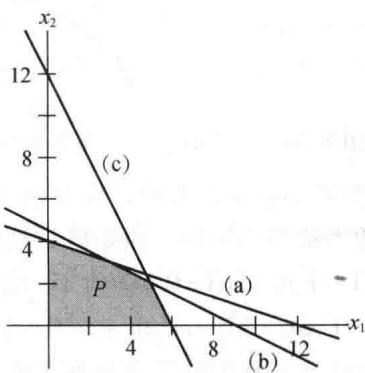  
图 8-33

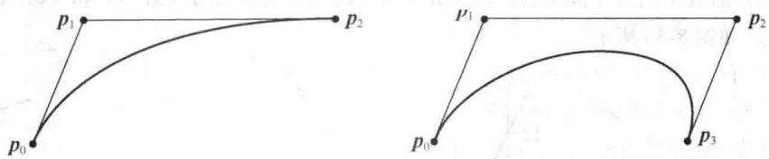  
图 8-34 二次和三次贝塞尔曲线
</Block>
