import Guide from '@/components/Guide.astro';
import Knowledge from '@/components/Knowledge.astro';
import Example from '@/components/Example.astro';
import Analysis from '@/components/Analysis.astro';
import Solution from '@/components/Solution.astro';
import Variant from '@/components/Variant.astro';
import Note from '@/components/Note.astro';
import Block from '@/components/Block.astro';
import Method from '@/components/Method.astro';
import Exercise from '@/components/Exercise.astro';

几千年以来，设计者用长细木条建造了一艘艘船体。近代，人们用长而柔韧的金属条架构出汽车和飞机的表面。重物与钉子把条片塑造成称为天然三次样条的光滑曲线。两个相邻控制点间（钉子或重物）的曲线有一个三次多项式的参数表达式。遗憾的是，由于钉子与重物在条片上具有作用力，这种曲线在控制点稍有位移时会影响整条曲线的形状。设计工程师们早就想局部地控制曲线——在这种控制中当移动一个控制点时仅影响曲线的一小部分。1962年，法国汽车工程师皮埃尔·贝塞尔通过增加额外的控制点与使用由他名字命名的一类曲线解决了这个问题。

## 贝塞尔曲线

如下所描述的曲线不仅在工程学而且在计算机图形学中都有着重要的应用。例如，它们可应用于 Adobe Illustrator 与 Macromedia Freehand 中，也可应用于程序设计语言中，如 OpenGL。这些曲线允许程序用相对少量的控制点来存储有关曲线段和表面的确切信息。对曲线段和表面的所有图形命令只需要用来计算控制点。曲线的特殊结构使之能通过“图形管道”加速其他计算，并把计算的终端显示在屏幕上。

8.3节的习题介绍了二次贝塞尔曲线，并且给出了构造高次贝塞尔曲线的一种方法。本节讨论二次和三次贝塞尔曲线，它们由三个或四个控制点 $p_0, p_1, p_2, p_3$ 确定。这些点可以是 $\mathbb{R}^2$ 或 $\mathbb{R}^3$ 中的点，亦可用齐次形式表示为 $\mathbb{R}^3$ ， $\mathbb{R}^4$ 空间中的点。这些曲线的标准表达式为

$$
\boldsymbol {w} (t) = (1 - t) ^ {2} \boldsymbol {p} _ {0} + 2 t (1 - t) \boldsymbol {p} _ {1} + t ^ {2} \boldsymbol {p} _ {2}\tag{1}
$$

$$
\boldsymbol {x} (t) = (1 - t) ^ {3} \boldsymbol {p} _ {0} + 3 t (1 - t) ^ {2} \boldsymbol {p} _ {1} + 3 t ^ {2} (1 - t) \boldsymbol {p} _ {2} + t ^ {3} \boldsymbol {p} _ {3}\tag{2}
$$

其中 $0 \leqslant t \leqslant 1$ .

图 8-34 给出两类典型的曲线. 通常, 曲线仅过起始与最终的控制点, 但贝塞尔曲线总是位于控制点的凸包里. (见 8.3 节的习题 21\~24.)

贝塞尔曲线之所以在计算机图形学中非常有用，这是由于它们的基本性质在线性变换和平移下保持不变。例如，A 是一个适当阶数的矩阵，由矩阵乘法的线性性质，对 $0 \leqslant t \leqslant 1$ ，有

$$
\begin{array}{r l} A \boldsymbol {x} (t) & = A [ (1 - t) ^ {3} \boldsymbol {p} _ {0} + 3 t (1 - t) ^ {2} \boldsymbol {p} _ {1} + 3 t ^ {2} (1 - t) \boldsymbol {p} _ {2} + t ^ {3} \boldsymbol {p} _ {3} ] \\ & = (1 - t) ^ {3} A \boldsymbol {p} _ {0} + 3 t (1 - t) ^ {2} A \boldsymbol {p} _ {1} + 3 t ^ {2} (1 - t) A \boldsymbol {p} _ {2} + t ^ {3} A \boldsymbol {p} _ {3} \end{array}
$$

新的控制点为 $Ap_{0},\cdots,Ap_{3}$ . 贝塞尔曲线平移的情况在习题 1 中考虑.

图 8-34 的曲线暗示控制点确定了曲线在起始和最终控制点处的切线。回顾微积分中对于任何参数形式的曲线，如 $y(t)$ ，曲线在点 $y(t)$ 的切线方向由导数 $y'(t)$ 给出，称为曲线的切向量。（导

数 $y'(t)$ 的计算是对 $y(t)$ 的各分量逐一求导.

<Example title="例 1">
确定贝塞尔曲线 $w(t)$ 在 $t = 0$ 和 $t = 1$ 处的切向量是如何与曲线的控制点相关联的. 解 把方程（1）展开为多项式形式：

$$
\boldsymbol {w} (t) = \left(1 - 2 t + t ^ {2}\right) \boldsymbol {p} _ {0} + \left(2 t - 2 t ^ {2}\right) \boldsymbol {p} _ {1} + t ^ {2} \boldsymbol {p} _ {2}
$$

那么由导数是函数的线性变换得，

$$
\boldsymbol {w} ^ {\prime} (t) = (- 2 + 2 t) \boldsymbol {p} _ {0} + (2 - 4 t) \boldsymbol {p} _ {1} + 2 t \boldsymbol {p} _ {2}
$$

故

$$
\begin{array}{l} \boldsymbol {w} ^ {\prime} (0) = - 2 \boldsymbol {p} _ {0} + 2 \boldsymbol {p} _ {1} = 2 (\boldsymbol {p} _ {1} - \boldsymbol {p} _ {0}) \\ \boldsymbol {w} ^ {\prime} (1) = - 2 \boldsymbol {p} _ {1} + 2 \boldsymbol {p} _ {2} = 2 (\boldsymbol {p} _ {2} - \boldsymbol {p} _ {1}) \end{array}
$$

例如，在 $p_{0}$ 的切向量的方向是从点 $p_{0}$ 指向 $p_{1}$ ，大小为 $p_{0}$ 到 $p_{1}$ 线段长度的 2 倍。注意，当 $p_{1} = p_{0}$ 时， $w'(0) = 0$ 。在这种情况下， $w(t) = (1 - t^{2})p_{1} + t^{2}p_{2}$ ，而且 $w(t)$ 的图形是从 $p_{1}$ 到 $p_{2}$ 的线段。
</Example>

## 两条贝塞尔曲线的连接

两条基本贝塞尔曲线可以首尾相连，使得第一条曲线 $x(t)$ 的终点是第二条曲线 $y(t)$ 的起点 $\pmb{p}_2$ 。这样组合成的连接曲线称为（在 $\pmb{p}_2$ 点）具有 $G^0$ 几何连续性的，这是由于这两段曲线在 $\pmb{p}_2$ 相连。如果点 $\pmb{p}_2$ 处曲线1的切线方向不同于曲线2的切线方向，那么一个“角”或方向的突然改变就会出现在 $\pmb{p}_2$ 点。见图8-35。

<figure class="vp-figure">
  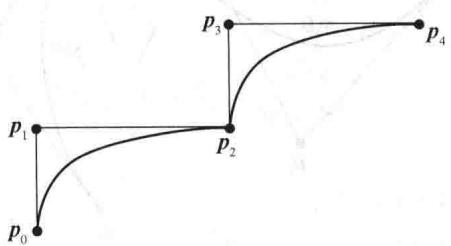
  <figcaption>图 8-35 $p_{2}$ 点处的 $G^{0}$ 连续性</figcaption>
</figure>

为了避免明显的弯曲，通常只需调整曲线，使其具有所谓的 $G^1$ 几何连续性，其中在点 $\pmb{p}_2$ 的两切向量方向相同。即导数 $x'(1)$ 与 $y'(0)$ 指向同一个方向，即使它们的大小不同。当切向量在 $\pmb{p}_2$ 相等时，切向量便在 $\pmb{p}_2$ 连续，这时称连接曲线具有 $C^1$ 连续性或 $C^1$ 参数连续性。图8-36a给出了 $G^1$ 连续性，图8-36b给出了 $C^1$ 连续性。

<figure class="vp-figure">
  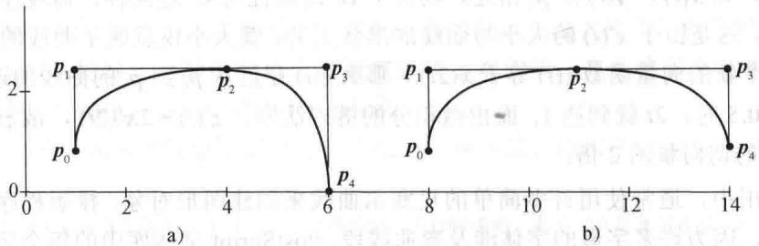
  <figcaption>图8-36 $G^{1}$ 连续性和 $C^1$ 连续性</figcaption>
</figure>

<Example title="例 2">
设 $x(t)$ ， $y(t)$ 分别是控制点 $\left\{p_{0}, p_{1}, p_{2}\right\}$ 与 $\left\{p_{2}, p_{3}, p_{4}\right\}$ 所确定的两条二次贝塞尔曲线。曲线在 $p_{2}=x(1)=y(0)$ 相连接。

a. 设连接曲线在 $p_{2}$ 具有 $G^{1}$ 连续性. 此条件在控制点上产生什么代数限制? 用几何语言表述此限制.

b. 若连续曲线在 $p_{2}$ 具有 $C^{1}$ 连续性又会怎么样？

<Solution title="解">
a. 由例1知， $x'(1)=2(p_{2}-p_{1})$ . 使用 $y(t)$ 的控制点取代 $w(t)$ 对应的控制点，由例1知， $y'(0)=2(p_{3}-p_{2})$ . $G^{1}$ 连续性意味着存在某个正常数 k，满足 $y'(0)=kx'(1)$ . 等价地，

$$
\boldsymbol {p} _ {3} - \boldsymbol {p} _ {2} = k (\boldsymbol {p} _ {2} - \boldsymbol {p} _ {1}), \quad k > 0\tag{3}
$$
</Solution>
</Example>

从几何上看，（3）式表明 $p_{2}$ 在从 $p_{1}$ 到 $p_{3}$ 的线段上。为了证明此结论，设 $t=(k+1)^{-1}$ ，注意 0&lt;t&lt;1。解得 $k=(1-t)/t$ 。把它代入（3）得 $p_{2}=(1-t)p_{1}+tp_{3}$ ，即证明结论。

b. $C^1$ 连续性意味着 $\pmb{y}'(0) = \pmb{x}'(1)$ . 因而 $2(\pmb{p}_3 - \pmb{p}_2) = 2(\pmb{p}_2 - \pmb{p}_1)$ , 故 $\pmb{p}_3 - \pmb{p}_2 = \pmb{p}_2 - \pmb{p}_1$ 且 $\pmb{p}_2 = (\pmb{p}_1 + \pmb{p}_3) / 2$ . 从几何上看, $\pmb{p}_2$ 是从 $\pmb{p}_1$ 到 $\pmb{p}_3$ 的线段中点. 见图8-36.

图 8-37 给出了两条三次贝塞尔曲线的 $C^{1}$ 连续性. 注意, 连接两段曲线之间的点在相邻控制点之间的线段的中点上.

<figure class="vp-figure">
  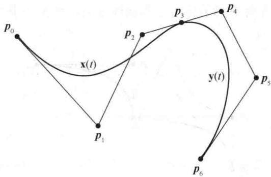
  <figcaption>图 8-37 两条三项贝塞尔曲线</figcaption>
</figure>

当两曲线具有 $C^1$ 连续性且二阶导数 $x''(1)$ 与 $y''(0)$ 相等时，它们具有 $C^2$ （参数）连续性。对于三次贝塞尔曲线这是可能的，但它很苛刻地限制控制点的位置。另一类曲线称为B-样条曲线，总是具有 $C^2$ 连续性，这是因为每对曲线共用三个控制点而不是一个。使用B-样条曲线绘制的图形具有更多的控制点，因而需更多的计算。本节的一些习题能让我们更好地认识这些曲线。

奇怪的是，若 $x(t)$ ， $y(t)$ 在 $p_3$ 相连，则对于 $G^1$ 连续性与 $C^1$ 连续性，曲线在点 $p_3$ 的光滑性通常是相同的，这是由于 $x'(t)$ 的大小与曲线的形状无关，其大小仅反映了曲线的数学参数特性。例如，如果一个新的向量函数 $z(t)$ 等于 $x(2t)$ ，那么 $z(t)$ 穿过从 $p_0$ 到 $p_3$ 的曲线的速度是原来的 2 倍，因为当 $t = 0.5$ 时， $2t$ 就到达 1。而由微积分的链式法则， $z'(t) = 2x'(2t)$ ，故 $z(t)$ 在 $p_3$ 的切向量是 $x(t)$ 在 $p_3$ 的切向量的 2 倍。

在实际应用中，通常使用许多简单的贝塞尔曲线来创建图形对象。排版程序提供了一个重要应用的例子，因为许多字母的字体涉及弯曲线段。PostScript 字体库中的每个字母存储为一套控制点集，同时带有关于如何使用直线段与贝赛尔曲线构建字母“轮廓”的信息。放大这样一个字母大体需要每个控制点的坐标乘以一个常数因子. 一旦算出字母的轮廓就需要填充字母适当的实体部分. 图8-38说明了PostScript字体库中的一个字母的情形. 注意控制点.

<figure class="vp-figure">
  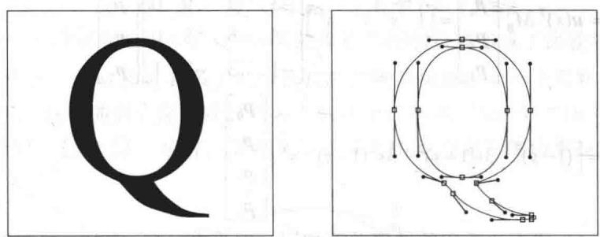
  <figcaption>图8-38 PostScript字符</figcaption>
</figure>

## 贝塞尔曲线的矩阵方程

由于贝塞尔曲线是控制点的线性组合，用多项式给出权，因此 $x(t)$ 的表达式可写为

$$
\begin{array}{r l} \boldsymbol {x} (t) & = [ \boldsymbol {p} _ {0} \boldsymbol {p} _ {1} \boldsymbol {p} _ {2} \boldsymbol {p} _ {3} ] \left[ \begin{array}{c} (1 - t) ^ {3} \\ 3 t (1 - t) ^ {2} \\ 3 t ^ {2} (1 - t) \\ t ^ {3} \end{array} \right] \\ & = [ \boldsymbol {p} _ {0} \boldsymbol {p} _ {1} \boldsymbol {p} _ {2} \boldsymbol {p} _ {3} ] \left[ \begin{array}{c} 1 - 3 t + 3 t ^ {2} - t ^ {3} \\ 3 t - 6 t ^ {2} + 3 t ^ {3} \\ 3 t ^ {2} - 3 t ^ {3} \\ t ^ {3} \end{array} \right] \\ & = [ \boldsymbol {p} _ {0} \boldsymbol {p} _ {1} \boldsymbol {p} _ {2} \boldsymbol {p} _ {3} ] \left[ \begin{array}{c c c c} 1 & - 3 & 3 & - 1 \\ 0 & 3 & - 6 & 3 \\ 0 & 0 & 3 & - 3 \\ 0 & 0 & 0 & 1 \end{array} \right] \left[ \begin{array}{c} 1 \\ t \\ t ^ {2} \\ t ^ {3} \end{array} \right] \end{array}
$$

由4列控制点构成的矩阵称为几何矩阵 $G$ 。多项式系数构成的 $4 \times 4$ 矩阵为贝塞尔基矩阵 $M_B$ 。若 $\pmb{u}(t)$ 为 $t$ 的各次幂构成的列向量，则贝塞尔曲线可写成

$$
\boldsymbol {x} (t) = G M _ {B} \boldsymbol {u} (t)\tag{4}
$$

在计算机图形学中，其他参数的三次曲线也用这种形式表示。例如，若适当地改变矩阵 $M_B$ 的元素，最后得到的曲线是B-样条曲线。它们比贝赛尔曲线“更光滑”，但不经过任何控制点。当矩阵 $M_B$ 由埃尔米特基矩阵给出时就产生埃尔米特三次曲线。在此情形下，几何矩阵的列由曲线的起点与终点及曲线在这些点的切向量构成。

方程（4）中的贝塞尔曲线也可以“分解”成另一种形式，以用于讨论贝塞尔曲面。为了之

后叙述的方便，参数 t 由参数 s 代替：

$$
\begin{array}{r l} \boldsymbol {x} (s) & = \boldsymbol {u} (s) ^ {\mathrm{T}} M _ {B} ^ {\mathrm{T}} \left[ \begin{array}{l} \boldsymbol {p} _ {0} \\ \boldsymbol {p} _ {1} \\ \boldsymbol {p} _ {2} \\ \boldsymbol {p} _ {3} \end{array} \right] = \left[ \begin{array}{l l l l} 1 & s & s ^ {2} & s ^ {3} \end{array} \right] \left[ \begin{array}{l l l l} 1 & 0 & 0 & 0 \\ - 3 & 3 & 0 & 0 \\ 3 & - 6 & 3 & 0 \\ - 1 & 3 & - 3 & 1 \end{array} \right] \left[ \begin{array}{l} \boldsymbol {p} _ {0} \\ \boldsymbol {p} _ {1} \\ \boldsymbol {p} _ {2} \\ \boldsymbol {p} _ {3} \end{array} \right] \\ & = \left[ (1 - s) ^ {3} \quad 3 s (1 - s) ^ {2} \quad 3 s ^ {2} (1 - s) \quad s ^ {3} \right] \left[ \begin{array}{l} \boldsymbol {p} _ {0} \\ \boldsymbol {p} _ {1} \\ \boldsymbol {p} _ {2} \\ \boldsymbol {p} _ {3} \end{array} \right] \end{array}\tag{5}
$$

这个公式与（4）式右边乘积的转置并不相同，因为在（5）式中 $x(s)$ 和控制点没有用转置符号。（5）式中控制点构成的矩阵称为几何向量。这个几何向量视为 $4 \times 1$ 块（分块）矩阵，它们的元素是列向量。（5）式的第二部分中，几何向量左边的矩阵也视为分块矩阵，每块是一个标量。分块矩阵乘法是有意义的，因为几何向量中的每个元素（向量）不仅可以左乘一个矩阵也可以乘以一个标量。因而，列向量 $x(s)$ 由（5）式给出了表示。

## 贝塞尔曲面

4 条贝塞尔曲线的集合可构造一个三维双三次曲面片. 考虑 4 个几何矩阵

$$
\begin{array}{r l} & {\left[ \begin{array}{l l l l} p _ {1 1} & p _ {1 2} & p _ {1 3} & p _ {1 4} \end{array} \right]} \\ & {\left[ \begin{array}{l l l l} p _ {2 1} & p _ {2 2} & p _ {2 3} & p _ {2 4} \end{array} \right]} \\ & {\left[ \begin{array}{l l l l} p _ {3 1} & p _ {3 2} & p _ {3 3} & p _ {3 4} \end{array} \right]} \\ & {\left[ \begin{array}{l l l l} p _ {4 1} & p _ {4 2} & p _ {4 3} & p _ {4 4} \end{array} \right]} \end{array}
$$

回顾方程（4），当这些矩阵右乘如下权值的向量就产生一条贝塞尔曲线：

$$
M _ {B} \boldsymbol {u} (t) = \left[ \begin{array}{c} (1 - t) ^ {3} \\ 3 t (1 - t) ^ {2} \\ 3 t ^ {2} (1 - t) \\ t ^ {3} \end{array} \right]
$$

设 $G$ 是 $4 \times 4$ 分块矩阵，它们的元素是以上的控制点 $\pmb{p}_{ij}$ 。那么下面的积就是 $4 \times 1$ 分块矩阵，且每个元素是一条贝塞尔曲线：

$$
G M _ {B} \boldsymbol {u} (t) = \left[ \begin{array}{l l l l} \boldsymbol {p} _ {1 1} & \boldsymbol {p} _ {1 2} & \boldsymbol {p} _ {1 3} & \boldsymbol {p} _ {1 4} \\ \boldsymbol {p} _ {2 1} & \boldsymbol {p} _ {2 2} & \boldsymbol {p} _ {2 3} & \boldsymbol {p} _ {2 4} \\ \boldsymbol {p} _ {3 1} & \boldsymbol {p} _ {3 2} & \boldsymbol {p} _ {3 3} & \boldsymbol {p} _ {3 4} \\ \boldsymbol {p} _ {4 1} & \boldsymbol {p} _ {4 2} & \boldsymbol {p} _ {4 3} & \boldsymbol {p} _ {4 4} \end{array} \right] \left[ \begin{array}{c} (1 - t) ^ {3} \\ 3 t (1 - t) ^ {2} \\ 3 t ^ {2} (1 - t) \\ t ^ {3} \end{array} \right]
$$

事实上，

$$
G M _ {B} \boldsymbol {u} (t) = \left[ \begin{array}{l} (1 - t) ^ {3} \boldsymbol {p} _ {1 1} + 3 t (1 - t) ^ {2} \boldsymbol {p} _ {1 2} + 3 t ^ {2} (1 - t) \boldsymbol {p} _ {1 3} + t ^ {3} \boldsymbol {p} _ {1 4} \\ (1 - t) ^ {3} \boldsymbol {p} _ {2 1} + 3 t (1 - t) ^ {2} \boldsymbol {p} _ {2 2} + 3 t ^ {2} (1 - t) \boldsymbol {p} _ {2 3} + t ^ {3} \boldsymbol {p} _ {2 4} \\ (1 - t) ^ {3} \boldsymbol {p} _ {3 1} + 3 t (1 - t) ^ {2} \boldsymbol {p} _ {3 2} + 3 t ^ {2} (1 - t) \boldsymbol {p} _ {3 3} + t ^ {3} \boldsymbol {p} _ {3 4} \\ (1 - t) ^ {3} \boldsymbol {p} _ {4 1} + 3 t (1 - t) ^ {2} \boldsymbol {p} _ {4 2} + 3 t ^ {2} (1 - t) \boldsymbol {p} _ {4 3} + t ^ {3} \boldsymbol {p} _ {4 4} \end{array} \right]
$$

现在固定 t，那么 $GM_{B}u(t)$ 是列向量，它可以作为方程（5）（即以 s 为另一变量的贝塞尔曲线）中的几何向量。这样就产生了贝塞尔双三次曲面：

$$
\pmb {x} (s, t) = \pmb {u} (s) ^ {\mathrm{T}} M _ {B} ^ {\mathrm{T}} G M _ {B} \pmb {u} (t), \text {其中} 0 \leqslant s, t \leqslant 1\tag{6}
$$

$x(s,t)$ 的公式是16个控制点的线性组合. 如果想象这些控制点被布成了比较均匀的矩形排列, 如图8-39所示, 那么一个网状的8条贝塞尔曲线就控制并构造出了一个贝塞尔曲面, 4条沿 $s$ 方向, 4条沿 $t$ 方向. 这个曲面实际上经过“角”的4个控制点. 当这个“16点曲面”是更大的一个曲面的一部分时, 它的12个边界控制点是与相邻“16点曲面”的边界控制点重合的.

<figure class="vp-figure">
  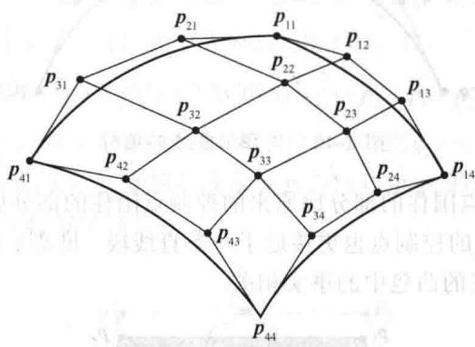
  <figcaption>图 8-39 贝塞尔双三次曲面片的 16 个控制点</figcaption>
</figure>

## 曲线与曲面的逼近

在 CAD 程序和创建虚拟现实的计算机游戏程序中，设计者通常在图形工作站中创建涉及各种几何结构的“场景”。这一过程需要设计者与几何对象互动。对象的每个小变动都需要图形程序进行新的数学计算。贝塞尔曲线与曲面在这个过程中非常有用，这是因为它们需要较少的控制点而用较多的多边形进行逼近。这奇迹般地减少了计算时间，从而提高了设计者的工作效率。

然而，在场景形体对象创造以后，最终图像的准备工作常出现难易不同的计算要求，比如遇到由平坦的面与笔直的棱构成的对象（如多面体）会容易计算得多。设计者要渲染场景，这需要引入光源，给表面着色和添加纹理，以及模拟曲面的反射等。

例如，计算曲面在点 p 上反射光的方向，需要知道入射光与曲面法向量（即垂直于曲面 p 点切面的正交向量）的方向。要计算这些法向量，在由细小平坦的多边形构成的表面上要比在法向量随点 p 移动而连续变化的曲面上容易得多。如果 $p_{1}, p_{2}, p_{3}$ 是一个平坦多边形的相邻顶点，那么曲面的法向量的算法很简单，是叉积 $(p_{2} - p_{1}) \times (p_{2} - p_{3})$ 或其反向。当多边形很小时，只需要一个法向量来渲染整个多边形。同样，两种广泛使用的阴影程序——高氏阴影与冯氏着色，也需要由多边形来定义表面。

对平坦表面的这些需求导致那些在场景创建平台上构造出来的贝塞尔曲线和曲面常常要用直线段和多边形平面去逼近。逼近贝塞尔曲线或曲面的基本思想是用越来越多的控制点把曲线或曲面分成更小的曲面片。

## 贝塞尔曲线与曲面的递归细分

图 8-40 给出了一条贝塞尔曲线的 4 个控制点 $p_{0}, \cdots, p_{3}$ 以及两条新曲线的控制点，每条与原曲线的一半重叠。“左”边的一条曲线以 $q_{0} = p_{0}$ 为起点，以原曲线的中点 $q_{3}$ 为终点。“右”边的一条以 $r_{0} = q_{3}$ 为起点，以 $r_{3} = p_{3}$ 为终点.

<figure class="vp-figure">
  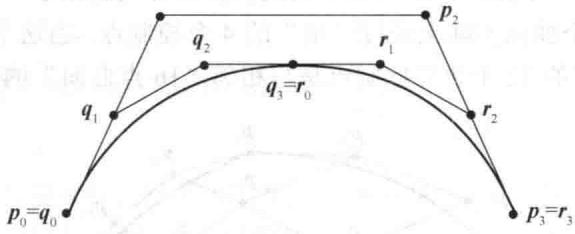
  <figcaption>图 8-40 贝塞尔曲线的细分</figcaption>
</figure>

图 8-41 表明新的控制点围住的部分比原来的控制点围住的部分更 “瘦小”。随着控制点间的距离的减小，每条曲线段的控制点也更接近于一条直线段。贝塞尔曲线的这种变量-减小性质与贝塞尔曲线总是在控制点的凸包中的事实相关。

<figure class="vp-figure">
  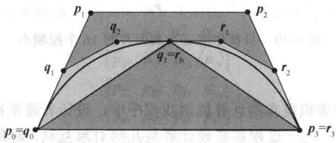
  <figcaption>图 8-41 控制点的凸包</figcaption>
</figure>

可以用简单的公式给出新控制点与原控制点的关系．当然， $q_{0}=p_{0}$ 且 $r_{3}=p_{3}$ ．当原曲线 $x(t)$ 有标准参数表达式时，曲线 $x(t)$ 的中点就是 $x(0.5)$ ：

$$
\boldsymbol {x} (t) = \left(1 - 3 t + 3 t ^ {2} - t ^ {3}\right) \boldsymbol {p} _ {0} + \left(3 t - 6 t ^ {2} + 3 t ^ {3}\right) \boldsymbol {p} _ {1} + \left(3 t ^ {2} - 3 t ^ {3}\right) \boldsymbol {p} _ {2} + t ^ {3} \boldsymbol {p} _ {3}\tag{7}
$$

其中 $0 \leqslant t \leqslant 1$ 。因而，新的控制点 $\pmb{r}_0$ 与 $\pmb{q}_3$ 由下式给出：

$$
\boldsymbol {q} _ {3} = \boldsymbol {r} _ {0} = \boldsymbol {x} (0. 5) = \frac {1}{8} (\boldsymbol {p} _ {0} + 3 \boldsymbol {p} _ {1} + 3 \boldsymbol {p} _ {2} + \boldsymbol {p} _ {3})\tag{8}
$$

剩下的“内部”控制点的公式也是简单的，但是公式的推导需要一些有关曲线的切向量的工作。由定义，参数表达形式的曲线 $x(t)$ 的切向量为 $x'(t)$ 。这个向量给出了曲线在 $x(t)$ 点的切线的方向。对于（7）式的贝塞尔曲线，有

$$
\boldsymbol {x} ^ {\prime} (t) = (- 3 + 6 t - 3 t ^ {2}) \boldsymbol {p} _ {0} + (3 - 1 2 t + 9 t ^ {2}) \boldsymbol {p} _ {1} + (6 t - 9 t ^ {2}) \boldsymbol {p} _ {2} + 3 t ^ {2} \boldsymbol {p} _ {3}
$$

其中 $0 \leqslant t \leqslant 1$ 。特别地，

$$
\pmb {x} ^ {\prime} (0) = 3 (\pmb {p} _ {1} - \pmb {p} _ {0}) \text {且} \pmb {x} ^ {\prime} (1) = 3 (\pmb {p} _ {3} - \pmb {p} _ {2})\tag{9}
$$

从几何上看， $p_{1}$ 在曲线于点 $p_{0}$ 的切线上，而 $p_{2}$ 在曲线于点 $p_{3}$ 的切线上，见图 8-41. 同时由 $x'(t)$ ，计算

$$
\boldsymbol {x} ^ {\prime} (0. 5) = \frac {3}{4} (- \boldsymbol {p} _ {0} - \boldsymbol {p} _ {1} + \boldsymbol {p} _ {2} + \boldsymbol {p} _ {3})\tag{10}
$$

设 $y(t)$ 为由 $q_{0},\cdots,q_{3}$ 确定的贝塞尔曲线且 $z(t)$ 是由 $r_{0},\cdots,r_{3}$ 确定的贝塞尔曲线。由于 $y(t)$ 与 $x(t)$ 穿过同样的路径，但 t 从 0 到 1 变化时达到 $x(0.5)$ ， $y(t)=x(0.5t)$ ， $0\leqslant t\leqslant1$ 。类似地，由于 $z(t)$ 当 t=0 时以 $x(0.5)$ 为起点，故 $z(t)=x(0.5+0.5t)$ ， $0\leqslant t\leqslant1$ 。由导数的链式法则得

$$
\mathbf {y} ^ {\prime} (t) = 0. 5 \mathbf {x} ^ {\prime} (0. 5 t), \quad \mathbf {z} ^ {\prime} (t) = 0. 5 \mathbf {x} ^ {\prime} (0. 5 + 0. 5 t), \quad 0 \leqslant t \leqslant 1\tag{11}
$$

在（9）式中用 $y'(0)$ 替代 $x'(0)$ ，（11）式中令 t=0，由（9）式， $y(t)$ 的控制点满足

$$
3 (\pmb {q} _ {1} - \pmb {q} _ {0}) = \pmb {y} ^ {\prime} (0) = 0. 5 \pmb {x} ^ {\prime} (0) = \frac {3}{2} (\pmb {p} _ {1} - \pmb {p} _ {0})\tag{12}
$$

在（9）式中用 $y'(1)$ 替代 $x'(1)$ ，（11）式中令 t=1，由（10）式，

$$
3 (\pmb {q} _ {3} - \pmb {q} _ {2}) = \pmb {y} ^ {\prime} (1) = 0. 5 \pmb {x} ^ {\prime} (0. 5) = \frac {3}{8} (- \pmb {p} _ {0} - \pmb {p} _ {1} + \pmb {p} _ {2} + \pmb {p} _ {3})\tag{13}
$$

由习题 13 所示，解方程（8），（9），（10），（12）和（13）可得到 $q_{0}, \cdots, q_{3}$ 的表达式。图 8-42 给出了公式的几何意义。内部控制点 $q_{1}$ ， $r_{2}$ 分别是线段 $p_{0}p_{1}$ 与线段 $p_{2}p_{3}$ 的中点。把线段 $p_{1}p_{2}$ 的中点与 $q_{1}$ 连接起来，得到的线段以 $q_{2}$ 为中点！

<figure class="vp-figure">
  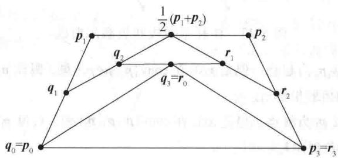
  <figcaption>图 8-42 新控制点的几何结构</figcaption>
</figure>

以上完成了细分过程的第一步. 现在开始 “递归”，细分两条新的曲线. 递归进行到所有的曲线都充分直为止. 每步递归都是可以有选择地进行的，即若两条新曲线中的一条已经充分直，则可以不细分这一条，只需细分另一条. 一旦细分完全停止，每条曲线的两端点之间用直线段连接，如此继续下去，最终图像准备工作的每一步即告完成.

贝塞尔双三次曲面也与贝塞尔曲线一样具有变量-减小性质，因此对于曲面上每一条交叉的贝塞尔曲线都可以使用上述过程。略去细节，这里只提一下基本思路。考虑4条“平行”贝塞尔曲线，其参数是s，对它们进行一次细分。每条上的控制点都增加到同一数量8，每条上的8个控制点确定了参数s从0到1的曲线。然而，当t变化时，便有了8条贝塞尔曲线，每条有4个控制点。对它们进行一次递归细分，每条上的控制点也都增加到同一数量8，于是，总共得到了64个控制点。对曲面递归细分的每一步也与前面对贝塞尔曲线那样是可以选择地进行的，但需要面对一些困难的细节问题。

<Block title="练习题">
样条曲线通常是关于过特殊点的曲线. 然而 B-样条曲线通常不过它的控制点. 一条 B-样条曲线的参数形式为

$$
\boldsymbol {x} (t) = \frac {1}{6} \left[ (1 - r) ^ {3} \boldsymbol {p} _ {0} + (4 - 6 t ^ {2} + 3 t ^ {3}) \boldsymbol {p} _ {1} + (1 + 3 t + 3 t ^ {2} - 3 t ^ {3}) \boldsymbol {p} _ {2} + t ^ {3} \boldsymbol {p} _ {3} \right]\tag{14}
$$

其中 $0 \leqslant t \leqslant 1$ ， $p_0$ ， $p_1$ ， $p_2$ 和 $p_3$ 是控制点。当 $t$ 从 0 到 1 变化时， $x(t)$ 创建了一条简短的临近 $\overline{p_1 p_2}$ 的曲线。基本的代数知识表明上述 B-样条曲线的公式也可以写为

$$
\boldsymbol {x} (t) = \frac {1}{6} \left[ (1 - t) ^ {3} \boldsymbol {p} _ {0} + (4 - 3 t + 3 t (1 - t) ^ {2}) \boldsymbol {p} _ {1} + (1 + 3 t + 3 t ^ {2} (1 - t)) \boldsymbol {p} _ {2} + t ^ {3} \boldsymbol {p} _ {3} \right]\tag{15}
$$

这表明了它与贝塞尔曲线的类似性. 除了前面的因子 $1 / 6$ 外, $\pmb{p}_0$ 与 $\pmb{p}_3$ 的项相同. $\pmb{p}_1$ 项增加了 $4 - 3t$ , $\pmb{p}_2$ 项增加了 $1 + 3t$ . 较之贝塞尔曲线, 这些项使得曲线更加接近 $\overline{\pmb{p}_1\pmb{p}_2}$ . 为了保证系数和为 1 , 因子 $1 / 6$ 是必要的. 图8-43对比了具有相同控制点的B-样条曲线与贝塞尔曲线.

<figure class="vp-figure">
  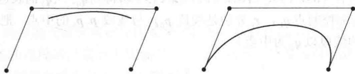
  <figcaption>图 8-43 B-样条线段和贝塞尔曲线</figcaption>
</figure>

1. 证明：B-样条曲线不是以 $p_0$ 为起点，但是 $x(0)$ 在 $\operatorname{conv}\{p_0, p_1, p_2\}$ 里。假设 $p_0, p_1, p_2$ 是仿射无关的，求 $x(0)$ 关于 $\{p_0, p_1, p_2\}$ 的仿射坐标。

2. 证明：B-样条曲线不是以 $p_3$ 为终点，但是 $\pmb{x}(1)$ 在 $\operatorname{conv}\{\pmb{p}_1, \pmb{p}_2, \pmb{p}_3\}$ 里。假设 $p_1, p_2, p_3$ 是仿射无关的，求 $\pmb{x}(1)$ 关于 $\{p_1, p_2, p_3\}$ 的仿射坐标。
</Block>

<Block title="习题8.6">
1. 设贝塞尔曲线平移为 $\boldsymbol{x}(t)+\boldsymbol{b}$ 。即对于 $0 \leqslant t \leqslant 1$ ，新曲线为 $\boldsymbol{x}(t)=(1-t)^{3}\boldsymbol{p}_{0}+3t(1-t)^{2}\boldsymbol{p}_{1}+3t^{2}(1-t)\boldsymbol{p}_{2}+t^{3}\boldsymbol{p}_{3}+\boldsymbol{b}$ 证明：新曲线还是一条贝塞尔曲线。（提示：
新的控制点在哪里？）

2. 练习题中所定义的 B-样条曲线的参数向量表达式为 $\boldsymbol{x}(t)=\frac{1}{6}\left[(1-t)^{3}\boldsymbol{p}_{0}+(3t(1-t)^{2}-3t+4)\boldsymbol{p}_{1}\right.$ $+(3t^{2}(1-t)+3t+1)\boldsymbol{p}_{2}+t^{3}\boldsymbol{p}_{3}]$ ， $0\leqslant t\leqslant1$

其中 $p_{0}$ ， $p_{1}$ ， $p_{2}$ ， $p_{3}$ 是控制点.
a. 证明：对 $0 \leqslant t \leqslant 1$ ， $x(t)$ 在控制点的凸包中.
b. 假设 B-样条曲线 $x(t)$ 平移为 $x(t)+b$ （类似于习题1）. 证明：新的曲线也是B-样条曲线.

3. 设 $x(t)$ 是由点 $p_0, p_1, p_2$ 和 $p_3$ 确定的三次贝

塞尔曲线.

a. 计算切向量 $x'(t)$ . 确定 $x'(0)$ 与 $x'(1)$ 同控制点的关系，并给出这些切向量方向的几何描述。 $x'(1) = 0$ 可能吗？

b. 计算二次导数 $x''(t)$ 并确定 $x''(0)$ 与 $x''(1)$ 同控制点的关系。画出基于图8-43的图形，并构造一段指向 $x''(0)$ 方向的线段。（提示：把 $p_1$ 视为坐标系的原点。）

4. 设 $x(t)$ 是习题 2 中的 B-样条曲线，以 $p_{0}$ ， $p_{1}$ ， $p_{2}$ 和 $p_{3}$ 为控制点.

a. 计算切向量 $\boldsymbol{x}^{\prime}(t)$ 并确定 $\boldsymbol{x}^{\prime}(0)$ 与 $\boldsymbol{x}^{\prime}(1)$ 同控制点的关系。给出这些切向量方向的几何描述。思考当 $\boldsymbol{x}^{\prime}(1)$ 与 $\boldsymbol{x}^{\prime}(0)$ 都等于 0 会怎样。证明你的结论。

b. 计算二次导数 $x''(t)$ 并确定 $x''(0)$ 与 $x''(1)$ 同控制点的关系。画出基于图8-43的图形，并构造一段指向 $x''(1)$ 方向的线段。（提示：把 $p_2$ 视为坐标系的原点。）

5. 设 $x(t)$ ， $y(t)$ 是分别由控制点 $\{p_0, p_1, p_2, p_3\}$ 与 $\{p_3, p_4, p_5, p_6\}$ 确定的三次贝塞尔曲线，且 $x(t)$ 和 $y(t)$ 在 $p_3$ 相连接。下面的问题是关于由 $x(t)$ 连接 $y(t)$ 组成的曲线的。为简单起见，假定曲线是 $\mathbb{R}^2$ 空间的。
a. 控制点具有什么条件将保证曲线在 $p_3$ 具有 $C^1$ 连续性？证明你的答案。
b. $x'(1)$ 与 $y'(0)$ 都等于 0 向量会怎样？

6. 设 B-样条曲线由习题 2 中所描述的 B-样条线段构成。设 $p_{0}, \cdots, p_{4}$ 是控制点，对 $0 \leqslant t \leqslant 1$ ，设 $x(t)$ ， $y(t)$ 分别由几何矩阵 $[p_{0}, p_{1}, p_{2}, p_{3}]$ 与 $[p_{1}, p_{2}, p_{3}, p_{4}]$ 确定。注意两线段共享三个控制点。两线段并不重叠，但它们在临近 $p_{2}$ 的一个共同端点连接。
a. 证明：连接曲线具有 $G^{0}$ 连续性，即 $x(1)=y(0)$ .
b. 证明：曲线在连接点 $x(1)$ 具有 $C^{1}$ 连续性，
即证明 $x'(1)=y'(0)$ .

7. 设 $x(t)$ ， $y(t)$ 是习题 5 中的贝塞尔曲线，假定连接曲线在 $p_{3}$ 具有 $C^{2}$ 连续性（包含 $C^{1}$ 连续性）。令 $x''(1)=y''(0)$ ，证明： $p_{5}$ 完全由 $p_{1}$ ， $p_{2}$ 和 $p_{3}$ 确定。因而点 $p_{0},\cdots,p_{3}$ 与 $C^{2}$ 条件确定除了 $y(t)$ 的一个控制点外的所有控制点。

8. 设 $x(t)$ , $y(t)$ 是习题 6 中的 B-样条曲线的部分. 证明: 曲线在点 $x(1)$ 具有 $C^2$ 连续性 (包含 $C^1$ 连续性), 即证明 $x''(1) = y''(0)$ . 这种高阶连续性在 CAD 应用 (如汽车车身设计) 中是令人满意的, 因为曲线与曲面表现得相当光滑. 然而, 对于长度可比的曲线, B-样条曲线的计算量是贝塞尔曲线的 3 倍. 对于曲面, B-样条曲线的计算量是贝塞尔曲面的 9 倍. 程序设计者在需要实时表现的应用 (如飞机座舱模拟) 中会选

择贝塞尔曲面.

9. 由5个控制点 $p_0, p_1, p_2, p_3$ 和 $p_4$ 确定的二次贝塞尔曲线如下： $\pmb{x}(t) = (1 - t)^4 \pmb{p}_0 + 4t(1 - t)^3 \pmb{p}_1 + 6t^2(1 - t)^2 \pmb{p}_2 + 4t^3(1 - t) \pmb{p}_3 + t^4 \pmb{p}_4, 0 \leqslant t \leqslant 1$ 构造 $\pmb{x}(t)$ 的二次基矩阵 $M_B$

10. B-样条曲线中的“B”是基于片段 $\boldsymbol{x}(t)$ 可以写成基矩阵 $M_{s}$ 的形式，类似于贝塞尔曲线的公式，即 $\boldsymbol{x}(t)=GM_{s}\boldsymbol{u}(t),\quad0\leqslant t\leqslant1$ 其中 G 是几何矩阵 $[p_{0}, p_{1}, p_{2}, p_{3}]$ ， $\boldsymbol{u}(t)$ 是列向量 $(1, t, t^{2}, t^{3})$ 。对于均匀的 B-样条曲线，每段使用相同的基矩阵，但几何矩阵是变化的。构造 $\boldsymbol{x}(t)$ 的基矩阵 $M_{s}$ .
在习题 11 和 12 中，判断正误，并给出证明.

11. a. 三次贝塞尔曲线基于4个控制点.
b. 给定以 $p_{0}, p_{1}, p_{2}$ 为控制点的二次贝塞尔曲线 $x(t)$ ，有向线段 $p_{1}-p_{0}$ （从 $p_{0}$ 到 $p_{1}$ ）是曲线在 $p_{0}$ 的切向量.
c. 当两条以 $\left\{p_{0}, p_{1}, p_{2}\right\}$ 与 $\left\{p_{2}, p_{3}, p_{4}\right\}$ 为控制点的二次贝塞尔曲线在 $p_{2}$ 相连接时，若 $p_{2}$ 是 $p_{1}$ 到 $p_{3}$ 的线段的中点，则连接的贝塞尔曲线在 $p_{2}$ 具有 $C^{1}$ 连续性.

12. a. 在线性变换下，贝塞尔曲线的基本性质保持不变，但在平移下不是如此.
b. 当两条贝塞尔曲线 $x(t)$ ， $y(t)$ 在点 $x(1)=y(0)$ 连接时，连接曲线在此点具有 $G^{0}$ 连续性.
c. 贝塞尔基矩阵是一个以曲线的控制点为列的矩阵.
习题 13\~15 是有关图 8-40 所示的贝塞尔曲线的细分问题. 设 $x(t)$ 以 $p_{0}, \cdots, p_{3}$ 为控制点且 $y(t)$ 与 $z(t)$ 是细分的贝塞尔曲线，分别以 $q_{0}, \cdots, q_{3}$ 与 $r_{0}, \cdots, r_{3}$ 为控制点.
13. a. 使用方程（12）证明： $q_{1}$ 是从 $p_{0}$ 到 $p_{1}$ 的线段的中点.
b. 使用方程（13）证明：

$$
8 \boldsymbol {q} _ {2} = 8 \boldsymbol {q} _ {3} + \boldsymbol {p} _ {0} + \boldsymbol {p} _ {1} - \boldsymbol {p} _ {2} - \boldsymbol {p} _ {3}
$$

c. 使用（b）、方程（8）及（a）证明： $q_{2}$ 是从 $q_{1}$ 到 $p_{0}$ 与 $p_{1}$ 的线段中点的线段的中点。即

$$
\boldsymbol {q} _ {2} = \frac {1}{2} \left[ \boldsymbol {q} _ {1} + \frac {1}{2} (\boldsymbol {p} _ {1} + \boldsymbol {p} _ {2}) \right]
$$

14. a. 验证每个等号： $3(r_{3}-r_{2})=z'(1)=0.5x'(1)=\frac{3}{2}(p_{3}-p_{2})$ b. 证明 $r_{2}$ 是 $p_{3}$ 到 $p_{2}$ 线段的中点.
c. 验证每个等号： $3(r_{1}-r_{0})=z'(0)=0.5x'(0.5)$ d. 使用（c）证明： $8r_{1}=-p_{0}-p_{1}+p_{2}+p_{3}+8r_{0}$ e. 使用（d）、（8）式及（a）证明： $r_{1}$ 是 $r_{2}$ 到 $p_{1}$ 与 $p_{2}$ 的线段中点的线段的中点，即 $r_{1}=\frac{1}{2}[r_{2}+\frac{1}{2}(p_{1}+p_{2})]$ .

15. 有时候一条贝塞尔曲线只有一半需要进一步细分，这种情况下，例如，要细分“左”边，用习题13中（a）和（c）及（8）式即可完成。而当曲线的两半边都需要细分时，可以设计一个计算过程直接有效地协同确定左右两半边的控制点，使之不用（8）式。
a. 证明：切向量 $y'(1)$ 和 $z'(0)$ 是相等的。
b. 用（a）证明： $q_{3}$ （它等于 $r_{0}$ ）是从 $q_{2}$ 到 $r_{1}$ 的线段的中点。

1. 由方程（14）及 $t = 0$ ，有 $\pmb{x}(0) \neq \pmb{p}_0$ ，这是因为c. 用（b）及习题13和14写一个计算 $y(t)$ 和 $z(t)$ 控制点的高效算法。涉及的运算只有求和及除以2。

16. 解释为什么三次贝塞尔曲线完全由 $x(0)$ ， $x'(0)$ ， $x(1)$ 和 $x'(1)$ 确定.

17. 由苹果公司与 Adobe 系统创立的 TrueType 字体使用二次贝塞尔曲线, 而由微软公司创立的 PostScript 字体使用三次贝塞尔曲线. 三次曲线为字体的设计提供了更大的灵活性, 但把使用二次曲线的每个字体转化为使用三次曲线对微软公司是重要的. 假定 $w(t)$ 是以 $p_0$ , $p_1$ 和 $p_2$ 为控制点的二次曲线.
</Block>

<Block title="练习题答案">
a. 求控制点 $r_{0}, r_{1}, r_{2}$ 和 $r_{3}$ ，使得以这些点为控制点的三次贝塞尔曲线 $x(t)$ 与 $w(t)$ 具有相同的起点与终点且在 t=0 与 t=1 有相同的切向量。（见习题 16.）
b. 证明：若 $x(t)$ 如(a)一样构造，则 $x(t)=w(t)$ ， $0 \leqslant t \leqslant 1$ .

18. 使用分块矩阵乘法计算下面的矩阵乘积，这在贝塞尔曲线的另一公式（5）中出现：

$$
\left[ \begin{array}{r r r r} 1 & 0 & 0 & 0 \\ - 3 & 3 & 0 & 0 \\ 3 & - 6 & 3 & 0 \\ - 1 & 3 & - 3 & 1 \end{array} \right] \left[ \begin{array}{l} \boldsymbol {p} _ {0} \\ \boldsymbol {p} _ {1} \\ \boldsymbol {p} _ {2} \\ \boldsymbol {p} _ {3} \end{array} \right]
$$

$$
\boldsymbol {x} (0) = \frac {1}{6} \left[ \boldsymbol {p} _ {0} + 4 \boldsymbol {p} _ {1} + \boldsymbol {p} _ {2} \right] = \frac {1}{6} \boldsymbol {p} _ {0} + \frac {2}{3} \boldsymbol {p} _ {1} + \frac {1}{6} \boldsymbol {p} _ {2}
$$

系数是非负的且和为1，故 $x(0)$ 在 $\mathrm{conv}\left\{\boldsymbol{p}_{0},\boldsymbol{p}_{1},\boldsymbol{p}_{2}\right\}$ 里，且关于 $\left\{\boldsymbol{p}_{0},\boldsymbol{p}_{1},\boldsymbol{p}_{2}\right\}$ 的仿射坐标是 $\left(\frac{1}{6},\frac{2}{3},\frac{1}{6}\right)$ 2. 由方程（14）及 t=1，有 $x(1)\neq p_{3}$ ，这是因为

$$
\boldsymbol {x} (1) = \frac {1}{6} \left[ \boldsymbol {p} _ {1} + 4 \boldsymbol {p} _ {2} + \boldsymbol {p} _ {3} \right] = \frac {1}{6} \boldsymbol {p} _ {1} + \frac {2}{3} \boldsymbol {p} _ {2} + \frac {1}{6} \boldsymbol {p} _ {3}
$$

系数是非负的且和为1，故 $x(1)$ 在 $\mathrm{conv}\{\pmb{p}_1,\pmb{p}_2,\pmb{p}_3\}$ 里，且关于 $\{\pmb{p}_1,\pmb{p}_2,\pmb{p}_3\}$ 的仿射坐标是 $\left(\frac{1}{6},\frac{2}{3},\frac{1}{6}\right)$

# 附录 A 简化阶梯形矩阵的唯一性

定理（简化阶梯形矩阵的唯一性）

每一个 $m \times n$ 矩阵 $A$ 行等价于唯一简化阶梯形矩阵 $U$ .

证 利用 4.3 节的思想，即行等价矩阵的列具有完全一样的线性相关关系.

行化简算法说明至少存在一个这样的矩阵 U. 假设 A 行等价于简化阶梯形矩阵 U 和 V, U 的行中最左边非零元素是 “主元” 1, 称这类主元 1 的位置是一个主元位置, 并且包含它的列称为主元列 (这个定义仅用于阶梯特征的 U 和 V, 并且假设简化阶梯形不唯一).

$U$ 和 $V$ 的主元列恰恰是与它们左边的列线性无关的非零列（这个条件自动满足第一列是非零的）．由于 $U$ 和 $V$ 行等价（两个矩阵都行等价于 $A$ ），故它们的列有相同的线性相关关系，因此， $U$ 和 $V$ 的主元列出现在同样位置．如果有 $r$ 个这样的列，则因为 $U$ 和 $V$ 是简化阶梯形，所以它们的主元列是 $m \times n$ 单位矩阵的前 $r$ 列，这样对应的 $U$ 和 $V$ 的主元列是相等的．

最后，考虑 $U$ 的任意非主元列，例如列 $j$ ，这个列或者是零或者是左边主元列的线性组合（因为这些主元列是第 $j$ 列左边的列生成的空间的一个基）。两种情形下，对第 $j$ 个元素为1的 $\pmb{x}$ 都可写成 $U\pmb{x} = \pmb{0}$ 。那么 $V\pmb{x} = \pmb{0}$ ，这说明 $V$ 的第 $j$ 列或者是零或者是与它左边 $V$ 的主元列相同的线性组合。由于 $U$ 和 $V$ 对应的主元列是相等的，因此 $U$ 和 $V$ 的第 $j$ 列也相等，这个结果对 $U$ 和 $V$ 所有非主元列也成立，因而 $V = U$ ，这就证明了 $U$ 是唯一的。

## 附录 B 复数

复数是可以写成如下形式的数：

$$
z = a + b \mathrm{i}
$$

其中 $a$ 和 $b$ 是实数，i 是满足关系 $\mathrm{i}^2 = -1$ 的常用符号。数 $a$ 是 $z$ 的实部，记作 $\operatorname{Re} z$ ，数 $b$ 是 $z$ 的虚部，记作 $\operatorname{Im} z$ 。两个复数相等当且仅当它们的实部和虚部分别相等。例如，如果 $z = 5 + (-2)\mathrm{i}$ ，那么 $\operatorname{Re} z = 5$ ， $\operatorname{Im} z = -2$ ，可以简记为 $z = 5 - 2\mathrm{i}$ 。

一个实数 $a$ 可以认为是一个特殊类型的复数，即将 $a$ 和 $a + 0\mathrm{i}$ 作为一个数。更进一步，实数上的算术运算可以扩展到复数集合上。

复数系是所有复数的集合，记作 $\mathbb{C}$ ，具有下面的加法和乘法运算：

$$
(a + b \mathrm{i}) + (c + d \mathrm{i}) = (a + c) + (b + d) \mathrm{i}\tag{1}
$$

$$
(a + b \mathrm{i}) (c + d \mathrm{i}) = (a c - b d) + (a d + b c) \mathrm{i}\tag{2}
$$

这些法则当（1）和（2）式中 $b$ 和 $d$ 为零时，是普通实数的加法和乘法。容易验证，在 $\mathbb{R}$ 上的常见法则在 $\mathbb{C}$ 上同样成立。由于这个原因，乘法常用扩展的代数法则来计算。

例1

$$
\begin{array}{r l} (5 - 2 \mathrm{i}) (3 + 4 \mathrm{i}) & = 1 5 + 2 0 \mathrm{i} - 6 \mathrm{i} - 8 \mathrm{i} ^ {2} \\ & = 1 5 + 1 4 \mathrm{i} - 8 (- 1) \\ & = 2 3 + 1 4 \mathrm{i} \end{array}
$$

也就是说，用项 $(3+4i)$ 乘5-2i的每一项，利用 $i^{2}=-1$ ，并将结果写成 $a+bi$ 的形式.

复数 $z_{1}$ 和 $z_{2}$ 的减法定义为

$$
z _ {1} - z _ {2} = z _ {1} + (- 1) z _ {2}
$$

特别地，我们用 $-z$ 代替 $(-1)z$ .

复数 $z = a + bi$ 的共轭复数是复数 $\overline{z}$ （读作 “z 杠”），定义为

$$
\overline {{{z}}} = a - b \mathrm{i}
$$

$\overline{z}$ 可用 z 中相反的虚部符号来得到.

例 2 -3+4i 的共轭复数是 -3-4i，记作 $\overline{-3+4i}=-3-4i$ .

注意如果 $z = a + bi$ ，那么

$$
z \overline {{z}} = (a + b \mathrm{i}) (a - b \mathrm{i}) = a ^ {2} - a b \mathrm{i} + b a \mathrm{i} - b ^ {2} \mathrm{i} ^ {2} = a ^ {2} + b ^ {2}\tag{3}
$$

由于 $z\overline{z}$ 是实数且非负，故它有一个平方根. $z$ 的绝对值（或模）是实数 $|z|$ 且定义为

$$
| z | = \sqrt {z \overline {{z}}} = \sqrt {a ^ {2} + b ^ {2}}
$$

如果 $z$ 是实数，那么 $z = a + 0\mathrm{i}$ 且 $|z| = \sqrt{a^2}$ ，它等于平常意义下的 $a$ 的绝对值.

下面列出一些关于共轭复数和绝对值的有用性质，设 w 和 z 表示复数.

1. $\overline{z} = z$ 的充分必要条件是 $z$ 是实数.

2. $\overline{w+z}=\overline{w}+\overline{z}$

3. $\overline{wz} = \overline{w}\overline{z}$ ; 特别地, 如果 r 是实数, 则 $\overline{rz} = r\overline{z}$ .

4. $z\overline{z} = |z|^2 \geqslant 0$

5. $|wz| = |w||z|$ .

6. $|w + z| \leqslant |w| + |z|$ .

如果 $z \neq 0$ ，那么 $|z| > 0$ 且 $z$ 有一个乘法的倒数，记作 $1 / z$ 或 $z^{-1}$ 且有

$$
\frac {1}{z} = z ^ {- 1} = \frac {\overline {{z}}}{| z | ^ {2}}
$$

当然，商 w/z 简单表示为 $w \cdot (1/z)$ .

例3 令 $w = 3 + 4\mathrm{i}$ 和 $z = 5 - 2\mathrm{i}$ ，计算 $z\overline{z},|z|$ 和 $w / z$

解 由（3）式，

$$
z \overline {{{z}}} = 5 ^ {2} + (- 2) ^ {2} = 2 5 + 4 = 2 9
$$

对绝对值， $|z| = \sqrt{z\overline{z}} = \sqrt{29}$ ．为计算 $w / z$ ，首先分子和分母同乘以 $\overline{z}$ ，即分母的共轭复数．由（3）式，这个运算可消去分母中的i：

$$
\begin{array}{r l} \frac {w}{z} & = \frac {3 + 4 \mathrm{i}}{5 - 2 \mathrm{i}} = \frac {3 + 4 \mathrm{i}}{5 - 2 \mathrm{i}}. \frac {5 + 2 \mathrm{i}}{5 + 2 \mathrm{i}} = \frac {1 5 + 6 \mathrm{i} + 2 0 \mathrm{i} - 8}{5 ^ {2} + (- 2) ^ {2}} \\ & = \frac {7 + 2 6 \mathrm{i}}{2 9} = \frac {7}{2 9} + \frac {2 6}{2 9} \mathrm{i} \end{array}
$$

## 几何解释

每一个复数 $z = a + bi$ 对应于平面 $\mathbb{R}^2$ 上的一个点 $(a,b)$ ，如图B-1所示。水平轴称为实轴，因为它上面的点 $(a,0)$ 对应实数，垂直的轴称为虚轴，因为它上面的点 $(0,b)$ 对应形如 $0 + bi$ （简记为 $bi$ ）的纯虚数。 $z$ 的共轭复数是 $z$ 关于实轴的镜像， $z$ 的绝对值是从原点到 $(a,b)$ 的距离。

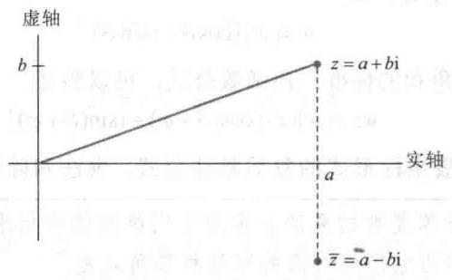  
图B-1 共轭复数是一个镜像

复数 $z = a + bi$ 和 $w = c + bi$ 的加法对应于 $\mathbb{R}^2$ 中 $(a,b)$ 和 $(c,b)$ 的向量加法，如图B-2所示.

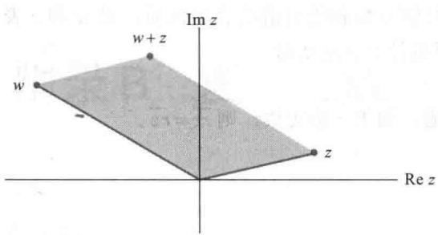  
图B-2 复数的加法

为给出复数乘法的图形表示，我们使用 $\mathbb{R}^2$ 中的极坐标. 给定一个非零复数

$$
z = a + b \mathrm{i}
$$

设 $\varphi$ 是正实轴和点 $(a,b)$ 间的夹角，如图B-3所示，其中 $-\pi < \varphi \leqslant \pi$ 。角 $\varphi$ 称为 $z$ 的辐角，记为 $\varphi = \arg z$ 。从三角函数得

$$
a = | z | \cos \varphi \quad b = | z | \sin \varphi
$$

因而

$$
z = a + b \mathrm{i} = | z | (\cos \varphi + \mathrm{i} \sin \varphi)
$$

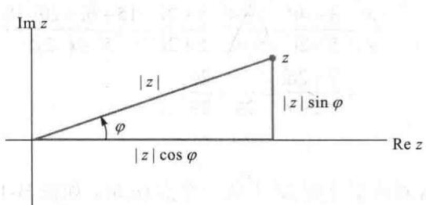  
图B-3 $z$ 的极坐标

如果 $w$ 是另一个非零复数，如

$$
w = | w | (\cos \vartheta + i \sin \vartheta)
$$

则利用关于正弦和余弦两角和的标准三角函数公式，可以验证

$$
w z = | w | | z | [ \cos (\vartheta + \varphi) + i \sin (\vartheta + \varphi) ]\tag{4}
$$

见图 B-4. 类似可以写出极坐标形式的复数除法公式. 乘法和除法公式可用文字描述如下.

极坐标系下，两个非零复数的乘法表示为它们绝对值的相乘和辐角相加。极坐标系下，两个非零复数的除法表示为它们绝对值的相除和辐角之差。

例4 a. 如果 $w$ 的绝对值为1，那么 $w = \cos \vartheta + \mathrm{i}\sin \vartheta$ ，其中 $\vartheta$ 是 $w$ 的辐角。对任意非零复数 $z$ 乘复数 $w$ ，简单表示为复数 $z$ 旋转 $\vartheta$ 角度。

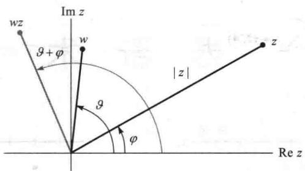  
图 B-4 极坐标系中的乘法

b. i 本身的辐角为 $\frac{\pi}{2}$ ，所以，用 i 来乘复数 $z$ 是将 $z$ 旋转 $\frac{\pi}{2}$ 弧度。例如， $3 + i$ 旋转为 $(3 + i)i = -1 + 3i$ 。见图 B-5。

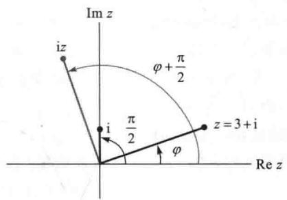  
图B-5 乘以i

## 复数的幂

公式（4）中，如果 $z = w = r(\cos \varphi +\mathrm{i}\sin \varphi)$ ，则有

$$
\begin{array}{r l} z ^ {2} & = r ^ {2} (\cos 2 \varphi + \mathrm{i} \sin 2 \varphi) \\ z ^ {3} & = z \cdot z ^ {2} \\ & = r (\cos \varphi + \mathrm{i} \sin \varphi) \cdot r ^ {2} (\cos 2 \varphi + \mathrm{i} \sin 2 \varphi) \\ & = r ^ {3} (\cos 3 \varphi + \mathrm{i} \sin 3 \varphi) \end{array}
$$

一般地，对任意正整数 $k$

$$
z ^ {k} = r ^ {k} (\cos k \varphi + \mathrm{i} \sin k \varphi)
$$

这个结论被称为棣莫弗定理.

## 复数和 $\mathbb{R}^2$

尽管 $\mathbb{R}^2$ 中的元素和复平面 $\mathbb{C}$ 是一一对应的（见图B-6和图B-7），并且加法实质上一致，但逻辑上 $\mathbb{R}^2$ 和 $\mathbb{C}$ 不同．在 $\mathbb{R}^2$ 上，我们仅能对一个向量作标量乘法，然而在 $\mathbb{C}$ 上，我们可以将任意两个复数相乘，并得到第三个复数.（ $\mathbb{R}^2$ 中的点积不在考虑之内，原因是它产生一个数，此数不是 $\mathbb{R}^2$ 的元素.）我们用标量符号表示 $\mathbb{C}$ 中的元素，以强调这个区别.

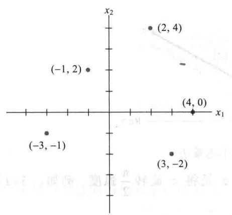  
图B-6 实平面 $\mathbb{R}^2$

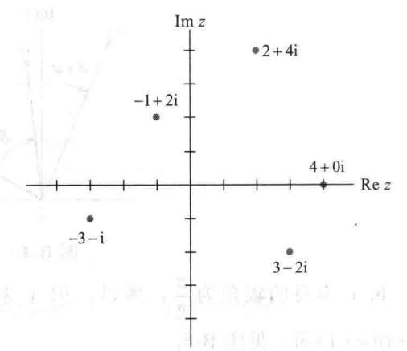  
图B-7 复平面 $\mathbb{C}$

$\left( \mathrm{q}^{2} - \mathrm{n}(\mathrm{i}\alpha) + \mathrm{q}(\mathrm{i}\alpha)\right)^{2} = 0$

$(0)^{2}$ $m_{1}^{2} + m_{2}^{2} = 0.01 + (0)^{2} - 21 + (-0.05)N$ $(0)^{2}$ $m_{1}^{2} - m_{2}^{2} = 0.01$ $\frac{1}{2}$ 为 $\frac{1}{2}$ 的最大值，所以

.把它们看到它们这个个

（1）主要来自的且其（6-8月）日本語の国語（一）主要方面受国家政策の発行を示す。沪深新興業、工业方面見，企業提出表示这个一段需要回答。上文在不同時間下可能現在，整个一個化学問題は「4-5」所含的小加工の全資1. 要受2. 空通機手（愛司県下同議員）に、第二個2个問題が切、評価値中又表示各省分類の国語、工務協議等正義意

## 术语表

## A

adjugate (or classical adjoint) [伴随矩阵] 矩阵 adj A 是方阵 A 中 $(i,j)$ 位置的元素用 A 中 $(i,j)$ 元素的代数余子式代替后，再通过转置得到的矩阵.

affine combination [仿射组合] 向量 $(\mathbb{R}^{n}$ 中的点）的线性组合，且有关权值的和为 1.

affine dependence relation [仿射相关关系] 方程 $c_{1}v_{1}+\cdots+c_{p}v_{p}=0$ ，其中权值 $c_{1},\cdots,c_{p}$ 不全为 0，且 $c_{1}+\cdots+c_{p}=0$ 。

affine hull (or affine span) of a set S [集合 S 的仿射凸包（或仿射空间）] S 中的点的所有仿射组合的集合，记为 aff S.

affine dependent set [仿射相关集合] $R^{n}$ 中集合 $\{v_{1},\cdots,v_{p}\}$ 存在实数 $c_{1},\cdots,c_{p}$ 不全为 0，使得 $c_{1}+\cdots+c_{p}=0$ 且 $c_{1}v_{1}+\cdots+c_{p}v_{p}=0$ 。

affine independent set [仿射无关集合] $R^{n}$ 中集合 $\{v_{1},\cdots,v_{p}\}$ 仿射不相关.

affine set (or affine subset) [仿射集（或仿射子集）] 若 p,q 是 S 中的点，那么对于每个实数 t，有 $(1-t)p+tq\in S$ 。满足上述条件的集合 S 就是仿射集.

affine transformation [仿射变换] 一个形如 $T(x)=Ax+b$ 的映射 $T:\mathbb{R}^{n}\to\mathbb{R}^{m}$ ，其中 A 是 $m\times n$ 矩阵且 b 属于 $R^{m}$ 。

algebraic multiplicity [代数重数] 一个特征值的重数是作为特征方程的根的重数.

angle (between nonzero vectors u and v in $R^{2}$ or $R^{3}$ ) [( $R^{2}$ 或 $R^{3}$ 中非零向量 u 和 v 之间的)角度] 夹角 g 是指从原点到点 u 和 v 的两个有向线段之间的角度，通过点积联系起来：

$u \cdot v = \|u\| \|v\| \cos \vartheta$ associative law of multiplication [乘法的结合律] $A(BC) = (AB)C$ ，对所有 $A, B, C$ 均成立.

attractor (of a dynamical system in $\mathbb{R}^2$ ) [( $\mathbb{R}^2$ 中一个动力系统的)吸引子] 当所有轨迹都趋于 0 时的原点.

augmented matrix [增广矩阵] 一个由线性方程组的系数矩阵和右边增加的一列或多列构成的矩阵，每一个增加的列包含给定系数矩阵对应的方程组右边的常数项.

auxiliary equation [辅助方程] 一个关于变量 $r$ 的多项式方程，来源于齐次差分方程的系数.

## B

back-substitution (with matrix notation) [(用矩阵记号的) 回代变换] 将阶梯形增广矩阵变换为简化阶梯形矩阵时后一阶段的行变换, 常用于求线性方程组的解.

backward phase (of row reduction) [(行化简的) 向后阶段] 化简阶梯形矩阵为简化阶梯形矩阵算法的最后步骤.

band matrix [带形矩阵] 一个矩阵, 它的非零元素位于主对角线的上下两侧的带形以内.

barycentric coordinates (of a point p with respect to an affinely independent set $S = \{v_{1}, \cdots, v_{k}\}$ )

[(仿射无关集合 $S = \{v_{1}, \cdots, v_{k}\}$ 中点 p 的) 重心坐标] （唯一）权值集 $c_{1}, \cdots, c_{k}$ , 使得 $p = c_{1}v_{1} + \cdots + c_{k}v_{k}$ 且 $c_{1} + \cdots + c_{k} = 1$ . （有时称为关于 S 的点 p 的仿射坐标.)

basic variable [基本变量] 线性方程组中对应于系数矩阵主元列的变量.

basis (for a nontrivial subspace $H$ of a vector space $V$ ) [（向量空间 $V$ 中的一个非平凡子空间 $H$ 的)基] 一个 $V$ 中的指标集 $\mathcal{B} = \{\nu_1, \dots, \nu_p\}$ ，使得（i） $\mathcal{B}$ 是线性无关集，（ii）由 $\mathcal{B}$ 生成的子空间和 $H$ 一致，即 $H = \text{Span}\{\nu_1, \dots, \nu_p\}$ . $\mathcal{B}$ -coordinates of $x$ [ $x$ 的 $\mathcal{B}$ 坐标] 见 $x$ 相对于基 $\mathcal{B}$ 的坐标.

best approximation [最佳逼近] 给定子空间中离给定向量的最近点.

bidiagonal matrix [两对角线矩阵] 一个非零元素位于主对角线和与主对角线相邻的一斜对角线上的矩阵.

block diagonal (matrix) [分块对角（矩阵）] 一个分块矩阵 $A = [A_{ij}]$ ，使得 $i \neq j$ 时，每一块 $A_{ij}$ 是零矩阵.

block matrix [分块矩阵] 见矩阵分划.

block matrix multiplication [分块矩阵乘法] 分块后矩阵的行列乘法，将块作为数来对待.

block upper triangular (matrix) [上三角形分块（矩阵）] 分块矩阵 $A = [A_{ij}]$ ，使得每一个块 $A_{ij}$ 对 $i > j$ 是零矩阵.

boundary point of a set $S$ in $\mathbb{R}^n$ [ $\mathbb{R}^n$ 中集合 $S$ 的边界点] $\mathbb{R}^n$ 中以点 $p$ 为心的开球与 $S$ 的内外都有交点的点 $p$ .

bounded set in $\mathbb{R}^n$ [ $\mathbb{R}^n$ 中的有界集] 对某个 $\delta > 0$ ，包含在开球 $B(0, \delta)$ 中的一个集合. $\mathcal{B}$ -matrix (for $T$ ) [(关于 $T$ 的) $\mathcal{B}$ -矩阵] 关于 $V$ 中基 $\mathcal{B}$ 的一个线性变换： $T: V \to V$ 对应的矩阵 $[T]_{\mathcal{B}}$ 。它具有如下的性质：对 $V$ 中所有的 $x$ , $[T(x)]_{\mathcal{B}} = [T]_{\mathcal{B}}[x]_{\mathcal{B}}$ .

## C

Cauchy-Schwarz inequality [柯西-施瓦茨不等式] 对所有 $u, v$ 有 $|<u, v>| \leqslant \|u\|\cdot \|v\|$ . change of basis [基的变换] 见矩阵坐标变换. change-of-coordinates matrix (from a basis $\mathcal{B}$ to a basis $\mathcal{C}$ ) [（从一个基 $\mathcal{B}$ 到一个基 $\mathcal{C}$ 的）矩阵坐标变换] 一个矩阵 $P_{\mathcal{C} \leftarrow \mathcal{B}}$ 将 $\mathcal{B}$ 坐标向量变

换为C坐标向量： $[x]_{C}=P[x]_{B}$ . 如果C是 $R^{n}$ 中的标准基，那么有时也将 $P_{c-B}$ 记作 $P_{B}$ .
characteristic equation (of A) [(A的)特征方程] $\det(A-\lambda I)=0$ .
characteristic polynomial (of A) [(A的)特征多项式] $\det(A-\lambda I)$ ，或在有些教材中， $\det(\lambda I-A)$ .
Cholesky factorization [楚列斯基分解] 一个分解 $A = R^{T} R$ ，其中 R 是一个可逆上三角形矩阵，它的所有对角元素为正的.
closed ball (in $R^{n}$ ) [( $R^{n}$ 中的)闭球] $R^{n}$ 中集合 $\{x:\|x-p\|<\delta\}$ ，其中 p 在 $R^{n}$ 中且 $\delta>0$ .
closed set (in $R^{n}$ ) [( $R^{n}$ 中的)闭集] 包含所有边界点的集合.
codomain (of a transformation $T:R^{n}\rightarrow R^{m}$ ) [(变换 $T:R^{n}\rightarrow R^{m}$ 的)余定义域] 集合 $R^{m}$ 包含变换 T 的值域，通常，如果 T 映射一个向量空间 V 到另一个向量空间 W，那么 W 被称为 T 的余定义域.
coefficient matrix [系数矩阵] 一个矩阵，它的元素是一个线性方程组的系数.
cofactor [余子式] 一个数 $C_{ij}=(-1)^{i+j}\det A_{ij}$ ，称为矩阵 $A(i,j)$ 元素的余子式，其中 $A_{ij}$ 是划去 A 中 i 行和 j 列后构成的子矩阵.
cofactor expansion [余子式展开] 一个计算 det A 的公式，利用 A 的一行或一列及其对应的余子式来展开，如按第一行展开： $\det A = a_{11} C_{11} + \cdots + a_{1n} C_{1n}$ column-row expansion [列-行展开] AB 乘积的表达式作为外积之和： $\operatorname{col}_{1}(A)\operatorname{row}_{1}(B)+\cdots+\operatorname{col}_{n}(A)\operatorname{row}_{n}(B)$ 其中 n 是 A 的列数.
column space (of an $m\times n$ matrix A) [( $m\times n$ 矩阵 A 的)列空间] A 的所有列的线性组合的集合 Col A. 如果 $A=[a_{1}\cdots a_{n}]$ ，那么 Col A = Span $\{a_{1},\cdots,a_{n}\}$ . 等价地有 Col A = \{y : y = Ax, 对 $R^{n}$ 中的一些 x\}.
column sum [列和] 一个矩阵中一列元素之和.
column vector [列向量] 只有一列的矩阵或具有几列的矩阵中的某一列.

commuting matrices [矩阵交换] 两个矩阵满足 $AB = BA$ .

compact set (in $\mathbb{R}^n$ ) [( $\mathbb{R}^n$ 中的) 紧致集] $\mathbb{R}^n$ 中的集合既是闭的又是有界的.

companion matrix [友矩阵] 一类特殊形式的矩阵，其特征多项式是 $(-1)^{n}p(\lambda)$ 且 $p(\lambda)$ 是首项为 $\lambda^n$ 的特殊多项式.

complex eigenvalue [复特征值] 一个 $n \times n$ 矩阵的特征多项式的非实根.

complex eigenvector [复特征向量] $\mathbb{C}^n$ 中的非零向量 $x$ ，满足 $Ax = \lambda x$ ，其中 $A$ 是一个 $n \times n$ 矩阵， $\lambda$ 是一个复特征值.

component of y orthogonal to u (for $u \neq 0$ ) [y 正交于 $u(u \neq 0)$ 的分量] 向量 $y - \frac{y \cdot u}{u \cdot u} u$ .

composition of linear transformations [线性变换的复合] 由连续应用两个或更多的线性变换产生的映射. 如果这些变换是矩阵变换, 例如, 左乘 $B$ 之后接着左乘 $A$ , 那么复合结果是映射 $\pmb{x} \mapsto A(B\pmb{x})$ .

$$
\sigma_ {1} / \sigma_ {n}
$$

$$
\sigma_ {1}
$$

$$
\sigma_ {n}
$$

$$
\sigma_ {n}
$$

$$
+ \infty
$$

相一致] 两个分块矩阵 A 和 B，其分块使得乘积 AB 有定义，即 A 的列分块等于 B 的行分块.

consistent linear system [相容的线性方程组] 至少具有一个解的一个线性方程组.

constrained optimization [条件优化] 当给出 x 的一个或更多限制时，一个量的最大化问题，例如满足条件 $x^{T}x=1$ 或 $x^{T}v=0$ 时量 $x^{T}Ax$ 或 $\|Ax\|$ 的最大化问题.

consumption matrix [消费矩阵] 列昂惕夫投入产出模型中的一个矩阵, 它的列是经济体系中各个部门的单位消耗向量.

contraction [压缩] 对某个数 $r$ 的映射 $x \mapsto rx$ 此处 $0 \leqslant r \leqslant 1$ .

controllable (pair of matrices) [可控制（矩阵对）] 一个矩阵对 $(A, B)$ ，其中 $A$ 是 $n \times n$ 矩阵， $B$ 有 $n$

行并且满足

$$
\operatorname{rank} [ B A B A ^ {2} B \dots A ^ {n - 1} B ] = n
$$

相关的是控制系统中的状态空间模型和差分方程 $\boldsymbol{x}_{k+1}=Ax_{k}+Bu_{k}(k=0,1,\cdots)$ .

$$
\boldsymbol {x} _ {k}
$$

$$
\left\{\boldsymbol {x} _ {k} \right\}
$$

$\left[(\mathbb{R}^{n}\text{中点}v_{1},\cdots,v_{k}\text{的})\text{凸组合}\right]$ 向量（点）的线性组合，组合中的权值是非负的且权值和为1.

convex hull (of a set S) [(集合 S 的) 凸包] 在 S 中的点的所有凸组合的集合，记为 conv S.

$$
p, q
$$

$$
\overline {{p q}}
$$

coordinate mapping (determined by an ordered basis $\mathcal{B}$ in a vector space $V$ ) [(一个向量空间 $V$ 中的有序基所确定的) 坐标映射] 一个将 $V$ 中每一个 $\pmb{x}$ 与它的坐标向量 $[\pmb{x}]_{\pmb{B}}$ 联系起来的映射.

coordinates of x relative to the basis $B=\{b_{1},\cdots,b_{n}\}$ [x 相对于基 $B=\{b_{1},\cdots,b_{n}\}$ 的坐标] 方程 $x=c_{1}b_{1}+\cdots+c_{n}b_{n}$ 的权值 $c_{1},\cdots,c_{n}$ .

coordinate vector of $x$ relative to $\mathcal{B}$ [ $x$ 相对于基 $\mathcal{B}$ 的坐标向量] 向量 $[\pmb {x}]_{\mathcal{B}}$ ，其元素是 $\pmb{x}$ 在基 $\mathcal{B}$ 下的坐标.

covariance (of variables $x_{i}$ and $x_{j}$ , for $i \neq j$ ) [（变量 $x_{i}$ 和变量 $x_{j}$ 的）协方差 ( $i \neq j$ )] 对一个观测矩阵的协方差矩阵 $S$ 中的元素 $s_{ij}$ ，其中 $x_{i}$ 和 $x_{j}$ 分别遍历观测向量中所有 $i$ 和 $j$ 坐标.

covariance matrix (or sample covariance matrix) [协方差矩阵(或样本协方差矩阵)] $p \times p$ 矩阵 $S$ , 定义为 $S = (N - 1)^{-1}BB^{\mathrm{T}}$ , 其中 $B$ 是一个 $p \times N$ 平均偏差形式的观测矩阵.

Cramer's Rule [克拉默法则] 当 $A$ 是可逆矩阵时，公式给出方程组 $Ax = b$ 的一个解 $\pmb{x}$ 中的每个元素的取值.

cross-product term [交叉乘积项] 二次型中的项 $cx_{i}x_{j}$ ，其中 $i \neq j$ 。

cube [立方体] 由 6 个正方形平面界定的三维固体，且三个面共用一个顶点.

## D

decoupled system [解耦系统] 一个差分方程 $y_{k+1} = A y_k$ ，或微分方程 $y'(t) = A y(t)$ ，其中 $A$ 是对角矩阵。离散变化方程中 $y_k$ （作为一个关于 $k$ 的函数）的每个元素或连续变化方程中向量值函数 $y(t)$ 的每个元素当 $k \to \infty$ 或 $t \to \infty$ 时不受其他元素变化的影响。

design matrix [设计矩阵] 在线性模型 $y = X \beta + \varepsilon$ 中的矩阵 $X$ ，其中 $X$ 的列以某种方式由一些独立变量的观测值所确定。

determinant (of a square matrix $A$ ) [(一个方阵 $A$ 的) 行列式] 数 det $A$ ，归纳定义为 $A$ 的第一行的余子式展开。也等于 $(-1)^r$ 乘以由 $A$ 作行变换而得到的任何阶梯形矩阵 $U$ 中对角元素的乘积，该阶梯形矩阵是通过行替换和 $r$ 次行交换得到（但没有行的倍乘变换）。

diagonal entries (in a matrix) [(一个矩阵的) 对角元素] 元素具有相同的行下标和列下标。

diagonalizable (matrix) [可对角化（矩阵）] 一个矩阵可以写成分解形式 $PDP^{-1}$ ，其中 $D$ 是一个对角矩阵， $P$ 是一个可逆矩阵。

diagonal matrix [对角矩阵] 一个方阵，不在主对角线上的所有元素为零。

difference equation (or linear recurrence relation) [差分方程（或线性回归方程）] 一个形如 $x_{k+1} = Ax_k (k=0,1,2,\cdots)$ 的方程，它的解是一个向量序列 $x_0, x_1, \cdots$ dilation[拉伸变换] 对标量 $r$ ，变换 $x \mapsto rx$ ，其中 $r > 1$ 。

dimension

of a flat S [平面 S 的维数] 对应的平行子空间的维数。

of a set S [集合 S 的维数] 包含 S 的最小平面的维数。

of a subspace S [子空间 S 的维数] S 的基

中的向量个数，写作 dim S.
of a vector space V [向量空间 V 的维数]
V 的一个基中向量的个数，写作 dim V. 零空间的维数是 0.

discrete linear dynamical system [离散线性动力系统] 一个形如 $x_{k+1} = Ax_{k}$ 的差分方程，描述了随时间演变的系统变化（常指物理系统）. 物理系统用离散时刻来度量，当 $k = 0, 1, 2, \cdots$ ，且系统在时刻 k 时的状态是一个向量 $x_{k}$ ，其元素给出关于系统的感兴趣的事实.

distance between u and v [u 和 v 之间的距离] 向量 u - v 的长度，记作 $\text{dist}(u, v)$ .

distance to a subspace [到一个子空间的距离] 从一个给定点（向量）v 到一个子空间的最近点的距离.

distributive laws [分配律] 对所有 A, B, C，（左） $A(B + C) = AB + AC$ 和 （右） $(B + C)A = BA + CA$ domain (of a transformation T) [(变换 T 的)
定义域] $T(x)$ 有定义的向量 x 的集合.

dot product [点积] 见内积.

dynamical system [动力系统] 见离散线性动力系统.

## E

echelon form (or row echelon form, of a matrix)  
[（矩阵的）阶梯形（或行阶梯形）] 一个阶梯形矩阵行等价于给定矩阵.  
echelon matrix (or row echelon matrix) [阶梯形矩阵（或行阶梯形矩阵）] 一个长方形的矩阵，具有三个特性：（1）所有非零行位于所有零行的上方，（2）每一行中的主元素所在列处于上行主元素所在列的右边。（3）在主元素之下的所有同一列的元素是零.  
eigenfunctions (of a differential equation $x'(t) = Ax(t)$ )  
[（一个微分方程 $x'(t) = Ax(t)$ 的）特征函数] 一个函数 $x(t) = v e^{\lambda t}$ ，其中 $v$ 是 $A$ 的特征向量且 $\lambda$ 是对应的特征值.

eigenspace (of $A$ corresponding to $\lambda$ ) [（矩阵 $A$ 对应于 $\lambda$ 的）特征空间] $Ax = \lambda x$ 所有解的集合，它包含零向量和所有对应于 $\lambda$ 的特征向量，其中 $\lambda$ 是 $A$ 的一个特征值.  
eigenvalue (of $A$ ) [( $A$ 的) 特征值] 一个数 $\lambda$ ，使得方程 $Ax = \lambda x$ 有一个非零向量解 $x$ .  
eigenvector (of $A$ ) [( $A$ 的) 特征向量] 一个非零向量 $x$ ，使得 $Ax = \lambda x$ 对某个数 $\lambda$ 成立.  
eigenvector basis [特征向量基] 包含给定矩阵的全部特征向量的基.  
eigenvector decomposition (of $x$ ) [( $x$ 的) 特征向量分解] 一个方程 $x = c_1 v_1 + \dots + c_n v_n$ ，将 $x$ 表示为矩阵特征向量的线性组合.  
elementary matrix [初等矩阵] 一个可逆矩阵，它是对单位矩阵作一次初等行变换得到的矩阵.  
elementary row operations [初等行变换] （1）（替换）用自己所在行与其他行的倍数之和替换一行. （2）交换两行. （3）（倍乘）用非零数乘某行的所有元素.  
equal vectors [相等向量] $\mathbb{R}^n$ 中对应的元素相同的向量.  
equilibrium prices [平衡价格] 经济体系中各个部门总支出的价格集合，使得每个部门的总收入与总支出正好均衡.  
equilibrium vector [平衡向量] 见稳态向量.  
equivalent (linear) systems [等价的（线性）系统] 具有同样解集的线性系统.  
exchange model [交换模型] 见列昂惕夫交换模型.  
existence question [存在性问题] “一个系统的解是否存在？”，即“系统是否相容？”，也是“对所有 $b$ ， $Ax = b$ 的一个解是否存在？”  
expansion by cofactors [用余子式展开] 见余子式展开.  
explicit description (of a subspace $W$ of $\mathbb{R}^n$ ) [显式描述 ( $\mathbb{R}^n$ 中一个子空间 $W$ )] 用参数表示 $W$ ，它是一个特殊向量集合的所有线性组合的集合.  
extreme point (of a convex set $S$ ) [(凸集 $S$ 的) 端点] 存在 $S$ 中的点 $p$ ，使得 $p$ 不在位于 $S$ 中的任何线段内部。（即若 x 与 y 属于 S，且 p 在线段 $\overline{xy}$ 上，则 p=x 或 p=y。）

## F

factorization (of $A$ ) [(A 的) 分解] 将 $A$ 表示为两个或更多个矩阵乘积的一个方程.  
final demand vector (or bill of final demands) [最终需求向量（或最终需求的清单）] 列昂惕夫投入-产出模型中的向量 $d$ ，列出了部分经济体系中非生产性的各部门货物和服务的价值。向量 $d$ 可以表示消费者需求、政府消费、生产者剩余、出口或外部需求.  
finite-dimensional (vector space) [有限维（向量空间）] 一个由有限个向量的集合所生成的向量空间.  
flat (in $\mathbb{R}^n$ ) [ $\mathbb{R}^n$ 中的平面] $\mathbb{R}^n$ 的子空间的一个平移.  
flexibility matrix [弹性矩阵] 一个矩阵，当单位大小的力作用在梁的第 $j$ 个点时，它的第 $j$ 列给出该弹性梁在特定点处的弯曲.  
floating point arithmetic [浮点算术运算] 数字用十进制 $\pm 0.d_1\dots d_p\times 10^r$ 表示，其中 $r$ 是一个整数且表示小数点右边的位字，数 $p$ 常常位于8和16之间.  
flop [浮运算] 两个实浮点数的一次算术运算 (+, -, \*, /).  
forward phase (of row reduction) [(行化简的) 向前阶段] 化简一个矩阵为阶梯形矩阵的第一部分算法.  
Fourier approximation (of order $n$ ) [(n 阶) 傅里叶逼近] 在 $n$ 阶三角多项式子空间中，与空间 $C[0,2\pi]$ 中给定函数的距离最近的点.  
Fourier coefficients [傅里叶系数] 在傅里叶逼近一个函数时三角多项式的权值.  
Fourier series [傅里叶级数] 一个无穷级数，在内积空间 $C[0,2\pi]$ 内收敛于一个函数，其内积由一个定积分确定.  
free variable [自由变量] 一个线性方程组中不是基本变量的任意变量.

full rank（matrix）[满秩（矩阵）] 一个 $m \times n$ 矩阵，它的秩等于 $m$ 和 $n$ 的最小值.  
fundamental set of solutions [基础解系] 齐次线性方程或齐次微分方程所有解构成的集合的一个基.  
fundamental subspaces (determined by A) [(A 的) 基础子空间] A 的零空间和 A 的列空间以及 $A^{\mathrm{T}}$ 的零空间和 $A^{\mathrm{T}}$ 的列空间，Col $A^{\mathrm{T}}$ 常称为 A 的行空间.

## G

Gaussian elimination [高斯消元] 见行化简算法.
general least-squares problem [一般的最小二乘问题] 给定一个 $m \times n$ 矩阵 A 和一个属于 $R^{m}$ 的向量 b，求属于 $R^{n}$ 的 $\hat{x}$ ，使得 $\|b - A\hat{x}\| \leqslant \|b - Ax\|$ 对所有 $R^{n}$ 中的 x 成立.
general solution (of a linear system) [(一个线性方程组的)通解] 参数表示的解集合，它用任意参数形式的自由变量表示基本变量. 在1.5节之后，参数表示被写成向量形式.
Givens rotation [吉温斯旋转] 计算机中使用的从 $R^{n}$ 到 $R^{n}$ 的线性变换, 其作用是产生一个向量（常指矩阵的一列）中的零元素.
Gram matrix(of A)[(矩阵A的)格拉姆矩阵] 矩阵 $A^{T}A$ .
Gram-Schmidt process [格拉姆-施密特方法] 对由给定向量集合生成的子空间, 生成正交或单位正交基的一个算法.

## H

homogeneous coordinates [齐次坐标] 在 $\mathbb{R}^3$ 中，对任何 $H \neq 0$ ，将 $(x, y, z)$ 表示为 $(X, Y, Z, H)$ 其中 $x = X / H, y = Y / H$ 和 $z = Z / H$ 。在 $\mathbb{R}^2$ 中， $H$ 常取作1， $(x, y)$ 的齐次坐标常写成 $(x, y, 1)$ 。homogeneous equation [齐次方程] 一个形如 $Ax = 0$ 的方程，可能写为一个向量方程或一个线性方程组。

homogeneous form of (a vector) v in $R^{n}$ [ $R^{n}$ 中（向量）v 的齐次形式] $R^{n+1}$ 中的点 $\tilde{v}=\begin{bmatrix}v\\ 1\end{bmatrix}$ .
Householder reflection [豪斯霍尔德镜像] 一个变换 $x \mapsto Qx$ ，其中 $Q = I - 2uu^{T}$ 且 u 是一个单位向量 $(\boldsymbol{u}^{\mathrm{T}}\boldsymbol{u}=1)$ .
hyperplane(in $R^{n}$ ) [( $R^{n}$ 中的) 超平面] $R^{n}$ 中维数为 n-1 的一个平面. 也是一个 n-1 维子空间的平移.

## |

identity matrix (denoted by $I$ or $I_{n}$ ) [单位矩阵（记作 $I$ 或 $I_{n}$ ）] 一个对角线元素为1、其他元素为0的方阵.  
ill-conditioned matrix [病态矩阵] 一个具有大的（或者无穷大）条件数的方阵；如果矩阵中的一些元素改变一点，则矩阵是奇异矩阵或会变成奇异矩阵.  
image (of a vector $x$ under a transformation $T$ ) [(一个向量 $x$ 在一个变换 $T$ 下的)像] 用 $T$ 指定给 $x$ 的向量 $T(x)$ .  
implicit description (of a subspace $W$ of $\mathbb{R}^n$ ) [( $\mathbb{R}^n$ 的一个子空间 $W$ 的)隐式描述] 一个或多个齐次方程的解组成的集合描述 $W$ 中点的特性.  
Im $x$ [ $x$ 的虚部] 由 $\mathbb{C}^n$ 中向量 $x$ 的虚部元素所形成的 $\mathbb{R}^n$ 中的向量.  
inconsistent linear system [不相容线性方程组] 一个没有解的线性方程组.  
indefinite matrix [不定矩阵] 一个对称矩阵 $A$ ，使得 $x^{\mathrm{T}}Ax$ 的值既有正值又有负值.  
indefinite quadratic form [不定二次型] 一个二次型 $Q$ ，使得 $Q(x)$ 既有正值又有负值.  
infinite-dimensional (vector space) [无限维（向量空间）] 一个非零向量空间 $V$ 没有有限基.  
inner product [内积] 数 $u^{\mathrm{T}}v$ ，常写成 $u \cdot v$ ，其中 $u$ 和 $v$ 是 $\mathbb{R}^n$ 中的向量，作为 $n \times 1$ 矩阵，也称为 $u$ 和 $v$ 的点积. 一般地，一个向量空间中的函数给出每一对向量 $u$ 和 $v$ 对应的一个数

$<u, v>$ ，它满足一些公理，见6.7节。inner product space [内积空间] 一个已定义了内积的向量空间。input-output matrix [投入产出矩阵] 见消费矩阵。input-output model [投入产出模型] 见列昂惕夫投入产出模型。interior point (of a set $S$ in $\mathbb{R}^n$ ) [( $\mathbb{R}^n$ 中集合 $S$ 的) 内点] $S$ 中的一个点 $p$ ，使得对某个 $\delta > 0$ ，中心为 $p$ 的开球 $B(p, \delta)$ 包含于 $S$ 中。intermediate demands [中间需求] 对货物或服务的需求会被消耗在其他货物生产过程中或顾客的服务中。如果 $x$ 是生产水平且 $C$ 是消费矩阵，那么 $Cx$ 列出中间需求。interpolating polynomial [插值多项式] 一个多项式，其图形通过 $\mathbb{R}^2$ 中的一个点集的每一个点。invariant subspace (for $A$ ) [( $A$ 的) 不变子空间] 一个子空间 $H$ ，使得当 $x \in H$ 时， $Ax$ 仍然属于 $H$ 。inverse (of an $n \times n$ matrix $A$ ) [(一个 $n \times n$ 矩阵 $A$ 的) 逆] 一个 $n \times n$ 矩阵 $A^{-1}$ 使得 $AA^{-1} = A^{-1}A = I_n$ 。inverse power method [逆幂法] 当具有 $\lambda$ 的一个好的初始估计时，一个估计方阵特征值 $\lambda$ 的算法。invertible linear transformation [可逆线性变换] 一个线性变换 $T: \mathbb{R}^n \to \mathbb{R}^n$ ，使得存在一个函数 $S: \mathbb{R}^n \to \mathbb{R}^n$ 对所有 $x \in \mathbb{R}^n$ ，满足 $T(S(x)) = x$ 和 $S(T(x)) = x$ 。invertible matrix [可逆矩阵] 一个具有逆矩阵的方阵。isomorphic vector spaces [同构向量空间] 两个向量空间 $V$ 和 $W$ ，且存在一个一对一线性变换 $T$ ，将 $V$ 映上到 $W$ 。isomorphism [同构] 从一个向量空间映上到另一个向量空间的一个一对一线性映射。

## K

kernel (of a linear transformation $T: V \to W$ )
[（一个线性变换 $T: V \to W$ 的）核] $V$ 中满

足 $T(x) = 0$ 的所有 $x$ 的集合. Kirchhoff's Laws [基尔霍夫定律] （1）（电压定律）环路中一个方向上的电压降 $RI$ 的代数和等于环路中同一方向电源电压的代数之和. （2）（电流定律）一个分支中的电流是通过该分支环路电流的代数和.

## L

ladder network [梯形网络] 一个由两个或更多
个电路串联而成的电路网络.
leading entry [首项元素] 一个矩阵一行中最左
边的非零元素.
least-squares error [最小二乘误差] 从 b 到 $A\hat{x}$ 的距离 $\|b-A\hat{x}\|$ ，其中 $\hat{x}$ 是 Ax=b 的一个最小
二乘解.
least-squares line [最小二乘直线] 直线 $y=\hat{\beta}_{0}+\hat{\beta}_{1}x$ ，使得方程 $y=X\beta+\varepsilon$ 的最小二乘
误差达到最小.
least-squares solution (of Ax=b) [(方程 Ax=b
的) 最小二乘解] 一个向量 $\hat{x}$ 使得对所有属于 $R^{n}$ 的 x 有 $\|b-A\hat{x}\|\leqslant\|b-Ax\|$ left inverse (of A) [(A 的) 左逆] 任何矩形矩
阵 C 使得 CA=I .
left-multiplication (by A) [(用 A) 左乘] 用 A
左乘一个向量或一个矩阵.
left singular vectors (of A) [(A 的) 左奇异向量]
在奇异值分解 $A=U\Sigma V^{T}$ 中的 U 的列.
length (or norm of v) [(v 的) 长度（或范数）]
数 $\|v\|=\sqrt{v\cdot v}=\sqrt{\langle v,v\rangle}$ .
Leontief exchange (or closed) model [列昂惕夫
交换（或封闭）模型] 经济体系中的一个投
入和产出都固定的模型，其中部门产出的一组
价格要求满足每个部门的收入等于该部门的
支出. 这个“平衡”条件表示为一个价格未知
的线性方程组.
Leontief input-output model ( or Leontief
production equation ) [列昂惕夫投入产出模型

（或列昂惕夫产量方程）] 方程 $x = Cx + d$ ，其中 $x$ 是产量， $d$ 是最终需求， $C$ 是消费（或投入产出）矩阵。 $C$ 的第 $j$ 列给出该部门第 $j$ 个顾客每单位产出的投入。

level set (or gradient) of a linear functional $f$ on $\mathbb{R}^n$ [ $\mathbb{R}^n$ 上线性函数 $f$ 的水平集（或梯度）] 集合 $[f:d] = \{x\in \mathbb{R}^n:f(x) = d\}$ 。

linear combination [线性组合] 向量标量乘法之和，其中标量称为权值。

linear dependence relation [线性相关关系] 一个齐次向量方程具有特殊的权值系数，且至少一个权值不为零。

linear equation (in the variables $x_1,\dots ,x_n$ ) [（变量 $x_{1},\dots ,x_{n}$ 的）线性方程] 一个可以写成形如 $a_1x_1 + a_2x_2 + \dots +a_nx_n = b$ 的方程，其中 $b$ 和系数 $a_1,\dots ,a_n$ 是实数或复数。

linear filter [线性滤波] 一个线性差分方程用于变换离散时间信号。

linear functional (on $\mathbb{R}^n$ ) [( $\mathbb{R}^n$ 上的）线性函数] 从 $\mathbb{R}^n$ 到 $\mathbb{R}$ 的线性变换 $f$ 。

linearly dependent (vectors) [线性相关（向量）] 带指标向量的集合 $\{\pmb {v}_1,\dots ,\pmb {v}_p\}$ 具有如下性质：存在不全为零的权值 $c_{1},\dots ,c_{p}$ ，使得 $c_{1}\pmb {v}_{1} + \dots + c_{p}\pmb {v}_{p} = \mathbf{0}$ 。即向量方程 $c_{1}\pmb {v}_{1} + c_{2}\pmb {v}_{2} + \dots +c_{p}\pmb {v}_{p} = \mathbf{0}$ 有一组非平凡解。

linearly independent (vectors) [线性无关（向量）] 带指标向量的集合 $\{\pmb {v}_1,\dots ,\pmb {v}_p\}$ 具有如下性质：向量方程 $c_{1}\pmb {v}_{1} + c_{2}\pmb {v}_{2} + \dots +c_{p}\pmb {v}_{p} = \mathbf{0}$ 只有平凡解 $c_{1} = \dots = c_{p} = 0$ 。

linear model (in statistics) [(统计中的）线性模型] 任何形如 $y = X\beta +\varepsilon$ 的方程，其中 $X$ 和 $y$ 是已知的， $\beta$ 的选取使得剩余向量 $\varepsilon$ 的长度最小。

linear system [线性系统] 一个或多个包含同样变量（如 $x_{1},\dots ,x_{n}$ ）的线性方程集合。

linear transformation $T$ (from a vector space $V$ into a vector space $W$ ) [(从向量空间 $V$ 到向量空间 $W$ 的）线性变换 $T]$ 一个法则 $T$ 指定 $V$ 中任一向量 $x$ 对应 $W$ 中唯一向量 $T(x)$ ，

使得：（i）对任意 $V$ 中的向量 $\pmb{u},\pmb{v}$ ，有 $T(\pmb {u} + \pmb {v}) = T(\pmb {u}) + T(\pmb {v})$ ；（ii）对 $V$ 中所有向量 $\pmb{u}$ 和所有数 $c$ ，有 $T(c\pmb {u}) = cT(\pmb {u})$ .记号： $T:V\to W$ 当 $T:\mathbb{R}^n\to \mathbb{R}^m$ 且 $A$ 是 $T$ 的标准矩阵时，也可表示为 $\pmb {x}\mapsto A\pmb{x}$ line through p parallel to v [通过 $\pmb{p}$ 且平行于 $\nu$ 的直线] 集合 $\{\pmb {p} + tv:t\in \mathbb{R}\}$ loop current [回路电流] 流过一个回路的电流的总和，使得回路中RI电压降的代数和等于回路中电源电压的代数和.  
lower triangular matrix [下三角形矩阵] 一个主对角线以上的元素全为零的矩阵.  
lower triangular part (of A) [(A的）下三角部分] 一个下三角形矩阵，其位于主对角线和对角线以下的元素与 $A$ 中同样位置的元素相同.  
LU factorization [LU分解] 一个矩阵 $A$ 的形如 $A = LU$ 的表示，其中 $L$ 是对角线上元素为1的下三角形方阵（一个单位下三角形矩阵）， $U$ 是 $A$ 的一个阶梯形.

## M

magnitude(of a vector)[(一个向量的)长度] 见范数.
main diagonal (of a matrix) [(一个矩阵的)主对角线] 具有相同行下标和列下标的元素.
mapping [映射] 见变换.
Markov chain [马尔可夫链] 一个概率向量序列 $x_{0}, x_{1}, x_{2}, \cdots$ 连同随机矩阵 P，使得 $x_{k+1} = Px_{k}$ ， $k = 0, 1, 2, \cdots$ .
matrix[矩阵] 一个矩形数组.
matrix equation[矩阵方程] 一个至少包含一个矩阵的方程，例如，Ax = b.
matrix for T relative to bases B and C [相对于基B 和基C 的矩阵 T] 对一个线性变换. $T: V \to W$ 的矩阵 M，具有性质：对任何属于 V 的 x，有 $[T(x)]_{C} = M[x]_{B}$ ，其中 B 是 V 的基，C 是 W 的基。当 W = V 和 C = B 时，矩阵 M 被

称为 $T$ 的 $\mathcal{B}$ 矩阵，且记为 $[T]_{\mathcal{B}}$ matrix of observations [观测矩阵] 一个 $p\times N$ 矩阵，它的列是观测向量，每一列给出一个特定总体或集合中的个体或对象的 $p$ 个测量值.   
matrix transformation [矩阵变换] 一个映射 $x\mapsto Ax$ ，其中 $A$ 是一个 $m\times n$ 矩阵， $\pmb{x}$ 表示 $\mathbb{R}^n$ 中的任意向量.   
maximal linearly independent set (in $V$ )[（V中）最大的线性无关集] $V$ 中一个线性无关集合 $\mathcal{B}$ ，若属于 $V$ 但不属于 $\mathcal{B}$ 的一个向量 $V$ 添加到 $\mathcal{B}$ 中，则新集合是线性相关的.   
mean-deviation form (of a matrix of observations)[（一个观测矩阵的）平均偏差形式] 一个矩阵，它的行向量是平均偏差形式，任一行元素之和为零.   
mean-deviation form (of a vector)[（一个向量的）平均偏差形式] 一个元素之和为零的向量.   
mean square error [均方误差] 内积空间中一个逼近的误差，其中内积由定积分来定义.   
migration matrix [迁移矩阵] 一个矩阵给出不同位置间从一个阶段到下一阶段移动的百分比.   
minimal spanning set (for a subspace $H$ )[（一个子空间 $H$ 的）最小生成集] 集合 $\mathcal{B}$ 生成 $H$ 并且具有性质：如果 $\mathcal{B}$ 中的任一元素从 $\mathcal{B}$ 中去掉，则新的集合不能生成 $H$ $m\times n$ matrix $[m\times n$ 矩阵] 一个具有 $m$ 行和 $n$ 列的矩阵.   
Moore-Penrose inverse [穆尔-彭罗斯逆] 见伪逆.   
multiple regression [多元回归] 一个线性模型包含多个无关变量和一个相关变量

## N

nearly singular matrix [近似奇异矩阵] 一个病态矩阵.
negative definite matrix [负定矩阵] 一个对称矩阵 A，使得对所有 $x \neq 0$ ，有 $x^{T}Ax < 0$ .
negative definite quadratic form [负定二次型]
一个二次型 Q，使得对所有 $x \neq 0$ ，有 $Q(x) < 0$ .

negative semidefinite matrix [半负定矩阵] 一个对称矩阵 A，使得对所有 x，有 $x^{T}Ax \leqslant 0$ .
negative semidefinite quadratic form [半负定二次型] 一个二次型 Q，使得对所有 x， $Q(x) \leqslant 0$ .
nonhomogeneous equation [非齐次方程] 一个形如 Ax = b 且 $b \neq 0$ 的方程，也可以表示为一个向量方程或一个线性方程组.
nonsingular (matrix) [非奇异（矩阵）] 一个可逆矩阵.
nontrivial solution [非平凡解] 齐次方程或齐次线性方程组的一个非零解.
nonzero (matrix or vector) [非零（矩阵或向量）] 一个矩阵（可能仅有一行或仅有一列）包含至少一个非零元素.
norm (or length of v) [(v 的) 范数 (或长度)] 标量 $\|v\|=\sqrt{v\cdot v}=\sqrt{\langle v\cdot v\rangle}$ .
normal equations [法方程] 表示为 $A^{T}Ax = A^{T}b$ 的方程，它的解给出 Ax = b 的所有最小二乘解. 在统计学中，常见的记号是 $X^{T}X\beta = X^{T}y$ .
normalizing (a nonzero vector v) [(一个非零向量的) 单位化] 用 v 的正倍数得到一个单位向量 u 的过程.
normal vector (to a subspace V of $R^{n}$ ) [( $R^{n}$ 的子空间 V 的) 法向量] $R^{n}$ 中一个向量 n 满足对所有 $x \in V$ ，有 $n \cdot x = 0$ .
null space (of an $m \times n$ matrix A) [(一个 $m \times n$ 矩阵 A 的) 零空间] 齐次方程 Ax = 0 的所有解的集合 Nul A. Nul $A = \{x : x \text{ 属于 } R^{n} \text{ 且 } Ax = 0\}$ .

## O

observation vector [观测向量] 线性模型 $y = X\beta + \varepsilon$ 中的向量 $y$ ，其中 $y$ 的元素是相关变量的观测值.  
one-to-one (mapping) [一对一（映射）] 一个映射 $T: \mathbb{R}^n \to \mathbb{R}^m$ ，使得 $\mathbb{R}^m$ 中的每一个 $b$ 是 $\mathbb{R}^n$ 中至多一个元素 $x$ 的像.  
onto (mapping) [映上（映射）] 一个映射

$T: \mathbb{R}^{n} \to \mathbb{R}^{m}$ ，使得 $\mathbb{R}^{m}$ 中的每一个元素 $b$ 是 $\mathbb{R}^{n}$ 中至少一个元素 $x$ 的像.

open ball B $(p, \delta)$ in $\mathbb{R}^{n}$ [ $\mathbb{R}^{n}$ 中的开球 B $(p, \delta)$ ] $\mathbb{R}^{n}$ 中的集合 $\{x : \| x - p \| \} < \delta$ ，其中 $\delta > 0$ ，

open set S in $\mathbb{R}^{n}$ [ $\mathbb{R}^{n}$ 中的开集 S] 不包含边界点的集合。（等价地，若 S 中的每个点都是内点，则 S 是开的.)

origin [原点] 零向量.

orthogonal basis [正交基] 一个基，它也是一个正交集合.

orthogonal complement (of W) [(W 的) 正交补] 与 W 中所有向量都正交的集合 $W^{\perp}$ .

orthogonal decomposition [正交分解] 一个向量 $y$ 表示为两向量之和，一个向量在特定的子空间 W 中，另一向量在空间 $W^{\perp}$ 中. 一般地，一个分解 $y = c_{1}u_{1} + \cdots + c_{p}u_{p}$ ，其中 $\{u_{1}, \cdots, u_{p}\}$ 是包含 $y$ 的子空间的一个正交基.

orthogonally diagonalizable (matrix) [可正交对角化（矩阵）] 矩阵 A 有一个分解 $A = PDP^{-1}$ ，其中 P 是正交矩阵 ( $P^{-1} = P^{\mathrm{T}}$ ) 且 D 是对角矩阵.

orthogonal matrix [正交矩阵] 一个可逆方阵 U，使得 $U^{-1} = U^{\mathrm{T}}$ .

orthogonal projection of y onto u (or onto the line through u and the origin, for $u \neq 0$ ) [y 在 u 上的正交投影（或在通过 u 和原点的直线上的投影，其中 $u \neq 0$ )] 向量 $\hat{y}$ 定义为 $\hat{y} = \frac{y \cdot u}{u \cdot u} u$ .

orthogonal projection of y onto W [y 在 W 上的正交投影] W 中的唯一向量 $\hat{y}$ ，使得 $y - \hat{y}$ 与 W 正交. 记号： $\hat{y} = proj_{w} y$ .

orthogonal set [正交集] 向量 S 的集合，使得对 S 中的不同向量 u, v，有 u·v = 0.

orthogonal to W [与 W 正交] 与 W 中任一向量正交.

orthonormal basis [单位正交基] 一个由单位正交向量集合构成的基.

orthonormal set [单位正交集] 一个由单位向量构成的正交集合.

outer product [外积] 一个矩阵乘积 $uv^{\mathrm{T}}$ ，其中 u 和 v 是 $\mathbb{R}^{n}$ 中作为 $n \times 1$ 矩阵的向量。（转置符号在符号 u 和 v 的“外侧”）.

overdetermined system [超定方程组] 一个线性方程组中方程的个数多于未知变量的个数.

## P

parallel flats [平行平面] 两个或更多的平面，满足每个平面是其他平面的平移.
parallelogram rule for addition [加法的平行四边形法则] 两个向量 u 和 v 之和是 u, v 和 0 确定的平行四边形的对角线的几何解释.
parameter vector [参数向量] 线性模型 $y = X \beta + \varepsilon$ 中的未知向量 $\beta$ .
parametric equation of a line [一条直线的参数方程] 一个形如 $x = p + tv$ （t 属于 R）的方程.
parametric equation of a plane [一个平面的参数方程] 一个形如 $x = p + su + tv$ （s, t 属于 R）的方程，其中 u 和 v 是线性无关的向量.
partitioned matrix (of block matrix) [矩阵分划（或分块矩阵）] 一个矩阵，它的元素本身是适当大小的矩阵.
permuted lower triangular matrix [置换下三角形矩阵] 一个矩阵,通过行置换后构成一个下三角形矩阵.
permuted LU factorization [置换 LU 分解] 一个形如 A = LU 的矩阵分解表示，其中 L 是一个行置换后形成的单位下三角形方阵，U 是 A 的一个阶梯形矩阵.
pivot [主元] 一个非零数，或者在主元位置通过行变换用于生成零，或者变成主项为 1，再用于生成零.
pivot column [主元列] 一个包含主元位置的列.
pivot position [主元位置] 矩阵 A 的阶梯形矩阵的主元元素所在的位置.
plane through u, v and the origin [过 u, v 和原点的平面] 一个参数方程是 $x = su + tv$ （s, t 属于 R）的集合，其中 u 和 v 线性无关.
polar decomposition (of A) [(矩阵 A 的) 极分解] 一个分解 A = PQ，其中 P 是一个 $n \times n$ 半正定矩阵且与 A 的秩相同，Q 是一个 $n \times n$ 正polygon [多边形] $\mathbb{R}^2$ 中的多面体.  
polyhedron [四面体] $\mathbb{R}^3$ 中的多面体.  
polytope [多面体] $\mathbb{R}^n$ 中有限点集的凸包（特殊的紧致凸集）.  
positive combination (of points $v_1, \dots, v_m$ in $\mathbb{R}^n$ ) [( $\mathbb{R}^n$ 中的点 $v_1, \dots, v_m$ 的) 正组合] 线性组合 $c_1 v_1 + \dots + c_m v_m$ ，其中所有的 $c_i > 0$ .  
positive definite matrix [正定矩阵] 一个对称矩阵 $A$ ，使得对所有 $x \neq 0$ ， $x^{\mathrm{T}} A x > 0$ 成立.  
positive definite quadratic form [正定二次型] 一个二次型 $Q$ ，使得对所有 $x \neq 0$ ， $Q(x) > 0$ .  
positive hull (of a set $S$ ) [(集合 $S$ 的) 正包] $S$ 中的点的所有正组合的集合，记为 pos $S$ .  
positive semidefinite matrix [半正定矩阵] 一个对称矩阵 $A$ ，使得对所有 $x$ ， $x^{\mathrm{T}} A x \geqslant 0$ 成立.  
positive semidefinite quadratic form [半正定二次型] 一个二次型 $Q$ ，使得对所有 $x \neq 0$ ， $Q(x) \geqslant 0$ .  
power method [幂算法] 估计一个方阵严格占优特征值的一个算法.  
principal axes (of a quadratic form $x^{\mathrm{T}} A x$ ) [(一个二次型 $x^{\mathrm{T}} A x$ 的) 主轴] 正交矩阵 $P$ 的单位正交列（这些列是 $A$ 的单位特征向量），使得 $P^{-1} A P$ 是对角阵. 通常 $P$ 的列按 $A$ 的对应特征值大小的递减顺序来排序.  
principal components (of the data in a matrix $B$ of observations) [(观测矩阵 $B$ 中数据的) 主成分] $B$ 的样本协方差矩阵 $S$ 的单位特征向量，其特征向量以对应的 $S$ 的特征值的递减顺序来排列. 如果 $B$ 是平均偏差形式，那么主成分分量是 $B^{\mathrm{T}}$ 奇异值分解中的右奇异向量.  
probability vector [概率向量] 一个 $\mathbb{R}^n$ 中的向量，它的元素非负且和为 1.  
product $A x$ [乘积 $A x$ ] $A$ 的列的线性组合，利用 $x$ 的对应元素作为权值.  
production vector [生产向量] 列昂惕夫投入产出模型中的向量，它列出了一个经济体系中各部门将要生产的数量.

profile (of a set $S$ in $\mathbb{R}^n$ ) [( $\mathbb{R}^n$ 中集合 $S$ 的) 轮廓] $S$ 的极端点的集合.  
projection matrix (or orthogonal projection matrix) [投影矩阵（或正交投影矩阵）] 一个对称矩阵 $B$ ，使得 $B^2 = B$ . 一个简单例子是 $B = v v^{\mathrm{T}}$ ，其中 $\pmb{v}$ 是一个单位向量.  
proper subset of a set $S$ [集合 $S$ 的真子集] $S$ 的不等于 $S$ 本身的子集.  
proper subspace [真子空间] 向量空间 $V$ 中，任何一个不是自己本身的子空间.  
pseudoinverse (of $A$ ) [(A 的)伪逆] $UDV^{\mathrm{T}}$ 是 $A$ 的一个简化奇异值分解的矩阵 $VD^{-1}U^{\mathrm{T}}$ .

## Q

QR factorization [QR 分解] 一个 $m \times n$ 矩阵 $A$ 的分解， $A$ 具有线性无关的列， $A = QR$ ，其中 $Q$ 是一个 $m \times n$ 矩阵，它的列构成 $\operatorname{Col} A$ 的一个单位正交基， $R$ 是一个 $n \times n$ 上三角形可逆矩阵，它的对角线上是正元素.

quadratic Bézier curve [二次贝塞尔曲线] 一个被描述为如下形式的曲线： $\mathbf{g}(t) = (1 - t)\mathbf{f}_0(t) + t\mathbf{f}_1(t)$ ，其中 $0 \leqslant t \leqslant 1$ ， $\mathbf{f}_0(t) = (1 - t)\mathbf{p}_0 + t\mathbf{p}_1$ ， $\mathbf{f}_1(t) = (1 - t)\mathbf{p}_1 + t\mathbf{p}_2$ 。点 $\mathbf{p}_0, \mathbf{p}_1, \mathbf{p}_2$ 称为曲线的控制点.

quadratic form [二次型] 一个定义在 $\mathbb{R}^n$ 上的函数 $Q(\mathbf{x}) = \mathbf{x}^{\mathrm{T}}\mathbf{A}\mathbf{x}$ ，其中 $A$ 是一个 $n \times n$ 对称矩阵（称为二次型的矩阵）.

## R

range（of a linear transformation T）[（一个线性变换 T 的）值域] 对于变换 T 定义域中所有 x，构成形如 $T(x)$ 的所有向量的集合.
rank（of a matrix A）[（矩阵 A 的）秩] A 的列空间的维数，记为 rank A.
Rayleigh quotient [瑞利商] $R(x)=(x^{T}Ax)/(x^{T}x)$ ，矩阵 A 的一个特征值估计（A 常为对称矩阵）.
recurrence relation [递推关系] 见差分方程.

reduced echelon form (or reduced row echelon form) [简化阶梯形(或简化的行阶梯形)] 一个行等价于给定矩阵的简化阶梯形矩阵.

reduced echelon matrix [简化阶梯形矩阵] 一个阶梯形式的矩形矩阵具有下列附加性质: 每一非零行的主元素为 1, 每一主元素 1 是它所在列的唯一非零元素.

reduced singular value decomposition [简化的奇异值分解] 对秩为 r 的 $m \times n$ 矩阵 A 的一个分解 $A = UDV^{T}$ ，其中 U 是具有单位正交列的 $m \times r$ 矩阵，D 是一个 $r \times r$ 对角矩阵，且 D 的对角线上有 A 的 r 个非零奇异值，V 是一个具有单位正交列的 $n \times r$ 矩阵.

regression coefficients [回归系数] 最小二乘直线 $y = \beta_{0} + \beta_{1}x$ 中的系数 $\beta_{0}$ 和 $\beta_{1}$ .

regular solid [正则立方体] $R^{3}$ 中 5 个可能规则的多面体之一：四面体（4 个等三角面）、立方体（6 个平面）、八面体（8 个等三角面）、十二面体（12 个相同的 5 角面）、二十面体（20 个相同的三角面）.

regular stochastic matrix [正则随机矩阵] 一个随机矩阵 P，使得一些矩阵幂 $P^{k}$ 仅包含严格正元素.

relative change or relative error (in b) [(b 中的) 相对改变或相对误差] 数量 $\|\Delta b\|/\|b\|$ ，其中 b 改变为 $b + \Delta b$ .

repellor (of a dynamical system in $R^{2}$ ) [( $R^{2}$ 中动力系统的) 排斥子] 当所有轨迹（除常零序列或常零函数外）都远离 0 时的原点.

residual vector [残余向量] 一般线性模型 $y = X\beta + \varepsilon$ 中出现的量 $\varepsilon$ ，即 $\varepsilon = y - X\beta$ ，它是关于 y 的观测值和预测值之间的差.

Re x [实部] $R^{n}$ 中的向量，它由 $C^{n}$ 中的一个向量 x 的元素的实部所构成.

right inverse (of A) [(A 的) 右逆] 任何矩形矩阵 C，使得 AC = I.

right-multiplication (by A) [(用 A) 右乘] 用 A 右乘一个矩阵.

right singular vectors (of A) [(A 的) 右奇异向

量] 在奇异值分解 $A = U\Sigma V^{\mathrm{T}}$ 中 $V$ 的列. roundoff error [舍入误差] 计算结果被舍入（或截断）到数字的浮点数字存储位数所引起的浮点算术误差.也就是说，一个数（如1/3）用十进制小数表示为具有有限位数字的浮点数近似结果所产生的误差. row-column rule [行列法则] 计算乘积 $AB$ 的法则， $AB$ 中的 $(i,j)$ 元素是 $A$ 的第 $i$ 行与 $B$ 的第 $j$ 列对应元素乘积之和. row equivalent (matrices) [行等价（矩阵）] 两个矩阵通过（有限）行变换，使得一个矩阵变为另一个矩阵. row reduction algorithm [行化简算法] 一个系统方法，它利用初等行变换将一个矩阵化简为阶梯形或简化阶梯形. row replacement [行替换] 一个初等行变换，它将矩阵的一行替换为本行与另一行标量乘法后的和. row space (of a matrix $A$ ) [(一个矩阵 $A$ 的) 行空间] 由 $A$ 的行向量的所有线性组合形成的集合Row $A$ ，同样记作Col $A^{\mathrm{T}}$ . row sum [行和] 一个矩阵中一行元素的和. row vector [行向量] 只有一行的矩阵，或具有几个行的矩阵中的某一行. row-vector rule for computing $Ax$ [计算乘积 $Ax$ 的行向量法则] 计算乘积 $Ax$ 时使得 $Ax$ 的第 $i$ 个分量是 $A$ 的第 $i$ 行和向量 $x$ 的对应元素乘积之和的法则.

## S

saddle point (of a dynamical system in $R^{2}$ ) [( $R^{2}$ 中动力系统的) 鞍点] 当一些轨迹被吸引到 0 而另外一些轨迹被排斥出 0 时的原点.
same direction (as a vector v) [(与向量v) 同一方向] 用正数乘向量 v 得到的向量.
sample mean [样本均值] 一个向量集合 $X_{1},\cdots,X_{N}$ 的平均 M 表示为 $M=(1/N)(X_{1}+\cdots+X_{N})$

scalar [标量或数] 一个（实）数，常用于乘一个向量或者一个矩阵.

scalar multiple of u by c [用标量 c 乘 u] 向量 cu 是用标量 c 乘 u 的每一个元素来确定的.

scale（a vector）[（一个向量的）度量] 用一个非零数乘一个向量（或一个矩阵的一行或者一列）.

Schur complement [舒尔补] 一些由一个 $2 \times 2$ 分块矩阵 $A = [A_{ij}]$ 所形成的矩阵. 如果 $A_{11}$ 可逆, 则它的舒尔补是 $A_{22} - A_{21}A_{11}^{-1}A_{12}$ . 如果 $A_{22}$ 可逆, 则它的舒尔补是 $A_{11} - A_{12}A_{22}^{-1}A_{21}$ .

Schur factorization (of $A$ , for real scalars) [(实数矩阵 $A$ 的) 舒尔分解] 具有 $n$ 个实特征值的 $n \times n$ 矩阵 $A$ 的一个分解 $A = URU^{\mathrm{T}}$ , 其中 $U$ 是一个 $n \times n$ 正交矩阵, $R$ 是一个上三角形矩阵. set spanned by $\{v_1, \cdots, v_p\}$ [由 $\{v_1, \cdots, v_p\}$ 所生成的集合] 集合 $\operatorname{Span}\{v_1, \cdots, v_p\}$ .

signal（or discrete-time signal）[信号（或离散时间信号）] 一个两边无穷的数列 $\{y_k\}$ ；一个定义在整数范围内的函数；它属于向量空间 $\mathbb{S}$ . similar（matrices）[相似（矩阵）] 矩阵 $A$ 和 $B$ ，存在可逆矩阵 $P$ ，使得 $P^{-1}AP = B$ 或 $A = PBP^{-1}$ . similarity transformation [相似变换] 一个将 $A$ 变为 $P^{-1}AP$ 的变换.

simplex [单纯形] $\mathbb{R}^n$ 中一个仿射上无关有限向量集的凸包.

singular value decomposition (of an $m \times n$ matrix $A$ ) [(一个 $m \times n$ 矩阵 $A$ 的) 奇异值分解] $A = U \Sigma V^{\mathrm{T}}$ , 其中 $U$ 是一个 $m \times m$ 正交矩阵, $V$ 是一个 $n \times n$ 正交矩阵, $\Sigma$ 是一个 $m \times n$ 矩阵且非零元素位于主对角线上(大小以递减顺序排列), 零位于其他位置. 如果 rank $A = r$ , 那么 $\Sigma$ 恰好具有 $r$ 个正元素 ( $A$ 的非零奇异值) 在其对角线上.

singular values (of A) [(A 的) 奇异值] 矩阵 $A^{T}A$ 特征值的（正的）平方根，其大小按递减顺序排列.

size (of a matrix) [(矩阵的) 大小] 写成 $m \times n$ 形式的两个数，给出一个矩阵中行的数目 m 和列的数目 n.

solution (of a linear system involving variables $(x_{1}, \cdots, x_{n})$ )[（关于变量 $x_{1}, \cdots, x_{n}$ 的线性方程组的）解] 一列数 $(s_{1}, s_{2}, \cdots, s_{n})$ 使得当值 $s_{1}, \cdots, s_{n}$ 分别代替 $x_{1}, \cdots, x_{n}$ 后，线性方程组中每一个方程都成立.

solution set[解集] 线性方程所有解的集合.

Span $\{v_{1},\cdots,v_{p}\}$ $[v_{1},\cdots,v_{p}$ 所生成的子空间] $v_{1},\cdots,v_{p}$ 的所有线性组合的集合，也是由 $v_{1},\cdots,v_{p}$ 所生成（或张成）的子空间.

spanning set (for a subspace H) [(一个子空间 H 的) 生成集] H 中的任何集合 $\{v_{1},\cdots,v_{p}\}$ 使得 $H=\operatorname{Span}\{v_{1},\cdots,v_{p}\}$ .

$$
A = \lambda_ {1} \boldsymbol {u} _ {1} \boldsymbol {u} _ {1} ^ {\mathrm{T}} + \dots + \lambda_ {n} \boldsymbol {u} _ {n} \boldsymbol {u} _ {n} ^ {\mathrm{T}}
$$

$$
\left\{\boldsymbol {u} _ {1}, \dots , \boldsymbol {u} _ {n} \right\}
$$

$$
\lambda_ {1}, \dots , \lambda_ {n}
$$

spiral point (of a dynamical system in $\mathbb{R}^2$ ) [( $\mathbb{R}^2$ 中动力系统的) 螺线极点] 当轨迹绕 0 螺旋时的原点.

stage-matrix model [分级矩阵模型] 一个差分方程 $x_{k+1} = Ax_k$ ，其中 $x_k$ 列出时间 $k$ 时全体人口中女性的数目，女性根据不同发展阶段来分类（如青少年、接近成年、成年）.

standard basis [标准基] 由 $n \times n$ 单位矩阵的列所构成的 $\mathbb{R}^n$ 的基 $\mathcal{E} = \{\pmb{e}_1, \dots, \pmb{e}_n\}$ ，或 $\mathbb{P}_n$ 的基 $\{1, t, \dots, t^n\}$ .

$$
T (\boldsymbol {x}) = A \boldsymbol {x}
$$

$$
\boldsymbol {x} ^ {\mathrm{T}} \boldsymbol {A} \boldsymbol {x} = c
$$

state vector [状态向量] 一个概率向量. 一般地，一个向量表示一个物理系统的“状态”，常常与一个差分方程 $x_{k+1} = Ax_k$ 联系在一起. steady-state vector (for a stochastic matrix $P$ )

[（一个随机矩阵 $P$ 的）稳态向量] 一个概

率向量 q 使得 Pq = q.

stiffness matrix [刚性矩阵] 一个弹性矩阵的逆. 刚性矩阵的第 j 列给出相应的负载施加于一个弹性梁的特定点，使得在梁的第 j 点产生一个单位弯曲.

stochastic matrix [随机矩阵] 一个方阵，其列是概率向量.

strictly dominant eigenvalue [严格占优特征值（主特征值）] 矩阵 A 的一个特征值 $\lambda_{1}$ ，对所有 A 的其他特征值 $\lambda_{k}$ 具有性质 $|\lambda_{1}| > |\lambda_{k}|$ .

submatrix (of A) [(A 的) 子矩阵] 任何由划去 A 的一些行和 A 的一些列所得到的矩阵，A 自身也是.

subspace [子空间] 由 V 中一些向量构成的子集 H，使得 H 具有性质：(1) V 中的零向量在 H 中；(2) H 对向量加法封闭；(3) H 对标量乘法封闭.

supporting hyperplane (to a compact convex set S in $R^{n}$ ) [支撑超平面 ( $R^{n}$ 的紧致凸集 S) 一个超平面 H = [f:d]，使得 $H \cap S \neq \varnothing$ ，并且对 S 中所有的 x，有 $f(x) \leqslant d$ 或 $f(x) \geqslant d$ .

symmetric matrix [对称矩阵] 一个矩阵 A 使得 $A^{T} = A$ .

system of linear equations (or a linear system) [线性方程组或一个线性系统] 一个或多个与相同变量集（如 $x_{1}, \cdots, x_{n}$ ）有关的线性方程的集合.

## T

tetrahedron [四面体] 由 4 个相等三角平面界定的三维立方体，其中每三个平面共一个顶点.
total variance [方差总和] 一个观测矩阵的协方差矩阵 S 的迹.
trace(of a square matrix A) [(一个方阵 A 的迹)] A 中对角线元素之和，记为 tr A.
trajectory [轨迹] 一个动力系统 $x_{k+1}=Ax_{k}$ 解的图形 $\{x_{0},x_{1},x_{2},\cdots\}$ ，常与一条曲线联系起来，使得轨迹容易观察。当 $t\geqslant0$ 时，也是 $x(t)$ 的图

形，其中 $x(t)$ 是微分方程 $x'(t) = Ax(t)$ 的解.  
transfer matrix [转换矩阵] 与一个电路有关的矩阵，具有输入端和输出端，使得输出向量是 $A$ 与输入向量的乘积.  
transformation (or function or mapping) $T$ from $\mathbb{R}^n$ to $\mathbb{R}^m$ [从 $\mathbb{R}^n$ 到 $\mathbb{R}^m$ 的变换 $T$ （或函数、映射）] 一个法则，它指定 $\mathbb{R}^n$ 中每一个向量 $x$ 对应 $\mathbb{R}^m$ 中唯一的向量 $T(x)$ . 记号： $T: \mathbb{R}^n \to \mathbb{R}^m$ . $T: V \to W$ 也表示一个法则，它指定 $V$ 中一个 $x$ 对应 $W$ 中唯一的向量 $T(x)$ .  
translation (by a vector $p$ ) [平移（一个向量 $p$ )] 一个向量加 $p$ 后的变换，或对给定集合中任一向量加 $p$ 的变换.  
transpose (of $A$ ) [(A 的) 转置] 一个 $n \times m$ 矩阵 $A^{\mathrm{T}}$ ，它的列对应于 $m \times n$ 矩阵 $A$ 的行.  
trend analysis [趋势分析] 通过计算在有限点集处的内积，用正交多项式拟合数据.  
triangle inequality [三角不等式] 对所有 $u$ 和 $v$ ，有 $\| u + v \| \leqslant \| u \| + \| v \|$ .  
triangular matrix [三角矩阵] 一个矩阵 $A$ ，或者对角线上方的元素为 0，或者对角线下方的元素为 0.  
trigonometric polynomial [三角多项式] 由常数函数 1 和正弦函数和余弦函数（例如 $\cos nt$ 和 $\sin nt$ ）的线性组合所构成.  
trivial solution [平凡解] 齐次方程组 $Ax = 0$ 的解 $x = 0$ .

## U

uncorrelated variables [不相关变量] 任意两个变量 $x_{i}$ 和 $x_{j} (i \neq j)$ ，它们取遍一个观测矩阵中观测向量的 $i$ 坐标和 $j$ 坐标，使得协方差 $s_{ij}$ 是零.  
underdetermined system [不确定系统] 方程个数少于未知数个数的方程组.  
uniqueness question [唯一性问题] “方程组是否有解？它的解是否唯一？即只有一个解吗？”  
unit consumption vector [单位消费向量] 列昂惕夫投入产出模型中的列向量,它给出每一单位的输出所需的每一个部门的输入;是消费矩阵的一个列.

unit lower triangular matrix [单位下三角形矩阵] 一个下三角形方阵，其主对角线上的元素是1. unit vector [单位向量] 一个满足 $\|v\|=1$ 的向量v. upper triangular matrix [上三角形矩阵] 一个矩阵U（不一定是方阵），其零元素位于对角线元素 $u_{11},u_{22},\cdots$ 之下方.

## V

Vandermonde matrix [范德蒙德矩阵] 一个 $n \times n$ 矩阵 $V$ 或它的转置， $V$ 的形式是

$$
V = \left[ \begin{array}{c c c c c} 1 & x _ {1} & x _ {1} ^ {2} & \dots & x _ {1} ^ {n - 1} \\ 1 & x _ {2} & x _ {2} ^ {2} & \dots & x _ {2} ^ {n - 1} \\ \vdots & \vdots & \vdots & & \vdots \\ 1 & x _ {n} & x _ {n} ^ {2} & \dots & x _ {n} ^ {n - 1} \end{array} \right]
$$

variance (of a variable $x_{j}$ ) [（一个变量 $x_{j}$ 的）方差] 一个观测矩阵的协方差矩阵 $S$ 的对角线元素 $s_{jj}$ ，其中 $x_{j}$ 取遍观测向量的 $j$ 个坐标. vector [向量] 一列数；只有一列的矩阵. 一般指一个向量空间中的任一元素. vector addition [向量加法] 通过对应元素相加

将向量相加.

vector equation [向量方程] 含未知权值的向量的线性组合所得到的方程.

vector space [向量空间] 以向量为对象所形成的集合，且定义被称为加法和标量乘法的两种运算，必须满足十个公理，见4.1节的第一个定义.
vector subtraction [向量减法] 计算 $u + (-1)v$ 且将其写成 u - v.

## W

weighted least squares [加权最小二乘] 带有权值内积的最小二乘问题，例如 $<x,y>=w_{1}^{2}x_{1}y_{1}+\cdots+w_{n}^{2}x_{n}y_{n}$ weights [权，权值] 一个线性组合中所用的数.

## Z

zero subspace [零空间] 仅包含一个零向量的子空间 $\{\mathbf{0}\}$ .

zero vector [零向量] 唯一的向量，记为 0，使得 $u + 0 = u$ 对所有 $u$ 成立。在 $\mathbb{R}^n$ 中，0 是一个所有元素为零的向量。

S.1
</Block>
