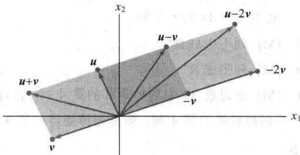
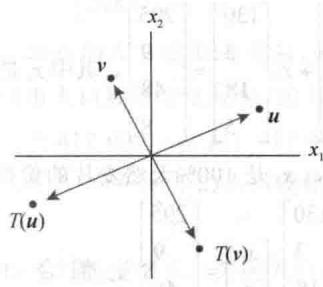
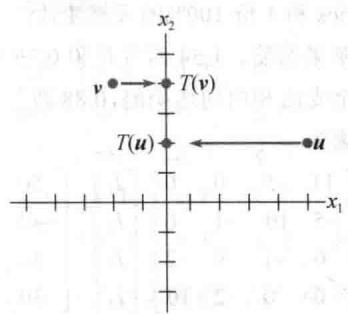
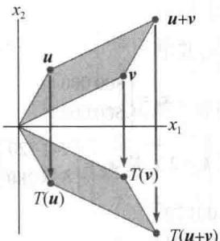
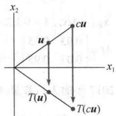
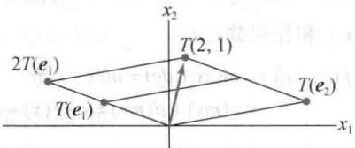

import Knowledge from '@/components/Knowledge.astro';
import Example from '@/components/Example.astro';
import Note from '@/components/Note.astro';
import Solution from '@/components/Solution.astro';
import Block from '@/components/Block.astro';

<Block title="第1章 习题答案">

1.1

1. 解是 $(x_{1}, x_{2}) = (-8, 3)$ ，或简单写成 $(-8, 3)$ .

3. (4/7,9/7)

5. 替换第 2 行为第 2 行加 3 乘以第 3 行，然后替换第 1 行为第 1 行加 -5 乘以第 3 行.

7. 解集为空集.

9. (4,8,5,2) 11. 不相容

13. (5,3,-1) 15. 相容

17. 计算表明方程组不相容, 因此这三条线没有交点.

19. $h \neq 2$ 21. 所有 h

23. 标记一个命题为真当且仅当这个命题总是真的。只给出答案会达不到判断题的意义，即帮助你学会仔细阅读教材是重要的。“学习指导”告诉你在哪里可以找到答案，但你不应该在没有尝试自己寻找答案之前就去查看“学习指导”。

25. $k + 2g + h = 0$

27. 行化简 $\begin{bmatrix} 1 & 3 & f \\ c & d & g \end{bmatrix}$ 为 $\begin{bmatrix} 1 & 3 & f \\ 0 & d - 3c & g - cf \end{bmatrix}$ 后显示 $d - 3c$ 必定不为零，因为 $f$ 和 $g$ 是任意值。否则，对 $f$ 和 $g$ 的某种取值，第2行对应于形如 $0 = b$ 的方程，其中 $b$ 不为零。因此 $d \neq 3c$ 。

29. 交换第1行和第2行；交换第1行和第2行.

31. 用第3行加-4乘第1行替换第3行；用第3行加4乘第1行替换第3行. $4T_{1}-T_{2}-T_{4}=30$ 33. $-T_{1}+4T_{2}-T_{3}=60$ $-T_{2}+4T_{3}-T_{4}=70$ $-T_{1}-T_{3}+4T_{4}=40$

1.2

1. 简化阶梯形：a,b；阶梯形：d；非阶梯形：c.

$\begin{bmatrix}1&0&-1&-2\\ 0&1&2&3\\ 0&0&0&0\end{bmatrix}$ ，主元列是第1列和第2列： $\begin{bmatrix}1&2&3&4\\ 4&5&6&7\\ 6&7&8&9\end{bmatrix}.$

5. $\begin{bmatrix} \blacksquare & * \\ 0 & \blacksquare \end{bmatrix}, \begin{bmatrix} \blacksquare & * \\ 0 & 0 \end{bmatrix}, \begin{bmatrix} 0 & \blacksquare \\ 0 & 0 \end{bmatrix}$ 7. $\left\{\begin{aligned}x_{1}&=-5-3x_{2}\\ x_{2}&是自由变量\\ x_{3}&=3\end{aligned}\right.$ 9. $\left\{\begin{aligned}x_{1}&=4+5x_{3}\\ x_{2}&=5+6x_{3}\\ x_{3}&是自由变量\end{aligned}\right.$ 11. $\left\{\begin{aligned}x_{1}&=\frac{4}{3}x_{2}-\frac{2}{3}x_{3}\\ x_{2}&是自由变量\\ x_{3}&是自由变量\end{aligned}\right.$ 13. $\left\{\begin{aligned}x_{1}&=5+3x_{5}\\ x_{2}&=1+4x_{5}\\ x_{3}&是自由变量\\ x_{4}&=4-9x_{5}\\ x_{5}&是自由变量\end{aligned}\right.$

注: 学习指导讨论了通常的错误 $x_{3}=0$ .

15. a. 相容，只有一个解 b. 不相容.

17. $h=\frac{7}{2}$

19. a. 当 $h = 2, k \neq 8$ 时不相容  

b. 当 $h \neq 2$ 时有唯一解  

c. 当 $h = 2, k = 8$ 时有多解

21. 仔细阅读课本，查阅“学习指导”之前写出你的答案。记住，一个论断是正确的当且仅当所有情形下论断都正确。

23. 是．方程组是相容的，这是因为它有三个主元，一定有一个主元在系数矩阵的第三行．化简后的阶梯形矩阵不包含 [0 0 0 0 0 1]

25. 如果系数矩阵中的每一行都有一个主元位置，那么在底行有一个主元位置，从而在增广列没有主元位置，所以，根据定理 2，方程组是相容的.

27. 如果线性方程组是相容的，则解是唯一的当且仅当系数矩阵的每一列都是主元列，否则，方程组有无穷多解.

29. 一个不确定的方程组中，未知变量的个数总多于方程的个数。基本变量的个数不多于方程的个数，所以，至少有一个自由变量，这个变量可以被指定无穷多个值。如果方程组是相容的，则自由变量的每一个不同值会产生一个不同解。

31. 是的，一个线性方程组的方程个数多于未知变量的个数，它可以是相容的。下面的方程组有一个解 $(x_{1} = x_{2} = 1)$ ：

$$

\begin{array}{r l} & x _ {1} + x _ {2} = 2 \\ & x _ {1} - x _ {2} = 0 \\ & 3 x _ {1} + 2 x _ {2} = 5 \end{array}

$$

33. [M] $p(t)=7+6t-t^{2}$

1.3

1. $\begin{bmatrix} -4\\ 1 \end{bmatrix}$ ， $\begin{bmatrix} 5\\ 4 \end{bmatrix}$

3.

5. $x_{1}\left[ \begin{array}{c}6\\ -1\\ 5 \end{array} \right] + x_{2}\left[ \begin{array}{c} - 3\\ 4\\ 0 \end{array} \right] = \left[ \begin{array}{c}1\\ -7\\ -5 \end{array} \right],$

$$

\left[ \begin{array}{c} 6 x _ {1} \\ - x _ {1} \\ 5 x _ {1} \end{array} \right] + \left[ \begin{array}{c} - 3 x _ {2} \\ 4 x _ {2} \\ 0 \end{array} \right] = \left[ \begin{array}{c} 1 \\ - 7 \\ - 5 \end{array} \right], \quad \left[ \begin{array}{c} 6 x _ {1} - 3 x _ {2} \\ - x _ {1} + 4 x _ {2} \\ 5 x _ {1} \end{array} \right] = \left[ \begin{array}{c} 1 \\ - 7 \\ - 5 \end{array} \right]

$$

$$

\begin{array}{r l} 6 x _ {1} - 3 x _ {2} & = 1 \\ - x _ {1} + 4 x _ {2} & = - 7 \\ 5 x _ {1} & = - 5 \end{array}

$$

通常不写中间过程.

7. $a = u - 2v, b = 2u - 2v, c = 2u - 3.5v, d = 3u - 4v$

$$

x _ {1} \left[ \begin{array}{c} 0 \\ 4 \\ - 1 \end{array} \right] + x _ {2} \left[ \begin{array}{l} 1 \\ 6 \\ 3 \end{array} \right] + x _ {3} \left[ \begin{array}{c} 5 \\ - 1 \\ - 8 \end{array} \right] = \left[ \begin{array}{l} 0 \\ 0 \\ 0 \end{array} \right]

$$

11. 是，b 是 $a_{1}, a_{2}, a_{3}$ 的线性组合.

13. 否，b不是A的列的线性组合.

15. 当然，非整数权值也可以接受，但一些简单选择是 $0 \cdot v_{1} + 0 \cdot v_{2} = 0$ ，且

$$

1 \cdot \boldsymbol {v} _ {1} + 0 \cdot \boldsymbol {v} _ {2} = \left[ \begin{array}{c} 7 \\ 1 \\ - 6 \end{array} \right], 0 \cdot \boldsymbol {v} _ {1} + 1 \cdot \boldsymbol {v} _ {2} = \left[ \begin{array}{c} - 5 \\ 3 \\ 0 \end{array} \right]

$$

$$

1 \cdot \pmb {v} _ {1} + 1 \cdot \pmb {v} _ {2} = \left[ \begin{array}{c} 2 \\ 4 \\ - 6 \end{array} \right], 1 \cdot \pmb {v} _ {1} - 1 \cdot \pmb {v} _ {2} = \left[ \begin{array}{c} 1 2 \\ - 2 \\ - 6 \end{array} \right]

$$

17. h = -17

19. Span $\{v_{1}, v_{2}\}$ 是在通过 $v_{1}$ 和原点的直线上的点集.

21. 提示：证明 $\begin{bmatrix} 2 & 2 & h \\ -1 & 1 & k \end{bmatrix}$ 对所有 h 和 k 是相容的，解释这个计算能说明 Span $\{u, v\}$ 是什么.

23. 在你查阅 “学习指导” 之前，先仔细阅读整节内容。特别注意定义和定理的叙述和其前后的注释。

25. a. 否，3 b. 是，无穷多

c. $a_{1}=1\cdot a_{1}+0\cdot a_{2}+0\cdot a_{3}$

27. a. $5v_{1}$ 是 5 天工作 1#矿的产出.

b. 总的产出是 $x_{1}v_{1} + x_{2}v_{2}$ ，所以 $x_{1}$ 和 $x_{2}$ 应该满足 $x_{1}v_{1} + x_{2}v_{2} = \begin{bmatrix} 150 \\ 2825 \end{bmatrix}$ .

c.[M]1.5天生产1#矿和4天生产2#矿.

29. (1.3, 0.9, 0)

31. a. $\begin{bmatrix}10/3\\2\end{bmatrix}$ b. 在 $(0,1)$ 点加 3.5 克，在 $(8,1)$ 点加 0.5 克，在 $(2,4)$ 点加 2 克.

33. 复习练习题 1 再写出解答，“学习指导”有参考解答.

1.4

1. 乘积无定义，因为 $3 \times 2$ 矩阵的列数为 2，而向量的元素个数是 3，两者不匹配.

3. a.

$$

\begin{array}{r l} A \mathbf {x} & = \left[ \begin{array}{c c} 6 & 5 \\ - 4 & - 3 \\ 7 & 6 \end{array} \right] \left[ \begin{array}{c} 2 \\ - 3 \end{array} \right] = 2 \cdot \left[ \begin{array}{c} 6 \\ - 4 \\ 7 \end{array} \right] - 3 \cdot \left[ \begin{array}{c} 5 \\ - 3 \\ 6 \end{array} \right] \\ & = \left[ \begin{array}{c} 1 2 \\ - 8 \\ 1 4 \end{array} \right] + \left[ \begin{array}{c} - 1 5 \\ 9 \\ - 1 8 \end{array} \right] = \left[ \begin{array}{c} - 3 \\ 1 \\ - 4 \end{array} \right] \end{array}

$$

b.

$$

A \boldsymbol {x} = \left[ \begin{array}{l l} 6 & 5 \\ - 4 & - 3 \\ 7 & 6 \end{array} \right] \left[ \begin{array}{l} 2 \\ - 3 \end{array} \right] = \left[ \begin{array}{c} 6 \cdot 2 + 5 \cdot (- 3) \\ (- 4) \cdot 2 + (- 3) \cdot (- 3) \\ 7 \cdot 2 + 6 \cdot (- 3) \end{array} \right] = \left[ \begin{array}{l} - 3 \\ 1 \\ - 4 \end{array} \right]

$$

在这里以及习题 4\~6 展示你的工作, 以后的习题计算过程用心算.

5. $5 \cdot \begin{bmatrix} 5 \\ -2 \end{bmatrix} -1 \cdot \begin{bmatrix} 1 \\ -7 \end{bmatrix} + 3 \cdot \begin{bmatrix} -8 \\ 3 \end{bmatrix} -2 \cdot \begin{bmatrix} 4 \\ -5 \end{bmatrix} = \begin{bmatrix} -8 \\ 16 \end{bmatrix}$

7.

$$

\left[ \begin{array}{r r r} 4 & - 5 & 7 \\ - 1 & 3 & - 8 \\ 7 & - 5 & 0 \\ - 4 & 1 & 2 \end{array} \right] \left[ \begin{array}{l} x _ {1} \\ x _ {2} \\ x _ {3} \end{array} \right] = \left[ \begin{array}{l} 6 \\ - 8 \\ 0 \\ - 7 \end{array} \right]

$$

$$

9. x _ {1} \left[ \begin{array}{l} 3 \\ 0 \end{array} \right] + x _ {2} \left[ \begin{array}{l} 1 \\ 1 \end{array} \right] + x _ {3} \left[ \begin{array}{l} - 5 \\ 4 \end{array} \right] = \left[ \begin{array}{l} 9 \\ 0 \end{array} \right], \quad \left[ \begin{array}{l l l} 3 & 1 & - 5 \\ 0 & 1 & 4 \end{array} \right] \left[ \begin{array}{l} x _ {1} \\ x _ {2} \\ x _ {3} \end{array} \right] = \left[ \begin{array}{l} 9 \\ 0 \end{array} \right]

$$

11.

$$

\left[ \begin{array}{c c c c} 1 & 2 & 4 & - 2 \\ 0 & 1 & 5 & 2 \\ - 2 & - 4 & - 3 & 9 \end{array} \right], \boldsymbol {x} = \left[ \begin{array}{l} x _ {1} \\ x _ {2} \\ x _ {3} \end{array} \right] = \left[ \begin{array}{l} 0 \\ - 3 \\ 1 \end{array} \right]

$$

13. 是（验证你的答案）.

u 在这里

15. 当 $3b_{1} + b_{2}$ 非零时，方程 $Ax = b$ 不相容。（给出理由。）所有使方程 $Ax = b$ 相容的 $\pmb{b}$ 组成的集合是一条通过原点的直线 $b_{2} = -3b_{1}$

17. 只有 3 行含有主元位置. 由定理 4, 方程 $Ax = b$ 不是对 $\mathbb{R}^4$ 中的每个 $b$ 都有解.

19. 习题 17 说明定理 4 命题（d）不真，因此定理 4 的四个命题都不真，所以不是 $R^{4}$ 中的所有向量都可以写成 A 的列的线性组合的形式，且 A 的列不能生成 $R^{4}$ .

21. 矩阵 $[\pmb{v}_1, \pmb{v}_2, \pmb{v}_3]$ 不是每一行都有主元，因此由定理4，矩阵的列不能生成 $\mathbb{R}^4$ ，即 $\{\pmb{v}_1, \pmb{v}_2, \pmb{v}_3\}$ 不能生成 $\mathbb{R}^4$ ：

23. 仔细阅读教材，在查阅“学习指导”之前先判断习题中每个命题的真假。习题23和24中的许多命题是这种形式的蕴涵式：“如果&lt;命题1>，则&lt;命题2>”或等价地，“有&lt;命题2>，如果&lt;命题1>。”当&lt;命题1>为真时，如果在任何情形下&lt;命题2>都为真，则将这样的蕴涵式标记为真。

25. $c_{1} = -3, c_{2} = -1, c_{3} = 2$

27. $Qx = v$ ，其中 $Q = [q_{1}, q_{2}, q_{3}]$ 及 $x = \begin{bmatrix} x_{1} \\ x_{2} \\ x_{3} \end{bmatrix}$ . 注：如果答案是 $Ax = b$ ，必须明确 $A$ 和

29. 提示: 从有 3 个主元位置的 $3 \times 3$ 阶梯形矩阵 B 开始寻找.

31. 查阅 “学习指导” 之前写出你的解答.

33. 提示： $A$ 有多少主元列？为什么？

35. 给定 $Ax_{1} = y_{1}, Ax_{2} = y_{2}$ ，要证明 $Ax = w$ 有一个解，其中 $w = y_{1} + y_{2}$ 。注意到 $w = Ax_{1} + Ax_{2}$ 。由定理5(a)，分别用 $x_{1}, x_{2}$ 代替 $u, v$ ，则有 $w = Ax_{1} + Ax_{2} = A(x_{1} + x_{2})$ 。因此向量 $x = x_{1} + x_{2}$ 是 $w = Ax$ 的一个解。

37. [M] 列不生成 $\mathbb{R}^4$ .

39. [M] 列生成 $\mathbb{R}^4$ .

41. [M] 在习题 39 中划掉矩阵的第 4 列. 也可以不划掉矩阵的第 4 列, 而是划掉矩阵的第 3 列.

1.5

1. 方程组有非平凡解，因为有自由变量 $x_{3}$ .

3. 方程组有非平凡解，因为有自由变量 $x_{3}$ .

5.

$$

\boldsymbol {x} = \left[ \begin{array}{l} x _ {1} \\ x _ {2} \\ x _ {3} \end{array} \right] = x _ {3} \left[ \begin{array}{c} 5 \\ - 2 \\ 1 \end{array} \right]

$$

7.

$$

\boldsymbol {x} = \left[ \begin{array}{l} x _ {1} \\ x _ {2} \\ x _ {3} \\ x _ {4} \end{array} \right] = x _ {3} \left[ \begin{array}{c} - 9 \\ 4 \\ 1 \\ 0 \end{array} \right] + x _ {4} \left[ \begin{array}{c} 8 \\ - 5 \\ 0 \\ 1 \end{array} \right]

$$

9.

$$

\boldsymbol {x} = x _ {2} \left[ \begin{array}{l} 3 \\ 1 \\ 0 \end{array} \right] + x _ {3} \left[ \begin{array}{c} - 2 \\ 0 \\ 1 \end{array} \right]

$$

11. 提示：由阶梯形推出的方程组是

$$

\begin{array}{r l} x _ {1} - 4 x _ {2} & + 5 x _ {6} = 0 \\ x _ {3} & - x _ {6} = 0 \\ x _ {5} - 4 x _ {6} = 0 \\ & 0 = 0 \end{array}

$$

基本变量是 $x_{1}, x_{3}, x_{5}$ ，其他变量是自由变量。

“学习指导”讨论了两种这类型题目常犯的错误.

13. $x=\begin{bmatrix}5\\ -2\\ 0\end{bmatrix}+x_{3}\begin{bmatrix}4\\ -7\\ 1\end{bmatrix}=p+x_{3}q$ . 在几何上，解集是

通过 $\begin{bmatrix}5\\ -2\\ 0\end{bmatrix}$ 且平行于 $\begin{bmatrix}4\\ -7\\ 1\end{bmatrix}$ 的直线.

15. $x=\begin{bmatrix}x_{1}\\x_{2}\\x_{3}\end{bmatrix}=\begin{bmatrix}-2\\1\\0\end{bmatrix}+x_{3}\begin{bmatrix}5\\-2\\1\end{bmatrix}$ . 解集是通过 $\begin{bmatrix}-2\\1\\0\end{bmatrix}$ 的直线，平行于习题 5 中齐次线性方程组解集的直线.

17. 令 $\pmb{u} = \begin{bmatrix} -9 \\ 1 \\ 0 \end{bmatrix}, \pmb{v} = \begin{bmatrix} 4 \\ 0 \\ 1 \end{bmatrix}, \pmb{p} = \begin{bmatrix} -2 \\ 0 \\ 0 \end{bmatrix}$ ，齐次方程的解是 $x = x_{2}u + x_{3}v$ ，这是由 $\pmb{u}$ 和 $\pmb{v}$ 所生成的通过原点的平面。非齐次方程组的解集是 $x = p + x_{2}u + x_{3}v$ ，此平面通过 $p$ ，平行于齐次方程解集的平面。

19. $x = a + tb$ ，其中 $t$ 为参数，或者 $x = \begin{bmatrix} x_1\\ x_2 \end{bmatrix} = \begin{bmatrix} -2\\ 0 \end{bmatrix} +t\begin{bmatrix} -5\\ 3 \end{bmatrix}$ 或 $\left\{ \begin{array}{ll}x_{1} = -2 - 5t\\ x_{2} = \dots 3t \end{array} \right.$

21. $x = p + t(q - p) = \begin{bmatrix} 2 \\ -5 \end{bmatrix} + t \begin{bmatrix} -5 \\ 6 \end{bmatrix}$

23. 非常重要的是仔细阅读课本，然后写出你的答案.

完成之后，如果需要，用“学习指导”校对答案.

25. $A\pmb{v}_h = A(\pmb {w} - \pmb {p}) = A\pmb {w} - A\pmb {p} = \pmb {b} - \pmb {b} = \mathbf{0}$

27. 当 A 是 $3 \times 3$ 零矩阵时 $R^{3}$ 中的每一个 x 满足 Ax = 0，因此解集是 $R^{3}$ 中的所有向量.

29. a. 当 A 是 $3 \times 3$ 矩阵且有 3 个主元位置时，方程 Ax = 0 没有自由变量，因此没有非平凡解.

b. 有 3 个主元位置时，A 在每一行都有一个主元位置，由 1.4 节定理 4，方程 Ax = b 对每个可能的 b 都有一个解．“可能”的意思是此处考虑的向量是 $\mathbb{R}^3$ 中的向量，因为 $A$ 有3行.

31. a. 当 A 是 $3 \times 2$ 矩阵且有 2 个主元位置时，每一列是主元列，于是方程 Ax = 0 没有自由变量，因此没有非平凡解.

b. 有 2 个主元位置和三行时，A 不可能在每一行有一个主元，由 1.4 节定理 4，方程 Ax = b 不可能对 $R^{3}$ 中每个可能的 b 都有一个解.

33. 一个答案是 $x = \begin{bmatrix} 3 \\ -1 \end{bmatrix}$ .

35. 你的例子中应该有每行的元素之和等于零. 为什么?

37. 一个答案是 $A = \begin{bmatrix} 1 & -4 \\ 1 & -4 \end{bmatrix}$ . “学习指导”给出如何分析问题以构造 $A$ . 如果 $\pmb{b}$ 不是 $A$ 的第一列的数倍, 则 $Ax = b$ 的解集为空, 因此不可能通过平移 $Ax = 0$ 的解集来得到 $Ax = b$ 的解. 这并不与定理6相矛盾, 因为定理6仅当方程 $Ax = b$ 有非空的解集时才成立.

39. 如果 $c$ 是一个数，则由1.4节定理5（b）， $A(c\pmb{u}) = cA\pmb{u}$ 。如果 $u$ 满足 $Ax = 0$ ，则 $Au = 0$ ， $cAu = c \cdot 0 = 0$ ，从而 $A(c\pmb{u}) = 0$ 。

1.6

1. 一通解是 $p_{\text{商品}} = 0.875p_{\text{服务}}$ ，其中 $p_{\text{服务}}$ 是自由变量。一个平衡的解是 $p_{\text{服务}} = 1000$ 和 $p_{\text{商品}} = 875$ 。使用分数，一般解可写成 $p_{\text{商品}} = (7/8)p_{\text{服务}}$ ，一个自然的价格取值是 $p_{\text{服务}} = 80$ ， $p_{\text{商品}} = 70$ 。只有价格的比例是重要的，经济平衡不会受一个价格变化的影响。

<table><tr><td>产出</td><td>燃料能源</td><td>加工</td><td>服务</td><td rowspan="2">投入</td><td rowspan="2">购买部门:</td></tr><tr><td></td><td>↓</td><td>↓</td><td>↓</td></tr><tr><td></td><td>0.2</td><td>0.8</td><td>0.4</td><td>→</td><td>燃料能源</td></tr><tr><td></td><td>0.3</td><td>0.1</td><td>0.4</td><td>→</td><td>加工</td></tr><tr><td></td><td>0.5</td><td>0.1</td><td>0.2</td><td>→</td><td>服务</td></tr></table>

b.

$$

\left[ \begin{array}{r r r r} 0. 8 & - 0. 8 & - 0. 4 & 0 \\ - 0. 3 & 0. 9 & - 0. 4 & 0 \\ - 0. 5 & - 0. 1 & 0. 8 & 0 \end{array} \right]

$$

c. [M] $p_{化学金属}=141.7$ , $p_{燃料动力}=91.7$ , $p_{机器}=100$ .

取两位有效数字 $p_{化学金属}=140$ , $p_{燃料动力}=92$ , $p_{机器}=100$ .

5. $\mathrm{B}_{2} \mathrm{~S}_{3} + 6 \mathrm{H}_{2} \mathrm{O} \rightarrow 2 \mathrm{H}_{3} \mathrm{BO}_{3} + 3 \mathrm{H}_{2} \mathrm{~S}$

7. $3\mathrm{NaHCO}_3 + \mathrm{H}_3\mathrm{C}_6\mathrm{H}_5\mathrm{O}_7 \rightarrow \mathrm{Na}_3\mathrm{C}_6\mathrm{H}_5\mathrm{O}_7 + 3\mathrm{H}_2\mathrm{O} + 3\mathrm{CO}_2$

9. [M] $15\mathrm{PbN}_6 + 44\mathrm{C_rM_{n_2}O_8}\rightarrow 5\mathrm{Pb}_3\mathrm{O}_4 + 22\mathrm{C_{r_2}O_3}+$ $88\mathrm{M_nO_2 + 90NO}$ 11. $\left\{ \begin{array}{l}x_{1} = 20 - x_{3}\\ x_{2} = 60 + x_{3}\\ x_{3}\text{是自由变量}\\ x_{4} = 60 \end{array} \right.$ $x_{3}$ 的最大值是20.  

13.a. $\left\{ \begin{array}{l}x_{1} = x_{3} - 40\\ x_{2} = x_{3} + 10\\ x_{3}\text{是自由变量}\\ x_{4} = x_{6} + 50\\ x_{5} = x_{6} + 60\\ x_{6}\text{是自由变量} \end{array} \right.$ b. $\left\{ \begin{array}{l}x_{2} = 50\\ x_{3} = 40\\ x_{4} = 50\\ x_{5} = 60 \end{array} \right.$

1.7

对习题 1\~22 验证你的答案.

1. 线性无关 3. 线性相关

9. a. 没有 $h$ b. 所有 $h$

$$

h = 6

$$

15. 线性相关 17. 线性相关

21. 如果在思考判断题之前查阅“学习指导”，会失去做这类题目的意义.

23. $\begin{bmatrix} \blacksquare & * & * \\ 0 & \blacksquare & * \\ 0 & 0 & \blacksquare \end{bmatrix}$

25.

$$

\left[ \begin{array}{c c} {\blacksquare} & {*} \\ {0} & {\blacksquare} \\ {0} & {0} \\ {0} & {0} \end{array} \right] \text {和} \left[ \begin{array}{c c} {0} & {\blacksquare} \\ {0} & {0} \\ {0} & {0} \\ {0} & {0} \end{array} \right]

$$

27. $7 \times 5$ 矩阵 A 的所有 5 列一定是主元列. 否则方程 Ax = 0 有自由变量, 此时, A 的列线性相关.

29. A: 任何有两个非零列的 $3 \times 2$ 矩阵，但两列相互没有倍数关系，此时，这两列线性无关，因此方程 Ax = 0 只有平凡解.

B: 任何一列是另外一列倍数的 $3 \times 2$ 矩阵.

31. $x=\begin{bmatrix}1\\ 1\\ -1\end{bmatrix}$

33. 由定理 7 可知，真。（“学习指导”补充了另外的验证。）

35. 假. 向量 $v_{1}$ 可能是零向量.

37. 真， $v_{1}, v_{2}, v_{3}$ 之间的线性相关关系通过选取 $v_{4}$ 的权值为零可以扩展为 $v_{1}, v_{2}, v_{3}, v_{4}$ 之间的线性相关关系.

39. 你有能力在没有帮助的条件下做这个重要的题目。在查阅“学习指导”之前写出你的解答。

41. [M]利用 A 的主元列， $B=\begin{bmatrix}8&-3&2\\ -9&4&-7\\ 6&-2&4\\ 5&-1&10\end{bmatrix}$ ，可能有其他选择.

43. [M] $A$ 中不属于 $B$ 的每一个列属于 $B$ 的列所生成的集合.

1.8

1. $\begin{bmatrix} 2 \\ -6 \end{bmatrix}, \begin{bmatrix} 2a \\ 2b \end{bmatrix}$ 3. $x = \begin{bmatrix} 3 \\ 1 \\ 2 \end{bmatrix}$ , 唯一解

5. $x=\begin{bmatrix}3\\ 1\\ 0\end{bmatrix}$ ，不唯一 7. a=5, b=6

9. $x = x_{3} \begin{bmatrix} 9 \\ 4 \\ 1 \\ 0 \end{bmatrix} + x_{4} \begin{bmatrix} -7 \\ -3 \\ 0 \\ 1 \end{bmatrix}$

11. 是，因为 $[A b]$ 所表示的方程组是相容的。

13.

  

通过原点的对称

15.

  

到 $x_{2}$ 轴上的投影

17. $\begin{bmatrix} 6 \\ 3 \end{bmatrix}, \begin{bmatrix} -2 \\ 6 \end{bmatrix}, \begin{bmatrix} 4 \\ 9 \end{bmatrix}$ 19. $\begin{bmatrix} 13 \\ 7 \end{bmatrix}, \begin{bmatrix} 2x_{1} - x_{2} \\ 5x_{1} + 6x_{2} \end{bmatrix}$

21. 仔细阅读课本，在查阅“学习指导”之前写出你的答案，注意练习21(e)是下列形式的句子，“〈命题1〉当且仅当〈命题2〉”

标出这样的句子是真的：如果〈命题1〉真，在任何情况下〈命题2〉是真的；如果〈命题2〉真，在任何情况下〈命题1〉是真的.

23.

25. 提示：利用直线的参数方程表示直线的图像

（即直线上所有点的图像组成的集合）.

27. a. 经过 p 和 q 的直线平行于 q-p（见 1.5 节的习题 21 和 22）。由于 p 在直线上，故 $x = p + t(q - p)$ ，从而 $x = p - tp + tq$ ，即 $x = (1 - t)p + tq$ 。

b. 考虑 $x=(1-t)p+tp,0\leqslant t\leqslant1$ 。由变换 T 的线性性， $T(x)=T((1-t)p+tp)=(1-t)T(p)+tT(q)$ (\*)

如果 $T(p)$ 和 $T(q)$ 是相异的，则（\*）是过 $T(p)$ 和 $T(q)$ 的线段，如（a）所示。否则，图像的集合是一个点 $T(p)$ ，这是因为 $(1-t)T(p)+tT(q)=(1-t)T(p)+tT(p)=T(p)$

29. a. 当 $b = 0$ 时, $f(x) = mx$ . 此时, 对任何 $\mathbb{R}$ 中的 $x, y$ 和任何数 $c, d$ , $f(cx + dy) = m(cx + dy) = mcx + mdy$ $= c(mx) + d(my) = c \cdot f(x) + d \cdot f(y)$ 这说明 $f$ 是线性的. b. 当 $f(x) = mx + b$ 时, 其中 $b$ 非零, $f(0) = m(0) + b = b \neq 0$ . c. 在微积分中, $f$ 称为线性函数, 因为 $f$ 的图像是一直线.

31. 提示：由于 $\{\pmb{v}_1, \pmb{v}_2, \pmb{v}_3\}$ 线性相关，你可写出一些方程且解出它.

33. 一种可能性是验证 T 不将零向量映射为零向量，但是，每个线性变换必须将零向量映射为零向量： $T(0,0)=(0,4,0)$ .

35. 取 $\mathbb{R}^3$ 中的 $\pmb{u}$ 和 $\pmb{v}$ ，令 $c, d$ 为数，则 $cu + dv = (cu_1 + dv_1, cu_2 + dv_2, cu_3 + dv_3)$ ，线性变换 $T$ 是线性的，因为

$$

\begin{array}{r l} T (c \boldsymbol {u} + d \boldsymbol {v}) & = (c u _ {1} + d v _ {1}, c u _ {2} + d v _ {2}, - (c u _ {3} + d v _ {3})) \\ & = (c u _ {1} + d v _ {1}, c u _ {2} + d v _ {2}, - c u _ {3} - d v _ {3}) \\ & = (c u _ {1}, c u _ {2}, - c u _ {3}) + (d v _ {1}, d v _ {2}, - d v _ {3}) \\ & = c (u _ {1}, u _ {2}, - u _ {3}) + d (v _ {1}, v _ {2}, - v _ {3}) \\ & = c T (\boldsymbol {u}) + d T (\boldsymbol {v}) \end{array}

$$

37. [M] 所有（7，9，0，2）的倍数.

39. [M] 是，对 $x$ 的一个选择是（4，7，1，0）

1.9

$$

\left[ \begin{array}{c c} 3 & - 5 \\ 1 & 2 \\ 3 & 0 \\ 1 & 0 \end{array} \right]

$$

3.

$$

\left[ \begin{array}{c c} 0 & 1 \\ - 1 & 0 \end{array} \right]

$$

$$

\left[ \begin{array}{c c} 1 & 0 \\ - 2 & 1 \end{array} \right]

$$

$$

\left[ \begin{array}{c c} - 1 / \sqrt {2} & 1 / \sqrt {2} \\ 1 / \sqrt {2} & 1 / \sqrt {2} \end{array} \right]

$$

9.

$$

\left[ \begin{array}{c c} 0 & - 1 \\ - 1 & 2 \end{array} \right]

$$

11. 所描述的变换 T 将 $e_{1}$ 映射为 $-e_{1}$ ，将 $e_{2}$ 映射为 $-e_{2}$ 。旋转 $\pi$ 弧度也可以将 $e_{1}$ 映射为 $-e_{1}$ ，将 $e_{2}$ 映射为 $-e_{2}$ 。因为一个线性变换完全由它对单位矩阵的列的映射而确定，这样的旋转变换对 $R^{2}$ 中的每个向量的作用跟 T 是一样的。

13.

15.

$$

\left[ \begin{array}{c c c} 3 & 0 & - 2 \\ 4 & 0 & 0 \\ 1 & - 1 & 1 \end{array} \right]

$$

17.

$$

\left[ \begin{array}{c c c c} 0 & 0 & 0 & 0 \\ 1 & 1 & 0 & 0 \\ 0 & 1 & 1 & 0 \\ 0 & 0 & 1 & 1 \end{array} \right]

$$

$$

\left[ \begin{array}{c c c} 1 & - 5 & 4 \\ 0 & 1 & - 6 \end{array} \right]

$$

$$

\boldsymbol {x} = \left[ \begin{array}{c} 7 \\ - 4 \end{array} \right]

$$

23. 查阅 “学习指导” 之前先回答问题.

对习题 25\~28 验证你的答案.

25. 不是一对一的也不是将 $R^{4}$ 映上到 $R^{4}$ 的映射.

27. 不是一对一的，但是将 $\mathbb{R}^3$ 映上到 $\mathbb{R}^2$ 的映射

29.

$$

\left[ \begin{array}{c c c} \blacksquare & * & * \\ 0 & \blacksquare & * \\ 0 & 0 & \blacksquare \\ 0 & 0 & 0 \end{array} \right]

$$

31. n. (解释为什么，然后查阅“学习指导”.)

33. 提示：如果 $e_{j}$ 是单位矩阵 $I_{n}$ 的第 j 列，那么 $Be_{j}$ 是 B 的第 j 列.

35. 提示： $m > n$ 可能吗？对 $m < n$ 怎么样？

37. [M] 否（解释为什么）.

39. [M] 否（解释为什么）.

1.10

1. a.

1. $x_{1}\begin{bmatrix}110\\ 4\\ 20\\ 2\end{bmatrix}+x_{2}\begin{bmatrix}130\\ 3\\ 18\\ 5\end{bmatrix}=\begin{bmatrix}295\\ 9\\ 48\\ 8\end{bmatrix}$ ，其中 $x_{1}$ 是 Cheerios

的份数， $x_{2}$ 是100%天然麦片的份数.

b.

$\begin{bmatrix}110&130\\ 4&3\\ 20&18\\ 2&5\end{bmatrix}\begin{bmatrix}x_{1}\\ x_{2}\end{bmatrix}=\begin{bmatrix}295\\ 9\\ 48\\ 8\end{bmatrix}$ . 混合 1.5 份的

Cheerios 和 1 份 100% 的天然麦片.

3. a. 0.99 苹果奶酪、1.54 西兰花和 0.79 鸡肉罐头  

b. 1.09 全麦面和白切达奶酪，0.88 西兰花和 1.03 鸡肉罐头

5.

$$

R \boldsymbol {i} = \boldsymbol {v}, \left[ \begin{array}{r r r r} 1 1 & - 5 & 0 & 0 \\ - 5 & 1 0 & - 1 & 0 \\ 0 & - 1 & 9 & - 2 \\ 0 & 0 & - 2 & 1 0 \end{array} \right] \left[ \begin{array}{l} I _ {1} \\ I _ {2} \\ I _ {3} \\ I _ {4} \end{array} \right] = \left[ \begin{array}{l} 5 0 \\ - 4 0 \\ 3 0 \\ - 3 0 \end{array} \right]

$$

$$

[ \mathrm{M} ]: \boldsymbol {i} = \left[ \begin{array}{l} I _ {1} \\ I _ {2} \\ I _ {3} \\ I _ {4} \end{array} \right] = \left[ \begin{array}{c} 3. 6 8 \\ - 1. 9 0 \\ 2. 5 7 \\ - 2. 4 9 \end{array} \right]

$$

$$

R \boldsymbol {i} = \boldsymbol {v}, \left[ \begin{array}{c c c c} 1 2 & - 7 & - 0 & - 4 \\ - 7 & 1 5 & - 6 & 0 \\ 0 & - 6 & 1 4 & - 5 \\ - 4 & 0 & - 5 & 1 3 \end{array} \right] \left[ \begin{array}{l} I _ {1} \\ I _ {2} \\ I _ {3} \\ I _ {4} \end{array} \right] = \left[ \begin{array}{l} 4 0 \\ 3 0 \\ 2 0 \\ 1 0 \end{array} \right]

$$

[M]:

$$

\boldsymbol {i} = \left[ \begin{array}{l} I _ {1} \\ I _ {2} \\ I _ {3} \\ I _ {4} \end{array} \right] = \left[ \begin{array}{l} 1 1. 4 3 \\ 1 0. 5 5 \\ 8. 0 4 \\ 5. 8 4 \end{array} \right]

$$

9. $x_{k+1}=Mx_{k},\quad k=0,1,2,\cdots,$ 其中 $M=\begin{bmatrix}0.93 & 0.05 \\ 0.07 & 0.95\end{bmatrix},\quad x_{0}=\begin{bmatrix}800\ 000\\ 500\ 000\end{bmatrix}$

2017年的人口数量（ $k = 2$ ）是 $\pmb{x}_2 = \begin{bmatrix} 741720\\ 558280 \end{bmatrix}$

11. a. $M=\begin{bmatrix}0.98033 & 0.00179 \\ 0.01967 & 0.99821\end{bmatrix}$

b. [M] $x_{10}=\begin{bmatrix}35.729\\278.18\end{bmatrix}$

13. [M] a. 城市的人口减少, 7年后, 人口会相等, 但城市人口数量继续减少. 20年后, 城市人口仅为417000. (注意: 417456在千位上四舍五入.) 但每年的人口变化数量会越来越小.

b. 城市人口缓慢增长，郊区人口减少. 20年后，城市人口将从350000增长到370000.

</Block>

<Block title="第1章补充习题 答案">

1. a.F b.F c.T d.F e.T f.T g.F h.F i.T j.F k.T l.F m.T n.T o.T p.T q.F r.T s.F t.T u.F v.F w.F x.T y.T z.F

3. a. 任一相容的线性方程组，其阶梯形为

<table><tr><td> $\begin{bmatrix} \square & * & * & * \\ 0 & \square & * & * \\ 0 & 0 & 0 & 0 \end{bmatrix}$ 或 $\begin{bmatrix} \square & * & * & * \\ 0 & 0 & \square & * \\ 0 & 0 & 0 & 0 \end{bmatrix}$ 或 $\begin{bmatrix} 0 & \square & * & * \\ 0 & 0 & \square & * \\ 0 & 0 & 0 & 0 \end{bmatrix}$ </td></tr></table>

b. 任一相容的线性方程组，其阶梯形为 $I_{3}$ .

c. 任一具有 3 个变量和 3 个方程的不相容的线性方程组.

5. a. 解集：（i）如果 $h = 12$ 且 $k \neq 2$ ，是空集；(ii) 如果 $h \neq 12$ ，则包含一个唯一解；(iii) 如果 $h = 12$ 且 $k = 2$ ，则包含无穷多解.

b. 解集为空，如果 $k + 3h = 0$ ；否则，解集包含一个唯一解.

7. a. 令 $\pmb{v}_{1} = \begin{bmatrix} 2 \\ -5 \\ 7 \end{bmatrix}, \pmb{v}_{2} = \begin{bmatrix} -4 \\ 1 \\ -5 \end{bmatrix}, \pmb{v}_{3} = \begin{bmatrix} -2 \\ 1 \\ -3 \end{bmatrix}, \pmb{b} = \begin{bmatrix} b_{1} \\ b_{2} \\ b_{3} \end{bmatrix}$ . “判断 $\pmb{v}_{1}, \pmb{v}_{2}, \pmb{v}_{3}$ 是否可以生成 $\mathbb{R}^3$ ”，答案：否.

b. 令 $A = \begin{bmatrix} 2 & -4 & -2 \\ -5 & 1 & 1 \\ 7 & -5 & -3 \end{bmatrix}$ , “判断 $A$ 的列是否可以生成 $\mathbb{R}^3$ .”

c. 定义 $T(x) = Ax$ ，“判断 $T$ 是否将 $\mathbb{R}^3$ 映上到 $\mathbb{R}^3$ .”

9. $\begin{bmatrix} 5 \\ 6 \end{bmatrix} = \frac{4}{3} \begin{bmatrix} 2 \\ 1 \end{bmatrix} + \frac{7}{3} \begin{bmatrix} 1 \\ 2 \end{bmatrix}$ 或 $\begin{bmatrix} 5 \\ 6 \end{bmatrix} = \begin{bmatrix} 8 / 3 \\ 4 / 3 \end{bmatrix} + \begin{bmatrix} 7 / 3 \\ 14 / 3 \end{bmatrix}$ .

10. 提示：在 $x_{1}x_{2}$ 平面画出由 $a_{1}$ 和 $a_{2}$ 确定的格线.

11. 当方程组有一个自由变量时，解集是一条直线。如果系数矩阵是 $2 \times 3$ ，则三列中有两列是主元列。例如，取系数矩阵 $\begin{bmatrix} 1 & 2 & * \\ 0 & 3 & * \end{bmatrix}$ ，在第3列随便填入元素，所得矩阵是阶梯形。对第2行做一次行变换以产生不是阶梯形的矩阵，例如 $\begin{bmatrix} 1 & 2 & 1 \\ 0 & 3 & 1 \end{bmatrix} \sim \begin{bmatrix} 1 & 2 & 1 \\ 1 & 5 & 2 \end{bmatrix}$ 。

12. 提示：方程 Ax=0 中有多少个自由变量？

13. $A=\begin{bmatrix}1&0&-3\\ 0&1&2\\ 0&0&0\end{bmatrix}$

15. a. 如果三个向量线性无关，则 $a, c, f$ 必定全不为零.

b. 数 $a, \cdots, f$ 可取任意值.

16. 提示：从右向左将列写为 $v_{1}, \cdots, v_{4}$ .

17. 提示：使用定理 7.

19. 设 $M$ 为通过原点的直线且平行于 $\pmb{v}_1, \pmb{v}_2, \pmb{v}_3$ 三点所连成的直线，则 $\pmb{v}_2 - \pmb{v}_1$ 和 $\pmb{v}_3 - \pmb{v}_1$ 都在 $M$ 上。因此两个向量互成倍数关系，比如 $\pmb{v}_2 - \pmb{v}_1 = k(\pmb{v}_3 - \pmb{v}_1)$ 。这个方程给出了线性相关关系： $(k-1)\pmb{v}_1 + \pmb{v}_2 - k\pmb{v}_3 = \mathbf{0}$ 。

第二种解法：直线的参数方程是 $x = v_1 + t(v_2 - v_1)$ 。由于 $\pmb{v}_3$ 在直线上，故存在一 $t_0$ 使得 $\pmb{v}_3 = v_1 + t_0$ ( $\pmb{v}_2 - v_1$ ) = (1 - t\_0) $\pmb{v}_1 + t_0\pmb{v}_2$ 。因此 $\pmb{v}_3$ 是 $\pmb{v}_1$ 和 $\pmb{v}_2$ 的线性组合，并且 $\{\pmb{v}_1, \pmb{v}_2, \pmb{v}_3\}$ 线性相关。

21. $\begin{bmatrix} 1 & 0 & 0 \\ 0 & -1 & 0 \\ 0 & 0 & 1 \end{bmatrix}$ 23. $a = 4 / 5, b = -3 / 5$

25. a. 当建造 $x_{1}$ 层的 A 设计时，向量列出有 3, 2 和 1 个卧室的公寓数目.

b. $x_{1}\begin{bmatrix}3\\ 7\\ 8\end{bmatrix}+x_{2}\begin{bmatrix}4\\ 4\\ 8\end{bmatrix}+x_{3}\begin{bmatrix}5\\ 3\\ 9\end{bmatrix}$

c. [M] 利用 A 设计的 2 层和 B 设计的 15 层，或 A 设计的 6 层、B 设计的 2 层和 C 设计的 8 层。这些是仅有的可行解。也存在其他数值解，但它们需要一个或两个设计的负数的楼层，这没有实际意义。

</Block>
