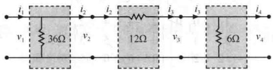
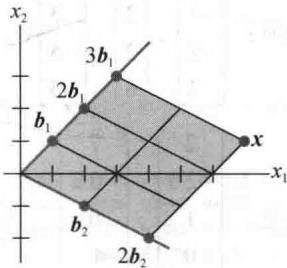

import Knowledge from '@/components/Knowledge.astro';
import Example from '@/components/Example.astro';
import Note from '@/components/Note.astro';
import Solution from '@/components/Solution.astro';
import Block from '@/components/Block.astro';

<Block title="第2章 习题答案">

2.1

1. $\begin{bmatrix} -4 & 0 & 2 \\ -8 & 10 & -4 \end{bmatrix}, \begin{bmatrix} 3 & -5 & 3 \\ -7 & 6 & -7 \end{bmatrix}$ , 没有定义, $\begin{bmatrix} 1 & 13 \\ -7 & -6 \end{bmatrix}$

3. $\begin{bmatrix} -1 & 1 \\ -5 & 5 \end{bmatrix}, \begin{bmatrix} 12 & -3 \\ 15 & -6 \end{bmatrix}$

5. a. $Ab_{1}=\begin{bmatrix}-7\\7\\12\end{bmatrix},\quad Ab_{2}=\begin{bmatrix}4\\-6\\-7\end{bmatrix},\quad AB=\begin{bmatrix}-7&4\\7&-6\\12&-7\end{bmatrix}$

$$

A B = \left[ \begin{array}{l l} - 1 \cdot 3 + 2 (- 2) & - 1 (- 2) + 2 \cdot 7 \\ 5 \cdot 3 + 4 (- 2) & 5 (- 2) + 4 \cdot 1 \\ 2 \cdot 3 - 3 (- 2) & 2 (- 2) - 3 \cdot 1 \end{array} \right] = \left[ \begin{array}{c c} - 7 & 4 \\ 7 & - 6 \\ 1 2 & - 7 \end{array} \right]

$$

7. $3 \times 7$

9. k=5

11. $AD=\begin{bmatrix}2&3&5\\ 2&6&15\\ 2&12&25\end{bmatrix},\quad DA=\begin{bmatrix}2&2&2\\ 3&6&9\\ 5&20&25\end{bmatrix}$

被 D 右乘（即在右边乘）是用 D 相应的对角元素乘以 A 的每一列。被 D 左乘是用 D 相应的对角元素乘以 A 的每一行。“学习指导”告诉你如何使 AB = BA，但你应该在查阅之前先自己试一试。

13. 提示：两个矩阵中的一个是 Q.

15. 在查阅“学习指导”之前回答这个问题.

17. $b_{1}=\begin{bmatrix}7\\ 4\end{bmatrix},\quad b_{2}=\begin{bmatrix}-8\\ -5\end{bmatrix}$

19. $AB$ 的第3列是 $AB$ 前两列之和，以下是原因.记 $B = [b_{1} b_{2} b_{3}]$ ，根据定义， $AB$ 的第3列是 $Ab_{3}$ . 如果 $\pmb{b}_{3} = \pmb{b}_{1} + \pmb{b}_{2}$ ，那么由矩阵向量乘法的性质可知 $AB$ 的第3列是 $Ab_{3} = A(b_{1} + b_{2}) = Ab_{1} + Ab_{2}$ .

21. $A$ 的列是线性相关的. 为什么?

23. 提示：假设 x 满足 Ax=0，并证明 x 必须是 0.

25. 提示：使用习题 23 和 24 的结果，并对乘积 CAD 使用乘法结合律.

27. $\pmb{u}^{\mathrm{T}}\pmb{v} = \pmb{v}\pmb{u}^{\mathrm{T}} = -2a + 3b - 4c$

$$

\boldsymbol {u} \boldsymbol {v} ^ {\mathrm{T}} = \left[ \begin{array}{c c c} - 2 a & - 2 b & - 2 c \\ 3 a & 3 b & 3 c \\ - 4 a & - 4 b & - 4 c \end{array} \right], \boldsymbol {v} \boldsymbol {u} ^ {\mathrm{T}} = \left[ \begin{array}{c c c} - 2 a & 3 a & - 4 a \\ - 2 b & 3 b & - 4 b \\ - 2 c & 3 c & - 4 c \end{array} \right]

$$

29. 提示：对定理 2（b），证明 $A(B+C)$ 中 $(i,j)$ 元素和 $AB+AC$ 中的 $(i,j)$ 元素相等.

31. 提示：利用乘积 $I_{m}A$ 的定义和对 $\mathbb{R}^{m}$ 中的 $\pmb{x}$ 有 $I_{m}\pmb{x} = \pmb{x}$ 的事实.

33. 提示: 首先写出 $(AB)^{\mathrm{T}}$ 的 $(i,j)$ 元素, 它是 AB 的 $(j,i)$ 元素, 然后利用如下事实来计算 $B^{T}A^{T}$ 的 $(i,j)$ 元素: $B^{T}$ 中第 i 行的元素是 $b_{1i},\cdots,b_{ni}$ , 这是因为它们来自 B 的第 i 列; $A^{T}$ 中第 j 列的元素是 $a_{j1},\cdots,a_{jn}$ , 这是因为它们来自 A 的第 j 行.

35. [M]这里的答案依赖于你选取的矩阵程序，对 MATLAB, 利用 help 命令查询 zeros, ones, eye 和 diag.

37. [M] 展示结果，并报告你的结论.

39. 矩阵 $S$ 移动向量 $(a, b, c, d, e)$ 中的元素生成 $(b, c, d, e, o)$ . $S^5$ 是 $5 \times 5$ 零矩阵，从而 $S^6$ 是零矩阵.

2.2

1. $\left[ \begin{array}{ccc}2 & -3\\ -5 / 2 & 4 \end{array} \right]$

3. $-\frac{1}{5}\begin{bmatrix}-5 & -5 \\ 7 & 8\end{bmatrix}$ 或 $\begin{bmatrix}1 & 1 \\ -7/5 & -8/5\end{bmatrix}$

5. $x_{1} = 7, x_{2} = -9$

7. 对 a 和 b，解为 $\begin{bmatrix}-9\\4\end{bmatrix},\begin{bmatrix}11\\-5\end{bmatrix},\begin{bmatrix}6\\-2\end{bmatrix},\begin{bmatrix}13\\-5\end{bmatrix}$ .

9. 在查阅 “学习指导” 之前写出你的答案.

11. 可以类似定理 5 的证明那样完成证明.

13. $AB = AC \Rightarrow A^{-1}AB = A^{-1}AC \Rightarrow IB = IC \Rightarrow B = C$ . 否. 一般地, 如果 $A$ 不可逆, 则 $B$ 和 $C$ 可能不同. 见2.1节习题10.

15. $D = C^{-1}B^{-1}A^{-1}$ ，验证 $D$ 满足要求

17. $A = B C B^{-1}$

19. 当找到 $X = CB - A$ 后，验证 $X$ 是一个解.

21. 提示：考虑方程 Ax=0

23. 提示: 如果 Ax = 0 仅有平凡解, 那么方程 Ax = 0 没有自由变量, 且 A 的每个列是一主元列.

25. 提示：考虑当 $a = b = 0$ 的情形，然后考虑向量 $\left[ \begin{array}{c} -b\\ a \end{array} \right]$ 且利用事实 $ad - bc = 0$

27. 提示：对（a），将 2.1 节例 6 后方框的公式中的 A 和 B 互换位置，然后用单位矩阵代替 B.

对（b）和（c），先将 A 写为 $A=\begin{bmatrix}\operatorname{row}_{1}(A)\\\operatorname{row}_{2}(A)\\\operatorname{row}_{3}(A)\end{bmatrix}$ .

29. $\begin{bmatrix}-7\quad2\\4\quad-1\end{bmatrix}$ 31. $\begin{bmatrix}8\quad3\quad1\\10\quad4\quad1\\7/2\quad3/2\quad1/2\end{bmatrix}$

33. $A^{-1}=B=\begin{bmatrix}1&0&0&\cdots&0\\ -1&1&0&&0\\ 0&-1&1&&\\ \vdots&&\ddots&\vdots\\ 0&0&\cdots&-1&1\end{bmatrix}$ . 提示：对

$j=1,\cdots,n$ ，设 $a_{j},b_{j},e_{j}$ 分别表示A,B,I的第j列，利用 $j=1,\cdots,n-1$ 时有 $a_{j}-a_{j+1}=e_{j}$ 和 $b_{j}=e_{j}-e_{j+1}$ ，并且 $a_{n}=b_{n}=e_{n}$ .

35. $\begin{bmatrix} 3 \\ -6 \\ 4 \end{bmatrix}$ , 通过行化简 $[A e_3]$ 求得.

37. $C = \left[ \begin{array}{ccc}1 & 1 & -1\\ -1 & 1 & 0 \end{array} \right]$

39. 分别是 0.27, 0.30 和 0.23 英寸.

41.[M]分别为12，1.5，21.5和12牛顿.

2.3

为节约答案的篇幅，我们用 IMT 表示可逆矩阵定理（定理 8）.

1. 可逆，由 IMT. 列线性无关，因为矩阵的任一列不是其他列的倍数. 并且, 由 2.2 节定理 4, 行列式不等于零, 因此矩阵是可逆的.

3. 可逆，由 IMT. 矩阵行化简为 $\begin{bmatrix} 5 & 0 & 0 \\ 0 & -7 & 0 \\ 0 & 0 & -1 \end{bmatrix}$ ,

有 3 个主元位置.

5. 不可逆，由 IMT. 矩阵行化简为 $\begin{bmatrix}1 & 0 & 2 \\ 0 & 3 & -5 \\ 0 & 0 & 0\end{bmatrix}$ ,

不行等价于 $I_{3}$ .

7. 可逆，由 IMT. 矩阵行化简为 $\begin{bmatrix}-1 & -3 & 0 & 1 \\ 0 & -4 & 8 & 0 \\ 0 & 0 & 3 & 0 \\ 0 & 0 & 0 & 1\end{bmatrix}$ 且有 4 个主元位置.

9. [M] $4 \times 4$ 矩阵有 4 个主元位置，由 IMT，矩阵可逆.

11. “学习指导”会帮助你，但首先要建立在仔细阅读课本的基础上来尝试回答问题.

13. 一个上三角形方阵是可逆的充分必要条件是所有在对角线上的元素非零。为什么？注意：习题15\~29的答案与IMT有关。在许多时候，部分或全部的答案可以基于用来建立IMT的结论。

15. 如果 $A$ 有两个相同的列, 则它的列是线性相关的. IMT 的命题 (e) 说明 $A$ 不可能是可逆的.

17. 如果 $A$ 是可逆的，由2.2节的定理6， $A^{-1}$ 也是可逆的。运用IMT中的命题（e）于 $A^{-1}$ ，则 $A^{-1}$ 的列是线性无关的。

19. 根据 IMT 的命题 (e), D 是可逆的. 于是由 IMT 的命题 (g), 方程 Dx = b 对所有属于 $R^{7}$ 的 b 有一个解. 你有更多结论吗?

21. 由2.2节定理5或IMT下面的段落，矩阵 $G$ 不可能是可逆的。因此IMT的命题（g）是假的，同样（h）也是假的。 $G$ 的列不能生成 $\mathbb{R}^n$ 。

23. 对 $K$ , IMT 的命题 (b) 是假的, 因此命题 (e) 和 (h) 也是假的. 即 $K$ 的列是线性相关的,从而 K 的列不能生成 $R^{n}$ .

25. 提示：首先利用 IMT.

27. 设 W 是 AB 的逆，则 ABW = I 且 $A(BW) = I$ 。但是，由这个计算本身不能证明 A 是可逆的，为什么不能？在查阅 “学习指导” 之前完成证明。

29. 因为变换 $x \mapsto Ax$ 不是一对一的，故 IMT 的命题 (f) 是假的。命题 (i) 也是假的，变换 $x \mapsto Ax$ 不能将 $\mathbb{R}^n$ 映上到 $\mathbb{R}^n$ ，并且 $A$ 不是可逆的，由此根据定理 9 推出变换 $x \mapsto Ax$ 不是可逆的。

31. 提示：如果对任一 b，方程 Ax=b 有一个解，那么 A 的每一行有一个主元（根据 1.4 节定理 4）。方程 Ax=b 是否有自由变量？

33. 提示：首先证明 T 的标准矩阵是可逆的，然后使用定理证明 $T^{-1}(x) = Bx$ ，其中 $B = \begin{bmatrix} 7 & 9 \\ 4 & 5 \end{bmatrix}$ .

35. 提示：为了证明 $T$ 是一对一的，假设对 $\mathbb{R}^n$ 中的向量 $\pmb{u}$ 和 $\pmb{v}$ ，有 $T(\pmb{u}) = T(\pmb{v})$ ，证明 $\pmb{u} = \pmb{v}$ 。为了证明 $T$ 是映上的，假设 $\pmb{y}$ 表示 $\mathbb{R}^n$ 中的任一向量，利用 $S$ 的逆来产生一个向量 $\pmb{x}$ 使得 $T(\pmb{x}) = \pmb{y}$ 。第二个证明可以使用定理9及1.9节中的一个定理。

37. 提示：考虑 T 和 U 的标准矩阵.

39. 对任意给定的 $v \in R^{n}$ ，对某些 x，可将 v 记为 $v = T(x)$ ，这是因为 T 是一个映上映射。S 和 U 的性质表明 $S(v) = S(T(x)) = x$ ， $U(v) = U(T(x)) = x$ 。因此，对每一个 v， $S(v)$ 和 $U(v)$ 是相等的。即 S 和 U 是 $R^{n}$ 到 $R^{n}$ 上相等的函数。

41. [M] a.（3）的精确解是 $x_{1} = 3.94$ 和 $x_{2} = 0.49$ （4）的精确解是 $x_{1} = 2.90$ 和 $x_{2} = 2.00$ b. 当用（4）的解作为（3）的一个近似解时，近似解 $x_{1}$ 取2.90时误差为 $26\%$ ，近似解 $x_{2}$ 取2.0时误差为 $308\%$

c. 系数矩阵的条件数是 3363. 从（3）和（4）的解改变的百分比大约是 7700 倍方程右端改变的百分比. 这与条件数是同样大小的阶. 条件数大约给出方程 Ax = b 的解随 b 改变的敏感性的粗略度量. 更进一步关于条件数的信息在第 6 章的最后和第 7 章中给出.

43. [M] $\operatorname{cond}(A) \approx 69000$ ，位于 $10^{4}$ 和 $10^{5}$ 之间，所以大约 4 或 5 位数字的精度可能丢失。一些用 MATLAB 的实验可以验证， $x$ 和 $x_{1}$ 有大约 11 或 12 位数字相一致。

45. [M]当要求对一个阶数为 12 或更大的使用浮点数的希尔伯特矩阵求逆时，MATLAB 给出一个警告．乘积 $AA^{-1}$ 的非对角元素会有非零值．如果没有出现这种情况，尝试一个更大的矩阵．

2.4

1. $\left[ \begin{array}{cc}A & B\\ EA + C & EB + D \end{array} \right]$ 3. $\left[ \begin{array}{ll}Y & Z\\ W & X \end{array} \right]$

5. $Y = B^{-1}$ （解释为什么）， $X = -B^{-1}A, Z = C$ .

7. $X = A^{-1}$ （为什么？）， $Y = -BA^{-1}$ ，Z = 0（为什么？）.

9. $X = -A_{21}A_{11}^{-1}, Y = -A_{31}A_{11}^{-1}, B_{22} = A_{22} - A_{21}A_{11}^{-1}A_{12}$

11. 你可查阅“学习指导”中的参考.

13. 提示：假设 A 是可逆的，取 $A^{-1}=\begin{bmatrix}D & E \\ F & G\end{bmatrix}$ ，证明 BD=I 和 CG=I，这说明 B 和 C 可逆。（解释为什么！）相反，若 B 和 C 可逆，为证明 A 可逆，猜测 $A^{-1}$ 是什么并验证。

15. $\left[ \begin{array}{ll}A_{11} & A_{12}\\ A_{21} & A_{22} \end{array} \right] = \left[ \begin{array}{ll}I & 0\\ A_{22}A_{11}^{-1} & I \end{array} \right]\left[ \begin{array}{ll}A_{11} & 0\\ 0 & s \end{array} \right]\left[ \begin{array}{ll}I & A_{11}^{-1}A_{12}\\ 0 & I \end{array} \right]$ $S = A_{22} - A_{21}A_{11}^{-1}A_{12}$

17. $G_{k + 1} = [X_k\pmb {x}_{k + 1}]\left[ \begin{array}{c}X_k^{\mathrm{T}}\\ \pmb {x}_{k + 1}^{\mathrm{T}} \end{array} \right] = X_kX_k^{\mathrm{T}} + x_{k + 1}\pmb {x}_{k + 1}^{\mathrm{T}}$ $= G_{k} + x_{k + 1}\pmb{x}_{k + 1}^{\mathrm{T}}$ 只有外积矩阵 $\pmb {x}_{k + 1}\pmb{x}_{k + 1}^{\mathrm{T}}$ 需要计算（然后加到 $G_{k}$ 上）

19. $W(s) = I_{m} - C(A - sI_{n})^{-1}B$ .这是系统矩阵中 $A - sI_{n}$ 的舒尔补.

21. a. $A^{2}=\begin{bmatrix}1&0\\ 3&-1\end{bmatrix}\begin{bmatrix}1&0\\ 3&-1\end{bmatrix}=\begin{bmatrix}1+0&0+0\\ 3-3&0+(-1)^{2}\end{bmatrix}$ $=\begin{bmatrix}1&0\\ 0&1\end{bmatrix}$

b.

$$

\begin{array}{r l} M ^ {2} & = \left[ \begin{array}{c c} A & 0 \\ I & - A \end{array} \right] \left[ \begin{array}{c c} A & 0 \\ I & - A \end{array} \right] \\ & = \left[ \begin{array}{c c} A ^ {2} + 0 & 0 + 0 \\ A - A & 0 + (- A) ^ {2} \end{array} \right] = \left[ \begin{array}{c c} I & 0 \\ 0 & I \end{array} \right] \end{array}

$$

23. 如果 $A_{1}$ 和 $B_{1}$ 是 $(k+1)\times(k+1)$ 矩阵且为下三角形，那么我们可以写出 $A_{1}=\begin{bmatrix}a&\mathbf{0}^{\mathrm{T}}\\ \mathbf{v}&A\end{bmatrix}$ 和 $B_{1}=\begin{bmatrix}b&\mathbf{0}^{\mathrm{T}}\\ \mathbf{w}&B\end{bmatrix}$ ，其中 A 和 B 是 $k\times k$ 矩阵且为下三角形，v 和 w 属于 $R^{k}$ ，且 a 和 b 是适合的数。若任意 $k\times k$ 下三角形矩阵的乘积是下三角形矩阵，然后计算乘积 $A_{1}B_{1}$ ，你能得出什么结论？

25. 利用习题 5 求形如 $B=\begin{bmatrix} B_{11} & 0 \\ 0 & B_{22} \end{bmatrix}$ 的矩阵的逆，其中 $B_{11}$ 是 $p \times p$ ， $B_{22}$ 是 $q \times q$ ，B 可逆。将矩阵 A 分块，用两遍你的结果求得

$$

A ^ {- 1} = \left[ \begin{array}{c c c c c} - 5 & 2 & 0 & 0 & 0 \\ 3 & - 1 & 0 & 0 & 0 \\ 0 & 0 & 1 / 2 & 0 & 0 \\ 0 & 0 & 0 & 3 & - 4 \\ 0 & 0 & 0 & - 5 / 2 & 7 / 2 \end{array} \right].

$$

27. a, b. [M]习题中要使用的命令依赖于所使用的矩阵程序.

c. 从分块矩阵方程 $\begin{bmatrix}A_{11}&0\\A_{21}&A_{22}\end{bmatrix}\begin{bmatrix}x_{1}\\x_{2}\end{bmatrix}=\begin{bmatrix}b_{1}\\b_{2}\end{bmatrix}$ （其中 $x_{1},\quad b_{1}$ 属于 $R^{20},\quad x_{2},\quad b_{2}$ 属于 $R^{30}$ ）可以得到 $A_{11}x_{1}=b_{1}$ ，从而可以求出 $x_{1}$ ．从方程 $A_{21}x_{1}+A_{22}x_{2}=b_{2}$ 得到 $A_{22}x_{2}=b_{2}-A_{21}x_{1}$ ，再通过行化简矩阵 $[A_{22}\quad c]$ 求出 $x_{2}$ ，其中 $c=b_{2}-A_{21}x_{1}$ .

2.5

1. $Ly = b \Rightarrow y = \begin{bmatrix} -7 \\ -2 \\ 6 \end{bmatrix}, Ux = y \Rightarrow x = \begin{bmatrix} 3 \\ 4 \\ -6 \end{bmatrix}$

$$

\boldsymbol {y} = \left[ \begin{array}{l} 1 \\ 3 \\ 3 \end{array} \right], \boldsymbol {x} = \left[ \begin{array}{c} - 1 \\ 3 \\ 3 \end{array} \right] 5

$$

$$

\mathbf {y} = \left[ \begin{array}{c} 1 \\ 5 \\ 1 \\ - 3 \end{array} \right], \mathbf {x} = \left[ \begin{array}{c} - 2 \\ - 1 \\ 2 \\ - 3 \end{array} \right]

$$

7.

$$

L U = \left[ \begin{array}{c c} 1 & 0 \\ - 3 / 2 & 1 \end{array} \right] \left[ \begin{array}{c c} 2 & 5 \\ 0 & 7 / 2 \end{array} \right]

$$

9.

$$

\left[ \begin{array}{r r r} 1 & 0 & 0 \\ - 1 & 1 & 0 \\ 3 & 2 / 3 & 1 \end{array} \right] \left[ \begin{array}{r r r} 3 & - 1 & 2 \\ 0 & - 3 & 1 2 \\ 0 & 0 & - 8 \end{array} \right]

$$

11.

$$

\left[ \begin{array}{c c c} 1 & 0 & 0 \\ 2 & 1 & 0 \\ - 1 / 3 & 1 & 1 \end{array} \right] \left[ \begin{array}{c c c} 3 & - 6 & 3 \\ 0 & 5 & - 4 \\ 0 & 0 & 5 \end{array} \right]

$$

13.

$$

\left[ \begin{array}{c c c c} 1 & 0 & 0 & 0 \\ - 1 & 1 & 0 & 0 \\ 4 & 5 & 1 & 0 \\ - 2 & - 1 & 0 & 1 \end{array} \right] \left[ \begin{array}{c c c c} 1 & 3 & - 5 & - 3 \\ 0 & - 2 & 3 & 1 \\ 0 & 0 & 0 & 0 \\ 0 & 0 & 0 & 0 \end{array} \right]

$$

15.

$$

\left[ \begin{array}{c c c} 1 & 0 & 0 \\ 3 & 1 & 0 \\ - 1 / 2 & - 2 & 1 \end{array} \right] \left[ \begin{array}{c c c c} 2 & - 4 & 4 & - 2 \\ 0 & 3 & - 5 & 3 \\ 0 & 0 & 0 & 5 \end{array} \right]

$$

17.

$$

U ^ {- 1} = \left[ \begin{array}{c c c} 1 / 4 & 3 / 8 & 1 / 4 \\ 0 & - 1 / 2 & 1 / 2 \\ 0 & 0 & 1 / 2 \end{array} \right],

$$

$$

L ^ {- 1} = \left[ \begin{array}{c c c} 1 & 0 & 0 \\ 1 & 1 & 0 \\ - 2 & 0 & 1 \end{array} \right],

$$

$$

A ^ {- 1} = \left[ \begin{array}{c c c} 1 / 8 & 3 / 8 & 1 / 4 \\ - 3 / 2 & - 1 / 2 & 1 / 2 \\ - 1 & 0 & 1 / 2 \end{array} \right]

$$

19. 提示：考虑行化简 [A I].

21. 提示：将行变换表示为一系列初等矩阵.

23. a. 将 D 的行表示为列向量的转置. 那么从分块矩阵的乘法得到

$$

A = C D = \left[ \begin{array}{l l l} \boldsymbol {c} _ {1} & \dots & \boldsymbol {c} _ {4} \end{array} \right] \left[ \begin{array}{c} \boldsymbol {v} _ {1} ^ {\mathrm{T}} \\ \vdots \\ \boldsymbol {v} _ {4} ^ {\mathrm{T}} \end{array} \right] = \boldsymbol {c} _ {1} \boldsymbol {v} _ {1} ^ {\mathrm{T}} + \dots + \boldsymbol {c} _ {4} \boldsymbol {v} _ {4} ^ {\mathrm{T}}

$$

b. A 有 40 000 个元素，由于 C 有 1600 个元素且 D 有 400 个元素，故两者合在一起只占存储 A 所需的 5%.

25. 解释为什么 U, D 和 $V^{T}$ 是可逆的，然后对可逆矩阵的乘积的逆运用一个定理.

27. a.

$$

\begin{array}{c c c} i _ {1} & \text {   } & i _ {2} \\ v _ {1} & 1 / 2 \Omega & v _ {2} \\ \hline \end{array} \quad \begin{array}{c c c} i _ {2} & \text {   } & i _ {3} \\ v _ {2} & \text {   } & v _ {3} \\ \hline \end{array}

$$

b.

$$

\begin{array}{c c c} i _ {1} & i _ {2} & i _ {3} \\ v _ {1} & 6 \Omega & 3 / 4 \Omega \\ \hline \end{array}

$$

29. a. $\left[\begin{array}{ccc}1+R_{2}/R_{1}& & -R_{2}\\ -1/R_{1}-R_{2}/(R_{1}R_{3})-1/R_{3}& 1+R_{2}/R_{3}\end{array}\right]$

$$

A = \left[ \begin{array}{c c} 1 & 0 \\ - 1 / 6 & 1 \end{array} \right] = \left[ \begin{array}{c c} 1 & - 1 2 \\ 0 & 1 \end{array} \right] \left[ \begin{array}{c c} 1 & 0 \\ - 1 / 3 6 & 1 \end{array} \right]

$$

31. [M]

a.

$$

\begin{array}{r l} L & = \left[ \begin{array}{c c c c c c c c c} 1 & 0 & 0 & 0 & 0 & 0 & 0 & 0 & 0 \\ - 0. 2 5 & 1 & 0 & 0 & 0 & 0 & 0 & 0 & 0 \\ - 0. 2 5 & - 0. 0 6 6 7 & 1 & 0 & 0 & 0 & 0 & 0 & 0 \\ 0 & - 0. 2 6 6 7 & - 0. 2 8 5 7 & 1 & 0 & 0 & 0 & 0 & 0 \\ 0 & 0 & - 0. 2 6 7 9 & - 0. 0 8 3 3 & 1 & 0 & 0 & 0 \\ 0 & 0 & 0 & - 0. 2 9 1 7 & - 0. 2 9 2 1 & 1 & 0 & 0 \\ 0 & 0 & 0 & 0 & - 0. 2 6 9 7 & - 0. 0 8 6 1 & 1 & 0 \\ 0 & 0 & 0 & 0 & 0 & - 0. 2 9 4 8 & - 0. 2 9 3 1 & 1 \end{array} \right] \\ U & = \left[ \begin{array}{c c c c c c c c c} 4 & - 1 & - 1 & 0 & 0 & 0 & 0 & 0 \\ 0 & 3. 7 5 & - 0. 2 5 & - 1 & 0 & 0 & 0 & 0 \\ 0 & 0 & 3. 7 3 3 3 & - 1. 0 6 6 7 & - 1 & 0 & 0 & 0 \\ 0 & 0 & 0 & \text {3.4286} & - \text {3.7083} & - \text {3.3919} & - \text {3.7052} & - \text {3.3868} \\ \text {3.783} ^ {\prime} \text {3.783} ^ {\prime} \text {3.783} ^ {\prime} \text {3.783} ^ {\prime} \text {3.783} ^ {\prime} \text {3.783} ^ {\prime} \text {3.783} ^ {\prime} \text {3.783} ^ {\prime} \text {3.783}, \end{array} \right] \end{array}

$$

b.

C.

$$

A ^ {- 1} = \left[ \begin{array}{l l l l l l l l} 0. 2 9 5 3 & 0. 0 8 6 6 & 0. 0 9 4 5 & 0. 0 5 0 9 & 0. 0 3 1 8 & 0. 0 2 2 7 & 0. 0 1 0 0 & 0. 0 0 8 2 \\ 0. 0 8 6 6 & 0. 2 9 5 3 & 0. 0 5 0 9 & 0. 0 9 4 5 & 0. 0 2 2 7 & 0. 0 3 1 8 & 0. 0 0 8 2 & 0. 0 1 0 0 \\ 0. 0 9 4 5 & 0. 0 5 0 9 & 0. 3 2 7 1 & 0. 1 0 9 3 & 0. 1 0 4 5 & 0. 0 5 9 1 & 0. 0 3 1 8 & 0. 0 2 2 7 \\ 0. 0 5 0 9 & 0. 0 9 4 5 & 0. 1 0 9 3 & 0. 3 2 7 1 & 0. 0 5 9 1 & 0. 1 0 4 5 & 0. 0 2 2 7 & \text {   } _ { \text {   }} \text {   } _ { \text {   }} \\ \text {   } _ { \text {   }} \text {   } _ { \text {   }} \text {   } _ { \text {   }} \text {   } _ { \text {   }} \text {   } _ { \text {   }} \text {   } _ { \text {   }} \text {   } _ { \text {   }} \text {   } _ { \text {   }} \text {   } _ { \text {   }} \text {    } _ { \text {   }} \\ \text {   } _ { \text {   }} \text {   } _ { \text {   }} \text {   } _ { \text {   }} \text {   } _ { \text {   }} \text {   } _ { \text {   }} \text {   } _ { \text {   }} \text {   } _ { \text {   }} \text {   } _ {\text {   }} \text {   } _ {\text {   }} \text {   } _ {\text {   }} \text {   } _ {\text {   }} \end{array} \right]

$$

可直接得到 $A^{-1}$ ，然后计算 $A^{-1}-U^{-1}L^{-1}$ 来比较两种计算矩阵逆的方法.

2.6

1. $C=\begin{bmatrix}0.10&0.60&0.60\\ 0.30&0.20&0\\ 0.30&0.10&0.10\end{bmatrix},\left\{\text{中间需求}\right\}=\begin{bmatrix}60\\ 20\\ 10\end{bmatrix}$

3. $x=\begin{bmatrix}40\\ 15\\ 15\end{bmatrix}$

5. $x=\begin{bmatrix}110\\ 120\end{bmatrix}$

7. a. $\begin{bmatrix}1.6\\ 1.2\end{bmatrix}$ b. $\begin{bmatrix}111.6\\ 121.2\end{bmatrix}$

9. $x=\begin{bmatrix}82.8\\131.0\\110.3\end{bmatrix}$

11. 提示：利用转置的性质得到 $p^{T}=p^{T}C+v^{T}$ ，从而 $\boldsymbol{p}^{T}\boldsymbol{x}=(\boldsymbol{p}^{T}C+\boldsymbol{v}^{T})\boldsymbol{x}=\boldsymbol{p}^{T}C\boldsymbol{x}+\boldsymbol{v}^{T}\boldsymbol{x}$ 。现在用乘积方程计算 $p^{T}x$ 。

13. [M] $x = (99576, 97703, 51231, 131570, 49488, 329554, 13835)$ . 答案 $x$ 中的元素比在 $d$ 中只精确到接近千位的元素更准确，所以，更实际的 $x$ 的答案是 $x = 1000 \times (100, 98, 51, 132, 49, 330, 14)$ .

15. [M] $x^{(12)}$ 是其元素精确到接近千位的第一个向量。 $x^{(12)}$ 的计算需要 1260 次浮算，而 $[(I-C)d]$ 的行化简仅需要 550 次浮算。如果 C 是大于 $20\times20$ ，那么用迭代计算 $x^{(12)}$ 比用行化简计算平衡向量 x 需要更少的浮算。随着 C 的阶数的增加，迭代方法的优势会更加明显。而且，在经济学的较大模型中 C 变得更稀疏，较少的迭代就能得到所需要的精度。

2.7

1.

$$

\left[ \begin{array}{c c c} 1 & 0. 2 5 & 0 \\ 0 & 1 & 0 \\ 0 & 0 & 1 \end{array} \right] \quad 3. \left[ \begin{array}{c c c} \sqrt {2} / 2 & - \sqrt {2} / 2 & \sqrt {2} \\ \sqrt {2} / 2 & \sqrt {2} / 2 & 2 \sqrt {2} \\ 0 & 0 & 1 \end{array} \right]

$$

$$

\left[ \begin{array}{c c c} \sqrt {3} / 2 & 1 / 2 & 0 \\ 1 / 2 & - \sqrt {3} / 2 & 0 \\ 0 & 0 & 1 \end{array} \right]

$$

5.

7.

$$

\left[ \begin{array}{c c c} 1 / 2 & - \sqrt {3} / 2 & 3 + 4 \sqrt {3} \\ \sqrt {3} / 2 & 1 / 2 & 4 - 3 \sqrt {3} \\ 0 & 0 & 1 \end{array} \right]

$$

见练习题.

9. $A(BD)$ 需要800次乘法， $(AB)D$ 需要408次乘法，第一种方法乘法次数大约是第二种方法的2倍。如果 $D$ 有20000列，那么两种计算次数分别为160000和80008次。

11. 利用以下事实：

$$

\sec \varphi - \tan \varphi \sin \varphi = \frac {1}{\cos \varphi} - \frac {\sin^ {2} \varphi}{\cos \varphi} = \cos \varphi

$$

13. $\begin{bmatrix} A & p \\ \mathbf{0}^{\mathrm{T}} & 1 \end{bmatrix} = \begin{bmatrix} I & p \\ \mathbf{0}^{\mathrm{T}} & 1 \end{bmatrix} \begin{bmatrix} A & \mathbf{0} \\ \mathbf{0}^{\mathrm{T}} & 1 \end{bmatrix}$ ，首先施加线性变换 $A$ ，然后对之平移 $\pmb{p}$ 。

15. (12,-6,-3)

17.

$$

\left[ \begin{array}{c c c c} 1 & 0 & 0 & 0 \\ 0 & 1 / 2 & - \sqrt {3} / 2 & 0 \\ 0 & \sqrt {3} / 2 & 1 / 2 & 0 \\ 0 & 0 & 0 & 1 \end{array} \right]

$$

19. 三角形顶点在（7,2,0），（7.5,5,0），（5,5,0）.

$$

2 1. [ \mathrm{M} ] \left[ \begin{array}{c c c} 2. 2 5 8 6 & - 1. 0 3 9 5 & - 0. 3 4 7 3 \\ - 1. 3 4 9 5 & 2. 3 4 4 1 & 0. 0 6 9 6 \\ 0. 0 9 1 0 & - 0. 3 0 4 6 & 1. 2 7 7 7 \end{array} \right] \left[ \begin{array}{l} X \\ Y \\ Z \end{array} \right] = \left[ \begin{array}{l} R \\ G \\ B \end{array} \right]

$$

2.8

1. 集合对加法封闭，但对一个负数的标量乘法不封闭。（给出一个简单例子。）

3. 集合对加法及数乘不封闭. 直线 $x_{2} = x_{1}$ 上的点构成一个子集, 因此, 任意的一个“反例”必定至少使用一个不在直线上的点.

5. 否. 对应于 $[\pmb{v}_1, \pmb{v}_2, \pmb{w}]$ 的方程组不相容.

7. a. 3个向量 $\nu_{1}, \nu_{2}, \nu_{3}$ .  

b. 无穷多向量.  

c. 是，因为方程 $Ax = p$ 有一个解.

9. 否，因为 $Ap \neq 0$ .

11. $p = 4, q = 3$ . Nul $A$ 是 $\mathbb{R}^4$ 的一个子空间，这是因为 $Ax = 0$ 的解必然有四个元素，以便与 $A$ 的列相匹配。Col $A$ 是 $\mathbb{R}^3$ 的一个子空间，因为每个列向量有三个元素。

13. 对 Nul A，例如，选 $(1,-2,1,0)$ 或 $(-1,4,0,1)$ .

对 Col A，选 A 的任意一列.

15. 是. 设 $A$ 是用所给向量作为列的矩阵, 由于行列式不等于零, 因此 $A$ 是可逆的, 根据 IMT (或例 5), 其列构成 $\mathbb{R}^2$ 的一组基. (也可给出 $A$ 可逆的其他理由.)

17. 是，设 $A$ 是列为给定向量的矩阵， $A$ 的行变换表明有3个主元。所以 $A$ 是可逆的。根据IMT， $A$ 的列构成 $\mathbb{R}^3$ 的一个基。

19. 否. 设 $A$ 是 $3 \times 2$ 矩阵, 它的列是给定的向量. $A$ 的列不能生成 $\mathbb{R}^3$ , 因为 $A$ 中不是每一行都有一个主元, 所以列不能构成 $\mathbb{R}^3$ 的一个基. (它们是 $\mathbb{R}^3$ 中的平面的一个基.)

21. 仔细阅读这一节，然后在查阅“学习指导”之前写出你的答案。这一节的内容和关键概念你必须现在学习，然后才能继续学习下面的内容。

23. Col A 的基: $\begin{bmatrix}4\\ 6\\ 3\end{bmatrix},\begin{bmatrix}5\\ 5\\ 4\end{bmatrix}$ ; NuI A 的基: $\begin{bmatrix}4\\ -5\\ 1\\ 0\end{bmatrix},\begin{bmatrix}-7\\ 6\\ 0\\ 1\end{bmatrix}$

25. Col A 的基: $\begin{bmatrix}1\\ -1\\ -2\\ 3\end{bmatrix},\begin{bmatrix}4\\ 2\\ 2\\ 6\end{bmatrix},\begin{bmatrix}-3\\ 3\\ 5\\ -5\end{bmatrix}$ ;

Nul A 的基: $\begin{bmatrix}2\\ -2.5\\ 1\\ 0\\ 0\end{bmatrix},\begin{bmatrix}7\\ 0.5\\ 0\\ -4\\ 1\end{bmatrix}$

27. 构造一个非零的 $3 \times 3$ 矩阵 A，用 A 的列的任意方便的线性组合作为 b.

29. 提示：你需要一个非零的矩阵，其列是线性相关的.

31. 如果 $\operatorname{Col} F \neq \mathbb{R}^5$ ，则 $F$ 的列不能生成 $\mathbb{R}^5$ 。由于 $F$ 是方阵，因此 IMT 说明 $F$ 是不可逆的，且方程 $Fx = 0$ 有非平凡解，即 $\operatorname{Nul} F$ 包含非零向量。另外的描述方式是 $\operatorname{Nul} F \neq \{\mathbf{0}\}$ 。

33. 如果 $\operatorname{Col} Q = \mathbb{R}^4$ , 则 $Q$ 的列生成 $\mathbb{R}^4$ . 由于 $Q$ 是方阵, 故 IMT 说明 $Q$ 是可逆的, 且方程 $Qx = b$ 对 $\mathbb{R}^4$ 中的每个 $b$ 都有一个解, 而且由 2.2 节定理 5, 每个解是唯一的.

35. 如果 $B$ 的列是线性无关的，则方程 $Bx = 0$ 只有平凡解（零解），即 $\operatorname{Nul} B = \{\mathbf{0}\}$ .

37. [M]写出 $A$ 的简化阶梯形，将 $A$ 的主元列作为 $\operatorname{Col} A$ 的一个基。对于 $\operatorname{Nul} A$ ，写出 $Ax = 0$ 的解的参数向量形式。

Col A 的基: $\begin{bmatrix}3\\ -7\\ -5\\ 3\end{bmatrix},\begin{bmatrix}-5\\ 9\\ 7\\ -7\end{bmatrix}$ ;

Nul A 的基: $\begin{bmatrix}-2.5\\-1.5\\1\\0\\0\end{bmatrix},\begin{bmatrix}4.5\\2.5\\0\\1\\0\end{bmatrix},\begin{bmatrix}-3.5\\-1.5\\0\\0\\1\end{bmatrix}$

2.9

1. $x = 3b_{1} + 2b_{2} = 3\begin{bmatrix} 1 \\ 1 \end{bmatrix} + 2\begin{bmatrix} 2 \\ -1 \end{bmatrix} = \begin{bmatrix} 7 \\ 1 \end{bmatrix}$

3. $\begin{bmatrix} 7 \\ 5 \end{bmatrix}$ 5. $\begin{bmatrix} 1 / 4 \\ -5 / 4 \end{bmatrix}$

7. $[w]_B = \begin{bmatrix} 2 \\ -1 \end{bmatrix}$ , $[x]_B = \begin{bmatrix} 1.5 \\ 0.5 \end{bmatrix}$

9. Col A 的基: $\begin{bmatrix}1\\ -3\\ 2\\ -4\end{bmatrix},\begin{bmatrix}2\\ -1\\ 4\\ 2\end{bmatrix},\begin{bmatrix}-4\\ 5\\ -3\\ 7\end{bmatrix};\dim\operatorname{Col}A=3$ Nul A 的基: $\begin{bmatrix}3\\ 1\\ 0\\ 0\end{bmatrix};\dim\operatorname{Nul}A=1$ 11. Col A 的基: $\begin{bmatrix}1\\ 2\\ -3\\ 3\end{bmatrix},\begin{bmatrix}2\\ 5\\ -9\\ 10\end{bmatrix},\begin{bmatrix}0\\ 4\\ -7\\ 11\end{bmatrix};\dim\operatorname{Col}A=3$ Nul A 的基: $\begin{bmatrix}9\\ -2\\ 1\\ 0\\ 0\end{bmatrix},\begin{bmatrix}-5\\ 3\\ 0\\ -2\\ 1\end{bmatrix};\dim\operatorname{Nul}A=2$

13. 初始矩阵的第 1, 3 和 4 列构成子空间 $H$ 的一个基，因此 $\dim H = 3$ .

15. $\operatorname{Col} A = \mathbb{R}^3$ ，因为 $A$ 的每一行有一个主元，从而 $A$ 的列生成 $\mathbb{R}^3$ 。Nul $A$ 不等于 $\mathbb{R}^2$ ，因为 Nul $A$ 是 $\mathbb{R}^5$ 的子空间。但 Nul $A$ 是二维的，理由：方程 $Ax = 0$ 有两个自由变量，因为 $A$ 有 5 列，其中只有 3 列是主元列。

17. 在给出你的理由后再查看“学习指导”.

19. Ax=0 的解空间有一组三个向量组成的基，意味着 dim Nul A=3。因为 $5 \times 7$ 矩阵 A 有 7 列，秩定理说明 rank A=7-dim Nul A=4。见“学习指导”中不用秩定理的论证。

21. 一个 $7 \times 6$ 矩阵有6列，根据秩定理， $\dim \operatorname{Nul} A = 6 - \operatorname{rank} A$ 。因为其秩是4，故 $\dim \operatorname{Nul} A = 2$ ，即 $Ax = 0$ 的解空间的维数是2。

23. 一个 $3 \times 4$ 矩阵 $A$ 有一个二维列空间，且具有两个主元列。剩下的两列对应于方程 $Ax = 0$ 中的自由变量。因此，期望的构造是可能的。对两个主元列，有6个可能的位置，其中一个是$\begin{bmatrix} \blacksquare & * & * & * \\ 0 & \blacksquare & * & * \\ 0 & 0 & 0 & 0 \end{bmatrix}$ . 一个简单的构造方法是在 $R^{3}$ 中取两个非线性相关的向量，把它们连同每个向量的拷贝一起以任意的顺序放在矩阵中. 所得矩阵显然有一个二维列空间. 不需要考虑Nul A 的维数是否正确，因为由秩定理可得到保证：dim Nul A=4-rank A.

25. 由定义， $A$ 的 $p$ 列生成 $\operatorname{Col} A$ 。如果 $\dim \operatorname{Col} A = p$ ，则根据基定理， $p$ 列的生成集自然成为 $\operatorname{Col} A$ 的一组基，特别地，这些列是线性无关的。

27. a. 提示：B 的列生成 W，每个向量 $a_{j}$ 属于 W.

向量 $c_{j}$ 属于 $R^{p}$ 是因为 B 有 p 列.

b. 提示：C 的维数是多少？

c. 提示：B 和 C 与 A 关系如何？

29. [M]你的计算应该说明 $[\pmb{v}_1\pmb{v}_2\pmb{x}]$ 对应于一个相容的方程组. $\pmb{x}$ 的 $\mathcal{B}$ -坐标向量是 $(-5/3,8/3)$ .

</Block>

<Block title="第2章补充习题 答案">

1. a. T b. F c. T d. F

e. F f. F g. T h. T

i. T j. F k. T l. F

m. F n. T o. F p. T

3. I

5. $A^{2}=2A-I$ ，乘以 A 得到： $A^{3}=2A^{2}-A$ .

将 $A^{2}=2A-I$ 代入： $A^{3}=2(2A-I)-A=3A-2I$ 再乘以 A: $A^{4}=A(3A-2I)=3A^{2}-2A$ .

再将 $A^{2}=2A-I$ 代入一次： $A^{4}=3(2A-I)-2A=4A-3I$ 7. $\begin{bmatrix}10 & -1 \\ 9 & 10 \\ -5 & -3\end{bmatrix}$ 9. $\begin{bmatrix}-3 & 13 \\ -8 & 27\end{bmatrix}$ 11. a. $p(x_{i})=c_{0}+c_{1}x_{i}+\cdots+c_{n-1}x_{i}^{n-1}$

$$

= \operatorname{row} _ {i} (V) \cdot \left[ \begin{array}{c} c _ {0} \\ \vdots \\ c _ {n - 1} \end{array} \right] = \operatorname{row} _ {i} (V c) = y _ {i}

$$

b. 假若 $x_{1}, \cdots, x_{n}$ 是不同的，并设对某向量 c 有 Vc = 0，那么 c 中的元素是一个在 $x_{1}, \cdots, x_{n}$ 处值为零的多项式的系数。但是，一个 n - 1 次非零多项式不可能有 n 个零点，因此这个多项式必然恒等于零，也就是 c 中的元素必须都是零，这表明 V 中的列是线性无关的。

c. 提示：当 $x_{1}, \cdots, x_{n}$ 不同时，存在一个向量 c 使得 Vc = y．为什么？

13. a. $P^{2}=(\boldsymbol{u}\boldsymbol{u}^{\mathrm{T}})(\boldsymbol{u}\boldsymbol{u}^{\mathrm{T}})=\boldsymbol{u}(\boldsymbol{u}^{\mathrm{T}}\boldsymbol{u})\boldsymbol{u}^{\mathrm{T}}=\boldsymbol{u}(1)\boldsymbol{u}^{\mathrm{T}}=P$ b. $P^{T}=(\boldsymbol{u}\boldsymbol{u}^{\mathrm{T}})^{\mathrm{T}}=\boldsymbol{u}^{\mathrm{T T}}\boldsymbol{u}^{\mathrm{T}}=\boldsymbol{u}\boldsymbol{u}^{\mathrm{T}}=P$ c. $Q^{2}=(I-2P)(I-2P)$ $=I-I(2P)-2PI+2P(2P)$ $=I-4P+4P^{2}=I$ 因为（a）

15. 用初等矩阵左乘产生一个初等行变换： $B \sim E_{1}B \sim E_{2}E_{1}B \sim E_{3}E_{2}E_{1}B = C$ ，所以 B 行等价于 C。因为行变换是可逆的，所以 C 行等价于 B（换言之，利用 $E_{i}$ 的逆作行变换可证明 C 被变为 B。）

17. 由于 B 是 $4 \times 6$ （列数多于行数），故它的 6 列线性相关，且有非零 x 使得 Bx = 0。于是 ABx = A0 = 0，由可逆矩阵定理，说明矩阵 AB 是不可逆的。

19. [M]对4位小数，当 $k$ 增加时， $A^k \to \begin{bmatrix} 0.2857 & 0.2857 & 0.2857 \\ 0.4286 & 0.4286 & 0.4286 \\ 0.2857 & 0.2857 & 0.2857 \end{bmatrix}$ $B^k \to \begin{bmatrix} 0.2022 & 0.2022 & 0.2022 \\ 0.3708 & 0.3708 & 0.3708 \\ 0.4270 & 0.4270 & 0.4270 \end{bmatrix}$

或用有理数形式：

$$

A ^ {k} \rightarrow \left[\begin{array}{l l l}2 / 7&2 / 7&2 / 7\\3 / 7&3 / 7&3 / 7\\2 / 7&2 / 7&2 / 7\end{array}\right]

$$

$$

B ^ {k} \rightarrow \left[\begin{array}{l l l}1 8 / 8 9&1 8 / 8 9&1 8 / 8 9\\3 3 / 8 9&3 3 / 8 9&3 3 / 8 9\\3 8 / 8 9&3 8 / 8 9&3 8 / 8 9\end{array}\right]

$$

</Block>
