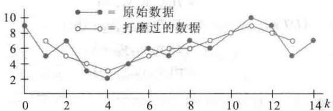

import Guide from '@/components/Guide.astro';
import Knowledge from '@/components/Knowledge.astro';
import Example from '@/components/Example.astro';
import Analysis from '@/components/Analysis.astro';
import Solution from '@/components/Solution.astro';
import Variant from '@/components/Variant.astro';
import Note from '@/components/Note.astro';
import Block from '@/components/Block.astro';
import Method from '@/components/Method.astro';
import Exercise from '@/components/Exercise.astro';

<Block title="第4章 习题答案">
4.1

1. a. $u + v$ 在 V 中，因为它的元素都是非负的.

b. 例子: 如果 $u=\begin{bmatrix}2\\ 2\end{bmatrix}$ 和 c=-1，那么 u 在 V 中，
但cu不在V中.

3. 例子：如果 $\pmb{u} = \begin{bmatrix} 0.5 \\ 0.5 \end{bmatrix}$ 和 $c = 4$ ，那么 $\pmb{u}$ 在 $H$ 中，但 $cu$ 不在 $H$ 中.

5. 是，由定理 1，因为集合是 Span $\{t^{2}\}$

7. 否，该集合对不是整数的标量乘法不封闭.

9. $H = \operatorname{Span}\{\pmb{v}\}$ ，其中 $\pmb {v} = \begin{bmatrix} 1\\ 3\\ 2 \end{bmatrix}$ .由定理1， $H$ 是 $\mathbb{R}^3$ 的一个子空间.

11. $W = \operatorname{Span}\{\pmb {u},\pmb {v}\}$ ，其中 $\pmb {u} = \left[ \begin{array}{l}5\\ 1\\ 0 \end{array} \right],\pmb {v} = \left[ \begin{array}{l}2\\ 0\\ 1 \end{array} \right]$ ，由定理1， $W$ 是 $\mathbb{R}^3$ 的一个子空间.

13. a. $\{\pmb{v}_1, \pmb{v}_2, \pmb{v}_3\}$ 中仅包含三个向量，且 $\pmb{w}$ 不在其中.
b. 在 $\operatorname{Span}\{\pmb{v}_1, \pmb{v}_2, \pmb{v}_3\}$ 中有无穷多向量.
c. $\pmb{w}$ 在 $\operatorname{Span}\{\pmb{v}_1, \pmb{v}_2, \pmb{v}_3\}$ 中.

15. $W$ 不是向量空间，因为零向量不在 $W$ 中.

$$
S = \left\{\left[ \begin{array}{c} 1 \\ 0 \\ - 1 \\ 0 \end{array} \right], \left[ \begin{array}{c} - 1 \\ 1 \\ 0 \\ 1 \end{array} \right], \left[ \begin{array}{c} 0 \\ - 1 \\ 1 \\ 0 \end{array} \right] \right\}
$$

19. 提示：利用定理 1.

注意 尽管“学习指导”仅对这里含“提示”的习题有完整解答,但你必须自己真正去求这些问题的解. 否则,你不能从习题中受益.

21. 是. 对一个子空间的条件是明显满足的: 零矩阵在 H 中, 两个上三角形矩阵的和是上三角形矩阵, 且任何一个上三角形矩阵的标量乘法仍然是上三角形矩阵.

23. 写出答案后，参考“学习指导”

25.4 27.a.8 b.3 c.5 d.4

29. $u + (-1)u = 1u + (-1)u$ 公理 10 $=[1+(-1)]u$ 公理 8 $=0u=0$ 习题 27从习题26，得出 $(-1)\pmb {u} = -\pmb{u}$

31. 任何包含 u 和 v 的子空间 H 也必包含 u 和 v 的所有标量乘法，因而包含 u 和 v 所有标量乘法之和，于是 H 必包含 Span\{u,v\}.

33. 提示：对部分解，考虑 $H+K$ 中的 $w_{1}$ 和 $w_{2}$ ，并把 $w_{1}$ 和 $w_{2}$ 分别写成 $w_{1}=u_{1}+v_{1}$ 和 $w_{2}=u_{2}+v_{2}$ 的形式，其中 $u_{1}$ 和 $u_{2}$ 属于 H，而 $v_{1}$ 和 $v_{2}$ 属于 K.

35. [M] $\left[\nu_{1}, \nu_{2}, \nu_{3}, w\right]$ 的简化阶梯形表明 $w = \nu_{1} - 2\nu_{2} + \nu_{3}$ .

37. [M]函数是 $\cos 4t$ 和 $\cos 6t$ ，见4.5节习题34.

4.2
1. $\begin{bmatrix}3&-5&-3\\ 6&-2&0\\ -8&4&1\end{bmatrix}\begin{bmatrix}1\\ 3\\ -4\end{bmatrix}=\begin{bmatrix}0\\ 0\\ 0\end{bmatrix}$ ，所以 w 在 Nul A 中.
3. $\begin{bmatrix}7\\ -4\\ 1\\ 0\end{bmatrix},\begin{bmatrix}-6\\ 2\\ 0\\ 1\end{bmatrix}$ 5. $\begin{bmatrix}2\\ 1\\ 0\\ 0\\ 0\end{bmatrix},\begin{bmatrix}-4\\ 0\\ 9\\ 1\\ 0\end{bmatrix}$

7. $W$ 不是 $\mathbb{R}^3$ 的一个子空间，因为零向量(0,0,0)不属于 $W$ ：

9. $W$ 是 $\mathbb{R}^4$ 的一个子空间，因为 $W$ 是下列方程组的解集：

$$
\begin{array}{r l} {a - 2 b - 4 c} & {= 0} \\ {2 a} & {- c - 3 d = 0} \end{array}
$$

11. $W$ 不是子空间，因为 $\mathbf{0}$ 不在 $W$ 中．验证：如果一个元素 $(b - 2d,5 + d,b + 3d,d)$ 是零，那么 $5 + d = 0$ 和 $d = 0$ ，这是不可能的.

13. $W = \operatorname{Col} A$ ，其中 $A = \begin{bmatrix} 1 & -6 \\ 0 & 1 \\ 1 & 0 \end{bmatrix}$ ，所以由定理3， $W$ 是一个向量空间.  
15. $\begin{bmatrix} 0 & 2 & 3 \\ 1 & 1 & -2 \\ 4 & 1 & 0 \\ 3 & -1 & -1 \end{bmatrix}$ 17. a.2 b.4 19.a.5 b.2

21. 向量 $\begin{bmatrix} 3 \\ 1 \end{bmatrix}$ 在 $\operatorname{Nul} A$ 中，向量 $\begin{bmatrix} 2 \\ -1 \\ -4 \\ 3 \end{bmatrix}$ 在 $\operatorname{Col} A$ 中. 其余答案也有可能.

23. w 属于 Nul A 和 Col A.

25. 见 “学习指导”，现在你应知道如何合理使用它.

27. 令 $x = \begin{bmatrix} 3 \\ 2 \\ -1 \end{bmatrix}$ 和 $A = \begin{bmatrix} 1 & -3 & -3 \\ -2 & 4 & 2 \\ -1 & 5 & 7 \end{bmatrix}$ ，那么 $x$ 属于 Nul $A$ 。由于 Nul $A$ 是 $\mathbb{R}^3$ 的一个子空间，故 $10x$ 属于 Nul $A$ 。

29. a. $A0 = 0$ ，所以零向量在 $\operatorname{Col} A$ 中.
b. 由矩阵乘法的性质， $Ax + Aw = A(x + w)$ ，这表明 $Ax + Aw$ 是 $A$ 的列的线性组合，因此属于 $\operatorname{Col} A$ .
c. $c(Ax) = A(cx)$ ，这表明对所有数 $c$ ， $c(Ax)$ 在 $\operatorname{Col} A$ 中.

31. a. 对任何在  \( P\_\{2\} \)  中的多项式 p, q 和任何数 c，
 \( T(p+q)=\begin\{bmatrix\}(p+q)&(0)\\(p+q)&(1)\end\{bmatrix\}=\begin\{bmatrix\}p(0)+q(0)\\p(1)+q(1)\end\{bmatrix\} \) 

 \( =\begin\{bmatrix\}p(0)\\p(1)\end\{bmatrix\}+\begin\{bmatrix\}q(0)\\q(1)\end\{bmatrix\}=T(p)+T(q) \) 

 \( T(cp)=\begin\{bmatrix\}cp(0)\\cp(1)\end\{bmatrix\}=c\begin\{bmatrix\}p(0)\\p(1)\end\{bmatrix\}=cT(p) \) 

所以 T 是一个从  \( P\_\{2\} \)  到  \( P\_\{2\} \)  的线性变换.

b. 任何在 0 和 1 点为零的二次多项式必须是  \( p(t)=t(t-1) \)  的倍数，T 的值域为  \( R^\{2\} \) .

33. a. 对属于 $M_{2\times2}$ 中的 A, B 和任何标量 c， $T(A+B)=(A+B)+(A+B)^{\mathrm{T}}$ $=A+B+A^{\mathrm{T}}+B^{\mathrm{T}}$ 转置性质 $=(A+A^{\mathrm{T}})+(B+B^{\mathrm{T}})=T(A)+T(B)$ $T(cA)=(cA)+(cA)^{\mathrm{T}}=cA+cA^{\mathrm{T}}$ $=c(A+A^{\mathrm{T}})=cT(A)$ 所以 T 是一个从 $M_{2\times2}$ 到 $M_{2\times2}$ 的线性变换.
b. 如果 B 是 $M_{2\times2}$ 中任一元素且具有性质 $B^{T}=B$

且若 $A = \frac{1}{2} B$ ，那么

$$
T (A) = \frac {1}{2} B + \left(\frac {1}{2} B\right) ^ {\mathrm{T}} = \frac {1}{2} B + \frac {1}{2} B = B
$$

c. (b)部分说明 $T$ 的值域包含所有满足 $B^{\mathrm{T}} = B$ 的 $B$ ，所以，它充分说明任何在 $T$ 值域中的 $B$ 有这个性质.如果 $B = T(A)$ ，那么由转置性质， $B^{\mathrm{T}} = (A + A^{\mathrm{T}})^{\mathrm{T}} = A^{\mathrm{T}} + A^{\mathrm{TT}} = A^{\mathrm{T}} + A = B$ d. $T$ 的核是 $\left\{\left[ \begin{array}{ll}0 & b\\ -b & 0 \end{array} \right]:b \text{ 是实数}\right\}$

35. 提示：验证子空间的三个条件. $T(U)$ 中的典型元素具有形式 $T(\pmb{u}_1)$ 和 $T(\pmb{u}_2)$ ，其中 $\pmb{u}_1, \pmb{u}_2$ 属于 $U$ .  
37. [M] $\pmb{w}$ 属于 $\operatorname{Col} A$ ，但不属于 $\operatorname{Nul} A$ 。（解释为什么。）  
39. [M] $A$ 的简化阶梯形是

$$
\left[ \begin{array}{c c c c c} 1 & 0 & 1 / 3 & 0 & 1 0 / 3 \\ 0 & 1 & 1 / 3 & 0 & - 2 6 / 3 \\ 0 & 0 & 0 & 1 & - 4 \\ 0 & 0 & 0 & 0 & 0 \end{array} \right]
$$

4.3

1. 是， $3 \times 3$ 矩阵 $A = \begin{bmatrix} 1 & 1 & 1 \\ 0 & 1 & 1 \\ 0 & 0 & 1 \end{bmatrix}$ 具有 3 个主元位置，
由可逆矩阵定理，A 是可逆的且它的列构成 $R^{3}$ 的一个基。（见例 3.）

3. 否，向量是线性相关的且不能生成 $\mathbb{R}^3$

5. 否，集合是线性相关的，因为零向量在集合中。然而，

$$
\left[ \begin{array}{r r r r} 1 & - 2 & 0 & 0 \\ - 3 & 9 & 0 & - 3 \\ 0 & 0 & 0 & 5 \end{array} \right] \sim \left[ \begin{array}{r r r r} 1 & - 2 & 0 & 0 \\ 0 & 3 & 0 & - 3 \\ 0 & 0 & 0 & 5 \end{array} \right]
$$

矩阵的每一行有主元，因而它的列生成 $\mathbb{R}^3$

7. 否，向量是线性无关的，因为它们不是倍数关系（更精确地讲，没有一个向量是其余向量的倍数）。然而，向量不能生成 $\mathbb{R}^3$ 。矩阵 $\begin{bmatrix} -2 & 6 \\ 3 & -1 \\ 0 & 5 \end{bmatrix}$ 最多有2个主元，因为它仅有2列.所以，并不是每一行有一个主元

9.

$$
\left[ \begin{array}{c} 3 \\ 5 \\ 1 \\ 0 \end{array} \right], \left[ \begin{array}{c} - 2 \\ - 4 \\ 0 \\ 1 \end{array} \right]
$$

11.

$$
\left[ \begin{array}{c} - 2 \\ 1 \\ 0 \end{array} \right], \left[ \begin{array}{c} - 1 \\ 0 \\ 1 \end{array} \right]
$$

13. Nul A 的基: $\begin{bmatrix}-6\\-5/2\\1\\0\end{bmatrix},\begin{bmatrix}-5\\-3/2\\0\\1\end{bmatrix}$ Col A 的基: $\begin{bmatrix}-2\\2\\-3\end{bmatrix},\begin{bmatrix}4\\-6\\8\end{bmatrix}$

15. $\{\pmb{v}_1,\pmb{v}_2,\pmb{v}_4\}$ 17.[M] $\{\pmb{v}_1,\pmb{v}_2,\pmb{v}_3\}$

19.3个最简单的答案是 $\{\pmb{v}_1,\pmb{v}_2\}$ 或 $\{\pmb{v}_1,\pmb{v}_3\}$ 或 $\{\pmb{v}_2,\pmb{v}_3\}$ . 其他答案也可能.

21. 见“学习指导”的提示.

23. 提示：利用可逆矩阵定理.

25. 否. (为什么集合不是 $H$ 的基？)

27. $\{\cos\omega t,\sin\omega t\}$

29. 设 A 是 $n \times k$ 矩阵 $[v_{1} \cdots v_{k}]$ ，由于 A 的列少于行，因此不可能 A 的每一行都有一个主元位置。由 1.4 节的定理 4，A 的列不能生成 $R^{n}$ ，因此不是 $R^{n}$ 的基。

31. 提示：如果 $\{v_{1},\cdots,v_{p}\}$ 是线性相关的，那么存在不全为零的 $c_{1},\cdots,c_{p}$ ，使得 $c_{1}v_{1}+\cdots+c_{p}v_{p}=0$ 。利用这个方程。

33. 任一多项式都不是其他多项式的倍数，因此 $\{\pmb{p}_1, \pmb{p}_2\}$ 是 $\mathbb{P}_3$ 中的线性无关集.

35. 设 $\{v_{1}, v_{3}\}$ 是向量空间 V 中的任一线性无关集，并设 $v_{2}, v_{4}$ 是 $v_{1}$ 和 $v_{3}$ 的线性组合，则 $\{v_{1}, v_{3}\}$ 是 Span $\{v_{1}, v_{2}, v_{3}, v_{4}\}$ 的一组基.

37. [M]你可能很聪明且找出特殊 $t$ 值使得(5)中的方程产生几个零，从而得到可以很容易用手工求解的线性方程组。或者，你可利用 $t$ 值（如 $t = 0, 0.1, 0.2, \cdots$ ）来产生一个能用矩阵程序来解的线性方程组。

4.4

$$
\left[ \begin{array}{c} 3 \\ - 7 \end{array} \right]
$$

3.

$$
\left[ \begin{array}{c} - 1 \\ - 5 \\ 9 \end{array} \right]
$$

5.

$$
\left[ \begin{array}{c} 8 \\ - 5 \end{array} \right]
$$

$$
\left[ \begin{array}{c} - 1 \\ - 1 \\ 3 \end{array} \right]
$$

9. $\begin{bmatrix} 2 & 1 \\ -9 & 8 \end{bmatrix}$ 11. $\begin{bmatrix} 6 \\ 4 \end{bmatrix}$ 13. $\begin{bmatrix} 2 \\ 6 \\ -1 \end{bmatrix}$

15. “学习指导”有提示.
17. $\begin{bmatrix}1\\ 1\end{bmatrix}=5v_{1}-2v_{2}=10v_{1}-3v_{2}+v_{3}$ （无穷多解答）.

19. 提示：由假设，零向量可唯一表示成 S 中元素的线性组合.

21. $\begin{bmatrix} 9 & 2 \\ 4 & 1 \end{bmatrix}$

23. 提示：假设 $[\pmb{u}]_{\mathcal{B}} = [\pmb{w}]_{\mathcal{B}}$ 对 $V$ 中一些 $\pmb{u}$ 和 $\pmb{w}$ 成立，且记 $[\pmb{u}]_{\mathcal{B}}$ 中的元素为 $c_{1}, \dots, c_{n}$ . 利用 $[\pmb{u}]_{\mathcal{B}}$ 的定义.

25. 一个可能的方法：首先，说明如果 $u_{1},\cdots,u_{p}$ 是线性相关的，那么 $[u_{1}]_{B},\cdots,[u_{p}]_{B}$ 是线性相关的。其次，说明如果 $[u_{1}]_{B},\cdots,[u_{p}]_{B}$ 是线性相关的，那么 $u_{1},\cdots,u_{p}$ 是线性相关的。利用习题中显示的两个方程。一个稍微不同的证明在“学习指导”中给出。

27. 线性无关（验证习题 27\~34 中的答案）.

29. 线性相关

$$
\left[ \begin{array}{r} 1 \\ - 3 \\ 5 \end{array} \right], \left[ \begin{array}{r} - 3 \\ 5 \\ - 7 \end{array} \right], \left[ \begin{array}{r} - 4 \\ 5 \\ - 6 \end{array} \right], \left[ \begin{array}{r} 1 \\ 0 \\ - 1 \end{array} \right]
$$

$R^{3}$ . 因为 $R^{3}$ 和 $P_{2}$ 同构，所以对应的多项式不能生成 $P_{2}$ .

b. 坐标向量 $\begin{bmatrix}0\\ 5\\ 1\end{bmatrix},\begin{bmatrix}1\\ -8\\ -2\end{bmatrix},\begin{bmatrix}-3\\ 4\\ 2\end{bmatrix},\begin{bmatrix}2\\ -3\\ 0\end{bmatrix}$ 生成 $R^{3}$ . 因为

$R^{3}$ 和 $P_{2}$ 同构，所以对应的多项式生成 $P_{2}$ .

33. [M]坐标向量 $\begin{bmatrix}3\\ 7\\ 0\\ 0\end{bmatrix},\begin{bmatrix}5\\ 1\\ 0\\ -2\end{bmatrix},\begin{bmatrix}0\\ 1\\ -2\\ 0\end{bmatrix},\begin{bmatrix}1\\ 16\\ -6\\ 2\end{bmatrix}$ 是 $R^{4}$ 中的线性相关子集.因为 $\mathbb{R}^4$ 和 $\mathbb{P}_3$ 同构，所以对应的多项式构成 $\mathbb{P}_3$ 的线性相关子集，因此不能构成 $\mathbb{P}_3$ 的基

35. $[M][x]_{B}=\begin{bmatrix}-5/3\\8/3\end{bmatrix}$ 37. $[M]\begin{bmatrix}1.3\\0\\0.8\end{bmatrix}$

4.5

$\begin{bmatrix}1\\ 1\\ 0\end{bmatrix},\begin{bmatrix}-2\\ 1\\ 3\end{bmatrix};$ 维数是2.

$\begin{bmatrix}0\\ 1\\ 0\\ 1\end{bmatrix},\begin{bmatrix}0\\ -1\\ 1\\ 2\end{bmatrix},\begin{bmatrix}2\\ 0\\ -3\\ 0\end{bmatrix};$ 维数是3.

5. $\begin{bmatrix}1\\ 2\\ -1\\ -3\end{bmatrix},\begin{bmatrix}-4\\ 5\\ 0\\ 7\end{bmatrix}$ ; 维数是2.

7. 没有基；维数为零. 9.2 11.2

13.2, 3 15.2, 2 17.0, 3 19. 见“学习指导”.

21. 提示: 你只需证明前 4 个埃尔米特多项式是线性无关的. 为什么?

23. $[p]_{B} = (3, 3, -2, \frac{3}{2})$

25. 提示：假设 S 确实生成 V，且用生成集定理。这会导致一个矛盾，从而证明生成假设是错的。

27. 提示：利用每一个 $\mathbb{P}_n$ 是 $\mathbb{P}$ 的一个子空间的事实.

29. 验证每一个答案：a. 真，b. 真，c. 真.

31. 提示：由于 H 是有限维空间的一个非零子空间，故 H 是有限维的且有基，如 $v_{1}, \cdots, v_{p}$ 。首先证明 $\{T(v_{1}), \cdots, T(v_{p})\}$ 生成 $T(H)$ 。

33. [M]a. 一个基是 $\{\nu_1, \nu_2, \nu_3, e_2, e_3\}$ . 事实上, $e_2, \cdots, e_5$ 中的任何两个向量都可将 $\{\nu_1, \nu_2, \nu_3\}$ 扩展成为 $\mathbb{R}^5$ 的一个基.

4.6

1. rank A=2; dim Nul A=2;
Col A 的基: $\begin{bmatrix}1\\ -1\\ 5\end{bmatrix},\begin{bmatrix}-4\\ 2\\ -6\end{bmatrix}$

Row A 的基： $(1,0,-1,5),(0,-2,5,-6)$

Nul A 的基: $\begin{bmatrix}1\\ 5/2\\ 1\\ 0\end{bmatrix},\begin{bmatrix}-5\\ -3\\ 0\\ 1\end{bmatrix}$

3. rank A=3; dim Nul A=2;

Col A 的基: $\begin{bmatrix}2\\ -2\\ 4\\ -2\end{bmatrix},\begin{bmatrix}6\\ -3\\ 9\\ 3\end{bmatrix},\begin{bmatrix}2\\ -3\\ 5\\ -4\end{bmatrix}$

Row A: $(2,-3,6,2,5),(0,0,3,-1,1),(0,0,0,1,3)$

Nul A 的基: $\begin{bmatrix}3/2\\ 1\\ 0\\ 0\\ 0\end{bmatrix},\begin{bmatrix}9/2\\ 0\\ -4/3\\ -3\\ 1\end{bmatrix}$

5. 5,3,3

7. 是；不是. 由于 Col A 是 $R^{4}$ 的一个四维子空间，故它和 $R^{4}$ 一致. 它的零空间不是 $R^{3}$ ，这是由于 Nul A 中的向量有 7 个元素. 由秩定理，Nul A 是 $R^{7}$ 中的一个三维子空间.

9.2

11.3

13. 5,5. 在这两种情形中，主元的个数不能超过列数或行数.

15.2 17. 见“学习指导”

19. 是，在查阅“学习指导”之前，试给出一个解释.

21. 否，解释为什么.

23. 是，仅需要 6 个齐次线性方程组成的方程组.

25. 否，解释为什么.

27. Row A 和 Nul A 属于 $R^{n}$ ，Col A 和 $Nul A^{T}$ 属于 $R^{m}$ 。仅有 4 个不同子空间，因为 $Row A^{T} = Col A$ 和 $Col A^{T} = Row A$ 。

29. 记住若 $\operatorname{Col} A = \mathbb{R}^m$ ，精确地有 $\dim \operatorname{Col} A = m$ ，或等价地，对所有 $b$ 方程 $Ax = b$ 相容。由习题 28(b)，当 $\dim \operatorname{Nul} A^{\mathrm{T}} = 0$ ，精确地有 $\dim \operatorname{Col} A = m$ ，或等价地，方程 $A^{\mathrm{T}}x = 0$ 只有平凡解。

31. $uv^{T}=\begin{bmatrix}2a&2b&2c\\ -3a&-3b&-3c\\ 5a&5b&5c\end{bmatrix}$ ，所有列是u的倍数，

所以，除非 a=b=c=0，否则 Col $uv^{T}$ 是一维的.

33. 提示：设 $A = [u u_2 u_3]$ ，如果 $u \neq 0$ ，那么 $u$ 是 Col $A$ 的一个基，为什么？

35. [M]a. 会有很多答案. 如下是一个 “权威” 的答案, 其中 $A = \left[ \begin{array}{cccc} a_{1} & a_{2} & \cdots & a_{7} \end{array} \right]$ :

$$
C = \left[ \begin{array}{l l l l} \boldsymbol {a} _ {1} & \boldsymbol {a} _ {2} & \boldsymbol {a} _ {4} & \boldsymbol {a} _ {6} \end{array} \right], N = \left[ \begin{array}{c c c} - 1 3 / 2 & - 5 & 3 \\ - 1 1 / 2 & - 1 / 2 & - 2 \\ 1 & 0 & 0 \\ 0 & 1 1 / 2 & - 7 \\ 0 & 1 & 0 \\ 0 & 0 & - 1 \\ 0 & 0 & 1 \end{array} \right]
$$

$$
R = \left[ \begin{array}{c c c c c c c} 1 & 0 & 1 3 / 2 & 0 & 5 & 0 & - 3 \\ 0 & 1 & 1 1 / 2 & 0 & 1 / 2 & 0 & 2 \\ 0 & 0 & 0 & 1 & - 1 1 / 2 & 0 & 7 \\ 0 & 0 & 0 & 0 & 0 & 1 & 1 \end{array} \right]
$$

b. $M=\left[2\quad41\quad0\quad-28\quad11\right]^{T}$ . 矩阵 $\left[R^{T}N\right]$ 是 $7\times7$ 矩阵，原因是 $R^{T}$ 和 N 的列属于 $R^{7}$ ，且 dim Row A+dim Nul A=7. 矩阵 [CM] 是 $5\times5$ 矩阵，原因是 C 和 M 的列属于 $R^{5}$ ，且由习题 28（b），dim Col A+dim Nul A=5. 这些矩阵的可逆性来自它们的列线性无关的事实，这可由 6.1 节定理 3 得到证明.

37. C 和 R 是习题 35 给出的，A=CR.

4.7

1. a. $\begin{bmatrix} 6 & 9 \\ -2 & -4 \end{bmatrix}$ b. $\begin{bmatrix} 0 \\ -2 \end{bmatrix}$

3. (ii)

5. a. $\begin{bmatrix}4 & -1 & 0 \\ -1 & 1 & 1 \\ 0 & 1 & -2\end{bmatrix}$ b. $\begin{bmatrix}8 \\ 2 \\ 2\end{bmatrix}$

7. $P_{C \leftarrow B} = \begin{bmatrix} -3 & 1 \\ -5 & 2 \end{bmatrix}, P_{B \leftarrow C} = \begin{bmatrix} -2 & 1 \\ -5 & 3 \end{bmatrix}$

9. $P_{C \leftarrow B} = \begin{bmatrix} 9 & -2 \\ -4 & 1 \end{bmatrix}, P_{B \leftarrow C} = \begin{bmatrix} 1 & 2 \\ 4 & 9 \end{bmatrix}$

11. 见“学习指导”.

13. $P_{C \leftarrow B} = \begin{bmatrix} 1 & 3 & 0 \\ -2 & -5 & 2 \\ 1 & 4 & 3 \end{bmatrix}, \left[-1 + 2t\right]_{B} = \begin{bmatrix} 5 \\ -2 \\ 1 \end{bmatrix}$

15. a. B 是 V 的一个基.

b. 坐标映射是一个线性变换.

c. 一个矩阵和一个向量的乘积.

d. v 关于 B 的坐标向量.

17. a. [M]

$$
P ^ {- 1} = \frac {1}{3 2} \left[ \begin{array}{c c c c c c c} 3 2 & 0 & 1 6 & 0 & 1 2 & 0 & 1 0 \\ & 3 2 & 0 & 2 4 & 0 & 2 0 & 0 \\ & & 1 6 & 0 & 1 6 & 0 & 1 5 \\ & & & 8 & 0 & 1 0 & 0 \\ & & & & 4 & 0 & 6 \\ & & & & & 2 & 0 \\ & & & & & & 1 \end{array} \right]
$$

b. P 是从 C 到 B 的坐标变换矩阵. 所以由(5)式, $P^{-1}$ 是从 B 到 C 的坐标变换矩阵, 且由定理 15, 矩阵的列是 B 中基向量的 C-坐标向量.

19. [M] 提示：设 C 是基 $\{v_{1}, v_{2}, v_{3}\}$ ，那么 P 的列是 $[u_{1}]_{C}, [u_{2}]_{C}$ 和 $[u_{3}]_{C}$ 。利用 C-坐标向量的定义和矩阵代数计算 $u_{1}, u_{2}, u_{3}$ 。解法在“学习指导”中有讨论。这里有数值解答：

$$
\boldsymbol {u} _ {1} = \left[ \begin{array}{c} - 6 \\ - 5 \\ 2 1 \end{array} \right], \boldsymbol {u} _ {2} = \left[ \begin{array}{c} - 6 \\ - 9 \\ 3 2 \end{array} \right], \boldsymbol {u} _ {3} = \left[ \begin{array}{c} - 5 \\ 0 \\ 3 \end{array} \right]
$$

b.

$$
\boldsymbol {w} _ {1} = \left[ \begin{array}{c} 2 8 \\ - 9 \\ - 3 \end{array} \right], \boldsymbol {w} _ {2} = \left[ \begin{array}{c} 3 8 \\ - 1 3 \\ 2 \end{array} \right], \boldsymbol {w} _ {3} = \left[ \begin{array}{c} 2 1 \\ - 7 \\ 3 \end{array} \right]
$$

4.8

1. 如果 $y_{k} = 2^{k}$ ，那么 $y_{k + 1} = 2^{k + 1}$ 且 $y_{k + 2} = 2^{k + 2}$ ，将这些公式代入方程左边得到：

$$
\begin{array}{r l} y _ {k + 2} + 2 y _ {k + 1} - 8 y _ {k} & = 2 ^ {k + 2} + 2 \cdot 2 ^ {k + 1} - 8 \cdot 2 ^ {k} \\ & = 2 ^ {k} (2 ^ {2} + 2 \cdot 2 - 8) \\ & = 2 ^ {k} (0) = 0 (\text {对所有} k) \end{array}
$$

由于对所有 k 差分方程成立，故 $2^{k}$ 是一个解，同样的计算对 $y_{k}=(-4)^{k}$ 成立.

3. 信号 $2^{k}$ 和 $(-4)^{k}$ 线性无关，这是因为没有一个是另外一个的倍数。例如，不存在数 $c$ 使得 $2^{k} = c(-4)^{k}$ 对所有 $k$ 成立。由定理17，习题1中差分方程的解集 $H$ 是二维的。由4.5节的基定理，两个线性无关的信号 $2^{k}$ 和 $(-4)^{k}$ 形成 $H$ 的一个基。

5. 如果 $y_{k} = (-3)^{k}$ ，那么对所有 $k$ ，有

$$
\begin{array}{r l} y _ {k + 2} + 6 y _ {k + 1} + 9 y _ {k} & = (- 3) ^ {k + 2} + 6 (- 3) ^ {k + 1} + 9 (- 3) ^ {k} \\ & = (- 3) ^ {k} [ (- 3) ^ {2} + 6 (- 3) + 9 ] \\ & = (- 3) ^ {k} (0) = 0 \end{array}
$$

类似地，如果 $y_{k} = k(-3)^{k}$ ，那么对所有 $k$ ，有

$$
\begin{array}{r l} & y _ {k + 2} + 6 y _ {k + 1} + 9 y _ {k} \\ & = (k + 2) (- 3) ^ {k + 2} + 6 (k + 1) (- 3) ^ {k + 1} + 9 k (- 3) ^ {k} \\ & = (- 3) ^ {k} [ (k + 2) (- 3) ^ {2} + 6 (k + 1) (- 3) + 9 k ] \\ & = (- 3) ^ {k} [ 9 k + 1 8 - 1 8 k - 1 8 + 9 k ] \\ & = (- 3) ^ {k} (0) \end{array}
$$

这样， $(-3)^{k}$ 和 $k(-3)^{k}$ 都是在差分方程的解空间 H 中．而且，没有数 c 使得 $k(-3)^{k}=c(-3)^{k}$ 对所有 k 成立，这是因为 c 的选取必须与 k 无关．同样，没有数 c 使得 $(-3)^{k}=ck(-3)^{k}$ 对所有 k 成立，所以两个信号线性无关．由于 $\dim H=2$ ，故由基定理，信号形成 H 的一个基．

7. 是 9. 是

11. 否，两个信号不能生成三维解空间.

13. $\left(\frac{1}{3}\right)^{k},\left(\frac{2}{3}\right)^{k}$ 15. $(5)^{k},(-5)^{k}$

17. $Y_{k} = c_{1}(0.8)^{k} + c_{2}(0.5)^{k} + 10\to 10$ ，当 $k\to \infty$ 时

19. $y_{k} = c_{1}(-2 + \sqrt{3})^{k} + c_{2}(-2 - \sqrt{3})^{k}$

21. 7,5,4,3,4,5,6,6,7,8,9,8,7,见下图.

23. a. $y_{k+1}-1.01y_{k}=-450$ , $y_{0}=10\ 000$

b. [M] MATLAB 代码:

$$
\begin{array}{l} \text {pay = 450, y = 10000, m = 0} \\ \text {table = [0; y]} \\ \text {while y > 450} \\ \quad \mathrm{y=1.01*y-pay} \\ \quad \mathrm {m = m + 1} \\ \quad \text {table = [table[m;y]]} \\ \quad \% \text {append new column} \\ \text {end} \\ \text {m,y} \end{array}
$$

c. 在第 26 个月时，最后一次付款为 114.88 美元，借款者总共支付 11364.88 美元.

25. $k^2 + c_1 \cdot (-4)^k + c_2$

27. $2 - 2k + c_{1}\cdot 4^{k} + c_{2}\cdot 2^{-k}$

$$
\boldsymbol {x} _ {k + 1} = A \boldsymbol {x} _ {k}
$$

$$
A = \left[ \begin{array}{c c c c} 0 & 1 & 0 & 0 \\ 0 & 0 & 1 & 0 \\ 0 & 0 & 0 & 1 \\ 9 & - 6 & - 8 & 6 \end{array} \right], \boldsymbol {x} = \left[ \begin{array}{l} y _ {k} \\ y _ {k + 1} \\ y _ {k + 2} \\ y _ {k + 3} \end{array} \right]
$$

31. 方程对所有 $k$ 成立，所以 $k$ 用 $(k - 1)$ 替换时，可将原方程变为 $y_{k + 2} + 5y_{k + 1} + 6y_k = 0$ ，对所有 $k$ 方程是2阶的.

33. 对所有 $k$ ，Casorati 矩阵 $C(k)$ 不可逆，在这种情形，Casorati 矩阵没有给出信号集合线性无关或线性相关的信息。事实上，没有一个信号是其他信号的倍数，所以它们线性无关。

35. 提示：验证定义线性变换的两个性质。对 S 中的 $\{y_{k}\}$ 和 $\{z_{k}\}$ ，研究 $T(\{y_{k}\}+\{z_{k}\})$ 。如果 r 是任意数，那么 $r\{y_{k}\}$ 的第 k 项是 $ry_{k}$ ；因此 $T(r\{y_{k}\})$ 是序列 $\{w_{k}\}$ ，由下式给出：

$w_{k}=ry_{k+2}+a(ry_{k+1})+b(ry_{k})$ 37. $(TD)(y_{0},y_{1},y_{2},\cdots)=T(D(y_{0},y_{1},y_{2},\cdots))$ $=T(0,y_{0},y_{1},y_{2},\cdots)$ $=(y_{0},y_{1},y_{2},\cdots)$ $=I(y_{0},y_{1},y_{2},\cdots)$ $(DT)(y_{0},y_{1},y_{2},\cdots)=D(T(y_{0},y_{1},y_{2},\cdots))$ $=D(y_{1},y_{2},y_{3},\cdots)$ $=(0,y_{1},y_{2},y_{3},\cdots)$

4.9

1. a. $\begin{bmatrix}0.7 & 0.6 \\ 0.3 & 0.4\end{bmatrix}$ 新闻 b. $\begin{bmatrix}1 \\ 0\end{bmatrix}$ c. 33%
从 健康 生病 到

3. a. $\begin{bmatrix}0.95 & 0.45 \\ 0.05 & 0.55\end{bmatrix}$ 健康 b. 15%, 12.5% 生病

c. 0.925; 使用 $x_{0}=\begin{bmatrix}1\\ 0\end{bmatrix}$ .

5. $\begin{bmatrix} 0.4 \\ 0.6 \end{bmatrix}$ 7. $\begin{bmatrix} 1/4 \\ 1/2 \\ 1/4 \end{bmatrix}$

9. 是，由于 $P^{2}$ 所有元素为正.
11. a. $\begin{bmatrix}2/3\\ 1/3\end{bmatrix}$ b. 2/3
13. a. $\begin{bmatrix}0.9\\ 0.1\end{bmatrix}$ b. 0.10, 否

15. [M]大约 17.3%的美国人口.

17. a. $P$ 的一个列的元素之和为 1，矩阵 $P - I$ 中一个列具有与 $P$ 同样的元素，除了其中一个元素减了 1，因此每一列的和为 0.
b. 由（a）， $P - I$ 的最后一行是其他行之和的相反数.
c. 由（b）和生成集定理， $P - I$ 的最后一行可以删去，而剩下的（ $n - 1$ ）行仍然生成行空间。另一种方法，利用（a）和行变换不改变行空间的事实。取 $A$ 是 $P - I$ 将其他行加到最后一行得到的矩阵，由（a），行空间可由 $A$ 的前（ $n - 1$ ）行生成。

d. 由秩定理和（c），P-I 的列空间的维数小于 n，因而它的零空间是非平凡的。你可以不用秩定理，而用可逆矩阵定理，因为 P-I 是一个方阵。

19. a. 乘积 $Sx$ 等于 $x$ 中元素之和. 对一个概率向量, 这个和一定等于 1.

b. $P = [p_1, p_2 \cdots p_n]$ , 其中 $p_i$ 为概率向量. 由矩阵乘积和 (a), $SP = [Sp_1, Sp_2 \cdots Sp_n] = [1, 1 \cdots 1] = S$ c. 由 (b), $S(Px) = (SP)x = Sx = 1$ , 同样 $Px$ 中的元素是非负的 (由于 $P$ 和 $x$ 具有非负元素), 因此, 由 (a), $Px$ 是一个概率向量.
</Block>

<Block title="第4章补充习题 答案">
1. a. T b. T c. F d. F e. T
f. T g. F h. F i. T j. F
k. F l. F m. T n. F o. T
p. T q. F r. T s. T t. F

3. 所有 $(b_{1}, b_{2}, b_{3})$ 的集合，满足 $b_{1} + 2b_{2} + 3b_{3} = 0$ 。

5. 向量 $p_{1}$ 不是零， $p_{2}$ 不是 $p_{1}$ 的倍数，因此保留这两个向量。由于 $p_{3}=2p_{1}+2p_{2}$ ，故排除 $p_{3}$ 。由于 $p_{4}$ 有 $t^{2}$ 项，因此它不可能是 $p_{1}, p_{2}$ 的线性组合，故保留 $p_{4}$ 。最后 $p_{5}=p_{1}+p_{4}$ ，故排除 $p_{5}$ 。所得的基是 $\{p_{1},p_{2},p_{4}\}$ 。

7. 齐次方程组的解集是由两个解生成的，在这种情形下， $18 \times 20$ 的系数矩阵 A 的零空间最多是二维。由秩定理， $\dim \operatorname{Col} A \geqslant 20 - 2 = 18$ ，这说明 $\operatorname{Col} A = \mathbb{R}^{18}$ ，因为 A 有 18 行且每一个方程 Ax = b 是相容的。

9. 设 A 是线性变换 T 的标准 $m \times n$ 矩阵.

a. 如果 T 是一对一映射，则 A 的列线性无关（1.9 节定理 12），因此 dimNul A=0。由秩定理，dimCol A=rank A=n。因为 T 的值域是 Col A，故 T 的值域的维数是 n。

b. 如果 T 是映上的，则 A 的列生成 $R^{m}$ （1.9 节定理 12），所以 dimCol A = m。由秩定理，dimNul A = n - dimCol A = n - m。因为 T 的核是 Nul A，故 T 的核的维数是 n - m。

11. 如果 $S$ 是 $V$ 中有限的生成集, 那么 $S$ 的一个子集 (如 $S'$ ) 是 $V$ 的一个基. 由于 $S'$ 一定生成 $V$ , 故 $S'$ 不能是 $S$ 的一个真子集, 这是因为 $S$ 是最小的. 这样, $S' = S$ , 从而证明 $S$ 是 $V$ 的一个基.

12. a. 提示：对某个 x，Col AB 中的任意 y 有形式
y=ABx.

13. 由习题 12, rank $PA \leqslant$ rank $A$ , 且 rank $A =$ rank $P^{-1}(PA) \leqslant$ rank $PA$ , 于是 rank $PA =$ rank $A$ .

15. 方程 $AB = 0$ 说明 $B$ 的每一列属于 $\operatorname{Nul} A$ 。由于 $\operatorname{Nul} A$ 是子空间，故 $B$ 的列的所有线性组合都属于 $\operatorname{Nul} A$ ，因此 $\operatorname{Col} B$ 是 $\operatorname{Nul} A$ 的子空间。由4.5节定理11， $\dim \operatorname{Col} B \leqslant \dim \operatorname{Nul} A$ 。应用秩定理，得到 $n = \operatorname{rank} A + \dim \operatorname{Nul} A \geqslant \operatorname{rank} A + \operatorname{rank} B$

17. a. 设 $A_{1}$ 由 $A$ 的 $r$ 个主元列组成， $A_{1}$ 的列是线性无关的，所以， $A_{1}$ 是秩为 $r$ 的 $m \times r$ 阵。b. 将秩定理应用于 $A_{1}$ ，Row $A_{1}$ 的维数是 $r$ ，所以 $A_{1}$ 有 $r$ 个线性无关的行。利用这些行构造 $A_{2}$ ，那么 $A_{2}$ 是 $r \times r$ 的，且有线性无关的行。由可逆矩阵定理， $A_{2}$ 是可逆的。

19. $[B\ AB\ A^2 B] = \begin{bmatrix} 0 & 1 & 0 \\ 1 & -0.9 & 0.81 \\ 1 & 0.5 & 0.25 \end{bmatrix}$ $\sim \begin{bmatrix} 1 & -0.9 & 0.81 \\ 0 & 1 & 0 \\ 0 & 0 & -0.56 \end{bmatrix}$

这个矩阵的秩为3，所以 $(A,B)$ 是可控制的.

$$
[ \mathrm{M} ] \operatorname{rank} (B A B A ^ {2} B A ^ {3} B) = 3, (A, B)
$$
</Block>
