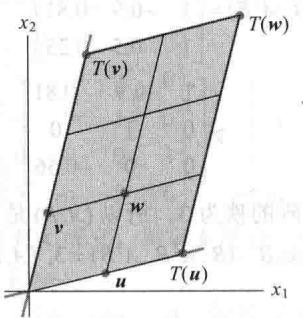

import Knowledge from '@/components/Knowledge.astro';
import Example from '@/components/Example.astro';
import Note from '@/components/Note.astro';
import Solution from '@/components/Solution.astro';
import Block from '@/components/Block.astro';

<Block title="第5章 习题答案">

5.1

1. 是 3. 否 5. 是, $\lambda = 0$ 7. 是, $\begin{bmatrix} 1 \\ 1 \\ -1 \end{bmatrix}$

9. $\lambda=1:\begin{bmatrix}0\\ 1\end{bmatrix};\quad\lambda=5:\begin{bmatrix}2\\ 1\end{bmatrix}$ 11. $\lambda=\begin{bmatrix}-1\\ 3\end{bmatrix}$

13. $\lambda=1:\begin{bmatrix}0\\ 1\\ 0\end{bmatrix};\lambda=2:\begin{bmatrix}-1\\ 2\\ 2\end{bmatrix};\lambda=3:\begin{bmatrix}-1\\ 1\\ 1\end{bmatrix}$

15. $\begin{bmatrix} -2\\ 1\\ 0 \end{bmatrix},\begin{bmatrix} -3\\ 0\\ 1 \end{bmatrix}$

$$

1 7. 0, 2, - 1

$$

19. 0. 验证你的答案.

21. 写出答案之后，见“学习指导”.

23. 提示：用定理 2.

25. 提示：利用方程 $Ax = \lambda x$ 找出包含 $A^{-1}$ 的方程.

27. 提示：对任何 $\lambda, (A - \lambda I)^{\mathrm{T}} = A^{\mathrm{T}} - \lambda I$ 。由定理（哪一个？） $A^{\mathrm{T}} - \lambda I$ 可逆的充分必要条件是 $A - \lambda I$ 可逆。

29. 设 $\pmb{v}$ 是 $\mathbb{R}^n$ 中向量, 其元素全是 1 , 那么 $A\pmb{v} = s\pmb{v}$

31. 提示：如果 A 是 T 的标准矩阵，找一个非零向量 v （平面上一点）使得 Av = v。

33. a. $x_{k+1}=c_{1}\lambda^{k+1}u+c_{2}\mu^{k+1}v$ b. $Ax_{k}=A(c_{1}\lambda^{k}u+c_{2}\mu^{k}v)$ $=c_{1}\lambda^{k}Au+c_{2}\mu^{k}Av$ 线性性质 $=c_{1}\lambda^{k}\lambda u+c_{2}\mu^{k}\mu v$ u 和 v 是特征向量 $=x_{k+1}$

35. [M]

37. [M] $\lambda = 3: \begin{bmatrix} 5 \\ -2 \\ 9 \end{bmatrix}$ ; $\lambda = 13: \begin{bmatrix} -2 \\ 1 \\ 0 \end{bmatrix}, \begin{bmatrix} -1 \\ 0 \\ 1 \end{bmatrix}$ 你可以用“学

习指导”中的程序 nulbasis. 加速你的计算.

$$

\lambda = - 2: \left[ \begin{array}{c} - 2 \\ 7 \\ - 5 \\ 5 \\ 0 \end{array} \right], \left[ \begin{array}{c} 3 \\ 7 \\ - 5 \\ 0 \\ 5 \end{array} \right];

$$

39. [M]

$$

\lambda = 5: \left[ \begin{array}{c} 2 \\ - 1 \\ 1 \\ 0 \\ 0 \end{array} \right], \left[ \begin{array}{c} - 1 \\ 1 \\ 0 \\ 1 \\ 0 \end{array} \right], \left[ \begin{array}{c} 2 \\ 0 \\ 0 \\ 0 \\ 1 \end{array} \right];

$$

5.2

1. $\lambda^{2}-4\lambda-45$ ; 9, -5

3. $\lambda^{2}-2\lambda-1$ ; $1\pm\sqrt{2}$

5. $\lambda^2 - 6\lambda + 9; 3$

7. $\lambda^2 - 9\lambda + 32$ ；无实特征值

9. $-\lambda^{3}+4\lambda^{2}-9\lambda-6$ 11. $-\lambda^{3}+9\lambda^{2}-26\lambda+24$

13. $-\lambda^3 + 18\lambda^2 - 95\lambda + 150$ 15.4, 3, 3, 1

17.3, 3, 1, 1, 0

19. 提示：方程对所有 $\lambda$ 成立.

21. 见“学习指导”的提示.

23. 提示：求一个可逆矩阵 P，使得 $RQ = P^{-1}AP$ .

25. a. $\{\pmb{v}_1, \pmb{v}_2\}$ , 其中 $\pmb{v}_2 = \begin{bmatrix} -1 \\ 1 \end{bmatrix}$ 是对应于 $\lambda = 0.3$ 的特征向量.

b. $x_0 = v_1 - \frac{1}{14} v_2$ .

c. $x_{1}=v_{1}-\frac{1}{14}(0.3)v_{2}$ , $x_{2}=v_{1}-\frac{1}{14}(0.3)^{2}v_{2}$ , $x_{k}=v_{1}-\frac{1}{14}(0.3)^{k}v_{2}$ . 当 $k\to\infty$ 时， $(0.3)^{k}\to0$ ， $x_{k}\rightarrow v_{1}$

27. a. $A\pmb{v}_1 = v_1, A\pmb{v}_2 = 0.5\pmb{v}_2, A\pmb{v}_3 = 0.2\pmb{v}_3$ （这也证明 $A$ 的特征值为1，0.5和0.2。）b. $\{\pmb{v}_1, \pmb{v}_2, \pmb{v}_3\}$ 线性无关，因为特征向量对应于不同的特征值（定理2）。由于集合中包含三个向量，故集合是 $\mathbb{R}^3$ 的一个基。所以存在（唯一）常数使得 $\pmb{x}_0 = c_1\pmb{v}_1 + c_2\pmb{v}_2 + c_3\pmb{v}_3$ ，于是 $\pmb{w}^{\mathrm{T}}\pmb{x}_0 = c_1\pmb{w}^{\mathrm{T}}\pmb{v}_1 + c_2\pmb{w}^{\mathrm{T}}\pmb{v}_2 + c_3\pmb{w}^{\mathrm{T}}\pmb{v}_3$ (\*)由于 $\pmb{x}_0$ 和 $\pmb{v}_1$ 是概率向量，且 $\pmb{v}_2$ 和 $\pmb{v}_3$ 中的元素之和为0，因此(\*)表明 $1 = c_1$

c. 由（b）， $x_{0}=v_{1}+c_{2}v_{2}+c_{3}v_{3}$ . 利用(a),

$$

\begin{array}{r l}&{\pmb {x} _ {k} = A ^ {k} \pmb {x} _ {0} = A ^ {k} \pmb {v} _ {1} + c _ {2} A ^ {k} \pmb {v} _ {2} + c _ {3} A ^ {k} \pmb {v} _ {3}}\\&{\qquad = \pmb {v} _ {1} + c _ {2} (0. 5) ^ {k} \pmb {v} _ {2} + c _ {3} (0. 2) ^ {k} \pmb {v} _ {3}}\\&{\qquad \rightarrow \pmb {v} _ {1}, \text {当} k \rightarrow \infty}\end{array}

$$

29. [M]报告你的结果和结论. 如果使用“学习指导”中讨论的 gauss 程序，你可避免复杂计算.

5.3

1. $\begin{bmatrix} 226 & -525 \\ 90 & -209 \end{bmatrix}$

$$

\left[ \begin{array}{c c} a ^ {k} & 0 \\ 3 (a ^ {k} - b ^ {k}) & b ^ {k} \end{array} \right]

$$

5. $\lambda=5:\begin{bmatrix}1\\ 1\\ 1\end{bmatrix};\lambda=1:\begin{bmatrix}1\\ 0\\ -1\end{bmatrix},\begin{bmatrix}2\\ -1\\ 0\end{bmatrix}$

当一个答案包含一个对角化时， $A = PDP^{-1}$ ，因子P和D不唯一，所以你的答案也许与这里给出的不同.

7. $P = \begin{bmatrix} 1 & 0 \\ 3 & 1 \end{bmatrix}, D = \begin{bmatrix} 1 & 0 \\ 0 & -1 \end{bmatrix}$

9. 不能对角化

11. $P=\begin{bmatrix}1&2&1\\ 3&3&1\\ 4&3&1\end{bmatrix}, D=\begin{bmatrix}3&0&0\\ 0&2&0\\ 0&0&1\end{bmatrix}$

13. $P = \begin{bmatrix} -1 & 2 & 1\\ -1 & -1 & 0\\ 1 & 0 & 1 \end{bmatrix},D = \begin{bmatrix} 5 & 0 & 0\\ 0 & 1 & 0\\ 0 & 0 & 1 \end{bmatrix}$

15. $P = \begin{bmatrix} -1 & -4 & -2\\ 0 & 0 & -1\\ 0 & 1 & 1 \end{bmatrix},D = \begin{bmatrix} 3 & 0 & 0\\ 0 & 3 & 0\\ 0 & 0 & 1 \end{bmatrix}$

17. 不能对角化.

19.

$$

P = \left[ \begin{array}{c c c c} 1 & 3 & - 1 & - 1 \\ 0 & 2 & - 1 & 2 \\ 0 & 0 & 1 & 0 \\ 0 & 0 & 0 & 1 \end{array} \right], D = \left[ \begin{array}{c c c c} 5 & 0 & 0 & 0 \\ 0 & 3 & 0 & 0 \\ 0 & 0 & 2 & 0 \\ 0 & 0 & 0 & 2 \end{array} \right]

$$

21. 见“学习指导”.

23. 是.(解释为什么.)

25. 否， $A$ 一定可以对角化。（解释为什么。）

27. 提示：写 $A = PDP^{-1}$ ，由于 $A$ 是可逆的，故 0 不是 $A$ 的特征值，所以， $D$ 在对角线上有非零元素.

29. 一个答案是 $P_{1} = \begin{bmatrix} 1 & 1 \\ -2 & -1 \end{bmatrix}$ , 它的列是对应于 $D_{1}$ 特征值的特征向量.

31. 提示：构造一个合适的 $2 \times 2$ 三角形矩阵.

33. [M]

$$

P = \left[ \begin{array}{r r r r} 2 & 2 & 1 & 6 \\ 1 & - 1 & 1 & - 3 \\ - 1 & - 7 & 1 & 0 \\ 2 & 2 & 0 & 4 \end{array} \right], D = \left[ \begin{array}{r r r r} 5 & 0 & 0 & 0 \\ 0 & 1 & 0 & 0 \\ 0 & 0 & - 2 & 0 \\ 0 & 0 & 0 & - 2 \end{array} \right]

$$

35. [M]

$$

P = \left[ \begin{array}{r r r r r} 6 & 3 & 2 & 4 & 3 \\ - 1 & - 1 & - 1 & - 3 & - 1 \\ - 3 & - 3 & - 4 & - 2 & - 4 \\ 3 & 0 & - 1 & 5 & 0 \\ 0 & 3 & 4 & 0 & 5 \end{array} \right],

$$

$$

D = \left[ \begin{array}{c c c c c} 5 & 0 & 0 & 0 & 0 \\ 0 & 5 & 0 & 0 & 0 \\ 0 & 0 & 3 & 0 & 0 \\ 0 & 0 & 0 & 1 & 0 \\ 0 & 0 & 0 & 0 & 1 \end{array} \right]

$$

5.4

1.

$$

\left[ \begin{array}{r r r} 3 & - 1 & 0 \\ - 5 & 6 & 4 \end{array} \right]

$$

3. a. $T(\boldsymbol{e}_{1}) = -\boldsymbol{b}_{1} + \boldsymbol{b}_{3}$ , $T(\boldsymbol{e}_{2}) = -\boldsymbol{b}_{1} - \boldsymbol{b}_{3}$ , $T(\boldsymbol{e}_{3}) = \boldsymbol{b}_{1} - \boldsymbol{b}_{2}$

$$

\mathbf {b}. \left[ T (\boldsymbol {e} _ {1}) \right] _ {\mathcal {B}} = \left[ \begin{array}{c} 0 \\ - 1 \\ 1 \end{array} \right], \left[ T (\boldsymbol {e} _ {2}) \right] _ {\mathcal {B}} = \left[ \begin{array}{c} - 1 \\ 0 \\ - 1 \end{array} \right],

$$

$$

\left[ T \left(\boldsymbol {e} _ {3}\right) \right] _ {\mathcal {B}} = \left[ \begin{array}{c} 1 \\ - 1 \\ 0 \end{array} \right]

$$

C.

$$

\left[ \begin{array}{r r r} 0 & - 1 & 1 \\ - 1 & 0 & - 1 \\ 1 & - 1 & 0 \end{array} \right]

$$

5. a. $10 - 3t + 4t^{2} + t^{3}$

b. 对任意属于 $P_{2}$ 的 p,q 和任意数 c，

$$

\begin{array}{r l} T [ \boldsymbol {p} (t) + \boldsymbol {q} (t) ] & = (t + 5) [ \boldsymbol {p} (t) + \boldsymbol {q} (t) ] \\ & = (t + 5) \boldsymbol {p} (t) + (t + 5) \boldsymbol {q} (t) \\ & = T [ \boldsymbol {p} (t) ] + T [ \boldsymbol {q} (t) ] \end{array}

$$

$$

\begin{array}{r l} T [ c \cdot p (t) ] & = (t + 5) [ c \cdot p (t) ] = c \cdot (t + 5) p (t) \\ & = c \cdot T [ p (t) ] \end{array}

$$

C.

$$

\left[ \begin{array}{c c c} 5 & 0 & 0 \\ 1 & 5 & 0 \\ 0 & 1 & 5 \\ 0 & 0 & 1 \end{array} \right]

$$

7.

$$

\left[ \begin{array}{c c c} 3 & 0 & 0 \\ 5 & - 2 & 0 \\ 0 & 4 & 1 \end{array} \right]

$$

9. a.

$$

\left[ \begin{array}{c} 2 \\ 5 \\ 8 \end{array} \right]

$$

b. 提示：对任意 $\mathbb{P}_2$ 中的 $p, q$ 和任意数 $c$ ，计算 $T(p + q)$ 和 $T(c \cdot p)$ .

C.

$$

\left[ \begin{array}{c c c} 1 & - 1 & 1 \\ 1 & 0 & 0 \\ 1 & 1 & 1 \end{array} \right]

$$

11.

$$

\left[ \begin{array}{c c} 1 & 5 \\ 0 & 1 \end{array} \right]

$$

$$

\boldsymbol {b} _ {1} = \left[ \begin{array}{l} 1 \\ 1 \end{array} \right], \boldsymbol {b} _ {2} = \left[ \begin{array}{l} 1 \\ 3 \end{array} \right]

$$

15. $b_{1}=\begin{bmatrix}-2\\1\end{bmatrix},\quad b_{2}=\begin{bmatrix}1\\1\end{bmatrix}$

17. a. $Ab_{1}=2b_{1}$ ，所以 $b_{1}$ 是 A 的特征向量。然而，A 仅有一个特征值， $\lambda=2$ ，且特征子空间仅是一维的，所以，A 不可对角化。

b. $\begin{bmatrix}2&-1\\ 0&2\end{bmatrix}$

19. 由定义，如果 $A$ 与 $B$ 相似，则存在一个可逆矩阵 $P$ ，使得 $P^{-1}AP = B$ 。（见5.2节。）那么 $B$ 是可逆的，因为它是可逆矩阵的乘积。为证明 $A^{-1}$ 与 $B^{-1}$ 相似，利用方程 $P^{-1}AP = B$ 。见“学习指导”。

21. 提示：复习练习题 2.

23. 提示：计算 $B(P^{-1}x)$

25. 提示：写出 $A = PBP^{-1} = (PB)P^{-1}$ ，且利用迹的性质.

27. 对每一个 $j, I(\pmb{b}_j) = \pmb{b}_j$ 。由于 $\mathbb{R}^n$ 中任意向量的标准坐标向量恰好是向量自身，故 $[I(\pmb{b}_j)]_{\varepsilon} = \pmb{b}_j$ 。 $I$ 相对于 $\mathcal{B}$ 和标准基 $\mathcal{E}$ 的矩阵简单表示为 $[\pmb{b}_1\pmb{b}_2\dots \pmb{b}_n]$ 。这个矩阵就是 4.4 节定义的坐标变换矩阵 $P_{\mathcal{B}}$ 。

29. 恒等变换的 $\mathcal{B}$ -矩阵是 $I_{n}$ ，因为第 $j$ 个基向量 $\pmb{b}_{j}$ 的 $\mathcal{B}$ -坐标向量是 $I_{n}$ 的第 $j$ 列.

31. [M] $\begin{bmatrix} -7 & -2 & -6 \\ 0 & -4 & -6 \\ 0 & 0 & -1 \end{bmatrix}$

5.5

1. $\lambda=2+i,\left[\begin{matrix}-1+i\\1\end{matrix}\right];\lambda=2-i,\left[\begin{matrix}-1-i\\1\end{matrix}\right]$

3. $\lambda=2+3i,\left[\begin{array}{c}1-3i\\2\end{array}\right];\lambda=2-3i,\left[\begin{array}{c}1+3i\\2\end{array}\right]$

5. $\lambda=2+2i,\left[\begin{array}{c}1\\2+2i\end{array}\right];\lambda=2-2i,\left[\begin{array}{c}1\\2-2i\end{array}\right]$

7. $\lambda = \sqrt{3} \pm \mathrm{i}, \varphi = \pi / 6$ 弧度， $r = 2$

9. $\lambda = -\sqrt{3} / 2 \pm (1 / 2)\mathrm{i}, \varphi = -5\pi / 6$ 弧度， $r = 1$

11. $\lambda = 0.1 \pm 0.1\mathrm{i}$ , $\varphi = -\pi / 4$ 弧度, $r = \sqrt{2} / 10$

在习题 13\~20 中，其他答案也有可能。使得 $P^{-1}AP$ 等于给定的 C 或 $C^{T}$ 的任何 P 都是可满足的答案。首先求 P；然后计算 $P^{-1}AP$ 。

13. $P=\begin{bmatrix}-1 & -1 \\ 1 & 0\end{bmatrix}, C=\begin{bmatrix}2 & -1 \\ 1 & 2\end{bmatrix}$

15. $P=\begin{bmatrix}1 & 3 \\ 2 & 0\end{bmatrix}, C=\begin{bmatrix}2 & -3 \\ 3 & 2\end{bmatrix}$

17. $P=\begin{bmatrix}2 & -1 \\ 5 & 0\end{bmatrix}, C=\begin{bmatrix}-0.6 & -0.8 \\ 0.8 & -0.6\end{bmatrix}$

19. $P=\begin{bmatrix}2 & -1 \\ 2 & 0\end{bmatrix}, C=\begin{bmatrix}0.96 & -0.28 \\ 0.28 & 0.96\end{bmatrix}$

21. $y=\begin{bmatrix}2\\ -1+2i\end{bmatrix}=\frac{-1+2i}{5}\begin{bmatrix}-2-4i\\ 5\end{bmatrix}$

23.（a）共轭的性质和等式 $\overline{x}^{T} = \overline{x}^{T}$ .

(b) $\overline{Ax}=A\overline{x}$ 且 A 是实的；

（c）由于 $x^{T}A\overline{x}$ 是一个数，因而可认为是一个 $1\times1$ 矩阵.

(d) 转置的性质.

(e) $A^{\mathrm{T}} = A$ ， $q$ 的定义.

25. 提示：首先写出 $x = \operatorname{Re} x + \mathrm{i}(\operatorname{Im} x)$ .

27. [M] $P = \begin{bmatrix} 1 & -1 & -2 & 0 \\ -4 & 0 & 0 & 2 \\ 0 & 0 & -3 & -1 \\ 2 & 0 & 4 & 0 \end{bmatrix}$ ,

$$

C = \left[ \begin{array}{c c c c} 0. 2 & - 0. 5 & 0 & 0 \\ 0. 5 & 0. 2 & 0 & 0 \\ 0 & 0 & 0. 3 & - 0. 1 \\ 0 & 0 & 0. 1 & 0. 3 \end{array} \right]

$$

其他选择也是可能的，但 C 必须等于 $P^{-1}AP$

5.6

1. a. 提示：求 $c_{1}, c_{2}$ ，使得 $\pmb{x}_{0} = c_{1}\pmb{v}_{1} + c_{2}\pmb{v}_{2}$ ，利用这个表达式以及 $\pmb{v}_{1}$ 和 $\pmb{v}_{2}$ 是 $A$ 的特征向量的事实，计算 $\pmb{x}_{1} = \begin{bmatrix} 49 / 3 \\ 41 / 3 \end{bmatrix}$ .

b. 一般地， $\pmb{x}_{k} = 5(3)^{k}\pmb{v}_{1} - 4\left(\frac{1}{3}\right)^{k}\pmb{v}_{2}$ ， $k \geqslant 0$ .

3. 当 p=0.2，A 的特征值为 0.9 和 0.7，且 $x_{k}=c_{1}(0.9)^{k}\begin{bmatrix}1\\ 1\end{bmatrix}+c_{2}(0.7)^{k}\begin{bmatrix}2\\ 1\end{bmatrix}\rightarrow0$ ，当 $k\rightarrow\infty$ 时

捕食者的出生率越高，猫头鹰的食物供应就越少，最后捕食者和被捕食者的数量都会消失。

5. 如果 p=0.325，则特征值是 1.05 和 0.55。由于 1.05>1，故两种数量每年会增加 5%。对应 1.05 的特征向量为 $(6,13)$ ，所以，最后每 13 000 只松鼠大约有6只斑点猫头鹰.

7. a. 原点是鞍点，因为 $A$ 的特征值的绝对值一个大于1，另一个小于1.

b. 最大的吸引方向是特征值 1/3 对应的特征向量 $\pmb{v}_{2}$ 。所有是 $\pmb{v}_{2}$ 倍数的向量都被吸引到原点，最大的排斥方向由特征向量 $\pmb{v}_{1}$ 给出，所有 $\pmb{v}_{1}$ 的倍数都被排斥.

c. 见“学习指导”.

9. 鞍点；特征值：2，0.5；最大的排斥方向：通过(0,0)和(-1,1)的直线；最大吸引方向：通过(0,0)和(1,4)的直线.

11. 吸引子；特征值：0.9，0.8；最大吸引方向：通过(0,0)和(5,4)的直线.

13. 排斥子；特征值：1.2，1.1；最大排斥方向：通过(0,0)和(3,4)的直线.

15. $x_{k}=v_{1}+(0.1)(0.5)^{k}\begin{bmatrix}2\\ -3\\ 1\end{bmatrix}+(0.3)(0.2)^{k}\begin{bmatrix}-1\\ 0\\ 1\end{bmatrix}\rightarrow v_{1}$ 当 $k \rightarrow \infty$ .

17. a. $A=\begin{bmatrix}0&1.6\\ 0.3&0.8\end{bmatrix}$

b. 人口数会增加，因为 A 的最大特征值是 1.2，此值数值上大于 1. 最后的出生增长速度为 1.2，即每年增加 20%. 对应于特征值 $\lambda_{1}=1.2$ 的特征向量是 (4,3)，说明每 3 个成人将有 4 个儿童.

c. [M]5 或 6 年以后，儿童-成人的比率会变得稳定。“学习指导”描述如何构造一个矩阵程序去生成一个数据矩阵，它的列给出每年儿童和成人的数量，数据的图像也有讨论.

5.7

1. $x(t)=\frac{5}{2}\begin{bmatrix}-3\\ 1\end{bmatrix}e^{4t}-\frac{3}{2}\begin{bmatrix}-1\\ 1\end{bmatrix}e^{2t}$

3. $-\frac{5}{2}\left[ \begin{array}{c} -3 \\ 1 \end{array} \right] \mathrm{e}^t + \frac{9}{2}\left[ \begin{array}{c} -1 \\ 1 \end{array} \right] \mathrm{e}^{-t}$ . 原点是鞍点. 最大吸引方向是通过 $(-1,1)$ 和原点的直线. 最大排斥方向是通过 $(-3,1)$ 和原点的直线.

5. $-\frac{1}{2}\begin{bmatrix}1\\ 3\end{bmatrix}\mathrm{e}^{4t}+\frac{7}{2}\begin{bmatrix}1\\ 1\end{bmatrix}\mathrm{e}^{6t}$ ，原点是一个排斥子，最大排斥方向是通过(1,1)和原点的直线.

7. 令 $P = \begin{bmatrix} 1 & 1 \\ 3 & 1 \end{bmatrix}$ 和 $D = \begin{bmatrix} 4 & 0 \\ 0 & 6 \end{bmatrix}$ ，那么 $A = PDP^{-1}$ . 将 $\pmb{x} = \pmb{P}\pmb{y}$ 代入 $\pmb{x}' = A\pmb{x}$ ，我们有

$$

\begin{array}{r l} \frac {\mathrm{d}}{\mathrm{d} t} (P \mathbf {y}) & = A (P \mathbf {y}) \\ P \mathbf {y} ^ {\prime} & = P D P ^ {- 1} (P \mathbf {y}) = P D \mathbf {y} \end{array}

$$

用 $P^{-1}$ 左乘，得到 $\mathbf{y}' = D\mathbf{y}$ 或

$$

\left[ \begin{array}{l} y _ {1} ^ {\prime} (t) \\ y _ {2} ^ {\prime} (t) \end{array} \right] = \left[ \begin{array}{l l} 4 & 0 \\ 0 & 6 \end{array} \right] \left[ \begin{array}{l} y _ {1} (t) \\ y _ {2} (t) \end{array} \right]

$$

9. 复数解：

$$

c _ {1} \left[ \begin{array}{l} 1 - \mathrm{i} \\ 1 \end{array} \right] \mathrm{e} ^ {(- 2 + \mathrm{i}) t} + c _ {2} \left[ \begin{array}{l} 1 + \mathrm{i} \\ 1 \end{array} \right] \mathrm{e} ^ {(- 2 - \mathrm{i}) t}

$$

实数解：

$$

c _ {1} \left[ \begin{array}{c} \cos t + \sin t \\ \cos t \end{array} \right] e ^ {- 2 t} + c _ {2} \left[ \begin{array}{c} \sin t - \cos t \\ \sin t \end{array} \right] e ^ {- 2 t}

$$

轨迹是螺旋趋于原点.

11. 复数解： $c_{1}\left[ \begin{array}{c} -3 + 3\mathrm{i}\\ 2 \end{array} \right]\mathrm{e}^{3it} + c_{2}\left[ \begin{array}{c} -3 - 3\mathrm{i}\\ 2 \end{array} \right]\mathrm{e}^{-3it}$

实数解：

$$

c _ {1} \left[ \begin{array}{c} - 3 \cos 3 t - 3 \sin 3 t \\ 2 \cos 3 t \end{array} \right] + c _ {2} \left[ \begin{array}{c} - 3 \sin 3 t + 3 \cos 3 t \\ 2 \sin 3 t \end{array} \right]

$$

轨迹是绕原点的椭圆.

13. 复数解： $c_{1}\begin{bmatrix}1+i\\ 2\end{bmatrix}\mathrm{e}^{(1+3i)t}+c_{2}\begin{bmatrix}1-i\\ 2\end{bmatrix}\mathrm{e}^{(1-3i)t}$

实数解：

$$

c _ {1} \left[ \begin{array}{c} \cos 3 t - \sin 3 t \\ 2 \cos 3 t \end{array} \right] e ^ {t} + c _ {2} \left[ \begin{array}{c} \sin 3 t + \cos 3 t \\ 2 \sin 3 t \end{array} \right] e ^ {t}

$$

轨迹是螺旋远离原点.

15. [M] $\boldsymbol{x}(t)=c_{1}\begin{bmatrix}-1\\0\\1\end{bmatrix}\mathrm{e}^{-2t}+c_{2}\begin{bmatrix}-6\\1\\5\end{bmatrix}\mathrm{e}^{-t}+c_{3}\begin{bmatrix}-4\\1\\4\end{bmatrix}\mathrm{e}^{t}$

原点是鞍点， $c_{3} = 0$ 的解被吸引到原点， $c_{1} = c_{2} = 0$ 的解被排斥.

17. [M] 复数解:

$$

c _ {1} \left[ \begin{array}{l} - 3 \\ 1 \\ 1 \end{array} \right] \mathrm{e} ^ {t} + c _ {2} \left[ \begin{array}{l} 2 3 - 3 4 \mathrm{i} \\ - 9 + 1 4 \mathrm{i} \\ 3 \end{array} \right] \mathrm{e} ^ {(5 + 2 \mathrm{i}) t} + c _ {3} \left[ \begin{array}{l} 2 3 + 3 4 \mathrm{i} \\ - 9 - 1 4 \mathrm{i} \\ 3 \end{array} \right] \mathrm{e} ^ {(5 - 2 \mathrm{i}) t}

$$

实数解：

$$

\begin{array}{l} c _ {1} \left[ \begin{array}{c} - 3 \\ 1 \\ 1 \end{array} \right] \mathrm{e} ^ {t} + c _ {2} \left[ \begin{array}{c} 2 3 \cos 2 t + 3 4 \sin 2 t \\ - 9 \cos 2 t - 1 4 \sin 2 t \\ 3 \cos 2 t \end{array} \right] \mathrm{e} ^ {5 t} + \\ c _ {3} \left[ \begin{array}{c} 2 3 \sin 2 t - 3 4 \cos 2 t \\ - 9 \sin 2 t + 1 4 \cos 2 t \\ 3 \sin 2 t \end{array} \right] \mathrm{e} ^ {5 t} \end{array}

$$

原点是排斥子，轨迹是螺旋向外远离原点.

$$

A = \left[ \begin{array}{c c} - 2 & 3 / 4 \\ 1 & - 1 \end{array} \right]

$$

$$

\left[ \begin{array}{l} v _ {1} (t) \\ v _ {2} (t) \end{array} \right] = \frac {5}{2} \left[ \begin{array}{l} 1 \\ 2 \end{array} \right] \mathrm{e} ^ {- 0. 5 t} - \frac {1}{2} \left[ \begin{array}{l} - 3 \\ 2 \end{array} \right] \mathrm{e} ^ {- 2. 5 t}

$$

21. [M] $A = \begin{bmatrix} -1 & -8 \\ 5 & -5 \end{bmatrix}$ , $\begin{bmatrix} i_{L}(t) \\ v_{C}(t) \end{bmatrix} = \begin{bmatrix} -20\sin 6t \\ 15\cos 6t - 5\sin 6t \end{bmatrix} e^{-3t}$

5.8

1. 特征向量： $x_{4}=\begin{bmatrix}1\\ 0.3326\end{bmatrix}$ ，或 $Ax_{4}=\begin{bmatrix}4.9978\\ 1.6652\end{bmatrix}$ ; $\lambda\approx4.9978$

3. 特征向量： $x_{4}=\begin{bmatrix}0.5188\\ 1\end{bmatrix}$ ，或 $Ax_{4}=\begin{bmatrix}0.4594\\ 0.9075\end{bmatrix}$ ; $\lambda\approx0.9075$

5. $x=\begin{bmatrix}-0.7999\\1\end{bmatrix}, Ax=\begin{bmatrix}4.0015\\-5.0020\end{bmatrix};$ 估计的 $\lambda=-5.0020$

7. [M] $x_{k}:\left[ \begin{array}{l}0.75\\ 1 \end{array} \right],\left[ \begin{array}{l}1\\ 0.9565 \end{array} \right],\left[ \begin{array}{l}0.9932\\ 1 \end{array} \right],\left[ \begin{array}{l}1\\ 0.9990 \end{array} \right],$ $\left[ \begin{array}{l}0.9998\\ 1 \end{array} \right]$ $\mu_{k}:11.5,\quad 12.78,\quad 12.96,\quad 12.9948,\quad 12.9990$

9. [M] $\mu_{5}=8.4233,\mu_{6}=8.4246;$ 实际值：8.42443(精确到小数点后5位).

11. $\mu_{k}:5.8000,5.9655,5.9942,5.9990(k=1,2,3,4);$ $R(x_{k}):5.9655,5.9990,5.99997,5.9999993$

13. 是，但序列也许收敛非常慢.

15. 提示： $Ax - \alpha x = (A - \alpha I)x$ ，且用以下事实：

当 $\alpha$ 不是 $A$ 的特征值时， $(A - \alpha I)$ 是可逆的.

17. [M] $v_{0}=3.3384, v_{1}=3.321\ 19$ （用四舍五入精确到4位有效数字）， $v_{2}=3.321\ 220\ 9$ ，实际值：3.321 220 1（精确到小数点后7位）.

19. [M]a. $\mu_{6} = 30.2887 = \mu_{7}$ 到四位小数，若到6位，最大特征值是30.288685，特征向量为(0.957629, 0.688937, 1, 0.943782). b. 逆幂法（取 $\alpha = 0$ ）得到 $\mu_{1}^{-1} = 0.010141$ ， $\mu_{2}^{-1} = 0.010150$ 。若到7位数字，最小特征值是0.0101500，特征向量是(-0.603972, 1, -0.251135, 0.148953). 收敛速度很快的原因是第二小的特征值接近0.85.

21. a. 如果 A 的特征值在数量上都小于 1 且 $x \neq 0$ ，那么 $A^{k}x$ 对充分大的 k 趋于一个特征向量.

b. 如果主特征值是 1，且 x 具有与对应特征向量方向一致的分量，那么 $\{A^{k}x\}$ 将收敛于那个特征向量的倍数.

c. 如果 A 的特征值在数量上都大于 1，且 x 不是一个特征向量，那么从 $A^{k}x$ 到最近特征向量的距离在 $k \to \infty$ 时会增大.

</Block>

<Block title="第5章补充习题 答案">

1. a. T b. F c. T d. F e. T

f. T g. F h. T i. F j. T

k. F l. F m. F n. T o. F

p. T q. F r. T s. F t. T

u. T v. T w. F x. T

3. a. 假设 $Ax = \lambda x$ ，其中 $x \neq 0$ ，则 $(5I - A)x = 5x - Ax = 5x - \lambda x = (5 - \lambda)x$ ，特征值是 $5 - \lambda$ 。

b. $(5I - 3A + A^2)x = 5x - 3Ax + A(Ax) = 5x - 3\lambda x + \lambda^2x = (5 - 3\lambda + \lambda^2)x$ ，特征值为 $5 - 3\lambda + \lambda^2$ 。

5. 假设 $Ax = \lambda x, \quad x \neq 0$ ，那么 $p(A)x=(c_{0}I+c_{1}A+c_{2}A^{2}+\cdots+c_{n}A^{n})x$ $=c_{0}x+c_{1}(Ax)+c_{2}A^{2}x+\cdots+c_{n}A^{n}x$ $=c_{0}x+c_{1}\lambda x+c_{2}\lambda^{2}x+\cdots+c_{n}\lambda^{n}x=p(\lambda)x$

所以， $p(\lambda)$ 是矩阵 $p(A)$ 的一个特征值.

7. 如果 $A = PDP^{-1}$ ，那么 $p(A) = Pp(D)P^{-1}$ ，像习题

6 中所证明的那样. 如果 D 中 $(j,j)$ 元素为 $\lambda$ ，那么 $D^{k}$ 中 $(j,j)$ 元素为 $\lambda^{k}$ . 所以， $p(D)$ 中 $(j,j)$ 元素为 $p(\lambda)$ . 如果 p 是矩阵 A 的特征多项式，那么对 D 的对角线上的每一个元素有 $p(\lambda)=0$ ，这是因为 D 中的这些元素是 A 的特征值. 于是 $p(D)$ 是零矩阵，从而 $p(A)=P\cdot0\cdot P^{-1}=0$ .

9. 如果 I-A 不可逆, 那么方程 $(I-A)x=0$ 将会有一个非平凡解 x, 从而 x-Ax=0 且 $Ax=1\cdot x$ , 这表明 A 具有特征值 1. 如果所有特征值小于 1, 这是不可能出现的, 所以 I-A 一定可逆.

11. a. 取 $H$ 中的 $\pmb{x}$ ，那么对一些数 $c$ 有 $\pmb{x} = c\pmb{u}$ ，所以 $Ax = A(c\pmb{u}) = c(A\pmb{u}) = c(\lambda \pmb{u}) = (c\lambda)\pmb{u}$ ，这说明 $Ax$ 在 $H$ 中。b. 令 $\pmb{x}$ 是 $K$ 中的非零向量，由于 $K$ 是一维的，故 $K$ 是 $\pmb{x}$ 的所有倍数形成的集合。如果 $K$ 在 $A$ 之下不变，那么 $Ax$ 属于 $K$ ，因此 $Ax$ 是 $\pmb{x}$ 的倍数，从而 $\pmb{x}$ 是 $A$ 的一个特征向量。

13. 1, 3, 7

15. 将第3章补充习题16的行列式公式中的 $a$ 用 $a - \lambda$ 替换： $\operatorname{det}(A - \lambda I) = (a - b - \lambda)^{n-1}[a - \lambda + (n - 1)b]$ 这个行列式为零当且仅当 $a - b - \lambda = 0$ 或 $a - \lambda + (n - 1)b = 0$ 。于是 $\lambda$ 是 $A$ 的特征值当且仅当 $\lambda = a - b$ 或 $\lambda = a + (n - 1)b$ 。从上面计算 $\operatorname{det}(A - \lambda I)$ 的公式得到特征值 $a - b$ 的重数是 $n - 1$ ，特征值 $a + (n - 1)b$ 的重数是1。

17. $\operatorname{det}(A - \lambda I) = (a_{11} - \lambda)(a_{22} - \lambda) - a_{12}a_{21} =$ $\lambda^2 -(a_{11} + a_{22})\lambda +(a_{11}a_{22} - a_{12}a_{21})$ $= \lambda^{2} - (\mathrm{tr}A)\lambda +\mathrm{det}A$ 利用二次求根公式求得特征方程的解为： $\lambda = \frac{\mathrm{tr}A\pm\sqrt{(\mathrm{tr}A)^2 - 4\mathrm{det}A}}{2}$ 特征值都是实数当且仅当判别式是非负的，即 $(\mathrm{tr}A)^2 -4\mathrm{det}A\geqslant 0$ .这个不等式简化为 $(\mathrm{tr}A)^2\geqslant 4\mathrm{det}A$ 和 $\left(\frac{\mathrm{tr}A}{2}\right)^2\geqslant \mathrm{det}A.$

19. $C_p = \begin{bmatrix} 0 & 1 \\ -6 & 5 \end{bmatrix}$ ; $\operatorname{det}(C_p - \lambda I) = 6 - 5\lambda + \lambda^2 = p(\lambda)$

21. 如果 $p$ 是 2 阶多项式，那么类似习题 19 中的一个计算表明： $C_p$ 的特征多项式是 $p(\lambda) = (-1)^2 p(\lambda)$ ，所以，对 $n = 2$ 结果是真的。假若结果对 $n = k, k \geqslant 2$ 是真的，且考虑一个次数为 $(k + 1)$ 的多项式 $p \cdot \det(C_p - \lambda I)$ 按第一列的余因子展开， $C_p - \lambda I$ 的行列式等于

$(-\lambda)\det\left[\begin{matrix}-\lambda&1&\cdots&0\\\vdots&&&\vdots\\0&&&1\\-a_{1}&-a_{2}&\cdots&-a_{k}-\lambda\end{matrix}\right]+\left(-1\right)^{k+1}a_{0}$ 显示的 $k \times k$ 矩阵是 $C_{q} - \lambda I$ ，其中 $q(t) = a_{1} + a_{2}t + \cdots + a_{k}t^{k-1} + t^{k}$ 。由归纳假设， $C_{p} - \lambda I$ 的行列式是 $(-1)^{k}q(\lambda)$ ，因此 $\det(C_{p}-\lambda I)=(-1)^{k+1}a_{0}+(-\lambda)(-1)^{k}q(\lambda)$ $=(1)^{k+1}[a_{0}+\lambda(a_{1}+\cdots+a_{k}\lambda^{k-1}+\lambda^{k})]$ $=(1)^{k+1}p(\lambda)$ 所以，当 n=k 结论成立时，公式对 $n=k+1$ 成立。由归纳法原理，关于 $\det(C_{p}-\lambda I)$ 的公式对所有 $n \geqslant 2$ 成立。

23. 由习题22，范德蒙德矩阵 $V$ 的列是 $C_p$ 的特征向量，对应的特征值分别是 $\lambda_1, \lambda_2, \lambda_3$ （特征多项式 $p$ 的根）。由于这些特征值是不同的，故由5.1节定理2，对应的特征向量形成一个线性无关集。于是 $V$ 有线性无关的列，且由可逆矩阵定理可知 $V$ 是可逆的。最后，由于 $V$ 的列是 $C_p$ 的特征向量，故对角化定理（5.3节定理5）表明 $V^{-1}C_pV$ 是对角形。

25. [M]如果你的矩阵程序用迭代方法而不是符号计算法计算特征值和特征向量，你可能会遇到一些困难。你会发现 $AP - PD$ 有非常小的元素且 $PDP_{\infty}^{-1}$ 接近于 $A$ 。（这在几年前是真的，但情况会随矩阵程序不断改进而改变。）如果你从程序的特征向量构造 $P$ ，注意检查 $P$ 的条件数。这也许告诉你不可以真正求得3个线性无关的特征向量。

</Block>
