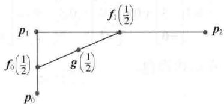
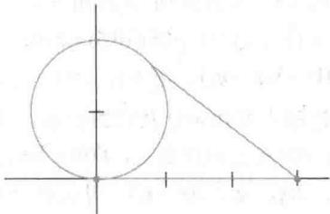
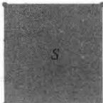
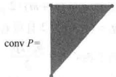
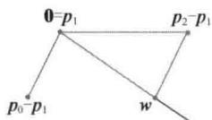

import Knowledge from '@/components/Knowledge.astro';
import Example from '@/components/Example.astro';
import Note from '@/components/Note.astro';
import Solution from '@/components/Solution.astro';
import Block from '@/components/Block.astro';

<Block title="第8章 习题答案">

8.1

1. 参考答案： $y=2v_{1}-1.5v_{2}+0.5v_{3}$ ， $y=2v_{1}-2v_{3}+v_{4},\quad y=2v_{1}+3v_{2}-7v_{3}+3v_{4}$

3. $y = -3v_{1} + 2v_{2} + 2v_{3}$ ，权值之和为1，故是一个仿射和.

5. a. 由于系数和为1，故 $p_1 = 3b_1 - b_2 - b_3 \in \mathrm{aff} S$ b. 由于系数和不为1，故 $p_2 = 2b_1 + 0b_2 + b_3 \notin \mathrm{aff} S$ c. 由于系数和为1，故 $p_3 = -b_1 + 2b_2 + 0b_3 \in \mathrm{aff} S$

7. a. $p_{1} \in \text{Span } S$ , 但 $p_{1} \notin \text{aff } S$ .  

b. $p_{2} \in \text{Span } S$ , 且 $p_{2} \in \text{aff } S$ .  

c. $p_{3} \notin \text{Span } S$ , 所以 $p_{3} \notin \text{aff } S$ .

9. $v_{1}=\begin{bmatrix}-3\\0\end{bmatrix}$ 且 $v_{2}=\begin{bmatrix}1\\-2\end{bmatrix}$ ，可能有其他答案.

11. 见“学习指导”

13. $\operatorname{Span}\{\pmb{v}_2 - \pmb{v}_1, \pmb{v}_3 - \pmb{v}_1\}$ 是平面当且仅当 $\{\pmb{v}_2 - \pmb{v}_1, \pmb{v}_3 - \pmb{v}_1\}$ 线性无关. 设 $c_2, c_3$ 满足 $c_2(\pmb{v}_2 - \pmb{v}_1) + c_3(\pmb{v}_3 - \pmb{v}_1) = 0$ . 证明 $c_2 = c_3 = 0$ .

15. 令 $S = \{x : Ax = b\}$ ，为证明 $S$ 是仿射的，根据定理3，只需证明 $S$ 是一个平面。令 $W = \{x : Ax = 0\}$ ，根据 4.2 节的定理 2（或 2.8 节的定理 12），W 是 $R^{n}$ 的一个子空间。因为 $S = W + p$ ，其中 p 满足 Ap = b，故根据 1.5 节的定理 6，S 是 W 的平移，因此 S 是一个平面。

17. 一个恰当的集合包含任何三个向量，这三个向量不是共线的且5为它们的第三项。若5是它们的第三项，则它们位于平面 $z = 5$ 。若向量不是共线的，则它们的仿射包不可能是直线，故它一定是一个平面。

19. 若 $p, q \in f(S)$ ，则存在 $r, s \in S$ 使得 $f(r) = p$ , $f(s) = q$ 。对任意的 $t \in \mathbb{R}$ ，我们一定可以证明 $z = (1 - t)p + tq$ 在 $f(S)$ 中。现在利用 $p$ 和 $q$ 的定义及 $f$ 是线性的这一事实。完整的证明可参考“学习指导”。

21. 由于 B 是仿射的, 故定理 2 表明 B 包含 B 中的点的所有仿射组合, 因此 B 包含 A 中的点的所有仿射组合, 即 aff $A \subset B$ .

23. 由于 $A \subset (A \cup B)$ ，故由习题22知， $\operatorname{aff} A \subset \operatorname{aff}(A \cup B)$ 。类似地， $\operatorname{aff} B \subset \operatorname{aff}(A \cup B)$ ，故 $[\operatorname{aff} A \cup \operatorname{aff} B] \subset \operatorname{aff}(A \cup B)$ 。

25. 为证明 $D \subset E \cap F$ ，只需证明 $D \subset E$ 与 $D \subset F$ . 完整的证明可参考“学习指导”.

8.2

1. 仿射相关且 $2\pmb{v}_1 + \pmb{v}_2 - 3\pmb{v}_3 = \mathbf{0}$

3. 集合是仿射无关的. 若点记为 $\pmb{v}_1, \pmb{v}_2, \pmb{v}_3, \pmb{v}_4$ 则 $\{\pmb{v}_1, \pmb{v}_2, \pmb{v}_3\}$ 是 $\mathbb{R}^3$ 的基且 $\pmb{v}_4 = 16\pmb{v}_1 + 5\pmb{v}_2 - 3\pmb{v}_3$ ，但是线性组合中的权值和不为1.

5. $-4v_{1}+5v_{2}-4v_{3}+3v_{4}=0$

7. 重心坐标是 $(-2,4,-1)$ .

9. 参考“学习指导”.

11. 当 5 个点的集合由减法平移，如去掉第一个点，则由 1.7 节定理 8，4 个点的新集合一定是线性相关的，这是因为这 4 个点在 $\mathbb{R}^3$ 中。由定理 5，5 个点的原集合一定是仿射相关的。

13. 若 $\{v_{1}, v_{2}\}$ 是仿射相关的，则存在不为零的 $c_{1}, c_{2}$ 使得 $c_{1} + c_{2} = 0$ 且 $c_{1}\pmb{v}_{1} + c_{2}\pmb{v}_{2} = \mathbf{0}$ 。证明这表明 $\pmb{v}_{1} = \pmb{v}_{2}$ 。相反地，假定 $\pmb{v}_{1} = \pmb{v}_{2}$ 且选择特殊的 $c_{1}, c_{2}$ 证明它们仿射相关。细节参考“学习指导”。

15. a. 向量 $v_{2}-v_{1}=\begin{bmatrix}1\\ 2\end{bmatrix}$ 且 $v_{3}-v_{1}=\begin{bmatrix}3\\ -2\end{bmatrix}$ 不是倍数关系，因此线性无关。由定理 5，S 是仿射无关的。

b. $p_{1} \leftrightarrow \left(-\frac{6}{8}, \frac{9}{8}, \frac{5}{8}\right)$ ， $p_{2} \leftrightarrow \left(0, \frac{1}{2}, \frac{1}{2}\right)$ , $p_{3} \leftrightarrow \left( \frac{14}{8}, -\frac{5}{8}, -\frac{1}{8} \right)$ ， $p_{4} \leftrightarrow \left( \frac{6}{8}, -\frac{5}{8}, \frac{7}{8} \right)$ , $p_{5} \leftrightarrow \left( \frac{1}{4}, \frac{1}{8}, \frac{5}{8} \right)$ c. $p_{6}$ 是 $(-,-,+), p_{7}$ 是 $(0, +, -), p_{8}$ 是 $(+, +, -)$ .

17. 假定 $S=\{b_{1},\cdots,b_{k}\}$ 是仿射无关集合. 方程（7）有一个解，因为 p 在 aff S 中. 因此方程（8）有一个解. 由定理 5, S 中点的齐次式是线性无关的，因此（8）有唯一解. 那么（7）也有唯一解，因为（8）包含两个方程，它们也在（7）中出现.

下面的讨论仿照 4.4 节定理 7 的证明. 如果 $S=\{b_{1},\cdots,b_{k}\}$ 是仿射无关集合，那么由 aff S 的定义，存在 $c_{1},\cdots,c_{k}$ 满足（7）. 假设对于标量 $d_{1},\cdots,d_{k}$ ，x 也可以表示为 $x=d_{1}b_{1}+\cdots+d_{k}b_{k}, d_{1}+\cdots+d_{k}=1$ (7a)

那么相减得到 $\mathbf{0}=\mathbf{x}-\mathbf{x}=(c_{1}-d_{1})\mathbf{b}_{1}+\cdots+(c_{k}-d_{k})\mathbf{b}_{k}$ (7b)

(7b) 的权值和为 0，因为 c 和 d 的和分别为 1.

这是可能的，除非（8）的每个权值都为 0，因为 S 是仿射无关集合. 这就证明对于 $i=1,\cdots,k$ ， $c_{i}=d_{i}$ .

19. 若 $\{p_{1}, p_{2}, p_{3}\}$ 是仿射相关集合，则存在不全为零的标量 $c_{1}, c_{2}, c_{3}$ ，满足 $c_{1}p_{1} + c_{2}p_{2} + c_{3}p_{3} = 0$ 且 $c_{1} + c_{2} + c_{3} = 0$ 。再使用 f 的线性性质。

21. 设 $a=\begin{bmatrix}a_{1}\\ a_{2}\end{bmatrix}$ ， $b=\begin{bmatrix}b_{1}\\ b_{2}\end{bmatrix}$ ， $c=\begin{bmatrix}c_{1}\\ c_{2}\end{bmatrix}$ ，则由行列式的转置性质（3.2节定理5）得

$$

\det \left[ \begin{array}{l l l} \tilde {\boldsymbol {a}} & \tilde {\boldsymbol {b}} & \tilde {\boldsymbol {c}} \end{array} \right] = \det \left[ \begin{array}{l l l} a _ {1} & b _ {1} & c _ {1} \\ a _ {2} & b _ {2} & c _ {2} \\ 1 & 1 & 1 \end{array} \right] = \det \left[ \begin{array}{l l l} a _ {1} & a _ {2} & 1 \\ b _ {1} & b _ {2} & 1 \\ c _ {1} & c _ {2} & 1 \end{array} \right]

$$

由 3.3 节习题 30，行列式等于以 a, b, c，为顶点的三角形面积的 2 倍.

23. 若 $\left[\tilde{a} \tilde{b} \tilde{c}\right]\begin{bmatrix} r \\ s \\ t \end{bmatrix} = \tilde{p}$ ，则由克莱姆法则， $r = \det\left[\tilde{p} \tilde{b} \tilde{c}\right] / \det\left[\tilde{a} \tilde{b} \tilde{c}\right]$ . 由习题21，这个商的分子是△pbc面积的2倍，分母是△abc面积的2倍. 由此证明了 $r$ 的等式. 对于 $s, t$ 的等式，也可使用克莱姆法则证明.

25. 交点是

$$

\boldsymbol {x} (4) = - 0. 1 \left[ \begin{array}{l} 1 \\ 3 \\ - 6 \end{array} \right] + 0. 6 \left[ \begin{array}{l} 7 \\ 3 \\ - 5 \end{array} \right] + 0. 5 \left[ \begin{array}{l} 3 \\ 9 \\ - 2 \end{array} \right] = \left[ \begin{array}{l} 5. 6 \\ 6. 0 \\ - 3. 4 \end{array} \right]

$$

它不在三角形内.

8.3

1. 见“学习指导”.

3. conv S 为空集.

5. $p_1 = -\frac{1}{6} v_1 + \frac{1}{3} v_2 + \frac{2}{3} v_3 + \frac{1}{6} v_4 = 0,$ 故 $p_1 \notin \operatorname{conv} S.$ $p_2 = \frac{1}{3} v_1 + \frac{1}{3} v_2 + \frac{1}{6} v_3 + \frac{1}{6} v_4 = 0,$ 故 $p_2 \in \operatorname{conv} S.$

7. a. $p_{1}, p_{2}, p_{3}, p_{4}$ 的重心坐标分别为 $\left(\frac{1}{3}, \frac{1}{6}, \frac{1}{2}\right)$ , $\left(0,\frac{1}{2},\frac{1}{2}\right),\left(\frac{1}{2},-\frac{1}{4},\frac{3}{4}\right),\left(\frac{1}{2},\frac{3}{4},-\frac{1}{4}\right).$ b. $p_{3}$ 和 $p_{4}$ 在 conv T 的外面. $p_{1}$ 在 conv T 的内部. $p_{2}$ 在 conv T 的边 $\overline{v_{2}v_{3}}$ 上.

9. $p_1$ 和 $p_3$ 在四面体 $\operatorname{conv} S$ 的外部。 $p_2$ 在包含顶点 $\nu_2, \nu_3$ 和 $\nu_4$ 的面上。 $p_4$ 在 $\operatorname{conv} S$ 的内部。 $p_5$ 在 $\nu_1$ 与 $\nu_3$ 间的边上。

11. 见“学习指导”

13. 若 $p, q \in f(S)$ , 则存在 $r, s \in S$ , 使得 $f(r) = p$ , $f(s) = q$ 对 $0 \leqslant t \leqslant 1$ , 证明线段 $y = (1 - t)p + tq$ 在 $f(S)$ 中. 现在利用 $f$ 的线性及 $S$ 的凸性来证明对某个 $w \in S$ 有 $y = f(w)$ . 这也证明了 $y \in f(S)$ ，即 $f(S)$ 是凸的.

15. $p=\frac{1}{6}v_{1}+\frac{1}{2}v_{2}+\frac{1}{3}v_{4}$ 且 $p=\frac{1}{2}v_{1}+\frac{1}{6}v_{2}+\frac{1}{3}v_{3}$

17. 假定 $A \subset B$ ，其中 $B$ 是凸的，则由于 $B$ 是凸的，故定理7表明 $B$ 包含了 $B$ 中所有点的凸组合。因此， $B$ 包含 $A$ 中所有点的凸组合，即 $\operatorname{conv} A \subset B$ 。

19. a. 利用习题 18 证明 conv A 与 conv B 都是 conv $(A \cup B)$ 子集。这将表明它们的并集也是 conv $(A \cup B)$ 的子集。

b. 一种可能性是设 A 是正方形的两个相邻的角且 B 是另外两个角。那么 $(\text{conv } A) \cup (\text{conv } B)$ 是什么，而 conv $(A \cup B)$ 又是什么呢？

21.

23. $\mathbf{g}(t)=(1-t)\mathbf{f}_{0}(t)+tf_{1}(t)$ $=(1-t)\left[(1-t)\mathbf{p}_{0}+tp_{1}\right]+t\left[(1-t)\mathbf{p}_{1}+tp_{2}\right]$ $=(1-t)^{2}\mathbf{p}_{0}+2t(1-t)\mathbf{p}_{1}+t^{2}\mathbf{p}_{2}$

g 的线性组合中权值之和为 $\left(1-t\right)^{2}+2t\left(1-t\right)+t^{2}$ ，它等于 $\left(1-2t+t^{2}\right)+\left(2t-2t^{2}\right)+t^{2}=1$ 。当 $0 \leqslant t \leqslant 1$ 时，权值在 0 与 1 之间，故 $g(t)$ 在 conv $\{p_{0}, p_{1}, p_{2}\}$ 的内部。

8.4

1. $f(x_{1},x_{2}) = 3x_{1} + 4x_{2}$ 且 $d = 13$

3. a. 开的 b. 闭的 c. 两者都不是 d. 闭的 e. 闭的

7. a. $n=\begin{bmatrix}0\\ 2\\ 3\end{bmatrix}$ 或是其倍数

b. $f(x)=2x_{2}+3x_{3}, d=11$

9. a. $n=\begin{bmatrix}3\\ -1\\ 2\\ 1\end{bmatrix}$ 或是其倍数

b. $f(x)=3x_{1}-x_{2}+2x_{3}+x_{4}, d=5$

11. $v_{2}$ 与 0 在同一边， $v_{1}$ 在另一边， $v_{3}$ 在 H 中.

13. $p=\begin{bmatrix}32\\-14\\0\\0\end{bmatrix},\quad v_{1}=\begin{bmatrix}10\\-7\\1\\0\end{bmatrix},\quad v_{2}=\begin{bmatrix}-4\\1\\0\\1\end{bmatrix}.$

15. $f(x) = x_{1} - 3x_{2} + 4x_{3} - 2x_{4}, d = 5$

17. $f(x) = x_{1} - 2x_{2} + x_{3}, d = 0$

19. $f(x) = -5x_{1} + 3x_{2} + x_{3}, d = 0$

21. 见“学习指导”.

23. $f(x)=3x_{1}-2x_{2},\quad9<d<10$

25. $f(x,y)=4x+1,\ d=12.75,$ 即 $f(3,0.75)$ . 点 $(3,0.75)$ 是 $B(\mathbf{0},3)$ 中心到 $B(\mathbf{P},1)$ 中心距离的 $\frac{3}{4}$ .

27. 8.3 节习题 2（a）给出一种可能性．或令 $S=\left\{(x,y):x^{2}y^{2}=1\text{且}y>0\right\}$ ，则 conv S 是上方的（开）半平面.

29. 令 $x, y \in B(p, \delta)$ ，假设 $z = (1 - t)x + ty$ ，其中 $0 \leqslant t \leqslant 1$ ，则 $\| z - p \| = \left\| [(1 - t)x + ty] - p \right\|$ $= \left\| (1 - t)(x - p) + t(y - p) \right\| < \delta$

8.5

1. a. 在点 $p_1, m = 1$ b. 在点 $p_2, m = 5$ c. 在点 $p_3, m = 5$

3. a. 在点 $p_3, m = -3$ b. 在集合 $\operatorname{conv}\{p_1, p_3\}$ 上， $m = 1$ c. 在集合 $\operatorname{conv}\{p_1, p_2\}$ 上， $m = -3$

5. $\left\{\begin{bmatrix}0\\ 0\end{bmatrix},\begin{bmatrix}5\\ 0\end{bmatrix},\begin{bmatrix}4\\ 3\end{bmatrix},\begin{bmatrix}0\\ 5\end{bmatrix}\right\}$

7. $\left\{\begin{bmatrix}0\\ 0\end{bmatrix},\begin{bmatrix}7\\ 0\end{bmatrix},\begin{bmatrix}6\\ 4\end{bmatrix},\begin{bmatrix}0\\ 6\end{bmatrix}\right\}$

9. 原点是极端点，但不是顶点。解释原因。

11. 一种可能是令 $S$ 是一个正方形，包括边界但不包含所有的边界。例如，只包括两条相邻边。轮廓 $P$ 的凸包是一个三角形区域。

13. a. $f_{0}(C^{5})=32, f_{1}(C^{5})=80, f_{2}(C^{5})=80, f_{3}(C^{5})=40,$ $f_{4}(C^{5})=10$ ，且 $32-80+80-40+10=2$ 。

b.

<table><tr><td></td><td> $f_0$ </td><td> $f_1$ </td><td> $f_2$ </td><td> $f_3$ </td><td> $f_4$ </td></tr><tr><td> $S^1$ </td><td>2</td><td></td><td></td><td></td><td></td></tr><tr><td> $S^2$ </td><td>4</td><td>4</td><td></td><td></td><td></td></tr><tr><td> $S^3$ </td><td>8</td><td>12</td><td>6</td><td></td><td></td></tr><tr><td> $S^4$ </td><td>16</td><td>32</td><td>24</td><td>8</td><td></td></tr><tr><td> $S^5$ </td><td>32</td><td>80</td><td>80</td><td>40</td><td>10</td></tr></table>

对于一般的公式，见“学习指导”.

15. a. $f_{0}(P^{n}) = f_{0}(Q) + 1$

b. $f_{k}(P^{n}) = f_{k}(Q) + f_{k-1}(Q)$

c. $f_{n-1}(P^{n}) = f_{n-2}(Q) + 1$

17. 见 “学习指导”.

19. 设 S 是凸集且令 $x \in cS + dS$ ，其中 c > 0, d > 0，则存在 S 中的 $s_{1}, s_{2}$ ，满足 $x = cs_{1} + ds_{2}$ 。但是

$$

\boldsymbol {x} = c \boldsymbol {s} _ {1} + d \boldsymbol {s} _ {2} = (c + d) (\frac {c}{c + d} \boldsymbol {s} _ {1} + \frac {d}{c + d} \boldsymbol {s} _ {2})

$$

现在证明等式右边的表达式是 $(c+d)S$ 中的元素.

相反，在 $(c+d)$ S中取一点，证明该点在 $cS+dS$ 中.

21. 提示：假定 A, B 是凸集. 设 $x, y \in A + B$ ，则存在 $a, c \in A$ 和 $b, d \in B$ ，满足 x = a + b 且 y = c + d.

对任意 t 满足 $0 \leqslant t \leqslant 1$ ，证明

$$

\boldsymbol {w} = (1 - t) \boldsymbol {x} + t \boldsymbol {y} = (1 - t) (\boldsymbol {a} + \boldsymbol {b}) + t (c + d)

$$

代表 $A + B$ 中的一点.

8.6

1. $x(t) + b$ 的控制点为 $p_0 + b, p_1 + b, p_3 + b$ . 写出过这些点的贝塞尔曲线，且用代数法证明曲线是 $x(t) + b$ . 见“学习指导”.

3. a. $x'(t) = (-3 + 6t - 3t^2)p_0 + (3 - 12t + 9t^2)p_1 + (6t - 9t^2)p_2 + 3t^2p_2$ ，故 $x'(0) = -3p_0 + 3p_1 = 3(p_1 - p_0)$ 且 $x'(1) = -3p_2 + 3p_3 = 3(p_3 - p_2)$ . 这证明切向量 $x'(0)$ 由 $p_0$ 指向 $p_1$ 且是 $p_1 - p_0$ 长度的 3 倍. 类似地， $x'(1)$ 由 $p_2$ 指向 $p_3$ 且是 $p_3 - p_2$ 长度的 3 倍. 尤其是 $x'(1) = 0$ 当且仅当 $p_3 = p_2$ .

b. $x''(t)=(6-6t)p_{0}+(-12+18t)p_{1}+(6-18t)p_{2}+6tp_{3}$ , $x''(0)=6p_{0}-12p_{1}+6p_{2}=6(p_{0}-p_{1})+6(p_{2}-p_{1})$ 且 $x''(1)=6p_{1}-12p_{2}+6p_{3}=6(p_{1}-p_{2})+6(p_{3}-p_{2})$ 对 $x''(0)$ 的图像，构造以 $p_{1}$ 为原点的坐标系，暂且把 $p_{0}$ 记为 $p_{0}-p_{1}$ ，把 $p_{2}$ 记为 $p_{2}-p_{1}$ 。最终，构造由新的原点到 $p_{0}-p_{1}$ 与 $p_{2}-p_{1}$ 的和的点的直线。此直线指向 $x''(0)$ 。

$$

\boldsymbol {w} = (\boldsymbol {p} _ {0} - \boldsymbol {p} _ {1}) + (\boldsymbol {p} _ {2} - \boldsymbol {p} _ {1}) = \frac {1}{6} \boldsymbol {x} ^ {\prime \prime} (0)

$$

5. a. 由习题 3 或方程 (9)

$$

\boldsymbol {x} ^ {\prime} (1) = 3 \left(\boldsymbol {p} _ {3} - \boldsymbol {p} _ {2}\right)

$$

使用 $x'(0)$ 的公式和来自 $y(t)$ 的控制点，得

$$

\mathbf {y} ^ {\prime} (0) = 3 \mathbf {p} _ {3} + 3 \mathbf {p} _ {4} = 3 (\mathbf {p} _ {4} - \mathbf {p} _ {3})

$$

由 $C^{1}$ 的连续性， $3(p_{3}-p_{2})=3(p_{4}-p_{3})$ ，故 $p_{3}=(p_{4}+p_{2})/2$ 且 $p_{3}$ 是从 $p_{2}$ 到 $p_{4}$ 的线段的中点.

b. 若 $x'(1)=y'(0)=0$ ，则 $p_{2}=p_{3}$ 且 $p_{3}=p_{4}$ 。因此，从 $p_{2}$ 到 $p_{4}$ 的“线段”就是点 $p_{3}$ 。（注意：在此情形下，由定义知，组合曲线仍是 $C^{1}$ 连续的，然而其他控制点 $p_{0}$ ， $p_{1}$ ， $p_{5}$ ， $p_{6}$ 的选取也可以产生在 $p_{3}$ 具有可视角的曲线，此情形下曲线在 $p_{3}$ 不是 $G^{1}$ 连续的。）

7. 提示：使用习题3的 $x''(t)$ 且把第二条曲线视为 $y''(t)=6(1-t)p_{3}+6(-2+3t)p_{4}+6(1-3t)p_{5}+6tp_{6}$ 则设 $x''(1)=y''(0)$ 。由于曲线在 $p_{3}$ 是 $C^{1}$ 连续的，故习题5（a）证明了 $p_{3}$ 是从 $p_{2}$ 到 $p_{4}$ 的线段的中点。这表明 $p_{4}-p_{3}=p_{3}-p_{2}$ 。使用此置换来证明 $p_{4}$ 与 $p_{5}$ 由 $p_{1}, p_{2}, p_{3}$ 唯一确定。只有 $p_{6}$ 是可任意选取的。

9. 写出多项式 $\boldsymbol{x}(t)$ 的权值的向量形式，扩展此多项式的权值，且把向量记为 $M_{B}\boldsymbol{u}(t)$ :

$$

\left[ \begin{array}{c} 1 - 4 t + 6 t ^ {2} - 4 t ^ {3} + t ^ {4} \\ 4 t - 1 2 t ^ {2} + 1 2 t ^ {3} - 4 t ^ {4} \\ 6 t ^ {2} - 1 2 t ^ {3} + 6 t ^ {4} \\ 4 t ^ {3} - 4 t ^ {4} \\ t ^ {4} \end{array} \right] = \left[ \begin{array}{c c c c c} 1 & - 4 & 6 & - 4 & 1 \\ 0 & 4 & - 1 2 & 1 2 & - 4 \\ 0 & 0 & 1 2 & - 1 2 & 6 \\ 0 & 0 & 4 & 4 & - 4 \\ 0 & 0 & 0 & 0 & 1 \end{array} \right] \left[ \begin{array}{l} 1 \\ t \\ t ^ {2} \\ t ^ {3} \\ t ^ {4} \end{array} \right],

$$

$$

M _ {B} = \left[ \begin{array}{c c c c c} 1 & - 4 & 6 & - 4 & 1 \\ 0 & 4 & - 1 2 & 1 2 & - 4 \\ 0 & 0 & 6 & - 1 2 & 6 \\ 0 & 0 & 0 & 4 & - 4 \\ 0 & 0 & 0 & 0 & 1 \end{array} \right]

$$

11. 见“学习指导”.

13. a. 提示：利用 $q_{0}=p_{0}$ .

b. 把方程（13）的第一与最后一部分乘以 $\frac{8}{3}$ 以求解 $8q_{2}$ .  

c. 使用方程（8）来替换 $8q_{3}$ 并应用（a）.

15. a. 由方程（11）， $y'(1)=0.5x'(0.5)=z'(0)$ .

b. 观察 $y'(1)=3(q_{3}-q_{2})$ . 由方程（9），用 $y(t)$ 及它的控制点替代 $x(t)$ 及它的控制点. 类似地，对于 $z(t)$ 及它的控制点， $z'(0)=3(r_{1}-r_{0})$ . 由（a）， $3(q_{3}-q_{2})=3(r_{1}-r_{0})$ . 用 $q_{3}$ 代替 $r_{0}$ ，则得 $q_{3}-q_{2}=r_{1}-q_{3}$ ，因此 $q_{3}=(q_{2}+r_{1})/2$ .

c. 设 $q_{0}=p_{0}$ 且 $r_{3}=p_{3}$ . 计算 $q_{1}=(p_{0}+p_{1})/2$ . 计算 $r_{2}=(p_{2}+p_{3})/2$ . 计算 $m=(p_{1}+p_{2})/2$ . 计算 $q_{2}=(q_{1}+m)/2$ , $r_{1}=(m+r_{2})/2$ . 计算 $q_{3}=(q_{2}+r_{1})/2$ 且设 $r_{0}=q_{3}$ .

17. a. $r_{0}=p_{0}$ , $r_{1}=\frac{p_{0}+2p_{1}}{3}$ , $r_{2}=\frac{2p_{1}+p_{2}}{3}$ , $r_{3}=p_{2}$ .

b. 提示：写出本节的标准公式（7），且对于 $i=0,\cdots,3$ ，用 $r_{i}$ 替代 $p_{i}$ ，然后分别用 $p_{0}$ ， $p_{2}$ 替代 $r_{0}$ ， $r_{3}$ : $x(t)=(1-3t+3t^{2}-t^{3})p_{0}$ $+(3t-6t^{2}+3t^{3})r_{1}$ (iii) $+(3t^{2}-3t^{3})r_{2}+t^{3}p_{2}$

使用（a）中 $r_{1}$ ， $r_{2}$ 的公式以检验 $x(t)$ 的表达式中的第二项与第三项.

</Block>
