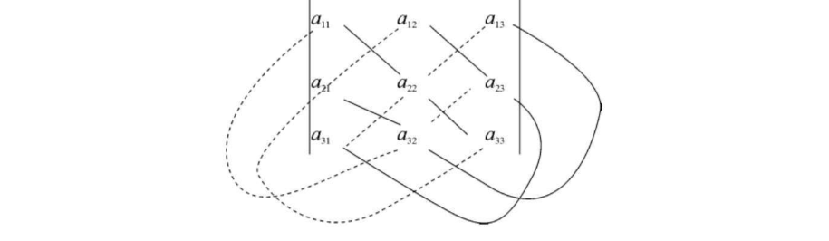

import ExerciseTrigger from '@/components/exercises/ExerciseTrigger.astro';

import Guide from '@/components/Guide.astro';
import Knowledge from '@/components/Knowledge.astro';
import Example from '@/components/Example.astro';
import Analysis from '@/components/Analysis.astro';
import Solution from '@/components/Solution.astro';
import Variant from '@/components/Variant.astro';
import Note from '@/components/Note.astro';
import SideNote from '@/components/SideNote.astro';
import Block from '@/components/Block.astro';
import Method from '@/components/Method.astro';
import Exercise from '@/components/Exercise.astro';

行列式是由解线性方程组产生的，是线性代数学中的一个重要基本概念，它作为一种重要的数学工具，在自然科学的许多领域内都有广泛的应用。本节首先介绍二、三阶行列式，然后介绍 $n$ 阶行列式的定义、性质和计算方法，最后介绍用 $n$ 阶行列式求解 $n$ 元线性方程组的克拉默（Cramer）法则。

## 一、二阶行列式

设有二元一次方程组

$$
\begin{cases}
a_{11} x_1 + a_{12} x_2 = b_1, \\
a_{21} x_1 + a_{22} x_2 = b_2.
\end{cases} \tag{1.1}
$$

其中 $x_1, x_2$ 为未知量；$a_{11}, a_{12}, a_{21}, a_{22}$ 为未知量的系数；$b_1, b_2$ 为常数项。当 $a_{11} a_{22} - a_{12} a_{21} \neq 0$ 时，由消元法可得方程组 (1.1) 的唯一解为

$$
x_1 = \frac{a_{22} b_1 - a_{12} b_2}{a_{11} a_{22} - a_{12} a_{21}}, \quad x_2 = \frac{a_{11} b_2 - a_{21} b_1}{a_{11} a_{22} - a_{12} a_{21}}. \tag{1.2}
$$

为了便于叙述和记忆，引入记号

<Knowledge title="定义 1.1 二阶行列式">

表达式

$$
D = \begin{vmatrix}
a_{11} & a_{12} \\
a_{21} & a_{22}
\end{vmatrix} = a_{11} a_{22} - a_{12} a_{21} \tag{1.3}
$$

称为**二阶行列式**，简记为 $D = \det(a_{ij})$。

数 $a_{ij}$ ($i = 1, 2; j = 1, 2$) 称为行列式的**元素**。元素 $a_{ij}$ 的第一个下标 $i$ 称为**行标**，表明该元素位于第 $i$ 行；第二个下标 $j$ 称为**列标**，表明该元素位于第 $j$ 列。

</Knowledge>

<SideNote title="对角线法则">
上述二阶行列式可用**对角线法则**来记忆：二阶行列式是两项的代数和，第一项是从左上角到右下角的主对角线上两元素的乘积，带正号；第二项是从右上角到左下角的副对角线上两元素的乘积，带负号。
</SideNote>

按此法则，记

$$
D_1 = \begin{vmatrix}
b_1 & a_{12} \\
b_2 & a_{22}
\end{vmatrix} = b_1 a_{22} - a_{12} b_2, \quad D_2 = \begin{vmatrix}
a_{11} & b_1 \\
a_{21} & b_2
\end{vmatrix} = a_{11} b_2 - b_1 a_{21}.
$$

其中 $D_i$ ($i = 1, 2$) 表示把 $D$ 中第 $i$ 列换成式 (1.1) 右边的常数项所得到的行列式。

于是，当 $D \neq 0$ 时，二元线性方程组 (1.1) 的解就可唯一地表示为

$$
x_1 = \frac{\begin{vmatrix} b_1 & a_{12} \\ b_2 & a_{22} \end{vmatrix}}{\begin{vmatrix} a_{11} & a_{12} \\ a_{21} & a_{22} \end{vmatrix}} = \frac{D_1}{D}, \quad x_2 = \frac{\begin{vmatrix} a_{11} & b_1 \\ a_{21} & b_2 \end{vmatrix}}{\begin{vmatrix} a_{11} & a_{12} \\ a_{21} & a_{22} \end{vmatrix}} = \frac{D_2}{D}. \tag{1.4}
$$

<Example title="例 1 解方程组">

解方程组

$$
\begin{cases}
2x_1 - 3x_2 = 5, \\
2x_1 + 5x_2 = -3.
\end{cases}
$$

</Example>

<Solution title="解">

由于分母行列式即方程组的系数行列式为

$$
D = \begin{vmatrix}
2 & -3 \\
2 & 5
\end{vmatrix} = 2 \times 5 - (-3) \times 2 = 16 \neq 0.
$$

$x_1$ 的分子行列式为

$$
D_1 = \begin{vmatrix}
5 & -3 \\
-3 & 5
\end{vmatrix} = 5 \times 5 - (-3) \times (-3) = 16.
$$

$x_2$ 的分子行列式为

$$
D_2 = \begin{vmatrix}
2 & 5 \\
2 & -3
\end{vmatrix} = 2 \times (-3) - 5 \times 2 = -16.
$$

于是根据二元一次方程组的求解公式 (1.4)，可得方程组的唯一解：

$$
x_1 = \frac{16}{16} = 1, \quad x_2 = \frac{-16}{16} = -1.
$$

</Solution>

## 二、三阶行列式

设有三元线性方程组

$$
\begin{cases}
a_{11} x_1 + a_{12} x_2 + a_{13} x_3 = b_1, \\
a_{21} x_1 + a_{22} x_2 + a_{23} x_3 = b_2, \\
a_{31} x_1 + a_{32} x_2 + a_{33} x_3 = b_3.
\end{cases} \tag{1.5}
$$

可以由前两个方程消去 $x_3$，得到一个只含有 $x_1, x_2$ 的方程；同样，可由后两个方程消去 $x_3$，得到一个只含有 $x_1, x_2$ 的方程，对这两个新的方程，再利用求解二元一次方程组的方法消去 $x_2$，就可以解得

$$
(a_{11} a_{22} a_{33} + a_{12} a_{23} a_{31} + a_{13} a_{21} a_{32} - a_{13} a_{22} a_{31} - a_{12} a_{21} a_{33} - a_{11} a_{23} a_{32}) x_1
$$

$$
= b_1 a_{22} a_{33} + b_3 a_{12} a_{23} + b_2 a_{13} a_{32} - b_3 a_{22} a_{13} - b_2 a_{12} a_{33} - b_1 a_{23} a_{32}.
$$

把 $x_1$ 的系数记为

<Knowledge title="定义 1.2 三阶行列式">

数表记号

$$
D = \begin{vmatrix}
a_{11} & a_{12} & a_{13} \\
a_{21} & a_{22} & a_{23} \\
a_{31} & a_{32} & a_{33}
\end{vmatrix} \tag{1.6}
$$

$$
= a_{11} a_{22} a_{33} + a_{12} a_{23} a_{31} + a_{13} a_{21} a_{32} - a_{13} a_{22} a_{31} - a_{12} a_{21} a_{33} - a_{11} a_{23} a_{32}.
$$

称为**三阶行列式**。

</Knowledge>

从这个定义可以看出，三阶行列式表示 6 项的代数和，每一项都是 3 个数的乘积冠以适当的正负号，这 3 个数取自 $D$ 中不同的行和不同的列。反之，任意取自 $D$ 中不同的行和不同的列的 3 个数的乘积冠以适当的正负号后都是 $D$ 的展开式中的某一顶。

<SideNote title="三阶对角线展开法则">
如图 1.1 所示，各实线联结的三个元素的乘积前面带“$+$”号，各虚线联结的三个元素的乘积前面带“$-$”号。
</SideNote>

<figure class="vp-figure">
  
  <figcaption>图 1.1 三阶行列式的对角线展开法则</figcaption>
</figure>

称式 (1.6) 中的 $D$ 为三元线性方程组 (1.5) 的系数行列式。根据三阶行列式的定义，有

$$
D_1 = \begin{vmatrix}
b_1 & a_{12} & a_{13} \\
b_2 & a_{22} & a_{23} \\
b_3 & a_{32} & a_{33}
\end{vmatrix} = b_1 a_{22} a_{33} + b_3 a_{12} a_{23} + b_2 a_{13} a_{32} - b_3 a_{22} a_{13} - b_2 a_{12} a_{33} - b_1 a_{23} a_{32}.
$$

若 $D \neq 0$，则 $x_1$ 可表示为

$$
x_1 = \frac{D_1}{D}.
$$

同理可得

$$
x_2 = \frac{D_2}{D}, \quad x_3 = \frac{D_3}{D}.
$$

其中

$$
D_2 = \begin{vmatrix}
a_{11} & b_1 & a_{13} \\
a_{21} & b_2 & a_{23} \\
a_{31} & b_3 & a_{33}
\end{vmatrix}, \quad D_3 = \begin{vmatrix}
a_{11} & a_{12} & b_1 \\
a_{21} & a_{22} & b_2 \\
a_{31} & a_{32} & b_3
\end{vmatrix}.
$$

$D_i$ ($i = 1, 2, 3$) 是把系数行列式 $D$ 的第 $i$ 列用线性方程组 (1.5) 右边的常数列替换后得到的行列式。

<Example title="例 2 解三元线性方程组">

解三元线性方程组

$$
\begin{cases}
3x_1 + x_2 + x_3 = 8, \\
x_1 + x_2 + x_3 = 6, \\
x_1 + 2x_2 + x_3 = 8.
\end{cases}
$$

</Example>

<Solution title="解">

用对角线法则计算行列式，得系数行列式

$$
D = \begin{vmatrix}
3 & 1 & 1 \\
1 & 1 & 1 \\
1 & 2 & 1
\end{vmatrix} = 3 \times 1 \times 1 + 1 \times 1 \times 1 + 1 \times 2 \times 1 - 1 \times 1 \times 1 - 1 \times 2 \times 3 - 1 \times 1 \times 1 = -2.
$$

分子行列式分别为

$$
D_1 = \begin{vmatrix}
8 & 1 & 1 \\
6 & 1 & 1 \\
8 & 2 & 1
\end{vmatrix} = -2, \quad D_2 = \begin{vmatrix}
3 & 8 & 1 \\
1 & 6 & 1 \\
1 & 8 & 1
\end{vmatrix} = -4, \quad D_3 = \begin{vmatrix}
3 & 1 & 8 \\
1 & 1 & 6 \\
1 & 2 & 8
\end{vmatrix} = -6.
$$

因此线性方程组的解为

$$
x_1 = \frac{D_1}{D} = 1, \quad x_2 = \frac{D_2}{D} = 2, \quad x_3 = \frac{D_3}{D} = 3.
$$

</Solution>

<Example title="例 3 特殊三阶行列式">

证明特殊三阶行列式计算公式：

$$
\begin{vmatrix}
a & * & * \\
0 & b & * \\
0 & 0 & c
\end{vmatrix} = \begin{vmatrix}
a & 0 & 0 \\
* & b & 0 \\
* & * & c
\end{vmatrix} = abc, \quad \begin{vmatrix}
* & * & a \\
* & b & 0 \\
c & 0 & 0
\end{vmatrix} = \begin{vmatrix}
0 & 0 & a \\
0 & b & * \\
c & * & *
\end{vmatrix} = -abc.
$$

其中 $*$ 表示在这些位置上的元素可以任意取值，它们不影响行列式的值。

</Example>

<Solution title="解">

由对角线法则立得结果：
在主对角线展开中，只有主对角线上三个元素的乘积 $a \cdot b \cdot c$ 保持非零，其余 5 项均因至少包含一个 $0$ 元素而恒等于 $0$；对于副对角线形式，仅有副对角线一项乘积为非零，且带有负号，即 $-abc$。

</Solution>

<ExerciseTrigger chapter={1} section="1.1" title="1.1 二、三阶行列式 课后真题与自测练习" />
