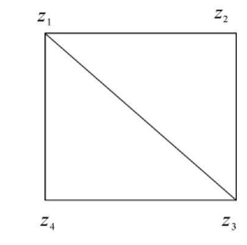

import ExerciseTrigger from '@/components/exercises/ExerciseTrigger.astro';

import Guide from '@/components/Guide.astro';
import Knowledge from '@/components/Knowledge.astro';
import Example from '@/components/Example.astro';
import Analysis from '@/components/Analysis.astro';
import Solution from '@/components/Solution.astro';
import Variant from '@/components/Variant.astro';
import Note from '@/components/Note.astro';
import SideNote from '@/components/SideNote.astro';
import Block from '@/components/Block.astro';
import Method from '@/components/Method.astro';
import Exercise from '@/components/Exercise.astro';

矩阵是一个重要的数学工具，是线性代数研究的主要内容之一，也是学习以后各章的基础。矩阵在自然科学和工程技术的各个领域都有广泛的应用。本章将介绍矩阵的概念及其运算，进而讨论矩阵的初等变换和初等矩阵。

矩阵产生于许多实际问题中，本节首先通过物资调运、通信网络、线性方程组和线性变换等实际例子引出矩阵的定义，并系统介绍常见特殊矩阵。

## 一、矩阵的实际例子

<Example title="例 1 物资调运问题">

在物资调运中，某产品从 $m$ 个产地 $x_1, x_2, \dots, x_m$ 运到 $n$ 个销地 $y_1, y_2, \dots, y_n$，其运输的数量可用下面的数表来表示：

| 产地 \ 销地 | $y_1$ | $y_2$ | $\cdots$ | $y_n$ |
| :---: | :---: | :---: | :---: | :---: |
| $x_1$ | $a_{11}$ | $a_{12}$ | $\cdots$ | $a_{1n}$ |
| $x_2$ | $a_{21}$ | $a_{22}$ | $\cdots$ | $a_{2n}$ |
| $\vdots$ | $\vdots$ | $\vdots$ | $\ddots$ | $\vdots$ |
| $x_m$ | $a_{m1}$ | $a_{m2}$ | $\cdots$ | $a_{mn}$ |

表中数字 $a_{ij}$ 表示由产地 $x_i$ 运到销地 $y_j$ 的数量，这个按一定次序排列的数表

$$
\begin{pmatrix}
a_{11} & a_{12} & \cdots & a_{1n} \\
a_{21} & a_{22} & \cdots & a_{2n} \\
\vdots & \vdots & \ddots & \vdots \\
a_{m1} & a_{m2} & \cdots & a_{mn}
\end{pmatrix}
$$

表示了物资的调运方案。

</Example>

<Example title="例 2 通信网络模型">

一个简单的通信网络如图 2.1 所示，$z_1, z_2, z_3, z_4$ 表示 4 个通信点，连接线表示点 $z_i$ 与点 $z_j$ 相互有通信联系，用 $a_{ij} = 1$ 表示；若无联系，则用 $a_{ij} = 0$ 表示。又假设点自身不通信，即 $a_{ii} = 0$。

<figure class="vp-figure">
  
  <figcaption>图 2.1 通信网络连通示意图</figcaption>
</figure>

该网络联系信息可用如下的数表来表示：

$$
\begin{pmatrix}
0 & 1 & 1 & 1 \\
1 & 0 & 1 & 0 \\
1 & 1 & 0 & 1 \\
1 & 0 & 1 & 0
\end{pmatrix}
$$

</Example>

<Example title="例 3 线性方程组与系数数表">

设有 $m$ 个方程、$n$ 个未知量的线性方程组

$$
\begin{cases}
a_{11}x_1 + a_{12}x_2 + \cdots + a_{1n}x_n = b_1, \\
a_{21}x_1 + a_{22}x_2 + \cdots + a_{2n}x_n = b_2, \\
\quad \vdots \\
a_{m1}x_1 + a_{m2}x_2 + \cdots + a_{mn}x_n = b_m,
\end{cases} \tag{2.1}
$$

把它的系数按原来次序排成数表

$$
\begin{pmatrix}
a_{11} & a_{12} & \cdots & a_{1n} \\
a_{21} & a_{22} & \cdots & a_{2n} \\
\vdots & \vdots & \ddots & \vdots \\
a_{m1} & a_{m2} & \cdots & a_{mn}
\end{pmatrix},
$$

常数项也排成一个数表

$$
\begin{pmatrix}
b_1 \\
b_2 \\
\vdots \\
b_m
\end{pmatrix}.
$$

有了这两个数表，线性方程组 (2.1) 就完全确定了。

</Example>

类似这种矩形排列的数表，在自然科学和工程技术等领域经常用到。在数学上，这种数表叫作**矩阵**。

## 二、矩阵的定义

<Knowledge title="定义 1 矩阵">

由 $m \times n$ 个数 $a_{ij}$（$i = 1, 2, \dots, m;\; j = 1, 2, \dots, n$）排成的一个 $m$ 行 $n$ 列的数表

$$
\begin{pmatrix}
a_{11} & a_{12} & \cdots & a_{1n} \\
a_{21} & a_{22} & \cdots & a_{2n} \\
\vdots & \vdots & \ddots & \vdots \\
a_{m1} & a_{m2} & \cdots & a_{mn}
\end{pmatrix}
$$

称为一个 $m$ 行 $n$ 列矩阵，简称 $m \times n$ 矩阵。它是一个用圆括号所围的矩形阵列。

其中 $a_{ij}$ 称为该矩阵的第 $i$ 行第 $j$ 列元素（$i = 1, 2, \dots, m;\; j = 1, 2, \dots, n$），而 $i$ 称为行标，$j$ 称为列标。第 $i$ 行与第 $j$ 列的交叉位置记为 $(i, j)$。

元素为实数的矩阵称为**实矩阵**，元素为复数的矩阵称为**复矩阵**。如无特殊说明，本书中的矩阵都指实矩阵。

通常用大写黑斜体字母 $\boldsymbol{A}, \boldsymbol{B}, \boldsymbol{C}$ 等表示矩阵。有时为了标明矩阵的行数 $m$ 和列数 $n$，也可记为 $\boldsymbol{A} = (a_{ij})_{m \times n}$ 或 $\boldsymbol{A}_{m \times n}$，有时简记作 $\boldsymbol{A} = (a_{ij})$ 或 $\boldsymbol{A}$。

</Knowledge>

## 三、几种常用的特殊矩阵

### 1. 方阵

当 $m = n$ 时，称 $\boldsymbol{A} = (a_{ij})_{n \times n}$ 为 $n$ 阶矩阵，或者称为 $n$ 阶方阵。$n$ 阶方阵是由 $n^2$ 个数排成的一个正方表。

<SideNote title="概念辨析">
方阵不是一个数，它与 $n$ 阶行列式是两个完全不同的概念。只有一阶方阵看作是一个数。
</SideNote>

在 $n$ 阶方阵中，位于对角线上的元素 $a_{11}, a_{22}, \dots, a_{nn}$ 称为此方阵的**对角元**，对角元所在的对角线称为**主对角线**。

### 2. 行矩阵与列矩阵

当 $m = 1$ 时，称

$$
\boldsymbol{A} = \begin{pmatrix} a_1 & a_2 & \cdots & a_n \end{pmatrix}
$$

为**行矩阵**，即 $1 \times n$ 矩阵。$1 \times n$ 矩阵又称为 $n$ 维行向量。为了避免元素间的混淆，行矩阵也记作 $\boldsymbol{A} = (a_1, a_2, \dots, a_n)$。

当 $n = 1$ 时，称

$$
\boldsymbol{B} = \begin{pmatrix}
b_1 \\
b_2 \\
\vdots \\
b_m
\end{pmatrix}
$$

为**列矩阵**，即 $m \times 1$ 矩阵。$m \times 1$ 矩阵又称为 $m$ 维列向量。

向量是特殊的矩阵，而且它们是非常重要的特殊矩阵。行矩阵和列矩阵也可用小写黑斜体字母 $\boldsymbol{a}, \boldsymbol{b}, \dots, \boldsymbol{x}, \boldsymbol{y}, \dots$ 来表示。

### 3. 同型矩阵与矩阵相等

如果两个矩阵的行数、列数分别相等，则称它们是**同型矩阵**。

设 $\boldsymbol{A} = (a_{ij})_{m \times n}, \boldsymbol{B} = (b_{ij})_{m \times n}$，则 $\boldsymbol{A}$ 与 $\boldsymbol{B}$ 是同型矩阵。两个同型矩阵 $\boldsymbol{A}$ 与 $\boldsymbol{B}$ 的对应元素相等，则称 $\boldsymbol{A}$ 与 $\boldsymbol{B}$ 相等，即

$$
\boldsymbol{A} = \boldsymbol{B} \iff a_{ij} = b_{ij} \quad (i = 1, 2, \dots, m;\; j = 1, 2, \dots, n).
$$

### 4. 零矩阵

元素全为零的矩阵称为**零矩阵**。用 $\boldsymbol{O}_{m \times n}$ 或者用 $\boldsymbol{O}$ 表示，有时也用 $\mathbf{0}$ 表示。即

$$
\boldsymbol{O} = \begin{pmatrix}
0 & 0 & \cdots & 0 \\
0 & 0 & \cdots & 0 \\
\vdots & \vdots & \ddots & \vdots \\
0 & 0 & \cdots & 0
\end{pmatrix}.
$$

<SideNote title="注意">
不同型的零矩阵是不相等的。
</SideNote>

### 5. 对角矩阵、数量矩阵与单位矩阵

<Knowledge title="对角矩阵">

形如

$$
\boldsymbol{\Lambda} = \begin{pmatrix}
a_{11} & 0 & \cdots & 0 \\
0 & a_{22} & \cdots & 0 \\
\vdots & \vdots & \ddots & \vdots \\
0 & 0 & \cdots & a_{nn}
\end{pmatrix} \quad \text{或} \quad \boldsymbol{\Lambda} = \begin{pmatrix}
a_{11} & & & \\
& a_{22} & & \\
& & \ddots & \\
& & & a_{nn}
\end{pmatrix}
$$

的方阵，称为**对角矩阵**（或对角阵），记作 $\boldsymbol{\Lambda} = \operatorname{diag}(a_{11}, a_{22}, \dots, a_{nn})$。

</Knowledge>

<SideNote title="说明">
对角矩阵必须是方阵。
</SideNote>

<Knowledge title="数量矩阵与单位矩阵">

当对角矩阵的主对角线上的元素都相同时，称它为**数量矩阵**。$n$ 阶数量矩阵具有如下形式：

$$
\begin{pmatrix}
a & 0 & \cdots & 0 \\
0 & a & \cdots & 0 \\
\vdots & \vdots & \ddots & \vdots \\
0 & 0 & \cdots & a
\end{pmatrix} \quad \text{或} \quad \begin{pmatrix}
a & & & \\
& a & & \\
& & \ddots & \\
& & & a
\end{pmatrix}.
$$

特别当 $a = 1$ 时，称它为 $n$ 阶**单位矩阵**。$n$ 阶单位矩阵记为 $\boldsymbol{E}_n$ 或 $\boldsymbol{I}_n$，即

$$
\boldsymbol{E}_n = \begin{pmatrix}
1 & 0 & \cdots & 0 \\
0 & 1 & \cdots & 0 \\
\vdots & \vdots & \ddots & \vdots \\
0 & 0 & \cdots & 1
\end{pmatrix} \quad \text{或} \quad \boldsymbol{E}_n = \begin{pmatrix}
1 & & & \\
& 1 & & \\
& & \ddots & \\
& & & 1
\end{pmatrix}.
$$

在不会引起混淆时，也可以用 $\boldsymbol{E}$ 或 $\boldsymbol{I}$ 表示单位矩阵。$n$ 阶数量矩阵常用 $a\boldsymbol{E}_n$ 或 $a\boldsymbol{I}_n$ 表示。

</Knowledge>

### 6. 三角矩阵

形如

$$
\begin{pmatrix}
a_{11} & a_{12} & \cdots & a_{1n} \\
0 & a_{22} & \cdots & a_{2n} \\
\vdots & \vdots & \ddots & \vdots \\
0 & 0 & \cdots & a_{nn}
\end{pmatrix}, \qquad \begin{pmatrix}
a_{11} & 0 & \cdots & 0 \\
a_{21} & a_{22} & \cdots & 0 \\
\vdots & \vdots & \ddots & \vdots \\
a_{n1} & a_{n2} & \cdots & a_{nn}
\end{pmatrix}
$$

的矩阵分别称为**上三角矩阵**和**下三角矩阵**。

<SideNote title="性质">
一个方阵是对角矩阵当且仅当它既是上三角矩阵，又是下三角矩阵。
</SideNote>

## 四、线性变换与矩阵的联系

在许多实际问题中，经常遇到一些变量要用另一些变量线性表示。设一组变量 $y_1, y_2, \dots, y_n$ 用另一组变量 $x_1, x_2, \dots, x_n$ 线性表示为

$$
\begin{cases}
y_1 = a_{11}x_1 + a_{12}x_2 + \cdots + a_{1n}x_n, \\
y_2 = a_{21}x_1 + a_{22}x_2 + \cdots + a_{2n}x_n, \\
\quad \vdots \\
y_n = a_{n1}x_1 + a_{n2}x_2 + \cdots + a_{nn}x_n,
\end{cases} \tag{2.2}
$$

把这种从一组变量 $x_1, x_2, \dots, x_n$ 到另一组变量 $y_1, y_2, \dots, y_n$ 的变换叫作**线性变换**。

给定了线性变换 (2.2)，它的系数所构成的矩阵也就随之确定；反之，如果给出一个 $n \times n$ 矩阵，则可构造出线性变换 (2.2)，即线性变换也就确定。在这个意义上，线性变换和矩阵之间存在着一一对应关系，因而可利用矩阵来研究线性变换。

<Example title="例 4 线性变换与对角阵、单位阵">

线性变换

$$
\begin{cases}
y_1 = \lambda_1 x_1, \\
y_2 = \lambda_2 x_2, \\
\quad \vdots \\
y_n = \lambda_n x_n,
\end{cases} \tag{2.3}
$$

对应 $n$ 阶对角矩阵

$$
\boldsymbol{\Lambda} = \begin{pmatrix}
\lambda_1 & & & \\
& \lambda_2 & & \\
& & \ddots & \\
& & & \lambda_n
\end{pmatrix}.
$$

当 $\lambda_1 = \lambda_2 = \cdots = \lambda_n = 1$ 时，称线性变换 (2.3) 为**恒等变换**，恒等变换对应单位矩阵 $\boldsymbol{E}$。

</Example>

<ExerciseTrigger chapter={2} section="2.1" title="2.1 矩阵的概念 课后真题与自测练习" />
