import ExerciseTrigger from '@/components/exercises/ExerciseTrigger.astro';

import Guide from '@/components/Guide.astro';
import Knowledge from '@/components/Knowledge.astro';
import Example from '@/components/Example.astro';
import Analysis from '@/components/Analysis.astro';
import Solution from '@/components/Solution.astro';
import Variant from '@/components/Variant.astro';
import Note from '@/components/Note.astro';
import SideNote from '@/components/SideNote.astro';
import Block from '@/components/Block.astro';
import Method from '@/components/Method.astro';
import Exercise from '@/components/Exercise.astro';

在平面解析几何中，通过坐标法把平面上的点与一对有序的数对应起来，把平面上的图形和方程对应起来，从而可以用代数方法来研究几何问题。空间解析几何也是按照类似的方法建立起来的，通过坐标法把空间上的点与一个有序的三元数组对应起来，把几何空间的性质数量化，把几何问题转化为代数问题，从而可以用代数方法来研究几何问题。自然界中有一类量要用大小和方向两个要素来描述，这类量叫向量，将向量法和坐标法结合能使某些几何问题迎刃而解。

本章先引入向量的概念，根据向量的线性运算建立空间坐标系，然后利用坐标讨论向量的运算，并介绍空间直线与平面的内容。本节包括向量的概念、向量的线性运算；向量的共线、共面问题；向量、点、坐标之间的一一对应。

## 一、向量的概念

<Knowledge title="定义 1 向量与模">

既有大小、又有方向的量称为**向量**或**矢量**。

在几何上，向量可以用一个有向线段来表示。设给定空间两点 $A, B$，以 $A$ 为起点，$B$ 为终点，这就确定了向量的方向，而 $A, B$ 两点间直线段的长度确定了向量的大小，这个向量记作 $\overrightarrow{AB}$。向量 $\overrightarrow{AB}$ 的大小也称为 $\overrightarrow{AB}$ 的**长度**或**模**，记作 $|\overrightarrow{AB}|$。

通常用黑体希腊字母 $\boldsymbol{\alpha}, \boldsymbol{\beta}, \boldsymbol{\gamma}, \dots$ 或小写黑体拉丁字母 $\boldsymbol{a}, \boldsymbol{b}, \boldsymbol{c}, \dots$ 表示向量。

</Knowledge>

<SideNote title="自由向量">
解析几何中所说的向量只考虑它的大小和方向而不计较它的起点的位置，因此它可以平行移动，这种向量称为**自由向量**。
</SideNote>

<figure class="vp-figure">
  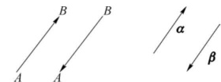
  <figcaption>图 3.1 相等向量与相反向量示意图</figcaption>
</figure>

如果两个向量 $\boldsymbol{\alpha}$ 和 $\boldsymbol{\beta}$ 的大小相等，方向相同，则称这两个向量**相等**，记作 $\boldsymbol{\alpha} = \boldsymbol{\beta}$。

如果两个向量 $\boldsymbol{\alpha}$ 和 $\boldsymbol{\beta}$ 的大小相等，方向相反，则称 $\boldsymbol{\beta}$ 是 $\boldsymbol{\alpha}$ 的**负向量**，记作 $\boldsymbol{\beta} = -\boldsymbol{\alpha}$。显然 $\overrightarrow{BA} = -\overrightarrow{AB}$，如图 3.1 所示。

长度为 0 的向量称为**零向量**，即起点与终点重合的向量，记作 $\mathbf{0}$，它的方向可以看作是任意的。

长度为 1 的向量叫作**单位向量**。任意非零向量 $\boldsymbol{\alpha}$ 的单位向量为

$$
\boldsymbol{\alpha}_0 = \frac{\boldsymbol{\alpha}}{|\boldsymbol{\alpha}|}
$$

故 $\boldsymbol{\alpha} = |\boldsymbol{\alpha}|\boldsymbol{\alpha}_0$。

两个非零向量如果它们的方向相同或者相反，就称这两个向量**平行**，记作 $\boldsymbol{\alpha} // \boldsymbol{\beta}$。由于零向量的方向可以看作是任意的，因此可以认为零向量与任何向量都平行。

当两个平行向量的起点放在同一点时，它们的终点和公共起点应在一条直线上，因此，两向量平行，又称两向量**共线**。

设有 $k\,(k \ge 3)$ 个向量，当把它们的起点放在同一点时，如果 $k$ 个终点和公共起点在一个平面上，就称这 $k$ 个向量**共面**。

## 二、向量的线性运算

### 1. 向量的加减法

在物理中，一个质点从点 $O$ 出发经过位移 $\boldsymbol{\alpha}$ 到达点 $A$，再从点 $A$ 经过位移 $\boldsymbol{\beta}$ 到达点 $B$，其结果等于从点 $O$ 出发位移到点 $B$。这个位移 $\overrightarrow{OB}$ 称为位移 $\boldsymbol{\alpha}$ 与 $\boldsymbol{\beta}$ 的和。

<Knowledge title="定义 2 向量加法的三角形法则">

设有两个向量 $\boldsymbol{\alpha}$ 和 $\boldsymbol{\beta}$，任取一点 $O$ 作向量 $\overrightarrow{OA} = \boldsymbol{\alpha}$，再以 $A$ 为起点作向量 $\overrightarrow{AB} = \boldsymbol{\beta}$，连接 $OB$，则向量 $\overrightarrow{OB} = \boldsymbol{\gamma}$，称为向量 $\boldsymbol{\alpha}$ 与 $\boldsymbol{\beta}$ 的**和**，记为 $\boldsymbol{\alpha} + \boldsymbol{\beta}$，即

$$
\boldsymbol{\gamma} = \boldsymbol{\alpha} + \boldsymbol{\beta}
$$

这样作出两个向量之和的方法叫作向量相加的**三角形法则**。

</Knowledge>

<figure class="vp-figure">
  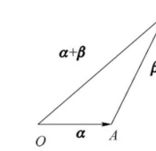
  <figcaption>图 3.2 向量加法的三角形法则</figcaption>
</figure>

<Knowledge title="定义 3 向量加法的平行四边形法则">

从一点 $O$ 作向量 $\overrightarrow{OA} = \boldsymbol{\alpha}, \overrightarrow{OB} = \boldsymbol{\beta}$，再以 $OA, OB$ 为邻边作平行四边形 $OACB$，称向量 $\overrightarrow{OC} = \boldsymbol{\gamma}$ 为向量 $\boldsymbol{\alpha}$ 与 $\boldsymbol{\beta}$ 的和，记作

$$
\boldsymbol{\gamma} = \overrightarrow{OC} = \overrightarrow{OA} + \overrightarrow{OB} = \boldsymbol{\alpha} + \boldsymbol{\beta}
$$

这称为向量加法的**平行四边形法则**。

</Knowledge>

<figure class="vp-figure">
  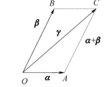
  <figcaption>图 3.3 向量加法的平行四边形法则</figcaption>
</figure>

<Knowledge title="向量的加法性质">

(1) 交换律：$\boldsymbol{\alpha} + \boldsymbol{\beta} = \boldsymbol{\beta} + \boldsymbol{\alpha}$；

(2) 结合律：$(\boldsymbol{\alpha} + \boldsymbol{\beta}) + \boldsymbol{\gamma} = \boldsymbol{\alpha} + (\boldsymbol{\beta} + \boldsymbol{\gamma})$；

(3) 零向量律：$\boldsymbol{\alpha} + \mathbf{0} = \mathbf{0} + \boldsymbol{\alpha} = \boldsymbol{\alpha}$；

(4) 逆元素律：$\boldsymbol{\alpha} + (-\boldsymbol{\alpha}) = (-\boldsymbol{\alpha}) + \boldsymbol{\alpha} = \mathbf{0}$。

</Knowledge>

<figure class="vp-figure">
  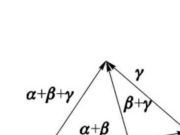
  <figcaption>图 3.4 向量加法结合律空间示意图</figcaption>
</figure>

由于向量的加法满足结合律，三个向量 $\boldsymbol{\alpha}, \boldsymbol{\beta}, \boldsymbol{\gamma}$ 之和可简记为 $\boldsymbol{\alpha} + \boldsymbol{\beta} + \boldsymbol{\gamma}$，而不必用括号来表示运算的顺序。$n$ 个向量 $\boldsymbol{\alpha}_1, \boldsymbol{\alpha}_2, \dots, \boldsymbol{\alpha}_n\,(n \ge 3)$ 之和简记为

$$
\sum_{i=1}^n \boldsymbol{\alpha}_i = \boldsymbol{\alpha}_1 + \boldsymbol{\alpha}_2 + \dots + \boldsymbol{\alpha}_n
$$

并按向量相加的三角形法则，可得 $n$ 个向量相加的多边形法则：作 $\overrightarrow{OA}_1 = \boldsymbol{\alpha}_1$，再由点 $A_1$ 作 $\overrightarrow{A_1 A_2} = \boldsymbol{\alpha}_2, \dots$，最后由 $\boldsymbol{\alpha}_{n-1}$ 的终点 $A_{n-1}$ 作 $\overrightarrow{A_{n-1} A_n} = \boldsymbol{\alpha}_n$，则向量

$$
\overrightarrow{OA}_n = \sum_{i=1}^n \boldsymbol{\alpha}_i
$$

例如在图 3.5 中，$\boldsymbol{\beta} = \boldsymbol{\alpha}_1 + \boldsymbol{\alpha}_2 + \dots + \boldsymbol{\alpha}_5$。

<figure class="vp-figure">
  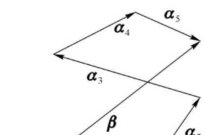
  <figcaption>图 3.5 向量加法的多边形法则</figcaption>
</figure>

<Knowledge title="定义 4 向量的减法">

向量 $\boldsymbol{\alpha}$ 和 $\boldsymbol{\beta}$ 的差（减法）规定为

$$
\boldsymbol{\alpha} - \boldsymbol{\beta} = \boldsymbol{\alpha} + (-\boldsymbol{\beta})
$$

按三角形法则，当向量 $\boldsymbol{\alpha}$ 与 $\boldsymbol{\beta}$ 的起点重合时，由 $\boldsymbol{\beta}$ 的终点指向 $\boldsymbol{\alpha}$ 的终点的向量即为 $\boldsymbol{\alpha} - \boldsymbol{\beta}$。

</Knowledge>

<figure class="vp-figure">
  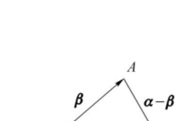
  <figcaption>图 3.6 向量减法三角形法则</figcaption>
</figure>

### 2. 向量与数的乘法

<Knowledge title="定义 5 向量的数乘">

向量 $\boldsymbol{\alpha}$ 与实数 $\lambda$ 相乘是一个向量，记作 $\lambda\boldsymbol{\alpha}$。它的模为

$$
|\lambda\boldsymbol{\alpha}| = |\lambda||\boldsymbol{\alpha}|
$$

当 $\lambda > 0$ 时它的方向与 $\boldsymbol{\alpha}$ 相同；当 $\lambda < 0$ 时与 $\boldsymbol{\alpha}$ 相反；当 $\lambda = 0$ 时，$|\lambda\boldsymbol{\alpha}| = 0$，即 $\lambda\boldsymbol{\alpha} = \mathbf{0}$，这时它的方向可以是任意的。

</Knowledge>

由上述定义可知：$\lambda\boldsymbol{\alpha} = \mathbf{0}$ 的充分必要条件是 $\boldsymbol{\alpha} = \mathbf{0}$ 或 $\lambda = 0$。特别地，当 $\lambda = -1$ 时，有 $(-1)\boldsymbol{\alpha} = -\boldsymbol{\alpha}$。

<Knowledge title="向量数乘的性质">

(1) $1 \cdot \boldsymbol{\alpha} = \boldsymbol{\alpha}$；

(2) $k(l\boldsymbol{\alpha}) = (kl)\boldsymbol{\alpha}, \quad \forall k, l \in \mathbb{R}$；

(3) $(k+l)\boldsymbol{\alpha} = k\boldsymbol{\alpha} + l\boldsymbol{\alpha}$；

(4) $k(\boldsymbol{\alpha} + \boldsymbol{\beta}) = k\boldsymbol{\alpha} + k\boldsymbol{\beta}$。

</Knowledge>

向量加法与数乘统称为向量的**线性运算**。

<Knowledge title="定理 1 两向量共线的充要条件">

两个向量 $\boldsymbol{\alpha}, \boldsymbol{\beta}$ 共线的充分必要条件是存在不全为零的数 $\lambda, \mu$，使

$$
\lambda\boldsymbol{\alpha} + \mu\boldsymbol{\beta} = \mathbf{0}
$$

</Knowledge>

<Solution title="证明">

**必要性**：若 $\boldsymbol{\alpha} \neq \mathbf{0}$，则 $|\boldsymbol{\alpha}| \neq 0$。由于 $\boldsymbol{\alpha}, \boldsymbol{\beta}$ 共线，取 $|\lambda| = \frac{|\boldsymbol{\beta}|}{|\boldsymbol{\alpha}|}$，当 $\boldsymbol{\beta}$ 与 $\boldsymbol{\alpha}$ 同向时 $\lambda$ 取正值，当 $\boldsymbol{\beta}$ 与 $\boldsymbol{\alpha}$ 反向时 $\lambda$ 取负值，即有 $\boldsymbol{\beta} = \lambda\boldsymbol{\alpha}$。这是因为此时 $\boldsymbol{\beta}$ 与 $\lambda\boldsymbol{\alpha}$ 同向，且

$$
|\lambda\boldsymbol{\alpha}| = |\lambda||\boldsymbol{\alpha}| = \frac{|\boldsymbol{\beta}|}{|\boldsymbol{\alpha}|}|\boldsymbol{\alpha}| = |\boldsymbol{\beta}|
$$

取 $\mu = -1$，则 $\lambda\boldsymbol{\alpha} + \mu\boldsymbol{\beta} = \mathbf{0}$。若 $\boldsymbol{\alpha} = \mathbf{0}$，则显然有 $1 \cdot \boldsymbol{\alpha} + 0 \cdot \boldsymbol{\beta} = \mathbf{0}$。

**充分性**：设存在不全为零的数 $\lambda, \mu$，使 $\lambda\boldsymbol{\alpha} + \mu\boldsymbol{\beta} = \mathbf{0}$。不妨设 $\lambda \neq 0$，则 $\boldsymbol{\alpha} = -\frac{\mu}{\lambda}\boldsymbol{\beta}$。由数乘的定义可知，$\boldsymbol{\alpha}$ 与 $\boldsymbol{\beta}$ 共线。

</Solution>

<Knowledge title="定理 2 三向量共面的充要条件">

三个向量 $\boldsymbol{\alpha}, \boldsymbol{\beta}, \boldsymbol{\gamma}$ 共面的充分必要条件是存在不全为零的数 $k_1, k_2, k_3$，使

$$
k_1\boldsymbol{\alpha} + k_2\boldsymbol{\beta} + k_3\boldsymbol{\gamma} = \mathbf{0}
$$

</Knowledge>

<figure class="vp-figure">
  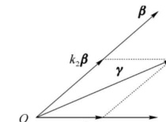
  <figcaption>图 3.7 共面向量的分解定理</figcaption>
</figure>

<Solution title="证明">

**必要性**：若 $\boldsymbol{\alpha}, \boldsymbol{\beta}, \boldsymbol{\gamma}$ 中有两个共线，不妨设 $\boldsymbol{\alpha} // \boldsymbol{\beta}$，由定理 1 可知，存在不全为零的数 $k_1, k_2$ 使 $k_1\boldsymbol{\alpha} + k_2\boldsymbol{\beta} = \mathbf{0}$，故 $k_1\boldsymbol{\alpha} + k_2\boldsymbol{\beta} + 0 \cdot \boldsymbol{\gamma} = \mathbf{0}$ 成立，其中 $k_1, k_2, 0$ 仍不全为零。

若 $\boldsymbol{\alpha}, \boldsymbol{\beta}, \boldsymbol{\gamma}$ 均不共线，但 $\boldsymbol{\alpha}, \boldsymbol{\beta}, \boldsymbol{\gamma}$ 共面，由三角形法则及数乘定义可知（图 3.7）

$$
\boldsymbol{\gamma} = k_1\boldsymbol{\alpha} + k_2\boldsymbol{\beta}, \quad k_1, k_2 \in \mathbb{R}
$$

于是成立

$$
k_1\boldsymbol{\alpha} + k_2\boldsymbol{\beta} - \boldsymbol{\gamma} = \mathbf{0}
$$

其中 $k_1, k_2, -1$ 不全为零。

**充分性**：若存在不全为零的数 $k_1, k_2, k_3$，使 $k_1\boldsymbol{\alpha} + k_2\boldsymbol{\beta} + k_3\boldsymbol{\gamma} = \mathbf{0}$。不妨设 $k_3 \neq 0$，则

$$
\boldsymbol{\gamma} = -\frac{k_1}{k_3}\boldsymbol{\alpha} - \frac{k_2}{k_3}\boldsymbol{\beta}
$$

这说明 $\boldsymbol{\gamma}$ 是以 $-\frac{k_1}{k_3}\boldsymbol{\alpha}, -\frac{k_2}{k_3}\boldsymbol{\beta}$ 为边的平行四边形的对角线，故 $\boldsymbol{\alpha}, \boldsymbol{\beta}, \boldsymbol{\gamma}$ 共面。

</Solution>

<Knowledge title="推论 共面向量分解定理">

设向量 $\boldsymbol{\alpha}, \boldsymbol{\beta}$ 不共线，若 $\boldsymbol{\alpha}, \boldsymbol{\beta}, \boldsymbol{\gamma}$ 共面，则存在唯一的实数组 $k_1, k_2$，使

$$
\boldsymbol{\gamma} = k_1\boldsymbol{\alpha} + k_2\boldsymbol{\beta}
$$

</Knowledge>

<figure class="vp-figure">
  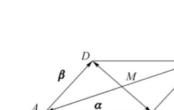
  <figcaption>图 3.8 平行四边形对角线向量分解</figcaption>
</figure>

<Example title="例 1 平行四边形中点向量">

在平行四边形 $ABCD$ 中，设 $\overrightarrow{AB} = \boldsymbol{\alpha}, \overrightarrow{AD} = \boldsymbol{\beta}$。试用 $\boldsymbol{\alpha}, \boldsymbol{\beta}$ 表示向量 $\overrightarrow{MA}, \overrightarrow{MB}, \overrightarrow{MC}$ 和 $\overrightarrow{MD}$，这里 $M$ 是平行四边形对角线的交点（图 3.8）。

</Example>

<Solution title="解">

由于平行四边形的对角线互相平分，所以

$$
\boldsymbol{\alpha} + \boldsymbol{\beta} = \overrightarrow{AC} = 2\overrightarrow{AM}
$$

即

$$
-(\boldsymbol{\alpha} + \boldsymbol{\beta}) = 2\overrightarrow{MA}
$$

于是

$$
\overrightarrow{MA} = -\frac{1}{2}(\boldsymbol{\alpha} + \boldsymbol{\beta})
$$

因为 $\overrightarrow{MC} = -\overrightarrow{MA}$，所以

$$
\overrightarrow{MC} = \frac{1}{2}(\boldsymbol{\alpha} + \boldsymbol{\beta})
$$

又因 $-\boldsymbol{\alpha} + \boldsymbol{\beta} = \overrightarrow{BD} = 2\overrightarrow{MD}$，所以

$$
\overrightarrow{MD} = \frac{1}{2}(-\boldsymbol{\alpha} + \boldsymbol{\beta})
$$

由于 $\overrightarrow{MB} = -\overrightarrow{MD}$，所以

$$
\overrightarrow{MB} = \frac{1}{2}(\boldsymbol{\alpha} - \boldsymbol{\beta})
$$

</Solution>

<figure class="vp-figure">
  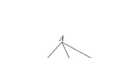
  <figcaption>图 3.9 三角形中线向量表示</figcaption>
</figure>

<Example title="例 2 三角形中线向量">

设 $\triangle ABC$ 中，$D$ 是 $BC$ 边的中点（图 3.9），证明：

$$
\overrightarrow{AD} = \frac{1}{2}(\overrightarrow{AB} + \overrightarrow{AC})
$$

</Example>

<Solution title="证明">

由三角形法则可知，

$$
\overrightarrow{AD} = \overrightarrow{AB} + \overrightarrow{BD} \tag{3.1}
$$

$$
\overrightarrow{AD} = \overrightarrow{AC} + \overrightarrow{CD} \tag{3.2}
$$

由于 $D$ 是 $BC$ 边的中点，故 $\overrightarrow{BD} = -\overrightarrow{CD}$。式 (3.1) 与式 (3.2) 两边同时相加，得

$$
2\overrightarrow{AD} = \overrightarrow{AB} + \overrightarrow{AC}
$$

即

$$
\overrightarrow{AD} = \frac{1}{2}(\overrightarrow{AB} + \overrightarrow{AC})
$$

</Solution>

## 三、空间直角坐标系

<Knowledge title="定义 6 空间直角坐标系">

在空间取定一点 $O$ 称为**原点**，再取过 $O$ 点的三条两两相互垂直的有向直线，这三条有向直线的正向单位向量分别为 $\boldsymbol{i}, \boldsymbol{j}, \boldsymbol{k}$，三条有向直线称为**坐标轴**，依次记为 $x$ 轴、$y$ 轴、$z$ 轴。这样就建立起空间直角坐标系，称为 $Oxyz$ 坐标系。

</Knowledge>

通常把 $x$ 轴和 $y$ 轴配置在水平面上，而 $z$ 轴则是铅垂线；它们的正向通常符合**右手规则**，即以右手握住 $z$ 轴，当右手的四个手指从 $x$ 轴正向以 $\frac{\pi}{2}$ 角度转向 $y$ 轴正向时，大拇指的指向就是 $z$ 轴的正向。

三条坐标轴中的任意两条可以确定一个平面，这样定出的三个平面统称为**坐标面**。$x$ 轴和 $y$ 轴所确定的坐标面叫作 $xOy$ 平面，另两个由 $y$ 轴和 $z$ 轴和由 $z$ 轴及 $x$ 轴所确定的坐标面，分别叫作 $yOz$ 平面和 $zOx$ 平面。

三个坐标面把空间分成八个部分，每一部分叫作一个**卦限**。含有 $x$ 轴、$y$ 轴与 $z$ 轴正半轴的那个卦限叫作第一卦限，表示为 $\mathrm{I}\,(+,+,+)$；含有 $x$ 轴负半轴、$y$ 轴与 $z$ 轴正半轴的那个卦限叫作第二卦限，表示为 $\mathrm{II}\,(-,+,+)$；类似地，八个卦限可分别表示为：

$$
\begin{aligned}
&\mathrm{I}(+,+,+), \quad \mathrm{II}(-,+,+), \quad \mathrm{III}(-,-,+), \quad \mathrm{IV}(+,-,+), \\
&\mathrm{V}(+,+,-), \quad \mathrm{VI}(-,+,-), \quad \mathrm{VII}(-,-,-), \quad \mathrm{VIII}(+,-,-)
\end{aligned}
$$

<figure class="vp-figure">
  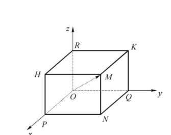
  <figcaption>图 3.10 空间直角坐标系与向量坐标分解</figcaption>
</figure>

任给一个向量 $\boldsymbol{r}$，对应有空间一点 $M$，使 $\boldsymbol{r} = \overrightarrow{OM}$。以 $OM$ 为对角线、三条坐标轴为棱作长方体 $RHMK\text{-}OPNQ$，如图 3.10 所示，有

$$
\boldsymbol{r} = \overrightarrow{OM} = \overrightarrow{OP} + \overrightarrow{PN} + \overrightarrow{NM} = \overrightarrow{OP} + \overrightarrow{OQ} + \overrightarrow{OR}
$$

设

$$
\overrightarrow{OP} = x\boldsymbol{i}, \quad \overrightarrow{OQ} = y\boldsymbol{j}, \quad \overrightarrow{OR} = z\boldsymbol{k}
$$

则

$$
\boldsymbol{r} = \overrightarrow{OM} = x\boldsymbol{i} + y\boldsymbol{j} + z\boldsymbol{k}
$$

上式称为向量 $\boldsymbol{r}$ 的**坐标分解式**，$x\boldsymbol{i}, y\boldsymbol{j}, z\boldsymbol{k}$ 称为向量 $\boldsymbol{r}$ 沿三个坐标轴方向的分向量。

给定向量 $\boldsymbol{r}$，就确定了点 $M$ 及 $\overrightarrow{OP}, \overrightarrow{OQ}, \overrightarrow{OR}$ 三个分向量，进而确定了 $x, y, z$ 三个有序数；反之，给定三个有序数 $x, y, z$，也确定了向量 $\boldsymbol{r}$ 与点 $M$。于是点 $M$、向量 $\boldsymbol{r}$ 与三个有序数 $x, y, z$ 之间有一一对应关系：

$$
M \longleftrightarrow \boldsymbol{r} = \overrightarrow{OM} = x\boldsymbol{i} + y\boldsymbol{j} + z\boldsymbol{k} \longleftrightarrow (x, y, z)
$$

据此，定义：有序数 $x, y, z$ 称为向量 $\boldsymbol{r}$ 在直角坐标系 $Oxyz$ 中的**坐标**，记作 $\boldsymbol{r} = (x, y, z)$；有序数 $x, y, z$ 也称为点 $M$ 在直角坐标系 $Oxyz$ 中的坐标，记作 $M(x, y, z)$。

向量 $\boldsymbol{r} = \overrightarrow{OM}$ 称为点 $M$ 关于原点 $O$ 的**向径**。上述定义表明，一个点与该点的向径有相同的坐标。记号 $(x, y, z)$ 既表示点 $M$，又表示向量 $\overrightarrow{OM}$。

三个单位向量 $\boldsymbol{i}, \boldsymbol{j}, \boldsymbol{k}$ 的坐标为

$$
\boldsymbol{i} = (1, 0, 0), \quad \boldsymbol{j} = (0, 1, 0), \quad \boldsymbol{k} = (0, 0, 1)
$$

## 四、利用坐标进行向量的线性运算

利用向量的坐标，可得向量的加法、减法以及向量与数的乘法运算如下：设

$$
\boldsymbol{\alpha} = (x_1, y_1, z_1), \quad \boldsymbol{\beta} = (x_2, y_2, z_2)
$$

即

$$
\boldsymbol{\alpha} = x_1\boldsymbol{i} + y_1\boldsymbol{j} + z_1\boldsymbol{k}, \quad \boldsymbol{\beta} = x_2\boldsymbol{i} + y_2\boldsymbol{j} + z_2\boldsymbol{k}
$$

利用向量加法的交换律与结合律，以及向量与数的乘法的结合律与分配律，有

$$
\boldsymbol{\alpha} \pm \boldsymbol{\beta} = (x_1 \pm x_2)\boldsymbol{i} + (y_1 \pm y_2)\boldsymbol{j} + (z_1 \pm z_2)\boldsymbol{k}
$$

$$
\lambda\boldsymbol{\alpha} = \lambda x_1\boldsymbol{i} + \lambda y_1\boldsymbol{j} + \lambda z_1\boldsymbol{k}
$$

由坐标的唯一性可知，

$$
\boldsymbol{\alpha} \pm \boldsymbol{\beta} = (x_1 \pm x_2, y_1 \pm y_2, z_1 \pm z_2)
$$

$$
\lambda\boldsymbol{\alpha} = (\lambda x_1, \lambda y_1, \lambda z_1)
$$

由此可见，对向量进行加、减及与数相乘的运算，只需对向量的各个坐标分别进行相应的数量运算就可以了。

<figure class="vp-figure">
  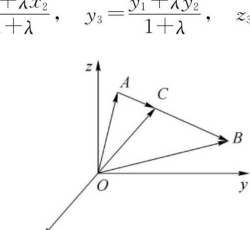
  <figcaption>图 3.11 空间定比分点示意图</figcaption>
</figure>

<Example title="例 3 空间定比分点公式">

如图 3.11 所示，设点 $A(x_1, y_1, z_1), B(x_2, y_2, z_2), C(x_3, y_3, z_3)$ 共线，而且点 $C$ 分线段 $AB$ 为两段比值为 $\lambda$，即 $\overrightarrow{AC} = \lambda\overrightarrow{CB}$，则

$$
x_3 = \frac{x_1 + \lambda x_2}{1 + \lambda}, \quad y_3 = \frac{y_1 + \lambda y_2}{1 + \lambda}, \quad z_3 = \frac{z_1 + \lambda z_2}{1 + \lambda}
$$

</Example>

<Solution title="证">

由条件可知，向量 $\overrightarrow{OA}, \overrightarrow{OB}, \overrightarrow{OC}$ 的坐标分别是 $(x_1, y_1, z_1), (x_2, y_2, z_2), (x_3, y_3, z_3)$，而

$$
\overrightarrow{OC} - \overrightarrow{OA} = \lambda(\overrightarrow{OB} - \overrightarrow{OC})
$$

即

$$
(x_3, y_3, z_3) - (x_1, y_1, z_1) = \lambda\big((x_2, y_2, z_2) - (x_3, y_3, z_3)\big)
$$

即

$$
(x_3 - x_1, y_3 - y_1, z_3 - z_1) = \big(\lambda(x_2 - x_3), \lambda(y_2 - y_3), \lambda(z_2 - z_3)\big)
$$

于是得

$$
x_3 - x_1 = \lambda(x_2 - x_3), \quad y_3 - y_1 = \lambda(y_2 - y_3), \quad z_3 - z_1 = \lambda(z_2 - z_3)
$$

解得

$$
x_3 = \frac{x_1 + \lambda x_2}{1 + \lambda}, \quad y_3 = \frac{y_1 + \lambda y_2}{1 + \lambda}, \quad z_3 = \frac{z_1 + \lambda z_2}{1 + \lambda}
$$

特别地，当 $\lambda = 1$ 时，$C$ 点为线段 $AB$ 的中点，其中点坐标为

$$
x_3 = \frac{x_1 + x_2}{2}, \quad y_3 = \frac{y_1 + y_2}{2}, \quad z_3 = \frac{z_1 + z_2}{2}
$$

</Solution>

## 五、向量的模、方向角、投影

### 1. 向量的模与两点间的距离公式

设向量 $\boldsymbol{r} = (x, y, z)$，作向量 $\overrightarrow{OM} = \boldsymbol{r}$，如图 3.10 所示，有

$$
\boldsymbol{r} = \overrightarrow{OM} = \overrightarrow{OP} + \overrightarrow{OQ} + \overrightarrow{OR}
$$

按勾股定理可得

$$
|\boldsymbol{r}| = |OM| = \sqrt{|OP|^2 + |OQ|^2 + |OR|^2}
$$

由 $\overrightarrow{OP} = x\boldsymbol{i}, \overrightarrow{OQ} = y\boldsymbol{j}, \overrightarrow{OR} = z\boldsymbol{k}$，有

$$
|OP| = |x|, \quad |OQ| = |y|, \quad |OR| = |z|
$$

于是得向量模的坐标表示式：

$$
|\boldsymbol{r}| = \sqrt{x^2 + y^2 + z^2}
$$

设点 $A(x_1, y_1, z_1), B(x_2, y_2, z_2)$，则点 $A$ 与点 $B$ 间的距离 $|AB|$ 就是向量 $\overrightarrow{AB}$ 的模。由

$$
\begin{aligned}
\overrightarrow{AB} &= \overrightarrow{OB} - \overrightarrow{OA} \\
&= (x_2, y_2, z_2) - (x_1, y_1, z_1) \\
&= (x_2 - x_1, y_2 - y_1, z_2 - z_1)
\end{aligned}
$$

即得空间两点间的距离公式：

$$
|AB| = |\overrightarrow{AB}| = \sqrt{(x_2 - x_1)^2 + (y_2 - y_1)^2 + (z_2 - z_1)^2}
$$

<Example title="例 4 求单位向量">

已知两点 $A(4, 1, 5)$ 和 $B(1, 2, 7)$，求与 $\overrightarrow{AB}$ 方向相同的单位向量 $\boldsymbol{e}$。

</Example>

<Solution title="解">

因为

$$
\overrightarrow{AB} = (1, 2, 7) - (4, 1, 5) = (-3, 1, 2)
$$

所以

$$
|\overrightarrow{AB}| = \sqrt{(-3)^2 + 1^2 + 2^2} = \sqrt{14}
$$

于是

$$
\boldsymbol{e} = \frac{\overrightarrow{AB}}{|\overrightarrow{AB}|} = \frac{1}{\sqrt{14}}(-3, 1, 2)
$$

</Solution>

### 2. 方向角与方向余弦

<Knowledge title="定义 7 两向量的夹角">

设有两非零向量 $\boldsymbol{\alpha}, \boldsymbol{\beta}$，任取空间一点 $O$，作 $\overrightarrow{OA} = \boldsymbol{\alpha}, \overrightarrow{OB} = \boldsymbol{\beta}$，规定不超过 $\pi$ 的 $\angle AOB$（设 $\varphi = \angle AOB, 0 \le \varphi \le \pi$）为向量 $\boldsymbol{\alpha}$ 与 $\boldsymbol{\beta}$ 的**夹角**，记作 $\varphi = \langle\boldsymbol{\alpha}, \boldsymbol{\beta}\rangle$。如果 $\boldsymbol{\alpha}$ 与 $\boldsymbol{\beta}$ 中有一个是零向量，规定它们的夹角可以取 $0$ 与 $\pi$ 之间的任意值。

</Knowledge>

<Knowledge title="定义 8 方向角与方向余弦">

设在直角坐标系中，向量 $\overrightarrow{OM}$ 与三个坐标向量 $\boldsymbol{i}, \boldsymbol{j}, \boldsymbol{k}$ 的夹角分别为 $\alpha, \beta, \gamma$，称它们为向量 $\overrightarrow{OM}$ 的**方向角**，$\cos\alpha, \cos\beta, \cos\gamma$ 称为 $\overrightarrow{OM}$ 的**方向余弦**。

</Knowledge>

<figure class="vp-figure">
  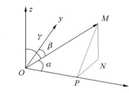
  <figcaption>图 3.12 向量的方向角与方向余弦</figcaption>
</figure>

如图 3.12 所示，设 $\boldsymbol{r} = \overrightarrow{OM} = (x, y, z)$，由于 $x$ 是有向线段 $\overrightarrow{OP}$ 的值，$MP \perp OP$，故

$$
\cos\alpha = \frac{x}{|OM|} = \frac{x}{|\boldsymbol{r}|}
$$

类似可知

$$
\cos\beta = \frac{y}{|OM|} = \frac{y}{|\boldsymbol{r}|}, \quad \cos\gamma = \frac{z}{|OM|} = \frac{z}{|\boldsymbol{r}|}
$$

从而

$$
(\cos\alpha, \cos\beta, \cos\gamma) = \left(\frac{x}{|\boldsymbol{r}|}, \frac{y}{|\boldsymbol{r}|}, \frac{z}{|\boldsymbol{r}|}\right) = \frac{1}{|\boldsymbol{r}|}(x, y, z) = \frac{\boldsymbol{r}}{|\boldsymbol{r}|} = \boldsymbol{e}
$$

由此可得方向余弦的重要恒等式：

$$
\cos^2\alpha + \cos^2\beta + \cos^2\gamma = 1
$$

<Example title="例 5 求方向余弦">

设有点 $A(1, 1, 1), B(2, -1, 3)$，求向量 $\overrightarrow{AB}$ 的方向余弦。

</Example>

<Solution title="解">

设 $\overrightarrow{AB}$ 的方向角为 $\alpha, \beta, \gamma$，因为 $\overrightarrow{AB} = (1, -2, 2)$，于是

$$
|\overrightarrow{AB}| = \sqrt{1^2 + (-2)^2 + 2^2} = 3
$$

故

$$
\cos\alpha = \frac{1}{3}, \quad \cos\beta = -\frac{2}{3}, \quad \cos\gamma = \frac{2}{3}
$$

</Solution>

### 3. 向量在轴上的投影

<Knowledge title="定义 9 向量在轴上的投影">

取定点 $O$ 及单位向量 $\boldsymbol{e}$ 确定 $u$ 轴（图 3.13）。任给向量 $\boldsymbol{r}$，作 $\overrightarrow{OM} = \boldsymbol{r}$，再过点 $M$ 作与 $u$ 轴垂直的平面交 $u$ 轴于点 $M'$，则点 $M'$ 称为点 $M$ 在 $u$ 轴上的投影，向量 $\overrightarrow{OM'}$ 称为 $\boldsymbol{r}$ 在 $u$ 轴上的分量。

设 $\overrightarrow{OM'} = \lambda\boldsymbol{e}$，则数 $\lambda$ 称为向量 $\boldsymbol{r}$ 在 $u$ 轴上的**投影**，记作 $\mathrm{Prj}_u \boldsymbol{r}$ 或 $(\boldsymbol{r})_u$。

</Knowledge>

<figure class="vp-figure">
  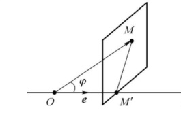
  <figcaption>图 3.13 向量在轴上的投影</figcaption>
</figure>

由定义 9 知，向量 $\boldsymbol{\alpha} = (a_x, a_y, a_z)$ 在直角坐标系 $Oxyz$ 的坐标就是 $\boldsymbol{\alpha}$ 在三条坐标轴上的投影，即

$$
\mathrm{Prj}_x \boldsymbol{\alpha} = a_x, \quad \mathrm{Prj}_y \boldsymbol{\alpha} = a_y, \quad \mathrm{Prj}_z \boldsymbol{\alpha} = a_z
$$

由此可知，向量的投影具有与坐标相同的性质：

<Knowledge title="投影的基本性质">

**性质 1**：$\mathrm{Prj}_u \boldsymbol{\alpha} = |\boldsymbol{\alpha}|\cos\varphi$，其中 $\varphi$ 是向量 $\boldsymbol{\alpha}$ 与 $u$ 轴的夹角；

**性质 2**：$\mathrm{Prj}_u (\boldsymbol{\alpha} + \boldsymbol{\beta}) = \mathrm{Prj}_u \boldsymbol{\alpha} + \mathrm{Prj}_u \boldsymbol{\beta}$；

**性质 3**：$\mathrm{Prj}_u (\lambda\boldsymbol{\alpha}) = \lambda \mathrm{Prj}_u \boldsymbol{\alpha}$。

</Knowledge>

<ExerciseTrigger chapter={3} section="3.1" title="3.1 向量及其线性运算 课后真题与自测练习" />
