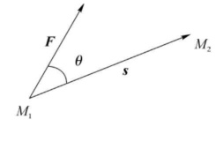
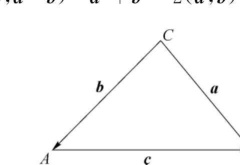
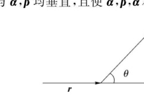
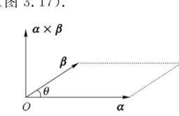
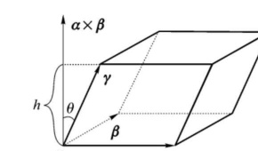

import ExerciseTrigger from '@/components/exercises/ExerciseTrigger.astro';

import Guide from '@/components/Guide.astro';
import Knowledge from '@/components/Knowledge.astro';
import Example from '@/components/Example.astro';
import Analysis from '@/components/Analysis.astro';
import Solution from '@/components/Solution.astro';
import Variant from '@/components/Variant.astro';
import Note from '@/components/Note.astro';
import SideNote from '@/components/SideNote.astro';
import Block from '@/components/Block.astro';
import Method from '@/components/Method.astro';
import Exercise from '@/components/Exercise.astro';

向量的线性运算是两个向量产生一个向量的运算。在物理和几何中，还常常需要研究两个向量产生一个标量、或者产生一个与之相互垂直的新向量的乘法运算。本节系统讨论向量的三种乘法：数量积（点积）、向量积（叉积）与混合积，建立它们的代数定义、几何意义与坐标行列式计算方法。

## 一、两向量的数量积

设一物体在常力 $\boldsymbol{F}$ 作用下沿直线从点 $M_1$ 移动到点 $M_2$。以 $\boldsymbol{s}$ 表示位移 $\overrightarrow{M_1 M_2}$，由物理学知道，力 $\boldsymbol{F}$ 所做的功等于

$$
W = |\boldsymbol{F}||\boldsymbol{s}|\cos\theta
$$

其中 $\theta$ 为 $\boldsymbol{F}$ 与 $\boldsymbol{s}$ 的夹角（图 3.14）。下面除去它的物理意义，引出两个向量的数量积的定义。

<figure class="vp-figure">
  
  <figcaption>图 3.14 力做功与位移向量夹角</figcaption>
</figure>

<Knowledge title="定义 10 向量的数量积">

两个向量 $\boldsymbol{\alpha}$ 与 $\boldsymbol{\beta}$ 的**数量积**（又称为**点积**或**内积**）是一个实数，它等于这两个向量的长度与它们的夹角 $\theta = \langle\boldsymbol{\alpha}, \boldsymbol{\beta}\rangle$ 余弦的乘积，记作 $(\boldsymbol{\alpha}, \boldsymbol{\beta})$ 或 $\boldsymbol{\alpha} \cdot \boldsymbol{\beta}$，即有

$$
(\boldsymbol{\alpha}, \boldsymbol{\beta}) = \boldsymbol{\alpha} \cdot \boldsymbol{\beta} = |\boldsymbol{\alpha}||\boldsymbol{\beta}|\cos\theta
$$

其中 $\theta$ 的取值范围是 $0 \le \theta \le \pi$。

</Knowledge>

由数量积定义可知，向量的模可表示为

$$
|\boldsymbol{\alpha}| = \sqrt{\boldsymbol{\alpha}^2} = \sqrt{(\boldsymbol{\alpha}, \boldsymbol{\alpha})}
$$

若 $(\boldsymbol{\alpha}, \boldsymbol{\beta}) = 0$，则称 $\boldsymbol{\alpha}$ 与 $\boldsymbol{\beta}$ **正交**，记作 $\boldsymbol{\alpha} \perp \boldsymbol{\beta}$。两个向量正交即它们的夹角为 $\theta = \frac{\pi}{2}$。规定零向量与任意向量正交。

由于 $|\boldsymbol{\beta}|\cos\theta = |\boldsymbol{\beta}|\cos\langle\boldsymbol{\alpha}, \boldsymbol{\beta}\rangle$，当 $\boldsymbol{\alpha} \neq \mathbf{0}$ 时是向量 $\boldsymbol{\beta}$ 在向量 $\boldsymbol{\alpha}$ 的方向上的投影，用 $\mathrm{Prj}_{\boldsymbol{\alpha}}\boldsymbol{\beta}$ 来表示这个投影，便有

$$
\boldsymbol{\alpha} \cdot \boldsymbol{\beta} = |\boldsymbol{\alpha}|\mathrm{Prj}_{\boldsymbol{\alpha}}\boldsymbol{\beta}
$$

同理，当 $\boldsymbol{\beta} \neq \mathbf{0}$ 时有

$$
\boldsymbol{\alpha} \cdot \boldsymbol{\beta} = |\boldsymbol{\beta}|\mathrm{Prj}_{\boldsymbol{\beta}}\boldsymbol{\alpha}
$$

这就是说，两个向量的数量积等于其中一个向量的模和另一个向量在这个向量的方向上的投影的乘积。

<Knowledge title="内积的基本性质">

(1) 交换性：$(\boldsymbol{\alpha}, \boldsymbol{\beta}) = (\boldsymbol{\beta}, \boldsymbol{\alpha})$；

(2) 齐次性：$(\lambda\boldsymbol{\alpha}, \boldsymbol{\beta}) = \lambda(\boldsymbol{\alpha}, \boldsymbol{\beta}), \quad \forall \lambda \in \mathbb{R}$；

(3) 可加性：$(\boldsymbol{\alpha} + \boldsymbol{\beta}, \boldsymbol{\gamma}) = (\boldsymbol{\alpha}, \boldsymbol{\gamma}) + (\boldsymbol{\beta}, \boldsymbol{\gamma})$；

(4) 非负性：$(\boldsymbol{\alpha}, \boldsymbol{\alpha}) = |\boldsymbol{\alpha}|^2 \ge 0$，当且仅当 $\boldsymbol{\alpha} = \mathbf{0}$ 时等号成立。

</Knowledge>

下面仅证明性质 (3)，性质 (1)(2)(4) 可直接由内积的定义验证：

$$
\begin{aligned}
(\boldsymbol{\alpha} + \boldsymbol{\beta}, \boldsymbol{\gamma}) &= |\boldsymbol{\gamma}|\mathrm{Prj}_{\boldsymbol{\gamma}}(\boldsymbol{\alpha} + \boldsymbol{\beta}) \\
&= |\boldsymbol{\gamma}|\mathrm{Prj}_{\boldsymbol{\gamma}}\boldsymbol{\alpha} + |\boldsymbol{\gamma}|\mathrm{Prj}_{\boldsymbol{\gamma}}\boldsymbol{\beta} \\
&= (\boldsymbol{\alpha}, \boldsymbol{\gamma}) + (\boldsymbol{\beta}, \boldsymbol{\gamma})
\end{aligned}
$$

### 数量积的坐标表示与夹角

设 $\boldsymbol{\alpha} = x_1\boldsymbol{i} + y_1\boldsymbol{j} + z_1\boldsymbol{k}, \boldsymbol{\beta} = x_2\boldsymbol{i} + y_2\boldsymbol{j} + z_2\boldsymbol{k}$。由于基本向量 $\boldsymbol{i}, \boldsymbol{j}, \boldsymbol{k}$ 两两互相垂直，所以

$$
(\boldsymbol{i}, \boldsymbol{j}) = (\boldsymbol{j}, \boldsymbol{k}) = (\boldsymbol{k}, \boldsymbol{i}) = 0, \quad (\boldsymbol{i}, \boldsymbol{i}) = (\boldsymbol{j}, \boldsymbol{j}) = (\boldsymbol{k}, \boldsymbol{k}) = 1
$$

因而得两个向量的内积的坐标表示式：

$$
(\boldsymbol{\alpha}, \boldsymbol{\beta}) = x_1 x_2 + y_1 y_2 + z_1 z_2
$$

由于 $(\boldsymbol{\alpha}, \boldsymbol{\beta}) = |\boldsymbol{\alpha}||\boldsymbol{\beta}|\cos\theta$，当 $\boldsymbol{\alpha}, \boldsymbol{\beta}$ 均为非零向量时，有

$$
\cos\theta = \frac{(\boldsymbol{\alpha}, \boldsymbol{\beta})}{|\boldsymbol{\alpha}||\boldsymbol{\beta}|}
$$

代入坐标表示式，就得两向量夹角余弦的坐标表示式：

$$
\cos\theta = \frac{x_1 x_2 + y_1 y_2 + z_1 z_2}{\sqrt{x_1^2 + y_1^2 + z_1^2}\sqrt{x_2^2 + y_2^2 + z_2^2}}
$$

<figure class="vp-figure">
  
  <figcaption>图 3.15 向量法证明三角形余弦定理</figcaption>
</figure>

<Example title="例 6 向量证明余弦定理">

用向量证明三角形的余弦定理。

</Example>

<Solution title="证明">

在 $\triangle ABC$ 中（图 3.15），$\boldsymbol{c} = \boldsymbol{a} - \boldsymbol{b}$，由内积的定义，得

$$
\begin{aligned}
c^2 = (\boldsymbol{a} - \boldsymbol{b})^2 &= (\boldsymbol{a} - \boldsymbol{b}, \boldsymbol{a} - \boldsymbol{b}) \\
&= a^2 + b^2 - 2(\boldsymbol{a}, \boldsymbol{b}) \\
&= a^2 + b^2 - 2|\boldsymbol{a}||\boldsymbol{b}|\cos\angle C
\end{aligned}
$$

</Solution>

## 二、两向量的向量积

在物理学中，一个力 $\boldsymbol{F}$ 作用在向量 $\boldsymbol{r}$ 的终点上（图 3.16），它的力矩 $\boldsymbol{M}$ 是一个向量，其大小为 $|\boldsymbol{M}| = |\boldsymbol{F}||\boldsymbol{r}|\sin\theta$，方向垂直于 $\boldsymbol{r}, \boldsymbol{F}$，且 $\boldsymbol{M}$ 与 $\boldsymbol{r}, \boldsymbol{F}$ 构成右手系。

<figure class="vp-figure">
  
  <figcaption>图 3.16 力的力矩物理模型</figcaption>
</figure>

<Knowledge title="定义 11 向量的向量积">

两个向量 $\boldsymbol{\alpha}$ 与 $\boldsymbol{\beta}$ 的**向量积**（又称为**叉积**或**外积**）$\boldsymbol{\alpha} \times \boldsymbol{\beta}$ 是一个向量，其模是以 $\boldsymbol{\alpha}, \boldsymbol{\beta}$ 为边的平行四边形的面积，即

$$
|\boldsymbol{\alpha} \times \boldsymbol{\beta}| = |\boldsymbol{\alpha}||\boldsymbol{\beta}|\sin\langle\boldsymbol{\alpha}, \boldsymbol{\beta}\rangle
$$

其方向与 $\boldsymbol{\alpha}, \boldsymbol{\beta}$ 均垂直，且使 $\boldsymbol{\alpha}, \boldsymbol{\beta}, \boldsymbol{\alpha} \times \boldsymbol{\beta}$ 构成右手系（图 3.17）。

</Knowledge>

<figure class="vp-figure">
  
  <figcaption>图 3.17 向量积的右手系与平行四边形面积</figcaption>
</figure>

由定义可知，对于两个非零向量 $\boldsymbol{\alpha}, \boldsymbol{\beta}$，如果 $\boldsymbol{\alpha} \times \boldsymbol{\beta} = \mathbf{0}$，那么 $\boldsymbol{\alpha} // \boldsymbol{\beta}$；反之，如果 $\boldsymbol{\alpha} // \boldsymbol{\beta}$，那么 $\boldsymbol{\alpha} \times \boldsymbol{\beta} = \mathbf{0}$。由于可以认为零向量与任何向量都平行，因此有结论：**向量 $\boldsymbol{\alpha} // \boldsymbol{\beta}$ 的充分必要条件是 $\boldsymbol{\alpha} \times \boldsymbol{\beta} = \mathbf{0}$**。显然，对于任何向量 $\boldsymbol{\alpha}$，都有 $\boldsymbol{\alpha} \times \boldsymbol{\alpha} = \mathbf{0}$。

<Knowledge title="向量积的基本性质">

(1) 反对称性：$\boldsymbol{\alpha} \times \boldsymbol{\beta} = -(\boldsymbol{\beta} \times \boldsymbol{\alpha})$；

(2) 齐次性：$(\lambda\boldsymbol{\alpha}) \times \boldsymbol{\beta} = \boldsymbol{\alpha} \times (\lambda\boldsymbol{\beta}) = \lambda(\boldsymbol{\alpha} \times \boldsymbol{\beta}), \quad \lambda \in \mathbb{R}$；

(3) 分配律：$(\boldsymbol{\alpha} + \boldsymbol{\beta}) \times \boldsymbol{\gamma} = \boldsymbol{\alpha} \times \boldsymbol{\gamma} + \boldsymbol{\beta} \times \boldsymbol{\gamma}$。

</Knowledge>

<Example title="例 7 向量共线待定系数求解">

设向量 $\boldsymbol{\alpha}, \boldsymbol{\beta}$ 不共线，若向量 $3\boldsymbol{\alpha} + k\boldsymbol{\beta}$ 与 $k\boldsymbol{\alpha} + 27\boldsymbol{\beta}$ 共线，求 $k$ 的值。

</Example>

<Solution title="解">

因为 $(3\boldsymbol{\alpha} + k\boldsymbol{\beta}) \times (k\boldsymbol{\alpha} + 27\boldsymbol{\beta}) = \mathbf{0}$，即

$$
3\boldsymbol{\alpha} \times k\boldsymbol{\alpha} + 81\boldsymbol{\alpha} \times \boldsymbol{\beta} + k^2\boldsymbol{\beta} \times \boldsymbol{\alpha} + 27k\boldsymbol{\beta} \times \boldsymbol{\beta} = \mathbf{0}
$$

由于 $\boldsymbol{\alpha} \times \boldsymbol{\alpha} = \boldsymbol{\beta} \times \boldsymbol{\beta} = \mathbf{0}, \boldsymbol{\alpha} \times \boldsymbol{\beta} = -\boldsymbol{\beta} \times \boldsymbol{\alpha}$，所以

$$
(81 - k^2)\boldsymbol{\alpha} \times \boldsymbol{\beta} = \mathbf{0}
$$

由于 $\boldsymbol{\alpha} \times \boldsymbol{\beta} \neq \mathbf{0}$，故 $k = \pm 9$。

</Solution>

<Example title="例 8 拉格朗日恒等式与海伦公式">

证明：$(\boldsymbol{\alpha} \cdot \boldsymbol{\beta})^2 + |\boldsymbol{\alpha} \times \boldsymbol{\beta}|^2 = |\boldsymbol{\alpha}|^2 |\boldsymbol{\beta}|^2$，并由此证明关于三角形面积的海伦（Heron）公式：

$$
S^2 = s(s-a)(s-b)(s-c)
$$

其中 $a, b, c$ 是三角形的三边长，$s$ 是周长的一半，$S$ 表示面积。

</Example>

<Solution title="证">

因为

$$
(\boldsymbol{\alpha} \cdot \boldsymbol{\beta})^2 = |\boldsymbol{\alpha}|^2 |\boldsymbol{\beta}|^2 \cos^2\langle\boldsymbol{\alpha}, \boldsymbol{\beta}\rangle, \quad |\boldsymbol{\alpha} \times \boldsymbol{\beta}|^2 = |\boldsymbol{\alpha}|^2 |\boldsymbol{\beta}|^2 \sin^2\langle\boldsymbol{\alpha}, \boldsymbol{\beta}\rangle
$$

所以

$$
(\boldsymbol{\alpha} \cdot \boldsymbol{\beta})^2 + |\boldsymbol{\alpha} \times \boldsymbol{\beta}|^2 = |\boldsymbol{\alpha}|^2 |\boldsymbol{\beta}|^2
$$

设在 $\triangle ABC$ 中，记 $\overrightarrow{BC} = \boldsymbol{a}, \overrightarrow{CA} = \boldsymbol{\beta}, \overrightarrow{AB} = \boldsymbol{\gamma}, |\boldsymbol{a}| = a, |\boldsymbol{\beta}| = b, |\boldsymbol{\gamma}| = c$，则有

$$
\boldsymbol{\alpha} + \boldsymbol{\beta} + \boldsymbol{\gamma} = \mathbf{0} \quad \text{或} \quad \boldsymbol{\alpha} + \boldsymbol{\beta} = -\boldsymbol{\gamma}
$$

平方后移项得

$$
\boldsymbol{\alpha} \cdot \boldsymbol{\beta} = \frac{1}{2}(|\boldsymbol{\gamma}|^2 - |\boldsymbol{\alpha}|^2 - |\boldsymbol{\beta}|^2)
$$

将它与 $S = \frac{1}{2}|\boldsymbol{\alpha} \times \boldsymbol{\beta}|$ 一起代入 $|\boldsymbol{\alpha} \times \boldsymbol{\beta}|^2 = |\boldsymbol{\alpha}|^2 |\boldsymbol{\beta}|^2 - |\boldsymbol{\alpha} \cdot \boldsymbol{\beta}|^2$，得

$$
\begin{aligned}
4S^2 &= |\boldsymbol{\alpha}|^2 |\boldsymbol{\beta}|^2 - \frac{1}{4}(|\boldsymbol{\gamma}|^2 - |\boldsymbol{\alpha}|^2 - |\boldsymbol{\beta}|^2)^2 \\
&= a^2 b^2 - \frac{1}{4}(c^2 - a^2 - b^2)^2 \\
&= \frac{1}{4}\big[2ab - (c^2 - a^2 - b^2)\big]\big[2ab + (c^2 - a^2 - b^2)\big] \\
&= \frac{1}{4}(a+b+c)(a+b-c)(c-a+b)(c+a-b) \\
&= \frac{1}{4} \cdot 2s(2s-2a)(2s-2b)(2s-2c)
\end{aligned}
$$

化简，得 $S^2 = s(s-a)(s-b)(s-c)$。

</Solution>

### 向量积的坐标表示式

由于

$$
\boldsymbol{i} \times \boldsymbol{i} = \boldsymbol{j} \times \boldsymbol{j} = \boldsymbol{k} \times \boldsymbol{k} = \mathbf{0}, \quad \boldsymbol{i} \times \boldsymbol{j} = \boldsymbol{k}, \quad \boldsymbol{j} \times \boldsymbol{k} = \boldsymbol{i}, \quad \boldsymbol{k} \times \boldsymbol{i} = \boldsymbol{j}
$$

$$
\boldsymbol{j} \times \boldsymbol{i} = -\boldsymbol{k}, \quad \boldsymbol{k} \times \boldsymbol{j} = -\boldsymbol{i}, \quad \boldsymbol{i} \times \boldsymbol{k} = -\boldsymbol{j}
$$

设 $\boldsymbol{\alpha} = x_1\boldsymbol{i} + y_1\boldsymbol{j} + z_1\boldsymbol{k}, \boldsymbol{\beta} = x_2\boldsymbol{i} + y_2\boldsymbol{j} + z_2\boldsymbol{k}$，按向量积的性质可得

$$
\begin{aligned}
\boldsymbol{\alpha} \times \boldsymbol{\beta} &= (x_1\boldsymbol{i} + y_1\boldsymbol{j} + z_1\boldsymbol{k}) \times (x_2\boldsymbol{i} + y_2\boldsymbol{j} + z_2\boldsymbol{k}) \\
&= (y_1 z_2 - y_2 z_1)\boldsymbol{i} + (x_2 z_1 - x_1 z_2)\boldsymbol{j} + (x_1 y_2 - x_2 y_1)\boldsymbol{k}
\end{aligned}
$$

为了便于记忆，把上式写成三阶行列式形式：

$$
\boldsymbol{\alpha} \times \boldsymbol{\beta} = \begin{vmatrix}
\boldsymbol{i} & \boldsymbol{j} & \boldsymbol{k} \\
x_1 & y_1 & z_1 \\
x_2 & y_2 & z_2
\end{vmatrix}
$$

<Example title="例 9 叉积坐标计算">

设 $\boldsymbol{\alpha} = (-2, 3, 6), \boldsymbol{\beta} = (1, 5, -2)$，求 $\boldsymbol{\alpha} \times \boldsymbol{\beta}$。

</Example>

<Solution title="解">

$$
\boldsymbol{\alpha} \times \boldsymbol{\beta} = \begin{vmatrix}
\boldsymbol{i} & \boldsymbol{j} & \boldsymbol{k} \\
-2 & 3 & 6 \\
1 & 5 & -2
\end{vmatrix} = -36\boldsymbol{i} + 2\boldsymbol{j} - 13\boldsymbol{k}
$$

</Solution>

<Example title="例 10 三角形面积计算">

已知三点 $A(1, 2, 3), B(2, 4, 1), C(1, -3, 5)$，求三角形 $ABC$ 的面积。

</Example>

<Solution title="解">

$\triangle ABC$ 的面积是以 $\overrightarrow{AB}, \overrightarrow{AC}$ 为边的平行四边形的面积的 $\frac{1}{2}$。于是由向量积的定义，可知 $\triangle ABC$ 的面积

$$
S = \frac{1}{2}|\overrightarrow{AB}| \cdot |\overrightarrow{AC}|\sin\angle A = \frac{1}{2}|\overrightarrow{AB} \times \overrightarrow{AC}|
$$

由于 $\overrightarrow{AB} = \boldsymbol{i} + 2\boldsymbol{j} - 2\boldsymbol{k}, \overrightarrow{AC} = -5\boldsymbol{j} + 2\boldsymbol{k}$，因此

$$
\overrightarrow{AB} \times \overrightarrow{AC} = \begin{vmatrix}
\boldsymbol{i} & \boldsymbol{j} & \boldsymbol{k} \\
1 & 2 & -2 \\
0 & -5 & 2
\end{vmatrix} = -6\boldsymbol{i} - 2\boldsymbol{j} - 5\boldsymbol{k}
$$

于是

$$
S = \frac{1}{2}|-6\boldsymbol{i} - 2\boldsymbol{j} - 5\boldsymbol{k}| = \frac{\sqrt{65}}{2}
$$

</Solution>

## 三、向量的混合积

<Knowledge title="定义 12 向量的混合积">

已知三个向量 $\boldsymbol{\alpha}, \boldsymbol{\beta}, \boldsymbol{\gamma}$，先作向量 $\boldsymbol{\alpha}, \boldsymbol{\beta}$ 的向量积 $\boldsymbol{\alpha} \times \boldsymbol{\beta}$，把所得得到的向量与第三个向量 $\boldsymbol{\gamma}$ 再作数量积 $(\boldsymbol{\alpha} \times \boldsymbol{\beta}) \cdot \boldsymbol{\gamma}$，这样得到的数量叫作三向量 $\boldsymbol{\alpha}, \boldsymbol{\beta}, \boldsymbol{\gamma}$ 的**混合积**，记作 $(\boldsymbol{\alpha}, \boldsymbol{\beta}, \boldsymbol{\gamma})$ 或 $[\boldsymbol{\alpha}, \boldsymbol{\beta}, \boldsymbol{\gamma}]$。

</Knowledge>

<Knowledge title="混合积的基本性质">

(1) 轮换对称性：$(\boldsymbol{\alpha}, \boldsymbol{\beta}, \boldsymbol{\gamma}) = (\boldsymbol{\beta}, \boldsymbol{\gamma}, \boldsymbol{\alpha}) = (\boldsymbol{\gamma}, \boldsymbol{\alpha}, \boldsymbol{\beta})$；

(2) 反号性：$(\boldsymbol{\alpha}, \boldsymbol{\beta}, \boldsymbol{\gamma}) = -(\boldsymbol{\beta}, \boldsymbol{\alpha}, \boldsymbol{\gamma})$；

(3) 齐次性：$(k\boldsymbol{\alpha}, \boldsymbol{\beta}, \boldsymbol{\gamma}) = (\boldsymbol{\alpha}, k\boldsymbol{\beta}, \boldsymbol{\gamma}) = (\boldsymbol{\alpha}, \boldsymbol{\beta}, k\boldsymbol{\gamma}) = k(\boldsymbol{\alpha}, \boldsymbol{\beta}, \boldsymbol{\gamma}), \quad \forall k \in \mathbb{R}$；

(4) 分配律：$(\boldsymbol{\alpha}_1 + \boldsymbol{\alpha}_2, \boldsymbol{\beta}, \boldsymbol{\gamma}) = (\boldsymbol{\alpha}_1, \boldsymbol{\beta}, \boldsymbol{\gamma}) + (\boldsymbol{\alpha}_2, \boldsymbol{\beta}, \boldsymbol{\gamma})$；

(5) 等向量律：$(\boldsymbol{\alpha}, \boldsymbol{\alpha}, \boldsymbol{\gamma}) = 0$。

</Knowledge>

### 混合积的几何意义

下面讨论混合积的几何意义（图 3.18）。设 $\boldsymbol{\alpha}, \boldsymbol{\beta}, \boldsymbol{\gamma}$ 是三个不共面的向量，过点 $O$ 作一个以 $\boldsymbol{\alpha}, \boldsymbol{\beta}, \boldsymbol{\gamma}$ 为棱的平行六面体，其高为 $h$，体积为 $V$，并作 $\boldsymbol{\alpha} \times \boldsymbol{\beta}$，记 $\boldsymbol{\alpha} \times \boldsymbol{\beta}$ 与 $\boldsymbol{\gamma}$ 的夹角为 $\theta$。

<figure class="vp-figure">
  
  <figcaption>图 3.18 混合积与平行六面体体积</figcaption>
</figure>

由于底面是平行四边形，可用 $|\boldsymbol{\alpha} \times \boldsymbol{\beta}|$ 表示其面积，高应与底面垂直，因而高与 $\boldsymbol{\alpha} \times \boldsymbol{\beta}$ 共线，其长度正好是 $\boldsymbol{\gamma}$ 在 $\boldsymbol{\alpha} \times \boldsymbol{\beta}$ 上的投影的绝对值，即

$$
h = |\boldsymbol{\gamma}||\cos\langle\boldsymbol{\alpha} \times \boldsymbol{\beta}, \boldsymbol{\gamma}\rangle|
$$

因此

$$
\begin{aligned}
V &= |\boldsymbol{\alpha} \times \boldsymbol{\beta}||\boldsymbol{\gamma}||\cos\langle\boldsymbol{\alpha} \times \boldsymbol{\beta}, \boldsymbol{\gamma}\rangle| \\
&= |(\boldsymbol{\alpha} \times \boldsymbol{\beta}) \cdot \boldsymbol{\gamma}| = |(\boldsymbol{\alpha}, \boldsymbol{\beta}, \boldsymbol{\gamma})|
\end{aligned}
$$

当 $\langle\boldsymbol{\alpha} \times \boldsymbol{\beta}, \boldsymbol{\gamma}\rangle < \frac{\pi}{2}$ 时，$\cos\langle\boldsymbol{\alpha} \times \boldsymbol{\beta}, \boldsymbol{\gamma}\rangle > 0$，即 $\boldsymbol{\alpha}, \boldsymbol{\beta}, \boldsymbol{\gamma}$ 符合右手坐标系，$V = (\boldsymbol{\alpha}, \boldsymbol{\beta}, \boldsymbol{\gamma})$；当 $\langle\boldsymbol{\alpha} \times \boldsymbol{\beta}, \boldsymbol{\gamma}\rangle > \frac{\pi}{2}$ 时，$\cos\langle\boldsymbol{\alpha} \times \boldsymbol{\beta}, \boldsymbol{\gamma}\rangle < 0$，即 $\boldsymbol{\alpha}, \boldsymbol{\beta}, \boldsymbol{\gamma}$ 符合左手坐标系，$V = -(\boldsymbol{\alpha}, \boldsymbol{\beta}, \boldsymbol{\gamma})$。称混合积 $(\boldsymbol{\alpha}, \boldsymbol{\beta}, \boldsymbol{\gamma})$ 表示以 $\boldsymbol{\alpha}, \boldsymbol{\beta}, \boldsymbol{\gamma}$ 为棱的平行六面体的**有向体积**。

<Knowledge title="定理 3 三向量共面的混合积判别法">

三个向量 $\boldsymbol{\alpha}, \boldsymbol{\beta}, \boldsymbol{\gamma}$ 共面的充分必要条件是

$$
(\boldsymbol{\alpha}, \boldsymbol{\beta}, \boldsymbol{\gamma}) = 0
$$

</Knowledge>

<Solution title="证明">

**必要性**：若 $\boldsymbol{\alpha}, \boldsymbol{\beta}, \boldsymbol{\gamma}$ 共面，则当 $\boldsymbol{\alpha} // \boldsymbol{\beta}$ 时，$\boldsymbol{\alpha} \times \boldsymbol{\beta} = \mathbf{0}$，显然 $(\boldsymbol{\alpha}, \boldsymbol{\beta}, \boldsymbol{\gamma}) = (\boldsymbol{\alpha} \times \boldsymbol{\beta}) \cdot \boldsymbol{\gamma} = 0$。当 $\boldsymbol{\alpha}$ 不平行于 $\boldsymbol{\beta}$ 时，$\boldsymbol{\alpha} \times \boldsymbol{\beta}$ 垂直于 $\boldsymbol{\alpha}, \boldsymbol{\beta}$ 所在的平面，因而 $(\boldsymbol{\alpha} \times \boldsymbol{\beta}) \perp \boldsymbol{\gamma}$，有

$$
(\boldsymbol{\alpha}, \boldsymbol{\beta}, \boldsymbol{\gamma}) = (\boldsymbol{\alpha} \times \boldsymbol{\beta}) \cdot \boldsymbol{\gamma} = 0
$$

**充分性**：若 $(\boldsymbol{\alpha}, \boldsymbol{\beta}, \boldsymbol{\gamma}) = 0$，逆推也成立。

</Solution>

<Example title="例 12 空间基底分解公式">

设 $\boldsymbol{\alpha}, \boldsymbol{\beta}, \boldsymbol{\gamma}$ 是三个不共面的向量，求空间任意向量 $\boldsymbol{\xi}$ 关于 $\boldsymbol{\alpha}, \boldsymbol{\beta}, \boldsymbol{\gamma}$ 的分解式。

</Example>

<Solution title="解">

设 $\boldsymbol{\xi} = x\boldsymbol{\alpha} + y\boldsymbol{\beta} + z\boldsymbol{\gamma}$，因为 $(\boldsymbol{\alpha}, \boldsymbol{\beta}, \boldsymbol{\gamma}) \neq 0$，且

$$
(\boldsymbol{\xi}, \boldsymbol{\beta}, \boldsymbol{\gamma}) = x(\boldsymbol{\alpha}, \boldsymbol{\beta}, \boldsymbol{\gamma}) + y(\boldsymbol{\beta}, \boldsymbol{\beta}, \boldsymbol{\gamma}) + z(\boldsymbol{\gamma}, \boldsymbol{\beta}, \boldsymbol{\gamma}) = x(\boldsymbol{\alpha}, \boldsymbol{\beta}, \boldsymbol{\gamma})
$$

所以

$$
x = \frac{(\boldsymbol{\xi}, \boldsymbol{\beta}, \boldsymbol{\gamma})}{(\boldsymbol{\alpha}, \boldsymbol{\beta}, \boldsymbol{\gamma})}
$$

同理可得

$$
y = \frac{(\boldsymbol{\alpha}, \boldsymbol{\xi}, \boldsymbol{\gamma})}{(\boldsymbol{\alpha}, \boldsymbol{\beta}, \boldsymbol{\gamma})}, \quad z = \frac{(\boldsymbol{\alpha}, \boldsymbol{\beta}, \boldsymbol{\xi})}{(\boldsymbol{\alpha}, \boldsymbol{\beta}, \boldsymbol{\gamma})}
$$

</Solution>

### 混合积的坐标表示式

设 $\boldsymbol{\alpha} = x_1\boldsymbol{i} + y_1\boldsymbol{j} + z_1\boldsymbol{k}, \boldsymbol{\beta} = x_2\boldsymbol{i} + y_2\boldsymbol{j} + z_2\boldsymbol{k}, \boldsymbol{\gamma} = x_3\boldsymbol{i} + y_3\boldsymbol{j} + z_3\boldsymbol{k}$。由

$$
\boldsymbol{\alpha} \times \boldsymbol{\beta} = \begin{vmatrix}
y_1 & z_1 \\
y_2 & z_2
\end{vmatrix}\boldsymbol{i} - \begin{vmatrix}
x_1 & z_1 \\
x_2 & z_2
\end{vmatrix}\boldsymbol{j} + \begin{vmatrix}
x_1 & y_1 \\
x_2 & y_2
\end{vmatrix}\boldsymbol{k}
$$

再由两向量数量积的坐标表示式，使得

$$
(\boldsymbol{\alpha}, \boldsymbol{\beta}, \boldsymbol{\gamma}) = (\boldsymbol{\alpha} \times \boldsymbol{\beta}) \cdot \boldsymbol{\gamma} = \begin{vmatrix}
y_1 & z_1 \\
y_2 & z_2
\end{vmatrix}x_3 - \begin{vmatrix}
x_1 & z_1 \\
x_2 & z_2
\end{vmatrix}y_3 + \begin{vmatrix}
x_1 & y_1 \\
x_2 & y_2
\end{vmatrix}z_3
$$

或写成三阶行列式：

$$
(\boldsymbol{\alpha}, \boldsymbol{\beta}, \boldsymbol{\gamma}) = \begin{vmatrix}
x_1 & y_1 & z_1 \\
x_2 & y_2 & z_2 \\
x_3 & y_3 & z_3
\end{vmatrix}
$$

<Example title="例 13 空间四面体体积公式">

已知不共面的四点 $A(x_1, y_1, z_1), B(x_2, y_2, z_2), C(x_3, y_3, z_3), D(x_4, y_4, z_4)$，求四面体的体积。

</Example>

<Solution title="解">

由立体几何知道，四面体的体积 $V_T$ 等于以向量 $\overrightarrow{AB}, \overrightarrow{AC}$ 和 $\overrightarrow{AD}$ 为棱的平行六面体的体积的六分之一，因而

$$
V_T = \frac{1}{6}|(\overrightarrow{AB}, \overrightarrow{AC}, \overrightarrow{AD})|
$$

由于

$$
\begin{aligned}
\overrightarrow{AB} &= (x_2 - x_1, y_2 - y_1, z_2 - z_1), \\
\overrightarrow{AC} &= (x_3 - x_1, y_3 - y_1, z_3 - z_1), \\
\overrightarrow{AD} &= (x_4 - x_1, y_4 - y_1, z_4 - z_1)
\end{aligned}
$$

所以

$$
V_T = \pm \frac{1}{6}\begin{vmatrix}
x_2 - x_1 & y_2 - y_1 & z_2 - z_1 \\
x_3 - x_1 & y_3 - y_1 & z_3 - z_1 \\
x_4 - x_1 & y_4 - y_1 & z_4 - z_1
\end{vmatrix}
$$

上式中符号的选择必须和行列式的符号一致。

</Solution>

<ExerciseTrigger chapter={3} section="3.2" title="3.2 向量的数量积、向量积、混合积 课后真题与自测练习" />
