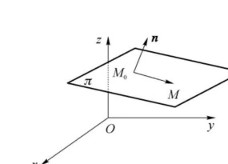
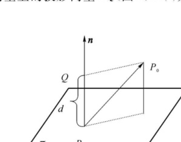

import ExerciseTrigger from '@/components/exercises/ExerciseTrigger.astro';

import Guide from '@/components/Guide.astro';
import Knowledge from '@/components/Knowledge.astro';
import Example from '@/components/Example.astro';
import Analysis from '@/components/Analysis.astro';
import Solution from '@/components/Solution.astro';
import Variant from '@/components/Variant.astro';
import Note from '@/components/Note.astro';
import SideNote from '@/components/SideNote.astro';
import Block from '@/components/Block.astro';
import Method from '@/components/Method.astro';
import Exercise from '@/components/Exercise.astro';

在空间解析几何中，最简单的曲面就是平面，最简单的曲线就是空间直线。本节和下一节将在右手直角坐标系中，以向量为代数工具来系统建立平面与空间直线的方程，并研究它们之间的空间位置关系与度量问题。

## 一、平面的方程

### 1. 平面的点法式方程

在直角坐标系下，给定一个点 $M_0(x_0, y_0, z_0)$ 和一个非零向量 $\boldsymbol{n} = (A, B, C)$，那么就可以唯一定确一个平面 $\pi$，使 $\pi$ 通过点 $M_0$，且与 $\boldsymbol{n}$ 垂直（图 3.19）。向量 $\boldsymbol{n}$ 称为平面 $\pi$ 的**法向量**。

<figure class="vp-figure">
  
  <figcaption>图 3.19 平面的法向量与点法式方程</figcaption>
</figure>

设 $M(x, y, z)$ 是空间中的任一点，那么点 $M$ 在平面 $\pi$ 上的充分必要条件是向量 $\overrightarrow{M_0 M}$ 与平面的法向量 $\boldsymbol{n}$ 垂直，即它们的数量积等于零：

$$
\boldsymbol{n} \cdot \overrightarrow{M_0 M} = 0
$$

由于 $\boldsymbol{n} = (A, B, C), \overrightarrow{M_0 M} = (x - x_0, y - y_0, z - z_0)$，所以有

$$
A(x - x_0) + B(y - y_0) + C(z - z_0) = 0 \tag{3.3}
$$

<Knowledge title="定义 13 平面的点法式方程">

方程 (3.3) 是由平面 $\pi$ 上的一点 $M_0(x_0, y_0, z_0)$ 和它的一个法向量 $\boldsymbol{n} = (A, B, C)$ 所确定的，称为平面的**点法式方程**。

</Knowledge>

### 2. 平面的一般方程

若把式 (3.3) 展开，并记常数项 $D = -(Ax_0 + By_0 + Cz_0)$，则有

$$
Ax + By + Cz + D = 0 \tag{3.4}
$$

式 (3.4) 是一个三元一次方程，称为平面的**一般方程**。反之，任何一个三元一次方程 $Ax + By + Cz + D = 0$（其中 $A, B, C$ 不全为零）都表示一个法向量为 $\boldsymbol{n} = (A, B, C)$ 的平面。

例如，方程 $2x - 4y + 7z - 1 = 0$ 表示一个平面，$\boldsymbol{n} = (2, -4, 7)$ 是这个平面的一个法向量。

<Knowledge title="特殊位置平面的方程特征">

在平面的一般方程 $Ax + By + Cz + D = 0$ 中：

1. **平行于坐标面的平面**：
   - 若 $\boldsymbol{n} // \boldsymbol{i}$，即 $B = C = 0$，平面 $\pi$ 平行于 $yOz$ 平面，方程为 $Ax + D = 0$ 或 $x = x_0$；
   - 若 $\boldsymbol{n} // \boldsymbol{j}$，即 $A = C = 0$，平面 $\pi$ 平行于 $xOz$ 平面，方程为 $By + D = 0$ 或 $y = y_0$；
   - 若 $\boldsymbol{n} // \boldsymbol{k}$，即 $A = B = 0$，平面 $\pi$ 平行于 $xOy$ 平面，方程为 $Cz + D = 0$ 或 $z = z_0$。

2. **平行于坐标轴的平面**：
   - 若 $A = 0$，法向量 $\boldsymbol{n} = (0, B, C) \perp \boldsymbol{i}$，平面平行于 $x$ 轴，方程为 $By + Cz + D = 0$；
   - 若 $B = 0$，法向量 $\boldsymbol{n} = (A, 0, C) \perp \boldsymbol{j}$，平面平行于 $y$ 轴，方程为 $Ax + Cz + D = 0$；
   - 若 $C = 0$，法向量 $\boldsymbol{n} = (A, B, 0) \perp \boldsymbol{k}$，平面平行于 $z$ 轴，方程为 $Ax + By + D = 0$。

3. **通过原点的平面**：
   - 若 $D = 0$，平面过坐标原点 $O(0, 0, 0)$，方程为 $Ax + By + Cz = 0$。

4. **通过坐标轴的平面**：
   - 若 $A = D = 0$，平面通过 $x$ 轴，方程为 $By + Cz = 0$；
   - 若 $B = D = 0$，平面通过 $y$ 轴，方程为 $Ax + Cz = 0$；
   - 若 $C = D = 0$，平面通过 $z$ 轴，方程为 $Ax + By = 0$。

</Knowledge>

<Example title="例 14 求平面的点法式方程">

已知一平面过点 $(-2, 3, 1)$，法向量为 $\boldsymbol{n} = (5, -2, 3)$，求它的方程。

</Example>

<Solution title="解">

由平面的点法式方程，有

$$
5(x + 2) - 2(y - 3) + 3(z - 1) = 0
$$

即

$$
5x - 2y + 3z + 13 = 0
$$

</Solution>

<Example title="例 15 求过空间三点的平面方程">

求过三点 $M_1(1, -2, 1), M_2(2, 1, 0), M_3(3, 1, 5)$ 的平面的方程。

</Example>

<Solution title="解">

先求出平面的一个法向量 $\boldsymbol{n}$。由于向量 $\boldsymbol{n}$ 与向量 $\overrightarrow{M_1 M_2}, \overrightarrow{M_1 M_3}$ 都垂直，所以可取法向量为

$$
\boldsymbol{n} = \overrightarrow{M_1 M_2} \times \overrightarrow{M_1 M_3}
$$

而 $\overrightarrow{M_1 M_2} = (1, 3, -1), \overrightarrow{M_1 M_3} = (2, 3, 4)$，于是

$$
\boldsymbol{n} = \begin{vmatrix}
\boldsymbol{i} & \boldsymbol{j} & \boldsymbol{k} \\
1 & 3 & -1 \\
2 & 3 & 4
\end{vmatrix} = 15\boldsymbol{i} - 6\boldsymbol{j} - 3\boldsymbol{k}
$$

根据平面的点法式方程，得所求平面的方程为

$$
15(x - 1) - 6(y + 2) - 3(z - 1) = 0
$$

化简得

$$
5x - 2y - z - 8 = 0
$$

</Solution>

<Example title="例 16 过坐标轴与定点的平面">

求过 $y$ 轴和点 $(3, -2, 7)$ 的平面方程。

</Example>

<Solution title="解">

平面过 $y$ 轴，即法向量 $\boldsymbol{n}$ 垂直于 $y$ 轴，它在 $y$ 轴上的投影为零，即 $\boldsymbol{n} = (A, 0, C)$，设平面 $\pi$ 的方程为

$$
Ax + Cz + D = 0
$$

又因为平面 $\pi$ 必过原点，且又过点 $(3, -2, 7)$，故有

$$
\begin{cases}
D = 0 \\
3A + 7C = 0
\end{cases} \implies \begin{cases}
D = 0 \\
C = -\frac{3}{7}A
\end{cases}
$$

即平面 $\pi$ 的方程为 $Ax - \frac{3}{7}Az = 0$，即

$$
7x - 3z = 0
$$

</Solution>

### 3. 平面的截距式与三点式方程

<Example title="例 17 平面的截距式方程">

已知一平面过三点 $(a, 0, 0), (0, b, 0), (0, 0, c)$，其中 $abc \neq 0$，求该平面的方程。

</Example>

<Solution title="解">

设平面方程为 $Ax + By + Cz + D = 0$。将所给三点分别代入方程，即可得

$$
A = -\frac{D}{a}, \quad B = -\frac{D}{b}, \quad C = -\frac{D}{c}
$$

代入原方程得

$$
-\frac{D}{a}x - \frac{D}{b}y - \frac{D}{c}z + D = 0
$$

两边同除以 $-D$，并移项后得

$$
\frac{x}{a} + \frac{y}{b} + \frac{z}{c} = 1 \tag{3.5}
$$

上式称为平面的**截距式方程**，$a, b, c$ 称为平面在 $x, y, z$ 轴上的截距。

</Solution>

<Example title="例 18 平面的三点式方程">

已知 $P_0(x_0, y_0, z_0), A(x_1, y_1, z_1), B(x_2, y_2, z_2)$ 是不共线的三点，求过这三点的平面方程。

</Example>

<Solution title="解">

设 $P(x, y, z)$ 是所求平面 $\pi$ 上任一点，则 $\overrightarrow{P_0 P}, \overrightarrow{P_0 A}, \overrightarrow{P_0 B}$ 共面。根据向量混合积公式，可得平面 $\pi$ 的方程为

$$
\begin{vmatrix}
x - x_0 & y - y_0 & z - z_0 \\
x_1 - x_0 & y_1 - y_0 & z_1 - z_0 \\
x_2 - x_0 & y_2 - y_0 & z_2 - z_0
\end{vmatrix} = 0 \tag{3.6}
$$

上式称为平面 $\pi$ 的**三点式方程**。

</Solution>

## 二、与平面相关的一些问题

### 1. 两平面的夹角

设有平面

$$
\pi_1: A_1 x + B_1 y + C_1 z + D_1 = 0, \quad \pi_2: A_2 x + B_2 y + C_2 z + D_2 = 0
$$

它们的法向量分别为 $\boldsymbol{n}_1 = (A_1, B_1, C_1), \boldsymbol{n}_2 = (A_2, B_2, C_2)$。规定两平面 $\pi_1$ 与 $\pi_2$ 的夹角 $\theta\,(0 \le \theta \le \frac{\pi}{2})$ 为两平面法向量 $\boldsymbol{n}_1, \boldsymbol{n}_2$ 所夹的不超过 $\frac{\pi}{2}$ 的角，此时有

$$
\cos\theta = \frac{|\boldsymbol{n}_1 \cdot \boldsymbol{n}_2|}{|\boldsymbol{n}_1||\boldsymbol{n}_2|} = \frac{|A_1 A_2 + B_1 B_2 + C_1 C_2|}{\sqrt{A_1^2 + B_1^2 + C_1^2}\sqrt{A_2^2 + B_2^2 + C_2^2}}
$$

<Knowledge title="两平面的位置关系判定">

由两平面夹角公式可推出：

(1) $\pi_1, \pi_2$ 平行 $\iff \frac{A_1}{A_2} = \frac{B_1}{B_2} = \frac{C_1}{C_2} \neq \frac{D_1}{D_2}$；

(2) $\pi_1, \pi_2$ 重合 $\iff \frac{A_1}{A_2} = \frac{B_1}{B_2} = \frac{C_1}{C_2} = \frac{D_1}{D_2}$；

(3) $\pi_1, \pi_2$ 垂直 $\iff \boldsymbol{n}_1 \cdot \boldsymbol{n}_2 = 0 \iff A_1 A_2 + B_1 B_2 + C_1 C_2 = 0$。

</Knowledge>

<Example title="例 19 计算两平面夹角">

求两平面 $x - y + 2z - 6 = 0$ 和 $2x + y + 2z - 5 = 0$ 的夹角。

</Example>

<Solution title="解">

两平面的法向量分别为 $\boldsymbol{n}_1 = (1, -1, 2)$ 和 $\boldsymbol{n}_2 = (2, 1, 2)$。设两平面的夹角为 $\theta$，则有

$$
\cos\theta = \frac{|1 \times 2 + (-1) \times 1 + 2 \times 2|}{\sqrt{1^2 + (-1)^2 + 2^2}\sqrt{2^2 + 1^2 + 2^2}} = \frac{5}{\sqrt{6} \cdot 3} = \frac{1}{2}
$$

因此，所求夹角 $\theta = \frac{\pi}{3}$。

</Solution>

### 2. 点到平面的距离

设 $P_0(x_0, y_0, z_0)$ 是平面 $\pi: Ax + By + Cz + D = 0$ 外的一点，在平面 $\pi$ 上任取一点 $P(x_1, y_1, z_1)$，作 $\overrightarrow{P P_0}$ 在平面 $\pi$ 法向量上的投影向量 $\overrightarrow{PQ}$（图 3.20），则向量 $\overrightarrow{PQ}$ 的长 $|\overrightarrow{PQ}|$ 即为 $P_0$ 到平面 $\pi$ 的距离 $d$。

<figure class="vp-figure">
  
  <figcaption>图 3.20 点到平面的距离几何投影图</figcaption>
</figure>

平面 $\pi$ 的单位法向量为

$$
\boldsymbol{n}^0 = \frac{(A, B, C)}{\sqrt{A^2 + B^2 + C^2}}
$$

于是点 $P_0$ 到平面 $\pi$ 的距离为

$$
\begin{aligned}
d = |\overrightarrow{P P_0} \cdot \boldsymbol{n}^0| &= \frac{|(x_0 - x_1, y_0 - y_1, z_0 - z_1) \cdot (A, B, C)|}{\sqrt{A^2 + B^2 + C^2}} \\
&= \frac{|Ax_0 + By_0 + Cz_0 - (Ax_1 + By_1 + Cz_1)|}{\sqrt{A^2 + B^2 + C^2}}
\end{aligned}
$$

因为点 $P(x_1, y_1, z_1)$ 在平面 $\pi$ 上，故有 $Ax_1 + By_1 + Cz_1 = -D$。代入上式，可得点到平面的距离公式：

$$
d = \frac{|Ax_0 + By_0 + Cz_0 + D|}{\sqrt{A^2 + B^2 + C^2}} \tag{3.7}
$$

<Example title="点到平面距离计算">

求点 $(3, 2, 5)$ 到平面 $\pi: x + 2y - 2z - 3 = 0$ 的距离。

</Example>

<Solution title="解">

由点到平面的距离公式，得

$$
d = \frac{|1 \times 3 + 2 \times 2 - 2 \times 5 - 3|}{\sqrt{1^2 + 2^2 + (-2)^2}} = \frac{|-6|}{3} = 2
$$

</Solution>

<ExerciseTrigger chapter={3} section="3.3" title="3.3 平面及其方程 课后真题与自测练习" />
