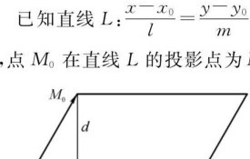
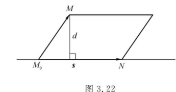
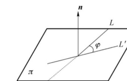

import ExerciseTrigger from '@/components/exercises/ExerciseTrigger.astro';

import Guide from '@/components/Guide.astro';
import Knowledge from '@/components/Knowledge.astro';
import Example from '@/components/Example.astro';
import Analysis from '@/components/Analysis.astro';
import Solution from '@/components/Solution.astro';
import Variant from '@/components/Variant.astro';
import Note from '@/components/Note.astro';
import SideNote from '@/components/SideNote.astro';
import Block from '@/components/Block.astro';
import Method from '@/components/Method.astro';
import Exercise from '@/components/Exercise.astro';

空间直线可以看作是空间两相交平面的交线，也可以看作是由直线上一点和直线的延伸方向（方向向量）唯一确定的一维几何图形。本节系统讨论空间直线的对称方程、参数方程、一般方程，研究点到直线的距离、直线间位置关系以及直线与平面的空间几何关系，最后介绍平面束方程的应用。

## 一、空间直线的方程

如果一个非零向量平行于一条已知直线，这个向量就称为这条直线的**方向向量**。容易知道，直线上任一向量都平行于该直线的方向向量。

由于过空间一点可作且只能作一条直线平行于一已知直线，所以，若已知直线 $L$ 上一点 $M_0(x_0, y_0, z_0)$ 和它的一个方向向量 $\boldsymbol{s} = (l, m, n)$，则直线就完全确定了。设 $M(x, y, z)$ 是直线 $L$ 上的任一点，则应有 $\overrightarrow{M_0 M} // \boldsymbol{s}$，于是得

$$
\overrightarrow{M_0 M} = t\boldsymbol{s}
$$

上式写成坐标形式为 $(x - x_0, y - y_0, z - z_0) = t(l, m, n)$，即

$$
\begin{cases}
x = x_0 + lt \\
y = y_0 + mt \quad (t \text{ 为参数}) \\
z = z_0 + nt
\end{cases} \tag{3.8}
$$

此方程称为直线 $L$ 的**参数方程**。

从直线的参数方程中消去参数 $t$，可得

$$
\frac{x - x_0}{l} = \frac{y - y_0}{m} = \frac{z - z_0}{n} \tag{3.9}
$$

<Knowledge title="定义 14 直线的标准方程">

方程 (3.9) 称为直线 $L$ 的**标准方程**（或**点向式方程**、**对称方程**）。直线的任一方向向量 $\boldsymbol{s}$ 的坐标 $l, m, n$ 都叫作该直线的一组**方向数**，而向量 $\boldsymbol{s}$ 的方向余弦叫作该直线的**方向余弦**。

</Knowledge>

<SideNote title="关于分母为零的约定">
当 $l, m, n$ 中有一个或两个为零时，应理解为对应的分子为零：
1. 若 $l = 0, m \neq 0, n \neq 0$，标准方程理解为 $x - x_0 = 0$ 且 $\frac{y - y_0}{m} = \frac{z - z_0}{n}$；
2. 若 $l = 0, m = 0, n \neq 0$，标准方程理解为 $x - x_0 = 0, y - y_0 = 0$（即平行于 $z$ 轴的直线）。
</SideNote>

### 直线的一般方程与两点式方程

直线的标准方程也可等价地写成

$$
\begin{cases}
\frac{x - x_0}{l} = \frac{y - y_0}{m} \\
\frac{x - x_0}{l} = \frac{z - z_0}{n}
\end{cases}
$$

其中每一个方程都表示一个平面，而直线 $L$ 可看成是这两个平面的交线。一般地，两相交平面的联立方程

$$
\begin{cases}
A_1 x + B_1 y + C_1 z + D_1 = 0 \\
A_2 x + B_2 y + C_2 z + D_2 = 0
\end{cases} \tag{3.10}
$$

表示它们的交线 $L$，称此方程为直线 $L$ 的**普通方程**或**一般方程**。

设直线 $L$ 过两个已知点 $A(x_0, y_0, z_0), B(x_1, y_1, z_1)$，取方向向量为 $\boldsymbol{s} = \overrightarrow{AB} = (x_1 - x_0, y_1 - y_0, z_1 - z_0)$，代入直线的标准方程，得

$$
\frac{x - x_0}{x_1 - x_0} = \frac{y - y_0}{y_1 - y_0} = \frac{z - z_0}{z_1 - z_0} \tag{3.11}
$$

上述方程称为直线的**两点式方程**。

<Example title="例 20 直线点向式求法">

求过点 $M_0(2, 3, -5)$ 且垂直于平面 $2x + 7y - 2z + 5 = 0$ 的直线方程。

</Example>

<Solution title="解">

依题意，直线的方向向量 $\boldsymbol{s}$ 应与平面的法向量 $\boldsymbol{n} = (2, 7, -2)$ 平行，可取

$$
\boldsymbol{s} = \boldsymbol{n} = (2, 7, -2)
$$

又因为点 $M_0(2, 3, -5)$ 在直线 $L$ 上，所以直线 $L$ 的标准方程为

$$
\frac{x - 2}{2} = \frac{y - 3}{7} = \frac{z + 5}{-2}
$$

</Solution>

<Example title="例 21 一般方程化为标准方程">

已知直线 $L$ 的一般方程为

$$
\begin{cases}
2x - 3y - z - 3 = 0 \\
4x - 6y + 5z + 1 = 0
\end{cases}
$$

求它的标准方程和参数方程。

</Example>

<Solution title="解">

直线的两平面的法向量分别为 $\boldsymbol{n}_1 = (2, -3, -1), \boldsymbol{n}_2 = (4, -6, 5)$。直线的方向向量应分别垂直于 $\boldsymbol{n}_1$ 和 $\boldsymbol{n}_2$，故 $\boldsymbol{s} // \boldsymbol{n}_1 \times \boldsymbol{n}_2$。取

$$
\boldsymbol{s} = \boldsymbol{n}_1 \times \boldsymbol{n}_2 = \begin{vmatrix}
\boldsymbol{i} & \boldsymbol{j} & \boldsymbol{k} \\
2 & -3 & -1 \\
4 & -6 & 5
\end{vmatrix} = -21\boldsymbol{i} - 14\boldsymbol{j} + 0\boldsymbol{k}
$$

即 $\boldsymbol{s} = (-21, -14, 0)$，可简化取方向向量为 $\boldsymbol{s} = (3, 2, 0)$。

现在求直线上一点 $M_0$。令 $y = 0$，解方程组

$$
\begin{cases}
2x - z - 3 = 0 \\
4x + 5z + 1 = 0
\end{cases} \implies \begin{cases}
x = 1 \\
z = -1
\end{cases}
$$

即 $M_0$ 为 $(1, 0, -1)$。直线的标准方程为

$$
\frac{x - 1}{3} = \frac{y}{2} = \frac{z + 1}{0}
$$

直线的参数方程为

$$
\begin{cases}
x = 1 + 3t \\
y = 2t \\
z = -1
\end{cases}
$$

</Solution>

## 二、与直线有关的一些问题

### 1. 点到直线的距离

已知直线 $L: \frac{x - x_0}{l} = \frac{y - y_0}{m} = \frac{z - z_0}{n}$ 及直线外一点 $M_0(x_1, y_1, z_1)$。设点 $P_0(x_0, y_0, z_0)$ 在直线 $L$ 上，点 $M_0$ 在直线 $L$ 的投影点为 $M$（图 3.21），点 $M_0$ 到直线 $L$ 的距离为 $d = |\overrightarrow{M_0 M}|$。

<figure class="vp-figure">
  
  <figcaption>图 3.21 点到直线的距离几何投影</figcaption>
</figure>

**方法一（垂面法）**：过点 $M_0$ 作与直线垂直的平面 $\pi$，直线的方向向量 $\boldsymbol{s} = (l, m, n)$ 即为平面的法向量，求直线与平面的交点 $M$，点 $M_0$ 到点 $M$ 的距离即为所求。

<Example title="例 22 垂面法求点线距离">

求点 $M_0(1, -2, 1)$ 到直线 $\frac{x}{1} = \frac{y - 1}{2} = \frac{z + 3}{-2}$ 的距离。

</Example>

<Solution title="解">

过点 $M_0(1, -2, 1)$ 作与直线垂直的平面 $\pi$。易见 $\pi$ 的法向量即直线的方向向量，即 $\boldsymbol{n} = \boldsymbol{s} = (1, 2, -2)$。又平面过点 $M_0$，所以平面的方程为

$$
1(x - 1) + 2(y + 2) - 2(z - 1) = 0
$$

将直线的参数方程

$$
\begin{cases}
x = t \\
y = 1 + 2t \\
z = -3 - 2t
\end{cases}
$$

代入平面方程中，解得 $t = -\frac{13}{9}$。再将 $t = -\frac{13}{9}$ 代入直线的参数方程中，解得直线与平面 $\pi$ 的交点坐标为 $M(-\frac{13}{9}, -\frac{17}{9}, -\frac{1}{9})$。点 $M_0$ 到 $M$ 的距离为

$$
d = |\overrightarrow{M_0 M}| = \sqrt{\left(1 + \frac{13}{9}\right)^2 + \left(-2 + \frac{17}{9}\right)^2 + \left(1 + \frac{1}{9}\right)^2} = \frac{\sqrt{65}}{3}
$$

</Solution>

<figure class="vp-figure">
  
  <figcaption>图 3.22 向量积求点到直线距离示意图</figcaption>
</figure>

**方法二（向量积面积法）**：在直线 $L$ 上取点 $M_0(x_0, y_0, z_0)$，以向量 $\overrightarrow{M_0 M}$ 和 $\boldsymbol{s}$ 为相邻边作平行四边形（图 3.22），其中 $\boldsymbol{s} = \overrightarrow{M_0 N}$，则平行四边形底边 $M_0 N$ 上的高就是点 $M$ 到直线 $L$ 的距离，记为 $d$。由向量积模的几何意义，得

$$
|\overrightarrow{M_0 M} \times \boldsymbol{s}| = |\boldsymbol{s}| \cdot d \implies d = \frac{|\overrightarrow{M_0 M} \times \boldsymbol{s}|}{|\boldsymbol{s}|} \tag{3.12}
$$

<Example title="例 23 向量积法求点线距离">

求点 $M(1, 1, 2)$ 到直线 $L: \frac{x - 2}{2} = \frac{y - 3}{1} = \frac{z}{2}$ 的距离。

</Example>

<Solution title="解">

在直线 $L$ 上取点 $M_0(2, 3, 0)$。直线 $L$ 的方向向量为 $\boldsymbol{s} = (2, 1, 2)$。以向量 $\overrightarrow{M_0 M}$ 和 $\boldsymbol{s}$ 为相邻边作平行四边形（图 3.22），其中 $\boldsymbol{s} = \overrightarrow{M_0 N}$，则平行四边形底边 $M_0 N$ 上的高就是点 $M$ 到直线 $L$ 的距离，记为 $d$。由向量积模的几何意义，得

$$
|\overrightarrow{M_0 M} \times \boldsymbol{s}| = |\boldsymbol{s}| \cdot d \implies d = \frac{|\overrightarrow{M_0 M} \times \boldsymbol{s}|}{|\boldsymbol{s}|}
$$

由 $\overrightarrow{M_0 M} = (-1, -2, 2)$，得

$$
\overrightarrow{M_0 M} \times \boldsymbol{s} = \begin{vmatrix}
\boldsymbol{i} & \boldsymbol{j} & \boldsymbol{k} \\
-1 & -2 & 2 \\
2 & 1 & 2
\end{vmatrix} = -6\boldsymbol{i} + 6\boldsymbol{j} + 3\boldsymbol{k}
$$

得

$$
|\overrightarrow{M_0 M} \times \boldsymbol{s}| = \sqrt{(-6)^2 + 6^2 + 3^2} = 9, \quad |\boldsymbol{s}| = \sqrt{2^2 + 1^2 + 2^2} = 3
$$

于是得所求距离为 $d = \frac{9}{3} = 3$。

</Solution>

### 2. 空间两直线间的位置关系

设空间两条直线的方程分别为

$$
L_1: \frac{x - x_1}{l_1} = \frac{y - y_1}{m_1} = \frac{z - z_1}{n_1}, \quad L_2: \frac{x - x_2}{l_2} = \frac{y - y_2}{m_2} = \frac{z - z_2}{n_2}
$$

取 $L_1$ 上的点 $M_1(x_1, y_1, z_1)$，$L_2$ 上的点 $M_2(x_2, y_2, z_2)$，两直线的方向向量分别记为 $\boldsymbol{s}_1$ 和 $\boldsymbol{s}_2$，则

(1) $L_1$ 与 $L_2$ 共面 $\iff (\overrightarrow{M_1 M_2}, \boldsymbol{s}_1, \boldsymbol{s}_2) = 0$；

(2) $L_1$ 与 $L_2$ 异面 $\iff (\overrightarrow{M_1 M_2}, \boldsymbol{s}_1, \boldsymbol{s}_2) \neq 0$。

两直线 $L_1$ 与 $L_2$ 之间的夹角 $\theta$ 规定为两方向向量 $\boldsymbol{s}_1$ 和 $\boldsymbol{s}_2$ 所夹的不超过 $\frac{\pi}{2}$ 的角，于是有

$$
\cos\theta = \frac{|\boldsymbol{s}_1 \cdot \boldsymbol{s}_2|}{|\boldsymbol{s}_1||\boldsymbol{s}_2|} = \frac{|l_1 l_2 + m_1 m_2 + n_1 n_2|}{\sqrt{l_1^2 + m_1^2 + n_1^2}\sqrt{l_2^2 + m_2^2 + n_2^2}}
$$

### 3. 直线与平面的夹角

直线 $L$ 与平面 $\pi$ 的夹角 $\varphi$ 是指 $L$ 与它在平面上的投影直线 $L'$ 的夹角，一般取锐角（如图 3.23 所示）。

<figure class="vp-figure">
  
  <figcaption>图 3.23 直线与平面的夹角示意图</figcaption>
</figure>

设直线方程为 $L: \frac{x - x_0}{l} = \frac{y - y_0}{m} = \frac{z - z_0}{n}$，平面方程为 $\pi: Ax + By + Cz + D = 0$。则直线与平面的夹角 $\varphi$ 满足

$$
\sin\varphi = \cos\left(\frac{\pi}{2} - \varphi\right) = \frac{|\boldsymbol{n} \cdot \boldsymbol{s}|}{|\boldsymbol{n}||\boldsymbol{s}|} = \frac{|Al + Bm + Cn|}{\sqrt{A^2 + B^2 + C^2}\sqrt{l^2 + m^2 + n^2}}
$$

<Example title="例 24 两直线位置关系与交点判定">

判定两直线

$$
L_1: \frac{x - 1}{1} = \frac{y}{1} = \frac{z + 1}{-1}, \quad L_2: \frac{x}{1} = \frac{y - 1}{-1} = \frac{z + 1}{0}
$$

的相互位置，并求夹角 $\theta$。若两直线相交，则求出其交点。

</Example>

<Solution title="解">

两直线的方向向量分别为 $\boldsymbol{s}_1 = (1, 1, -1), \boldsymbol{s}_2 = (1, -1, 0)$，直线 $L_1$ 上取点 $M_1(1, 0, -1)$，$L_2$ 上取点 $M_2(0, 1, -1)$。由于

$$
(\overrightarrow{M_1 M_2}, \boldsymbol{s}_1, \boldsymbol{s}_2) = \begin{vmatrix}
0 - 1 & 1 - 0 & -1 - (-1) \\
1 & 1 & -1 \\
1 & -1 & 0
\end{vmatrix} = \begin{vmatrix}
-1 & 1 & 0 \\
1 & 1 & -1 \\
1 & -1 & 0
\end{vmatrix} = 0
$$

可知两直线是共面的。又因为

$$
\cos\theta = \frac{|1 \times 1 + 1 \times (-1) + (-1) \times 0|}{\sqrt{1^2 + 1^2 + (-1)^2}\sqrt{1^2 + (-1)^2 + 0^2}} = 0
$$

所以 $\theta = \frac{\pi}{2}$，因此两直线 $L_1$ 与 $L_2$ 是垂直相交的。

把直线 $L_1$ 的参数方程 $x = 1 + t, y = t, z = -1 - t$ 代入 $L_2$ 中，得 $t = 0$，故交点为 $(1, 0, -1)$。

</Solution>

<Example title="例 25 求与两已知直线垂直的直线方程">

直线过点 $(1, 2, 1)$，并与下列两直线

$$
L_1: \begin{cases}
x + 2y + 5z = 0 \\
2x - y + z - 1 = 0
\end{cases}, \quad L_2: \frac{x - 1}{2} = \frac{y + 2}{0} = \frac{z}{3}
$$

垂直，求此直线的方程。

</Example>

<Solution title="解">

过直线 $L_1$ 的两平面的法向量为 $\boldsymbol{n}_1 = (1, 2, 5), \boldsymbol{n}_2 = (2, -1, 1)$，则 $L_1$ 的方向向量为

$$
\boldsymbol{s}_1 = \boldsymbol{n}_1 \times \boldsymbol{n}_2 = \begin{vmatrix}
\boldsymbol{i} & \boldsymbol{j} & \boldsymbol{k} \\
1 & 2 & 5 \\
2 & -1 & 1
\end{vmatrix} = 7\boldsymbol{i} + 9\boldsymbol{j} - 5\boldsymbol{k}
$$

直线 $L_2$ 的方向向量为 $\boldsymbol{s}_2 = (2, 0, 3)$。

因所求直线 $L$ 垂直于 $L_1$ 和 $L_2$，故 $L$ 的方向向量为

$$
\boldsymbol{s} = \boldsymbol{s}_1 \times \boldsymbol{s}_2 = \begin{vmatrix}
\boldsymbol{i} & \boldsymbol{j} & \boldsymbol{k} \\
7 & 9 & -5 \\
2 & 0 & 3
\end{vmatrix} = 27\boldsymbol{i} - 31\boldsymbol{j} - 18\boldsymbol{k}
$$

故所求直线方程为

$$
\frac{x - 1}{27} = \frac{y - 2}{-31} = \frac{z - 1}{-18}
$$

</Solution>

### 4. 平面束方程

若平面 $\pi_1$ 与 $\pi_2$ 不平行，则它们必相交。设它们的一般方程为

$$
\pi_1: A_1 x + B_1 y + C_1 z + D_1 = 0, \quad \pi_2: A_2 x + B_2 y + C_2 z + D_2 = 0
$$

$\pi_1$ 与 $\pi_2$ 的交线为直线 $L$。过 $L$ 有无穷多个平面，这些平面的集合称为由平面 $\pi_1$ 与 $\pi_2$ 所确定的**平面束**。该平面束的方程可以写为

$$
\lambda(A_1 x + B_1 y + C_1 z + D_1) + \mu(A_2 x + B_2 y + C_2 z + D_2) = 0 \tag{3.13}
$$

其中 $\lambda, \mu$ 不同时为零。当 $\lambda \neq 0$ 时，方程也可以设为 $(A_1 x + B_1 y + C_1 z + D_1) + \mu'(A_2 x + B_2 y + C_2 z + D_2) = 0$（但不包含 $\pi_2$）。

<Example title="例 26 平面束求投影直线方程">

求直线 $L: \begin{cases} x - y + z + 2 = 0 \\ x + 2y - z + 5 = 0 \end{cases}$ 在平面 $\pi: 2x + y - 3z + 1 = 0$ 上的投影直线的方程。

</Example>

<Solution title="解">

过 $L$ 的平面束方程为

$$
\lambda(x - y + z + 2) + \mu(x + 2y - z + 5) = 0
$$

即

$$
(\lambda + \mu)x + (-\lambda + 2\mu)y + (\lambda - \mu)z + (2\lambda + 5\mu) = 0
$$

平面束中任一个平面的法向量为 $\boldsymbol{n} = (\lambda + \mu, -\lambda + 2\mu, \lambda - \mu)$。平面 $\pi$ 的法向量为 $\boldsymbol{n}_\pi = (2, 1, -3)$。

由 $\boldsymbol{n} \cdot \boldsymbol{n}_\pi = 0$，即

$$
2(\lambda + \mu) + (-\lambda + 2\mu) - 3(\lambda - \mu) = 0 \implies -2\lambda + 7\mu = 0
$$

可得 $2\lambda = 7\mu$。令 $\lambda = 7, \mu = 2$，得过直线 $L$ 且垂直于 $\pi$ 的平面方程为

$$
9x - 3y + 5z + 24 = 0
$$

于是 $L$ 在平面 $\pi$ 上的投影直线的方程为

$$
\begin{cases}
2x + y - 3z + 1 = 0 \\
9x - 3y + 5z + 24 = 0
\end{cases}
$$

</Solution>

<ExerciseTrigger chapter={3} section="3.4" title="3.4 空间直线的方程 课后真题与自测练习" />
