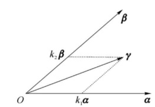

import ExerciseTrigger from '@/components/exercises/ExerciseTrigger.astro';

import Guide from '@/components/Guide.astro';
import Knowledge from '@/components/Knowledge.astro';
import Example from '@/components/Example.astro';
import Analysis from '@/components/Analysis.astro';
import Solution from '@/components/Solution.astro';
import Variant from '@/components/Variant.astro';
import Note from '@/components/Note.astro';
import SideNote from '@/components/SideNote.astro';
import Block from '@/components/Block.astro';
import Method from '@/components/Method.astro';
import Exercise from '@/components/Exercise.astro';

空间两个非零向量 $\boldsymbol{\alpha}, \boldsymbol{\beta}$ 互相平行，则可表示为

$$
\boldsymbol{\beta} = k\boldsymbol{\alpha},
$$

$k$ 为实数。若 $\boldsymbol{\alpha}, \boldsymbol{\beta}$ 不平行，那么与 $\boldsymbol{\alpha}, \boldsymbol{\beta}$ 共面的任一向量 $\boldsymbol{\gamma}$ 可由 $\boldsymbol{\alpha}, \boldsymbol{\beta}$ 表示为

$$
\boldsymbol{\gamma} = k_1\boldsymbol{\alpha} + k_2\boldsymbol{\beta}, \quad k_1, k_2 \text{ 为实数}.
$$

称 $\boldsymbol{\gamma}$ 可由 $\boldsymbol{\alpha}, \boldsymbol{\beta}$ 线性表示或 $\boldsymbol{\gamma}$ 是 $\boldsymbol{\alpha}, \boldsymbol{\beta}$ 的线性组合（如图 4.1 所示）。

<figure class="vp-figure">
  
  <figcaption>图 4.1 线性组合几何示意图</figcaption>
</figure>

## 一、线性组合与线性表出

<Knowledge title="定义 4 线性组合与线性表出">

设 $\boldsymbol{\alpha}_1, \boldsymbol{\alpha}_2, \dots, \boldsymbol{\alpha}_m$ 是一组 $n$ 维向量，$k_1, k_2, \dots, k_m$ 是一组实常数，则称

$$
k_1\boldsymbol{\alpha}_1 + k_2\boldsymbol{\alpha}_2 + \dots + k_m\boldsymbol{\alpha}_m
$$

为 $\boldsymbol{\alpha}_1, \boldsymbol{\alpha}_2, \dots, \boldsymbol{\alpha}_m$ 的一个**线性组合**；常数 $k_1, k_2, \dots, k_m$ 为该线性组合的**组合系数**。

若一个 $n$ 维向量 $\boldsymbol{\beta}$ 可以表示成

$$
\boldsymbol{\beta} = k_1\boldsymbol{\alpha}_1 + k_2\boldsymbol{\alpha}_2 + \dots + k_m\boldsymbol{\alpha}_m,
$$

则称 $\boldsymbol{\beta}$ 是 $\boldsymbol{\alpha}_1, \boldsymbol{\alpha}_2, \dots, \boldsymbol{\alpha}_m$ 的线性组合，或称 $\boldsymbol{\beta}$ 可由 $\boldsymbol{\alpha}_1, \boldsymbol{\alpha}_2, \dots, \boldsymbol{\alpha}_m$ **线性表出**（线性表示）。仍称 $k_1, k_2, \dots, k_m$ 为组合系数，或**表出系数**。

</Knowledge>

若干个同维数的向量所组成的集合叫作**向量组**，$m$ 个向量 $\boldsymbol{\alpha}_1, \boldsymbol{\alpha}_2, \dots, \boldsymbol{\alpha}_m$ 组成的向量组可记为

$$
R: \boldsymbol{\alpha}_1, \boldsymbol{\alpha}_2, \dots, \boldsymbol{\alpha}_m \quad \text{或} \quad R = \{\boldsymbol{\alpha}_1, \boldsymbol{\alpha}_2, \dots, \boldsymbol{\alpha}_m\}.
$$

例如矩阵 $\boldsymbol{A} = (a_{ij})_{m \times n}$ 可以看成由 $n$ 个 $m$ 维列向量

$$
\boldsymbol{\alpha}_j = \begin{pmatrix} a_{1j} \\ a_{2j} \\ \vdots \\ a_{mj} \end{pmatrix} \quad (j = 1, 2, \dots, n)
$$

组成的向量组。称 $\boldsymbol{\alpha}_1, \boldsymbol{\alpha}_2, \dots, \boldsymbol{\alpha}_n$ 是矩阵 $\boldsymbol{A}$ 的**列向量组**。

矩阵 $\boldsymbol{A}$ 又可以看成由 $m$ 个 $n$ 维行向量

$$
\boldsymbol{\beta}_i = (a_{i1}, a_{i2}, \dots, a_{in}) \quad (i = 1, 2, \dots, m)
$$

组成的行向量组，称 $\boldsymbol{\beta}_1, \boldsymbol{\beta}_2, \dots, \boldsymbol{\beta}_m$ 为矩阵 $\boldsymbol{A}$ 的**行向量组**。

对于线性方程组 $\boldsymbol{A}\boldsymbol{x} = \boldsymbol{b}$，视 $\boldsymbol{A}$ 为列向量组成的向量组，那么方程组可写成

$$
k_1\boldsymbol{\alpha}_1 + k_2\boldsymbol{\alpha}_2 + \dots + k_n\boldsymbol{\alpha}_n = \boldsymbol{b}.
$$

因而讨论方程组 $\boldsymbol{A}\boldsymbol{x} = \boldsymbol{b}$ 是否有解的问题实际上就是讨论 $\boldsymbol{b}$ 能否由 $\boldsymbol{A}$ 的列向量组线性表出。

考虑下面的 $n$ 维单位坐标向量：

$$
\boldsymbol{\varepsilon}_i = (0, \dots, 0, 1, 0, \dots, 0) \quad (i = 1, 2, \dots, n),
$$

$\boldsymbol{\varepsilon}_i$ 中第 $i$ 个分量为 1，其余分量都为 0。显然，任意一个 $n$ 维向量 $\boldsymbol{\alpha} = (a_1, a_2, \dots, a_n)$ 都可以唯一地表示为这 $n$ 个标准单位向量的线性组合：

$$
\boldsymbol{\alpha} = a_1\boldsymbol{\varepsilon}_1 + a_2\boldsymbol{\varepsilon}_2 + \dots + a_n\boldsymbol{\varepsilon}_n.
$$

<Example title="例 3 判定向量是否可由向量组线性表出">

设 $\boldsymbol{\alpha}_1 = (1, 2, 3)^\mathrm{T}, \boldsymbol{\alpha}_2 = (2, 3, 1)^\mathrm{T}, \boldsymbol{\alpha}_3 = (3, 1, 2)^\mathrm{T}, \boldsymbol{\beta} = (0, 4, 2)^\mathrm{T}$，试问 $\boldsymbol{\beta}$ 能否由 $\boldsymbol{\alpha}_1, \boldsymbol{\alpha}_2, \boldsymbol{\alpha}_3$ 线性表出？若能，写出具体的表示式。

</Example>

<Solution title="解">

令

$$
k_1\boldsymbol{\alpha}_1 + k_2\boldsymbol{\alpha}_2 + k_3\boldsymbol{\alpha}_3 = \boldsymbol{\beta},
$$

即

$$
k_1\begin{pmatrix} 1 \\ 2 \\ 3 \end{pmatrix} + k_2\begin{pmatrix} 2 \\ 3 \\ 1 \end{pmatrix} + k_3\begin{pmatrix} 3 \\ 1 \\ 2 \end{pmatrix} = \begin{pmatrix} 0 \\ 4 \\ 2 \end{pmatrix}.
$$

由此得线性方程组

$$
\begin{cases}
k_1 + 2k_2 + 3k_3 = 0, \\
2k_1 + 3k_2 + k_3 = 4, \\
3k_1 + k_2 + 2k_3 = 2.
\end{cases}
$$

因为

$$
D = \begin{vmatrix} 1 & 2 & 3 \\ 2 & 3 & 1 \\ 3 & 1 & 2 \end{vmatrix} = -18 \neq 0,
$$

由克拉默法则，求出

$$
k_1 = 1, \quad k_2 = 1, \quad k_3 = -1.
$$

所以

$$
\boldsymbol{\beta} = \boldsymbol{\alpha}_1 + \boldsymbol{\alpha}_2 - \boldsymbol{\alpha}_3,
$$

即 $\boldsymbol{\beta}$ 能由 $\boldsymbol{\alpha}_1, \boldsymbol{\alpha}_2, \boldsymbol{\alpha}_3$ 线性表出。

</Solution>

<Example title="例 4 向量由向量组线性表出的无穷多解情况">

问 $\boldsymbol{\beta} = (4, 5, 5)$ 能否表示成 $\boldsymbol{\alpha}_1 = (1, 2, 3), \boldsymbol{\alpha}_2 = (-1, 1, 4), \boldsymbol{\alpha}_3 = (3, 3, 2)$ 的线性组合？

</Example>

<Solution title="解">

用矩阵的初等行变换化简以下矩阵：

$$
\begin{aligned}
(\boldsymbol{\alpha}_1^\mathrm{T}, \boldsymbol{\alpha}_2^\mathrm{T}, \boldsymbol{\alpha}_3^\mathrm{T}, \boldsymbol{\beta}^\mathrm{T}) &= \begin{pmatrix}
1 & -1 & 3 & 4 \\
2 & 1 & 3 & 5 \\
3 & 4 & 2 & 5
\end{pmatrix}
\to \begin{pmatrix}
1 & -1 & 3 & 4 \\
0 & 3 & -3 & -3 \\
0 & 7 & -7 & -7
\end{pmatrix} \\
&\to \begin{pmatrix}
1 & -1 & 3 & 4 \\
0 & 1 & -1 & -1 \\
0 & 0 & 0 & 0
\end{pmatrix}
\to \begin{pmatrix}
1 & 0 & 2 & 3 \\
0 & 1 & -1 & -1 \\
0 & 0 & 0 & 0
\end{pmatrix}.
\end{aligned}
$$

同解方程组为

$$
\begin{cases}
x_1 = 3 - 2x_3, \\
x_2 = -1 + x_3.
\end{cases}
$$

取 $x_3 = k$，则有

$$
\boldsymbol{\beta} = (3 - 2k)\boldsymbol{\alpha}_1 + (k - 1)\boldsymbol{\alpha}_2 + k\boldsymbol{\alpha}_3,
$$

其中 $k$ 可任意取值。这说明 $\boldsymbol{\beta}$ 用 $\boldsymbol{\alpha}_1, \boldsymbol{\alpha}_2, \boldsymbol{\alpha}_3$ 线性表出的方法有无穷多种。

</Solution>

## 二、向量组的线性相关与线性无关

上面讨论了向量之间的线性运算关系。一个向量能由某一个向量组线性表出的关系，就是这个向量与向量组之间的一种线性关系。在一个向量组中是否存在某个向量可以由该组中的其他向量线性表出，这是向量组的一个重要性质。要深入研究向量组的这一特性，需要研究向量组的线性相关性与线性无关性。

先考察两个平面向量 $\boldsymbol{\alpha} = (1, 3)$ 和 $\boldsymbol{\beta} = (2, 6)$，则由 $\boldsymbol{\beta} = 2\boldsymbol{\alpha}$ 知道 $\boldsymbol{\alpha}$ 与 $\boldsymbol{\beta}$ 共线。这个关系式可以改写成 $-2\boldsymbol{\alpha} + \boldsymbol{\beta} = \mathbf{0}$，即存在 $k_1 = -2, k_2 = 1$，使得 $k_1\boldsymbol{\alpha} + k_2\boldsymbol{\beta} = \mathbf{0}$。而 $\boldsymbol{\alpha} = (1, 2)$ 与 $\boldsymbol{\gamma} = (-1, 3)$ 不共线，这时 $k_1\boldsymbol{\alpha} + k_2\boldsymbol{\gamma} = \mathbf{0}$ 当且仅当 $k_1 = k_2 = 0$ 才能成立。

一般地，根据向量组中向量之间的关系，把向量组分成有本质区别的两大类。

<Knowledge title="定义 5 线性相关与线性无关">

设有 $n$ 维向量 $\boldsymbol{\alpha}_1, \boldsymbol{\alpha}_2, \dots, \boldsymbol{\alpha}_m$，若存在 $m$ 个不全为零的实数 $k_1, k_2, \dots, k_m$，使得

$$
k_1\boldsymbol{\alpha}_1 + k_2\boldsymbol{\alpha}_2 + \dots + k_m\boldsymbol{\alpha}_m = \mathbf{0},
$$

则称 $\boldsymbol{\alpha}_1, \boldsymbol{\alpha}_2, \dots, \boldsymbol{\alpha}_m$ **线性相关**，称 $k_1, k_2, \dots, k_m$ 为**相关系数**。

反之，若只有当 $k_1 = k_2 = \dots = k_m = 0$ 时，上述等式才能成立，则称向量组 $\boldsymbol{\alpha}_1, \boldsymbol{\alpha}_2, \dots, \boldsymbol{\alpha}_m$ **线性无关**。

</Knowledge>

<Knowledge title="定理 1 线性相关的充要条件">

$n$ 维向量组 $\boldsymbol{\alpha}_1, \boldsymbol{\alpha}_2, \dots, \boldsymbol{\alpha}_m \; (m \ge 2)$ 线性相关 $\iff$ 至少存在某个 $\boldsymbol{\alpha}_i$ 是其余向量的线性组合。

即：向量组 $\boldsymbol{\alpha}_1, \boldsymbol{\alpha}_2, \dots, \boldsymbol{\alpha}_m \; (m \ge 2)$ 线性无关 $\iff$ 任意一个 $\boldsymbol{\alpha}_i$ 都不能由其余向量线性表出。

</Knowledge>

<Solution title="证明">

**必要性**：设 $\boldsymbol{\alpha}_1, \boldsymbol{\alpha}_2, \dots, \boldsymbol{\alpha}_m$ 线性相关，则存在不全为零的数 $k_1, k_2, \dots, k_m$，使

$$
k_1\boldsymbol{\alpha}_1 + k_2\boldsymbol{\alpha}_2 + \dots + k_m\boldsymbol{\alpha}_m = \mathbf{0}.
$$

不妨设 $k_m \neq 0$，两边同除以 $-k_m$，移项即得

$$
\boldsymbol{\alpha}_m = -\frac{1}{k_m}(k_1\boldsymbol{\alpha}_1 + \dots + k_{m-1}\boldsymbol{\alpha}_{m-1}).
$$

即 $\boldsymbol{\alpha}_m$ 可由其余向量线性表示。

**充分性**：如果存在某个向量（不妨设为 $\boldsymbol{\alpha}_m$）可由其余向量线性表示：

$$
\boldsymbol{\alpha}_m = \lambda_1\boldsymbol{\alpha}_1 + \lambda_2\boldsymbol{\alpha}_2 + \dots + \lambda_{m-1}\boldsymbol{\alpha}_{m-1},
$$

移项可得

$$
\lambda_1\boldsymbol{\alpha}_1 + \lambda_2\boldsymbol{\alpha}_2 + \dots + \lambda_{m-1}\boldsymbol{\alpha}_{m-1} + (-1)\boldsymbol{\alpha}_m = \mathbf{0}.
$$

由于这组系数中 $\lambda_m = -1 \neq 0$，不全为零，因此由定义 5，向量组 $\boldsymbol{\alpha}_1, \boldsymbol{\alpha}_2, \dots, \boldsymbol{\alpha}_m$ 线性相关。

</Solution>

由定义 5 易知：
1. 任意一个含有零向量的向量组必为线性相关组；
2. 单个向量 $\boldsymbol{\alpha}$ 线性相关 $\iff \boldsymbol{\alpha} = \mathbf{0}$；单个向量 $\boldsymbol{\alpha}$ 线性无关 $\iff \boldsymbol{\alpha} \neq \mathbf{0}$；
3. 两个非零向量 $\boldsymbol{\alpha}, \boldsymbol{\beta}$ 线性相关当且仅当它们共线（对应分量成比例）。

<SideNote title="线性相关性判定基本步骤">
判断向量组 $\boldsymbol{\alpha}_1, \boldsymbol{\alpha}_2, \dots, \boldsymbol{\alpha}_m$ 线性相关的基本方法与步骤：
1. 假定存在一组数 $k_1, k_2, \dots, k_m$，使 $k_1\boldsymbol{\alpha}_1 + \dots + k_m\boldsymbol{\alpha}_m = \mathbf{0}$；
2. 列出以 $k_1, \dots, k_m$ 为未知量的齐次线性方程组；
3. 判断齐次方程组有无非零解；
4. 若有非零解，则线性相关；若仅有零解，则线性无关。
</SideNote>

<Example title="例 5 单位坐标向量组的线性无关性">

试讨论 $n$ 维单位坐标向量组：

$$
\boldsymbol{\varepsilon}_i = (0, \dots, 0, 1, 0, \dots, 0)^\mathrm{T} \quad (i = 1, 2, \dots, n)
$$

的线性相关性。

</Example>

<Solution title="解">

设有一组数 $k_1, k_2, \dots, k_n$，使

$$
k_1\boldsymbol{\varepsilon}_1 + k_2\boldsymbol{\varepsilon}_2 + \dots + k_n\boldsymbol{\varepsilon}_n = \mathbf{0},
$$

即

$$
k_1\begin{pmatrix} 1 \\ 0 \\ \vdots \\ 0 \end{pmatrix} + k_2\begin{pmatrix} 0 \\ 1 \\ \vdots \\ 0 \end{pmatrix} + \dots + k_n\begin{pmatrix} 0 \\ 0 \\ \vdots \\ 1 \end{pmatrix} = \begin{pmatrix} 0 \\ 0 \\ \vdots \\ 0 \end{pmatrix}.
$$

得 $(k_1, k_2, \dots, k_n)^\mathrm{T} = (0, 0, \dots, 0)^\mathrm{T}$，从而

$$
k_1 = k_2 = \dots = k_n = 0,
$$

所以单位坐标向量组 $\boldsymbol{\varepsilon}_1, \boldsymbol{\varepsilon}_2, \dots, \boldsymbol{\varepsilon}_n$ 线性无关。

</Solution>

<Example title="例 6 三维向量组的线性相关性判定">

讨论向量组

$$
\boldsymbol{\alpha}_1 = \begin{pmatrix} 2 \\ 3 \\ 1 \end{pmatrix}, \quad \boldsymbol{\alpha}_2 = \begin{pmatrix} 1 \\ 2 \\ 1 \end{pmatrix}, \quad \boldsymbol{\alpha}_3 = \begin{pmatrix} 3 \\ 2 \\ -1 \end{pmatrix}
$$

的线性相关性。

</Example>

<Solution title="解">

**方法 1**：设有一组数 $x_1, x_2, x_3$，使

$$
x_1\boldsymbol{\alpha}_1 + x_2\boldsymbol{\alpha}_2 + x_3\boldsymbol{\alpha}_3 = \mathbf{0},
$$

即

$$
x_1\begin{pmatrix} 2 \\ 3 \\ 1 \end{pmatrix} + x_2\begin{pmatrix} 1 \\ 2 \\ 1 \end{pmatrix} + x_3\begin{pmatrix} 3 \\ 2 \\ -1 \end{pmatrix} = \begin{pmatrix} 0 \\ 0 \\ 0 \end{pmatrix}.
$$

于是得线性方程组

$$
\begin{cases}
2x_1 + x_2 + 3x_3 = 0, \\
3x_1 + 2x_2 + 2x_3 = 0, \\
x_1 + x_2 - x_3 = 0.
\end{cases} \tag{4.1}
$$

由于第一个方程加第三个方程正好等于第二个方程，所以得同解方程组

$$
\begin{cases}
2x_1 + x_2 + 3x_3 = 0, \\
x_1 + x_2 - x_3 = 0.
\end{cases}
$$

将上面两个方程中的 $x_3$ 移到右边，得

$$
\begin{cases}
2x_1 + x_2 = -3x_3, \\
x_1 + x_2 = x_3.
\end{cases}
$$

令 $x_3 = 1$，求出 $x_1 = -4, x_2 = 5$，故方程组的一个非零解为 $x_1 = -4, x_2 = 5, x_3 = 1$。从而

$$
(-4)\boldsymbol{\alpha}_1 + 5\boldsymbol{\alpha}_2 + \boldsymbol{\alpha}_3 = \mathbf{0},
$$

所以 $\boldsymbol{\alpha}_1, \boldsymbol{\alpha}_2, \boldsymbol{\alpha}_3$ 线性相关。

**方法 2**：设有一组数 $x_1, x_2, x_3$，使 $x_1\boldsymbol{\alpha}_1 + x_2\boldsymbol{\alpha}_2 + x_3\boldsymbol{\alpha}_3 = \mathbf{0}$，则有方程组 (4.1)。将其系数矩阵化为行阶梯形矩阵：

$$
\begin{aligned}
\boldsymbol{A} = \begin{pmatrix}
2 & 1 & 3 \\
3 & 2 & 2 \\
1 & 1 & -1
\end{pmatrix}
&\xrightarrow{r_1 \leftrightarrow r_3}
\begin{pmatrix}
1 & 1 & -1 \\
3 & 2 & 2 \\
2 & 1 & 3
\end{pmatrix}
\xrightarrow[r_3 - 2r_1]{r_2 - 3r_1}
\begin{pmatrix}
1 & 1 & -1 \\
0 & -1 & 5 \\
0 & -1 & 5
\end{pmatrix} \\
&\xrightarrow{r_3 - r_2}
\begin{pmatrix}
1 & 1 & -1 \\
0 & -1 & 5 \\
0 & 0 & 0
\end{pmatrix}.
\end{aligned}
$$

由于 $r(\boldsymbol{A}) = 2 < 3$，方程组 (4.1) 有非零解，从而 $\boldsymbol{\alpha}_1, \boldsymbol{\alpha}_2, \boldsymbol{\alpha}_3$ 线性相关。

</Solution>

<Example title="例 7 利用行列式判断向量组的线性相关性">

判断向量组

$$
\boldsymbol{\alpha}_1 = (2, 1, 0), \quad \boldsymbol{\alpha}_2 = (1, 2, 1), \quad \boldsymbol{\alpha}_3 = (0, 1, 2)
$$

是否线性相关？

</Example>

<Solution title="解">

设

$$
k_1\boldsymbol{\alpha}_1 + k_2\boldsymbol{\alpha}_2 + k_3\boldsymbol{\alpha}_3 = \mathbf{0},
$$

即

$$
k_1\begin{pmatrix} 2 \\ 1 \\ 0 \end{pmatrix} + k_2\begin{pmatrix} 1 \\ 2 \\ 1 \end{pmatrix} + k_3\begin{pmatrix} 0 \\ 1 \\ 2 \end{pmatrix} = \begin{pmatrix} 0 \\ 0 \\ 0 \end{pmatrix}.
$$

于是有

$$
\begin{cases}
2k_1 + k_2 = 0, \\
k_1 + 2k_2 + k_3 = 0, \\
k_2 + 2k_3 = 0.
\end{cases}
$$

因为方程组的系数行列式

$$
\begin{vmatrix}
2 & 1 & 0 \\
1 & 2 & 1 \\
0 & 1 & 2
\end{vmatrix} = 4 \neq 0,
$$

所以方程组只有零解，即 $k_1 = k_2 = k_3 = 0$，从而向量组 $\boldsymbol{\alpha}_1, \boldsymbol{\alpha}_2, \boldsymbol{\alpha}_3$ 线性无关。

</Solution>

<Example title="例 8 线性组合向量组的线性相关性证明">

若 $\boldsymbol{\alpha}_1, \boldsymbol{\alpha}_2, \boldsymbol{\alpha}_3$ 线性无关，证明以下三个向量线性无关：

$$
\boldsymbol{\beta}_1 = \boldsymbol{\alpha}_2 + \boldsymbol{\alpha}_3, \quad \boldsymbol{\beta}_2 = \boldsymbol{\alpha}_1 + \boldsymbol{\alpha}_3, \quad \boldsymbol{\beta}_3 = \boldsymbol{\alpha}_1 + \boldsymbol{\alpha}_2.
$$

</Example>

<Solution title="证明">

设 $k_1\boldsymbol{\beta}_1 + k_2\boldsymbol{\beta}_2 + k_3\boldsymbol{\beta}_3 = \mathbf{0}$。将已知条件代入得

$$
k_1(\boldsymbol{\alpha}_2 + \boldsymbol{\alpha}_3) + k_2(\boldsymbol{\alpha}_1 + \boldsymbol{\alpha}_3) + k_3(\boldsymbol{\alpha}_1 + \boldsymbol{\alpha}_2) = \mathbf{0}.
$$

把它整理后可得

$$
(k_2 + k_3)\boldsymbol{\alpha}_1 + (k_1 + k_3)\boldsymbol{\alpha}_2 + (k_1 + k_2)\boldsymbol{\alpha}_3 = \mathbf{0}.
$$

因为 $\boldsymbol{\alpha}_1, \boldsymbol{\alpha}_2, \boldsymbol{\alpha}_3$ 线性无关，必有

$$
\begin{cases}
k_2 + k_3 = 0, \\
k_1 + k_3 = 0, \\
k_1 + k_2 = 0.
\end{cases}
$$

把三个方程相加得到 $2(k_1 + k_2 + k_3) = 0$，即 $k_1 + k_2 + k_3 = 0$。分别减去原方程，得 $k_1 = k_2 = k_3 = 0$。这就证明了 $\boldsymbol{\beta}_1, \boldsymbol{\beta}_2, \boldsymbol{\beta}_3$ 线性无关。

</Solution>

<Knowledge title="定理 2 线性无关组添加向量后的唯一表出定理">

如果向量组 $\boldsymbol{\alpha}_1, \boldsymbol{\alpha}_2, \dots, \boldsymbol{\alpha}_m$ 线性无关，而向量组 $\boldsymbol{\alpha}_1, \boldsymbol{\alpha}_2, \dots, \boldsymbol{\alpha}_m, \boldsymbol{\beta}$ 线性相关，则 $\boldsymbol{\beta}$ 可以用 $\boldsymbol{\alpha}_1, \boldsymbol{\alpha}_2, \dots, \boldsymbol{\alpha}_m$ 线性表出，且表示法是唯一的。

</Knowledge>

<Solution title="证明">

**可表性**：因为 $\boldsymbol{\alpha}_1, \boldsymbol{\alpha}_2, \dots, \boldsymbol{\alpha}_m, \boldsymbol{\beta}$ 线性相关，所以存在不全为零的数 $k$ 和 $k_1, k_2, \dots, k_m$，使得

$$
k\boldsymbol{\beta} + k_1\boldsymbol{\alpha}_1 + k_2\boldsymbol{\alpha}_2 + \dots + k_m\boldsymbol{\alpha}_m = \mathbf{0}.
$$

若 $k = 0$，则 $k_1, k_2, \dots, k_m$ 不全为零，且有 $k_1\boldsymbol{\alpha}_1 + \dots + k_m\boldsymbol{\alpha}_m = \mathbf{0}$，这与 $\boldsymbol{\alpha}_1, \dots, \boldsymbol{\alpha}_m$ 线性无关矛盾。故必有 $k \neq 0$，从而

$$
\boldsymbol{\beta} = -\frac{k_1}{k}\boldsymbol{\alpha}_1 - \frac{k_2}{k}\boldsymbol{\alpha}_2 - \dots - \frac{k_m}{k}\boldsymbol{\alpha}_m,
$$

即 $\boldsymbol{\beta}$ 可由 $\boldsymbol{\alpha}_1, \boldsymbol{\alpha}_2, \dots, \boldsymbol{\alpha}_m$ 线性表出。

**唯一性**：如果有两个线性表出式

$$
\boldsymbol{\beta} = \lambda_1\boldsymbol{\alpha}_1 + \lambda_2\boldsymbol{\alpha}_2 + \dots + \lambda_m\boldsymbol{\alpha}_m = \mu_1\boldsymbol{\alpha}_1 + \mu_2\boldsymbol{\alpha}_2 + \dots + \mu_m\boldsymbol{\alpha}_m,
$$

两式相减得

$$
(\lambda_1 - \mu_1)\boldsymbol{\alpha}_1 + (\lambda_2 - \mu_2)\boldsymbol{\alpha}_2 + \dots + (\lambda_m - \mu_m)\boldsymbol{\alpha}_m = \mathbf{0}.
$$

因为 $\boldsymbol{\alpha}_1, \boldsymbol{\alpha}_2, \dots, \boldsymbol{\alpha}_m$ 线性无关，必有 $\lambda_i - \mu_i = 0$，即 $\lambda_i = \mu_i \; (i = 1, 2, \dots, m)$，所以线性表出式是唯一的。

</Solution>

<ExerciseTrigger chapter={4} section="4.2" title="4.2 向量组的线性相关性 课后真题与自测练习" />
