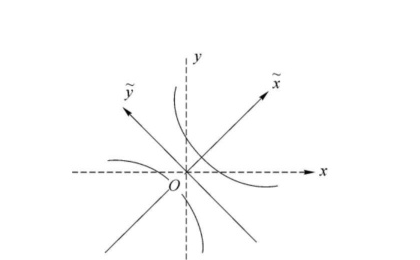
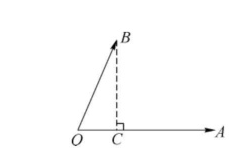
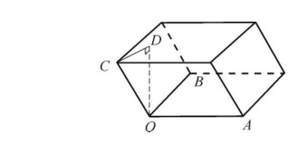

import ExerciseTrigger from '@/components/exercises/ExerciseTrigger.astro';

import Guide from '@/components/Guide.astro';
import Knowledge from '@/components/Knowledge.astro';
import Example from '@/components/Example.astro';
import Analysis from '@/components/Analysis.astro';
import Solution from '@/components/Solution.astro';
import Variant from '@/components/Variant.astro';
import Note from '@/components/Note.astro';
import SideNote from '@/components/SideNote.astro';
import Block from '@/components/Block.astro';
import Method from '@/components/Method.astro';
import Exercise from '@/components/Exercise.astro';

我们知道，平面直角坐标系中的曲线 $\frac{x^2}{a^2} + \frac{y^2}{b^2} = 1$ 是一个圆或椭圆，曲线 $\frac{x^2}{a^2} - \frac{y^2}{b^2} = 1$ 是实轴为 $x$ 轴的双曲线。那么曲线 $x^2 + 4xy + y^2 = 3$ 是一条怎样的曲线呢？在原来的坐标系下讨论这条曲线有些不便，为此，保持原点不动，新建一个以 $\tilde{x}$ 轴、$\tilde{y}$ 轴为坐标轴的直角坐标系进行讨论。

设在原坐标系中坐标为 $(x, y)^\mathrm{T}$ 的向量在新坐标系下的坐标为 $(\tilde{x}, \tilde{y})^\mathrm{T}$，且

$$
\begin{pmatrix} x \\ y \end{pmatrix} =
\begin{pmatrix}
\frac{1}{\sqrt{2}} & -\frac{1}{\sqrt{2}} \\
\frac{1}{\sqrt{2}} & \frac{1}{\sqrt{2}}
\end{pmatrix}
\begin{pmatrix} \tilde{x} \\ \tilde{y} \end{pmatrix}, \quad
\text{即 }
\begin{cases}
x = \frac{1}{\sqrt{2}}(\tilde{x} - \tilde{y}), \\
y = \frac{1}{\sqrt{2}}(\tilde{x} + \tilde{y}).
\end{cases}
$$

不难发现，在新坐标系下坐标为 $(\tilde{x}, \tilde{y})^\mathrm{T} = (1, 0)^\mathrm{T}$ 的向量，在原坐标系下的坐标为 $(x, y)^\mathrm{T} = \left(\frac{1}{\sqrt{2}}, \frac{1}{\sqrt{2}}\right)^\mathrm{T}$；在新坐标系下坐标为 $(\tilde{x}, \tilde{y})^\mathrm{T} = (0, 1)^\mathrm{T}$ 的向量，在原坐标系下的坐标为 $(x, y)^\mathrm{T} = \left(-\frac{1}{\sqrt{2}}, \frac{1}{\sqrt{2}}\right)^\mathrm{T}$。也就是说，原平面直角坐标系中的向量 $\boldsymbol{\alpha} = \left(\frac{1}{\sqrt{2}}, \frac{1}{\sqrt{2}}\right)^\mathrm{T}$ 与 $\boldsymbol{\beta} = \left(-\frac{1}{\sqrt{2}}, \frac{1}{\sqrt{2}}\right)^\mathrm{T}$ 分别为新坐标系中 $\tilde{x}$ 轴、$\tilde{y}$ 轴的正向单位向量。

在新坐标系下来看原来的那条曲线 $x^2 + 4xy + y^2 = 3$。将

$$
x = \frac{1}{\sqrt{2}}(\tilde{x} - \tilde{y}), \quad y = \frac{1}{\sqrt{2}}(\tilde{x} + \tilde{y})
$$

代入方程 $x^2 + 4xy + y^2 = 3$，得 $\tilde{x}^2 - \frac{\tilde{y}^2}{3} = 1$。这就是曲线在新坐标系下的方程，它是实轴为 $\tilde{x}$ 轴的双曲线。

<figure class="vp-figure">
  
  <figcaption>图 7.1 坐标轴旋转下的双曲线方程</figcaption>
</figure>

一般来说，对于平面直角坐标系中的二次齐次曲线 $ax^2 + 2bxy + cy^2 = d$，可通过直角坐标系的变换，将曲线方程化为 $\lambda \tilde{x}^2 + \mu \tilde{y}^2 = 1$，以便了解曲线的形状。事实上，对于 $n$ 个变量的二次齐次式，都可以通过坐标变换，将其转化为只含平方项的形式。如何进行这样的转化呢？这正是本章要讨论的核心问题。下面先从 $\mathbb{R}^n$ 中的“直角坐标系”说起。

## 一、向量的内积

先将 $\mathbb{R}^3$ 中有关内积、长度、夹角等概念推广到 $\mathbb{R}^n$ 中。

<Knowledge title="定义 1 向量的内积">

设 $\mathbb{R}^n$ 中向量 $\boldsymbol{\alpha} = (a_1, a_2, \dots, a_n)^\mathrm{T}, \boldsymbol{\beta} = (b_1, b_2, \dots, b_n)^\mathrm{T}$，令

$$
(\boldsymbol{\alpha}, \boldsymbol{\beta}) = \boldsymbol{\alpha}^\mathrm{T}\boldsymbol{\beta} = \sum_{i=1}^n a_i b_i,
$$

称 $(\boldsymbol{\alpha}, \boldsymbol{\beta})$ 为 $\boldsymbol{\alpha}$ 与 $\boldsymbol{\beta}$ 的**内积**。

</Knowledge>

<SideNote title="内积与矩阵乘积的关系">

严格意义上 $\boldsymbol{\alpha}^\mathrm{T}\boldsymbol{\beta}$ 是 1 行 1 列的矩阵，此处仅代表其实数元素。

</SideNote>

<Example title="例 1 求向量内积">

求向量 $\boldsymbol{\alpha} = (-1, -3, -2, 7)^\mathrm{T}, \boldsymbol{\beta} = (4, -2, 1, 0)^\mathrm{T}$ 的内积。

</Example>

<Solution title="解">

$$
(\boldsymbol{\alpha}, \boldsymbol{\beta}) = (-1) \times 4 + (-3) \times (-2) + (-2) \times 1 + 7 \times 0 = 0.
$$

</Solution>

不难验证向量的内积运算具有以下基本性质：
1. **对称性**：对任意的 $\boldsymbol{\alpha}, \boldsymbol{\beta} \in \mathbb{R}^n$，$(\boldsymbol{\alpha}, \boldsymbol{\beta}) = (\boldsymbol{\beta}, \boldsymbol{\alpha})$；
2. **线性性**：对任意的 $\boldsymbol{\alpha}, \boldsymbol{\beta}, \boldsymbol{\gamma} \in \mathbb{R}^n$，$(\boldsymbol{\alpha} + \boldsymbol{\beta}, \boldsymbol{\gamma}) = (\boldsymbol{\alpha}, \boldsymbol{\gamma}) + (\boldsymbol{\beta}, \boldsymbol{\gamma})$；且对任意的 $\boldsymbol{\alpha}, \boldsymbol{\beta} \in \mathbb{R}^n$ 及任意 $k \in \mathbb{R}$，$(k\boldsymbol{\alpha}, \boldsymbol{\beta}) = k(\boldsymbol{\alpha}, \boldsymbol{\beta})$；
3. **正定性**：对任意的 $\boldsymbol{\alpha} \in \mathbb{R}^n$，$(\boldsymbol{\alpha}, \boldsymbol{\alpha}) \geqslant 0$，而且 $(\boldsymbol{\alpha}, \boldsymbol{\alpha}) = 0 \iff \boldsymbol{\alpha} = \mathbf{0}$。

下面的柯西–施瓦茨（Cauchy-Schwarz）不等式是内积的一条重要性质。

<Knowledge title="定理 1 柯西–施瓦茨（Cauchy-Schwarz）不等式">

对任意 $\boldsymbol{\alpha}, \boldsymbol{\beta} \in \mathbb{R}^n$，有

$$
(\boldsymbol{\alpha}, \boldsymbol{\beta})^2 \leqslant (\boldsymbol{\alpha}, \boldsymbol{\alpha}) (\boldsymbol{\beta}, \boldsymbol{\beta}),
$$

等号当且仅当 $\boldsymbol{\alpha}$ 与 $\boldsymbol{\beta}$ 线性相关时成立。

</Knowledge>

<Solution title="证明">

若 $\boldsymbol{\beta} = \mathbf{0}$，显然等号成立。

设 $\boldsymbol{\beta} \neq \mathbf{0}$，则 $(\boldsymbol{\beta}, \boldsymbol{\beta}) > 0$。令 $\boldsymbol{\gamma} = \boldsymbol{\alpha} + t\boldsymbol{\beta}$，则对任意实数 $t$，有

$$
(\boldsymbol{\gamma}, \boldsymbol{\gamma}) = (\boldsymbol{\alpha} + t\boldsymbol{\beta}, \boldsymbol{\alpha} + t\boldsymbol{\beta}) = (\boldsymbol{\alpha}, \boldsymbol{\alpha}) + 2(\boldsymbol{\alpha}, \boldsymbol{\beta})t + (\boldsymbol{\beta}, \boldsymbol{\beta})t^2 \geqslant 0,
$$

（等号成立当且仅当 $\boldsymbol{\gamma} = \boldsymbol{\alpha} + t\boldsymbol{\beta} = \mathbf{0}$）。

于是可知这个 $t$ 的二次三项式的判别式

$$
\Delta = 4(\boldsymbol{\alpha}, \boldsymbol{\beta})^2 - 4(\boldsymbol{\beta}, \boldsymbol{\beta})(\boldsymbol{\alpha}, \boldsymbol{\alpha}) \leqslant 0,
$$

即 $(\boldsymbol{\alpha}, \boldsymbol{\beta})^2 \leqslant (\boldsymbol{\alpha}, \boldsymbol{\alpha})(\boldsymbol{\beta}, \boldsymbol{\beta})$，不等式得证。

接下来证明等式成立并且仅当 $\boldsymbol{\alpha}$ 与 $\boldsymbol{\beta}$ 线性相关。

当 $\boldsymbol{\alpha}, \boldsymbol{\beta}$ 线性相关时，如果 $\boldsymbol{\beta} = \mathbf{0}$，显然 $(\boldsymbol{\alpha}, \boldsymbol{\beta})^2 = (\boldsymbol{\alpha}, \boldsymbol{\alpha})(\boldsymbol{\beta}, \boldsymbol{\beta})$；如果 $\boldsymbol{\beta} \neq \mathbf{0}$，则存在实数 $k$，使 $\boldsymbol{\alpha} = k\boldsymbol{\beta}$，此时 $(\boldsymbol{\alpha}, \boldsymbol{\beta})^2 = (k\boldsymbol{\beta}, \boldsymbol{\beta})^2 = k^2(\boldsymbol{\beta}, \boldsymbol{\beta})^2 = (\boldsymbol{\alpha}, \boldsymbol{\alpha})(\boldsymbol{\beta}, \boldsymbol{\beta})$，等式成立。

反之，当等式成立，即 $(\boldsymbol{\alpha}, \boldsymbol{\beta})^2 = (\boldsymbol{\alpha}, \boldsymbol{\alpha})(\boldsymbol{\beta}, \boldsymbol{\beta})$ 时，如果 $\boldsymbol{\beta} = \mathbf{0}$，则 $\boldsymbol{\alpha}$ 与 $\boldsymbol{\beta}$ 线性相关；如果 $\boldsymbol{\beta} \neq \mathbf{0}$，因为二次方程 $t^2(\boldsymbol{\beta}, \boldsymbol{\beta}) + 2t(\boldsymbol{\alpha}, \boldsymbol{\beta}) + (\boldsymbol{\alpha}, \boldsymbol{\alpha}) = 0$ 的判别式

$$
\Delta = 4(\boldsymbol{\alpha}, \boldsymbol{\beta})^2 - 4(\boldsymbol{\beta}, \boldsymbol{\beta})(\boldsymbol{\alpha}, \boldsymbol{\alpha}) = 0,
$$

所以该方程有唯一实根 $t = t_0$，即

$$
t_0^2(\boldsymbol{\beta}, \boldsymbol{\beta}) + 2t_0(\boldsymbol{\alpha}, \boldsymbol{\beta}) + (\boldsymbol{\alpha}, \boldsymbol{\alpha}) = 0,
$$

$$
(t_0\boldsymbol{\beta} + \boldsymbol{\alpha}, t_0\boldsymbol{\beta} + \boldsymbol{\alpha}) = 0,
$$

$$
t_0\boldsymbol{\beta} + \boldsymbol{\alpha} = \mathbf{0},
$$

$\boldsymbol{\alpha}$ 与 $\boldsymbol{\beta}$ 线性相关。

</Solution>

有了内积以后，可定义向量的长度。

<Knowledge title="定义 2 向量的长度与单位向量">

设 $\boldsymbol{\alpha} \in \mathbb{R}^n$，令 $\|\boldsymbol{\alpha}\| = \sqrt{(\boldsymbol{\alpha}, \boldsymbol{\alpha})}$，称 $\|\boldsymbol{\alpha}\|$ 为 $\boldsymbol{\alpha}$ 的**长度**（或**范数**）。当 $\|\boldsymbol{\alpha}\| = 1$ 时，称 $\boldsymbol{\alpha}$ 为**单位向量**。

</Knowledge>

很明显，$\boldsymbol{\alpha} = (a_1, a_2, \dots, a_n)^\mathrm{T}$ 为单位向量当且仅当 $\sum_{i=1}^n a_i^2 = 1$。

向量的长度有以下三条基本性质：
1. **非负性**：对任意 $\boldsymbol{\alpha} \in \mathbb{R}^n$，$\|\boldsymbol{\alpha}\| \geqslant 0$ 且 $\|\boldsymbol{\alpha}\| = 0 \iff \boldsymbol{\alpha} = \mathbf{0}$；
2. **齐次性**：对任意 $\boldsymbol{\alpha} \in \mathbb{R}^n$ 及任意 $k \in \mathbb{R}$，

$$
\|k\boldsymbol{\alpha}\| = \sqrt{(k\boldsymbol{\alpha}, k\boldsymbol{\alpha})} = \sqrt{k^2(\boldsymbol{\alpha}, \boldsymbol{\alpha})} = |k| \times \|\boldsymbol{\alpha}\|.
$$

这里 $|k|$ 是数 $k$ 的绝对值。由齐次性可知：当 $\boldsymbol{\alpha} \neq \mathbf{0}$ 时，$\left\|\frac{1}{\|\boldsymbol{\alpha}\|}\boldsymbol{\alpha}\right\| = \frac{1}{\|\boldsymbol{\alpha}\|} \times \|\boldsymbol{\alpha}\| = 1$。也就是说，$\frac{\boldsymbol{\alpha}}{\|\boldsymbol{\alpha}\|}$ 是单位向量，称为向量 $\boldsymbol{\alpha}$ 的**单位化**。

3. **三角不等式**：对任意 $\boldsymbol{\alpha}, \boldsymbol{\beta} \in \mathbb{R}^n$，$\|\boldsymbol{\alpha} + \boldsymbol{\beta}\| \leqslant \|\boldsymbol{\alpha}\| + \|\boldsymbol{\beta}\|$。

<Solution title="证明">

$$
\|\boldsymbol{\alpha} + \boldsymbol{\beta}\|^2 = (\boldsymbol{\alpha} + \boldsymbol{\beta}, \boldsymbol{\alpha} + \boldsymbol{\beta}) = (\boldsymbol{\alpha}, \boldsymbol{\alpha}) + (\boldsymbol{\beta}, \boldsymbol{\beta}) + 2(\boldsymbol{\alpha}, \boldsymbol{\beta}) \leqslant \|\boldsymbol{\alpha}\|^2 + \|\boldsymbol{\beta}\|^2 + 2|(\boldsymbol{\alpha}, \boldsymbol{\beta})|.
$$

由柯西–施瓦茨不等式 $(\boldsymbol{\alpha}, \boldsymbol{\beta})^2 \leqslant (\boldsymbol{\alpha}, \boldsymbol{\alpha})(\boldsymbol{\beta}, \boldsymbol{\beta})$，即 $|(\boldsymbol{\alpha}, \boldsymbol{\beta})| \leqslant \|\boldsymbol{\alpha}\| \times \|\boldsymbol{\beta}\|$，可得

$$
\|\boldsymbol{\alpha} + \boldsymbol{\beta}\|^2 \leqslant \|\boldsymbol{\alpha}\|^2 + \|\boldsymbol{\beta}\|^2 + 2\|\boldsymbol{\alpha}\| \times \|\boldsymbol{\beta}\| = (\|\boldsymbol{\alpha}\| + \|\boldsymbol{\beta}\|)^2,
$$

两边开方，即得需证的三角不等式。三角不等式的几何含义是，平面三角形的两边的长度之和大于第三边的长度。

</Solution>

我们知道在 $\mathbb{R}^3$ 中非零向量 $\boldsymbol{a}$ 与 $\boldsymbol{b}$ 的内积为 $\boldsymbol{a} \cdot \boldsymbol{b} = |\boldsymbol{a}| \, |\boldsymbol{b}| \cos\theta$，其中 $\theta$ 是向量 $\boldsymbol{a}$ 与 $\boldsymbol{b}$ 的夹角，这说明 $\cos\theta = \frac{\boldsymbol{a} \cdot \boldsymbol{b}}{|\boldsymbol{a}| \, |\boldsymbol{b}|}$。由柯西–施瓦茨不等式可知对任意 $\mathbb{R}^n$ 中的非零向量 $\boldsymbol{\alpha}, \boldsymbol{\beta}$，

$$
\frac{|(\boldsymbol{\alpha}, \boldsymbol{\beta})|}{\|\boldsymbol{\alpha}\| \, \|\boldsymbol{\beta}\|} \leqslant 1.
$$

因此可将 $\mathbb{R}^3$ 中的夹角概念推广到 $\mathbb{R}^n$。

<Knowledge title="定义 3 夹角与正交">

设 $\boldsymbol{\alpha}, \boldsymbol{\beta}$ 为 $\mathbb{R}^n$ 中的非零向量，称

$$
\theta = \arccos \frac{(\boldsymbol{\alpha}, \boldsymbol{\beta})}{\|\boldsymbol{\alpha}\| \, \|\boldsymbol{\beta}\|}
$$

为 $\boldsymbol{\alpha}$ 与 $\boldsymbol{\beta}$ 的**夹角**。特别地，当 $\theta = \frac{\pi}{2}$ 即 $(\boldsymbol{\alpha}, \boldsymbol{\beta}) = 0$ 时，称 $\boldsymbol{\alpha}$ 与 $\boldsymbol{\beta}$ **正交**，记为 $\boldsymbol{\alpha} \perp \boldsymbol{\beta}$。

零向量与其他向量的夹角是不确定的，我们认为零向量与任意向量都正交。

</Knowledge>

<Example title="例 2 求与给定向量均正交的非零向量">

求出非零向量 $\boldsymbol{\gamma}$，使得 $\boldsymbol{\gamma}$ 与 $\boldsymbol{\alpha} = (1, 1, 1)$ 和 $\boldsymbol{\beta} = (1, -2, 1)$ 都正交。

</Example>

<Solution title="解">

设 $\boldsymbol{\gamma} = (x_1, x_2, x_3)$，则有

$$
\begin{cases}
x_1 + x_2 + x_3 = 0, \\
x_1 - 2x_2 + x_3 = 0.
\end{cases}
$$

其一般解为 $x_2 = 0, x_3 = -x_1$。于是 $\boldsymbol{\gamma} = (a, 0, -a)$，$a$ 为任意非零实数。

</Solution>

<Example title="例 3 勾股定理推广">

设 $\mathbb{R}^n$ 中向量 $\boldsymbol{\alpha}$ 与 $\boldsymbol{\beta}$ 正交，求证：$\|\boldsymbol{\alpha} + \boldsymbol{\beta}\|^2 = \|\boldsymbol{\alpha}\|^2 + \|\boldsymbol{\beta}\|^2$。

</Example>

<Solution title="证">

因为 $(\boldsymbol{\alpha}, \boldsymbol{\beta}) = 0$，所以

$$
\|\boldsymbol{\alpha} + \boldsymbol{\beta}\|^2 = (\boldsymbol{\alpha} + \boldsymbol{\beta}, \boldsymbol{\alpha} + \boldsymbol{\beta}) = (\boldsymbol{\alpha}, \boldsymbol{\alpha}) + (\boldsymbol{\beta}, \boldsymbol{\beta}) + 2(\boldsymbol{\alpha}, \boldsymbol{\beta}) = \|\boldsymbol{\alpha}\|^2 + \|\boldsymbol{\beta}\|^2.
$$

</Solution>

## 二、标准正交基

<Knowledge title="定义 4 正交向量组与标准正交向量组">

如果 $\mathbb{R}^n$ 中的非零向量 $\boldsymbol{\alpha}_1, \boldsymbol{\alpha}_2, \dots, \boldsymbol{\alpha}_m$ 两两正交，则称向量组 $\boldsymbol{\alpha}_1, \boldsymbol{\alpha}_2, \dots, \boldsymbol{\alpha}_m$ 为**正交向量组**。由单位向量构成的正交向量组称为**标准正交向量组**或**规范正交向量组**。

</Knowledge>

正交向量组有下面的性质：

<Knowledge title="定理 2 正交向量组线性无关">

设 $\boldsymbol{\alpha}_1, \boldsymbol{\alpha}_2, \dots, \boldsymbol{\alpha}_m$ 为正交向量组，则 $\boldsymbol{\alpha}_1, \boldsymbol{\alpha}_2, \dots, \boldsymbol{\alpha}_m$ 线性无关。

</Knowledge>

<Solution title="证">

设 $k_1\boldsymbol{\alpha}_1 + k_2\boldsymbol{\alpha}_2 + \cdots + k_m\boldsymbol{\alpha}_m = \mathbf{0}$，则

$$
(k_1\boldsymbol{\alpha}_1 + k_2\boldsymbol{\alpha}_2 + \cdots + k_m\boldsymbol{\alpha}_m, \boldsymbol{\alpha}_1) = (\mathbf{0}, \boldsymbol{\alpha}_1) = 0.
$$

于是得 $k_1(\boldsymbol{\alpha}_1, \boldsymbol{\alpha}_1) = 0$。由 $\boldsymbol{\alpha}_1 \neq \mathbf{0}$ 可知 $(\boldsymbol{\alpha}_1, \boldsymbol{\alpha}_1) \neq 0$，因此 $k_1 = 0$。

类似可证 $k_2 = k_3 = \cdots = k_m = 0$，所以 $\boldsymbol{\alpha}_1, \boldsymbol{\alpha}_2, \dots, \boldsymbol{\alpha}_m$ 线性无关。

</Solution>

$\mathbb{R}^n$ 中任意 $n$ 个线性无关的向量都可作为 $\mathbb{R}^n$ 的一组基，因此根据定理 2，$\mathbb{R}^n$ 中 $n$ 个向量构成的正交向量组一定是 $\mathbb{R}^n$ 的一组基。

<Knowledge title="定义 5 正交基与标准正交基">

如果 $\mathbb{R}^n$ 中的 $n$ 个向量 $\boldsymbol{\alpha}_1, \boldsymbol{\alpha}_2, \dots, \boldsymbol{\alpha}_n$ 构成一个正交向量组，则称 $\boldsymbol{\alpha}_1, \boldsymbol{\alpha}_2, \dots, \boldsymbol{\alpha}_n$ 为 $\mathbb{R}^n$ 的一组**正交基**。由单位向量构成的正交基称为**标准正交基**或**规范正交基**。

</Knowledge>

显然，$\mathbb{R}^n$ 中的自然基 $\boldsymbol{\varepsilon}_1 = (1, 0, \dots, 0)^\mathrm{T}, \boldsymbol{\varepsilon}_2 = (0, 1, \dots, 0)^\mathrm{T}, \dots, \boldsymbol{\varepsilon}_n = (0, 0, \dots, 1)^\mathrm{T}$ 就是一组标准正交基。那么，怎样去寻找 $\mathbb{R}^n$ 中的其他标准正交基呢？先来介绍利用线性无关的向量组去构造与之等价的正交向量组的方法。

## 三、施密特（Schmidt）正交化方法

施密特正交化方法要解决的问题是：已知 $\mathbb{R}^n$ 中线性无关的向量组 $\boldsymbol{\alpha}_1, \boldsymbol{\alpha}_2, \dots, \boldsymbol{\alpha}_m$，如何求正交向量组 $\boldsymbol{\beta}_1, \boldsymbol{\beta}_2, \dots, \boldsymbol{\beta}_m$，使得 $\boldsymbol{\beta}_1, \boldsymbol{\beta}_2, \dots, \boldsymbol{\beta}_m$ 与 $\boldsymbol{\alpha}_1, \boldsymbol{\alpha}_2, \dots, \boldsymbol{\alpha}_m$ 等价。

先在 $\mathbb{R}^3$ 中借助几何直观来进行分析，看看如何解决上面的问题。限于在 $\mathbb{R}^3$ 中，$m$ 只能取 2 或 3，下面分情形讨论。

### 情形 1 ($m=2$ 时)

设 $\boldsymbol{\alpha}_1, \boldsymbol{\alpha}_2$ 是 $\mathbb{R}^3$ 中的线性无关的 2 个向量，即 $\boldsymbol{\alpha}_1$ 与 $\boldsymbol{\alpha}_2$ 不平行。

设 $\boldsymbol{\alpha}_1 = \overrightarrow{OA}, \boldsymbol{\alpha}_2 = \overrightarrow{OB}$，从点 $B$ 向直线 $OA$ 引垂线，设垂足为 $C$。因为 $\overrightarrow{OC}$ 与 $\overrightarrow{OA}$ 共线，所以存在常数 $k$，使 $\overrightarrow{OC} = k\overrightarrow{OA}$。显然，如果取 $\boldsymbol{\beta}_1 = \boldsymbol{\alpha}_1 = \overrightarrow{OA}, \boldsymbol{\beta}_2 = \overrightarrow{CB} = \overrightarrow{OB} - \overrightarrow{OC} = \boldsymbol{\alpha}_2 - k\boldsymbol{\beta}_1$，则 $\boldsymbol{\beta}_2$ 与 $\boldsymbol{\beta}_1$ 正交，且可验证 $\boldsymbol{\beta}_1, \boldsymbol{\beta}_2$ 与 $\boldsymbol{\alpha}_1, \boldsymbol{\alpha}_2$ 等价。

<figure class="vp-figure">
  
  <figcaption>图 7.2 二维平面施密特正交投影</figcaption>
</figure>

接下来确定 $k$ 的值。因为 $(\boldsymbol{\beta}_1, \boldsymbol{\beta}_2) = 0$，即 $(\boldsymbol{\beta}_1, \boldsymbol{\alpha}_2 - k\boldsymbol{\beta}_1) = 0$，所以

$$
k = \frac{(\boldsymbol{\alpha}_2, \boldsymbol{\beta}_1)}{(\boldsymbol{\beta}_1, \boldsymbol{\beta}_1)}.
$$

总相，当 $m=2$ 时，令

$$
\boldsymbol{\beta}_1 = \boldsymbol{\alpha}_1, \quad
\boldsymbol{\beta}_2 = \boldsymbol{\alpha}_2 - \frac{(\boldsymbol{\alpha}_2, \boldsymbol{\beta}_1)}{(\boldsymbol{\beta}_1, \boldsymbol{\beta}_1)}\boldsymbol{\beta}_1,
$$

则 $\boldsymbol{\beta}_2$ 与 $\boldsymbol{\beta}_1$ 正交，且 $\boldsymbol{\beta}_1, \boldsymbol{\beta}_2$ 与 $\boldsymbol{\alpha}_1, \boldsymbol{\alpha}_2$ 等价。

### 情形 2 ($m=3$ 时)

设 $\boldsymbol{\alpha}_1, \boldsymbol{\alpha}_2, \boldsymbol{\alpha}_3$ 是 $\mathbb{R}^3$ 中的线性无关的三个向量，即 $\boldsymbol{\alpha}_1, \boldsymbol{\alpha}_2, \boldsymbol{\alpha}_3$ 不共面。

由上面的讨论可知，若令 $\boldsymbol{\beta}_1 = \boldsymbol{\alpha}_1, \boldsymbol{\beta}_2 = \boldsymbol{\alpha}_2 - \frac{(\boldsymbol{\alpha}_2, \boldsymbol{\beta}_1)}{(\boldsymbol{\beta}_1, \boldsymbol{\beta}_1)}\boldsymbol{\beta}_1$，则 $\boldsymbol{\beta}_2$ 与 $\boldsymbol{\beta}_1$ 正交，且 $\boldsymbol{\beta}_1, \boldsymbol{\beta}_2$ 与 $\boldsymbol{\alpha}_1, \boldsymbol{\alpha}_2$ 等价。还需找出 $\boldsymbol{\beta}_3$，使 $\boldsymbol{\beta}_3$ 与 $\boldsymbol{\beta}_1, \boldsymbol{\beta}_2$ 都正交。

设 $\boldsymbol{\alpha}_1 = \overrightarrow{OA}, \boldsymbol{\alpha}_2 = \overrightarrow{OB}, \boldsymbol{\alpha}_3 = \overrightarrow{OC}$，以 $OA, OB, OC$ 为棱构成了一个平行六面体。从原点 $O$ 向六面体的上底面引垂线，设垂足为 $D$。可取 $\boldsymbol{\beta}_3 = \overrightarrow{OD} = \overrightarrow{OC} + \overrightarrow{CD}$。向量 $\overrightarrow{CD}$ 平行于六面体的下底面，所以 $\overrightarrow{CD}$ 可由 $\boldsymbol{\alpha}_1, \boldsymbol{\alpha}_2$ 线性表示，因此可由 $\boldsymbol{\beta}_1, \boldsymbol{\beta}_2$ 线性表示。也就是说，存在常数 $k_1, k_2$，使 $\overrightarrow{CD} = k_1\boldsymbol{\beta}_1 + k_2\boldsymbol{\beta}_2$，于是

$$
\boldsymbol{\beta}_3 = \overrightarrow{OC} + \overrightarrow{CD} = \boldsymbol{\alpha}_3 + k_1\boldsymbol{\beta}_1 + k_2\boldsymbol{\beta}_2.
$$

<figure class="vp-figure">
  
  <figcaption>图 7.3 三维空间平行六面体正交化</figcaption>
</figure>

接下来确定 $k_1, k_2$ 的值。因为 $(\boldsymbol{\beta}_1, \boldsymbol{\beta}_2) = 0$，由 $(\boldsymbol{\beta}_1, \boldsymbol{\beta}_3) = 0$，即 $(\boldsymbol{\beta}_1, \boldsymbol{\alpha}_3 + k_1\boldsymbol{\beta}_1 + k_2\boldsymbol{\beta}_2) = 0$，可得

$$
k_1 = -\frac{(\boldsymbol{\alpha}_3, \boldsymbol{\beta}_1)}{(\boldsymbol{\beta}_1, \boldsymbol{\beta}_1)}.
$$

类似地，由 $(\boldsymbol{\beta}_2, \boldsymbol{\beta}_3) = 0$，即 $(\boldsymbol{\beta}_2, \boldsymbol{\alpha}_3 + k_1\boldsymbol{\beta}_1 + k_2\boldsymbol{\beta}_2) = 0$，可得

$$
k_2 = -\frac{(\boldsymbol{\alpha}_3, \boldsymbol{\beta}_2)}{(\boldsymbol{\beta}_2, \boldsymbol{\beta}_2)}.
$$

总相，当 $m=3$ 时，令

$$
\boldsymbol{\beta}_1 = \boldsymbol{\alpha}_1, \quad
\boldsymbol{\beta}_2 = \boldsymbol{\alpha}_2 - \frac{(\boldsymbol{\alpha}_2, \boldsymbol{\beta}_1)}{(\boldsymbol{\beta}_1, \boldsymbol{\beta}_1)}\boldsymbol{\beta}_1, \quad
\boldsymbol{\beta}_3 = \boldsymbol{\alpha}_3 - \frac{(\boldsymbol{\alpha}_3, \boldsymbol{\beta}_1)}{(\boldsymbol{\beta}_1, \boldsymbol{\beta}_1)}\boldsymbol{\beta}_1 - \frac{(\boldsymbol{\alpha}_3, \boldsymbol{\beta}_2)}{(\boldsymbol{\beta}_2, \boldsymbol{\beta}_2)}\boldsymbol{\beta}_2,
$$

则 $\boldsymbol{\beta}_1, \boldsymbol{\beta}_2, \boldsymbol{\beta}_3$ 两两正交，且可验证 $\boldsymbol{\beta}_1, \boldsymbol{\beta}_2, \boldsymbol{\beta}_3$ 与 $\boldsymbol{\alpha}_1, \boldsymbol{\alpha}_2, \boldsymbol{\alpha}_3$ 等价。

至此，在 $\mathbb{R}^3$ 中解决了最初面临的问题。将上面的方法推广到 $\mathbb{R}^n$ 中，得到下面的定理。

<Knowledge title="定理 3 施密特（Schmidt）正交化定理">

设 $\boldsymbol{\alpha}_1, \boldsymbol{\alpha}_2, \dots, \boldsymbol{\alpha}_m$ 是 $\mathbb{R}^n$ 中线性无关的向量组。令

$$
\begin{aligned}
\boldsymbol{\beta}_1 &= \boldsymbol{\alpha}_1, \\
\boldsymbol{\beta}_2 &= \boldsymbol{\alpha}_2 - \frac{(\boldsymbol{\alpha}_2, \boldsymbol{\beta}_1)}{(\boldsymbol{\beta}_1, \boldsymbol{\beta}_1)}\boldsymbol{\beta}_1, \\
\boldsymbol{\beta}_3 &= \boldsymbol{\alpha}_3 - \frac{(\boldsymbol{\alpha}_3, \boldsymbol{\beta}_1)}{(\boldsymbol{\beta}_1, \boldsymbol{\beta}_1)}\boldsymbol{\beta}_1 - \frac{(\boldsymbol{\alpha}_3, \boldsymbol{\beta}_2)}{(\boldsymbol{\beta}_2, \boldsymbol{\beta}_2)}\boldsymbol{\beta}_2, \\
&\quad \vdots \\
\boldsymbol{\beta}_m &= \boldsymbol{\alpha}_m - \frac{(\boldsymbol{\alpha}_m, \boldsymbol{\beta}_1)}{(\boldsymbol{\beta}_1, \boldsymbol{\beta}_1)}\boldsymbol{\beta}_1 - \frac{(\boldsymbol{\alpha}_m, \boldsymbol{\beta}_2)}{(\boldsymbol{\beta}_2, \boldsymbol{\beta}_2)}\boldsymbol{\beta}_2 - \cdots - \frac{(\boldsymbol{\alpha}_m, \boldsymbol{\beta}_{m-1})}{(\boldsymbol{\beta}_{m-1}, \boldsymbol{\beta}_{m-1})}\boldsymbol{\beta}_{m-1},
\end{aligned}
$$

则 $\boldsymbol{\beta}_1, \boldsymbol{\beta}_2, \dots, \boldsymbol{\beta}_m$ 两两正交且与 $\boldsymbol{\alpha}_1, \boldsymbol{\alpha}_2, \dots, \boldsymbol{\alpha}_m$ 等价。

</Knowledge>

这个定理给出了从已知的线性无关的向量组，去构造与之等价的正交向量组的方法，称为**施密特（Schmidt）正交化方法**。

设 $\boldsymbol{\alpha}_1, \boldsymbol{\alpha}_2, \dots, \boldsymbol{\alpha}_m$ 为 $\mathbb{R}^n$ 中的线性无关的向量组，利用施密特正交化方法，可以得到与之等价的正交向量组 $\boldsymbol{\beta}_1, \boldsymbol{\beta}_2, \dots, \boldsymbol{\beta}_m$，再令

$$
\boldsymbol{e}_i = \frac{\boldsymbol{\beta}_i}{\|\boldsymbol{\beta}_i\|} \quad (\text{即将 } \boldsymbol{\beta}_i \text{ 单位化}), \quad i = 1, 2, \dots, m,
$$

则可得到与 $\boldsymbol{\alpha}_1, \boldsymbol{\alpha}_2, \dots, \boldsymbol{\alpha}_m$ 等价的标准正交向量组 $\boldsymbol{e}_1, \boldsymbol{e}_2, \dots, \boldsymbol{e}_m$。这个过程称为向量组 $\boldsymbol{\alpha}_1, \boldsymbol{\alpha}_2, \dots, \boldsymbol{\alpha}_m$ 的**标准正交化**（或规范正交化）过程。当 $\boldsymbol{\alpha}_1, \boldsymbol{\alpha}_2, \dots, \boldsymbol{\alpha}_n$ 为 $\mathbb{R}^n$ 的一组基时，对 $\boldsymbol{\alpha}_1, \boldsymbol{\alpha}_2, \dots, \boldsymbol{\alpha}_n$ 进行标准正交化，便可得到 $\mathbb{R}^n$ 的一组标准正交基 $\boldsymbol{e}_1, \boldsymbol{e}_2, \dots, \boldsymbol{e}_n$。

<Example title="例 4 标准正交化计算">

将 $\boldsymbol{\alpha}_1 = \begin{pmatrix} 1 \\ 2 \\ -1 \end{pmatrix}, \boldsymbol{\alpha}_2 = \begin{pmatrix} -1 \\ 3 \\ 1 \end{pmatrix}, \boldsymbol{\alpha}_3 = \begin{pmatrix} 4 \\ -1 \\ 0 \end{pmatrix}$ 标准正交化。

</Example>

<Solution title="解">

令 $\boldsymbol{\beta}_1 = \boldsymbol{\alpha}_1 = \begin{pmatrix} 1 \\ 2 \\ -1 \end{pmatrix}$。

$$
\boldsymbol{\beta}_2 = \boldsymbol{\alpha}_2 - \frac{(\boldsymbol{\alpha}_2, \boldsymbol{\beta}_1)}{(\boldsymbol{\beta}_1, \boldsymbol{\beta}_1)}\boldsymbol{\beta}_1 = \begin{pmatrix} -1 \\ 3 \\ 1 \end{pmatrix} - \frac{4}{6}\begin{pmatrix} 1 \\ 2 \\ -1 \end{pmatrix} = \frac{5}{3}\begin{pmatrix} -1 \\ 1 \\ 1 \end{pmatrix}.
$$

$$
\boldsymbol{\beta}_3 = \boldsymbol{\alpha}_3 - \frac{(\boldsymbol{\alpha}_3, \boldsymbol{\beta}_1)}{(\boldsymbol{\beta}_1, \boldsymbol{\beta}_1)}\boldsymbol{\beta}_1 - \frac{(\boldsymbol{\alpha}_3, \boldsymbol{\beta}_2)}{(\boldsymbol{\beta}_2, \boldsymbol{\beta}_2)}\boldsymbol{\beta}_2 = \begin{pmatrix} 4 \\ -1 \\ 0 \end{pmatrix} - \frac{2}{6}\begin{pmatrix} 1 \\ 2 \\ -1 \end{pmatrix} + \frac{5}{3}\begin{pmatrix} -1 \\ 1 \\ 1 \end{pmatrix} = 2\begin{pmatrix} 1 \\ 0 \\ 1 \end{pmatrix}.
$$

再将 $\boldsymbol{\beta}_1, \boldsymbol{\beta}_2, \boldsymbol{\beta}_3$ 单位化求得

$$
\boldsymbol{e}_1 = \frac{1}{\sqrt{6}}\begin{pmatrix} 1 \\ 2 \\ -1 \end{pmatrix}, \quad
\boldsymbol{e}_2 = \frac{1}{\sqrt{3}}\begin{pmatrix} -1 \\ 1 \\ 1 \end{pmatrix}, \quad
\boldsymbol{e}_3 = \frac{1}{\sqrt{2}}\begin{pmatrix} 1 \\ 0 \\ 1 \end{pmatrix}.
$$

$\boldsymbol{e}_1, \boldsymbol{e}_2, \boldsymbol{e}_3$ 即为与 $\boldsymbol{\alpha}_1, \boldsymbol{\alpha}_2, \boldsymbol{\alpha}_3$ 等价的标准正交向量组。

</Solution>

<Example title="例 5 构造正交非零向量组">

设 $\boldsymbol{\alpha} = (1, 1, 1)^\mathrm{T}$，求非零向量 $\boldsymbol{\alpha}_2, \boldsymbol{\alpha}_3$，使 $\boldsymbol{\alpha}_1, \boldsymbol{\alpha}_2, \boldsymbol{\alpha}_3$ 两两正交。

</Example>

<Solution title="解">

$\boldsymbol{\alpha}_2, \boldsymbol{\alpha}_3$ 应为方程 $x_1 + x_2 + x_3 = 0$ 的相互正交的非零解向量。该方程的基础解系为 $\boldsymbol{\xi}_1 = (-1, 1, 0)^\mathrm{T}, \boldsymbol{\xi}_2 = (-1, 0, 1)^\mathrm{T}$。将 $\boldsymbol{\xi}_1, \boldsymbol{\xi}_2$ 正交化，令

$$
\boldsymbol{\beta}_1 = \boldsymbol{\xi}_1 = (-1, 1, 0)^\mathrm{T},
$$

$$
\boldsymbol{\beta}_2 = \boldsymbol{\xi}_2 - \frac{(\boldsymbol{\xi}_2, \boldsymbol{\beta}_1)}{(\boldsymbol{\beta}_1, \boldsymbol{\beta}_1)}\boldsymbol{\beta}_1 = \begin{pmatrix} -1 \\ 0 \\ 1 \end{pmatrix} - \frac{1}{2}\begin{pmatrix} -1 \\ 1 \\ 0 \end{pmatrix} = \frac{1}{2}\begin{pmatrix} -1 \\ -1 \\ 2 \end{pmatrix}.
$$

取 $\boldsymbol{\alpha}_2 = \boldsymbol{\beta}_1 = (-1, 1, 0)^\mathrm{T}, \boldsymbol{\alpha}_3 = 2\boldsymbol{\beta}_2 = (-1, -1, 2)^\mathrm{T}$，则 $\boldsymbol{\alpha}_2, \boldsymbol{\alpha}_3$ 为所求。

</Solution>

找到了标准正交基后，$\mathbb{R}^n$ 中就建立了“直角坐标系”。本节的最后，我们来介绍将“直角坐标系”变成“直角坐标系”的坐标变换——正交变换。

## 四、正交矩阵与正交变换

<Knowledge title="定义 6 正交矩阵">

如果实方阵 $\boldsymbol{A}$ 满足 $\boldsymbol{A}^\mathrm{T}\boldsymbol{A} = \boldsymbol{E}$，则称 $\boldsymbol{A}$ 为**正交矩阵**。例如，$\begin{pmatrix} \cos\theta & \sin\theta \\ -\sin\theta & \cos\theta \end{pmatrix}$ 就是正交矩阵。

</Knowledge>

正交矩阵有下面的性质：

<Knowledge title="性质 1 正交矩阵行列式为 ±1">

如果 $\boldsymbol{A}$ 是正交矩阵，则 $|\boldsymbol{A}| = 1$ 或 $|\boldsymbol{A}| = -1$。

事实上，在 $\boldsymbol{A}^\mathrm{T}\boldsymbol{A} = \boldsymbol{E}$ 等式两边取行列式，由 $|\boldsymbol{A}^\mathrm{T}| = |\boldsymbol{A}|$ 可得 $|\boldsymbol{A}|^2 = 1$，所以必有 $|\boldsymbol{A}| = \pm 1$。

</Knowledge>

<Knowledge title="性质 2 转置即逆矩阵">

$\boldsymbol{A}$ 是正交矩阵 $\iff \boldsymbol{A}^\mathrm{T} = \boldsymbol{A}^{-1}$。

事实上，由 $\boldsymbol{A}^\mathrm{T}\boldsymbol{A} = \boldsymbol{E}$ 可得 $\boldsymbol{A}^{-1} = \boldsymbol{A}^\mathrm{T}$。反之，由 $\boldsymbol{A}^{-1} = \boldsymbol{A}^\mathrm{T}$ 可得 $\boldsymbol{A}^\mathrm{T}\boldsymbol{A} = \boldsymbol{E}$。

</Knowledge>

<Knowledge title="性质 3 转置矩阵与逆矩阵皆正交">

$\boldsymbol{A}$ 是正交矩阵 $\iff \boldsymbol{A}^\mathrm{T}$ 是正交矩阵。

事实上，$\boldsymbol{A}^\mathrm{T}\boldsymbol{A} = \boldsymbol{E} \iff \boldsymbol{A}^\mathrm{T} = \boldsymbol{A}^{-1} \iff \boldsymbol{A}\boldsymbol{A}^\mathrm{T} = \boldsymbol{E}$。这说明正交矩阵的转置矩阵和逆矩阵也是正交矩阵。

</Knowledge>

<Knowledge title="性质 4 正交矩阵之积仍正交">

如果 $\boldsymbol{A}, \boldsymbol{B}$ 都是 $n$ 阶正交矩阵，则 $\boldsymbol{A}\boldsymbol{B}$ 也是正交矩阵。

事实上，由 $\boldsymbol{A}^\mathrm{T}\boldsymbol{A} = \boldsymbol{E}, \boldsymbol{B}^\mathrm{T}\boldsymbol{B} = \boldsymbol{E}$，可得

$$
(\boldsymbol{A}\boldsymbol{B})^\mathrm{T}(\boldsymbol{A}\boldsymbol{B}) = \boldsymbol{B}^\mathrm{T}(\boldsymbol{A}^\mathrm{T}\boldsymbol{A})\boldsymbol{B} = \boldsymbol{B}^\mathrm{T}\boldsymbol{B} = \boldsymbol{E}.
$$

这个结论可推广到有限个正交矩阵相乘的情形，即有限个正交矩阵的乘积一定是正交矩阵。

</Knowledge>

<Knowledge title="性质 5 正交矩阵充要条件是列向量构成标准正交基">

$\boldsymbol{A}$ 是 $n$ 阶正交矩阵 $\iff \boldsymbol{A}$ 的列向量组是 $\mathbb{R}^n$ 的一组标准正交基。

</Knowledge>

<Solution title="证明">

以 $n=3$ 为例示范说明如下，它可直接推广到 $n$ 阶正交矩阵的情形。设三阶矩阵 $\boldsymbol{A}$ 的三个列向量为 $\boldsymbol{\alpha}_1, \boldsymbol{\alpha}_2, \boldsymbol{\alpha}_3$，则由分块矩阵运算法则得

$$
\boldsymbol{A}^\mathrm{T}\boldsymbol{A} = \begin{pmatrix} \boldsymbol{\alpha}_1^\mathrm{T} \\ \boldsymbol{\alpha}_2^\mathrm{T} \\ \boldsymbol{\alpha}_3^\mathrm{T} \end{pmatrix} (\boldsymbol{\alpha}_1, \boldsymbol{\alpha}_2, \boldsymbol{\alpha}_3) = \begin{pmatrix}
\boldsymbol{\alpha}_1^\mathrm{T}\boldsymbol{\alpha}_1 & \boldsymbol{\alpha}_1^\mathrm{T}\boldsymbol{\alpha}_2 & \boldsymbol{\alpha}_1^\mathrm{T}\boldsymbol{\alpha}_3 \\
\boldsymbol{\alpha}_2^\mathrm{T}\boldsymbol{\alpha}_1 & \boldsymbol{\alpha}_2^\mathrm{T}\boldsymbol{\alpha}_2 & \boldsymbol{\alpha}_2^\mathrm{T}\boldsymbol{\alpha}_3 \\
\boldsymbol{\alpha}_3^\mathrm{T}\boldsymbol{\alpha}_1 & \boldsymbol{\alpha}_3^\mathrm{T}\boldsymbol{\alpha}_2 & \boldsymbol{\alpha}_3^\mathrm{T}\boldsymbol{\alpha}_3
\end{pmatrix}.
$$

所以

$$
\boldsymbol{A}^\mathrm{T}\boldsymbol{A} = \boldsymbol{E} \iff \boldsymbol{\alpha}_i^\mathrm{T}\boldsymbol{\alpha}_j = \begin{cases} 1, & i = j, \\ 0, & i \neq j, \end{cases} \quad i, j = 1, 2, 3.
$$

这就证明了 $\boldsymbol{A}$ 是正交矩阵当且仅当 $\boldsymbol{\alpha}_1, \boldsymbol{\alpha}_2, \boldsymbol{\alpha}_3$ 是 $\mathbb{R}^3$ 的标准正交基。

实际上，$\boldsymbol{A}$ 的行向量组就是 $\boldsymbol{A}^\mathrm{T}$ 的列向量组，而 $\boldsymbol{A}$ 是正交矩阵等价于 $\boldsymbol{A}^\mathrm{T}$ 是正交矩阵（性质 3），从而等价于 $\boldsymbol{A}^\mathrm{T}$ 的列向量组（即 $\boldsymbol{A}$ 的行向量组）是 $\mathbb{R}^n$ 的标准正交基。因此要判断 $n$ 阶实方阵 $\boldsymbol{A}$ 是否为正交矩阵，只需验证 $\boldsymbol{A}$ 的列向量组或行向量组是不是 $\mathbb{R}^n$ 的标准正交基。当 $\boldsymbol{A}$ 的列（行）向量组是 $\mathbb{R}^n$ 的标准正交基时，$\boldsymbol{A}$ 的行（列）向量组必然也是 $\mathbb{R}^n$ 的标准正交基。

例如，根据性质 5 可以验证

$$
\boldsymbol{A} = \frac{1}{3} \begin{pmatrix}
2 & -1 & 2 \\
-1 & 2 & 2 \\
2 & 2 & -1
\end{pmatrix}
$$

是正交矩阵。

</Solution>

<Example title="例 6 扩充向量为正交矩阵">

设 $\boldsymbol{\alpha}_1 = \frac{1}{3}(1, 2, 2)^\mathrm{T}$，求正交矩阵 $\boldsymbol{Q}$，使 $\boldsymbol{\alpha}_1$ 是 $\boldsymbol{Q}$ 的第 1 列。

</Example>

<Solution title="解">

设 $\boldsymbol{Q} = (\boldsymbol{\alpha}_1, \boldsymbol{\alpha}_2, \boldsymbol{\alpha}_3)$，则 $\boldsymbol{\alpha}_2, \boldsymbol{\alpha}_3$ 应为方程 $x_1 + 2x_2 + 2x_3 = 0$ 的相互正交的单位解向量。该方程的基础解系为 $\boldsymbol{\xi}_1 = (-2, 1, 0)^\mathrm{T}, \boldsymbol{\xi}_2 = (-2, 0, 1)^\mathrm{T}$。将 $\boldsymbol{\xi}_1, \boldsymbol{\xi}_2$ 标准正交化，便可得 $\boldsymbol{\alpha}_2, \boldsymbol{\alpha}_3$。令

$$
\boldsymbol{\beta}_1 = \boldsymbol{\xi}_1 = (-2, 1, 0)^\mathrm{T},
$$

$$
\boldsymbol{\beta}_2 = \boldsymbol{\xi}_2 - \frac{(\boldsymbol{\xi}_2, \boldsymbol{\beta}_1)}{(\boldsymbol{\beta}_1, \boldsymbol{\beta}_1)}\boldsymbol{\beta}_1 = \begin{pmatrix} -2 \\ 0 \\ 1 \end{pmatrix} - \frac{4}{5}\begin{pmatrix} -2 \\ 1 \\ 0 \end{pmatrix} = -\frac{1}{5}\begin{pmatrix} 2 \\ 4 \\ -5 \end{pmatrix}.
$$

取

$$
\boldsymbol{\alpha}_2 = \frac{\boldsymbol{\beta}_1}{\|\boldsymbol{\beta}_1\|} = \frac{1}{\sqrt{5}}(-2, 1, 0)^\mathrm{T}, \quad
\boldsymbol{\alpha}_3 = \frac{\boldsymbol{\beta}_2}{\|\boldsymbol{\beta}_2\|} = \frac{1}{\sqrt{45}}(2, 4, -5)^\mathrm{T}.
$$

令 $\boldsymbol{Q} = (\boldsymbol{\alpha}_1, \boldsymbol{\alpha}_2, \boldsymbol{\alpha}_3)$，则 $\boldsymbol{Q}$ 为所求。

</Solution>

<Example title="例 7 镜像矩阵（Householder 矩阵）">

设 $\boldsymbol{x}$ 为 $n$ 维单位列向量，证明 $\boldsymbol{H} = \boldsymbol{E} - 2\boldsymbol{x}\boldsymbol{x}^\mathrm{T}$ 既是对称矩阵又是正交矩阵，而且有 $\boldsymbol{H}\boldsymbol{x} = -\boldsymbol{x}$。

</Example>

<Solution title="证">

$\boldsymbol{H}^\mathrm{T} = (\boldsymbol{E} - 2\boldsymbol{x}\boldsymbol{x}^\mathrm{T})^\mathrm{T} = \boldsymbol{E} - 2\boldsymbol{x}\boldsymbol{x}^\mathrm{T} = \boldsymbol{H}$。这说明 $\boldsymbol{H}$ 是对称矩阵。

因为 $\boldsymbol{x}$ 为 $n$ 维单位列向量，必有 $\boldsymbol{x}^\mathrm{T}\boldsymbol{x} = (\boldsymbol{x}, \boldsymbol{x}) = \|\boldsymbol{x}\|^2 = 1$。于是

$$
\boldsymbol{H}^\mathrm{T}\boldsymbol{H} = (\boldsymbol{E} - 2\boldsymbol{x}\boldsymbol{x}^\mathrm{T})(\boldsymbol{E} - 2\boldsymbol{x}\boldsymbol{x}^\mathrm{T}) = \boldsymbol{E} - 4\boldsymbol{x}\boldsymbol{x}^\mathrm{T} + 4\boldsymbol{x}(\boldsymbol{x}^\mathrm{T}\boldsymbol{x})\boldsymbol{x}^\mathrm{T} = \boldsymbol{E} - 4\boldsymbol{x}\boldsymbol{x}^\mathrm{T} + 4\boldsymbol{x}\boldsymbol{x}^\mathrm{T} = \boldsymbol{E}.
$$

这说明 $\boldsymbol{H}$ 是正交矩阵。仍利用 $\boldsymbol{x}^\mathrm{T}\boldsymbol{x} = 1$ 可直接验证

$$
\boldsymbol{H}\boldsymbol{x} = (\boldsymbol{E} - 2\boldsymbol{x}\boldsymbol{x}^\mathrm{T})\boldsymbol{x} = \boldsymbol{x} - 2\boldsymbol{x}(\boldsymbol{x}^\mathrm{T}\boldsymbol{x}) = \boldsymbol{x} - 2\boldsymbol{x} = -\boldsymbol{x}.
$$

<SideNote title="镜像变换的几何直观">

如果把 $\boldsymbol{H}$ 看作一面镜子，站在镜子前面的人与他在镜中所成的像，正好是与镜面的距离相等但方向相反。这就是 $\boldsymbol{H}\boldsymbol{x} = -\boldsymbol{x}$ 的含义。所以称 $\boldsymbol{H}$ 为镜像矩阵（又称 Householder 矩阵）。

</SideNote>

</Solution>

<Knowledge title="定义 7 正交变换及其性质">

设 $\boldsymbol{A}$ 是 $n$ 阶正交矩阵，$\boldsymbol{x}, \boldsymbol{y}$ 是两个 $n$ 维列向量，则称线性变换 $\boldsymbol{y} = \boldsymbol{A}\boldsymbol{x}$ 为**正交变换**。

设 $\boldsymbol{y} = \boldsymbol{A}\boldsymbol{x}$ 为正交变换，则

$$
(\boldsymbol{y}, \boldsymbol{y}) = (\boldsymbol{A}\boldsymbol{x}, \boldsymbol{A}\boldsymbol{x}) = (\boldsymbol{A}\boldsymbol{x})^\mathrm{T}(\boldsymbol{A}\boldsymbol{x}) = \boldsymbol{x}^\mathrm{T}(\boldsymbol{A}^\mathrm{T}\boldsymbol{A})\boldsymbol{x} = \boldsymbol{x}^\mathrm{T}\boldsymbol{x} = (\boldsymbol{x}, \boldsymbol{x}),
$$

即

$$
\|\boldsymbol{y}\| = \|\boldsymbol{x}\|.
$$

且

$$
(\boldsymbol{A}\boldsymbol{\alpha}, \boldsymbol{A}\boldsymbol{\beta}) = (\boldsymbol{A}\boldsymbol{\alpha})^\mathrm{T}(\boldsymbol{A}\boldsymbol{\beta}) = \boldsymbol{\alpha}^\mathrm{T}(\boldsymbol{A}^\mathrm{T}\boldsymbol{A})\boldsymbol{\beta} = \boldsymbol{\alpha}^\mathrm{T}\boldsymbol{\beta} = (\boldsymbol{\alpha}, \boldsymbol{\beta}).
$$

这说明正交变换保持 $\mathbb{R}^n$ 中向量的长度不变，同时保持向量之间的夹角不变。正因为如此，当用正交变换来进行坐标变换时，能将标准正交基变成标准正交基，相当于将“直角坐标系”变成“直角坐标系”。

设 $\boldsymbol{A}$ 为 $n$ 阶正交矩阵，用正交变换 $\boldsymbol{x} = \boldsymbol{A}\boldsymbol{y}$ 做 $\mathbb{R}^n$ 中的坐标变换。也就是说，在 $\mathbb{R}^n$ 中另取一组新基，设原来坐标为 $\boldsymbol{x} = (x_1, x_2, \dots, x_n)^\mathrm{T}$ 的向量在新基下的坐标变为 $\boldsymbol{y} = (y_1, y_2, \dots, y_n)^\mathrm{T}$，且 $\boldsymbol{x} = \boldsymbol{A}\boldsymbol{y}$。设 $\boldsymbol{A} = (\boldsymbol{e}_1, \boldsymbol{e}_2, \dots, \boldsymbol{e}_n)$，因为 $\boldsymbol{A}$ 为正交矩阵，所以 $\boldsymbol{e}_1, \boldsymbol{e}_2, \dots, \boldsymbol{e}_n$ 是 $\mathbb{R}^n$ 的一组标准正交基。不难发现，在新基下坐标为 $\boldsymbol{y} = \boldsymbol{\varepsilon}_1 = (1, 0, \dots, 0)^\mathrm{T}$ 的向量，原来的坐标为 $\boldsymbol{x} = \boldsymbol{A}\boldsymbol{y} = \boldsymbol{e}_1$；在新基下坐标依次为 $\boldsymbol{\varepsilon}_1, \boldsymbol{\varepsilon}_2, \dots, \boldsymbol{\varepsilon}_n$ 的向量，原来的坐标依次为 $\boldsymbol{e}_1, \boldsymbol{e}_2, \dots, \boldsymbol{e}_n$。这说明新取的基就是 $\boldsymbol{e}_1, \boldsymbol{e}_2, \dots, \boldsymbol{e}_n$。因此这个坐标变换是将原来的“直角坐标系”变成了以这组标准正交基 $\boldsymbol{e}_1, \boldsymbol{e}_2, \dots, \boldsymbol{e}_n$ 为新基的“直角坐标系”。

</Knowledge>

<ExerciseTrigger chapter={7} section="7.1" title="7.1 标准正交基 课后真题与自测练习" />
