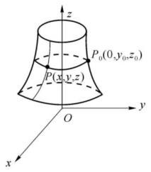
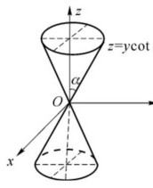
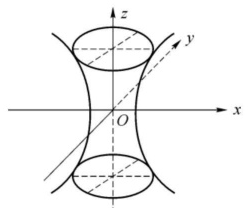
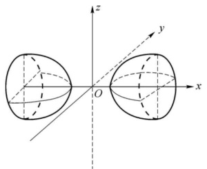
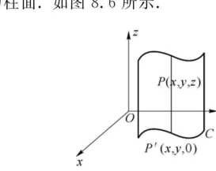
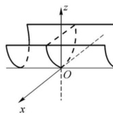

import ExerciseTrigger from '@/components/exercises/ExerciseTrigger.astro';

import Guide from '@/components/Guide.astro';
import Knowledge from '@/components/Knowledge.astro';
import Example from '@/components/Example.astro';
import Analysis from '@/components/Analysis.astro';
import Solution from '@/components/Solution.astro';
import Variant from '@/components/Variant.astro';
import Note from '@/components/Note.astro';
import SideNote from '@/components/SideNote.astro';
import Block from '@/components/Block.astro';
import Method from '@/components/Method.astro';
import Exercise from '@/components/Exercise.astro';

建立了空间直角坐标系以后，我们可以用代数的方法来研究空间的几何图形。本章将利用二次型在正交变换下的标准形，对空间的二次曲面进行分类，同时简单介绍几类常见的空间曲面与曲线。

## 一、空间曲面的方程

在平面解析几何中，用一个二元方程 $f(x, y) = 0$ 来表示平面上的一条曲线，这个方程体现了曲线上任意点 $(x, y)$ 的横、纵坐标之间的对应关系。在空间建立了直角坐标系以后，空间的每一个点都有了坐标，对空间的一张曲面 $S$，$S$ 上任意点 $(x, y, z)$ 的坐标之间也有对应关系，当 $x$ 与 $y$ 给定后，$z$ 随之也确定了。这种对应关系可以用一个三元方程 $F(x, y, z) = 0$ 来表示。因此用一个三元方程 $F(x, y, z) = 0$ 来表示空间的一张曲面。

<Knowledge title="定义 8.1 空间曲面及其方程">

设曲面 $S$ 与三元方程 $F(x, y, z) = 0$ 有下述关系：

(1) 曲面 $S$ 上每一点的坐标 $(x, y, z)$ 都满足方程 $F(x, y, z) = 0$；

(2) 满足方程 $F(x, y, z) = 0$ 的点 $(x, y, z)$ 都在曲面 $S$ 上，

则称方程 $F(x, y, z) = 0$ 为曲面 $S$ 的方程，曲面 $S$ 称为方程 $F(x, y, z) = 0$ 的图形。即

$$
\text{点 } (x, y, z) \text{ 在曲面 } S \text{ 上} \iff (x, y, z) \text{ 满足方程 } F(x, y, z) = 0.
$$

</Knowledge>

关于空间曲面的研究，有两个基本问题。第一是已知某个曲面，去建立这个曲面的方程；第二是已知某个方程，去研究这个方程的图形。

<Example title="例 1 球面的标准方程与一般方程">

建立球心在点 $M_0(x_0, y_0, z_0)$，半径为 $R$ 的球面的方程。

</Example>

<Solution title="解">

易见空间点 $P(x, y, z)$ 在球面 $S$ 上

$$
\iff \sqrt{(x - x_0)^2 + (y - y_0)^2 + (z - z_0)^2} = R.
$$

所以 $S$ 的方程为

$$
(x - x_0)^2 + (y - y_0)^2 + (z - z_0)^2 = R^2. \tag{8.1}
$$

式 (8.1) 称为**球面的标准方程**。将式 (8.1) 展开，得到

$$
x^2 + y^2 + z^2 - 2x_0 x - 2y_0 y - 2z_0 z + x_0^2 + y_0^2 + z_0^2 - R^2 = 0.
$$

这是一个 $x, y, z$ 的二次方程，其特点是 $x^2, y^2, z^2$ 的系数都相等，且不出现交叉乘积项 $xy, yz, zx$。

反之，任给一个具有上述特点的二次方程

$$
x^2 + y^2 + z^2 + 2ax + 2by + 2cz + d = 0,
$$

经过配方，方程可化为

$$
(x + a)^2 + (y + b)^2 + (z + c)^2 = a^2 + b^2 + c^2 - d.
$$

(1) 当 $a^2 + b^2 + c^2 - d > 0$ 时，这个方程的图形是以 $(-a, -b, -c)$ 为球心，半径为 $R = \sqrt{a^2 + b^2 + c^2 - d}$ 的球面；

(2) 当 $a^2 + b^2 + c^2 - d = 0$ 时，这个方程的图形为一个点 $(-a, -b, -c)$；

(3) 当 $a^2 + b^2 + c^2 - d < 0$ 时，方程不代表任何图形。

</Solution>

## 二、旋转曲面

<Knowledge title="定义 8.2 旋转曲面、母线与旋转轴">

平面曲线 $C$ 绕该平面内的直线 $L$ 旋转一周所形成的曲面称为**旋转曲面**。$C$ 与 $L$ 分别称为旋转曲面的**母线**和**旋转轴**。

</Knowledge>

设在 $yOz$ 坐标面上有一已知曲线 $C$，它的方程为 $f(y, z) = 0, y \geqslant 0$。将这条曲线绕 $z$ 轴旋转一周，得到旋转曲面 $S$，下面建立 $S$ 的方程。

如图 8.1 所示，任取 $S$ 上的点 $P(x, y, z)$，设 $P$ 是由曲线 $C$ 上的点 $P_0(0, y_0, z_0)$ 绕 $z$ 轴旋转得到的，则 $z = z_0$ 且 $P$ 与 $P_0$ 到 $z$ 轴的距离相等，即 $y_0^2 = x^2 + y^2$。因为点 $P_0(0, y_0, z_0)$ 在 $C$ 上，所以 $f(y_0, z_0) = 0$，且 $y_0 \geqslant 0$，代入 $y_0 = \sqrt{x^2 + y^2}, z_0 = z$，得

$$
f\left(\sqrt{x^2 + y^2}, z\right) = 0,
$$

即点 $P(x, y, z)$ 满足方程 $f\left(\sqrt{x^2 + y^2}, z\right) = 0$。

反之，若空间的点 $P(x, y, z)$ 满足方程 $f\left(\sqrt{x^2 + y^2}, z\right) = 0$，设点 $P$ 绕 $z$ 轴旋转到 $yOz$ 坐标面的右半平面（即 $y \geqslant 0$）上时，对应的点为 $P_0(0, y_0, z_0)$ ($y_0 \geqslant 0$)，则 $y_0 = \sqrt{x^2 + y^2}$ 且 $z_0 = z$，这说明 $P_0(0, y_0, z_0)$ 满足 $f(y_0, z_0) = 0$，即 $P_0$ 在曲线 $C$ 上，因此点 $P$ 在旋转曲面 $S$ 上。

总之，旋转曲面 $S$ 的方程为

$$
f\left(\sqrt{x^2 + y^2}, z\right) = 0.
$$

不难发现，若曲线 $C$ 的方程为 $f(y, z) = 0, y \leqslant 0$，则旋转曲面的方程为 $f\left(-\sqrt{x^2 + y^2}, z\right) = 0$。

<figure class="vp-figure">
  
  <figcaption>图 8.1 曲线绕坐标轴旋转形成旋转曲面</figcaption>
</figure>

<Example title="例 2 圆锥面的方程">

直线 $L$ 绕另一条与 $L$ 相交的直线旋转一周，所得旋转面称为圆锥面。两直线的交点称为圆锥面的顶点。两直线的夹角 $\alpha \left(0 < \alpha < \frac{\pi}{2}\right)$ 称为圆锥面的半顶角。试建立顶点在坐标原点 $O$，旋转轴为 $z$ 轴，半顶角为 $\alpha$ 的圆锥面的方程。

</Example>

<Solution title="解">

如图 8.2 所示，在 $yOz$ 平面上，直线 $L$ 的方程为 $z = y \cot\alpha$。

当 $y \geqslant 0$ 时，射线 $z = y \cot\alpha$ 绕 $z$ 轴旋转，所得旋转面的方程为

$$
z = \sqrt{x^2 + y^2} \cot\alpha;
$$

当 $y \leqslant 0$ 时，射线 $z = y \cot\alpha$ 绕 $z$ 轴旋转，所得旋转面的方程为

$$
z = -\sqrt{x^2 + y^2} \cot\alpha.
$$

因此，所求圆锥面的方程为

$$
z^2 = (x^2 + y^2)\cot^2\alpha.
$$

</Solution>

<figure class="vp-figure">
  
  <figcaption>图 8.2 圆锥面</figcaption>
</figure>

<Example title="例 3 旋转双曲面的方程">

将 $xOz$ 坐标面上的双曲线 $\frac{x^2}{a^2} - \frac{z^2}{c^2} = 1$ 分别绕 $z$ 轴和 $x$ 轴旋转一周，求所形成的旋转曲面的方程。

</Example>

<Solution title="解">

对于绕 $z$ 轴旋转的情形，如图 8.3 所示，不妨只考虑 $xOz$ 坐标面上的单支双曲线 $\frac{x^2}{a^2} - \frac{z^2}{c^2} = 1$ ($x \geqslant 0$) 绕 $z$ 轴旋转一周，所形成的旋转曲面（称为**单叶双曲面**）方程为

$$
\frac{\left(\sqrt{x^2 + y^2}\right)^2}{a^2} - \frac{z^2}{c^2} = 1,
$$

即

$$
\frac{x^2 + y^2}{a^2} - \frac{z^2}{c^2} = 1.
$$

对绕 $x$ 轴旋转的情形，如图 8.4 所示，不妨只考虑 $xOz$ 坐标面上双曲线 $\frac{x^2}{a^2} - \frac{z^2}{c^2} = 1$ 中 $z \geqslant 0$ 的部分绕 $x$ 轴旋转一周，所形成的旋转曲面（称为**双叶双曲面**）方程为

$$
\frac{x^2}{a^2} - \frac{\left(\sqrt{y^2 + z^2}\right)^2}{c^2} = 1,
$$

即

$$
\frac{x^2}{a^2} - \frac{y^2 + z^2}{c^2} = 1.
$$

</Solution>

<figure class="vp-figure">
  
  <figcaption>图 8.3 旋转单叶双曲面</figcaption>
</figure>

<figure class="vp-figure">
  
  <figcaption>图 8.4 旋转双叶双曲面</figcaption>
</figure>

## 三、柱面

<Knowledge title="定义 8.3 柱面、准线与母线">

设 $C$ 为空间的一条曲线，动直线 $L$ 沿着 $C$ 平行移动形成的曲面称为**柱面**。曲线 $C$ 称为柱面的**准线**，动直线 $L$ 称为柱面的**母线**。

</Knowledge>

设柱面 $S$ 的母线平行于 $z$ 轴，准线是 $xOy$ 平面上的曲线 $C: F(x, y) = 0$。我们来建立 $S$ 的方程。

如图 8.5 所示，任取柱面 $S$ 上的点 $P(x, y, z)$，因为柱面的母线平行于 $z$ 轴，所以 $P(x, y, z)$ 在 $xOy$ 平面上的投影点 $P'(x, y, 0)$ 在准线 $C$ 上。即 $F(x, y) = 0$。

反之，若空间中的点 $P(x, y, z)$ 满足方程 $F(x, y) = 0$，则 $P(x, y, z)$ 在 $xOy$ 平面上的投影点 $P'(x, y, 0)$ 在准线 $C$ 上，于是点 $P(x, y, z)$ 在柱面上。因此，柱面 $S$ 的方程为 $F(x, y) = 0$，这是一个不含变量 $z$ 的方程。

那么对于任意一个不含变量 $z$ 的方程 $F(x, y) = 0$，方程代表怎样的曲面呢？

因为方程中不出现 $z$，这意味着对曲面上的点的竖坐标没有任何限制。任取 $xOy$ 平面上的曲线 $C: F(x, y) = 0$ 上的点 $P'(x, y, 0)$，点 $P'$ 平行于 $z$ 轴上下移动得到的点都在曲面上，因此曲面是由动直线 $L$ 沿着 $xOy$ 平面上的曲线 $C$，平行于 $z$ 轴移动形成的，也就是说，曲面是以 $xOy$ 平面上的 $C: F(x, y) = 0$ 为准线，母线平行于 $z$ 轴的柱面。

完全类似，一个不含变量 $x$（或 $y$）的方程，其图形是母线平行于 $x$ 轴（或 $y$ 轴）的柱面。

例如，方程 $x^2 - 2z = 0$ 代表以 $xOz$ 平面上的抛物线 $x^2 - 2z = 0$ 为准线，母线平行于 $y$ 轴的抛物柱面。如图 8.6 所示。

<figure class="vp-figure">
  
  <figcaption>图 8.5 柱面与准线、母线</figcaption>
</figure>

<figure class="vp-figure">
  
  <figcaption>图 8.6 抛物柱面</figcaption>
</figure>

<ExerciseTrigger chapter={8} section="8.1" title="8.1 空间曲面及其方程 课后真题与自测练习" />
