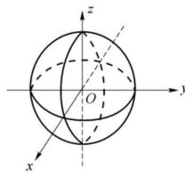
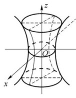
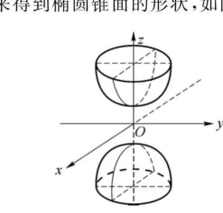
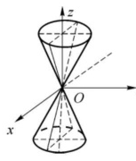
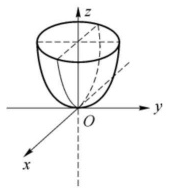
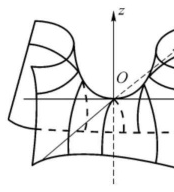

import ExerciseTrigger from '@/components/exercises/ExerciseTrigger.astro';

import Guide from '@/components/Guide.astro';
import Knowledge from '@/components/Knowledge.astro';
import Example from '@/components/Example.astro';
import Analysis from '@/components/Analysis.astro';
import Solution from '@/components/Solution.astro';
import Variant from '@/components/Variant.astro';
import Note from '@/components/Note.astro';
import SideNote from '@/components/SideNote.astro';
import Block from '@/components/Block.astro';
import Method from '@/components/Method.astro';
import Exercise from '@/components/Exercise.astro';

三元二次方程 $F(x, y, z) = 0$ 代表的曲面称为**二次曲面**。其中

$$
F(x, y, z) = a_{11}x^2 + a_{22}y^2 + a_{33}z^2 + 2a_{12}xy + 2a_{13}xz + 2a_{23}yz + 2ax + 2by + 2cz + d
$$

（二次项系数不全为零）。为了研究二次曲面的形状，需要适当地选择空间直角坐标系，将二次曲面的方程进行化简。

<Example title="例 4* 利用正交变换与坐标平移化简二次曲面方程">

化简方程

$$
x^2 + 2y^2 + 2z^2 - 4yz - 2x + 2\sqrt{2}y - 6\sqrt{2}z + 5 = 0.
$$

</Example>

<Solution title="解">

先用正交变换将二次型 $f(x, y, z) = x^2 + 2y^2 + 2z^2 - 4yz$ 化为标准形。

$$
f(x, y, z) = (x, y, z)
\begin{pmatrix}
1 & 0 & 0 \\
0 & 2 & -2 \\
0 & -2 & 2
\end{pmatrix}
\begin{pmatrix}
x \\
y \\
z
\end{pmatrix},
$$

令 $\boldsymbol{x} = \begin{pmatrix} x \\ y \\ z \end{pmatrix}$，$\boldsymbol{A} = \begin{pmatrix} 1 & 0 & 0 \\ 0 & 2 & -2 \\ 0 & -2 & 2 \end{pmatrix}$，则 $f(x, y, z) = \boldsymbol{x}^\mathrm{T} \boldsymbol{A} \boldsymbol{x}$。

求 $\boldsymbol{A}$ 的特征值及相应的特征向量，得到

$$
\lambda_1 = 1, \; \boldsymbol{p}_1 = (1, 0, 0)^\mathrm{T}; \quad \lambda_2 = 4, \; \boldsymbol{p}_2 = (0, 1, -1)^\mathrm{T}; \quad \lambda_3 = 0, \; \boldsymbol{p}_3 = (0, 1, 1)^\mathrm{T}.
$$

因为 $\boldsymbol{A}$ 的特征值两两不相等，所以 $\boldsymbol{p}_1, \boldsymbol{p}_2, \boldsymbol{p}_3$ 两两正交。取

$$
\boldsymbol{O} = \left(\frac{\boldsymbol{p}_1}{\|\boldsymbol{p}_1\|}, \frac{\boldsymbol{p}_2}{\|\boldsymbol{p}_2\|}, \frac{\boldsymbol{p}_3}{\|\boldsymbol{p}_3\|}\right) =
\begin{pmatrix}
1 & 0 & 0 \\
0 & \frac{1}{\sqrt{2}} & \frac{1}{\sqrt{2}} \\
0 & -\frac{1}{\sqrt{2}} & \frac{1}{\sqrt{2}}
\end{pmatrix},
\quad \text{则 }
\boldsymbol{O}^\mathrm{T}\boldsymbol{A}\boldsymbol{O} =
\begin{pmatrix}
1 & 0 & 0 \\
0 & 4 & 0 \\
0 & 0 & 0
\end{pmatrix}.
$$

做正交变换 $\boldsymbol{x} = \boldsymbol{O}\boldsymbol{y}$，其中 $\boldsymbol{y} = (x_1, y_1, z_1)^\mathrm{T}$，即

$$
\begin{cases}
x = x_1, \\
y = \frac{1}{\sqrt{2}}(y_1 + z_1), \\
z = \frac{1}{\sqrt{2}}(z_1 - y_1),
\end{cases}
$$

则

$$
f = x_1^2 + 4y_1^2,
$$

原方程化为

$$
x_1^2 + 4y_1^2 - 2x_1 + 8y_1 - 4z_1 + 5 = 0.
$$

<SideNote title="几何注记：正交变换与新坐标轴">
上面的正交变换，相当于将原来的直角坐标系变成以 $x_1, y_1, z_1$ 为坐标变量的新坐标系。原来的向量 $(1, 0, 0)^\mathrm{T}, \left(0, \frac{1}{\sqrt{2}}, -\frac{1}{\sqrt{2}}\right)^\mathrm{T}, \left(0, \frac{1}{\sqrt{2}}, \frac{1}{\sqrt{2}}\right)^\mathrm{T}$ 分别变成了新坐标系下的 $x_1$ 轴、$y_1$ 轴、$z_1$ 轴的正向单位向量。
</SideNote>

继续配方，得 $(x_1 - 1)^2 + 4(y_1 + 1)^2 - 4z_1 = 0$。令

$$
\begin{cases}
x_2 = x_1 - 1, \\
y_2 = y_1 + 1, \\
z_2 = z_1,
\end{cases}
$$

得化简后的方程为

$$
\frac{x_2^2}{4} + y_2^2 = z_2.
$$

<SideNote title="几何注记：坐标平移">
上述从 $x_1, y_1, z_1$ 到 $x_2, y_2, z_2$ 的变换并不是线性变换，而是一个坐标系的平移，即将 $x_1, y_1, z_1$ 坐标系中的点 $(1, -1, 0)$ 作为新的 $x_2, y_2, z_2$ 坐标系的原点，而 $x_2, y_2, z_2$ 轴的方向分别与原来 $x_1, y_1, z_1$ 轴的方向相同。
</SideNote>

</Solution>

<Example title="例 5* 二次曲面方程的进一步化简">

化简方程

$$
x^2 + 2x + 2y + z + \sqrt{5} + 1 = 0.
$$

</Example>

<Solution title="解">

方程中的二次项部分已是标准形。将方程配方，得

$$
(x + 1)^2 + 2y + z + \sqrt{5} = 0.
$$

做正交变换

$$
\begin{cases}
x_1 = x, \\
y_1 = \frac{1}{\sqrt{5}}(2y + z), \\
z_1 = \frac{1}{\sqrt{5}}(y - 2z),
\end{cases}
$$

则方程化为 $(x_1 + 1)^2 + \sqrt{5}y_1 + \sqrt{5} = 0$，即 $(x_1 + 1)^2 + \sqrt{5}(y_1 + 1) = 0$。

再做平移变换

$$
\begin{cases}
x_2 = x_1 + 1, \\
y_2 = y_1 + 1, \\
z_2 = z_1,
\end{cases}
$$

方程化简为

$$
x_2^2 + \sqrt{5}y_2 = 0.
$$

</Solution>

我们不做证明地指出，除无图形的或图形为一个点的三元二次方程外，其余的任意一个三元二次方程，总可以经过若干次的直角坐标变换，化简为下面的九种标准方程之一。这就是说，任何一个二次曲面，总可以在适当的直角坐标系下，化为其中的某一种标准方程所代表的曲面。以下分别讨论这九种标准方程所代表的二次曲面的形状。

## 二、二次曲面的九种标准形式

### 1. 椭球面

方程

$$
\frac{x^2}{a^2} + \frac{y^2}{b^2} + \frac{z^2}{c^2} = 1 \quad (a > 0, b > 0, c > 0) \tag{1}
$$

的图形称为**椭球面**，$a, b, c$ 称为椭球面的三个半轴。显然当 $a = b = c$ 时，方程 (1) 的图形为球心在原点，半径为 $a$ 的球面。

从方程 (1) 可以发现，椭球面关于原点，关于 $x$ 轴、$y$ 轴和 $z$ 轴，关于三个坐标面都是对称的。

下面用“截痕法”来了解椭球面的形状。所谓“截痕法”，就是用一组平行于坐标面的平面去截割曲面，得到曲面与平面的交线（称为**截痕**），通过这些截痕去推知曲面的形状。

用平面 $z = k$ 去截椭球面，截痕在平面 $z = k$ 上，方程为 $\frac{x^2}{a^2} + \frac{y^2}{b^2} = 1 - \frac{k^2}{c^2}$。

- 当 $|k| > c$ 时，平面 $z = k$ 与椭球面不相交；
- 当 $|k| = c$ 时，平面 $z = k$ 与椭球面相交于点 $(0, 0, k)$；
- 当 $|k| < c$ 时，截痕为平面 $z = k$ 上的椭圆

$$
\frac{x^2}{a^2\left(1 - \frac{k^2}{c^2}\right)} + \frac{y^2}{b^2\left(1 - \frac{k^2}{c^2}\right)} = 1.
$$

当 $k = 0$ 时，椭圆的半轴最大，随着 $|k|$ 逐渐增大（$|k| < c$），椭圆的半轴逐渐减小。类似可得其他两组与坐标面平行的截痕也是椭圆。综合起来得到椭球面的形状，如图 8.7 所示。

<figure class="vp-figure">
  
  <figcaption>图 8.7 椭球面</figcaption>
</figure>

### 2. 单叶双曲面

方程

$$
\frac{x^2}{a^2} + \frac{y^2}{b^2} - \frac{z^2}{c^2} = 1 \tag{2}
$$

的图形称为**单叶双曲面**。从方程 (2) 可以发现，单叶双曲面关于原点，关于 $x$ 轴、$y$ 轴和 $z$ 轴，关于三个坐标面都是对称的。

用平面 $z = k$ 去截单叶双曲面，截痕在平面 $z = k$ 上，方程为 $\frac{x^2}{a^2} + \frac{y^2}{b^2} = 1 + \frac{k^2}{c^2}$。

当 $k = 0$ 时，椭圆的半轴最短，是 $xOy$ 平面上的椭圆 $\frac{x^2}{a^2} + \frac{y^2}{b^2} = 1$，称为单叶双曲面的**腰椭圆**，随着 $|k|$ 的增大，椭圆的半轴变大。

单叶双曲面的平行于 $yOz$ 平面的截痕为平面 $x = k$ 上的双曲线 $\frac{y^2}{b^2} - \frac{z^2}{c^2} = 1 - \frac{k^2}{a^2}$ ($|k| \neq a$)；平行于 $xOz$ 平面的截痕为平面 $y = k$ 上的双曲线 $\frac{x^2}{a^2} - \frac{z^2}{c^2} = 1 - \frac{k^2}{b^2}$ ($|k| \neq b$)。

综合起来得到单叶双曲面的形状，如图 8.8 所示。

<figure class="vp-figure">
  
  <figcaption>图 8.8 单叶双曲面</figcaption>
</figure>

### 3. 双叶双曲面

方程

$$
\frac{x^2}{a^2} + \frac{y^2}{b^2} - \frac{z^2}{c^2} = -1 \tag{3}
$$

的图形称为**双叶双曲面**。从方程 (3) 可以发现，双叶双曲面关于原点，关于 $x$ 轴、$y$ 轴和 $z$ 轴，关于三个坐标面都是对称的。

用平面 $z = k$ 去截双叶双曲面，截痕在平面 $z = k$ 上，方程为 $\frac{x^2}{a^2} + \frac{y^2}{b^2} = \frac{k^2}{c^2} - 1$。

- 当 $|k| < c$ 时，平面 $z = k$ 与双叶双曲面不相交；
- 当 $|k| = c$ 时，平面 $z = k$ 与双叶双曲面交于点 $(0, 0, k)$；
- 当 $|k| > c$ 时，截痕为椭圆 $\frac{x^2}{a^2\left(\frac{k^2}{c^2} - 1\right)} + \frac{y^2}{b^2\left(\frac{k^2}{c^2} - 1\right)} = 1$，随着 $|k|$ 的增大，椭圆的半轴变大。

双叶双曲面的平行于 $yOz$ 平面的截痕为平面 $x = k$ 上的双曲线 $\frac{z^2}{c^2} - \frac{y^2}{b^2} = 1 + \frac{k^2}{a^2}$；平行于 $xOz$ 平面的截痕为平面 $y = k$ 上的双曲线 $\frac{z^2}{c^2} - \frac{x^2}{a^2} = 1 + \frac{k^2}{b^2}$。综合起来得到双叶双曲面的形状，如图 8.9 所示。

<figure class="vp-figure">
  
  <figcaption>图 8.9 双叶双曲面</figcaption>
</figure>

### 4. 椭圆锥面

方程

$$
\frac{x^2}{a^2} + \frac{y^2}{b^2} = z^2 \tag{4}
$$

的图形称为**椭圆锥面**。从方程 (4) 可以发现，椭圆锥面关于原点，关于 $x$ 轴、$y$ 轴和 $z$ 轴，关于三个坐标面都是对称的。

用平面 $z = k$ 去截椭圆锥面，截痕在平面 $z = k$ 上，方程为 $\frac{x^2}{a^2} + \frac{y^2}{b^2} = k^2$。

- 当 $k = 0$ 时，椭圆锥面与 $xOy$ 平面交于原点。
- 当 $k \neq 0$ 时，截痕为椭圆 $\frac{x^2}{a^2 k^2} + \frac{y^2}{b^2 k^2} = 1$，随着 $|k|$ 的增大，椭圆的半轴变大。

椭圆锥面的平行于 $yOz$ 平面的截痕为平面 $x = k$ 上的曲线 $z^2 - \frac{y^2}{b^2} = \frac{k^2}{a^2}$，当 $k = 0$ 时，椭圆锥面与 $yOz$ 平面交于两条直线 $z = \pm \frac{y}{b}$。

椭圆锥面的平行于 $xOz$ 平面的截痕为平面 $y = k$ 上的双曲线 $z^2 - \frac{x^2}{a^2} = \frac{k^2}{b^2}$ ($k \neq 0$)，当 $k = 0$ 时，椭圆锥面与 $xOz$ 平面交于两条直线 $z = \pm \frac{x}{a}$。

综合起来得到椭圆锥面的形状，如图 8.10 所示。

<figure class="vp-figure">
  
  <figcaption>图 8.10 椭圆锥面</figcaption>
</figure>

### 5. 椭圆抛物面

方程

$$
\frac{x^2}{a^2} + \frac{y^2}{b^2} = z \tag{5}
$$

的图形称为**椭圆抛物面**。从方程 (5) 可以发现，椭圆抛物面关于 $z$ 轴，关于 $yOz$ 平面，关于 $xOz$ 平面都是对称的。

用平面 $z = k$ 去截椭圆抛物面，截痕在平面 $z = k$ 上，方程为 $\frac{x^2}{a^2} + \frac{y^2}{b^2} = k$。

- 当 $k = 0$ 时，椭圆抛物面与 $xOy$ 平面交于原点；
- 当 $k > 0$ 时，截痕为椭圆 $\frac{x^2}{a^2 k} + \frac{y^2}{b^2 k} = 1$，随着 $k$ 的增大，椭圆的半轴增大；
- 当 $k < 0$ 时，椭圆抛物面与 $z = k$ 不相交。

椭圆抛物面的平行于 $yOz$ 平面的截痕为平面 $x = k$ 上的抛物线 $z = \frac{y^2}{b^2} + \frac{k^2}{a^2}$；平行于 $xOz$ 平面的截痕也是平面 $y = k$ 上的抛物线 $z = \frac{x^2}{a^2} + \frac{k^2}{b^2}$。

综合起来得到椭圆抛物面的形状，如图 8.11 所示。

<figure class="vp-figure">
  
  <figcaption>图 8.11 椭圆抛物面</figcaption>
</figure>

### 6. 双曲抛物面（马鞍面）

方程

$$
\frac{x^2}{a^2} - \frac{y^2}{b^2} = z \tag{6}
$$

的图形称为**双曲抛物面**，也称为**马鞍面**。从方程 (6) 可以发现，双曲抛物面关于 $z$ 轴，关于 $yOz$ 平面，关于 $xOz$ 平面都是对称的。

用平面 $z = k$ 去截双曲抛物面，截痕为平面 $z = k$ 上的双曲线 $\frac{x^2}{a^2} - \frac{y^2}{b^2} = k$ ($k \neq 0$)。当 $k > 0$ 时，双曲线的实轴平行于 $x$ 轴；当 $k < 0$ 时，双曲线的实轴平行于 $y$ 轴。

双曲抛物面与 $xOy$ 平面交于两条直线 $\frac{x}{a} \pm \frac{y}{b} = 0$。

用平面 $x = k$ 与 $y = k$ 去截割双曲抛物面，截痕都是抛物线。双曲抛物面与 $yOz$ 平面的交线为抛物线 $z = -\frac{y^2}{b^2}$，与 $xOz$ 平面的交线为抛物线 $z = \frac{x^2}{a^2}$。

综合起来可知，双曲抛物面的形状如图 8.12 所示。

<figure class="vp-figure">
  
  <figcaption>图 8.12 双曲抛物面（马鞍面）</figcaption>
</figure>

### 7. 椭圆柱面、双曲柱面与抛物柱面

$$
\frac{x^2}{a^2} + \frac{y^2}{b^2} = 1 \tag{7}
$$

$$
\frac{x^2}{a^2} - \frac{y^2}{b^2} = 1 \tag{8}
$$

$$
x^2 = ay \tag{9}
$$

方程 (7)、(8)、(9) 的图形依次称为**椭圆柱面**、**双曲柱面**、**抛物柱面**。柱面的形状在 8.1 节中已做讨论，这里不再赘述。

<ExerciseTrigger chapter={8} section="8.2" title="8.2 二次曲面及其分类 课后真题与自测练习" />
